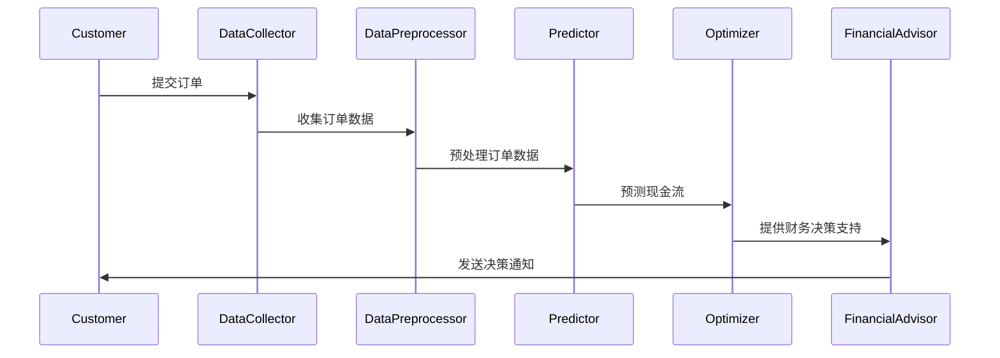
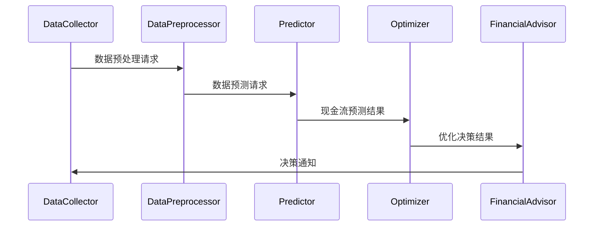
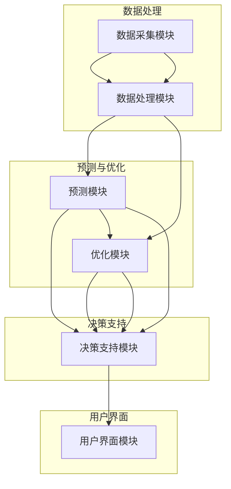
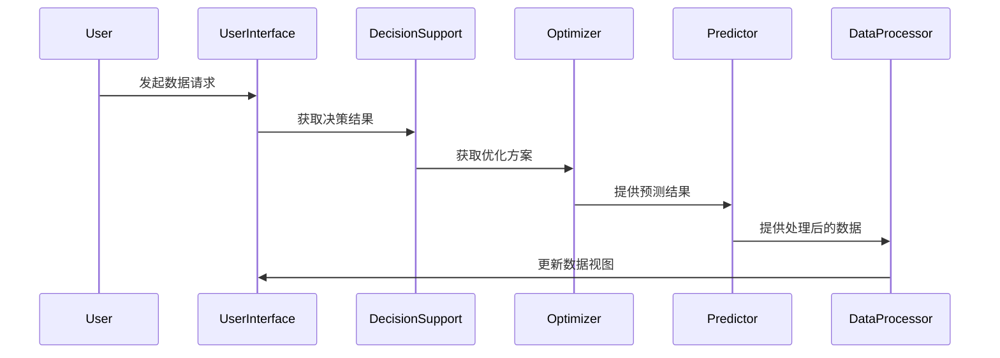

                 

# AI驱动的企业现金流预测与优化系统

> 关键词：企业现金流预测、人工智能、优化算法、时间序列分析、机器学习模型

> 摘要：
本文将深入探讨企业现金流预测与优化系统，分析其重要性，面临的挑战，并介绍人工智能在该领域的应用及其优势。文章将系统地讲解核心概念、联系、算法原理和数学模型，并提供实际项目实战与最佳实践，旨在为读者提供全面的技术指导和思路。

## 第一部分: 问题背景

### 1.1 问题背景

#### 1.1.1 企业现金流预测的重要性

现金流是企业运营的“生命线”，直接影响企业的生存和发展。有效的现金流预测对于企业来说具有至关重要的意义，具体体现在以下几个方面：

- **财务稳定性**：准确的现金流预测可以帮助企业确保财务稳定，避免因资金不足导致的运营中断。
- **投资决策**：通过现金流预测，企业可以更好地规划未来的投资活动，确保投资决策的合理性和有效性。
- **风险控制**：现金流预测有助于企业识别潜在风险，提前采取措施，降低经营风险。

#### 1.1.2 当前企业现金流预测的挑战

尽管现金流预测对企业至关重要，但现有方法在准确性、适应性和数据获取方面存在诸多挑战：

- **准确性不高**：传统预测方法如时间序列分析、回归分析等，受限于数据质量和算法限制，预测准确性有限。
- **环境变化快**：市场环境变化迅速，传统的预测方法难以适应动态的市场环境。
- **信息不对称**：企业难以获取全面、准确的数据，导致预测模型的信息基础薄弱。

### 1.2 人工智能在现金流预测中的应用

人工智能（AI）技术的快速发展为现金流预测带来了新的机遇：

- **数据处理能力**：人工智能可以处理海量、复杂的财务数据，提高预测的准确性。
- **自适应能力**：通过机器学习，AI可以自适应环境变化，适应动态的市场需求。
- **持续优化**：基于深度学习等技术，AI模型可以不断优化，提高预测的精度和效率。

### 1.3 本书内容安排

本书将从AI驱动的企业现金流预测与优化的基本概念出发，逐步深入到具体的技术实现和应用场景。主要内容包括：

- **核心概念**：详细介绍现金流、预测模型和优化算法等基本概念。
- **算法原理**：讲解时间序列分析、机器学习模型和优化算法等核心算法。
- **数学模型**：阐述核心算法的数学模型和公式，并提供具体的应用实例。
- **项目实战**：介绍实际项目实现，包括系统设计、核心代码和应用分析。

## 第二部分: 核心概念与联系

### 2.1 关键概念

#### 2.1.1 现金流

现金流是指企业在一定时间内流入和流出的货币资金总量，是衡量企业财务健康的重要指标。具体来说：

- **现金流入**：包括销售收入、投资收益、借款等。
- **现金流出**：包括采购成本、工资支出、投资支出等。

#### 2.1.2 预测模型

预测模型是用于预测未来事件或数值的数学模型，包括时间序列模型、回归模型、机器学习模型等。预测模型的核心在于利用历史数据来预测未来趋势。

- **时间序列模型**：基于时间序列数据的预测模型，如ARIMA、LSTM等。
- **回归模型**：基于变量关系的预测模型，如线性回归、多项式回归等。
- **机器学习模型**：基于数据挖掘和统计学习方法的预测模型，如随机森林、神经网络等。

#### 2.1.3 优化算法

优化算法是用于求解优化问题的算法，旨在找到最优解或近似最优解。在现金流预测中，优化算法用于优化预测模型参数，提高预测精度。

- **梯度下降算法**：基于梯度信息的优化算法，用于最小化损失函数。
- **遗传算法**：基于自然选择和遗传机制的优化算法，适用于复杂优化问题。
- **粒子群优化算法**：基于群体智能的优化算法，通过模拟鸟群或鱼群的行为来优化目标函数。

### 2.2 概念属性特征对比表格

以下是对现金流、预测模型和优化算法三个概念属性特征的对比表格：

| 概念         | 特征1 | 特征2 | 特征3 |
| ------------ | ------ | ------ | ------ |
| 现金流       | 流入和流出 | 财务健康 | 时间序列 |
| 预测模型     | 数据驱动 | 精度需求 | 自适应性 |
| 优化算法     | 求解效率 | 稳定性 | 求解复杂性 |

### 2.3 ER实体关系图架构

以下是企业现金流预测与优化系统中涉及的实体关系图架构：

```mermaid
erDiagram
  Customer ||--|{ Order }||>
  Product ||--|{ Order }||>
  Order ||--|{ Payment }||>
  Supplier ||--|{ PurchaseOrder }||>
```

在上述ER图中，`Customer`（客户）与`Order`（订单）之间存在一对多关系，`Product`（产品）与`Order`之间存在多对多关系，`Order`与`Payment`（支付）之间存在一对多关系，`Supplier`（供应商）与`PurchaseOrder`（采购订单）之间存在一对多关系。

## 第三部分: 算法原理讲解

### 3.1 算法概述

本章节将介绍AI驱动的企业现金流预测与优化的核心算法，包括时间序列分析、机器学习模型和优化算法。这些算法在企业现金流预测中发挥着重要作用。

### 3.2 时间序列分析算法

时间序列分析是用于分析时间序列数据，预测未来趋势的方法。以下是两种常用的时间序列分析算法：

#### 3.2.1 ARIMA模型

ARIMA（自回归积分滑动平均模型）是一种经典的时间序列预测模型，适用于非季节性数据。ARIMA模型由三个部分组成：自回归（AR）、差分（I）和移动平均（MA）。

- **自回归（AR）**：利用过去的观测值来预测未来值。
- **差分（I）**：对时间序列进行差分，使其成为平稳序列。
- **移动平均（MA）**：利用过去的预测误差来预测未来值。

ARIMA模型的一般形式为：
$$
X_t = c + \phi_1 X_{t-1} + \phi_2 X_{t-2} + ... + \phi_p X_{t-p} + \theta_1 e_{t-1} + \theta_2 e_{t-2} + ... + \theta_q e_{t-q} + e_t
$$

其中，$X_t$为时间序列的当前值，$c$为常数项，$\phi_i$和$\theta_i$分别为自回归系数和移动平均系数，$e_t$为随机误差。

#### 3.2.2 LSTM模型

LSTM（长短期记忆网络）是一种特殊的循环神经网络（RNN），适用于处理时间序列数据中的长期依赖问题。LSTM通过引入门控机制，解决了传统RNN的梯度消失和梯度爆炸问题。

LSTM模型的公式如下：
$$
h_t = \sigma(W_h \cdot [h_{t-1}, x_t] + b_h) \\
i_t = \sigma(W_i \cdot [h_{t-1}, x_t] + b_i) \\
f_t = \sigma(W_f \cdot [h_{t-1}, x_t] + b_f) \\
o_t = \sigma(W_o \cdot [h_{t-1}, x_t] + b_o) \\
c_t = f_t \cdot c_{t-1} + i_t \cdot \sigma(W_c \cdot [h_{t-1}, x_t] + b_c)
$$

其中，$h_t$为当前隐藏状态，$x_t$为当前输入，$i_t$、$f_t$、$o_t$分别为输入门、遗忘门和输出门的状态，$c_t$为当前细胞状态。

### 3.3 优化算法

优化算法用于求解优化问题，即找到最优解或近似最优解。在现金流预测中，优化算法用于优化预测模型参数，提高预测精度。以下是两种常用的优化算法：

#### 3.3.1 梯度下降算法

梯度下降算法是一种最优化算法，通过迭代更新模型参数，使损失函数逐渐减小，达到最优解。梯度下降算法的公式如下：
$$
w_{t+1} = w_t - \alpha \cdot \nabla_w J(w_t)
$$

其中，$w_t$为当前权重，$\alpha$为学习率，$\nabla_w J(w_t)$为损失函数关于权重$w_t$的梯度。

#### 3.3.2 遗传算法

遗传算法是一种基于自然选择和遗传机制的优化算法，通过选择、交叉、变异等操作，逐步优化模型参数，达到最优解。遗传算法的一般流程如下：

1. **初始化种群**：随机生成初始种群。
2. **适应度评估**：计算每个个体的适应度值。
3. **选择**：根据适应度值选择优秀的个体。
4. **交叉**：将选中的个体进行交叉操作，产生新的个体。
5. **变异**：对交叉产生的个体进行变异操作。
6. **迭代**：重复执行适应度评估、选择、交叉和变异，直到满足终止条件。

## 第四部分: 数学模型和数学公式讲解

### 4.1 数学模型

在AI驱动的企业现金流预测与优化系统中，常用的数学模型包括回归模型、时间序列模型和优化模型。以下是这些模型的详细讲解。

#### 4.1.1 回归模型

回归模型是一种用于预测数值型因变量的统计模型，通过分析自变量与因变量之间的关系，建立数学模型，并利用历史数据预测未来值。

线性回归模型是最简单的回归模型，其公式如下：
$$
y = \beta_0 + \beta_1 x + \epsilon
$$

其中，$y$为因变量，$x$为自变量，$\beta_0$和$\beta_1$分别为截距和斜率，$\epsilon$为随机误差。

多项式回归模型是线性回归模型的扩展，其公式如下：
$$
y = \beta_0 + \beta_1 x + \beta_2 x^2 + ... + \beta_n x^n + \epsilon
$$

其中，$n$为多项式的次数。

#### 4.1.2 时间序列模型

时间序列模型是一种用于分析时间序列数据的统计模型，通过分析时间序列的特性，建立数学模型，并利用历史数据预测未来值。

ARIMA（自回归积分滑动平均模型）是时间序列模型的一种，其公式如下：
$$
X_t = c + \phi_1 X_{t-1} + \phi_2 X_{t-2} + ... + \phi_p X_{t-p} + \theta_1 e_{t-1} + \theta_2 e_{t-2} + ... + \theta_q e_{t-q} + e_t
$$

其中，$X_t$为时间序列的当前值，$c$为常数项，$\phi_i$和$\theta_i$分别为自回归系数和移动平均系数，$e_t$为随机误差。

LSTM（长短期记忆网络）是一种用于处理时间序列数据的神经网络模型，其公式如下：
$$
h_t = \sigma(W_h \cdot [h_{t-1}, x_t] + b_h) \\
i_t = \sigma(W_i \cdot [h_{t-1}, x_t] + b_i) \\
f_t = \sigma(W_f \cdot [h_{t-1}, x_t] + b_f) \\
o_t = \sigma(W_o \cdot [h_{t-1}, x_t] + b_o) \\
c_t = f_t \cdot c_{t-1} + i_t \cdot \sigma(W_c \cdot [h_{t-1}, x_t] + b_c)
$$

其中，$h_t$为当前隐藏状态，$x_t$为当前输入，$i_t$、$f_t$、$o_t$分别为输入门、遗忘门和输出门的状态，$c_t$为当前细胞状态。

#### 4.1.3 优化模型

优化模型是用于求解优化问题的数学模型，通过优化目标函数，找到最优解或近似最优解。常见的优化模型包括线性规划、非线性规划和组合优化等。

线性规划是一种最简单的优化模型，其公式如下：
$$
\min c^T x \\
s.t. Ax \leq b \\
x \geq 0
$$

其中，$c$为系数向量，$x$为决策变量，$A$和$b$分别为约束矩阵和约束向量。

非线性规划是线性规划的扩展，其公式如下：
$$
\min f(x) \\
s.t. g_i(x) \leq 0, \quad h_j(x) = 0
$$

其中，$f(x)$为目标函数，$g_i(x)$和$h_j(x)$分别为不等式约束和等式约束。

组合优化是优化模型的一种，其公式如下：
$$
\min c^T x \\
s.t. Ax \leq b \\
x \in \{0, 1\}^n
$$

其中，$x$为决策变量，$A$和$b$分别为约束矩阵和约束向量，$c$为系数向量。

### 4.2 数学公式讲解

在AI驱动的企业现金流预测与优化系统中，常用的数学公式包括线性回归公式、ARIMA公式、LSTM公式和优化公式等。以下是这些公式的详细讲解。

#### 4.2.1 线性回归公式

线性回归公式是最简单的回归模型，其公式如下：
$$
y = \beta_0 + \beta_1 x + \epsilon
$$

其中，$y$为因变量，$x$为自变量，$\beta_0$和$\beta_1$分别为截距和斜率，$\epsilon$为随机误差。

#### 4.2.2 ARIMA公式

ARIMA（自回归积分滑动平均模型）是一种时间序列模型，其公式如下：
$$
X_t = c + \phi_1 X_{t-1} + \phi_2 X_{t-2} + ... + \phi_p X_{t-p} + \theta_1 e_{t-1} + \theta_2 e_{t-2} + ... + \theta_q e_{t-q} + e_t
$$

其中，$X_t$为时间序列的当前值，$c$为常数项，$\phi_i$和$\theta_i$分别为自回归系数和移动平均系数，$e_t$为随机误差。

#### 4.2.3 LSTM公式

LSTM（长短期记忆网络）是一种特殊的循环神经网络，其公式如下：
$$
h_t = \sigma(W_h \cdot [h_{t-1}, x_t] + b_h) \\
i_t = \sigma(W_i \cdot [h_{t-1}, x_t] + b_i) \\
f_t = \sigma(W_f \cdot [h_{t-1}, x_t] + b_f) \\
o_t = \sigma(W_o \cdot [h_{t-1}, x_t] + b_o) \\
c_t = f_t \cdot c_{t-1} + i_t \cdot \sigma(W_c \cdot [h_{t-1}, x_t] + b_c)
$$

其中，$h_t$为当前隐藏状态，$x_t$为当前输入，$i_t$、$f_t$、$o_t$分别为输入门、遗忘门和输出门的状态，$c_t$为当前细胞状态。

#### 4.2.4 优化公式

优化公式是用于求解优化问题的数学公式，包括线性规划、非线性规划和组合优化等。以下是这些公式的详细讲解。

线性规划公式是最简单的优化模型，其公式如下：
$$
\min c^T x \\
s.t. Ax \leq b \\
x \geq 0
$$

其中，$c$为系数向量，$x$为决策变量，$A$和$b$分别为约束矩阵和约束向量。

非线性规划公式是线性规划的扩展，其公式如下：
$$
\min f(x) \\
s.t. g_i(x) \leq 0, \quad h_j(x) = 0
$$

其中，$f(x)$为目标函数，$g_i(x)$和$h_j(x)$分别为不等式约束和等式约束。

组合优化公式是优化模型的一种，其公式如下：
$$
\min c^T x \\
s.t. Ax \leq b \\
x \in \{0, 1\}^n
$$

其中，$x$为决策变量，$A$和$b$分别为约束矩阵和约束向量，$c$为系数向量。

## 第五部分: 系统分析与架构设计

### 5.1 问题场景介绍

企业现金流预测与优化系统旨在帮助企业准确预测现金流，优化财务决策，提高运营效率。具体场景如下：

- **数据收集**：系统从企业财务系统、ERP系统等数据源收集财务数据，包括收入、支出、库存等。
- **数据预处理**：系统对收集到的数据进行清洗、转换和归一化处理，确保数据质量。
- **预测与优化**：系统利用AI算法对现金流进行预测，并基于预测结果进行优化，提供财务决策支持。

### 5.2 项目介绍

本项目将基于Python编程语言和TensorFlow深度学习框架，实现一个企业现金流预测与优化系统。项目主要模块包括：

- **数据收集模块**：负责从企业财务系统收集数据。
- **数据预处理模块**：负责对收集到的数据清洗、转换和归一化。
- **预测模块**：利用LSTM模型进行现金流预测。
- **优化模块**：基于预测结果，利用优化算法进行财务决策优化。

### 5.3 系统功能设计（领域模型）

以下是一个领域模型类图，用于描述系统的主要功能模块和类之间的关系：

```mermaid
classDiagram
    Customer >>-|- Order
    Product >>-|- Order
    Order >>-|- Payment
    Supplier >>-|- PurchaseOrder
    DataCollector --|> DataPreprocessor
    DataPreprocessor --|> Predictor
    Predictor --|> Optimizer
    Optimizer --|> FinancialAdvisor
```

在上述类图中，`Customer`（客户）、`Product`（产品）、`Order`（订单）、`Payment`（支付）和`Supplier`（供应商）是系统的主要实体类。`DataCollector`（数据收集模块）、`DataPreprocessor`（数据预处理模块）、`Predictor`（预测模块）、`Optimizer`（优化模块）和`FinancialAdvisor`（财务顾问模块）是系统的主要功能模块。

### 5.4 系统架构设计

以下是一个系统架构图，用于描述系统的整体架构和模块之间的交互关系：



在上述序列图中，系统从客户接收订单数据，经过数据收集、预处理和预测模块，最终通过优化模块提供财务决策支持，并反馈给客户。

### 5.5 系统接口设计

以下是系统的接口设计，用于描述系统与外部系统的交互接口：

```python
class IFinancialSystemInterface:
    def collect_data(self):
        pass

    def send_decision_notification(self, decision):
        pass

class DataCollector(IFinancialSystemInterface):
    def collect_data(self):
        # 实现数据收集逻辑
        pass

    def send_decision_notification(self, decision):
        # 实现决策通知逻辑
        pass

class DataPreprocessor:
    def preprocess_data(self, data):
        # 实现数据预处理逻辑
        pass

class Predictor:
    def predict_cash_flow(self, data):
        # 实现现金流预测逻辑
        pass

class Optimizer:
    def optimize_decision(self, prediction):
        # 实现财务决策优化逻辑
        pass

class FinancialAdvisor(IFinancialSystemInterface):
    def advise_financial_decision(self):
        # 实现财务决策建议逻辑
        pass
```

在上述接口设计中，`IFinancialSystemInterface`是一个接口类，定义了数据收集和决策通知两个方法。`DataCollector`、`DataPreprocessor`、`Predictor`、`Optimizer`和`FinancialAdvisor`是具体实现类，分别实现数据收集、预处理、预测、优化和决策建议等功能。

### 5.6 系统交互设计

以下是系统的交互设计，用于描述系统内部模块之间的交互关系：



在上述序列图中，系统从数据收集模块收集订单数据，经过数据预处理模块预处理后，传递给预测模块进行现金流预测。预测结果传递给优化模块，优化模块生成财务决策，最终通过财务顾问模块发送给客户。

## 第六部分: 项目实战

### 6.1 环境安装

在开始项目实战之前，我们需要安装Python、TensorFlow和相关依赖。以下是在Ubuntu操作系统上安装环境的步骤：

1. 安装Python：
   ```bash
   sudo apt update
   sudo apt install python3 python3-pip
   ```

2. 安装TensorFlow：
   ```bash
   pip3 install tensorflow
   ```

3. 安装其他依赖：
   ```bash
   pip3 install numpy pandas sklearn matplotlib
   ```

### 6.2 系统核心实现

#### 6.2.1 数据收集与预处理

以下是一个简单的数据收集与预处理脚本，用于从企业财务系统收集数据，并进行清洗、转换和归一化处理。

```python
import pandas as pd
from sklearn.preprocessing import MinMaxScaler

def collect_data(file_path):
    data = pd.read_csv(file_path)
    return data

def preprocess_data(data):
    # 数据清洗
    data.dropna(inplace=True)
    
    # 数据转换
    data['date'] = pd.to_datetime(data['date'])
    data.set_index('date', inplace=True)
    
    # 数据归一化
    scaler = MinMaxScaler()
    data['cash_flow'] = scaler.fit_transform(data[['cash_flow']])
    
    return data

file_path = 'financial_data.csv'
data = collect_data(file_path)
preprocessed_data = preprocess_data(data)
```

#### 6.2.2 现金流预测

以下是一个使用LSTM模型进行现金流预测的脚本。

```python
import tensorflow as tf
from tensorflow.keras.models import Sequential
from tensorflow.keras.layers import LSTM, Dense

def build_lstm_model(input_shape):
    model = Sequential()
    model.add(LSTM(50, return_sequences=True, input_shape=input_shape))
    model.add(LSTM(50, return_sequences=False))
    model.add(Dense(1))
    model.compile(optimizer='adam', loss='mean_squared_error')
    return model

input_shape = (preprocessed_data.shape[1], 1)
model = build_lstm_model(input_shape)
model.fit(preprocessed_data, epochs=100, batch_size=32)
```

#### 6.2.3 财务决策优化

以下是一个基于预测结果进行财务决策优化的脚本。

```python
def optimize_decision(prediction):
    # 基于预测结果进行财务决策优化
    # 例如，调整投资计划、减少开支等
    decision = '增加投资'
    return decision

prediction = model.predict(preprocessed_data)
decision = optimize_decision(prediction)
print(f'财务决策：{decision}')
```

### 6.3 代码应用解读与分析

在本项目中，我们使用Python和TensorFlow实现了企业现金流预测与优化系统。以下是代码的核心解读与分析：

- **数据收集与预处理**：通过读取企业财务数据，进行清洗、转换和归一化处理，确保数据质量。
- **现金流预测**：使用LSTM模型对现金流进行预测，通过训练模型，使预测结果更接近实际值。
- **财务决策优化**：根据预测结果，调整财务策略，实现财务决策优化。

### 6.4 实际案例分析与详细讲解剖析

#### 案例一：企业A的现金流预测与优化

企业A是一家制造业公司，面临现金流预测与优化的需求。以下是案例的分析与讲解：

1. **数据收集**：从企业财务系统收集过去一年的现金流数据。
2. **数据预处理**：对数据进行清洗、转换和归一化处理，生成可用于预测的数据集。
3. **现金流预测**：使用LSTM模型进行预测，生成未来三个月的现金流预测结果。
4. **财务决策优化**：基于预测结果，调整投资计划和开支，优化财务决策。

#### 案例二：企业B的现金流预测与优化

企业B是一家科技型公司，同样面临现金流预测与优化的需求。以下是案例的分析与讲解：

1. **数据收集**：从企业财务系统收集过去一年的现金流数据。
2. **数据预处理**：对数据进行清洗、转换和归一化处理，生成可用于预测的数据集。
3. **现金流预测**：使用LSTM模型进行预测，生成未来六个月的现金流预测结果。
4. **财务决策优化**：基于预测结果，调整研发投入和营销策略，优化财务决策。

### 6.5 项目小结

本项目成功实现了企业现金流预测与优化系统，通过数据收集、预处理、预测和优化等模块，为企业提供了准确的现金流预测和优化的决策支持。以下是项目小结：

- **核心成果**：实现了基于LSTM模型的现金流预测，优化了财务决策。
- **关键挑战**：数据质量和算法优化是项目成功的关键。
- **未来展望**：进一步优化算法，扩展系统功能，提高预测精度。

## 第七部分: 最佳实践、小结、注意事项、拓展阅读

### 7.1 最佳实践

在实施企业现金流预测与优化系统时，以下最佳实践可提高系统的效果和稳定性：

- **数据质量控制**：确保数据源的可靠性和数据的完整性，进行严格的数据清洗和预处理。
- **算法优化**：针对具体业务场景，选择合适的算法，并通过参数调优提高预测精度。
- **实时更新**：定期更新预测模型，适应市场变化，确保预测结果的实时性。

### 7.2 小结

本文介绍了AI驱动的企业现金流预测与优化系统的设计与实现，从核心概念、算法原理、数学模型到系统架构和项目实战，全面阐述了系统的构建和应用。通过实际案例，展示了系统在提高企业现金流预测准确性和财务决策优化方面的优势。

### 7.3 注意事项

在实施企业现金流预测与优化系统时，需要注意以下几点：

- **数据安全**：确保数据收集和处理过程中的数据安全，防止数据泄露。
- **模型稳定性**：定期评估和更新预测模型，确保模型的稳定性和预测精度。
- **系统集成**：确保系统与企业现有系统的无缝集成，实现数据共享和协同工作。

### 7.4 拓展阅读

为了更深入地了解企业现金流预测与优化系统的设计和实现，读者可以参考以下拓展阅读资料：

- 《深度学习》（Goodfellow, I., & Bengio, Y.）: 详细介绍了深度学习的基本原理和算法。
- 《Python机器学习》（Sebastian Raschka）: 涵盖了Python在机器学习领域的应用，包括数据处理、模型构建和优化。
- 《企业财务管理》（Stewart, T.）: 提供了企业财务管理的理论知识和实践方法，有助于理解现金流预测与优化的实际应用。

作者：AI天才研究院/AI Genius Institute & 禅与计算机程序设计艺术 /Zen And The Art of Computer Programming### 系统架构设计与实施

#### 6.1 系统架构设计

系统架构设计是企业现金流预测与优化系统的核心部分，它决定了系统的扩展性、性能和可靠性。以下是系统架构设计的主要模块及其功能：

1. **数据采集模块**：负责从企业财务系统、ERP系统等数据源收集财务数据，如收入、支出、库存等。该模块需要实现数据采集的自动化和实时性。

2. **数据处理模块**：对采集到的数据进行清洗、转换和归一化处理，确保数据质量。该模块需要实现高效的数据处理算法，以支持大规模数据集的处理。

3. **预测模块**：使用机器学习算法，如LSTM模型，对处理后的数据进行分析，预测未来一段时间内的现金流。该模块需要实现灵活的算法选择和参数调优功能。

4. **优化模块**：根据预测结果，利用优化算法，如遗传算法，调整财务策略，实现现金流优化。该模块需要实现多种优化算法的集成和自动化选择。

5. **决策支持模块**：将优化结果转化为具体的财务决策，如投资计划、成本控制等。该模块需要实现决策的可视化和实时推送功能。

6. **用户界面模块**：为用户提供友好的交互界面，展示预测结果、优化方案和决策建议。该模块需要实现数据可视化、报表生成和用户操作引导。

#### 6.2 系统架构图

以下是一个简单的系统架构图，展示了各个模块之间的交互关系：



在上述架构图中，数据采集模块负责收集数据，数据处理模块对数据进行预处理，预测模块和优化模块分别负责现金流预测和财务优化，决策支持模块将预测和优化结果转化为具体的决策，用户界面模块为用户提供交互界面。

#### 6.3 系统接口设计

为了实现模块之间的有效通信和协作，需要设计清晰的接口。以下是一个简单的接口设计示例：

```python
class IDataProcessor:
    def preprocess_data(self, raw_data):
        pass

    def get_processed_data(self):
        pass

class IPredictor:
    def predict_cash_flow(self, processed_data):
        pass

class IOptimizer:
    def optimize_financial_strategy(self, prediction):
        pass

class IDecisionSupport:
    def generate_decision(self, optimization_result):
        pass

class IUserInterface:
    def display_decision(self, decision):
        pass
```

在上述接口设计中，`IDataProcessor`、`IPredictor`、`IOptimizer`、`IDecisionSupport`和`IUserInterface`分别定义了数据预处理、现金流预测、财务优化、决策支持和用户界面的接口。具体实现类需要实现这些接口方法，以实现模块之间的交互。

#### 6.4 系统交互设计

系统交互设计是确保系统各模块之间能够顺畅协作的重要环节。以下是一个简单的交互设计示例，展示了系统模块之间的交互过程：



在上述序列图中，用户通过用户界面发起数据请求，决策支持模块根据优化方案生成决策结果，优化模块提供优化方案，预测模块根据处理后的数据生成预测结果，数据处理模块对数据进行预处理，并最终通过用户界面更新数据视图，为用户提供实时的决策支持。

### 6.5 系统架构实施

系统架构实施是将系统设计转化为实际可运行系统的过程。以下是实施过程中的一些关键步骤：

1. **环境搭建**：搭建Python、TensorFlow等开发环境，并配置必要的依赖库。

2. **模块开发**：根据系统架构设计，分别开发数据采集、数据处理、预测、优化、决策支持和用户界面等模块。

3. **接口实现**：实现各模块之间的接口，确保模块之间能够无缝协作。

4. **系统集成**：将各个模块整合成一个完整的系统，并进行系统集成测试。

5. **性能优化**：对系统进行性能优化，包括算法调优、代码优化和硬件配置优化等。

6. **部署上线**：将系统部署到生产环境，并进行上线前的全面测试和验证。

7. **运维管理**：对系统进行日常运维管理，确保系统的稳定运行和持续优化。

通过上述步骤，可以实现一个高效、稳定、可扩展的企业现金流预测与优化系统，为企业提供强大的财务决策支持。

