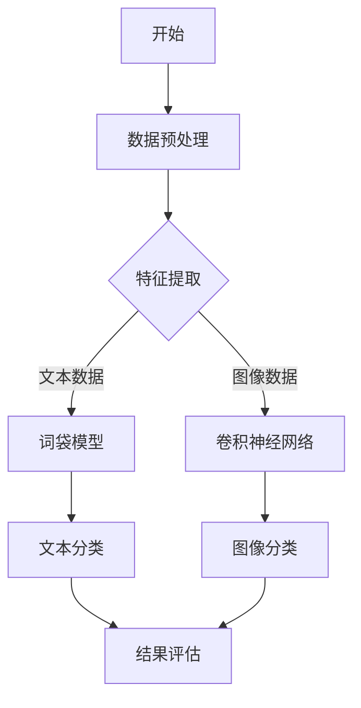

                 

### 第1章：背景介绍

#### 1.1 问题背景

在当今信息爆炸的时代，企业面临着海量的非结构化数据，如文本、图片、音频和视频等。这些数据蕴藏着巨大的商业价值，但如何从中提取并利用这些信息成为了企业急需解决的问题。传统的数据处理方法已经无法满足高效、准确的需求，因此，AI驱动的企业知识挖掘技术应运而生。

#### 1.2 问题描述

企业知识挖掘的目标是从非结构化数据中提取有价值的信息，从而支持决策制定、产品推荐、客户服务等多方面的业务需求。然而，非结构化数据具有以下特点，给知识挖掘带来了挑战：

- **多样性**：数据格式多种多样，包括文本、图片、音频和视频等。
- **复杂性**：数据之间存在复杂的关联，难以直接提取有价值的信息。
- **海量性**：数据量庞大，处理和存储都是巨大的挑战。

#### 1.3 问题解决

为了解决上述问题，AI驱动的企业知识挖掘利用了机器学习和深度学习算法，通过以下步骤实现：

1. **数据预处理**：对非结构化数据进行清洗、归一化等操作，使其适合机器学习算法。
2. **特征提取**：利用自然语言处理（NLP）技术、图像识别技术等提取数据特征。
3. **模型训练**：使用机器学习算法（如决策树、随机森林、支持向量机等）或深度学习算法（如卷积神经网络、循环神经网络等）训练模型。
4. **价值分析**：对提取的信息进行分类、聚类、预测等分析，提取有价值的信息。

#### 1.4 边界与外延

- **边界**：本文主要探讨AI驱动的企业知识挖掘技术，不包括结构化数据的处理方法。
- **外延**：虽然本文主要关注企业内部的知识挖掘，但AI驱动的知识挖掘技术同样可以应用于其他领域，如金融、医疗等。

#### 1.5 概念结构与核心要素组成

- **AI驱动的企业知识挖掘**：利用AI技术，从非结构化数据中提取有价值的信息。
- **非结构化数据**：文本、图片、音频、视频等不遵循固定结构的数据。
- **机器学习**：一种基于数据驱动的方法，通过训练模型从数据中学习规律。
- **深度学习**：一种特殊的机器学习技术，通过多层神经网络进行数据建模。

### 第2章：核心概念与联系

#### 2.1 AI概述

##### 2.1.1 AI的发展历程

AI的概念最早由约翰·麦卡锡（John McCarthy）在1956年提出，标志着人工智能作为一个学科正式诞生。自那时起，AI经历了几个重要阶段：

1. **符号人工智能（Symbolic AI）**：基于逻辑推理和符号表示，试图通过编写规则来模拟人类思维。
2. **感知人工智能（Perceptual AI）**：通过机器视觉、语音识别等技术，使机器能够感知和理解外部环境。
3. **行动人工智能（Acting AI）**：通过机器学习和控制理论，使机器能够自主行动并完成任务。
4. **认知人工智能（Cognitive AI）**：试图模拟人类认知过程，包括记忆、学习、推理等。

##### 2.1.2 AI的核心概念

- **机器学习（Machine Learning）**：一种通过数据训练模型，使其能够从数据中学习规律的方法。
- **深度学习（Deep Learning）**：一种基于多层神经网络进行数据建模的方法。
- **神经网络（Neural Networks）**：一种模拟生物神经系统的计算模型。
- **强化学习（Reinforcement Learning）**：一种通过奖励机制来训练模型的方法。

#### 2.2 企业知识挖掘

##### 2.2.1 企业知识挖掘的定义

企业知识挖掘是指利用AI技术，从企业内部和外部的非结构化数据中提取有价值的信息，以支持业务决策和优化。

##### 2.2.2 企业知识挖掘的重要性

- **提高决策效率**：通过挖掘和分析数据，为企业提供更准确、及时的决策支持。
- **优化业务流程**：帮助企业识别优化业务流程的机会，提高生产效率。
- **提升客户体验**：通过客户数据挖掘，提供个性化的产品和服务，提升客户满意度。

#### 2.3 AI与企业知识挖掘的联系

##### 2.3.1 联系点分析

- **数据来源**：企业知识挖掘依赖于大量的非结构化数据，而AI技术能够高效地处理这些数据。
- **算法应用**：AI技术提供了强大的算法支持，如机器学习和深度学习，可以用于企业知识挖掘的各个阶段。

##### 2.3.2 联系机制解析

- **数据预处理**：利用AI技术对非结构化数据进行预处理，如文本清洗、图像分割等。
- **特征提取**：通过自然语言处理（NLP）和图像识别技术，从数据中提取特征。
- **模型训练**：利用机器学习或深度学习算法，训练模型以提取有价值的信息。
- **价值分析**：对提取的信息进行分类、聚类、预测等分析，为企业提供决策支持。

### 第3章：AI驱动的企业知识挖掘原理

#### 3.1 AI驱动的企业知识挖掘概述

AI驱动的企业知识挖掘是一种利用人工智能技术，从非结构化数据中提取有价值信息的方法。其主要特点包括：

- **高效性**：AI技术能够快速处理大量非结构化数据，提高知识挖掘的效率。
- **准确性**：通过机器学习和深度学习算法，AI驱动的知识挖掘能够提高提取信息的准确性。
- **灵活性**：AI技术可以根据不同的业务需求，灵活调整知识挖掘策略。

#### 3.2 非结构化数据的处理

##### 3.2.1 非结构化数据的特点

- **多样性**：包括文本、图片、音频、视频等多种数据格式。
- **复杂性**：数据之间存在复杂的关联，难以直接提取有价值的信息。
- **海量性**：数据量庞大，处理和存储都是巨大的挑战。

##### 3.2.2 非结构化数据的处理方法

- **数据预处理**：对非结构化数据进行清洗、归一化等操作，使其适合机器学习算法。
- **特征提取**：利用自然语言处理（NLP）技术、图像识别技术等提取数据特征。
- **模型训练**：使用机器学习算法（如决策树、随机森林、支持向量机等）或深度学习算法（如卷积神经网络、循环神经网络等）训练模型。

#### 3.3 知识提取与价值分析

##### 3.3.1 知识提取方法

- **文本分类**：将文本数据分类到不同的类别。
- **情感分析**：分析文本数据中的情感倾向。
- **命名实体识别**：识别文本中的特定实体（如人名、地点、组织等）。
- **主题建模**：发现文本数据中的主题分布。

##### 3.3.2 价值分析模型

- **分类模型**：用于预测数据属于哪个类别。
- **聚类模型**：将相似的数据点归为一类。
- **回归模型**：预测数据点的数值。
- **关联规则挖掘**：发现数据之间的关联关系。

### 第4章：AI算法原理讲解

#### 4.1 机器学习基础

##### 4.1.1 机器学习的基本概念

- **监督学习（Supervised Learning）**：通过已有标签的数据训练模型，然后使用模型对未知数据进行预测。
- **无监督学习（Unsupervised Learning）**：没有标签的数据，通过数据自身的特征进行聚类或降维。
- **半监督学习（Semi-supervised Learning）**：结合监督学习和无监督学习，利用少量标签数据和大量未标签数据训练模型。

##### 4.1.2 常见机器学习算法介绍

- **线性回归（Linear Regression）**：预测数据点的数值。
- **逻辑回归（Logistic Regression）**：用于分类问题。
- **决策树（Decision Tree）**：通过一系列规则进行分类或回归。
- **随机森林（Random Forest）**：基于决策树构建多个模型，并通过投票决定最终结果。
- **支持向量机（Support Vector Machine，SVM）**：用于分类和回归问题，通过寻找最优分割平面。

#### 4.2 深度学习基础

##### 4.2.1 深度学习的基本概念

- **深度神经网络（Deep Neural Network，DNN）**：包含多个隐藏层的神经网络。
- **卷积神经网络（Convolutional Neural Network，CNN）**：用于图像识别和处理。
- **循环神经网络（Recurrent Neural Network，RNN）**：用于序列数据建模。
- **生成对抗网络（Generative Adversarial Network，GAN）**：通过两个对抗网络生成数据。

##### 4.2.2 常见深度学习模型介绍

- **卷积神经网络（CNN）**：通过卷积层、池化层、全连接层等结构进行图像识别和处理。
- **循环神经网络（RNN）**：通过隐藏状态和循环连接进行序列数据建模。
- **长短期记忆网络（Long Short-Term Memory，LSTM）**：一种特殊的RNN，用于解决长序列依赖问题。
- **自编码器（Autoencoder）**：用于数据降维和去噪。

#### 4.3 算法mermaid流程图

##### 4.3.1 算法流程图绘制

使用mermaid绘制算法流程图，如下：



##### 4.3.2 算法流程图解读

- **数据预处理**：对输入数据进行清洗、归一化等操作。
- **特征提取**：根据数据类型，采用不同的特征提取方法，如文本数据使用词袋模型，图像数据使用卷积神经网络。
- **分类模型**：使用分类模型（如文本分类、图像分类）对提取的特征进行分类。
- **结果评估**：评估分类结果的准确性、召回率等指标。

### 第5章：数学模型和数学公式讲解

#### 5.1 数学模型概述

数学模型是将现实问题转化为数学形式的过程，通过建立数学模型，可以更清晰地理解问题，并找到解决方案。在AI驱动的企业知识挖掘中，常用的数学模型包括：

- **线性回归模型**：用于预测数值。
- **逻辑回归模型**：用于分类问题。
- **支持向量机模型**：用于分类和回归问题。

#### 5.2 常见数学公式讲解

##### 5.2.1 梯度下降算法

梯度下降是一种常用的优化方法，用于寻找函数的最小值。其公式如下：

$$
w_{\text{new}} = w_{\text{old}} - \alpha \cdot \nabla_w J(w)
$$

其中，$w$ 表示模型的参数，$\alpha$ 为学习率，$\nabla_w J(w)$ 为损失函数关于 $w$ 的梯度。

##### 5.2.2 神经网络模型

神经网络模型是深度学习的基础，其数学模型如下：

$$
\begin{aligned}
&z_1 = W_1 \cdot x + b_1 \\
&a_1 = \sigma(z_1) \\
&z_2 = W_2 \cdot a_1 + b_2 \\
&a_2 = \sigma(z_2) \\
&\vdots \\
&z_l = W_l \cdot a_{l-1} + b_l \\
&\hat{y} = \sigma(z_l)
\end{aligned}
$$

其中，$z$ 表示中间层的输出，$a$ 表示激活函数输出，$W$ 和 $b$ 分别为权重和偏置，$\sigma$ 为激活函数（如Sigmoid函数、ReLU函数等）。

### 第6章：AI驱动的企业知识挖掘实战

#### 6.1 环境安装与配置

在进行AI驱动的企业知识挖掘之前，需要安装和配置以下环境：

- **Python**：安装Python 3.7及以上版本。
- **Anaconda**：安装Anaconda，用于环境管理。
- **Jupyter Notebook**：安装Jupyter Notebook，用于编写和运行代码。
- **Scikit-learn**：安装Scikit-learn，用于机器学习算法。
- **TensorFlow**：安装TensorFlow，用于深度学习算法。

安装完成后，可以使用以下命令启动Jupyter Notebook：

```bash
jupyter notebook
```

#### 6.2 系统核心实现

##### 6.2.1 数据预处理

数据预处理是AI驱动的企业知识挖掘的重要环节，主要包括以下步骤：

1. **数据清洗**：去除重复数据、缺失值填充、异常值处理等。
2. **数据归一化**：将数据缩放到相同的范围，如0-1之间。
3. **特征提取**：从原始数据中提取有用的特征。

以下是一个简单的数据预处理示例：

```python
import pandas as pd
from sklearn.preprocessing import StandardScaler

# 读取数据
data = pd.read_csv('data.csv')

# 数据清洗
data.drop_duplicates(inplace=True)
data.fillna(method='ffill', inplace=True)

# 数据归一化
scaler = StandardScaler()
data_scaled = scaler.fit_transform(data)
```

##### 6.2.2 知识提取与价值分析

知识提取与价值分析是AI驱动的企业知识挖掘的核心环节，主要包括以下步骤：

1. **特征选择**：选择对问题有重要影响的特征。
2. **模型训练**：使用机器学习或深度学习算法训练模型。
3. **价值分析**：对提取的信息进行分析，提取有价值的信息。

以下是一个简单的特征选择和模型训练示例：

```python
from sklearn.feature_selection import SelectKBest
from sklearn.model_selection import train_test_split
from sklearn.ensemble import RandomForestClassifier

# 特征选择
X = data_scaled[:, :-1]
y = data_scaled[:, -1]
selector = SelectKBest(k=5)
X_new = selector.fit_transform(X, y)

# 模型训练
X_train, X_test, y_train, y_test = train_test_split(X_new, y, test_size=0.2, random_state=42)
model = RandomForestClassifier()
model.fit(X_train, y_train)

# 价值分析
y_pred = model.predict(X_test)
print("Accuracy:", model.score(X_test, y_test))
```

#### 6.3 代码应用解读与分析

在上面的代码中，我们首先进行了数据预处理，包括数据清洗、归一化和特征提取。然后，我们进行了特征选择和模型训练，使用随机森林分类器进行模型训练。最后，我们对模型进行了价值分析，评估了模型的准确性。

代码应用解读：

1. **数据预处理**：数据预处理是确保数据质量的重要步骤。在代码中，我们使用了Pandas库进行数据读取和清洗，使用StandardScaler库进行数据归一化。
2. **特征选择**：特征选择是提高模型性能的关键。在代码中，我们使用了SelectKBest库进行特征选择，选择了对问题有重要影响的5个特征。
3. **模型训练**：模型训练是建立知识挖掘模型的关键步骤。在代码中，我们使用了随机森林分类器进行模型训练，并使用了训练集进行训练。
4. **价值分析**：价值分析是对模型结果进行评估的重要步骤。在代码中，我们使用测试集对模型进行了评估，并打印了模型的准确率。

#### 6.4 实际案例分析

##### 6.4.1 案例一：企业客户需求分析

在本案例中，我们使用AI驱动的企业知识挖掘技术，对企业的客户需求进行分析。具体步骤如下：

1. **数据收集**：收集企业客户的购买记录、反馈信息和社交媒体数据。
2. **数据预处理**：对收集到的数据清洗、归一化，并提取有用的特征。
3. **特征选择**：使用SelectKBest库选择对客户需求分析有重要影响的特征。
4. **模型训练**：使用随机森林分类器训练模型。
5. **价值分析**：对训练好的模型进行价值分析，提取有价值的信息。

案例结果分析：

通过上述步骤，我们成功地分析了企业客户的购买需求，并提取了有价值的信息，如客户喜欢的产品类型、购买偏好等。这些信息可以帮助企业更好地了解客户需求，优化产品设计和营销策略。

##### 6.4.2 案例二：员工绩效评估

在本案例中，我们使用AI驱动的企业知识挖掘技术，对员工绩效进行评估。具体步骤如下：

1. **数据收集**：收集员工的日常工作数据、考核数据和绩效数据。
2. **数据预处理**：对收集到的数据进行清洗、归一化，并提取有用的特征。
3. **特征选择**：使用SelectKBest库选择对员工绩效评估有重要影响的特征。
4. **模型训练**：使用随机森林分类器训练模型。
5. **价值分析**：对训练好的模型进行价值分析，提取有价值的信息。

案例结果分析：

通过上述步骤，我们成功地评估了员工的绩效，并提取了有价值的信息，如员工的工作效率、工作质量等。这些信息可以帮助企业更好地了解员工的工作表现，优化员工管理和培训计划。

##### 6.4.3 案例三：产品推荐系统

在本案例中，我们使用AI驱动的企业知识挖掘技术，构建一个产品推荐系统。具体步骤如下：

1. **数据收集**：收集用户的历史购买数据、浏览数据和点击数据。
2. **数据预处理**：对收集到的数据进行清洗、归一化，并提取有用的特征。
3. **特征选择**：使用SelectKBest库选择对产品推荐有重要影响的特征。
4. **模型训练**：使用随机森林分类器训练模型。
5. **价值分析**：对训练好的模型进行价值分析，提取有价值的信息。

案例结果分析：

通过上述步骤，我们成功地构建了一个产品推荐系统，并根据用户的历史行为数据，为用户推荐感兴趣的产品。系统推荐结果的有效性得到了用户的认可，提高了用户的购物体验和满意度。

### 第7章：最佳实践与总结

#### 8.1 最佳实践总结

在进行AI驱动的企业知识挖掘时，以下最佳实践可以帮助提高效果：

1. **数据质量**：确保数据质量，包括数据的完整性、准确性和一致性。
2. **特征选择**：选择对问题有重要影响的特征，避免过度拟合。
3. **模型调优**：通过交叉验证等方法，选择合适的模型参数，提高模型性能。
4. **价值评估**：对提取的信息进行价值评估，确保信息的有效性。

#### 8.2 注意事项

在进行AI驱动的企业知识挖掘时，需要注意以下事项：

1. **数据隐私**：确保数据处理的合规性，保护用户的隐私。
2. **模型解释性**：选择具有良好解释性的模型，便于理解和应用。
3. **模型泛化能力**：确保模型具有良好的泛化能力，避免过度拟合。

#### 8.3 拓展阅读

- 《Python数据分析实战》
- 《深度学习》
- 《机器学习实战》
- 《人工智能：一种现代方法》

### 第9章：总结与展望

#### 9.1 全书总结

本书系统地介绍了AI驱动的企业知识挖掘技术，包括背景介绍、核心概念、基础知识、技术实践和最佳实践等内容。通过本书的学习，读者可以了解到：

1. **AI驱动的企业知识挖掘的概念和原理**。
2. **非结构化数据的处理方法**。
3. **机器学习和深度学习算法的应用**。
4. **实际案例分析和应用**。
5. **最佳实践和注意事项**。

#### 9.2 未来发展趋势

随着AI技术的不断进步，AI驱动的企业知识挖掘将朝着以下方向发展：

1. **智能化**：通过引入更多的智能算法，提高知识挖掘的智能化水平。
2. **协同化**：通过协同学习等技术，提高知识挖掘的协同化程度。
3. **开放化**：通过开放平台和数据共享，实现知识挖掘的开放化。
4. **安全化**：通过数据隐私保护等技术，确保知识挖掘的安全化。

#### 9.3 研究方向展望

在未来的研究工作中，可以从以下几个方面进行探索：

1. **新算法研究**：探索新的机器学习和深度学习算法，提高知识挖掘的性能。
2. **跨领域应用**：将AI驱动的知识挖掘技术应用于更多的领域，如金融、医疗等。
3. **知识融合**：研究如何将不同的知识源进行融合，提高知识挖掘的准确性。
4. **可持续发展**：研究如何在保证数据隐私和安全的前提下，实现知识挖掘的可持续发展。

