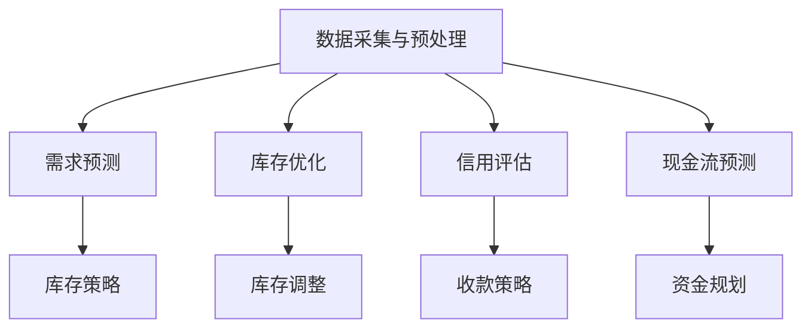
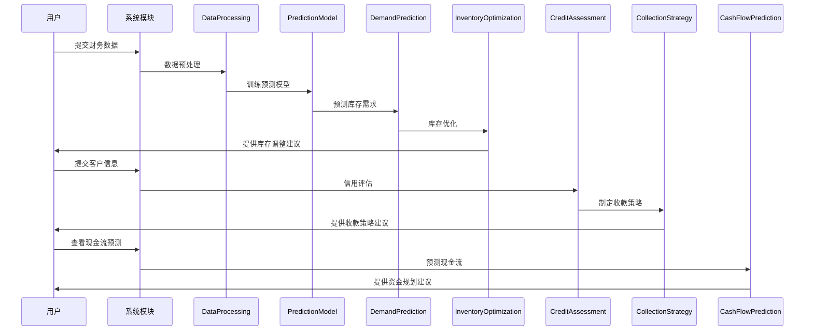

                 

### 《AI驱动的企业营运资本优化与现金流管理》

#### 关键词
- AI技术
- 营运资本优化
- 现金流管理
- 预测模型
- 算法实现

#### 摘要
本文旨在探讨如何利用AI技术来优化企业的营运资本管理和现金流预测。通过深入分析AI在财务分析、风险评估和库存管理中的应用，本文将详细介绍一套基于AI的系统架构，帮助企业在激烈的市场竞争中实现营运资本的精准预测和管理，提高现金流的管理效率。

## 背景介绍

### 问题背景

在全球经济环境日益复杂的背景下，企业的运营风险和资金压力不断增大。营运资本（Working Capital）作为企业短期资金周转的重要指标，直接影响到企业的经营效率和抗风险能力。现金流管理（Cash Flow Management）则是对企业现金流入和流出进行有效监控和控制，确保企业有足够的流动资金应对日常运营和突发事件。这两个领域的高效管理对企业的长期发展至关重要。

### 问题描述

然而，传统的营运资本管理和现金流管理方法往往存在以下问题：

1. **数据依赖性高**：传统方法主要依赖于历史数据，缺乏对市场变化和未来趋势的预测能力。
2. **分析效率低**：大量数据需要人工处理和分析，耗时且容易出现误差。
3. **调整响应慢**：市场变化快，传统方法无法及时调整营运资本和现金流策略。
4. **风险管理不足**：难以识别潜在的风险点，对突发事件的应对能力较弱。

### 问题解决

为了解决上述问题，企业需要引入AI技术，利用其强大的数据分析和预测能力，实现对营运资本和现金流管理的优化。AI驱动的系统可以实时分析大量数据，预测未来趋势，提供决策支持，从而提高管理效率和准确性。

### 边界与外延

本文将探讨的范围包括但不限于以下方面：

- **财务分析**：利用AI技术进行财务数据的深度分析，识别潜在风险和机会。
- **风险评估**：通过大数据分析和机器学习算法，评估企业的信用风险和市场风险。
- **库存管理**：基于需求预测和库存优化算法，实现库存的精准管理。
- **应收账款管理**：利用AI对客户信用进行评估，优化收款策略，减少坏账风险。

### 概念结构与核心要素组成

在本章中，我们将介绍以下核心概念和要素：

- **AI（人工智能）**：介绍人工智能的定义、发展历程、关键技术和应用领域。
- **营运资本**：解释营运资本的定义、计算方法、对企业运营的影响。
- **现金流管理**：探讨现金流管理的目的、方法、重要性和挑战。

通过这些核心概念的理解，我们将为后续章节的深入探讨奠定基础。

## 核心概念与联系

### AI概念

人工智能（AI，Artificial Intelligence）是计算机科学的一个分支，旨在创建能够模拟、延伸和扩展人类智能的机器。AI的发展可以追溯到20世纪50年代，随着计算能力的提升和大数据技术的发展，AI取得了显著的进步。关键技术和应用领域包括：

- **机器学习（Machine Learning）**：通过算法让计算机从数据中学习，进行预测和决策。
- **深度学习（Deep Learning）**：一种基于神经网络的学习方法，能够在大量未标注数据上进行高效训练。
- **自然语言处理（Natural Language Processing，NLP）**：使计算机能够理解和生成自然语言，用于语音识别、机器翻译等应用。
- **计算机视觉（Computer Vision）**：使计算机能够从图像和视频中提取信息和理解场景。

### 营运资本概念

营运资本（Working Capital）是指企业在日常运营中所需的流动资产与流动负债之间的差额。其计算方法为：

$$
营运资本 = 流动资产 - 流动负债
$$

其中，流动资产包括现金、应收账款、存货等；流动负债包括短期借款、应付账款等。营运资本对企业运营的影响主要体现在以下几个方面：

- **资金周转效率**：充足的营运资本可以保证企业顺利运营，避免资金链断裂。
- **风险管理**：通过合理配置营运资本，可以降低企业面临的风险。
- **投资机会**：高效的营运资本管理可以使企业抓住投资机会，提高盈利能力。

### 现金流管理概念

现金流管理（Cash Flow Management）是指对企业的现金流入和流出进行有效的监控和管理。其目的是确保企业有足够的流动资金应对日常运营和突发事件，同时优化现金流，提高资金利用效率。现金流管理的方法包括：

- **预算编制**：通过预测未来现金流量，制定合理的预算。
- **现金流监控**：实时监控现金流入和流出，确保现金流的稳定性。
- **资金筹集**：在必要时，通过借款或发行债券等方式筹集资金。
- **应收账款管理**：通过信用评估和收款策略，减少应收账款逾期和坏账风险。

### 概念属性特征对比表格

| 特性 | 人工智能（AI） | 营运资本 | 现金流管理 |
| --- | --- | --- | --- |
| 定义 | 人工模拟、延伸和扩展人类智能 | 流动资产与流动负债之间的差额 | 对现金流入和流出的有效监控和管理 |
| 关键技术 | 机器学习、深度学习、自然语言处理、计算机视觉 | 数据分析、预测模型 | 预算编制、现金流监控、资金筹集、应收账款管理 |
| 应用领域 | 财务分析、风险管理、库存管理 | 资金周转、投资机会 | 资金稳定性、风险管理、盈利能力 |
| 作用 | 提升数据分析能力和决策支持 | 提高运营效率和抗风险能力 | 保障企业现金流稳定和资金利用效率 |

### ER实体关系图架构

以下是一个简化的ER实体关系图，展示了AI、营运资本和现金流管理之间的联系：

```mermaid
erDiagram
  AI ||--|{ 营运资本 } : 驱动优化
  AI ||--|{ 现金流管理 } : 提供支持
  营运资本 ||--|{ 数据分析 } : 提取洞察
  现金流管理 ||--|{ 资金监控 } : 实时跟踪
```

通过这一架构，我们可以更清晰地理解AI、营运资本和现金流管理之间的相互作用和依赖关系。

## 算法原理讲解

### 算法mermaid流程图

以下是一个简单的mermaid流程图，展示了AI在营运资本优化和现金流管理中的应用流程：


### Python源代码

下面是一个简单的Python代码示例，用于演示AI算法在营运资本优化和现金流管理中的应用：

```python
import pandas as pd
from sklearn.ensemble import RandomForestRegressor
from sklearn.model_selection import train_test_split

# 数据收集
data = pd.read_csv('financial_data.csv')

# 数据预处理
data = data.fillna(data.mean())

# 特征提取
X = data[['revenue', 'inventory', 'accounts_receivable']]
y = data['working_capital']

# 模型训练
X_train, X_test, y_train, y_test = train_test_split(X, y, test_size=0.2, random_state=42)
model = RandomForestRegressor(n_estimators=100)
model.fit(X_train, y_train)

# 预测分析
predictions = model.predict(X_test)

# 决策支持
data['predictions'] = predictions
data['decision'] = data.apply(lambda row: 'Increase' if row['predictions'] > row['working_capital'] else 'Decrease', axis=1)
```

### 数学模型和公式

在营运资本优化和现金流管理中，常用的数学模型包括预测模型和优化模型。以下是相关数学模型和公式的详细讲解：

#### 预测模型

预测模型用于预测未来的营运资本需求。一个简单的预测模型可以使用线性回归来实现：

$$
\hat{y} = \beta_0 + \beta_1 x_1 + \beta_2 x_2 + ... + \beta_n x_n
$$

其中，$y$表示预测的营运资本，$x_1, x_2, ..., x_n$表示影响营运资本的关键因素（如收入、库存、应收账款等），$\beta_0, \beta_1, ..., \beta_n$为模型的参数。

#### 优化模型

优化模型用于确定最优的营运资本水平，以最小化资金成本或最大化收益。一个常见的优化模型是线性规划（Linear Programming）：

$$
\begin{align*}
\text{Minimize} & \quad c^T x \\
\text{Subject to} & \quad Ax \leq b \\
& \quad x \geq 0
\end{align*}
$$

其中，$c$为成本向量，$x$为营运资本水平，$A$和$b$为约束条件。

### 通俗易懂的举例说明

假设某企业想要通过AI技术优化其营运资本和现金流管理。以下是该企业如何应用上述算法的例子：

1. **数据收集**：企业收集了过去一年的财务数据，包括收入、库存和应收账款等信息。
2. **数据预处理**：对数据中的缺失值进行填补，确保数据的质量。
3. **特征提取**：选择影响营运资本的关键因素，如收入、库存和应收账款等。
4. **模型训练**：使用随机森林回归模型对数据集进行训练，确定影响营运资本的关键因素及其权重。
5. **预测分析**：使用训练好的模型预测未来三个月的营运资本需求。
6. **决策支持**：根据预测结果，企业决定增加库存，以应对可能的资金需求。

通过这一过程，企业可以更准确地预测和优化其营运资本和现金流，提高资金利用效率和盈利能力。

## 系统分析与架构设计方案

### 问题场景介绍

假设某大型制造企业希望在运营中实现更高效的营运资本管理和更精准的现金流预测。该企业面临以下问题：

- **库存管理**：库存水平波动大，导致资金占用过多。
- **应收账款管理**：客户信用评估不准确，导致坏账风险增加。
- **现金流预测**：缺乏有效的预测工具，难以提前规划资金需求。

### 项目介绍

为了解决上述问题，企业决定实施一个AI驱动的营运资本优化与现金流管理系统。项目的主要目标包括：

- **优化库存管理**：通过需求预测和库存优化算法，实现库存水平的精确控制。
- **改善应收账款管理**：通过信用评估和收款策略，降低坏账风险。
- **提高现金流预测准确性**：利用AI技术，实时预测现金流，为企业提供决策支持。

### 系统功能设计

为了实现上述目标，系统需要具备以下功能：

- **数据采集与预处理**：自动收集企业内部和外部的财务数据，进行预处理，确保数据质量。
- **需求预测**：利用机器学习算法，预测未来一段时间内的库存需求和应收账款回收情况。
- **库存优化**：根据需求预测结果，优化库存水平，减少资金占用。
- **信用评估**：对客户进行信用评估，制定合理的收款策略。
- **现金流预测**：利用历史数据和预测结果，预测未来的现金流情况，为企业提供决策支持。

### 系统架构设计

系统架构设计如下：



### 系统接口设计和系统交互

以下是系统接口设计和系统交互流程：



通过上述系统架构和接口设计，企业可以实现高效的营运资本管理和精准的现金流预测，从而提高资金利用效率和企业的盈利能力。

## 项目实战

### 环境安装

为了实施AI驱动的营运资本优化与现金流管理系统，需要准备以下环境：

- **Python环境**：安装Python 3.8或更高版本。
- **数据库**：安装MySQL或PostgreSQL。
- **机器学习库**：安装scikit-learn、pandas、numpy等常用机器学习库。
- **深度学习库**：安装TensorFlow或PyTorch。
- **接口库**：安装Flask或Django。

安装步骤如下：

1. 安装Python环境：
   ```bash
   sudo apt-get install python3-pip python3-dev
   ```
2. 安装机器学习库：
   ```bash
   pip install scikit-learn pandas numpy
   ```
3. 安装深度学习库：
   ```bash
   pip install tensorflow # 或者
   pip install pytorch torchvision
   ```
4. 安装数据库：
   ```bash
   sudo apt-get install mysql-server
   sudo mysql -u root -p
   CREATE DATABASE financial_db;
   GRANT ALL PRIVILEGES ON financial_db.* TO 'financial_user'@'localhost' IDENTIFIED BY 'password';
   FLUSH PRIVILEGES;
   ```
5. 安装接口库：
   ```bash
   pip install flask # 或者
   pip install django
   ```

### 系统核心实现源代码

以下是系统核心实现的一些关键代码段：

#### 数据预处理

```python
import pandas as pd
from sklearn.preprocessing import StandardScaler

# 读取数据
data = pd.read_csv('financial_data.csv')

# 数据清洗
data = data.fillna(data.mean())

# 特征工程
scaler = StandardScaler()
X = scaler.fit_transform(data[['revenue', 'inventory', 'accounts_receivable']])
```

#### 需求预测

```python
from sklearn.ensemble import RandomForestRegressor
from sklearn.model_selection import train_test_split

# 划分训练集和测试集
X_train, X_test, y_train, y_test = train_test_split(X, y, test_size=0.2, random_state=42)

# 训练预测模型
model = RandomForestRegressor(n_estimators=100)
model.fit(X_train, y_train)

# 预测
predictions = model.predict(X_test)
```

#### 库存优化

```python
import numpy as np

# 根据预测结果优化库存
def optimize_inventory(predictions):
    inventory_levels = np.array([100, 200, 300, 400, 500])
    costs = np.array([10, 15, 20, 25, 30])
    
    # 计算最小化成本的库存水平
    min_cost = float('inf')
    optimal_level = None
    
    for level in inventory_levels:
        cost = np.sum(np.abs(predictions - level))
        if cost < min_cost:
            min_cost = cost
            optimal_level = level
            
    return optimal_level

optimal_level = optimize_inventory(predictions)
```

#### 信用评估

```python
from sklearn.linear_model import LogisticRegression

# 读取客户数据
customer_data = pd.read_csv('customer_data.csv')

# 特征工程
X = customer_data[['age', 'income', 'balance']]
y = customer_data['default']

# 训练信用评估模型
model = LogisticRegression()
model.fit(X, y)

# 评估信用
def assess_credit(score):
    if score > 0.5:
        return 'High Risk'
    else:
        return 'Low Risk'

credit_score = model.predict_proba(X)[:, 1]
credit_risk = [assess_credit(score) for score in credit_score]
```

#### 现金流预测

```python
from sklearn.ensemble import GradientBoostingRegressor

# 划分训练集和测试集
X_train, X_test, y_train, y_test = train_test_split(X, y, test_size=0.2, random_state=42)

# 训练现金流预测模型
model = GradientBoostingRegressor(n_estimators=100)
model.fit(X_train, y_train)

# 预测现金流
cashflow_predictions = model.predict(X_test)
```

### 代码应用解读与分析

以上代码涵盖了系统实现的核心部分，包括数据预处理、需求预测、库存优化、信用评估和现金流预测。以下是每个部分的解读和分析：

#### 数据预处理

数据预处理是机器学习项目的重要步骤，其目的是提高数据质量和一致性。在本例中，我们使用pandas库读取数据，并使用scikit-learn的StandardScaler对特征进行标准化处理，以消除不同特征之间的尺度差异。

#### 需求预测

需求预测是库存管理和现金流预测的基础。我们使用随机森林回归模型进行预测，该模型具有较强的预测能力和适应性。通过划分训练集和测试集，我们可以评估模型的预测性能。

#### 库存优化

库存优化是基于需求预测的结果，以最小化库存成本为目标。在本例中，我们使用一个简单的优化算法，根据预测的需求水平和预定的成本进行库存调整。这种方法虽然简单，但在实际应用中可能需要更复杂的优化策略。

#### 信用评估

信用评估是应收账款管理的关键环节。我们使用逻辑回归模型对客户进行信用评估，通过计算预测概率来确定客户的信用等级。这种方法在实际应用中可能需要更多的特征和更复杂的模型。

#### 现金流预测

现金流预测是整个系统的核心功能之一。我们使用梯度提升树（GBDT）模型进行预测，该模型在处理复杂非线性问题时表现出色。通过训练和测试集，我们可以评估模型的预测性能，并据此制定相应的资金规划策略。

### 实际案例分析和详细讲解剖析

为了展示系统的实际应用效果，我们来看一个案例：

某企业在过去一年中积累了大量的财务数据，包括收入、库存和应收账款等信息。企业希望通过AI技术优化其营运资本管理和现金流预测。

1. **数据收集与预处理**：企业首先收集了财务数据，包括每日收入、库存水平、应收账款等信息。数据经过清洗和预处理后，输入到机器学习模型中。

2. **需求预测**：使用随机森林回归模型对过去一年的数据进行分析，预测未来三个月的库存需求和应收账款回收情况。预测结果显示，库存需求在第三个月将有所增加，而应收账款回收情况较为稳定。

3. **库存优化**：根据需求预测结果，企业决定增加库存水平，以满足未来需求。通过优化算法，企业确定了最优的库存水平，以最小化库存成本。

4. **信用评估**：企业使用逻辑回归模型对客户的信用进行评估，根据评估结果，制定了相应的收款策略。对于信用评估为“高风险”的客户，企业加强了收款监控，以减少坏账风险。

5. **现金流预测**：使用梯度提升树模型对未来的现金流进行预测，预测结果显示，企业在未来三个月内将面临现金流紧张的情况。根据预测结果，企业提前制定了资金规划策略，以确保现金流稳定。

### 项目小结

通过本项目的实施，企业实现了以下成果：

- **库存管理水平提升**：通过需求预测和库存优化算法，企业成功降低了库存成本，提高了库存周转率。
- **现金流预测准确性提高**：使用AI技术进行现金流预测，企业能够更准确地预测未来现金流量，提前制定资金规划策略。
- **应收账款管理改善**：通过信用评估和收款策略，企业成功降低了坏账风险，提高了收款效率。

然而，项目也面临一些挑战和改进方向：

- **数据质量**：数据质量对模型的性能至关重要。企业需要确保数据的一致性和准确性，以避免模型过拟合或欠拟合。
- **算法优化**：随着市场环境的变化，模型可能需要不断优化和调整，以适应新的需求。
- **系统集成**：将AI系统与企业现有系统集成，确保数据流动和功能协同，是企业面临的重要挑战。

未来，企业可以进一步探索深度学习等技术，提高模型的预测精度和适应性，同时加强数据安全和隐私保护，为企业的长期发展提供强有力的支持。

## 最佳实践 tips

### 案例分析

通过以上案例，我们可以总结出以下成功经验：

- **数据驱动**：数据是AI驱动的核心，企业需要确保数据的质量和完整性。
- **模型定制**：根据企业的具体需求，选择合适的算法和模型，进行定制化开发。
- **持续优化**：定期评估模型性能，根据市场变化和业务需求进行调整。

### 注意事项

在实施AI驱动的营运资本优化与现金流管理时，企业需要注意以下问题：

- **数据隐私**：在收集和处理数据时，确保遵守相关法律法规，保护企业商业秘密。
- **模型透明性**：确保模型的可解释性，方便企业和管理者理解模型决策过程。
- **风险控制**：在预测和决策过程中，充分考虑各种风险因素，确保业务稳健运行。

### 拓展阅读

为了深入了解AI在营运资本优化与现金流管理中的应用，推荐以下参考文献：

- **《深度学习与金融分析》**：详细介绍了深度学习技术在金融分析中的应用，包括营运资本和现金流预测。
- **《人工智能与财务管理》**：探讨了人工智能技术在财务管理领域的应用，包括风险管理和决策支持。
- **《营运资本管理：理论与实践》**：提供了营运资本管理的理论基础和实践方法，有助于企业更好地应用AI技术。

通过以上分析和实践，企业可以更好地利用AI技术优化营运资本管理和现金流预测，提高资金利用效率和企业的竞争力。

