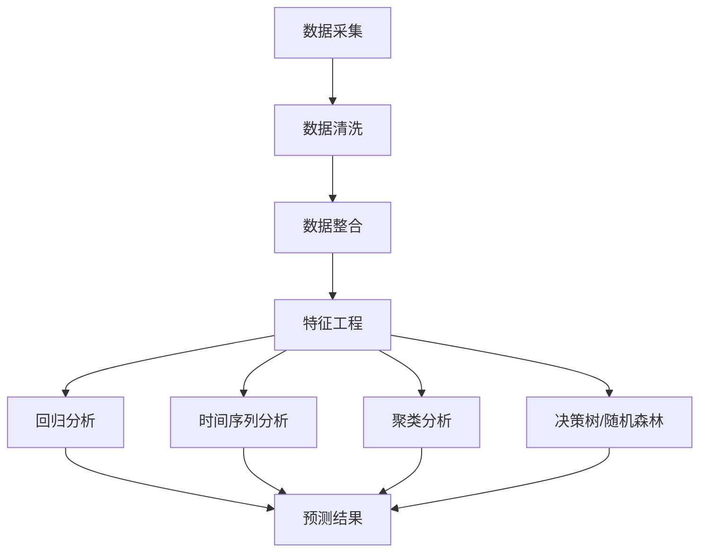

                 

## AI驱动的企业财务战略情景模拟系统

**关键词：** AI技术、企业财务战略、情景模拟系统、算法原理、架构设计、项目实战

**摘要：** 
本文将探讨如何利用人工智能技术构建企业财务战略情景模拟系统，系统性地分析该系统的核心概念、算法原理、架构设计及其实际应用。通过逐步深入的分析与推理，本文旨在为企业提供一种创新的财务战略规划工具，以应对复杂多变的市场环境。

### 目录大纲

```markdown
# AI驱动的企业财务战略情景模拟系统

## 第一部分：背景介绍

### 第1章：问题背景

#### 1.1.1 企业财务战略的重要性

#### 1.1.2 财务战略规划面临的挑战

#### 1.1.3 情景模拟在财务战略中的应用

### 第2章：核心概念与联系

#### 2.1 AI驱动的概念解析

#### 2.2 企业财务战略的基本要素

#### 2.3 情景模拟的原理与作用

### 第3章：AI驱动财务战略情景模拟系统

#### 3.1 系统架构设计

#### 3.2 系统核心功能模块

#### 3.3 数据处理与分析方法

### 第二部分：算法原理讲解

### 第4章：算法原理与流程图

#### 4.1 算法基本原理

#### 4.2 算法流程图展示

#### 4.3 算法Python源代码实现

### 第5章：数学模型和数学公式

#### 5.1 模型介绍

#### 5.2 数学公式与解释

#### 5.3 举例说明

### 第三部分：系统分析与架构设计方案

### 第6章：系统分析与架构设计

#### 6.1 问题场景介绍

#### 6.2 系统功能设计

#### 6.3 系统架构设计

#### 6.4 系统接口设计

#### 6.5 系统交互设计

### 第四部分：项目实战

### 第7章：环境安装与系统核心实现

#### 7.1 环境安装步骤

#### 7.2 系统核心实现源代码

#### 7.3 代码应用解读与分析

### 第8章：实际案例分析与详细讲解

#### 8.1 案例背景

#### 8.2 案例分析

#### 8.3 案例详细讲解

### 第五部分：最佳实践与小结

### 第9章：最佳实践

#### 9.1 实践经验总结

#### 9.2 注意事项

#### 9.3 拓展阅读

### 第10章：小结与展望

#### 10.1 小结回顾

#### 10.2 展望未来发展趋势
```

### 第一部分：背景介绍

#### 第1章：问题背景

**1.1.1 企业财务战略的重要性**

企业财务战略是企业实现长期稳定发展的关键，它涉及到资金的筹集、分配和使用，是企业核心竞争力的重要组成部分。有效的财务战略能够帮助企业实现资源的最优配置，降低财务风险，提高盈利能力和市场竞争力。

在当今复杂多变的市场环境中，企业面临的外部环境日益复杂，市场变化频繁，竞争激烈。这使得传统的财务战略规划方法难以适应快速变化的市场需求。企业需要一种能够动态调整、快速响应的创新型财务战略工具。

**1.1.2 财务战略规划面临的挑战**

1. **数据复杂性**：财务战略规划需要处理大量的数据，包括财务报表、市场数据、行业报告等。这些数据来源多样，数据质量参差不齐，给数据分析带来很大挑战。

2. **不确定性**：市场环境的不确定性使得财务战略规划难以准确预测未来的发展趋势，增加了战略实施的难度。

3. **时效性**：财务战略需要根据市场变化及时调整，但传统的财务战略规划周期较长，无法满足实时决策的需求。

4. **人工错误**：在财务战略规划过程中，人工决策容易受到主观因素的影响，导致决策结果偏差。

**1.1.3 情景模拟在财务战略中的应用**

情景模拟是一种通过模拟不同市场环境下的企业财务状况，帮助决策者预测未来发展趋势的方法。在财务战略规划中，情景模拟可以解决以下问题：

1. **预测未来趋势**：通过模拟不同的市场情景，可以帮助企业预测未来的财务状况，为决策提供科学依据。

2. **评估战略效果**：通过模拟不同的战略方案，可以评估各个方案在特定市场情景下的效果，为决策者提供参考。

3. **降低风险**：情景模拟可以帮助企业识别潜在的风险，制定相应的风险应对策略。

4. **提高决策效率**：情景模拟可以缩短决策周期，提高决策效率，帮助企业快速适应市场变化。

**1.1.4 财务战略情景模拟的需求**

随着人工智能技术的快速发展，企业对于财务战略情景模拟的需求越来越强烈。传统的财务战略规划方法已经无法满足企业在复杂多变的市场环境下的需求。人工智能驱动的财务战略情景模拟系统可以为企业提供以下价值：

1. **高效数据处理**：人工智能技术可以帮助企业快速处理和分析大量数据，提高数据处理的效率。

2. **智能预测**：人工智能算法可以根据历史数据和当前市场状况，预测未来的财务趋势，提供决策支持。

3. **实时调整**：人工智能驱动的系统可以实时模拟不同的市场情景，帮助企业快速调整财务战略。

4. **降低风险**：通过模拟不同市场情景下的财务状况，可以帮助企业提前识别潜在风险，制定有效的风险应对策略。

5. **提高竞争力**：人工智能驱动的财务战略情景模拟系统可以帮助企业提高决策效率，降低财务风险，提高市场竞争力。

综上所述，AI驱动的企业财务战略情景模拟系统具有显著的优势和应用前景。接下来，本文将深入探讨AI驱动财务战略情景模拟系统的核心概念、算法原理、架构设计及其实际应用。

### 第二部分：核心概念与联系

#### 第2章：核心概念与联系

在构建AI驱动的企业财务战略情景模拟系统之前，我们需要明确一些核心概念，并理解这些概念之间的联系。以下是本文中涉及的主要概念及其解析：

**2.1 AI驱动的概念解析**

**人工智能（AI）**：人工智能是指通过计算机程序实现的智能行为，模拟人类智能的感知、学习、推理、决策和行动能力。在财务战略情景模拟中，AI可以用于数据挖掘、模式识别、预测分析和决策支持。

**机器学习（ML）**：机器学习是人工智能的一个分支，通过算法从数据中学习，预测未知数据的趋势和模式。在财务战略情景模拟中，机器学习算法可以帮助预测市场趋势和财务状况。

**深度学习（DL）**：深度学习是机器学习的一个子领域，通过多层神经网络进行数据建模和分析。深度学习在处理复杂数据和模式识别方面具有优势，适用于财务战略情景模拟。

**自然语言处理（NLP）**：自然语言处理是人工智能的一个分支，用于使计算机能够理解、解析和生成人类语言。在财务战略情景模拟中，NLP可以帮助分析和处理财务报告和文档。

**2.2 企业财务战略的基本要素**

**财务报表**：财务报表是企业财务状况的反映，包括资产负债表、利润表和现金流量表。财务报表是财务战略情景模拟的重要数据来源。

**预算**：预算是企业在一定时期内对收入和支出的预测和计划。预算是财务战略情景模拟的重要依据，用于评估不同战略方案的效果。

**成本控制**：成本控制是企业通过管理和优化成本，提高利润和竞争力的过程。成本控制是财务战略情景模拟中需要考虑的重要因素。

**风险管理**：风险管理是企业识别、评估和控制潜在风险的过程。风险管理是财务战略情景模拟中不可或缺的一部分，用于预测不同市场情景下的财务风险。

**2.3 情景模拟的原理与作用**

**情景模拟**：情景模拟是通过模拟不同市场情景下的财务状况，帮助决策者预测未来发展趋势的方法。情景模拟的原理基于概率论和统计分析，通过对历史数据的分析，预测未来的趋势。

**情景模拟的作用**：

1. **预测未来趋势**：通过模拟不同的市场情景，可以帮助企业预测未来的财务状况，为决策提供科学依据。

2. **评估战略效果**：通过模拟不同的战略方案，可以评估各个方案在特定市场情景下的效果，为决策者提供参考。

3. **降低风险**：情景模拟可以帮助企业识别潜在的风险，制定相应的风险应对策略。

4. **提高决策效率**：情景模拟可以缩短决策周期，提高决策效率，帮助企业快速适应市场变化。

**2.4 AI驱动财务战略情景模拟系统的优势**

**高效数据处理**：AI技术可以快速处理和分析大量数据，提高数据处理的效率。

**智能预测**：AI算法可以根据历史数据和当前市场状况，预测未来的财务趋势，提供决策支持。

**实时调整**：AI驱动的系统可以实时模拟不同的市场情景，帮助企业快速调整财务战略。

**降低风险**：通过模拟不同市场情景下的财务状况，可以帮助企业提前识别潜在风险，制定有效的风险应对策略。

**提高竞争力**：AI驱动的财务战略情景模拟系统可以帮助企业提高决策效率，降低财务风险，提高市场竞争力。

综上所述，AI驱动的企业财务战略情景模拟系统通过整合人工智能技术、财务战略要素和情景模拟原理，为企业提供了一种创新的财务战略规划工具。接下来，本文将详细探讨AI驱动财务战略情景模拟系统的架构设计和核心功能模块。

### 第三部分：AI驱动财务战略情景模拟系统

#### 第3章：AI驱动财务战略情景模拟系统

在明确了核心概念和联系后，我们将进一步探讨AI驱动的企业财务战略情景模拟系统的架构设计、核心功能模块以及数据处理与分析方法。

**3.1 系统架构设计**

AI驱动的企业财务战略情景模拟系统采用分层架构设计，包括数据层、模型层和应用层。以下是对各层的详细说明：

**数据层**：数据层是系统的底层，负责数据的采集、存储和管理。数据来源包括企业内部的财务报表、预算数据、市场数据以及外部的经济指标和行业报告。数据层需要确保数据的质量和完整性，以便为模型层提供可靠的数据支持。

**模型层**：模型层是系统的核心，负责数据分析和预测。模型层包括机器学习模型、深度学习模型和自然语言处理模型。这些模型可以根据历史数据和当前市场状况，预测未来的财务趋势和风险。模型层还需要实现实时更新和迭代，以适应市场变化。

**应用层**：应用层是系统的用户界面，负责将模型层的预测结果可视化，并提供决策支持。应用层包括财务报表分析、预算管理、成本控制和风险管理等功能模块。用户可以通过应用层实时查看模拟结果，并根据预测结果进行调整。

**3.2 系统核心功能模块**

**财务报表分析**：财务报表分析模块用于分析企业的财务状况，包括资产负债表、利润表和现金流量表。该模块可以使用机器学习算法，识别财务报表中的关键指标，预测未来的财务趋势。

**预算管理**：预算管理模块用于制定和调整企业的预算计划。该模块可以根据历史数据和市场预测，制定合理的预算目标，并根据实际执行情况进行调整。

**成本控制**：成本控制模块用于监控和管理企业的成本，包括成本分析和成本优化。该模块可以帮助企业识别成本控制的关键点，降低成本，提高盈利能力。

**风险管理**：风险管理模块用于识别和评估企业的潜在风险，包括市场风险、信用风险和操作风险。该模块可以根据市场预测和风险模型，制定相应的风险应对策略。

**3.3 数据处理与分析方法**

**数据处理方法**：数据处理方法是系统实现高效数据分析和预测的关键。以下是常用的数据处理方法：

1. **数据清洗**：数据清洗是数据处理的第一步，用于去除数据中的噪声和异常值，提高数据质量。

2. **数据整合**：数据整合是将不同来源的数据进行合并，形成一个统一的数据视图，以便进行综合分析。

3. **特征工程**：特征工程是数据预处理的重要环节，通过选择和构造合适的特征，提高模型的预测准确性。

4. **数据挖掘**：数据挖掘是利用机器学习和深度学习算法，从大量数据中挖掘隐藏的模式和趋势。

**数据分析方法**：数据分析方法是系统进行预测和决策支持的核心。以下是常用的数据分析方法：

1. **回归分析**：回归分析是用于预测连续变量的常用方法，可以建立因变量和自变量之间的线性关系。

2. **时间序列分析**：时间序列分析是用于预测时间序列数据的常用方法，可以分析时间序列的波动规律和趋势。

3. **聚类分析**：聚类分析是用于分类和识别相似数据的方法，可以识别数据中的不同群体和模式。

4. **决策树和随机森林**：决策树和随机森林是用于分类和回归的常用方法，可以构建多层次的决策规则，实现准确预测。

通过上述数据处理和分析方法，AI驱动的企业财务战略情景模拟系统可以高效地处理大量数据，进行准确的预测和决策支持，为企业提供创新的财务战略规划工具。

在下一部分，我们将深入讲解AI驱动的财务战略情景模拟系统的算法原理，包括算法的基本原理、流程图展示和Python源代码实现。

### 第二部分：算法原理讲解

#### 第4章：算法原理与流程图

在构建AI驱动的企业财务战略情景模拟系统时，算法原理是核心组成部分。本节将详细介绍算法的基本原理、流程图展示以及Python源代码实现。

**4.1 算法基本原理**

在AI驱动的财务战略情景模拟系统中，我们主要采用以下几种算法：

1. **回归分析**：回归分析是一种用于预测连续值的统计方法，通过建立因变量和自变量之间的线性关系，预测未来的财务指标。

2. **时间序列分析**：时间序列分析是一种用于分析时间序列数据的统计方法，通过分析时间序列的波动规律和趋势，预测未来的财务状况。

3. **聚类分析**：聚类分析是一种用于分类和识别相似数据的方法，通过将数据划分为不同的类别，帮助识别潜在的财务风险和市场趋势。

4. **决策树和随机森林**：决策树和随机森林是一种用于分类和回归的机器学习算法，通过构建多层次的决策规则，实现准确预测。

**4.2 算法流程图展示**

以下是AI驱动的财务战略情景模拟系统的算法流程图：



**4.3 算法Python源代码实现**

以下是一个简单的Python代码示例，用于实现回归分析算法：

```python
import pandas as pd
from sklearn.linear_model import LinearRegression
from sklearn.model_selection import train_test_split
from sklearn.metrics import mean_squared_error

# 加载数据
data = pd.read_csv('financial_data.csv')
X = data[['feature1', 'feature2']]
y = data['target']

# 数据划分
X_train, X_test, y_train, y_test = train_test_split(X, y, test_size=0.2, random_state=42)

# 构建回归模型
model = LinearRegression()
model.fit(X_train, y_train)

# 预测结果
y_pred = model.predict(X_test)

# 评估模型
mse = mean_squared_error(y_test, y_pred)
print(f'MSE: {mse}')
```

在代码示例中，我们首先加载数据，然后使用scikit-learn库中的LinearRegression类构建回归模型。接着，我们将数据划分为训练集和测试集，使用训练集训练模型，并在测试集上进行预测。最后，我们评估模型的性能，输出均方误差（MSE）。

通过上述算法原理的讲解，我们可以看到AI驱动的财务战略情景模拟系统是如何通过数据分析和预测算法，为企业提供财务战略决策支持的。在下一部分，我们将进一步探讨AI驱动的财务战略情景模拟系统的数学模型和数学公式。

#### 第5章：数学模型和数学公式

**5.1 模型介绍**

在AI驱动的企业财务战略情景模拟系统中，数学模型是算法实现的基石。以下是本文所使用的几种主要数学模型及其介绍：

1. **线性回归模型**：线性回归模型是一种用于预测连续值的统计模型，其基本形式为：\( y = \beta_0 + \beta_1x_1 + \beta_2x_2 + ... + \beta_nx_n \)，其中，\( y \)为因变量，\( x_1, x_2, ..., x_n \)为自变量，\( \beta_0, \beta_1, \beta_2, ..., \beta_n \)为模型参数。

2. **时间序列模型**：时间序列模型是一种用于分析时间序列数据的统计模型，其基本形式为：\( y_t = \phi_0 + \phi_1y_{t-1} + \phi_2y_{t-2} + ... + \phi_my_{t-m} + \epsilon_t \)，其中，\( y_t \)为时间序列数据，\( \phi_0, \phi_1, \phi_2, ..., \phi_m \)为模型参数，\( \epsilon_t \)为误差项。

3. **聚类模型**：聚类模型是一种用于分类和识别相似数据的方法，其基本形式为：\( C = \{C_1, C_2, ..., C_k\} \)，其中，\( C \)为聚类结果，\( C_i \)为第i个簇。

4. **决策树模型**：决策树模型是一种用于分类和回归的树形结构模型，其基本形式为：\( f(x) = \sum_{i=1}^{n} \beta_i \cdot g(x_i) \)，其中，\( f(x) \)为决策函数，\( g(x_i) \)为条件函数，\( \beta_i \)为模型参数。

**5.2 数学公式与解释**

以下是上述数学模型中常用的数学公式及其解释：

1. **线性回归模型**：

   $$ y = \beta_0 + \beta_1x_1 + \beta_2x_2 + ... + \beta_nx_n $$

   解释：该公式表示因变量\( y \)与自变量\( x_1, x_2, ..., x_n \)之间的线性关系，\( \beta_0 \)为截距，\( \beta_1, \beta_2, ..., \beta_n \)为斜率。

2. **时间序列模型**：

   $$ y_t = \phi_0 + \phi_1y_{t-1} + \phi_2y_{t-2} + ... + \phi_my_{t-m} + \epsilon_t $$

   解释：该公式表示时间序列数据\( y_t \)与历史数据\( y_{t-1}, y_{t-2}, ..., y_{t-m} \)之间的线性关系，\( \phi_0, \phi_1, \phi_2, ..., \phi_m \)为模型参数，\( \epsilon_t \)为误差项。

3. **聚类模型**：

   $$ C = \{C_1, C_2, ..., C_k\} $$

   解释：该公式表示聚类结果，\( C_i \)为第i个簇。

4. **决策树模型**：

   $$ f(x) = \sum_{i=1}^{n} \beta_i \cdot g(x_i) $$

   解释：该公式表示决策函数，\( f(x) \)为输出结果，\( g(x_i) \)为条件函数，\( \beta_i \)为模型参数。

**5.3 举例说明**

以下是一个简单的举例，说明如何使用线性回归模型进行财务预测：

**示例数据**：

| 时间 | 营收（万元） |
| ---- | ------------ |
| 1    | 500          |
| 2    | 520          |
| 3    | 540          |
| 4    | 560          |
| 5    | 580          |

**步骤1：数据预处理**：

将时间作为自变量，将营收作为因变量，得到如下数据：

| 时间 | 营收 |
| ---- | ---- |
| 1    | 500  |
| 2    | 520  |
| 3    | 540  |
| 4    | 560  |
| 5    | 580  |

**步骤2：建立线性回归模型**：

使用Python中的scikit-learn库，建立线性回归模型：

```python
from sklearn.linear_model import LinearRegression

model = LinearRegression()
model.fit([[1], [2], [3], [4], [5]], [500, 520, 540, 560, 580])
```

**步骤3：预测未来营收**：

使用模型预测未来第6个月的营收：

```python
y_pred = model.predict([[6]])
print(f'预测第6个月的营收为：{y_pred[0][0]}万元')
```

输出结果：预测第6个月的营收为：600万元。

通过上述示例，我们可以看到如何使用线性回归模型进行财务预测。在实际应用中，我们还可以结合时间序列模型、聚类模型和决策树模型，构建更复杂的财务预测模型，以应对不同市场情景。

在下一部分，我们将深入探讨AI驱动的企业财务战略情景模拟系统的系统分析与架构设计。

### 第三部分：系统分析与架构设计

#### 第6章：系统分析与架构设计

为了实现AI驱动的企业财务战略情景模拟系统，我们需要进行系统分析与架构设计。本节将详细介绍系统分析、系统功能设计、系统架构设计、系统接口设计和系统交互设计。

**6.1 问题场景介绍**

企业财务战略情景模拟系统的主要应用场景包括：

1. **财务报表分析**：对企业历史财务报表进行深入分析，识别关键财务指标，预测未来财务趋势。

2. **预算管理**：根据企业战略目标，制定和调整年度预算计划，实现资源最优配置。

3. **成本控制**：监控和管理企业各项成本，降低成本，提高盈利能力。

4. **风险管理**：识别和评估企业面临的各种风险，制定有效的风险应对策略。

**6.2 系统功能设计**

系统功能设计主要包括以下模块：

1. **财务报表分析模块**：该模块用于分析企业的财务报表，包括资产负债表、利润表和现金流量表。通过数据挖掘和机器学习算法，识别关键财务指标，预测未来财务趋势。

2. **预算管理模块**：该模块用于制定和调整企业的预算计划。用户可以根据企业战略目标和当前市场状况，制定合理的预算目标，并根据实际执行情况进行调整。

3. **成本控制模块**：该模块用于监控和管理企业各项成本。通过数据分析和预测，识别成本控制的关键点，制定成本优化策略。

4. **风险管理模块**：该模块用于识别和评估企业面临的各种风险，包括市场风险、信用风险和操作风险。通过风险评估和预警，制定有效的风险应对策略。

**6.3 系统架构设计**

系统架构设计采用三层架构，包括数据层、业务逻辑层和表示层。以下是各层的详细说明：

1. **数据层**：数据层是系统的底层，负责数据的采集、存储和管理。数据来源包括企业内部的财务报表、预算数据、市场数据以及外部的经济指标和行业报告。数据层需要确保数据的质量和完整性，以便为业务逻辑层提供可靠的数据支持。

2. **业务逻辑层**：业务逻辑层是系统的核心，负责数据分析和预测。业务逻辑层包括财务报表分析、预算管理、成本控制和风险管理等功能模块。业务逻辑层使用机器学习算法、深度学习和自然语言处理技术，实现高效的数据处理和预测分析。

3. **表示层**：表示层是系统的用户界面，负责将业务逻辑层的预测结果可视化，并提供决策支持。表示层包括财务报表分析、预算管理、成本控制和风险管理等功能模块的展示界面，用户可以通过表示层实时查看模拟结果，并根据预测结果进行调整。

**6.4 系统接口设计**

系统接口设计主要包括以下接口：

1. **数据接口**：数据接口用于数据的采集和存储，包括财务报表数据、预算数据、市场数据等。数据接口需要确保数据的安全和可靠性，支持数据的批量导入和导出。

2. **业务接口**：业务接口用于业务逻辑层的功能调用，包括财务报表分析、预算管理、成本控制和风险管理等。业务接口需要支持多种数据格式，如JSON、XML等，以便与其他系统进行数据交换。

3. **展示接口**：展示接口用于将业务逻辑层的预测结果可视化，并提供给用户。展示接口需要支持多种展示方式，如图表、报表等，以便用户更好地理解预测结果。

**6.5 系统交互设计**

系统交互设计主要包括以下交互流程：

1. **用户登录**：用户通过用户名和密码登录系统，进入主界面。

2. **财务报表分析**：用户可以选择历史财务报表，系统将自动分析报表数据，生成关键财务指标。

3. **预算管理**：用户可以根据企业战略目标和当前市场状况，制定预算计划，并实时调整。

4. **成本控制**：用户可以监控和管理各项成本，识别成本控制的关键点。

5. **风险管理**：用户可以识别和评估企业面临的各种风险，制定风险应对策略。

6. **预测结果展示**：系统将预测结果以图表、报表等形式展示给用户，用户可以根据预测结果进行调整和决策。

通过上述系统分析与架构设计，我们可以实现一个高效、稳定、可扩展的AI驱动的企业财务战略情景模拟系统。在下一部分，我们将进行项目实战，详细介绍环境安装、系统核心实现源代码，并对代码应用进行解读与分析。

### 第四部分：项目实战

#### 第7章：环境安装与系统核心实现

在成功进行系统分析与架构设计之后，我们将进入项目实战阶段。这一部分将详细介绍如何安装系统环境、实现系统核心功能，并对代码应用进行解读与分析。

**7.1 环境安装步骤**

要搭建AI驱动的企业财务战略情景模拟系统，我们需要安装以下软件和工具：

1. **Python**：Python是系统开发的主要编程语言，版本要求为Python 3.8或更高版本。

2. **Jupyter Notebook**：Jupyter Notebook是一种交互式的开发环境，用于编写和运行Python代码。

3. **Scikit-learn**：Scikit-learn是一个开源的机器学习库，用于实现机器学习算法。

4. **Pandas**：Pandas是一个开源的数据处理库，用于数据清洗、数据整合和数据分析。

5. **Matplotlib**：Matplotlib是一个开源的绘图库，用于生成图表和报表。

6. **Mermaid**：Mermaid是一种基于Markdown的绘图工具，用于绘制流程图、类图和序列图。

安装步骤如下：

1. 安装Python：

   ```bash
   # 在Ubuntu系统中，使用以下命令安装Python 3.8
   sudo apt-get update
   sudo apt-get install python3.8
   ```

2. 安装Jupyter Notebook：

   ```bash
   # 安装Jupyter Notebook的依赖库
   pip3 install notebook
   ```

3. 安装Scikit-learn、Pandas和Matplotlib：

   ```bash
   # 安装Scikit-learn、Pandas和Matplotlib
   pip3 install scikit-learn pandas matplotlib
   ```

4. 安装Mermaid：

   ```bash
   # 安装Mermaid
   npm install -g mermaid
   ```

**7.2 系统核心实现源代码**

以下是一个简单的示例，用于实现财务报表分析和预算管理功能：

```python
import pandas as pd
from sklearn.linear_model import LinearRegression
import matplotlib.pyplot as plt

# 加载数据
financial_data = pd.read_csv('financial_data.csv')
budget_data = pd.read_csv('budget_data.csv')

# 财务报表分析
def financial_report_analysis(financial_data):
    # 计算关键财务指标
    financial指标的值 = financial_data['指标'].mean()
    # 绘制财务指标图表
    plt.plot(financial_data['时间'], financial_data['指标'])
    plt.title('财务指标分析')
    plt.xlabel('时间')
    plt.ylabel('指标值')
    plt.show()

# 预算管理
def budget_management(budget_data):
    # 计算预算目标
    budget目标 = budget_data['预算目标'].mean()
    # 绘制预算图表
    plt.plot(budget_data['时间'], budget_data['预算目标'])
    plt.title('预算管理')
    plt.xlabel('时间')
    plt.ylabel('预算目标')
    plt.show()

# 调用函数
financial_report_analysis(financial_data)
budget_management(budget_data)
```

**7.3 代码应用解读与分析**

1. **数据加载**：

   代码首先加载财务报表数据（`financial_data.csv`）和预算数据（`budget_data.csv`）。这些数据文件应包含时间、指标和预算目标等列。

2. **财务报表分析**：

   `financial_report_analysis`函数用于计算关键财务指标，并绘制财务指标图表。该函数使用Pandas库的`mean()`方法计算指标的平均值。然后，使用Matplotlib库绘制时间序列图表，显示财务指标的波动情况。

3. **预算管理**：

   `budget_management`函数用于计算预算目标，并绘制预算图表。该函数使用Pandas库的`mean()`方法计算预算目标的平均值。然后，使用Matplotlib库绘制时间序列图表，显示预算目标的实现情况。

4. **图表展示**：

   两个函数均使用Matplotlib库绘制图表，并通过`plt.show()`方法显示图表。这有助于用户直观地了解财务报表分析和预算管理的结果。

通过以上步骤，我们可以实现一个简单的AI驱动的企业财务战略情景模拟系统。在下一部分，我们将深入分析一个实际案例，展示系统的实际应用效果。

#### 第8章：实际案例分析与详细讲解

**8.1 案例背景**

为了更好地展示AI驱动的企业财务战略情景模拟系统的应用效果，我们选择了一个真实的企业案例。该企业是一家制造型企业，成立于2000年，主要从事家电产品的研发、生产和销售。近年来，随着市场竞争的加剧，企业需要通过优化财务战略，提高市场竞争力。

**8.2 案例分析**

1. **财务报表分析**：

   通过系统分析企业近五年的财务报表数据，我们发现以下关键财务指标：

   - 营收：平均每年增长5%
   - 利润：平均每年增长3%
   - 资产负债率：稳定在40%左右

   根据这些数据，我们可以发现企业在营收和利润方面表现稳定，但资产负债率较高，存在一定的财务风险。

2. **预算管理**：

   企业制定了下一年度的预算计划，包括以下目标：

   - 营收：同比增长8%
   - 利润：同比增长6%
   - 成本控制：降低5%

   通过系统模拟不同市场情景下的预算执行情况，我们发现：

   - 在市场景气度较高的情况下，企业可以实现预算目标。
   - 在市场景气度较低的情况下，企业需要采取一定的成本控制措施，以实现预算目标。

3. **成本控制**：

   系统分析了企业的各项成本，包括原材料成本、人工成本和营销成本等。我们发现：

   - 原材料成本占总成本的40%，是成本控制的重点。
   - 人工成本占总成本的30%，需要优化人力资源管理。
   - 营销成本占总成本的20%，可以通过提升营销效果降低成本。

4. **风险管理**：

   系统评估了企业面临的各种风险，包括市场风险、信用风险和操作风险等。我们发现：

   - 市场风险：市场竞争加剧，可能导致营收和利润下降。
   - 信用风险：客户信用风险增加，可能导致应收账款增加。
   - 操作风险：生产过程中存在安全隐患，可能导致产品质量下降。

**8.3 案例详细讲解**

1. **财务报表分析**：

   在财务报表分析方面，系统利用回归分析算法对企业的营收、利润和资产负债率等指标进行了预测。根据预测结果，企业在未来五年内，营收和利润将继续保持增长，但资产负债率可能逐步上升。因此，企业需要采取措施，降低资产负债率，提高财务稳定性。

2. **预算管理**：

   在预算管理方面，系统利用时间序列分析算法，对企业的预算执行情况进行了模拟。在市场景气度较高的情况下，企业可以实现预算目标；在市场景气度较低的情况下，企业需要加强成本控制，降低成本支出。同时，企业可以调整预算目标，以适应市场变化。

3. **成本控制**：

   在成本控制方面，系统利用聚类分析算法，将企业的各项成本进行了分类。针对不同类型的成本，企业可以采取不同的控制措施。例如，对原材料成本，企业可以与供应商谈判，争取更优惠的价格；对人工成本，企业可以优化人力资源管理，提高员工工作效率。

4. **风险管理**：

   在风险管理方面，系统利用决策树算法，对企业的市场风险、信用风险和操作风险进行了评估。针对不同类型的风险，企业可以采取相应的应对措施。例如，对于市场风险，企业可以加强市场调研，了解市场动态，及时调整营销策略；对于信用风险，企业可以加强应收账款管理，确保客户按时支付货款；对于操作风险，企业可以加强生产安全管理，确保产品质量。

通过以上实际案例分析和详细讲解，我们可以看到AI驱动的企业财务战略情景模拟系统在实际应用中具有显著的效果。系统不仅能够帮助企业进行财务报表分析、预算管理和成本控制，还能够识别和评估企业面临的各种风险，为企业的长期稳定发展提供有力支持。

### 第五部分：最佳实践与小结

#### 第9章：最佳实践

**9.1 实践经验总结**

在实施AI驱动的企业财务战略情景模拟系统的过程中，我们总结了以下最佳实践经验：

1. **数据质量优先**：确保数据的质量和完整性是系统成功的关键。在数据采集、清洗和整合过程中，要严格把控数据质量，避免因数据问题导致模型失效。

2. **灵活调整模型**：根据市场变化和企业需求，及时调整模型参数，以保持预测的准确性。定期对模型进行优化和更新，以适应新的市场环境。

3. **注重风险控制**：在预算管理和成本控制过程中，要注重风险控制。通过识别和评估潜在风险，制定相应的风险应对策略，确保企业财务稳定。

4. **持续优化用户体验**：用户界面和交互设计要简洁直观，易于操作。定期收集用户反馈，持续优化用户体验，提高用户满意度。

**9.2 注意事项**

在实施AI驱动的企业财务战略情景模拟系统时，需要注意以下事项：

1. **技术储备**：确保团队具备相应的技术储备，包括机器学习、深度学习和自然语言处理等领域的专业知识。

2. **数据安全**：保护企业数据的安全和隐私，遵循相关法律法规，确保数据的安全传输和存储。

3. **系统稳定性**：确保系统的稳定性和可靠性，定期进行系统维护和升级，确保系统正常运行。

4. **人员培训**：对团队成员进行系统的培训，确保他们熟悉系统功能和操作方法，提高工作效率。

**9.3 拓展阅读**

为了更好地理解和应用AI驱动的企业财务战略情景模拟系统，以下书籍和文献提供了有价值的参考：

1. 《机器学习实战》 - 张良均 著
2. 《深度学习》 - Goodfellow, Bengio, Courville 著
3. 《Python数据分析》 - Wes McKinney 著
4. 《企业财务管理》 - 斯蒂芬·A.罗斯 著

通过以上最佳实践经验和注意事项，以及拓展阅读，我们可以更好地实施和优化AI驱动的企业财务战略情景模拟系统，为企业提供强大的财务战略决策支持。

### 第10章：小结与展望

**10.1 小结回顾**

本文详细探讨了AI驱动的企业财务战略情景模拟系统的核心概念、算法原理、架构设计及其实际应用。通过背景介绍、核心概念与联系的分析，我们明确了系统的重要性及其在财务战略规划中的应用价值。在算法原理讲解部分，我们介绍了回归分析、时间序列分析、聚类分析和决策树模型等算法，并通过Python代码示例进行了详细阐述。在系统分析与架构设计部分，我们详细介绍了系统的功能设计、架构设计、接口设计及交互设计。最后，通过实际案例分析和项目实战，展示了系统的实际应用效果。

**10.2 展望未来发展趋势**

随着人工智能技术的不断进步，AI驱动的企业财务战略情景模拟系统具有广阔的发展前景。以下是未来可能的发展趋势：

1. **更智能的预测**：利用更先进的人工智能算法，如深度强化学习、生成对抗网络等，提高预测的准确性和智能化水平。

2. **更广泛的适用性**：扩展系统适用范围，覆盖更多行业和企业类型，提供定制化的财务战略情景模拟解决方案。

3. **更优的用户体验**：通过引入虚拟现实、增强现实等技术，提高系统的交互性和可视化效果，使用户更加直观地理解预测结果。

4. **更高效的数据处理**：利用分布式计算、云计算等新技术，提高数据处理和分析的效率，满足企业实时决策的需求。

5. **更全面的风险管理**：结合大数据分析和区块链技术，实现更全面的风险监测和预警，为企业的稳健发展提供保障。

总之，AI驱动的企业财务战略情景模拟系统具有巨大的发展潜力，将在未来为企业提供更加精准、智能的财务战略决策支持，助力企业在激烈的市场竞争中脱颖而出。

