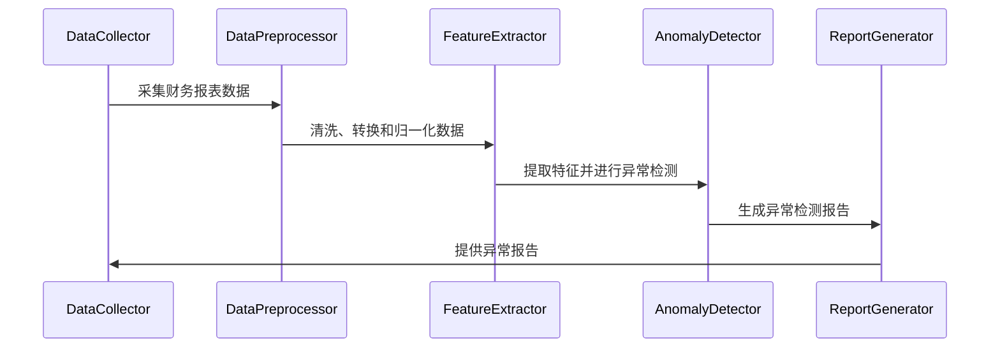

                 

# AI驱动的企业财务报表异常模式识别系统

> 关键词：AI, 财务报表, 异常检测, 模式识别, 算法原理, 系统架构

> 摘要：本文深入探讨了AI驱动的企业财务报表异常模式识别系统的设计与实现。首先，介绍了财务报表异常检测的重要性以及AI在财务领域的应用现状。接着，对核心概念、算法原理、系统架构和项目实战进行了详细讲解。本文旨在帮助读者理解AI如何应用于财务报表异常检测，以及如何设计和实现一个高效、可靠的系统。

## 引言

### 1.1 背景介绍

财务报表是企业运营状况的晴雨表，对于企业管理者、投资者和其他利益相关者来说，准确、透明的财务报表至关重要。然而，财务报表中可能存在各种异常，如财务欺诈、数据错误等，这些异常对企业的声誉和利益都可能造成严重影响。传统的异常检测方法通常依赖于人工审查和数据验证，效率低下且容易出现误报或漏报。

近年来，随着人工智能（AI）技术的快速发展，AI在各个领域的应用越来越广泛。在财务领域，AI技术，特别是机器学习和深度学习算法，被用来提高财务报表异常检测的效率和准确性。通过分析大量的财务数据，AI系统能够自动识别潜在的异常模式，为企业提供更可靠的财务监督和管理工具。

### 1.2 问题定义

#### 1.2.1 财务报表异常模式识别问题

财务报表异常模式识别是指利用AI技术对财务报表中的数据进行分析，识别出不符合预期或潜在问题的数据模式。这个过程包括以下几个关键要素：

1. **数据源**：企业财务报表数据，包括利润表、资产负债表和现金流量表等。
2. **异常类型**：如财务欺诈、数据录入错误、异常交易等。
3. **异常检测算法**：用于分析数据并识别异常的算法，如聚类算法、神经网络等。
4. **性能评估**：评估异常检测系统的准确性和效率，包括误报率、漏报率和响应时间等。

#### 1.2.2 异常模式识别的关键要素

- **数据质量**：数据质量对异常检测系统的效果有重要影响。高质量的数据有助于提高模型的准确性和可靠性。
- **特征提取**：从财务报表数据中提取出有助于异常检测的特征，如财务指标、交易频率等。
- **算法选择**：根据具体应用场景选择合适的算法，如聚类算法、神经网络等。
- **模型训练与验证**：通过训练和验证数据集来优化模型参数，提高模型的泛化能力。

### 1.3 边界与外延

#### 1.3.1 数据质量的影响

数据质量是影响异常检测系统效果的重要因素。不完整、不准确或错误的数据会导致模型误判或漏判。因此，在构建异常检测系统时，需要确保数据的质量和完整性。

#### 1.3.2 异常类型与分类

不同的异常类型对检测算法的要求不同。例如，财务欺诈通常涉及复杂的交易模式和异常的财务指标，而数据录入错误可能只是简单的数值错误。因此，在设计和实现异常检测系统时，需要考虑异常类型的多样性和复杂性。

### 1.4 概念结构与核心要素组成

#### 1.4.1 AI驱动的概念

AI驱动的企业财务报表异常模式识别系统是指利用AI技术，特别是机器学习和深度学习算法，来分析和识别财务报表中的异常模式。这个系统通常包括以下几个关键组件：

- **数据采集与预处理**：从各种数据源采集财务报表数据，并进行清洗、转换和归一化处理。
- **特征提取**：从原始数据中提取有助于异常检测的特征。
- **模型训练与验证**：使用训练数据集来训练模型，并通过验证数据集来评估模型的性能。
- **异常检测与报告**：使用训练好的模型对新的财务报表数据进行分析，识别异常模式，并生成报告。

#### 1.4.2 财务报表异常模式识别的核心要素

- **机器学习算法**：如K-means、DBSCAN、神经网络等。
- **深度学习框架**：如TensorFlow、PyTorch等。
- **性能评估指标**：如准确率、召回率、F1分数等。
- **数据可视化**：用于展示分析结果和异常模式。

### 1.5 本章小结

本文介绍了AI驱动的企业财务报表异常模式识别系统的背景、问题定义、边界与外延以及核心要素组成。接下来，将深入探讨AI技术的基础、财务报表分析、异常模式识别原理以及系统架构和项目实战。

## 核心概念与联系

### 2.1 AI技术基础

#### 2.1.1 机器学习

机器学习是AI的核心技术之一，它使得计算机系统能够从数据中自动学习和改进。在财务报表异常模式识别中，机器学习算法用于分析财务数据，识别潜在的异常模式。常见的机器学习算法包括：

- **监督学习**：通过已标记的数据集来训练模型，用于预测未知数据的结果。例如，K-means聚类算法可以用于将财务数据分组，从而识别异常交易。
- **无监督学习**：在没有预定义标签的情况下从数据中学习模式。例如，DBSCAN算法可以用于发现数据集中的异常点。

#### 2.1.2 深度学习

深度学习是机器学习的一个分支，它通过模拟人脑中的神经网络结构来进行学习。深度学习在财务报表异常模式识别中具有广泛的应用，特别是在处理复杂、大规模的财务数据时。常见的深度学习算法包括：

- **卷积神经网络（CNN）**：用于处理具有层次结构的图像数据，如财务报表中的图表和图形。
- **递归神经网络（RNN）**：用于处理序列数据，如时间序列财务数据。
- **生成对抗网络（GAN）**：可以用于生成新的财务数据，从而用于训练和测试异常检测模型。

### 2.2 财务报表分析

#### 2.2.1 财务报表的基本结构

财务报表主要包括利润表、资产负债表和现金流量表。每张报表都有其独特的结构和内容：

- **利润表**：显示了企业在一定时期内的收入、成本和利润。
- **资产负债表**：显示了企业在一定时期内的资产、负债和股东权益。
- **现金流量表**：显示了企业在一定时期内的现金流入和流出。

#### 2.2.2 财务指标分析

财务指标是财务报表分析的关键要素，用于评估企业的财务状况和运营效率。常见的财务指标包括：

- **盈利能力指标**：如净利润率、毛利率等。
- **偿债能力指标**：如流动比率、速动比率等。
- **运营能力指标**：如存货周转率、应收账款周转率等。

### 2.3 AI驱动的财务报表异常模式识别原理

#### 2.3.1 异常检测算法

异常检测算法是财务报表异常模式识别系统的核心。常见的异常检测算法包括：

- **聚类算法**：如K-means、DBSCAN等，用于将财务数据分组，识别异常数据点。
- **神经网络算法**：如卷积神经网络（CNN）、递归神经网络（RNN）等，用于从财务数据中学习模式和识别异常。

#### 2.3.2 异常模式识别流程

AI驱动的财务报表异常模式识别通常包括以下几个步骤：

1. **数据采集**：从各种数据源（如企业财务系统、数据库等）采集财务报表数据。
2. **数据预处理**：清洗、转换和归一化财务数据，以提高数据质量和模型的性能。
3. **特征提取**：从原始数据中提取有助于异常检测的特征。
4. **模型训练**：使用训练数据集来训练异常检测模型。
5. **模型验证**：使用验证数据集来评估模型的性能和泛化能力。
6. **异常检测**：使用训练好的模型对新的财务报表数据进行分析，识别异常模式。
7. **报告生成**：生成异常检测报告，包括异常类型、影响范围等。

### 2.4 概念属性特征对比表格

下面是一个关于不同异常检测算法的概念属性特征对比表格：

| 算法名称 | 特点 | 适用场景 | 优缺点 |
| --- | --- | --- | --- |
| K-means | 简单高效，易于实现 | 数据量较大，特征线性可分 | 可能陷入局部最优，对初始中心点敏感 |
| DBSCAN | 自动确定聚类数量，处理噪声能力强 | 数据量较大，存在噪声和不同密度区域 | 计算复杂度较高，对参数敏感 |
| CNN | 处理具有层次结构的图像数据能力强 | 财务报表中的图表和图形 | 计算资源消耗大，对数据要求高 |
| RNN | 处理序列数据能力强 | 时间序列财务数据 | 难以训练，对长序列数据效果不佳 |

### 2.5 ER实体关系图架构

下面是一个关于财务报表数据的ER实体关系图架构，用于展示不同实体之间的关系：

```mermaid
erDiagram
    Customer ||--|{ Order } : "has"
    Order ||--|{ Product } : "contains"
    Product ||--|{ Supplier } : "provided by"
```

### 2.6 本章小结

本章介绍了AI技术基础、财务报表分析以及AI驱动的财务报表异常模式识别原理。通过对比不同异常检测算法的概念属性特征，读者可以更好地了解它们在财务报表异常检测中的应用场景。接下来，将深入探讨这些算法的原理和实现。

## 算法原理讲解

### 3.1 聚类算法原理

#### 3.1.1 K-means算法

K-means算法是一种基于距离的聚类算法，其核心思想是将数据点分为K个簇，使得每个簇内的数据点之间的距离最小，而不同簇之间的距离最大。算法的基本步骤如下：

1. **初始化**：随机选择K个数据点作为初始聚类中心。
2. **分配**：计算每个数据点到各个聚类中心的距离，并将其分配到最近的聚类中心所在的簇。
3. **更新**：重新计算每个簇的中心点，通常取簇内所有数据点的平均值。
4. **迭代**：重复步骤2和步骤3，直到聚类中心不再发生变化或达到预设的迭代次数。

K-means算法的优点在于简单、易于实现，但缺点包括可能陷入局部最优、对初始中心点敏感以及对噪声敏感。

#### 3.1.2 DBSCAN算法

DBSCAN（Density-Based Spatial Clustering of Applications with Noise）是一种基于密度的聚类算法，其主要思想是根据数据点的密度和邻域关系进行聚类。算法的基本步骤如下：

1. **邻域计算**：计算每个数据点的邻域，通常使用邻域半径ε。
2. **标记点**：根据邻域关系，将数据点标记为核心点、边界点和噪声点。
3. **扩展簇**：从核心点开始，递归扩展形成簇，直到核心点耗尽或边界点不再扩展。
4. **重复**：重复步骤1至步骤3，直到所有数据点都被标记。

DBSCAN算法的优点包括自动确定聚类数量、处理噪声能力强，但缺点包括计算复杂度较高、对参数敏感。

#### 3.1.3 神经网络算法原理

神经网络算法是基于模拟人脑神经元结构和功能的一种机器学习算法。神经网络通过层层传递数据，逐层提取特征，最终实现分类或回归任务。常见的神经网络算法包括：

- **前馈神经网络**：数据从前向后传递，每层神经元只接收前一层的输出，并通过激活函数进行变换。
- **卷积神经网络（CNN）**：通过卷积操作和池化操作，对图像数据进行特征提取和降维处理。
- **递归神经网络（RNN）**：通过循环连接，对序列数据进行处理，能够捕捉时间序列中的长期依赖关系。

#### 3.1.4 深度学习框架与实现

深度学习框架是用于实现深度学习算法的工具，常见的深度学习框架包括：

- **TensorFlow**：由Google开源，支持多种深度学习算法，易于部署和优化。
- **PyTorch**：由Facebook开源，具有动态计算图和灵活的API，适合研究和开发。

#### 3.1.5 深度学习在财务报表异常模式识别中的应用

深度学习在财务报表异常模式识别中具有广泛的应用，可以处理复杂的财务数据和模式。例如：

- **财务报表图像处理**：使用CNN对财务报表图像进行特征提取和分类，识别异常交易和财务欺诈。
- **时间序列分析**：使用RNN对时间序列财务数据进行分析，识别异常模式和趋势。

### 3.2 算法性能评估

#### 3.2.1 评估指标

算法性能评估是衡量异常检测系统效果的重要步骤。常见的评估指标包括：

- **准确率**：正确识别异常数据的比例，计算公式为：准确率 = （TP + TN）/（TP + TN + FP + FN），其中TP为真阳性，TN为真阴性，FP为假阳性，FN为假阴性。
- **召回率**：正确识别异常数据中实际异常数据的比例，计算公式为：召回率 = TP /（TP + FN），其中TP为真阳性，FN为假阴性。
- **F1分数**：准确率和召回率的调和平均值，计算公式为：F1分数 = 2 *（准确率 * 召回率）/（准确率 + 召回率）。

#### 3.2.2 实验设计

实验设计是评估算法性能的关键步骤，通常包括以下几个步骤：

1. **数据集选择**：选择合适的训练数据集和验证数据集，确保数据集的代表性和多样性。
2. **算法实现**：实现不同的异常检测算法，并在相同的实验环境中运行。
3. **参数调优**：通过调整算法参数，优化算法性能。
4. **性能评估**：使用评估指标计算算法的性能，并进行对比分析。

### 3.3 算法选择与优化

#### 3.3.1 算法选择标准

选择合适的算法是构建高效异常检测系统的关键。以下是一些常见的算法选择标准：

- **数据处理能力**：算法是否能够处理不同类型和格式的财务数据。
- **性能指标**：算法在评估指标上的表现，如准确率、召回率和F1分数。
- **可扩展性**：算法是否能够扩展到更大的数据集或更复杂的业务场景。
- **实现难度**：算法的实现难度和成本，是否易于部署和维护。

#### 3.3.2 参数调优策略

参数调优是提高算法性能的重要手段。以下是一些常见的参数调优策略：

- **交叉验证**：使用交叉验证方法，选择最优的参数组合。
- **网格搜索**：在参数空间内遍历所有可能的参数组合，选择最优的组合。
- **贝叶斯优化**：使用贝叶斯优化方法，选择最优的参数组合。

### 3.4 本章小结

本章介绍了聚类算法和神经网络算法的原理，以及深度学习框架在财务报表异常模式识别中的应用。通过算法性能评估和参数调优，可以构建高效、可靠的异常检测系统。接下来，将讨论系统架构和项目实战。

## 系统分析与架构设计

### 4.1 项目介绍

#### 4.1.1 项目背景

随着企业规模的扩大和数据量的增加，财务报表的复杂度和重要性不断提升。然而，传统的财务报表分析方法已难以满足现代企业对实时性、准确性和高效性的需求。为了解决这一问题，许多企业开始探索AI驱动的财务报表异常模式识别系统，以提高财务报表分析的准确性和效率。

#### 4.1.2 项目目标

本项目旨在构建一个AI驱动的企业财务报表异常模式识别系统，实现以下目标：

- 自动化识别财务报表中的异常模式，提高异常检测的准确性和效率。
- 提供实时、准确的异常报告，帮助企业管理者及时了解企业财务状况。
- 降低人工审查的工作量，提高财务报表分析的效率和可靠性。

### 4.2 系统功能设计

#### 4.2.1 功能需求分析

本系统的功能需求主要包括：

- **数据采集**：从企业财务系统中采集财务报表数据，包括利润表、资产负债表和现金流量表等。
- **数据预处理**：对采集到的财务数据进行清洗、转换和归一化处理，以提高数据质量和模型性能。
- **特征提取**：从原始数据中提取有助于异常检测的特征，如财务指标、交易频率等。
- **异常检测**：使用机器学习和深度学习算法，对财务报表数据进行分析，识别潜在的异常模式。
- **报告生成**：生成异常检测报告，包括异常类型、影响范围等，以供企业管理者参考。

#### 4.2.2 领域模型

领域模型是系统功能的核心抽象，用于描述系统的业务流程和数据关系。本系统的领域模型包括以下实体和关系：

- **财务报表**：包括利润表、资产负债表和现金流量表等。
- **财务指标**：如净利润率、毛利率、流动比率等。
- **交易记录**：包括交易时间、交易金额、交易对手等。
- **异常报告**：包括异常类型、影响范围、处理建议等。

下面是一个关于领域模型的Mermaid类图：

```mermaid
classDiagram
    Customer <<--|{has}| Order
    Order ||--|{contains}| Product
    Product ||--|{provided by}| Supplier
    Report <<--|{generated by}| Exception
    Exception ||--|{includes}| Detail
```

### 4.3 系统架构设计

#### 4.3.1 系统架构概述

本系统的架构设计主要包括以下几个模块：

- **数据采集模块**：负责从企业财务系统中采集财务报表数据。
- **数据预处理模块**：负责对采集到的财务数据进行清洗、转换和归一化处理。
- **特征提取模块**：负责从原始数据中提取有助于异常检测的特征。
- **异常检测模块**：负责使用机器学习和深度学习算法对财务报表数据进行分析，识别潜在的异常模式。
- **报告生成模块**：负责生成异常检测报告，并提供给企业管理者。

下面是一个关于系统架构的Mermaid架构图：



#### 4.3.2 系统架构图

下面是一个关于系统架构的详细架构图，展示了各个模块之间的关系和交互过程：

```mermaid
graph TB
    subgraph 数据采集模块
        DataCollector[数据采集]
    end
    subgraph 数据预处理模块
        DataPreprocessor[数据预处理]
    end
    subgraph 特征提取模块
        FeatureExtractor[特征提取]
    end
    subgraph 异常检测模块
        AnomalyDetector[异常检测]
    end
    subgraph 报告生成模块
        ReportGenerator[报告生成]
    end
    DataCollector->>DataPreprocessor
    DataPreprocessor->>FeatureExtractor
    FeatureExtractor->>AnomalyDetector
    AnomalyDetector->>ReportGenerator
```

### 4.4 系统接口设计

#### 4.4.1 数据接口

数据接口是系统与其他模块或外部系统进行数据交互的接口，主要包括以下功能：

- **数据采集接口**：用于从企业财务系统中采集财务报表数据。
- **数据预处理接口**：用于清洗、转换和归一化财务数据。
- **特征提取接口**：用于提取有助于异常检测的特征。
- **异常检测接口**：用于分析财务报表数据并识别异常模式。
- **报告生成接口**：用于生成异常检测报告，并提供给企业管理者。

下面是一个关于数据接口的Mermaid流程图：

```mermaid
graph TB
    DataCollector[数据采集接口]
    DataPreprocessor[数据预处理接口]
    FeatureExtractor[特征提取接口]
    AnomalyDetector[异常检测接口]
    ReportGenerator[报告生成接口]

    DataCollector->|采集数据|DataPreprocessor
    DataPreprocessor->|预处理数据|FeatureExtractor
    FeatureExtractor->|提取特征|AnomalyDetector
    AnomalyDetector->|检测异常|ReportGenerator
    ReportGenerator->|生成报告|DataCollector
```

### 4.5 系统交互

#### 4.5.1 系统流程

系统流程是系统各个模块之间的交互过程，主要包括以下步骤：

1. **数据采集**：从企业财务系统中采集财务报表数据。
2. **数据预处理**：清洗、转换和归一化财务数据。
3. **特征提取**：从原始数据中提取有助于异常检测的特征。
4. **异常检测**：使用机器学习和深度学习算法分析财务报表数据，识别异常模式。
5. **报告生成**：生成异常检测报告，并提供给企业管理者。

下面是一个关于系统流程的Mermaid序列图：


#### 4.5.2 序列图

下面是一个关于系统交互的详细序列图，展示了系统各个模块之间的交互过程：


### 4.6 本章小结

本章介绍了AI驱动的企业财务报表异常模式识别系统的功能设计、系统架构设计和接口设计。通过详细的系统流程和序列图，读者可以更好地理解系统的运作方式和各个模块之间的关系。接下来，将讨论项目实战中的具体实现和案例分析。

## 项目实战

### 5.1 环境安装

#### 5.1.1 软件与硬件要求

在进行项目实战之前，需要准备以下软件和硬件环境：

- **操作系统**：Linux或Windows（推荐Linux）
- **Python**：Python 3.8或以上版本
- **深度学习框架**：TensorFlow或PyTorch
- **数据库**：MySQL或PostgreSQL
- **硬件**：CPU或GPU（推荐使用GPU加速）

#### 5.1.2 环境搭建步骤

1. **安装操作系统**：根据个人需求选择Linux或Windows操作系统。

2. **安装Python**：从Python官网下载安装包，并按照提示完成安装。

3. **安装深度学习框架**：选择TensorFlow或PyTorch，从官网下载安装命令并执行。例如，对于TensorFlow：

   ```shell
   pip install tensorflow
   ```

   对于PyTorch：

   ```shell
   pip install torch torchvision
   ```

4. **安装数据库**：从数据库官网下载安装包，并按照提示完成安装。

5. **安装其他依赖库**：根据项目需求，安装其他必要的依赖库。例如，使用`pip`命令安装`pandas`、`numpy`等库：

   ```shell
   pip install pandas numpy
   ```

### 5.2 系统核心实现

#### 5.2.1 数据预处理

数据预处理是异常检测系统的重要环节，其目的是提高数据质量和模型的性能。数据预处理的主要步骤包括：

1. **数据清洗**：删除重复数据、处理缺失值和异常值。

2. **数据转换**：将不同类型的数据转换为同一类型，如将字符串转换为数字。

3. **数据归一化**：将数据缩放到相同的范围，如[0, 1]或[-1, 1]。

以下是一个使用Python和pandas库进行数据预处理的示例代码：

```python
import pandas as pd

# 加载数据
data = pd.read_csv('financial_data.csv')

# 数据清洗
data.drop_duplicates(inplace=True)
data.fillna(0, inplace=True)

# 数据转换
data['amount'] = data['amount'].astype(float)

# 数据归一化
data['amount'] = (data['amount'] - data['amount'].min()) / (data['amount'].max() - data['amount'].min())
```

#### 5.2.2 模型训练与验证

模型训练与验证是异常检测系统的核心，其目的是训练一个能够识别异常模式的模型，并通过验证数据集来评估模型性能。以下是一个使用TensorFlow和K-means算法进行模型训练和验证的示例代码：

```python
import tensorflow as tf
from sklearn.cluster import KMeans

# 加载数据
data = pd.read_csv('financial_data.csv')

# 数据预处理
# （此处省略数据清洗、转换和归一化步骤）

# 模型训练
kmeans = KMeans(n_clusters=5, random_state=0)
kmeans.fit(data[['amount']])

# 预测
predictions = kmeans.predict(data[['amount']])

# 模型验证
# （此处省略验证数据集的加载和评估指标计算步骤）
```

### 5.3 代码应用解读与分析

#### 5.3.1 关键代码解读

以下是对关键代码的解读和分析：

1. **数据清洗**：使用`drop_duplicates`函数删除重复数据，使用`fillna`函数处理缺失值和异常值。

2. **数据转换**：使用`astype`函数将字符串转换为浮点数。

3. **数据归一化**：使用差值法进行归一化，将数据缩放到[0, 1]范围内。

4. **模型训练**：使用`KMeans`类创建K-means聚类模型，并使用`fit`方法进行模型训练。

5. **预测**：使用`predict`方法对数据集进行预测，得到每个数据点的簇标签。

6. **模型验证**：使用评估指标（如准确率、召回率、F1分数）对模型进行评估。

#### 5.3.2 算法实现分析

K-means算法是一种基于距离的聚类算法，其基本思想是将数据点分为K个簇，使得每个簇内的数据点之间的距离最小，而不同簇之间的距离最大。K-means算法的实现包括以下步骤：

1. **初始化**：随机选择K个数据点作为初始聚类中心。

2. **分配**：计算每个数据点到各个聚类中心的距离，并将其分配到最近的聚类中心所在的簇。

3. **更新**：重新计算每个簇的中心点，通常取簇内所有数据点的平均值。

4. **迭代**：重复步骤2和步骤3，直到聚类中心不再发生变化或达到预设的迭代次数。

K-means算法的优点包括：

- **简单高效**：算法实现简单，计算复杂度低。
- **易于理解**：算法原理直观，易于理解。

K-means算法的缺点包括：

- **可能陷入局部最优**：算法容易陷入局部最优解，特别是在初始聚类中心选择不当时。
- **对初始中心点敏感**：算法对初始聚类中心的选择敏感，可能导致不同的结果。

### 5.4 实际案例分析与讲解

#### 5.4.1 案例背景

某企业财务部门在日常工作中发现，近年来财务报表中的异常情况逐渐增多。为了提高财务报表分析的准确性和效率，企业决定引入AI驱动的财务报表异常模式识别系统，以自动化识别财务报表中的异常模式。

#### 5.4.2 案例分析

1. **数据采集**：财务部门从企业财务系统中采集了过去的三年财务报表数据，包括利润表、资产负债表和现金流量表等。

2. **数据预处理**：对采集到的财务报表数据进行清洗、转换和归一化处理，以提高数据质量和模型性能。

3. **特征提取**：从原始数据中提取有助于异常检测的特征，如财务指标、交易频率等。

4. **模型训练**：使用K-means算法对财务报表数据进行分析，训练一个聚类模型。

5. **模型验证**：使用验证数据集对训练好的模型进行评估，调整模型参数以优化性能。

6. **异常检测**：使用训练好的模型对新的财务报表数据进行分析，识别异常模式。

7. **报告生成**：生成异常检测报告，包括异常类型、影响范围等，并生成可视化图表，以便财务部门进行分析和决策。

#### 5.4.3 案例结果

通过AI驱动的财务报表异常模式识别系统的应用，企业实现了以下成果：

- **提高异常检测准确率**：系统能够准确识别出财务报表中的异常模式，降低了误报和漏报的风险。

- **降低人工工作量**：系统自动化处理财务报表数据，减少了人工审查的工作量，提高了工作效率。

- **提升决策能力**：系统生成的异常检测报告和可视化图表，为财务部门提供了详细的异常情况分析，有助于做出更准确的决策。

### 5.5 项目小结

#### 5.5.1 项目收获

本项目通过AI驱动的财务报表异常模式识别系统，实现了对财务报表中异常模式的自动化识别。主要收获包括：

- 深入了解了AI技术（如机器学习和深度学习）在财务报表异常检测中的应用。
- 掌握了财务报表数据预处理、特征提取和模型训练等关键技术。
- 实践了K-means等聚类算法在财务报表异常检测中的应用。

#### 5.5.2 项目改进建议

为进一步提升系统的性能和实用性，可以考虑以下改进建议：

- **引入更多算法**：尝试引入其他聚类算法（如DBSCAN）和深度学习模型（如卷积神经网络），以实现更高的检测准确率。
- **优化特征提取**：根据业务需求和数据特点，进一步优化特征提取过程，以提高模型的泛化能力。
- **增强可解释性**：增强系统的可解释性，提供更加详细的异常原因分析和诊断，以提高用户对系统的信任度。

### 5.6 本章小结

本章介绍了项目实战中的环境安装、系统核心实现、代码应用解读与分析以及实际案例分析和详细讲解。通过项目实战，读者可以更好地理解AI驱动的企业财务报表异常模式识别系统的设计和实现过程。

## 最佳实践 Tips、小结、注意事项、拓展阅读

### 最佳实践 Tips

1. **数据清洗与预处理**：确保数据质量，进行充分的清洗和预处理，以提高模型的性能和准确性。
2. **特征选择与优化**：根据业务需求和数据特点，选择合适的特征，并进行优化，以提高模型的泛化能力。
3. **模型调优与验证**：使用交叉验证方法，选择最优的模型参数，并通过验证数据集进行性能评估。
4. **实时监控与更新**：定期监控系统性能，根据实际情况更新模型和特征，以适应数据的变化。

### 小结

本文深入探讨了AI驱动的企业财务报表异常模式识别系统的设计与实现。通过介绍核心概念、算法原理、系统架构和项目实战，读者可以了解到如何利用AI技术提高财务报表异常检测的准确性和效率。

### 注意事项

1. **数据隐私与安全**：在处理企业财务数据时，确保遵守相关法律法规，保护数据隐私和安全。
2. **模型解释性**：提高模型的可解释性，以增强用户对系统的信任度和接受度。
3. **系统稳定性**：确保系统的稳定性和可靠性，降低故障率和误报率。

### 拓展阅读

1. **《深度学习》**：Goodfellow, Ian, et al. 《深度学习》（中文版）. 人民邮电出版社, 2017.
2. **《机器学习》**：周志华. 《机器学习》（第二版）. 清华大学出版社, 2016.
3. **《大数据技术导论》**：张宇翔，唐杰. 《大数据技术导论》. 电子工业出版社, 2017.

## 作者信息

作者：AI天才研究院/AI Genius Institute & 禅与计算机程序设计艺术 /Zen And The Art of Computer Programming

