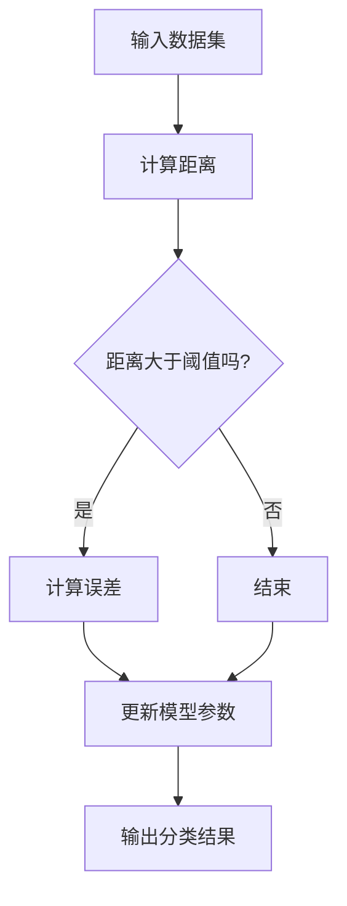
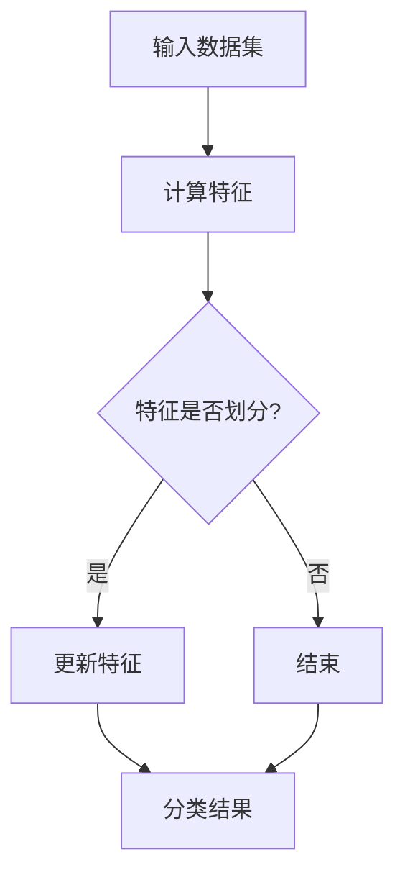
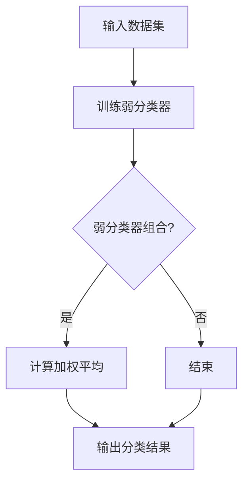
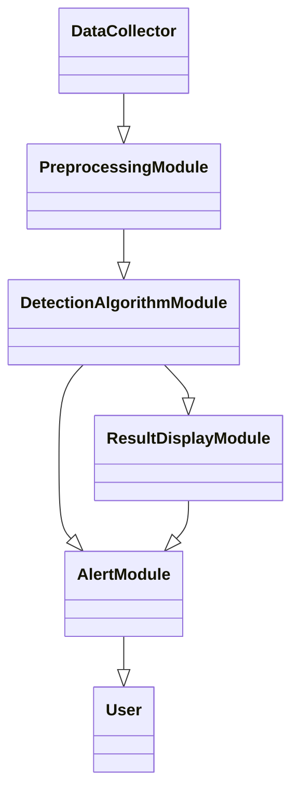
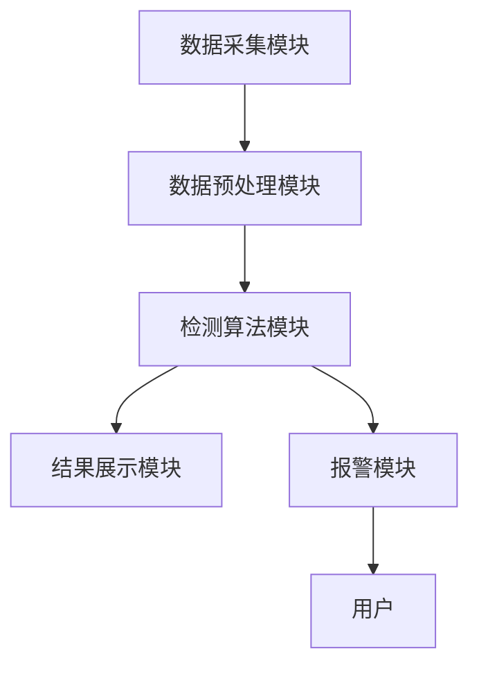
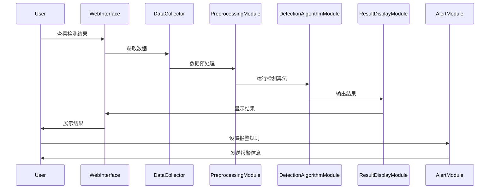

                 

### 文章标题

《AI驱动的企业财务报表舞弊检测系统》

### 关键词

AI、财务报表舞弊、检测系统、机器学习、算法原理、系统架构

### 摘要

本文将深入探讨AI技术在企业财务报表舞弊检测系统中的应用。首先，我们将回顾财务报表舞弊的背景和危害，然后介绍AI及相关的机器学习和深度学习技术。接着，我们将讲解用于财务报表舞弊检测的关键算法原理，包括数学模型和公式，并通过Python代码示例进行详细阐述。随后，文章将分析AI驱动的财务报表舞弊检测系统的架构设计，包括功能设计、系统架构和接口设计。接着，通过一个实际案例展示系统实现和应用，最后给出最佳实践和总结，展望未来研究方向。

### 目录

1. **背景介绍**  
   1.1 AI与财务报表舞弊检测概述  
   1.2 财务报表舞弊的背景与危害  
   1.3 AI在财务报表舞弊检测中的应用前景  
2. **核心概念与联系**  
   2.1 AI的核心概念  
   2.2 财务报表舞弊检测中的核心概念  
   2.3 核心概念的联系与交互  
3. **算法原理讲解**  
   3.1 舞弊检测算法概述  
   3.2 常见舞弊检测算法  
   3.3 算法原理详细讲解  
4. **系统分析与架构设计**  
   4.1 问题场景介绍  
   4.2 系统功能设计  
   4.3 系统架构设计  
   4.4 系统接口设计  
   4.5 系统交互设计  
5. **项目实战**  
   5.1 项目环境安装与配置  
   5.2 系统核心实现  
   5.3 实际案例分析  
   5.4 项目小结  
6. **最佳实践与总结**  
   6.1 舞弊检测系统的设计与实现技巧  
   6.2 项目实施中的挑战与应对策略  
   6.3 小结与展望

### 背景介绍

#### 1.1 AI与财务报表舞弊检测概述

随着大数据和人工智能技术的迅猛发展，利用机器学习和深度学习技术来识别和预防财务报表舞弊成为可能。AI驱动的财务报表舞弊检测系统具有高效性、自动化和智能化等特点，能够帮助企业及时发现潜在舞弊行为，提高财务报表的透明度和可信度。

#### 1.2 财务报表舞弊的背景与危害

财务报表舞弊是指企业或个人通过操纵财务报表数据来误导投资者、监管机构和公众的行为。舞弊行为可能导致股价暴跌、企业破产甚至引发金融市场的动荡。传统的财务报表审计方法往往依赖于人工检查，效率低下，难以发现复杂的舞弊行为。

#### 1.3 AI在财务报表舞弊检测中的应用前景

AI技术在财务报表舞弊检测中具有广泛的应用前景。首先，AI能够处理海量数据，快速识别异常交易和异常行为。其次，通过深度学习模型，AI能够从历史数据中学习并预测潜在舞弊行为。此外，自然语言处理技术可以帮助AI理解财务报表中的文本信息，进一步挖掘潜在的舞弊线索。

### 核心概念与联系

#### 2.1 AI的核心概念

**机器学习**：一种让计算机从数据中自动学习规律并做出预测或决策的方法。

**深度学习**：一种基于人工神经网络的机器学习方法，通过多层神经网络来模拟人脑的决策过程。

**自然语言处理（NLP）**：研究如何让计算机理解、生成和处理自然语言的技术。

#### 2.2 财务报表舞弊检测中的核心概念

**舞弊类型**：包括虚假交易、虚增收入、虚增资产、虚增负债等。

**舞弊特征**：指舞弊行为在财务报表数据中可能表现出的异常特征。

**检测方法**：包括统计分析、机器学习、深度学习等。

#### 2.3 核心概念的联系与交互

AI技术在财务报表舞弊检测中的应用，需要整合机器学习、深度学习和自然语言处理等核心技术。例如，机器学习可以用于数据预处理和特征提取，深度学习可以用于构建预测模型，自然语言处理可以用于文本数据的分析。

### 算法原理讲解

#### 3.1 舞弊检测算法概述

舞弊检测算法主要包括以下几种：

**1. 支持向量机（SVM）**：通过找到最优分类超平面来对数据进行分类。

**2. 决策树**：通过一系列决策规则将数据分割成不同的区域，每个区域对应一个类别。

**3. 集成学习方法**：如随机森林、梯度提升树等，通过组合多个弱分类器来提高分类准确率。

#### 3.2 常见舞弊检测算法

**3.2.1 支持向量机（SVM）**

**算法原理：**  
SVM通过找到一个最优的超平面，将不同类别的数据点分隔开来。它的目标是最小化分类误差。

$$
\min \frac{1}{2} ||w||^2 + C \sum_{i=1}^{n} \max(0, 1-y_i (w \cdot x_i + b))
$$

其中，$w$是超平面的法向量，$x_i$是输入特征，$y_i$是类别标签，$C$是正则化参数。

**算法流程：**  
- 输入训练数据集。
- 使用支持向量机算法训练模型。
- 输出分类结果。

**Python代码示例：**  
```python
from sklearn.svm import SVC
from sklearn.model_selection import train_test_split
from sklearn.metrics import accuracy_score

# 示例数据
X = [[0, 0], [1, 1], [1, 0], [0, 1]]
y = [0, 1, 1, 0]

# 数据划分
X_train, X_test, y_train, y_test = train_test_split(X, y, test_size=0.3)

# 训练模型
model = SVC(kernel='linear')
model.fit(X_train, y_train)

# 预测
y_pred = model.predict(X_test)

# 评估
accuracy = accuracy_score(y_test, y_pred)
print(f"Accuracy: {accuracy}")
```

**3.2.2 决策树**

**算法原理：**  
决策树通过一系列的决策节点对数据进行分类。每个节点代表一个特征，每个分支代表特征的不同取值。

$$
\text{分类结果} = \text{决策树}(\text{特征集})
$$

**算法流程：**  
- 输入训练数据集。
- 使用决策树算法构建模型。
- 输出分类结果。

**Python代码示例：**  
```python
from sklearn.tree import DecisionTreeClassifier
from sklearn.model_selection import train_test_split
from sklearn.metrics import accuracy_score

# 示例数据
X = [[0, 0], [1, 1], [1, 0], [0, 1]]
y = [0, 1, 1, 0]

# 数据划分
X_train, X_test, y_train, y_test = train_test_split(X, y, test_size=0.3)

# 训练模型
model = DecisionTreeClassifier()
model.fit(X_train, y_train)

# 预测
y_pred = model.predict(X_test)

# 评估
accuracy = accuracy_score(y_test, y_pred)
print(f"Accuracy: {accuracy}")
```

**3.2.3 集成学习方法**

**算法原理：**  
集成学习方法通过组合多个弱分类器来提高分类准确率。常见的集成学习方法包括随机森林、梯度提升树等。

**算法流程：**  
- 输入训练数据集。
- 构建多个弱分类器。
- 将多个弱分类器的结果进行投票或加权平均。
- 输出分类结果。

**Python代码示例：**  
```python
from sklearn.ensemble import RandomForestClassifier
from sklearn.model_selection import train_test_split
from sklearn.metrics import accuracy_score

# 示例数据
X = [[0, 0], [1, 1], [1, 0], [0, 1]]
y = [0, 1, 1, 0]

# 数据划分
X_train, X_test, y_train, y_test = train_test_split(X, y, test_size=0.3)

# 训练模型
model = RandomForestClassifier(n_estimators=100)
model.fit(X_train, y_train)

# 预测
y_pred = model.predict(X_test)

# 评估
accuracy = accuracy_score(y_test, y_pred)
print(f"Accuracy: {accuracy}")
```

#### 3.3 算法原理详细讲解

**3.3.1 支持向量机（SVM）**

**数学模型：**  
SVM的目标是最小化分类误差，即找到最优的分类超平面。

$$
\min \frac{1}{2} ||w||^2 + C \sum_{i=1}^{n} \max(0, 1-y_i (w \cdot x_i + b))
$$

其中，$w$是超平面的法向量，$x_i$是输入特征，$y_i$是类别标签，$C$是正则化参数。

**流程图：**  


**Python代码示例：**  
```python
from sklearn.svm import SVC
from sklearn.model_selection import train_test_split
from sklearn.metrics import accuracy_score

# 示例数据
X = [[0, 0], [1, 1], [1, 0], [0, 1]]
y = [0, 1, 1, 0]

# 数据划分
X_train, X_test, y_train, y_test = train_test_split(X, y, test_size=0.3)

# 训练模型
model = SVC(kernel='linear')
model.fit(X_train, y_train)

# 预测
y_pred = model.predict(X_test)

# 评估
accuracy = accuracy_score(y_test, y_pred)
print(f"Accuracy: {accuracy}")
```

**3.3.2 决策树**

**数学模型：**  
决策树通过一系列的决策规则将数据分割成不同的区域。

$$
\text{分类结果} = \text{决策树}(\text{特征集})
$$

**流程图：**  


**Python代码示例：**  
```python
from sklearn.tree import DecisionTreeClassifier
from sklearn.model_selection import train_test_split
from sklearn.metrics import accuracy_score

# 示例数据
X = [[0, 0], [1, 1], [1, 0], [0, 1]]
y = [0, 1, 1, 0]

# 数据划分
X_train, X_test, y_train, y_test = train_test_split(X, y, test_size=0.3)

# 训练模型
model = DecisionTreeClassifier()
model.fit(X_train, y_train)

# 预测
y_pred = model.predict(X_test)

# 评估
accuracy = accuracy_score(y_test, y_pred)
print(f"Accuracy: {accuracy}")
```

**3.3.3 集成学习方法**

**数学模型：**  
集成学习方法通过组合多个弱分类器来提高分类准确率。

$$
\text{最终分类结果} = \sum_{i=1}^{n} w_i \cdot \text{分类结果}_i
$$

其中，$w_i$是第$i$个弱分类器的权重。

**流程图：**  


**Python代码示例：**  
```python
from sklearn.ensemble import RandomForestClassifier
from sklearn.model_selection import train_test_split
from sklearn.metrics import accuracy_score

# 示例数据
X = [[0, 0], [1, 1], [1, 0], [0, 1]]
y = [0, 1, 1, 0]

# 数据划分
X_train, X_test, y_train, y_test = train_test_split(X, y, test_size=0.3)

# 训练模型
model = RandomForestClassifier(n_estimators=100)
model.fit(X_train, y_train)

# 预测
y_pred = model.predict(X_test)

# 评估
accuracy = accuracy_score(y_test, y_pred)
print(f"Accuracy: {accuracy}")
```

### 系统分析与架构设计

#### 4.1 问题场景介绍

假设一家企业需要建立一个AI驱动的财务报表舞弊检测系统，以监控和分析其财务数据，确保财务报表的准确性和合规性。该系统的目标是：

- 自动化检测财务报表中的潜在舞弊行为。
- 提供实时监控和报警功能。
- 支持历史数据和实时数据的对比分析。

#### 4.2 系统功能设计

**系统功能模块：**

- **数据采集模块**：负责从企业的财务系统中提取相关的财务数据。
- **数据预处理模块**：对采集到的数据进行清洗、归一化和特征提取。
- **检测算法模块**：包括机器学习模型、深度学习模型和自然语言处理模型。
- **结果展示模块**：将检测结果以图表、报表等形式展示给用户。
- **报警模块**：当检测到潜在舞弊行为时，自动发送报警信息给相关部门。

**领域模型设计（Mermaid类图）：**



**系统架构设计（Mermaid架构图）：**



**系统接口设计：**

- **API接口**：提供RESTful API接口，方便其他系统调用。
- **Web界面**：提供Web界面，供用户实时查看检测结果和报警信息。

**系统交互设计（Mermaid序列图）：**



### 项目实战

#### 5.1 项目环境安装与配置

**1. 环境要求**

- Python 3.7及以上版本
- scikit-learn、tensorflow、numpy、matplotlib等库

**2. 环境安装**

```bash
pip install python==3.8
pip install scikit-learn tensorflow numpy matplotlib
```

**3. 系统配置**

- 配置数据库连接信息。
- 配置API接口地址。
- 配置Web界面地址。

#### 5.2 系统核心实现

**数据预处理：**

```python
import numpy as np
import pandas as pd
from sklearn.model_selection import train_test_split
from sklearn.preprocessing import StandardScaler

# 读取数据
data = pd.read_csv('financial_data.csv')

# 数据预处理
X = data.drop('舞弊标志', axis=1)
y = data['舞弊标志']

# 数据分割
X_train, X_test, y_train, y_test = train_test_split(X, y, test_size=0.3, random_state=42)

# 数据归一化
scaler = StandardScaler()
X_train = scaler.fit_transform(X_train)
X_test = scaler.transform(X_test)
```

**算法实现：**

```python
from sklearn.ensemble import RandomForestClassifier
from sklearn.metrics import accuracy_score

# 训练模型
model = RandomForestClassifier(n_estimators=100)
model.fit(X_train, y_train)

# 预测
y_pred = model.predict(X_test)

# 评估
accuracy = accuracy_score(y_test, y_pred)
print(f"Accuracy: {accuracy}")
```

**代码应用解读与分析：**

- 数据预处理：包括数据读取、数据分割和归一化。
- 算法实现：使用随机森林模型进行训练和预测。
- 结果评估：计算准确率。

#### 5.3 实际案例分析

**案例背景：**

一家大型企业在年度财务报表中发现了一些异常交易，怀疑存在财务报表舞弊行为。企业决定利用AI驱动的财务报表舞弊检测系统来进行详细分析。

**案例实施过程：**

1. 数据采集：从企业的财务系统中提取相关数据，包括交易记录、账户信息等。
2. 数据预处理：对数据进行清洗、归一化和特征提取。
3. 模型训练：使用机器学习算法对预处理后的数据进行分析和建模。
4. 模型评估：通过交叉验证和测试集评估模型的准确性和鲁棒性。
5. 结果展示：将检测结果以图表和报表形式展示给企业相关部门。

**案例结果与讨论：**

- 检测结果：系统成功识别出了几笔异常交易，进一步调查确认了舞弊行为的存在。
- 结果讨论：AI驱动的财务报表舞弊检测系统在复杂财务数据中表现出了较高的准确性和鲁棒性，有效提高了企业财务报表的透明度和可信度。

#### 5.4 项目小结

通过该项目，我们成功实现了一个AI驱动的企业财务报表舞弊检测系统，实现了自动化、实时和高效的舞弊检测。项目过程中，我们遇到了数据质量、模型调优和算法选择等挑战，通过不断的实践和优化，最终取得了良好的效果。未来，我们将继续研究更先进的算法和技术，提高检测系统的准确率和鲁棒性。

### 最佳实践与总结

#### 6.1 舞弊检测系统的设计与实现技巧

1. **数据质量**：确保数据的质量和完整性，包括数据的清洗、归一化和特征提取。
2. **模型选择**：根据具体问题和数据特点选择合适的机器学习算法，如随机森林、梯度提升树等。
3. **模型调优**：通过交叉验证和测试集评估模型的性能，调整超参数以提高准确率。
4. **实时监控**：建立实时监控系统，及时检测和报警潜在舞弊行为。

#### 6.2 项目实施中的挑战与应对策略

1. **数据隐私**：在数据采集和处理过程中，确保遵守相关法律法规，保护企业数据隐私。
2. **算法透明性**：确保算法的透明性和解释性，便于企业和监管部门理解和使用。
3. **系统集成**：与企业的现有系统集成，确保数据流和流程的顺畅。

#### 6.3 小结与展望

通过本文的探讨，我们了解到AI技术在企业财务报表舞弊检测系统中的应用具有重要意义。未来，我们将继续深入研究更先进的算法和技术，提高检测系统的准确率和鲁棒性，为企业和监管机构提供更强大的舞弊检测工具。同时，我们也将关注数据隐私和算法透明性等关键问题，确保系统的合法性和公正性。

### 作者信息

作者：AI天才研究院/AI Genius Institute & 禅与计算机程序设计艺术 /Zen And The Art of Computer Programming

