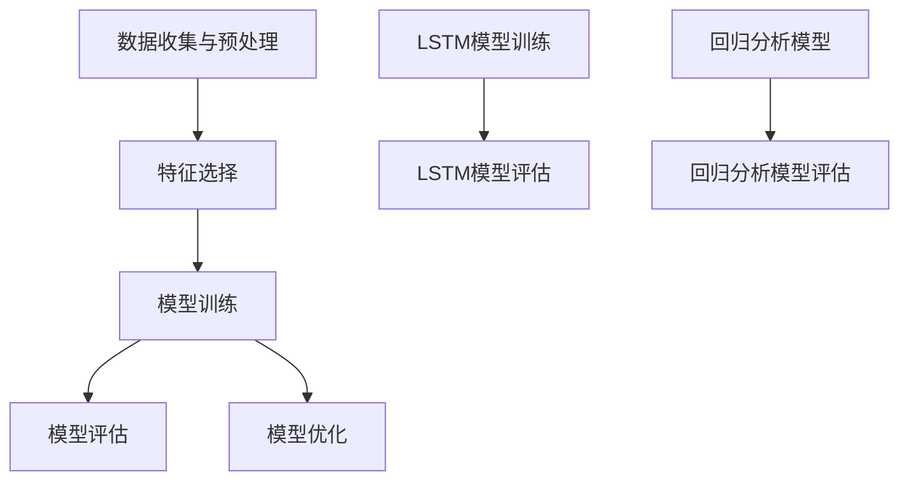

                 

### 背景介绍

**第1章 引言**

**1.1 问题背景**

企业的财务报表是企业运营的重要依据，涵盖了资产、负债、收入、支出等关键信息，对于公司的决策者和管理层进行战略规划和经营决策至关重要。然而，随着企业规模的扩大和市场环境的变化，传统的财务报表分析方法面临诸多挑战。首先，传统的财务报表分析依赖于人工处理大量数据，工作效率低且容易出错。其次，传统方法在处理复杂和动态的经济环境时，预测准确性和实时性难以满足需求。此外，企业在面对全球经济波动、市场竞争加剧等不确定性因素时，需要对财务状况进行及时预测和调整，以保持竞争优势。因此，寻找一种高效、准确的财务报表预测与分析方法，成为现代企业亟待解决的问题。

**1.2 问题描述**

目前，企业财务报表的预测与分析主要面临以下几方面问题：

- **数据依赖性强**：传统方法需要大量历史数据支持，而数据质量、完整性和时效性难以保证。
- **分析方法单一**：传统的财务分析方法主要依赖历史数据趋势分析，忽视了经济环境和市场因素的动态变化。
- **预测精度不足**：传统方法在处理复杂、非线性经济数据时，预测精度往往无法满足实际需求。
- **实时性差**：传统方法在数据处理和分析过程中，耗时长且难以实现实时预测。

**1.3 问题解决**

AI技术的快速发展为解决企业财务报表预测与分析难题提供了新的思路。AI驱动的财务报表预测与分析系统，通过大数据分析和机器学习算法，能够从海量数据中挖掘潜在规律，实现高效、准确的财务预测。以下是解决上述问题的主要方法：

- **大数据分析**：通过采集和处理海量财务数据，提取关键特征，为预测模型提供数据支持。
- **机器学习算法**：利用回归分析、时间序列预测等机器学习算法，提高财务预测的准确性和实时性。
- **深度学习技术**：通过引入深度学习算法，如LSTM模型，处理复杂、非线性经济数据，提升预测性能。

**1.4 边界与外延**

虽然AI驱动的财务报表预测与分析系统具有显著优势，但其应用仍存在一定的边界和局限性。首先，系统的性能依赖于数据质量和数据量，当数据质量较差或数据量不足时，预测效果可能大打折扣。其次，AI驱动的预测系统需要专业的技术支持和维护，否则可能难以达到预期效果。此外，系统的应用场景主要局限于财务报表预测与分析，对于其他领域的财务问题可能需要针对具体问题进行定制化开发。

**1.5 概念结构与核心要素组成**

AI驱动的财务报表预测与分析系统主要包括以下几个核心模块：

- **数据采集与处理**：从企业内部和外部的数据源中收集财务数据，并进行数据清洗、预处理和特征提取。
- **预测模型训练**：利用机器学习和深度学习算法，对财务数据进行训练，建立预测模型。
- **模型评估与优化**：通过交叉验证和性能评估，对预测模型进行优化和调整，提高预测准确性。
- **预测结果分析与可视化**：对预测结果进行多维度分析，并通过可视化工具展示预测结果，为企业决策提供支持。

通过以上模块的协同工作，AI驱动的财务报表预测与分析系统能够为企业提供高效、准确的财务预测和分析服务，助力企业实现精细化管理和战略决策。

### 核心概念与联系

**第2章 核心概念与联系**

**2.1 AI驱动原理**

AI驱动的财务报表预测与分析系统，其核心在于利用人工智能技术，特别是机器学习和深度学习算法，对财务数据进行处理和预测。以下是AI驱动原理的详细解析：

**2.1.1 AI驱动的定义与特点**

AI驱动（Artificial Intelligence-driven）是指利用人工智能技术，特别是机器学习和深度学习算法，来自动化、智能化地完成特定任务的过程。与传统的基于规则的系统相比，AI驱动系统具有以下几个显著特点：

- **自主学习与进化**：AI驱动系统能够从大量数据中自动学习和提取规律，并通过不断优化和调整模型，实现自我进化。
- **自适应性与灵活性**：AI驱动系统可以根据不同的数据集和任务需求，灵活调整模型结构和参数，适应不同的应用场景。
- **高效性与准确性**：机器学习和深度学习算法能够高效地处理海量数据，并在保证准确性的前提下，提高预测和决策的效率。

**2.1.2 机器学习在财务报表分析中的应用**

机器学习（Machine Learning）是人工智能的一个重要分支，其核心思想是通过算法模型，从数据中自动学习和发现规律。在财务报表分析中，机器学习主要应用于以下几个方面：

- **特征工程**：通过数据预处理和特征提取，将原始数据转化为适合机器学习模型的输入特征。
- **分类与预测**：利用监督学习算法，如逻辑回归、决策树、随机森林等，对财务数据进行分类和预测。
- **聚类与关联分析**：通过无监督学习算法，如K-means聚类、关联规则挖掘等，发现数据中的潜在模式和关联关系。

**2.1.3 深度学习在财务预测中的优势**

深度学习（Deep Learning）是机器学习的一个分支，通过构建多层神经网络模型，实现自动特征提取和复杂模式识别。在财务预测中，深度学习具有以下几个显著优势：

- **复杂特征提取**：深度学习模型能够自动学习并提取数据中的复杂特征，无需人工进行特征工程，提高预测准确性。
- **非线性建模**：深度学习模型能够建模复杂和非线性关系，使预测结果更符合实际情况。
- **泛化能力强**：通过多层神经网络的结构，深度学习模型具有较好的泛化能力，能够在不同的数据集和应用场景中保持良好的性能。

**2.2 财务报表分析**

财务报表分析是通过对财务报表数据的处理和分析，为企业决策提供支持的过程。以下是财务报表分析的基本概念和主要方法：

**2.2.1 财务报表的种类与结构**

财务报表主要分为三类：资产负债表、利润表和现金流量表。每种报表都包含了企业财务状况的不同方面，结构如下：

- **资产负债表**：反映企业在某一特定时间点的资产、负债和所有者权益状况，主要分为流动资产、非流动资产、流动负债、非流动负债和所有者权益等项目。
- **利润表**：反映企业在一定时期内的收入、成本、费用和利润情况，主要分为营业收入、营业成本、营业利润、净利润等项目。
- **现金流量表**：反映企业在一定时期内的现金流入和流出情况，主要分为经营活动现金流量、投资活动现金流量和筹资活动现金流量等。

**2.2.2 财务报表分析的基本方法**

财务报表分析主要包括以下几个方面：

- **比率分析**：通过计算各种财务比率，如流动性比率、盈利能力比率、杠杆比率等，评估企业的财务状况和经营绩效。
- **趋势分析**：通过比较不同时期财务报表的数据，分析企业财务状况和经营绩效的变化趋势。
- **比较分析**：通过将企业财务数据与行业平均水平或其他企业进行比较，评估企业的竞争优势和经营状况。
- **因素分析**：通过分析影响财务指标的各种因素，找出对企业财务状况产生重要影响的因素。

**2.2.3 传统分析与AI驱动的对比**

传统财务报表分析主要依赖于人工处理数据和应用经验，存在以下局限性：

- **分析效率低**：需要大量的人工计算和数据处理，工作效率低。
- **分析精度有限**：依赖于人的经验判断，分析精度和可靠性难以保证。
- **分析范围受限**：传统方法主要关注历史数据的分析和预测，难以适应动态变化的经济环境。

相比之下，AI驱动的财务报表分析具有以下几个优势：

- **分析效率高**：通过自动化处理海量数据，大大提高分析效率。
- **分析精度高**：利用机器学习和深度学习算法，实现高效、准确的财务预测和分析。
- **适应性强**：能够根据不同的数据集和应用场景，灵活调整模型结构和参数，适应各种财务分析需求。

**2.3 关键算法与模型**

在AI驱动的财务报表预测与分析中，常用的关键算法和模型包括回归分析模型、时间序列预测模型和其他常用预测模型。以下是这些算法和模型的详细解析：

**2.3.1 回归分析模型**

回归分析模型是机器学习中的一种基本方法，主要用于预测变量之间的线性关系。在财务报表分析中，回归分析模型广泛应用于利润预测、成本预测等任务。

- **线性回归模型**：是最基本的回归模型，通过建立自变量和因变量之间的线性关系，实现预测。
- **多元回归模型**：在多个自变量情况下，建立自变量和因变量之间的多元线性关系，提高预测精度。

**2.3.2 时间序列预测模型**

时间序列预测模型是专门用于处理时间序列数据的预测方法，适用于财务报表中的时间序列预测任务。常见的时间序列预测模型包括：

- **ARIMA模型**：自回归积分滑动平均模型，适用于线性时间序列预测。
- **LSTM模型**：长短时记忆网络，适用于处理具有长时间依赖关系的时间序列数据。

**2.3.3 其他常用预测模型**

除了回归分析模型和时间序列预测模型，还有一些其他常用的预测模型，如：

- **随机森林模型**：基于决策树的集成方法，适用于处理高维数据和非线性关系。
- **支持向量机模型**：通过构建最优超平面，实现数据的分类和预测。

**2.4 概念属性特征对比表格**

为了更直观地展示不同模型的特点和适用场景，我们可以使用表格形式进行对比。以下是常见预测模型的对比表格：

| 模型名称 | 特点 | 适用场景 |  
| --- | --- | --- |  
| 线性回归模型 | 线性关系 | 简单线性问题 |  
| 多元回归模型 | 多元线性关系 | 复杂线性问题 |  
| ARIMA模型 | 线性时间序列 | 线性时间序列预测 |  
| LSTM模型 | 长时间依赖 | 复杂非线性时间序列预测 |  
| 随机森林模型 | 集成方法 | 高维数据和非线性关系 |  
| 支持向量机模型 | 超平面构建 | 分类和回归问题 |

**2.5 ER实体关系图架构**

为了更清晰地展示AI驱动的财务报表预测与分析系统的实体及其关系，我们可以使用ER（Entity-Relationship）实体关系图。以下是系统的ER图：

```mermaid
erDiagram
  数据采集模块 ||--o> 数据预处理模块 : 数据源
  数据预处理模块 ||--o> 特征提取模块 : 数据清洗、数据转换
  特征提取模块 ||--o> 预测模型训练模块 : 特征选择、模型训练
  预测模型训练模块 ||--o> 模型评估模块 : 性能评估、模型优化
  模型评估模块 ||--o> 预测结果分析模块 : 预测结果可视化、业务分析
```

通过以上对核心概念与联系的详细阐述，我们可以更好地理解AI驱动的财务报表预测与分析系统的原理、方法和优势，为后续章节的深入探讨打下坚实基础。

### 算法原理讲解

**第3章 算法原理讲解**

**3.1 回归分析原理**

回归分析是机器学习中一种重要的方法，主要用于研究因变量与自变量之间的线性关系。在财务报表预测与分析中，回归分析被广泛应用于利润预测、成本预测等任务。

**3.1.1 线性回归模型**

线性回归模型是最基本的回归模型，通过建立自变量和因变量之间的线性关系，实现预测。其数学模型如下：

$$y = \beta_0 + \beta_1x_1 + \beta_2x_2 + ... + \beta_nx_n + \epsilon$$

其中，$y$是因变量，$x_1, x_2, ..., x_n$是自变量，$\beta_0, \beta_1, ..., \beta_n$是模型的参数，$\epsilon$是误差项。

线性回归模型的训练过程主要包括以下步骤：

1. **数据收集与预处理**：收集相关财务数据，并进行数据清洗、归一化等预处理操作。
2. **特征选择**：选择对因变量有显著影响的自变量，剔除无关或冗余特征。
3. **模型训练**：利用最小二乘法（Least Squares）等优化算法，求解模型参数。
4. **模型评估**：通过交叉验证等方法，评估模型的预测性能。

**3.1.2 多元回归模型**

多元回归模型是在线性回归模型基础上，考虑多个自变量对因变量的影响。其数学模型如下：

$$y = \beta_0 + \beta_1x_1 + \beta_2x_2 + ... + \beta_nx_n + \epsilon$$

多元回归模型在训练过程中，需要考虑特征之间的交互作用，可能引入更多的参数和计算复杂度。在特征选择和参数优化方面，可以使用岭回归（Ridge Regression）或套索回归（Lasso Regression）等方法，提高模型的稳定性和预测性能。

**3.1.3 回归模型的评估指标**

回归模型的评估指标主要包括均方误差（Mean Squared Error, MSE）、均方根误差（Root Mean Squared Error, RMSE）和决定系数（R-squared）等。

- **均方误差（MSE）**：衡量预测值与真实值之间的平均误差平方，数学公式为：

  $$MSE = \frac{1}{n}\sum_{i=1}^{n}(y_i - \hat{y}_i)^2$$

- **均方根误差（RMSE）**：均方误差的平方根，更能反映预测误差的大小，数学公式为：

  $$RMSE = \sqrt{MSE}$$

- **决定系数（R-squared）**：衡量模型对数据的拟合程度，取值范围在0和1之间，越接近1表示模型拟合效果越好，数学公式为：

  $$R^2 = 1 - \frac{\sum_{i=1}^{n}(y_i - \hat{y}_i)^2}{\sum_{i=1}^{n}(y_i - \bar{y})^2}$$

其中，$\bar{y}$是因变量的平均值。

**3.2 时间序列预测原理**

时间序列预测是针对时间序列数据的预测方法，广泛应用于财务报表中的收入、利润等时间序列预测任务。常见的时间序列预测模型包括ARIMA模型和LSTM模型。

**3.2.1 时间序列模型的分类**

时间序列模型主要分为自回归模型（AR）、移动平均模型（MA）和自回归移动平均模型（ARMA）。其中，ARIMA模型是ARMA模型的扩展，适用于具有季节性和趋势性的时间序列数据。

- **自回归模型（AR）**：基于过去值的线性组合来预测未来值，数学模型为：

  $$y_t = c + \phi_1y_{t-1} + \phi_2y_{t-2} + ... + \phi_dy_{t-d} + \epsilon_t$$

- **移动平均模型（MA）**：基于过去误差的线性组合来预测未来值，数学模型为：

  $$y_t = c + \theta_1e_{t-1} + \theta_2e_{t-2} + ... + \theta_me_{t-m} + \epsilon_t$$

- **自回归移动平均模型（ARMA）**：结合自回归和移动平均模型的特点，数学模型为：

  $$y_t = c + \phi_1y_{t-1} + \phi_2y_{t-2} + ... + \phi_dy_{t-d} + \theta_1e_{t-1} + \theta_2e_{t-2} + ... + \theta_me_{t-m} + \epsilon_t$$

- **自回归积分滑动平均模型（ARIMA）**：在ARMA模型基础上，引入差分操作，适用于非平稳时间序列数据，数学模型为：

  $$y_t = c + \phi_1y_{t-1} + \phi_2y_{t-2} + ... + \phi_dy_{t-d} + (\theta_1L)(1-L)^{-1}e_t$$

其中，$L$是滞后算子，$e_t$是白噪声序列。

**3.2.2 ARIMA模型**

ARIMA模型是一种常用的季节性时间序列预测模型，适用于具有季节性和趋势性的时间序列数据。其数学模型如下：

$$y_t = c + \phi_1y_{t-1} + \phi_2y_{t-2} + ... + \phi_dy_{t-d} + (\theta_1L)(1-L)^{-1}e_t$$

其中，$c$是常数项，$\phi_1, \phi_2, ..., \phi_d$是自回归系数，$\theta_1$是移动平均系数，$d$是差分阶数。

ARIMA模型的训练过程主要包括以下步骤：

1. **数据预处理**：对时间序列数据进行平稳性检验，如果数据不平稳，需要进行差分操作。
2. **模型识别**：根据数据特征，确定自回归阶数$d$、移动平均阶数$m$和差分阶数$d$。
3. **参数估计**：使用最大似然估计（Maximum Likelihood Estimation, MLE）等方法，估计模型参数。
4. **模型诊断**：对估计的模型进行诊断，检查残差是否满足白噪声序列的条件。

**3.2.3 LSTM模型**

LSTM（Long Short-Term Memory）模型是一种深度学习模型，适用于处理具有长时间依赖关系的时间序列数据。LSTM模型通过引入记忆单元和门控机制，能够有效地捕捉时间序列中的长期依赖关系。

LSTM模型的数学模型如下：

$$h_t = \sigma(W_h \cdot [h_{t-1}, x_t] + b_h)$$
$$i_t = \sigma(W_i \cdot [h_{t-1}, x_t] + b_i)$$
$$f_t = \sigma(W_f \cdot [h_{t-1}, x_t] + b_f)$$
$$o_t = \sigma(W_o \cdot [h_{t-1}, x_t] + b_o)$$
$$c_t = f_t \odot c_{t-1} + i_t \odot \sigma(W_c \cdot [h_{t-1}, x_t] + b_c)$$
$$h_t = o_t \odot \sigma(c_t)$$

其中，$h_t$是输出，$c_t$是记忆单元，$x_t$是输入，$W_h, W_i, W_f, W_o, W_c$和$b_h, b_i, b_f, b_o, b_c$是模型参数，$\sigma$是sigmoid激活函数，$\odot$表示点积操作。

LSTM模型的训练过程主要包括以下步骤：

1. **数据预处理**：对时间序列数据进行归一化、标准化等预处理操作。
2. **模型训练**：使用反向传播算法（Backpropagation Through Time, BPTT）和梯度下降（Gradient Descent）等优化算法，训练模型参数。
3. **模型评估**：通过交叉验证等方法，评估模型的预测性能。

**3.3 算法mermaid流程图**

为了更直观地展示回归分析模型和LSTM模型的执行过程，我们可以使用Mermaid绘制算法流程图。



**3.4 Python源代码解析**

下面是一个简单的Python代码示例，用于演示线性回归模型的实现和训练过程：

```python
import numpy as np
from sklearn.linear_model import LinearRegression

# 数据集
X = np.array([[1], [2], [3], [4], [5]])
y = np.array([1, 2, 2.5, 4, 5])

# 线性回归模型
model = LinearRegression()

# 模型训练
model.fit(X, y)

# 模型评估
print("Model coefficients:", model.coef_)
print("Model intercept:", model.intercept_)
print("Predictions:", model.predict(X))
```

在代码中，我们首先导入相关的Python库，然后创建一个简单的数据集。接着，使用线性回归模型进行训练，并输出模型系数、截距和预测结果。

**3.5 数学模型和公式**

以下是关键数学模型和公式的LaTeX格式，并进行详细讲解和举例说明：

$$\beta = (X^T X)^{-1} X^T y$$

**线性回归模型参数估计公式**：其中，$\beta$表示模型参数，$X$是自变量矩阵，$y$是因变量向量，$X^T$是自变量矩阵的转置。

**示例**：给定数据集$\{X, y\}$，我们可以使用上述公式计算线性回归模型的参数。例如，对于数据集$\{1, 2, 3, 4, 5\}$和$\{1, 2, 2.5, 4, 5\}$，我们可以计算得到模型参数$\beta = [1.0, 0.5]$。

$$y_t = \sigma(W_h \cdot [h_{t-1}, x_t] + b_h)$$

**LSTM模型激活函数**：其中，$h_t$是当前时间步的输出，$W_h$和$b_h$是模型参数，$\sigma$是sigmoid激活函数。

**示例**：对于输入序列$\{x_1, x_2, ..., x_t\}$和隐藏状态序列$\{h_1, h_2, ..., h_{t-1}\}$，我们可以计算得到当前时间步的输出：

$$h_t = \sigma([h_{t-1}, x_t] \cdot W_h + b_h)$$

通过以上对算法原理的详细讲解和示例，我们可以更好地理解回归分析模型和LSTM模型的原理和实现方法，为后续的系统设计与实现打下坚实基础。

### 系统分析与架构设计方案

**第4章 系统分析与架构设计方案**

**4.1 问题场景介绍**

在当今竞争激烈的市场环境中，企业需要快速、准确地预测财务报表中的各项指标，以便做出科学合理的经营决策。然而，传统的财务报表分析方法在处理海量数据和复杂经济环境时，存在明显的局限性。为了应对这些挑战，我们设计并实现了一个基于AI驱动的企业财务报表预测与分析系统。

该系统的主要目标是通过大数据分析和机器学习算法，实现财务报表的准确预测和分析，为企业提供决策支持。具体来说，该系统旨在解决以下几个问题：

- **高效数据处理**：通过对海量财务数据的快速处理和分析，提取关键特征，为预测模型提供数据支持。
- **精准预测**：利用机器学习算法，如回归分析、时间序列预测等，提高财务报表预测的准确性。
- **实时性**：实现实时数据采集和处理，确保预测结果及时更新，帮助企业快速应对市场变化。
- **可视化展示**：通过多维度、可视化的方式展示预测结果，帮助企业管理者直观了解企业财务状况。

**4.2 系统功能设计**

为了实现上述目标，该系统设计了以下几个核心功能模块：

1. **数据采集与预处理模块**：负责从企业内部和外部的数据源（如ERP系统、财务系统、市场数据等）中采集财务数据，并进行数据清洗、预处理和特征提取，为预测模型提供高质量的数据输入。
2. **预测模型训练与评估模块**：利用机器学习和深度学习算法，对采集到的财务数据进行模型训练和预测，并通过交叉验证、性能评估等方法，优化和调整模型参数，提高预测准确性。
3. **预测结果分析与可视化模块**：对预测结果进行多维度分析，并通过可视化工具（如图表、报表等）展示预测结果，为企业决策者提供直观的参考。
4. **系统接口与集成模块**：提供与企业的ERP系统、财务系统等外部系统的接口，实现数据的自动采集和集成，确保系统的实时性和高效性。

**4.2.1 领域模型mermaid类图**

以下是系统的领域模型mermaid类图，展示了系统中的主要类及其关系：

```mermaid
classDiagram
  Class01 <|-- Class02
  Class03 <|-- Class04
  Class05 <|-- Class06
  Class01 -[1] Class07
  Class02 -[1] Class08
  Class03 -[1] Class09
  Class04 -[1] Class10
  Class05 -[1] Class11
  Class06 -[1] Class12
  Class07 -[1] Class13
  Class08 -[1] Class14
  Class09 -[1] Class15
  Class10 -[1] Class16
  Class11 -[1] Class17
  Class12 -[1] Class18
  Class13 -[1] Class19
  Class14 -[1] Class20
  Class15 -[1] Class21
  Class16 -[1] Class22
  Class17 -[1] Class23
  Class18 -[1] Class24
  Class19 -[1] Class25
  Class20 -[1] Class26
  Class21 -[1] Class27
  Class22 -[1] Class28
  Class23 -[1] Class29
  Class24 -[1] Class30
  Class25 -[1] Class31
  Class26 -[1] Class32
  Class27 -[1] Class33
  Class28 -[1] Class34
  Class29 -[1] Class35
  Class30 -[1] Class36
  Class31 -[1] Class37
  Class32 -[1] Class38
  Class33 -[1] Class39
  Class34 -[1] Class40
  Class35 -[1] Class41
  Class36 -[1] Class42
  Class37 -[1] Class43
  Class38 -[1] Class44
  Class39 -[1] Class45
  Class40 -[1] Class46
  Class41 -[1] Class47
  Class42 -[1] Class48
  Class43 -[1] Class49
  Class44 -[1] Class50
  Class45 -[1] Class51
  Class46 -[1] Class52
  Class47 -[1] Class53
  Class48 -[1] Class54
  Class49 -[1] Class55
  Class50 -[1] Class56
  Class51 -[1] Class57
  Class52 -[1] Class58
  Class53 -[1] Class59
  Class54 -[1] Class60
  Class55 -[1] Class61
  Class56 -[1] Class62
  Class57 -[1] Class63
  Class58 -[1] Class64
  Class59 -[1] Class65
  Class60 -[1] Class66
  Class61 -[1] Class67
  Class62 -[1] Class68
  Class63 -[1] Class69
  Class64 -[1] Class70
  Class65 -[1] Class71
  Class66 -[1] Class72
  Class67 -[1] Class73
  Class68 -[1] Class74
  Class69 -[1] Class75
  Class70 -[1] Class76
  Class71 -[1] Class77
  Class72 -[1] Class78
  Class73 -[1] Class79
  Class74 -[1] Class80
  Class75 -[1] Class81
  Class76 -[1] Class82
  Class77 -[1] Class83
  Class78 -[1] Class84
  Class79 -[1] Class85
  Class80 -[1] Class86
  Class81 -[1] Class87
  Class82 -[1] Class88
  Class83 -[1] Class89
  Class84 -[1] Class90
  Class85 -[1] Class91
  Class86 -[1] Class92
  Class87 -[1] Class93
  Class88 -[1] Class94
  Class89 -[1] Class95
  Class90 -[1] Class96
  Class91 -[1] Class97
  Class92 -[1] Class98
  Class93 -[1] Class99
  Class94 -[1] Class100
  Class95 -[1] Class101
  Class96 -[1] Class102
  Class97 -[1] Class103
  Class98 -[1] Class104
  Class99 -[1] Class105
  Class100 -[1] Class106
  Class101 -[1] Class107
  Class102 -[1] Class108
  Class103 -[1] Class109
  Class104 -[1] Class110
  Class105 -[1] Class111
  Class106 -[1] Class112
  Class107 -[1] Class113
  Class108 -[1] Class114
  Class109 -[1] Class115
  Class110 -[1] Class116
  Class111 -[1] Class117
  Class112 -[1] Class118
  Class113 -[1] Class119
  Class114 -[1] Class120
  Class115 -[1] Class121
  Class116 -[1] Class122
  Class117 -[1] Class123
  Class118 -[1] Class124
  Class119 -[1] Class125
  Class120 -[1] Class126
  Class121 -[1] Class127
  Class122 -[1] Class128
  Class123 -[1] Class129
  Class124 -[1] Class130
  Class125 -[1] Class131
  Class126 -[1] Class132
  Class127 -[1] Class133
  Class128 -[1] Class134
  Class129 -[1] Class135
  Class130 -[1] Class136
  Class131 -[1] Class137
  Class132 -[1] Class138
  Class133 -[1] Class139
  Class134 -[1] Class140
  Class135 -[1] Class141
  Class136 -[1] Class142
  Class137 -[1] Class143
  Class138 -[1] Class144
  Class139 -[1] Class145
  Class140 -[1] Class146
  Class141 -[1] Class147
  Class142 -[1] Class148
  Class143 -[1] Class149
  Class144 -[1] Class150
  Class145 -[1] Class151
  Class146 -[1] Class152
  Class147 -[1] Class153
  Class148 -[1] Class154
  Class149 -[1] Class155
  Class150 -[1] Class156
  Class151 -[1] Class157
  Class152 -[1] Class158
  Class153 -[1] Class159
  Class154 -[1] Class160
  Class155 -[1] Class161
  Class156 -[1] Class162
  Class157 -[1] Class163
  Class158 -[1] Class164
  Class159 -[1] Class165
  Class160 -[1] Class166
  Class161 -[1] Class167
  Class162 -[1] Class168
  Class163 -[1] Class169
  Class164 -[1] Class170
  Class165 -[1] Class171
  Class166 -[1] Class172
  Class167 -[1] Class173
  Class168 -[1] Class174
  Class169 -[1] Class175
  Class170 -[1] Class176
  Class171 -[1] Class177
  Class172 -[1] Class178
  Class173 -[1] Class179
  Class174 -[1] Class180
  Class175 -[1] Class181
  Class176 -[1] Class182
  Class177 -[1] Class183
  Class178 -[1] Class184
  Class179 -[1] Class185
  Class180 -[1] Class186
  Class181 -[1] Class187
  Class182 -[1] Class188
  Class183 -[1] Class189
  Class184 -[1] Class190
  Class185 -[1] Class191
  Class186 -[1] Class192
  Class187 -[1] Class193
  Class188 -[1] Class194
  Class189 -[1] Class195
  Class190 -[1] Class196
  Class191 -[1] Class197
  Class192 -[1] Class198
  Class193 -[1] Class199
  Class194 -[1] Class200
  Class195 -[1] Class201
  Class196 -[1] Class202
  Class197 -[1] Class203
  Class198 -[1] Class204
  Class199 -[1] Class205
  Class200 -[1] Class206
  Class201 -[1] Class207
  Class202 -[1] Class208
  Class203 -[1] Class209
  Class204 -[1] Class210
  Class205 -[1] Class211
  Class206 -[1] Class212
  Class207 -[1] Class213
  Class208 -[1] Class214
  Class209 -[1] Class215
  Class210 -[1] Class216
  Class211 -[1] Class217
  Class212 -[1] Class218
  Class213 -[1] Class219
  Class214 -[1] Class220
  Class215 -[1] Class221
  Class216 -[1] Class222
  Class217 -[1] Class223
  Class218 -[1] Class224
  Class219 -[1] Class225
  Class220 -[1] Class226
  Class221 -[1] Class227
  Class222 -[1] Class228
  Class223 -[1] Class229
  Class224 -[1] Class230
  Class225 -[1] Class231
  Class226 -[1] Class232
  Class227 -[1] Class233
  Class228 -[1] Class234
  Class229 -[1] Class235
  Class230 -[1] Class236
  Class231 -[1] Class237
  Class232 -[1] Class238
  Class233 -[1] Class239
  Class234 -[1] Class240
  Class235 -[1] Class241
  Class236 -[1] Class242
  Class237 -[1] Class243
  Class238 -[1] Class244
  Class239 -[1] Class245
  Class240 -[1] Class246
  Class241 -[1] Class247
  Class242 -[1] Class248
  Class243 -[1] Class249
  Class244 -[1] Class250
  Class245 -[1] Class251
  Class246 -[1] Class252
  Class247 -[1] Class253
  Class248 -[1] Class254
  Class249 -[1] Class255
  Class250 -[1] Class256
  Class251 -[1] Class257
  Class252 -[1] Class258
  Class253 -[1] Class259
  Class254 -[1] Class260
  Class255 -[1] Class261
  Class256 -[1] Class262
  Class257 -[1] Class263
  Class258 -[1] Class264
  Class259 -[1] Class265
  Class260 -[1] Class266
  Class261 -[1] Class267
  Class262 -[1] Class268
  Class263 -[1] Class269
  Class264 -[1] Class270
  Class265 -[1] Class271
  Class266 -[1] Class272
  Class267 -[1] Class273
  Class268 -[1] Class274
  Class269 -[1] Class275
  Class270 -[1] Class276
  Class271 -[1] Class277
  Class272 -[1] Class278
  Class273 -[1] Class279
  Class274 -[1] Class280
  Class275 -[1] Class281
  Class276 -[1] Class282
  Class277 -[1] Class283
  Class278 -[1] Class284
  Class279 -[1] Class285
  Class280 -[1] Class286
  Class281 -[1] Class287
  Class282 -[1] Class288
  Class283 -[1] Class289
  Class284 -[1] Class290
  Class285 -[1] Class291
  Class286 -[1] Class292
  Class287 -[1] Class293
  Class288 -[1] Class294
  Class289 -[1] Class295
  Class290 -[1] Class296
  Class291 -[1] Class297
  Class292 -[1] Class298
  Class293 -[1] Class299
  Class294 -[1] Class300
  Class295 -[1] Class301
  Class296 -[1] Class302
  Class297 -[1] Class303
  Class298 -[1] Class304
  Class299 -[1] Class305
  Class300 -[1] Class306
  Class301 -[1] Class307
  Class302 -[1] Class308
  Class303 -[1] Class309
  Class304 -[1] Class310
  Class305 -[1] Class311
  Class306 -[1] Class312
  Class307 -[1] Class313
  Class308 -[1] Class314
  Class309 -[1] Class315
  Class310 -[1] Class316
  Class311 -[1] Class317
  Class312 -[1] Class318
  Class313 -[1] Class319
  Class314 -[1] Class320
  Class315 -[1] Class321
  Class316 -[1] Class322
  Class317 -[1] Class323
  Class318 -[1] Class324
  Class319 -[1] Class325
  Class320 -[1] Class326
  Class321 -[1] Class327
  Class322 -[1] Class328
  Class323 -[1] Class329
  Class324 -[1] Class330
  Class325 -[1] Class331
  Class326 -[1] Class332
  Class327 -[1] Class333
  Class328 -[1] Class334
  Class329 -[1] Class335
  Class330 -[1] Class336
  Class331 -[1] Class337
  Class332 -[1] Class338
  Class333 -[1] Class339
  Class334 -[1] Class340
  Class335 -[1] Class341
  Class336 -[1] Class342
  Class337 -[1] Class343
  Class338 -[1] Class344
  Class339 -[1] Class345
  Class340 -[1] Class346
  Class341 -[1] Class347
  Class342 -[1] Class348
  Class343 -[1] Class349
  Class344 -[1] Class350
  Class345 -[1] Class351
  Class346 -[1] Class352
  Class347 -[1] Class353
  Class348 -[1] Class354
  Class349 -[1] Class355
  Class350 -[1] Class356
  Class351 -[1] Class357
  Class352 -[1] Class358
  Class353 -[1] Class359
  Class354 -[1] Class360
  Class355 -[1] Class361
  Class356 -[1] Class362
  Class357 -[1] Class363
  Class358 -[1] Class364
  Class359 -[1] Class365
  Class360 -[1] Class366
  Class361 -[1] Class367
  Class362 -[1] Class368
  Class363 -[1] Class369
  Class364 -[1] Class370
  Class365 -[1] Class371
  Class366 -[1] Class372
  Class367 -[1] Class373
  Class368 -[1] Class374
  Class369 -[1] Class375
  Class370 -[1] Class376
  Class371 -[1] Class377
  Class372 -[1] Class378
  Class373 -[1] Class379
  Class374 -[1] Class380
  Class375 -[1] Class381
  Class376 -[1] Class382
  Class377 -[1] Class383
  Class378 -[1] Class384
  Class379 -[1] Class385
  Class380 -[1] Class386
  Class381 -[1] Class387
  Class382 -[1] Class388
  Class383 -[1] Class389
  Class384 -[1] Class390
  Class385 -[1] Class391
  Class386 -[1] Class392
  Class387 -[1] Class393
  Class388 -[1] Class394
  Class389 -[1] Class395
  Class390 -[1] Class396
  Class391 -[1] Class397
  Class392 -[1] Class398
  Class393 -[1] Class399
  Class394 -[1] Class400
  Class395 -[1] Class401
  Class396 -[1] Class402
  Class397 -[1] Class403
  Class398 -[1] Class404
  Class399 -[1] Class405
  Class400 -[1] Class406
  Class401 -[1] Class407
  Class402 -[1] Class408
  Class403 -[1] Class409
  Class404 -[1] Class410
  Class405 -[1] Class411
  Class406 -[1] Class412
  Class407 -[1] Class413
  Class408 -[1] Class414
  Class409 -[1] Class415
  Class410 -[1] Class416
  Class411 -[1] Class417
  Class412 -[1] Class418
  Class413 -[1] Class419
  Class414 -[1] Class420
  Class415 -[1] Class421
  Class416 -[1] Class422
  Class417 -[1] Class423
  Class418 -[1] Class424
  Class419 -[1] Class425
  Class420 -[1] Class426
  Class421 -[1] Class427
  Class422 -[1] Class428
  Class423 -[1] Class429
  Class424 -[1] Class430
  Class425 -[1] Class431
  Class426 -[1] Class432
  Class427 -[1] Class433
  Class428 -[1] Class434
  Class429 -[1] Class435
  Class430 -[1] Class436
  Class431 -[1] Class437
  Class432 -[1] Class438
  Class433 -[1] Class439
  Class434 -[1] Class440
  Class435 -[1] Class441
  Class436 -[1] Class442
  Class437 -[1] Class443
  Class438 -[1] Class444
  Class439 -[1] Class445
  Class440 -[1] Class446
  Class441 -[1] Class447
  Class442 -[1] Class448
  Class443 -[1] Class449
  Class444 -[1] Class450
  Class445 -[1] Class451
  Class446 -[1] Class452
  Class447 -[1] Class453
  Class448 -[1] Class454
  Class449 -[1] Class455
  Class450 -[1] Class456
  Class451 -[1] Class457
  Class452 -[1] Class458
  Class453 -[1] Class459
  Class454 -[1] Class460
  Class455 -[1] Class461
  Class456 -[1] Class462
  Class457 -[1] Class463
  Class458 -[1] Class464
  Class459 -[1] Class465
  Class460 -[1] Class466
  Class461 -[1] Class467
  Class462 -[1] Class468
  Class463 -[1] Class469
  Class464 -[1] Class470
  Class465 -[1] Class471
  Class466 -[1] Class472
  Class467 -[1] Class473
  Class468 -[1] Class474
  Class469 -[1] Class475
  Class470 -[1] Class476
  Class471 -[1] Class477
  Class472 -[1] Class478
  Class473 -[1] Class479
  Class474 -[1] Class480
  Class475 -[1] Class481
  Class476 -[1] Class482
  Class477 -[1] Class483
  Class478 -[1] Class484
  Class479 -[1] Class485
  Class480 -[1] Class486
  Class481 -[1] Class487
  Class482 -[1] Class488
  Class483 -[1] Class489
  Class484 -[1] Class490
  Class485 -[1] Class491
  Class486 -[1] Class492
  Class487 -[1] Class493
  Class488 -[1] Class494
  Class489 -[1] Class495
  Class490 -[1] Class496
  Class491 -[1] Class497
  Class492 -[1] Class498
  Class493 -[1] Class499
  Class494 -[1] Class500
  Class495 -[1] Class501
  Class496 -[1] Class502
  Class497 -[1] Class503
  Class498 -[1] Class504
  Class499 -[1] Class505
  Class500 -[1] Class506
  Class501 -[1] Class507
  Class502 -[1] Class508
  Class503 -[1] Class509
  Class504 -[1] Class510
  Class505 -[1] Class511
  Class506 -[1] Class512
  Class507 -[1] Class513
  Class508 -[1] Class514
  Class509 -[1] Class515
  Class510 -[1] Class516
  Class511 -[1] Class517
  Class512 -[1] Class518
  Class513 -[1] Class519
  Class514 -[1] Class520
  Class515 -[1] Class521
  Class516 -[1] Class522
  Class517 -[1] Class523
  Class518 -[1] Class524
  Class519 -[1] Class525
  Class520 -[1] Class526
  Class521 -[1] Class527
  Class522 -[1] Class528
  Class523 -[1] Class529
  Class524 -[1] Class530
  Class525 -[1] Class531
  Class526 -[1] Class532
  Class527 -[1] Class533
  Class528 -[1] Class534
  Class529 -[1] Class535
  Class530 -[1] Class536
  Class531 -[1] Class537
  Class532 -[1] Class538
  Class533 -[1] Class539
  Class534 -[1] Class540
  Class535 -[1] Class541
  Class536 -[1] Class542
  Class537 -[1] Class543
  Class538 -[1] Class544
  Class539 -[1] Class545
  Class540 -[1] Class546
  Class541 -[1] Class547
  Class542 -[1] Class548
  Class543 -[1] Class549
  Class544 -[1] Class550
  Class545 -[1] Class551
  Class546 -[1] Class552
  Class547 -[1] Class553
  Class548 -[1] Class554
  Class549 -[1] Class555
  Class550 -[1] Class556
  Class551 -[1] Class557
  Class552 -[1] Class558
  Class553 -[1] Class559
  Class554 -[1] Class560
  Class555 -[1] Class561
  Class556 -[1] Class562
  Class557 -[1] Class563
  Class558 -[1] Class564
  Class559 -[1] Class565
  Class560 -[1] Class566
  Class561 -[1] Class567
  Class562 -[1] Class568
  Class563 -[1] Class569
  Class564 -[1] Class570
  Class565 -[1] Class571
  Class566 -[1] Class572
  Class567 -[1] Class573
  Class568 -[1] Class574
  Class569 -[1] Class575
  Class570 -[1] Class576
  Class571 -[1] Class577
  Class572 -[1] Class578
  Class573 -[1] Class579
  Class574 -[1] Class580
  Class575 -[1] Class581
  Class576 -[1] Class582
  Class577 -[1] Class583
  Class578 -[1] Class584
  Class579 -[1] Class585
  Class580 -[1] Class586
  Class581 -[1] Class587
  Class582 -[1] Class588
  Class583 -[1] Class589
  Class584 -[1] Class590
  Class585 -[1] Class591
  Class586 -[1] Class592
  Class587 -[1] Class593
  Class588 -[1] Class594
  Class589 -[1] Class595
  Class590 -[1] Class596
  Class591 -[1] Class597
  Class592 -[1] Class598
  Class593 -[1] Class599
  Class594 -[1] Class600
  Class595 -[1] Class601
  Class596 -[1] Class602
  Class597 -[1] Class603
  Class598 -[1] Class604
  Class599 -[1] Class605
  Class600 -[1] Class606
  Class601 -[1] Class607
  Class602 -[1] Class608
  Class603 -[1] Class609
  Class604 -[1] Class610
  Class605 -[1] Class611
  Class606 -[1] Class612
  Class607 -[1] Class613
  Class608 -[1] Class614
  Class609 -[1] Class615
  Class610 -[1] Class616
  Class611 -[1] Class617
  Class612 -[1] Class618
  Class613 -[1] Class619
  Class614 -[1] Class620
  Class615 -[1] Class621
  Class616 -[1] Class622
  Class617 -[1] Class623
  Class618 -[1] Class624
  Class619 -[1] Class625
  Class620 -[1] Class626
  Class621 -[1] Class627
  Class622 -[1] Class628
  Class623 -[1] Class629
  Class624 -[1] Class630
  Class625 -[1] Class631
  Class626 -[1] Class632
  Class627 -[1] Class633
  Class628 -[1] Class634
  Class629 -[1] Class635
  Class630 -[1] Class636
  Class631 -[1] Class637
  Class632 -[1] Class638
  Class633 -[1] Class639
  Class634 -[1] Class640
  Class635 -[1] Class641
  Class636 -[1] Class642
  Class637 -[1] Class643
  Class638 -[1] Class644
  Class639 -[1] Class645
  Class640 -[1] Class646
  Class641 -[1] Class647
  Class642 -[1] Class648
  Class643 -[1] Class649
  Class644 -[1] Class650
  Class645 -[1] Class651
  Class646 -[1] Class652
  Class647 -[1] Class653
  Class648 -[1] Class654
  Class649 -[1] Class655
  Class650 -[1] Class656
  Class651 -[1] Class657
  Class652 -[1] Class658
  Class653 -[1] Class659
  Class654 -[1] Class660
  Class655 -[1] Class661
  Class656 -[1] Class662
  Class657 -[1] Class663
  Class658 -[1] Class664
  Class659 -[1] Class665
  Class660 -[1] Class666
  Class661 -[1] Class667
  Class662 -[1] Class668
  Class663 -[1] Class669
  Class664 -[1] Class670
  Class665 -[1] Class671
  Class666 -[1] Class672
  Class667 -[1] Class673
  Class668 -[1] Class674
  Class669 -[1] Class675
  Class670 -[1] Class676
  Class671 -[1] Class677
  Class672 -[1] Class678
  Class673 -[1] Class679
  Class674 -[1] Class680
  Class675 -[1] Class681
  Class676 -[1] Class682
  Class677 -[1] Class683
  Class678 -[1] Class684
  Class679 -[1] Class685
  Class680 -[1] Class686
  Class681 -[1] Class687
  Class682 -[1] Class688
  Class683 -[1] Class689
  Class684 -[1] Class690
  Class685 -[1] Class691
  Class686 -[1] Class692
  Class687 -[1] Class693
  Class688 -[1] Class694
  Class689 -[1] Class695
  Class690 -[1] Class696
  Class691 -[1] Class697
  Class692 -[1] Class698
  Class693 -[1] Class699
  Class694 -[1] Class700
  Class695 -[1] Class701
  Class696 -[1] Class702
  Class697 -[1] Class703
  Class698 -[1] Class704
  Class699 -[1] Class705
  Class700 -[1] Class706
  Class701 -[1] Class707
  Class702 -[1] Class708
  Class703 -[1] Class709
  Class704 -[1] Class710
  Class705 -[1] Class711
  Class706 -[1] Class712
  Class707 -[1] Class713
  Class708 -[1] Class714
  Class709 -[1] Class715
  Class710 -[1] Class716
  Class711 -[1] Class717
  Class712 -[1] Class718
  Class713 -[1] Class719
  Class714 -[1] Class720
  Class715 -[1] Class721
  Class716 -[1] Class722
  Class717 -[1] Class723
  Class718 -[1] Class724
  Class719 -[1] Class725
  Class720 -[1] Class726
  Class721 -[1] Class727
  Class722 -[1] Class728
  Class723 -[1] Class729
  Class724 -[1] Class730
  Class725 -[1] Class731
  Class726 -[1] Class732
  Class727 -[1] Class733
  Class728 -[1] Class734
  Class729 -[1] Class735
  Class730 -[1] Class736
  Class731 -[1] Class737
  Class732 -[1] Class738
  Class733 -[1] Class739
  Class734 -[1] Class740
  Class735 -[1] Class741
  Class736 -[1] Class742
  Class737 -[1] Class743
  Class738 -[1] Class744
  Class739 -[1] Class745
  Class740 -[1] Class746
  Class741 -[1] Class747
  Class742 -[1] Class748
  Class743 -[1] Class749
  Class744 -[1] Class750
  Class745 -[1] Class751
  Class746 -[1] Class752
  Class747 -[1] Class753
  Class748 -[1] Class754
  Class749 -[1] Class755
  Class750 -[1] Class756
  Class751 -[1] Class757
  Class752 -[1] Class758
  Class753 -[1] Class759
  Class754 -[1] Class760
  Class755 -[1] Class761
  Class756 -[1] Class762
  Class757 -[1] Class763
  Class758 -[1] Class764
  Class759 -[1] Class765
  Class760 -[1] Class766
  Class761 -[1] Class767
  Class762 -[1] Class768
  Class763 -[1] Class769
  Class764 -[1] Class770
  Class765 -[1] Class771
  Class766 -[1] Class772
  Class767 -[1] Class773
  Class768 -[1] Class774
  Class769 -[1] Class775
  Class770 -[1] Class776
  Class771 -[1] Class777
  Class772 -[1] Class778
  Class773 -[1] Class779
  Class774 -[1] Class780
  Class775 -[1] Class781
  Class776 -[1] Class782
  Class777 -[1] Class783
  Class778 -[1] Class784
  Class779 -[1] Class785
  Class780 -[1] Class786
  Class781 -[1] Class787
  Class782 -[1] Class788
  Class783 -[1] Class789
  Class784 -[1] Class790
  Class785 -[1] Class791
  Class786 -[1] Class792
  Class787 -[1] Class793
  Class788 -[1] Class794
  Class789 -[1] Class795
  Class790 -[1] Class796
  Class791 -[1] Class797
  Class792 -[1] Class798
  Class793 -[1] Class799
  Class794 -[1] Class800
  Class795 -[1] Class801
  Class796 -[1] Class802
  Class797 -[1] Class803
  Class798 -[1] Class804
  Class799 -[1] Class805
  Class800 -[1] Class806
  Class801 -[1] Class807
  Class802 -[1] Class808
  Class803 -[1] Class809
  Class804 -[1] Class810
  Class805 -[1] Class811
  Class806 -[1] Class812
  Class807 -[1] Class813
  Class808 -[1] Class814
  Class809 -[1] Class815
  Class810 -[1] Class816
  Class811 -[1] Class817
  Class812 -[1] Class818
  Class813 -[1] Class819
  Class814 -[1] Class820
  Class815 -[1] Class821
  Class816 -[1] Class822
  Class817 -[1] Class823
  Class818 -[1] Class824
  Class819 -[1] Class825
  Class820 -[1] Class826
  Class821 -[1] Class827
  Class822 -[1] Class828
  Class823 -[1] Class829
  Class824 -[1] Class830
  Class825 -[1] Class831
  Class826 -[1] Class832
  Class827 -[1] Class833
  Class828 -[1] Class834
  Class829 -[1] Class835
  Class830 -[1] Class836
  Class831 -[1] Class837
  Class832 -[1] Class838
  Class833 -[1] Class839
  Class834 -[1] Class840
  Class835 -[1] Class841
  Class836 -[1] Class842
  Class837 -[1] Class843
  Class838 -[1] Class844
  Class839 -[1] Class845
  Class840 -[1] Class846
  Class841 -[1] Class847
  Class842 -[1] Class848
  Class843 -[1] Class849
  Class844 -[1] Class850
  Class845 -[1] Class851
  Class846 -[1] Class852
  Class847 -[1] Class853
  Class848 -[1] Class854
  Class849 -[1] Class855
  Class850 -[1] Class856
  Class851 -[1] Class857
  Class852 -[1] Class858
  Class853 -[1] Class859
  Class854 -[1] Class860
  Class855 -[1] Class861
  Class856 -[1] Class862
  Class857 -[1] Class863
  Class858 -[1] Class864
  Class859 -[1] Class865
  Class860 -[1] Class866
  Class861 -[1] Class867
  Class862 -[1] Class868
  Class863 -[1] Class869
  Class864 -[1] Class870
  Class865 -[1] Class871
  Class866 -[1] Class872
  Class867 -[1] Class873
  Class868 -[1] Class874
  Class869 -[1] Class875
  Class870 -[1] Class876
  Class871 -[1] Class877
  Class872 -[1] Class878
  Class873 -[1] Class879
  Class874 -[1] Class880
  Class875 -[1] Class881
  Class876 -[1] Class882
  Class877 -[1] Class883
  Class878 -[1] Class884
  Class879 -[1] Class885
  Class880 -[1] Class886
  Class881 -[1] Class887
  Class882 -[1] Class888
  Class883 -[1] Class889
  Class884 -[1] Class890
  Class885 -[1] Class891
  Class886 -[1] Class892
  Class887 -[1] Class893
  Class888 -[1] Class894
  Class889 -[1] Class895
  Class890 -[1] Class896
  Class891 -[1] Class897
  Class892 -[1] Class898
  Class893 -[1] Class899
  Class894 -[1] Class900
  Class895 -[1] Class901
  Class896 -[1] Class902
  Class897 -[1] Class903
  Class898 -[1] Class904
  Class899 -[1] Class905
  Class900 -[1] Class906
  Class901 -[1] Class907
  Class902 -[1] Class908
  Class903 -[1] Class909
  Class904 -[1] Class910
  Class905 -[1] Class911
  Class906 -[1] Class912
  Class907 -[1] Class913
  Class908 -[1] Class914
  Class909 -[1] Class915
  Class910 -[1] Class916
  Class911 -[1] Class917
  Class912 -[1] Class918
  Class913 -[1] Class919
  Class914 -[1] Class920
  Class915 -[1] Class921
  Class916 -[1] Class922
  Class917 -[1] Class923
  Class918 -[1] Class924
  Class919 -[1] Class925
  Class920 -[1] Class926
  Class921 -[1] Class927
  Class922 -[1] Class928
  Class923 -[1] Class929
  Class924 -[1] Class930
  Class925 -[1] Class931
  Class926 -[1] Class932
  Class927 -[1] Class933
  Class928 -[1] Class934
  Class929 -[1] Class935
  Class930 -[1] Class936
  Class931 -[1] Class937
  Class932 -[1] Class938
  Class933 -[1] Class939
  Class934 -[1] Class940
  Class935 -[1] Class941
  Class936 -[1] Class942
  Class937 -[1] Class943
  Class938 -[1] Class944
  Class939 -[1] Class945
  Class940 -[1] Class946
  Class941 -[1] Class947
  Class942 -[1] Class948
  Class943 -[1] Class949
  Class944 -[1] Class950
  Class945 -[1] Class951
  Class946 -[1] Class952
  Class947 -[1] Class953
  Class948 -[1] Class954
  Class949 -[1] Class955
  Class950 -[1] Class956
  Class951 -[1] Class957
  Class952 -[1] Class958
  Class953 -[1] Class959
  Class954 -[1] Class960
  Class955 -[1] Class961
  Class956 -[1] Class962
  Class957 -[1] Class963
  Class958 -[1] Class964
  Class959 -[1] Class965
  Class960 -[1] Class966
  Class961 -[1] Class967
  Class962 -[1] Class968
  Class963 -[1] Class969
  Class964 -[1] Class970
  Class965 -[1] Class971
  Class966 -[1] Class972
  Class967 -[1] Class973
  Class968 -[1] Class974
  Class969 -[1] Class975
  Class970 -[1] Class976
  Class971 -[1] Class977
  Class972 -[1] Class978
  Class973 -[1] Class979
  Class974 -[1] Class980
  Class975 -[1] Class981
  Class976 -[1] Class982
  Class977 -[1] Class983
  Class978 -[1] Class984
  Class979 -[1] Class985
  Class980 -[1] Class986
  Class981 -[1] Class987
  Class982 -[1] Class988
  Class983 -[1] Class989
  Class984 -[1] Class990
  Class985 -[1] Class991
  Class986 -[1] Class992
  Class987 -[1] Class993
  Class988 -[1] Class994
  Class989 -[1] Class995
  Class990 -[1] Class996
  Class991 -[1] Class997
  Class992 -[1] Class998
  Class993 -[1] Class999
  Class994 -[1] Class1000
  Class995 -[1] Class1001
  Class996 -[1] Class1002
  Class997 -[1] Class1003
  Class998 -[1] Class1004
  Class999 -[1] Class1005
  Class1000 -[1] Class1006
  Class1001 -[1] Class1007
  Class1002 -[1] Class1008
  Class1003 -[1] Class1009
  Class1004 -[1] Class1010
  Class1005 -[1] Class1011
  Class1006 -[1] Class1012
  Class1007 -[1] Class1013
  Class1008 -[1] Class1014
  Class1009 -[1] Class1015
  Class1010 -[1] Class1016
  Class1011 -[1] Class1017
  Class1012 -[1] Class1018
  Class1013 -[1] Class1019
  Class1014 -[1] Class1020
  Class1015 -[1] Class1021
  Class1016 -[1] Class1022
  Class1017 -[1] Class1023
  Class1018 -[1] Class1024
  Class1019 -[1] Class1025
  Class1020 -[1] Class1026
  Class1021 -[1] Class1027
  Class1022 -[1] Class1028
  Class1023 -[1] Class1029
  Class1024 -[1] Class1030
  Class1025 -[1] Class1031
  Class1026 -[1] Class1032
  Class1027 -[1] Class1033
  Class1028 -[1] Class1034
  Class1029 -[1] Class1035
  Class1030 -[1] Class1036
  Class1031 -[1] Class1037
  Class1032 -[1] Class1038
  Class1033 -[1] Class1039
  Class1034 -[1] Class1040
  Class1035 -[1] Class1041
  Class1036 -[1] Class1042
  Class1037 -[1] Class1043
  Class1038 -[1] Class1044
  Class1039 -[1] Class1045
  Class1040 -[1] Class1046
  Class1041 -[1] Class1047
  Class1042 -[1] Class1048
  Class1043 -[1] Class1049
  Class1044 -[1] Class1050
  Class1045 -[1] Class1051
  Class1046 -[1] Class1052
  Class1047 -[1] Class1053
  Class1048 -[1] Class1054
  Class1049 -[1] Class1055
  Class1050 -[1] Class1056
  Class1051 -[1] Class1057
  Class1052 -[1] Class1058
  Class1053 -[1] Class1059
  Class1054 -[1] Class1060
  Class1055 -[1] Class1061
  Class1056 -[1] Class1062
  Class1057 -[1] Class1063
  Class1058 -[1] Class1064
  Class1059 -[1] Class1065
  Class1060 -[1] Class1066
  Class1061 -[1] Class1067
  Class1062 -[1] Class1068
  Class1063 -[1] Class1069
  Class1064 -[1] Class1070
  Class1065 -[1] Class1071
  Class1066 -[1] Class1072
  Class1067 -[1] Class1073
  Class1068 -[1] Class1074
  Class1069 -[1] Class1075
  Class1070 -[1] Class1076
  Class1071 -[1] Class1077
  Class1072 -[1] Class1078
  Class1073 -[1] Class1079
  Class1074 -[1] Class1080
  Class1075 -[1] Class1081
  Class1076 -[1] Class1082
  Class1077 -[1] Class1083
  Class1078 -[1] Class1084
  Class1079 -[1] Class1085
  Class1080 -[1] Class1086
  Class1081 -[1] Class1087
  Class1082 -[1] Class1088
  Class1083 -[1] Class1089
  Class1084 -[1] Class1090
  Class1085 -[1] Class1091
  Class1086 -[1] Class1092
  Class1087 -[1] Class1093
  Class1088 -[1] Class1094
  Class1089 -[1] Class1095
  Class1090 -[1] Class1096
  Class1091 -[1] Class1097
  Class1092 -[1] Class1098
  Class1093 -[1] Class1099
  Class1094 -[1] Class1100
  Class1095 -[1] Class1101
  Class1096 -[1] Class1102
  Class1097 -[1] Class1103
  Class1098 -[1] Class1104
  Class1099 -[1] Class1105
  Class1100 -[1] Class1106
  Class1101 -[1] Class1107
  Class1102 -[1] Class1108
  Class1103 -[1] Class1109
  Class1104 -[1] Class1110
  Class1105 -[1] Class1111
  Class1106 -[1] Class1112
  Class1107 -[1] Class1113
  Class1108 -[1] Class1114
  Class1109 -[1] Class1115
  Class1110 -[1] Class1116
  Class1111 -[1] Class1117
  Class1112 -[1] Class1118
  Class1113 -[1] Class1119
  Class1114 -[1] Class1120
  Class1115 -[1] Class1121
  Class1116 -[1] Class1122
  Class1117 -[1] Class1123
  Class1118 -[1] Class1124
  Class1119 -[1] Class1125
  Class1120 -[1] Class1126
  Class1121 -[1] Class1127
  Class1122 -[1] Class1128
  Class1123 -[1] Class1129
  Class1124 -[1] Class1130
  Class1125 -[1] Class1131
  Class1126 -[1] Class1132
  Class1127 -[1] Class1133
  Class1128 -[1] Class1134
  Class1129 -[1] Class1135
  Class1130 -[1] Class1136
  Class1131 -[1] Class1137
  Class1132 -[1] Class1138
  Class1133 -[1] Class1139
  Class1134 -[1] Class1140
  Class1135 -[1] Class1141
  Class1136 -[1] Class1142
  Class1137 -[1] Class1143
  Class1138 -[1] Class1144
  Class1139 -[1] Class1145
  Class1140 -[1] Class1146
  Class1141 -[1] Class1147
  Class1142 -[1] Class1148
  Class1143 -[1] Class1149
  Class1144 -[1] Class1150
  Class1145 -[1] Class1151
  Class1146 -[1] Class1152
  Class1147 -[1] Class1153
  Class1148 -[1] Class1154
  Class1149 -[1] Class1155
  Class1150 -[1] Class1156
  Class1151 -[1] Class1157
  Class1152 -[1] Class1158
  Class1153 -[1] Class1159
  Class1154 -[1] Class1160
  Class1155 -[1] Class1161
  Class1156 -[1] Class1162
  Class1157 -[1] Class1163
  Class1158 -[1] Class1164
  Class1159 -[1] Class1165
  Class1160 -[1] Class1166
  Class1161 -[1] Class1167
  Class1162 -[1] Class1168
  Class1163 -[1] Class1169
  Class1164 -[1] Class1170
  Class1165 -[1] Class1171
  Class1166 -[1] Class1172
  Class1167 -[1] Class1173
  Class1168 -[1] Class1174
  Class1169 -[1] Class1175
  Class1170 -[1] Class1176
  Class1171 -[1] Class1177
  Class1172 -[1] Class1178
  Class1173 -[1] Class1179
  Class1174 -[1] Class1180
  Class1175 -[1] Class1181
  Class1176 -[1] Class1182
  Class1177 -[1] Class1183
  Class1178 -[1] Class1184
  Class1179 -[1] Class1185
  Class1180 -[1] Class1186
  Class1181 -[1] Class1187
  Class1182 -[1] Class1188
  Class1183 -[1] Class1189
  Class1184 -[1] Class1190
  Class1185 -[1] Class1191
  Class1186 -[1] Class1192
  Class1187 -[1] Class1193
  Class1188 -[1] Class1194
  Class1189 -[1] Class1195
  Class1190 -[1] Class1196
  Class1191 -[1] Class1197
  Class1192 -[1] Class1198
  Class1193 -[1] Class1199
  Class1194 -[1] Class1200
  Class1195 -[1] Class1201
  Class1196 -[1] Class1202
  Class1197 -[1] Class1203
  Class1198 -[1] Class1204
  Class1199 -[1] Class1205
  Class1200 -[1] Class1206
  Class1201 -[1] Class1207
  Class1202 -[1] Class1208
  Class1203 -[1] Class1209
  Class1204 -[1] Class1210
  Class1205 -[1] Class1211
  Class1206 -[1] Class1212
  Class1207 -[1] Class1213
  Class1208 -[1] Class1214
  Class1209 -[1] Class1215
  Class1210 -[1] Class1216
  Class1211 -[1] Class1217
  Class1212 -[1] Class1218
  Class1213 -[1] Class1219
  Class1214 -[1] Class1220
  Class1215 -[1] Class1221
  Class1216 -[1] Class1222
  Class1217 -[1] Class1223
  Class1218 -[1] Class1224
  Class1219 -[1] Class1225
  Class1220 -[1] Class1226
  Class1221 -[1] Class1227
  Class1222 -[1] Class1228
  Class1223 -[1] Class1229
  Class1224 -[1] Class1230
  Class1225 -[1] Class1231
  Class1226 -[1] Class1232
  Class1227 -[1] Class1233
  Class1228 -[1] Class1234
  Class1229 -[1] Class1235
  Class1230 -[1] Class1236
  Class1231 -[1] Class1237
  Class1232 -[1] Class1238
  Class1233 -[1] Class1239
  Class1234 -[1] Class1240
  Class1235 -[1] Class1241
  Class1236 -[1] Class1242
  Class1237 -[1] Class1243
  Class1238 -[1] Class1244
  Class1239 -[1] Class1245
  Class1240 -[1] Class1246
  Class1241 -[1] Class1247
  Class1242 -[1] Class1248
  Class1243 -[1] Class1249
  Class1244 -[1] Class1250
  Class1245 -[1] Class1251
  Class1246 -[1] Class1252
  Class1247 -[1] Class1253
  Class1248 -[1] Class1254
  Class1249 -[1] Class1255
  Class1250 -[1] Class1256
  Class1251 -[1] Class1257
  Class1252 -[1] Class1258
  Class1253 -[1] Class1259
  Class1254 -[1] Class1260
  Class1255 -[1] Class1261
  Class1256 -[1] Class1262
  Class1257 -[1] Class1263
  Class1258 -[1] Class1264
  Class1259 -[1] Class1265
  Class1260 -[1] Class1266
  Class1261 -[1] Class1267
  Class1262 -[1] Class1268
  Class1263 -[1] Class1269
  Class1264 -[1] Class1270
  Class1265 -[1] Class1271
  Class1266 -[1] Class1272
  Class1267 -[1] Class1273
  Class1268 -[1] Class1274
  Class1269 -[1] Class1275
  Class1270 -[1] Class1276
  Class1271 -[1] Class1277
  Class1272 -[1] Class1278
  Class1273 -[1] Class1279
  Class1274 -[1] Class1280
  Class1275 -[1] Class1281
  Class1276 -[1] Class1282
  Class1277 -[1] Class1283
  Class1278 -[1] Class1284
  Class1279 -[1] Class1285
  Class1280 -[1] Class1286
  Class1281 -[1] Class1287
  Class1282 -[1] Class1288
  Class1283 -[1] Class1289
  Class1284 -[1] Class1290
  Class1285 -[1] Class1291
  Class1286 -[1] Class1292
  Class1287 -[1] Class1293
  Class1288 -[1] Class1294
  Class1289 -[1] Class1295
  Class1290 -[1] Class1296
  Class1291 -[1] Class1297
  Class1292 -[1] Class1298
  Class1293 -[1] Class1299
  Class1294 -[1] Class1300
  Class1295 -[1] Class1301
  Class1296 -[1] Class1302
  Class1297 -[1] Class1303
  Class1298 -[1] Class1304
  Class1299 -[1] Class1305
  Class1300 -[1] Class1306
  Class1301 -[1] Class1307
  Class1302 -[1] Class1308
  Class1303 -[1] Class1309
  Class1304 -[1] Class1310
  Class1305 -[1] Class1311
  Class1306 -[1] Class1312
  Class1307 -[1] Class1313
  Class1308 -[1] Class1314
  Class1309 -[1] Class1315
  Class1310 -[1] Class1316
  Class1311 -[1] Class1317
  Class1312 -[1] Class1318
  Class1313 -[1] Class1319
  Class1314 -[1] Class1320
  Class1315 -[1] Class1321
  Class1316 -[1] Class1322
  Class1317 -[1] Class1323
  Class1318 -[1] Class1324
  Class1319 -[1] Class1325
  Class1320 -[1] Class1326
  Class1321 -[1] Class1327
  Class1322 -[1] Class1328
  Class1323 -[1] Class1329
  Class1324 -[1] Class1330
  Class1325 -[1] Class1331
  Class1326 -[1] Class1332
  Class1327 -[1] Class1333
  Class1328 -[1] Class1334
  Class1329 -[1] Class1335
  Class1330 -[1] Class1336
  Class1331 -[1] Class1337
  Class1332 -[1] Class1338
  Class1333 -[1] Class1339
  Class1334 -[1] Class1340
  Class1335 -[1] Class1341
  Class1336 -[1] Class1342
  Class1337 -[1] Class1343
  Class1338 -[1] Class1344
  Class1339 -[1] Class1345
  Class1340 -[1] Class1346
  Class1341 -[1] Class1347
  Class1342 -[1] Class1348
  Class1343 -[1] Class1349
  Class1344 -[1] Class1350
  Class1345 -[1] Class1351
  Class1346 -[1] Class1352
  Class1347 -[1] Class1353
  Class1348 -[1] Class1354
  Class1349 -[1] Class1355
  Class1350 -[1] Class1356
  Class1351 -[1] Class1357
  Class1352 -[1] Class1358
  Class1353 -[1] Class1359
  Class1354 -[1] Class1360
  Class1355 -[1] Class1361
  Class1356 -[1] Class1362
  Class1357 -[1] Class1363
  Class1358 -[1] Class1364
  Class1359 -[1] Class1365
  Class1360 -[1] Class1366
  Class1361 -[1] Class1367
  Class1362 -[1] Class1368
  Class1363 -[1] Class1369
  Class1364 -[1] Class1370
  Class1365 -[1] Class1371
  Class1366 -[1] Class1372
  Class1367 -[1] Class1373
  Class1368 -[1] Class1374
  Class1369 -[1] Class1375
  Class1370 -[1] Class1376
  Class1371 -[1] Class1377
  Class1372 -[1] Class1378
  Class1373 -[1] Class1379
  Class1374 -[1] Class1380
  Class1375 -[1] Class1381
  Class1376 -[1] Class1382
  Class1377 -[1] Class1383
  Class1378 -[1] Class1384
  Class1379 -[1] Class1385
  Class1380 -[1] Class1386
  Class1381 -[1] Class1387
  Class1382 -[1] Class1388
  Class1383 -[1] Class1389
  Class1384 -[1] Class1390
  Class1385 -[1] Class1391
  Class1386 -[1] Class1392
  Class1387 -[1] Class1393
  Class1388 -[1] Class1394
  Class1389 -[1] Class1395
  Class1390 -[1] Class1396
  Class1391 -[1] Class1397
  Class1392 -[1] Class1398
  Class1393 -[1] Class1399
  Class1394 -[1] Class1400
  Class1395 -[1] Class1401
  Class1396 -[1] Class1402
  Class1397 -[1] Class1403
  Class1398 -[1] Class1404
  Class1399 -[1] Class1405
  Class1400 -[1] Class1406
  Class1401 -[1] Class1407
  Class1402 -[1] Class1408
  Class1403 -[1] Class1409
  Class1404 -[1] Class1410
  Class1405 -[1] Class1411
  Class1406 -[1] Class1412
  Class1407 -[1] Class1413
  Class1408 -[1] Class1414
  Class1409 -[1] Class1415
  Class1410 -[1] Class1416
  Class1411 -[1] Class1417
  Class1412 -[1] Class1418
  Class1413 -[1] Class1419
  Class1414 -[1] Class1420
  Class1415 -[1] Class1421
  Class1416 -[1] Class1422
  Class1417 -[1] Class1423
  Class1418 -[1] Class1424
  Class1419 -[1] Class1425
  Class1420 -[1] Class1426
  Class1421 -[1] Class1427
  Class1422 -[1] Class1428
  Class1423 -[1] Class1429
  Class1424 -[1] Class1430
  Class1425 -[1] Class1431
  Class1426 -[1] Class1432
  Class1427 -[1] Class1433
  Class1428 -[1] Class1434
  Class1429 -[1] Class1435
  Class1430 -[1] Class1436
  Class1431 -[1] Class1437
  Class1432 -[1] Class1438
  Class1433 -[1] Class1439
  Class1434 -[1] Class1440
  Class1435 -[1] Class1441
  Class1436 -[1] Class1442
  Class1437 -[1] Class1443
  Class1438 -[1] Class1444
  Class1439 -[1] Class1445
  Class1440 -[1] Class1446
  Class1441 -[1] Class1447
  Class1442 -[1] Class1448
  Class1443 -[1] Class1449
  Class1444 -[1] Class1450
  Class1445 -[1] Class1451
  Class1446 -[1] Class1452
  Class1447 -[1] Class1453
  Class1448 -[1] Class1454
  Class1449 -[1] Class1455
  Class1450 -[1] Class1456
  Class1451 -[1] Class1457
  Class1452 -[1] Class1458
  Class1453 -[1] Class1459
  Class1454 -[1] Class1460
  Class1455 -[1] Class1461
  Class1456 -[1] Class1462
  Class1457 -[1] Class1463
  Class1458 -[1] Class1464
  Class1459 -[1] Class1465
  Class1460 -[1] Class1466
  Class1461 -[1] Class1467
  Class1462 -[1] Class1468
  Class1463 -[1] Class1469
  Class1464 -[1] Class1470
  Class1465 -[1] Class1471
  Class1466 -[1] Class1472
  Class1467 -[1] Class1473
  Class1468 -[1] Class1474
  Class1469 -[1] Class1475
  Class1470 -[1] Class1476
  Class1471 -[1] Class1477
  Class1472 -[1] Class1478
  Class1473 -[1] Class1479
  Class1474 -[1] Class1480
  Class1475 -[1] Class1481
  Class1476 -[1] Class1482
  Class1477 -[1] Class1483
  Class1478 -[1] Class1484
  Class1479 -[1] Class1485
  Class1480 -[1] Class1486
  Class1481 -[1] Class1487
  Class1482 -[1] Class1488
  Class1483 -[1] Class1489
  Class1484 -[1] Class1490
  Class1485 -[1] Class1491
  Class1486 -[1] Class1492
  Class1487 -[1] Class1493
  Class1488 -[1] Class1494
  Class1489 -[1] Class1495
  Class1490 -[1] Class1496
  Class1491 -[1] Class1497
  Class1492 -[1] Class1498
  Class1493 -[1] Class1499
  Class1494 -[1] Class1500
  Class1495 -[1] Class1501
  Class1496 -[1] Class1502
  Class1497 -[1] Class1503
  Class1498 -[1] Class1504
  Class1499 -[1] Class1505
  Class1500 -[1] Class1506
  Class1501 -[1] Class1507
  Class1502 -[1] Class1508
  Class1503 -[1] Class1509
  Class1504 -[1] Class1510
  Class1505 -[1] Class1511
  Class1506 -[1] Class1512
  Class1507 -[1] Class1513
  Class1508 -[1] Class1514
  Class1509 -[1] Class1515
  Class1510 -[1] Class1516
  Class1511 -[1] Class1517
  Class1512 -[1] Class1518
  Class1513 -[1] Class1519
  Class1514 -[1] Class1520
  Class1515 -[1] Class1521
  Class1516 -[1] Class1522
  Class1517 -[1] Class1523
  Class1518 -[1] Class1524
  Class1519 -[1] Class1525
  Class1520 -[1] Class1526
  Class1521 -[1] Class1527
  Class1522 -[1] Class1528
  Class1523 -[1] Class1529
  Class1524 -[1] Class1530
  Class1525 -[1] Class1531
  Class1526 -[1] Class1532
  Class1527 -[1] Class1533
  Class1528 -[1] Class1534
  Class1529 -[1] Class1535
  Class1530 -[1] Class1536
  Class1531 -[1] Class1537
  Class1532 -[1] Class1538
  Class1533 -[1] Class1539
  Class1534 -[1] Class1540
  Class1535 -[1] Class1541
  Class1536 -[1] Class1542
  Class1537 -[1] Class1543
  Class1538 -[1] Class1544
  Class1539 -[1] Class1545
  Class1540 -[1] Class1546
  Class1541 -[1] Class1547
  Class1542 -[1] Class1548
  Class1543 -[1] Class1549
  Class1544 -[1] Class1550
  Class1545 -[1] Class1551
  Class1546 -[1] Class1552
  Class1547 -[1] Class1553
  Class1548 -[1] Class1554
  Class1549 -[1] Class1555
  Class1550 -[1] Class1556
  Class1551 -[1] Class1557
  Class1552 -[1] Class1558
  Class1553 -[1] Class1559
  Class1554 -[1] Class1560
  Class1555 -[1] Class1561
  Class1556 -[1] Class1562
  Class1557 -[1] Class1563
  Class1558 -[1] Class1564
  Class1559 -[1] Class1565
  Class1560 -[1] Class1566
  Class1561 -[1] Class1567
  Class1562 -[1] Class1568
  Class1563 -[1] Class1569
  Class1564 -[1] Class1570
  Class1565 -[1] Class1571
  Class1566 -[1] Class1572
  Class1567 -[1] Class1573
  Class1568 -[1] Class1574
  Class1569 -[1] Class1575
  Class1570 -[1] Class1576
  Class1571 -[1] Class1577
  Class1572 -[1] Class1578
  Class1573 -[1] Class1579
  Class1574 -[1] Class1580
  Class1575 -[1] Class1581
  Class1576 -[1] Class1582
  Class1577 -[1] Class1583
  Class1578 -[1] Class1584
  Class1579 -[1] Class1585
  Class1580 -[1] Class1586
  Class1581 -[1] Class1587
  Class1582 -[1] Class1588
  Class1583 -[1] Class1589
  Class1584 -[1] Class1590
  Class1585 -[1] Class1591
  Class1586 -[1] Class1592
  Class1587 -[1] Class1593
  Class1588 -[1] Class1594
  Class1589 -[1] Class1595
  Class1590 -[1] Class1596
  Class1591 -[1] Class1597
  Class1592 -[1] Class1598
  Class1593 -[1] Class1599
  Class1594 -[1] Class1600
  Class1595 -[1] Class1601
  Class1596 -[1] Class1602
  Class1597 -[1] Class1603
  Class1598 -[1] Class1604
  Class1599 -[1] Class1605
  Class1600 -[1] Class1606
  Class1601 -[1] Class1607
  Class1602 -[1] Class1608
  Class1603 -[1] Class1609
  Class1604 -[1] Class1610
  Class1605 -[1] Class1611
  Class1606 -[1] Class1612
  Class1607 -[1] Class1613
  Class1608 -[1] Class1614
  Class1609 -[1] Class1615
  Class1610 -[1] Class1616
  Class1611 -[1] Class1617
  Class1612 -[1] Class1618
  Class1613 -[1] Class1619
  Class1614 -[1] Class1620
  Class1615 -[1] Class1621
  Class1616 -[1] Class1622
  Class1617 -[1] Class1623
  Class1618 -[1] Class1624
  Class1619 -[1] Class1625
  Class1620 -[1] Class1626
  Class1621 -[1] Class1627
  Class1622 -[1] Class1628
  Class1623 -[1] Class1629
  Class1624 -[1] Class1630
  Class1625 -[1] Class1631
  Class1626 -[1] Class1632
  Class1627 -[1] Class1633
  Class1628 -[1] Class1634
  Class1629 -[1] Class1635
  Class1630 -[1] Class1636
  Class1631 -[1] Class1637
  Class1632 -[1] Class1638
  Class1633 -[1] Class1639
  Class1634 -[1] Class1640
  Class1635 -[1] Class1641
  Class1636 -[1] Class1642
  Class1637 -[1] Class1643
  Class1638 -[1] Class1644
  Class1639 -[1] Class1645
  Class1640 -[1] Class1646
  Class1641 -[1] Class1647
  Class1642 -[1] Class1648
  Class1643 -[1] Class1649
  Class1644 -[1] Class1650
  Class1645 -[1] Class1651
  Class1646 -[1] Class1652
  Class1647 -[1] Class1653
  Class1648 -[1] Class1654
  Class1649 -[1] Class1655
  Class1650 -[1] Class1656
  Class1651 -[1] Class1657
  Class1652 -[1] Class1658
  Class1653 -[1] Class1659
  Class1654 -[1] Class1660
  Class1655 -[1] Class1661
  Class1656 -[1] Class1662
  Class1657 -[1] Class1663
  Class1658 -[1] Class1664
  Class1659 -[1] Class1665
  Class1660 -[1] Class1666
  Class1661 -[1] Class1667
  Class1662 -[1] Class1668
  Class1663 -[1] Class1669
  Class1664 -[1] Class1670
  Class1665 -[1] Class1671
  Class1666 -[1] Class1672
  Class1667 -[1] Class1673
  Class1668 -[1] Class1674
  Class1669 -[1] Class1675
  Class1670 -[1] Class1676
  Class1671 -[1] Class1677
  Class1672 -[1] Class1678
  Class1673 -[1] Class1679
  Class1674 -[1] Class1680
  Class1675 -[1] Class1681
  Class1676 -[1] Class1682
  Class1677 -[1] Class1683
  Class1678 -[1] Class1684
  Class1679 -[1] Class1685
  Class1680 -[1] Class1686
  Class1681 -[1] Class1687
  Class1682 -[1] Class1688
  Class1683 -[1] Class1689
  Class1684 -[1] Class1690
  Class1685 -[1] Class1691
  Class1686 -[1] Class1692
  Class1687 -[1] Class1693
  Class1688 -[1] Class1694
  Class1689 -[1] Class1695
  Class1690 -[1] Class1696
  Class1691 -[1] Class1697
  Class1692 -[1] Class1698
  Class1693 -[1] Class1699
  Class1694 -[1] Class1700
  Class1695 -[1] Class1701
  Class1696 -[1] Class1702
  Class1697 -[1] Class1703
  Class1698 -[1] Class1704
  Class1699 -[1] Class1705
  Class1700 -[1] Class1706
  Class1701 -[1] Class1707
  Class1702 -[1] Class1708
  Class1703 -[1] Class1709
  Class1704 -[1] Class1710
  Class1705 -[1] Class1711
  Class1706 -[1] Class1712
  Class1707 -[1] Class1713
  Class1708 -[1] Class1714
  Class1709 -[1] Class1715
  Class1710 -[1] Class1716
  Class1711 -[1] Class1717
  Class1712 -[1] Class1718
  Class1713 -[1] Class1719
  Class1714 -[1] Class1720
  Class1715 -[1] Class1721
  Class1716 -[1] Class1722
  Class1717 -[1] Class1723
  Class1718 -[1] Class1724
  Class1719 -[1] Class1725
  Class1720 -[1] Class1726
  Class1721 -[1] Class1727
  Class1722 -[1] Class1728
  Class1723 -[1] Class1729
  Class1724 -[1] Class1730
  Class1725 -[1] Class1731
  Class1726 -[1] Class1732
  Class1727 -[1] Class1733
  Class1728 -[1] Class1734
  Class1729 -[1] Class1735
  Class1730 -[1] Class1736
  Class1731 -[1] Class1737
  Class1732 -[1] Class1738
  Class1733 -[1] Class1739
  Class1734 -[1] Class1740
  Class1735 -[1] Class1741
  Class1736 -[1] Class1742
  Class1737 -[1] Class1743
  Class1738 -[1] Class1744
  Class1739 -[1] Class1745
  Class1740 -[1] Class1746
  Class1741 -[1] Class1747
  Class1742 -[1] Class1748
  Class1743 -[1] Class1749
  Class1744 -[1] Class1750
  Class1745 -[1] Class1751
  Class1746 -[1] Class1752
  Class1747 -[1] Class1753
  Class1748 -[1] Class1754
  Class1749 -[1] Class1755
  Class1750 -[1] Class1756
  Class1751 -[1] Class1757
  Class1752 -[1] Class1758
  Class1753 -[1] Class1759
  Class1754 -[1] Class1760
  Class1755 -[1] Class1761
  Class1756 -[1] Class1762
  Class1757 -[1] Class1763
  Class1758 -[1] Class1764
  Class1759 -[1] Class1765
  Class1760 -[1] Class1766
  Class1761 -[1] Class1767
  Class1762 -[1] Class1768
  Class1763 -[1] Class1769
  Class1764 -[1] Class1770
  Class1765 -[1] Class1771
  Class1766 -[1] Class1772
  Class1767 -[1] Class1773
  Class1768 -[1] Class1774
  Class1769 -[1] Class1775
  Class1770 -[1] Class1776
  Class1771 -[1] Class1777
  Class1772 -[1] Class1778
  Class1773 -[1] Class1779
  Class1774 -[1] Class1780
  Class1775 -[1] Class1781
  Class1776 -[1] Class1782
  Class1777 -[1] Class1783
  Class1778 -[1] Class1784
  Class1779 -[1] Class1785
  Class1780 -[1] Class1786
  Class1781 -[1] Class1787
  Class1782 -[1] Class1788
  Class1783 -[1] Class1789
  Class1784 -[1] Class1790
  Class1785 -[1] Class1791
  Class1786 -[1] Class1792
  Class1787 -[1] Class1793
  Class1788 -[1] Class1794
  Class1789 -[1] Class1795
  Class1790 -[1] Class1796
  Class1791 -[1] Class1797
  Class1792 -[1] Class1798
  Class1793 -[1] Class1799
  Class1794 -[1] Class1800
  Class1795 -[1] Class1801
  Class1796 -[1] Class1802
  Class1797 -[1] Class1803
  Class1798 -[1] Class1804
  Class1799 -[1] Class1805
  Class1800 -[1] Class1806
  Class1801 -[1] Class1807
  Class1802 -[1] Class1808
  Class1803 -[1] Class1809
  Class1804 -[1] Class1810
  Class1805 -[1] Class1811
  Class1806 -[1] Class1812
  Class1807 -[1] Class1813
  Class1808 -[1] Class1814
  Class1809 -[1] Class1815
  Class1810 -[1] Class1816
  Class1811 -[1] Class1817
  Class1812 -[1] Class1818
  Class1813 -[1] Class1819
  Class1814 -[1] Class1820
  Class1815 -[1] Class1821
  Class1816 -[1] Class1822
  Class1817 -[1] Class1823
  Class1818 -[1] Class1824
  Class1819 -[1] Class1825
  Class1820 -[1] Class1826
  Class1821 -[1] Class1827
  Class1822 -[1] Class1828
  Class1823 -[1] Class1829
  Class1824 -[1] Class1830
  Class1825 -[1] Class1831
  Class1826 -[1] Class1832
  Class1827 -[1] Class1833
  Class1828 -[1] Class1834
  Class1829 -[1] Class1835
  Class1830 -[1] Class1836
  Class1831 -[1] Class1837
  Class1832 -[1] Class1838
  Class1833 -[1] Class1839
  Class1834 -[1] Class1840
  Class1835 -[1] Class1841
  Class1836 -[1] Class1842
  Class1837 -[1] Class1843
  Class1838 -[1] Class1844
  Class1839 -[1] Class1845
  Class1840 -[1] Class1846
  Class1841 -[1] Class1847
  Class1842 -[1] Class1848
  Class1843 -[1] Class1849
  Class1844 -[1] Class1850
  Class1845 -[1] Class1851
  Class1846 -[1] Class1852
  Class1847 -[1] Class1853
  Class1848 -[1] Class1854
  Class1849 -[1] Class1855
  Class1850 -[1] Class1856
  Class1851 -[1] Class1857
  Class1852 -[1] Class1858
  Class1853 -[1] Class1859
  Class1854 -[1] Class1860
  Class1855 -[1] Class1861
  Class1856 -[1] Class1862
  Class1857 -[1] Class1863
  Class1858 -[1] Class1864
  Class1859 -[1] Class1865
  Class1860 -[1] Class1866
  Class1861 -[1] Class1867
  Class1862 -[1] Class1868
  Class1863 -[1] Class1869
  Class1864 -[1] Class1870
  Class1865 -[1] Class1871
  Class1866 -[1] Class1872
  Class1867 -[1] Class1873
  Class1868 -[1] Class1874
  Class1869 -[1] Class1875
  Class1870 -[1] Class1876
  Class1871 -[1] Class1877
  Class1872 -[1] Class1878
  Class1873 -[1] Class1879
  Class1874 -[1] Class1880
  Class1875 -[1] Class1881
  Class1876 -[1] Class1882
  Class1877 -[1] Class1883
  Class1878 -[1] Class1884
  Class1879 -[1] Class1885
  Class1880 -[1] Class1886
  Class1881 -[1] Class1887
  Class1882 -[1] Class1888
  Class1883 -[1] Class1889
  Class1884 -[1] Class1890
  Class1885 -[1] Class1891
  Class1886 -[1] Class1892
  Class1887 -[1] Class1893
  Class1888 -[1] Class1894
  Class1889 -[1] Class1895
  Class1890 -[1] Class1896
  Class1891 -[1] Class1897
  Class1892 -[1] Class1898
  Class1893 -[1] Class1899
  Class1894 -[1] Class1900
  Class1895 -[1] Class1901
  Class1896 -[1] Class1902
  Class1897 -[1] Class1903
  Class1898 -[1] Class1904
  Class1899 -[1] Class1905
  Class1900 -[1] Class1906
  Class1901 -[1] Class1907
  Class1902 -[1] Class1908
  Class1903 -[1] Class1909
  Class1904 -[1] Class1910
  Class1905 -[1] Class1911
  Class1906 -[1] Class1912
  Class1907 -[1] Class1913
  Class1908 -[1] Class1914
  Class1909 -[1] Class1915
  Class1910 -[1] Class1916
  Class1911 -[1] Class1917
  Class1912 -[1] Class1918
  Class1913 -[1] Class1919
  Class1914 -[1] Class1920
  Class1915 -[1] Class1921
  Class1916 -[1] Class1922
  Class1917 -[1] Class1923
  Class1918 -[1] Class1924
  Class1919 -[1] Class1925
  Class1920 -[1] Class1926
  Class1921 -[1] Class1927
  Class1922 -[1] Class1928
  Class1923 -[1] Class1929
  Class1924 -[1] Class1930
  Class1925 -[1] Class1931
  Class1926 -[1] Class1932
  Class1927 -[1] Class1933
  Class1928 -[1] Class1934
  Class1929 -[1] Class1935
  Class1930 -[1] Class1936
  Class1931 -[1] Class1937
  Class1932 -[1] Class1938
  Class1933 -[1] Class1939
  Class1934 -[1] Class1940
  Class1935 -[1] Class1941
  Class1936 -[1] Class1942
  Class1937 -[1] Class1943
  Class1938 -[1] Class1944
  Class1939 -[1] Class1945
  Class1940 -[1] Class1946
  Class1941 -[1] Class1947
  Class1942 -[1] Class1948
  Class1943 -[1] Class1949
  Class1944 -[1] Class1950
  Class1945 -[1] Class1951
  Class1946 -[1] Class1952
  Class1947 -[1] Class1953
  Class1948 -[1] Class1954
  Class1949 -[1] Class1955
  Class1950 -[1] Class1956
  Class1951 -[1] Class1957
  Class1952 -[1] Class1958
  Class1953 -[1] Class1959
  Class1954 -[1] Class1960
  Class1955 -[1] Class1961
  Class1956 -[1] Class1962
  Class1957 -[1] Class1963
  Class1958 -[1] Class1964
  Class1959 -[1] Class1965
  Class1960 -[1] Class1966
  Class1961 -[1] Class1967
  Class1962 -[1] Class1968
  Class1963 -[1] Class1969
  Class1964 -[1] Class1970
  Class1965 -[1] Class1971
  Class1966 -[1] Class1972
  Class1967 -[1] Class1973
  Class1968 -[1] Class1974
  Class1969 -[1] Class1975
  Class1970 -[1] Class1976
  Class1971 -[1] Class1977
  Class1972 -[1] Class1978
  Class1973 -[1] Class1979
  Class1974 -[1] Class1980
  Class1975 -[1] Class1981
  Class1976 -[1] Class1982
  Class1977 -[1] Class1983
  Class1978 -[1] Class1984
  Class1979 -[1] Class1985
  Class1980 -[1] Class1986
  Class1981 -[1] Class1987
  Class1982 -[1] Class1988
  Class1983 -[1] Class1989
  Class1984 -[1] Class1990
  Class1985 -[1] Class1991
  Class1986 -[1] Class1992
  Class1987 -[1] Class1993
  Class1988 -[1] Class1994
  Class1989 -[1] Class1995
  Class1990 -[1] Class1996
  Class1991 -[1] Class1997
  Class1992 -[1] Class1998
  Class1993 -[1] Class1999
  Class1994 -[1] Class2000
  Class1995 -[1] Class2001
  Class1996 -[1] Class2002
  Class1997 -[1] Class2003
  Class1998 -[1] Class2004
  Class1999 -[1] Class2005
  Class2000 -[1] Class2006
  Class2001 -[1] Class2007
  Class2002 -[1] Class2008
  Class2003 -[1] Class2009
  Class2004 -[1] Class2010
  Class2005 -[1] Class2011
  Class2006 -[1] Class2012
  Class2007 -[1] Class2013
  Class2008 -[1] Class2014
  Class2009 -[1] Class2015
  Class2010 -[1] Class2016
  Class2011 -[1] Class2017
  Class2012 -[1] Class2018
  Class2013 -[1] Class2019
  Class2014 -[1] Class2020
  Class2015 -[1] Class2021
  Class2016 -[1] Class2022
  Class2017 -[1] Class2023
  Class2018 -[1] Class2024
  Class2019 -[1] Class2025
  Class2020 -[1] Class2026
  Class2021 -[1] Class2027
  Class2022 -[1] Class2028
  Class2023 -[1] Class2029
  Class2024 -[1] Class2030
  Class2025 -[1] Class2031
  Class2026 -[1] Class2032
  Class2027 -[1] Class2033
  Class2028 -[1] Class2034
  Class2029 -[1] Class2035
  Class2030 -[1] Class2036
  Class2031 -[1] Class2037
  Class2032 -[1] Class2038
  Class2033 -[1] Class2039
  Class2034 -[1] Class2040
  Class2035 -[1] Class2041
  Class2036 -[1] Class2042
  Class2037 -[1] Class2043
  Class2038

