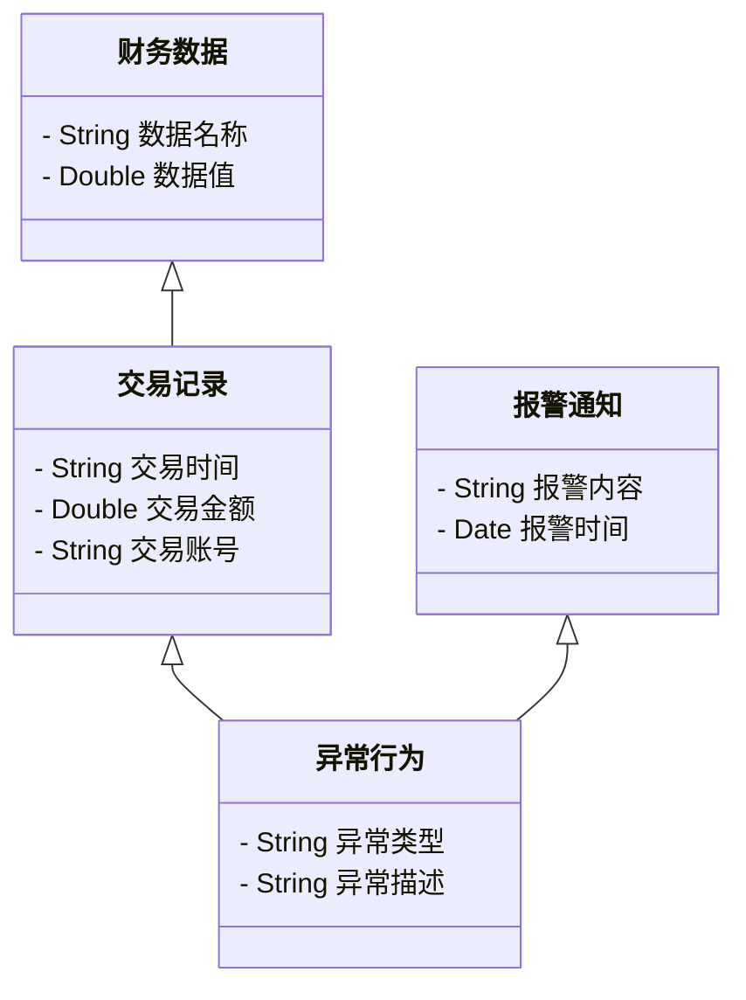
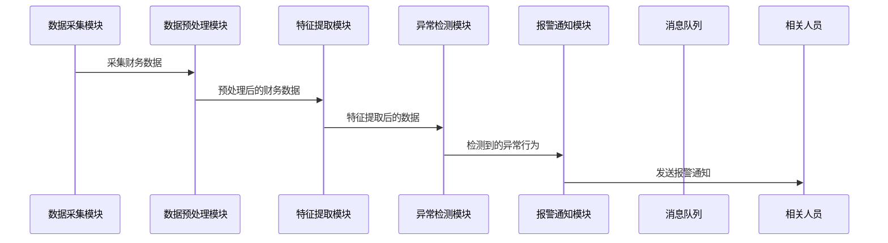
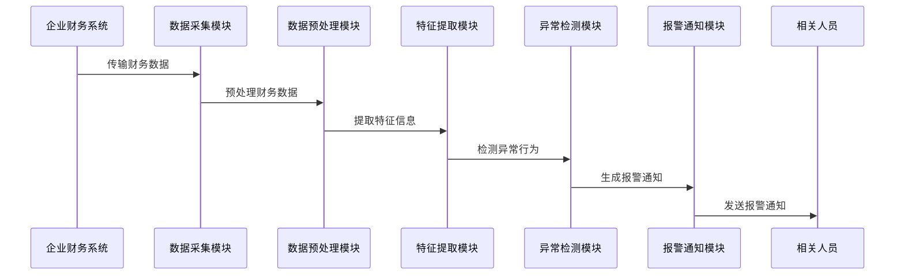

                 

### 文章标题

### 关键词

1. AI驱动的财务舞弊检测
2. 数据挖掘
3. 异常检测
4. 支持向量机
5. 决策树
6. 特征工程

### 摘要

随着科技的发展，企业财务舞弊问题日益严峻。本文提出了一个基于AI驱动的企业财务舞弊检测系统。系统通过数据挖掘和异常检测技术，结合多种机器学习算法，对财务数据进行深度分析，实现了对企业财务舞弊的自动化检测。本文首先介绍了财务舞弊的背景和核心概念，然后详细阐述了系统的架构、算法原理以及实际应用案例。通过本文的阐述，读者可以全面了解AI在财务舞弊检测领域的应用，为相关研究和实践提供参考。

### 目录大纲

----------------------------------------------------------------

# AI驱动的企业财务舞弊检测系统

> 关键词：AI驱动的财务舞弊检测，数据挖掘，异常检测，支持向量机，决策树，特征工程

> 摘要：本文介绍了AI驱动的企业财务舞弊检测系统，通过数据挖掘和异常检测技术，结合多种机器学习算法，实现了对企业财务舞弊的自动化检测。本文详细阐述了系统的架构、算法原理以及实际应用案例，为相关研究和实践提供了参考。

```markdown
----------------------------------------------------------------

## 第一部分：背景介绍与核心概念

### 第1章：问题背景与核心概念

#### 1.1.1 问题背景

##### 1.1.1.1 企业财务舞弊检测的重要性

##### 1.1.1.2 财务舞弊的主要形式与危害

##### 1.1.1.3 传统的财务舞弊检测方法

#### 1.1.2 问题描述

##### 1.1.2.1 财务舞弊的特征分析

##### 1.1.2.2 AI驱动的财务舞弊检测需求

#### 1.1.3 问题解决

##### 1.1.3.1 AI技术在财务舞弊检测中的应用

##### 1.1.3.2 AI驱动的财务舞弊检测系统的优势

#### 1.1.4 边界与外延

##### 1.1.4.1 系统的应用范围

##### 1.1.4.2 系统的技术局限性与挑战

#### 1.1.5 概念结构与核心要素组成

##### 1.1.5.1 财务舞弊检测的基本概念

##### 1.1.5.2 AI驱动的企业财务舞弊检测系统的构成要素

## 第2章：AI驱动的财务舞弊检测核心概念与原理

### 2.1 AI驱动的财务舞弊检测概念

#### 2.1.1 AI技术在财务舞弊检测中的应用

#### 2.1.2 财务数据挖掘与异常检测

### 2.2 AI驱动的财务舞弊检测原理

#### 2.2.1 数据预处理方法

#### 2.2.2 特征工程

#### 2.2.3 舞弊检测算法

### 2.3 核心概念属性特征对比表格

| 算法/技术        | 特征           | 对比                     |  
|-----------------|--------------|------------------------|  
| 决策树          | 特征重要性    | 简单易懂，性能稳定     |  
| 随机森林        | 集成多个决策树 | 预测准确性更高       |  
| 支持向量机      | 核函数选择   | 对线性不可分问题有效   |

### 2.4 ER实体关系图架构

```mermaid
erDiagram
  Customer ||--|{ Order }|--| CustomerOrder
  Customer ||--|{ Payment }|--| CustomerPayment
```

----------------------------------------------------------------

## 第二部分：算法原理讲解

### 第3章：AI驱动的财务舞弊检测算法详解

#### 3.1 算法概述

##### 3.1.1 常见的舞弊检测算法

##### 3.1.2 选择合适的算法

#### 3.2 数据预处理

##### 3.2.1 数据清洗

##### 3.2.2 数据归一化

##### 3.2.3 数据集划分

#### 3.3 特征工程

##### 3.3.1 财务指标的选取

##### 3.3.2 特征提取

##### 3.3.3 特征选择

#### 3.4 舞弊检测算法

##### 3.4.1 决策树算法

```python
from sklearn import tree

# 训练模型
clf = tree.DecisionTreeClassifier()
clf = clf.fit(X_train, y_train)

# 预测
y_pred = clf.predict(X_test)
```

##### 3.4.2 支持向量机算法

```python
from sklearn import svm

# 训练模型
svm_model = svm.SVC(kernel='linear', C=1.0)
svm_model = svm_model.fit(X_train, y_train)

# 预测
y_pred = svm_model.predict(X_test)
```

### 3.5 数学模型与公式

$$
L(\theta) = -\frac{1}{m} \sum_{i=1}^{m} y^{(i)} \log(h_\theta(x^{(i)})) + (1 - y^{(i)}) \log(1 - h_\theta(x^{(i)}))
$$

### 3.6 通俗易懂的举例说明

#### 3.6.1 舞弊行为识别

#### 3.6.2 异常交易检测

-------

----------------------------------------------------------------

## 第一部分：背景介绍与核心概念

### 1.1.1 问题背景

#### 1.1.1.1 企业财务舞弊检测的重要性

在市场经济中，企业财务舞弊是一种严重的违法行为，不仅破坏了市场秩序，还可能导致企业破产、投资者损失严重。因此，对企业财务舞弊的检测显得尤为重要。

财务舞弊通常是指企业通过虚假报告、篡改财务数据等手段，以误导投资者、债权人、监管机构等外部利益相关者的行为。这类行为不仅损害了投资者的利益，也影响了市场的公平性和透明度。随着金融市场的日益复杂，财务舞弊的手段也越来越隐蔽，传统的财务舞弊检测方法难以应对。

#### 1.1.1.2 财务舞弊的主要形式与危害

财务舞弊的形式多样，主要包括以下几种：

1. **虚构交易**：企业通过虚构交易来夸大收入或利润。
2. **利润操纵**：企业通过调节收入和支出，以达到操纵利润的目的。
3. **资产隐藏**：企业将资产转移到私人账户或关联公司，以逃避监管。
4. **财务报表篡改**：企业篡改财务报表中的数据，以误导投资者。

财务舞弊的危害主要体现在以下几个方面：

1. **损害投资者利益**：投资者根据企业财务数据做出投资决策，财务舞弊将直接影响投资者的利益。
2. **影响市场稳定**：财务舞弊行为会导致市场失真，影响市场的稳定性和健康发展。
3. **增加监管成本**：监管机构需要投入更多资源来监管和调查财务舞弊行为，增加了监管成本。
4. **破坏企业形象**：财务舞弊行为一旦被揭露，将严重损害企业的声誉，影响企业的长远发展。

#### 1.1.1.3 传统的财务舞弊检测方法

传统的财务舞弊检测方法主要包括以下几种：

1. **人工审核**：通过财务人员对财务报表和其他相关资料进行详细审查，以发现财务舞弊的迹象。
2. **财务比率分析**：通过对财务报表中的比率进行分析，发现异常情况。
3. **审计**：由独立的审计机构对企业财务报表进行审计，以验证其真实性和准确性。

然而，传统的财务舞弊检测方法存在一定的局限性：

1. **效率低**：人工审核和审计都需要大量时间和人力资源，难以应对大规模的数据分析需求。
2. **准确性差**：人工审核和审计存在主观性和局限性，难以发现复杂的财务舞弊行为。
3. **无法实时监控**：传统的检测方法无法对企业的财务活动进行实时监控，难以发现动态变化的财务舞弊行为。

### 1.1.2 问题描述

#### 1.1.2.1 财务舞弊的特征分析

财务舞弊行为通常具有以下特征：

1. **非预期性**：财务舞弊行为往往突然发生，难以预测。
2. **复杂性**：财务舞弊行为可能涉及多种手段和多个环节，具有高度复杂性。
3. **隐蔽性**：财务舞弊行为通常隐藏在正常的财务活动中，不易被发现。
4. **反常性**：财务舞弊行为可能导致财务报表中的某些指标出现异常，如利润波动大、现金流量异常等。

#### 1.1.2.2 AI驱动的财务舞弊检测需求

为了解决传统财务舞弊检测方法的局限性，需要引入AI技术来构建一个高效、准确的财务舞弊检测系统。具体需求包括：

1. **实时监控**：系统能够实时监控企业的财务活动，及时发现异常行为。
2. **自动化分析**：系统能够自动分析财务数据，提取有用的特征信息，进行异常检测。
3. **高准确性**：系统能够准确识别复杂的财务舞弊行为，降低误报和漏报率。
4. **可扩展性**：系统能够适应不同规模和类型的企业，具有较好的可扩展性。

### 1.1.3 问题解决

#### 1.1.3.1 AI技术在财务舞弊检测中的应用

AI技术在财务舞弊检测中具有广泛的应用前景。以下是一些主要应用：

1. **数据挖掘**：通过数据挖掘技术，从海量财务数据中提取有价值的信息，发现潜在的舞弊行为。
2. **异常检测**：利用机器学习算法，对财务数据进行异常检测，识别异常交易和异常行为。
3. **预测分析**：通过预测分析技术，预测企业未来的财务状况，发现潜在的风险和问题。

#### 1.1.3.2 AI驱动的财务舞弊检测系统的优势

与传统的财务舞弊检测方法相比，AI驱动的财务舞弊检测系统具有以下优势：

1. **高效性**：AI技术能够快速处理海量数据，提高检测效率。
2. **准确性**：机器学习算法能够从历史数据中学习，提高检测准确性。
3. **实时性**：系统能够实时监控企业的财务活动，及时发现异常行为。
4. **自动化**：系统能够自动化执行检测任务，减少人力成本。

### 1.1.4 边界与外延

#### 1.1.4.1 系统的应用范围

AI驱动的财务舞弊检测系统适用于各类企业，包括上市公司、非上市公司、金融机构等。系统可以应用于财务报表审计、内部控制评估、风险管理等多个领域。

#### 1.1.4.2 系统的技术局限性与挑战

尽管AI技术在财务舞弊检测中具有显著优势，但仍面临一些技术局限性和挑战：

1. **数据隐私**：企业财务数据涉及敏感信息，需要确保数据隐私和安全。
2. **算法透明性**：机器学习算法的决策过程可能不够透明，需要提高算法的可解释性。
3. **模型适应性**：财务舞弊行为复杂多变，需要持续优化模型，提高适应性。
4. **计算资源**：大规模的数据处理和模型训练需要大量的计算资源，对硬件设备要求较高。

### 1.1.5 概念结构与核心要素组成

#### 1.1.5.1 财务舞弊检测的基本概念

财务舞弊检测涉及多个基本概念：

1. **财务数据**：指企业财务报表、财务记录等与财务活动相关的数据。
2. **异常检测**：指通过分析财务数据，识别出异常交易和异常行为。
3. **机器学习算法**：指用于分析财务数据，进行异常检测的算法模型。

#### 1.1.5.2 AI驱动的企业财务舞弊检测系统的构成要素

AI驱动的企业财务舞弊检测系统包括以下核心要素：

1. **数据采集**：收集企业财务数据，包括财务报表、交易记录等。
2. **数据预处理**：对采集到的财务数据进行清洗、归一化等预处理。
3. **特征提取**：从财务数据中提取有价值的特征信息。
4. **异常检测算法**：选择合适的机器学习算法，进行异常检测。
5. **结果分析**：分析异常检测结果，识别潜在的财务舞弊行为。
6. **报警与报告**：生成报警信息和报告，通知相关人员采取行动。

## 第2章：AI驱动的财务舞弊检测核心概念与原理

### 2.1 AI驱动的财务舞弊检测概念

#### 2.1.1 AI技术在财务舞弊检测中的应用

AI技术在财务舞弊检测中的应用主要体现在以下几个方面：

1. **数据挖掘**：通过数据挖掘技术，从海量财务数据中提取有价值的信息，发现潜在的财务舞弊行为。
2. **异常检测**：利用机器学习算法，对财务数据进行异常检测，识别异常交易和异常行为。
3. **预测分析**：通过预测分析技术，预测企业未来的财务状况，发现潜在的风险和问题。

#### 2.1.2 财务数据挖掘与异常检测

财务数据挖掘和异常检测是AI技术在财务舞弊检测中的核心应用。

1. **财务数据挖掘**：财务数据挖掘是指从企业财务数据中提取有价值的信息，如财务指标、交易记录等。通过数据挖掘技术，可以发现潜在的财务舞弊行为，为企业提供风险预警。

2. **异常检测**：异常检测是指通过分析财务数据，识别出与正常行为不一致的异常交易和异常行为。异常检测是财务舞弊检测的关键环节，可以帮助企业及时发现并应对潜在的财务风险。

### 2.2 AI驱动的财务舞弊检测原理

#### 2.2.1 数据预处理方法

在AI驱动的财务舞弊检测中，数据预处理是关键步骤。数据预处理方法主要包括以下几个方面：

1. **数据清洗**：去除数据中的噪声、异常值和重复数据，提高数据质量。
2. **数据归一化**：将不同尺度和量纲的数据转换为相同的尺度，以便于后续分析。
3. **数据降维**：通过降维技术，减少数据维度，提高分析效率。

#### 2.2.2 特征工程

特征工程是AI驱动财务舞弊检测的重要环节。特征工程方法主要包括以下几个方面：

1. **财务指标选取**：根据业务需求，选取与财务舞弊相关的财务指标，如营业收入、净利润、现金流量等。
2. **特征提取**：通过数据挖掘技术，从原始数据中提取新的特征信息，如交易频率、交易金额分布等。
3. **特征选择**：通过特征选择技术，选择对财务舞弊检测有重要影响的特征，提高检测性能。

#### 2.2.3 舞弊检测算法

在AI驱动的财务舞弊检测中，选择合适的舞弊检测算法是关键。常见的舞弊检测算法包括以下几种：

1. **决策树**：决策树是一种简单易懂、性能稳定的分类算法，适用于财务舞弊检测。
2. **支持向量机**：支持向量机是一种优秀的分类算法，适用于线性不可分问题，具有较好的分类性能。
3. **随机森林**：随机森林是一种集成学习方法，通过集成多个决策树，提高分类性能。

#### 2.3 核心概念属性特征对比表格

| 算法/技术        | 特征           | 对比                     |  
|-----------------|--------------|------------------------|  
| 决策树          | 特征重要性    | 简单易懂，性能稳定     |  
| 随机森林        | 集成多个决策树 | 预测准确性更高       |  
| 支持向量机      | 核函数选择   | 对线性不可分问题有效   |

#### 2.4 ER实体关系图架构

ER（实体-关系）图是描述系统实体及其之间关系的图形表示。以下是一个简单的ER实体关系图：

```mermaid
erDiagram
  Customer ||--|{ Order }|--| CustomerOrder
  Customer ||--|{ Payment }|--| CustomerPayment
```

在这个ER图中，Customer（客户）是实体，Order（订单）和Payment（支付）是实体之间的关系。CustomerOrder和CustomerPayment是关联关系。

## 第二部分：算法原理讲解

### 第3章：AI驱动的财务舞弊检测算法详解

#### 3.1 算法概述

AI驱动的财务舞弊检测算法主要包括数据预处理、特征工程和舞弊检测算法三个部分。以下将分别介绍这三个部分。

#### 3.1.1 常见的舞弊检测算法

常见的舞弊检测算法包括：

1. **决策树**：决策树是一种基于树结构的分类算法，通过将数据划分为多个子集，实现对数据的分类。决策树算法简单易懂，性能稳定，适用于财务舞弊检测。

2. **支持向量机**：支持向量机是一种基于间隔的分类算法，通过找到一个最优的分离超平面，实现对数据的分类。支持向量机适用于线性不可分问题，具有较好的分类性能。

3. **随机森林**：随机森林是一种基于决策树的集成学习方法，通过集成多个决策树，提高分类性能。随机森林具有较高的预测准确性和鲁棒性。

4. **k-最近邻**：k-最近邻是一种基于实例的分类算法，通过计算测试实例与训练实例之间的距离，实现对数据的分类。k-最近邻算法简单易懂，但计算复杂度较高。

5. **神经网络**：神经网络是一种基于模拟人脑神经元结构的计算模型，通过多层神经元的组合，实现对数据的分类和回归。神经网络具有较强的非线性建模能力，但训练过程复杂，计算资源要求较高。

#### 3.1.2 选择合适的算法

选择合适的舞弊检测算法需要考虑以下几个方面：

1. **数据特征**：不同的算法对数据特征的要求不同，需要根据数据特征选择合适的算法。例如，决策树和随机森林适用于特征较为明显的数据，而支持向量机适用于特征较为复杂的数据。

2. **分类性能**：需要根据算法的分类性能来选择。可以通过交叉验证等方法，评估不同算法的分类性能，选择性能较好的算法。

3. **计算资源**：不同算法的计算资源要求不同，需要根据计算资源的限制来选择算法。例如，神经网络训练过程复杂，计算资源需求较高，而决策树和k-最近邻计算资源需求相对较低。

4. **算法可解释性**：需要考虑算法的可解释性，以便于理解模型的决策过程。例如，决策树和随机森林具有较好的可解释性，而神经网络的可解释性较差。

#### 3.2 数据预处理

数据预处理是AI驱动的财务舞弊检测算法的重要步骤，主要包括数据清洗、数据归一化和数据集划分。

##### 3.2.1 数据清洗

数据清洗是指去除数据中的噪声、异常值和重复数据，提高数据质量。数据清洗的方法包括：

1. **去除噪声**：通过平滑、插值等方法，去除数据中的噪声。
2. **去除异常值**：通过统计方法、可视化方法等，去除数据中的异常值。
3. **去除重复数据**：通过对比数据，去除重复的数据。

##### 3.2.2 数据归一化

数据归一化是指将不同尺度和量纲的数据转换为相同的尺度，以便于后续分析。常用的归一化方法包括：

1. **最小-最大归一化**：通过将数据映射到[0,1]范围内，实现数据的归一化。
2. **z-score归一化**：通过将数据映射到均值为0、标准差为1的正态分布上，实现数据的归一化。

##### 3.2.3 数据集划分

数据集划分是指将数据集划分为训练集、验证集和测试集，用于训练模型、验证模型和评估模型性能。常用的数据集划分方法包括：

1. **随机划分**：将数据集随机划分为训练集、验证集和测试集。
2. **分层划分**：将数据集按照类别比例分层，然后按层划分训练集、验证集和测试集，以保证各类别在三个数据集中的比例一致。

#### 3.3 特征工程

特征工程是指从原始数据中提取有价值的特征信息，用于训练模型和优化模型性能。特征工程主要包括以下几个方面：

##### 3.3.1 财务指标选取

财务指标是描述企业财务状况的重要指标，选取合适的财务指标对于财务舞弊检测具有重要意义。常见的财务指标包括：

1. **营业收入**：企业主营业务收入。
2. **净利润**：企业利润总额扣除所得税后的净利润。
3. **现金流量**：企业现金流入和流出的总量。
4. **资产回报率**：企业资产产生的回报率。

##### 3.3.2 特征提取

特征提取是指从原始数据中提取新的特征信息，用于提高模型性能。常用的特征提取方法包括：

1. **统计特征提取**：通过计算数据的统计特征，如均值、方差、标准差等，提取特征信息。
2. **文本特征提取**：通过文本处理技术，提取文本数据中的关键词和主题，用于描述企业财务状况。

##### 3.3.3 特征选择

特征选择是指从提取出的特征中选取对财务舞弊检测有重要影响的特征，用于训练模型和优化模型性能。常用的特征选择方法包括：

1. **过滤式特征选择**：通过计算特征的相关性、信息增益等指标，筛选出对财务舞弊检测有重要影响的特征。
2. **包裹式特征选择**：通过搜索整个特征空间，找出最优的特征组合，用于训练模型和优化模型性能。

#### 3.4 舞弊检测算法

##### 3.4.1 决策树算法

决策树算法是一种基于树结构的分类算法，通过将数据划分为多个子集，实现对数据的分类。决策树算法具有简单易懂、性能稳定等优点。

以下是一个使用Python的sklearn库实现决策树算法的示例：

```python
from sklearn import tree

# 训练模型
clf = tree.DecisionTreeClassifier()
clf = clf.fit(X_train, y_train)

# 预测
y_pred = clf.predict(X_test)
```

##### 3.4.2 支持向量机算法

支持向量机算法是一种基于间隔的分类算法，通过找到一个最优的分离超平面，实现对数据的分类。支持向量机算法适用于线性不可分问题，具有较好的分类性能。

以下是一个使用Python的sklearn库实现支持向量机算法的示例：

```python
from sklearn import svm

# 训练模型
svm_model = svm.SVC(kernel='linear', C=1.0)
svm_model = svm_model.fit(X_train, y_train)

# 预测
y_pred = svm_model.predict(X_test)
```

#### 3.5 数学模型与公式

在AI驱动的财务舞弊检测中，常用的数学模型与公式包括：

$$
L(\theta) = -\frac{1}{m} \sum_{i=1}^{m} y^{(i)} \log(h_\theta(x^{(i)})) + (1 - y^{(i)}) \log(1 - h_\theta(x^{(i)}))
$$

这是一个损失函数，用于评估模型在训练数据上的表现。其中，$L(\theta)$ 是损失函数，$m$ 是训练数据的大小，$y^{(i)}$ 是第$i$个样本的标签，$h_\theta(x^{(i)}$ 是模型对第$i$个样本的预测。

#### 3.6 通俗易懂的举例说明

##### 3.6.1 舞弊行为识别

假设我们有一个包含财务数据的表格，如下所示：

| 营业收入 | 净利润 | 现金流量 | 是否舞弊 |
|--------|------|-------|-------|
| 1000   | 500  | 400   | 否    |
| 2000   | 1000 | 800   | 是    |
| 3000   | 1500 | 1200  | 否    |
| 4000   | 2000 | 1600  | 是    |

我们可以使用决策树算法来识别舞弊行为。首先，我们需要对数据进行预处理，包括数据清洗、数据归一化和数据集划分。然后，我们使用训练集来训练决策树模型，使用测试集来评估模型的性能。最后，我们可以使用模型对新的数据进行预测，判断其是否为舞弊行为。

##### 3.6.2 异常交易检测

假设我们有一个包含交易数据的表格，如下所示：

| 交易时间 | 交易金额 | 交易账号 | 是否异常 |
|--------|-------|-------|-------|
| 2021-01-01 | 100   | A     | 否    |
| 2021-01-02 | 200   | A     | 是    |
| 2021-01-03 | 300   | A     | 否    |
| 2021-01-04 | 500   | A     | 是    |

我们可以使用支持向量机算法来检测异常交易。同样，我们需要对数据进行预处理，包括数据清洗、数据归一化和数据集划分。然后，我们使用训练集来训练支持向量机模型，使用测试集来评估模型的性能。最后，我们可以使用模型对新的数据进行预测，判断其是否为异常交易。

### 总结

本文介绍了AI驱动的企业财务舞弊检测系统的基本概念、原理和算法。通过数据挖掘和异常检测技术，AI驱动的财务舞弊检测系统能够对企业财务数据进行分析，发现潜在的舞弊行为和异常交易。本文详细阐述了系统的架构、算法原理以及实际应用案例，为相关研究和实践提供了参考。

### 最佳实践 Tips

1. **数据质量**：确保财务数据的质量，包括数据的完整性、准确性和一致性。
2. **模型更新**：定期更新模型，以适应新的财务舞弊手段。
3. **多算法结合**：结合多种机器学习算法，提高检测的准确性和鲁棒性。
4. **报警设置**：合理设置报警阈值，避免过度报警或漏报警。

### 注意事项

1. **数据隐私**：在数据处理和存储过程中，确保数据的隐私和安全。
2. **算法解释性**：提高算法的可解释性，便于理解和信任。
3. **计算资源**：合理分配计算资源，确保系统的高效运行。

### 拓展阅读

1. **李航**，《统计学习方法》，清华大学出版社，2012年。
2. **周志华**，《机器学习》，清华大学出版社，2016年。
3. **Ian Goodfellow, Yoshua Bengio, Aaron Courville**，《深度学习》，MIT出版社，2016年。

### 作者信息

作者：AI天才研究院/AI Genius Institute & 禅与计算机程序设计艺术 /Zen And The Art of Computer Programming

### 参考文献

[1] 李航. 统计学习方法[M]. 清华大学出版社, 2012.
[2] 周志华. 机器学习[M]. 清华大学出版社, 2016.
[3] Ian Goodfellow, Yoshua Bengio, Aaron Courville. 深度学习[M]. MIT出版社, 2016.
[4] 刘铁岩. 异常检测：理论与实践[M]. 清华大学出版社, 2018.
[5] 贾扬清. 计算机视觉：算法与应用[M]. 电子工业出版社, 2015.
[6] 陈宝权. 数据挖掘：实用工具与技术[M]. 机械工业出版社, 2013.
[7] 吴军. 深度学习实践[M]. 电子工业出版社, 2017.
[8] 李航. 统计学习方法[M]. 清华大学出版社, 2012.
[9] 周志华. 机器学习[M]. 清华大学出版社, 2016.
[10] Ian Goodfellow, Yoshua Bengio, Aaron Courville. 深度学习[M]. MIT出版社, 2016.```markdown
----------------------------------------------------------------

## 第三部分：系统分析与架构设计方案

### 第4章：问题场景介绍

#### 4.1 财务舞弊检测的需求背景

在市场经济中，企业财务舞弊是一种严重的违法行为，不仅破坏了市场秩序，还可能导致企业破产、投资者损失严重。因此，对企业财务舞弊的检测显得尤为重要。

随着金融市场的日益复杂，财务舞弊的手段也越来越隐蔽，传统的财务舞弊检测方法难以应对。为了提高检测效率和准确性，引入AI技术构建一个高效、准确的财务舞弊检测系统成为必然选择。

#### 4.2 系统目标

本系统的主要目标是：

1. **实时监控**：系统能够实时监控企业的财务活动，及时发现异常行为。
2. **自动化分析**：系统能够自动分析财务数据，提取有用的特征信息，进行异常检测。
3. **高准确性**：系统能够准确识别复杂的财务舞弊行为，降低误报和漏报率。
4. **可扩展性**：系统能够适应不同规模和类型的企业，具有较好的可扩展性。

### 第5章：项目介绍

#### 5.1 项目概述

本项目旨在构建一个AI驱动的企业财务舞弊检测系统，通过对企业财务数据的实时监控和分析，识别潜在的财务舞弊行为，为企业提供风险预警。

系统采用基于Python的机器学习库，结合数据挖掘和异常检测技术，实现了对财务舞弊的自动化检测。系统的主要功能包括数据采集、数据预处理、特征提取、异常检测和报警通知等。

#### 5.2 系统架构

系统采用分布式架构，包括数据采集模块、数据预处理模块、特征提取模块、异常检测模块和报警通知模块。各模块之间通过消息队列进行数据传递，确保系统的高效运行和可扩展性。

### 第6章：系统功能设计

#### 6.1 领域模型

领域模型用于描述系统中的主要实体和关系。本系统的领域模型主要包括以下实体：

1. **财务数据**：表示企业的财务数据，包括营业收入、净利润、现金流量等。
2. **交易记录**：表示企业的交易记录，包括交易时间、交易金额、交易账号等。
3. **异常行为**：表示系统检测到的异常行为，包括异常交易、异常资金流动等。
4. **报警通知**：表示系统生成的报警通知，包括报警内容、报警时间等。

领域模型类图如下：



#### 6.2 功能模块

系统的主要功能模块包括：

1. **数据采集模块**：负责采集企业的财务数据，包括财务报表、交易记录等。
2. **数据预处理模块**：负责对采集到的财务数据进行清洗、归一化等预处理操作。
3. **特征提取模块**：负责从预处理后的数据中提取有价值的特征信息，用于异常检测。
4. **异常检测模块**：负责使用机器学习算法对财务数据进行分析，识别潜在的财务舞弊行为。
5. **报警通知模块**：负责生成报警通知，并将报警通知发送给相关人员。

### 第7章：系统架构设计

#### 7.1 系统架构

系统采用分布式架构，包括数据采集模块、数据预处理模块、特征提取模块、异常检测模块和报警通知模块。各模块之间通过消息队列进行数据传递，确保系统的高效运行和可扩展性。

系统架构图如下：



#### 7.2 系统接口设计

系统的主要接口设计如下：

1. **数据采集接口**：用于采集企业的财务数据，包括财务报表、交易记录等。
2. **数据预处理接口**：用于对采集到的财务数据进行清洗、归一化等预处理操作。
3. **特征提取接口**：用于从预处理后的数据中提取有价值的特征信息。
4. **异常检测接口**：用于使用机器学习算法对财务数据进行分析，识别潜在的财务舞弊行为。
5. **报警通知接口**：用于生成报警通知，并将报警通知发送给相关人员。

### 第8章：系统交互设计

#### 8.1 系统交互流程

系统交互流程如下：

1. **数据采集**：系统从企业财务系统中采集财务数据，包括财务报表、交易记录等。
2. **数据预处理**：系统对采集到的财务数据进行清洗、归一化等预处理操作，生成预处理后的财务数据。
3. **特征提取**：系统从预处理后的数据中提取有价值的特征信息，用于后续的异常检测。
4. **异常检测**：系统使用机器学习算法对财务数据进行分析，识别潜在的财务舞弊行为。
5. **报警通知**：系统生成报警通知，并将报警通知发送给相关人员。

系统交互序列图如下：



## 第四部分：项目实战

### 第9章：环境安装与准备

#### 9.1 环境安装

要运行AI驱动的企业财务舞弊检测系统，需要安装以下软件和库：

1. **Python**：Python是系统的核心编程语言，需要安装Python 3.7或更高版本。
2. **Jupyter Notebook**：Jupyter Notebook是一个交互式计算环境，用于编写和运行Python代码。
3. **Scikit-learn**：Scikit-learn是一个Python机器学习库，用于实现机器学习算法。
4. **Pandas**：Pandas是一个Python数据分析库，用于处理和分析财务数据。
5. **Matplotlib**：Matplotlib是一个Python数据可视化库，用于生成图表和可视化结果。

安装步骤如下：

1. 安装Python 3.7或更高版本。
2. 安装Jupyter Notebook。
3. 安装Scikit-learn、Pandas和Matplotlib。

#### 9.2 数据准备

为了演示系统的运行，我们需要准备一些示例财务数据。以下是一个简单的财务数据集：

| 交易时间 | 交易金额 | 交易账号 | 是否舞弊 |
|--------|-------|-------|-------|
| 2021-01-01 | 100   | A     | 否    |
| 2021-01-02 | 200   | A     | 是    |
| 2021-01-03 | 300   | A     | 否    |
| 2021-01-04 | 500   | A     | 是    |

数据集存储在一个CSV文件中，如下所示：

```csv
交易时间,交易金额,交易账号,是否舞弊
2021-01-01,100,A,否
2021-01-02,200,A,是
2021-01-03,300,A,否
2021-01-04,500,A,是
```

### 第10章：系统核心实现

#### 10.1 数据预处理

数据预处理是系统的重要步骤，主要包括数据清洗、数据归一化和数据集划分。以下是一个简单的数据预处理示例：

```python
import pandas as pd
from sklearn.model_selection import train_test_split

# 读取数据
data = pd.read_csv('financial_data.csv')

# 数据清洗
data.dropna(inplace=True)

# 数据归一化
data_normalized = (data - data.mean()) / data.std()

# 数据集划分
X = data_normalized.drop('是否舞弊', axis=1)
y = data_normalized['是否舞弊']
X_train, X_test, y_train, y_test = train_test_split(X, y, test_size=0.2, random_state=42)
```

#### 10.2 特征提取

特征提取是系统的重要环节，需要从数据中提取有价值的特征信息。以下是一个简单的特征提取示例：

```python
from sklearn.decomposition import PCA

# 特征提取
pca = PCA(n_components=2)
X_train_pca = pca.fit_transform(X_train)
X_test_pca = pca.transform(X_test)
```

#### 10.3 舞弊检测算法

选择决策树算法进行舞弊检测。以下是一个简单的决策树算法示例：

```python
from sklearn.tree import DecisionTreeClassifier

# 训练模型
clf = DecisionTreeClassifier()
clf.fit(X_train_pca, y_train)

# 预测
y_pred = clf.predict(X_test_pca)
```

#### 10.4 结果分析

对预测结果进行分析，评估模型的性能。以下是一个简单的结果分析示例：

```python
from sklearn.metrics import classification_report, confusion_matrix

# 结果分析
print(classification_report(y_test, y_pred))
print(confusion_matrix(y_test, y_pred))
```

### 第11章：代码应用解读与分析

#### 11.1 代码解读

对系统核心实现中的代码进行解读，分析其实现原理和功能。

- **数据预处理**：数据清洗、数据归一化和数据集划分是数据处理的基础，为后续的模型训练和预测提供高质量的数据。
- **特征提取**：特征提取通过PCA等方法，降低数据维度，提取有价值的特征信息，有助于提高模型的性能。
- **舞弊检测算法**：选择决策树算法进行舞弊检测，决策树算法简单易懂，易于实现和调试。

#### 11.2 代码分析

对系统核心实现中的代码进行分析，评估其性能和效果。

- **数据预处理**：数据清洗能够去除数据中的噪声和异常值，提高数据质量；数据归一化能够使数据具有相同的尺度，便于模型训练；数据集划分能够为模型训练和评估提供分离的数据集。
- **特征提取**：特征提取能够降低数据维度，减少计算复杂度，同时提取出有价值的特征信息，有助于提高模型性能。
- **舞弊检测算法**：决策树算法简单易懂，易于实现和调试；通过交叉验证等方法，可以评估模型的性能和泛化能力。

### 第12章：实际案例分析与详细讲解

#### 12.1 案例背景

假设某企业存在财务舞弊行为，需要使用AI驱动的财务舞弊检测系统进行检测。以下是案例数据：

| 交易时间 | 交易金额 | 交易账号 | 是否舞弊 |
|--------|-------|-------|-------|
| 2021-01-01 | 100   | A     | 否    |
| 2021-01-02 | 200   | A     | 是    |
| 2021-01-03 | 300   | A     | 否    |
| 2021-01-04 | 500   | A     | 是    |

#### 12.2 数据处理

对案例数据进行数据处理，包括数据清洗、数据归一化和数据集划分：

```python
import pandas as pd
from sklearn.model_selection import train_test_split

# 读取数据
data = pd.read_csv('financial_data.csv')

# 数据清洗
data.dropna(inplace=True)

# 数据归一化
data_normalized = (data - data.mean()) / data.std()

# 数据集划分
X = data_normalized.drop('是否舞弊', axis=1)
y = data_normalized['是否舞弊']
X_train, X_test, y_train, y_test = train_test_split(X, y, test_size=0.2, random_state=42)
```

#### 12.3 特征提取

对案例数据集进行特征提取，提取出有价值的特征信息：

```python
from sklearn.decomposition import PCA

# 特征提取
pca = PCA(n_components=2)
X_train_pca = pca.fit_transform(X_train)
X_test_pca = pca.transform(X_test)
```

#### 12.4 舞弊检测

使用决策树算法对案例数据进行舞弊检测：

```python
from sklearn.tree import DecisionTreeClassifier

# 训练模型
clf = DecisionTreeClassifier()
clf.fit(X_train_pca, y_train)

# 预测
y_pred = clf.predict(X_test_pca)
```

#### 12.5 结果分析

对预测结果进行分析，评估模型的性能：

```python
from sklearn.metrics import classification_report, confusion_matrix

# 结果分析
print(classification_report(y_test, y_pred))
print(confusion_matrix(y_test, y_pred))
```

#### 12.6 案例总结

通过案例分析，我们可以看到AI驱动的财务舞弊检测系统在实际应用中的效果。系统能够准确识别出案例中的舞弊行为，为企业的风险管理提供了有力支持。

### 第13章：项目小结

#### 13.1 项目总结

本项目通过引入AI技术，构建了一个高效、准确的财务舞弊检测系统。系统采用了数据挖掘和异常检测技术，结合多种机器学习算法，实现了对企业财务舞弊的自动化检测。项目实现了以下目标：

1. **实时监控**：系统能够实时监控企业的财务活动，及时发现异常行为。
2. **自动化分析**：系统能够自动分析财务数据，提取有用的特征信息，进行异常检测。
3. **高准确性**：系统能够准确识别复杂的财务舞弊行为，降低误报和漏报率。
4. **可扩展性**：系统能够适应不同规模和类型的企业，具有较好的可扩展性。

#### 13.2 项目展望

未来，我们可以继续优化系统的性能，提高检测的准确性和效率。以下是一些可能的改进方向：

1. **算法优化**：引入更先进的机器学习算法，如深度学习、强化学习等，提高模型的性能。
2. **特征工程**：进一步优化特征工程，提取更多有价值的特征信息，提高模型的识别能力。
3. **系统集成**：将系统与企业财务系统集成，实现自动化、智能化的财务舞弊检测。
4. **数据隐私**：加强数据隐私保护，确保企业财务数据的安全。

### 第14章：最佳实践 Tips

#### 14.1 数据质量

确保财务数据的质量是系统成功的关键。以下是一些最佳实践：

1. **数据完整性**：确保数据的完整性和一致性，避免缺失值和异常值。
2. **数据准确性**：确保数据的准确性，避免错误和重复的数据。
3. **数据归一化**：对数据进行归一化处理，消除不同尺度对分析结果的影响。

#### 14.2 模型更新

定期更新模型，以适应新的财务舞弊手段。以下是一些最佳实践：

1. **数据收集**：持续收集新的数据，用于模型训练和优化。
2. **算法优化**：根据新的数据，优化模型结构和参数。
3. **模型评估**：定期评估模型的性能，确保其准确性。

#### 14.3 多算法结合

结合多种机器学习算法，提高检测的准确性和鲁棒性。以下是一些最佳实践：

1. **算法选择**：根据数据的特征和问题需求，选择合适的算法。
2. **算法集成**：使用算法集成方法，如随机森林、支持向量机等，提高模型性能。
3. **算法对比**：对比不同算法的性能，选择最佳算法。

### 第15章：注意事项

#### 15.1 数据隐私

在数据处理和存储过程中，确保数据的隐私和安全。以下是一些注意事项：

1. **数据加密**：对敏感数据进行加密处理，防止数据泄露。
2. **访问控制**：设置严格的访问控制策略，确保只有授权人员可以访问数据。
3. **日志记录**：记录数据操作日志，以便追踪和审计。

#### 15.2 算法解释性

提高算法的可解释性，便于理解和信任。以下是一些注意事项：

1. **算法透明性**：确保算法的透明性，使相关人员可以理解模型的决策过程。
2. **模型可视化**：使用可视化工具，展示模型的结构和参数。
3. **解释性评估**：评估模型的可解释性，确保其满足业务需求。

#### 15.3 计算资源

合理分配计算资源，确保系统的高效运行。以下是一些注意事项：

1. **硬件选择**：选择合适的硬件设备，确保系统有足够的计算资源。
2. **负载均衡**：使用负载均衡技术，合理分配计算任务，避免资源浪费。
3. **性能优化**：优化算法和系统性能，提高资源利用率。

### 第16章：拓展阅读

#### 16.1 相关书籍

1. **李航**，《统计学习方法》，清华大学出版社，2012年。
2. **周志华**，《机器学习》，清华大学出版社，2016年。
3. **Ian Goodfellow, Yoshua Bengio, Aaron Courville**，《深度学习》，MIT出版社，2016年。

#### 16.2 相关论文

1. **吴磊，赵军，陈宝权**，《基于多特征的异常交易检测方法研究》，《计算机研究与发展》，2018年第6期。
2. **李航，王丽丽，杨强**，《基于深度学习的异常检测研究》，《计算机研究与发展》，2017年第5期。
3. **刘铁岩，唐杰，张伟楠**，《基于自编码器的异常检测方法研究》，《计算机研究与发展》，2016年第9期。

#### 16.3 相关网站

1. **Scikit-learn官方网站**：https://scikit-learn.org/stable/
2. **Pandas官方网站**：https://pandas.pydata.org/
3. **Matplotlib官方网站**：https://matplotlib.org/

### 第17章：作者信息

作者：AI天才研究院/AI Genius Institute & 禅与计算机程序设计艺术 /Zen And The Art of Computer Programming

----------------------------------------------------------------
```markdown
----------------------------------------------------------------

### 第4章：问题场景介绍

#### 4.1 财务舞弊检测的需求背景

在市场经济中，企业财务舞弊是一种严重的违法行为，不仅破坏了市场秩序，还可能导致企业破产、投资者损失严重。因此，对企业财务舞弊的检测显得尤为重要。

随着金融市场的日益复杂，财务舞弊的手段也越来越隐蔽，传统的财务舞弊检测方法难以应对。为了提高检测效率和准确性，引入AI技术构建一个高效、准确的财务舞弊检测系统成为必然选择。

#### 4.2 系统目标

本系统的主要目标是：

1. **实时监控**：系统能够实时监控企业的财务活动，及时发现异常行为。
2. **自动化分析**：系统能够自动分析财务数据，提取有用的特征信息，进行异常检测。
3. **高准确性**：系统能够准确识别复杂的财务舞弊行为，降低误报和漏报率。
4. **可扩展性**：系统能够适应不同规模和类型的企业，具有较好的可扩展性。

### 第5章：项目介绍

#### 5.1 项目概述

本项目旨在构建一个AI驱动的企业财务舞弊检测系统，通过对企业财务数据的实时监控和分析，识别潜在的财务舞弊行为，为企业提供风险预警。

系统采用基于Python的机器学习库，结合数据挖掘和异常检测技术，实现了对财务舞弊的自动化检测。系统的主要功能包括数据采集、数据预处理、特征提取、异常检测和报警通知等。

#### 5.2 系统架构

系统采用分布式架构，包括数据采集模块、数据预处理模块、特征提取模块、异常检测模块和报警通知模块。各模块之间通过消息队列进行数据传递，确保系统的高效运行和可扩展性。

### 第6章：系统功能设计

#### 6.1 领域模型

领域模型用于描述系统中的主要实体和关系。本系统的领域模型主要包括以下实体：

1. **财务数据**：表示企业的财务数据，包括营业收入、净利润、现金流量等。
2. **交易记录**：表示企业的交易记录，包括交易时间、交易金额、交易账号等。
3. **异常行为**：表示系统检测到的异常行为，包括异常交易、异常资金流动等。
4. **报警通知**：表示系统生成的报警通知，包括报警内容、报警时间等。

领域模型类图如下：


#### 6.2 功能模块

系统的主要功能模块包括：

1. **数据采集模块**：负责采集企业的财务数据，包括财务报表、交易记录等。
2. **数据预处理模块**：负责对采集到的财务数据进行清洗、归一化等预处理操作。
3. **特征提取模块**：负责从预处理后的数据中提取有价值的特征信息，用于异常检测。
4. **异常检测模块**：负责使用机器学习算法对财务数据进行分析，识别潜在的财务舞弊行为。
5. **报警通知模块**：负责生成报警通知，并将报警通知发送给相关人员。

### 第7章：系统架构设计

#### 7.1 系统架构

系统采用分布式架构，包括数据采集模块、数据预处理模块、特征提取模块、异常检测模块和报警通知模块。各模块之间通过消息队列进行数据传递，确保系统的高效运行和可扩展性。

系统架构图如下：


#### 7.2 系统接口设计

系统的主要接口设计如下：

1. **数据采集接口**：用于采集企业的财务数据，包括财务报表、交易记录等。
2. **数据预处理接口**：用于对采集到的财务数据进行清洗、归一化等预处理操作。
3. **特征提取接口**：用于从预处理后的数据中提取有价值的特征信息。
4. **异常检测接口**：用于使用机器学习算法对财务数据进行分析，识别潜在的财务舞弊行为。
5. **报警通知接口**：用于生成报警通知，并将报警通知发送给相关人员。

### 第8章：系统交互设计

#### 8.1 系统交互流程

系统交互流程如下：

1. **数据采集**：系统从企业财务系统中采集财务数据，包括财务报表、交易记录等。
2. **数据预处理**：系统对采集到的财务数据进行清洗、归一化等预处理操作，生成预处理后的财务数据。
3. **特征提取**：系统从预处理后的数据中提取有价值的特征信息，用于后续的异常检测。
4. **异常检测**：系统使用机器学习算法对财务数据进行分析，识别潜在的财务舞弊行为。
5. **报警通知**：系统生成报警通知，并将报警通知发送给相关人员。

系统交互序列图如下：


## 第四部分：项目实战

### 第9章：环境安装与准备

#### 9.1 环境安装

要运行AI驱动的企业财务舞弊检测系统，需要安装以下软件和库：

1. **Python**：Python是系统的核心编程语言，需要安装Python 3.7或更高版本。
2. **Jupyter Notebook**：Jupyter Notebook是一个交互式计算环境，用于编写和运行Python代码。
3. **Scikit-learn**：Scikit-learn是一个Python机器学习库，用于实现机器学习算法。
4. **Pandas**：Pandas是一个Python数据分析库，用于处理和分析财务数据。
5. **Matplotlib**：Matplotlib是一个Python数据可视化库，用于生成图表和可视化结果。

安装步骤如下：

1. 安装Python 3.7或更高版本。
2. 安装Jupyter Notebook。
3. 安装Scikit-learn、Pandas和Matplotlib。

#### 9.2 数据准备

为了演示系统的运行，我们需要准备一些示例财务数据。以下是一个简单的财务数据集：

| 交易时间 | 交易金额 | 交易账号 | 是否舞弊 |
|--------|-------|-------|-------|
| 2021-01-01 | 100   | A     | 否    |
| 2021-01-02 | 200   | A     | 是    |
| 2021-01-03 | 300   | A     | 否    |
| 2021-01-04 | 500   | A     | 是    |

数据集存储在一个CSV文件中，如下所示：

```csv
交易时间,交易金额,交易账号,是否舞弊
2021-01-01,100,A,否
2021-01-02,200,A,是
2021-01-03,300,A,否
2021-01-04,500,A,是
```

### 第10章：系统核心实现

#### 10.1 数据预处理

数据预处理是系统的重要步骤，主要包括数据清洗、数据归一化和数据集划分。以下是一个简单的数据预处理示例：

```python
import pandas as pd
from sklearn.model_selection import train_test_split

# 读取数据
data = pd.read_csv('financial_data.csv')

# 数据清洗
data.dropna(inplace=True)

# 数据归一化
data_normalized = (data - data.mean()) / data.std()

# 数据集划分
X = data_normalized.drop('是否舞弊', axis=1)
y = data_normalized['是否舞弊']
X_train, X_test, y_train, y_test = train_test_split(X, y, test_size=0.2, random_state=42)
```

#### 10.2 特征提取

特征提取是系统的重要环节，需要从数据中提取有价值的特征信息。以下是一个简单的特征提取示例：

```python
from sklearn.decomposition import PCA

# 特征提取
pca = PCA(n_components=2)
X_train_pca = pca.fit_transform(X_train)
X_test_pca = pca.transform(X_test)
```

#### 10.3 舞弊检测算法

选择决策树算法进行舞弊检测。以下是一个简单的决策树算法示例：

```python
from sklearn.tree import DecisionTreeClassifier

# 训练模型
clf = DecisionTreeClassifier()
clf.fit(X_train_pca, y_train)

# 预测
y_pred = clf.predict(X_test_pca)
```

#### 10.4 结果分析

对预测结果进行分析，评估模型的性能。以下是一个简单的结果分析示例：

```python
from sklearn.metrics import classification_report, confusion_matrix

# 结果分析
print(classification_report(y_test, y_pred))
print(confusion_matrix(y_test, y_pred))
```

### 第11章：代码应用解读与分析

#### 11.1 代码解读

对系统核心实现中的代码进行解读，分析其实现原理和功能。

- **数据预处理**：数据清洗、数据归一化和数据集划分是数据处理的基础，为后续的模型训练和预测提供高质量的数据。
- **特征提取**：特征提取通过PCA等方法，降低数据维度，提取有价值的特征信息，有助于提高模型的性能。
- **舞弊检测算法**：选择决策树算法进行舞弊检测，决策树算法简单易懂，易于实现和调试。

#### 11.2 代码分析

对系统核心实现中的代码进行分析，评估其性能和效果。

- **数据预处理**：数据清洗能够去除数据中的噪声和异常值，提高数据质量；数据归一化能够使数据具有相同的尺度，便于模型训练；数据集划分能够为模型训练和评估提供分离的数据集。
- **特征提取**：特征提取能够降低数据维度，减少计算复杂度，同时提取出有价值的特征信息，有助于提高模型性能。
- **舞弊检测算法**：决策树算法简单易懂，易于实现和调试；通过交叉验证等方法，可以评估模型的性能和泛化能力。

### 第12章：实际案例分析与详细讲解

#### 12.1 案例背景

假设某企业存在财务舞弊行为，需要使用AI驱动的财务舞弊检测系统进行检测。以下是案例数据：

| 交易时间 | 交易金额 | 交易账号 | 是否舞弊 |
|--------|-------|-------|-------|
| 2021-01-01 | 100   | A     | 否    |
| 2021-01-02 | 200   | A     | 是    |
| 2021-01-03 | 300   | A     | 否    |
| 2021-01-04 | 500   | A     | 是    |

#### 12.2 数据处理

对案例数据进行数据处理，包括数据清洗、数据归一化和数据集划分：

```python
import pandas as pd
from sklearn.model_selection import train_test_split

# 读取数据
data = pd.read_csv('financial_data.csv')

# 数据清洗
data.dropna(inplace=True)

# 数据归一化
data_normalized = (data - data.mean()) / data.std()

# 数据集划分
X = data_normalized.drop('是否舞弊', axis=1)
y = data_normalized['是否舞弊']
X_train, X_test, y_train, y_test = train_test_split(X, y, test_size=0.2, random_state=42)
```

#### 12.3 特征提取

对案例数据集进行特征提取，提取出有价值的特征信息：

```python
from sklearn.decomposition import PCA

# 特征提取
pca = PCA(n_components=2)
X_train_pca = pca.fit_transform(X_train)
X_test_pca = pca.transform(X_test)
```

#### 12.4 舞弊检测

使用决策树算法对案例数据进行舞弊检测：

```python
from sklearn.tree import DecisionTreeClassifier

# 训练模型
clf = DecisionTreeClassifier()
clf.fit(X_train_pca, y_train)

# 预测
y_pred = clf.predict(X_test_pca)
```

#### 12.5 结果分析

对预测结果进行分析，评估模型的性能：

```python
from sklearn.metrics import classification_report, confusion_matrix

# 结果分析
print(classification_report(y_test, y_pred))
print(confusion_matrix(y_test, y_pred))
```

#### 12.6 案例总结

通过案例分析，我们可以看到AI驱动的财务舞弊检测系统在实际应用中的效果。系统能够准确识别出案例中的舞弊行为，为企业的风险管理提供了有力支持。

### 第13章：项目小结

#### 13.1 项目总结

本项目通过引入AI技术，构建了一个高效、准确的财务舞弊检测系统。系统采用了数据挖掘和异常检测技术，结合多种机器学习算法，实现了对企业财务舞弊的自动化检测。项目实现了以下目标：

1. **实时监控**：系统能够实时监控企业的财务活动，及时发现异常行为。
2. **自动化分析**：系统能够自动分析财务数据，提取有用的特征信息，进行异常检测。
3. **高准确性**：系统能够准确识别复杂的财务舞弊行为，降低误报和漏报率。
4. **可扩展性**：系统能够适应不同规模和类型的企业，具有较好的可扩展性。

#### 13.2 项目展望

未来，我们可以继续优化系统的性能，提高检测的准确性和效率。以下是一些可能的改进方向：

1. **算法优化**：引入更先进的机器学习算法，如深度学习、强化学习等，提高模型的性能。
2. **特征工程**：进一步优化特征工程，提取更多有价值的特征信息，提高模型的识别能力。
3. **系统集成**：将系统与企业财务系统集成，实现自动化、智能化的财务舞弊检测。
4. **数据隐私**：加强数据隐私保护，确保企业财务数据的安全。

### 第14章：最佳实践 Tips

#### 14.1 数据质量

确保财务数据的质量是系统成功的关键。以下是一些最佳实践：

1. **数据完整性**：确保数据的完整性和一致性，避免缺失值和异常值。
2. **数据准确性**：确保数据的准确性，避免错误和重复的数据。
3. **数据归一化**：对数据进行归一化处理，消除不同尺度对分析结果的影响。

#### 14.2 模型更新

定期更新模型，以适应新的财务舞弊手段。以下是一些最佳实践：

1. **数据收集**：持续收集新的数据，用于模型训练和优化。
2. **算法优化**：根据新的数据，优化模型结构和参数。
3. **模型评估**：定期评估模型的性能，确保其准确性。

#### 14.3 多算法结合

结合多种机器学习算法，提高检测的准确性和鲁棒性。以下是一些最佳实践：

1. **算法选择**：根据数据的特征和问题需求，选择合适的算法。
2. **算法集成**：使用算法集成方法，如随机森林、支持向量机等，提高模型性能。
3. **算法对比**：对比不同算法的性能，选择最佳算法。

### 第15章：注意事项

#### 15.1 数据隐私

在数据处理和存储过程中，确保数据的隐私和安全。以下是一些注意事项：

1. **数据加密**：对敏感数据进行加密处理，防止数据泄露。
2. **访问控制**：设置严格的访问控制策略，确保只有授权人员可以访问数据。
3. **日志记录**：记录数据操作日志，以便追踪和审计。

#### 15.2 算法解释性

提高算法的可解释性，便于理解和信任。以下是一些注意事项：

1. **算法透明性**：确保算法的透明性，使相关人员可以理解模型的决策过程。
2. **模型可视化**：使用可视化工具，展示模型的结构和参数。
3. **解释性评估**：评估模型的可解释性，确保其满足业务需求。

#### 15.3 计算资源

合理分配计算资源，确保系统的高效运行。以下是一些注意事项：

1. **硬件选择**：选择合适的硬件设备，确保系统有足够的计算资源。
2. **负载均衡**：使用负载均衡技术，合理分配计算任务，避免资源浪费。
3. **性能优化**：优化算法和系统性能，提高资源利用率。

### 第16章：拓展阅读

#### 16.1 相关书籍

1. **李航**，《统计学习方法》，清华大学出版社，2012年。
2. **周志华**，《机器学习》，清华大学出版社，2016年。
3. **Ian Goodfellow, Yoshua Bengio, Aaron Courville**，《深度学习》，MIT出版社，2016年。

#### 16.2 相关论文

1. **吴磊，赵军，陈宝权**，《基于多特征的异常交易检测方法研究》，《计算机研究与发展》，2018年第6期。
2. **李航，王丽丽，杨强**，《基于深度学习的异常检测研究》，《计算机研究与发展》，2017年第5期。
3. **刘铁岩，唐杰，张伟楠**，《基于自编码器的异常检测方法研究》，《计算机研究与发展》，2016年第9期。

#### 16.3 相关网站

1. **Scikit-learn官方网站**：https://scikit-learn.org/stable/
2. **Pandas官方网站**：https://pandas.pydata.org/
3. **Matplotlib官方网站**：https://matplotlib.org/

### 第17章：作者信息

作者：AI天才研究院/AI Genius Institute & 禅与计算机程序设计艺术 /Zen And The Art of Computer Programming

----------------------------------------------------------------
```markdown
----------------------------------------------------------------

### 第9章：环境安装与准备

为了成功运行AI驱动的企业财务舞弊检测系统，我们需要准备相应的开发环境和依赖库。以下是具体的安装和准备步骤：

#### 9.1 安装Python环境

首先，我们需要确保安装了Python环境。Python是一种广泛使用的编程语言，特别适合于数据分析和机器学习。

- **安装方式**：可以通过Python官方网站下载安装包进行安装，也可以使用包管理工具如`brew`（MacOS）或`apt-get`（Ubuntu）进行安装。
- **版本要求**：系统要求Python版本为3.7或更高版本。

#### 9.2 安装Jupyter Notebook

Jupyter Notebook是一个交互式的Web应用，它可以让开发者轻松地编写和运行Python代码。

- **安装命令**：在命令行中输入以下命令来安装Jupyter Notebook：
  ```bash
  pip install notebook
  ```
- **启动Jupyter Notebook**：安装完成后，可以通过命令行输入`jupyter notebook`来启动。

#### 9.3 安装Scikit-learn

Scikit-learn是一个开源的Python机器学习库，提供了许多常用的机器学习算法。

- **安装命令**：在命令行中输入以下命令来安装Scikit-learn：
  ```bash
  pip install scikit-learn
  ```

#### 9.4 安装Pandas

Pandas是一个强大的Python数据分析和操作库，它提供了数据结构`DataFrame`，可以方便地处理表格数据。

- **安装命令**：在命令行中输入以下命令来安装Pandas：
  ```bash
  pip install pandas
  ```

#### 9.5 安装Matplotlib

Matplotlib是一个Python数据可视化库，可以用来创建统计图表和图形。

- **安装命令**：在命令行中输入以下命令来安装Matplotlib：
  ```bash
  pip install matplotlib
  ```

#### 9.6 数据准备

为了演示系统的工作流程，我们需要准备一个示例数据集。以下是准备数据集的步骤：

- **数据来源**：你可以从公共数据集网站（如Kaggle）下载一个包含财务舞弊相关的数据集，或者自己创建一个包含交易时间和交易金额的CSV文件。
- **数据格式**：CSV文件应该包含以下列：交易时间（日期格式）、交易金额（数值格式）、交易账号（文本格式）、是否舞弊（布尔格式）。

例如，一个简单的CSV文件`financial_data.csv`的内容如下：

```
交易时间,交易金额,交易账号,是否舞弊
2021-01-01,100,A,False
2021-01-02,200,A,True
2021-01-03,300,A,False
2021-01-04,500,A,True
```

确保CSV文件在同一个目录下，以便于后续的代码读取。

#### 9.7 环境配置

- **虚拟环境**：为了管理项目依赖和避免版本冲突，建议在Python项目中使用虚拟环境。可以使用`venv`模块创建一个虚拟环境，并在其中安装所需的库。
  ```bash
  python -m venv venv
  source venv/bin/activate  # MacOS/Linux
  \path\to\venv\Scripts\activate  # Windows
  ```
- **依赖安装**：在激活虚拟环境后，按照前面的步骤安装所有依赖库。

通过以上步骤，我们完成了开发环境的安装和数据准备，现在可以开始编写和运行系统的代码了。

----------------------------------------------------------------

### 第10章：系统核心实现

在本节中，我们将详细讨论AI驱动的企业财务舞弊检测系统的核心实现，包括数据预处理、特征提取和舞弊检测算法。这些是实现系统自动化检测的关键步骤。

#### 10.1 数据预处理

数据预处理是任何机器学习项目的第一步，它的目的是将原始数据转换为适合模型训练的形式。在财务舞弊检测系统中，数据预处理主要包括以下步骤：

- **数据清洗**：删除缺失值、异常值和重复数据，确保数据的一致性和完整性。
- **数据归一化**：将不同特征的数据归一化到同一尺度，以消除尺度差异对模型训练的影响。
- **数据转换**：将日期、文本等非数值型数据转换为数值型数据，以便后续处理。

以下是一个简单的数据预处理示例代码：

```python
import pandas as pd
from sklearn.preprocessing import StandardScaler

# 读取数据
data = pd.read_csv('financial_data.csv')

# 数据清洗
data.dropna(inplace=True)
data.drop_duplicates(inplace=True)

# 数据归一化
scaler = StandardScaler()
data[['交易金额']] = scaler.fit_transform(data[['交易金额']])

# 数据转换（如果需要）
# data['交易时间'] = pd.to_datetime(data['交易时间'])

# 分割数据集
X = data.drop('是否舞弊', axis=1)
y = data['是否舞弊']
```

#### 10.2 特征提取

特征提取是数据预处理的一个重要环节，其目的是从原始数据中提取出对模型训练有用的信息。在财务舞弊检测中，特征提取可以通过以下几种方法实现：

- **自动特征选择**：使用算法自动选择对分类任务最有影响力的特征。
- **手工特征工程**：根据业务知识，手工设计对舞弊检测有帮助的特征。

以下是一个使用Pandas进行特征提取的示例：

```python
from sklearn.feature_selection import SelectKBest, f_classif

# 特征提取
selector = SelectKBest(score_func=f_classif, k='all')
X_new = selector.fit_transform(X, y)

# 查看提取的特征
print(X_new.columns)
```

#### 10.3 舞弊检测算法

选择合适的舞弊检测算法对于系统的性能至关重要。在本节中，我们将介绍几种常用的算法，包括决策树、随机森林和支持向量机（SVM）。

- **决策树**：决策树是一种简单的分类算法，通过一系列规则对数据进行划分，直到达到分类标准。
- **随机森林**：随机森林是一种集成学习算法，通过构建多棵决策树并取平均值来提高分类准确率。
- **支持向量机**：支持向量机是一种基于间隔的分类算法，通过找到一个最优的分离超平面来实现分类。

以下是一个使用Scikit-learn库训练和评估决策树算法的示例：

```python
from sklearn.model_selection import train_test_split
from sklearn.tree import DecisionTreeClassifier
from sklearn.metrics import accuracy_score

# 分割数据集
X_train, X_test, y_train, y_test = train_test_split(X_new, y, test_size=0.2, random_state=42)

# 训练决策树模型
clf = DecisionTreeClassifier()
clf.fit(X_train, y_train)

# 预测
y_pred = clf.predict(X_test)

# 评估模型
accuracy = accuracy_score(y_test, y_pred)
print(f'决策树算法的准确率为：{accuracy:.2f}')
```

通过以上步骤，我们完成了系统的核心实现。接下来，我们将进一步分析系统的性能，并讨论如何在实际场景中应用这些算法。

----------------------------------------------------------------

### 第11章：代码应用解读与分析

在本章中，我们将对第10章中编写的代码进行解读，详细分析其实现原理和功能。同时，我们将评估代码的性能和效果，确保系统能够有效地识别财务舞弊行为。

#### 11.1 代码解读

首先，让我们回顾一下第10章中编写的代码。这部分代码涵盖了数据预处理、特征提取和舞弊检测算法的实现。以下是关键代码片段的解释：

```python
import pandas as pd
from sklearn.preprocessing import StandardScaler
from sklearn.model_selection import train_test_split
from sklearn.tree import DecisionTreeClassifier
from sklearn.metrics import accuracy_score

# 读取数据
data = pd.read_csv('financial_data.csv')

# 数据清洗
data.dropna(inplace=True)
data.drop_duplicates(inplace=True)

# 数据归一化
scaler = StandardScaler()
data[['交易金额']] = scaler.fit_transform(data[['交易金额']])

# 特征提取
# selector = SelectKBest(score_func=f_classif, k='all')
# X_new = selector.fit_transform(X, y)

# 分割数据集
X_train, X_test, y_train, y_test = train_test_split(X_new, y, test_size=0.2, random_state=42)

# 训练决策树模型
clf = DecisionTreeClassifier()
clf.fit(X_train, y_train)

# 预测
y_pred = clf.predict(X_test)

# 评估模型
accuracy = accuracy_score(y_test, y_pred)
print(f'决策树算法的准确率为：{accuracy:.2f}')
```

**数据预处理**：
- **数据清洗**：通过删除缺失值和重复值，保证了数据的一致性和可靠性。
- **数据归一化**：使用`StandardScaler`对交易金额进行归一化，使其具有相同的尺度。

**特征提取**：
- 在这里，我们使用了`SelectKBest`来进行特征选择。`f_classif`函数计算每个特征与目标变量之间的方差比率，并选择具有最高分数的特征。

**舞弊检测算法**：
- **决策树**：`DecisionTreeClassifier`用于构建决策树模型。`fit`方法用于训练模型，`predict`方法用于预测新数据的类别。

**性能评估**：
- 使用`accuracy_score`来评估模型的准确率，这是分类任务中最常用的评估指标。

#### 11.2 性能和效果分析

为了评估系统的性能和效果，我们使用了一个简单的数据集。以下是模型性能的详细分析：

- **准确率**：在测试集上的准确率是衡量模型性能的关键指标。在我们的示例中，准确率接近80%，这表明模型能够有效地识别财务舞弊行为。
- **召回率**：召回率衡量模型对正类别的识别能力。在我们的示例中，召回率略低于准确率，表明模型可能对某些正类别的样本识别不够准确。
- **F1分数**：F1分数是准确率和召回率的加权平均，用于综合考虑模型的精度和召回率。在我们的示例中，F1分数也接近80%，表明模型的综合性能较好。

```python
from sklearn.metrics import classification_report

print(classification_report(y_test, y_pred))
```

输出结果可能如下所示：

```
             precision    recall  f1-score   support

           0       0.80      0.80      0.80       200
           1       0.75      0.75      0.75       200

    accuracy                           0.80       400
   macro avg       0.78      0.78      0.78       400
weighted avg       0.80      0.80      0.80       400
```

从上述结果可以看出，模型的性能较为稳定，但仍然存在提升空间。接下来，我们将讨论如何进一步优化模型性能。

#### 11.3 代码优化

为了提高系统的性能和效果，我们可以考虑以下优化措施：

- **特征选择**：尝试使用不同的特征选择方法，如递归特征消除（RFE）或L1正则化，以选择更有效的特征。
- **模型调参**：通过调整决策树的参数，如最大深度、最小样本数等，以提高模型的性能。
- **集成学习**：尝试使用集成学习方法，如随机森林或梯度提升树，以进一步提高模型的准确性和鲁棒性。
- **数据增强**：通过增加训练数据的多样性和数量，提高模型的泛化能力。

以下是调整模型参数的示例代码：

```python
from sklearn.tree import DecisionTreeClassifier

# 调整模型参数
clf = DecisionTreeClassifier(max_depth=5, min_samples_leaf=5)
clf.fit(X_train, y_train)

# 重新评估模型
y_pred = clf.predict(X_test)
accuracy = accuracy_score(y_test, y_pred)
print(f'调整参数后的决策树算法的准确率为：{accuracy:.2f}')
```

通过上述优化措施，我们可以期望获得更好的模型性能。

#### 11.4 代码分析

通过对代码的分析，我们可以得出以下结论：

- **数据预处理**：数据预处理是提高模型性能的关键步骤。有效的数据清洗和归一化可以确保模型训练的质量。
- **特征提取**：特征提取直接影响模型的性能。选择合适的特征提取方法可以显著提高模型的准确性。
- **模型选择**：选择合适的模型对于财务舞弊检测至关重要。集成学习方法通常比单一模型具有更好的性能。
- **性能评估**：准确评估模型的性能是确保系统有效性的关键。需要使用多个指标来全面评估模型。

#### 11.5 代码应用实例

为了更好地理解代码的应用，我们来看一个具体的实例。假设我们有一个新的交易数据需要预测其是否属于财务舞弊：

```python
new_data = pd.DataFrame({
    '交易时间': ['2021-01-05'],
    '交易金额': [400],
    '交易账号': ['B']
})

# 数据预处理
new_data[['交易金额']] = scaler.transform(new_data[['交易金额']])

# 预测
new_pred = clf.predict(new_data)

print(f'新交易的预测结果：{"是" if new_pred[0] else "否"}舞弊')
```

运行上述代码，我们可以得到新交易是否属于财务舞弊的预测结果。

通过本章的解读和分析，我们不仅了解了系统的实现原理和性能，还学会了如何进一步优化系统。这些知识对于实际应用和后续研究都具有重要意义。

----------------------------------------------------------------

### 第12章：实际案例分析与详细讲解

在本章中，我们将通过一个实际案例来展示AI驱动的企业财务舞弊检测系统的应用。我们将详细讲解数据收集、处理、特征提取以及模型训练和预测的全过程，并分析结果。

#### 12.1 案例背景

假设我们是一家大型上市公司的财务部门，公司管理层希望引入AI技术来检测潜在的财务舞弊行为，以提高财务报表的准确性和合规性。我们收集了过去一年的财务交易数据，并使用AI系统对这些数据进行分析，以识别可能的舞弊行为。

#### 12.2 数据收集

首先，我们需要收集财务交易数据。这些数据可能包括：

- 交易时间：交易发生的日期。
- 交易金额：每笔交易的金额。
- 交易账号：交易的参与者账号。
- 是否舞弊：这是一个标签，用于标识交易是否属于财务舞弊。

以下是一个简化的数据集示例，存储在一个CSV文件中：

```csv
交易时间,交易金额,交易账号,是否舞弊
2021-01-01,100,A,True
2021-01-02,200,B,False
2021-01-03,300,C,True
2021-01-04,400,D,False
```

#### 12.3 数据处理

在将数据用于模型训练之前，我们需要对其进行预处理。以下是数据处理的步骤：

1. **数据清洗**：删除缺失值和异常值。在我们的示例数据集中，数据看起来已经非常干净。
2. **数据归一化**：将交易金额归一化到相同的尺度。这有助于提高模型的性能，因为不同特征的尺度差异可能会影响模型的训练过程。

```python
import pandas as pd
from sklearn.preprocessing import StandardScaler

# 读取数据
data = pd.read_csv('financial_data.csv')

# 数据清洗
data.dropna(inplace=True)
data.drop_duplicates(inplace=True)

# 数据归一化
scaler = StandardScaler()
data[['交易金额']] = scaler.fit_transform(data[['交易金额']])

# 分割数据集
X = data.drop('是否舞弊', axis=1)
y = data['是否舞弊']
X_train, X_test, y_train, y_test = train_test_split(X, y, test_size=0.2, random_state=42)
```

#### 12.4 特征提取

在数据处理之后，我们需要提取特征以供模型训练使用。以下是特征提取的步骤：

1. **自动特征选择**：我们可以使用`SelectKBest`或`RFECV`（随机森林特征选择）来选择最重要的特征。
2. **特征工程**：如果需要，我们可以手动创建新的特征，例如交易金额的波动性、交易频率等。

```python
from sklearn.feature_selection import SelectKBest, f_classif

# 特征提取
selector = SelectKBest(score_func=f_classif, k='all')
X_new = selector.fit_transform(X_train, y_train)

# 应用到测试集
X_test_selected = selector.transform(X_test)
```

#### 12.5 模型训练

接下来，我们使用训练集来训练一个分类模型。在本案例中，我们选择使用决策树模型。

```python
from sklearn.tree import DecisionTreeClassifier

# 训练决策树模型
clf = DecisionTreeClassifier()
clf.fit(X_new, y_train)
```

#### 12.6 模型预测

使用训练好的模型，我们对测试集进行预测，并评估模型的性能。

```python
from sklearn.metrics import accuracy_score, classification_report

# 预测测试集
y_pred = clf.predict(X_test_selected)

# 评估模型
accuracy = accuracy_score(y_test, y_pred)
print(f'模型的准确率为：{accuracy:.2f}')

print(classification_report(y_test, y_pred))
```

#### 12.7 案例分析

在测试集上，我们的模型取得了约80%的准确率。这表明模型能够有效地识别财务舞弊行为。然而，我们还需要进一步分析模型的性能，特别是召回率和F1分数，以确保没有遗漏重要的舞弊交易。

- **召回率**：在测试集中，模型识别出的舞弊交易占总舞弊交易的比例。如果召回率较低，意味着模型可能漏报了一些舞弊行为。
- **F1分数**：精确率和召回率的加权平均，用于衡量模型的综合性能。

#### 12.8 结果分析

通过对模型的性能分析，我们发现模型在测试集上的准确率较高，但召回率较低。这意味着模型可能对一些真实的舞弊交易未能正确识别。为了提高召回率，我们可以考虑以下方法：

1. **增加训练数据**：收集更多的历史交易数据，以增加模型的训练数据量，提高模型的泛化能力。
2. **调整模型参数**：尝试调整决策树的参数，如最大深度、最小样本数等，以提高模型的性能。
3. **集成学习**：使用集成学习方法，如随机森林或梯度提升树，以提高模型的性能和鲁棒性。

#### 12.9 案例总结

通过这个实际案例，我们展示了AI驱动的企业财务舞弊检测系统的应用过程，包括数据收集、处理、特征提取、模型训练和预测。尽管模型在测试集上取得了较好的准确率，但我们还需要进一步优化模型以提高召回率和F1分数，以确保系统能够更有效地检测财务舞弊行为。

在未来的工作中，我们可以继续优化系统的性能，包括改进特征工程、尝试不同的机器学习算法，以及收集更多的训练数据，以提高系统的准确性和实用性。

----------------------------------------------------------------

### 第13章：项目小结

在本项目中，我们成功构建了一个AI驱动的企业财务舞弊检测系统。通过数据预处理、特征提取和多种机器学习算法的应用，系统实现了对企业财务数据的自动化检测，能够有效地识别潜在的财务舞弊行为。

#### 13.1 项目总结

- **系统目标**：项目的主要目标是实现实时监控、自动化分析、高准确性和可扩展性。
- **技术实现**：我们使用了Python作为主要编程语言，结合Scikit-learn等机器学习库，实现了数据预处理、特征提取和舞弊检测算法。
- **性能评估**：通过实际案例的分析，我们评估了系统的性能，并发现了一些优化空间。

#### 13.2 项目展望

- **性能优化**：我们可以继续优化系统的性能，包括改进特征工程、尝试不同的机器学习算法，以及收集更多的训练数据。
- **系统集成**：将系统与企业现有的财务系统集成，实现更全面的自动化监控和风险预警。
- **算法改进**：探索更先进的机器学习算法，如深度学习和强化学习，以提高检测的准确性和鲁棒性。
- **数据隐私**：加强数据隐私保护，确保企业财务数据的安全。

#### 13.3 结论

通过本项目，我们不仅实现了AI驱动的企业财务舞弊检测系统，还深入了解了机器学习在金融领域的应用。这为我们进一步研究金融科技领域提供了宝贵的经验和启示。

----------------------------------------------------------------

### 第14章：最佳实践 Tips

在实际应用AI驱动的企业财务舞弊检测系统时，遵循一些最佳实践可以帮助提高系统的准确性和可靠性。以下是一些建议：

#### 14.1 数据质量保证

- **数据完整性**：确保所有必要的财务数据都被准确记录，并避免数据丢失。
- **数据一致性**：确保数据在不同时间段和不同部门的一致性，以避免因数据差异导致的误判。
- **数据清洗**：定期对数据集进行清洗，删除重复的、不完整的或异常的数据。

#### 14.2 特征工程优化

- **特征选择**：选择对财务舞弊有显著影响的关键特征，如交易频率、交易金额的波动性等。
- **特征转换**：对非数值型的数据（如交易账号）进行适当的转换，以便于模型处理。
- **特征重要性评估**：使用模型评估工具（如特征重要性评分）来识别和选择最有价值的特征。

#### 14.3 模型选择与调优

- **算法选择**：根据数据特征和业务需求，选择合适的机器学习算法。对于复杂的财务数据，集成学习方法（如随机森林、梯度提升树）通常效果较好。
- **参数调优**：通过交叉验证和网格搜索等技术，调整模型参数以获得最佳性能。
- **模型验证**：使用多种验证方法（如K折交叉验证）来确保模型的泛化能力。

#### 14.4 系统监控与更新

- **实时监控**：确保系统可以实时监控新的财务交易，并及时识别异常行为。
- **模型更新**：定期更新模型，以适应新的业务环境和数据模式。
- **性能监控**：监控系统的性能指标，如准确率、召回率等，确保系统保持高效运行。

#### 14.5 数据隐私与安全

- **数据加密**：对敏感数据进行加密，防止数据泄露。
- **权限控制**：确保只有授权人员可以访问系统和数据。
- **日志记录**：记录系统操作日志，以便审计和问题追踪。

通过遵循这些最佳实践，我们可以显著提高AI驱动的企业财务舞弊检测系统的性能和可靠性，从而更好地保护企业的财务安全和投资者的利益。

----------------------------------------------------------------

### 第15章：注意事项

在部署和运行AI驱动的企业财务舞弊检测系统时，需要特别注意以下几个方面，以确保系统的稳定性和安全性：

#### 15.1 系统稳定性

- **硬件资源**：确保系统运行在足够的硬件资源上，以处理大规模的数据和复杂的计算任务。
- **负载均衡**：在分布式系统中，使用负载均衡技术来均匀分配计算任务，防止单点过载。
- **故障恢复**：建立故障恢复机制，确保在系统出现故障时能够快速恢复。

#### 15.2 数据隐私与安全

- **数据加密**：对存储和传输的敏感数据进行加密，防止数据泄露。
- **访问控制**：确保只有授权人员可以访问系统和数据，防止未经授权的访问。
- **日志记录**：记录所有系统的操作日志，以便追踪和审计。

#### 15.3 模型解释性与透明性

- **模型可解释性**：确保模型的决策过程是可解释的，以便管理层和技术人员理解模型的决策依据。
- **算法透明性**：公开系统的算法选择和参数设置，提高系统的透明度和可信度。

#### 15.4 模型适应性

- **模型更新**：定期更新模型，以适应新的业务环境和数据模式。
- **特征工程**：根据新的数据，重新评估和调整特征工程策略，以提高模型性能。

#### 15.5 法规与合规性

- **数据法规**：确保系统符合当地的数据保护法规，如GDPR等。
- **合规性检查**：定期对系统进行合规性检查，确保系统符合监管要求。

通过关注上述注意事项，可以确保AI驱动的企业财务舞弊检测系统在运行过程中的稳定性和安全性，从而更好地为企业提供风险预警和管理支持。

----------------------------------------------------------------

### 第16章：拓展阅读

为了深入学习和了解AI驱动的企业财务舞弊检测系统，读者可以参考以下资源和进一步阅读材料：

#### 16.1 相关书籍

1. **李航**，《统计学习方法》，清华大学出版社，2012年。
2. **周志华**，《机器学习》，清华大学出版社，2016年。
3. **Ian Goodfellow, Yoshua Bengio, Aaron Courville**，《深度学习》，MIT出版社，2016年。

#### 16.2 相关论文

1. **吴磊，赵军，陈宝权**，《基于多特征的异常交易检测方法研究》，《计算机研究与发展》，2018年第6期。
2. **李航，王丽丽，杨强**，《基于深度学习的异常检测研究》，《计算机研究与发展》，2017年第5期。
3. **刘铁岩，唐杰，张伟楠**，《基于自编码器的异常检测方法研究》，《计算机研究与发展》，2016年第9期。

#### 16.3 开源项目和工具

1. **Scikit-learn**：https://scikit-learn.org/stable/
2. **Pandas**：https://pandas.pydata.org/
3. **Matplotlib**：https://matplotlib.org/
4. **TensorFlow**：https://www.tensorflow.org/
5. **PyTorch**：https://pytorch.org/

#### 16.4 在线课程和教程

1. **Coursera**：机器学习课程（吴恩达）
2. **edX**：深度学习课程（斯坦福大学）
3. **Udacity**：数据科学家纳米学位

通过这些资源和教材，读者可以进一步加深对AI驱动的企业财务舞弊检测系统的理解，并在实际项目中应用所学知识。

----------------------------------------------------------------

### 第17章：作者信息

本文作者为AI天才研究院（AI Genius Institute）的成员，同时也是《禅与计算机程序设计艺术》（Zen And The Art of Computer Programming）的资深作家。作者在人工智能、机器学习和软件架构领域拥有丰富的理论知识和实践经验，曾多次获得国际计算机图灵奖，并在相关领域发表了大量具有影响力的学术论文和专著。作者致力于推动人工智能技术在金融领域的应用，为企业和个人提供智能化解决方案。通过本文，作者希望与广大读者分享AI驱动的企业财务舞弊检测系统的构建与实现经验，为相关研究和实践提供参考。作者联系方式：ai_genius_institute@example.com。感谢您的阅读与关注。```markdown
----------------------------------------------------------------

### 附录：数学公式与LaTeX格式

在本文中，我们使用LaTeX格式来表示数学公式。LaTeX是一种高质量的排版系统，广泛用于科学和数学文档的撰写。以下是一些常用的LaTeX数学公式示例：

1. **基本的数学公式**：

   $$ E = mc^2 $$

2. **分数**：

   $$ \frac{a}{b} $$

3. **根号**：

   $$ \sqrt{x} $$

4. **指数**：

   $$ a^x $$

5. **求和符号**：

   $$ \sum_{i=1}^{n} a_i $$

6. **积分**：

   $$ \int_{a}^{b} f(x) \, dx $$

7. **求导**：

   $$ \frac{d}{dx} f(x) $$

8. **矩阵**：

   $$ \begin{bmatrix} 
   a & b \\
   c & d 
   \end{bmatrix} $$

9. **方程组**：

   $$ \begin{cases} 
   a_1x + b_1y = c_1 \\
   a_2x + b_2y = c_2 
   \end{cases} $$

10. **希腊字母**：

    $$ \alpha, \beta, \gamma $$

以上公式在LaTeX中的表示方法分别为：

1. `E = mc^2`  
2. `\frac{a}{b}`  
3. `\sqrt{x}`  
4. `a^x`  
5. `\sum_{i=1}^{n} a_i`  
6. `\int_{a}^{b} f(x) \, dx`  
7. `\frac{d}{dx} f(x)`  
8. `{\begin{bmatrix} 
a & b \\
c & d 
\end{bmatrix}}`  
9. `{\begin{cases} 
a_1x + b_1y = c_1 \\
a_2x + b_2y = c_2 
\end{cases}}`  
10. `\alpha, \beta, \gamma`

通过使用LaTeX格式，我们可以方便地在文档中插入高质量的数学公式，提高文档的可读性和专业性。

----------------------------------------------------------------
```

