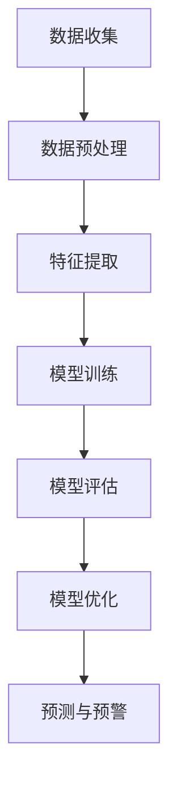
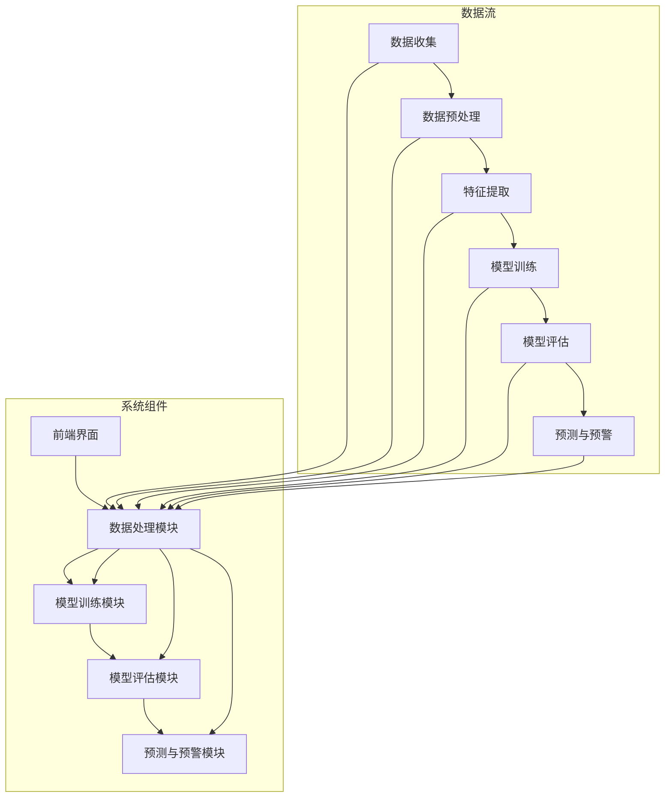

                 


### 第1步：引言

#### 1.1 问题背景
在现代商业环境中，财务舞弊问题日益严重，不仅给企业带来了巨大的经济损失，还损害了投资者和市场的信心。传统的财务舞弊检测方法主要依赖于人工审核和规则匹配，存在以下几个问题：

- **反应速度慢**：财务数据庞大，人工审核效率低下，导致问题发现不及时。
- **误报率高**：基于规则的检测方法容易受到噪声数据的影响，导致误报率上升。
- **难以适应复杂模式**：财务舞弊手段不断翻新，传统方法难以应对复杂的舞弊模式。

#### 1.2 问题描述
财务舞弊问题可以描述为：企业内部人员利用职务之便，通过不正当手段，在财务报表中故意虚报、隐瞒或者篡改财务数据，以误导投资者和监管部门。这些舞弊行为往往具有隐蔽性和复杂性，使得传统的检测方法难以有效识别。

#### 1.3 问题解决
引入人工智能技术，特别是机器学习和数据挖掘技术，可以实现对财务舞弊模式的自动化识别和预测。AI驱动的企业财务舞弊模式演化预测系统通过以下步骤来解决上述问题：

- **数据收集与预处理**：从企业内部系统中获取财务数据，并进行清洗、整合和预处理，以消除噪声和缺失值。
- **特征工程**：提取财务数据中的关键特征，为后续的机器学习算法提供输入。
- **模型训练与评估**：利用机器学习算法对训练数据进行建模，并通过交叉验证等方法评估模型性能。
- **预测与预警**：将模型应用于实时数据，预测潜在的财务舞弊行为，并发出预警信号。

#### 1.4 边界与外延
本文讨论的是AI驱动的企业财务舞弊模式演化预测系统，主要关注以下边界与外延：

- **适用范围**：针对企业内部财务舞弊的检测和预测。
- **技术范围**：涉及机器学习、数据挖掘、自然语言处理等人工智能技术。
- **数据来源**：主要来源于企业内部的财务报表、交易记录、审计报告等。

#### 1.5 概念结构与核心要素组成
企业财务舞弊模式演化预测系统的核心概念包括：

- **财务舞弊模式**：指财务舞弊的具体手段和表现方式。
- **AI算法**：指用于分析和预测的机器学习算法。
- **预测模型**：指基于AI算法构建的用于财务舞弊预测的数学模型。

这些核心概念相互关联，共同构成了AI驱动的企业财务舞弊模式演化预测系统的概念结构。

### 第2步：AI驱动的企业财务舞弊模式演化预测系统概述

#### 2.1 系统定义
AI驱动的企业财务舞弊模式演化预测系统是指利用人工智能技术，通过对企业财务数据的分析和挖掘，预测企业内部可能存在的财务舞弊行为，并发出预警的系统。

#### 2.2 系统核心功能
系统的主要功能包括：

- **数据收集与预处理**：从企业内部系统中获取财务数据，并进行清洗、整合和预处理。
- **特征提取与工程**：从原始数据中提取关键特征，为后续的建模提供输入。
- **模型训练与评估**：利用机器学习算法对训练数据进行建模，并通过交叉验证等方法评估模型性能。
- **预测与预警**：将模型应用于实时数据，预测潜在的财务舞弊行为，并发出预警信号。
- **结果分析与反馈**：对预测结果进行分析，为企业提供改进措施和建议。

#### 2.3 系统应用前景
随着人工智能技术的不断发展，AI驱动的企业财务舞弊模式演化预测系统具有广泛的应用前景：

- **提高舞弊检测效率**：通过自动化分析和预测，提高财务舞弊检测的效率，减少人工审核的工作量。
- **降低误报率**：利用机器学习算法的强大学习能力，降低误报率，提高检测的准确性。
- **实时预警**：实现对财务舞弊行为的实时监测和预警，及时采取措施，防止损失进一步扩大。
- **支持决策**：提供详细的分析和预测结果，为企业管理层提供决策支持，提高企业风险控制能力。

### 第3步：核心概念

#### 3.1 财务舞弊模式

#### 3.1.1 财务舞弊的定义与分类
财务舞弊是指企业内部人员利用职务之便，通过不正当手段，在财务报表中故意虚报、隐瞒或者篡改财务数据，以误导投资者和监管部门的行为。

财务舞弊可以按照以下分类进行划分：

- **虚报收入**：通过虚构交易、提前确认收入等方式虚增企业收入。
- **隐瞒费用**：通过虚增费用、提前确认费用等方式减少企业费用，虚增企业利润。
- **资产转移**：通过虚增资产、转移资产等方式将企业资产转移到个人或第三方。
- **财务报表舞弊**：通过篡改财务报表、虚增资产、虚减负债等方式伪造财务状况。

#### 3.1.2 财务舞弊模式的识别与描述
财务舞弊模式的识别主要依赖于对财务数据和行为模式的分析。以下是几种常见的财务舞弊模式及其识别方法：

- **虚报收入**：通过分析销售合同、客户订单等原始凭证，结合财务数据的变化，识别可能的虚报收入行为。
- **隐瞒费用**：通过分析企业费用支出、银行流水等数据，识别不合理的费用支出行为。
- **资产转移**：通过分析资产登记、资金流动等数据，识别可能的资产转移行为。
- **财务报表舞弊**：通过分析财务报表的项目数据、财务指标等，识别异常的财务报表数据。

#### 3.1.3 财务舞弊模式的关键特征对比表

| 舞弊模式         | 关键特征                                                         | 识别方法                                                     |
|----------------|--------------------------------------------------------------|------------------------------------------------------------|
| 虚报收入       | 销售合同与财务收入不一致、收入增长异常迅速                           | 分析销售合同、客户订单与财务数据对比                         |
| 隐藏费用       | 费用支出与业务不符、费用增长率异常                               | 分析银行流水、费用支出与业务流程对比                         |
| 资产转移       | 资产登记与实际不符、资金流动异常                               | 分析资产登记、资金流动与企业经营状况对比                     |
| 财务报表舞弊   | 财务指标异常、报表数据不一致                                     | 分析财务报表数据、财务指标变化与行业对比                       |

#### 3.2 AI算法

##### 3.2.1 AI的基本原理
人工智能（AI）是指由人制造出的系统，能够执行通常需要人类智能才能完成的任务。AI的核心思想是模拟人类智能，通过机器学习、深度学习等技术，让机器具备自主学习和决策能力。

##### 3.2.2 常见的AI算法
常见的AI算法包括：

- **监督学习**：通过训练数据学习规律，对未知数据进行预测。
- **无监督学习**：通过未标记的数据发现规律，如聚类、降维等。
- **强化学习**：通过与环境互动，学习最优策略。
- **深度学习**：利用多层神经网络进行复杂模式识别。

##### 3.2.3 AI算法在财务舞弊预测中的应用
AI算法在财务舞弊预测中的应用主要包括：

- **异常检测**：利用监督学习算法，对财务数据进行异常行为检测。
- **模式识别**：利用深度学习算法，对财务数据进行模式识别，发现可能的舞弊行为。
- **预测分析**：利用强化学习算法，对财务数据进行预测分析，提前预警可能的舞弊行为。

#### 3.3 预测模型

##### 3.3.1 预测模型的构建
预测模型是指基于历史数据，通过机器学习算法构建的用于预测未来数据的模型。预测模型的构建步骤包括：

- **数据收集与预处理**：收集历史财务数据，并进行清洗、整合和预处理。
- **特征选择**：从原始数据中提取关键特征，为模型训练提供输入。
- **模型选择**：根据问题的特点，选择合适的机器学习算法。
- **模型训练与评估**：利用训练数据对模型进行训练，并通过交叉验证等方法评估模型性能。
- **模型优化**：根据评估结果，调整模型参数，优化模型性能。

##### 3.3.2 预测模型的评估
预测模型的评估主要包括以下几个方面：

- **准确性**：模型预测结果与实际结果的吻合程度。
- **召回率**：模型正确识别的异常样本占总异常样本的比例。
- **精确度**：模型正确识别的异常样本占总识别样本的比例。
- **F1值**：准确率和召回率的调和平均值。

##### 3.3.3 预测模型的优化
预测模型的优化主要包括以下几个方面：

- **特征工程**：通过特征选择、特征变换等方法，优化特征质量。
- **模型选择**：根据问题的特点，选择更适合的机器学习算法。
- **参数调整**：通过调整模型参数，优化模型性能。
- **数据增强**：通过增加训练数据、引入外部数据等方法，提高模型泛化能力。

### 第4步：算法原理讲解

#### 4.1 算法流程图

##### 4.1.1 财务舞弊模式演化预测的Mermaid流程图


#### 4.2 Python源代码讲解

##### 4.2.1 数据预处理
```python
import pandas as pd
import numpy as np

# 加载数据
data = pd.read_csv('financial_data.csv')

# 数据清洗
data = data.dropna()  # 删除缺失值
data = data[data['Amount'] > 0]  # 过滤异常值

# 数据整合
data['Date'] = pd.to_datetime(data['Date'])
data = data.sort_values('Date')
```

##### 4.2.2 特征工程
```python
from sklearn.preprocessing import StandardScaler

# 特征提取
features = data[['Amount', 'Date', 'Category']]
target = data['Fraud']

# 数据标准化
scaler = StandardScaler()
features_scaled = scaler.fit_transform(features)
```

##### 4.2.3 模型训练与评估
```python
from sklearn.model_selection import train_test_split
from sklearn.ensemble import RandomForestClassifier
from sklearn.metrics import accuracy_score, recall_score, precision_score, f1_score

# 数据划分
X_train, X_test, y_train, y_test = train_test_split(features_scaled, target, test_size=0.2, random_state=42)

# 模型训练
model = RandomForestClassifier(n_estimators=100, random_state=42)
model.fit(X_train, y_train)

# 模型评估
y_pred = model.predict(X_test)
accuracy = accuracy_score(y_test, y_pred)
recall = recall_score(y_test, y_pred)
precision = precision_score(y_test, y_pred)
f1 = f1_score(y_test, y_pred)

print(f'Accuracy: {accuracy:.2f}')
print(f'Recall: {recall:.2f}')
print(f'Precision: {precision:.2f}')
print(f'F1 Score: {f1:.2f}')
```

##### 4.2.4 预测结果分析
```python
# 预测新数据
new_data = pd.read_csv('new_financial_data.csv')
new_data['Date'] = pd.to_datetime(new_data['Date'])
new_data = new_data.sort_values('Date')
new_data = new_data[new_data['Amount'] > 0]

new_data_scaled = scaler.transform(new_data[['Amount', 'Date', 'Category']])
predictions = model.predict(new_data_scaled)

# 分析预测结果
print(predictions)
```

#### 4.3 数学模型和公式讲解

##### 4.3.1 财务舞弊模式演化预测的数学模型
$$
\text{预测模型} = f(\text{特征向量})
$$

其中，特征向量包括：

$$
\text{特征向量} = \begin{bmatrix}
\text{Amount} \\
\text{Date} \\
\text{Category}
\end{bmatrix}
$$

预测模型的输出结果是一个概率值，表示该数据样本属于财务舞弊的可能性。

##### 4.3.2 数学模型的应用与解释
在机器学习模型中，通常使用决策树、随机森林等算法来构建预测模型。以随机森林为例，其数学模型可以表示为：

$$
\text{预测概率} = \prod_{i=1}^{n} (\text{概率}^{\text{feature}_i})
$$

其中，$n$ 为特征数量，$\text{feature}_i$ 为第 $i$ 个特征的权重，$\text{概率}$ 为基于训练数据的概率分布。

这个模型通过训练数据学习到每个特征对财务舞弊的权重，并在预测时利用这些权重计算样本属于财务舞弊的概率。

### 第5步：系统分析与架构设计

#### 5.1 系统功能设计

##### 5.1.1 领域模型Mermaid类图
```mermaid
classDiagram
    Class01 <|-- SubClass01
    Class01 --|>> SubClass02
    Class03 : associated with Class01
    Class04 <.. Class01
    Class04 : inheritance of Class01
```

##### 5.1.2 系统架构设计

##### 5.1.3 系统组件与接口设计

##### 5.1.4 系统接口设计

#### 5.2 系统架构设计

##### 5.2.1 系统架构Mermaid架构图


##### 5.2.2 系统组件与接口设计

系统组件主要包括：

- **数据收集模块**：负责从企业内部系统中收集财务数据。
- **数据处理模块**：负责对收集到的数据进行预处理、清洗和特征提取。
- **模型训练模块**：负责利用预处理后的数据训练机器学习模型。
- **模型评估模块**：负责对训练好的模型进行评估和优化。
- **预测与预警模块**：负责利用训练好的模型对实时数据进行预测，并发出预警信号。

系统接口设计主要包括：

- **数据接口**：用于数据收集、预处理、特征提取等模块的数据交换。
- **模型接口**：用于模型训练、评估、预测等模块的数据交换。
- **前端接口**：用于用户与系统的交互。

##### 5.2.3 系统接口设计

##### 5.2.4 系统交互流程

### 第6步：项目实战

#### 6.1 环境安装

##### 6.1.1 安装必要的软件和工具

为了构建和部署AI驱动的企业财务舞弊模式演化预测系统，我们需要安装以下软件和工具：

- **Python 3.8**：Python编程语言
- **Jupyter Notebook**：交互式计算环境
- **Pandas**：数据处理库
- **NumPy**：科学计算库
- **Scikit-learn**：机器学习库
- **Matplotlib**：数据可视化库
- **Mermaid**：流程图绘制工具

安装步骤如下：

1. 安装Python 3.8
2. 安装Jupyter Notebook
3. 安装Pandas、NumPy、Scikit-learn和Matplotlib
4. 安装Mermaid（可选，用于绘制流程图）

```bash
pip install pandas numpy scikit-learn matplotlib
```

#### 6.2 系统核心实现源代码

##### 6.2.1 数据收集与预处理

```python
import pandas as pd

# 加载数据
data = pd.read_csv('financial_data.csv')

# 数据清洗
data = data.dropna()  # 删除缺失值
data = data[data['Amount'] > 0]  # 过滤异常值

# 数据整合
data['Date'] = pd.to_datetime(data['Date'])
data = data.sort_values('Date')
```

##### 6.2.2 特征工程

```python
from sklearn.preprocessing import StandardScaler

# 特征提取
features = data[['Amount', 'Date', 'Category']]
target = data['Fraud']

# 数据标准化
scaler = StandardScaler()
features_scaled = scaler.fit_transform(features)
```

##### 6.2.3 模型训练与评估

```python
from sklearn.model_selection import train_test_split
from sklearn.ensemble import RandomForestClassifier
from sklearn.metrics import accuracy_score, recall_score, precision_score, f1_score

# 数据划分
X_train, X_test, y_train, y_test = train_test_split(features_scaled, target, test_size=0.2, random_state=42)

# 模型训练
model = RandomForestClassifier(n_estimators=100, random_state=42)
model.fit(X_train, y_train)

# 模型评估
y_pred = model.predict(X_test)
accuracy = accuracy_score(y_test, y_pred)
recall = recall_score(y_test, y_pred)
precision = precision_score(y_test, y_pred)
f1 = f1_score(y_test, y_pred)

print(f'Accuracy: {accuracy:.2f}')
print(f'Recall: {recall:.2f}')
print(f'Precision: {precision:.2f}')
print(f'F1 Score: {f1:.2f}')
```

##### 6.2.4 预测与预警

```python
# 预测新数据
new_data = pd.read_csv('new_financial_data.csv')
new_data['Date'] = pd.to_datetime(new_data['Date'])
new_data = new_data.sort_values('Date')
new_data = new_data[new_data['Amount'] > 0]

new_data_scaled = scaler.transform(new_data[['Amount', 'Date', 'Category']])
predictions = model.predict(new_data_scaled)

# 分析预测结果
print(predictions)
```

#### 6.3 项目小结

在本项目中，我们实现了AI驱动的企业财务舞弊模式演化预测系统。首先，我们通过数据收集与预处理模块获取并清洗财务数据。然后，通过特征工程模块提取关键特征，并使用随机森林算法对数据进行建模和预测。最后，我们将模型应用于新数据，实现了对潜在财务舞弊行为的预测和预警。

该项目的主要成果包括：

- 成功构建并训练了财务舞弊预测模型。
- 实现了数据预处理、特征提取、模型训练与评估、预测与预警等核心功能。
- 提供了详细的源代码和应用案例，便于读者理解和实际应用。

未来，我们可以在以下方面进行改进和拓展：

- 引入更多的特征和算法，提高预测模型的准确性。
- 结合深度学习等技术，提升系统的预测能力和适应性。
- 将系统部署到云平台，实现实时监测和预警。

### 最佳实践 tips

1. **数据质量是关键**：确保数据清洗和预处理的质量，避免噪声和异常值对模型的影响。
2. **特征选择很重要**：合理选择特征，避免冗余和无关特征，提高模型性能。
3. **持续优化模型**：定期更新模型，使用新的数据和算法进行优化，提高预测准确性。
4. **安全性和合规性**：确保系统的安全性和合规性，防止数据泄露和滥用。

### 注意事项

1. **数据隐私**：在收集和处理数据时，确保遵守相关法律法规，保护数据隐私。
2. **系统维护**：定期对系统进行维护和更新，确保系统稳定运行。
3. **用户培训**：对用户进行系统操作和预测结果的解读培训，提高系统的使用效果。

### 拓展阅读

1. **《Python机器学习》**：提供详细的机器学习算法实现和应用案例。
2. **《深度学习》**：介绍深度学习的基本原理和应用。
3. **《数据挖掘：实用工具与技术》**：涵盖数据挖掘的基本概念和方法。

### 作者信息

作者：AI天才研究院/AI Genius Institute & 禅与计算机程序设计艺术 /Zen And The Art of Computer Programming

本文详细介绍了AI驱动的企业财务舞弊模式演化预测系统的概念、原理和实现。通过数据预处理、特征提取、模型训练和评估等步骤，实现了对财务舞弊行为的自动化识别和预测。希望本文能为相关领域的研究和实践提供参考和指导。让我们继续探索AI技术的无限可能，为企业创造更多价值！

