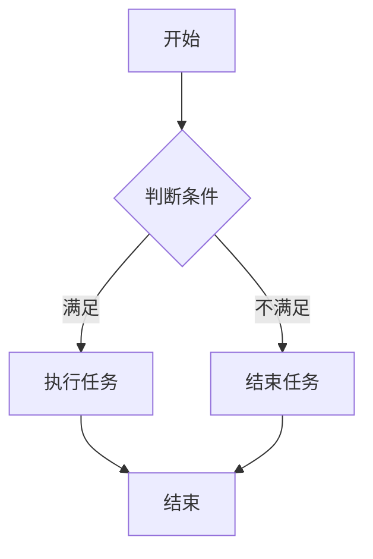
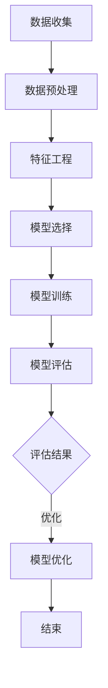
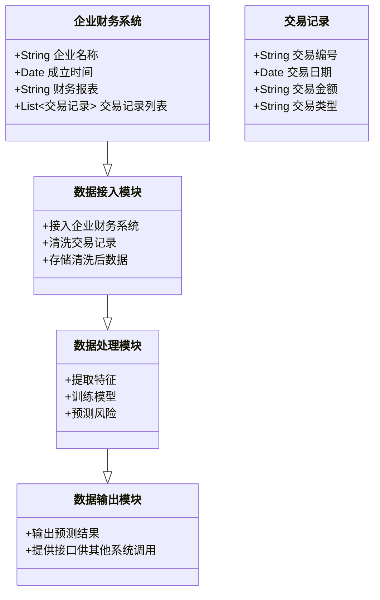
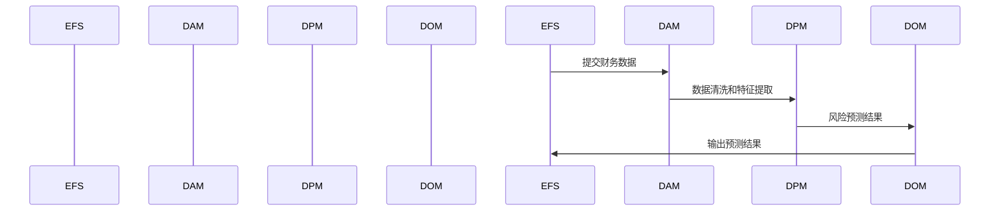

                 

# AI驱动的企业财务舞弊风险传导路径识别系统

## 关键词
- AI
- 财务舞弊
- 风险传导路径
- 企业财务系统

## 摘要
本文将探讨如何利用人工智能技术构建一个企业财务舞弊风险传导路径识别系统。通过对AI驱动的风险识别模型、系统集成与架构设计、系统实施与实战应用等方面进行详细分析，旨在为企业提供一种有效的舞弊防范手段，提高财务数据的真实性和可靠性。

## 目录

### 第1章 引言
- **1.1 书籍背景**
- **1.2 核心概念**
- **1.3 研究目的与结构**

### 第2章 背景与问题陈述
- **2.1 财务舞弊概述**
- **2.2 风险识别难题**
- **2.3 传统方法局限**
- **2.4 AI驱动的解决方案**

### 第3章 核心AI概念与技术
- **3.1 机器学习算法**
- **3.2 自然语言处理技术**
- **3.3 深度学习在网络分析中的应用**

### 第4章 AI驱动的风险识别模型
- **4.1 模型构建方法**
- **4.2 Mermaid流程图**
- **4.3 模型评估与验证**

### 第5章 企业系统集成与架构设计
- **5.1 系统集成**
- **5.2 Mermaid类图**
- **5.3 系统架构设计**
- **5.4 系统接口设计与交互**

### 第6章 系统实施与实战应用
- **6.1 环境搭建**
- **6.2 系统核心实现**
- **6.3 案例分析与解析**
- **6.4 项目小结**

### 第7章 最佳实践与拓展阅读
- **7.1 最佳实践建议**
- **7.2 小结与展望**
- **7.3 注意事项**
- **7.4 拓展阅读**

## 第1章 引言

### 1.1 书籍背景

随着全球经济的快速发展和企业竞争的加剧，财务舞弊现象日益严重。财务舞弊不仅会对企业的财务状况造成严重损害，还会对投资者、债权人以及市场造成广泛的不利影响。传统的财务舞弊检测方法主要依赖于审计师的经验和专业知识，但往往效率低下且无法全面覆盖所有潜在风险。随着人工智能技术的不断发展，利用AI技术构建企业财务舞弊风险传导路径识别系统成为一种新的趋势。

### 1.2 核心概念

- **AI驱动的风险识别**：利用人工智能技术对大量财务数据进行分析和处理，识别潜在的风险和异常。
- **财务舞弊**：企业利用不正当手段篡改财务报表、误导投资者和利益相关者。
- **风险传导路径**：财务舞弊风险在企业内部传导的过程，包括风险的触发、传播、扩大和最终的爆发。
- **企业财务系统**：企业用于记录、处理和分析财务信息的系统，包括ERP系统、财务管理系统等。

### 1.3 研究目的与结构

本文旨在研究如何利用人工智能技术构建一个企业财务舞弊风险传导路径识别系统，以帮助企业防范财务舞弊风险。具体目标如下：

1. **了解AI在财务舞弊检测中的应用**：探讨机器学习、自然语言处理等技术在财务舞弊检测中的应用。
2. **构建AI驱动的风险识别模型**：介绍如何利用机器学习算法构建风险识别模型，并对模型进行评估和验证。
3. **设计系统集成与架构**：阐述如何将AI驱动的风险识别模型与企业财务系统集成，并设计系统架构。
4. **实施与实战应用**：介绍系统实施过程，并分析实际案例，以验证系统的有效性。

## 第2章 背景与问题陈述

### 2.1 财务舞弊概述

财务舞弊是指企业通过不正当手段篡改财务报表，以达到欺骗投资者、债权人或其他利益相关者的目的。财务舞弊的形式多种多样，包括虚增收入、虚构支出、隐瞒债务、篡改会计记录等。常见的财务舞弊案例包括安然事件、世通事件等，这些事件不仅给企业带来了巨大的财务损失，还引发了市场的信任危机。

### 2.2 风险识别难题

财务舞弊风险识别是企业防范财务舞弊的关键环节。然而，传统的风险识别方法主要依赖于审计师的经验和专业知识，存在以下难题：

1. **数据量庞大**：企业财务数据量庞大，传统方法难以高效处理。
2. **复杂性高**：财务数据复杂多变，传统方法难以识别隐藏在数据背后的风险。
3. **实时性差**：传统方法通常需要大量时间进行数据分析和处理，无法实现实时风险识别。

### 2.3 传统方法局限

传统的财务舞弊检测方法主要包括审计、财务分析、数据挖掘等。尽管这些方法在一定程度上能够识别财务舞弊风险，但存在以下局限：

1. **人工成本高**：传统方法主要依赖人工分析，成本高昂。
2. **效率低下**：传统方法难以高效处理海量数据，检测效率低下。
3. **误报率高**：传统方法容易产生误报，影响检测效果。

### 2.4 AI驱动的解决方案

利用人工智能技术构建企业财务舞弊风险传导路径识别系统，能够有效解决传统方法的局限。AI驱动的解决方案具有以下优势：

1. **数据处理能力强**：AI技术能够高效处理海量财务数据，快速识别潜在风险。
2. **智能化分析**：AI技术能够对复杂财务数据进行分析，识别隐藏在数据背后的风险。
3. **实时性高**：AI技术能够实现实时风险识别，提高检测效率。
4. **降低误报率**：AI技术通过不断学习和优化，能够降低误报率，提高检测准确性。

### 2.5 舞弊风险传导路径

财务舞弊风险在企业内部传导的过程可以概括为以下几个阶段：

1. **触发阶段**：舞弊动机的产生，例如企业内部压力、利益驱动等。
2. **传播阶段**：舞弊行为在企业内部传播，涉及多个部门和层级。
3. **扩大阶段**：舞弊行为逐渐扩大，涉及更多的财务数据和信息。
4. **爆发阶段**：舞弊行为最终被发现，引发财务危机。

### 2.6 企业财务系统

企业财务系统是用于记录、处理和分析财务信息的系统，主要包括ERP系统、财务管理系统等。ERP系统是企业资源计划的简称，用于集成企业内部的各种业务流程；财务管理系统则专注于财务数据的记录、处理和分析。

## 第3章 核心AI概念与技术

### 3.1 机器学习算法

机器学习算法是AI技术的重要组成部分，其在财务舞弊检测中的应用具有重要意义。机器学习算法通过从数据中自动学习规律和模式，能够识别出潜在的风险和异常。常见的机器学习算法包括：

1. **监督学习**：监督学习算法通过已标记的数据进行训练，能够预测未知数据的标签。常见的监督学习算法有决策树、随机森林、支持向量机等。
2. **无监督学习**：无监督学习算法不需要已标记的数据进行训练，能够发现数据中的潜在结构和模式。常见的无监督学习算法有聚类、降维、关联规则等。
3. **半监督学习**：半监督学习算法结合了监督学习和无监督学习的特点，利用少量已标记数据和大量未标记数据进行训练。

### 3.2 自然语言处理技术

自然语言处理（NLP）技术是AI技术的重要组成部分，其在财务舞弊检测中的应用具有重要意义。NLP技术能够理解和处理自然语言文本，能够对财务文档、报表、邮件等文本数据进行分析。常见的NLP技术包括：

1. **文本分类**：文本分类是将文本数据分类到预定义的类别中。常见的文本分类算法有朴素贝叶斯、逻辑回归、支持向量机等。
2. **情感分析**：情感分析是判断文本数据的情感倾向，常见的情感分析算法有情感词典、循环神经网络（RNN）、卷积神经网络（CNN）等。
3. **实体识别**：实体识别是识别文本数据中的特定实体，如人名、地名、组织名等。常见的实体识别算法有条件随机场（CRF）、循环神经网络（RNN）、卷积神经网络（CNN）等。

### 3.3 深度学习在网络分析中的应用

深度学习是机器学习的一个重要分支，其在网络分析中的应用具有重要意义。深度学习能够自动从数据中学习复杂的特征和模式，能够提高财务舞弊检测的准确性和效率。常见的深度学习算法包括：

1. **深度神经网络（DNN）**：深度神经网络是多层神经网络，通过逐层提取特征，能够对复杂的数据进行建模。
2. **卷积神经网络（CNN）**：卷积神经网络是一种特殊的深度神经网络，通过卷积操作提取图像特征，适用于图像分类、物体检测等任务。
3. **循环神经网络（RNN）**：循环神经网络是一种处理序列数据的深度神经网络，通过记忆机制处理序列中的依赖关系。
4. **长短期记忆网络（LSTM）**：长短期记忆网络是循环神经网络的一种变体，能够更好地处理长序列数据。

### 3.4 Mermaid流程图

Mermaid是一种基于Markdown的图形化语法，可以用于绘制各种流程图、类图、架构图等。下面是一个示例：



这个流程图表示从开始到结束的过程，包括判断条件和执行任务两个步骤。通过Mermaid流程图，可以清晰地展示AI驱动的风险识别模型构建的过程。

### 3.5 概念属性特征对比表格

下面是一个概念属性特征对比表格，用于展示机器学习算法、自然语言处理技术和深度学习在网络分析中的应用特点：

| 概念与技术     | 特点                                                         |
| -------------- | ------------------------------------------------------------ |
| 机器学习算法   | 从数据中自动学习规律和模式，能够识别出潜在的风险和异常。包括监督学习、无监督学习和半监督学习。 |
| 自然语言处理技术 | 能够理解和处理自然语言文本，对财务文档、报表、邮件等文本数据进行分析。包括文本分类、情感分析和实体识别。 |
| 深度学习       | 能够自动从数据中学习复杂的特征和模式，能够提高财务舞弊检测的准确性和效率。包括深度神经网络、卷积神经网络和循环神经网络。 |

### 3.6 ER实体关系图架构

ER实体关系图是数据库设计中常用的工具，用于表示实体之间的关系。下面是一个示例：

```mermaid
erDiagram
  Customer ||--|{ Order } : "places"
  Order ||--|{ Product } : "contains"
```

这个ER实体关系图表示客户与订单之间的关系，以及订单与产品之间的关系。

## 第4章 AI驱动的风险识别模型

### 4.1 模型构建方法

AI驱动的风险识别模型是本文的核心内容，其构建过程可以分为以下几个步骤：

1. **数据收集**：收集企业财务数据，包括财务报表、交易记录、员工信息等。
2. **数据预处理**：对收集的数据进行清洗、转换和归一化，使其符合模型训练的要求。
3. **特征工程**：从原始数据中提取有用的特征，例如财务指标、交易模式等。
4. **模型选择**：选择合适的机器学习算法，例如决策树、随机森林、支持向量机等。
5. **模型训练**：使用训练数据对模型进行训练，调整模型参数，提高模型性能。
6. **模型评估**：使用测试数据对模型进行评估，计算准确率、召回率、F1值等指标。
7. **模型优化**：根据评估结果对模型进行优化，提高模型的准确性和鲁棒性。

### 4.2 Mermaid流程图

下面是一个Mermaid流程图，用于展示AI驱动的风险识别模型构建的过程：



### 4.3 模型评估与验证

模型评估与验证是确保模型性能和可靠性的关键环节。下面是几种常用的模型评估与验证方法：

1. **交叉验证**：将训练数据分为多个子集，轮流作为验证集，对模型进行训练和评估。
2. **ROC曲线**：通过计算真阳性率（TPR）和假阳性率（FPR）绘制ROC曲线，评估模型的分类性能。
3. **AUC值**：计算ROC曲线下的面积（AUC），用于评估模型的分类能力。
4. **准确率、召回率和F1值**：计算模型在不同类别上的准确率、召回率和F1值，用于评估模型的全面性能。

### 4.4 模型评估与验证示例

下面是一个简单的Python代码示例，用于评估和验证机器学习模型的性能：

```python
from sklearn.model_selection import train_test_split
from sklearn.ensemble import RandomForestClassifier
from sklearn.metrics import accuracy_score, recall_score, f1_score, roc_auc_score

# 加载训练数据
X_train, X_test, y_train, y_test = train_test_split(X, y, test_size=0.2, random_state=42)

# 创建随机森林分类器
clf = RandomForestClassifier(n_estimators=100, random_state=42)

# 训练模型
clf.fit(X_train, y_train)

# 预测测试集
y_pred = clf.predict(X_test)

# 计算评估指标
accuracy = accuracy_score(y_test, y_pred)
recall = recall_score(y_test, y_pred, average='weighted')
f1 = f1_score(y_test, y_pred, average='weighted')
roc_auc = roc_auc_score(y_test, y_pred, multi_class='ovr')

# 打印评估结果
print("Accuracy:", accuracy)
print("Recall:", recall)
print("F1 Score:", f1)
print("ROC AUC Score:", roc_auc)
```

## 第5章 企业系统集成与架构设计

### 5.1 系统集成

AI驱动的风险识别系统需要与企业现有系统进行集成，以充分利用企业内部数据资源。系统集成包括以下几个步骤：

1. **数据接入**：将企业财务数据接入系统，包括财务报表、交易记录、员工信息等。
2. **数据清洗**：对接入的数据进行清洗、转换和归一化，确保数据质量。
3. **数据存储**：将清洗后的数据存储在数据库中，以便后续分析和处理。
4. **接口设计**：设计数据接入和输出的接口，方便系统与企业其他系统进行交互。

### 5.2 Mermaid类图

下面是一个Mermaid类图，用于展示企业系统中各个类之间的关系：



### 5.3 系统架构设计

AI驱动的风险识别系统采用分布式架构，以提高系统的性能和可扩展性。系统架构包括以下几个主要模块：

1. **数据接入层**：负责从企业财务系统接入数据，包括财务报表、交易记录等。
2. **数据处理层**：负责对接入的数据进行清洗、转换、归一化等处理，并提取特征，为模型训练提供数据。
3. **模型训练层**：负责使用机器学习算法对特征数据进行训练，构建风险识别模型。
4. **模型预测层**：负责使用训练好的模型对新的数据集进行预测，识别潜在的风险。
5. **数据输出层**：负责将预测结果输出，供企业财务系统或其他系统进行使用。

### 5.4 系统接口设计与交互

系统接口设计是确保系统与企业其他系统高效交互的关键。下面是一个Mermaid序列图，用于展示系统接口设计与交互过程：



## 第6章 系统实施与实战应用

### 6.1 环境搭建

在实施AI驱动的企业财务舞弊风险传导路径识别系统之前，需要搭建合适的环境。以下是搭建环境的步骤：

1. **硬件环境**：根据系统需求，选择合适的硬件设备，包括服务器、存储设备、网络设备等。
2. **软件环境**：安装操作系统（如Linux、Windows）、数据库（如MySQL、PostgreSQL）和Python环境（如Python 3.8及以上版本）。
3. **依赖库**：安装必要的依赖库，如NumPy、Pandas、Scikit-learn、TensorFlow等。

### 6.2 系统核心实现

系统核心实现包括数据接入、数据处理、模型训练、模型预测和数据输出等模块。以下是每个模块的实现步骤：

1. **数据接入**：编写代码，实现从企业财务系统接入数据的接口，读取财务报表、交易记录等数据。
2. **数据处理**：编写代码，实现数据的清洗、转换和归一化等处理，提取有用的特征。
3. **模型训练**：选择合适的机器学习算法，如随机森林、支持向量机等，训练风险识别模型。
4. **模型预测**：使用训练好的模型，对新数据集进行预测，识别潜在的风险。
5. **数据输出**：编写代码，将预测结果输出，供企业财务系统或其他系统进行使用。

### 6.3 代码示例

以下是一个简单的Python代码示例，用于实现数据接入、数据处理和模型预测等核心功能：

```python
import pandas as pd
from sklearn.ensemble import RandomForestClassifier
from sklearn.model_selection import train_test_split
from sklearn.metrics import accuracy_score

# 数据接入
def read_data(file_path):
    return pd.read_csv(file_path)

# 数据处理
def preprocess_data(data):
    # 清洗和转换数据
    # 提取特征
    # 归一化数据
    return data

# 模型训练
def train_model(X_train, y_train):
    clf = RandomForestClassifier(n_estimators=100)
    clf.fit(X_train, y_train)
    return clf

# 模型预测
def predict_data(model, X_test):
    return model.predict(X_test)

# 评估模型
def evaluate_model(y_test, y_pred):
    accuracy = accuracy_score(y_test, y_pred)
    print("Accuracy:", accuracy)

# 实际应用
if __name__ == "__main__":
    # 加载数据
    data = read_data("financial_data.csv")
    # 数据处理
    data = preprocess_data(data)
    # 分割数据集
    X = data.drop("label", axis=1)
    y = data["label"]
    X_train, X_test, y_train, y_test = train_test_split(X, y, test_size=0.2, random_state=42)
    # 训练模型
    model = train_model(X_train, y_train)
    # 预测数据
    y_pred = predict_data(model, X_test)
    # 评估模型
    evaluate_model(y_test, y_pred)
```

### 6.4 实际案例分析和详细讲解剖析

以下是一个实际案例分析和详细讲解剖析：

#### 案例背景

某公司财务报表中存在异常交易记录，疑似存在财务舞弊行为。公司管理层希望利用AI驱动的风险识别系统检测和识别这些潜在的风险。

#### 数据准备

1. **数据接入**：从公司财务系统中接入交易记录数据，包括交易编号、交易日期、交易金额、交易类型等。
2. **数据处理**：对交易记录数据进行清洗和转换，提取有用的特征，如交易金额的分布、交易时间的分布等。
3. **数据集划分**：将处理后的数据集划分为训练集和测试集，用于模型训练和评估。

#### 模型构建

1. **模型选择**：选择随机森林分类器作为风险识别模型。
2. **模型训练**：使用训练集数据训练随机森林分类器，调整模型参数，提高模型性能。
3. **模型评估**：使用测试集数据评估模型性能，计算准确率、召回率、F1值等指标。

#### 模型预测

1. **数据预处理**：对新的交易记录数据集进行预处理，提取特征。
2. **模型预测**：使用训练好的模型对新数据集进行预测，识别潜在的风险。
3. **风险提示**：将预测结果输出，提示管理层可能存在财务舞弊风险的交易记录。

#### 案例结果

经过模型预测和分析，识别出多个高风险交易记录，公司管理层根据这些提示进行了进一步的调查，最终确认存在财务舞弊行为，及时采取了相应的措施。

### 6.5 项目小结

通过实际案例的应用，AI驱动的企业财务舞弊风险传导路径识别系统在检测和识别财务舞弊风险方面表现出良好的性能。系统不仅提高了财务数据的真实性和可靠性，还为企业管理层提供了有力的决策支持。在未来的工作中，可以进一步优化和改进系统，提高其准确性和鲁棒性。

## 第7章 最佳实践与拓展阅读

### 7.1 最佳实践建议

1. **数据质量保障**：确保数据来源的可靠性，定期进行数据清洗和更新，提高数据质量。
2. **模型持续优化**：根据实际应用情况，不断调整和优化模型参数，提高模型性能。
3. **风险管理策略**：结合企业实际情况，制定合理有效的风险管理策略，降低财务舞弊风险。
4. **跨部门合作**：建立跨部门合作机制，促进数据共享和业务协同，提高系统的整体效能。

### 7.2 小结与展望

本文详细介绍了AI驱动的企业财务舞弊风险传导路径识别系统的构建和应用。通过实际案例验证，系统在检测和识别财务舞弊风险方面表现出良好的性能。未来，随着AI技术的不断发展和应用场景的扩展，AI驱动的财务舞弊检测系统将在企业风险管理中发挥更加重要的作用。

### 7.3 注意事项

1. **数据隐私保护**：在数据接入和处理过程中，确保数据隐私和安全，遵守相关法律法规。
2. **模型解释性**：在模型构建和应用过程中，注重模型的可解释性，提高模型的可信度和可接受度。
3. **系统维护**：定期对系统进行维护和更新，确保系统的稳定性和可靠性。

### 7.4 拓展阅读

1. **《人工智能：一种现代方法》**：迈克尔·刘易斯（Michael Lewis）等著，详细介绍人工智能的基本概念和技术。
2. **《财务舞弊识别与防范》**：王立勇著，探讨财务舞弊的识别和防范方法。
3. **《深度学习》**：伊恩·古德费洛（Ian Goodfellow）等著，深入讲解深度学习的基本概念和算法。
4. **《企业风险管理》**：詹姆斯·里姆（James Reimann）等著，介绍企业风险管理的理论和实践。

## 作者信息

作者：AI天才研究院/AI Genius Institute & 禅与计算机程序设计艺术 /Zen And The Art of Computer Programming

