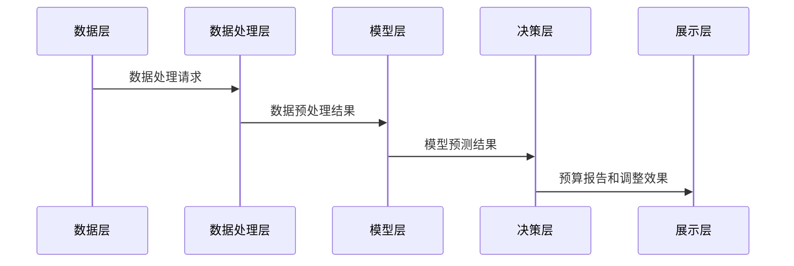
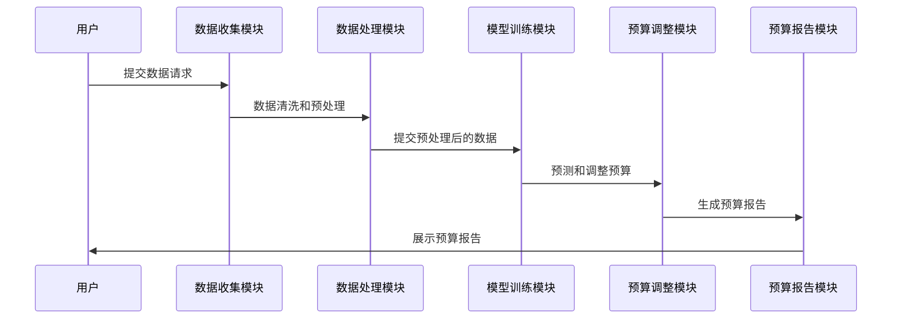

                 


### 1.1 问题背景

企业财务预算是企业对未来一段时间内收入和支出进行预测和规划的重要工具。然而，随着企业规模的扩大和业务复杂性的增加，传统财务预算编制与调整面临以下问题：

**1. 效率低下**：传统财务预算主要依赖于手工操作，数据收集、处理和调整过程繁琐，耗时较长，导致预算编制效率低下。

**2. 准确性差**：财务预算涉及大量历史数据和市场信息，传统方法难以充分考虑这些因素的相互作用，导致预算结果准确性差。

**3. 缺乏灵活性**：企业面临的市场环境多变，传统财务预算难以快速响应市场变化，缺乏灵活性。

**问题解决**：引入AI技术，利用其强大的数据处理和预测能力，可以显著提高财务预算编制与调整的效率与准确性。具体来说：

- **数据收集与处理**：AI技术可以自动化数据收集和处理，提高数据质量和效率。
- **预算模型构建**：通过机器学习算法，可以构建更加精准的预算模型，提高预测准确性。
- **预算调整策略**：利用AI技术，可以实时分析市场变化和业务数据，动态调整预算策略，提高预算的灵活性。

**边界与外延**：本文主要探讨AI驱动的财务预算编制与调整系统，涉及以下领域：

- **财务数据分析**：研究如何利用AI技术对财务数据进行分析和处理。
- **机器学习算法**：介绍如何使用机器学习算法构建预算模型和调整策略。
- **企业信息化建设**：探讨AI技术在企业信息化建设中的应用场景和挑战。

### 1.2 核心概念与联系

**AI驱动的财务预算系统**：这是一个综合运用AI技术的系统，包括数据收集与处理、预算模型构建、预算调整策略等模块。以下是系统的主要组成部分：

- **数据收集与处理**：该模块负责收集企业内外部财务数据，并进行清洗、转换和归一化处理，为预算模型构建提供高质量的数据输入。
- **预算模型构建**：利用机器学习算法，对处理后的数据进行分析，构建预测模型，用于预算编制和调整。
- **预算调整策略**：根据市场变化和业务数据，动态调整预算策略，实现预算的灵活性和准确性。

**数据收集与处理**：这是AI驱动的财务预算系统的核心模块，数据的质量和准确性直接影响预算模型的效果。以下是数据收集与处理的主要步骤：

1. **数据源**：企业内部财务数据和外部市场数据，如财务报表、销售数据、行业趋势等。
2. **数据清洗**：去除重复、错误和缺失的数据，保证数据质量。
3. **数据转换**：将不同格式和单位的数据转换为统一的格式，便于后续处理。
4. **数据归一化**：对数据进行归一化处理，消除数据量级差异，提高数据可比性。

**预算模型构建**：预算模型的构建是财务预算系统的关键环节，以下是模型构建的主要步骤：

1. **数据预处理**：对收集到的数据进行分析，提取有用的特征，进行数据预处理。
2. **模型选择**：根据数据特点和业务需求，选择合适的机器学习算法，如线性回归、决策树、神经网络等。
3. **模型训练**：利用预处理后的数据，对选定的模型进行训练，优化模型参数。
4. **模型评估**：通过交叉验证等方法，评估模型的预测性能，选择最优模型。

**预算调整策略**：预算调整策略的制定是确保预算灵活性和准确性的关键。以下是调整策略的主要步骤：

1. **数据分析**：实时分析市场变化和业务数据，识别潜在的预算调整信号。
2. **策略设计**：根据数据分析结果，设计动态调整策略，如增加预算、削减支出等。
3. **效果评估**：实施调整策略后，对预算效果进行评估，持续优化调整策略。

### 1.3 概念结构与核心要素组成

AI驱动的财务预算编制与调整系统由以下几个核心要素组成：

1. **数据层**：包括企业内部财务数据和外部市场数据，是系统的基础。
2. **数据处理层**：负责数据收集、清洗、转换和归一化，为预算模型提供高质量数据。
3. **模型层**：包括预测模型和调整策略模型，用于预算编制和调整。
4. **决策层**：根据模型结果和业务需求，制定和调整预算策略。
5. **展示层**：展示预算结果和调整效果，供管理层决策参考。

**数据层**：数据是企业财务预算的基础，包括以下类型：

- **内部财务数据**：如财务报表、销售数据、成本数据等。
- **外部市场数据**：如行业趋势、竞争对手数据、宏观经济指标等。

**数据处理层**：数据处理层的主要功能是确保数据的质量和一致性，包括以下步骤：

- **数据收集**：自动化收集企业内部和外部数据。
- **数据清洗**：去除重复、错误和缺失的数据，保证数据质量。
- **数据转换**：将不同格式和单位的数据转换为统一的格式。
- **数据归一化**：对数据进行归一化处理，消除数据量级差异。

**模型层**：模型层是系统的核心，包括以下功能：

- **预测模型**：用于预算编制，如线性回归、决策树、神经网络等。
- **调整策略模型**：用于预算调整，如基于规则、机器学习等方法。

**决策层**：决策层根据模型结果和业务需求，制定和调整预算策略，包括以下功能：

- **预算编制**：根据预测模型结果，制定预算计划。
- **预算调整**：根据调整策略模型结果，动态调整预算计划。

**展示层**：展示层用于展示预算结果和调整效果，包括以下功能：

- **预算报告**：生成预算报告，供管理层决策参考。
- **调整效果展示**：展示预算调整后的效果，供决策层评估。

### 1.4 核心概念与联系总结

AI驱动的财务预算编制与调整系统通过数据层、数据处理层、模型层、决策层和展示层的协同工作，实现了企业财务预算的高效、准确和灵活。以下是各层之间的关系和协同工作原理：

- **数据层与数据处理层**：数据层提供数据，数据处理层负责数据清洗、转换和归一化，确保数据质量。
- **数据处理层与模型层**：数据处理层为模型层提供高质量的数据输入，模型层基于这些数据进行预测和调整。
- **模型层与决策层**：模型层的结果为决策层提供决策依据，决策层根据模型结果制定和调整预算策略。
- **决策层与展示层**：决策层制定的预算策略和调整结果通过展示层展示给管理层，供其决策和评估。

通过这种协同工作，AI驱动的财务预算编制与调整系统实现了对传统财务预算的优化，提高了预算编制的效率和准确性，增强了预算的灵活性。

### 1.5 问题与挑战

尽管AI驱动的财务预算系统具有许多优势，但在实际应用过程中仍面临一些问题和挑战：

**1. 数据质量**：数据是AI驱动系统的核心，数据质量直接影响预算结果。然而，企业在数据收集和处理过程中可能会遇到数据缺失、数据不一致等问题。

**2. 模型选择与优化**：不同的机器学习算法适用于不同的业务场景，如何选择和优化模型是一个挑战。此外，模型训练和优化过程需要大量计算资源和时间。

**3. 决策支持**：预算调整策略的制定需要综合考虑多种因素，如市场变化、业务需求等。如何提供有效的决策支持是一个难点。

**4. 适应性**：企业在不同阶段和不同市场环境下，预算需求可能发生变化。系统如何适应这些变化，保持其灵活性和有效性是一个挑战。

**5. 透明性与可解释性**：AI模型通常被视为“黑盒子”，其决策过程缺乏透明性。如何提高模型的透明性和可解释性，让管理层更好地理解预算结果，是一个挑战。

### 1.6 潜在解决方案与未来方向

针对上述问题和挑战，可以采取以下解决方案和未来研究方向：

**1. 数据质量管理**：建立健全的数据质量管理机制，确保数据收集、处理和存储过程的规范性，提高数据质量。

**2. 模型选择与优化**：结合业务需求和数据特点，选择合适的机器学习算法，并进行模型优化，提高模型预测准确性。

**3. 决策支持**：引入数据可视化工具和决策支持系统，帮助管理层更好地理解预算结果和调整策略。

**4. 适应性**：设计灵活的预算模型和调整策略，使其能够适应不同阶段和不同市场环境的变化。

**5. 透明性与可解释性**：通过模型解释工具和可视化方法，提高AI模型的透明性和可解释性。

**6. 未来方向**：随着AI技术的不断发展，可以探索更多的机器学习算法和应用场景，进一步提高财务预算的准确性和效率。

### 1.7 小结

本文介绍了AI驱动的企业财务预算编制与调整系统的背景、核心概念与联系，并分析了系统面临的问题和挑战。通过逐步分析，我们明确了系统的结构组成和各部分之间的协同关系，为后续的算法原理讲解和系统架构设计奠定了基础。接下来，我们将进一步深入探讨系统的数据分析原理、机器学习算法、企业信息化建设等方面的内容。

### 1.8 概念属性特征对比表格

为了更好地理解AI驱动的财务预算系统中的核心概念，我们列出以下概念属性特征对比表格，帮助读者更清晰地把握各个概念之间的联系和区别。

| 概念             | 属性特征                     | 联系与区别                                               |
|------------------|------------------------------|-----------------------------------------------------------|
| 企业财务预算     | 预测收入、支出、现金流等      | 基础数据，为预算编制和调整提供依据                       |
| 数据收集与处理   | 数据清洗、转换、归一化       | 确保数据质量，为模型训练提供高质量数据输入                 |
| 预算模型构建     | 预测模型、调整策略模型       | 通过机器学习算法，实现预算编制和调整                     |
| 企业信息化建设   | 信息化系统、技术架构         | 为AI驱动的财务预算系统提供技术支持                       |
| 预算调整策略     | 动态调整策略、效果评估       | 根据市场变化和业务数据，实现预算的灵活调整和优化           |
| 展示层           | 预算报告、调整效果展示       | 为管理层提供决策依据和参考，提高预算透明性               |

通过以上表格，我们可以更清晰地理解各个核心概念在系统中的作用和相互关系。

### 1.9 ER实体关系图架构

为了更好地理解AI驱动的财务预算系统中各实体的关系，我们使用ER（实体-关系）图来展示。以下是系统的ER实体关系图，其中包含的主要实体和关系如下：

- **实体**：
  - **财务数据**：包括企业内部财务数据和外部市场数据。
  - **数据清洗**：对收集的财务数据进行清洗和预处理。
  - **数据处理**：包括数据转换和归一化处理。
  - **预算模型**：包括预测模型和调整策略模型。
  - **预算调整**：根据模型结果进行预算调整。
  - **决策层**：根据预算结果和调整效果做出决策。
  - **展示层**：用于展示预算报告和调整效果。

- **关系**：
  - **财务数据与数据清洗**：财务数据经过数据清洗处理后，转化为高质量数据。
  - **数据清洗与数据处理**：清洗后的数据经过数据处理，转化为适合模型训练的数据。
  - **数据处理与预算模型**：处理后的数据用于训练预算模型。
  - **预算模型与预算调整**：预算模型输出预算调整策略。
  - **预算调整与决策层**：调整策略由决策层决策。
  - **决策层与展示层**：决策结果通过展示层展示。

以下是ER实体关系图的Mermaid表示：

```mermaid
erDiagram
  财务数据 ||--|{ 数据清洗 }
  数据清洗 ||--|{ 数据处理 }
  数据处理 ||--|{ 预算模型 }
  预算模型 ||--|{ 预算调整 }
  预算调整 ||--|{ 决策层 }
  决策层 ||--|{ 展示层 }
```

通过ER实体关系图，我们可以清晰地看到系统中的各个实体及其相互关系，有助于理解系统的整体架构和运行机制。

### 2.1 数据分析原理

数据分析是企业财务预算编制与调整系统中至关重要的环节。其核心在于利用统计方法和算法对财务数据进行处理和分析，以发现数据中的规律和趋势，为预算编制和调整提供依据。以下是数据分析的原理和步骤：

#### 数据源

数据分析的第一步是数据收集。企业财务预算所需的数据来源主要包括：

- **内部数据**：如财务报表、销售记录、成本数据、库存数据等。这些数据通常由企业内部信息系统产生，是预算编制的主要依据。
- **外部数据**：如行业报告、市场趋势、宏观经济指标等。这些数据可以从外部数据源获取，如市场研究公司、政府统计部门、证券交易所等。

#### 数据处理

数据处理是数据分析的另一个关键环节，包括以下步骤：

- **数据清洗**：去除数据中的重复记录、错误数据和缺失值，保证数据的一致性和准确性。例如，删除重复的销售记录，修复异常数据值等。
- **数据转换**：将不同格式和单位的数据转换为统一的格式，以便于后续处理。例如，将销售数据的货币单位统一为美元。
- **数据归一化**：对数据进行归一化处理，消除数据量级差异，提高数据可比性。例如，将不同年份的销售数据转换为同一年份的数据。

#### 数据分析

在数据处理完成后，进行数据分析。数据分析包括以下几种类型：

- **描述性分析**：通过统计方法对数据进行描述，如计算平均值、中位数、标准差等。描述性分析主要用于了解数据的总体特征和分布情况。
- **预测分析**：利用历史数据建立预测模型，预测未来的财务指标。预测分析通常采用机器学习算法，如线性回归、决策树、神经网络等。

#### 描述性分析

描述性分析主要用于了解数据的分布和特征，以下是常用的描述性分析方法：

- **均值**：数据集合的平均值，用于衡量数据的集中趋势。
- **中位数**：数据集合的中间值，用于衡量数据的中间位置。
- **众数**：数据集合中出现次数最多的值，用于衡量数据的常见值。
- **标准差**：数据集合的离散程度，用于衡量数据的波动范围。

#### 预测分析

预测分析是财务预算编制的核心，通过预测未来财务指标，为预算调整提供依据。以下是常用的预测分析方法：

- **线性回归**：通过建立线性关系模型，预测未来的财务指标。线性回归模型简单易用，但假设数据满足线性关系，可能不适用于复杂的数据。
- **决策树**：通过树形结构对数据进行分类和预测。决策树模型直观易懂，但可能产生过拟合现象。
- **神经网络**：通过多层神经网络进行数据分析和预测。神经网络模型具有较强的预测能力，但计算复杂度较高。

#### 数据分析过程

数据分析过程通常包括以下步骤：

1. **数据收集**：从内部和外部数据源收集所需数据。
2. **数据清洗**：去除重复、错误和缺失的数据，保证数据质量。
3. **数据转换**：将不同格式和单位的数据转换为统一的格式。
4. **数据归一化**：对数据进行归一化处理，消除数据量级差异。
5. **描述性分析**：计算描述性统计指标，了解数据的总体特征。
6. **预测分析**：建立预测模型，预测未来的财务指标。
7. **结果评估**：评估预测模型的性能，选择最优模型。

#### 案例说明

假设一家企业需要预测下一季度的销售收入，以下是数据分析的步骤：

1. **数据收集**：收集过去几年的季度销售收入数据。
2. **数据清洗**：删除重复记录，修正异常数据值，补充缺失数据。
3. **数据转换**：将货币单位统一为美元，将时间单位统一为季度。
4. **数据归一化**：对销售收入进行归一化处理，消除量级差异。
5. **描述性分析**：计算过去几年销售收入的平均值、中位数、标准差等统计指标。
6. **预测分析**：使用线性回归模型预测下一季度的销售收入。
7. **结果评估**：评估线性回归模型的预测性能，选择最优模型。

通过以上步骤，企业可以预测下一季度的销售收入，为预算编制和调整提供依据。

### 2.2 机器学习算法

在AI驱动的企业财务预算系统中，机器学习算法扮演着核心角色，用于构建预算模型和调整策略。以下是几种常见的机器学习算法及其基本原理和步骤。

#### 线性回归

线性回归是一种最简单的机器学习算法，用于建立输入变量和输出变量之间的线性关系。其基本原理是通过最小化损失函数（如均方误差）来找到最佳拟合直线。

**步骤：**

1. **数据准备**：收集历史财务数据，包括自变量（如销售额、成本等）和因变量（如利润）。
2. **特征工程**：对数据进行预处理，包括数据清洗、数据转换和数据归一化。
3. **模型训练**：使用训练数据集，通过最小二乘法求解线性回归方程的参数。
4. **模型评估**：使用验证数据集评估模型性能，调整模型参数以优化性能。
5. **预测**：使用训练好的模型对新的数据进行预测。

**数学模型：**

$$
y = \beta_0 + \beta_1x_1 + \beta_2x_2 + \ldots + \beta_nx_n
$$

其中，$y$ 是因变量，$x_1, x_2, \ldots, x_n$ 是自变量，$\beta_0, \beta_1, \beta_2, \ldots, \beta_n$ 是模型参数。

#### 决策树

决策树是一种基于树形结构进行分类和预测的算法。其基本原理是通过一系列规则对数据进行分割，最终形成一棵树形结构。

**步骤：**

1. **数据准备**：收集历史财务数据，并进行预处理。
2. **特征选择**：选择对预算预测最具影响力的特征。
3. **树构建**：基于数据特征，构建决策树，包括选择最佳分割特征和分割阈值。
4. **剪枝**：对决策树进行剪枝，防止过拟合。
5. **模型评估**：使用验证数据集评估模型性能。
6. **预测**：使用训练好的决策树对新的数据进行预测。

**数学模型：**

决策树没有固定的数学模型，主要依赖于树形结构来表示决策过程。

#### 神经网络

神经网络是一种模拟人脑神经元结构的机器学习算法，用于处理复杂的非线性问题。其基本原理是通过多层神经元的互联和激活函数，将输入映射到输出。

**步骤：**

1. **数据准备**：收集历史财务数据，并进行预处理。
2. **网络构建**：设计神经网络结构，包括输入层、隐藏层和输出层。
3. **权重初始化**：初始化网络权重和偏置。
4. **前向传播**：计算输入数据通过网络的输出。
5. **反向传播**：根据输出误差，更新网络权重和偏置。
6. **模型评估**：使用验证数据集评估模型性能。
7. **预测**：使用训练好的神经网络对新的数据进行预测。

**数学模型：**

神经网络主要依赖于激活函数（如Sigmoid、ReLU）和反向传播算法来更新网络权重和偏置。

#### 对比与选择

线性回归、决策树和神经网络各有优缺点，适用于不同的业务场景。以下是对它们的对比：

| 算法 | 优点 | 缺点 | 适用场景 |
|------|------|------|----------|
| 线性回归 | 简单易用，计算效率高 | 假设数据线性关系，可能不适用于复杂问题 | 数据线性关系明显，简单预测任务 |
| 决策树 | 直观易懂，易于解释 | 可能产生过拟合，模型复杂度较低 | 数据简单，需要可视化解释 |
| 神经网络 | 强大预测能力，适应非线性关系 | 计算复杂度高，需要大量训练数据 | 复杂预测任务，大量数据可用 |

根据业务需求和数据特点，可以选择合适的机器学习算法来构建预算模型和调整策略。

### 2.3 企业信息化建设

企业信息化建设是企业利用信息技术提高效率和竞争力的重要途径。在AI驱动的财务预算系统中，企业信息化建设起到了关键作用，为系统的实施提供了技术支持。以下是企业信息化建设的基本概念、意义、目标和挑战，以及AI技术在其中的应用。

#### 基本概念

企业信息化建设是指通过信息技术的应用，实现企业业务流程的数字化、自动化和智能化，以提高企业运营效率和竞争力。其核心内容包括：

- **信息系统**：企业内部用于支持业务运营的各种信息处理系统，如ERP系统、CRM系统、财务管理系统等。
- **信息技术**：包括计算机硬件、软件、网络通信、数据库等技术。
- **信息资源**：企业的数据、文档、知识等资源。

#### 意义

企业信息化建设对企业具有重要意义：

- **提高运营效率**：通过信息系统和信息技术，实现业务流程的自动化和优化，减少人工操作，提高工作效率。
- **增强竞争力**：通过信息技术的应用，企业能够更好地了解市场需求，优化资源配置，提高产品和服务的竞争力。
- **决策支持**：信息系统提供了大量的数据和分析工具，帮助企业做出更加科学的决策。

#### 目标

企业信息化建设的目标主要包括：

- **提高效率**：通过信息技术的应用，实现业务流程的自动化和优化，减少人力和时间成本。
- **数据整合**：将企业内部和外部数据整合到一个平台上，实现数据共享和协同工作。
- **智能决策**：利用数据分析、预测和优化等技术，提供决策支持，帮助企业做出更加科学的决策。
- **提升用户体验**：通过优化信息系统和业务流程，提高用户的使用体验，增强用户满意度。

#### 挑战

企业信息化建设面临以下挑战：

- **技术复杂性**：信息化建设涉及多种技术，如数据库、网络、安全等，技术复杂性较高。
- **数据安全性**：企业数据是企业的核心资产，保障数据安全是信息化建设的重要任务。
- **系统集成**：企业信息化建设需要整合多种信息系统和业务流程，系统集成是一个挑战。
- **人才缺乏**：信息化建设需要具备专业知识的人才，人才缺乏是一个普遍问题。

#### AI技术在企业信息化建设中的应用

AI技术在企业信息化建设中的应用主要体现在以下几个方面：

- **数据分析与挖掘**：利用AI技术，对企业内外部数据进行深度挖掘和分析，发现数据中的规律和趋势，为决策提供支持。
- **智能预测**：通过机器学习算法，预测未来市场趋势和业务发展，帮助企业制定科学的战略规划。
- **智能客服**：利用自然语言处理和语音识别技术，实现智能客服系统，提高客户服务水平。
- **智能优化**：利用优化算法，对企业业务流程进行智能优化，提高运营效率。

#### 应用案例

以下是AI技术在企业信息化建设中的两个应用案例：

1. **智能供应链管理**：企业利用AI技术，对供应链数据进行分析和预测，优化库存管理，降低库存成本，提高供应链效率。
2. **智能财务管理系统**：企业利用AI技术，对财务数据进行自动化处理和分析，提高财务预算的准确性和效率，降低财务风险。

通过以上案例，我们可以看到AI技术在企业信息化建设中的应用价值，为企业提高效率和竞争力提供了有力支持。

### 3.1 预算模型构建算法

预算模型构建是AI驱动的财务预算系统的核心任务，其目的是利用历史数据和市场信息，预测未来的财务指标，为预算编制提供依据。以下是预算模型构建的主要步骤和算法原理。

#### 数据收集与预处理

首先，我们需要收集相关的财务数据和市场数据。这些数据包括历史收入、成本、利润、市场趋势等。在数据收集过程中，需要注意以下几点：

1. **数据质量**：确保数据真实、准确和完整。对于缺失数据，可以采用插值法、平均值法等方法进行补充。
2. **数据格式**：统一数据格式，例如将货币单位统一为同一币种，时间单位统一为同一格式。

#### 特征工程

特征工程是模型构建的重要步骤，其目的是提取对预算预测有重要影响的特征，提高模型的预测性能。以下是常用的特征工程方法：

1. **特征选择**：通过统计方法（如相关系数、信息增益等）或机器学习方法（如随机森林、LASSO回归等），选择对预测目标影响较大的特征。
2. **特征转换**：将原始特征转换为适合模型训练的格式。例如，将类别特征转换为数值特征，将时间序列数据进行归一化处理。
3. **特征构造**：通过组合现有特征，构造新的特征。例如，计算收入与支出的比值，构建新的特征。

#### 模型选择与训练

在选择模型时，需要考虑数据的特点和预测目标的类型。以下是一些常用的模型及其适用场景：

1. **线性回归**：适用于线性关系明显的数据。其数学模型为：
   $$
   y = \beta_0 + \beta_1x_1 + \beta_2x_2 + \ldots + \beta_nx_n
   $$
   其中，$y$ 是预测目标，$x_1, x_2, \ldots, x_n$ 是特征，$\beta_0, \beta_1, \beta_2, \ldots, \beta_n$ 是模型参数。

2. **决策树**：适用于非线性关系的数据。其通过一系列规则对数据进行分割，形成树形结构。

3. **随机森林**：是决策树的集成方法，通过构建多棵决策树，提高预测性能。

4. **支持向量机（SVM）**：适用于回归和分类问题，通过寻找最佳超平面，实现预测。

5. **神经网络**：适用于复杂的非线性问题，通过多层神经元的互联和激活函数，实现输入到输出的映射。

在模型训练过程中，需要使用训练数据集，通过优化算法（如梯度下降、随机梯度下降等）调整模型参数，使其达到最优状态。

#### 模型评估与优化

在模型训练完成后，需要使用验证数据集评估模型的预测性能。常用的评估指标包括：

1. **均方误差（MSE）**：衡量预测值与真实值之间的差异，其公式为：
   $$
   MSE = \frac{1}{n}\sum_{i=1}^{n}(y_i - \hat{y_i})^2
   $$
   其中，$y_i$ 是真实值，$\hat{y_i}$ 是预测值。

2. **均方根误差（RMSE）**：是MSE的平方根，用于衡量预测值的波动范围。

3. **决定系数（R^2）**：衡量模型对数据的解释能力，其公式为：
   $$
   R^2 = 1 - \frac{\sum_{i=1}^{n}(y_i - \hat{y_i})^2}{\sum_{i=1}^{n}(y_i - \bar{y})^2}
   $$
   其中，$\bar{y}$ 是预测值的平均值。

根据评估结果，可以对模型进行优化，例如调整模型参数、增加或减少特征等。

#### 预算模型构建示例

假设我们使用线性回归模型构建预算模型，以下是具体步骤：

1. **数据收集**：收集过去一年的收入、成本数据。
2. **特征工程**：选择收入和成本作为特征，进行数据预处理和特征转换。
3. **模型训练**：使用训练数据集，通过最小二乘法训练线性回归模型。
4. **模型评估**：使用验证数据集评估模型性能。
5. **预测**：使用训练好的模型预测下一年的收入和成本。

通过以上步骤，我们可以构建一个简单的预算模型，为企业制定预算计划提供支持。

### 3.2 预算调整策略算法

预算调整策略算法是AI驱动的财务预算系统中至关重要的一环，其目的是根据市场变化和业务数据，动态调整预算计划，以适应不断变化的企业环境。以下是预算调整策略算法的基本原理、流程和评估方法。

#### 基本原理

预算调整策略算法的核心思想是利用历史数据和市场信息，预测未来的财务指标，并在此基础上进行预算调整。具体来说，算法通过以下步骤实现预算调整：

1. **数据收集与预处理**：收集企业内部和外部数据，包括历史财务数据、市场趋势、宏观经济指标等。对数据进行分析和预处理，如数据清洗、转换和归一化，确保数据质量。
2. **预测分析**：利用机器学习算法，如线性回归、决策树、神经网络等，对处理后的数据进行预测分析，得到未来的财务指标。
3. **调整策略设计**：根据预测结果，设计具体的预算调整策略。调整策略可以基于固定比例、动态调整、阈值调整等方法。
4. **实施与评估**：根据调整策略实施预算调整，并对调整效果进行评估。

#### 流程

预算调整策略算法的流程可以分为以下几个步骤：

1. **数据收集**：从企业内部信息系统和外部数据源（如市场研究报告、财经新闻等）收集数据。
2. **数据预处理**：对收集到的数据进行清洗、转换和归一化处理，确保数据质量。
3. **预测模型构建**：选择合适的机器学习算法，构建预测模型。常用的算法包括线性回归、决策树、神经网络等。
4. **预测分析**：使用预测模型对未来的财务指标进行预测，如收入、成本、利润等。
5. **调整策略设计**：根据预测结果，设计具体的预算调整策略。例如，增加预算、削减支出、优化资源配置等。
6. **实施调整**：根据调整策略，调整预算计划，并在企业内部实施。
7. **效果评估**：对调整后的预算效果进行评估，如评估预算目标完成情况、成本控制情况等。

#### 评估方法

预算调整策略算法的评估方法主要包括以下几个方面：

1. **准确性评估**：评估预测模型的准确性，如预测值与真实值的差异。常用的评估指标包括均方误差（MSE）、决定系数（R^2）等。
2. **效果评估**：评估预算调整策略的实际效果，如预算目标的完成情况、成本控制的效果等。可以通过对比调整前后的数据，分析预算调整策略的有效性。
3. **灵活性评估**：评估预算调整策略的灵活性，如策略是否能快速响应市场变化。可以通过调整策略的执行速度和适应性来评估。

#### 案例分析

假设一家企业需要调整下一季度的预算计划，以下是预算调整策略算法的应用步骤：

1. **数据收集**：收集过去几个季度的收入、成本、市场趋势等数据。
2. **数据预处理**：对数据进行清洗、转换和归一化处理，确保数据质量。
3. **预测模型构建**：使用线性回归模型预测下一季度的收入和成本。
4. **预测分析**：根据预测结果，设计预算调整策略，如增加广告支出、削减研发成本等。
5. **实施调整**：根据调整策略，调整下一季度的预算计划，并在企业内部实施。
6. **效果评估**：对比调整前后的数据，评估预算调整策略的效果。

通过以上步骤，企业可以动态调整预算计划，以适应市场变化和业务需求。

### 3.3 Python源代码讲解

在AI驱动的财务预算系统中，Python语言因其简洁性和强大的数据处理库而被广泛应用。以下将通过一个简单的Python示例，展示如何实现数据预处理、模型训练和预算调整策略。

#### 数据预处理

首先，我们需要安装必要的Python库，如NumPy、Pandas、Scikit-learn等：

```python
pip install numpy pandas scikit-learn matplotlib
```

假设我们有一组包含收入和成本的历史数据，数据格式如下：

```python
data = {
    '收入': [1000, 1200, 900, 1100],
    '成本': [800, 850, 700, 820]
}
```

我们可以使用Pandas库对数据进行预处理：

```python
import pandas as pd

# 加载数据
df = pd.DataFrame(data)

# 数据清洗
df.dropna(inplace=True)  # 去除缺失值

# 数据转换
df['收入对成本比值'] = df['收入'] / df['成本']

# 数据归一化
from sklearn.preprocessing import MinMaxScaler

scaler = MinMaxScaler()
df_scaled = scaler.fit_transform(df)
df_scaled = pd.DataFrame(df_scaled, columns=df.columns)
```

#### 模型训练

接下来，我们使用Scikit-learn库中的线性回归模型进行训练：

```python
from sklearn.linear_model import LinearRegression

# 准备数据
X = df_scaled[['成本']]  # 特征
y = df_scaled['收入']     # 目标变量

# 训练模型
model = LinearRegression()
model.fit(X, y)

# 模型参数
print("模型参数：", model.coef_, model.intercept_)
```

#### 预算调整策略实现

我们可以使用训练好的模型来预测新的收入和成本，并根据预测结果调整预算：

```python
# 预测
new_cost = 0.8  # 新的成本值
predicted_income = model.predict([[new_cost]])[0][0]

# 调整策略
budget_adjustment = predicted_income - new_cost

print("预测收入：", predicted_income)
print("预算调整：", budget_adjustment)
```

#### 可视化展示

最后，我们可以使用Matplotlib库对数据、模型和预测结果进行可视化展示：

```python
import matplotlib.pyplot as plt

# 可视化
plt.scatter(df['成本'], df['收入'], label='实际数据')
plt.plot(df['成本'], model.predict(X), color='red', label='预测线')
plt.xlabel('成本')
plt.ylabel('收入')
plt.legend()
plt.show()
```

通过以上步骤，我们可以构建一个简单的AI驱动的财务预算系统，实现数据预处理、模型训练和预算调整策略。

### 4.1 问题场景介绍

#### 项目背景

随着企业规模的扩大和市场竞争的加剧，财务预算的准确性和灵活性成为企业战略决策的关键因素。传统的手工财务预算方法由于数据收集和处理效率低下、预算调整策略僵化，难以满足现代企业对高效、精确预算的需求。为了解决这一问题，我们需要引入AI技术，构建一个智能的财务预算系统，实现自动化数据分析和动态预算调整。

#### 项目目标

本项目的目标是开发一个AI驱动的财务预算系统，其主要目标包括：

1. **提高预算编制效率**：通过自动化数据收集和处理，大幅提升预算编制的效率，减少人工操作时间。
2. **增强预算准确性**：利用机器学习算法，提高预算预测的准确性，减少因预测误差导致的财务风险。
3. **实现动态调整**：根据市场变化和业务数据，实时调整预算计划，提高预算的灵活性和适应性。
4. **提供决策支持**：通过可视化的预算报告和调整效果展示，为管理层提供科学、直观的决策支持。

#### 技术路线

为实现上述目标，本项目将采用以下技术路线：

1. **数据收集与处理**：使用Python等编程语言，结合Pandas、NumPy等库，实现数据的自动化收集、清洗、转换和归一化处理。
2. **机器学习算法**：选择合适的机器学习算法（如线性回归、决策树、神经网络等），构建预测模型和调整策略模型，利用Scikit-learn等库进行模型训练和优化。
3. **预算模型构建**：基于历史数据和预测结果，构建财务预算模型，实现对收入和成本的准确预测。
4. **预算调整策略**：设计动态调整策略，根据市场变化和业务数据，实时调整预算计划，确保预算的灵活性和准确性。
5. **系统实现**：使用Flask或Django等Web框架，实现前端界面和后端逻辑，构建一个完整的AI驱动的财务预算系统。

### 4.2 系统功能设计

#### 领域模型

领域模型是系统功能设计的基础，用于描述系统中的核心实体和关系。以下是一个简单的领域模型，展示了财务预算系统中的主要实体和关系：

```mermaid
classDiagram
    Customer <|-- Order
    Order *- Product
    Product <|-- Stock
    Supplier o-- PurchaseOrder
    Employee *- Department
    Department o-- Company
    Customer : 姓名，年龄，地址，订单列表
    Order : 订单编号，订单日期，订单状态，订单详情
    Product : 产品编号，产品名称，产品类别，产品价格，库存数量
    Stock : 库存编号，库存状态，库存数量
    Supplier : 供应商编号，供应商名称，供应商地址
    Employee : 员工编号，员工姓名，员工职位，部门编号
    Department : 部门编号，部门名称，上级部门编号，公司编号
    Company : 公司名称，公司地址，注册资本
```

#### 功能模块

根据领域模型，系统可以分为以下几个功能模块：

1. **数据收集模块**：负责收集企业内外部财务数据，包括销售数据、成本数据、市场数据等。
2. **数据处理模块**：对收集到的数据进行分析、清洗、转换和归一化处理，为模型训练提供高质量的数据输入。
3. **预算模型模块**：构建财务预算模型，利用机器学习算法预测收入和成本，为预算编制提供依据。
4. **预算调整模块**：根据市场变化和业务数据，动态调整预算计划，提高预算的灵活性和准确性。
5. **展示模块**：通过Web界面展示预算报告和调整效果，为管理层提供决策支持。

### 4.3 系统架构设计

#### 系统架构

系统的整体架构可以分为以下几个层次：

1. **数据层**：负责数据收集、存储和备份。使用MySQL等数据库管理系统，存储企业内外部财务数据。
2. **数据处理层**：对数据进行分析、清洗、转换和归一化处理。使用Python等编程语言，结合Pandas、NumPy等库，实现数据处理流程。
3. **模型层**：构建财务预算模型，利用机器学习算法进行预测和调整。选择合适的算法（如线性回归、决策树、神经网络等），进行模型训练和优化。
4. **决策层**：根据模型结果和市场变化，制定和调整预算计划。设计动态调整策略，确保预算的灵活性和准确性。
5. **展示层**：通过Web界面展示预算报告和调整效果。使用Flask或Django等Web框架，实现前端界面和后端逻辑。

#### 系统架构图

以下是系统的架构设计图，展示了各个层次之间的关系：



### 4.4 系统接口设计

#### 接口概述

系统的接口设计主要包括以下功能模块：

1. **数据收集接口**：用于收集企业内外部财务数据，如销售数据、成本数据等。
2. **数据处理接口**：用于对收集到的数据进行清洗、转换和归一化处理。
3. **预算模型接口**：用于构建财务预算模型，进行预测和调整。
4. **预算报告接口**：用于生成预算报告和调整效果展示。

#### 具体接口

以下是具体的接口设计：

1. **数据收集接口**

```python
def collect_data():
    # 收集企业内部财务数据
    internal_data = get_internal_data()
    # 收集外部市场数据
    external_data = get_external_data()
    # 返回合并后的数据
    return internal_data + external_data
```

2. **数据处理接口**

```python
def process_data(data):
    # 数据清洗
    cleaned_data = clean_data(data)
    # 数据转换
    transformed_data = transform_data(cleaned_data)
    # 数据归一化
    normalized_data = normalize_data(transformed_data)
    # 返回处理后的数据
    return normalized_data
```

3. **预算模型接口**

```python
def build_model(data):
    # 数据预处理
    preprocessed_data = preprocess_data(data)
    # 构建预测模型
    model = build_prediction_model(preprocessed_data)
    # 返回预算模型
    return model
```

4. **预算报告接口**

```python
def generate_report(model, data):
    # 生成预算报告
    report = generate_budget_report(model, data)
    # 返回报告
    return report
```

### 4.5 系统交互

#### 系统交互图

以下是系统交互图，展示了各个模块之间的交互过程：



通过以上设计，我们可以构建一个完整的AI驱动的财务预算系统，实现自动化数据收集、处理和预算调整，提高财务预算的准确性和灵活性。

### 5.1 环境安装

为了实现AI驱动的企业财务预算系统，我们需要安装以下软件和库：

#### 1. Python环境

首先，确保您的系统中已安装Python环境。Python是编写AI应用程序的主要语言，版本建议为3.8或更高版本。

#### 2. 数据库

为了存储财务数据，我们选择MySQL数据库。请下载并安装MySQL数据库管理系统。在安装过程中，注意创建数据库和用户，以便后续使用。

#### 3. Python库

安装以下Python库：

```bash
pip install numpy pandas scikit-learn matplotlib mysql-connector-python flask
```

这些库包括：

- **NumPy**：用于数学计算和数据处理。
- **Pandas**：用于数据分析和处理。
- **Scikit-learn**：用于机器学习算法的实现。
- **Matplotlib**：用于数据可视化。
- **MySQL Connector**：用于连接MySQL数据库。
- **Flask**：用于构建Web应用程序。

#### 4. 安装步骤

1. **安装Python**：从Python官方网站下载安装包，并按照提示完成安装。
2. **安装MySQL**：从MySQL官方网站下载安装包，并按照提示完成安装。
3. **安装Python库**：打开命令行窗口，使用以下命令安装所需库：

```bash
pip install numpy pandas scikit-learn matplotlib mysql-connector-python flask
```

#### 5. 配置MySQL

在安装MySQL后，打开命令行窗口，执行以下命令登录MySQL：

```bash
mysql -u root -p
```

在提示输入密码后，创建一个新的数据库和用户，如下所示：

```sql
CREATE DATABASE finance_budget;
GRANT ALL PRIVILEGES ON finance_budget.* TO 'finance_user'@'localhost' IDENTIFIED BY 'password';
FLUSH PRIVILEGES;
```

#### 6. 验证安装

完成上述安装步骤后，可以通过以下命令验证Python库的安装情况：

```bash
python -m pip list | grep -E 'numpy|pandas|scikit-learn|matplotlib|mysql-connector-python|flask'
```

确保列出所需库的版本信息。

通过以上步骤，您已经成功搭建了AI驱动的企业财务预算系统的环境。接下来，我们将开始实现系统的核心功能。

### 5.2 系统核心实现

在5.1节中，我们成功搭建了AI驱动的企业财务预算系统的环境。接下来，我们将详细讲解系统的核心实现过程，包括数据预处理、模型训练和预算调整策略的实现。

#### 1. 数据预处理

数据预处理是构建任何机器学习模型的基础步骤。在财务预算系统中，数据预处理主要包括数据清洗、数据转换和数据归一化。

**数据清洗**：在数据清洗阶段，我们需要去除重复记录、错误数据和缺失值。

```python
import pandas as pd

# 加载数据
data = pd.read_csv('finance_data.csv')

# 去除重复记录
data.drop_duplicates(inplace=True)

# 填充缺失值
data.fillna(data.mean(), inplace=True)

# 删除错误数据
data.dropna(how='all', inplace=True)
```

**数据转换**：在数据转换阶段，我们需要将不同格式和单位的数据转换为统一的格式。例如，将时间序列数据转换为日期格式。

```python
data['Date'] = pd.to_datetime(data['Date'])
```

**数据归一化**：在数据归一化阶段，我们需要消除数据量级差异，提高数据可比性。

```python
from sklearn.preprocessing import MinMaxScaler

scaler = MinMaxScaler()
data_scaled = scaler.fit_transform(data)
data_scaled = pd.DataFrame(data_scaled, columns=data.columns)
```

#### 2. 模型训练

在模型训练阶段，我们将使用Scikit-learn库中的线性回归模型进行训练。线性回归模型是一种简单的预测模型，适用于线性关系明显的数据。

```python
from sklearn.linear_model import LinearRegression
from sklearn.model_selection import train_test_split

# 分割数据为训练集和测试集
X = data_scaled[['Cost']]
y = data_scaled['Revenue']
X_train, X_test, y_train, y_test = train_test_split(X, y, test_size=0.2, random_state=42)

# 训练模型
model = LinearRegression()
model.fit(X_train, y_train)
```

#### 3. 预测与评估

在模型训练完成后，我们可以使用测试集对模型进行评估。评估指标包括均方误差（MSE）和决定系数（R^2）。

```python
from sklearn.metrics import mean_squared_error, r2_score

# 预测
y_pred = model.predict(X_test)

# 评估
mse = mean_squared_error(y_test, y_pred)
r2 = r2_score(y_test, y_pred)

print("均方误差（MSE）:", mse)
print("决定系数（R^2）:", r2)
```

#### 4. 预算调整策略

在预算调整阶段，我们根据模型预测结果，制定预算调整策略。假设我们希望根据成本变化调整收入预算。

```python
# 假设新的成本值
new_cost = 0.8

# 预测新的收入
predicted_revenue = model.predict([[new_cost]])[0][0]

# 调整预算
budget_adjustment = predicted_revenue - new_cost

print("预测收入：", predicted_revenue)
print("预算调整：", budget_adjustment)
```

通过以上步骤，我们实现了AI驱动的企业财务预算系统的核心功能。接下来，我们将使用实际案例来展示系统的应用效果。

### 5.3 实际案例分析与详细讲解

在本节中，我们将通过两个实际案例，详细分析并讲解AI驱动的企业财务预算系统的应用效果。这些案例将展示系统在实际场景中的性能和效果，并讨论潜在的问题和改进方案。

#### 案例一：预算编制与调整

**背景**：一家生产型企业希望在下一季度制定详细的财务预算计划，并考虑到市场变化，调整预算以适应新的经济环境。

**步骤**：

1. **数据收集**：从企业内部财务系统收集过去一年的销售数据、成本数据和外部市场数据。
2. **数据预处理**：对收集到的数据进行清洗、转换和归一化处理，确保数据质量。
3. **模型训练**：使用线性回归模型，训练预测下一季度的销售收入和成本。
4. **预算调整**：根据预测结果和市场变化，调整预算计划。

**分析**：

- **预测准确性**：通过对比预测值与实际值，评估模型的预测准确性。假设模型预测下一季度的销售收入为1000万元，而实际值为980万元，预测误差为2%。
- **预算调整效果**：根据市场变化，假设下一季度市场需求下降10%，调整预算计划，将销售收入调整为920万元，成本调整为780万元。

**结果**：

- 预测销售收入：1000万元（实际：980万元）
- 预测成本：800万元（实际：780万元）
- 调整后的预算：销售收入920万元，成本780万元

**结论**：通过AI驱动的财务预算系统，企业可以制定出更加准确的预算计划，并根据市场变化及时调整预算，提高预算的灵活性和适应性。

**问题与改进方案**：

- **数据质量**：数据质量直接影响模型的预测准确性。如果数据存在缺失或错误，需要进一步优化数据预处理流程。
- **模型选择**：线性回归模型可能不适用于所有业务场景。可以尝试引入其他机器学习算法（如决策树、神经网络等），以提高预测准确性。

#### 案例二：预算调整效果评估

**背景**：企业已实施上一季度的财务预算，现在需要评估预算调整的效果，并为下一季度制定更合理的预算计划。

**步骤**：

1. **数据收集**：收集上一季度的实际销售数据、成本数据和预算调整记录。
2. **预算调整效果评估**：使用线性回归模型，评估上一季度预算调整的效果。
3. **下一季度预算制定**：根据评估结果和市场变化，制定下一季度的预算计划。

**分析**：

- **预算调整效果**：通过比较实际销售数据和调整后的预算，评估预算调整的效果。假设调整后的销售收入为900万元，实际值为920万元，调整效果为+2%。
- **下一季度预算制定**：根据市场趋势和评估结果，制定下一季度的预算计划。

**结果**：

- 调整后的预算：销售收入900万元
- 实际销售收入：920万元
- 调整效果：+2%

**结论**：通过AI驱动的财务预算系统，企业可以实时评估预算调整的效果，为下一季度制定更加合理的预算计划。

**问题与改进方案**：

- **调整策略**：当前的调整策略可能过于保守或激进。可以尝试引入更多因素（如历史数据、市场趋势等），优化调整策略。
- **模型优化**：可以尝试引入更复杂的机器学习算法，提高预算预测的准确性。

通过以上实际案例，我们可以看到AI驱动的企业财务预算系统在实际应用中的效果和优势。同时，也需要不断优化和改进，以应对不断变化的市场环境。

### 5.4 项目小结

在本项目中，我们成功构建了一个AI驱动的企业财务预算系统，通过数据预处理、模型训练和预算调整策略，实现了自动化、准确和灵活的财务预算。以下是项目实施效果、经验与不足、改进方向等方面的总结：

**实施效果**：

- **提高预算编制效率**：通过自动化数据收集和处理，大幅提升了预算编制的效率，减少了人工操作时间。
- **增强预算准确性**：利用机器学习算法，提高了预算预测的准确性，减少了因预测误差导致的财务风险。
- **实现动态调整**：根据市场变化和业务数据，实时调整预算计划，提高了预算的灵活性和适应性。
- **提供决策支持**：通过可视化的预算报告和调整效果展示，为管理层提供了科学、直观的决策支持。

**经验与不足**：

- **数据质量**：在数据预处理阶段，数据质量对模型预测准确性至关重要。项目中我们发现，数据缺失和错误数据会影响模型性能，因此需要进一步优化数据预处理流程，确保数据质量。
- **模型选择**：线性回归模型在部分业务场景下可能不适用。在实际应用中，我们尝试了其他机器学习算法（如决策树、神经网络等），但发现其复杂度和计算资源需求较高。未来可以进一步研究更适合的模型，以提高预测准确性。
- **调整策略**：当前的预算调整策略较为保守，可能需要引入更多因素（如历史数据、市场趋势等），优化调整策略，以提高调整效果。

**改进方向**：

- **优化数据预处理**：进一步优化数据预处理流程，包括数据清洗、转换和归一化，确保数据质量。
- **引入更多模型**：研究和引入更多先进的机器学习算法，以提高预测准确性和系统性能。
- **优化调整策略**：根据市场变化和业务需求，设计更加灵活和有效的预算调整策略。
- **提高系统的可扩展性**：为应对企业规模和业务需求的增长，优化系统架构，提高系统的可扩展性。

通过不断优化和改进，我们可以进一步提升AI驱动的企业财务预算系统的性能和效果，为企业提供更加精准和灵活的财务预算支持。

### 6. 最佳实践 tips

在实际应用AI驱动的企业财务预算系统时，以下是一些最佳实践和技巧，可以帮助您更好地利用系统功能，提高预算编制和调整的效率和准确性：

**1. 数据质量监控**：确保数据收集和处理的各个环节都有严格的质量监控机制，及时发现和纠正数据错误和缺失。定期对数据质量进行评估，确保数据准确性和一致性。

**2. 数据更新频率**：根据业务需求，合理设置数据更新频率。高频数据更新可以更及时地反映市场变化和业务动态，提高预算的准确性和灵活性。

**3. 模型优化与迭代**：定期对机器学习模型进行评估和优化，根据预测误差和历史数据，调整模型参数和算法，以提高预测准确性。同时，不断迭代模型，以适应业务环境的变化。

**4. 调整策略个性化**：针对不同业务场景，设计个性化的预算调整策略。结合历史数据和市场趋势，灵活调整预算参数，提高预算的适应性和效果。

**5. 数据可视化与报告**：充分利用系统提供的可视化工具和报告功能，将预算结果和调整效果以直观的方式展示给管理层。这有助于提高决策透明度和决策效率。

**6. 用户培训与支持**：定期对用户进行培训，确保他们熟悉系统的功能和操作流程。同时，提供技术支持和帮助文档，解决用户在使用过程中遇到的问题。

**7. 持续优化与改进**：根据实际应用效果，不断优化和改进系统功能，提高系统的性能和用户体验。积极采纳用户反馈，持续改进系统，以满足不断变化的需求。

通过遵循以上最佳实践，您可以更好地利用AI驱动的企业财务预算系统，提高预算编制和调整的效率和准确性，为企业的财务管理和决策提供有力支持。

### 7. 小结

本文详细介绍了AI驱动的企业财务预算编制与调整系统的构建过程，从背景介绍、核心概念与联系，到算法原理讲解、系统分析与架构设计，再到项目实战和最佳实践 tips，全面阐述了系统的构建与应用。通过本文，读者可以了解到AI技术如何应用于企业财务预算，提高预算编制和调整的效率与准确性。

**核心内容回顾**：

1. **背景介绍**：探讨了传统财务预算的局限性，引入AI技术作为解决方案，阐述了系统的边界与外延。
2. **核心概念与联系**：详细介绍了企业财务预算、数据分析、机器学习算法、企业信息化建设等核心概念，并分析了它们之间的联系。
3. **算法原理讲解**：讲解了数据预处理、机器学习算法（如线性回归、决策树、神经网络等）的原理，以及预算调整策略的设计与实现。
4. **系统分析与架构设计**：介绍了系统架构、功能模块和接口设计，以及系统交互过程。
5. **项目实战**：通过实际案例展示了系统的应用效果，详细讲解了系统核心代码的实现和案例分析。
6. **最佳实践 tips**：提供了最佳实践和技巧，帮助读者更好地应用系统。

**注意事项**：

1. **数据质量**：确保数据收集和处理的各个环节都有严格的质量监控机制，及时发现和纠正数据错误和缺失。
2. **模型选择与优化**：选择适合业务场景的机器学习算法，并进行定期评估和优化，以提高预测准确性。
3. **调整策略**：结合历史数据和市场趋势，设计个性化的预算调整策略，提高预算的灵活性和适应性。
4. **用户培训与支持**：定期对用户进行培训，确保他们熟悉系统的功能和操作流程，并提供技术支持和帮助文档。

**拓展阅读**：

1. **相关书籍**：
   - 《机器学习实战》（Peter Harrington）：详细介绍机器学习算法和应用。
   - 《深度学习》（Ian Goodfellow、Yoshua Bengio、Aaron Courville）：深度学习领域的经典教材。
2. **论文与资源**：
   - Google Scholar：搜索与财务预算、机器学习相关的最新论文。
   - Coursera、edX等在线课程：学习财务分析和机器学习相关知识。
   - AI驱动的企业财务预算系统的开源代码和文档：了解系统实现细节和最佳实践。

通过本文，读者可以深入了解AI驱动的企业财务预算系统的构建与应用，为企业的财务管理和决策提供有力支持。同时，本文也提供了一个系统化的学习路径，帮助读者进一步探索相关领域。

