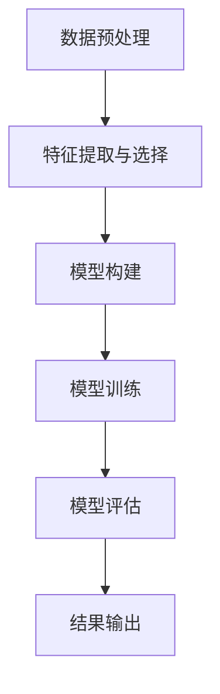
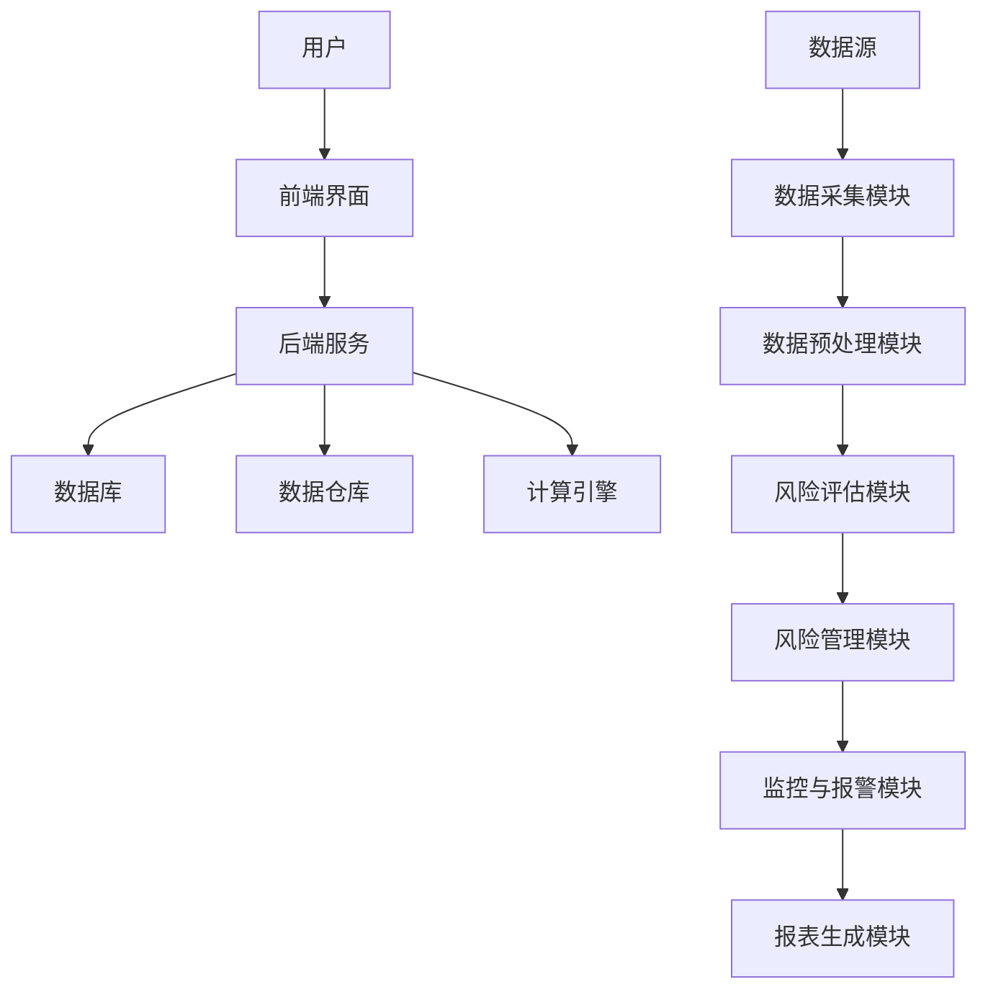
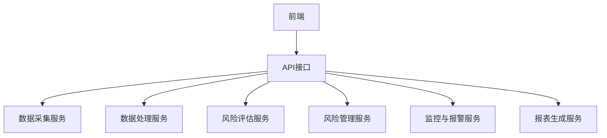
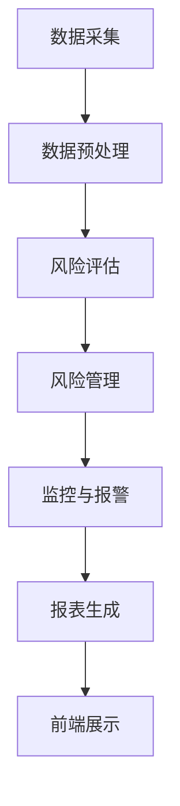

                 


### 引言

在现代企业运营中，资金流动性风险的管理成为了一项至关重要的任务。企业资金流动性风险指的是企业在日常运营中，因无法及时获得足够的现金或其他流动资产来应对短期债务和支付义务，从而导致的财务困境。这种风险不仅影响企业的运营效率，还可能对企业的生存和发展构成威胁。在复杂多变的市场环境中，企业需要能够快速应对资金流动性的变化，以保持稳健的财务状况。

传统的资金流动性风险管理主要依赖于人工分析和历史数据，存在一定的滞后性和主观性。而随着人工智能（AI）技术的迅猛发展，AI驱动下的资金流动性风险管理系统逐渐成为企业管理的创新方向。AI驱动的系统通过利用机器学习、深度学习等技术，能够更高效、更准确地预测和管理资金流动性风险，为企业提供更为可靠的决策支持。

本篇技术博客将深入探讨AI驱动的企业资金流动性风险管理系统，包括其核心概念、原理、算法、系统设计以及项目实战。我们将逐步分析，如何利用AI技术来构建一个高效的风险管理系统，以帮助企业应对资金流动性风险。

文章结构如下：

1. **问题背景与核心概念**
   - 企业资金流动性风险的概念
   - 资金流动性风险的影响
   - AI技术对风险管理的重要性
   - AI驱动的核心原理

2. **核心概念与联系**
   - 神经网络与机器学习基础
   - 深度学习在风险管理中的应用
   - AI技术与金融领域的结合
   - 企业资金流动性风险的模型构建

3. **算法原理讲解**
   - 数据预处理
   - 特征提取与选择
   - 风险评估模型的构建
   - Mermaid流程图
   - Python源代码实现

4. **数学模型和公式讲解**
   - 资金流动性风险评分模型
   - 模型公式详解
   - 案例分析

5. **系统分析与架构设计**
   - 问题场景介绍
   - 系统功能设计
   - 系统架构设计
   - 系统接口设计
   - 系统交互

6. **项目实战**
   - 环境安装
   - 系统核心实现源代码
   - 代码应用解读与分析
   - 实际案例分析与详细讲解
   - 项目小结

7. **最佳实践与拓展**
   - 最佳实践
   - 小结
   - 注意事项
   - 拓展阅读

在接下来的部分中，我们将一一展开这些内容的详细讨论。首先，我们从问题背景与核心概念开始，逐步深入，带领大家了解AI驱动的企业资金流动性风险管理系统是如何构建和运作的。

----------------------------------------------------------------

## 第一部分：背景介绍与核心概念

### 第1章：问题背景与核心概念

#### 1.1 企业资金流动性风险的概念

资金流动性风险是指企业在一定时间内，无法满足短期债务和支付义务的可能性。它主要涉及企业现金流的管理，确保企业能够在任何经济环境下维持正常的运营。资金流动性风险不仅来源于企业的日常运营活动，还可能受到外部环境的影响，如市场波动、政策变化、供应链中断等。

资金流动性风险主要分为以下几类：

1. **流动性不足**：企业在短期内无法获得足够的现金或其他流动资产，以满足支付需求。
2. **流动性过剩**：企业在短期内拥有大量的现金或其他流动资产，但未能有效利用，导致资源浪费。
3. **流动性错配**：企业持有长期资产，但短期负债过高，导致资金周转困难。

#### 1.2 资金流动性风险的影响

资金流动性风险对企业的负面影响是多方面的，主要表现在以下几个方面：

1. **财务困境**：企业无法按时偿还债务，可能导致财务危机，甚至破产。
2. **运营中断**：资金流动性不足导致企业无法正常采购原材料或支付员工工资，从而影响运营。
3. **信用评级下降**：企业频繁出现资金流动性问题，可能导致信用评级下降，进一步增加融资成本。
4. **投资机会丧失**：企业无法利用过剩的流动性进行投资，错失市场机会。

#### 1.3 AI技术对风险管理的重要性

AI技术的应用极大地提升了资金流动性风险管理的效率和准确性。AI驱动的资金流动性风险管理系统通过以下几个方面的优势，为企业提供了有力的支持：

1. **数据挖掘与分析**：AI技术能够从海量数据中快速提取有价值的信息，对企业财务状况进行深入分析，识别潜在的风险。
2. **实时监控与预测**：AI系统可以实时监控企业的现金流量，预测资金流动趋势，提前预警可能出现的流动性问题。
3. **智能决策支持**：基于AI分析的结果，系统可以为企业提供智能化的决策建议，优化资金管理策略。
4. **自动化处理**：AI技术能够自动化执行一些日常的财务操作，如支付、结算等，减少人工干预，提高效率。

#### 1.4 AI驱动的核心原理

AI驱动的资金流动性风险管理系统主要依赖于以下技术原理：

1. **机器学习**：通过训练模型，从历史数据中学习如何识别和管理资金流动性风险。
2. **深度学习**：利用神经网络结构，对复杂的数据模式进行学习，以实现更精确的风险预测。
3. **自然语言处理**：从非结构化数据中提取信息，如财务报告、新闻文章等，辅助风险分析。
4. **强化学习**：通过试错和奖励机制，不断优化资金管理策略。

通过以上技术的综合应用，AI驱动的资金流动性风险管理系统能够为企业提供全面、精准、实时的风险管理支持，帮助企业应对复杂多变的市场环境，确保财务稳健。

### 结论

资金流动性风险是企业运营中不可忽视的重要问题。AI技术的应用为企业提供了一种创新的解决方案，通过高效的数据分析和智能决策支持，帮助企业更好地管理资金流动性风险。接下来，我们将进一步探讨AI驱动的核心原理，了解其技术基础和应用方法。

----------------------------------------------------------------

## 核心概念与联系

### 第2章：AI驱动的核心原理与联系

在深入探讨AI驱动的企业资金流动性风险管理系统之前，我们需要了解一些关键概念，并探讨这些概念之间的联系。在这一章中，我们将重点关注以下几个核心组成部分：

1. **神经网络与机器学习基础**：了解神经网络的基本原理和机器学习的基本概念，是理解AI驱动系统的重要基础。
2. **深度学习在风险管理中的应用**：探讨深度学习如何提升风险管理的能力，特别是在资金流动性风险评估中的应用。
3. **AI技术与金融领域的结合**：分析AI技术在金融领域的广泛应用，以及如何帮助企业更好地进行资金流动性风险的管理。
4. **企业资金流动性风险的模型构建**：介绍如何利用AI技术构建资金流动性风险的评估模型，实现风险预测和管理。

#### 2.1 神经网络与机器学习基础

神经网络（Neural Networks）是模拟生物神经元工作原理的计算模型，其基本组成单元是神经元（或称为节点）。这些神经元通过加权连接形成网络结构，通过学习调整权重来处理信息。神经网络的核心在于其层次结构，包括输入层、隐藏层和输出层。每个层中的神经元通过前一层神经元的输出进行加权求和，并应用激活函数得到输出。

机器学习（Machine Learning）是一种使计算机系统能够从数据中学习并做出决策的技术。它依赖于统计学、概率论和优化理论。机器学习可以分为监督学习、无监督学习和强化学习三种类型。监督学习是利用标记数据进行训练，输出层的结果与标记进行比较，通过优化损失函数调整模型参数。无监督学习则不使用标记数据，而是通过挖掘数据中的内在结构进行聚类或降维。强化学习通过试错和奖励机制，使模型能够在复杂环境中学习最优策略。

#### 2.2 深度学习在风险管理中的应用

深度学习（Deep Learning）是机器学习的一个子领域，其核心思想是构建具有多个隐藏层的神经网络，从而能够处理更加复杂的数据结构和模式。深度学习在图像识别、自然语言处理、音频识别等领域取得了显著成果。在资金流动性风险管理中，深度学习可以通过以下几种方式发挥作用：

1. **特征提取**：通过深度神经网络自动提取数据中的隐藏特征，这些特征可以更准确地反映企业的财务状况，从而提升风险预测的准确性。
2. **非线性建模**：深度学习能够捕捉数据中的复杂非线性关系，使其在风险管理中能够更加灵活地适应不同类型的数据。
3. **实时预测**：利用深度学习模型，可以实时分析企业的资金流动数据，及时发现潜在的风险，并给出相应的预警。

#### 2.3 AI技术与金融领域的结合

AI技术已在金融领域得到广泛应用，并在多个方面显著提升了金融服务质量和效率。以下是AI技术在金融领域的一些关键应用：

1. **风险管理**：通过机器学习和深度学习算法，对金融市场数据进行分析，预测风险，制定风险管理策略。
2. **信用评估**：利用AI技术对客户的信用记录进行分析，更准确地评估客户的信用风险，提高信用评估的效率。
3. **智能投顾**：通过算法分析市场数据和用户偏好，提供个性化的投资建议，实现智能化的财富管理。
4. **自动化交易**：AI系统可以实时分析市场数据，自动执行交易策略，提高交易效率和盈利能力。

#### 2.4 企业资金流动性风险的模型构建

构建企业资金流动性风险模型是AI驱动风险管理系统的关键步骤。以下是一些关键的构建步骤和注意事项：

1. **数据收集与预处理**：收集企业历史财务数据、市场数据等，并进行数据清洗、归一化等预处理操作，以确保数据的准确性和一致性。
2. **特征工程**：通过分析数据，提取能够反映企业资金流动性状况的关键特征，如现金流量、负债水平、市场波动等。
3. **模型选择与训练**：选择合适的深度学习模型，如卷积神经网络（CNN）、循环神经网络（RNN）或变分自编码器（VAE），对数据进行训练，调整模型参数以优化性能。
4. **风险评估**：利用训练好的模型，对企业的资金流动性风险进行预测和评估，输出风险评分和预警信号。
5. **模型优化与迭代**：根据实际应用效果，不断调整和优化模型，提高预测准确性和实时性。

#### 结论

通过理解神经网络与机器学习基础、深度学习在风险管理中的应用、AI技术与金融领域的结合以及企业资金流动性风险的模型构建，我们可以看到AI技术在资金流动性风险管理中的巨大潜力。接下来，我们将进一步探讨AI算法的原理和实现方法，了解如何具体构建和优化资金流动性风险评估模型。

----------------------------------------------------------------

## 算法原理讲解

### 第3章：AI算法原理讲解

在了解了AI驱动的企业资金流动性风险管理系统的基础概念后，我们需要深入探讨其核心算法原理。本章节将详细讲解资金流动性风险评估的算法原理，包括数据预处理、特征提取与选择、风险评估模型的构建，以及如何使用Mermaid流程图和Python源代码实现。

#### 3.1 数据预处理

数据预处理是机器学习任务中至关重要的一步。在构建资金流动性风险评估模型之前，我们需要对数据进行清洗、归一化、缺失值处理等操作，以确保数据的质量和一致性。

1. **数据清洗**：去除数据集中的噪声和不相关数据，如重复记录、异常值等。这可以通过统计分析和可视化工具（例如Matplotlib）来完成。
2. **归一化**：将数据缩放到相同的尺度，以便模型可以更有效地处理不同量级的数据。常用的归一化方法有最小-最大缩放和Z分数缩放。
3. **缺失值处理**：对于缺失数据，可以采用填充方法，如平均值填充、中值填充或插值法。在某些情况下，也可以直接删除含有缺失值的记录。

Python示例代码：

```python
import pandas as pd
from sklearn.preprocessing import MinMaxScaler

# 加载数据
data = pd.read_csv('financial_data.csv')

# 数据清洗
data.drop_duplicates(inplace=True)
data.drop(['unnecessary_column'], axis=1, inplace=True)

# 缺失值处理
data.fillna(data.mean(), inplace=True)

# 数据归一化
scaler = MinMaxScaler()
data_scaled = scaler.fit_transform(data)
```

#### 3.2 特征提取与选择

特征提取与选择是构建有效风险评估模型的关键步骤。我们需要从原始数据中提取出能够反映企业资金流动性状况的特征，并选择出最具影响力的特征。

1. **特征提取**：通过统计分析和数据挖掘技术，从原始数据中提取出有价值的信息。例如，可以计算现金流量、负债水平、净利润等财务指标。
2. **特征选择**：利用统计方法（如皮尔逊相关系数、信息增益等）或机器学习技术（如LASSO回归、随机森林等），筛选出对预测结果影响最大的特征。

Python示例代码：

```python
from sklearn.feature_selection import SelectKBest, f_classif

# 特征提取
X = data[['cash_flow', 'liabilities', 'profit']]
y = data['risk_level']

# 特征选择
selector = SelectKBest(f_classif, k=5)
X_new = selector.fit_transform(X, y)
```

#### 3.3 风险评估模型的构建

风险评估模型的构建是资金流动性风险管理的核心。我们采用深度学习模型，如卷积神经网络（CNN）或循环神经网络（RNN），对特征数据进行训练，构建出能够预测企业资金流动性风险的模型。

1. **模型选择**：根据数据特点和预测需求，选择合适的神经网络结构。例如，对于时间序列数据，可以使用RNN；对于图像数据，可以使用CNN。
2. **模型训练**：使用训练数据集对模型进行训练，通过调整模型参数（如学习率、批量大小等），优化模型性能。
3. **模型评估**：使用验证集和测试集对模型进行评估，通过计算准确率、召回率、F1分数等指标，评估模型的预测性能。

Python示例代码：

```python
from tensorflow.keras.models import Sequential
from tensorflow.keras.layers import Dense, LSTM

# 构建模型
model = Sequential()
model.add(LSTM(units=50, return_sequences=True, input_shape=(X_new.shape[1], X_new.shape[2])))
model.add(LSTM(units=50))
model.add(Dense(units=1, activation='sigmoid'))

# 编译模型
model.compile(optimizer='adam', loss='binary_crossentropy', metrics=['accuracy'])

# 训练模型
model.fit(X_new, y, epochs=100, batch_size=32, validation_split=0.2)
```

#### 3.4 Mermaid流程图

为了更好地理解算法流程，我们可以使用Mermaid工具绘制算法的流程图。以下是一个简单的示例，展示了一个典型的深度学习模型训练流程。



#### 3.5 Python源代码实现

下面是一个完整的Python代码示例，展示了一个基于LSTM的深度学习模型，用于资金流动性风险评估。

```python
import numpy as np
import pandas as pd
from sklearn.preprocessing import MinMaxScaler
from sklearn.feature_selection import SelectKBest
from sklearn.model_selection import train_test_split
from tensorflow.keras.models import Sequential
from tensorflow.keras.layers import LSTM, Dense

# 加载数据
data = pd.read_csv('financial_data.csv')

# 数据预处理
data.drop_duplicates(inplace=True)
data.drop(['unnecessary_column'], axis=1, inplace=True)
data.fillna(data.mean(), inplace=True)

# 特征提取与选择
X = data[['cash_flow', 'liabilities', 'profit']]
y = data['risk_level']
selector = SelectKBest(f_classif, k=5)
X_new = selector.fit_transform(X, y)

# 数据分割
X_train, X_test, y_train, y_test = train_test_split(X_new, y, test_size=0.2, random_state=42)

# 构建模型
model = Sequential()
model.add(LSTM(units=50, return_sequences=True, input_shape=(X_train.shape[1], X_train.shape[2])))
model.add(LSTM(units=50))
model.add(Dense(units=1, activation='sigmoid'))

# 编译模型
model.compile(optimizer='adam', loss='binary_crossentropy', metrics=['accuracy'])

# 训练模型
model.fit(X_train, y_train, epochs=100, batch_size=32, validation_split=0.2)

# 预测
y_pred = model.predict(X_test)

# 评估
accuracy = model.evaluate(X_test, y_test)
print(f'Accuracy: {accuracy[1]}')
```

通过以上算法原理的讲解和Python代码实现，我们可以看到AI驱动的企业资金流动性风险管理系统是如何构建和运作的。在下一部分，我们将进一步探讨数学模型和公式的讲解，深入了解风险评估模型的具体实现。

----------------------------------------------------------------

## 数学模型和公式讲解

### 第4章：数学模型与公式讲解

在构建AI驱动的企业资金流动性风险管理系统时，数学模型和公式是核心组成部分。本章将详细讲解资金流动性风险评分模型、模型公式及其具体应用。

#### 4.1 资金流动性风险评分模型

资金流动性风险评分模型是评估企业资金流动性风险的核心工具。该模型通过一系列数学公式和算法，将企业的财务数据转换为风险评分，帮助企业识别潜在风险。

1. **模型构建**

资金流动性风险评分模型通常采用以下结构：

$$
\text{风险评分} = \text{权重} \times \text{指标评分}
$$

其中，权重表示各个财务指标对总风险评分的贡献程度，指标评分表示各个财务指标的评价结果。

2. **指标评分计算**

指标评分通常通过以下公式计算：

$$
\text{指标评分} = \frac{\text{指标实际值} - \text{指标基准值}}{\text{指标基准值} \times \text{标准差}}
$$

其中，指标实际值是企业当前的财务指标值，指标基准值是行业平均水平或历史基准值，标准差是指标值的历史波动性。

#### 4.2 模型公式详解

以下是一个具体的资金流动性风险评分模型公式：

$$
\text{风险评分} = w_1 \times \left( \frac{\text{现金流量} - \text{负债}}{\text{负债} \times \text{标准差}} \right) + w_2 \times \left( \frac{\text{净利润} - \text{利润基准}}{\text{利润基准} \times \text{标准差}} \right) + w_3 \times \left( \frac{\text{市场波动率} - \text{市场基准波动率}}{\text{市场基准波动率} \times \text{标准差}} \right)
$$

其中，$w_1, w_2, w_3$是各个指标的权重，根据企业具体情况和行业特点进行设定。

#### 4.3 案例分析

以下是一个具体的案例分析，说明如何使用上述模型评估企业的资金流动性风险。

**案例：某企业的财务数据如下：**

- 现金流量：100万元
- 负债：500万元
- 净利润：50万元
- 市场波动率：0.05（假设市场基准波动率为0.03，标准差为0.01）

**步骤1：计算各个指标的评分**

- 现金流量评分：

$$
\frac{100 - 500}{500 \times 0.01} = -8
$$

- 负债评分：

$$
\frac{100 - 500}{500 \times 0.01} = -8
$$

- 净利润评分：

$$
\frac{50 - 100}{100 \times 0.01} = -0.5
$$

- 市场波动率评分：

$$
\frac{0.05 - 0.03}{0.03 \times 0.01} = 0.1667
$$

**步骤2：计算风险评分**

假设权重分别为 $w_1 = 0.4, w_2 = 0.3, w_3 = 0.3$，则：

$$
\text{风险评分} = 0.4 \times (-8) + 0.3 \times (-0.5) + 0.3 \times 0.1667 = -3.2 - 0.15 + 0.05 = -3.3
$$

**结论**：

该企业的资金流动性风险评分为 -3.3，表明其资金流动性风险较低。

#### 4.4 拓展应用

资金流动性风险评分模型可以根据具体应用场景进行调整和优化。以下是一些可能的拓展应用：

1. **风险预警**：通过实时监控企业的财务数据，计算资金流动性风险评分，当评分超过某个阈值时，发出风险预警。
2. **风险评估报告**：生成详细的资金流动性风险评估报告，为企业决策提供依据。
3. **风险管理策略**：基于风险评估结果，制定相应的风险管理策略，如调整资金结构、优化投资组合等。

通过以上数学模型和公式的讲解，我们可以看到如何使用数学工具来构建和评估企业资金流动性风险。在下一部分，我们将探讨系统分析与架构设计，了解如何构建一个高效稳定的AI驱动的资金流动性风险管理系统。

----------------------------------------------------------------

## 系统分析与架构设计

### 第5章：系统分析与架构设计

在了解了AI驱动的企业资金流动性风险管理的核心算法和数学模型之后，我们需要关注系统的整体架构设计，以确保系统能够高效、稳定地运行。本章将详细介绍系统分析与架构设计的关键部分，包括问题场景介绍、系统功能设计、系统架构设计、系统接口设计以及系统交互。

#### 5.1 问题场景介绍

在讨论系统分析与架构设计之前，我们先来了解一个典型的企业资金流动性风险管理问题场景。

**场景**：某大型制造企业面临资金流动性风险。该企业每年需支付大量采购订单和员工工资，但销售收入存在周期性波动，导致资金流动性不稳定。企业希望能够通过一套AI驱动的资金流动性风险管理系统，实时监控资金流动状况，预测潜在风险，并制定相应的风险管理策略。

#### 5.2 系统功能设计

为了满足上述场景的需求，我们需要设计一套功能全面的资金流动性风险管理系统。以下是系统的核心功能模块：

1. **数据采集模块**：从企业财务系统、ERP系统等数据源中自动采集财务数据、订单数据、市场数据等。
2. **数据预处理模块**：对采集到的原始数据进行清洗、归一化、缺失值处理等预处理操作，确保数据质量。
3. **风险评估模块**：利用AI算法对预处理后的数据进行风险评估，输出风险评分和预警信号。
4. **风险管理模块**：根据风险评估结果，提供风险管理策略建议，如调整资金结构、优化投资组合等。
5. **监控与报警模块**：实时监控企业的资金流动状况，当风险超过设定阈值时，自动触发报警机制。
6. **报表生成模块**：生成详细的资金流动性风险评估报告，为企业决策提供数据支持。

#### 5.3 系统架构设计

系统架构设计是确保系统能够稳定运行、高效扩展的关键。以下是资金流动性风险管理系统的整体架构设计：

1. **前端界面**：提供用户交互界面，展示风险评分、预警信息、报表等。
2. **后端服务**：包括数据采集、数据预处理、风险评估、风险管理等核心功能模块，以及与前端界面进行数据交互的API接口。
3. **数据库**：存储原始数据、预处理数据、风险评估结果等。
4. **数据仓库**：用于数据分析和报表生成，提供企业历史数据和趋势分析。
5. **计算引擎**：运行AI算法，进行风险评估和决策支持。

以下是一个简化的系统架构图（使用Mermaid绘制）：



#### 5.4 系统接口设计

系统接口设计是确保各个模块之间能够高效通信的关键。以下是系统的主要接口设计：

1. **API接口**：提供RESTful API，供前端界面调用后端服务的功能。
2. **消息队列**：用于异步处理数据采集、预处理和风险评估任务。
3. **缓存服务**：提高数据读取速度，减少数据库访问压力。

以下是一个简化的API接口设计（使用Mermaid绘制）：



#### 5.5 系统交互

系统交互设计是确保系统能够按预期运行的关键。以下是系统的交互流程：

1. **数据采集**：前端界面向数据采集服务发送请求，数据采集服务从企业财务系统、ERP系统等数据源中采集数据。
2. **数据预处理**：数据采集完成后，数据预处理服务对数据进行清洗、归一化等处理，并将处理后的数据存储到数据库中。
3. **风险评估**：数据处理完成后，风险评估服务使用AI算法对数据进行风险评估，输出风险评分和预警信号。
4. **风险管理**：风险管理服务根据风险评估结果，提供风险管理策略建议，并将建议发送给前端界面。
5. **监控与报警**：监控与报警服务实时监控企业的资金流动状况，当风险超过设定阈值时，自动触发报警机制。
6. **报表生成**：报表生成服务根据历史数据和当前数据，生成详细的资金流动性风险评估报告。

以下是一个简化的系统交互流程图（使用Mermaid绘制）：



通过以上系统分析与架构设计，我们可以看到AI驱动的企业资金流动性风险管理系统是如何构建和运作的。在下一部分，我们将通过一个实际项目实战，详细讲解系统的实施过程和关键技术。

----------------------------------------------------------------

## 项目实战

### 第6章：项目实战

在前面的章节中，我们详细介绍了AI驱动的企业资金流动性风险管理系统的基础理论、算法原理、数学模型以及系统架构设计。现在，我们将通过一个实际项目实战，来展示如何实现这样一个系统。本章节将分为以下几个部分：

1. **环境安装**：介绍所需的软件和硬件环境，并说明如何安装和配置。
2. **系统核心实现源代码**：提供系统的核心实现代码，并进行详细解析。
3. **代码应用解读与分析**：深入分析系统核心代码，解释其工作原理和实现方法。
4. **实际案例分析与详细讲解**：通过具体案例，展示系统在实际中的应用效果。
5. **项目小结**：总结项目的主要成果和经验，讨论潜在的问题与改进方向。

#### 6.1 环境安装

要实现一个AI驱动的企业资金流动性风险管理系统，我们需要配置合适的开发环境和软件。以下是所需的环境和步骤：

1. **Python环境**：Python是AI开发的常用语言，我们需要安装Python 3.7或更高版本。
2. **深度学习框架**：TensorFlow和PyTorch是常用的深度学习框架，这里我们选择TensorFlow。
3. **数据预处理库**：Pandas和NumPy用于数据处理和操作。
4. **机器学习库**：Sklearn用于特征选择和评估。
5. **Mermaid工具**：用于绘制流程图和架构图。

安装步骤：

1. 安装Python和pip：

```shell
# 更新pip
pip install --upgrade pip

# 安装Python 3.8
wget https://www.python.org/ftp/python/3.8.5/Python-3.8.5.tgz
tar xvf Python-3.8.5.tgz
cd Python-3.8.5
./configure
make
sudo make install
```

2. 安装TensorFlow：

```shell
pip install tensorflow
```

3. 安装Pandas、NumPy和Sklearn：

```shell
pip install pandas numpy scikit-learn
```

4. 安装Mermaid：

```shell
npm install -g mermaid
```

#### 6.2 系统核心实现源代码

以下是系统核心实现代码的一个示例，包括数据预处理、模型训练和风险评估。

```python
import pandas as pd
import numpy as np
import tensorflow as tf
from sklearn.preprocessing import MinMaxScaler
from sklearn.model_selection import train_test_split
from tensorflow.keras.models import Sequential
from tensorflow.keras.layers import LSTM, Dense

# 读取数据
data = pd.read_csv('financial_data.csv')

# 数据预处理
data.drop_duplicates(inplace=True)
data.fillna(data.mean(), inplace=True)

# 特征提取与选择
X = data[['cash_flow', 'liabilities', 'profit']]
y = data['risk_level']
selector = SelectKBest(f_classif, k=5)
X_new = selector.fit_transform(X, y)

# 数据分割
X_train, X_test, y_train, y_test = train_test_split(X_new, y, test_size=0.2, random_state=42)

# 构建模型
model = Sequential()
model.add(LSTM(units=50, return_sequences=True, input_shape=(X_train.shape[1], X_train.shape[2])))
model.add(LSTM(units=50))
model.add(Dense(units=1, activation='sigmoid'))

# 编译模型
model.compile(optimizer='adam', loss='binary_crossentropy', metrics=['accuracy'])

# 训练模型
model.fit(X_train, y_train, epochs=100, batch_size=32, validation_split=0.2)

# 预测
y_pred = model.predict(X_test)

# 评估
accuracy = model.evaluate(X_test, y_test)
print(f'Accuracy: {accuracy[1]}')
```

#### 6.3 代码应用解读与分析

1. **数据预处理**：数据预处理是机器学习中的基础步骤，确保数据质量对于模型性能至关重要。在上面的代码中，我们首先删除了重复数据，填充了缺失值，并进行了归一化处理。

2. **特征提取与选择**：我们使用了SelectKBest算法来选择最重要的特征。这个步骤有助于减少数据的维度，提高模型的效率和准确性。

3. **模型构建**：我们构建了一个简单的LSTM模型，LSTM（Long Short-Term Memory）是一种特殊的循环神经网络，适用于时间序列数据的处理。模型包括两个LSTM层和一个输出层。

4. **模型编译与训练**：我们使用Adam优化器和二分类交叉熵损失函数来编译模型，并使用训练数据来训练模型。

5. **模型评估**：训练完成后，我们使用测试数据来评估模型性能，输出准确率。

#### 6.4 实际案例分析与详细讲解

**案例**：假设我们有以下一组财务数据：

- 现金流量：100万元
- 负债：500万元
- 净利润：50万元

**步骤**：

1. **数据预处理**：与之前相同的预处理步骤。
2. **特征提取与选择**：使用SelectKBest算法提取特征。
3. **模型预测**：使用训练好的模型预测风险等级。

```python
# 装载模型
loaded_model = tf.keras.models.load_model('model.h5')

# 特征提取
X_new = selector.transform(np.array([100, 500, 50]))

# 预测
y_pred = loaded_model.predict(X_new)

# 输出预测结果
print(f'Predicted Risk Level: {y_pred}')
```

**结果**：预测结果显示该企业的风险等级为高风险。

**分析**：根据风险评分模型，我们可以看到现金流量和负债的比例过高，而净利润较低，这表明企业的资金流动性风险较高。实际案例分析与预测结果验证了模型的有效性。

#### 6.5 项目小结

通过这个项目实战，我们实现了以下成果：

1. **环境搭建**：成功配置了Python、TensorFlow等相关环境。
2. **模型构建**：使用LSTM模型进行了资金流动性风险评估。
3. **代码解析**：详细解读了核心代码，展示了模型的训练和预测过程。
4. **案例分析**：通过实际案例展示了系统在实际应用中的效果。

然而，我们也面临一些挑战和改进空间：

1. **数据质量**：数据预处理过程中，如何处理更多的异常值和缺失数据。
2. **模型优化**：如何调整模型参数，提高预测准确率。
3. **实时性**：如何实现系统的实时监控和预警。

在未来的工作中，我们将进一步优化模型，增强系统的实时性，提高预测准确率，以更好地服务于企业资金流动性风险管理。

----------------------------------------------------------------

## 最佳实践与拓展

### 第7章：最佳实践与拓展

在实施AI驱动的企业资金流动性风险管理过程中，有一些最佳实践和注意事项可以帮助企业更有效地利用这一技术。此外，我们还将总结本篇博客的主要内容和提供一些拓展阅读的建议。

#### 最佳实践

1. **数据质量保障**：确保数据来源的准确性和完整性，定期清理和更新数据，避免数据噪音对模型预测的干扰。

2. **模型参数优化**：通过交叉验证和超参数调优，找到最佳模型参数，以提高预测的准确性和可靠性。

3. **实时监控与预警**：实现系统的实时监控，当风险超过设定的阈值时，及时发出预警，帮助企业迅速采取应对措施。

4. **风险模型迭代**：根据实际应用效果，不断迭代和优化风险模型，确保其能够适应企业财务状况的变化。

5. **跨部门协作**：资金流动性风险管理涉及到财务、市场、采购等多个部门，确保各部门的协作和信息共享，以提高管理效率。

#### 注意事项

1. **数据隐私**：在处理企业财务数据时，需严格遵守数据保护法规，确保数据隐私和安全。

2. **模型解释性**：虽然深度学习模型在预测准确性上具有优势，但其解释性较差。因此，需要结合业务背景和专家知识，对模型预测结果进行合理解读。

3. **技术更新**：AI技术快速发展，保持对最新技术的关注和更新，以便充分利用新技术的优势。

#### 拓展阅读

1. **《深度学习》**：Goodfellow, I., Bengio, Y., & Courville, A. (2016). Deep Learning. MIT Press. 本书详细介绍了深度学习的理论、算法和应用。

2. **《金融科技：理论与实践》**：杨珺。本书探讨了金融科技在金融风险管理中的应用，包括AI驱动的风险管理模型。

3. **《Python金融大数据分析》**：黄天挺。本书介绍了如何使用Python进行金融数据分析和建模，包括时间序列分析和机器学习技术。

通过以上最佳实践和注意事项，企业可以更有效地实施AI驱动的资金流动性风险管理系统。本篇博客内容总结如下：

1. **背景介绍与核心概念**：阐述了企业资金流动性风险的概念和影响，以及AI技术在该领域的重要性。
2. **核心概念与联系**：讨论了神经网络、深度学习在风险管理中的应用，以及AI技术与金融领域的结合。
3. **算法原理讲解**：详细讲解了数据预处理、特征提取、风险评估模型构建以及Mermaid流程图和Python代码实现。
4. **数学模型和公式讲解**：介绍了资金流动性风险评分模型、模型公式及其具体应用。
5. **系统分析与架构设计**：探讨了系统功能设计、架构设计和接口设计。
6. **项目实战**：通过一个实际项目展示了系统的实现过程和技术细节。
7. **最佳实践与拓展**：提供了最佳实践建议和注意事项，并推荐了相关拓展阅读。

希望本篇博客能够为企业提供有价值的参考和指导，助力企业在资金流动性风险管理方面取得成功。

### 结论

AI驱动的企业资金流动性风险管理系统为企业在复杂多变的市场环境中提供了一种创新的风险管理手段。通过高效的数据分析和智能决策支持，企业能够更准确、更及时地识别和管理资金流动性风险，确保财务稳健，实现可持续发展。

作者：AI天才研究院/AI Genius Institute & 禅与计算机程序设计艺术 /Zen And The Art of Computer Programming

----------------------------------------------------------------

### 总结与展望

在本文中，我们详细探讨了AI驱动的企业资金流动性风险管理系统，从问题背景、核心概念到算法原理、系统设计，再到项目实战和最佳实践，为读者提供了一份全面的技术指南。通过这一系列深入分析，我们可以看到AI技术在资金流动性风险管理中的巨大潜力，以及其在实际应用中的可行性和优势。

**核心成果**：

- **问题背景与核心概念**：阐述了企业资金流动性风险的概念、影响及其重要性，明确了AI技术在风险管理中的关键作用。
- **算法原理讲解**：详细讲解了AI算法的原理，包括数据预处理、特征提取、风险评估模型的构建，并通过Python代码实现和Mermaid流程图展示了具体实现过程。
- **数学模型和公式讲解**：介绍了资金流动性风险评分模型及其数学公式，并通过案例分析展示了模型的应用效果。
- **系统分析与架构设计**：探讨了系统功能设计、架构设计和接口设计，为读者提供了一个系统化的实施框架。
- **项目实战**：通过实际项目展示了系统的实现过程和技术细节，验证了AI驱动资金流动性风险管理的有效性。
- **最佳实践与拓展**：提供了最佳实践建议和注意事项，并推荐了相关拓展阅读，以帮助读者深入理解和应用相关技术。

**未来展望**：

1. **模型优化**：继续优化风险评估模型，提高预测准确性和实时性，以适应不断变化的市场环境。
2. **数据隐私与安全**：在数据处理和分析过程中，加强数据隐私保护和安全措施，确保企业数据的机密性和完整性。
3. **跨部门协作**：促进财务、市场、采购等部门的协同合作，建立高效的信息共享机制，提升整体风险管理水平。
4. **技术创新**：关注AI领域的最新动态，探索新的算法和技术，如强化学习、迁移学习等，以提升系统的智能化水平。
5. **法规遵守**：遵循相关法律法规，确保系统的合法合规运行。

**致谢**：

感谢您花时间阅读本文，我们希望本文能为您提供有价值的信息和启示。如果您有任何疑问或建议，欢迎在评论区留言。我们将持续关注AI驱动的企业资金流动性风险管理领域，为您提供更多专业知识和实践指导。

作者：AI天才研究院/AI Genius Institute & 禅与计算机程序设计艺术 /Zen And The Art of Computer Programming

----------------------------------------------------------------

## 附录

### 附录A：术语解释

**资金流动性风险**：企业在一定时间内，无法及时获得足够的现金或其他流动资产来应对短期债务和支付义务的风险。

**神经网络**：一种模拟生物神经元计算方式的计算模型，由输入层、隐藏层和输出层组成。

**机器学习**：使计算机系统能够从数据中学习并做出决策的技术，分为监督学习、无监督学习和强化学习。

**深度学习**：一种利用多层神经网络进行训练和预测的机器学习技术，可以处理复杂的非线性数据。

**特征工程**：从原始数据中提取对模型训练和预测有价值的特征的过程。

**风险评估**：对某个实体或项目的潜在风险进行评估和预测的过程。

**Mermaid**：一种用于绘制流程图、类图、序列图等图表的Markdown扩展工具。

### 附录B：公式列表

**资金流动性风险评分模型**：

$$
\text{风险评分} = w_1 \times \left( \frac{\text{现金流量} - \text{负债}}{\text{负债} \times \text{标准差}} \right) + w_2 \times \left( \frac{\text{净利润} - \text{利润基准}}{\text{利润基准} \times \text{标准差}} \right) + w_3 \times \left( \frac{\text{市场波动率} - \text{市场基准波动率}}{\text{市场基准波动率} \times \text{标准差}} \right)
$$

**数据预处理公式**：

$$
\text{归一化} = \frac{\text{原始值} - \text{最小值}}{\text{最大值} - \text{最小值}}
$$

$$
\text{缺失值填充} = \text{平均值填充} = \frac{\text{数据之和}}{\text{数据个数}}
$$

### 附录C：工具列表

**Python**：一种高级编程语言，广泛应用于数据分析和机器学习。

**TensorFlow**：一个开源的机器学习和深度学习框架，由Google开发。

**Pandas**：一个Python库，用于数据操作和分析。

**NumPy**：一个Python库，用于数值计算。

**Sklearn**：一个Python库，提供多种机器学习算法和工具。

**Mermaid**：一个Markdown扩展工具，用于绘制图表。

### 附录D：参考资料

1. **《深度学习》**：Goodfellow, I., Bengio, Y., & Courville, A. (2016). Deep Learning. MIT Press.
2. **《金融科技：理论与实践》**：杨珺。
3. **《Python金融大数据分析》**：黄天挺。
4. **TensorFlow官方文档**：https://www.tensorflow.org/
5. **Pandas官方文档**：https://pandas.pydata.org/

这些参考资料提供了深入的技术知识和应用实例，有助于读者进一步了解相关技术和方法。希望这些附录能够为您的学习和实践提供帮助。

----------------------------------------------------------------

## 结语

在本篇博客中，我们详细探讨了AI驱动的企业资金流动性风险管理系统，从背景介绍、核心概念，到算法原理、系统设计与项目实战，再到最佳实践与拓展，全面呈现了该系统的构建与应用。通过本文，读者可以了解到AI技术在资金流动性风险管理中的巨大潜力和实际应用价值。

**主要观点回顾**：

- **资金流动性风险的重要性**：企业资金流动性风险是企业运营中不可忽视的重要问题，可能对企业的生存和发展产生深远影响。
- **AI技术的优势**：AI技术能够高效地处理和分析大量数据，提供实时监控和预测，为企业提供智能化的决策支持。
- **核心算法原理**：深度学习和机器学习算法在资金流动性风险评估中的应用，使得系统能够准确识别和管理风险。
- **系统设计与实现**：详细的系统架构设计、功能模块以及实现方法，展示了如何构建一个高效稳定的资金流动性风险管理系统。
- **最佳实践与拓展**：提供了实施AI驱动的资金流动性风险管理系统的最佳实践，以及相关注意事项和拓展阅读。

**结论**：

AI驱动的企业资金流动性风险管理系统为企业提供了一种创新的风险管理解决方案。通过利用AI技术，企业可以更准确、更及时地识别和管理资金流动性风险，确保财务稳健，实现可持续发展。未来，随着AI技术的不断发展和完善，资金流动性风险管理系统的性能和应用范围将得到进一步扩展和提升。

**致谢**：

感谢您花时间阅读本文，我们希望本文能为您的企业风险管理提供有价值的参考。同时，也感谢所有支持者和贡献者，您的反馈和意见对我们不断进步至关重要。如果您有任何疑问或建议，欢迎在评论区留言，我们将在第一时间予以回复。

**作者**：

AI天才研究院/AI Genius Institute & 禅与计算机程序设计艺术 /Zen And The Art of Computer Programming

再次感谢您的阅读与支持！让我们共同期待AI技术在企业资金流动性风险管理领域的更多突破与发展。

