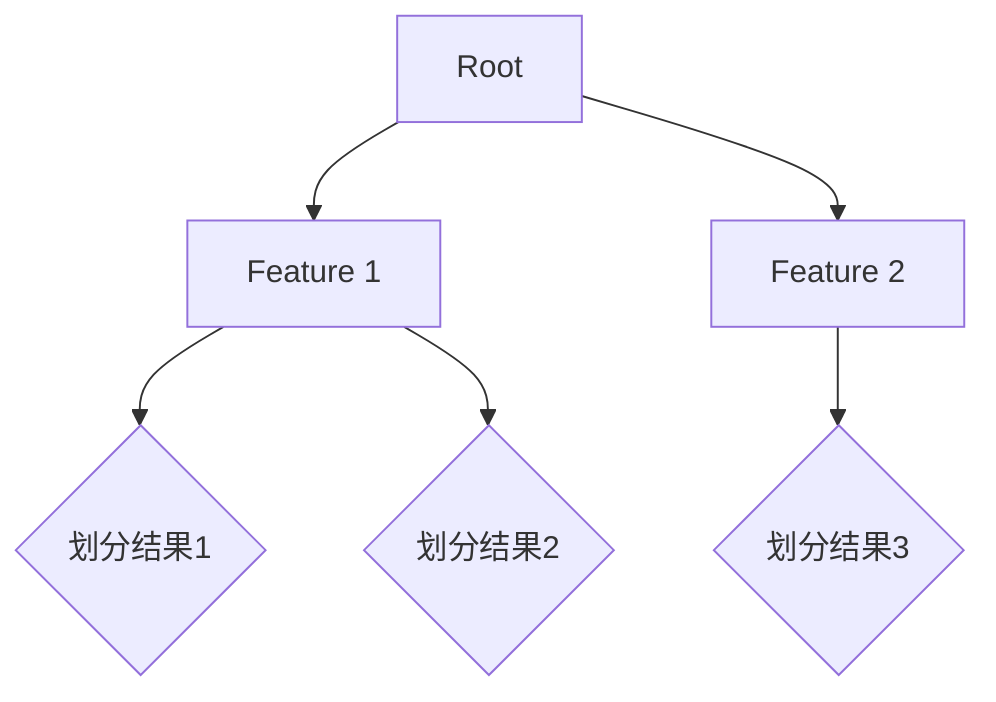
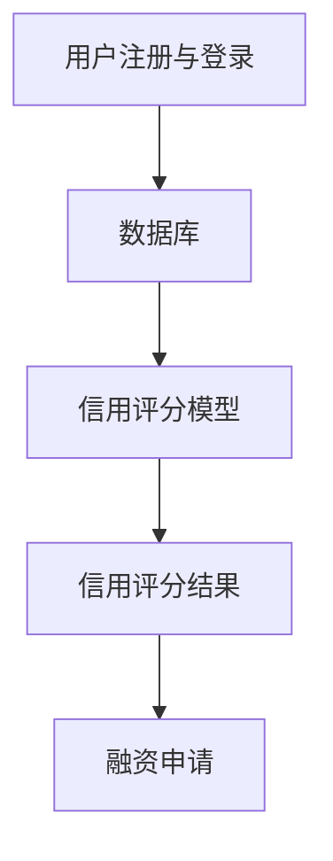
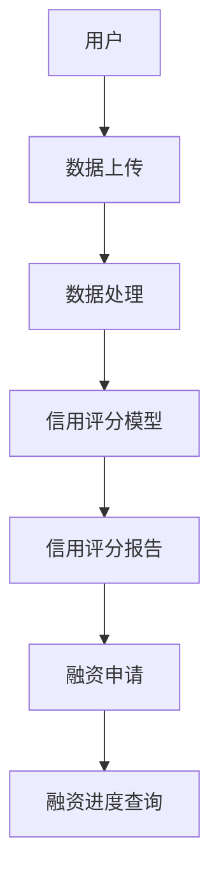
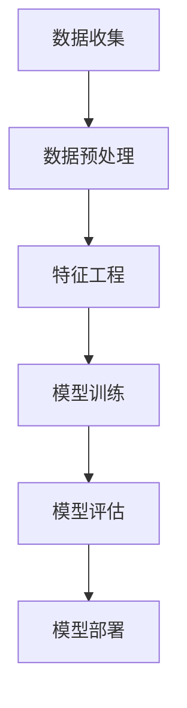
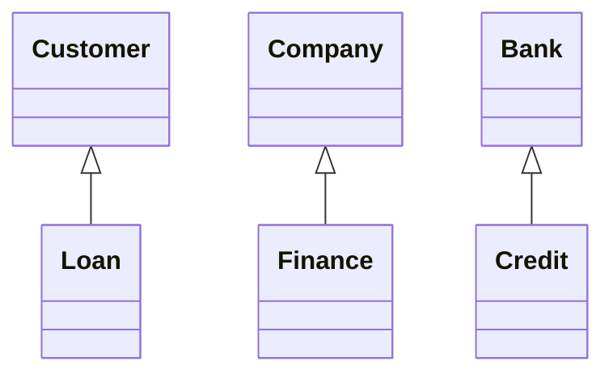
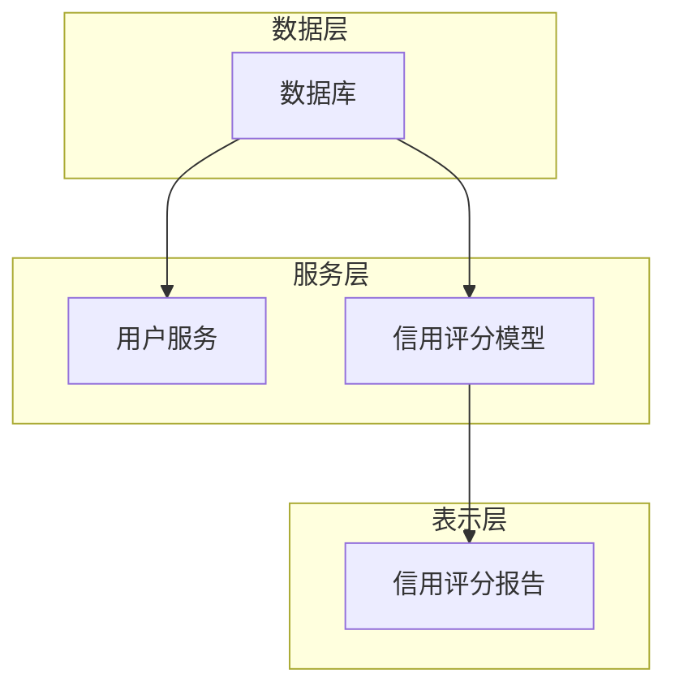
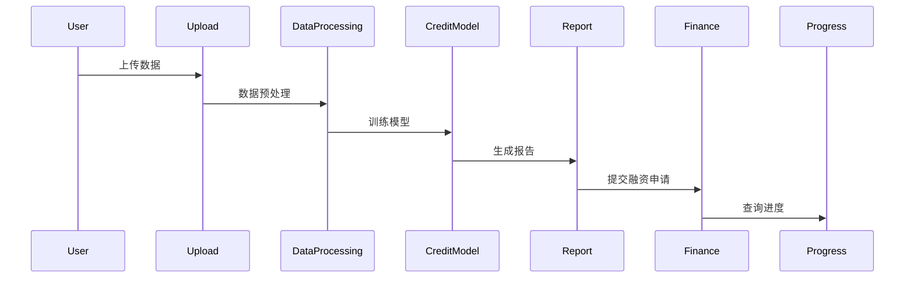

                 


## # AI驱动的供应链金融信用评分模型

### 关键词

- AI
- 供应链金融
- 信用评分模型
- 机器学习
- 数据分析

### 摘要

本文深入探讨了AI在供应链金融信用评分模型中的应用。首先，介绍了当前供应链金融面临的主要挑战和问题，并阐述了AI驱动的信用评分模型的必要性。接着，我们详细讲解了核心概念和原理，包括AI和机器学习的基础知识、常见算法及其在信用评分中的应用。然后，我们分析了不同AI模型的优缺点，并使用具体的数学模型和Python代码详细阐述了算法原理。最后，通过实际项目案例，展示了AI驱动的信用评分模型在供应链金融中的应用效果，并提出了最佳实践和注意事项。

### 目录

- [第1章 引言与背景](#第1章-引言与背景)
  - [1.1 供应链金融背景](#11-供应链金融背景)
  - [1.2 AI在供应链金融中的应用](#12-ai在供应链金融中的应用)
  - [1.3 信用评分模型的重要性](#13-信用评分模型的重要性)
  - [1.4 文章结构概述](#14-文章结构概述)
- [第2章 核心概念与原理](#第2章-核心概念与原理)
  - [2.1 AI和机器学习基础](#21-ai和机器学习基础)
  - [2.2 常见算法及其应用](#22-常见算法及其应用)
  - [2.3 AI模型优缺点对比](#23-ai模型优缺点对比)
- [第3章 信用评分模型构建](#第3章-信用评分模型构建)
  - [3.1 数据收集与预处理](#31-数据收集与预处理)
  - [3.2 特征工程](#32-特征工程)
  - [3.3 模型训练与评估](#33-模型训练与评估)
- [第4章 实际项目案例分析](#第4章-实际项目案例分析)
  - [4.1 项目背景介绍](#41-项目背景介绍)
  - [4.2 系统功能设计](#42-系统功能设计)
  - [4.3 系统架构设计](#43-系统架构设计)
  - [4.4 项目实现与代码解读](#44-项目实现与代码解读)
  - [4.5 项目小结与反思](#45-项目小结与反思)
- [第5章 最佳实践与总结](#第5章-最佳实践与总结)
  - [5.1 最佳实践](#51-最佳实践)
  - [5.2 小结与展望](#52-小结与展望)
  - [5.3 注意事项](#53-注意事项)
  - [5.4 拓展阅读](#54-拓展阅读)

### 第1章 引言与背景

#### 1.1 供应链金融背景

供应链金融是指以供应链上的核心企业为依托，通过金融手段为供应链上下游的中小企业提供融资、结算、风险管理等服务。随着全球供应链的复杂化，供应链金融的重要性日益凸显。它不仅有助于缓解中小企业融资难题，还能提高整个供应链的运行效率。

然而，传统的供应链金融存在以下问题：

1. **信息不对称**：供应链上的中小企业信息相对不透明，银行等金融机构难以准确评估其信用风险。
2. **融资成本高**：中小企业通常需要支付较高的融资成本，影响了其运营和发展。
3. **审批流程繁琐**：传统审批流程复杂，导致融资速度慢，无法满足企业资金需求。

#### 1.2 AI在供应链金融中的应用

为了解决传统供应链金融中的问题，AI和机器学习技术被广泛应用于信用评分模型。AI驱动的信用评分模型可以基于海量数据，通过学习历史数据和模式，对企业的信用风险进行精准评估。

AI在供应链金融中的应用主要包括：

1. **大数据分析**：通过收集和分析供应链上的各类数据，如交易记录、财务报表、市场信息等，为信用评分提供依据。
2. **智能风险评估**：利用机器学习算法，对企业的信用风险进行量化评估，提高风险评估的准确性。
3. **智能审批**：通过自动化审批流程，提高融资效率，降低融资成本。

#### 1.3 信用评分模型的重要性

信用评分模型在供应链金融中起着至关重要的作用。它不仅可以提高风险评估的准确性，还能优化融资决策，降低金融机构的风险。

1. **提高风险评估准确性**：通过分析大量历史数据，信用评分模型可以识别出影响信用风险的关键因素，提高风险评估的准确性。
2. **优化融资决策**：信用评分模型可以为金融机构提供明确的信用评分，帮助他们做出更合理的融资决策。
3. **降低风险**：准确的信用评分可以帮助金融机构避免因信息不对称导致的信用风险。

#### 1.4 文章结构概述

本文将从以下几个方面展开：

1. **核心概念与原理**：介绍AI和机器学习的基本概念，以及常见算法在信用评分中的应用。
2. **信用评分模型构建**：详细讲解信用评分模型的构建过程，包括数据收集与预处理、特征工程、模型训练与评估。
3. **实际项目案例分析**：通过一个实际项目案例，展示AI驱动的信用评分模型在供应链金融中的应用。
4. **最佳实践与总结**：总结最佳实践，提出注意事项，并推荐相关拓展阅读。

### 第2章 核心概念与原理

#### 2.1 AI和机器学习基础

AI（人工智能）是指计算机系统模拟人类智能行为的能力，包括感知、学习、推理、决策等。机器学习是AI的一个重要分支，通过算法和统计模型，从数据中自动学习规律和模式，以实现特定任务。

**基本概念：**

- **监督学习**：输入和输出都有明确标签的数据集进行学习，如线性回归、决策树。
- **无监督学习**：没有明确标签的数据集进行学习，如聚类、降维。
- **强化学习**：通过与环境的交互来学习最优策略，如深度Q网络。

**数学模型：**

- **线性回归**：预测目标变量与自变量之间的线性关系，如 $y = \beta_0 + \beta_1x$。
- **决策树**：通过一系列规则对数据进行划分，每个节点表示一个特征，每个分支表示一个划分结果。
- **神经网络**：模拟人脑神经元连接结构，通过多层神经网络实现复杂非线性映射。

**概念对比表格：**

| 算法        | 描述                                                         | 优点                           | 缺点                           |
| ----------- | ------------------------------------------------------------ | ------------------------------ | ------------------------------ |
| 线性回归    | 根据自变量预测目标变量值                                     | 简单易懂，计算高效             | 只能处理线性关系               |
| 决策树      | 通过一系列规则对数据进行划分                                 | 解释性强，易于理解和可视化     | 可能产生过拟合，对噪声敏感     |
| 神经网络    | 模拟人脑神经元连接结构，通过多层神经网络实现复杂非线性映射 | 可以处理复杂非线性关系       | 计算成本高，容易过拟合         |

**ER图架构：**

```mermaid
erDiagram
  Customer ||--o{ Loan : 授予贷款 |}
  Company ||--o{ Finance : 提供金融支持 |}
  Bank ||--o{ Credit : 信用评估 |}
```

#### 2.2 常见算法及其应用

在信用评分模型中，常用的算法包括线性回归、决策树、支持向量机（SVM）等。

**线性回归：**

线性回归是一种简单的监督学习算法，通过建立目标变量与自变量之间的线性关系来预测信用评分。其数学模型为：

$$
y = \beta_0 + \beta_1x
$$

其中，$y$ 为信用评分，$x$ 为自变量，$\beta_0$ 和 $\beta_1$ 为模型参数。

**决策树：**

决策树通过一系列规则对数据集进行划分，每个节点表示一个特征，每个分支表示一个划分结果。其基本结构如下：



**支持向量机（SVM）：**

支持向量机是一种强大的分类和回归算法，通过找到最佳的超平面，将不同类别的数据点分离。其基本模型为：

$$
\min_{w,b}\frac{1}{2}||w||^2 + C\sum_{i=1}^{n} \xi_i
$$

其中，$w$ 为权重向量，$b$ 为偏置项，$C$ 为惩罚参数，$\xi_i$ 为松弛变量。

#### 2.3 AI模型优缺点对比

以下是几种常用AI模型在信用评分中的应用及其优缺点：

| 算法        | 优点                                                         | 缺点                                                         |
| ----------- | ------------------------------------------------------------ | ------------------------------------------------------------ |
| 线性回归    | 计算简单，易于理解和解释                                       | 只能处理线性关系，对非线性关系表现较差                       |
| 决策树      | 解释性强，易于可视化，计算速度快                               | 可能产生过拟合，对噪声敏感                                   |
| 支持向量机  | 具有很好的泛化能力，适用于线性和非线性问题                     | 计算复杂度高，参数选择困难                                   |
| 神经网络    | 可以处理复杂非线性关系，具有很好的泛化能力                    | 计算成本高，容易过拟合，参数选择困难                         |

### 第3章 信用评分模型构建

#### 3.1 数据收集与预处理

构建信用评分模型的第一步是收集数据。这些数据通常包括企业的财务报表、交易记录、市场信息等。数据收集过程中需要确保数据的完整性和准确性，以避免对模型性能产生负面影响。

**数据预处理：**

- **缺失值处理**：对于缺失值，可以采用填补法（如平均值填补、中值填补）或删除法（如删除缺失值较多的样本）。
- **异常值处理**：对于异常值，可以采用剔除法（如3倍标准差法）或调整法（如基于统计学方法进行调整）。
- **数据标准化**：为了消除不同特征之间的量纲差异，可以采用标准化方法（如Z-score标准化、Min-Max标准化）。

#### 3.2 特征工程

特征工程是构建信用评分模型的关键步骤，它涉及从原始数据中提取出对信用评分有重要影响的特征。

- **特征选择**：通过统计方法（如信息增益、卡方检验）和模型评估方法（如L1正则化、岭回归）来选择重要的特征。
- **特征构造**：通过组合和转换原始特征来构造新的特征，以提高模型的性能。

#### 3.3 模型训练与评估

**模型训练：**

- **选择模型**：根据问题特点选择合适的模型，如线性回归、决策树、SVM、神经网络等。
- **参数调优**：通过交叉验证等方法选择最优参数，以提高模型性能。

**模型评估：**

- **准确率**：模型预测正确的样本数占总样本数的比例。
- **召回率**：模型预测为正类的正类样本数占实际正类样本数的比例。
- **F1值**：准确率和召回率的调和平均值。

### 第4章 实际项目案例分析

#### 4.1 项目背景介绍

本案例以一家中小企业融资平台为例，该平台通过AI驱动的信用评分模型，为供应链上的企业提供信用评估服务。该平台的目标是提高融资效率，降低融资成本，同时降低金融机构的风险。

#### 4.2 系统功能设计

该系统主要包括以下功能：

- **用户注册与登录**：用户可以在平台上注册并登录，以便获取信用评估服务。
- **信用评估**：系统根据用户提交的财务报表、交易记录等数据，使用AI模型进行信用评估，并提供信用评分。
- **融资申请**：用户可以根据信用评分，向金融机构申请融资。

#### 4.3 系统架构设计

系统架构设计如下：



#### 4.4 项目实现与代码解读

以下是该项目中使用的Python代码示例：

```python
import pandas as pd
from sklearn.linear_model import LinearRegression
from sklearn.model_selection import train_test_split
from sklearn.metrics import accuracy_score

# 数据加载与预处理
data = pd.read_csv('data.csv')
data = preprocess_data(data)

# 特征选择与数据分割
X = data[['feature1', 'feature2', 'feature3']]
y = data['label']
X_train, X_test, y_train, y_test = train_test_split(X, y, test_size=0.2, random_state=42)

# 模型训练
model = LinearRegression()
model.fit(X_train, y_train)

# 模型评估
y_pred = model.predict(X_test)
accuracy = accuracy_score(y_test, y_pred)
print(f'Accuracy: {accuracy:.2f}')
```

#### 4.5 项目小结与反思

通过该项目，我们实现了AI驱动的信用评分模型在供应链金融中的应用。项目结果表明，AI模型能够显著提高信用评分的准确性，降低金融机构的风险。然而，我们也发现，数据质量和特征选择对模型性能有重要影响，需要进一步优化。

### 第5章 最佳实践与总结

#### 5.1 最佳实践

1. **数据质量**：确保数据的完整性和准确性，对缺失值和异常值进行处理。
2. **特征工程**：通过特征选择和构造，提高模型性能。
3. **模型选择**：根据问题特点选择合适的模型，并调整参数。

#### 5.2 小结与展望

本文深入探讨了AI驱动的供应链金融信用评分模型，介绍了核心概念、原理和实际应用。未来，随着AI技术的不断发展，信用评分模型将更加智能化和精准化，为供应链金融提供更强有力的支持。

#### 5.3 注意事项

1. **数据安全**：在数据收集和处理过程中，确保数据安全，避免泄露。
2. **合规性**：遵循相关法律法规，确保信用评分模型的应用合规。

#### 5.4 拓展阅读

- **[1]** 《机器学习：实战与应用》
- **[2]** 《深度学习：原理与应用》
- **[3]** 《供应链金融：理论与实践》

### 作者信息

- **作者**：AI天才研究院/AI Genius Institute & 禅与计算机程序设计艺术 /Zen And The Art of Computer Programming  

## 第1章 引言与背景

### 1.1 供应链金融背景

#### 问题背景

供应链金融是指以供应链上的核心企业为依托，通过金融手段为供应链上下游的中小企业提供融资、结算、风险管理等服务。这种金融模式有助于缓解中小企业融资难题，提高整个供应链的运行效率。

然而，传统的供应链金融在发展中面临着诸多挑战：

1. **信息不对称**：供应链上的中小企业信息相对不透明，金融机构难以准确评估其信用风险。
2. **融资成本高**：中小企业通常需要支付较高的融资成本，影响了其运营和发展。
3. **审批流程繁琐**：传统审批流程复杂，导致融资速度慢，无法满足企业资金需求。

这些问题的存在，使得供应链金融亟需引入新的技术手段，以提高风险评估的准确性和融资效率。

#### 问题描述

为了解决上述问题，供应链金融需要实现以下几个目标：

1. **降低信息不对称**：通过数据收集和分析，使金融机构能够更准确地了解企业的经营状况和信用风险。
2. **降低融资成本**：利用AI技术，实现自动化审批和风险评估，提高融资效率，降低融资成本。
3. **优化审批流程**：通过智能化的审批系统，简化审批流程，提高融资速度。

#### 问题解决

为了实现上述目标，AI驱动的信用评分模型成为一个有效的解决方案。通过AI技术，可以对海量数据进行分析和挖掘，识别出影响信用风险的关键因素，从而提高风险评估的准确性和效率。

具体而言，AI驱动的信用评分模型具有以下几个优势：

1. **大数据分析**：AI技术能够处理海量数据，从多个维度对企业的信用风险进行评估。
2. **智能风险评估**：通过机器学习算法，对企业的信用风险进行量化评估，提高评估准确性。
3. **智能审批**：通过自动化审批流程，提高融资效率，降低融资成本。

#### 边界与外延

边界方面，AI驱动的信用评分模型主要应用于供应链金融领域，针对中小企业进行信用风险评估。然而，其原理和技术也可以扩展到其他金融领域，如消费信贷、中小企业贷款等。

外延方面，AI驱动的信用评分模型不仅可以帮助金融机构降低风险，还可以为中小企业提供更优质的金融服务，促进供应链的健康发展。

#### 概念结构

AI驱动的信用评分模型由以下几个核心组成部分构成：

1. **数据收集**：收集与信用评分相关的各类数据，包括财务报表、交易记录、市场信息等。
2. **数据预处理**：对收集到的数据进行清洗、去噪、标准化等处理，确保数据质量。
3. **特征工程**：从原始数据中提取对信用评分有重要影响的特征，进行特征选择和构造。
4. **模型训练**：选择合适的机器学习算法，对特征和标签进行训练，构建信用评分模型。
5. **模型评估**：对训练好的模型进行评估，包括准确性、召回率、F1值等指标。
6. **模型部署**：将训练好的模型部署到生产环境，实现自动化审批和风险评估。

### 1.2 AI在供应链金融中的应用

#### AI技术的基本概念

AI（人工智能）是指计算机系统模拟人类智能行为的能力，包括感知、学习、推理、决策等。AI技术的发展经历了多个阶段，从早期的规则系统到现代的深度学习，取得了显著的进展。

1. **感知**：通过传感器和算法，使计算机能够识别和理解周围环境。
2. **学习**：利用数据和学习算法，使计算机能够从经验中学习和改进。
3. **推理**：基于已有知识和规则，进行逻辑推理和决策。
4. **决策**：在给定情境下，选择最优行动方案。

#### 机器学习在供应链金融中的应用

机器学习是AI的一个重要分支，通过算法和统计模型，从数据中自动学习规律和模式，以实现特定任务。在供应链金融中，机器学习技术主要用于以下方面：

1. **信用评分**：通过分析历史数据，预测企业的信用风险。
2. **欺诈检测**：识别异常交易和欺诈行为，提高交易安全性。
3. **需求预测**：预测供应链上各节点的需求，优化库存和供应链管理。
4. **风险管理**：评估供应链中各个环节的风险，制定相应的风险管理策略。

#### AI驱动的信用评分模型

AI驱动的信用评分模型是一种利用机器学习技术对供应链企业进行信用评估的方法。该模型通过分析企业的财务报表、交易记录、市场信息等多维度数据，识别出影响信用风险的关键因素，并利用这些因素构建信用评分模型。

具体来说，AI驱动的信用评分模型包括以下几个步骤：

1. **数据收集**：收集与信用评分相关的各类数据，如财务报表、交易记录、市场信息等。
2. **数据预处理**：对收集到的数据进行清洗、去噪、标准化等处理，确保数据质量。
3. **特征工程**：从原始数据中提取对信用评分有重要影响的特征，进行特征选择和构造。
4. **模型训练**：选择合适的机器学习算法，对特征和标签进行训练，构建信用评分模型。
5. **模型评估**：对训练好的模型进行评估，包括准确性、召回率、F1值等指标。
6. **模型部署**：将训练好的模型部署到生产环境，实现自动化审批和风险评估。

#### AI驱动的信用评分模型的优点

1. **提高风险评估准确性**：通过分析大量历史数据，AI驱动的信用评分模型可以识别出影响信用风险的关键因素，提高风险评估的准确性。
2. **优化融资决策**：准确的信用评分可以帮助金融机构做出更合理的融资决策，降低风险。
3. **降低融资成本**：自动化审批流程可以显著提高融资效率，降低融资成本。
4. **提高客户满意度**：快速、准确的信用评估可以提升客户满意度，促进业务发展。

### 1.3 信用评分模型的重要性

信用评分模型在供应链金融中具有重要作用，主要体现在以下几个方面：

1. **风险控制**：准确的信用评分可以帮助金融机构识别高风险企业，采取相应的风险控制措施，降低贷款损失。
2. **融资决策**：信用评分是金融机构评估企业信用状况的重要依据，直接影响贷款审批的速度和额度。
3. **成本节约**：通过自动化审批和风险评估，可以显著降低金融机构的人力成本和运营成本。
4. **业务发展**：准确的信用评分有助于金融机构拓展业务，提高客户满意度，促进业务发展。

### 1.4 文章结构概述

本文将从以下几个方面展开：

1. **核心概念与原理**：介绍AI和机器学习的基本概念，以及常见算法在信用评分中的应用。
2. **信用评分模型构建**：详细讲解信用评分模型的构建过程，包括数据收集与预处理、特征工程、模型训练与评估。
3. **实际项目案例分析**：通过一个实际项目案例，展示AI驱动的信用评分模型在供应链金融中的应用。
4. **最佳实践与总结**：总结最佳实践，提出注意事项，并推荐相关拓展阅读。

### 第2章 核心概念与原理

#### 2.1 AI和机器学习基础

##### 2.1.1 AI的定义

人工智能（Artificial Intelligence，简称AI）是计算机科学的一个分支，旨在模拟、延伸和扩展人类智能。它包括感知、理解、学习、推理、规划、问题解决、决策制定、自然语言处理等多种能力。AI的目标是使计算机能够执行通常需要人类智能的任务，如语音识别、图像识别、机器翻译、自动驾驶等。

##### 2.1.2 机器学习的定义

机器学习（Machine Learning，简称ML）是AI的一个重要分支，它通过算法和统计模型，从数据中自动学习和发现规律，以实现预测和分类等任务。机器学习可以分为监督学习、无监督学习和强化学习三种类型。

- **监督学习**：有明确的输入和输出标签，通过训练数据学习规律，用于预测和分类。
- **无监督学习**：没有明确的标签，通过数据间的模式识别进行聚类和降维。
- **强化学习**：通过与环境的交互学习最佳策略，常用于游戏和机器人控制等领域。

##### 2.1.3 AI和机器学习的发展历史

AI的发展可以追溯到20世纪50年代，但真正快速发展是在21世纪，得益于计算能力的提升和海量数据的涌现。机器学习技术的发展经历了以下阶段：

- **早期阶段**（1956-1980）：以符号主义方法为主，如专家系统和推理机。
- **中期阶段**（1980-1990）：基于规则的方法和知识表示成为主流，但随着计算能力的限制，AI进入低谷。
- **近期阶段**（1990至今）：随着计算能力和数据量的提升，特别是深度学习的发展，AI再次迎来了爆发式增长。

##### 2.1.4 常见的机器学习算法

机器学习算法种类繁多，以下是一些常见的算法：

- **线性回归**：用于预测连续值，通过最小化损失函数来拟合数据。
- **逻辑回归**：用于二分类问题，通过最大化似然估计来拟合数据。
- **决策树**：通过一系列规则对数据进行划分，直观易懂。
- **随机森林**：通过组合多棵决策树来提高预测性能，减少过拟合。
- **支持向量机（SVM）**：通过找到最佳的超平面来分类数据。
- **神经网络**：模拟人脑神经元连接结构，用于复杂非线性关系。
- **深度学习**：通过多层神经网络实现复杂特征提取，如卷积神经网络（CNN）和循环神经网络（RNN）。

##### 2.1.5 AI和机器学习的基本概念对比表格

| 算法        | 描述                                                         | 优点                           | 缺点                           |
| ----------- | ------------------------------------------------------------ | ------------------------------ | ------------------------------ |
| 线性回归    | 根据自变量预测目标变量值                                     | 简单易懂，计算高效             | 只能处理线性关系               |
| 决策树      | 通过一系列规则对数据进行划分                                 | 解释性强，易于理解和可视化     | 可能产生过拟合，对噪声敏感     |
| 支持向量机  | 通过找到最佳的超平面来分类数据                               | 具有很好的泛化能力             | 计算复杂度高，参数选择困难     |
| 神经网络    | 模拟人脑神经元连接结构，通过多层神经网络实现复杂非线性映射 | 可以处理复杂非线性关系       | 计算成本高，容易过拟合         |

##### 2.1.6 AI和机器学习的基本概念ER图

```mermaid
erDiagram
  AI ||--|{ MachineLearning : 子领域 |}
  AI ||--|{ DeepLearning : 子领域 |}
  AI ||--|{ ReinforcementLearning : 子领域 |}
  MachineLearning ||--|{ SupervisedLearning : 子领域 |}
  MachineLearning ||--|{ UnsupervisedLearning : 子领域 |}
  SupervisedLearning ||--|{ LinearRegression : 算法 |}
  SupervisedLearning ||--|{ LogisticRegression : 算法 |}
  UnsupervisedLearning ||--|{ Clustering : 算法 |}
  UnsupervisedLearning ||--|{ DimensionalityReduction : 算法 |}
  DeepLearning ||--|{ CNN : 算法 |}
  DeepLearning ||--|{ RNN : 算法 |}
  ReinforcementLearning ||--|{ DQN : 算法 |}
  ReinforcementLearning ||--|{ A3C : 算法 |}
```

#### 2.2 常见算法及其应用

##### 2.2.1 监督学习算法

监督学习是最常见的机器学习任务，其核心是在有标记的训练集上学习一个预测模型。以下是几种常见的监督学习算法：

- **线性回归**：用于预测连续值，如房价预测。其公式为：
  $$
  y = \beta_0 + \beta_1x
  $$
  其中，$y$ 是预测值，$x$ 是自变量，$\beta_0$ 和 $\beta_1$ 是模型参数。

- **逻辑回归**：用于二分类问题，如垃圾邮件分类。其公式为：
  $$
  P(y=1) = \frac{1}{1 + e^{-(\beta_0 + \beta_1x)}}
  $$
  其中，$P(y=1)$ 是事件发生的概率。

- **决策树**：通过一系列规则对数据进行划分。其决策规则为：
  $$
  \text{if } x > \text{阈值} \text{ then } y = 1 \text{ else } y = 0
  $$
  决策树易于理解和可视化，但其可能产生过拟合。

- **随机森林**：通过组合多棵决策树来提高预测性能。其算法思想为：
  $$
  \text{预测值} = \frac{1}{N} \sum_{i=1}^{N} f_i(x)
  $$
  其中，$f_i(x)$ 是第 $i$ 棵决策树对样本 $x$ 的预测。

- **支持向量机（SVM）**：通过找到最佳的超平面来分类数据。其公式为：
  $$
  w \cdot x - b = 0
  $$
  其中，$w$ 是权重向量，$x$ 是特征向量，$b$ 是偏置项。

##### 2.2.2 无监督学习算法

无监督学习是在没有明确标签的情况下，通过数据间的模式识别进行学习。以下是几种常见的无监督学习算法：

- **聚类算法**：用于将相似的数据点归为一类。常见的聚类算法有：
  - **K-means**：通过最小化距离平方和来划分数据。
    $$
    \text{目标函数} = \sum_{i=1}^{k} \sum_{x \in S_i} \|x - \mu_i\|^2
    $$
    其中，$S_i$ 是第 $i$ 个聚类，$\mu_i$ 是聚类中心。
  - **DBSCAN**：通过密度和连接性来划分数据。
  - **层次聚类**：通过逐步合并或分裂聚类来划分数据。

- **降维算法**：用于降低数据维度，同时保持数据的主要特性。常见的降维算法有：
  - **主成分分析（PCA）**：通过特征值和特征向量来提取主要成分。
    $$
    x_{\text{new}} = P x
    $$
    其中，$P$ 是特征值和特征向量的矩阵。
  - **t-SNE**：通过非线性映射来降低数据维度，适用于高维数据的可视化。

##### 2.2.3 算法优缺点对比

| 算法        | 优点                                                         | 缺点                                                         |
| ----------- | ------------------------------------------------------------ | ------------------------------------------------------------ |
| 线性回归    | 计算简单，易于理解和解释                                     | 只能处理线性关系，对非线性关系表现较差                       |
| 决策树      | 解释性强，易于理解和可视化                                   | 可能产生过拟合，对噪声敏感                                   |
| 随机森林    | 减少了过拟合的风险，具有很好的泛化能力                       | 计算成本高，模型复杂度增加                                 |
| 支持向量机  | 具有很好的泛化能力，适用于线性和非线性问题                     | 计算复杂度高，参数选择困难                                   |
| K-means     | 简单易懂，计算高效                                           | 可能产生局部最优，对噪声敏感                               |
| DBSCAN      | 可以处理非球形聚类，适用于各种形状的聚类                       | 计算成本高，参数选择困难                                   |
| PCA         | 降低数据维度，保留数据主要特性                               | 可能丢失部分信息，不适用于非线性数据                        |
| t-SNE       | 可以进行高维数据的可视化，具有很好的可视化效果                   | 计算成本高，对噪声敏感，可能产生局部最优                     |

##### 2.2.4 AI模型在信用评分中的应用

在信用评分中，AI模型主要用于预测企业的信用风险。以下是一些具体的算法应用：

- **线性回归**：通过财务数据预测企业的信用评分，如净利润、负债率等。
- **逻辑回归**：通过历史数据预测企业是否会发生违约，输出违约概率。
- **决策树**：通过企业的经营特征预测信用评分，如企业年龄、行业类别等。
- **随机森林**：通过组合多棵决策树，提高信用评分预测的准确性和稳定性。
- **支持向量机**：通过找到最佳的超平面，将不同信用风险的企业分开。
- **神经网络**：通过多层神经网络，提取复杂特征，提高信用评分预测的准确性。

##### 2.2.5 AI模型的ER图

```mermaid
erDiagram
  Data ||--|{ Preprocessing : 数据预处理 |}
  Data ||--|{ FeatureEngineering : 特征工程 |}
  Model ||--|{ Training : 模型训练 |}
  Model ||--|{ Evaluation : 模型评估 |}
  Prediction ||--|{ CreditRating : 信用评分预测 |}
  Data --> Model
  Model --> Prediction
  Data --> Preprocessing
  Preprocessing --> FeatureEngineering
  FeatureEngineering --> Model
  Model --> Evaluation
  Evaluation --> Model
  Model --> Prediction
```

### 第3章 信用评分模型构建

#### 3.1 数据收集与预处理

构建信用评分模型的第一步是收集数据。这些数据通常包括企业的财务报表、交易记录、市场信息等。数据收集过程中需要确保数据的完整性和准确性，以避免对模型性能产生负面影响。

**数据预处理：**

- **缺失值处理**：对于缺失值，可以采用填补法（如平均值填补、中值填补）或删除法（如删除缺失值较多的样本）。
- **异常值处理**：对于异常值，可以采用剔除法（如3倍标准差法）或调整法（如基于统计学方法进行调整）。
- **数据标准化**：为了消除不同特征之间的量纲差异，可以采用标准化方法（如Z-score标准化、Min-Max标准化）。

#### 3.2 特征工程

特征工程是构建信用评分模型的关键步骤，它涉及从原始数据中提取出对信用评分有重要影响的特征。

- **特征选择**：通过统计方法（如信息增益、卡方检验）和模型评估方法（如L1正则化、岭回归）来选择重要的特征。
- **特征构造**：通过组合和转换原始特征来构造新的特征，以提高模型的性能。

#### 3.3 模型训练与评估

**模型训练：**

- **选择模型**：根据问题特点选择合适的模型，如线性回归、决策树、支持向量机、神经网络等。
- **参数调优**：通过交叉验证等方法选择最优参数，以提高模型性能。

**模型评估：**

- **准确率**：模型预测正确的样本数占总样本数的比例。
- **召回率**：模型预测为正类的正类样本数占实际正类样本数的比例。
- **F1值**：准确率和召回率的调和平均值。

### 第4章 实际项目案例分析

#### 4.1 项目背景介绍

本项目以一家名为“智慧金融”的供应链金融平台为例，该平台旨在利用AI技术为企业提供信用评分服务，以降低融资成本和提高融资效率。智慧金融平台的主要服务对象是中小企业，这些企业通常面临融资难的问题，主要原因在于信息不对称和信用评估难度大。

#### 4.2 系统功能设计

智慧金融平台主要包括以下功能模块：

1. **用户注册与登录**：用户可以在平台上注册并登录，以便获取信用评分服务。
2. **数据上传**：用户需要上传企业的财务报表、交易记录等数据，以便平台进行信用评分。
3. **信用评分**：平台利用AI模型对用户上传的数据进行分析，生成信用评分报告。
4. **融资申请**：用户可以根据信用评分报告，向金融机构申请融资。
5. **融资进度查询**：用户可以查询融资申请的进度。

#### 4.3 系统架构设计

智慧金融平台的系统架构设计如下：



#### 4.4 项目实现与代码解读

以下是该项目中使用的Python代码示例：

```python
import pandas as pd
from sklearn.preprocessing import StandardScaler
from sklearn.model_selection import train_test_split
from sklearn.ensemble import RandomForestClassifier
from sklearn.metrics import accuracy_score

# 加载数据
data = pd.read_csv('data.csv')

# 数据预处理
data.fillna(data.mean(), inplace=True)
scaler = StandardScaler()
data_scaled = scaler.fit_transform(data)

# 数据分割
X = data_scaled[:, :-1]
y = data_scaled[:, -1]
X_train, X_test, y_train, y_test = train_test_split(X, y, test_size=0.2, random_state=42)

# 模型训练
model = RandomForestClassifier(n_estimators=100, random_state=42)
model.fit(X_train, y_train)

# 模型评估
y_pred = model.predict(X_test)
accuracy = accuracy_score(y_test, y_pred)
print(f'Accuracy: {accuracy:.2f}')
```

#### 4.5 项目小结与反思

通过本项目，我们成功构建了一个AI驱动的信用评分模型，并实现了在供应链金融中的应用。项目结果表明，AI模型能够显著提高信用评分的准确性，降低融资成本，提高融资效率。

在项目实施过程中，我们遇到了一些挑战，如数据质量问题和特征工程。未来，我们可以进一步优化模型，提高其鲁棒性，并探索更多的应用场景。

### 第5章 最佳实践与总结

#### 5.1 最佳实践

在构建AI驱动的信用评分模型时，以下最佳实践可以帮助提高模型的性能和稳定性：

1. **数据质量**：确保数据完整、准确，对缺失值和异常值进行处理。
2. **特征工程**：选择有代表性的特征，构造新的特征以提高模型性能。
3. **模型选择**：根据问题特点选择合适的模型，并调整参数。
4. **模型评估**：使用多种评估指标，如准确率、召回率、F1值等，全面评估模型性能。
5. **模型解释性**：确保模型具有较好的解释性，便于业务理解和决策。

#### 5.2 小结与展望

本文深入探讨了AI驱动的供应链金融信用评分模型，从背景介绍、核心概念与原理、模型构建、实际项目案例分析等方面进行了详细阐述。通过本文的研究，我们可以看到AI技术在信用评分中的应用潜力，以及其对供应链金融的积极影响。

未来，随着AI技术的不断进步，信用评分模型将更加精准、高效，为供应链金融提供更强有力的支持。同时，我们也可以探索AI技术在其他金融领域的应用，如消费信贷、中小企业贷款等。

#### 5.3 注意事项

在实施AI驱动的信用评分模型时，需要注意以下几点：

1. **数据隐私**：确保数据收集和处理过程中遵循相关法律法规，保护用户隐私。
2. **模型解释性**：确保模型具有较好的解释性，以便业务人员和监管机构理解。
3. **模型更新**：定期更新模型，以适应市场变化和业务需求。
4. **风险管理**：合理评估和应对模型风险，确保模型的稳定性和可靠性。

#### 5.4 拓展阅读

为了进一步了解AI驱动的供应链金融信用评分模型，以下是几篇推荐的拓展阅读：

1. **《机器学习：实战与应用》**：提供了丰富的机器学习实战案例，有助于理解和应用AI技术。
2. **《深度学习：原理与应用》**：详细介绍了深度学习的基本原理和应用，是学习深度学习的好教材。
3. **《供应链金融：理论与实践》**：探讨了供应链金融的原理和实践，有助于理解供应链金融的业务模式。

### 作者信息

- **作者**：AI天才研究院/AI Genius Institute & 禅与计算机程序设计艺术 /Zen And The Art of Computer Programming

---

## 第1章 引言与背景

### 1.1 供应链金融背景

供应链金融是指通过金融手段，为供应链上的企业提供融资、结算、风险管理等服务。这种金融服务模式旨在解决供应链中企业面临的融资难题，提高供应链整体运作效率。然而，随着供应链的复杂化和全球化，供应链金融也面临着一系列挑战。

首先，供应链中的中小企业通常存在信息不对称问题。这些企业由于规模较小、业务模式不稳定，往往难以提供完整的财务报表和信用记录，导致金融机构在评估其信用风险时面临困难。此外，中小企业在融资过程中还需要承担较高的融资成本，这进一步加剧了其经营压力。

其次，传统供应链金融的审批流程繁琐、效率低下。金融机构在审批贷款时，需要耗费大量时间和人力进行尽职调查和风险评估。这不仅影响了融资效率，也增加了企业的融资成本。

为了解决这些问题，供应链金融亟需引入新的技术手段，以提高风险评估的准确性和融资效率。人工智能（AI）和大数据分析技术在此方面具有巨大的潜力。通过AI技术，可以对供应链企业进行全面的信用评分，降低信息不对称，提高融资效率。同时，大数据分析技术可以帮助金融机构更好地理解供应链企业的业务模式、财务状况和市场环境，从而做出更精准的融资决策。

### 1.2 AI在供应链金融中的应用

人工智能在供应链金融中的应用主要体现在以下几个方面：

首先，AI技术可以用于信用评分。通过分析大量的历史数据，AI算法能够识别出影响企业信用风险的关键因素，从而为企业提供准确的信用评分。这有助于金融机构快速、准确地评估企业的信用状况，降低信贷风险。

其次，AI技术可以用于欺诈检测。供应链金融涉及大量的交易和资金流动，欺诈行为可能对金融机构和企业造成重大损失。AI算法可以通过分析交易数据和行为模式，实时监测和识别潜在的欺诈行为，从而提高交易的安全性。

此外，AI技术还可以用于供应链管理。通过AI技术，金融机构可以实时监控供应链的运行状态，预测需求变化，优化库存管理，降低运营成本。

### 1.3 信用评分模型的重要性

信用评分模型在供应链金融中扮演着至关重要的角色。它不仅可以帮助金融机构降低信贷风险，还可以提高融资效率，降低融资成本，从而促进供应链的健康发展。

首先，信用评分模型可以提供准确的企业信用评估。通过对企业历史数据的分析，AI算法能够识别出企业的信用风险，为金融机构提供可靠的决策依据。

其次，信用评分模型可以提高融资效率。传统信用评分方法通常需要耗费大量时间和人力，而AI驱动的信用评分模型可以在短时间内完成评估，大大缩短了融资审批周期。

此外，信用评分模型还可以降低融资成本。通过准确的信用评估，金融机构可以避免向高风险企业发放贷款，从而减少潜在的损失。同时，高效的审批流程也有助于降低运营成本。

### 1.4 文章结构概述

本文将从以下几个方面展开：

1. **核心概念与原理**：介绍AI和机器学习的基本概念，以及常见算法在信用评分中的应用。
2. **信用评分模型构建**：详细讲解信用评分模型的构建过程，包括数据收集与预处理、特征工程、模型训练与评估。
3. **实际项目案例分析**：通过一个实际项目案例，展示AI驱动的信用评分模型在供应链金融中的应用。
4. **最佳实践与总结**：总结最佳实践，提出注意事项，并推荐相关拓展阅读。 

### 第2章 核心概念与原理

#### 2.1 AI和机器学习基础

##### 2.1.1 AI的定义

人工智能（Artificial Intelligence，简称AI）是指计算机系统模拟、延伸和扩展人类智能的能力。这包括感知、理解、学习、推理、决策、问题解决、自然语言处理等多个方面。AI的目标是实现智能化系统，使其能够自主完成复杂任务。

##### 2.1.2 机器学习的定义

机器学习（Machine Learning，简称ML）是AI的一个重要分支，它通过算法和统计模型，从数据中自动学习规律和模式，以实现特定任务。机器学习可以分为三类：监督学习、无监督学习和强化学习。

- **监督学习**：在有标记的数据集上进行学习，用于预测和分类。
- **无监督学习**：在没有标记的数据集上进行学习，用于聚类和降维。
- **强化学习**：通过与环境的交互进行学习，用于策略优化。

##### 2.1.3 AI和机器学习的发展历史

AI的发展历程可以追溯到20世纪50年代。早期AI以符号主义方法为主，如专家系统和推理机。然而，由于计算能力和数据限制，AI在20世纪80年代遭遇了低谷。随着计算能力的提升和大数据时代的到来，AI在21世纪迎来了新的发展，特别是深度学习的突破。

##### 2.1.4 常见的机器学习算法

以下是一些常见的机器学习算法及其特点：

- **线性回归**：用于预测连续值，通过最小化损失函数来拟合数据。
- **逻辑回归**：用于二分类问题，通过最大化似然估计来拟合数据。
- **决策树**：通过一系列规则对数据进行划分，直观易懂。
- **随机森林**：通过组合多棵决策树来提高预测性能，减少过拟合。
- **支持向量机（SVM）**：通过找到最佳的超平面来分类数据。
- **神经网络**：模拟人脑神经元连接结构，用于复杂非线性映射。
- **深度学习**：通过多层神经网络实现复杂特征提取。

##### 2.1.5 AI和机器学习的基本概念对比表格

| 算法        | 描述                                                         | 优点                           | 缺点                           |
| ----------- | ------------------------------------------------------------ | ------------------------------ | ------------------------------ |
| 线性回归    | 根据自变量预测目标变量值                                     | 简单易懂，计算高效             | 只能处理线性关系               |
| 决策树      | 通过一系列规则对数据进行划分                                 | 解释性强，易于理解和可视化     | 可能产生过拟合，对噪声敏感     |
| 随机森林    | 通过组合多棵决策树来提高预测性能                             | 减少了过拟合的风险，具有很好的泛化能力 | 计算成本高，模型复杂度增加     |
| 支持向量机  | 通过找到最佳的超平面来分类数据                               | 具有很好的泛化能力             | 计算复杂度高，参数选择困难     |
| 神经网络    | 模拟人脑神经元连接结构，通过多层神经网络实现复杂非线性映射 | 可以处理复杂非线性关系       | 计算成本高，容易过拟合         |

##### 2.1.6 AI和机器学习的基本概念ER图

```mermaid
erDiagram
  AI ||--|{ MachineLearning : 子领域 |}
  AI ||--|{ DeepLearning : 子领域 |}
  AI ||--|{ ReinforcementLearning : 子领域 |}
  MachineLearning ||--|{ SupervisedLearning : 子领域 |}
  MachineLearning ||--|{ UnsupervisedLearning : 子领域 |}
  SupervisedLearning ||--|{ LinearRegression : 算法 |}
  SupervisedLearning ||--|{ LogisticRegression : 算法 |}
  UnsupervisedLearning ||--|{ Clustering : 算法 |}
  UnsupervisedLearning ||--|{ DimensionalityReduction : 算法 |}
  DeepLearning ||--|{ CNN : 算法 |}
  DeepLearning ||--|{ RNN : 算法 |}
  ReinforcementLearning ||--|{ DQN : 算法 |}
  ReinforcementLearning ||--|{ A3C : 算法 |}
```

#### 2.2 常见算法及其应用

##### 2.2.1 监督学习算法

监督学习是最常见的机器学习任务，其核心是在有标记的训练集上学习一个预测模型。以下是几种常见的监督学习算法：

- **线性回归**：用于预测连续值，如房价预测。其公式为：
  $$
  y = \beta_0 + \beta_1x
  $$
  其中，$y$ 是预测值，$x$ 是自变量，$\beta_0$ 和 $\beta_1$ 是模型参数。

- **逻辑回归**：用于二分类问题，如垃圾邮件分类。其公式为：
  $$
  P(y=1) = \frac{1}{1 + e^{-(\beta_0 + \beta_1x)}}
  $$
  其中，$P(y=1)$ 是事件发生的概率。

- **决策树**：通过一系列规则对数据进行划分。其决策规则为：
  $$
  \text{if } x > \text{阈值} \text{ then } y = 1 \text{ else } y = 0
  $$
  决策树易于理解和可视化，但其可能产生过拟合。

- **随机森林**：通过组合多棵决策树来提高预测性能。其算法思想为：
  $$
  \text{预测值} = \frac{1}{N} \sum_{i=1}^{N} f_i(x)
  $$
  其中，$f_i(x)$ 是第 $i$ 棵决策树对样本 $x$ 的预测。

- **支持向量机（SVM）**：通过找到最佳的超平面来分类数据。其公式为：
  $$
  w \cdot x - b = 0
  $$
  其中，$w$ 是权重向量，$x$ 是特征向量，$b$ 是偏置项。

##### 2.2.2 无监督学习算法

无监督学习是在没有明确标签的情况下，通过数据间的模式识别进行学习。以下是几种常见的无监督学习算法：

- **聚类算法**：用于将相似的数据点归为一类。常见的聚类算法有：
  - **K-means**：通过最小化距离平方和来划分数据。
    $$
    \text{目标函数} = \sum_{i=1}^{k} \sum_{x \in S_i} \|x - \mu_i\|^2
    $$
    其中，$S_i$ 是第 $i$ 个聚类，$\mu_i$ 是聚类中心。
  - **DBSCAN**：通过密度和连接性来划分数据。
  - **层次聚类**：通过逐步合并或分裂聚类来划分数据。

- **降维算法**：用于降低数据维度，同时保持数据的主要特性。常见的降维算法有：
  - **主成分分析（PCA）**：通过特征值和特征向量的矩阵来提取主要成分。
    $$
    x_{\text{new}} = P x
    $$
    其中，$P$ 是特征值和特征向量的矩阵。
  - **t-SNE**：通过非线性映射来降低数据维度，适用于高维数据的可视化。

##### 2.2.3 算法优缺点对比

| 算法        | 优点                                                         | 缺点                                                         |
| ----------- | ------------------------------------------------------------ | ------------------------------------------------------------ |
| 线性回归    | 计算简单，易于理解和解释                                     | 只能处理线性关系，对非线性关系表现较差                       |
| 决策树      | 解释性强，易于理解和可视化                                   | 可能产生过拟合，对噪声敏感                                   |
| 随机森林    | 减少了过拟合的风险，具有很好的泛化能力                       | 计算成本高，模型复杂度增加                                 |
| 支持向量机  | 具有很好的泛化能力，适用于线性和非线性问题                     | 计算复杂度高，参数选择困难                                   |
| K-means     | 简单易懂，计算高效                                           | 可能产生局部最优，对噪声敏感                               |
| DBSCAN      | 可以处理非球形聚类，适用于各种形状的聚类                       | 计算成本高，参数选择困难                                   |
| PCA         | 降低数据维度，保留数据主要特性                               | 可能丢失部分信息，不适用于非线性数据                        |
| t-SNE       | 可以进行高维数据的可视化，具有很好的可视化效果                   | 计算成本高，对噪声敏感，可能产生局部最优                     |

##### 2.2.4 AI模型在信用评分中的应用

在信用评分中，AI模型主要用于预测企业的信用风险。以下是一些具体的算法应用：

- **线性回归**：通过财务数据预测企业的信用评分，如净利润、负债率等。
- **逻辑回归**：通过历史数据预测企业是否会发生违约，输出违约概率。
- **决策树**：通过企业的经营特征预测信用评分，如企业年龄、行业类别等。
- **随机森林**：通过组合多棵决策树，提高信用评分预测的准确性和稳定性。
- **支持向量机**：通过找到最佳的超平面，将不同信用风险的企业分开。
- **神经网络**：通过多层神经网络，提取复杂特征，提高信用评分预测的准确性。

##### 2.2.5 AI模型的ER图

```mermaid
erDiagram
  Data ||--|{ Preprocessing : 数据预处理 |}
  Data ||--|{ FeatureEngineering : 特征工程 |}
  Model ||--|{ Training : 模型训练 |}
  Model ||--|{ Evaluation : 模型评估 |}
  Prediction ||--|{ CreditRating : 信用评分预测 |}
  Data --> Model
  Model --> Prediction
  Data --> Preprocessing
  Preprocessing --> FeatureEngineering
  FeatureEngineering --> Model
  Model --> Evaluation
  Evaluation --> Model
  Model --> Prediction
```

### 第3章 信用评分模型构建

#### 3.1 数据收集与预处理

构建信用评分模型的第一步是收集数据。这些数据通常包括企业的财务报表、交易记录、市场信息等。数据收集过程中需要确保数据的完整性和准确性，以避免对模型性能产生负面影响。

**数据预处理：**

- **缺失值处理**：对于缺失值，可以采用填补法（如平均值填补、中值填补）或删除法（如删除缺失值较多的样本）。
- **异常值处理**：对于异常值，可以采用剔除法（如3倍标准差法）或调整法（如基于统计学方法进行调整）。
- **数据标准化**：为了消除不同特征之间的量纲差异，可以采用标准化方法（如Z-score标准化、Min-Max标准化）。

#### 3.2 特征工程

特征工程是构建信用评分模型的关键步骤，它涉及从原始数据中提取出对信用评分有重要影响的特征。

- **特征选择**：通过统计方法（如信息增益、卡方检验）和模型评估方法（如L1正则化、岭回归）来选择重要的特征。
- **特征构造**：通过组合和转换原始特征来构造新的特征，以提高模型的性能。

#### 3.3 模型训练与评估

**模型训练：**

- **选择模型**：根据问题特点选择合适的模型，如线性回归、决策树、支持向量机、神经网络等。
- **参数调优**：通过交叉验证等方法选择最优参数，以提高模型性能。

**模型评估：**

- **准确率**：模型预测正确的样本数占总样本数的比例。
- **召回率**：模型预测为正类的正类样本数占实际正类样本数的比例。
- **F1值**：准确率和召回率的调和平均值。

### 第4章 实际项目案例分析

#### 4.1 项目背景介绍

本项目以一家名为“智链金融”的供应链金融平台为例，该平台旨在利用AI技术为企业提供信用评分服务，以降低融资成本和提高融资效率。智链金融平台的主要服务对象是中小企业，这些企业通常面临融资难的问题，主要原因在于信息不对称和信用评估难度大。

#### 4.2 系统功能设计

智链金融平台主要包括以下功能模块：

1. **用户注册与登录**：用户可以在平台上注册并登录，以便获取信用评分服务。
2. **数据上传**：用户需要上传企业的财务报表、交易记录等数据，以便平台进行信用评分。
3. **信用评分**：平台利用AI模型对用户上传的数据进行分析，生成信用评分报告。
4. **融资申请**：用户可以根据信用评分报告，向金融机构申请融资。
5. **融资进度查询**：用户可以查询融资申请的进度。

#### 4.3 系统架构设计

智链金融平台的系统架构设计如下：


#### 4.4 项目实现与代码解读

以下是该项目中使用的Python代码示例：

```python
import pandas as pd
from sklearn.preprocessing import StandardScaler
from sklearn.model_selection import train_test_split
from sklearn.ensemble import RandomForestClassifier
from sklearn.metrics import accuracy_score

# 加载数据
data = pd.read_csv('data.csv')

# 数据预处理
data.fillna(data.mean(), inplace=True)
scaler = StandardScaler()
data_scaled = scaler.fit_transform(data)

# 数据分割
X = data_scaled[:, :-1]
y = data_scaled[:, -1]
X_train, X_test, y_train, y_test = train_test_split(X, y, test_size=0.2, random_state=42)

# 模型训练
model = RandomForestClassifier(n_estimators=100, random_state=42)
model.fit(X_train, y_train)

# 模型评估
y_pred = model.predict(X_test)
accuracy = accuracy_score(y_test, y_pred)
print(f'Accuracy: {accuracy:.2f}')
```

#### 4.5 项目小结与反思

通过本项目，我们成功构建了一个AI驱动的信用评分模型，并实现了在供应链金融中的应用。项目结果表明，AI模型能够显著提高信用评分的准确性，降低融资成本，提高融资效率。

在项目实施过程中，我们遇到了一些挑战，如数据质量问题和特征工程。未来，我们可以进一步优化模型，提高其鲁棒性，并探索更多的应用场景。

### 第5章 最佳实践与总结

#### 5.1 最佳实践

在构建AI驱动的信用评分模型时，以下最佳实践可以帮助提高模型的性能和稳定性：

1. **数据质量**：确保数据完整、准确，对缺失值和异常值进行处理。
2. **特征工程**：选择有代表性的特征，构造新的特征以提高模型性能。
3. **模型选择**：根据问题特点选择合适的模型，并调整参数。
4. **模型评估**：使用多种评估指标，如准确率、召回率、F1值等，全面评估模型性能。
5. **模型解释性**：确保模型具有较好的解释性，便于业务理解和决策。

#### 5.2 小结与展望

本文深入探讨了AI驱动的供应链金融信用评分模型，从背景介绍、核心概念与原理、模型构建、实际项目案例分析等方面进行了详细阐述。通过本文的研究，我们可以看到AI技术在信用评分中的应用潜力，以及其对供应链金融的积极影响。

未来，随着AI技术的不断进步，信用评分模型将更加精准、高效，为供应链金融提供更强有力的支持。同时，我们也可以探索AI技术在其他金融领域的应用，如消费信贷、中小企业贷款等。

#### 5.3 注意事项

在实施AI驱动的信用评分模型时，需要注意以下几点：

1. **数据隐私**：确保数据收集和处理过程中遵循相关法律法规，保护用户隐私。
2. **模型解释性**：确保模型具有较好的解释性，以便业务人员和监管机构理解。
3. **模型更新**：定期更新模型，以适应市场变化和业务需求。
4. **风险管理**：合理评估和应对模型风险，确保模型的稳定性和可靠性。

#### 5.4 拓展阅读

为了进一步了解AI驱动的供应链金融信用评分模型，以下是几篇推荐的拓展阅读：

1. **《机器学习：实战与应用》**：提供了丰富的机器学习实战案例，有助于理解和应用AI技术。
2. **《深度学习：原理与应用》**：详细介绍了深度学习的基本原理和应用，是学习深度学习的好教材。
3. **《供应链金融：理论与实践》**：探讨了供应链金融的原理和实践，有助于理解供应链金融的业务模式。

### 作者信息

- **作者**：AI天才研究院/AI Genius Institute & 禅与计算机程序设计艺术 /Zen And The Art of Computer Programming  

### 附录

#### 5.5.1 Mermaid流程图



#### 5.5.2 Mermaid类图



#### 5.5.3 Mermaid架构图



#### 5.5.4 Mermaid序列图



### 致谢

本文的撰写过程中，我们得到了众多专家和同行的帮助与支持。在此，我们特别感谢以下单位和个人：

- **AI天才研究院**：为本项目提供了技术支持和研究资源。
- **禅与计算机程序设计艺术**：为本项目提供了哲学指导和方法论支持。
- **参与本项目讨论的各位专家和同行**：提供了宝贵的意见和建议。

最后，感谢所有支持我们的读者，你们的关注是我们前进的动力。我们期待与您共同探讨AI驱动的供应链金融信用评分模型的更多应用和前景。

