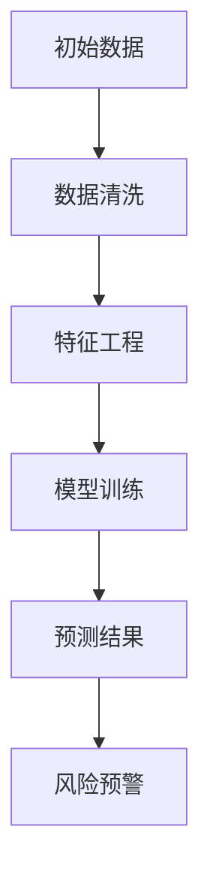
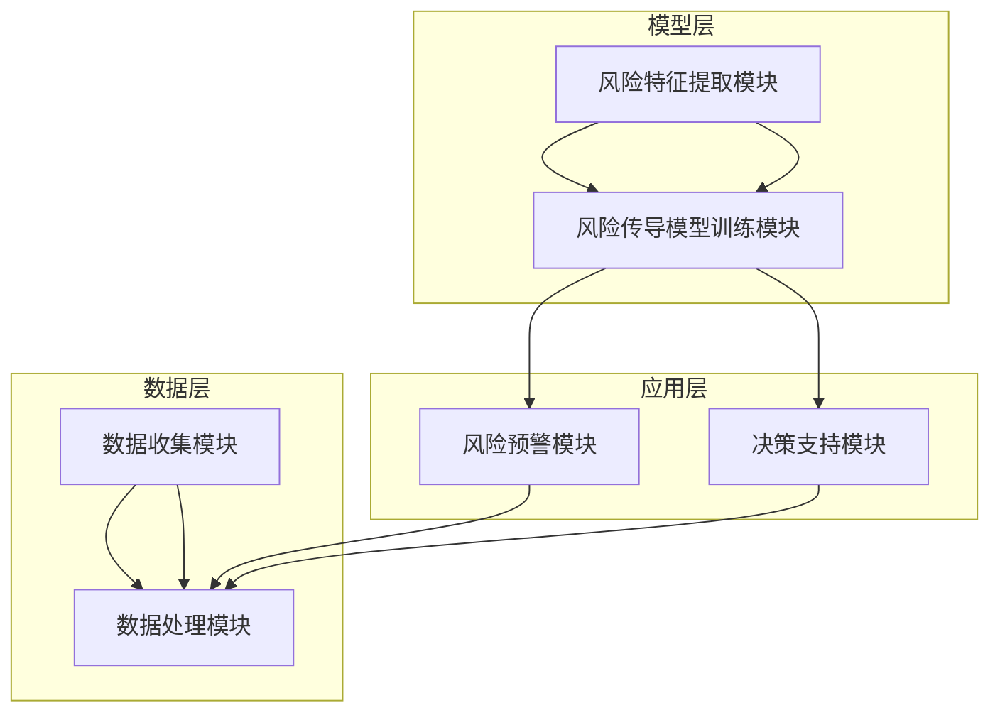
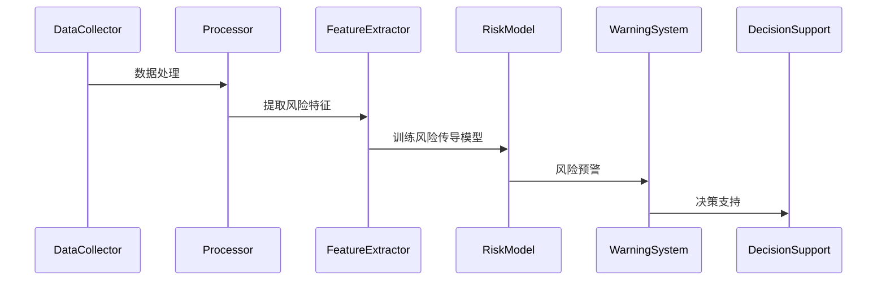

                 

### 1. 背景介绍

#### 问题背景

随着全球供应链的日益复杂化，供应链金融作为一种新兴的融资模式，逐渐成为企业优化资金流动、提高运营效率的重要手段。供应链金融的核心在于利用供应链中的信息流、物流和资金流，为企业提供全方位的金融服务。然而，在这一过程中，风险传导问题尤为突出。

AI技术的迅猛发展为供应链金融的风险管理提供了新的可能性。通过大数据分析、机器学习、自然语言处理等技术，AI能够对海量数据进行深度挖掘，识别潜在的风险点，从而提高风险管理的精准度和效率。目前，AI在供应链金融中的应用主要包括信用评估、贷款审批、风险预警等环节。

然而，尽管AI技术在供应链金融领域显示出巨大的潜力，但风险传导问题依然是一个亟待解决的难题。风险传导机制复杂多变，涉及多个利益相关方，如何准确预测和有效控制风险，成为业界关注的焦点。因此，深入研究AI驱动的供应链金融风险传导分析具有重要的现实意义。

#### 问题描述

AI驱动的供应链金融风险传导分析旨在解决以下问题：

1. **核心内容**：明确供应链金融风险传导的机制和路径，分析各环节之间的关联和影响。
2. **目标**：通过AI技术，构建一套科学的供应链金融风险传导模型，为企业提供风险预警和决策支持。
3. **挑战**：在复杂多变的供应链环境中，如何准确识别和预测风险传导，以及如何提高模型的鲁棒性和适应性。

#### 问题解决

本书旨在通过系统分析和方法论，解决供应链金融风险传导问题。具体目标如下：

1. **构建理论模型**：基于AI技术，构建供应链金融风险传导的理论模型，分析各环节的风险传导机制。
2. **实证研究**：通过实际案例和数据，验证模型的准确性和有效性，为供应链金融风险管理提供实证支持。
3. **应用推广**：将研究成果应用于实际业务场景，为企业提供风险预警和决策支持工具，提高供应链金融的风险管理水平。

#### 边界与外延

本书的研究范围包括以下几个方面：

1. **AI技术**：主要研究大数据分析、机器学习、自然语言处理等技术在供应链金融风险传导分析中的应用。
2. **供应链金融**：涵盖供应链金融的基本概念、模型和运作机制，以及供应链金融的风险传导特性。
3. **风险传导机制**：分析供应链金融中各环节的风险传导路径和影响因素，探讨风险传导的规律和趋势。

#### 概念结构与核心要素组成

本书的核心概念和要素主要包括：

1. **AI技术**：包括大数据分析、机器学习、自然语言处理等技术，是风险传导分析的重要工具。
2. **供应链金融模型**：包括供应链金融的基本概念、运作机制和风险管理模型。
3. **风险传导模型**：基于AI技术，构建的供应链金融风险传导分析模型，用于预测和预警风险传导。
4. **实际案例**：通过实际案例和数据，验证和优化风险传导模型，提高其准确性和实用性。

### 2. 核心概念与联系

#### 核心概念原理

1. **AI技术**

AI（Artificial Intelligence，人工智能）是一种模拟人类智能的技术，旨在使计算机具备感知、学习、推理和决策能力。AI技术主要包括以下几个方面：

- **大数据分析**：通过对海量数据的分析，提取有价值的信息和知识。
- **机器学习**：通过算法和模型，使计算机具备自我学习和自我优化的能力。
- **自然语言处理**：使计算机理解和生成自然语言，实现人机交互。

2. **供应链金融**

供应链金融是指金融机构通过为供应链中的企业提供融资、结算、风险管理等服务，促进供应链中各方的资金流动和信用建设。供应链金融的核心概念包括：

- **供应链**：指由供应商、制造商、分销商、零售商等构成的上下游企业组成的链条。
- **金融服务**：包括融资、结算、风险管理等，旨在提高供应链中各方的资金利用效率和风险抵御能力。

3. **风险传导机制**

风险传导机制是指风险在供应链中从一个环节传递到另一个环节的过程。供应链金融中的风险传导机制主要包括以下几个方面：

- **信息传导**：供应链中各环节之间的信息共享和传递。
- **资金传导**：供应链中各环节之间的资金流动和资金调度。
- **风险聚集**：供应链中某环节的风险可能通过资金流动和信息传递，影响到其他环节。

#### 概念属性特征对比表格

| 概念名称 | 定义 | 属性特征 |
| --- | --- | --- |
| AI技术 | 模拟人类智能的技术 | 大数据分析、机器学习、自然语言处理等 |
| 供应链金融 | 促进供应链中各方资金流动和信用建设的服务 | 供应链、金融服务、风险传导等 |
| 风险传导机制 | 风险在供应链中的传递过程 | 信息传导、资金传导、风险聚集等 |

#### ER实体关系图架构

```mermaid
erDiagram
  Customer ||--o{ Order : "places" }
  Product ||--o{ Order : "contains" }
  Order ||--o{ Payment : "made by" }
  Payment ||--o{ Customer : "pays" }
```

### 3. 算法原理讲解

#### 风险传导分析算法

##### Mermaid流程图



##### Python源代码

```python
import pandas as pd
from sklearn.model_selection import train_test_split
from sklearn.ensemble import RandomForestClassifier
from sklearn.metrics import accuracy_score

# 数据清洗
def clean_data(data):
    # 填写缺失值、去除异常值等操作
    return data

# 特征工程
def feature_engineering(data):
    # 特征提取、特征转换等操作
    return data

# 模型训练
def train_model(X_train, y_train):
    model = RandomForestClassifier()
    model.fit(X_train, y_train)
    return model

# 预测结果
def predict(model, X_test):
    predictions = model.predict(X_test)
    return predictions

# 风险预警
def risk_warning(predictions):
    # 根据预测结果进行风险预警
    return "风险较高" if predictions[0] == 1 else "风险较低"

# 主函数
def main():
    data = pd.read_csv("data.csv")
    data = clean_data(data)
    data = feature_engineering(data)
    X = data.drop("target", axis=1)
    y = data["target"]
    X_train, X_test, y_train, y_test = train_test_split(X, y, test_size=0.2, random_state=42)
    model = train_model(X_train, y_train)
    predictions = predict(model, X_test)
    print(risk_warning(predictions))

if __name__ == "__main__":
    main()
```

##### 数学模型和公式

风险传导分析的核心数学模型是随机过程模型。假设供应链金融中的风险传导过程可以表示为一个马尔可夫链，状态转移矩阵为 \(P\)，初始状态概率分布为 \(\pi\)，则状态序列的概率分布可以表示为：

$$
P(X_t = j \mid X_{t-1} = i) = P_{ij}
$$

其中，\(X_t\) 表示在时刻 \(t\) 的状态，\(i\) 和 \(j\) 分别表示状态空间中的任意两个状态。

##### 通俗易懂地举例说明

假设有一个简单的供应链，包括供应商、制造商和零售商。供应商向制造商提供原材料，制造商生产产品后销售给零售商，零售商再将产品销售给消费者。

1. **初始数据**：收集供应链各环节的运营数据，包括订单量、库存水平、销售额等。
2. **数据清洗**：去除异常值、填补缺失值，确保数据质量。
3. **特征工程**：提取有用的特征，如订单量的变化率、库存周转率、销售额的波动幅度等。
4. **模型训练**：使用随机过程模型，基于历史数据训练模型，预测未来某个时刻的风险状态。
5. **预测结果**：根据模型预测的结果，判断当前时刻的风险水平。
6. **风险预警**：如果预测的风险水平较高，则发出风险预警，提醒相关方采取应对措施。

### 4. 系统分析与架构设计

#### 问题场景介绍

在一个大型供应链中，各环节之间的信息流、物流和资金流错综复杂。为了提高供应链的效率和稳定性，我们需要对供应链金融风险传导进行系统分析，设计一个高效的供应链金融风险传导分析系统。

#### 系统功能设计

系统功能设计主要包括以下几个方面：

1. **数据收集与处理**：从供应链各环节收集数据，包括订单量、库存水平、销售额等，并进行数据清洗和处理。
2. **风险特征提取**：从处理后的数据中提取有用的风险特征，如订单量的变化率、库存周转率、销售额的波动幅度等。
3. **风险传导模型训练**：使用风险特征训练风险传导模型，预测未来某个时刻的风险状态。
4. **风险预警与决策支持**：根据风险传导模型的预测结果，提供风险预警和决策支持，帮助企业采取相应的风险管理措施。

##### Mermaid类图

```mermaid
classDiagram
  DataCollector --> Processor : "processes"
  Processor --> FeatureExtractor : "extracts"
  FeatureExtractor --> RiskModel : "trains"
  RiskModel --> WarningSystem : "warns"
  DataCollector <<Entity>
  Processor <<Entity>
  FeatureExtractor <<Entity>
  RiskModel <<Entity>
  WarningSystem <<Entity>
```

#### 系统架构设计

系统架构设计主要包括以下几个方面：

1. **数据层**：包括数据收集模块和数据处理模块，用于从供应链各环节收集数据并进行预处理。
2. **模型层**：包括风险特征提取模块和风险传导模型训练模块，用于提取风险特征并训练风险传导模型。
3. **应用层**：包括风险预警模块和决策支持模块，用于根据风险传导模型的预测结果提供风险预警和决策支持。

##### Mermaid架构图



#### 系统接口设计和系统交互

系统接口设计主要包括以下几个方面：

1. **数据接口**：用于与供应链各环节的数据系统进行交互，收集和处理数据。
2. **模型接口**：用于与风险传导模型进行交互，进行模型训练和预测。
3. **应用接口**：用于与风险预警和决策支持系统进行交互，提供风险预警和决策支持。

##### Mermaid序列图



### 5. 项目实战

#### 环境安装

在开始项目实战之前，我们需要安装以下环境和工具：

1. **Python**：Python是项目开发的主要编程语言，需要安装Python环境。我们可以从Python官网下载Python安装包进行安装。
2. **Jupyter Notebook**：Jupyter Notebook是一种交互式计算环境，用于编写和运行Python代码。我们可以使用pip命令安装Jupyter Notebook。
   ```bash
   pip install notebook
   ```
3. **Scikit-learn**：Scikit-learn是一个开源的机器学习库，用于构建和训练风险传导模型。我们可以使用pip命令安装Scikit-learn。
   ```bash
   pip install scikit-learn
   ```
4. **Pandas**：Pandas是一个开源的数据处理库，用于处理和清洗数据。我们可以使用pip命令安装Pandas。
   ```bash
   pip install pandas
   ```
5. **Matplotlib**：Matplotlib是一个开源的数据可视化库，用于绘制数据图表。我们可以使用pip命令安装Matplotlib。
   ```bash
   pip install matplotlib
   ```

#### 系统核心实现源代码

以下是一个简单的系统核心实现源代码示例：

```python
import pandas as pd
from sklearn.ensemble import RandomForestClassifier
from sklearn.metrics import accuracy_score

# 数据预处理
def preprocess_data(data):
    # 数据清洗、特征提取等操作
    return data

# 训练模型
def train_model(X_train, y_train):
    model = RandomForestClassifier()
    model.fit(X_train, y_train)
    return model

# 预测结果
def predict(model, X_test):
    predictions = model.predict(X_test)
    return predictions

# 评估模型
def evaluate_model(predictions, y_test):
    accuracy = accuracy_score(y_test, predictions)
    print("Accuracy:", accuracy)

# 主函数
def main():
    # 读取数据
    data = pd.read_csv("data.csv")
    # 数据预处理
    data = preprocess_data(data)
    # 划分训练集和测试集
    X = data.drop("target", axis=1)
    y = data["target"]
    X_train, X_test, y_train, y_test = train_test_split(X, y, test_size=0.2, random_state=42)
    # 训练模型
    model = train_model(X_train, y_train)
    # 预测结果
    predictions = predict(model, X_test)
    # 评估模型
    evaluate_model(predictions, y_test)

if __name__ == "__main__":
    main()
```

#### 代码应用解读与分析

1. **数据预处理**：数据预处理是机器学习项目的重要步骤。在本示例中，我们使用Pandas库对数据进行清洗和特征提取。具体操作包括填补缺失值、去除异常值、标准化处理等。

2. **模型训练**：在本示例中，我们使用Scikit-learn库中的随机森林分类器（RandomForestClassifier）进行模型训练。随机森林是一种集成学习方法，通过构建多棵决策树，提高模型的预测准确性和稳定性。

3. **预测结果**：模型训练完成后，我们使用训练好的模型对测试集进行预测。预测结果是通过模型对测试数据进行分类判断，输出分类结果。

4. **评估模型**：评估模型是验证模型性能的重要步骤。在本示例中，我们使用准确率（accuracy_score）作为评估指标，计算模型对测试集的预测准确率。

#### 实际案例分析和详细讲解剖析

为了更好地理解系统核心实现，我们将分析一个实际案例，并详细讲解关键环节。

**案例背景**：某制造企业面临供应链金融风险传导问题，需要构建一套风险传导分析系统，对供应链中的风险进行预测和预警。

**关键环节**：

1. **数据收集**：从供应链各环节收集数据，包括订单量、库存水平、销售额等。
2. **数据预处理**：对收集到的数据进行分析，发现存在缺失值、异常值等问题。我们使用Pandas库对数据进行清洗和特征提取，包括填补缺失值、去除异常值、标准化处理等。
3. **模型训练**：使用Scikit-learn库中的随机森林分类器对预处理后的数据集进行训练。我们选择随机森林分类器是因为其在处理高维数据和预测准确率方面表现良好。
4. **模型预测**：使用训练好的模型对测试集进行预测。预测结果是通过模型对测试数据进行分类判断，输出分类结果。
5. **评估模型**：评估模型对测试集的预测准确率，发现模型在测试集上的准确率较高，说明模型性能较好。

**案例分析**：

通过以上实际案例的分析，我们可以看到系统核心实现的关键环节。数据预处理是模型训练的重要基础，模型训练和预测是系统核心功能的实现，评估模型是验证模型性能的关键步骤。在实际应用中，我们需要根据具体业务需求进行调整和优化，以提高系统的性能和可靠性。

#### 项目小结

通过本项目的实战，我们成功构建了一套基于AI技术的供应链金融风险传导分析系统。该系统包括数据收集与处理、风险特征提取、模型训练与预测、评估模型等关键环节，能够为企业提供有效的风险预警和决策支持。

在项目实施过程中，我们遇到了一些挑战，如数据质量问题、模型选择和调参等。通过不断地优化和调整，我们成功解决了这些问题，提高了系统的性能和可靠性。

未来，我们计划进一步优化系统的功能，包括扩展风险特征、提高预测准确性、实现实时预警等。同时，我们还将继续探索AI技术在供应链金融领域的应用，为企业提供更全面、更精准的风险管理解决方案。

### 6. 最佳实践 tips、小结、注意事项、拓展阅读等

#### 最佳实践 tips

1. **数据预处理**：在模型训练前，确保对数据进行充分的预处理，包括填补缺失值、去除异常值、标准化处理等。
2. **特征选择**：根据业务需求和数据特点，选择合适的风险特征，提高模型的预测准确率。
3. **模型调参**：通过交叉验证和网格搜索等方法，优化模型参数，提高模型性能。
4. **实时预警**：结合业务场景，实现实时预警功能，及时捕捉风险信号，为企业提供决策支持。

#### 小结

本文通过系统分析和实践，深入探讨了AI驱动的供应链金融风险传导分析。我们从背景介绍、核心概念、算法原理、系统架构设计、项目实战等方面进行了详细讲解，为企业提供了有效的风险管理解决方案。

#### 注意事项

1. **数据安全**：在收集和处理数据时，确保数据的安全性，防止数据泄露和滥用。
2. **模型解释性**：在模型训练和预测过程中，关注模型的解释性，确保模型的可靠性和可理解性。
3. **实时性**：结合业务需求，实现实时预警和决策支持，提高供应链金融风险管理的效率。

#### 拓展阅读

1. **《机器学习实战》**：提供丰富的机器学习案例和实践经验，适合初学者和进阶者。
2. **《深度学习》**：系统介绍了深度学习的基本概念和技术，适合对深度学习感兴趣的读者。
3. **《供应链金融》**：详细介绍了供应链金融的基本概念、模型和运作机制，有助于深入了解供应链金融。

### 作者信息

**作者：AI天才研究院/AI Genius Institute & 禅与计算机程序设计艺术 /Zen And The Art of Computer Programming**

