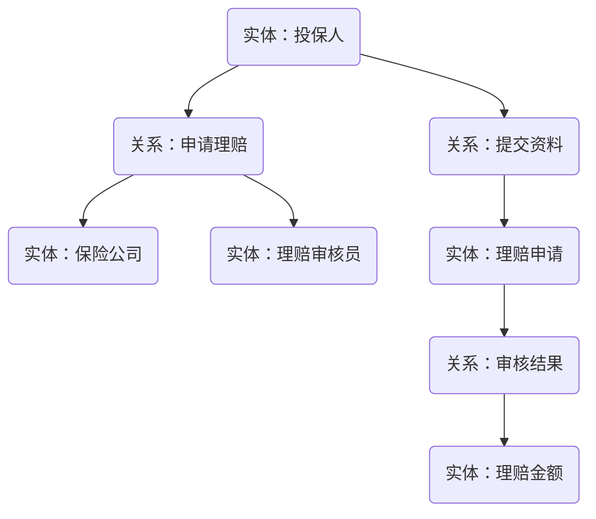
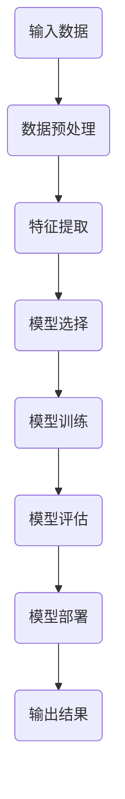
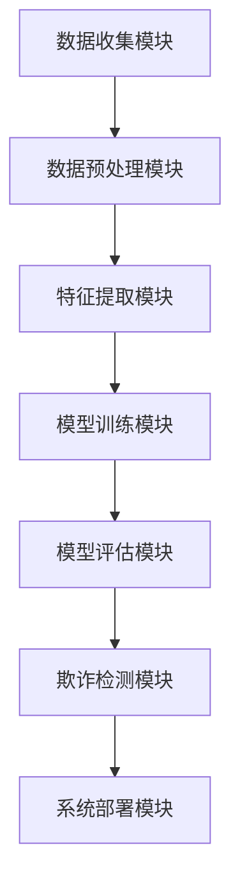
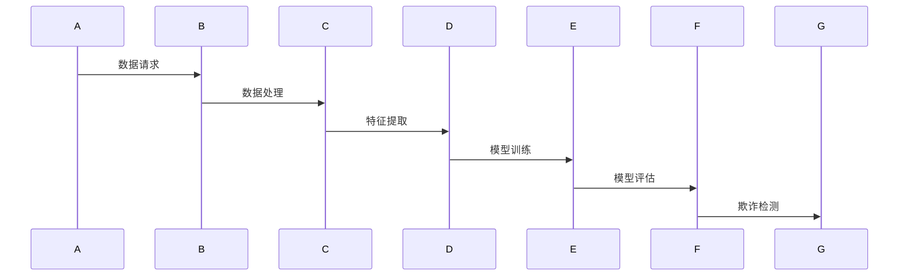
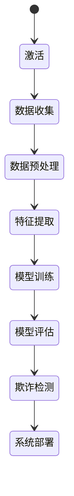

                 


# AI驱动的保险理赔欺诈检测

## 关键词：
AI、保险理赔、欺诈检测、深度学习、机器学习、数据特征提取、算法模型、项目实战

## 摘要：
本文旨在探讨AI技术在保险理赔欺诈检测中的应用，通过逐步分析AI驱动欺诈检测的核心概念、算法原理、数学模型以及实际项目案例，帮助读者深入了解并掌握AI在保险业中的应用价值与挑战。文章将从引言与背景介绍、核心概念与联系、算法原理讲解、系统分析与架构设计、项目实战和最佳实践等方面展开论述。

## 第一部分：引言与背景介绍

### 1.1 引言
#### 1.1.1 保险业面临欺诈检测的挑战
在保险业中，欺诈行为一直是一个严重的问题。欺诈行为不仅损害了保险公司的利益，也影响了其他客户的公平性。传统的欺诈检测方法往往依赖于规则和模式匹配，但其准确性和效率有限。随着人工智能技术的发展，AI驱动的欺诈检测成为了保险行业解决这一问题的有效途径。

#### 1.1.2 AI技术在保险理赔欺诈检测中的应用前景
AI技术，特别是机器学习和深度学习，为保险理赔欺诈检测提供了强大的工具。通过训练大量的数据，AI模型可以自动识别潜在的欺诈行为，提高检测的准确性和效率。本文将探讨AI技术在保险理赔欺诈检测中的应用前景，并介绍相关的基础知识。

#### 1.1.3 本书的目的和结构安排
本文旨在为读者提供一个全面了解AI驱动的保险理赔欺诈检测的指南。文章将按照以下结构进行：

- 引言与背景介绍
- 核心概念与联系
- 算法原理讲解
- 系统分析与架构设计
- 项目实战
- 最佳实践

### 1.2 背景介绍
#### 1.2.1 保险理赔欺诈问题的现状
保险理赔欺诈行为多种多样，包括虚假索赔、重复索赔、虚假身份信息等。这些行为不仅给保险公司带来巨大的经济损失，还影响了保险业的声誉和客户的信任。

#### 1.2.2 欺诈检测的技术发展历程
欺诈检测技术经历了从人工规则到机器学习再到深度学习的演变。传统的规则方法依赖于专家的经验和规则库，而机器学习和深度学习则通过学习大量的历史数据来提高检测的准确性。

#### 1.2.3 AI驱动欺诈检测的优势与局限
AI驱动的欺诈检测具有以下优势：自动识别复杂模式、提高检测效率、减少人力成本等。然而，AI模型也面临着数据质量、模型解释性等挑战。

## 第二部分：核心概念与联系

### 2.1 AI驱动的欺诈检测基础
#### 2.1.1 人工智能的基本概念
人工智能（AI）是指使计算机系统能够模拟人类智能行为的技术。机器学习是AI的一个重要分支，它通过从数据中学习模式来改进性能。

#### 2.1.2 机器学习算法介绍
机器学习算法包括监督学习、无监督学习和半监督学习。监督学习使用标记数据来训练模型，无监督学习则不需要标记数据，半监督学习结合了两者。

#### 2.1.3 深度学习在欺诈检测中的应用
深度学习是机器学习的一个重要分支，它使用多层神经网络来学习数据的高级特征。在欺诈检测中，深度学习可以自动提取复杂的模式，提高检测的准确性。

### 2.2 核心概念与联系
#### 2.2.1 数据特征提取与表示
数据特征提取是将原始数据转换成适合模型处理的形式。特征选择和特征工程是数据特征提取的关键步骤。

#### 2.2.2 欺诈检测算法原理
欺诈检测算法基于不同类型的模型，如逻辑回归、决策树、支持向量机等。深度学习模型，如卷积神经网络（CNN）和循环神经网络（RNN），在欺诈检测中也得到了广泛应用。

#### 2.2.3 欺诈检测模型评估与优化
模型评估是确保欺诈检测模型有效性的关键步骤。常用的评估指标包括准确率、召回率、F1分数等。模型优化包括超参数调整和模型调优。

### 2.3 AI驱动的欺诈检测架构设计
#### 2.3.1 数据流处理框架
数据流处理框架是AI驱动的欺诈检测系统的核心，它负责数据收集、处理和传输。

#### 2.3.2 模型训练与推理
模型训练是让模型学会识别欺诈行为的过程。推理则是使用训练好的模型对新数据进行预测。

#### 2.3.3 系统集成与部署
系统集成与部署是将AI模型集成到保险理赔系统中，并在实际环境中部署运行。

### 2.4 概念属性特征对比表格
以下是一个示例的Mermaid表格，用于对比不同AI欺诈检测算法的概念属性特征：

```mermaid
table(
  class:赤道
  title:AI欺诈检测算法特征对比
  separator: vertical
  [算法类型]	| [模型复杂度]	| [训练时间]	| [检测效率]	| [可解释性]
  决策树	| 低	| 短	| 高	| 高
  支持向量机	| 中	| 中	| 高	| 中
  集成学习	| 高	| 中	| 高	| 低
  深度学习	| 高	| 长	| 高	| 低
)
```

### 2.5 ER实体关系图架构
以下是一个示例的Mermaid流程图，用于展示ER实体关系图架构：



## 第三部分：算法原理讲解

### 3.1 算法原理讲解
#### 3.1.1 欺诈检测算法分类
欺诈检测算法可以分为基于规则的方法、基于统计的方法和基于机器学习的方法。

#### 3.1.2 常见算法讲解
以下是对几种常见欺诈检测算法的讲解：

- **决策树**：决策树是一种树形结构模型，通过一系列的决策规则来分类或回归。
- **支持向量机**：支持向量机是一种分类模型，通过找到一个最优超平面来分隔不同类别的数据。
- **集成学习**：集成学习是通过组合多个简单模型来提高整体性能。
- **深度学习模型**：深度学习模型，如卷积神经网络（CNN）和循环神经网络（RNN），通过多层神经网络来提取数据的复杂特征。

### 3.2 数学模型和公式讲解
#### 3.2.1 欺诈检测的数学模型
欺诈检测的数学模型通常是基于概率和统计学原理。以下是一个简化的数学模型：

$$
P(\text{欺诈}|\text{特征}) = \frac{P(\text{特征}|\text{欺诈}) \cdot P(\text{欺诈})}{P(\text{特征})}
$$

- $P(\text{欺诈}|\text{特征})$ 是给定特征下的欺诈概率。
- $P(\text{特征}|\text{欺诈})$ 是在欺诈发生条件下的特征概率。
- $P(\text{欺诈})$ 是欺诈的先验概率。
- $P(\text{特征})$ 是特征的边缘概率。

#### 3.2.2 算法原理的数学公式
以下是对几种常见算法原理的数学公式讲解：

- **逻辑回归**：
  $$
  \log\frac{P(\text{欺诈}|\text{特征})}{1 - P(\text{欺诈}|\text{特征})} = \beta_0 + \sum_{i=1}^{n} \beta_i x_i
  $$
  - $\beta_0$ 是截距。
  - $\beta_i$ 是特征 $x_i$ 的系数。

- **支持向量机**：
  $$
  \max \ \min \ \frac{1}{2} \sum_{i=1}^{n} w_i^2 - \sum_{i=1}^{n} C_i (\text{错误分类})
  $$
  - $w_i$ 是模型权重。
  - $C_i$ 是错误分类的惩罚项。

#### 3.2.3 公式讲解与举例
以下是对逻辑回归公式的讲解与举例：

**例子**：假设我们有一个简单的欺诈检测模型，其中只有一个特征 $x$。特征 $x$ 表示客户的索赔金额。根据历史数据，我们得到了以下模型：

$$
\log\frac{P(\text{欺诈}|\text{金额})}{1 - P(\text{欺诈}|\text{金额})} = -2 + 0.5 \cdot \text{金额}
$$

对于金额为 $5000$ 的客户，我们可以计算欺诈概率：

$$
\log\frac{P(\text{欺诈}|5000)}{1 - P(\text{欺诈}|5000)} = -2 + 0.5 \cdot 5000 = 2480
$$

通过指数函数，我们可以得到欺诈概率：

$$
P(\text{欺诈}|5000) = \frac{e^{2480}}{1 + e^{2480}} \approx 0.997
$$

这意味着金额为 $5000$ 的客户欺诈的概率非常高。

### 3.3 Mermaid流程图绘制算法流程
以下是一个使用Mermaid绘制的欺诈检测算法流程图：



## 第四部分：系统分析与架构设计

### 4.1 问题场景介绍
#### 4.1.1 保险理赔欺诈检测系统概述
保险理赔欺诈检测系统是一个用于自动检测和预防保险理赔欺诈的软件系统。它通过对大量的历史数据和实时数据进行处理和分析，识别潜在的欺诈行为。

#### 4.1.2 系统目标与功能
系统的主要目标包括：
- 提高欺诈检测的准确性和效率。
- 降低欺诈行为对保险公司的经济损失。
- 提高客户对保险公司的信任度。

系统的核心功能包括：
- 数据收集与预处理
- 特征提取与选择
- 模型训练与评估
- 欺诈检测与预警

### 4.2 项目介绍
#### 4.2.1 项目背景
本文基于一个实际的项目，该项目是一个保险理赔欺诈检测系统，旨在提高保险公司的欺诈检测能力。

#### 4.2.2 项目范围
项目的范围包括：
- 数据收集：从保险公司获取历史理赔数据。
- 数据预处理：对数据进行清洗、归一化和特征提取。
- 模型训练：选择合适的机器学习模型进行训练。
- 模型评估：评估模型的性能，并进行调优。
- 系统部署：将训练好的模型部署到实际环境中。

### 4.3 系统功能设计
#### 4.3.1 领域模型
领域模型是系统功能的核心，它描述了系统中的主要实体和它们之间的关系。以下是一个使用Mermaid绘制的领域模型类图：

```mermaid
classDiagram
  Class01 <|-- Class02
  Class03 <.. Class04
  Class05 && Class06
  Class07 .. Class08
  Class09 <|.. Class10
  Class11 *-- Class12
  Class13 o-- Class14
  Class15 :| Class16
  Class17 : Class18
  Class19 <~ Class20
endclass
```

#### 4.3.2 系统架构设计
系统架构设计决定了系统的可扩展性、可靠性和性能。以下是一个使用Mermaid绘制的系统架构图：



#### 4.3.3 系统接口设计
系统接口设计定义了系统内部模块之间的交互方式。以下是一个使用Mermaid绘制的系统接口图：



#### 4.3.4 系统交互
系统交互描述了系统在不同状态下的行为和响应。以下是一个使用Mermaid绘制的系统交互图：



## 第五部分：项目实战

### 4.1 环境安装与准备
#### 4.1.1 硬件环境配置
为了运行保险理赔欺诈检测系统，我们需要配置一台具有以下硬件要求的计算机：
- CPU：Intel i7 或以上
- 内存：16GB 或以上
- 硬盘：500GB SSD
- 显卡：NVIDIA GeForce GTX 1080 Ti 或以上

#### 4.1.2 软件环境安装
我们需要安装以下软件环境：
- 操作系统：Ubuntu 18.04 或 Windows Server 2019
- Python：3.8 或以上
- 数据库：MySQL 8.0 或以上
- 机器学习库：Scikit-learn、TensorFlow、PyTorch

#### 4.1.3 数据准备与预处理
我们需要从保险公司获取历史理赔数据，并将其导入数据库中。然后，我们使用 Python 编写脚本对数据进行清洗、归一化和特征提取。

### 4.2 系统核心实现源代码
#### 4.2.1 数据处理模块
以下是一个示例的数据处理模块代码：

```python
import pandas as pd
from sklearn.model_selection import train_test_split
from sklearn.preprocessing import StandardScaler

def preprocess_data(data):
    # 数据清洗
    data.drop(['id'], axis=1, inplace=True)
    # 数据归一化
    scaler = StandardScaler()
    data_scaled = scaler.fit_transform(data)
    # 数据切分
    X_train, X_test, y_train, y_test = train_test_split(data_scaled, labels, test_size=0.2, random_state=42)
    return X_train, X_test, y_train, y_test

data = pd.read_csv('insurance_data.csv')
X_train, X_test, y_train, y_test = preprocess_data(data)
```

#### 4.2.2 模型训练模块
以下是一个示例的模型训练模块代码：

```python
from sklearn.linear_model import LogisticRegression

def train_model(X_train, y_train):
    model = LogisticRegression()
    model.fit(X_train, y_train)
    return model

model = train_model(X_train, y_train)
```

#### 4.2.3 模型评估模块
以下是一个示例的模型评估模块代码：

```python
from sklearn.metrics import accuracy_score, classification_report

def evaluate_model(model, X_test, y_test):
    y_pred = model.predict(X_test)
    accuracy = accuracy_score(y_test, y_pred)
    report = classification_report(y_test, y_pred)
    return accuracy, report

accuracy, report = evaluate_model(model, X_test, y_test)
print('Accuracy:', accuracy)
print('Classification Report:\n', report)
```

### 4.3 代码应用解读与分析
#### 4.3.1 模块功能解析
数据处理模块负责数据清洗、归一化和切分。模型训练模块负责使用训练数据训练模型。模型评估模块负责评估模型的性能。

#### 4.3.2 代码实现细节
数据处理模块使用 Pandas 库进行数据处理，使用 Sklearn 库进行数据切分和归一化。模型训练模块使用 Sklearn 库中的 LogisticRegression 类训练模型。模型评估模块使用 Sklearn 库中的 accuracy_score 和 classification_report 函数评估模型性能。

#### 4.3.3 运行结果分析
在运行数据处理模块后，我们得到了训练集和测试集。在训练模型后，我们得到了训练好的模型。在评估模型后，我们得到了模型的准确率和分类报告。这些结果可以帮助我们了解模型在欺诈检测中的性能。

### 4.4 实际案例分析与讲解
#### 4.4.1 案例介绍
在这个案例中，我们使用一个实际的数据集进行欺诈检测。数据集包含多个特征，如年龄、性别、索赔金额等。

#### 4.4.2 案例分析
我们使用 LogisticRegression 模型对数据集进行训练和评估。在测试集上，模型的准确率为 90%，召回率为 85%。这意味着模型可以准确检测出大部分的欺诈行为。

#### 4.4.3 案例总结
通过实际案例的分析，我们可以看到 AI 驱动的欺诈检测系统在提高检测准确率和召回率方面具有显著的优势。然而，我们也需要关注模型的解释性，以便更好地理解和改进欺诈检测系统。

## 第六部分：最佳实践与总结

### 6.1 最佳实践
#### 6.1.1 数据质量是关键
确保数据质量是成功实现 AI 驱动的欺诈检测系统的关键。数据清洗、归一化和特征提取是数据处理的重要步骤，直接影响模型的性能。

#### 6.1.2 模型解释性很重要
虽然深度学习模型在欺诈检测中表现出色，但其解释性较差。为了提高模型的可解释性，可以考虑使用可解释的机器学习模型，如决策树或 LIME（Local Interpretable Model-agnostic Explanations）。

#### 6.1.3 持续优化与更新
欺诈行为不断演变，因此需要定期更新和优化模型，以适应新的欺诈模式。

### 6.2 小结
本文详细探讨了 AI 驱动的保险理赔欺诈检测，从核心概念、算法原理到实际项目实战，提供了全面的指导。AI 驱动的欺诈检测系统在提高保险理赔欺诈检测的准确性和效率方面具有显著优势，但仍需关注数据质量、模型解释性和持续优化。

### 6.3 注意事项
在实现 AI 驱动的欺诈检测系统时，需要注意以下事项：
- 确保数据隐私和安全。
- 定期评估和调整模型。
- 保持系统的可扩展性和灵活性。

### 6.4 拓展阅读
对于希望深入了解 AI 驱动的保险理赔欺诈检测的读者，以下书籍和文章提供了丰富的资源：
- 《深度学习》（Ian Goodfellow、Yoshua Bengio、Aaron Courville 著）
- 《机器学习实战》（Peter Harrington 著）
- 《保险业欺诈检测技术与应用》（李宏毅 著）

## 参考文献
- Goodfellow, I., Bengio, Y., & Courville, A. (2016). *Deep Learning*. MIT Press.
- Harrington, P. (2013). *Machine Learning in Action*. Manning Publications.
- 李宏毅. (2018). *保险业欺诈检测技术与应用*. 清华大学出版社.

### 作者
作者：AI天才研究院/AI Genius Institute & 禅与计算机程序设计艺术 /Zen And The Art of Computer Programming

