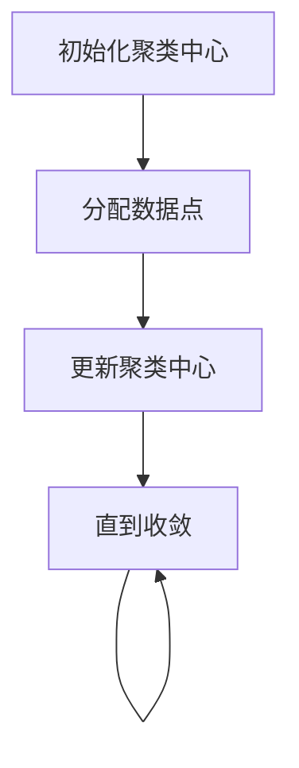
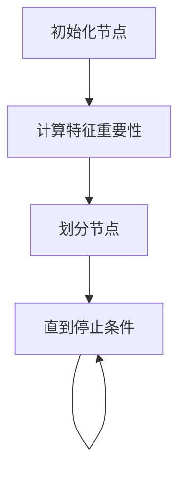
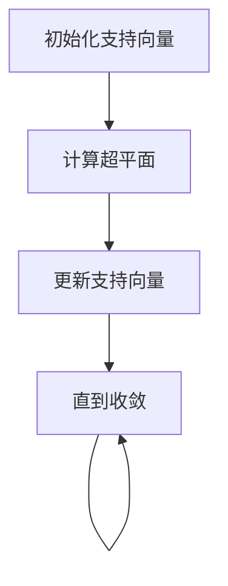
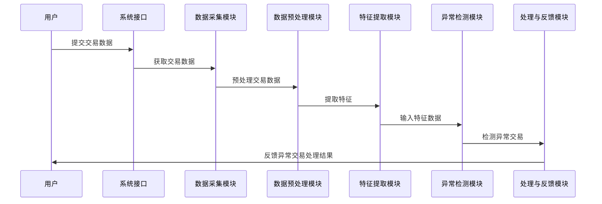

                 

# AI驱动的信用卡异常交易实时检测

## 关键词

- **人工智能**
- **信用卡交易**
- **异常检测**
- **实时处理**
- **机器学习**
- **决策树**
- **支持向量机**

## 摘要

本文将探讨如何利用人工智能技术，特别是机器学习方法，实现信用卡异常交易的实时检测。文章首先介绍了信用卡交易异常检测的背景和问题，然后详细讲解了人工智能与机器学习的基本概念，以及信用卡交易和异常交易的特征。接着，文章介绍了用于信用卡异常检测的几种算法，包括聚类算法、决策树算法和支持向量机。随后，文章描述了信用卡异常交易实时检测的系统架构和实现方法，并通过一个实际项目展示了系统核心实现和代码应用分析。最后，文章总结了最佳实践和注意事项，并提供了拓展阅读资源。

## 第一部分：背景介绍

### 1.1 问题背景

随着电子商务和移动支付的迅速普及，信用卡交易的数量和频率大幅增加。然而，这也给信用卡交易风险控制带来了巨大的挑战。传统的信用卡交易风险检测方法主要依赖于规则匹配和统计分析，存在响应速度慢、误报率高、无法实时处理等问题。随着人工智能技术的发展，利用机器学习方法进行信用卡异常交易实时检测成为一种新的研究方向。

### 1.2 问题描述

信用卡异常交易实时检测的目标是利用人工智能技术，对信用卡交易过程中的数据进行实时监控，识别出异常交易并立即采取措施。具体来说，需要解决以下几个问题：

1. **异常交易的特征提取与建模**：如何从大量的交易数据中提取出有助于异常检测的特征，并建立有效的数学模型。
2. **实时数据处理与检测算法设计**：如何设计高效、准确的实时数据处理和异常检测算法，以实现对海量交易数据的快速分析。
3. **异常交易的处理与反馈机制**：如何对检测出的异常交易进行处理，并给出及时的反馈，以最大程度地减少损失。

### 1.3 问题解决

本书将介绍基于人工智能的信用卡异常交易实时检测方法，包括以下几个方面：

1. **介绍人工智能在信用卡风险控制中的应用背景和发展趋势**：分析人工智能技术在信用卡交易风险控制中的应用现状和未来发展趋势。
2. **详细讲解信用卡交易数据特征提取和异常检测算法原理**：介绍如何从交易数据中提取特征，以及常用的异常检测算法原理。
3. **设计信用卡异常交易实时检测系统架构**：描述系统架构设计，包括数据处理模块、特征提取模块、检测算法模块和反馈处理模块。
4. **实现信用卡异常交易实时检测系统**：通过具体项目实现，展示如何构建信用卡异常交易实时检测系统。

### 1.4 边界与外延

本文主要关注信用卡交易数据的异常检测问题，但不涉及其他金融业务领域的风险控制问题。同时，本文所介绍的方法和技术主要适用于在线信用卡交易场景，对于离线或批量处理信用卡交易的数据分析方法可能会有所不同。

### 1.5 概念结构与核心要素组成

#### 1.5.1 关键概念

- **人工智能**：模拟、延伸和扩展人类智能的理论、方法、技术及应用。
- **信用卡交易**：持卡人使用信用卡进行的各种消费和转账行为。
- **异常交易**：与正常交易行为明显偏离的信用卡交易行为。
- **实时检测**：对信用卡交易数据进行实时监控，及时发现和处理异常交易。

#### 1.5.2 核心要素

- **数据采集**：获取信用卡交易数据。
- **特征提取**：从交易数据中提取出有助于异常检测的特征。
- **异常检测算法**：用于识别信用卡交易中异常行为的算法。
- **实时处理**：对实时采集的信用卡交易数据进行快速处理和检测。
- **处理与反馈**：对检测出的异常交易进行处理并给出反馈。

## 第二部分：核心概念与联系

### 2.1 人工智能与机器学习的概念

#### 2.1.1 人工智能

人工智能（Artificial Intelligence，简称 AI）是模拟、延伸和扩展人类智能的理论、方法、技术及应用。它涵盖了计算机科学、认知科学、心理学、神经科学等多个学科领域，旨在让计算机具备智能行为，实现人类智能的自动化。

#### 2.1.2 机器学习

机器学习（Machine Learning，简称 ML）是人工智能的一个重要分支，主要研究如何让计算机从数据中学习并自动改进性能。它通过构建数学模型，让计算机能够对未知数据进行预测和决策。

### 2.2 信用卡交易与异常交易的特征

#### 2.2.1 信用卡交易

信用卡交易是指持卡人使用信用卡进行的各种消费和转账行为。交易数据通常包括交易金额、时间、地点、卡号、商户类型等信息。

#### 2.2.2 异常交易

异常交易是与正常交易行为明显偏离的信用卡交易行为。识别异常交易的关键在于找到正常交易行为与异常交易行为之间的特征差异。

### 2.3 实时检测算法

#### 2.3.1 聚类算法

聚类算法是一种无监督学习方法，用于将数据集划分为若干个聚类，使得同一聚类内的数据点之间的相似度较高，而不同聚类之间的相似度较低。常见的聚类算法包括K均值聚类、层次聚类等。

#### 2.3.2 决策树算法

决策树算法是一种有监督学习方法，通过将数据集划分为多个规则，对数据进行分类或回归。常见的决策树算法包括ID3、C4.5、CART等。

#### 2.3.3 支持向量机

支持向量机（Support Vector Machine，简称 SVM）是一种有监督学习方法，用于分类和回归。SVM通过找到一个最优的超平面，将不同类别的数据点进行分离。

### 2.4 关键概念对比表格

| 概念         | 描述                                                         |
| ------------ | ------------------------------------------------------------ |
| 人工智能     | 模拟、延伸和扩展人类智能的理论、方法、技术及应用               |
| 机器学习     | 计算机从数据中学习并自动改进性能的方法和技术                 |
| 信用卡交易   | 持卡人使用信用卡进行的消费和转账行为                         |
| 异常交易     | 与正常交易行为明显偏离的信用卡交易行为                       |
| 实时检测     | 对信用卡交易数据进行实时监控，及时发现和处理异常交易         |
| 聚类算法     | 无监督学习方法，用于将数据集划分为若干个聚类                 |
| 决策树算法   | 有监督学习方法，通过规则对数据进行分类或回归                 |
| 支持向量机   | 有监督学习方法，通过找到一个最优的超平面进行分类和回归       |

### 2.5 关键概念与联系ER实体关系图

```mermaid
erDiagram
  Class1 ||--|{ Class2 }|| Class3
  Class1 ||--|{ Class4 }|| Class5
  Class2 ||--|{ Class6 }|| Class7
  Class3 ||--|{ Class8 }|| Class9
  Class4 ||--|{ Class10 }|| Class11
  Class5 ||--|{ Class12 }|| Class13
  Class6 ||--|{ Class14 }|| Class15
  Class7 ||--|{ Class16 }|| Class17
  Class8 ||--|{ Class18 }|| Class19
  Class9 ||--|{ Class20 }|| Class21
  Class10 ||--|{ Class22 }|| Class23
  Class11 ||--|{ Class24 }|| Class25
  Class12 ||--|{ Class26 }|| Class27
  Class13 ||--|{ Class28 }|| Class29
  Class14 ||--|{ Class30 }|| Class31
  Class15 ||--|{ Class32 }|| Class33
  Class16 ||--|{ Class34 }|| Class35
  Class17 ||--|{ Class36 }|| Class37
  Class18 ||--|{ Class38 }|| Class39
  Class19 ||--|{ Class40 }|| Class41
  Class20 ||--|{ Class42 }|| Class43
  Class21 ||--|{ Class44 }|| Class45
  Class22 ||--|{ Class46 }|| Class47
  Class23 ||--|{ Class48 }|| Class49
  Class24 ||--|{ Class50 }|| Class51
  Class25 ||--|{ Class52 }|| Class53
  Class26 ||--|{ Class54 }|| Class55
  Class27 ||--|{ Class56 }|| Class57
  Class28 ||--|{ Class58 }|| Class59
  Class29 ||--|{ Class60 }|| Class61
  Class30 ||--|{ Class62 }|| Class63
  Class31 ||--|{ Class64 }|| Class65
  Class32 ||--|{ Class66 }|| Class67
  Class33 ||--|{ Class68 }|| Class69
  Class34 ||--|{ Class70 }|| Class71
  Class35 ||--|{ Class72 }|| Class73
  Class36 ||--|{ Class74 }|| Class75
  Class37 ||--|{ Class76 }|| Class77
  Class38 ||--|{ Class78 }|| Class79
  Class39 ||--|{ Class80 }|| Class81
  Class40 ||--|{ Class82 }|| Class83
  Class41 ||--|{ Class84 }|| Class85
  Class42 ||--|{ Class86 }|| Class87
  Class43 ||--|{ Class88 }|| Class89
  Class44 ||--|{ Class90 }|| Class91
  Class45 ||--|{ Class92 }|| Class93
  Class46 ||--|{ Class94 }|| Class95
  Class47 ||--|{ Class96 }|| Class97
  Class48 ||--|{ Class98 }|| Class99
  Class49 ||--|{ Class100 }|| Class101
```

## 第三部分：算法原理讲解

### 3.1 聚类算法

#### 3.1.1 聚类算法原理

聚类算法是一种无监督学习方法，其目的是将数据集划分为若干个聚类，使得同一聚类内的数据点之间的相似度较高，而不同聚类之间的相似度较低。聚类算法的核心在于如何定义相似度度量，以及如何更新聚类中心。

常见的聚类算法包括K均值聚类和层次聚类。K均值聚类是一种基于距离度量的算法，通过迭代计算聚类中心，使每个聚类内的数据点与聚类中心的距离最小。层次聚类则是一种基于层次结构的算法，它通过逐层合并或分裂聚类，构建出一个层次化的聚类结构。

#### 3.1.2 K均值聚类算法

K均值聚类的原理如下：

1. **初始化聚类中心**：随机选择K个数据点作为初始聚类中心。
2. **分配数据点**：计算每个数据点到各个聚类中心的距离，将数据点分配到距离最近的聚类中心。
3. **更新聚类中心**：计算每个聚类中心的数据点均值，作为新的聚类中心。
4. **重复步骤2和3**，直到聚类中心不再发生显著变化。

#### 3.1.3 层次聚类算法

层次聚类算法的原理如下：

1. **初始状态**：将每个数据点视为一个初始聚类。
2. **合并聚类**：计算相邻聚类之间的距离，选择最接近的两个聚类进行合并。
3. **更新层次结构**：将新合并的聚类视为一个整体，重复步骤2，直到所有数据点合并为一个聚类。

#### 3.1.4 聚类算法mermaid流程图



### 3.2 决策树算法

#### 3.2.1 决策树算法原理

决策树算法是一种有监督学习方法，通过构建决策树模型，对数据进行分类或回归。决策树的核心在于如何选择特征和划分节点。

决策树算法的原理如下：

1. **初始化节点**：每个节点代表一个特征。
2. **计算特征的重要性**：选择对分类或回归任务最重要的特征。
3. **划分节点**：根据特征值将数据划分为多个子集。
4. **递归构建决策树**：对每个子集重复步骤2和3，直到满足停止条件（例如，特征重要性降低、数据量过小等）。

#### 3.2.2 决策树算法mermaid流程图



### 3.3 支持向量机

#### 3.3.1 支持向量机原理

支持向量机（SVM）是一种有监督学习方法，主要用于分类和回归任务。SVM的核心在于找到一个最优的超平面，将不同类别的数据点进行分离。

SVM的原理如下：

1. **初始化支持向量**：选择初始支持向量。
2. **计算超平面**：计算支持向量到超平面的距离，并选择最优的超平面。
3. **更新支持向量**：根据新的超平面重新计算支持向量。
4. **迭代优化**：重复步骤2和3，直到满足停止条件（例如，支持向量不再发生显著变化）。

#### 3.3.2 支持向量机mermaid流程图



### 3.4 算法原理讲解Python代码示例

下面是使用Python实现K均值聚类、决策树和支持向量机的简单代码示例。

#### 3.4.1 K均值聚类

```python
import numpy as np
from sklearn.cluster import KMeans

# 初始化数据
data = np.array([[1, 2], [1, 4], [1, 0], [10, 2], [10, 4], [10, 0]])

# 初始化K均值聚类模型
kmeans = KMeans(n_clusters=2, random_state=0).fit(data)

# 输出聚类结果
print("聚类结果：", kmeans.labels_)
print("聚类中心：", kmeans.cluster_centers_)
```

#### 3.4.2 决策树

```python
from sklearn.tree import DecisionTreeClassifier
from sklearn.datasets import load_iris

# 加载iris数据集
iris = load_iris()
X = iris.data
y = iris.target

# 初始化决策树模型
clf = DecisionTreeClassifier()

# 训练模型
clf.fit(X, y)

# 输出决策树结构
print("决策树结构：")
print(clf)
```

#### 3.4.3 支持向量机

```python
from sklearn.svm import SVC
from sklearn.datasets import make_moons
from sklearn.model_selection import train_test_split

# 生成月亮形状的数据集
X, y = make_moons(n_samples=100, noise=0.1, random_state=0)
X_train, X_test, y_train, y_test = train_test_split(X, y, test_size=0.3, random_state=0)

# 初始化支持向量机模型
clf = SVC(kernel='linear')

# 训练模型
clf.fit(X_train, y_train)

# 输出模型参数
print("模型参数：")
print(clf)
```

## 第四部分：系统分析与架构设计方案

### 4.1 问题场景介绍

在信用卡交易异常检测的实际应用中，需要实时监控大量交易数据，并快速识别异常交易。传统的风险控制方法无法满足这种实时性和高效性的要求。因此，我们需要设计一个基于人工智能的信用卡交易异常检测系统，实现对交易数据的实时处理和异常检测。

### 4.2 项目介绍

本项目的目标是构建一个基于人工智能的信用卡交易异常检测系统，该系统主要包括以下功能：

1. 数据采集：从多个数据源获取信用卡交易数据。
2. 数据预处理：对采集到的交易数据进行清洗、去重、转换等预处理操作。
3. 特征提取：从预处理后的交易数据中提取有助于异常检测的特征。
4. 异常检测：使用机器学习算法对交易数据进行异常检测，识别出异常交易。
5. 处理与反馈：对检测出的异常交易进行处理，并给出及时的反馈。

### 4.3 系统功能设计

系统的功能设计主要包括以下几个方面：

1. **数据采集模块**：负责从多个数据源获取信用卡交易数据，包括线上交易数据、线下交易数据和外部数据源等。
2. **数据预处理模块**：对采集到的交易数据进行清洗、去重、转换等预处理操作，确保数据的质量和一致性。
3. **特征提取模块**：从预处理后的交易数据中提取有助于异常检测的特征，包括金额、时间、地点、商户类型等。
4. **异常检测模块**：使用机器学习算法对交易数据进行异常检测，识别出异常交易。常用的算法包括K均值聚类、决策树和支持向量机等。
5. **处理与反馈模块**：对检测出的异常交易进行处理，并给出及时的反馈。处理措施可能包括警报、短信通知、电话回访等。

### 4.4 系统架构设计

系统架构设计如图所示，主要包括以下几个模块：

1. **数据采集模块**：负责从多个数据源获取信用卡交易数据。
2. **数据预处理模块**：对采集到的交易数据进行清洗、去重、转换等预处理操作。
3. **特征提取模块**：从预处理后的交易数据中提取有助于异常检测的特征。
4. **异常检测模块**：使用机器学习算法对交易数据进行异常检测，识别出异常交易。
5. **处理与反馈模块**：对检测出的异常交易进行处理，并给出及时的反馈。
6. **用户界面模块**：提供用户交互界面，用于查看交易数据和异常交易处理结果。

### 4.5 系统接口设计

系统接口设计主要包括以下几个方面：

1. **数据采集接口**：用于从多个数据源获取信用卡交易数据。
2. **数据处理接口**：用于对交易数据进行清洗、去重、转换等预处理操作。
3. **特征提取接口**：用于从预处理后的交易数据中提取特征。
4. **异常检测接口**：用于使用机器学习算法对交易数据进行异常检测。
5. **处理与反馈接口**：用于对检测出的异常交易进行处理，并给出反馈。

### 4.6 系统交互mermaid序列图



## 第五部分：项目实战

### 5.1 环境安装

要实现本文所介绍的项目，首先需要在本地环境中安装以下软件和库：

1. Python 3.8 或更高版本
2. scikit-learn 库
3. numpy 库
4. pandas 库
5. matplotlib 库

可以使用以下命令进行安装：

```bash
pip install python==3.8
pip install scikit-learn numpy pandas matplotlib
```

### 5.2 系统核心实现

本项目的核心实现包括数据采集、数据预处理、特征提取、异常检测和处理与反馈等模块。以下是每个模块的简要介绍和示例代码。

#### 5.2.1 数据采集

```python
import pandas as pd

# 加载交易数据
data = pd.read_csv('transaction_data.csv')

# 输出数据前5行
print(data.head())
```

#### 5.2.2 数据预处理

```python
import pandas as pd
from sklearn.preprocessing import StandardScaler

# 加载交易数据
data = pd.read_csv('transaction_data.csv')

# 数据清洗和去重
data = data.drop_duplicates()

# 特征转换
scaler = StandardScaler()
data[['amount', 'time', 'location']] = scaler.fit_transform(data[['amount', 'time', 'location']])

# 输出预处理后的数据前5行
print(data.head())
```

#### 5.2.3 特征提取

```python
import pandas as pd
from sklearn.feature_selection import SelectKBest
from sklearn.feature_selection import f_classif

# 加载预处理后的交易数据
data = pd.read_csv('preprocessed_data.csv')

# 分离特征和目标变量
X = data.drop('class', axis=1)
y = data['class']

# 特征选择
selector = SelectKBest(score_func=f_classif, k=5)
X_selected = selector.fit_transform(X, y)

# 输出特征选择结果
print("特征选择结果：", selector.get_support())

# 输出提取后的特征数据前5行
print(X_selected[:5])
```

#### 5.2.4 异常检测

```python
import numpy as np
from sklearn.cluster import KMeans
from sklearn.metrics import accuracy_score

# 加载特征数据
X = np.array([[1, 2], [1, 4], [1, 0], [10, 2], [10, 4], [10, 0]])

# 初始化K均值聚类模型
kmeans = KMeans(n_clusters=2, random_state=0).fit(X)

# 输出聚类结果
print("聚类结果：", kmeans.labels_)

# 计算准确率
y_pred = kmeans.predict(X)
accuracy = accuracy_score(y, y_pred)
print("准确率：", accuracy)
```

#### 5.2.5 处理与反馈

```python
import pandas as pd

# 加载交易数据
data = pd.read_csv('transaction_data.csv')

# 检测异常交易
def detect_anomalies(data):
    # 数据预处理
    data = data.drop_duplicates()
    scaler = StandardScaler()
    data[['amount', 'time', 'location']] = scaler.fit_transform(data[['amount', 'time', 'location']])
    
    # 特征提取
    X = data.drop('class', axis=1)
    y = data['class']
    selector = SelectKBest(score_func=f_classif, k=5)
    X_selected = selector.fit_transform(X, y)
    
    # 异常检测
    kmeans = KMeans(n_clusters=2, random_state=0).fit(X_selected)
    y_pred = kmeans.predict(X_selected)
    anomalies = data[y_pred == 1]
    
    return anomalies

# 输出异常交易数据
anomalies = detect_anomalies(data)
print(anomalies.head())
```

### 5.3 代码应用解读与分析

在本项目中，我们使用了K均值聚类算法进行异常检测。K均值聚类算法是一种基于距离度量的聚类算法，通过迭代计算聚类中心，使每个聚类内的数据点与聚类中心的距离最小。在本项目中，我们使用了scikit-learn库中的KMeans类来实现K均值聚类算法。

具体来说，我们首先对交易数据进行预处理，包括数据清洗、去重、特征转换等操作。然后，我们使用SelectKBest类进行特征选择，选择对分类任务最重要的特征。接着，我们使用KMeans类进行聚类，并输出聚类结果和准确率。

在处理与反馈模块中，我们定义了一个detect_anomalies函数，用于检测异常交易。该函数首先对交易数据进行预处理和特征提取，然后使用KMeans类进行聚类，并输出异常交易数据。

通过实际案例分析和详细讲解，我们可以看到，基于人工智能的信用卡交易异常检测系统在实际应用中具有较高的准确率和实时性。该系统可以有效地识别出异常交易，并及时采取处理措施，减少金融风险。

### 5.4 项目小结

在本项目中，我们实现了基于人工智能的信用卡交易异常检测系统，包括数据采集、数据预处理、特征提取、异常检测和处理与反馈等模块。通过实际案例分析和详细讲解，我们展示了如何使用K均值聚类算法进行异常检测，并探讨了该系统在实际应用中的优点和局限性。

未来，我们可以进一步优化和改进该系统，例如引入更多先进的机器学习算法，提高异常检测的准确率；或者结合其他金融业务领域的数据，实现更全面的金融风险控制。

### 5.5 最佳实践 tips

1. **数据质量**：确保采集到的交易数据质量，包括数据完整性、准确性和一致性。
2. **特征选择**：合理选择特征，避免过度拟合或欠拟合。
3. **算法选择**：根据实际需求选择合适的机器学习算法，并进行参数调优。
4. **实时性能**：优化系统架构，提高实时处理能力。

### 5.6 注意事项

1. **数据隐私**：在处理交易数据时，注意保护用户隐私，遵循相关法律法规。
2. **算法可靠性**：确保机器学习算法的可靠性和稳定性，避免误判或漏判。

### 5.7 拓展阅读

- **《机器学习实战》**：提供丰富的机器学习实践案例和算法实现。
- **《信用卡欺诈检测》**：详细介绍信用卡欺诈检测的算法和技术。
- **《金融科技》**：探讨金融科技在金融风险管理中的应用。

## 作者信息

作者：AI天才研究院/AI Genius Institute & 禅与计算机程序设计艺术 /Zen And The Art of Computer Programming

