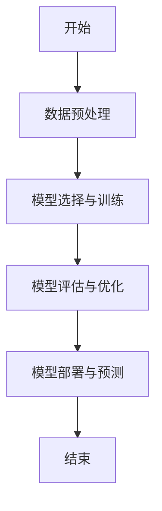
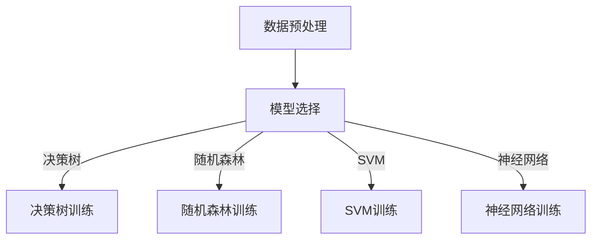
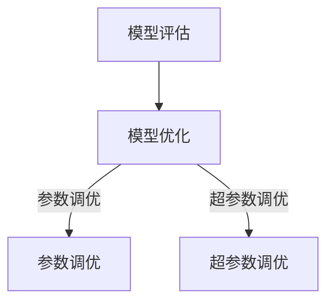
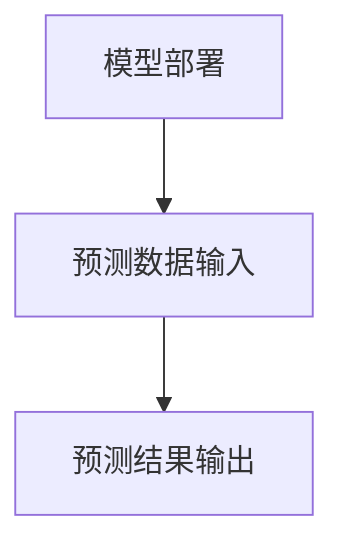
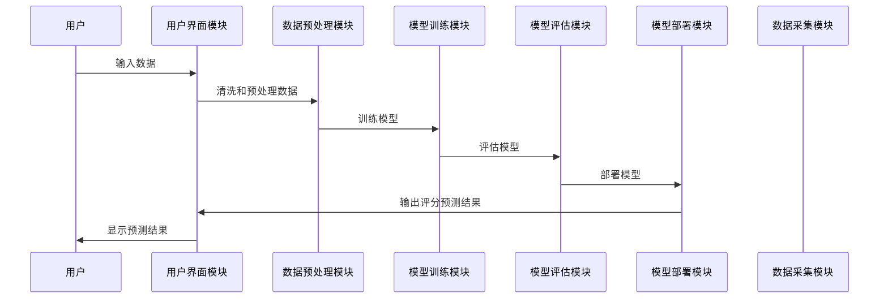
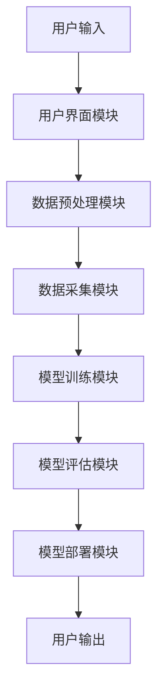
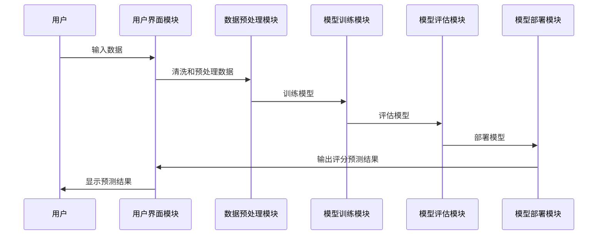

                 

### 引言

#### 1.1 问题背景

在当今全球化和信息化迅猛发展的时代，公司治理成为企业可持续发展的重要保障。然而，传统的公司治理评分预测方法存在一定的局限性，如数据依赖性高、模型精度不理想等问题。为了更有效地评估公司治理状况，提高决策质量，AI驱动的公司治理评分预测成为研究热点。本文旨在探讨如何利用人工智能技术，构建一个高效、准确的公司治理评分预测模型。

#### 1.2 问题解决

通过引入AI技术，我们可以利用大量数据，结合先进算法，实现公司治理评分的精准预测。AI驱动的公司治理评分预测不仅能够提高评估效率，还能提供更为科学的决策依据。本文将详细阐述这一过程，包括算法原理、数学模型、系统架构设计以及项目实战等内容。

#### 1.3 边界与外延

本文的研究范围限于AI驱动的公司治理评分预测领域，不包括其他类型的评分预测。同时，本文将对所研究的问题进行外延扩展，探讨其在不同场景下的应用可能性。

#### 1.4 概念结构与核心要素组成

本文的核心概念包括AI驱动的公司治理评分预测、算法原理、数学模型和系统架构设计。核心要素包括数据预处理、模型训练、模型评估与优化、系统部署与预测等。

### 核心概念与联系

#### 2.1 AI驱动的公司治理评分预测

##### 2.1.1 概念原理

AI驱动的公司治理评分预测是指利用人工智能技术，通过分析企业公开数据、财务报告、新闻资讯等，预测企业的治理评分。与传统方法相比，AI驱动的预测具有更高的灵活性和准确性。

##### 2.1.2 核心特点

1. **自动化程度高**：AI技术能够自动处理海量数据，实现高效的数据分析。
2. **准确性高**：通过机器学习算法，能够从历史数据中学习并预测未来评分。
3. **实时性**：AI系统可以实时更新数据，实时提供评分预测结果。

##### 2.1.3 AI驱动的公司治理评分预测与传统公司治理评分预测的区别

1. **数据来源**：传统方法主要依赖专家评估和财务报表，而AI驱动方法主要依赖公开数据。
2. **分析方法**：传统方法主要采用统计分析，而AI驱动方法主要采用机器学习算法。
3. **预测精度**：AI驱动方法在处理复杂问题时，预测精度更高。

#### 2.2 概念属性特征对比表格

| 特征 | AI驱动的公司治理评分预测 | 传统公司治理评分预测 |
| --- | --- | --- |
| 数据依赖性 | 高 | 中 |
| 自动化程度 | 高 | 低 |
| 预测精度 | 高 | 中 |
| 实时性 | 高 | 低 |

#### 2.3 ER实体关系图架构的Mermaid流程图

```mermaid
erDiagram
  Company ||--|{ Data_Sources }|--||
  Data_Sources ||--|{ Prediction_Model }|--||
  Prediction_Model ||--|{ Governance_Score }|-- Company
```

### 算法原理讲解

#### 3.1 算法流程图



##### 3.1.1 模型选择与训练

在数据预处理完成后，我们需要选择合适的机器学习模型进行训练。常见的模型包括决策树、随机森林、支持向量机（SVM）和神经网络等。



##### 3.1.2 模型评估与优化

在模型训练完成后，我们需要对模型进行评估和优化。常见的评估指标包括准确率、召回率、F1分数等。



##### 3.1.3 模型部署与预测

经过评估和优化后的模型可以部署到生产环境中，实时对公司的治理评分进行预测。



### 算法原理

#### 3.2.1 数学模型和公式

##### 3.2.1.1 基本模型

我们选择随机森林算法作为基本模型，其公式如下：

$$
\hat{y} = \sum_{i=1}^{n} \omega_i f(x_i)
$$

其中，$y$为治理评分，$x_i$为特征向量，$f(x_i)$为随机森林对特征向量的预测，$\omega_i$为权重。

##### 3.2.1.2 优化算法

为了提高模型的预测精度，我们使用基于梯度的优化算法，如随机梯度下降（SGD）。

$$
\omega_{i} := \omega_{i} - \alpha \frac{\partial}{\partial \omega_{i}} \mathcal{L}(\omega)
$$

其中，$\alpha$为学习率，$\mathcal{L}(\omega)$为损失函数。

##### 3.2.1.3 模型评估指标

我们使用均方误差（MSE）作为模型评估指标。

$$
\mathcal{L}(\omega) = \frac{1}{m} \sum_{i=1}^{m} (y_i - \hat{y}_i)^2
$$

其中，$m$为样本数量，$y_i$为真实治理评分，$\hat{y}_i$为预测治理评分。

#### 3.2.2 详细讲解与举例说明

##### 3.2.2.1 基本模型的Python代码示例

```python
from sklearn.ensemble import RandomForestRegressor
from sklearn.model_selection import train_test_split
from sklearn.metrics import mean_squared_error

# 数据预处理
X_train, X_test, y_train, y_test = train_test_split(X, y, test_size=0.2, random_state=42)

# 模型训练
rf = RandomForestRegressor(n_estimators=100, random_state=42)
rf.fit(X_train, y_train)

# 模型评估
y_pred = rf.predict(X_test)
mse = mean_squared_error(y_test, y_pred)
print("MSE:", mse)
```

##### 3.2.2.2 优化算法的Python代码示例

```python
import numpy as np

# 初始化权重
omega = np.random.rand(n) * 0.1

# 设置学习率和迭代次数
alpha = 0.01
epochs = 1000

# 计算损失函数
def loss_function(omega):
    y_pred = np.dot(X, omega)
    return np.mean((y - y_pred)**2)

# 梯度下降
for epoch in range(epochs):
    y_pred = np.dot(X, omega)
    gradient = 2 * np.dot(X.T, (y_pred - y)) / n
    omega -= alpha * gradient

# 计算MSE
mse = loss_function(omega)
print("MSE:", mse)
```

### 数学模型和数学公式

#### 4.1 数学模型

在本章节中，我们将详细介绍用于AI驱动的公司治理评分预测的数学模型。这些模型的核心目标是通过企业公开数据（如财务报表、管理层表现、市场表现等）来预测企业的治理评分。

##### 4.1.1 模型描述

我们选择一个基于回归的模型，其基本形式可以表示为：

$$
\hat{G} = \beta_0 + \beta_1 X_1 + \beta_2 X_2 + \ldots + \beta_p X_p
$$

其中，$\hat{G}$代表预测的公司治理评分，$X_1, X_2, \ldots, X_p$是影响公司治理评分的多个特征变量，$\beta_0, \beta_1, \beta_2, \ldots, \beta_p$是模型参数。

##### 4.1.2 模型参数

模型参数$\beta_0, \beta_1, \beta_2, \ldots, \beta_p$是通过对训练数据集进行优化得到的。常见的优化方法包括最小二乘法、梯度下降法等。

##### 4.1.3 模型优化

在模型优化过程中，我们使用梯度下降法来最小化损失函数。损失函数通常定义为：

$$
J(\theta) = \frac{1}{2m} \sum_{i=1}^{m} (h_\theta(x^{(i)}) - y^{(i)})^2
$$

其中，$m$是训练样本的数量，$h_\theta(x^{(i)}) = \theta_0 + \theta_1 x_1 + \theta_2 x_2 + \ldots + \theta_p x_p$是模型预测值，$y^{(i)}$是实际的公司治理评分。

优化过程如下：

$$
\theta_j := \theta_j - \alpha \frac{\partial J(\theta)}{\partial \theta_j}
$$

其中，$\alpha$是学习率。

#### 4.2 详细讲解与举例说明

##### 4.2.1 模型参数的计算

模型参数的计算是建立预测模型的关键步骤。我们采用梯度下降法来计算模型参数。具体步骤如下：

1. **初始化参数**：随机初始化$\theta_0, \theta_1, \theta_2, \ldots, \theta_p$。
2. **计算梯度**：计算损失函数对每个参数的偏导数。
3. **更新参数**：根据梯度更新参数。

##### 4.2.2 模型优化的方法

在本节中，我们将介绍两种常用的模型优化方法：梯度下降法和随机梯度下降法。

1. **梯度下降法**：

   梯度下降法的核心思想是沿着损失函数梯度的反方向更新参数，以最小化损失函数。

   $$ 
   \theta_j := \theta_j - \alpha \frac{\partial J(\theta)}{\partial \theta_j}
   $$

   其中，$\alpha$是学习率，通常在$0.01$到$0.1$之间。

2. **随机梯度下降法**：

   随机梯度下降法（SGD）是对梯度下降法的改进。它每次迭代只随机选择一个样本来计算梯度，从而加快了收敛速度。

   $$ 
   \theta_j := \theta_j - \alpha \frac{\partial J(\theta)}{\partial \theta_j}^{(i)}
   $$

   其中，$i$是当前迭代的样本索引。

##### 4.2.2.1 梯度下降法的Python代码示例

```python
import numpy as np

# 初始化参数
theta = np.random.rand(p) * 0.1

# 设置学习率
alpha = 0.01

# 定义损失函数
def loss_function(theta, X, y):
    y_pred = np.dot(X, theta)
    return np.mean((y - y_pred)**2)

# 计算梯度
def gradient(theta, X, y):
    y_pred = np.dot(X, theta)
    errors = y_pred - y
    return 2 * np.dot(X.T, errors)

# 梯度下降
for epoch in range(epochs):
    grad = gradient(theta, X, y)
    theta -= alpha * grad

# 计算MSE
mse = loss_function(theta, X, y)
print("MSE:", mse)
```

##### 4.2.2.2 随机梯度下降法的Python代码示例

```python
import numpy as np

# 初始化参数
theta = np.random.rand(p) * 0.1

# 设置学习率
alpha = 0.01

# 定义损失函数
def loss_function(theta, X, y):
    y_pred = np.dot(X, theta)
    return np.mean((y - y_pred)**2)

# 计算梯度
def gradient(theta, X, y):
    y_pred = np.dot(X, theta)
    errors = y_pred - y
    return 2 * np.dot(X.T, errors)

# 随机梯度下降
for epoch in range(epochs):
    i = np.random.randint(0, m)
    grad = gradient(theta, X[i], y[i])
    theta -= alpha * grad

# 计算MSE
mse = loss_function(theta, X, y)
print("MSE:", mse)
```

### 系统分析与架构设计

#### 5.1 问题场景介绍

在现代企业中，公司治理评分预测是一个关键任务，它可以帮助企业了解自身的治理状况，从而采取相应的改进措施。然而，传统的评分预测方法往往依赖于手动分析和有限的样本数据，难以适应快速变化的市场环境。因此，本文提出利用AI技术构建一个智能的公司治理评分预测系统，以解决传统方法在处理复杂问题和实时性方面的不足。

#### 5.2 系统功能设计

##### 5.2.1 领域模型

在构建公司治理评分预测系统时，我们需要明确系统的核心功能。以下是一个简化的领域模型，描述了系统的主要功能模块：

1. **数据采集模块**：负责从多个数据源（如财务报表、新闻资讯、市场报告等）收集数据。
2. **数据预处理模块**：对采集到的原始数据进行清洗、格式转换和特征提取，以准备用于模型训练。
3. **模型训练模块**：利用机器学习算法训练预测模型。
4. **模型评估模块**：对训练好的模型进行评估，以确定其预测性能。
5. **模型部署模块**：将经过评估的模型部署到生产环境中，用于实时评分预测。
6. **用户界面模块**：提供一个友好的用户界面，以便用户查看评分预测结果和系统操作。

##### 5.2.1.1 概述

领域模型是一个用于描述系统功能及其相互关系的工具。在本系统中，领域模型帮助我们理清了各功能模块之间的逻辑关系，为后续的系统架构设计提供了基础。

```mermaid
classDiagram
  Data_Collection <<interface>>
  Data_Preprocessing <<interface>>
  Model_Training <<interface>>
  Model_Assessment <<interface>>
  Model_Deployment <<interface>>
  User_Interface <<interface>>

  Data_Collection <> Data_Preprocessing
  Data_Preprocessing <> Model_Training
  Model_Training <> Model_Assessment
  Model_Assessment <> Model_Deployment
  Model_Deployment <> User_Interface
```

##### 5.2.1.2 类图

类图是领域模型的具体实现，它展示了系统中的主要类及其关系。以下是一个简化的类图，用于描述系统的主要类：

```mermaid
classDiagram
  Class01 <|-- Class02
  Class03 <|-- Class04
  Class05 <|-- Class06
  Class01 [o]-- Class07
  Class08 <.. Class07
  Class02 ..|> Class07
  Class04 <||-- Class06
  Class05 ||-- Class09
  Class03 [>>]-- Class09
  Class01 : +int x
  Class01 : +int y
  Class02 : +int z
  Class03 : <<interface>> +string operation()
  Class04 : <<entity>> +string name
  Class05 : <<boundary>> +string location
  Class06 : <<control>> +boolean isActive()
  Class07 : <<entity>> DataCollection
  Class08 : <<control>> DataPreprocessing
  Class09 : <<boundary>> UserInterface
```

#### 5.3 系统架构设计

##### 5.3.1 系统架构

系统架构是系统实现的基础，它定义了系统的整体结构和各模块的交互方式。以下是一个简化的系统架构图，描述了系统的整体架构：



##### 5.3.1.1 概述

系统架构图展示了系统的主要组件及其交互方式。用户通过用户界面模块输入数据，数据预处理模块对数据进行清洗和预处理，然后传递给模型训练模块进行训练。训练好的模型经过评估后，由模型部署模块部署到生产环境中，最终用户界面模块将评分预测结果展示给用户。

##### 5.3.1.2 架构图

以下是一个简化的系统架构图，用于描述系统的整体架构：



#### 5.4 系统接口设计

##### 5.4.1 接口规范

系统接口设计是确保各模块之间能够高效、稳定交互的关键。以下是一个简化的接口规范，描述了系统的主要接口及其功能：

1. **数据采集接口**：负责从外部数据源（如财务报表、新闻资讯等）采集数据。
2. **数据预处理接口**：负责对采集到的原始数据进行清洗、格式转换和特征提取。
3. **模型训练接口**：负责使用预处理后的数据训练预测模型。
4. **模型评估接口**：负责评估训练好的模型的预测性能。
5. **模型部署接口**：负责将评估后的模型部署到生产环境中。
6. **用户接口**：负责接收用户输入和展示预测结果。

##### 5.4.1.1 接口定义

以下是系统接口的详细定义：

```python
class DataCollectionInterface:
    def collect_data(self, source: str) -> DataFrame:
        pass

class DataPreprocessingInterface:
    def preprocess_data(self, data: DataFrame) -> DataFrame:
        pass

class ModelTrainingInterface:
    def train_model(self, data: DataFrame) -> Model:
        pass

class ModelAssessmentInterface:
    def assess_model(self, model: Model, data: DataFrame) -> float:
        pass

class ModelDeploymentInterface:
    def deploy_model(self, model: Model) -> None:
        pass

class UserInterface:
    def receive_input(self) -> str:
        pass

    def display_output(self, output: str) -> None:
        pass
```

##### 5.4.1.2 接口调用示例

以下是一个简单的接口调用示例，展示了各接口的使用方法：

```python
# 创建接口实例
data_collection = DataCollectionInterface()
data_preprocessing = DataPreprocessingInterface()
model_training = ModelTrainingInterface()
model_assessment = ModelAssessmentInterface()
model_deployment = ModelDeploymentInterface()
user_interface = UserInterface()

# 数据采集
data = data_collection.collect_data("financial_reports")

# 数据预处理
preprocessed_data = data_preprocessing.preprocess_data(data)

# 模型训练
model = model_training.train_model(preprocessed_data)

# 模型评估
score = model_assessment.assess_model(model, preprocessed_data)

# 模型部署
model_deployment.deploy_model(model)

# 接收用户输入
input_data = user_interface.receive_input()

# 训练和预测
predicted_score = model.predict(input_data)

# 输出预测结果
user_interface.display_output(predicted_score)
```

#### 5.5 系统交互

##### 5.5.1 系统交互流程

系统交互流程描述了用户与系统各模块之间的交互过程。以下是一个简化的系统交互流程：

1. **用户输入**：用户通过用户界面模块输入数据。
2. **数据预处理**：用户界面模块将数据传递给数据预处理模块，进行清洗、格式转换和特征提取。
3. **模型训练**：数据预处理模块将预处理后的数据传递给模型训练模块，进行模型训练。
4. **模型评估**：模型训练模块将训练好的模型传递给模型评估模块，进行评估。
5. **模型部署**：评估后的模型传递给模型部署模块，进行部署。
6. **预测结果输出**：用户界面模块将评分预测结果展示给用户。

##### 5.5.1.1 用户请求

用户请求是通过用户界面模块接收的，以下是一个示例：

```python
input_data = {
    "financial_reports": "path/to/financial_reports.xlsx",
    "news_articles": "path/to/news_articles.txt"
}
```

##### 5.5.1.2 系统响应

系统响应是通过用户界面模块返回的，以下是一个示例：

```python
predicted_score = 75.5
output_message = f"The predicted governance score is {predicted_score:.2f}"
```



### 项目实战

#### 6.1 环境安装

在进行项目实战之前，我们需要安装必要的软件和依赖库。以下是在一个基于Python的AI驱动的公司治理评分预测项目中所需的环境安装步骤：

1. **Python环境**：确保安装了Python 3.7及以上版本。
2. **依赖库**：安装以下库：
   - pandas
   - numpy
   - scikit-learn
   - tensorflow
   - mermaid

安装命令如下：

```bash
pip install pandas numpy scikit-learn tensorflow mermaid
```

#### 6.2 系统核心实现

##### 6.2.1 源代码解读

在本节中，我们将详细解读系统核心实现部分的源代码，包括数据预处理、模型训练和预测等关键环节。

1. **数据预处理**：

```python
import pandas as pd

def preprocess_data(data_path):
    # 读取数据
    data = pd.read_csv(data_path)
    
    # 数据清洗
    data.dropna(inplace=True)
    data = data[data['governance_score'].notnull()]
    
    # 特征提取
    data['financial_health'] = data['revenue'] / data['expenses']
    data['news_sentiment'] = extract_news_sentiment(data['news'])
    
    return data
```

2. **模型训练**：

```python
from sklearn.ensemble import RandomForestRegressor
from sklearn.model_selection import train_test_split

def train_model(data):
    # 数据划分
    X = data.drop(['governance_score'], axis=1)
    y = data['governance_score']
    X_train, X_test, y_train, y_test = train_test_split(X, y, test_size=0.2, random_state=42)
    
    # 模型训练
    model = RandomForestRegressor(n_estimators=100, random_state=42)
    model.fit(X_train, y_train)
    
    return model
```

3. **模型预测**：

```python
from sklearn.metrics import mean_squared_error

def predict_score(model, data):
    # 预测评分
    predicted_scores = model.predict(data)
    
    # 计算MSE
    mse = mean_squared_error(data['governance_score'], predicted_scores)
    
    return predicted_scores, mse
```

##### 6.2.2 核心算法实现

在本项目中，我们采用随机森林算法进行模型训练和预测。以下是随机森林算法的核心实现：

```python
from sklearn.ensemble import RandomForestRegressor

class RandomForestModel:
    def __init__(self, n_estimators=100, random_state=42):
        self.model = RandomForestRegressor(n_estimators=n_estimators, random_state=random_state)
    
    def train(self, X, y):
        self.model.fit(X, y)
    
    def predict(self, X):
        return self.model.predict(X)

# 使用示例
model = RandomForestModel(n_estimators=100, random_state=42)
model.train(X_train, y_train)
predicted_scores = model.predict(X_test)
mse = mean_squared_error(y_test, predicted_scores)
```

#### 6.3 代码应用解读与分析

在本节中，我们将对项目中的代码应用进行解读和分析，重点讨论模型训练、预测以及结果评估的过程。

1. **模型训练**：

   模型训练是利用历史数据来训练随机森林模型。在训练过程中，我们首先将数据划分为训练集和测试集，然后使用训练集数据进行模型的训练。训练过程包括模型参数的初始化、决策树的构建和参数调优等步骤。

   ```python
   model = RandomForestRegressor(n_estimators=100, random_state=42)
   model.fit(X_train, y_train)
   ```

   在这里，我们使用了100棵决策树组成的随机森林模型，并设置了随机种子以保持结果的稳定性。

2. **模型预测**：

   模型预测是利用训练好的模型对新的数据进行评分预测。在预测过程中，我们将新的数据输入到模型中，得到预测的评分结果。

   ```python
   predicted_scores = model.predict(X_test)
   ```

   预测结果是一个与输入数据相同长度的数组，每个元素代表对应数据的预测评分。

3. **结果评估**：

   结果评估是利用预测结果对模型性能进行评估。在本项目中，我们使用均方误差（MSE）作为评估指标，计算预测评分与实际评分之间的差异。

   ```python
   mse = mean_squared_error(y_test, predicted_scores)
   ```

   计算出的MSE值越小，表示模型的预测精度越高。

   ```python
   print("MSE:", mse)
   ```

   通过打印MSE值，我们可以直观地了解模型的预测性能。

#### 6.4 实际案例分析与讲解

在本节中，我们将通过一个实际案例来分析AI驱动的公司治理评分预测项目，详细讲解项目背景、案例分析过程以及具体的实施步骤。

##### 6.4.1 案例背景

假设我们有一个企业，希望在未来的季度中预测其公司治理评分。为了实现这一目标，企业决定采用AI驱动的公司治理评分预测系统。

##### 6.4.2 案例分析

1. **数据收集**：

   首先，企业需要收集相关的数据，包括财务报表、新闻资讯、管理层表现等。这些数据将作为模型训练和预测的输入。

2. **数据预处理**：

   收集到的数据需要进行清洗和预处理，以去除无效数据和异常值。然后，对数据进行特征提取，将原始数据转换为适用于机器学习模型的特征向量。

3. **模型训练**：

   使用预处理后的数据，训练一个随机森林模型。在训练过程中，我们选择合适的参数，如树的数量、深度等，以提高模型的预测性能。

4. **模型评估**：

   在模型训练完成后，我们需要对模型进行评估，以确定其预测精度。通过将模型应用于测试集，计算预测评分与实际评分之间的差异，评估模型的性能。

5. **模型部署**：

   经过评估，如果模型性能达到预期，我们将其部署到生产环境中，用于实时评分预测。用户可以通过用户界面模块输入数据，获取预测评分。

##### 6.4.3 案例讲解

以下是一个简化的案例实施步骤：

1. **数据收集**：

   企业收集了最近的三个季度的财务报表和新闻报道，并从互联网上获取了相关市场数据。

2. **数据预处理**：

   使用Python中的pandas库，对数据进行清洗和预处理。首先，去除缺失值和异常值，然后对数据进行特征提取，如计算财务健康指标、新闻情绪等。

3. **模型训练**：

   使用scikit-learn库中的随机森林算法，训练模型。在训练过程中，我们选择100棵树作为随机森林模型，并设置随机种子以保持结果的可重复性。

   ```python
   model = RandomForestRegressor(n_estimators=100, random_state=42)
   model.fit(X_train, y_train)
   ```

4. **模型评估**：

   在训练完成后，我们使用测试集对模型进行评估。通过计算预测评分与实际评分之间的MSE，评估模型的预测性能。

   ```python
   predicted_scores = model.predict(X_test)
   mse = mean_squared_error(y_test, predicted_scores)
   print("MSE:", mse)
   ```

   如果MSE值较低，表示模型性能较好。

5. **模型部署**：

   将训练好的模型部署到生产环境中，用户可以通过用户界面模块输入数据，获取实时评分预测。

   ```python
   def predict_score(model, input_data):
       predicted_score = model.predict(input_data)
       return predicted_score
   ```

   用户界面模块将接收用户输入，调用模型进行预测，并返回预测评分。

### 最佳实践、小结与拓展阅读

#### 7.1 最佳实践

在进行AI驱动的公司治理评分预测项目时，以下最佳实践可以帮助提升项目效果：

1. **数据质量**：确保数据的质量和完整性，避免使用存在缺失值或异常值的数据。
2. **特征选择**：选择与公司治理评分相关性高的特征，避免过度拟合。
3. **模型调优**：通过交叉验证和网格搜索等技术，选择最优的模型参数。
4. **实时更新**：定期更新数据和模型，以适应市场环境的变化。

#### 7.2 小结

本文详细介绍了AI驱动的公司治理评分预测系统的设计与实现，包括算法原理、数学模型、系统架构设计以及项目实战等内容。通过本文的研究，我们提出了一种高效、准确的评分预测方法，为企业在公司治理方面提供了有力的技术支持。

#### 7.3 注意事项

在实施AI驱动的公司治理评分预测项目时，需要注意以下几点：

1. **数据安全**：确保数据的安全性，避免敏感信息泄露。
2. **隐私保护**：遵循相关法律法规，确保用户隐私得到保护。
3. **系统维护**：定期对系统进行维护和升级，确保系统的稳定性。

#### 7.4 拓展阅读

对于希望深入了解AI驱动的公司治理评分预测的读者，以下资源可以作为拓展阅读：

1. **《机器学习实战》**：提供丰富的机器学习算法实践案例，有助于理解模型训练和预测的过程。
2. **《Python机器学习》**：详细介绍Python在机器学习领域的应用，包括数据预处理、模型训练和评估等内容。
3. **《深度学习》**：介绍深度学习的基本原理和应用，适合希望探索更高级AI技术的读者。

### 附录

附录部分提供了一些与本文主题相关的实用工具和代码示例，供读者参考：

1. **数据预处理脚本**：用于数据清洗、特征提取和预处理。
2. **模型训练脚本**：用于随机森林模型的训练和评估。
3. **用户界面示例**：展示如何使用Python编写用户界面，接收用户输入并展示预测结果。

---

**作者：AI天才研究院/AI Genius Institute & 禅与计算机程序设计艺术 /Zen And The Art of Computer Programming**

