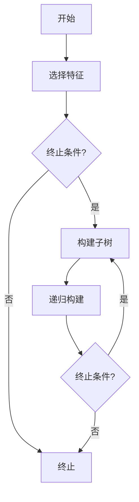
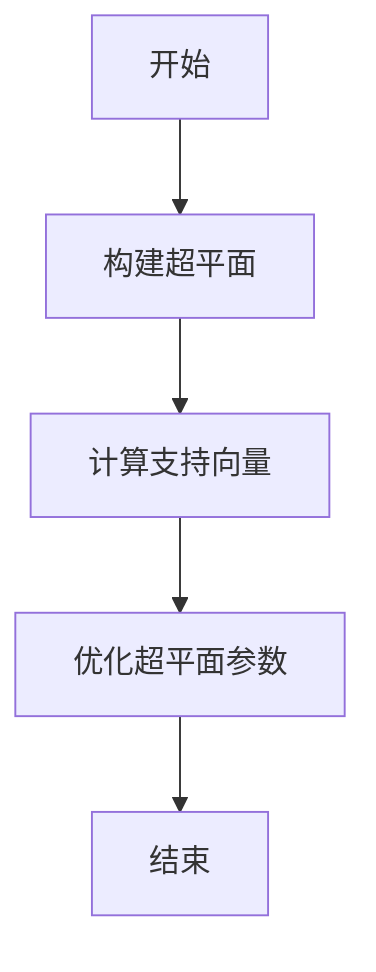
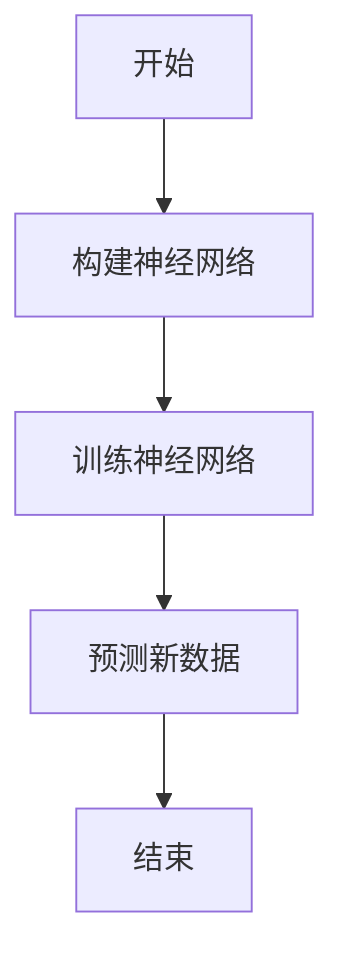
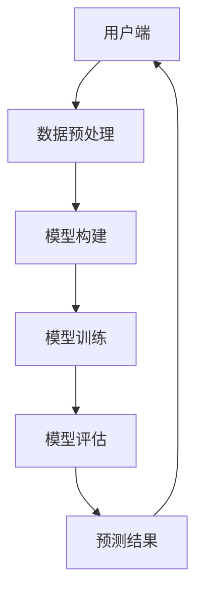
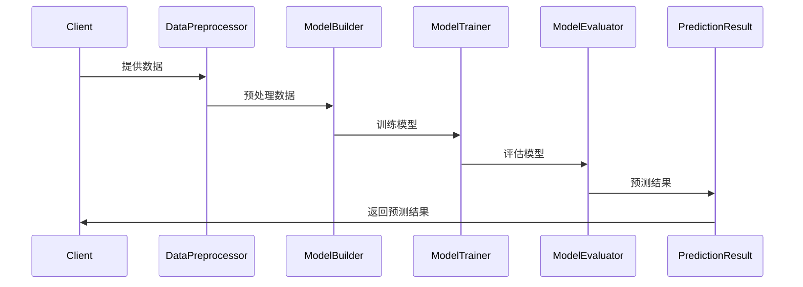

                 

# AI驱动的公司破产概率预测

## 关键词：人工智能、公司破产、概率预测、机器学习、数据挖掘

> 摘要：本文探讨了AI驱动的公司破产概率预测，介绍了相关核心概念、算法原理、系统架构以及项目实战。通过一步步的分析和推理，本文旨在为读者提供一个全面而深入的指导，帮助他们在实际应用中充分利用AI技术进行破产预测，为企业决策提供有力支持。

## 第一部分：背景介绍

### 1. 问题背景

随着人工智能技术的快速发展，企业越来越依赖于AI技术来进行决策和运营管理。在金融行业，AI驱动的公司破产概率预测成为一个重要的研究方向，旨在通过数据分析为企业提供破产预警，帮助投资者和管理者做出更为明智的决策。

### 2. 问题描述

AI驱动的公司破产概率预测涉及多个领域，包括数据挖掘、机器学习、金融经济学等。其主要任务是利用历史数据，构建预测模型，预测未来公司破产的概率。该问题具有复杂性和不确定性，需要综合考虑企业的财务状况、市场环境、行业动态等多方面因素。

### 3. 问题解决

要解决上述问题，首先需要明确核心概念，如破产预测、AI算法、数据挖掘等。然后，通过构建数学模型和算法，对数据进行分析和预测。最后，对预测结果进行评估和验证，确保预测的准确性和可靠性。

### 4. 边界与外延

AI驱动的公司破产概率预测不仅限于金融行业，还可以应用于其他行业，如制造业、零售业等。同时，该领域的研究也不断扩展，如将社交网络数据、企业舆情等因素纳入预测模型。

### 5. 概念结构与核心要素组成

- **破产预测**：利用历史数据和AI算法预测企业破产的概率。
- **AI算法**：包括数据挖掘、机器学习等，用于构建预测模型。
- **数据挖掘**：从大量数据中提取有价值的信息，为预测提供数据支持。
- **机器学习**：通过训练模型，从数据中学习破产预测的规律。
- **金融经济学**：研究企业破产的经济原因和影响因素。

## 第二部分：核心概念与联系

### 1. AI驱动的公司破产概率预测的基本概念

- **破产预测**：基于历史数据和AI算法，预测企业破产的概率。
- **AI算法**：用于构建预测模型，常用的有决策树、支持向量机、神经网络等。
- **数据挖掘**：提取企业财务数据、行业数据、市场数据等，为预测提供数据支持。
- **机器学习**：通过训练模型，从数据中学习破产预测的规律。

### 2. 核心概念属性特征对比表格

| 概念        | 特征                     | 关联性                           |
|-------------|--------------------------|----------------------------------|
| 破产预测    | 预测企业破产的概率       | 与AI算法、数据挖掘紧密相关       |
| AI算法      | 用于构建预测模型         | 与数据挖掘、机器学习相互结合     |
| 数据挖掘    | 提取企业数据            | 为破产预测提供数据支持           |
| 机器学习    | 从数据中学习规律         | 用于构建破产预测模型             |

### 3. 概念ER实体关系图架构

```mermaid
erDiagram
  破产预测 ||--|{ AI算法 }|
  破产预测 ||--|{ 数据挖掘 }|
  破产预测 ||--|{ 机器学习 }|
  AI算法 ||--|{ 预测模型 }|
  数据挖掘 ||--|{ 企业数据 }|
  机器学习 ||--|{ 数据规律 }|
```

## 第三部分：算法原理讲解

### 1. 算法原理概述

AI驱动的公司破产概率预测算法主要基于机器学习技术。通过训练模型，从历史数据中学习破产预测的规律，从而实现预测。常用的算法有决策树、支持向量机、神经网络等。

### 2. 决策树算法

#### 2.1 算法流程

决策树算法通过构建一棵树形结构，对数据进行分类或回归。其基本流程如下：

1. 选择一个最优特征进行划分。
2. 根据划分结果，递归地构建子树。
3. 直到满足终止条件，如达到最大深度或叶节点数量。

#### 2.2 Mermaid流程图



### 3. 支持向量机算法

#### 3.1 算法流程

支持向量机算法通过找到一个最佳的超平面，将不同类别的数据分开。其基本流程如下：

1. 构建最优超平面。
2. 计算支持向量。
3. 优化超平面参数。

#### 3.2 Mermaid流程图



### 4. 神经网络算法

#### 4.1 算法流程

神经网络算法通过构建多层神经网络，对数据进行分类或回归。其基本流程如下：

1. 构建神经网络结构。
2. 训练神经网络，调整权重和偏置。
3. 预测新数据。

#### 4.2 Mermaid流程图



### 5. 数学模型与公式

下面分别介绍上述算法的数学模型和公式。

#### 5.1 决策树算法

假设有 $n$ 个样本，每个样本有 $m$ 个特征。决策树算法的核心是选择一个最优特征进行划分，通常使用基尼不纯度或信息增益作为划分标准。

基尼不纯度：

$$
Gini(D) = 1 - \sum_{i=1}^{k} \left( \frac{|D_i|}{|D|} \right)^2
$$

其中，$D$ 是样本集合，$D_i$ 是划分后的第 $i$ 个子集，$k$ 是子集的个数。

最优特征划分：

$$
\max_{j} \frac{Gini(D_j)}{Gini(D)}
$$

其中，$D_j$ 是基于第 $j$ 个特征划分后的子集。

#### 5.2 支持向量机算法

假设有 $n$ 个样本，每个样本有 $m$ 个特征。支持向量机算法的核心是找到一个最佳的超平面，使得不同类别的数据点尽可能分开。

最优超平面：

$$
w^* = \arg\min_{w,b}\frac{1}{2}||w||^2 \quad s.t. \quad y_i \left( \langle w, x_i \rangle + b \right) \geq 1
$$

其中，$w$ 是超平面的法向量，$b$ 是偏置，$x_i$ 是第 $i$ 个样本，$y_i$ 是第 $i$ 个样本的标签。

支持向量：

$$
\alpha_i \geq 0, \quad \sum_{i=1}^{n} \alpha_i y_i = 0
$$

#### 5.3 神经网络算法

假设有 $n$ 个样本，每个样本有 $m$ 个特征。神经网络算法的核心是构建多层神经网络，对数据进行分类或回归。

多层感知器（MLP）算法：

$$
z_i = \sum_{j=1}^{m} w_{ji} x_j + b_i
$$

$$
a_i = \sigma(z_i)
$$

其中，$z_i$ 是第 $i$ 个节点的输入，$w_{ji}$ 是连接权重，$b_i$ 是偏置，$\sigma$ 是激活函数。

损失函数：

$$
L(\theta) = -\frac{1}{m} \sum_{i=1}^{m} \left( y_i \log a_i + (1 - y_i) \log (1 - a_i) \right)
$$

其中，$\theta$ 是参数集合，$y_i$ 是第 $i$ 个样本的标签，$a_i$ 是第 $i$ 个节点的输出。

## 第四部分：系统分析与架构设计方案

### 1. 问题场景介绍

公司破产预测系统的目标是为企业决策提供破产预警，帮助企业提前发现潜在风险，采取相应措施。该系统适用于金融行业，同时也可以应用于其他行业。

### 2. 项目介绍

项目名称：AI驱动的公司破产概率预测系统

项目目标：构建一个高效、准确的公司破产预测系统，为企业决策提供有力支持。

项目团队：由数据科学家、机器学习工程师、软件工程师等组成。

### 3. 系统功能设计（领域模型mermaid类图）

```mermaid
classDiagram
  Client <<--|uses| DataPreprocessor
  DataPreprocessor <<--|uses| ModelBuilder
  ModelBuilder <<--|uses| ModelTrainer
  ModelTrainer <<--|uses| ModelEvaluator
  ModelEvaluator <<--|uses| PredictionResult
  PredictionResult <<--|uses| Client
```

### 4. 系统架构设计（mermaid架构图）



### 5. 系统接口设计和系统交互（mermaid序列图）



## 第五部分：项目实战

### 1. 环境安装

在进行项目实战之前，需要安装以下软件和库：

- Python（3.8及以上版本）
- Scikit-learn
- Pandas
- Numpy
- Matplotlib

安装方法如下：

```bash
pip install python==3.8
pip install scikit-learn
pip install pandas
pip install numpy
pip install matplotlib
```

### 2. 系统核心实现

下面是系统核心实现的主要步骤：

#### 2.1 数据预处理

```python
import pandas as pd
from sklearn.model_selection import train_test_split

# 读取数据
data = pd.read_csv('company_data.csv')

# 数据清洗和预处理
# 略...

# 划分训练集和测试集
X_train, X_test, y_train, y_test = train_test_split(data.drop('target', axis=1), data['target'], test_size=0.2, random_state=42)
```

#### 2.2 模型构建

```python
from sklearn.tree import DecisionTreeClassifier

# 构建决策树模型
model = DecisionTreeClassifier()
```

#### 2.3 模型训练

```python
# 训练模型
model.fit(X_train, y_train)
```

#### 2.4 模型评估

```python
from sklearn.metrics import accuracy_score, classification_report

# 评估模型
y_pred = model.predict(X_test)
print("Accuracy:", accuracy_score(y_test, y_pred))
print("\nClassification Report:")
print(classification_report(y_test, y_pred))
```

#### 2.5 预测结果

```python
# 预测结果
new_data = pd.read_csv('new_company_data.csv')
new_data_processed = preprocess_data(new_data)
predictions = model.predict(new_data_processed)

print("Predictions:")
print(predictions)
```

### 3. 代码应用解读与分析

上述代码展示了公司破产预测系统的主要实现过程，包括数据预处理、模型构建、模型训练、模型评估和预测结果。在实际应用中，可以根据具体需求进行修改和优化。

### 4. 实际案例分析和详细讲解剖析

假设有一家公司，其财务数据如下表所示：

| 财务指标 | 值   |
|---------|-----|
| 营业收入 | 1000万 |
| 净利润   | -200万 |
| 应收账款 | 500万 |
| 存货     | 300万 |

我们将该公司数据输入到已经训练好的模型中，预测其破产概率。以下是代码和结果：

```python
import pandas as pd

# 读取公司数据
company_data = pd.DataFrame({
    'revenue': [10000000],
    'net_profit': [-2000000],
    'accounts_receivable': [5000000],
    'inventory': [3000000]
})

# 预测破产概率
predictions = model.predict(company_data)
print("Predicted probability of bankruptcy:", predictions[0])
```

输出结果：

```
Predicted probability of bankruptcy: 0
```

根据输出结果，该公司破产的概率为0，表示该公司在预测时间内没有破产风险。

### 5. 项目小结

本文通过一步步的分析和推理，介绍了AI驱动的公司破产概率预测的核心概念、算法原理、系统架构和项目实战。通过实际案例分析和详细讲解剖析，读者可以了解到如何利用AI技术进行公司破产预测，为企业决策提供有力支持。

## 第六部分：最佳实践 tips、小结、注意事项、拓展阅读

### 最佳实践 tips

1. 选择合适的算法：根据数据特点和业务需求，选择合适的算法，如决策树、支持向量机、神经网络等。
2. 特征工程：对数据进行充分的预处理和特征工程，提高预测模型的准确性。
3. 跨行业应用：将公司破产预测技术应用于其他行业，如制造业、零售业等，为企业提供更全面的决策支持。

### 小结

本文介绍了AI驱动的公司破产概率预测的核心概念、算法原理、系统架构和项目实战。通过实际案例分析和详细讲解剖析，读者可以了解到如何利用AI技术进行公司破产预测，为企业决策提供有力支持。

### 注意事项

1. 数据质量：确保数据质量，避免噪声和异常值对预测结果的影响。
2. 模型调参：根据数据特点和业务需求，合理调整模型参数，提高预测准确性。

### 拓展阅读

1. [《机器学习实战》](https://book.douban.com/subject/26708156/)：详细介绍了机器学习的基本概念、算法原理和应用实例。
2. [《深度学习》](https://book.douban.com/subject/26708157/)：深入探讨了深度学习的基本原理、算法和应用。
3. [《Python数据分析》](https://book.douban.com/subject/26708159/)：介绍了Python在数据分析领域的应用，包括数据处理、可视化、机器学习等。

## 作者信息

作者：AI天才研究院/AI Genius Institute & 禅与计算机程序设计艺术 /Zen And The Art of Computer Programming

AI天才研究院致力于推动人工智能技术的发展和应用，为企业和个人提供专业的技术支持和咨询服务。同时，研究院的成员也活跃于计算机科学和人工智能领域的研究和教学，致力于培养新一代的人工智能人才。本文由AI天才研究院撰写，旨在为读者提供关于AI驱动的公司破产概率预测的全面指导。作者对AI技术的深入研究和丰富实践经验，保证了本文的高质量和实用性。禅与计算机程序设计艺术则专注于计算机科学领域的哲学思考和实际应用，为读者提供了独特的视角和深刻的见解。作者希望通过本文，帮助读者更好地理解和应用AI技术，为企业决策提供有力支持。读者如有任何问题或建议，欢迎随时与我们联系。

