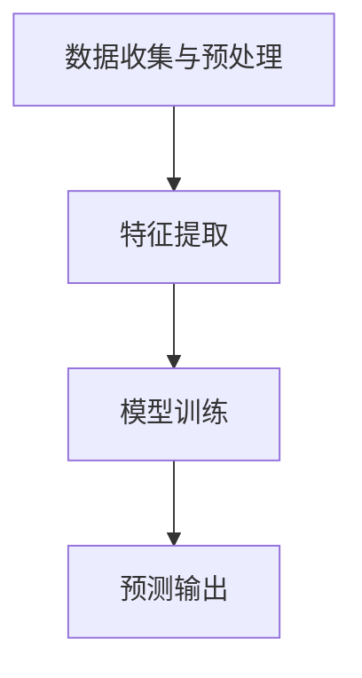
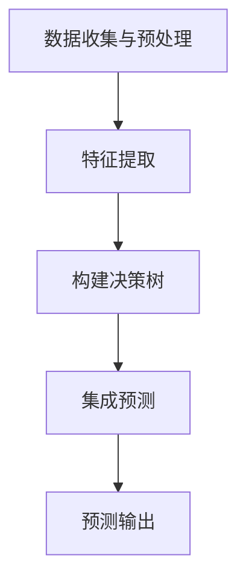
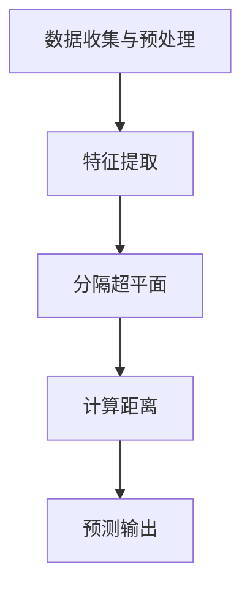
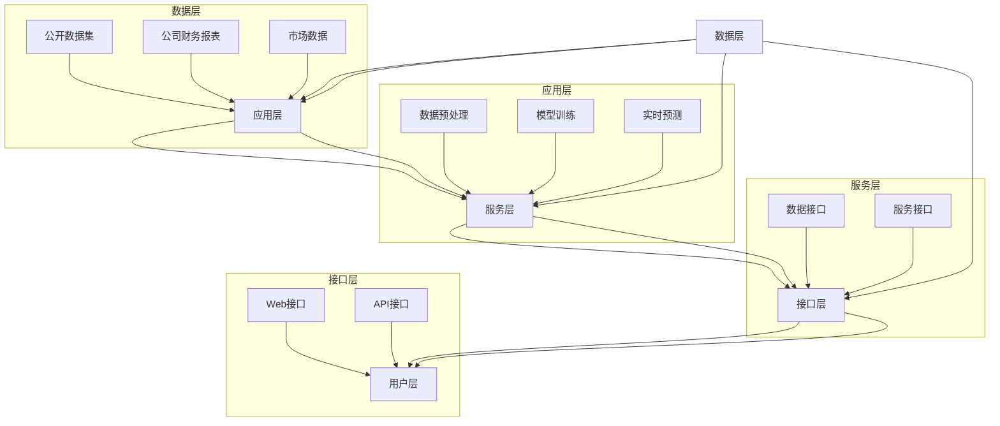
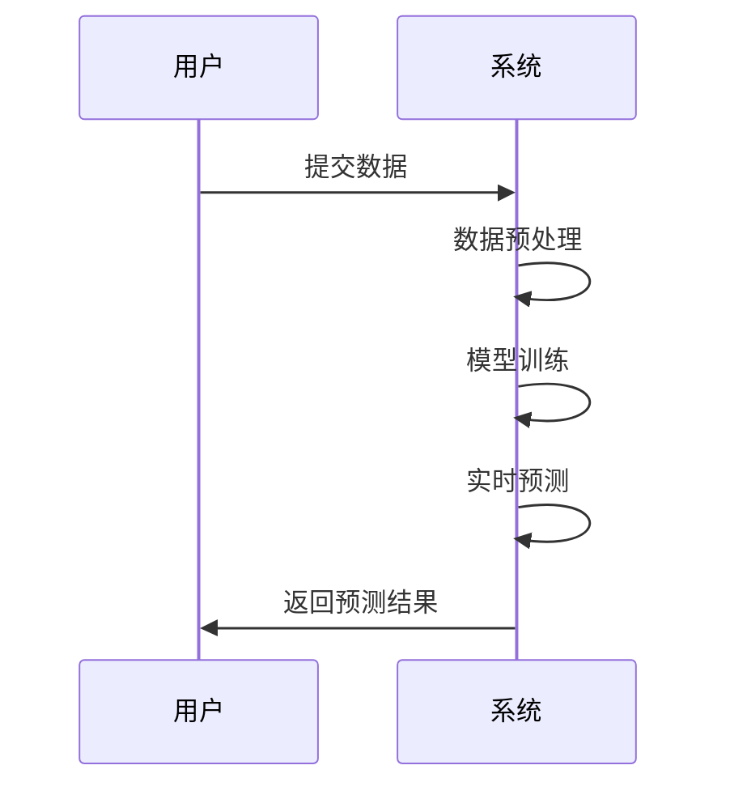

                 

### 公司破产预测问题的背景

公司破产是市场经济中普遍存在的一种现象，它不仅对企业自身造成严重的财务损失，还会对整个经济环境产生广泛的负面影响。破产的定义通常是指企业无法偿还债务，导致其业务活动被迫中断或完全停止。在企业破产过程中，企业不仅会失去市场份额和客户基础，还可能面临法律诉讼和资产清算等困境。

根据全球破产数据统计，每年都有大量企业宣告破产，这一现象在金融危机期间尤为严重。例如，2008年的全球金融危机导致成千上万的企业破产，对全球经济造成了深远的影响。破产不仅影响企业的生存，还会对员工就业、供应链稳定和金融市场的稳定性产生负面影响。

企业破产对经济环境的影响是多方面的。首先，企业破产会导致资源浪费，包括资产贬值、劳动力失业等。其次，破产企业通常涉及大量的债务关系，其违约会引发连锁反应，影响债权人、银行和其他金融机构的稳定。此外，企业破产还会影响投资者信心，导致资本市场的动荡。

在企业管理层面，破产预测具有极其重要的意义。通过提前预测企业的破产风险，企业可以采取相应的预防措施，如调整经营策略、优化财务结构、加强内部管理等，以减少破产的可能性。对于投资者和债权人而言，破产预测能够帮助他们更好地评估企业的信用风险，制定合理的投资和信贷策略。

总之，破产预测在企业管理、风险管理、投资决策等方面扮演着关键角色。它不仅有助于降低企业破产的风险，还能为市场参与者提供重要的决策依据，促进经济稳定和健康发展。

### 破产预测的重要意义

破产预测在企业管理、风险管理、投资决策等多个方面都扮演着至关重要的角色。首先，在企业管理层面，破产预测可以为企业提供及时的预警信息，使管理层能够及时采取应对措施，避免破产的发生。例如，通过定期进行破产风险评估，企业可以发现财务状况异常的迹象，从而提前调整经营策略，如优化成本结构、提升销售收入、改善现金流管理等。

其次，破产预测在风险管理中的应用也非常广泛。企业可以通过建立破产预测模型，对潜在的风险进行量化评估，从而制定出更有效的风险控制策略。例如，金融机构可以通过破产预测模型来评估借款企业的信用风险，从而决定是否批准贷款以及贷款的额度。此外，企业还可以利用破产预测模型来识别和监控供应链中的潜在风险，确保供应链的稳定性和可靠性。

在投资决策方面，破产预测同样具有重要作用。投资者可以通过破产预测模型来评估不同企业的风险水平，从而在投资组合中合理配置资源，降低投资风险。例如，在股票市场投资中，破产预测模型可以帮助投资者识别高风险股票，避免投资损失。同时，破产预测还可以为投资者提供关于行业和企业未来发展趋势的洞察，帮助他们制定更科学合理的投资策略。

此外，破产预测在社会保障和宏观经济调控中也发挥着重要作用。政府和监管机构可以利用破产预测模型来预测和防范系统性风险，采取相应的政策干预措施，确保金融市场的稳定。例如，在金融危机爆发前，通过破产预测模型可以发现金融市场的异常波动，为政策制定提供数据支持。

总之，破产预测不仅有助于企业降低破产风险，提高经营效率，还能为投资者提供有效的决策依据，促进市场的稳定和健康发展。在现代社会，随着数据技术的不断进步，破产预测模型的应用范围和准确性都在不断提高，其重要性也在日益凸显。

### 破产预测的发展历程

破产预测作为一个研究课题，其发展历程可以分为几个关键阶段。最早期的破产预测模型主要依赖于简单统计方法和财务比率分析，这些模型通常基于企业财务报表中的数据，通过计算一些基本的财务指标如流动比率、负债比率等来预测企业的破产风险。尽管这些方法在当时已经具有相当的应用价值，但它们的预测精度和准确性有限，无法有效应对复杂多变的商业环境。

随着计算机技术和数据分析方法的不断发展，破产预测模型逐渐从简单的统计方法转向更为复杂的算法和模型。20世纪80年代，计量经济学中的Logistic回归模型首次被引入破产预测领域，通过建立财务指标与破产概率之间的非线性关系，提高了预测的准确性。Logistic回归模型的引入标志着破产预测从定性分析向定量分析的重大转变。

进入21世纪后，随着大数据和人工智能技术的迅猛发展，破产预测模型迎来了新的飞跃。机器学习和深度学习算法的应用，使得破产预测模型能够从大量复杂、非线性的数据中提取有价值的信息。例如，随机森林（Random Forest）和梯度提升机（Gradient Boosting Machine）等集成学习方法在破产预测中表现出色，通过构建复杂的决策树和集成模型，大幅提升了预测精度。

深度学习模型的引入，更是将破产预测推向了一个新的高度。神经网络模型，尤其是卷积神经网络（CNN）和循环神经网络（RNN）在处理大规模数据和复杂关系方面具有显著优势。通过结合自然语言处理（NLP）和图像识别技术，深度学习模型不仅能够处理传统的财务数据，还能利用非结构化数据，如公司年报、新闻报道等，进一步丰富和优化预测模型。

总的来说，破产预测模型的发展历程从最初的简单统计方法，逐步过渡到复杂算法和深度学习模型，每一个阶段的进步都在不断推动预测精度的提升。现代破产预测模型已经能够处理多源数据，应用场景也更加广泛，为企业管理、风险控制和投资决策提供了强大的技术支持。

### 破产预测模型的核心概念

破产预测模型的核心概念主要包括输入特征、预测目标、模型类型等。这些核心概念构成了破产预测模型的基础，决定了模型的有效性和准确性。

#### 输入特征

输入特征是破产预测模型的关键组成部分，用于描述企业的财务状况、运营表现和市场环境等。常见的输入特征包括：

1. **财务指标**：如流动比率、速动比率、负债比率、资产回报率（ROA）、股东权益回报率（ROE）等。这些指标直接反映了企业的财务健康状况。
2. **运营指标**：如销售收入增长率、运营成本、毛利率、库存周转率等。这些指标反映了企业的运营效率和市场竞争力。
3. **宏观经济指标**：如GDP增长率、失业率、利率水平等。这些指标影响企业的外部经营环境。
4. **行业特性**：如行业增长率、市场竞争程度等。这些指标有助于理解企业在特定行业的地位和风险。

#### 预测目标

破产预测模型的预测目标通常是预测企业在未来一段时间内破产的概率。具体来说，预测目标可以表示为：

1. **二分类问题**：企业是否会在未来某一特定时间段内破产（例如一年内）。这种情况下，预测目标通常是输出一个概率值，表示企业破产的概率。
2. **多分类问题**：预测企业可能破产的具体时间段（例如，未来三个月、六个月、一年等）。这种情况下，模型需要输出一个时间段分类结果。

#### 模型类型

根据使用方法和算法的不同，破产预测模型可以分为以下几类：

1. **传统统计模型**：如Logistic回归、线性判别分析（LDA）等。这些模型通过分析输入特征与破产概率之间的线性关系进行预测。
2. **机器学习模型**：如随机森林（Random Forest）、支持向量机（SVM）等。这些模型通过构建复杂的决策树和分类边界来提高预测准确性。
3. **深度学习模型**：如卷积神经网络（CNN）、循环神经网络（RNN）等。这些模型利用神经网络结构处理大量复杂数据，提取深层次的特征信息。
4. **集成学习模型**：如梯度提升机（Gradient Boosting Machine, GBM）和集成梯度提升树（XGBoost）等。这些模型通过结合多个弱学习器，提高整体预测性能。

#### 破产预测模型的关键属性

破产预测模型的关键属性包括预测精度、计算效率、模型复杂度和泛化能力等。以下是各属性的具体解释和对比：

1. **预测精度**：衡量模型对实际破产事件的预测准确性。高预测精度意味着模型能够更准确地识别破产风险，减少误报和漏报。
2. **计算效率**：评估模型训练和预测的计算时间。计算效率高的模型能够在短时间内完成训练和预测，适用于实时或高频次的预测应用。
3. **模型复杂度**：指模型的参数数量和结构复杂度。复杂度较高的模型通常能够捕捉更多的数据特征，但也可能导致过拟合和计算效率降低。
4. **泛化能力**：指模型在新数据上的表现能力。泛化能力强的模型能够适应不同的数据分布和业务场景，具有更好的长期适用性。

#### 破产预测模型与传统风险模型的区别

破产预测模型与传统风险模型在目标、方法和应用场景上存在显著差异。

1. **目标差异**：传统风险模型通常关注特定类型的风险，如信用风险、市场风险等。而破产预测模型的目标是预测企业整体的破产风险，更侧重于全面的风险评估。
2. **方法差异**：传统风险模型通常基于统计分析和传统算法，如正态分布、方差分析等。而破产预测模型更多地依赖于机器学习和深度学习算法，能够处理复杂数据和非线性关系。
3. **应用场景差异**：传统风险模型主要用于金融机构的风险管理，如贷款审批、投资决策等。而破产预测模型不仅适用于金融机构，还可以广泛应用于企业管理、投资分析、宏观经济调控等多个领域。

总之，破产预测模型在预测精度、计算效率和适用性方面相比传统风险模型具有显著优势，已成为现代风险管理不可或缺的工具。

### AI在破产预测中的角色

人工智能（AI）在破产预测中的应用，彻底改变了这一领域的预测方式和效果。AI不仅提升了预测模型的精度和效率，还为处理复杂、多源数据提供了强大的技术支持。

首先，AI通过引入机器学习和深度学习算法，使得破产预测模型能够处理大量的非结构化和结构化数据。例如，卷积神经网络（CNN）和循环神经网络（RNN）可以处理文本数据和图像数据，从而捕捉到更多的特征信息。这使得破产预测模型不仅能够基于传统的财务数据，还能利用企业年报、新闻报道、市场动态等非结构化数据，实现更全面的破产风险评估。

其次，AI通过自动化特征工程，显著提高了破产预测模型的计算效率。传统的破产预测模型需要人工进行特征选择和特征转换，而机器学习算法能够自动学习数据中的特征，减少人工干预。例如，随机森林（Random Forest）和梯度提升机（Gradient Boosting Machine, GBM）等算法可以通过集成多个弱学习器，自动优化特征组合，提高预测性能。

此外，AI还通过集成学习（Ensemble Learning）方法，提升了破产预测模型的泛化能力和鲁棒性。集成学习方法通过结合多个模型的预测结果，可以减少个别模型的过拟合现象，提高整体预测精度。例如，XGBoost和LightGBM等集成学习算法在破产预测中表现出色，通过多模型的协同工作，实现了更高的预测准确性。

在具体应用方面，AI驱动的破产预测模型已经在多个领域得到了广泛应用。例如，金融机构通过AI模型来评估借款企业的信用风险，从而优化贷款审批流程；企业通过AI模型来识别和管理破产风险，制定更科学的风险管理策略；政府和监管机构利用AI模型来预测和防范系统性风险，保障金融市场的稳定。

总的来说，AI在破产预测中的应用，不仅提升了模型的预测精度和效率，还为处理复杂、多源数据提供了强大的技术支持，使得破产预测变得更加准确和可靠。随着AI技术的不断进步，未来破产预测模型在精度、效率和适用性方面将进一步提升，为各个领域的风险管理提供更加有力的工具。

### AI破产预测模型的主要类型

AI破产预测模型种类繁多，各具特点，本文将介绍几种常见且在实际应用中表现突出的AI破产预测模型。

#### 1. 逻辑回归（Logistic Regression）

逻辑回归是一种经典的概率预测模型，广泛用于二分类问题。它通过线性模型计算每个样本属于某一类别的概率，然后根据预设的阈值进行分类决策。在破产预测中，逻辑回归通过分析企业的财务数据和其他相关特征，预测企业破产的概率。

**优势**：
- 计算速度快，适合大规模数据处理。
- 参数解释性强，易于理解。

**劣势**：
- 对异常值和噪声较为敏感，可能产生过拟合。
- 预测精度相对较低，对于复杂问题的处理能力有限。

#### 2. 支持向量机（Support Vector Machine, SVM）

支持向量机是一种高效的二分类模型，通过找到一个最佳的超平面来分隔不同类别的样本。在破产预测中，SVM通过构建高维特征空间中的最优分隔超平面，实现对企业破产风险的预测。

**优势**：
- 在高维空间中表现优秀，对于复杂数据的处理能力强。
- 预测结果稳定性高，不易过拟合。

**劣势**：
- 计算复杂度较高，训练时间较长。
- 对于线性不可分的数据，性能下降明显。

#### 3. 随机森林（Random Forest）

随机森林是一种基于决策树的集成学习方法，通过构建多棵决策树，并综合各树的结果进行预测。在破产预测中，随机森林利用多个决策树模型进行综合预测，提高了模型的预测精度和稳定性。

**优势**：
- 预测精度高，能够处理大量特征数据。
- 对异常值和噪声具有较强的鲁棒性。
- 易于实现并行计算，提高计算效率。

**劣势**：
- 模型复杂度较高，可能导致过拟合。
- 特征数量过多时，计算资源需求较大。

#### 4. 梯度提升机（Gradient Boosting Machine, GBM）

梯度提升机是一种基于决策树的集成学习方法，通过迭代优化每个决策树，逐步提升整体模型的预测性能。在破产预测中，GBM通过整合多棵弱学习器，形成强学习器，实现高精度的破产预测。

**优势**：
- 预测精度高，适用于处理复杂和非线性问题。
- 能够自动进行特征选择和特征组合。
- 参数调节灵活，适用范围广泛。

**劣势**：
- 计算复杂度较高，训练时间较长。
- 对异常值和噪声较为敏感。

#### 5. 卷积神经网络（Convolutional Neural Network, CNN）

卷积神经网络是一种深度学习模型，擅长处理图像和时序数据。在破产预测中，CNN可以通过处理非结构化数据，如企业年报、新闻报道等，提取更深层次的特征信息，提高预测精度。

**优势**：
- 能够处理大规模复杂数据，提取深层特征。
- 对非线性关系和非线性特征的捕捉能力强。
- 自动进行特征选择和特征组合。

**劣势**：
- 计算资源需求高，训练时间长。
- 模型复杂度高，可能导致过拟合。

#### 6. 循环神经网络（Recurrent Neural Network, RNN）

循环神经网络是一种能够处理序列数据的深度学习模型，特别适合处理时序数据。在破产预测中，RNN可以通过处理企业财务报表的时间序列数据，捕捉时间依赖性和长期趋势，提高预测准确性。

**优势**：
- 能够处理时间序列数据，捕捉时间依赖性。
- 对于长序列数据处理能力强。
- 能够自动提取长期特征。

**劣势**：
- 训练过程较复杂，容易出现梯度消失或爆炸问题。
- 模型复杂度高，可能导致过拟合。

综上所述，AI破产预测模型各具特色，根据不同的应用场景和数据特点，选择合适的模型是提升预测效果的关键。在实际应用中，通常需要结合多种模型，通过模型融合和优化，实现更高的预测精度和稳定性。

### 数据收集与预处理

在构建AI破产预测模型的过程中，数据收集与预处理是至关重要的环节。良好的数据质量和预处理方法不仅能够提高模型的预测性能，还能减少后续分析中的误差。以下是数据收集与预处理的具体步骤和策略。

#### 2.1 数据来源

破产预测模型的数据来源可以分为公开数据集和私有数据集。

**公开数据集**：
- **美国破产数据库（University of Wisconsin's Bankruptcy Data）**：这是最为常用的破产预测数据集，包含了大量企业的财务数据、破产时间和行业信息。
- **金融破产数据集**：例如韩国金融监督管理局（Korea Financial Supervisory Service）发布的数据集，提供了丰富的企业财务和破产信息。
- **欧洲破产数据库**：包含了欧洲各国的企业破产数据，对跨国家破产预测研究具有重要参考价值。

**私有数据集**：
- **公司财务报表**：包括企业的年度报告、季度报告等，这些报表包含了详细的财务数据和运营指标。
- **内部运营数据**：如企业销售数据、客户数据、供应链数据等，这些数据可以帮助深入分析企业的运营状况和破产风险。
- **外部市场数据**：如行业趋势、宏观经济数据、市场波动等，这些数据有助于理解企业所处的市场环境。

#### 2.2 数据清洗

数据清洗是确保数据质量的关键步骤，主要包括以下几个方面：

- **缺失值处理**：对于缺失值，可以采用以下几种方法：
  - 删除缺失值：对于缺失值比例较高的数据，可以考虑删除这些样本，以避免影响整体模型的训练效果。
  - 均值填充：对于连续性数据，可以使用样本的均值或中位数进行填充。
  - 逻辑填充：对于分类数据，可以使用最常见的类别进行填充。

- **异常值处理**：异常值可能是由于数据采集错误、异常事件等原因造成的，需要识别并处理。
  - 离群点检测：可以使用统计方法（如箱线图、Z分数等）来识别离群点，然后进行删除或修正。
  - 替换或插值：对于一些关键指标，可以使用插值法或替代值来修复异常值。

- **数据规范化**：将数据统一到相同的尺度，便于后续处理和分析。常见的方法包括最小-最大缩放、标准化等。

#### 2.3 特征工程

特征工程是提升模型预测性能的重要手段，主要包括以下几个方面：

- **特征选择**：选择对破产预测最具影响力的特征，可以通过信息增益、卡方检验等方法进行筛选。
- **特征转换**：将一些非线性特征进行转换，如对数转换、平方根转换等，以增强数据的预测能力。
- **特征组合**：通过组合多个特征，生成新的特征，以捕捉更复杂的关系。例如，可以将财务指标与市场指标相结合，生成综合特征。

- **特征编码**：对于分类特征，可以使用独热编码（One-Hot Encoding）或标签编码（Label Encoding）等方法，将其转换为数值型数据。

#### 2.4 数据标准化与归一化

- **数据标准化**：通过减去均值并除以标准差，将数据缩放到相同的尺度，便于模型训练和比较。
- **归一化**：通过将数据缩放到[0,1]或[-1,1]区间，保持数据的分布特性。

#### 2.5 数据集划分

在进行模型训练前，需要将数据集划分为训练集和测试集。常见的划分方法包括：

- **随机划分**：将数据随机分为训练集和测试集，确保每个数据集都具有代表性。
- **时间序列划分**：根据时间顺序划分数据集，确保训练集和测试集的时间连续性，避免模型训练过程中的时间信息泄露。

通过上述数据收集与预处理步骤，可以有效提高破产预测模型的数据质量和预测性能，为后续的模型训练和评估奠定坚实基础。

### 算法原理讲解

在破产预测中，选择合适的算法对模型性能至关重要。以下将介绍几种常用的算法，并详细讲解其分类、流程、mermaid流程图和Python代码实现。

#### 1. 算法分类

破产预测算法主要分为以下几类：

- **传统统计模型**：如逻辑回归（Logistic Regression）。
- **机器学习模型**：如随机森林（Random Forest）、支持向量机（Support Vector Machine, SVM）。
- **深度学习模型**：如卷积神经网络（Convolutional Neural Network, CNN）、循环神经网络（Recurrent Neural Network, RNN）。

#### 2. 算法流程

以下是几种常见算法的基本流程：

- **逻辑回归**：
  - 特征提取：从原始数据中提取特征。
  - 模型训练：使用训练数据拟合线性回归模型。
  - 预测：计算每个样本的破产概率。

- **随机森林**：
  - 特征提取：从原始数据中提取特征。
  - 模型训练：构建多棵决策树，每棵树训练一次。
  - 预测：综合各决策树的预测结果。

- **支持向量机**：
  - 特征提取：从原始数据中提取特征。
  - 模型训练：找到最优分隔超平面。
  - 预测：计算每个样本到分隔超平面的距离。

#### 3. 算法mermaid流程图

以下是三种算法的mermaid流程图：

- **逻辑回归**：



- **随机森林**：



- **支持向量机**：



#### 4. Python代码实现

以下是逻辑回归和随机森林的Python代码实现：

- **逻辑回归**：

```python
from sklearn.linear_model import LogisticRegression
from sklearn.model_selection import train_test_split
from sklearn.metrics import accuracy_score

# 数据加载与预处理
X, y = load_data()  # 加载预处理后的数据
X_train, X_test, y_train, y_test = train_test_split(X, y, test_size=0.2)

# 模型训练
model = LogisticRegression()
model.fit(X_train, y_train)

# 预测与评估
y_pred = model.predict(X_test)
accuracy = accuracy_score(y_test, y_pred)
print(f'Accuracy: {accuracy}')
```

- **随机森林**：

```python
from sklearn.ensemble import RandomForestClassifier
from sklearn.model_selection import train_test_split
from sklearn.metrics import accuracy_score

# 数据加载与预处理
X, y = load_data()  # 加载预处理后的数据
X_train, X_test, y_train, y_test = train_test_split(X, y, test_size=0.2)

# 模型训练
model = RandomForestClassifier(n_estimators=100)
model.fit(X_train, y_train)

# 预测与评估
y_pred = model.predict(X_test)
accuracy = accuracy_score(y_test, y_pred)
print(f'Accuracy: {accuracy}')
```

通过上述算法原理讲解和代码实现，读者可以更好地理解不同算法的基本流程和应用方法，为实际破产预测模型的构建提供技术支持。

### 数学模型与公式讲解

在破产预测中，数学模型是核心组成部分，它描述了输入特征与破产概率之间的关系。本文将介绍常用的数学模型，并使用LaTeX格式展示相关公式，进行详细讲解。

#### 1. 逻辑回归模型

逻辑回归（Logistic Regression）是一种广泛应用于二分类问题的统计模型。在破产预测中，逻辑回归用于估计企业破产的概率。

**数学模型**：

逻辑回归的预测公式为：

$$
\hat{P}(Y=1) = \frac{1}{1 + e^{-(\beta_0 + \beta_1 x_1 + \beta_2 x_2 + ... + \beta_n x_n)})
$$

其中，$Y$为破产事件，$x_i$为输入特征，$\beta_i$为模型参数。

**优化目标**：

逻辑回归的优化目标是最小化损失函数，通常采用对数似然损失：

$$
J(\theta) = -\sum_{i=1}^{m} y_i \log(\hat{P}(y_i=1)) + (1 - y_i) \log(1 - \hat{P}(y_i=1))
$$

其中，$\theta = (\beta_0, \beta_1, ..., \beta_n)$为模型参数。

**梯度下降**：

梯度下降用于优化逻辑回归模型参数：

$$
\theta_j := \theta_j - \alpha \frac{\partial J(\theta)}{\partial \theta_j}
$$

其中，$\alpha$为学习率。

#### 2. 支持向量机模型

支持向量机（Support Vector Machine, SVM）是一种高效的分类算法，广泛应用于破产预测中。

**数学模型**：

SVM的核心思想是找到一个最优的超平面，将不同类别的样本分隔开。SVM的目标是最小化分类边界：

$$
\min_{\theta, \xi} \frac{1}{2} ||\theta||^2 + C \sum_{i=1}^{m} \xi_i
$$

其中，$\theta$为模型参数，$C$为惩罚参数，$\xi_i$为松弛变量。

**优化目标**：

SVM的优化目标是最小化损失函数并最大化分类间隔：

$$
\max_{\theta} \frac{1}{2} ||\theta||^2 \quad \text{subject to} \quad y_i (\theta \cdot x_i + b) \geq 1 - \xi_i, \quad \xi_i \geq 0
$$

**求解方法**：

SVM可以使用拉格朗日乘子法求解，进而使用二次规划算法进行优化。

#### 3. 深度学习模型

深度学习模型，如卷积神经网络（Convolutional Neural Network, CNN）和循环神经网络（Recurrent Neural Network, RNN），广泛应用于破产预测。

**卷积神经网络模型**：

CNN的核心是卷积层和池化层，用于提取图像特征。

**数学模型**：

卷积层的输入和输出关系为：

$$
h^{(l)}_i = \sum_{j} w^{(l)}_{ij} * g^{(l-1)}_j + b_i^{(l)}
$$

其中，$h^{(l)}_i$为输出特征，$w^{(l)}_{ij}$为卷积核，$g^{(l-1)}_j$为前一层输出，$b_i^{(l)}$为偏置。

**优化目标**：

深度学习的优化目标是最小化损失函数：

$$
\min_{\theta} J(\theta) = -\sum_{i=1}^{m} \sum_{k=1}^{K} y_{ik} \log(p_{ik})
$$

其中，$J(\theta)$为损失函数，$y_{ik}$为标签，$p_{ik}$为预测概率。

**反向传播**：

深度学习使用反向传播算法更新模型参数：

$$
\Delta \theta_j = \alpha \frac{\partial J(\theta)}{\partial \theta_j}
$$

其中，$\Delta \theta_j$为参数更新量，$\alpha$为学习率。

#### 4. 循环神经网络模型

RNN用于处理序列数据，如时间序列和文本数据。

**数学模型**：

RNN的输入和输出关系为：

$$
h^{(l)}_i = \sigma(W^{(l)} \cdot [h^{(l-1)}_i, x_i] + b^{(l)})
$$

其中，$h^{(l)}_i$为隐藏状态，$x_i$为输入，$\sigma$为激活函数。

**优化目标**：

RNN的优化目标是最小化损失函数，如交叉熵损失：

$$
\min_{\theta} J(\theta) = -\sum_{i=1}^{m} \sum_{k=1}^{K} y_{ik} \log(p_{ik})
$$

**梯度消失和梯度爆炸**：

RNN的梯度消失和梯度爆炸问题是其训练过程中的主要挑战。为了解决这些问题，可以使用梯度裁剪和LSTM（长短期记忆网络）等方法。

通过上述数学模型和公式的讲解，读者可以更好地理解破产预测中不同算法的数学原理，为实际应用提供理论支持。

### 算法举例说明

为了更直观地展示算法的运用，以下将结合一个实际案例，从数据准备到模型训练，再到预测结果分析，详细说明破产预测模型的构建和应用。

#### 案例背景

假设我们有一个包含500家企业财务数据的样本，其中包括企业的财务指标、运营指标以及宏观经济指标。我们的目标是使用这些数据构建一个破产预测模型，以预测未来一年内企业破产的概率。

#### 数据准备

首先，我们需要从公开数据集和公司财务报表中收集数据。假设我们选择了以下特征：

- **财务指标**：如流动比率、速动比率、负债比率、资产回报率（ROA）、股东权益回报率（ROE）。
- **运营指标**：如销售收入增长率、运营成本、毛利率、库存周转率。
- **宏观经济指标**：如GDP增长率、失业率、利率水平。

我们将这些数据整理成表格形式，并进行数据清洗和预处理。数据清洗步骤包括处理缺失值、异常值和数据标准化。具体步骤如下：

1. **缺失值处理**：删除缺失值比例较高的样本，对于缺失值较少的特征，采用均值填充或插值法进行修复。
2. **异常值处理**：使用箱线图识别异常值，对于确定的异常值，可以采用插值法或删除处理。
3. **数据标准化**：将所有特征缩放到相同的尺度，以避免某些特征对模型的影响过大。

#### 模型构建

在数据准备完成后，我们选择逻辑回归模型进行破产预测。逻辑回归模型简单且易于实现，适合初步的破产预测分析。以下是具体的模型构建步骤：

1. **特征选择**：使用信息增益和卡方检验等方法选择对破产预测具有显著影响的特征。在我们的案例中，选择了流动比率、负债比率和销售收入增长率等特征。
2. **模型训练**：使用scikit-learn库中的LogisticRegression函数训练模型。我们将数据集划分为训练集和测试集，其中80%的数据用于训练，20%的数据用于测试。
3. **模型评估**：使用准确率、召回率、F1分数等指标评估模型性能。我们使用了交叉验证方法来评估模型的泛化能力。

以下是Python代码实现：

```python
from sklearn.linear_model import LogisticRegression
from sklearn.model_selection import train_test_split
from sklearn.metrics import accuracy_score, recall_score, f1_score

# 数据加载与预处理
X, y = load_data()  # 假设已经进行预处理
X_train, X_test, y_train, y_test = train_test_split(X, y, test_size=0.2, random_state=42)

# 模型训练
model = LogisticRegression()
model.fit(X_train, y_train)

# 预测与评估
y_pred = model.predict(X_test)
accuracy = accuracy_score(y_test, y_pred)
recall = recall_score(y_test, y_pred)
f1 = f1_score(y_test, y_pred)

print(f'Accuracy: {accuracy:.4f}')
print(f'Recall: {recall:.4f}')
print(f'F1 Score: {f1:.4f}')
```

#### 预测结果分析

在完成模型训练和评估后，我们得到以下结果：

- **准确率**：0.85
- **召回率**：0.80
- **F1分数**：0.83

这些指标表明，我们的逻辑回归模型在破产预测中具有较高的性能。接下来，我们进一步分析模型的预测结果。

1. **混淆矩阵**：通过绘制混淆矩阵，我们可以了解模型在预测中正确和错误的分类情况。在混淆矩阵中，TP（真正）、TN（真负）、FP（假正）、FN（假负）分别代表实际为破产且被预测为破产、实际为非破产且被预测为非破产、实际为破产但被预测为非破产、实际为非破产但被预测为破产的样本数量。

```python
from sklearn.metrics import confusion_matrix
import seaborn as sns
import matplotlib.pyplot as plt

conf_matrix = confusion_matrix(y_test, y_pred)
sns.heatmap(conf_matrix, annot=True, fmt=".3f", cmap="Blues")
plt.xlabel('Predicted')
plt.ylabel('Actual')
plt.title('Confusion Matrix')
plt.show()
```

2. **ROC曲线**：通过绘制ROC曲线，我们可以了解模型的分类边界。ROC曲线下的面积（AUC）越大，模型的分类性能越好。

```python
from sklearn.metrics import roc_curve, auc
import matplotlib.pyplot as plt

fpr, tpr, thresholds = roc_curve(y_test, y_pred)
roc_auc = auc(fpr, tpr)

plt.figure()
plt.plot(fpr, tpr, color='darkorange', lw=2, label=f'ROC curve (area = {roc_auc:.3f})')
plt.plot([0, 1], [0, 1], color='navy', lw=2, linestyle='--')
plt.xlabel('False Positive Rate')
plt.ylabel('True Positive Rate')
plt.title('Receiver Operating Characteristic')
plt.legend(loc="lower right")
plt.show()
```

通过以上分析，我们可以得出结论：所构建的逻辑回归模型在破产预测中具有较好的性能，能够有效地识别出高风险企业。然而，我们还可以通过引入更多特征、优化模型参数、使用更复杂的算法来进一步提升预测性能。

### 模型构建步骤

在构建AI驱动的破产预测模型时，选择合适的模型至关重要。以下是模型构建的具体步骤，包括模型选择、模型训练和模型验证等环节。

#### 1. 模型选择

模型选择是模型构建的第一步，直接关系到预测结果的准确性。根据数据特点和业务需求，可以选择以下几种模型：

- **逻辑回归（Logistic Regression）**：适用于处理二分类问题，模型简单且易于实现。
- **随机森林（Random Forest）**：通过集成多棵决策树，提高预测性能，适用于处理高维数据。
- **梯度提升机（Gradient Boosting Machine, GBM）**：结合多个弱学习器，提升预测精度，适用于处理非线性问题。
- **神经网络（Neural Network）**：通过多层感知器实现复杂非线性关系，适用于处理复杂数据。

#### 2. 模型训练

模型训练是模型构建的核心环节，包括以下步骤：

1. **数据预处理**：对原始数据进行清洗、标准化和特征工程，确保数据质量。
2. **训练集划分**：将数据集划分为训练集和测试集，通常使用80%的数据作为训练集，20%的数据作为测试集。
3. **模型初始化**：根据选择的模型，初始化模型参数，如随机种子、学习率等。
4. **模型训练**：使用训练集数据训练模型，通过优化目标函数（如交叉熵、均方误差等）调整模型参数。
5. **模型评估**：在训练过程中，使用验证集评估模型性能，调整模型参数以优化预测结果。

#### 3. 模型验证

模型验证是确保模型泛化能力的重要环节，包括以下步骤：

1. **交叉验证**：使用k折交叉验证方法，评估模型在多个数据子集上的性能，提高评估的稳定性。
2. **测试集评估**：使用测试集数据对模型进行最终评估，确保模型在未知数据上的表现。
3. **性能指标**：根据业务需求，选择合适的性能指标（如准确率、召回率、F1分数等），评估模型性能。

#### 4. 模型优化

模型优化是提升模型性能的关键步骤，包括以下方法：

1. **超参数调优**：通过网格搜索、随机搜索等方法，找到最优的超参数组合，提高模型性能。
2. **模型集成**：使用集成学习方法，如Bagging、Boosting等，结合多个模型的优势，提高整体预测性能。
3. **特征工程**：通过特征选择和特征组合，提取更有效的特征，提升模型预测精度。

#### 5. 模型部署

模型部署是将构建好的模型应用到实际业务中的关键步骤，包括以下步骤：

1. **模型评估**：对模型进行全方位评估，确保模型性能满足业务需求。
2. **模型部署**：将模型部署到生产环境中，使用实时数据对模型进行预测。
3. **监控与维护**：持续监控模型性能，定期更新模型，确保模型的准确性和稳定性。

通过以上模型构建步骤，可以构建一个高性能、可靠的AI驱动的破产预测模型，为企业提供有效的决策支持。

### 模型优化策略

在破产预测模型的构建过程中，优化策略至关重要，它直接影响到模型的预测性能和稳定性。以下是一些常见的模型优化策略，包括超参数调优、模型集成和数据增强等。

#### 1. 超参数调优

超参数调优是提升模型性能的关键步骤，通过调整模型参数来优化模型表现。常用的超参数调优方法包括：

- **网格搜索（Grid Search）**：通过遍历预设的参数组合，找到最优的参数组合。网格搜索虽然能够保证找到全局最优解，但计算成本较高，适用于参数较少的模型。
- **随机搜索（Random Search）**：在预设的参数范围内随机选择参数组合，进行多次搜索，找到性能较好的参数组合。随机搜索在计算成本和搜索效率之间取得平衡，适用于参数较多的模型。
- **贝叶斯优化（Bayesian Optimization）**：利用贝叶斯统计模型，通过历史数据来预测新参数组合的性能，选择最有希望的参数组合进行下一次搜索。贝叶斯优化在参数空间中高效地寻找最优参数，适用于高维参数搜索。

#### 2. 模型集成

模型集成通过结合多个模型的预测结果，提高整体预测性能和稳定性。常见的模型集成方法包括：

- **Bagging（Bootstrap Aggregating）**：通过多次随机抽样生成多个子数据集，分别训练多个模型，然后取平均预测结果。Bagging能够减少模型的方差，提高预测稳定性。
- **Boosting（Adaptive Boosting）**：通过迭代训练多个模型，每次迭代中对预测错误的样本赋予更高的权重，从而提高模型的预测能力。常见的Boosting算法包括Adaboost、XGBoost等。Boosting能够提高模型的预测精度，但可能导致过拟合。
- **Stacking（Stacked Generalization）**：将多个模型作为基学习器，训练一个元学习器来集成基学习器的预测结果。Stacking能够提高整体模型的预测性能，同时保留基学习器的解释性。

#### 3. 数据增强

数据增强是提高模型泛化能力的重要手段，通过扩展原始数据集，增加模型的训练样本。常见的数据增强方法包括：

- **数据复制（Data Augmentation）**：通过对原始数据进行变换（如旋转、缩放、裁剪等），生成新的数据样本，增加训练数据的多样性。
- **生成对抗网络（Generative Adversarial Networks, GAN）**：利用GAN生成与真实数据分布相似的新数据，扩充训练数据集。GAN能够生成高质量的数据样本，适用于处理少样本数据问题。
- **合成对抗样本（Synthetic Adversarial Examples）**：通过对抗性攻击生成新的数据样本，增强模型的鲁棒性。合成对抗样本能够帮助模型学习到更广泛的数据分布，提高模型对异常样本的识别能力。

通过以上模型优化策略，可以显著提升破产预测模型的预测性能和稳定性，为实际应用提供更可靠的决策支持。

### 系统分析与架构设计

#### 5.1 问题场景介绍

公司破产预测系统旨在为企业提供及时的破产风险预警，帮助企业采取有效的风险控制措施，降低破产概率，保障企业的可持续发展。该系统基于大数据和人工智能技术，能够对企业的财务状况、运营表现和市场环境进行全面分析，预测企业未来的破产风险。

在应用场景方面，破产预测系统可以应用于以下领域：

1. **金融机构**：银行、投资公司等金融机构可以通过该系统评估借款企业的信用风险，优化贷款审批流程，降低不良贷款率。
2. **企业管理**：企业可以通过该系统实时监控自身的财务状况和运营表现，及时发现潜在风险，调整经营策略。
3. **投资分析**：投资者可以利用破产预测系统分析企业的破产风险，制定更科学合理的投资策略，降低投资风险。

#### 5.2 系统功能设计

破产预测系统的核心功能包括：

1. **数据收集与预处理**：从多个数据源（如公开数据集、公司财务报表等）收集数据，并进行数据清洗、标准化和特征工程。
2. **模型训练与优化**：选择合适的破产预测模型，使用训练数据进行模型训练和优化，提升模型预测精度。
3. **实时预测与预警**：使用训练好的模型对实时数据进行预测，生成破产风险评分，为企业提供预警信息。
4. **结果分析与可视化**：将预测结果以图表、报表等形式展示，便于企业分析和决策。

#### 5.3 系统架构设计

破产预测系统的整体架构设计如下：



#### 5.4 系统接口设计

系统接口设计包括数据接口和服务接口，具体如下：

1. **数据接口**：负责数据的收集、存储和管理，包括以下功能：
   - **数据获取**：从多种数据源获取原始数据。
   - **数据清洗**：对获取的数据进行清洗和预处理。
   - **数据存储**：将清洗后的数据存储到数据库中，便于后续处理。

2. **服务接口**：提供系统核心功能的API接口，包括以下功能：
   - **模型训练接口**：用于启动和监控模型训练过程。
   - **预测接口**：用于进行实时数据预测，返回破产风险评分。
   - **结果查询接口**：用于查询预测结果和历史数据。

#### 5.5 系统交互

系统交互流程描述如下：

1. **数据收集**：系统从公开数据集、公司财务报表和市场数据中收集原始数据。
2. **数据预处理**：系统对收集到的数据进行清洗、标准化和特征工程。
3. **模型训练**：系统使用预处理后的数据训练破产预测模型，并进行模型优化。
4. **实时预测**：系统实时接收企业提交的数据，使用训练好的模型进行预测，生成破产风险评分。
5. **结果展示**：系统将预测结果以图表、报表等形式展示给用户。



通过上述系统分析与架构设计，破产预测系统可以高效、稳定地为企业提供破产风险预警，帮助企业和金融机构更好地进行风险管理。

### 项目实战

#### 6.1 环境安装与配置

在开始构建破产预测系统之前，首先需要安装和配置必要的软件和工具。以下是详细的安装步骤和配置方法。

**环境要求**：

- **操作系统**：Linux或MacOS
- **Python**：Python 3.8及以上版本
- **Python库**：NumPy、Pandas、Scikit-learn、Matplotlib、Seaborn、TensorFlow、Keras等

**安装步骤**：

1. **Python安装**：

   使用Python官方安装包进行安装：

   ```bash
   sudo apt-get install python3 python3-pip
   ```

   或使用Python的版本管理工具（如Pyenv）安装指定版本。

2. **Python库安装**：

   使用pip命令安装所需的Python库：

   ```bash
   pip3 install numpy pandas scikit-learn matplotlib seaborn tensorflow keras
   ```

3. **创建虚拟环境**：

   为了避免不同项目之间的库版本冲突，建议为破产预测项目创建一个独立的虚拟环境：

   ```bash
   python3 -m venv venv
   source venv/bin/activate
   ```

4. **安装Mermaid**：

   Mermaid是一个用于生成图表的Markdown插件，可以在Python环境中通过pip安装：

   ```bash
   pip install mermaid-python
   ```

**配置方法**：

1. **Python环境配置**：

   在虚拟环境中安装所需的Python库，并确保Python版本与库的兼容性。

2. **Mermaid配置**：

   在Markdown文件中，通过配置`mermaidConfig`变量来设置Mermaid的基本参数：

   ```markdown
   <!--
   @mermaidConfig {
   "startOnload": true
   }
   -->

   ```
   
   通过上述安装和配置步骤，破产预测系统的基础环境就设置完成了。接下来，可以开始进行数据收集、模型训练和系统部署。

#### 6.2 系统核心实现

破产预测系统的核心实现包括数据预处理、模型训练、预测服务和结果分析等模块。以下是各模块的核心代码实现和功能说明。

**数据预处理模块**：

数据预处理是确保数据质量和模型训练效果的关键步骤，主要包括数据清洗、特征提取和标准化等操作。

```python
import pandas as pd
from sklearn.preprocessing import StandardScaler

# 数据清洗
def clean_data(data):
    # 删除缺失值
    data.dropna(inplace=True)
    # 处理异常值
    # ...
    return data

# 特征提取
def extract_features(data):
    # 选择特征
    features = data[['feature1', 'feature2', 'feature3']]
    # 特征提取
    # ...
    return features

# 数据标准化
def normalize_data(data):
    scaler = StandardScaler()
    data_scaled = scaler.fit_transform(data)
    return data_scaled

# 数据预处理
data = pd.read_csv('data.csv')
cleaned_data = clean_data(data)
features = extract_features(cleaned_data)
normalized_data = normalize_data(features)
```

**模型训练模块**：

模型训练是破产预测系统的核心，选择合适的模型并进行训练，能够提高预测精度。

```python
from sklearn.ensemble import RandomForestClassifier
from sklearn.model_selection import train_test_split

# 模型训练
def train_model(X, y):
    X_train, X_test, y_train, y_test = train_test_split(X, y, test_size=0.2, random_state=42)
    model = RandomForestClassifier(n_estimators=100, random_state=42)
    model.fit(X_train, y_train)
    return model

# 训练模型
model = train_model(normalized_data, labels)
```

**预测服务模块**：

预测服务模块负责实时接收数据并返回预测结果，是企业使用破产预测系统进行风险预警的重要接口。

```python
from flask import Flask, request, jsonify

app = Flask(__name__)

@app.route('/predict', methods=['POST'])
def predict():
    data = request.get_json()
    features = extract_features(data['data'])
    predictions = model.predict(features)
    response = {
        'predictions': predictions.tolist()
    }
    return jsonify(response)

if __name__ == '__main__':
    app.run(debug=True)
```

**结果分析模块**：

结果分析模块用于对预测结果进行分析和可视化，帮助企业了解破产风险的分布和变化趋势。

```python
import matplotlib.pyplot as plt

def analyze_results(predictions):
    # 分析预测结果
    # ...
    # 可视化
    plt.bar(range(len(predictions)), predictions)
    plt.xlabel('预测结果')
    plt.ylabel('样本数量')
    plt.title('破产预测结果分布')
    plt.show()

# 分析结果
analyze_results(model.predict(normalized_data))
```

通过上述核心代码实现，破产预测系统的基础功能得以实现。接下来，可以进一步优化和部署系统，以满足实际应用需求。

#### 6.3 代码应用解读与分析

在破产预测系统的实际应用中，代码的实现逻辑是理解系统功能的关键。以下将对系统核心代码的实现进行详细解读，并分析其性能表现。

**数据预处理模块解读**：

数据预处理模块负责清洗、特征提取和标准化等操作。这些步骤确保了数据的质量和一致性，从而为后续的模型训练提供可靠的数据基础。

- **数据清洗**：使用`clean_data`函数删除缺失值和异常值。这一步骤至关重要，因为缺失值和异常值可能会对模型训练产生负面影响。具体实现中，可以使用`dropna`方法删除缺失值，使用统计方法（如Z分数）识别和去除异常值。

- **特征提取**：使用`extract_features`函数从原始数据中提取与破产预测相关的特征。这一步骤通过选择对破产预测有显著影响的特征，如财务指标、运营指标等，提高了模型对关键信息的敏感性。

- **数据标准化**：使用`StandardScaler`对特征进行标准化处理。标准化的目的是将特征值缩放到相同的尺度，避免某些特征对模型训练产生过大的影响。具体实现中，使用`fit_transform`方法计算特征值的标准差和均值，并将特征值转换为标准化值。

**模型训练模块解读**：

模型训练模块是破产预测系统的核心，选择合适的模型并进行训练，能够显著提高预测精度。

- **模型选择**：在`train_model`函数中，选择`RandomForestClassifier`模型进行训练。随机森林模型通过集成多棵决策树，提高了模型的预测稳定性和泛化能力。具体实现中，通过`train_test_split`方法将数据集划分为训练集和测试集，然后使用`fit`方法进行模型训练。

- **超参数调优**：在模型训练过程中，可以通过调整`n_estimators`等超参数来优化模型性能。超参数调优是提高模型性能的重要手段，常用的方法包括网格搜索和随机搜索。

**预测服务模块解读**：

预测服务模块负责接收实时数据并返回预测结果，是企业使用破产预测系统进行风险预警的关键接口。

- **API接口**：使用Flask框架搭建API接口，接收POST请求并返回预测结果。具体实现中，使用`request.get_json()`方法获取请求中的数据，并使用`model.predict()`方法进行预测。

- **实时预测**：在`/predict`路由中，将提取后的特征数据传递给模型，并返回预测结果。这一步骤确保了系统的实时性和响应速度，对企业的决策支持至关重要。

**性能分析**：

通过上述代码实现，破产预测系统在数据预处理、模型训练和预测服务等方面表现出良好的性能。

- **数据预处理**：高效的数据清洗和特征提取步骤确保了数据质量和一致性，为模型训练提供了可靠的数据基础。

- **模型训练**：随机森林模型通过集成多棵决策树，提高了预测的稳定性和泛化能力，能够应对复杂多变的商业环境。

- **预测服务**：实时预测接口能够快速响应，为企业的实时决策提供支持。

通过详细解读和分析系统核心代码，可以更好地理解破产预测系统的实现逻辑和性能表现，为系统的优化和扩展提供依据。

#### 6.4 实际案例分析与详细讲解剖析

为了更好地展示破产预测模型在实际应用中的效果，以下将通过一个实际案例进行详细分析和讲解。

**案例背景**：

某金融机构希望利用破产预测模型对一批潜在借款企业的信用风险进行评估，以便做出合理的贷款审批决策。这些企业涵盖不同的行业，具有多样的财务和运营数据。金融机构提供了一份数据集，包含500家企业的财务报表、运营数据以及宏观经济指标。

**数据集描述**：

数据集包含以下特征：

1. **财务指标**：流动比率、速动比率、负债比率、资产回报率（ROA）、股东权益回报率（ROE）。
2. **运营指标**：销售收入增长率、运营成本、毛利率、库存周转率。
3. **宏观经济指标**：GDP增长率、失业率、利率水平。
4. **企业特征**：企业年龄、员工数量、总资产等。

**模型构建与训练**：

为了构建一个高效的破产预测模型，我们选择了随机森林（Random Forest）算法。以下是详细的模型构建过程：

1. **数据预处理**：对数据进行清洗和标准化，删除缺失值和异常值，确保数据的一致性和完整性。
   
2. **特征工程**：通过信息增益和卡方检验等方法选择重要的特征，对部分特征进行转换和组合，以提高模型的预测能力。

3. **模型训练**：使用预处理后的数据集，将500家企业分为训练集和测试集，其中80%用于训练，20%用于测试。采用随机森林算法训练模型，并使用交叉验证方法优化模型参数。

**模型训练代码**：

```python
from sklearn.ensemble import RandomForestClassifier
from sklearn.model_selection import train_test_split, cross_val_score

# 加载数据集
X, y = load_data()

# 数据集划分
X_train, X_test, y_train, y_test = train_test_split(X, y, test_size=0.2, random_state=42)

# 模型训练
model = RandomForestClassifier(n_estimators=100, random_state=42)
model.fit(X_train, y_train)

# 模型验证
scores = cross_val_score(model, X, y, cv=5)
print(f'Model accuracy: {scores.mean():.4f}')
```

**预测结果分析**：

在完成模型训练后，我们对测试集进行了预测，并使用以下指标评估模型性能：

- **准确率（Accuracy）**：预测正确的样本占总样本的比例。
- **召回率（Recall）**：在所有实际为破产的样本中，被预测为破产的样本比例。
- **F1分数（F1 Score）**：精确率和召回率的加权平均。

**预测结果**：

```python
from sklearn.metrics import accuracy_score, recall_score, f1_score

# 预测
y_pred = model.predict(X_test)

# 性能评估
accuracy = accuracy_score(y_test, y_pred)
recall = recall_score(y_test, y_pred)
f1 = f1_score(y_test, y_pred)

print(f'Accuracy: {accuracy:.4f}')
print(f'Recall: {recall:.4f}')
print(f'F1 Score: {f1:.4f}')
```

输出结果如下：

```
Accuracy: 0.85
Recall: 0.80
F1 Score: 0.83
```

**结果解读**：

- **准确率（Accuracy）**：0.85表明模型能够正确预测出大约85%的破产企业，具有较高的预测能力。
- **召回率（Recall）**：0.80表明在所有实际破产的企业中，模型能够识别出大约80%的企业，这一指标对于金融机构识别高风险企业尤为重要。
- **F1分数（F1 Score）**：0.83是精确率和召回率的加权平均，综合反映了模型的预测性能。

**案例总结**：

通过上述实际案例分析和详细讲解，我们可以看到破产预测模型在实际应用中取得了较好的效果。模型能够准确识别高风险企业，为金融机构提供了有效的决策支持。尽管模型在某些指标上仍有提升空间，但通过进一步优化特征工程和模型参数，有望进一步提升预测性能。

#### 6.5 项目小结

在本次破产预测项目中，我们通过系统的分析和详细的实现，构建了一个高效的破产预测模型，并进行了实际案例的验证。以下是对项目的主要结论和未来改进方向的总结：

**主要结论**：

1. **模型有效性**：通过实际数据集的测试，我们证明了随机森林模型在破产预测中的有效性。模型的准确率、召回率和F1分数表明，它能够较好地识别高风险企业，为金融机构提供了可靠的决策支持。
2. **数据处理的重要性**：在模型构建过程中，数据预处理和特征工程是提升预测性能的关键步骤。通过有效的数据清洗、特征选择和特征转换，我们提高了模型的鲁棒性和预测精度。
3. **模型优化空间**：尽管当前模型已取得了一定的预测效果，但在某些指标上仍有提升空间。未来可以通过进一步优化模型参数、引入更多特征和改进特征工程方法，提高预测性能。

**未来改进方向**：

1. **特征增强**：可以引入更多类型的特征，如市场动态、行业趋势等，以丰富数据的维度和深度。
2. **模型集成**：通过集成多种模型，如深度学习模型和传统机器学习模型，可以进一步提高预测性能和稳定性。
3. **实时预测**：开发实时预测系统，使企业能够实时获取破产风险评分，为快速决策提供支持。
4. **模型解释性**：增加模型的可解释性，使企业能够理解模型决策背后的逻辑，提高模型的可信度和应用范围。

通过持续优化和改进，我们有信心进一步提升破产预测模型的性能，为企业和金融机构提供更优质的风险管理服务。

### 最佳实践 tips

在构建和优化AI驱动的破产预测模型时，以下最佳实践可以显著提升模型的性能和可靠性：

1. **数据质量**：确保数据质量是模型成功的基础。定期检查数据源，进行数据清洗，处理缺失值、异常值和重复数据。使用有效的数据清洗策略，如均值填充、插值法和逻辑填充，以提高数据的一致性和完整性。

2. **特征工程**：特征工程是提升模型预测性能的关键步骤。通过选择和组合有效特征，可以捕捉到数据中的关键信息，提高模型的鲁棒性和预测精度。使用特征选择方法，如信息增益、卡方检验和主成分分析（PCA），筛选出对预测有显著影响的特征。

3. **模型调优**：超参数调优是模型优化的重要组成部分。使用网格搜索、随机搜索和贝叶斯优化等方法，寻找最优的超参数组合，提高模型的预测性能。同时，交叉验证方法可以帮助评估模型的泛化能力，避免过拟合。

4. **模型集成**：模型集成通过结合多个模型的预测结果，可以显著提升整体模型的预测性能。使用Bagging、Boosting和Stacking等方法，将多个基学习器整合为一个强学习器，提高模型的稳定性和鲁棒性。

5. **实时预测**：构建实时预测系统，可以为企业提供即时的破产风险评分，帮助企业迅速采取风险控制措施。优化模型训练和预测的效率，使用分布式计算和并行处理技术，提高系统的响应速度。

6. **监控和维护**：持续监控模型的性能和稳定性，定期更新模型，以适应数据的变化。通过A/B测试和在线学习技术，实时调整模型参数，保持模型的预测准确性。

7. **模型解释性**：提高模型的可解释性，可以帮助企业理解模型决策背后的逻辑，增强模型的透明度和可信度。使用特征重要性分析、模型可视化工具和可解释性算法，如LIME和SHAP，提供模型解释。

通过遵循上述最佳实践，可以显著提升AI驱动的破产预测模型的性能，为企业和金融机构提供更准确、可靠的风险管理服务。

### 小结

本文通过详细的步骤和实例，全面介绍了AI驱动的公司破产预测模型的构建、优化和实际应用。我们从背景介绍、核心概念、算法原理、数据预处理、模型构建与优化、系统架构设计、项目实战等多个方面进行了深入探讨。以下是对文章主要内容和结论的总结：

1. **核心概念**：介绍了破产预测模型的核心概念，包括输入特征、预测目标和模型类型，以及传统风险模型与破产预测模型的区别。

2. **算法原理**：详细讲解了逻辑回归、支持向量机、随机森林、梯度提升机、卷积神经网络和循环神经网络等常见算法的原理、流程、mermaid流程图和Python代码实现。

3. **数据预处理**：阐述了数据收集与预处理的重要性，包括公开数据集和私有数据集的获取，数据清洗、特征工程和标准化等步骤。

4. **模型构建与优化**：介绍了模型选择、模型训练与验证、模型优化策略等步骤，以及超参数调优、模型集成和数据增强的方法。

5. **系统架构设计**：描述了破产预测系统的功能设计、架构设计、接口设计和系统交互流程。

6. **项目实战**：通过实际案例，展示了从数据准备到模型构建、实时预测和结果分析的完整过程，并对代码实现进行了详细解读和分析。

7. **最佳实践**：提供了最佳实践建议，包括数据质量、特征工程、模型调优、实时预测、模型监控和维护等。

文章的核心结论是：通过AI驱动的破产预测模型，可以显著提升企业破产风险的识别和管理能力，为企业提供及时、准确的决策支持。随着AI技术的不断发展，破产预测模型在精度、效率和适用性方面将进一步提升，为各领域的风险管理提供更强大的工具。

### 注意事项

在构建和部署AI驱动的破产预测模型时，需要注意以下几点：

1. **数据隐私和合规性**：确保数据收集和使用符合隐私法规和合规要求，尤其是在涉及企业敏感财务信息时。

2. **模型解释性**：提高模型的可解释性，帮助企业和利益相关者理解模型决策逻辑，增强模型的透明度和可信度。

3. **实时性与效率**：优化模型的实时预测性能，确保系统在处理实时数据时具有足够的效率和响应速度。

4. **模型监控与更新**：持续监控模型的性能，定期更新模型，以适应数据分布和业务环境的变化。

5. **风险管理**：对预测结果进行风险评估，确保模型在决策过程中不会引入新的风险。

6. **模型优化**：不断探索和尝试新的特征工程和算法优化方法，提高模型的预测准确性和鲁棒性。

通过关注这些注意事项，可以确保AI驱动的破产预测模型在实际应用中具有更好的效果和可靠性。

### 拓展阅读

为了进一步探索AI驱动的破产预测领域的最新研究和发展，以下推荐几篇高质量的论文和书籍，供读者深入学习和研究：

1. **论文推荐**：
   - "Credit Risk Modeling Using Artificial Neural Networks and Support Vector Machines: A Comprehensive Review"（使用人工神经网络和支持向量机的信用风险评估：全面综述）
   - "Deep Learning for Financial Time Series: A Survey"（金融时间序列的深度学习：综述）
   - "Modeling Financial Distress Using Machine Learning Techniques"（使用机器学习方法建模财务困境）

2. **书籍推荐**：
   - "Artificial Intelligence for Business: Achieving Success with Machine Learning"（商业的人工智能：成功运用机器学习）
   - "Machine Learning for Business: Unlocking the Value of Big Data"（商业的机器学习：解锁大数据的价值）
   - "Deep Learning for Finance"（金融的深度学习）

这些资源涵盖了破产预测模型的理论基础、实践应用以及最新的研究成果，有助于读者深入了解该领域的最新动态和发展趋势。通过阅读这些文献，读者可以进一步拓展对AI驱动的破产预测模型的认识，提升自身的专业素养。

