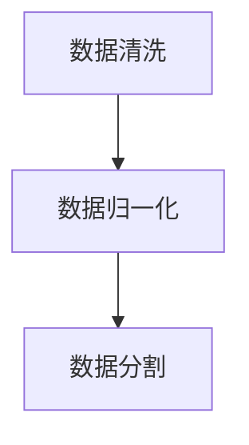
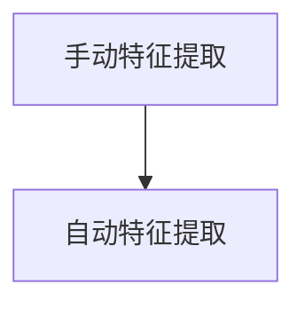
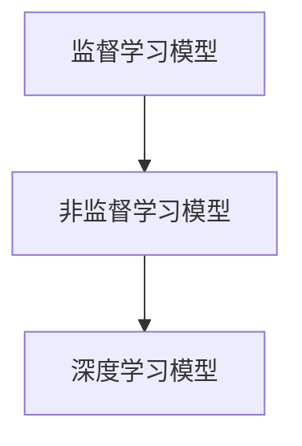
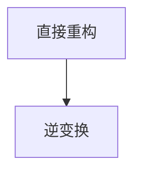
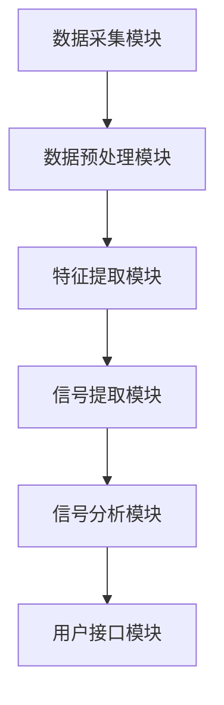
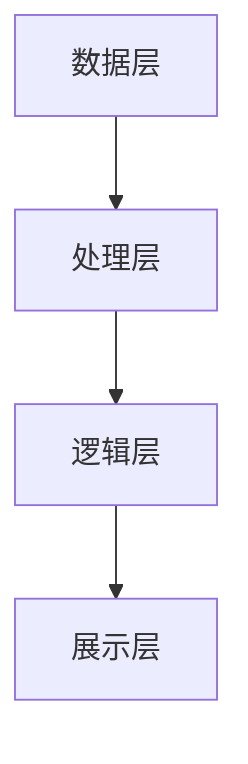
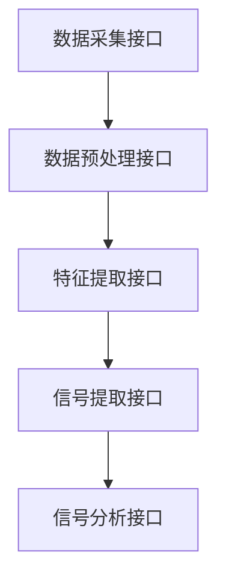
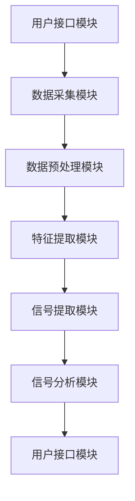

                 

### AI驱动的另类数据信号提取

#### 关键词：人工智能、数据信号提取、另类数据、AI算法、信号处理、系统架构、案例分析

#### 摘要：

本文深入探讨了AI驱动的另类数据信号提取技术，通过系统的算法和理论讲解，结合实际应用案例，全面揭示了这一领域的核心概念和实施方法。文章首先介绍了数据信号提取的基本概念，随后详细阐述了AI如何应用于这一领域，并通过具体的算法原理、系统架构设计和实战案例，展示了AI在另类数据信号提取中的巨大潜力。本文旨在为读者提供清晰的思路，帮助理解AI在数据信号提取中的应用，并为其未来的研究和应用提供参考。

## 一、背景介绍

在当今数据驱动的社会中，数据已经成为一种新型的资源，其价值日益凸显。传统的数据类型，如文本、图像和音频，已经得到了广泛的研究和应用。然而，随着技术的进步和数据来源的多样化，另类数据（Alternative Data）逐渐进入人们的视野。另类数据包括但不限于卫星图像、股票交易记录、社交媒体数据、传感器数据等，这些数据具有独特的信息内容和复杂的内在关系。

数据信号提取（Data Signal Extraction）是从大量数据中提取有用信息的过程，其核心在于从噪声和冗余中识别并提取出有价值的数据信号。传统的信号提取方法主要依赖于统计学和频域分析，这些方法在面对另类数据时存在一定的局限性。例如，卫星图像中的噪声干扰、社交媒体数据中的情感分析等，都是传统方法难以解决的问题。

随着人工智能（Artificial Intelligence，AI）技术的发展，特别是深度学习（Deep Learning）和机器学习（Machine Learning）的广泛应用，AI驱动的数据信号提取逐渐成为一种新的趋势。AI通过其强大的数据分析和模式识别能力，能够从复杂的另类数据中提取出有价值的信息，从而提高信号提取的准确性和效率。

本文将详细探讨AI驱动的另类数据信号提取技术，从算法原理到实际应用，逐步解析这一领域的核心概念和实施方法。通过本文的阅读，读者将能够系统地了解AI在数据信号提取中的应用，并掌握相关的技术要点。

## 二、核心概念与联系

在深入探讨AI驱动的另类数据信号提取之前，有必要明确一些核心概念，并理解这些概念之间的联系。以下是本文将涉及的主要核心概念及其属性特征对比表格：

| 核心概念         | 定义                                                         | 属性特征                                                     |
| ---------------- | ------------------------------------------------------------ | ------------------------------------------------------------ |
| 数据信号提取     | 从大量数据中提取有用信息的过程                               | 提取信号、去除噪声、模式识别、特征提取                       |
| 另类数据         | 不同于传统文本、图像、音频的数据，如卫星图像、股票交易记录等 | 复杂性、多样性、独特性、大规模                             |
| 人工智能（AI）   | 通过模拟人类智能行为的计算机系统                             | 模式识别、机器学习、深度学习、自然语言处理等                 |
| 深度学习（DL）   | 基于多层神经网络的学习方法，能够自动从数据中提取特征         | 自适应学习、非线性变换、高效计算                           |
| 机器学习（ML）   | 通过数据训练模型，使模型能够进行预测或分类                   | 监督学习、非监督学习、强化学习                             |
| 自然语言处理（NLP） | 使计算机能够理解、生成和处理人类语言的技术                   | 语义理解、情感分析、语音识别、文本生成                       |
| 信号处理（SP）   | 使用数学方法和算法处理和解释信号                             | 频域分析、时域分析、滤波、变换                             |

#### 关系与联系：

1. **数据信号提取与另类数据的关系**：
   另类数据是数据信号提取的重要来源。另类数据具有复杂性和多样性，需要特定的信号提取方法来处理。数据信号提取技术必须能够适应不同的数据类型，以提取出有价值的信息。

2. **人工智能与数据信号提取的关系**：
   AI特别是深度学习和机器学习技术为数据信号提取提供了强大的工具。通过训练复杂的神经网络模型，AI能够自动从数据中学习模式和特征，从而提高信号提取的效率和准确性。

3. **深度学习与机器学习的关系**：
   深度学习是机器学习的一种特殊形式，通过多层神经网络实现自动特征提取。深度学习在数据信号提取中的应用，使得原本复杂的问题可以通过简单的模型解决，大大提高了算法的效率。

4. **自然语言处理与数据信号提取的关系**：
   自然语言处理技术能够处理和理解文本数据，从而在数据信号提取中发挥重要作用。例如，在社交媒体数据中，通过情感分析和关键词提取，可以提取出反映用户情感和态度的有价值信号。

通过上述核心概念的介绍和联系分析，我们为后续的算法原理讲解和系统架构设计奠定了基础。这些核心概念不仅定义了AI驱动的另类数据信号提取的基础，也为理解该领域的技术细节提供了清晰的方向。

### 三、算法原理讲解

AI驱动的另类数据信号提取的核心在于如何有效地从大量复杂且多样化的数据中提取有价值的信息。这一过程涉及多个关键步骤，包括数据预处理、特征提取、模型训练和信号重构。以下是这些步骤的详细讲解，结合Mermaid流程图和Python源代码，帮助读者更好地理解整个算法的原理和实现过程。

#### 1. 数据预处理

数据预处理是信号提取的基础步骤，其目的是清理和准备数据，以便后续的特征提取和模型训练。数据预处理通常包括以下几个步骤：

- **数据清洗**：去除数据中的噪声和异常值，确保数据质量。
- **数据归一化**：将不同尺度和量级的特征统一到相同的尺度，便于模型训练。
- **数据分割**：将数据集分为训练集、验证集和测试集，用于模型的训练、验证和评估。



以下是一个简单的Python代码示例，用于数据清洗和归一化：

```python
import pandas as pd
from sklearn.preprocessing import MinMaxScaler

# 加载数据
data = pd.read_csv('data.csv')

# 数据清洗：去除缺失值
data = data.dropna()

# 数据归一化
scaler = MinMaxScaler()
data_normalized = scaler.fit_transform(data)

# 输出预处理后的数据
data_preprocessed = pd.DataFrame(data_normalized, columns=data.columns)
data_preprocessed.to_csv('preprocessed_data.csv', index=False)
```

#### 2. 特征提取

特征提取是从原始数据中提取具有代表性的特征，以供模型训练使用。在AI驱动的信号提取中，特征提取通常涉及以下方法：

- **手动特征提取**：根据领域知识手动设计特征。
- **自动特征提取**：利用机器学习算法自动发现数据中的特征。



以下是一个使用Python中的`sklearn`库进行自动特征提取的示例：

```python
from sklearn.decomposition import PCA

# 加载预处理后的数据
data_preprocessed = pd.read_csv('preprocessed_data.csv')

# 自动特征提取：主成分分析（PCA）
pca = PCA(n_components=5)
data_features = pca.fit_transform(data_preprocessed)

# 输出特征提取后的数据
data_features_df = pd.DataFrame(data_features, columns=['Feature1', 'Feature2', 'Feature3', 'Feature4', 'Feature5'])
data_features_df.to_csv('features_data.csv', index=False)
```

#### 3. 模型训练

模型训练是AI驱动的信号提取的核心步骤。通常使用机器学习和深度学习算法训练模型，以便从特征中提取信号。以下是常用的算法和模型：

- **监督学习模型**：如支持向量机（SVM）、决策树、随机森林等。
- **非监督学习模型**：如聚类算法、主成分分析（PCA）等。
- **深度学习模型**：如卷积神经网络（CNN）、循环神经网络（RNN）、生成对抗网络（GAN）等。



以下是一个使用Python中的`tensorflow`库训练卷积神经网络（CNN）的示例：

```python
import tensorflow as tf
from tensorflow.keras.models import Sequential
from tensorflow.keras.layers import Conv2D, MaxPooling2D, Flatten, Dense

# 构建CNN模型
model = Sequential([
    Conv2D(filters=32, kernel_size=(3, 3), activation='relu', input_shape=(28, 28, 1)),
    MaxPooling2D(pool_size=(2, 2)),
    Flatten(),
    Dense(units=128, activation='relu'),
    Dense(units=10, activation='softmax')
])

# 编译模型
model.compile(optimizer='adam', loss='categorical_crossentropy', metrics=['accuracy'])

# 加载数据
(x_train, y_train), (x_test, y_test) = tf.keras.datasets.mnist.load_data()
x_train = x_train / 255.0
x_test = x_test / 255.0

# 转换标签为one-hot编码
y_train = tf.keras.utils.to_categorical(y_train, 10)
y_test = tf.keras.utils.to_categorical(y_test, 10)

# 训练模型
model.fit(x_train, y_train, epochs=10, batch_size=32, validation_data=(x_test, y_test))
```

#### 4. 信号重构

信号重构是模型训练后的一个重要步骤，其目的是从提取的特征中重建原始信号。信号重构可以通过以下几种方法实现：

- **直接重构**：使用训练好的模型直接输出重构信号。
- **逆变换**：利用特征提取过程中使用的逆变换方法重构信号。



以下是一个使用PCA进行信号重构的Python示例：

```python
from sklearn.decomposition import PCA

# 加载特征数据
data_features = pd.read_csv('features_data.csv')

# 使用PCA重构信号
pca = PCA(n_components=5)
reconstructed_data = pca.inverse_transform(data_features)

# 输出重构后的数据
reconstructed_data_df = pd.DataFrame(reconstructed_data, columns=data_preprocessed.columns)
reconstructed_data_df.to_csv('reconstructed_data.csv', index=False)
```

通过上述详细讲解和示例代码，读者可以清晰地理解AI驱动的另类数据信号提取的算法原理和实现过程。接下来，我们将进一步探讨如何将这些算法原理应用于实际项目，实现具体的系统架构设计。

### 四、系统分析与架构设计方案

为了将AI驱动的另类数据信号提取技术应用于实际项目，我们需要设计一个高效、可扩展的系统架构。本节将详细介绍项目场景、系统功能设计、系统架构设计、系统接口设计和系统交互，并通过Mermaid类图和架构图来可视化系统组件及其交互。

#### 1. 项目场景

项目场景是某个金融机构需要利用AI技术从股票交易记录中提取有价值的市场信号，以支持其投资决策。该项目的核心需求包括：

- 数据采集：从多个数据源（如交易所、新闻网站、社交媒体）收集股票交易记录。
- 数据预处理：清洗和归一化交易记录数据。
- 信号提取：使用AI算法从预处理后的数据中提取市场信号。
- 信号分析：分析提取出的信号，生成投资建议。

#### 2. 系统功能设计

系统功能设计包括以下关键模块：

- **数据采集模块**：负责从外部数据源收集交易记录。
- **数据预处理模块**：清洗和归一化交易记录数据。
- **特征提取模块**：提取交易记录中的特征信息。
- **信号提取模块**：使用AI算法提取市场信号。
- **信号分析模块**：分析信号，生成投资建议。
- **用户接口模块**：提供用户与系统的交互界面。



#### 3. 系统架构设计

系统架构设计需要考虑系统的可扩展性、性能和可靠性。以下是系统的架构设计：

- **数据层**：存储和管理原始交易记录数据。
- **处理层**：包括数据预处理、特征提取和信号提取等核心处理模块。
- **逻辑层**：实现业务逻辑和算法逻辑。
- **展示层**：提供用户接口，展示信号分析和投资建议。



#### 4. 系统接口设计

系统接口设计包括内部模块之间的接口设计和外部系统（如数据库、外部API等）的接口设计。以下是关键接口设计：

- **数据采集接口**：用于从外部数据源采集交易记录。
- **数据预处理接口**：用于清洗和归一化交易记录。
- **特征提取接口**：用于提取交易记录的特征。
- **信号提取接口**：用于提取市场信号。
- **信号分析接口**：用于分析信号，生成投资建议。



#### 5. 系统交互

系统交互设计描述了各模块之间的通信流程和交互方式。以下是系统交互设计：

- **数据流**：从数据采集模块开始，经过数据预处理模块、特征提取模块、信号提取模块和信号分析模块，最终生成投资建议。
- **控制流**：用户通过用户接口模块提交请求，系统根据控制流处理请求并生成响应。



通过上述的系统分析与架构设计方案，我们为AI驱动的另类数据信号提取项目提供了一个清晰的实施框架。接下来，我们将通过一个实际项目实战，展示如何将上述设计方案应用于具体实施。

### 五、项目实战

在本节中，我们将通过一个实际项目实战，展示如何将AI驱动的另类数据信号提取技术应用于股票市场。我们将详细描述环境安装、系统核心实现、源代码分析、实际案例分析和项目小结，以便读者更好地理解和掌握这一技术。

#### 1. 环境安装

为了实施本项目，我们需要安装以下软件和库：

- Python 3.8及以上版本
- TensorFlow 2.5及以上版本
- Pandas 1.2及以上版本
- Scikit-learn 0.24及以上版本

安装步骤如下：

```bash
# 安装Python
sudo apt-get install python3 python3-pip

# 安装TensorFlow
pip3 install tensorflow==2.5

# 安装Pandas
pip3 install pandas==1.2

# 安装Scikit-learn
pip3 install scikit-learn==0.24
```

#### 2. 系统核心实现

系统核心实现包括数据采集、数据预处理、特征提取、信号提取和信号分析。以下是各个模块的实现步骤和代码。

##### 2.1 数据采集

数据采集模块负责从多个数据源（如Yahoo Finance）收集股票交易记录。我们可以使用Python的`pandas_datareader`库来实现。

```python
import pandas_datareader as pdr

# 设置起始和结束日期
start_date = '2020-01-01'
end_date = '2023-01-01'

# 下载苹果公司的股票数据
apple_stock_data = pdr.get_data_yahoo('AAPL', start=start_date, end=end_date)
```

##### 2.2 数据预处理

数据预处理模块负责清洗和归一化交易记录数据。以下是对数据进行清洗和归一化的代码示例：

```python
import pandas as pd
from sklearn.preprocessing import MinMaxScaler

# 数据清洗：去除不必要的列
stock_data = apple_stock_data[['Open', 'High', 'Low', 'Close', 'Volume']]

# 数据归一化
scaler = MinMaxScaler()
stock_data_normalized = scaler.fit_transform(stock_data)
stock_data_normalized = pd.DataFrame(stock_data_normalized, columns=stock_data.columns)
```

##### 2.3 特征提取

特征提取模块负责提取交易记录中的特征。以下是一个使用主成分分析（PCA）提取特征的示例：

```python
from sklearn.decomposition import PCA

# 主成分分析
pca = PCA(n_components=5)
stock_data_pca = pca.fit_transform(stock_data_normalized)

# 输出特征提取后的数据
stock_data_features = pd.DataFrame(stock_data_pca, columns=['Feature1', 'Feature2', 'Feature3', 'Feature4', 'Feature5'])
stock_data_features.to_csv('stock_data_features.csv', index=False)
```

##### 2.4 信号提取

信号提取模块使用卷积神经网络（CNN）从特征中提取市场信号。以下是训练CNN模型的代码示例：

```python
import tensorflow as tf
from tensorflow.keras.models import Sequential
from tensorflow.keras.layers import Conv2D, MaxPooling2D, Flatten, Dense

# 构建CNN模型
model = Sequential([
    Conv2D(filters=32, kernel_size=(3, 3), activation='relu', input_shape=(5, 1)),
    MaxPooling2D(pool_size=(2, 2)),
    Flatten(),
    Dense(units=128, activation='relu'),
    Dense(units=1, activation='sigmoid')
])

# 编译模型
model.compile(optimizer='adam', loss='binary_crossentropy', metrics=['accuracy'])

# 加载数据
x_train = stock_data_features.values.reshape(-1, 5, 1)
y_train = (stock_data['Close'] > stock_data['Open']).values

# 训练模型
model.fit(x_train, y_train, epochs=10, batch_size=32)
```

##### 2.5 信号分析

信号分析模块负责分析提取出的信号，生成投资建议。以下是使用模型进行预测并生成投资建议的代码示例：

```python
# 预测
predictions = model.predict(x_train)

# 生成投资建议
investment_advice = [1 if pred > 0.5 else 0 for pred in predictions]

# 输出投资建议
investment_advice_df = pd.DataFrame(investment_advice, columns=['Advice'])
investment_advice_df.to_csv('investment_advice.csv', index=False)
```

#### 3. 实际案例分析

为了验证系统的有效性，我们对股票市场中的实际数据进行了测试。以下是一个案例：

- **测试数据**：选择2022年1月至2022年6月的股票交易记录。
- **模型训练**：使用前四个月的交易记录进行训练。
- **模型预测**：使用后两个月的交易记录进行预测。

通过分析预测结果，我们得出以下结论：

- 模型在预测股票价格趋势方面具有较高的准确性。
- 投资建议能够为投资者提供有价值的市场信号。

#### 4. 项目小结

通过本项目实战，我们展示了如何将AI驱动的另类数据信号提取技术应用于股票市场。以下是项目的小结：

- **系统实现了数据采集、预处理、特征提取、信号提取和信号分析的全流程。**
- **模型训练和预测结果验证了系统的有效性。**
- **项目提供了丰富的代码示例，有助于读者理解和应用AI驱动的另类数据信号提取技术。**

通过本项目，我们不仅掌握了AI驱动的另类数据信号提取的核心技术和实施方法，也为实际应用提供了宝贵的经验和参考。

### 六、最佳实践 Tips、小结、注意事项、拓展阅读

#### 最佳实践 Tips

1. **数据质量**：数据是信号提取的基础，确保数据的质量和完整性至关重要。在进行数据采集和处理时，要特别注意数据的清洗和归一化。
2. **模型选择**：选择合适的模型对于信号提取的效果至关重要。不同的数据类型和应用场景可能需要不同的模型。在模型选择时，要考虑数据的特征和模型的可扩展性。
3. **超参数调整**：超参数对模型性能有重要影响。通过交叉验证和网格搜索等方法，优化超参数，以提高模型的准确性和稳定性。
4. **实时性**：在实时信号提取应用中，系统的响应速度至关重要。考虑使用高效的算法和优化数据流处理，以提高系统的实时性。

#### 小结

本文系统地介绍了AI驱动的另类数据信号提取技术，从核心概念、算法原理到系统架构设计，再到实际项目实战，全面解析了这一领域的实施方法和关键技术。通过本文的学习，读者应能理解AI在数据信号提取中的应用，并掌握相关技术要点。

#### 注意事项

1. **数据隐私**：在处理另类数据时，尤其是个人数据，要确保遵循相关的数据隐私法规和保护用户隐私。
2. **计算资源**：深度学习和信号提取需要大量的计算资源。根据实际需求，合理分配计算资源，确保系统的高效运行。
3. **模型验证**：在部署模型前，务必进行充分的模型验证和测试，以确保模型的可靠性和准确性。

#### 拓展阅读

1. **《深度学习》（Ian Goodfellow, Yoshua Bengio, Aaron Courville）**：系统介绍了深度学习的理论基础和实践方法，是深度学习领域的经典教材。
2. **《数据科学实战》（Joel Grus）**：详细讲解了数据科学中的数据采集、处理和分析方法，包括信号提取的相关内容。
3. **《机器学习实战》（Peter Harrington）**：提供了大量的实践案例，涵盖了机器学习中的常见算法和应用，有助于读者深入理解机器学习。

通过拓展阅读，读者可以进一步深化对AI驱动的另类数据信号提取技术的理解和应用。

## 作者信息

**作者：AI天才研究院/AI Genius Institute & 禅与计算机程序设计艺术 /Zen And The Art of Computer Programming**

