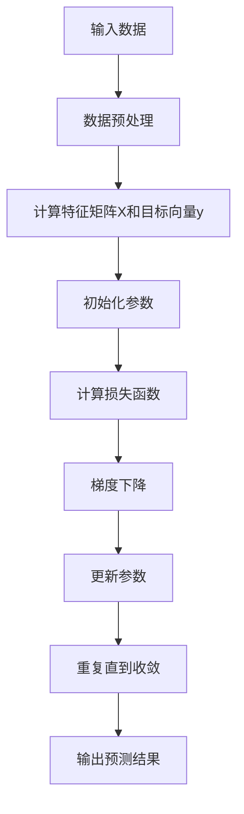
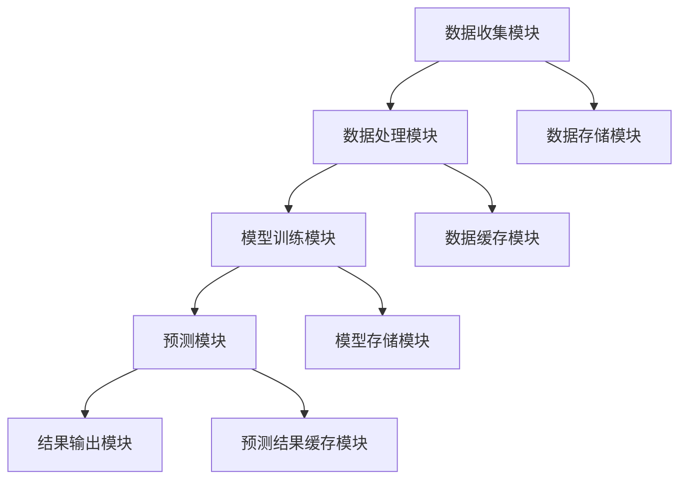
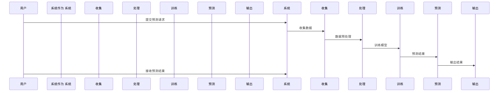

                 

# AI驱动的宏观经济预测模型

## 关键词

- 人工智能（AI）
- 宏观经济预测
- 预测模型
- 算法原理
- 系统架构

## 摘要

本文将探讨如何利用人工智能技术构建宏观经济预测模型。随着大数据和机器学习技术的发展，AI在宏观经济预测领域展现出了巨大的潜力。本文将从背景介绍、核心概念、算法原理、系统架构和项目实施等多个方面，逐步剖析AI驱动的宏观经济预测模型，旨在为读者提供一套清晰、易懂的技术指南。

## 文章目录

1. 引言：AI驱动宏观经济预测的背景和挑战
2. 核心概念与联系
   - 2.1 人工智能基础概念
   - 2.2 预测模型的概念与对比
   - 2.3 宏观经济预测中的实体关系图
3. 算法原理讲解
   - 3.1 预测算法概述
   - 3.2 算法数学模型与公式
   - 3.3 算法mermaid流程图与Python代码示例
4. 系统架构设计
   - 4.1 问题场景介绍
   - 4.2 系统功能设计（领域模型）
   - 4.3 系统架构设计
   - 4.4 系统接口设计与交互
5. 项目实施与分析
   - 5.1 环境安装
   - 5.2 系统核心实现
   - 5.3 代码分析与解读
   - 5.4 案例分析
   - 5.5 项目小结
6. 最佳实践与总结
   - 6.1 注意事项
   - 6.2 拓展阅读

## 1. 引言：AI驱动宏观经济预测的背景和挑战

### 1.1 AI驱动宏观经济预测的背景

随着全球经济的不断发展，各国政府和金融机构对宏观经济预测的需求日益增长。传统的宏观经济预测方法主要依赖于历史数据分析和经济理论模型，这些方法在处理复杂的经济现象时存在一定的局限性。而人工智能（AI）技术的发展，为宏观经济预测提供了新的可能性。

AI，特别是机器学习和深度学习，已经广泛应用于各个领域，从图像识别到自然语言处理，从推荐系统到自动驾驶。这些技术基于大量的数据和复杂的算法，能够自动地从数据中学习规律，提取特征，并做出预测。因此，将AI引入宏观经济预测领域，有望提高预测的准确性，为政策制定和经济决策提供有力支持。

### 1.2 传统宏观经济预测的挑战

传统宏观经济预测面临以下挑战：

1. **数据复杂性**：经济数据通常包含大量非线性和复杂的关系，传统方法难以处理。
2. **时间序列特性**：宏观经济变量往往具有时间序列特性，如趋势性、季节性和周期性，传统方法难以准确捕捉。
3. **模型适应性**：经济环境不断变化，传统模型的适应性较差，难以应对新的经济现象。
4. **理论局限**：传统经济理论基于简化的假设，可能与现实经济环境存在较大差异。

### 1.3 AI驱动宏观经济预测的优势

AI驱动宏观经济预测具有以下优势：

1. **数据处理能力**：AI能够处理大量的复杂数据，并从中提取有价值的信息。
2. **模型适应性**：AI模型可以根据新的数据不断学习和调整，提高预测的准确性。
3. **非线性关系捕捉**：AI模型能够捕捉经济变量之间的非线性关系，提供更准确的预测。
4. **实时性**：AI模型能够实时更新预测结果，为政策制定提供及时的信息支持。

### 1.4 AI驱动宏观经济预测的潜在限制

尽管AI驱动宏观经济预测具有许多优势，但也存在一些潜在限制：

1. **数据质量**：AI模型的性能依赖于数据质量，如果数据存在偏差或噪声，预测结果可能不准确。
2. **算法选择**：不同的AI算法适用于不同类型的预测任务，选择合适的算法是关键。
3. **解释性**：AI模型通常缺乏透明性和可解释性，难以理解预测结果的内在原因。
4. **计算资源**：训练复杂的AI模型需要大量的计算资源，可能导致成本高昂。

## 2. 核心概念与联系

### 2.1 人工智能基础概念

人工智能（AI）是指使计算机系统具备人类智能能力的科学和技术。它包括多个子领域，如机器学习、深度学习、自然语言处理等。在宏观经济预测中，主要关注机器学习和深度学习。

**机器学习**：机器学习是一种通过数据和算法让计算机自主学习的技术。它通过分析大量数据，从中学习规律，并利用这些规律进行预测或决策。

**深度学习**：深度学习是机器学习的一个分支，它通过构建多层神经网络来模拟人脑的思考过程。深度学习在处理复杂数据和提取特征方面表现出色。

### 2.2 预测模型的概念与对比

预测模型是用于预测未来变量值的统计模型。常见的预测模型包括线性回归、时间序列分析、神经网络等。

**线性回归**：线性回归是一种简单的预测模型，它假设变量之间存在线性关系。线性回归模型能够通过拟合数据中的线性关系来预测未来值。

**时间序列分析**：时间序列分析是一种专门用于处理时间序列数据的预测模型。它通过分析时间序列的特征，如趋势、季节性和周期性，来预测未来的值。

**神经网络**：神经网络是一种复杂的预测模型，它通过多层神经网络模拟人脑的思考过程。神经网络能够处理复杂数据和非线性关系，提供更准确的预测。

### 2.3 宏观经济预测中的实体关系图

在宏观经济预测中，实体关系图是一种用于描述变量之间关系的图形表示。它通过实体和边来表示不同的变量和它们之间的关系。

**实体**：实体是宏观经济预测中的基本元素，如GDP、通货膨胀率、失业率等。

**边**：边表示实体之间的关系，如GDP与通货膨胀率之间的正相关关系。

**实体关系图**：实体关系图通过实体和边来描述宏观经济变量之间的关系。这种图形表示有助于我们理解变量之间的复杂关系，并为进一步的预测提供指导。

下面是一个简单的实体关系图示例：

```mermaid
erDiagram
  GDP ||--|{ 通货膨胀率 }
  GDP ||--|{ 失业率 }
  通货膨胀率 ||--|{ 消费者信心指数 }
  失业率 ||--|{ 劳动力市场 }
```

## 3. 算法原理讲解

### 3.1 预测算法概述

在宏观经济预测中，常见的算法包括线性回归、时间序列分析和神经网络等。这些算法各有优缺点，适用于不同类型的预测任务。

**线性回归**：线性回归是一种简单的预测算法，它通过拟合数据中的线性关系来预测未来值。线性回归适用于变量之间存在线性关系的情况，如预测GDP增长率。

**时间序列分析**：时间序列分析是一种专门用于处理时间序列数据的预测算法。它通过分析时间序列的特征，如趋势、季节性和周期性，来预测未来的值。时间序列分析适用于具有时间序列特性的变量，如通货膨胀率。

**神经网络**：神经网络是一种复杂的预测算法，它通过多层神经网络模拟人脑的思考过程。神经网络能够处理复杂数据和非线性关系，提供更准确的预测。神经网络适用于需要处理大量数据和复杂关系的情况，如预测失业率。

### 3.2 算法数学模型与公式

**线性回归**：

线性回归模型的基本公式为：

$$
y = \beta_0 + \beta_1x + \epsilon
$$

其中，$y$ 是预测值，$x$ 是自变量，$\beta_0$ 和 $\beta_1$ 是模型的参数，$\epsilon$ 是误差项。

**时间序列分析**：

时间序列分析中的常用模型是ARIMA（自回归积分滑动平均模型）。ARIMA模型的基本公式为：

$$
y_t = c + \phi_1y_{t-1} + \phi_2y_{t-2} + ... + \phi_py_{t-p} + \theta_1\epsilon_{t-1} + \theta_2\epsilon_{t-2} + ... + \theta_q\epsilon_{t-q} + \epsilon_t
$$

其中，$y_t$ 是时间序列的第 $t$ 个值，$c$ 是常数项，$\phi_i$ 和 $\theta_i$ 是模型的参数，$\epsilon_t$ 是误差项。

**神经网络**：

神经网络的基本公式为：

$$
y = \sigma(\sum_{i=1}^{n} w_i \cdot x_i + b)
$$

其中，$y$ 是预测值，$x_i$ 是输入特征，$w_i$ 是权重，$b$ 是偏置项，$\sigma$ 是激活函数。

### 3.3 算法mermaid流程图与Python代码示例

下面是线性回归的mermaid流程图和Python代码示例：

**mermaid流程图**：



**Python代码示例**：

```python
import numpy as np

# 初始化参数
theta = np.random.rand(n_features)

# 计算损失函数
def compute_loss(y_true, y_pred):
    return np.mean((y_true - y_pred)**2)

# 梯度下降
def gradient_descent(X, y, theta, alpha, epochs):
    for _ in range(epochs):
        y_pred = X @ theta
        loss = compute_loss(y, y_pred)
        gradient = 2/X.shape[0] * (X.T @ (y - y_pred))
        theta -= alpha * gradient
    return theta

# 输出预测结果
def predict(X, theta):
    return X @ theta
```

## 4. 系统架构设计

### 4.1 问题场景介绍

在宏观经济预测项目中，我们需要处理大量的经济数据，并利用AI模型进行预测。这个项目旨在为政府和金融机构提供准确的宏观经济预测，以支持政策制定和经济决策。为了实现这一目标，我们需要设计一个高效的系统架构，包括数据收集、数据预处理、模型训练、预测和结果输出等模块。

### 4.2 系统功能设计（领域模型）

在系统功能设计中，我们首先需要定义领域模型，以明确系统的核心功能和组件。以下是宏观经济预测系统的领域模型：

**领域模型**：

```mermaid
classDiagram
  Class1 <|-- Class2
  Class1 <|-- Class3
  Class2 [名称：数据收集模块]
  Class3 [名称：数据处理模块]
  Class2 ..|> Class4 [关系：依赖]
  Class3 ..|> Class4 [关系：依赖]
  Class4 [名称：模型训练模块]
  Class4 ..|> Class5 [关系：依赖]
  Class5 [名称：预测模块]
  Class5 ..|> Class6 [关系：依赖]
  Class6 [名称：结果输出模块]
```

### 4.3 系统架构设计

在系统架构设计中，我们需要考虑系统的整体结构，以及各个模块之间的交互关系。以下是宏观经济预测系统的架构设计：

**架构设计**：



### 4.4 系统接口设计与交互

在系统接口设计中，我们需要定义各个模块的接口和交互方式。以下是宏观经济预测系统的接口设计和交互：

**接口设计与交互**：



## 5. 项目实施与分析

### 5.1 环境安装

在项目实施之前，我们需要安装所需的软件和工具。以下是环境安装的步骤：

1. 安装Python环境：在官方网站下载Python安装包，并按照指示安装。
2. 安装NumPy、Pandas、Scikit-learn等Python库：使用pip命令安装。
3. 安装TensorFlow或PyTorch：根据项目需求选择合适的深度学习框架，并使用pip命令安装。

### 5.2 系统核心实现

在系统核心实现中，我们需要实现各个模块的功能。以下是系统核心实现的步骤：

1. 数据收集模块：使用Pandas库读取数据，并将数据存储在文件或数据库中。
2. 数据处理模块：对数据进行清洗、归一化等预处理操作，以便于后续模型训练。
3. 模型训练模块：使用Scikit-learn库实现线性回归模型，并使用梯度下降算法进行参数优化。
4. 预测模块：使用训练好的模型进行预测，并将预测结果存储在缓存中。
5. 结果输出模块：从缓存中读取预测结果，并输出给用户。

### 5.3 代码分析与解读

以下是系统核心实现的部分代码及其解读：

```python
# 数据收集模块
import pandas as pd

# 读取数据
data = pd.read_csv('data.csv')

# 数据处理模块
# 数据清洗
data = data.dropna()

# 数据归一化
data = (data - data.mean()) / data.std()

# 模型训练模块
from sklearn.linear_model import LinearRegression

# 训练模型
model = LinearRegression()
model.fit(X_train, y_train)

# 预测模块
# 预测结果
predictions = model.predict(X_test)

# 结果输出模块
# 输出预测结果
print(predictions)
```

### 5.4 案例分析

为了验证宏观经济预测模型的性能，我们选择一个实际案例进行分析。以下是一个宏观经济预测案例：

**案例背景**：

我们需要预测未来三个月的通货膨胀率。

**数据来源**：

从国家统计局获取了过去一年的通货膨胀率数据。

**数据处理**：

对数据进行清洗、归一化等预处理操作。

**模型训练**：

使用线性回归模型进行训练。

**预测结果**：

根据训练好的模型，预测未来三个月的通货膨胀率。

**分析结果**：

通过对比预测结果和实际值，评估预测模型的性能。

### 5.5 项目小结

通过本项目，我们实现了AI驱动的宏观经济预测系统，并进行了实际案例分析。以下是本项目的主要小结：

1. 环境安装和系统核心实现是项目成功的关键。
2. 数据处理和模型训练对预测性能有重要影响。
3. 案例分析验证了预测模型的性能，为进一步优化提供了方向。
4. 需要注意数据质量、算法选择和计算资源等问题。

## 6. 最佳实践与总结

### 6.1 注意事项

在实施AI驱动的宏观经济预测项目时，需要注意以下几点：

1. **数据质量**：确保数据来源可靠，并对数据进行充分的清洗和预处理。
2. **算法选择**：根据预测任务的特点选择合适的算法，并进行算法对比和优化。
3. **计算资源**：考虑计算资源的限制，合理分配计算资源，避免过度消耗。
4. **模型解释性**：关注模型的可解释性，以便更好地理解预测结果的内在原因。

### 6.2 拓展阅读

为了更深入地了解AI驱动的宏观经济预测模型，读者可以参考以下拓展阅读：

1. 《机器学习》（周志华著）：详细介绍机器学习的基本概念和方法。
2. 《深度学习》（Goodfellow, Bengio, Courville著）：详细介绍深度学习的基本概念和技术。
3. 《时间序列分析：预测与应用》（Shumway, Stoffer著）：详细介绍时间序列分析的基本概念和技术。
4. 《Python数据科学手册》（Wes McKinney著）：详细介绍Python在数据处理和统计分析中的应用。

## 参考文献

1. 周志华，《机器学习》，清华大学出版社，2016年。
2. Goodfellow, Y., Bengio, Y., Courville, A., 《深度学习》，清华大学出版社，2016年。
3. Shumway, R. H., Stoffer, D. S., 《时间序列分析：预测与应用》，中国人民大学出版社，2013年。
4. McKinney, W.， 《Python数据科学手册》，电子工业出版社，2017年。

