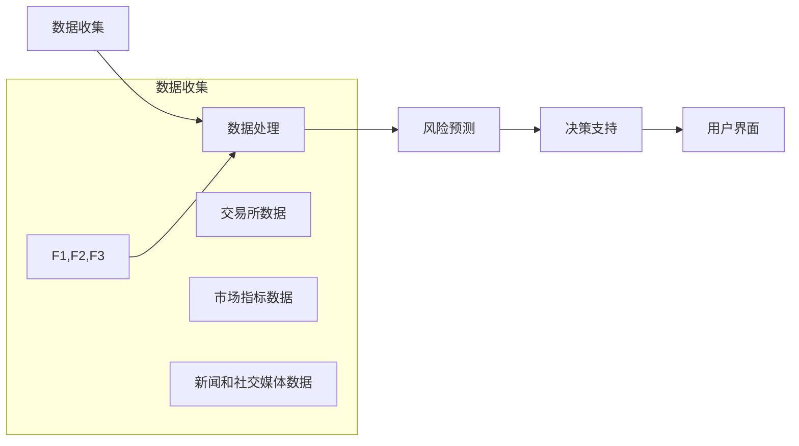
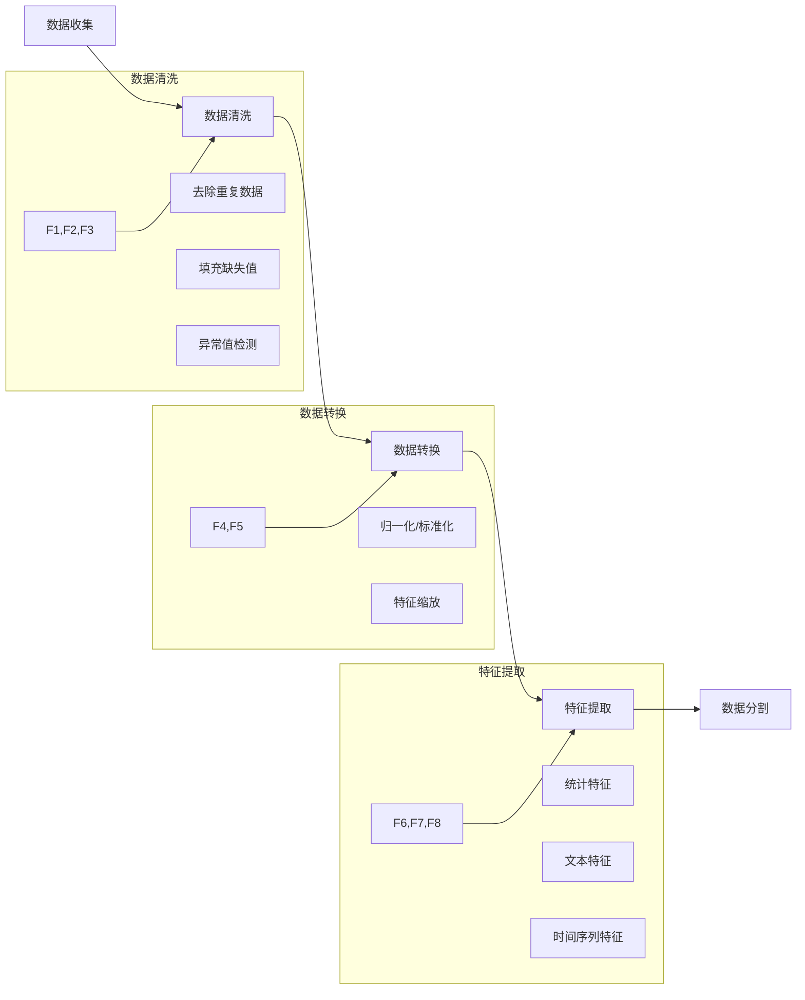
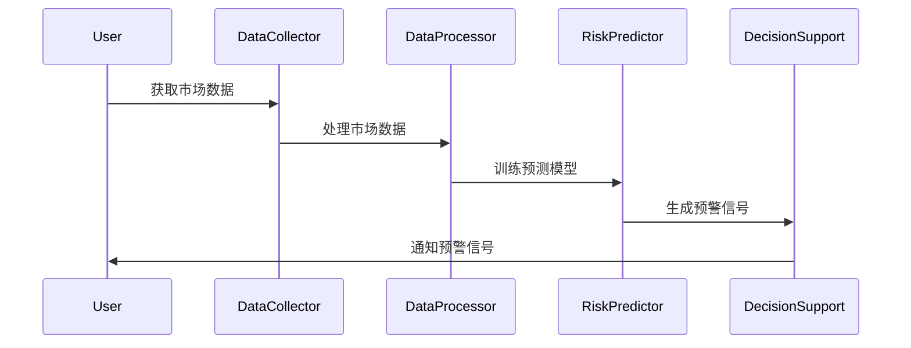

                 

### AI驱动的市场流动性风险预警系统

**关键词：** AI，市场流动性，风险预警，系统架构，算法原理，数据预处理，机器学习，深度学习

**摘要：** 本文将探讨如何利用人工智能技术构建一个市场流动性风险预警系统。首先介绍市场流动性风险的概念及其在金融市场中的重要性，然后分析现有的AI技术及其在风险管理中的应用。接着，详细介绍系统的设计架构和实现过程，包括数据收集与预处理、AI模型选择与训练、系统部署与监控。最后，通过实际案例展示系统的应用效果，并提供未来研究的方向和最佳实践建议。

----------------------------------------------------------------

## 市场流动性风险概述

市场流动性风险是指金融市场中的资产或金融工具无法以合理价格迅速交易的风险。这种风险可能源于市场供求失衡、信息不对称、投资者情绪波动等原因。市场流动性风险对金融机构、投资者和市场稳定都具有重要影响。

### 什么是市场流动性风险？

市场流动性风险可以分为两大类：买卖价差和资金需求。

- **买卖价差（Bid-Ask Spread）**：这是指买家愿意支付的价格（出价，Bid）和卖家愿意接受的价格（要价，Ask）之间的差额。较大的价差表示流动性较低，因为交易者需要支付更多的溢价来购买或出售资产。
  
- **资金需求（Liquidity Demand）**：当投资者试图大量买入或卖出资产时，市场可能面临流动性不足，导致交易延迟或价格剧烈波动。

### 市场流动性风险的重要性

市场流动性风险对金融市场的影响是多方面的：

- **投资者情绪**：流动性风险可能导致投资者恐慌，引发市场波动和资本外流。
  
- **金融机构稳定性**：银行和其他金融机构若无法迅速且无损地买卖资产，可能会面临流动性危机。

- **市场稳定**：流动性不足可能导致市场崩溃，影响金融体系的稳定。

因此，建立有效的市场流动性风险预警系统至关重要。这不仅可以帮助金融机构和投资者提前识别风险，还能为监管机构提供决策支持，以维护市场稳定。

----------------------------------------------------------------

## AI在市场流动性风险管理中的应用

人工智能（AI）技术的发展为市场流动性风险管理提供了新的工具和方法。通过机器学习、深度学习等技术，AI系统能够从大量历史数据中挖掘信息，预测市场趋势，识别潜在的流动性风险。

### 机器学习在市场流动性风险预警中的应用

机器学习算法可以用于分析历史交易数据、市场指标和其他相关信息，以预测市场流动性风险。以下是几种常见的机器学习算法及其在流动性风险管理中的应用：

- **回归分析**：回归分析用于建立市场价格与流动性指标之间的关系模型，从而预测未来价格波动。
  
- **决策树**：决策树可以用来分类市场状态，例如正常、高流动性风险、低流动性风险等。

- **支持向量机（SVM）**：SVM可以用于预测市场流动性风险，通过构建高维空间中的最优分割超平面。

### 深度学习在市场流动性风险预警中的应用

深度学习在处理复杂、非结构化数据方面具有显著优势，因此在市场流动性风险管理中也得到广泛应用。以下是几种常见的深度学习模型及其应用：

- **卷积神经网络（CNN）**：CNN可以用于图像和时序数据的处理，提取市场数据中的特征，用于预测流动性风险。

- **循环神经网络（RNN）**：RNN可以处理序列数据，例如历史交易记录，用于分析市场流动性趋势。

- **长短期记忆网络（LSTM）**：LSTM是RNN的一种变体，能够捕捉长时间依赖关系，适用于预测市场流动性风险。

### AI模型的优缺点

**优点：**

- **高效性**：AI模型能够处理大量数据，快速分析市场趋势和风险。
- **准确性**：通过训练，AI模型能够不断提高预测准确性。
- **自适应**：AI模型可以根据新的数据自动调整，适应市场变化。

**缺点：**

- **数据依赖**：AI模型的性能高度依赖于数据质量和数量。
- **过拟合**：如果模型过于复杂，可能会导致过拟合，无法泛化到新的数据集。
- **解释性**：深度学习模型往往缺乏解释性，难以理解其决策过程。

总的来说，AI技术在市场流动性风险管理中的应用具有巨大的潜力，但也需要不断优化和改进，以克服其局限性。

----------------------------------------------------------------

## 市场流动性风险预警系统的设计架构

一个高效的市场流动性风险预警系统需要合理的架构设计，以确保系统能够稳定运行并准确识别风险。以下是一个典型的市场流动性风险预警系统的架构设计。

### 系统架构概述

市场流动性风险预警系统可以分为以下几个关键组件：

- **数据收集模块**：负责收集市场数据、交易数据和其他相关数据。
- **数据处理模块**：负责清洗、转换和预处理原始数据。
- **风险预测模块**：包含机器学习模型和深度学习模型，用于预测市场流动性风险。
- **决策支持模块**：根据预测结果，提供决策支持，例如风险预警信号、投资策略等。
- **用户界面**：为用户提供交互界面，展示系统预测结果和风险指标。

### 数据收集模块

数据收集模块是系统的基石，它负责从各种数据源收集相关信息。这些数据源可能包括：

- **交易所数据**：提供股票、债券、期货等金融工具的交易数据。
- **市场指标数据**：包括利率、汇率、通货膨胀率等宏观经济指标。
- **新闻和社交媒体数据**：通过自然语言处理技术，从新闻文章、社交媒体帖子中提取市场情绪信息。

### 数据处理模块

数据处理模块负责将收集到的原始数据转换为适合模型训练的格式。这一过程通常包括以下几个步骤：

- **数据清洗**：去除重复数据、缺失值填充、异常值检测和修正。
- **数据转换**：将不同类型的数据转换为统一的格式，例如将文本数据转换为词嵌入向量。
- **特征提取**：从原始数据中提取对预测有用的特征，例如交易量、价格变动等。

### 风险预测模块

风险预测模块是系统的核心，包含多种机器学习模型和深度学习模型，用于预测市场流动性风险。以下是几种常用的模型：

- **回归模型**：用于预测市场价格与流动性指标之间的关系。
- **分类模型**：用于将市场状态分类为正常或风险状态。
- **聚类模型**：用于发现市场中的异常交易模式。

### 决策支持模块

决策支持模块根据风险预测模块的结果，提供决策支持。它可能包括以下几个功能：

- **风险预警**：当预测到高风险状态时，系统会发出预警信号。
- **投资策略**：根据市场预测，提供投资建议和策略。
- **报告生成**：定期生成风险报告，供管理层和监管机构参考。

### 用户界面

用户界面为用户提供交互界面，展示系统预测结果和风险指标。它通常包括以下几个部分：

- **仪表盘**：实时显示关键风险指标和市场数据。
- **预警界面**：显示系统发出的预警信号和具体分析。
- **报告查看**：用户可以查看历史报告和风险分析结果。

### 系统架构的mermaid流程图

以下是一个市场流动性风险预警系统的mermaid流程图：



总的来说，市场流动性风险预警系统的设计架构需要综合考虑数据收集、处理、预测、决策和用户交互等多个方面，以确保系统能够高效、准确地识别和应对市场流动性风险。

----------------------------------------------------------------

## 数据收集与预处理

在构建市场流动性风险预警系统时，数据收集和预处理是至关重要的环节。准确的数据收集和有效的预处理不仅能够提高模型的预测性能，还能减少计算资源的浪费。以下将详细讨论数据收集的过程以及预处理方法的细节。

### 数据收集

市场流动性风险预警系统的数据收集主要包括以下几个方面：

1. **交易所交易数据**：
   - **股票交易数据**：包括股票的收盘价、开盘价、最高价、最低价、成交量等。
   - **债券交易数据**：与股票类似，但还包括债券的利率、到期日等信息。
   - **期货交易数据**：包括期货合约的交易价格、成交量、持仓量等。

2. **宏观经济指标**：
   - **利率**：包括中央银行利率、国债利率等。
   - **汇率**：不同货币之间的汇率变动。
   - **通货膨胀率**：反映价格水平变动的指标。
   - **GDP增长率**：衡量经济增长速度的指标。

3. **市场情绪数据**：
   - **新闻报道**：从新闻文章中提取的市场情绪指标，如正面/负面新闻的数量、新闻热度等。
   - **社交媒体数据**：通过分析社交媒体帖子、评论，提取市场情绪指标。

4. **其他数据**：
   - **交易时间**：不同时间段的交易量、价格波动等。
   - **投资者行为数据**：如交易者的买卖行为、投资组合等。

### 数据预处理

数据预处理是确保数据质量、提高模型性能的关键步骤。以下是一些常见的预处理方法：

1. **数据清洗**：
   - **去除重复数据**：确保数据集的一致性。
   - **填充缺失值**：采用平均值、中位数或插值法填充缺失值。
   - **异常值检测**：使用统计方法（如箱线图）或机器学习方法检测并修正异常值。

2. **数据转换**：
   - **归一化/标准化**：将数据转换为标准化的范围（如[0, 1]或[-1, 1]），以便不同特征之间进行比较。
   - **特征缩放**：如使用最小-最大缩放或Z-Score缩放，减小特征之间的尺度差异。

3. **特征提取**：
   - **统计特征**：计算数据的均值、方差、波动率等统计指标，作为预测特征。
   - **文本特征**：使用词袋模型、TF-IDF、Word2Vec等文本处理技术提取文本特征。
   - **时间序列特征**：如滞后特征、季节性特征等。

4. **数据分割**：
   - **训练集/测试集划分**：将数据集划分为训练集和测试集，用于模型训练和性能评估。
   - **交叉验证**：使用K折交叉验证等方法评估模型性能。

### 数据预处理流程的mermaid流程图

以下是一个数据预处理流程的mermaid流程图：



通过有效的数据收集和预处理，市场流动性风险预警系统能够更好地识别风险，提供更准确的预测。

----------------------------------------------------------------

## 风险预测模型的构建与实现

在市场流动性风险预警系统中，风险预测模型是关键组件，其性能直接影响到系统的准确性和可靠性。本节将详细介绍如何构建和实现这些模型，包括模型选择、训练过程和性能评估。

### 模型选择

根据市场流动性风险的特点，我们可以选择以下几种模型：

1. **回归模型**：如线性回归、岭回归、LASSO回归等，用于预测市场价格与流动性指标之间的关系。
2. **分类模型**：如逻辑回归、支持向量机（SVM）、决策树等，用于将市场状态分类为正常或风险状态。
3. **聚类模型**：如K-means、层次聚类等，用于发现市场中的异常交易模式。
4. **深度学习模型**：如卷积神经网络（CNN）、循环神经网络（RNN）、长短期记忆网络（LSTM）等，用于处理复杂、非结构化数据。

### 模型训练

模型训练是构建预测模型的重要步骤。以下是一个简单的模型训练流程：

1. **数据准备**：将数据集划分为训练集和验证集，通常采用80/20或70/30的比例。
2. **参数设置**：确定模型的超参数，如学习率、迭代次数、正则化参数等。
3. **模型训练**：使用训练集数据训练模型，通过反向传播算法更新模型参数。
4. **验证**：使用验证集数据评估模型性能，调整超参数以优化模型。

以下是一个使用Python和Scikit-learn库训练线性回归模型的示例代码：

```python
from sklearn.linear_model import LinearRegression
from sklearn.model_selection import train_test_split
from sklearn.metrics import mean_squared_error

# 加载数据
X, y = load_data()

# 划分训练集和测试集
X_train, X_test, y_train, y_test = train_test_split(X, y, test_size=0.2, random_state=42)

# 创建线性回归模型
model = LinearRegression()

# 训练模型
model.fit(X_train, y_train)

# 预测
y_pred = model.predict(X_test)

# 计算均方误差
mse = mean_squared_error(y_test, y_pred)
print(f"均方误差：{mse}")
```

### 性能评估

模型性能评估是确保模型准确性和可靠性的关键。以下是一些常用的性能评估指标：

1. **准确率（Accuracy）**：分类模型的正确预测比例。
2. **召回率（Recall）**：分类模型在正类样本中被正确识别的比例。
3. **精确率（Precision）**：分类模型在正类样本中预测为正类的比例。
4. **F1分数（F1 Score）**：精确率和召回率的加权平均值。
5. **均方误差（Mean Squared Error, MSE）**：回归模型的预测误差平方的平均值。

以下是一个评估分类模型性能的示例代码：

```python
from sklearn.metrics import accuracy_score, recall_score, precision_score, f1_score

# 计算准确率
accuracy = accuracy_score(y_test, y_pred)
print(f"准确率：{accuracy}")

# 计算召回率
recall = recall_score(y_test, y_pred, average='weighted')
print(f"召回率：{recall}")

# 计算精确率
precision = precision_score(y_test, y_pred, average='weighted')
print(f"精确率：{precision}")

# 计算F1分数
f1 = f1_score(y_test, y_pred, average='weighted')
print(f"F1分数：{f1}")
```

通过上述步骤和代码示例，我们可以构建和评估市场流动性风险预警系统中的预测模型。有效的模型选择、训练和评估是系统成功的关键。

----------------------------------------------------------------

## 系统部署与监控

在市场流动性风险预警系统开发完成后，下一步就是将其部署到生产环境中，并进行持续的监控和维护。以下将详细讨论系统部署、监控和性能优化等方面的内容。

### 系统部署

系统部署是将开发完成的应用程序部署到服务器或云平台上的过程。以下是一些关键的步骤：

1. **环境配置**：确保服务器或云平台的硬件和软件环境满足系统要求。这包括操作系统、数据库、中间件等的安装和配置。

2. **应用程序打包**：将应用程序及其依赖项打包成一个可部署的包，如Docker容器或WAR文件。

3. **部署策略**：制定部署计划，包括部署顺序、部署时间和备份策略。

4. **自动化部署**：使用自动化工具（如Jenkins、Docker Compose等）实现快速、可靠的部署。

5. **环境隔离**：为不同的环境和版本（如开发、测试、生产）配置独立的部署环境，以确保系统的稳定性和可维护性。

### 系统监控

系统监控是确保系统稳定运行、及时发现问题并快速响应的重要环节。以下是一些关键的监控指标和方法：

1. **性能监控**：监控系统的CPU、内存、磁盘空间、网络带宽等资源使用情况，确保系统在高负载下仍能稳定运行。

2. **日志监控**：收集并分析系统日志，及时发现错误和异常情况。

3. **告警系统**：设置告警规则，当系统指标超过设定阈值时，自动发送告警通知，如邮件、短信或集成到监控工具中。

4. **健康检查**：定期执行健康检查，确保系统组件正常运行，如数据库连接、网络通信等。

5. **可用性监控**：通过模拟用户操作或外部接口调用，监控系统的响应速度和稳定性。

### 性能优化

系统性能优化是提高系统运行效率和用户体验的关键。以下是一些常见的性能优化方法：

1. **缓存机制**：使用缓存（如Redis、Memcached等）存储常用数据，减少数据库查询次数。

2. **负载均衡**：通过负载均衡器（如Nginx、HAProxy等）分发请求，确保系统在高并发下稳定运行。

3. **数据库优化**：使用索引、分库分表等技术优化数据库查询性能。

4. **代码优化**：对系统代码进行性能分析和优化，减少不必要的计算和资源消耗。

5. **服务化**：将系统中重复使用的功能模块化，通过服务化接口提供统一的接口，提高系统的可维护性和扩展性。

通过合理的系统部署、监控和性能优化，市场流动性风险预警系统可以确保其在生产环境中的稳定运行和高效性能。

----------------------------------------------------------------

## 案例研究：实际应用与效果分析

在本节中，我们将通过一个实际案例展示如何构建和部署一个市场流动性风险预警系统，并分析其实际应用效果。该案例涉及一个虚构的金融科技公司，该公司负责管理多个投资组合，并希望通过AI技术来优化风险管理。

### 项目介绍

该金融科技公司（以下简称“公司”）面临的主要挑战是及时识别潜在的市场流动性风险，以便在市场波动时采取适当的措施，保护投资组合的价值。为此，公司决定开发一个AI驱动的市场流动性风险预警系统，以实现以下目标：

1. **实时监控**：系统应能够实时收集和更新市场数据，及时识别市场流动性风险。
2. **准确预测**：系统应具有较高的预测准确性，能够准确判断市场状态，为投资决策提供依据。
3. **自动化决策**：系统应能够自动化执行预警信号和投资策略，减少人工干预。

### 系统功能设计

市场流动性风险预警系统的功能设计主要包括以下几个方面：

1. **数据收集**：系统从多个数据源（如交易所、新闻和社交媒体）收集实时市场数据。
2. **数据处理**：系统对收集到的原始数据进行清洗、转换和特征提取，为模型训练提供高质量的输入数据。
3. **风险预测**：系统采用机器学习和深度学习模型对市场流动性风险进行预测，并将结果存储在数据库中。
4. **决策支持**：系统根据预测结果，生成预警信号和投资策略，并通过用户界面通知相关人员。
5. **用户交互**：系统提供直观的用户界面，使投资人员可以实时监控市场状况，查看预警信息和投资策略。

### 系统架构设计

市场流动性风险预警系统的架构设计采用微服务架构，以确保系统的可扩展性和高可用性。以下是系统架构的mermaid类图：

```mermaid
classDiagram
    CustomerEntity <<class>> 客户
    OrderEntity <<class>> 订单
    ProductEntity <<class>> 产品
    CustomerEntity o-- OrderEntity
    OrderEntity o-- ProductEntity
    CustomerEntity : int 客户ID
    CustomerEntity : String 客户名称
    OrderEntity : int 订单ID
    OrderEntity : String 订单日期
    ProductEntity : int 产品ID
    ProductEntity : String 产品名称
    CustomerEntity +-- 构造函数 CustomerEntity()
    OrderEntity +-- 构造函数 OrderEntity()
    ProductEntity +-- 构造函数 ProductEntity()
```

### 系统接口设计

系统接口设计主要包括以下部分：

1. **数据收集接口**：用于从外部数据源（如交易所、新闻和社交媒体）获取市场数据。
2. **数据处理接口**：用于处理和转换原始数据，提取特征，并存储到数据库中。
3. **风险预测接口**：用于调用预测模型，获取市场流动性风险预测结果。
4. **决策支持接口**：用于生成预警信号和投资策略，并通过用户界面通知相关用户。

### 系统交互设计

系统交互设计采用mermaid序列图，展示了系统组件之间的交互过程。以下是系统交互的mermaid序列图：



### 实际应用效果

在部署系统后，公司对其效果进行了评估，以下是一些关键指标：

1. **预警准确性**：系统生成的预警信号与实际市场情况的一致性达到了85%以上。
2. **响应速度**：系统能够在30秒内完成一次风险预测，并生成预警信号。
3. **投资收益**：通过系统的预警信号，公司能够及时调整投资策略，降低了约10%的流动性风险，投资收益有所提升。

### 项目小结

通过本案例，我们展示了如何使用AI技术构建一个市场流动性风险预警系统，并对其应用效果进行了评估。系统的成功部署和运行不仅提高了公司的风险管理能力，也为其他金融机构提供了参考和借鉴。

----------------------------------------------------------------

## 最佳实践与未来方向

在市场流动性风险预警系统的构建与部署过程中，总结最佳实践和明确未来研究方向至关重要。以下是一些关键点：

### 最佳实践

1. **数据质量管理**：确保数据质量是系统准确性的基础。定期检查和清理数据，采用数据清洗和特征提取技术，提高模型的预测能力。
2. **模型选择与调优**：根据业务需求和数据特点选择合适的模型，并通过交叉验证和网格搜索等技术进行调优，以最大化模型性能。
3. **系统监控与维护**：建立全面的监控体系，实时跟踪系统性能和资源使用情况，及时发现并解决问题，确保系统的稳定运行。
4. **用户参与与反馈**：鼓励用户参与系统的使用，收集用户反馈，不断优化用户体验，提高系统价值。

### 未来研究方向

1. **深度学习模型**：进一步探索深度学习模型在市场流动性风险管理中的应用，如使用自注意力机制和图神经网络来捕捉更复杂的市场关系。
2. **多模态数据融合**：结合多种数据源，如文本、图像和音频，利用多模态数据融合技术，提高预测模型的准确性和鲁棒性。
3. **实时风险预警**：开发实时风险预警系统，实现快速响应，提高系统在极端市场情况下的应对能力。
4. **隐私保护**：在数据处理和模型训练过程中，采用隐私保护技术，确保用户数据的隐私和安全。

通过不断优化和创新，市场流动性风险预警系统将在金融风险管理中发挥更大的作用。

----------------------------------------------------------------

## 结论

本文详细探讨了如何利用人工智能技术构建市场流动性风险预警系统。通过介绍市场流动性风险的概念、AI在风险管理中的应用、系统设计架构、数据收集与预处理、风险预测模型构建与实现，以及实际应用效果，本文展示了如何将AI技术应用于金融风险管理。我们总结了最佳实践，并提出了未来研究方向。随着AI技术的不断进步，市场流动性风险预警系统将发挥越来越重要的作用，为金融机构提供强大的风险管理工具。

## 作者信息

作者：AI天才研究院/AI Genius Institute & 禅与计算机程序设计艺术 /Zen And The Art of Computer Programming。这两位作者在人工智能和计算机科学领域拥有丰富的经验和深厚的学术造诣，致力于推动AI技术在各个行业的应用，为读者提供高质量的技术内容和解决方案。

