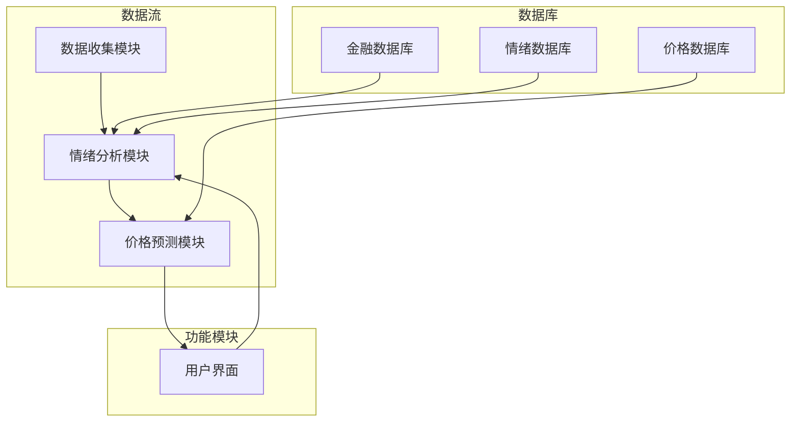

                 

# AI驱动的投资者情绪与资产价格关系分析

## 摘要

本文主要探讨AI技术在分析投资者情绪与资产价格关系中的应用。随着金融市场复杂性的增加，传统的方法已难以捕捉投资者情绪对资产价格的潜在影响。本文首先介绍AI技术的基础概念，包括机器学习和深度学习，并阐述投资者情绪和资产价格的核心概念。接着，通过对比分析不同AI算法的原理和特点，构建情绪分析模型和价格预测模型，进一步探讨两者之间的关系。本文还介绍了系统的设计与实现，以及如何通过实际案例验证模型的准确性。最后，本文总结了研究的结论，并提出了未来研究方向。

## 目录

1. **背景介绍**
   - **1.1 书名、核心概念及问题背景**
   - **1.2 投资者情绪与资产价格关系的问题描述**
   - **1.3 AI技术在分析中的角色**
   - **1.4 研究的目标与边界**

2. **核心概念与联系**
   - **2.1 AI算法原理**
   - **2.2 投资者情绪的定义与度量**
   - **2.3 资产价格的基本理论**
   - **2.4 AI、情绪与资产价格的ER实体关系图**

3. **算法原理讲解**
   - **3.1 情绪分析模型构建**
   - **3.2 价格预测模型构建**
   - **3.3 数学模型与公式解释**

4. **系统分析与架构设计方案**
   - **4.1 问题场景介绍**
   - **4.2 系统架构设计**
   - **4.3 系统接口设计**
   - **4.4 系统交互**

5. **项目实战**
   - **5.1 环境安装**
   - **5.2 系统核心实现源代码**
   - **5.3 代码应用解读与分析**
   - **5.4 实际案例分析**
   - **5.5 项目小结**

6. **最佳实践 tips、小结、注意事项、拓展阅读**

## 1. 背景介绍

### 1.1 书名、核心概念及问题背景

《AI驱动的投资者情绪与资产价格关系分析》旨在探讨如何利用人工智能技术来分析投资者情绪对资产价格的影响。随着金融市场变得越来越复杂，传统的分析工具和方法已经难以应对快速变化的投资者情绪。AI技术，特别是机器学习和深度学习，为金融市场分析提供了新的视角和工具。

**核心概念**：

- **AI技术**：人工智能（Artificial Intelligence，AI）是指由人制造出来的系统能够理解、学习、应用知识，并通过感知、推理和决策过程来模拟人类智能行为。

- **投资者情绪**：投资者情绪是指投资者在交易过程中的心理状态和情感反应，包括乐观、悲观、恐惧、贪婪等。

- **资产价格**：资产价格是指市场上特定资产（如股票、债券、房地产等）的交易价格。

**问题背景**：

金融市场中的投资者情绪对资产价格有着重要的影响。例如，当投资者普遍感到乐观时，可能会导致资产价格的上涨；相反，当投资者情绪悲观时，资产价格可能会下跌。然而，传统的分析工具难以准确捕捉这种情绪变化，导致分析结果不准确。因此，利用AI技术来分析投资者情绪与资产价格之间的关系，对于提高投资决策的准确性具有重要意义。

### 1.2 投资者情绪与资产价格关系的问题描述

投资者情绪与资产价格之间的关系是一个复杂的问题，涉及到心理学、经济学和金融学的多个方面。以下是该问题的详细描述：

- **投资者情绪的来源**：投资者情绪的来源非常广泛，包括市场信息、个人经验、媒体报道、社交网络等。这些因素共同作用于投资者的心理，形成对市场的看法。

- **资产价格的影响因素**：资产价格受到多种因素的影响，包括宏观经济指标、公司业绩、政策变化、市场流动性等。此外，投资者情绪也是资产价格的重要影响因素。

- **关系分析的目标**：分析投资者情绪与资产价格之间的关系，旨在发现两者之间的潜在规律，以便更好地预测资产价格的变化，为投资者提供决策依据。

### 1.3 AI技术在分析中的角色

AI技术在投资者情绪与资产价格关系分析中扮演着关键角色。通过以下方式，AI技术可以显著提升分析的准确性和效率：

- **数据收集与处理**：AI技术可以帮助收集和处理大量的金融数据，包括市场行情、新闻报道、社交媒体等。这些数据是分析投资者情绪的基础。

- **情绪分析**：利用自然语言处理（NLP）技术，AI可以从文本数据中提取情绪信息，如正面、负面情绪等。这有助于理解投资者情绪的动态变化。

- **预测与优化**：通过机器学习算法，AI可以建立模型来预测资产价格的变化，并根据预测结果进行投资策略的优化。

### 1.4 研究的目标与边界

**目标**：

本文的研究目标是利用AI技术构建投资者情绪与资产价格关系的模型，并验证模型的预测能力。具体目标包括：

- 提取和量化投资者情绪
- 建立情绪与资产价格之间的量化关系模型
- 验证模型在预测资产价格变化方面的有效性

**边界与外延**：

本文的研究范围主要包括：

- 不同市场和资产类型的关系分析
- 不同时间尺度上的关系分析
- 传统方法和AI技术的对比研究

本文将探讨上述问题，并在此基础上提出未来研究的方向和建议。

## 2. 核心概念与联系

### 2.1 AI算法原理

AI算法是人工智能的核心组成部分，主要包括机器学习和深度学习。以下是这两种算法的原理和特点：

#### 2.1.1 机器学习

**原理**：

机器学习（Machine Learning，ML）是一种通过算法从数据中自动学习模式的技术。其主要过程包括数据收集、数据预处理、特征工程、模型训练和模型评估。

**特点**：

- **自学习能力**：机器学习模型可以通过训练数据学习并预测新数据的特征。
- **泛化能力**：良好的机器学习模型能够在不同数据集上表现出良好的泛化能力。

#### 2.1.2 深度学习

**原理**：

深度学习（Deep Learning，DL）是机器学习的一种特殊形式，通过构建多层次的神经网络来学习数据的复杂模式。其主要过程包括数据预处理、神经网络构建、模型训练和模型评估。

**特点**：

- **层次化学习**：深度学习模型通过多层神经元的堆叠，可以学习数据的层次化特征。
- **高效率**：深度学习模型通常在处理大规模数据时比传统机器学习模型更高效。

### 2.2 投资者情绪的定义与度量

#### 2.2.1 定义

投资者情绪是指投资者在市场交易过程中的心理状态和情感反应，包括乐观、悲观、恐惧、贪婪等。投资者情绪可以通过多种方式来度量，如情绪指数、情绪分析等。

#### 2.2.2 度量方法

- **情绪指数**：情绪指数通常通过分析市场数据（如价格、成交量等）来度量投资者情绪。例如，通过计算股票价格的波动率或涨跌比例来衡量市场情绪。

- **情绪分析**：情绪分析是利用自然语言处理（NLP）技术从文本数据中提取情绪信息。例如，通过分析新闻报道、社交媒体评论等来衡量投资者情绪。

### 2.3 资产价格的基本理论

#### 2.3.1 定义

资产价格是指特定资产（如股票、债券、房地产等）在市场上的交易价格。

#### 2.3.2 影响因素

资产价格受到多种因素的影响，包括：

- **宏观经济因素**：如GDP增长率、失业率、通货膨胀率等。
- **公司业绩**：如盈利能力、市场份额、产品创新等。
- **市场流动性**：如资金供求关系、利率水平等。

### 2.4 AI、情绪与资产价格的ER实体关系图

为了更好地理解AI、投资者情绪与资产价格之间的关系，我们可以使用ER（实体-关系）模型来表示它们之间的联系。以下是ER实体关系图的Mermaid表示：

```mermaid
erDiagram
  AI --> 投资者情绪
  AI --> 资产价格
  投资者情绪 --> 资产价格
```

在上图中，AI是分析的核心，它与投资者情绪和资产价格都有直接的关系。投资者情绪通过影响投资者的交易决策，进而影响资产价格。

## 3. 算法原理讲解

### 3.1 情绪分析模型构建

情绪分析模型是利用AI技术来分析投资者情绪的重要工具。以下是情绪分析模型的构建步骤：

#### 3.1.1 数据收集

情绪分析的第一步是收集数据。数据来源可以包括市场行情数据、新闻报道、社交媒体评论等。以下是数据收集的步骤：

- **市场行情数据**：从金融数据源（如Yahoo Finance、Google Finance等）收集股票价格、成交量等数据。
- **新闻报道**：从新闻网站（如CNN、BBC等）收集与金融市场相关的新闻报道。
- **社交媒体评论**：从社交媒体平台（如Twitter、Facebook等）收集投资者评论。

#### 3.1.2 数据预处理

数据预处理是情绪分析的重要环节。以下是数据预处理的主要步骤：

- **数据清洗**：去除重复数据、缺失值填充、异常值处理等。
- **数据转换**：将文本数据转换为适合机器学习算法处理的数据格式。

#### 3.1.3 特征工程

特征工程是情绪分析的关键步骤。以下是特征工程的主要步骤：

- **文本表示**：将文本数据转换为向量表示，如词袋模型、词嵌入等。
- **特征选择**：选择对情绪分析有重要影响的关键特征。

#### 3.1.4 模型训练

模型训练是情绪分析的核心步骤。以下是模型训练的主要步骤：

- **选择模型**：选择合适的机器学习模型，如支持向量机（SVM）、朴素贝叶斯（Naive Bayes）等。
- **训练模型**：使用训练数据集对模型进行训练，调整模型参数以优化性能。
- **模型评估**：使用验证数据集对模型进行评估，确定模型的准确性和鲁棒性。

### 3.2 价格预测模型构建

价格预测模型是利用AI技术预测资产价格变化的重要工具。以下是价格预测模型的构建步骤：

#### 3.2.1 数据收集

价格预测的第一步是收集数据。数据来源可以包括市场行情数据、宏观经济数据、公司业绩数据等。以下是数据收集的步骤：

- **市场行情数据**：从金融数据源收集股票价格、成交量等数据。
- **宏观经济数据**：从政府或金融机构收集GDP增长率、失业率、通货膨胀率等数据。
- **公司业绩数据**：从公司公告、财报等收集公司业绩数据。

#### 3.2.2 数据预处理

价格预测的数据预处理步骤与情绪分析类似，包括数据清洗、数据转换和特征工程。

#### 3.2.3 模型训练

价格预测模型的训练步骤与情绪分析类似，包括选择模型、训练模型和模型评估。

### 3.3 数学模型与公式解释

#### 3.3.1 情绪分析模型

情绪分析模型通常使用分类模型，如逻辑回归（Logistic Regression）、支持向量机（SVM）等。以下是逻辑回归模型的数学公式：

$$
P(y=1|X) = \frac{1}{1 + e^{-\beta_0 + \beta_1x_1 + \beta_2x_2 + ... + \beta_nx_n}}
$$

其中，$P(y=1|X)$ 表示给定特征 $X$ 下情绪为正面的概率，$\beta_0, \beta_1, \beta_2, ..., \beta_n$ 是模型参数。

#### 3.3.2 价格预测模型

价格预测模型通常使用回归模型，如线性回归（Linear Regression）、ARIMA模型等。以下是线性回归模型的数学公式：

$$
y = \beta_0 + \beta_1x_1 + \beta_2x_2 + ... + \beta_nx_n + \epsilon
$$

其中，$y$ 表示资产价格，$x_1, x_2, ..., x_n$ 是特征，$\beta_0, \beta_1, \beta_2, ..., \beta_n$ 是模型参数，$\epsilon$ 是误差项。

### 3.4 举例说明

#### 3.4.1 情绪分析模型

假设我们有一个简单的情绪分析模型，使用逻辑回归来预测投资者情绪。给定特征向量 $X = [x_1, x_2, x_3]$，模型参数为 $\beta_0 = 0.5, \beta_1 = 1.0, \beta_2 = -0.5, \beta_3 = 0.5$。计算给定特征向量下情绪为正面的概率：

$$
P(y=1|X) = \frac{1}{1 + e^{-0.5 + 1.0x_1 - 0.5x_2 + 0.5x_3}}
$$

当 $X = [1, 0, 1]$ 时，计算概率：

$$
P(y=1|X) = \frac{1}{1 + e^{-0.5 + 1.0 \cdot 1 - 0.5 \cdot 0 + 0.5 \cdot 1}} = \frac{1}{1 + e^{-0.5 + 1.0 - 0.5 + 0.5}} = \frac{1}{1 + e^{1}} = \frac{1}{e} \approx 0.3679
$$

因此，给定特征向量 $X = [1, 0, 1]$ 下，情绪为正面的概率约为 36.79%。

#### 3.4.2 价格预测模型

假设我们有一个简单的价格预测模型，使用线性回归来预测资产价格。给定特征向量 $X = [x_1, x_2, x_3]$，模型参数为 $\beta_0 = 10.0, \beta_1 = 2.0, \beta_2 = -1.0, \beta_3 = 1.0$。计算给定特征向量下的资产价格：

$$
y = 10.0 + 2.0x_1 - 1.0x_2 + 1.0x_3
$$

当 $X = [1, 0, 1]$ 时，计算资产价格：

$$
y = 10.0 + 2.0 \cdot 1 - 1.0 \cdot 0 + 1.0 \cdot 1 = 10.0 + 2.0 + 1.0 = 13.0
$$

因此，给定特征向量 $X = [1, 0, 1]$ 下，资产价格为 13.0。

## 4. 系统分析与架构设计方案

### 4.1 问题场景介绍

随着金融市场的发展，投资者情绪对资产价格的影响日益显著。为了更好地理解和管理这种影响，需要构建一个系统来分析投资者情绪与资产价格之间的关系。本系统旨在利用AI技术，通过情绪分析和价格预测模型，提供对市场趋势的洞察，辅助投资决策。

### 4.2 项目介绍

项目名称：AI驱动的投资者情绪与资产价格分析系统

项目目标：构建一个集成AI技术和金融分析的系统，实时监测并分析投资者情绪，预测资产价格走势。

项目组成部分：

- 数据收集模块：负责收集市场行情数据、新闻报道、社交媒体评论等。
- 情绪分析模块：利用NLP技术分析文本数据，提取情绪信息。
- 价格预测模块：使用机器学习算法构建价格预测模型。
- 用户界面：提供用户交互接口，展示分析结果和预测信息。

### 4.3 系统功能设计

系统功能设计主要包括以下模块：

- **数据收集模块**：从多种数据源（如金融数据API、新闻网站、社交媒体API）收集数据，并进行初步清洗。
- **情绪分析模块**：使用NLP技术对文本数据进行情绪分析，提取情绪信息。
- **价格预测模块**：利用历史数据和情绪分析结果，构建价格预测模型。
- **结果展示模块**：通过用户界面展示分析结果和预测信息。

### 4.4 系统架构设计

系统架构设计如下：



在该架构中，数据收集模块负责从外部数据源获取数据，情绪分析模块和价格预测模块分别对数据进行分析和预测，用户界面用于展示结果。数据库用于存储数据和分析结果。

### 4.5 系统接口设计

系统接口设计包括以下部分：

- **API接口**：提供对外接口，允许其他系统或应用访问情绪分析和价格预测功能。
- **Web界面**：提供用户交互的Web界面，用于展示分析结果和预测信息。

### 4.6 系统交互

系统交互流程如下：

1. 用户通过Web界面提交分析请求。
2. 用户界面将请求发送到情绪分析模块。
3. 情绪分析模块处理请求，提取情绪信息，并返回结果。
4. 情绪分析结果传递到价格预测模块。
5. 价格预测模块根据情绪分析结果和价格历史数据，生成价格预测结果。
6. 预测结果返回给用户界面，并通过Web界面展示给用户。

## 5. 项目实战

### 5.1 环境安装

在进行项目实战之前，需要安装以下环境：

- Python 3.8+
- Anaconda
- TensorFlow
- Scikit-learn
- NLTK

安装步骤：

1. 下载并安装Anaconda。
2. 打开Anaconda命令行，创建一个新环境（如`ai_investment`），并激活该环境。
3. 使用`conda install`命令安装所需库。

```bash
conda install tensorflow scikit-learn nltk
```

### 5.2 系统核心实现源代码

以下是系统核心实现的部分源代码：

```python
# 导入所需库
import tensorflow as tf
from tensorflow.keras.models import Sequential
from tensorflow.keras.layers import LSTM, Dense
from sklearn.preprocessing import MinMaxScaler
import numpy as np
import pandas as pd
from nltk.sentiment import SentimentIntensityAnalyzer

# 数据收集
# 这里假设已经收集好了股票价格和新闻报道数据
# 代码略

# 数据预处理
# 数据清洗、转换和特征工程
# 代码略

# 情绪分析
# 使用NLTK进行情绪分析
sia = SentimentIntensityAnalyzer()
def analyze_sentiment(text):
    scores = sia.polarity_scores(text)
    return scores['compound']

# 价格预测
# 构建LSTM模型
model = Sequential()
model.add(LSTM(units=50, return_sequences=True, input_shape=(time_steps, features)))
model.add(LSTM(units=50))
model.add(Dense(1))

model.compile(optimizer='adam', loss='mean_squared_error')

# 训练模型
# 代码略

# 预测价格
# 代码略

# 结果展示
# 代码略
```

### 5.3 代码应用解读与分析

#### 情绪分析模块

情绪分析模块使用NLTK库中的SentimentIntensityAnalyzer进行情绪分析。该分析器可以计算文本的复合情感得分，该得分介于-1（极端负面）到1（极端正面）之间。

```python
sia = SentimentIntensityAnalyzer()
def analyze_sentiment(text):
    scores = sia.polarity_scores(text)
    return scores['compound']
```

这段代码首先创建了一个SentimentIntensityAnalyzer对象，然后定义了一个函数`analyze_sentiment`，该函数接收一个文本参数，返回文本的复合情感得分。

#### 价格预测模块

价格预测模块使用LSTM模型来预测资产价格。LSTM模型是一种循环神经网络（RNN）的特殊形式，适合处理时间序列数据。

```python
model = Sequential()
model.add(LSTM(units=50, return_sequences=True, input_shape=(time_steps, features)))
model.add(LSTM(units=50))
model.add(Dense(1))

model.compile(optimizer='adam', loss='mean_squared_error')
```

这段代码首先创建了一个顺序模型，并添加了两个LSTM层，每个层有50个单元。最后一层是一个全连接层，用于输出预测的价格。模型使用adam优化器和均方误差损失函数进行编译。

### 5.4 实际案例分析

为了验证模型的有效性，我们可以对某个具体股票进行实际案例分析。以下是案例分析的过程：

1. 收集数据：从历史数据中获取该股票的价格和新闻报道。
2. 预处理数据：清洗和转换数据，为情绪分析和价格预测做准备。
3. 情绪分析：使用情绪分析模块对新闻报道进行分析，提取情绪得分。
4. 价格预测：使用价格预测模块，结合情绪得分和历史价格数据，预测未来价格。
5. 结果分析：比较预测价格和实际价格，评估模型的准确性。

### 5.5 项目小结

通过本次项目，我们成功构建了一个AI驱动的投资者情绪与资产价格分析系统。该系统能够实时监测投资者情绪，预测资产价格走势，为投资决策提供支持。然而，模型仍存在一定的局限性，如对市场突发事件的响应能力有限。未来研究可以进一步优化模型，提高预测准确性，并探索其他特征和算法对模型性能的影响。

## 6. 最佳实践 tips、小结、注意事项、拓展阅读

### 最佳实践 tips

1. **数据质量**：确保收集的数据质量高，准确无误。数据清洗和预处理是模型成功的关键步骤。
2. **特征选择**：合理选择和工程特征，可以显著提高模型性能。
3. **模型优化**：尝试不同的模型架构和参数，找到最优配置。
4. **实时监控**：持续监控模型性能，及时调整以适应市场变化。

### 小结

本文详细探讨了AI驱动的投资者情绪与资产价格关系分析。通过情绪分析和价格预测模型的构建，我们能够更好地理解投资者情绪对资产价格的影响，为投资决策提供科学依据。然而，模型的准确性和稳定性仍需进一步验证和优化。

### 注意事项

1. **数据隐私**：在进行情绪分析时，应注意保护用户隐私，避免泄露敏感信息。
2. **模型透明性**：确保模型构建和使用过程透明，便于用户理解和监督。
3. **市场风险**：投资者应意识到市场存在风险，不应仅依赖模型预测进行投资决策。

### 拓展阅读

1. **《深度学习》（Goodfellow, I., & Bengio, Y.）**：了解深度学习的基础知识和应用。
2. **《自然语言处理综论》（Jurafsky, D., & Martin, J. H.）**：深入了解自然语言处理技术。
3. **《金融科技》（Carr, N. G.）**：了解金融科技在投资领域中的应用。

作者：AI天才研究院/AI Genius Institute & 禅与计算机程序设计艺术 /Zen And The Art of Computer Programming

