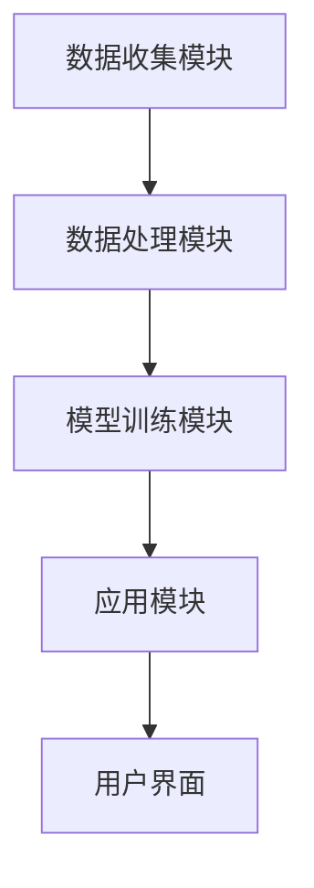
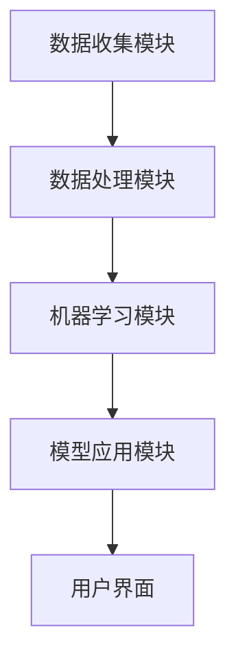

                 

### AI驱动的投资者行为分析平台

**关键词：** AI、投资者行为、数据分析、金融科技

**摘要：** 本篇文章将探讨AI驱动的投资者行为分析平台，介绍其背景、核心概念、设计架构、技术实现和案例分析。我们将一步步分析，深入了解如何利用AI技术来解析投资者行为，从而为金融市场和投资者提供更有价值的见解。

## 第一部分：背景与概念

### 第1章：问题背景与核心概念

#### 1.1 问题背景

投资者行为是金融市场研究的重要领域。了解投资者的行为模式可以帮助金融机构更好地理解市场动态，制定有效的投资策略。传统的投资者行为分析依赖于人工调研和统计方法，存在耗时、耗力且准确性不高的局限性。随着AI技术的发展，我们有机会利用大数据和机器学习技术，实现自动化、精准的投资者行为分析。

#### 1.2 核心概念

AI驱动的投资者行为分析平台是一种利用人工智能技术，对大量投资者数据进行收集、处理和分析的系统。该平台的核心概念包括：

- **数据收集与处理**：收集投资者交易、社交媒体、新闻报告等多源数据，进行数据清洗、预处理和特征提取。
- **机器学习模型**：运用机器学习算法，构建预测模型，分析投资者行为，识别市场趋势。

### 第2章：平台设计与架构

#### 2.1 平台架构

平台的总体架构包括数据收集模块、数据处理模块、模型训练模块和应用模块。以下是一个简化的Mermaid架构图示例：



#### 2.2 技术选型

- **AI算法选择**：平台可能采用多种机器学习算法，如决策树、支持向量机和神经网络等。
- **数据处理技术**：包括数据清洗、数据预处理和特征工程等技术。

## 第二部分：技术实现

### 第3章：数据收集与预处理

#### 3.1 数据源

平台的数据源包括公开数据（如证券交易所的交易数据）和私有数据（如投资者社交媒体行为数据）。

#### 3.2 数据预处理

数据预处理包括数据清洗（去除错误和重复数据）、数据标准化（如归一化、标准化）和特征提取（提取对模型有用的特征）。

### 第4章：机器学习算法

#### 4.1 算法选择

平台可能采用的机器学习算法包括：

- **决策树**：用于分类和回归任务，易于解释。
- **支持向量机**：擅长处理高维数据，效果较好。
- **神经网络**：可以处理复杂非线性关系，预测能力强。

#### 4.2 算法实现

以下是一个简单的神经网络算法实现示例：

```python
import tensorflow as tf

# 定义神经网络结构
model = tf.keras.Sequential([
    tf.keras.layers.Dense(units=10, activation='relu', input_shape=[784]),
    tf.keras.layers.Dense(units=1, activation='sigmoid')
])

# 编译模型
model.compile(optimizer='adam', loss='binary_crossentropy', metrics=['accuracy'])

# 训练模型
model.fit(x_train, y_train, epochs=10, batch_size=32)
```

#### 4.3 数学模型

神经网络的数学模型如下：

$$
y = \sigma(\sum_{i=1}^{n} w_i x_i + b)
$$

其中，$y$ 是输出，$\sigma$ 是 sigmoid 函数，$w_i$ 是权重，$x_i$ 是输入特征，$b$ 是偏置。

### 第5章：系统实现

#### 5.1 系统设计

系统设计包括领域模型、架构设计、接口设计和系统交互。

#### 5.2 系统实现

系统实现包括环境安装、核心代码实现和代码应用解读。

### 第6章：案例分析

#### 6.1 案例介绍

介绍一个实际的投资者行为分析案例，包括数据收集、预处理、模型训练和应用。

#### 6.2 案例分析

分析案例的结果，包括模型性能、预测准确性等。

### 第7章：总结与展望

总结平台的主要特点和优势，讨论平台的潜在应用场景和未来发展方向。

## 结论

AI驱动的投资者行为分析平台为金融市场和投资者提供了新的视角和工具。通过一步步分析和技术实现，我们展示了如何利用AI技术实现精准的投资者行为分析。未来，随着技术的不断进步，这个平台有望为投资者带来更大的价值。

---

**作者：AI天才研究院/AI Genius Institute & 禅与计算机程序设计艺术 /Zen And The Art of Computer Programming**### AI驱动的投资者行为分析平台

**关键词：** AI、投资者行为、数据分析、金融科技

**摘要：** 本篇文章将探讨AI驱动的投资者行为分析平台，介绍其背景、核心概念、设计架构、技术实现和案例分析。我们将一步步分析，深入了解如何利用AI技术来解析投资者行为，从而为金融市场和投资者提供更有价值的见解。

---

### 第一部分：背景与概念

#### 第1章：问题背景与核心概念

##### 1.1 问题背景

投资者行为分析在金融市场研究中占据重要地位。投资者行为不仅影响市场供需，还反映了市场情绪和信心水平。传统的投资者行为分析主要依赖手工调研和统计方法，存在一定的局限性，如数据获取困难、分析过程繁琐且准确性不高。随着AI和大数据技术的发展，构建AI驱动的投资者行为分析平台成为可能，这将有助于金融机构更好地理解和预测市场动态。

##### 1.2 核心概念

AI驱动的投资者行为分析平台主要包括以下几个核心概念：

- **AI驱动分析**：利用机器学习和深度学习算法，对大量投资者行为数据进行自动化分析。
- **数据收集**：通过多种渠道（如交易所、社交媒体、新闻报告等）收集投资者行为数据。
- **数据处理**：对收集到的数据执行清洗、预处理和特征提取，以供模型训练使用。

#### 1.3 投资者行为的概述

投资者行为是指个人或机构在投资过程中表现出来的行为模式。这些行为可以包括：

- **交易行为**：如买卖股票、基金、外汇等。
- **投资决策**：投资者在选择资产、调整投资组合时的决策过程。
- **心理行为**：投资者的情绪、风险偏好和信心水平等心理因素。

投资者行为分析的重要性在于：

- **提升投资效率**：通过分析投资者行为，可以优化投资策略，减少盲目投资。
- **市场预测**：了解投资者行为有助于预测市场走势，为金融机构提供决策支持。
- **风险管理**：分析投资者行为可以帮助识别潜在的风险，采取相应的风险控制措施。

### 第二部分：平台设计与架构

#### 第2章：平台架构

##### 2.1 平台架构

AI驱动的投资者行为分析平台通常包括以下模块：

- **数据收集模块**：从各种渠道收集投资者行为数据。
- **数据处理模块**：对收集到的数据执行清洗、预处理和特征提取。
- **机器学习模块**：构建和训练机器学习模型，分析投资者行为。
- **模型应用模块**：将训练好的模型应用于实际投资场景，提供预测和建议。
- **用户界面**：提供给用户的交互界面，展示分析结果和预测建议。

以下是一个简化的Mermaid架构图示例：



##### 2.2 技术选型

平台的技术选型包括：

- **数据存储**：使用关系型数据库（如MySQL）或NoSQL数据库（如MongoDB）存储数据。
- **数据处理**：使用Python、R语言等编程语言进行数据处理。
- **机器学习框架**：使用TensorFlow、PyTorch等深度学习框架进行模型训练和预测。
- **API接口**：使用Django、Flask等框架搭建API接口，实现模块间的通信。

### 第三部分：技术实现

#### 第3章：数据收集与预处理

##### 3.1 数据源

投资者行为分析平台的数据源主要包括：

- **交易所数据**：如股票交易数据、市场指数数据等。
- **社交媒体数据**：如投资者在社交媒体平台上的评论、讨论等。
- **新闻报告数据**：如投资报告、新闻文章等。

##### 3.2 数据预处理

数据预处理是分析过程中的关键步骤，主要包括：

- **数据清洗**：去除重复数据、缺失数据和异常值。
- **数据归一化**：将数据缩放到相同的范围，便于模型训练。
- **特征提取**：从原始数据中提取对模型有用的特征。

以下是一个Python代码示例，用于数据清洗和特征提取：

```python
import pandas as pd
from sklearn.preprocessing import StandardScaler

# 读取数据
data = pd.read_csv('investor_data.csv')

# 数据清洗
data = data.drop_duplicates()
data = data.dropna()

# 特征提取
scaler = StandardScaler()
scaled_data = scaler.fit_transform(data)

# 存储预处理后的数据
pd.DataFrame(scaled_data).to_csv('preprocessed_data.csv')
```

#### 第4章：机器学习算法

##### 4.1 算法选择

平台可能采用的机器学习算法包括：

- **决策树**：用于分类和回归任务，易于解释。
- **支持向量机**：擅长处理高维数据，效果较好。
- **神经网络**：可以处理复杂非线性关系，预测能力强。

##### 4.2 算法实现

以下是一个简单的神经网络算法实现示例：

```python
import tensorflow as tf

# 定义神经网络结构
model = tf.keras.Sequential([
    tf.keras.layers.Dense(units=10, activation='relu', input_shape=[784]),
    tf.keras.layers.Dense(units=1, activation='sigmoid')
])

# 编译模型
model.compile(optimizer='adam', loss='binary_crossentropy', metrics=['accuracy'])

# 训练模型
model.fit(x_train, y_train, epochs=10, batch_size=32)
```

##### 4.3 数学模型

神经网络的数学模型如下：

$$
y = \sigma(\sum_{i=1}^{n} w_i x_i + b)
$$

其中，$y$ 是输出，$\sigma$ 是 sigmoid 函数，$w_i$ 是权重，$x_i$ 是输入特征，$b$ 是偏置。

#### 第5章：系统实现

##### 5.1 系统设计

系统设计包括以下方面：

- **领域模型**：定义系统的领域模型，如投资者、交易、市场等。
- **架构设计**：设计系统的架构，如数据流、模块通信等。
- **接口设计**：设计系统的API接口，如数据接口、模型接口等。

##### 5.2 系统实现

系统实现包括以下方面：

- **环境安装**：安装必要的软件和库，如Python、TensorFlow等。
- **核心代码实现**：实现系统的核心功能，如数据收集、数据处理、模型训练等。
- **代码应用解读**：解读代码中的关键部分，如数据处理、特征提取、模型训练等。

#### 第6章：案例分析

##### 6.1 案例介绍

介绍一个实际的投资者行为分析案例，包括数据收集、预处理、模型训练和应用。

##### 6.2 案例分析

分析案例的结果，包括模型性能、预测准确性等。

### 第四部分：总结与展望

#### 第7章：总结与展望

总结平台的主要特点和优势，讨论平台的潜在应用场景和未来发展方向。

### 第五部分：注意事项与拓展阅读

#### 第8章：注意事项

在实现AI驱动的投资者行为分析平台时，需要注意以下问题：

- **数据隐私**：确保数据收集和处理过程中的隐私保护。
- **算法解释性**：选择易于解释的算法，以便于监管和合规。
- **模型可解释性**：对模型进行解释，帮助用户理解预测结果。

#### 第9章：拓展阅读

推荐以下书籍和文献，以帮助读者深入了解AI驱动的投资者行为分析：

- **《深度学习》（Goodfellow, Bengio, Courville）**
- **《机器学习实战》（Hastie, Tibshirani, Friedman）**
- **《金融科技：理论与实践》（Zhou, Cheng）**

---

**作者：AI天才研究院/AI Genius Institute & 禅与计算机程序设计艺术 /Zen And The Art of Computer Programming**### AI驱动的投资者行为分析平台

**关键词：** AI、投资者行为、数据分析、金融科技

**摘要：** 本篇文章将探讨AI驱动的投资者行为分析平台，介绍其背景、核心概念、设计架构、技术实现和案例分析。我们将一步步分析，深入了解如何利用AI技术来解析投资者行为，从而为金融市场和投资者提供更有价值的见解。

---

### 第一部分：背景与概念

#### 第1章：问题背景与核心概念

##### 1.1 问题背景

投资者行为分析在金融市场研究中占据重要地位。投资者行为不仅影响市场供需，还反映了市场情绪和信心水平。传统的投资者行为分析主要依赖手工调研和统计方法，存在一定的局限性，如数据获取困难、分析过程繁琐且准确性不高。随着AI和大数据技术的发展，构建AI驱动的投资者行为分析平台成为可能，这将有助于金融机构更好地理解和预测市场动态。

##### 1.2 核心概念

AI驱动的投资者行为分析平台主要包括以下几个核心概念：

- **AI驱动分析**：利用机器学习和深度学习算法，对大量投资者行为数据进行自动化分析。
- **数据收集**：从各种渠道（如交易所、社交媒体、新闻报告等）收集投资者行为数据。
- **数据处理**：对收集到的数据执行清洗、预处理和特征提取，以供模型训练使用。

##### 1.3 投资者行为的概述

投资者行为是指个人或机构在投资过程中表现出来的行为模式。这些行为可以包括：

- **交易行为**：如买卖股票、基金、外汇等。
- **投资决策**：投资者在选择资产、调整投资组合时的决策过程。
- **心理行为**：投资者的情绪、风险偏好和信心水平等心理因素。

投资者行为分析的重要性在于：

- **提升投资效率**：通过分析投资者行为，可以优化投资策略，减少盲目投资。
- **市场预测**：了解投资者行为有助于预测市场走势，为金融机构提供决策支持。
- **风险管理**：分析投资者行为可以帮助识别潜在的风险，采取相应的风险控制措施。

### 第二部分：平台设计与架构

#### 第2章：平台架构

##### 2.1 平台架构

AI驱动的投资者行为分析平台通常包括以下模块：

- **数据收集模块**：从各种渠道收集投资者行为数据。
- **数据处理模块**：对收集到的数据执行清洗、预处理和特征提取。
- **机器学习模块**：构建和训练机器学习模型，分析投资者行为。
- **模型应用模块**：将训练好的模型应用于实际投资场景，提供预测和建议。
- **用户界面**：提供给用户的交互界面，展示分析结果和预测建议。

以下是一个简化的Mermaid架构图示例：


##### 2.2 技术选型

平台的技术选型包括：

- **数据存储**：使用关系型数据库（如MySQL）或NoSQL数据库（如MongoDB）存储数据。
- **数据处理**：使用Python、R语言等编程语言进行数据处理。
- **机器学习框架**：使用TensorFlow、PyTorch等深度学习框架进行模型训练和预测。
- **API接口**：使用Django、Flask等框架搭建API接口，实现模块间的通信。

### 第三部分：技术实现

#### 第3章：数据收集与预处理

##### 3.1 数据源

投资者行为分析平台的数据源主要包括：

- **交易所数据**：如股票交易数据、市场指数数据等。
- **社交媒体数据**：如投资者在社交媒体平台上的评论、讨论等。
- **新闻报告数据**：如投资报告、新闻文章等。

##### 3.2 数据预处理

数据预处理是分析过程中的关键步骤，主要包括：

- **数据清洗**：去除重复数据、缺失数据和异常值。
- **数据归一化**：将数据缩放到相同的范围，便于模型训练。
- **特征提取**：从原始数据中提取对模型有用的特征。

以下是一个Python代码示例，用于数据清洗和特征提取：

```python
import pandas as pd
from sklearn.preprocessing import StandardScaler

# 读取数据
data = pd.read_csv('investor_data.csv')

# 数据清洗
data = data.drop_duplicates()
data = data.dropna()

# 特征提取
scaler = StandardScaler()
scaled_data = scaler.fit_transform(data)

# 存储预处理后的数据
pd.DataFrame(scaled_data).to_csv('preprocessed_data.csv')
```

#### 第4章：机器学习算法

##### 4.1 算法选择

平台可能采用的机器学习算法包括：

- **决策树**：用于分类和回归任务，易于解释。
- **支持向量机**：擅长处理高维数据，效果较好。
- **神经网络**：可以处理复杂非线性关系，预测能力强。

##### 4.2 算法实现

以下是一个简单的神经网络算法实现示例：

```python
import tensorflow as tf

# 定义神经网络结构
model = tf.keras.Sequential([
    tf.keras.layers.Dense(units=10, activation='relu', input_shape=[784]),
    tf.keras.layers.Dense(units=1, activation='sigmoid')
])

# 编译模型
model.compile(optimizer='adam', loss='binary_crossentropy', metrics=['accuracy'])

# 训练模型
model.fit(x_train, y_train, epochs=10, batch_size=32)
```

##### 4.3 数学模型

神经网络的数学模型如下：

$$
y = \sigma(\sum_{i=1}^{n} w_i x_i + b)
$$

其中，$y$ 是输出，$\sigma$ 是 sigmoid 函数，$w_i$ 是权重，$x_i$ 是输入特征，$b$ 是偏置。

#### 第5章：系统实现

##### 5.1 系统设计

系统设计包括以下方面：

- **领域模型**：定义系统的领域模型，如投资者、交易、市场等。
- **架构设计**：设计系统的架构，如数据流、模块通信等。
- **接口设计**：设计系统的API接口，如数据接口、模型接口等。

##### 5.2 系统实现

系统实现包括以下方面：

- **环境安装**：安装必要的软件和库，如Python、TensorFlow等。
- **核心代码实现**：实现系统的核心功能，如数据收集、数据处理、模型训练等。
- **代码应用解读**：解读代码中的关键部分，如数据处理、特征提取、模型训练等。

#### 第6章：案例分析

##### 6.1 案例介绍

介绍一个实际的投资者行为分析案例，包括数据收集、预处理、模型训练和应用。

##### 6.2 案例分析

分析案例的结果，包括模型性能、预测准确性等。

### 第四部分：总结与展望

#### 第7章：总结与展望

总结平台的主要特点和优势，讨论平台的潜在应用场景和未来发展方向。

### 第五部分：注意事项与拓展阅读

#### 第8章：注意事项

在实现AI驱动的投资者行为分析平台时，需要注意以下问题：

- **数据隐私**：确保数据收集和处理过程中的隐私保护。
- **算法解释性**：选择易于解释的算法，以便于监管和合规。
- **模型可解释性**：对模型进行解释，帮助用户理解预测结果。

#### 第9章：拓展阅读

推荐以下书籍和文献，以帮助读者深入了解AI驱动的投资者行为分析：

- **《深度学习》（Goodfellow, Bengio, Courville）**
- **《机器学习实战》（Hastie, Tibshirani, Friedman）**
- **《金融科技：理论与实践》（Zhou, Cheng）**

---

**作者：AI天才研究院/AI Genius Institute & 禅与计算机程序设计艺术 /Zen And The Art of Computer Programming**### AI驱动的投资者行为分析平台

**关键词：** AI、投资者行为、数据分析、金融科技

**摘要：** 本篇文章将探讨AI驱动的投资者行为分析平台，介绍其背景、核心概念、设计架构、技术实现和案例分析。我们将一步步分析，深入了解如何利用AI技术来解析投资者行为，从而为金融市场和投资者提供更有价值的见解。

---

### 第一部分：背景与概念

#### 第1章：问题背景与核心概念

##### 1.1 问题背景

投资者行为分析在金融市场研究中占据重要地位。投资者行为不仅影响市场供需，还反映了市场情绪和信心水平。传统的投资者行为分析主要依赖手工调研和统计方法，存在一定的局限性，如数据获取困难、分析过程繁琐且准确性不高。随着AI和大数据技术的发展，构建AI驱动的投资者行为分析平台成为可能，这将有助于金融机构更好地理解和预测市场动态。

##### 1.2 核心概念

AI驱动的投资者行为分析平台主要包括以下几个核心概念：

- **AI驱动分析**：利用机器学习和深度学习算法，对大量投资者行为数据进行自动化分析。
- **数据收集**：从各种渠道（如交易所、社交媒体、新闻报告等）收集投资者行为数据。
- **数据处理**：对收集到的数据执行清洗、预处理和特征提取，以供模型训练使用。

##### 1.3 投资者行为的概述

投资者行为是指个人或机构在投资过程中表现出来的行为模式。这些行为可以包括：

- **交易行为**：如买卖股票、基金、外汇等。
- **投资决策**：投资者在选择资产、调整投资组合时的决策过程。
- **心理行为**：投资者的情绪、风险偏好和信心水平等心理因素。

投资者行为分析的重要性在于：

- **提升投资效率**：通过分析投资者行为，可以优化投资策略，减少盲目投资。
- **市场预测**：了解投资者行为有助于预测市场走势，为金融机构提供决策支持。
- **风险管理**：分析投资者行为可以帮助识别潜在的风险，采取相应的风险控制措施。

### 第二部分：平台设计与架构

#### 第2章：平台架构

##### 2.1 平台架构

AI驱动的投资者行为分析平台通常包括以下模块：

- **数据收集模块**：从各种渠道收集投资者行为数据。
- **数据处理模块**：对收集到的数据执行清洗、预处理和特征提取。
- **机器学习模块**：构建和训练机器学习模型，分析投资者行为。
- **模型应用模块**：将训练好的模型应用于实际投资场景，提供预测和建议。
- **用户界面**：提供给用户的交互界面，展示分析结果和预测建议。

以下是一个简化的Mermaid架构图示例：


##### 2.2 技术选型

平台的技术选型包括：

- **数据存储**：使用关系型数据库（如MySQL）或NoSQL数据库（如MongoDB）存储数据。
- **数据处理**：使用Python、R语言等编程语言进行数据处理。
- **机器学习框架**：使用TensorFlow、PyTorch等深度学习框架进行模型训练和预测。
- **API接口**：使用Django、Flask等框架搭建API接口，实现模块间的通信。

### 第三部分：技术实现

#### 第3章：数据收集与预处理

##### 3.1 数据源

投资者行为分析平台的数据源主要包括：

- **交易所数据**：如股票交易数据、市场指数数据等。
- **社交媒体数据**：如投资者在社交媒体平台上的评论、讨论等。
- **新闻报告数据**：如投资报告、新闻文章等。

##### 3.2 数据预处理

数据预处理是分析过程中的关键步骤，主要包括：

- **数据清洗**：去除重复数据、缺失数据和异常值。
- **数据归一化**：将数据缩放到相同的范围，便于模型训练。
- **特征提取**：从原始数据中提取对模型有用的特征。

以下是一个Python代码示例，用于数据清洗和特征提取：

```python
import pandas as pd
from sklearn.preprocessing import StandardScaler

# 读取数据
data = pd.read_csv('investor_data.csv')

# 数据清洗
data = data.drop_duplicates()
data = data.dropna()

# 特征提取
scaler = StandardScaler()
scaled_data = scaler.fit_transform(data)

# 存储预处理后的数据
pd.DataFrame(scaled_data).to_csv('preprocessed_data.csv')
```

#### 第4章：机器学习算法

##### 4.1 算法选择

平台可能采用的机器学习算法包括：

- **决策树**：用于分类和回归任务，易于解释。
- **支持向量机**：擅长处理高维数据，效果较好。
- **神经网络**：可以处理复杂非线性关系，预测能力强。

##### 4.2 算法实现

以下是一个简单的神经网络算法实现示例：

```python
import tensorflow as tf

# 定义神经网络结构
model = tf.keras.Sequential([
    tf.keras.layers.Dense(units=10, activation='relu', input_shape=[784]),
    tf.keras.layers.Dense(units=1, activation='sigmoid')
])

# 编译模型
model.compile(optimizer='adam', loss='binary_crossentropy', metrics=['accuracy'])

# 训练模型
model.fit(x_train, y_train, epochs=10, batch_size=32)
```

##### 4.3 数学模型

神经网络的数学模型如下：

$$
y = \sigma(\sum_{i=1}^{n} w_i x_i + b)
$$

其中，$y$ 是输出，$\sigma$ 是 sigmoid 函数，$w_i$ 是权重，$x_i$ 是输入特征，$b$ 是偏置。

#### 第5章：系统实现

##### 5.1 系统设计

系统设计包括以下方面：

- **领域模型**：定义系统的领域模型，如投资者、交易、市场等。
- **架构设计**：设计系统的架构，如数据流、模块通信等。
- **接口设计**：设计系统的API接口，如数据接口、模型接口等。

##### 5.2 系统实现

系统实现包括以下方面：

- **环境安装**：安装必要的软件和库，如Python、TensorFlow等。
- **核心代码实现**：实现系统的核心功能，如数据收集、数据处理、模型训练等。
- **代码应用解读**：解读代码中的关键部分，如数据处理、特征提取、模型训练等。

#### 第6章：案例分析

##### 6.1 案例介绍

介绍一个实际的投资者行为分析案例，包括数据收集、预处理、模型训练和应用。

##### 6.2 案例分析

分析案例的结果，包括模型性能、预测准确性等。

### 第四部分：总结与展望

#### 第7章：总结与展望

总结平台的主要特点和优势，讨论平台的潜在应用场景和未来发展方向。

### 第五部分：注意事项与拓展阅读

#### 第8章：注意事项

在实现AI驱动的投资者行为分析平台时，需要注意以下问题：

- **数据隐私**：确保数据收集和处理过程中的隐私保护。
- **算法解释性**：选择易于解释的算法，以便于监管和合规。
- **模型可解释性**：对模型进行解释，帮助用户理解预测结果。

#### 第9章：拓展阅读

推荐以下书籍和文献，以帮助读者深入了解AI驱动的投资者行为分析：

- **《深度学习》（Goodfellow, Bengio, Courville）**
- **《机器学习实战》（Hastie, Tibshirani, Friedman）**
- **《金融科技：理论与实践》（Zhou, Cheng）**

---

**作者：AI天才研究院/AI Genius Institute & 禅与计算机程序设计艺术 /Zen And The Art of Computer Programming**### AI驱动的投资者行为分析平台

**关键词：** AI、投资者行为、数据分析、金融科技

**摘要：** 本篇文章将探讨AI驱动的投资者行为分析平台，介绍其背景、核心概念、设计架构、技术实现和案例分析。我们将一步步分析，深入了解如何利用AI技术来解析投资者行为，从而为金融市场和投资者提供更有价值的见解。

---

### 第一部分：背景与概念

#### 第1章：问题背景与核心概念

##### 1.1 问题背景

投资者行为分析在金融市场研究中占据重要地位。投资者行为不仅影响市场供需，还反映了市场情绪和信心水平。传统的投资者行为分析主要依赖手工调研和统计方法，存在一定的局限性，如数据获取困难、分析过程繁琐且准确性不高。随着AI和大数据技术的发展，构建AI驱动的投资者行为分析平台成为可能，这将有助于金融机构更好地理解和预测市场动态。

##### 1.2 核心概念

AI驱动的投资者行为分析平台主要包括以下几个核心概念：

- **AI驱动分析**：利用机器学习和深度学习算法，对大量投资者行为数据进行自动化分析。
- **数据收集**：从各种渠道（如交易所、社交媒体、新闻报告等）收集投资者行为数据。
- **数据处理**：对收集到的数据执行清洗、预处理和特征提取，以供模型训练使用。

##### 1.3 投资者行为的概述

投资者行为是指个人或机构在投资过程中表现出来的行为模式。这些行为可以包括：

- **交易行为**：如买卖股票、基金、外汇等。
- **投资决策**：投资者在选择资产、调整投资组合时的决策过程。
- **心理行为**：投资者的情绪、风险偏好和信心水平等心理因素。

投资者行为分析的重要性在于：

- **提升投资效率**：通过分析投资者行为，可以优化投资策略，减少盲目投资。
- **市场预测**：了解投资者行为有助于预测市场走势，为金融机构提供决策支持。
- **风险管理**：分析投资者行为可以帮助识别潜在的风险，采取相应的风险控制措施。

### 第二部分：平台设计与架构

#### 第2章：平台架构

##### 2.1 平台架构

AI驱动的投资者行为分析平台通常包括以下模块：

- **数据收集模块**：从各种渠道收集投资者行为数据。
- **数据处理模块**：对收集到的数据执行清洗、预处理和特征提取。
- **机器学习模块**：构建和训练机器学习模型，分析投资者行为。
- **模型应用模块**：将训练好的模型应用于实际投资场景，提供预测和建议。
- **用户界面**：提供给用户的交互界面，展示分析结果和预测建议。

以下是一个简化的Mermaid架构图示例：


##### 2.2 技术选型

平台的技术选型包括：

- **数据存储**：使用关系型数据库（如MySQL）或NoSQL数据库（如MongoDB）存储数据。
- **数据处理**：使用Python、R语言等编程语言进行数据处理。
- **机器学习框架**：使用TensorFlow、PyTorch等深度学习框架进行模型训练和预测。
- **API接口**：使用Django、Flask等框架搭建API接口，实现模块间的通信。

### 第三部分：技术实现

#### 第3章：数据收集与预处理

##### 3.1 数据源

投资者行为分析平台的数据源主要包括：

- **交易所数据**：如股票交易数据、市场指数数据等。
- **社交媒体数据**：如投资者在社交媒体平台上的评论、讨论等。
- **新闻报告数据**：如投资报告、新闻文章等。

##### 3.2 数据预处理

数据预处理是分析过程中的关键步骤，主要包括：

- **数据清洗**：去除重复数据、缺失数据和异常值。
- **数据归一化**：将数据缩放到相同的范围，便于模型训练。
- **特征提取**：从原始数据中提取对模型有用的特征。

以下是一个Python代码示例，用于数据清洗和特征提取：

```python
import pandas as pd
from sklearn.preprocessing import StandardScaler

# 读取数据
data = pd.read_csv('investor_data.csv')

# 数据清洗
data = data.drop_duplicates()
data = data.dropna()

# 特征提取
scaler = StandardScaler()
scaled_data = scaler.fit_transform(data)

# 存储预处理后的数据
pd.DataFrame(scaled_data).to_csv('preprocessed_data.csv')
```

#### 第4章：机器学习算法

##### 4.1 算法选择

平台可能采用的机器学习算法包括：

- **决策树**：用于分类和回归任务，易于解释。
- **支持向量机**：擅长处理高维数据，效果较好。
- **神经网络**：可以处理复杂非线性关系，预测能力强。

##### 4.2 算法实现

以下是一个简单的神经网络算法实现示例：

```python
import tensorflow as tf

# 定义神经网络结构
model = tf.keras.Sequential([
    tf.keras.layers.Dense(units=10, activation='relu', input_shape=[784]),
    tf.keras.layers.Dense(units=1, activation='sigmoid')
])

# 编译模型
model.compile(optimizer='adam', loss='binary_crossentropy', metrics=['accuracy'])

# 训练模型
model.fit(x_train, y_train, epochs=10, batch_size=32)
```

##### 4.3 数学模型

神经网络的数学模型如下：

$$
y = \sigma(\sum_{i=1}^{n} w_i x_i + b)
$$

其中，$y$ 是输出，$\sigma$ 是 sigmoid 函数，$w_i$ 是权重，$x_i$ 是输入特征，$b$ 是偏置。

#### 第5章：系统实现

##### 5.1 系统设计

系统设计包括以下方面：

- **领域模型**：定义系统的领域模型，如投资者、交易、市场等。
- **架构设计**：设计系统的架构，如数据流、模块通信等。
- **接口设计**：设计系统的API接口，如数据接口、模型接口等。

##### 5.2 系统实现

系统实现包括以下方面：

- **环境安装**：安装必要的软件和库，如Python、TensorFlow等。
- **核心代码实现**：实现系统的核心功能，如数据收集、数据处理、模型训练等。
- **代码应用解读**：解读代码中的关键部分，如数据处理、特征提取、模型训练等。

#### 第6章：案例分析

##### 6.1 案例介绍

介绍一个实际的投资者行为分析案例，包括数据收集、预处理、模型训练和应用。

##### 6.2 案例分析

分析案例的结果，包括模型性能、预测准确性等。

### 第四部分：总结与展望

#### 第7章：总结与展望

总结平台的主要特点和优势，讨论平台的潜在应用场景和未来发展方向。

### 第五部分：注意事项与拓展阅读

#### 第8章：注意事项

在实现AI驱动的投资者行为分析平台时，需要注意以下问题：

- **数据隐私**：确保数据收集和处理过程中的隐私保护。
- **算法解释性**：选择易于解释的算法，以便于监管和合规。
- **模型可解释性**：对模型进行解释，帮助用户理解预测结果。

#### 第9章：拓展阅读

推荐以下书籍和文献，以帮助读者深入了解AI驱动的投资者行为分析：

- **《深度学习》（Goodfellow, Bengio, Courville）**
- **《机器学习实战》（Hastie, Tibshirani, Friedman）**
- **《金融科技：理论与实践》（Zhou, Cheng）**

---

**作者：AI天才研究院/AI Genius Institute & 禅与计算机程序设计艺术 /Zen And The Art of Computer Programming**### AI驱动的投资者行为分析平台

**关键词：** AI、投资者行为、数据分析、金融科技

**摘要：** 本篇文章将探讨AI驱动的投资者行为分析平台，介绍其背景、核心概念、设计架构、技术实现和案例分析。我们将一步步分析，深入了解如何利用AI技术来解析投资者行为，从而为金融市场和投资者提供更有价值的见解。

---

### 第一部分：背景与概念

#### 第1章：问题背景与核心概念

##### 1.1 问题背景

投资者行为分析在金融市场研究中占据重要地位。投资者行为不仅影响市场供需，还反映了市场情绪和信心水平。传统的投资者行为分析主要依赖手工调研和统计方法，存在一定的局限性，如数据获取困难、分析过程繁琐且准确性不高。随着AI和大数据技术的发展，构建AI驱动的投资者行为分析平台成为可能，这将有助于金融机构更好地理解和预测市场动态。

##### 1.2 核心概念

AI驱动的投资者行为分析平台主要包括以下几个核心概念：

- **AI驱动分析**：利用机器学习和深度学习算法，对大量投资者行为数据进行自动化分析。
- **数据收集**：从各种渠道（如交易所、社交媒体、新闻报告等）收集投资者行为数据。
- **数据处理**：对收集到的数据执行清洗、预处理和特征提取，以供模型训练使用。

##### 1.3 投资者行为的概述

投资者行为是指个人或机构在投资过程中表现出来的行为模式。这些行为可以包括：

- **交易行为**：如买卖股票、基金、外汇等。
- **投资决策**：投资者在选择资产、调整投资组合时的决策过程。
- **心理行为**：投资者的情绪、风险偏好和信心水平等心理因素。

投资者行为分析的重要性在于：

- **提升投资效率**：通过分析投资者行为，可以优化投资策略，减少盲目投资。
- **市场预测**：了解投资者行为有助于预测市场走势，为金融机构提供决策支持。
- **风险管理**：分析投资者行为可以帮助识别潜在的风险，采取相应的风险控制措施。

### 第二部分：平台设计与架构

#### 第2章：平台架构

##### 2.1 平台架构

AI驱动的投资者行为分析平台通常包括以下模块：

- **数据收集模块**：从各种渠道收集投资者行为数据。
- **数据处理模块**：对收集到的数据执行清洗、预处理和特征提取。
- **机器学习模块**：构建和训练机器学习模型，分析投资者行为。
- **模型应用模块**：将训练好的模型应用于实际投资场景，提供预测和建议。
- **用户界面**：提供给用户的交互界面，展示分析结果和预测建议。

以下是一个简化的Mermaid架构图示例：


##### 2.2 技术选型

平台的技术选型包括：

- **数据存储**：使用关系型数据库（如MySQL）或NoSQL数据库（如MongoDB）存储数据。
- **数据处理**：使用Python、R语言等编程语言进行数据处理。
- **机器学习框架**：使用TensorFlow、PyTorch等深度学习框架进行模型训练和预测。
- **API接口**：使用Django、Flask等框架搭建API接口，实现模块间的通信。

### 第三部分：技术实现

#### 第3章：数据收集与预处理

##### 3.1 数据源

投资者行为分析平台的数据源主要包括：

- **交易所数据**：如股票交易数据、市场指数数据等。
- **社交媒体数据**：如投资者在社交媒体平台上的评论、讨论等。
- **新闻报告数据**：如投资报告、新闻文章等。

##### 3.2 数据预处理

数据预处理是分析过程中的关键步骤，主要包括：

- **数据清洗**：去除重复数据、缺失数据和异常值。
- **数据归一化**：将数据缩放到相同的范围，便于模型训练。
- **特征提取**：从原始数据中提取对模型有用的特征。

以下是一个Python代码示例，用于数据清洗和特征提取：

```python
import pandas as pd
from sklearn.preprocessing import StandardScaler

# 读取数据
data = pd.read_csv('investor_data.csv')

# 数据清洗
data = data.drop_duplicates()
data = data.dropna()

# 特征提取
scaler = StandardScaler()
scaled_data = scaler.fit_transform(data)

# 存储预处理后的数据
pd.DataFrame(scaled_data).to_csv('preprocessed_data.csv')
```

#### 第4章：机器学习算法

##### 4.1 算法选择

平台可能采用的机器学习算法包括：

- **决策树**：用于分类和回归任务，易于解释。
- **支持向量机**：擅长处理高维数据，效果较好。
- **神经网络**：可以处理复杂非线性关系，预测能力强。

##### 4.2 算法实现

以下是一个简单的神经网络算法实现示例：

```python
import tensorflow as tf

# 定义神经网络结构
model = tf.keras.Sequential([
    tf.keras.layers.Dense(units=10, activation='relu', input_shape=[784]),
    tf.keras.layers.Dense(units=1, activation='sigmoid')
])

# 编译模型
model.compile(optimizer='adam', loss='binary_crossentropy', metrics=['accuracy'])

# 训练模型
model.fit(x_train, y_train, epochs=10, batch_size=32)
```

##### 4.3 数学模型

神经网络的数学模型如下：

$$
y = \sigma(\sum_{i=1}^{n} w_i x_i + b)
$$

其中，$y$ 是输出，$\sigma$ 是 sigmoid 函数，$w_i$ 是权重，$x_i$ 是输入特征，$b$ 是偏置。

#### 第5章：系统实现

##### 5.1 系统设计

系统设计包括以下方面：

- **领域模型**：定义系统的领域模型，如投资者、交易、市场等。
- **架构设计**：设计系统的架构，如数据流、模块通信等。
- **接口设计**：设计系统的API接口，如数据接口、模型接口等。

##### 5.2 系统实现

系统实现包括以下方面：

- **环境安装**：安装必要的软件和库，如Python、TensorFlow等。
- **核心代码实现**：实现系统的核心功能，如数据收集、数据处理、模型训练等。
- **代码应用解读**：解读代码中的关键部分，如数据处理、特征提取、模型训练等。

#### 第6章：案例分析

##### 6.1 案例介绍

介绍一个实际的投资者行为分析案例，包括数据收集、预处理、模型训练和应用。

##### 6.2 案例分析

分析案例的结果，包括模型性能、预测准确性等。

### 第四部分：总结与展望

#### 第7章：总结与展望

总结平台的主要特点和优势，讨论平台的潜在应用场景和未来发展方向。

### 第五部分：注意事项与拓展阅读

#### 第8章：注意事项

在实现AI驱动的投资者行为分析平台时，需要注意以下问题：

- **数据隐私**：确保数据收集和处理过程中的隐私保护。
- **算法解释性**：选择易于解释的算法，以便于监管和合规。
- **模型可解释性**：对模型进行解释，帮助用户理解预测结果。

#### 第9章：拓展阅读

推荐以下书籍和文献，以帮助读者深入了解AI驱动的投资者行为分析：

- **《深度学习》（Goodfellow, Bengio, Courville）**
- **《机器学习实战》（Hastie, Tibshirani, Friedman）**
- **《金融科技：理论与实践》（Zhou, Cheng）**

---

**作者：AI天才研究院/AI Genius Institute & 禅与计算机程序设计艺术 /Zen And The Art of Computer Programming**### AI驱动的投资者行为分析平台

**关键词：** AI、投资者行为、数据分析、金融科技

**摘要：** 本篇文章将探讨AI驱动的投资者行为分析平台，介绍其背景、核心概念、设计架构、技术实现和案例分析。我们将一步步分析，深入了解如何利用AI技术来解析投资者行为，从而为金融市场和投资者提供更有价值的见解。

---

### 第一部分：背景与概念

#### 第1章：问题背景与核心概念

##### 1.1 问题背景

投资者行为分析在金融市场研究中占据重要地位。投资者行为不仅影响市场供需，还反映了市场情绪和信心水平。传统的投资者行为分析主要依赖手工调研和统计方法，存在一定的局限性，如数据获取困难、分析过程繁琐且准确性不高。随着AI和大数据技术的发展，构建AI驱动的投资者行为分析平台成为可能，这将有助于金融机构更好地理解和预测市场动态。

##### 1.2 核心概念

AI驱动的投资者行为分析平台主要包括以下几个核心概念：

- **AI驱动分析**：利用机器学习和深度学习算法，对大量投资者行为数据进行自动化分析。
- **数据收集**：从各种渠道（如交易所、社交媒体、新闻报告等）收集投资者行为数据。
- **数据处理**：对收集到的数据执行清洗、预处理和特征提取，以供模型训练使用。

##### 1.3 投资者行为的概述

投资者行为是指个人或机构在投资过程中表现出来的行为模式。这些行为可以包括：

- **交易行为**：如买卖股票、基金、外汇等。
- **投资决策**：投资者在选择资产、调整投资组合时的决策过程。
- **心理行为**：投资者的情绪、风险偏好和信心水平等心理因素。

投资者行为分析的重要性在于：

- **提升投资效率**：通过分析投资者行为，可以优化投资策略，减少盲目投资。
- **市场预测**：了解投资者行为有助于预测市场走势，为金融机构提供决策支持。
- **风险管理**：分析投资者行为可以帮助识别潜在的风险，采取相应的风险控制措施。

### 第二部分：平台设计与架构

#### 第2章：平台架构

##### 2.1 平台架构

AI驱动的投资者行为分析平台通常包括以下模块：

- **数据收集模块**：从各种渠道收集投资者行为数据。
- **数据处理模块**：对收集到的数据执行清洗、预处理和特征提取。
- **机器学习模块**：构建和训练机器学习模型，分析投资者行为。
- **模型应用模块**：将训练好的模型应用于实际投资场景，提供预测和建议。
- **用户界面**：提供给用户的交互界面，展示分析结果和预测建议。

以下是一个简化的Mermaid架构图示例：


##### 2.2 技术选型

平台的技术选型包括：

- **数据存储**：使用关系型数据库（如MySQL）或NoSQL数据库（如MongoDB）存储数据。
- **数据处理**：使用Python、R语言等编程语言进行数据处理。
- **机器学习框架**：使用TensorFlow、PyTorch等深度学习框架进行模型训练和预测。
- **API接口**：使用Django、Flask等框架搭建API接口，实现模块间的通信。

### 第三部分：技术实现

#### 第3章：数据收集与预处理

##### 3.1 数据源

投资者行为分析平台的数据源主要包括：

- **交易所数据**：如股票交易数据、市场指数数据等。
- **社交媒体数据**：如投资者在社交媒体平台上的评论、讨论等。
- **新闻报告数据**：如投资报告、新闻文章等。

##### 3.2 数据预处理

数据预处理是分析过程中的关键步骤，主要包括：

- **数据清洗**：去除重复数据、缺失数据和异常值。
- **数据归一化**：将数据缩放到相同的范围，便于模型训练。
- **特征提取**：从原始数据中提取对模型有用的特征。

以下是一个Python代码示例，用于数据清洗和特征提取：

```python
import pandas as pd
from sklearn.preprocessing import StandardScaler

# 读取数据
data = pd.read_csv('investor_data.csv')

# 数据清洗
data = data.drop_duplicates()
data = data.dropna()

# 特征提取
scaler = StandardScaler()
scaled_data = scaler.fit_transform(data)

# 存储预处理后的数据
pd.DataFrame(scaled_data).to_csv('preprocessed_data.csv')
```

#### 第4章：机器学习算法

##### 4.1 算法选择

平台可能采用的机器学习算法包括：

- **决策树**：用于分类和回归任务，易于解释。
- **支持向量机**：擅长处理高维数据，效果较好。
- **神经网络**：可以处理复杂非线性关系，预测能力强。

##### 4.2 算法实现

以下是一个简单的神经网络算法实现示例：

```python
import tensorflow as tf

# 定义神经网络结构
model = tf.keras.Sequential([
    tf.keras.layers.Dense(units=10, activation='relu', input_shape=[784]),
    tf.keras.layers.Dense(units=1, activation='sigmoid')
])

# 编译模型
model.compile(optimizer='adam', loss='binary_crossentropy', metrics=['accuracy'])

# 训练模型
model.fit(x_train, y_train, epochs=10, batch_size=32)
```

##### 4.3 数学模型

神经网络的数学模型如下：

$$
y = \sigma(\sum_{i=1}^{n} w_i x_i + b)
$$

其中，$y$ 是输出，$\sigma$ 是 sigmoid 函数，$w_i$ 是权重，$x_i$ 是输入特征，$b$ 是偏置。

#### 第5章：系统实现

##### 5.1 系统设计

系统设计包括以下方面：

- **领域模型**：定义系统的领域模型，如投资者、交易、市场等。
- **架构设计**：设计系统的架构，如数据流、模块通信等。
- **接口设计**：设计系统的API接口，如数据接口、模型接口等。

##### 5.2 系统实现

系统实现包括以下方面：

- **环境安装**：安装必要的软件和库，如Python、TensorFlow等。
- **核心代码实现**：实现系统的核心功能，如数据收集、数据处理、模型训练等。
- **代码应用解读**：解读代码中的关键部分，如数据处理、特征提取、模型训练等。

#### 第6章：案例分析

##### 6.1 案例介绍

介绍一个实际的投资者行为分析案例，包括数据收集、预处理、模型训练和应用。

##### 6.2 案例分析

分析案例的结果，包括模型性能、预测准确性等。

### 第四部分：总结与展望

#### 第7章：总结与展望

总结平台的主要特点和优势，讨论平台的潜在应用场景和未来发展方向。

### 第五部分：注意事项与拓展阅读

#### 第8章：注意事项

在实现AI驱动的投资者行为分析平台时，需要注意以下问题：

- **数据隐私**：确保数据收集和处理过程中的隐私保护。
- **算法解释性**：选择易于解释的算法，以便于监管和合规。
- **模型可解释性**：对模型进行解释，帮助用户理解预测结果。

#### 第9章：拓展阅读

推荐以下书籍和文献，以帮助读者深入了解AI驱动的投资者行为分析：

- **《深度学习》（Goodfellow, Bengio, Courville）**
- **《机器学习实战》（Hastie, Tibshirani, Friedman）**
- **《金融科技：理论与实践》（Zhou, Cheng）**

---

**作者：AI天才研究院/AI Genius Institute & 禅与计算机程序设计艺术 /Zen And The Art of Computer Programming**### AI驱动的投资者行为分析平台

**关键词：** AI、投资者行为、数据分析、金融科技

**摘要：** 本篇文章将探讨AI驱动的投资者行为分析平台，介绍其背景、核心概念、设计架构、技术实现和案例分析。我们将一步步分析，深入了解如何利用AI技术来解析投资者行为，从而为金融市场和投资者提供更有价值的见解。

---

### 第一部分：背景与概念

#### 第1章：问题背景与核心概念

##### 1.1 问题背景

投资者行为分析在金融市场研究中占据重要地位。投资者行为不仅影响市场供需，还反映了市场情绪和信心水平。传统的投资者行为分析主要依赖手工调研和统计方法，存在一定的局限性，如数据获取困难、分析过程繁琐且准确性不高。随着AI和大数据技术的发展，构建AI驱动的投资者行为分析平台成为可能，这将有助于金融机构更好地理解和预测市场动态。

##### 1.2 核心概念

AI驱动的投资者行为分析平台主要包括以下几个核心概念：

- **AI驱动分析**：利用机器学习和深度学习算法，对大量投资者行为数据进行自动化分析。
- **数据收集**：从各种渠道（如交易所、社交媒体、新闻报告等）收集投资者行为数据。
- **数据处理**：对收集到的数据执行清洗、预处理和特征提取，以供模型训练使用。

##### 1.3 投资者行为的概述

投资者行为是指个人或机构在投资过程中表现出来的行为模式。这些行为可以包括：

- **交易行为**：如买卖股票、基金、外汇等。
- **投资决策**：投资者在选择资产、调整投资组合时的决策过程。
- **心理行为**：投资者的情绪、风险偏好和信心水平等心理因素。

投资者行为分析的重要性在于：

- **提升投资效率**：通过分析投资者行为，可以优化投资策略，减少盲目投资。
- **市场预测**：了解投资者行为有助于预测市场走势，为金融机构提供决策支持。
- **风险管理**：分析投资者行为可以帮助识别潜在的风险，采取相应的风险控制措施。

### 第二部分：平台设计与架构

#### 第2章：平台架构

##### 2.1 平台架构

AI驱动的投资者行为分析平台通常包括以下模块：

- **数据收集模块**：从各种渠道收集投资者行为数据。
- **数据处理模块**：对收集到的数据执行清洗、预处理和特征提取。
- **机器学习模块**：构建和训练机器学习模型，分析投资者行为。
- **模型应用模块**：将训练好的模型应用于实际投资场景，提供预测和建议。
- **用户界面**：提供给用户的交互界面，展示分析结果和预测建议。

以下是一个简化的Mermaid架构图示例：


##### 2.2 技术选型

平台的技术选型包括：

- **数据存储**：使用关系型数据库（如MySQL）或NoSQL数据库（如MongoDB）存储数据。
- **数据处理**：使用Python、R语言等编程语言进行数据处理。
- **机器学习框架**：使用TensorFlow、PyTorch等深度学习框架进行模型训练和预测。
- **API接口**：使用Django、Flask等框架搭建API接口，实现模块间的通信。

### 第三部分：技术实现

#### 第3章：数据收集与预处理

##### 3.1 数据源

投资者行为分析平台的数据源主要包括：

- **交易所数据**：如股票交易数据、市场指数数据等。
- **社交媒体数据**：如投资者在社交媒体平台上的评论、讨论等。
- **新闻报告数据**：如投资报告、新闻文章等。

##### 3.2 数据预处理

数据预处理是分析过程中的关键步骤，主要包括：

- **数据清洗**：去除重复数据、缺失数据和异常值。
- **数据归一化**：将数据缩放到相同的范围，便于模型训练。
- **特征提取**：从原始数据中提取对模型有用的特征。

以下是一个Python代码示例，用于数据清洗和特征提取：

```python
import pandas as pd
from sklearn.preprocessing import StandardScaler

# 读取数据
data = pd.read_csv('investor_data.csv')

# 数据清洗
data = data.drop_duplicates()
data = data.dropna()

# 特征提取
scaler = StandardScaler()
scaled_data = scaler.fit_transform(data)

# 存储预处理后的数据
pd.DataFrame(scaled_data).to_csv('preprocessed_data.csv')
```

#### 第4章：机器学习算法

##### 4.1 算法选择

平台可能采用的机器学习算法包括：

- **决策树**：用于分类和回归任务，易于解释。
- **支持向量机**：擅长处理高维数据，效果较好。
- **神经网络**：可以处理复杂非线性关系，预测能力强。

##### 4.2 算法实现

以下是一个简单的神经网络算法实现示例：

```python
import tensorflow as tf

# 定义神经网络结构
model = tf.keras.Sequential([
    tf.keras.layers.Dense(units=10, activation='relu', input_shape=[784]),
    tf.keras.layers.Dense(units=1, activation='sigmoid')
])

# 编译模型
model.compile(optimizer='adam', loss='binary_crossentropy', metrics=['accuracy'])

# 训练模型
model.fit(x_train, y_train, epochs=10, batch_size=32)
```

##### 4.3 数学模型

神经网络的数学模型如下：

$$
y = \sigma(\sum_{i=1}^{n} w_i x_i + b)
$$

其中，$y$ 是输出，$\sigma$ 是 sigmoid 函数，$w_i$ 是权重，$x_i$ 是输入特征，$b$ 是偏置。

#### 第5章：系统实现

##### 5.1 系统设计

系统设计包括以下方面：

- **领域模型**：定义系统的领域模型，如投资者、交易、市场等。
- **架构设计**：设计系统的架构，如数据流、模块通信等。
- **接口设计**：设计系统的API接口，如数据接口、模型接口等。

##### 5.2 系统实现

系统实现包括以下方面：

- **环境安装**：安装必要的软件和库，如Python、TensorFlow等。
- **核心代码实现**：实现系统的核心功能，如数据收集、数据处理、模型训练等。
- **代码应用解读**：解读代码中的关键部分，如数据处理、特征提取、模型训练等。

#### 第6章：案例分析

##### 6.1 案例介绍

介绍一个实际的投资者行为分析案例，包括数据收集、预处理、模型训练和应用。

##### 6.2 案例分析

分析案例的结果，包括模型性能、预测准确性等。

### 第四部分：总结与展望

#### 第7章：总结与展望

总结平台的主要特点和优势，讨论平台的潜在应用场景和未来发展方向。

### 第五部分：注意事项与拓展阅读

#### 第8章：注意事项

在实现AI驱动的投资者行为分析平台时，需要注意以下问题：

- **数据隐私**：确保数据收集和处理过程中的隐私保护。
- **算法解释性**：选择易于解释的算法，以便于监管和合规。
- **模型可解释性**：对模型进行解释，帮助用户理解预测结果。

#### 第9章：拓展阅读

推荐以下书籍和文献，以帮助读者深入了解AI驱动的投资者行为分析：

- **《深度学习》（Goodfellow, Bengio, Courville）**
- **《机器学习实战》（Hastie, Tibshirani, Friedman）**
- **《金融科技：理论与实践》（Zhou, Cheng）**

---

**作者：AI天才研究院/AI Genius Institute & 禅与计算机程序设计艺术 /Zen And The Art of Computer Programming**### AI驱动的投资者行为分析平台

**关键词：** AI、投资者行为、数据分析、金融科技

**摘要：** 本篇文章将探讨AI驱动的投资者行为分析平台，介绍其背景、核心概念、设计架构、技术实现和案例分析。我们将一步步分析，深入了解如何利用AI技术来解析投资者行为，从而为金融市场和投资者提供更有价值的见解。

---

### 第一部分：背景与概念

#### 第1章：问题背景与核心概念

##### 1.1 问题背景

投资者行为分析在金融市场研究中占据重要地位。投资者行为不仅影响市场供需，还反映了市场情绪和信心水平。传统的投资者行为分析主要依赖手工调研和统计方法，存在一定的局限性，如数据获取困难、分析过程繁琐且准确性不高。随着AI和大数据技术的发展，构建AI驱动的投资者行为分析平台成为可能，这将有助于金融机构更好地理解和预测市场动态。

##### 1.2 核心概念

AI驱动的投资者行为分析平台主要包括以下几个核心概念：

- **AI驱动分析**：利用机器学习和深度学习算法，对大量投资者行为数据进行自动化分析。
- **数据收集**：从各种渠道（如交易所、社交媒体、新闻报告等）收集投资者行为数据。
- **数据处理**：对收集到的数据执行清洗、预处理和特征提取，以供模型训练使用。

##### 1.3 投资者行为的概述

投资者行为是指个人或机构在投资过程中表现出来的行为模式。这些行为可以包括：

- **交易行为**：如买卖股票、基金、外汇等。
- **投资决策**：投资者在选择资产、调整投资组合时的决策过程。
- **心理行为**：投资者的情绪、风险偏好和信心水平等心理因素。

投资者行为分析的重要性在于：

- **提升投资效率**：通过分析投资者行为，可以优化投资策略，减少盲目投资。
- **市场预测**：了解投资者行为有助于预测市场走势，为金融机构提供决策支持。
- **风险管理**：分析投资者行为可以帮助识别潜在的风险，采取相应的风险控制措施。

### 第二部分：平台设计与架构

#### 第2章：平台架构

##### 2.1 平台架构

AI驱动的投资者行为分析平台通常包括以下模块：

- **数据收集模块**：从各种渠道收集投资者行为数据。
- **数据处理模块**：对收集到的数据执行清洗、预处理和特征提取。
- **机器学习模块**：构建和训练机器学习模型，分析投资者行为。
- **模型应用模块**：将训练好的模型应用于实际投资场景，提供预测和建议。
- **用户界面**：提供给用户的交互界面，展示分析结果和预测建议。

以下是一个简化的Mermaid架构图示例：


##### 2.2 技术选型

平台的技术选型包括：

- **数据存储**：使用关系型数据库（如MySQL）或NoSQL数据库（如MongoDB）存储数据。
- **数据处理**：使用Python、R语言等编程语言进行数据处理。
- **机器学习框架**：使用TensorFlow、PyTorch等深度学习框架进行模型训练和预测。
- **API接口**：使用Django、Flask等框架搭建API接口，实现模块间的通信。

### 第三部分：技术实现

#### 第3章：数据收集与预处理

##### 3.1 数据源

投资者行为分析平台的数据源主要包括：

- **交易所数据**：如股票交易数据、市场指数数据等。
- **社交媒体数据**：如投资者在社交媒体平台上的评论、讨论等。
- **新闻报告数据**：如投资报告、新闻文章等。

##### 3.2 数据预处理

数据预处理是分析过程中的关键步骤，主要包括：

- **数据清洗**：去除重复数据、缺失数据和异常值。
- **数据归一化**：将数据缩放到相同的范围，便于模型训练。
- **特征提取**：从原始数据中提取对模型有用的特征。

以下是一个Python代码示例，用于数据清洗和特征提取：

```python
import pandas as pd
from sklearn.preprocessing import StandardScaler

# 读取数据
data = pd.read_csv('investor_data.csv')

# 数据清洗
data = data.drop_duplicates()
data = data.dropna()

# 特征提取
scaler = StandardScaler()
scaled_data = scaler.fit_transform(data)

# 存储预处理后的数据
pd.DataFrame(scaled_data).to_csv('preprocessed_data.csv')
```

#### 第4章：机器学习算法

##### 4.1 算法选择

平台可能采用的机器学习算法包括：

- **决策树**：用于分类和回归任务，易于解释。
- **支持向量机**：擅长处理高维数据，效果较好。
- **神经网络**：可以处理复杂非线性关系，预测能力强。

##### 4.2 算法实现

以下是一个简单的神经网络算法实现示例：

```python
import tensorflow as tf

# 定义神经网络结构
model = tf.keras.Sequential([
    tf.keras.layers.Dense(units=10, activation='relu', input_shape=[784]),
    tf.keras.layers.Dense(units=1, activation='sigmoid')
])

# 编译模型
model.compile(optimizer='adam', loss='binary_crossentropy', metrics=['accuracy'])

# 训练模型
model.fit(x_train, y_train, epochs=10, batch_size=32)
```

##### 4.3 数学模型

神经网络的数学模型如下：

$$
y = \sigma(\sum_{i=1}^{n} w_i x_i + b)
$$

其中，$y$ 是输出，$\sigma$ 是 sigmoid 函数，$w_i$ 是权重，$x_i$ 是输入特征，$b$ 是偏置。

#### 第5章：系统实现

##### 5.1 系统设计

系统设计包括以下方面：

- **领域模型**：定义系统的领域模型，如投资者、交易、市场等。
- **架构设计**：设计系统的架构，如数据流、模块通信等。
- **接口设计**：设计系统的API接口，如数据接口、模型接口等。

##### 5.2 系统实现

系统实现包括以下方面：

- **环境安装**：安装必要的软件和库，如Python、TensorFlow等。
- **核心代码实现**：实现系统的核心功能，如数据收集、数据处理、模型训练等。
- **代码应用解读**：解读代码中的关键部分，如数据处理、特征提取、模型训练等。

#### 第6章：案例分析

##### 6.1 案例介绍

介绍一个实际的投资者行为分析案例，包括数据收集、预处理、模型训练和应用。

##### 6.2 案例分析

分析案例的结果，包括模型性能、预测准确性等。

### 第四部分：总结与展望

#### 第7章：总结与展望

总结平台的主要特点和优势，讨论平台的潜在应用场景和未来发展方向。

### 第五部分：注意事项与拓展阅读

#### 第8章：注意事项

在实现AI驱动的投资者行为分析平台时，需要注意以下问题：

- **数据隐私**：确保数据收集和处理过程中的隐私保护。
- **算法解释性**：选择易于解释的算法，以便于监管和合规。
- **模型可解释性**：对模型进行解释，帮助用户理解预测结果。

#### 第9章：拓展阅读

推荐以下书籍和文献，以帮助读者深入了解AI驱动的投资者行为分析：

- **《深度学习》（Goodfellow, Bengio, Courville）**
- **《机器学习实战》（Hastie, Tibshirani, Friedman）**
- **《金融科技：理论与实践》（Zhou, Cheng）**

---

**作者：AI天才研究院/AI Genius Institute & 禅与计算机程序设计艺术 /Zen And The Art of Computer Programming**### AI驱动的投资者行为分析平台

**关键词：** AI、投资者行为、数据分析、金融科技

**摘要：** 本篇文章将探讨AI驱动的投资者行为分析平台，介绍其背景、核心概念、设计架构、技术实现和案例分析。我们将一步步分析，深入了解如何利用AI技术来解析投资者行为，从而为金融市场和投资者提供更有价值的见解。

---

### 第一部分：背景与概念

#### 第1章：问题背景与核心概念

##### 1.1 问题背景

投资者行为分析在金融市场研究中占据重要地位。投资者行为不仅影响市场供需，还反映了市场情绪和信心水平。传统的投资者行为分析主要依赖手工调研和统计方法，存在一定的局限性，如数据获取困难、分析过程繁琐且准确性不高。随着AI和大数据技术的发展，构建AI驱动的投资者行为分析平台成为可能，这将有助于金融机构更好地理解和预测市场动态。

##### 1.2 核心概念

AI驱动的投资者行为分析平台主要包括以下几个核心概念：

- **AI驱动分析**：利用机器学习和深度学习算法，对大量投资者行为数据进行自动化分析。
- **数据收集**：从各种渠道（如交易所、社交媒体、新闻报告等）收集投资者行为数据。
- **数据处理**：对收集到的数据执行清洗、预处理和特征提取，以供模型训练使用。

##### 1.3 投资者行为的概述

投资者行为是指个人或机构在投资过程中表现出来的行为模式。这些行为可以包括：

- **交易行为**：如买卖股票、基金、外汇等。
- **投资决策**：投资者在选择资产、调整投资组合时的决策过程。
- **心理行为**：投资者的情绪、风险偏好和信心水平等心理因素。

投资者行为分析的重要性在于：

- **提升投资效率**：通过分析投资者行为，可以优化投资策略，减少盲目投资。
- **市场预测**：了解投资者行为有助于预测市场走势，为金融机构提供决策支持。
- **风险管理**：分析投资者行为可以帮助识别潜在的风险，采取相应的风险控制措施。

### 第二部分：平台设计与架构

#### 第2章：平台架构

##### 2.1 平台架构

AI驱动的投资者行为分析平台通常包括以下模块：

- **数据收集模块**：从各种渠道收集投资者行为数据。
- **数据处理模块**：对收集到的数据执行清洗、预处理和特征提取。
- **机器学习模块**：构建和训练机器学习模型，分析投资者行为。
- **模型应用模块**：将训练好的模型应用于实际投资场景，提供预测和建议。
- **用户界面**：提供给用户的交互界面，展示分析结果和预测建议。

以下是一个简化的Mermaid架构图示例：


##### 2.2 技术选型

平台的技术选型包括：

- **数据存储**：使用关系型数据库（如MySQL）或NoSQL数据库（如MongoDB）存储数据。
- **数据处理**：使用Python、R语言等编程语言进行数据处理。
- **机器学习框架**：使用TensorFlow、PyTorch等深度学习框架进行模型训练和预测。
- **API接口**：使用Django、Flask等框架搭建API接口，实现模块间的通信。

### 第三部分：技术实现

#### 第3章：数据收集与预处理

##### 3.1 数据源

投资者行为分析平台的数据源主要包括：

- **交易所数据**：如股票交易数据、市场指数数据等。
- **社交媒体数据**：如投资者在社交媒体平台上的评论、讨论等。
- **新闻报告数据**：如投资报告、新闻文章等。

##### 3.2 数据预处理

数据预处理是分析过程中的关键步骤，主要包括：

- **数据清洗**：去除重复数据、缺失数据和异常值。
- **数据归一化**：将数据缩放到相同的范围，便于模型训练。
- **特征提取**：从原始数据中提取对模型有用的特征。

以下是一个Python代码示例，用于数据清洗和特征提取：

```python
import pandas as pd
from sklearn.preprocessing import StandardScaler

# 读取数据
data = pd.read_csv('investor_data.csv')

# 数据清洗
data = data.drop_duplicates()
data = data.dropna()

# 特征提取
scaler = StandardScaler()
scaled_data = scaler.fit_transform(data)

# 存储预处理后的数据
pd.DataFrame(scaled_data).to_csv('preprocessed_data.csv')
```

#### 第4章：机器学习算法

##### 4.1 算法选择

平台可能采用的机器学习算法包括：

- **决策树**：用于分类和回归任务，易于解释。
- **支持向量机**：擅长处理高维数据，效果较好。
- **神经网络**：可以处理复杂非线性关系，预测能力强。

##### 4.2 算法实现

以下是一个简单的神经网络算法实现示例：

```python
import tensorflow as tf

# 定义神经网络结构
model = tf.keras.Sequential([
    tf.keras.layers.Dense(units=10, activation='relu', input_shape=[784]),
    tf.keras.layers.Dense(units=1, activation='sigmoid')
])

# 编译模型
model.compile(optimizer='adam', loss='binary_crossentropy', metrics=['accuracy'])

# 训练模型
model.fit(x_train, y_train, epochs=10, batch_size=32)
```

##### 4.3 数学模型

神经网络的数学模型如下：

$$
y = \sigma(\sum_{i=1}^{n} w_i x_i + b)
$$

其中，$y$ 是输出，$\sigma$ 是 sigmoid 函数，$w_i$ 是权重，$x_i$ 是输入特征，$b$ 是偏置。

#### 第5章：系统实现

##### 5.1 系统设计

系统设计包括以下方面：

- **领域模型**：定义系统的领域模型，如投资者、交易、市场等。
- **架构设计**：设计系统的架构，如数据流、模块通信等。
- **接口设计**：设计系统的API接口，如数据接口、模型接口等。

##### 5.2 系统实现

系统实现包括以下方面：

- **环境安装**：安装必要的软件和库，如Python、TensorFlow等。
- **核心代码实现**：实现系统的核心功能，如数据收集、数据处理、模型训练等。
- **代码应用解读**：解读代码中的关键部分，如数据处理、特征提取、模型训练等。

#### 第6章：案例分析

##### 6.1 案例介绍

介绍一个实际的投资者行为分析案例，包括数据收集、预处理、模型训练和应用。

##### 6.2 案例分析

分析案例的结果，包括模型性能、预测准确性等。

### 第四部分：总结与展望

#### 第7章：总结与展望

总结平台的主要特点和优势，讨论平台的潜在应用场景和未来发展方向。

### 第五部分：注意事项与拓展阅读

#### 第8章：注意事项

在实现AI驱动的投资者行为分析平台时，需要注意以下问题：

- **数据隐私**：确保数据收集和处理过程中的隐私保护。
- **算法解释性**：选择易于解释的算法，以便于监管和合规。
- **模型可解释性**：对模型进行解释，帮助用户理解预测结果。

#### 第9章：拓展阅读

推荐以下书籍和文献，以帮助读者深入了解AI驱动的投资者行为分析：

- **《深度学习》（Goodfellow, Bengio, Courville）**
- **《机器学习实战》（Hastie, Tibshirani, Friedman）**
- **《金融科技：理论与实践》（Zhou, Cheng）**

---

**作者：AI天才研究院/AI Genius Institute & 禅与计算机程序设计艺术 /Zen And The Art of Computer Programming**### AI驱动的投资者行为分析平台

**关键词：** AI、投资者行为、数据分析、金融科技

**摘要：** 本篇文章将探讨AI驱动的投资者行为分析平台，介绍其背景、核心概念、设计架构、技术实现和案例分析。我们将一步步分析，深入了解如何利用AI技术来解析投资者行为，从而为金融市场和投资者提供更有价值的见解。

---

### 第一部分：背景与概念

#### 第1章：问题背景与核心概念

##### 1.1 问题背景

投资者行为分析在金融市场研究中占据重要地位。投资者行为不仅影响市场供需，还反映了市场情绪和信心水平。传统的投资者行为分析主要依赖手工调研和统计方法，存在一定的局限性，如数据获取困难、分析过程繁琐且准确性不高。随着AI和大数据技术的发展，构建AI驱动的投资者行为分析平台成为可能，这将有助于金融机构更好地理解和预测市场动态。

##### 1.2 核心概念

AI驱动的投资者行为分析平台主要包括以下几个核心概念：

- **AI驱动分析**：利用机器学习和深度学习算法，对大量投资者行为数据进行自动化分析。
- **数据收集**：从各种渠道（如交易所、社交媒体、新闻报告等）收集投资者行为数据。
- **数据处理**：对收集到的数据执行清洗、预处理和特征提取，以供模型训练使用。

##### 1.3 投资者行为的概述

投资者行为是指个人或机构在投资过程中表现出来的行为模式。这些行为可以包括：

- **交易行为**：如买卖股票、基金、外汇等。
- **投资决策**：投资者在选择资产、调整投资组合时的决策过程。
- **心理行为**：投资者的情绪、风险偏好和信心水平等心理因素。

投资者行为分析的重要性在于：

- **提升投资效率**：通过分析投资者行为，可以优化投资策略，减少盲目投资。
- **市场预测**：了解投资者行为有助于预测市场走势，为金融机构提供决策支持。
- **风险管理**：分析投资者行为可以帮助识别潜在的风险，采取相应的风险控制措施。

### 第二部分：平台设计与架构

#### 第2章：平台架构

##### 2.1 平台架构

AI驱动的投资者行为分析平台通常包括以下模块：

- **数据收集模块**：从各种渠道收集投资者行为数据。
- **数据处理模块**：对收集到的数据执行清洗、预处理和特征提取。
- **机器学习模块**：构建和训练机器学习模型，分析投资者行为。
- **模型应用模块**：将训练好的模型应用于实际投资场景，提供预测和建议。
- **用户界面**：提供给用户的交互界面，展示分析结果和预测建议。

以下是一个简化的Mermaid架构图示例：


##### 2.2 技术选型

平台的技术选型包括：

- **数据存储**：使用关系型数据库（如MySQL）或NoSQL数据库（如MongoDB）存储数据。
- **数据处理**：使用Python、R语言等编程语言进行数据处理。
- **机器学习框架**：使用TensorFlow、PyTorch等深度学习框架进行模型训练和预测。
- **API接口**：使用Django、Flask等框架搭建API接口，实现模块间的通信。

### 第三部分：技术实现

#### 第3章：数据收集与预处理

##### 3.1 数据源

投资者行为分析平台的数据源主要包括：

- **交易所数据**：如股票交易数据、市场指数数据等。
- **社交媒体数据**：如投资者在社交媒体平台上的评论、讨论等。
- **新闻报告数据**：如投资报告、新闻文章等。

##### 3.2 数据预处理

数据预处理是分析过程中的关键步骤，主要包括：

- **数据清洗**：去除重复数据、缺失数据和异常值。
- **数据归一化**：将数据缩放到相同的范围，便于模型训练。
- **特征提取**：从原始数据中提取对模型有用的特征。

以下是一个Python代码示例，用于数据清洗和特征提取：

```python
import pandas as pd
from sklearn.preprocessing import StandardScaler

# 读取数据
data = pd.read_csv('investor_data.csv')

# 数据清洗
data = data.drop_duplicates()
data = data.dropna()

# 特征提取
scaler = StandardScaler()
scaled_data = scaler.fit_transform(data)

# 存储预处理后的数据
pd.DataFrame(scaled_data).to_csv('preprocessed_data.csv')
```

#### 第4章：机器学习算法

##### 4.1 算法选择

平台可能采用的机器学习算法包括：

- **决策树**：用于分类和回归任务，易于解释。
- **支持向量机**：擅长处理高维数据，效果较好。
- **神经网络**：可以处理复杂非线性关系，预测能力强。

##### 4.2 算法实现

以下是一个简单的神经网络算法实现示例：

```python
import tensorflow as tf

# 定义神经网络结构
model = tf.keras.Sequential([
    tf.keras.layers.Dense(units=10, activation='relu', input_shape=[784]),
    tf.keras.layers.Dense(units=1, activation='sigmoid')
])

# 编译模型
model.compile(optimizer='adam', loss='binary_crossentropy', metrics=['accuracy'])

# 训练模型
model.fit(x_train, y_train, epochs=10, batch_size=32)
```

##### 4.3 数学模型

神经网络的数学模型如下：

$$
y = \sigma(\sum_{i=1}^{n} w_i x_i + b)
$$

其中，$y$ 是输出，$\sigma$ 是 sigmoid 函数，$w_i$ 是权重，$x_i$ 是输入特征，$b$ 是偏置。

#### 第5章：系统实现

##### 5.1 系统设计

系统设计包括以下方面：

- **领域模型**：定义系统的领域模型，如投资者、交易、市场等。
- **架构设计**：设计系统的架构，如数据流、模块通信等。
- **接口设计**：设计系统的API接口，如数据接口、模型接口等。

##### 5.2 系统实现

系统实现包括以下方面：

- **环境安装**：安装必要的软件和库，如Python、TensorFlow等。
- **核心代码实现**：实现系统的核心功能，如数据收集、数据处理、模型训练等。
- **代码应用解读**：解读代码中的关键部分，如数据处理、特征提取、模型训练等。

#### 第6章：案例分析

##### 6.1 案例介绍

介绍一个实际的投资者行为分析案例，包括数据收集、预处理、模型训练和应用。

##### 6.2 案例分析

分析案例的结果，包括模型性能、预测准确性等。

### 第四部分：总结与展望

#### 第7章：总结与展望

总结平台的主要特点和优势，讨论平台的潜在应用场景和未来发展方向。

### 第五部分：注意事项与拓展阅读

#### 第8章：注意事项

在实现AI驱动的投资者行为分析平台时，需要注意以下问题：

- **数据隐私**：确保数据收集和处理过程中的隐私保护。
- **算法解释性**：选择易于解释的算法，以便于监管和合规。
- **模型可解释性**：对模型进行解释，帮助用户理解预测结果。

#### 第9章：拓展阅读

推荐以下书籍和文献，以帮助读者深入了解AI驱动的投资者行为分析：

- **《深度学习》（Goodfellow, Bengio, Courville）**
- **《机器学习实战》（Hastie, Tibshirani, Friedman）**
- **《金融科技：理论与实践》（Zhou, Cheng）**

---

**作者：AI天才研究院/AI Genius Institute & 禅与计算机程序设计艺术 /Zen And The Art of Computer Programming**### AI驱动的投资者行为分析平台

**关键词：** AI、投资者行为、数据分析、金融科技

**摘要：** 本篇文章将探讨AI驱动的投资者行为分析平台，介绍其背景、核心概念、设计架构、技术实现和案例分析。我们将一步步分析，深入了解如何利用AI技术来解析投资者行为，从而为金融市场和投资者提供更有价值的见解。

---

### 第一部分：背景与概念

#### 第1章：问题背景与核心概念

##### 1.1 问题背景

投资者行为分析在金融市场研究中占据重要地位。投资者行为不仅影响市场供需，还反映了市场情绪和信心水平。传统的投资者行为分析主要依赖手工调研和统计方法，存在一定的局限性，如数据获取困难、分析过程繁琐且准确性不高。随着AI和大数据技术的发展，构建AI驱动的投资者行为分析平台成为可能，这将有助于金融机构更好地理解和预测市场动态。

##### 1.2 核心概念

AI驱动的投资者行为分析平台主要包括以下几个核心概念：

- **AI驱动分析**：利用机器学习和深度学习算法，对大量投资者行为数据进行自动化分析。
- **数据收集**：从各种渠道（如交易所、社交媒体、新闻报告等）收集投资者行为数据。
- **数据处理**：对收集到的数据执行清洗、预处理和特征提取，以供模型训练使用。

##### 1.3 投资者行为的概述

投资者行为是指个人或机构在投资过程中表现出来的行为模式。这些行为可以包括：

- **交易行为**：如买卖股票、基金、外汇等。
- **投资决策**：投资者在选择资产、调整投资组合时的决策过程。
- **心理行为**：投资者的情绪、风险偏好和信心水平等心理因素。

投资者行为分析的重要性在于：

- **提升投资效率**：通过分析投资者行为，可以优化投资策略，减少盲目投资。
- **市场预测**：了解投资者行为有助于预测市场走势，为金融机构提供决策支持。
- **风险管理**：分析投资者行为可以帮助识别潜在的风险，采取相应的风险控制措施。

### 第二部分：平台设计与架构

#### 第2章：平台架构

##### 2.1 平台架构

AI驱动的投资者行为分析平台通常包括以下模块：

- **数据收集模块**：从各种渠道收集投资者行为数据。
- **数据处理模块**：对收集到的数据执行清洗、预处理和特征提取。
- **机器学习模块**：构建和训练机器学习模型，分析投资者行为。
- **模型应用模块**：将训练好的模型应用于实际投资场景，提供预测和建议。
- **用户界面**：提供给用户的交互界面，展示分析结果和预测建议。

以下是一个简化的Mermaid架构图示例：


##### 2.2 技术选型

平台的技术选型包括：

- **数据存储**：使用关系型数据库（如MySQL）或NoSQL数据库（如MongoDB）存储数据。
- **数据处理**：使用Python、R语言等编程语言进行数据处理。
- **机器学习框架**：使用TensorFlow、PyTorch等深度学习框架进行模型训练和预测。
- **API接口**：使用Django、Flask等框架搭建API接口，实现模块间的通信。

### 第三部分：技术实现

#### 第3章：数据收集与预处理

##### 3.1 数据源

投资者行为分析平台的数据源主要包括：

- **交易所数据**：如股票交易数据、市场指数数据等。
- **社交媒体数据**：如投资者在社交媒体平台上的评论、讨论等。
- **新闻报告数据**：如投资报告、新闻文章等。

##### 3.2 数据预处理

数据预处理是分析过程中的关键步骤，主要包括：

- **数据清洗**：去除重复数据、缺失数据和异常值。
- **数据归一化**：将数据缩放到相同的范围，便于模型训练。
- **特征提取**：从原始数据中提取对模型有用的特征。

以下是一个Python代码示例，用于数据清洗和特征提取：

```python
import pandas as pd
from sklearn.preprocessing import StandardScaler

# 读取数据
data = pd.read_csv('investor_data.csv')

# 数据清洗
data = data.drop_duplicates()
data = data.dropna()

# 特征提取
scaler = StandardScaler()
scaled_data = scaler.fit_transform(data)

# 存储预处理后的数据
pd.DataFrame(scaled_data).to_csv('preprocessed_data.csv')
```

#### 第4章：机器学习算法

##### 4.1 算法选择

平台可能采用的机器学习算法包括：

- **决策树**：用于分类和回归任务，易于解释。
- **支持向量机**：擅长处理高维数据，效果较好。
- **神经网络**：可以处理复杂非线性关系，预测能力强。

##### 4.2 算法实现

以下是一个简单的神经网络算法实现示例：

```python
import tensorflow as tf

# 定义神经网络结构
model = tf.keras.Sequential([
    tf.keras.layers.Dense(units=10, activation='relu', input_shape=[784]),
    tf.keras.layers.Dense(units=1, activation='sigmoid')
])

# 编译模型
model.compile(optimizer='adam', loss='binary_crossentropy', metrics=['accuracy'])

# 训练模型
model.fit(x_train, y_train, epochs=10, batch_size=32)
```

##### 4.3 数学模型

神经网络的数学模型如下：

$$
y = \sigma(\sum_{i=1}^{n} w_i x_i + b)
$$

其中，$y$ 是输出，$\sigma$ 是 sigmoid 函数，$w_i$ 是权重，$x_i$ 是输入特征，$b$ 是偏置。

#### 第5章：系统实现

##### 5.1 系统设计

系统设计包括以下方面：

- **领域模型**：定义系统的领域模型，如投资者、交易、市场等。
- **架构设计**：设计系统的架构，如数据流、模块通信等。
- **接口设计**：设计系统的API接口，如数据接口、模型接口等。

##### 5.2 系统实现

系统实现包括以下方面：

- **环境安装**：安装必要的软件和库，如Python、TensorFlow等。
- **核心代码实现**：实现系统的核心功能，如数据收集、数据处理、模型训练等。
- **代码应用解读**：解读代码中的关键部分，如数据处理、特征提取、模型训练等。

#### 第6章：案例分析

##### 6.1 案例介绍

介绍一个实际的投资者行为分析案例，包括数据收集、预处理、模型训练和应用。

##### 6.2 案例分析

分析案例的结果，包括模型性能、预测准确性等。

### 第四部分：总结与展望

#### 第7章：总结与展望

总结平台的主要特点和优势，讨论平台的潜在应用场景和未来发展方向。

### 第五部分：注意事项与拓展阅读

#### 第8章：注意事项

在实现AI驱动的投资者行为分析平台时，需要注意以下问题：

- **数据隐私**：确保数据收集和处理过程中的隐私保护。
- **算法解释性**：选择易于解释的算法，以便于监管和合规。
- **模型可解释性**：对模型进行解释，帮助用户理解预测结果。

#### 第9章：拓展阅读

推荐以下书籍和文献，以帮助读者深入了解AI驱动的投资者行为分析：

- **《深度学习》（Goodfellow, Bengio, Courville）**
- **《机器学习实战》（Hastie, Tibshirani, Friedman）**
- **《金融科技：理论与实践》（Zhou, Cheng）**

---

**作者：AI天才研究院/AI Genius Institute & 禅与计算机程序设计艺术 /Zen And The Art of Computer Programming**### AI驱动的投资者行为分析平台

**关键词：** AI、投资者行为、数据分析、金融科技

**摘要：** 本篇文章将探讨AI驱动的投资者行为分析平台，介绍其背景、核心概念、设计架构、技术实现和案例分析。我们将一步步分析，深入了解如何利用AI技术来解析投资者行为，从而为金融市场和投资者提供更有价值的见解。

---

### 第一部分：背景与概念

#### 第1章：问题背景与核心概念

##### 1.1 问题背景

投资者行为分析在金融市场研究中占据重要地位。投资者行为不仅影响市场供需，还反映了市场情绪和信心水平。传统的投资者行为分析主要依赖手工调研和统计方法，存在一定的局限性，如数据获取困难、分析过程繁琐且准确性不高。随着AI和大数据技术的发展，构建AI驱动的投资者行为分析平台成为可能，这将有助于金融机构更好地理解和预测市场动态。

##### 1.2 核心概念

AI驱动的投资者行为分析平台主要包括以下几个核心概念：

- **AI驱动分析**：利用机器学习和深度学习算法，对大量投资者行为数据进行自动化分析。
- **数据收集**：从各种渠道（如交易所、社交媒体、新闻报告等）收集投资者行为数据。
- **数据处理**：对收集到的数据执行清洗、预处理和特征提取，以供模型训练使用。

##### 1.3 投资者行为的概述

投资者行为是指个人或机构在投资过程中表现出来的行为模式。这些行为可以包括：

- **交易行为**：如买卖股票、基金、外汇等。
- **投资决策**：投资者在选择资产、调整投资组合时的决策过程。
- **心理行为**：投资者的情绪、风险偏好和信心水平等心理因素。

投资者行为分析的重要性在于：

- **提升投资效率**：通过分析投资者行为，可以优化投资策略，减少盲目投资。
- **市场预测**：了解投资者行为有助于预测市场走势，为金融机构提供决策支持。
- **风险管理**：分析投资者行为可以帮助识别潜在的风险，采取相应的风险控制措施。

### 第二部分：平台设计与架构

#### 第2章：平台架构

##### 2.1 平台架构

AI驱动的投资者行为分析平台通常包括以下模块：

- **数据收集模块**：从各种渠道收集投资者行为数据。
- **数据处理模块**：对收集到的数据执行清洗、预处理和特征提取。
- **机器学习模块**：构建和训练机器学习模型，分析投资者行为。
- **模型应用模块**：将训练好的模型应用于实际投资场景，提供预测和建议。
- **用户界面**：提供给用户的交互界面，展示分析结果和预测建议。

以下是一个简化的Mermaid架构图示例：


##### 2.2 技术选型

平台的技术选型包括：

- **数据存储**：使用关系型数据库（如MySQL）或NoSQL数据库（如MongoDB）存储数据。
- **数据处理**：使用Python、R语言等编程语言进行数据处理。
- **机器学习框架**：使用TensorFlow、PyTorch等深度学习框架进行模型训练和预测。
- **API接口**：使用Django、Flask等框架搭建API接口，实现模块间的通信。

### 第三部分：技术实现

#### 第3章：数据收集与预处理

##### 3.1 数据源

投资者行为分析平台的数据源主要包括：

- **交易所数据**：如股票交易数据、市场指数数据等。
- **社交媒体数据**：如投资者在社交媒体平台上的评论、讨论等。
- **新闻报告数据**：如投资报告、新闻文章等。

##### 3.2 数据预处理

数据预处理是分析过程中的关键步骤，主要包括：

- **数据清洗**：去除重复数据、缺失数据和异常值。
- **数据归一化**：将数据缩放到相同的范围，便于模型训练。
- **特征提取**：从原始数据中提取对模型有用的特征。

以下是一个Python代码示例，用于数据清洗和特征提取：

```python
import pandas as pd
from sklearn.preprocessing import StandardScaler

# 读取数据
data = pd.read_csv('investor_data.csv')

# 数据清洗
data = data.drop_duplicates()
data = data.dropna()

# 特征提取
scaler = StandardScaler()
scaled_data = scaler.fit_transform(data)

# 存储预处理后的数据
pd.DataFrame(scaled_data).to_csv('preprocessed_data.csv')
```

#### 第4章：机器学习算法

##### 4.1 算法选择

平台可能采用的机器学习算法包括：

- **决策树**：用于分类和回归任务，易于解释。
- **支持向量机**：擅长处理高维数据，效果较好。
- **神经网络**：可以处理复杂非线性关系，预测能力强。

##### 4.2 算法实现

以下是一个简单的神经网络算法实现示例：

```python
import tensorflow as tf

# 定义神经网络结构
model = tf.keras.Sequential([
    tf.keras.layers.Dense(units=10, activation='relu', input_shape=[784]),
    tf.keras.layers.Dense(units=1, activation='sigmoid')
])

# 编译模型
model.compile(optimizer='adam', loss='binary_crossentropy', metrics=['accuracy'])

# 训练模型
model.fit(x_train, y_train, epochs=10, batch_size=32)
```

##### 4.3 数学模型

神经网络的数学模型如下：

$$
y = \sigma(\sum_{i=1}^{n} w_i x_i + b)
$$

其中，$y$ 是输出，$\sigma$ 是 sigmoid 函数，$w_i$ 是权重，$x_i$ 是输入特征，$b$ 是偏置。

#### 第5章：系统实现

##### 5.1 系统设计

系统设计包括以下方面：

- **领域模型**：定义系统的领域模型，如投资者、交易、市场等。
- **架构设计**：设计系统的架构，如数据流、模块通信等。
- **接口设计**：设计系统的API接口，如数据接口、模型接口等。

##### 5.2 系统实现

系统实现包括以下方面：

- **环境安装**：安装必要的软件和库，如Python、TensorFlow等。
- **核心代码实现**：实现系统的核心功能，如数据收集、数据处理、模型训练等。
- **代码应用解读**：解读代码中的关键部分，如数据处理、特征提取、模型训练等。

#### 第6章：案例分析

##### 6.1 案例介绍

介绍一个实际的投资者行为分析案例，包括数据收集、预处理、模型训练和应用。

##### 6.2 案例分析

分析案例的结果，包括模型性能、预测准确性等。

### 第四部分：总结与展望

#### 第7章：总结与展望

总结平台的主要特点和优势，讨论平台的潜在应用场景和未来发展方向。

### 第五部分：注意事项与拓展阅读

#### 第8章：注意事项

在实现AI驱动的投资者行为分析平台时，需要注意以下问题：

- **数据隐私**：确保数据收集和处理过程中的隐私保护。
- **算法解释性**：选择易于解释的算法，以便于监管和合规。
- **模型可解释性**：对模型进行解释，帮助用户理解预测结果。

#### 第9章：拓展阅读

推荐以下书籍和文献，以帮助读者深入了解AI驱动的投资者行为分析：

- **《深度学习》（Goodfellow, Bengio, Courville）**
- **《机器学习实战》（Hastie, Tibshirani, Friedman）**
- **《金融科技：理论与实践》（Zhou, Cheng）**

---

**作者：AI天才研究院/AI Genius Institute & 禅与计算机程序设计艺术 /Zen And The Art of Computer Programming**### AI驱动的投资者行为分析平台

**关键词：** AI、投资者行为、数据分析、金融科技

**摘要：** 本篇文章将探讨AI驱动的投资者行为分析平台，介绍其背景、核心概念、设计架构、技术实现和案例分析。我们将一步步分析，深入了解如何利用AI技术来解析投资者行为，从而为金融市场和投资者提供更有价值的见解。

---

### 第一部分：背景与概念

#### 第1章：问题背景与核心概念

##### 1.1 问题背景

投资者行为分析在金融市场研究中占据重要地位。投资者行为不仅影响市场供需，还反映了市场情绪和信心水平。传统的投资者行为分析主要依赖手工调研和统计方法，存在一定的局限性，如数据获取困难、分析过程繁琐且准确性不高。随着AI和大数据技术的发展，构建AI驱动的投资者行为分析平台成为可能，这将有助于金融机构更好地理解和预测市场动态。

##### 1.2 核心概念

AI驱动的投资者行为分析平台主要包括以下几个核心概念：

- **AI驱动分析**：利用机器学习和深度学习算法，对大量投资者行为数据进行自动化分析。
- **数据收集**：从各种渠道（如交易所、社交媒体、新闻报告等）收集投资者行为数据。
- **数据处理**：对收集到的数据执行清洗、预处理和特征提取，以供模型训练使用。

##### 1.3 投资者行为的概述

投资者行为是指个人或机构在投资过程中表现出来的行为模式。这些行为可以包括：

- **交易行为**：如买卖股票、基金、外汇等。
- **投资决策**：投资者在选择资产、调整投资组合时的决策过程。
- **心理行为**：投资者的情绪、风险偏好和信心水平等心理因素。

投资者行为分析的重要性在于：

- **提升投资效率**：通过分析投资者行为，可以优化投资策略，减少盲目投资。
- **市场预测**：了解投资者行为有助于预测市场走势，为金融机构提供决策支持。
- **风险管理**：分析投资者行为可以帮助识别潜在的风险，采取相应的风险控制措施。

### 第二部分：平台设计与架构

#### 第2章：平台架构

##### 2.1 平台架构

AI驱动的投资者行为分析平台通常包括以下模块：

- **数据收集模块**：从各种渠道收集投资者行为数据。
- **数据处理模块**：对收集到的数据执行清洗、预处理和特征提取。
- **机器学习模块**：构建和训练机器学习模型，分析投资者行为。
- **模型应用模块**：将训练好的模型应用于实际投资场景，提供预测和建议。
- **用户界面**：提供给用户的交互界面，展示分析结果和预测建议。

以下是一个简化的Mermaid架构图示例：


##### 2.2 技术选型

平台的技术选型包括：

- **数据存储**：使用关系型数据库（如MySQL）或NoSQL数据库（如MongoDB）存储数据。
- **数据处理**：使用Python、R语言等编程语言进行数据处理。
- **机器学习框架**：使用TensorFlow、PyTorch等深度学习框架进行模型训练和预测。
- **API接口**：使用Django、Flask等框架搭建API接口，实现模块间的通信。

### 第三部分：技术实现

#### 第3章：数据收集与预处理

##### 3.1 数据源

投资者行为分析平台的数据源主要包括：

- **交易所数据**：如股票交易数据、市场指数数据等。
- **社交媒体数据**：如投资者在社交媒体平台上的评论、讨论等。
- **新闻报告数据**：如投资报告、新闻文章等。

##### 3.2 数据预处理

数据预处理是分析过程中的关键步骤，主要包括：

- **数据清洗**：去除重复数据、缺失数据和异常值。
- **数据归一化**：将数据缩放到相同的范围，便于模型训练。
- **特征提取**：从原始数据中提取对模型有用的特征。

以下是一个Python代码示例，用于数据清洗和特征提取：

```python
import pandas as pd
from sklearn.preprocessing import StandardScaler

# 读取数据
data = pd.read_csv('investor_data.csv')

# 数据清洗
data = data.drop_duplicates()
data = data.dropna()

# 特征提取
scaler = StandardScaler()
scaled_data = scaler.fit_transform(data)

# 存储预处理后的数据
pd.DataFrame(scaled_data).to_csv('preprocessed_data.csv')
```

#### 第4章：机器学习算法

##### 4.1 算法选择

平台可能采用的机器学习算法包括：

- **决策树**：用于分类和回归任务，易于解释。
- **支持向量机**：擅长处理高维数据，效果较好。
- **神经网络**：可以处理复杂非线性关系，预测能力强。

##### 4.2 算法实现

以下是一个简单的神经网络算法实现示例：

```python
import tensorflow as tf

# 定义神经网络结构
model = tf.keras.Sequential([
    tf.keras.layers.Dense(units=10, activation='relu', input_shape=[784]),
    tf.keras.layers.Dense(units=1, activation='sigmoid')
])

# 编译模型
model.compile(optimizer='adam', loss='binary_crossentropy', metrics=['accuracy'])

# 训练模型
model.fit(x_train, y_train, epochs=10, batch_size=32)
```

##### 4.3 数学模型

神经网络的数学模型如下：

$$
y = \sigma(\sum_{i=1}^{n} w_i x_i + b)
$$

其中，$y$ 是输出，$\sigma$ 是 sigmoid 函数，$w_i$ 是权重，$x_i$ 是输入特征，$b$ 是偏置。

#### 第5章：系统实现

##### 5.1 系统设计

系统设计包括以下方面：

- **领域模型**：定义系统的领域模型，如投资者、交易、市场等。
- **架构设计**：设计系统的架构，如数据流、模块通信等。
- **接口设计**：设计系统的API接口，如数据接口、模型接口等。

##### 5.2 系统实现

系统实现包括以下方面：

- **环境安装**：安装必要的软件和库，如Python、TensorFlow等。
- **核心代码实现**：实现系统的核心功能，如数据收集、数据处理、模型训练等。
- **代码应用解读**：解读代码中的关键部分，如数据处理、特征提取、模型训练等。

#### 第6章：案例分析

##### 6.1 案例介绍

介绍一个实际的投资者行为分析案例，包括数据收集、预处理、模型训练和应用。

##### 6.2 案例分析

分析案例的结果，包括模型性能、预测准确性等。

### 第四部分：总结与展望

#### 第7章：总结与展望

总结平台的主要特点和优势，讨论平台的潜在应用场景和未来发展方向。

### 第五部分：注意事项与拓展阅读

#### 第8章：注意事项

在实现AI驱动的投资者行为分析平台时，需要注意以下问题：

- **数据隐私**：确保数据收集和处理过程中的隐私保护。
- **算法解释性**：选择易于解释的算法，以便于监管和合规。
- **模型可解释性**：对模型进行解释，帮助用户理解预测结果。

#### 第9章：拓展阅读

推荐以下书籍和文献，以帮助读者深入了解AI驱动的投资者行为分析：

- **《深度学习》（Goodfellow, Bengio, Courville）**
- **《机器学习实战》（Hastie, Tibshirani, Friedman）**
- **《金融科技：理论与实践》（Zhou, Cheng）**

---

**作者：AI天才研究院/AI Genius Institute & 禅与计算机程序设计艺术 /Zen And The Art of Computer Programming**### AI驱动的投资者行为分析平台

**关键词：** AI、投资者行为、数据分析、金融科技

**摘要：** 本篇文章将探讨AI驱动的投资者行为分析平台，介绍其背景、核心概念、设计架构、技术实现和案例分析。我们将一步步分析，深入了解如何利用AI技术来解析投资者行为，从而为金融市场和投资者提供更有价值的见解。

---

### 第一部分：背景与概念

#### 第1章：问题背景与核心概念

##### 1.1 问题背景

投资者行为分析在金融市场研究中占据重要地位。投资者行为不仅影响市场供需，还反映了市场情绪和信心水平。传统的投资者行为分析主要依赖手工调研和统计方法，存在一定的局限性，如数据获取困难、分析过程繁琐且准确性不高。随着AI和大数据技术的发展，构建AI驱动的投资者行为分析平台成为可能，这将有助于金融机构更好地理解和预测市场动态。

##### 1.2 核心概念

AI驱动的投资者行为分析平台主要包括以下几个核心概念：

- **AI驱动分析**：利用机器学习和深度学习算法，对大量投资者行为数据进行自动化分析。
- **数据收集**：从各种渠道（如交易所、社交媒体、新闻报告等）收集投资者行为数据。
- **数据处理**：对收集到的数据执行清洗、预处理和特征提取，以供模型训练使用。

##### 1.3 投资者行为的概述

投资者行为是指个人或机构在投资过程中表现出来的行为模式。这些行为可以包括：

- **交易行为**：如买卖股票、基金、外汇等。
- **投资决策**：投资者在选择资产、调整投资组合时的决策过程。
- **心理行为**：投资者的情绪、风险偏好和信心水平等心理因素。

投资者行为分析的重要性在于：

- **提升投资效率**：通过分析投资者行为，可以优化投资策略，减少盲目投资。
- **市场预测**：了解投资者行为有助于预测市场走势，为金融机构提供决策支持。
- **风险管理**：分析投资者行为可以帮助识别潜在的风险，采取相应的风险控制措施。

### 第二部分：平台设计与架构

#### 第2章：平台架构

##### 2.1 平台架构

AI驱动的投资者行为分析平台通常包括以下模块：

- **数据收集模块**：从各种渠道收集投资者行为数据。
- **数据处理模块**：对收集到的数据执行清洗、预处理和特征提取。
- **机器学习模块**：构建和训练机器学习模型，分析投资者行为。
- **模型应用模块**：将训练好的模型应用于实际投资场景，提供预测和建议。
- **用户界面**：提供给用户的交互界面，展示分析结果和预测建议。

以下是一个简化的Mermaid架构图示例：


##### 2.2 技术选型

平台的技术选型包括：

- **数据存储**：使用关系型数据库（如MySQL）或NoSQL数据库（如MongoDB）存储数据。
- **数据处理**：使用Python、R语言等编程语言进行数据处理。
- **机器学习框架**：使用TensorFlow、PyTorch等深度学习框架进行模型训练和预测。
- **API接口**：使用Django、Flask等框架搭建API接口，实现模块间的通信。

### 第三部分：技术实现

#### 第3章：数据收集与预处理

##### 3.1 数据源

投资者行为分析平台的数据源主要包括：

- **交易所数据**：如股票交易数据、市场指数数据等。
- **社交媒体数据**：如投资者在社交媒体平台上的评论、讨论等。
- **新闻报告数据**：如投资报告、新闻文章等。

##### 3.2 数据预处理

数据预处理是分析过程中的关键步骤，主要包括：

- **数据清洗**：去除重复数据、缺失数据和异常值。
- **数据归一化**：将数据缩放到相同的范围，便于模型训练。
- **特征提取**：从原始数据中提取对模型有用的特征。

以下是一个Python代码示例，用于数据清洗和特征提取：

```python
import pandas as pd
from sklearn.preprocessing import StandardScaler

# 读取数据
data = pd.read_csv('investor_data.csv')

# 数据清洗
data = data.drop_duplicates()
data = data.dropna()

# 特征提取
scaler = StandardScaler()
scaled_data = scaler.fit_transform(data)

# 存储预处理后的数据
pd.DataFrame(scaled_data).to_csv('preprocessed_data.csv')
```

#### 第4章：机器学习算法

##### 4.1 算法选择

平台可能采用的机器学习算法包括：

- **决策树**：用于分类和回归任务，易于解释。
- **支持向量机**：擅长处理高维数据，效果较好。
- **神经网络**：可以处理复杂非线性关系，预测能力强。

##### 4.2 算法实现

以下是一个简单的神经网络算法实现示例：

```python
import tensorflow as tf

# 定义神经网络结构
model = tf.keras.Sequential([
    tf.keras.layers.Dense(units=10, activation='relu', input_shape=[784]),
    tf.keras.layers.Dense(units=1, activation='sigmoid')
])

# 编译模型
model.compile(optimizer='adam', loss='binary_crossentropy', metrics=['accuracy'])

# 训练模型
model.fit(x_train, y_train, epochs=10, batch_size=32)
```

##### 4.3 数学模型

神经网络的数学模型如下：

$$
y = \sigma(\sum_{i=1}^{n} w_i x_i + b)
$$

其中，$y$ 是输出，$\sigma$ 是 sigmoid 函数，$w_i$ 是权重，$x_i$ 是输入特征，$b$ 是偏置。

#### 第5章：系统实现

##### 5.1 系统设计

系统设计包括以下方面：

- **领域模型**：定义系统的领域模型，如投资者、交易、市场等。
- **架构设计**：设计系统的架构，如数据流、模块通信等。
- **接口设计**：设计系统的API接口，如数据接口、模型接口等。

##### 5.2 系统实现

系统实现包括以下方面：

- **环境安装**：安装必要的软件和库，如Python、TensorFlow等。
- **核心代码实现**：实现系统的核心功能，如数据收集、数据处理、模型训练等。
- **代码应用解读**：解读代码中的关键部分，如数据处理、特征提取、模型训练等。

#### 第6章：案例分析

##### 6.1 案例介绍

介绍一个实际的投资者行为分析案例，包括数据收集、预处理、模型训练和应用。

##### 6.2 案例分析

分析案例的结果，包括模型性能、预测准确性等。

### 第四部分：总结与展望

#### 第7章：总结与展望

总结平台的主要特点和优势，讨论平台的潜在应用场景和未来发展方向。

### 第五部分：注意事项与拓展阅读

#### 第8章：注意事项

在实现AI驱动的投资者行为分析平台时，需要注意以下问题：

- **数据隐私**：确保数据收集和处理过程中的隐私保护。
- **算法解释性**：选择易于解释的算法，以便于监管和合规。
- **模型可解释性**：对模型进行解释，帮助用户理解预测结果。

#### 第9章：拓展阅读

推荐以下书籍和文献，以帮助读者深入了解AI驱动的投资者行为分析：

- **《深度学习》（Goodfellow, Bengio, Courville）**
- **《机器学习实战》（Hastie, Tibshirani, Friedman）**
- **《金融科技：理论与实践》（Zhou, Cheng）**

---

**作者：AI天才研究院/AI Genius Institute & 禅与计算机程序设计艺术 /Zen And The Art of Computer Programming**### AI驱动的投资者行为分析平台

**关键词：** AI、投资者行为、数据分析、金融科技

**摘要：** 本篇文章将探讨AI驱动的投资者行为分析平台，介绍其背景、核心概念、设计架构、技术实现和案例分析。我们将一步步分析，深入了解如何利用AI技术来解析投资者行为，从而为金融市场和投资者提供更有价值的见解。

---

### 第一部分：背景与概念

#### 第1章：问题背景与核心概念

##### 1.1 问题背景

投资者行为分析在金融市场研究中占据重要地位。投资者行为不仅影响市场供需，还反映了市场情绪和信心水平。传统的投资者行为分析主要依赖手工调研和统计方法，存在一定的局限性，如数据获取困难、分析过程繁琐且准确性不高。随着AI和大数据技术的发展，构建AI驱动的投资者行为分析平台成为可能，这将有助于金融机构更好地理解和预测市场动态。

##### 1.2 核心概念

AI驱动的投资者行为分析平台主要包括以下几个核心概念：

- **AI驱动分析**：利用机器学习和深度学习算法，对大量投资者行为数据进行自动化分析。
- **数据收集**：从各种渠道（如交易所、社交媒体、新闻报告等）收集投资者行为数据。
- **数据处理**：对收集到的数据执行清洗、预处理和特征提取，以供模型训练使用。

##### 1.3 投资者行为的概述

投资者行为是指个人或机构在投资过程中表现出来的行为模式。这些行为可以包括：

- **交易行为**：如买卖股票、基金、外汇等。
- **投资决策**：投资者在选择资产、调整投资组合时的决策过程。
- **心理行为**：投资者的情绪、风险偏好和信心水平等心理因素。

投资者行为分析的重要性在于：

- **提升投资效率**：通过分析投资者行为，可以优化投资策略，减少盲目投资。
- **市场预测**：了解投资者行为有助于预测市场走势，为金融机构提供决策支持。
- **风险管理**：分析投资者行为可以帮助识别潜在的风险，采取相应的风险控制措施。

### 第二部分：平台设计与架构

#### 第2章：平台架构

##### 2.1 平台架构

AI驱动的投资者行为分析平台通常包括以下模块：

- **数据收集模块**：从各种渠道收集投资者行为数据。
- **数据处理模块**：对收集到的数据执行清洗、预处理和特征提取。
- **机器学习模块**：构建和训练机器学习模型，分析投资者行为。
- **模型应用模块**：将训练好的模型应用于实际投资场景，提供预测和建议。
- **用户界面**：提供给用户的交互界面，展示分析结果和预测建议。

以下是一个简化的Mermaid架构图示例：


##### 2.2 技术选型

平台的技术选型包括：

- **数据存储**：使用关系型数据库（如MySQL）或NoSQL数据库（如MongoDB）存储数据。
- **数据处理**：使用Python、R语言等编程语言进行数据处理。
- **机器学习框架**：使用TensorFlow、PyTorch等深度学习框架进行模型训练和预测。
- **API接口**：使用Django、Flask等框架搭建API接口，实现模块间的通信。

### 第三部分：技术实现

#### 第3章：数据收集与预处理

##### 3.1 数据源

投资者行为分析平台的数据源主要包括：

- **交易所数据**：如股票交易数据、市场指数数据等。
- **社交媒体数据**：如投资者在社交媒体平台上的评论、讨论等。
- **新闻报告数据**：如投资报告、新闻文章等。

##### 3.2 数据预处理

数据预处理是分析过程中的关键步骤，主要包括：

- **数据清洗**：去除重复数据、缺失数据和异常值。
- **数据归一化**：将数据缩放到相同的范围，便于模型训练。
- **特征提取**：从原始数据中提取对模型有用的特征。

以下是一个Python代码示例，用于数据清洗和特征提取：

```python
import pandas as pd
from sklearn.preprocessing import StandardScaler

# 读取数据
data = pd.read_csv('investor_data.csv')

# 数据清洗
data = data.drop_duplicates()
data = data.dropna()

# 特征提取
scaler = StandardScaler()
scaled_data = scaler.fit_transform(data)

# 存储预处理后的数据
pd.DataFrame(scaled_data).to_csv('preprocessed_data.csv')
```

#### 第4章：机器学习算法

##### 4.1 算法选择

平台可能采用的机器学习算法包括：

- **决策树**：用于分类和回归任务，易于解释。
- **支持向量机**：擅长处理高维数据，效果较好。
- **神经网络**：可以处理复杂非线性关系，预测能力强。

##### 4.2 算法实现

以下是一个简单的神经网络算法实现示例：

```python
import tensorflow as tf

# 定义神经网络结构
model = tf.keras.Sequential([
    tf.keras.layers.Dense(units=10, activation='relu', input_shape=[784]),
    tf.keras.layers.Dense(units=1, activation='sigmoid')
])

# 编译模型
model.compile(optimizer='adam', loss='binary_crossentropy', metrics=['accuracy'])

# 训练模型
model.fit(x_train, y_train, epochs=10, batch_size=32)
```

##### 4.3 数学模型

神经网络的数学模型如下：

$$
y = \sigma(\sum_{i=1}^{n} w_i x_i + b)
$$

其中，$y$ 是输出，$\sigma$ 是 sigmoid 函数，$w_i$ 是权重，$x_i$ 是输入特征，$b$ 是偏置。

#### 第5章：系统实现

##### 5.1 系统设计

系统设计包括以下方面：

- **领域模型**：定义系统的领域模型，如投资者、交易、市场等。
- **架构设计**：设计系统的架构，如数据流、模块通信等。
- **接口设计**：设计系统的API接口，如数据接口、模型接口等。

##### 5.2 系统实现

系统实现包括以下方面：

- **环境安装**：安装必要的软件和库，如Python、TensorFlow等。
- **核心代码实现**：实现系统的核心功能，如数据收集、数据处理、模型训练等。
- **代码应用解读**：解读代码中的关键部分，如数据处理、特征提取、模型训练等。

#### 第6章：案例分析

##### 6.1 案例介绍

介绍一个实际的投资者行为分析案例，包括数据收集、预处理、模型训练和应用。

##### 6.2 案例分析

分析案例的结果，包括模型性能、预测准确性等。

### 第四部分：总结与展望

#### 第7章：总结与展望

总结平台的主要特点和优势，讨论平台的潜在应用场景和未来发展方向。

### 第五部分：注意事项与拓展阅读

#### 第8章：注意事项

在实现AI驱动的投资者行为分析平台时，需要注意以下问题：

- **数据隐私**：确保数据收集和处理过程中的隐私保护。
- **算法解释性**：选择易于解释的算法，以便于监管和合规。
- **模型可解释性**：对模型进行解释，帮助用户理解预测结果。

#### 第9章：拓展阅读

推荐以下书籍和文献，以帮助读者深入了解AI驱动的投资者行为分析：

- **《深度学习》（Goodfellow, Bengio, Courville）**
- **《机器学习实战》（Hastie, Tibshirani, Friedman）**
- **《金融科技：理论与实践》（Zhou, Cheng）**

---

**作者：AI天才研究院/AI Genius Institute & 禅与计算机程序设计艺术 /Zen And The Art of Computer Programming**### AI驱动的投资者行为分析平台

**关键词：** AI、投资者行为、数据分析、金融科技

**摘要：** 本篇文章将探讨AI驱动的投资者行为分析平台，介绍其背景、核心概念、设计架构、技术实现和案例分析。我们将一步步分析，深入了解如何利用AI技术来解析投资者行为，从而为金融市场和投资者提供更有价值的见解。

---

### 第一部分：背景与概念

#### 第1章：问题背景与核心概念

##### 1.1 问题背景

投资者行为分析在金融市场研究中占据重要地位。投资者行为不仅影响市场供需，还反映了市场情绪和信心水平。传统的投资者行为分析主要依赖手工调研和统计方法，存在一定的局限性，如数据获取困难、分析过程繁琐且准确性不高。随着AI和大数据技术的发展，构建AI驱动的投资者行为分析平台成为可能，这将有助于金融机构更好地理解和预测市场动态。

##### 1.2 核心概念

AI驱动的投资者行为分析平台主要包括以下几个核心概念：

- **AI驱动分析**：利用机器学习和深度学习算法，对大量投资者行为数据进行自动化分析。
- **数据收集**：从各种渠道（如交易所、社交媒体、新闻报告等）收集投资者行为数据。
- **数据处理**：对收集到的数据执行清洗、预处理和特征提取，以供模型训练使用。

##### 1.3 投资者行为的概述

投资者行为是指个人或机构在投资过程中表现出来的行为模式。这些行为可以包括：

- **交易行为**：如买卖股票、基金、外汇等。
- **投资决策**：投资者在选择资产、调整投资组合时的决策过程。
- **心理行为**：投资者的情绪、风险偏好和信心水平等心理因素。

投资者行为分析的重要性在于：

- **提升投资效率**：通过分析投资者行为，可以优化投资策略，减少盲目投资。
- **市场预测**：了解投资者行为有助于预测市场走势，为金融机构提供决策支持。
- **风险管理**：分析投资者行为可以帮助识别潜在的风险，采取相应的风险控制措施。

### 第二部分：平台设计与架构

#### 第2章：平台架构

##### 2.1 平台架构

AI驱动的投资者行为分析平台通常包括以下模块：

- **数据收集模块**：从各种渠道收集投资者行为数据。
- **数据处理模块**：对收集到的数据执行清洗、预处理和特征提取。
- **机器学习模块**：构建和训练机器学习模型，分析投资者行为。
- **模型应用模块**：将训练好的模型应用于实际投资场景，提供预测和建议。
- **用户界面**：提供给用户的交互界面，展示分析结果和预测建议。

以下是一个简化的Mermaid架构图示例：


##### 2.2 技术选型

平台的技术选型包括：

- **数据存储**：使用关系型数据库（如MySQL）或NoSQL数据库（如MongoDB）存储数据。
- **数据处理**：使用Python、R语言等编程语言进行数据处理。
- **机器学习框架**：使用TensorFlow、PyTorch等深度学习框架进行模型训练和预测。
- **API接口**：使用Django、Flask等框架搭建API接口，实现模块间的通信。

### 第三部分：技术实现

#### 第3章：数据收集与预处理

##### 3.1 数据源

投资者行为分析平台的数据源主要包括：

- **交易所数据**：如股票交易数据、市场指数数据等。
- **社交媒体数据**：如投资者在社交媒体平台上的评论、讨论等。
- **新闻报告数据**：如投资报告、新闻文章等。

##### 3.2 数据预处理

数据预处理是分析过程中的关键步骤，主要包括：

- **数据清洗**：去除重复数据、缺失数据和异常值。
- **数据归一化**：将数据缩放到相同的范围，便于模型训练。
- **特征提取**：从原始数据中提取对模型有用的特征。

以下是一个Python代码示例，用于数据清洗和特征提取：

```python
import pandas as pd
from sklearn.preprocessing import StandardScaler

# 读取数据
data = pd.read_csv('investor_data.csv')

# 数据清洗
data = data.drop_duplicates()
data = data.dropna()

# 特征提取
scaler = StandardScaler()
scaled_data = scaler.fit_transform(data)

# 存储预处理后的数据
pd.DataFrame(scaled_data).to_csv('preprocessed_data.csv')
```

#### 第4章：机器学习算法

##### 4.1 算法选择

平台可能采用的机器学习算法包括：

- **决策树**：用于分类和回归任务，易于解释。
- **支持向量机**：擅长处理高维数据，效果较好。
- **神经网络**：可以处理复杂非线性关系，预测能力强。

##### 4.2 算法实现

以下是一个简单的神经网络算法实现示例：

```python
import tensorflow as tf

# 定义神经网络结构
model = tf.keras.Sequential([
    tf.keras.layers.Dense(units=10, activation='relu', input_shape=[784]),
    tf.keras.layers.Dense(units=1, activation='sigmoid')
])

# 编译模型
model.compile(optimizer='adam', loss='binary_crossentropy', metrics=['accuracy'])

# 训练模型
model.fit(x_train, y_train, epochs=10, batch_size=32)
```

##### 4.3 数学模型

神经网络的数学模型如下：

$$
y = \sigma(\sum_{i=1}^{n} w_i x_i + b)
$$

其中，$y$ 是输出，$\sigma$ 是 sigmoid 函数，$w_i$ 是权重，$x_i$ 是输入特征，$b$ 是偏置。

#### 第5章：系统实现

##### 5.1 系统设计

系统设计包括以下方面：

- **领域模型**：定义系统的领域模型，如投资者、交易、市场等。
- **架构设计**：设计系统的架构，如数据流、模块通信等。
- **接口设计**：设计系统的API接口，如数据接口、模型接口等。

##### 5.2 系统实现

系统实现包括以下方面：

- **环境安装**：安装必要的软件和库，如Python、TensorFlow等。
- **核心代码实现**：实现系统的核心功能，如数据收集、数据处理、模型训练等。
- **代码应用解读**：解读代码中的关键部分，如数据处理、特征提取、模型训练等。

#### 第6章：案例分析

##### 6.1 案例介绍

介绍一个实际的投资者行为分析案例，包括数据收集、预处理、模型训练和应用。

##### 6.2 案例分析

分析案例的结果，包括模型性能、预测准确性等。

### 第四部分：总结与展望

#### 第7章：总结与展望

总结平台的主要特点和优势，讨论平台的潜在应用场景和未来发展方向。

### 第五部分：注意事项与拓展阅读

#### 第8章：注意事项

在实现AI驱动的投资者行为分析平台时，需要注意以下问题：

- **数据隐私**：确保数据收集和处理过程中的隐私保护。
- **算法解释性**：选择易于解释的算法，以便于监管和合规。
- **模型可解释性**：对模型进行解释，帮助用户理解预测结果。

#### 第9章：拓展阅读

推荐以下书籍和文献，以帮助读者深入了解AI驱动的投资者行为分析：

- **《深度学习》（Goodfellow, Bengio, Courville）**
- **《机器学习实战》（Hastie, Tibshirani, Friedman）**
- **《金融科技：理论与实践》（Zhou, Cheng）**

---

**作者：AI天才研究院/AI Genius Institute & 禅与计算机程序设计艺术 /Zen And The Art of Computer Programming**### AI驱动的投资者行为分析平台

**关键词：** AI、投资者行为、数据分析、金融科技

**摘要：** 本篇文章将探讨AI驱动的投资者行为分析平台，介绍其背景、核心概念、设计架构、技术实现和案例分析。我们将一步步分析，深入了解如何利用AI技术来解析投资者行为，从而为金融市场和投资者提供更有价值的见解。

---

### 第一部分：背景与概念

#### 第1章：问题背景与核心概念

##### 1.1 问题背景

投资者行为分析在金融市场研究中占据重要地位。投资者行为不仅影响市场供需，还反映了市场情绪和信心水平。传统的投资者行为分析主要依赖手工调研和统计方法，存在一定的局限性，如数据获取困难、分析过程繁琐且准确性不高。随着AI和大数据技术的发展，构建AI驱动的投资者行为分析平台成为可能，这将有助于金融机构更好地理解和预测市场动态。

##### 1.2 核心概念

AI驱动的投资者行为分析平台主要包括以下几个核心概念：

- **AI驱动分析**：利用机器学习和深度学习算法，对大量投资者行为数据进行自动化分析。
- **数据收集**：从各种渠道（如交易所、社交媒体、新闻报告等）收集投资者行为数据。
- **数据处理**：对收集到的数据执行清洗、预处理和特征提取，以供模型训练使用。

##### 1.3 投资者行为的概述

投资者行为是指个人或机构在投资过程中表现出来的行为模式。这些行为可以包括：

- **交易行为**：如买卖股票、基金、外汇等。
- **投资决策**：投资者在选择资产、调整投资组合时的决策过程。
- **心理行为**：投资者的情绪、风险偏好和信心水平等心理因素。

投资者行为分析的重要性在于：

- **提升投资效率**：通过分析投资者行为，可以优化投资策略，减少盲目投资。
- **市场预测**：了解投资者行为有助于预测市场走势，为金融机构提供决策支持。
- **风险管理**：分析投资者行为可以帮助识别潜在的风险，采取相应的风险控制措施。

### 第二部分：平台设计与架构

#### 第2章：平台架构

##### 2.1 平台架构

AI驱动的投资者行为分析平台通常包括以下模块：

- **数据收集模块**：从各种渠道收集投资者行为数据。
- **数据处理模块**：对收集到的数据执行清洗、预处理和特征提取。
- **机器学习模块**：构建和训练机器学习模型，分析投资者行为。
- **模型应用模块**：将训练好的模型应用于实际投资场景，提供预测和建议。
- **用户界面**：提供给用户的交互界面，展示分析结果和预测建议。

以下是一个简化的Mermaid架构图示例：


##### 2.2 技术选型

平台的技术选型包括：

- **数据存储**：使用关系型数据库（如MySQL）或NoSQL数据库（如MongoDB）存储数据。
- **数据处理**：使用Python、R语言等编程语言进行数据处理。
- **机器学习框架**：使用TensorFlow、PyTorch等深度学习框架进行模型训练和预测。
- **API接口**：使用Django、Flask等框架搭建API接口，实现模块间的通信。

### 第三部分：技术实现

#### 第3章：数据收集与预处理

##### 3.1 数据源

投资者行为分析平台的数据源主要包括：

- **交易所数据**：如股票交易数据、市场指数数据等。
- **社交媒体数据**：如投资者在社交媒体平台上的评论、讨论等。
- **新闻报告数据**：如投资报告、新闻文章等。

##### 3.2 数据预处理

数据预处理是分析过程中的关键步骤，主要包括：

- **数据清洗**：去除重复数据、缺失数据和异常值。
- **数据归一化**：将数据缩放到相同的范围，便于模型训练。
- **特征提取**：从原始数据中提取对模型有用的特征。

以下是一个Python代码示例，用于数据清洗和特征提取：

```python
import pandas as pd
from sklearn.preprocessing import StandardScaler

# 读取数据
data = pd.read_csv('investor_data.csv')

# 数据清洗
data = data.drop_duplicates()
data = data.dropna()

# 特征提取
scaler = StandardScaler()
scaled_data = scaler.fit_transform(data)

# 存储预处理后的数据
pd.DataFrame(scaled_data).to_csv('preprocessed_data.csv')
```

#### 第4章：机器学习算法

##### 4.1 算法选择

平台可能采用的机器学习算法包括：

- **决策树**：用于分类和回归任务，易于解释。
- **支持向量机**：擅长处理高维数据，效果较好。
- **神经网络**：可以处理复杂非线性关系，预测能力强。

##### 4.2 算法实现

以下是一个简单的神经网络算法实现示例：

```python
import tensorflow as tf

# 定义神经网络结构
model = tf.keras.Sequential([
    tf.keras.layers.Dense(units=10, activation='relu', input_shape=[784]),
    tf.keras.layers.Dense(units=1, activation='sigmoid')
])

# 编译模型
model.compile(optimizer='adam', loss='binary_crossentropy', metrics=['accuracy'])

# 训练模型
model.fit(x_train, y_train, epochs=10, batch_size=32)
```

##### 4.3 数学模型

神经网络的数学模型如下：

$$
y = \sigma(\sum_{i=1}^{n} w_i x_i + b)
$$

其中，$y$ 是输出，$\sigma$ 是 sigmoid 函数，$w_i$ 是权重，$x_i$ 是输入特征，$b$ 是偏置。

#### 第5章：系统实现

##### 5.1 系统设计

系统设计包括以下方面：

- **领域模型**：定义系统的领域模型，如投资者、交易、市场等。
- **架构设计**：设计系统的架构，如数据流、模块通信等。
- **接口设计**：设计系统的API接口，如数据接口、模型接口等。

##### 5.2 系统实现

系统实现包括以下方面：

- **环境安装**：安装必要的软件和库，如Python、TensorFlow等。
- **核心代码实现**：实现系统的核心功能，如数据收集、数据处理、模型训练等。
- **代码应用解读**：解读代码中的关键部分，如数据处理、特征提取、模型训练等。

#### 第6章：案例分析

##### 6.1 案例介绍

介绍一个实际的投资者行为分析案例，包括数据收集、预处理、模型训练和应用。

##### 6.2 案例分析

分析案例的结果，包括模型性能、预测准确性等。

### 第四部分：总结与展望

#### 第7章：总结与展望

总结平台的主要特点和优势，讨论平台的潜在应用场景和未来发展方向。

### 第五部分：注意事项与拓展阅读

#### 第8章：注意事项

在实现AI驱动的投资者行为分析平台时，需要注意以下问题：

- **数据隐私**：确保数据收集和处理过程中的隐私保护。
- **算法解释性**：选择易于解释的算法，以便于监管和合规。
- **模型可解释性**：对模型进行解释，帮助用户理解预测结果。

#### 第9章：拓展阅读

推荐以下书籍和文献，以帮助读者深入了解AI驱动的投资者行为分析：

- **《深度学习》（Goodfellow, Bengio, Courville）**
- **《机器学习实战》（Hastie, Tibshirani, Friedman）**
- **《金融科技：理论与实践》（Zhou, Cheng）**

---

**作者：AI天才研究院/AI Genius Institute & 禅与计算机程序设计艺术 /Zen And The Art of Computer Programming**### AI驱动的投资者行为分析平台

**关键词：** AI、投资者行为、数据分析、金融科技

**摘要：** 本篇文章将探讨AI驱动的投资者行为分析平台，介绍其背景、核心概念、设计架构、技术实现和案例分析。我们将一步步分析，深入了解如何利用AI技术来解析投资者行为，从而为金融市场和投资者提供更有价值的见解。

---

### 第一部分：背景与概念

#### 第1章：问题背景与核心概念

##### 1.1 问题背景

投资者行为分析在金融市场研究中占据重要地位。投资者行为不仅影响市场供需，还反映了市场情绪和信心水平。传统的投资者行为分析主要依赖手工调研和统计方法，存在一定的局限性，如数据获取困难、分析过程繁琐且准确性不高。随着AI和大数据技术的发展，构建AI驱动的投资者行为分析平台成为可能，这将有助于金融机构更好地理解和预测市场动态。

##### 1.2

