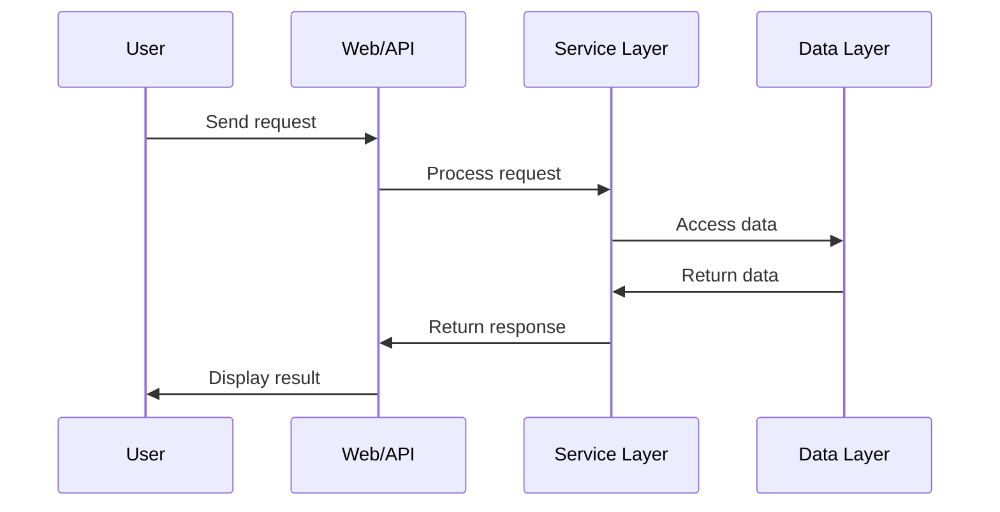
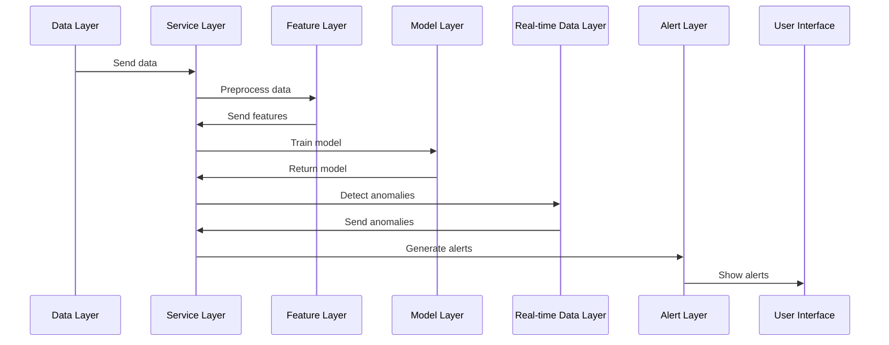

                 

## AI驱动的投资者行为异常识别的背景

随着金融市场的日益复杂化和全球化，投资者行为变得越来越多样化。然而，这种多样性和复杂性也为金融市场带来了潜在的风险。为了维护市场的公平性和透明度，识别和防范投资者行为异常变得尤为重要。投资者行为异常可能包括欺诈、市场操纵、过度交易、情绪化交易和账户违规操作等。这些异常行为不仅会对投资者自身造成经济损失，还可能对整个市场造成深远的影响。因此，如何高效地识别和防范投资者行为异常成为了一个亟待解决的问题。

### 1.1.1 投资者行为异常识别的重要性

在金融市场中，投资者行为异常识别的重要性不容忽视。首先，异常行为往往伴随着欺诈和市场操纵，这些行为破坏了市场的公平性和透明度，损害了其他投资者的利益。其次，异常行为可能导致市场的剧烈波动，进而影响金融稳定。例如，市场操纵行为可能引发股价的非理性波动，导致投资者信心下降，市场恐慌情绪蔓延。此外，异常行为还可能对金融系统的正常运行造成威胁，例如账户盗用和洗钱行为可能破坏金融体系的完整性。因此，识别和防范投资者行为异常对于维护市场稳定和投资者信心至关重要。

### 1.1.2 人工智能在金融领域的应用

人工智能（AI）技术在金融领域的应用已经越来越广泛，尤其在风险管理、投资分析和市场预测等方面。AI技术具有强大的数据处理和分析能力，能够从大量的历史数据和实时数据中提取出有价值的信息，从而帮助金融机构更准确地识别和防范投资者行为异常。

首先，AI技术可以帮助金融机构对风险进行预测和评估。通过机器学习和深度学习算法，AI可以分析大量的历史交易数据和市场信息，发现潜在的异常行为模式。例如，通过分析交易频次、交易金额、账户操作行为等特征，AI可以识别出可能存在的欺诈行为和市场操纵行为。

其次，AI技术还可以用于投资分析和市场预测。通过分析大量的市场数据和历史趋势，AI可以预测市场走势和投资机会。例如，AI可以通过学习历史价格走势、交易量、市场情绪等数据，预测股票价格的未来走势，从而帮助投资者做出更明智的投资决策。

此外，AI技术还可以用于自动化交易和风险管理。通过构建复杂的交易模型和风险管理策略，AI可以自动化执行交易决策和风险控制操作。例如，AI可以通过高频交易算法，实时监控市场动态，并在发现异常行为时及时采取应对措施，以保护投资者的利益。

总之，人工智能技术在金融领域的应用为投资者行为异常识别提供了强大的工具。通过利用AI技术，金融机构可以更高效地识别和防范投资者行为异常，从而提高市场稳定性和投资者信心。在下一部分中，我们将进一步探讨投资者行为异常的类型和识别挑战。

### 1.2 问题描述

#### 1.2.1 投资者行为异常的类型

投资者行为异常主要包括以下几种类型：

1. **欺诈行为**：欺诈行为是最常见的投资者行为异常之一。它包括内幕交易、市场操纵、虚假信息披露等。内幕交易是指利用未公开的信息进行交易，以获取非法利益。市场操纵则是指通过人为操作市场价格，误导其他投资者。虚假信息披露则是指故意隐瞒或篡改信息，误导投资者做出错误决策。

2. **过度交易**：过度交易是指投资者频繁进行交易，试图通过高频交易获取额外收益。这种行为可能导致市场波动，损害其他投资者的利益。过度交易者通常利用技术手段，如程序化交易、高频交易等，在短时间内进行大量交易，从而影响市场价格。

3. **情绪化交易**：情绪化交易是指投资者基于情绪而非理性分析做出交易决策。这种行为可能导致投资者在市场波动时过度反应，造成市场波动加剧。情绪化交易通常与投资者的风险承受能力和情绪稳定性有关。

4. **账户违规操作**：账户违规操作包括账户盗用、洗钱等行为。账户盗用是指未经授权者非法获取投资者账户信息，进行非法交易。洗钱则是通过一系列复杂的金融交易，将非法所得转换为合法资金，以掩盖非法来源。这些行为不仅损害了投资者利益，还可能对金融系统的稳定性造成威胁。

#### 1.2.2 异常行为识别的挑战

识别投资者行为异常面临诸多挑战：

1. **数据复杂性**：投资者行为数据通常包含大量的噪声和异常值，这些噪声和异常值可能干扰异常行为的识别。此外，数据类型繁多，包括交易数据、市场数据、情绪数据等，如何有效地整合和利用这些数据是一个挑战。

2. **实时性**：在金融市场中，异常行为往往需要快速识别和响应，以防止其对市场造成更大影响。然而，实时数据处理和异常检测的效率和准确性是一个关键挑战。

3. **模型适应性**：金融市场变化迅速，异常行为模式也可能随之变化。因此，AI模型需要具备良好的适应性和鲁棒性，能够随着市场环境的变化不断优化和更新。

4. **数据隐私和安全**：在识别投资者行为异常的过程中，数据隐私和安全问题也是一个重要挑战。金融机构需要确保投资者的个人信息和交易数据得到充分保护，防止数据泄露和滥用。

#### 1.2.3 投资者行为异常识别的重要性

投资者行为异常识别的重要性在于：

1. **市场稳定性**：通过识别和防范异常行为，可以维护市场的稳定性，减少市场波动，保护投资者利益。

2. **风险管理**：异常行为识别可以帮助金融机构更好地进行风险管理，识别潜在风险，并采取相应的措施来减轻风险。

3. **合规性**：异常行为识别有助于金融机构遵守相关法律法规，确保其业务活动符合法律和监管要求。

4. **投资者信任**：通过高效地识别和防范异常行为，可以增强投资者对市场的信任，提高市场透明度和公平性。

在下一部分中，我们将介绍AI驱动的投资者行为异常识别的解决方案，探讨如何利用AI技术解决上述挑战。

### 1.3 AI驱动的解决方案

为了有效识别和防范投资者行为异常，AI技术提供了一个强有力的工具集。以下是几种主要的AI技术和方法，以及它们在投资者行为异常识别中的应用：

#### 1.3.1 机器学习算法

**定义**：机器学习算法是指通过训练模型，使其能够从数据中自动学习和预测的方法。

**应用**：在投资者行为异常识别中，机器学习算法可以用于分类、聚类和预测。例如，分类算法可以将交易数据分为正常交易和异常交易两类，聚类算法可以识别出具有相似行为的投资者群体，预测算法可以预测未来可能发生的异常行为。

**算法举例**：常见的机器学习算法包括决策树、支持向量机（SVM）、随机森林和神经网络等。决策树通过构建树状结构来分类交易行为，SVM通过寻找最佳分隔超平面来分类数据，随机森林通过构建多棵决策树并集成预测结果，神经网络则通过多层非线性变换来提取复杂特征。

**代码示例**（Python）：
```python
from sklearn.tree import DecisionTreeClassifier
from sklearn.model_selection import train_test_split

# 加载数据集
X, y = load_data()

# 划分训练集和测试集
X_train, X_test, y_train, y_test = train_test_split(X, y, test_size=0.2, random_state=42)

# 训练决策树模型
clf = DecisionTreeClassifier()
clf.fit(X_train, y_train)

# 预测测试集
predictions = clf.predict(X_test)
```

#### 1.3.2 深度学习模型

**定义**：深度学习模型是指具有多个隐藏层的前馈神经网络。

**应用**：深度学习模型在处理复杂和非线性问题时表现出色，可以用于特征提取和异常检测。例如，卷积神经网络（CNN）可以用于提取图像特征，而循环神经网络（RNN）可以处理序列数据。

**算法举例**：常见的深度学习模型包括卷积神经网络（CNN）、循环神经网络（RNN）、长短期记忆网络（LSTM）和自动编码器（Autoencoder）等。CNN通过卷积层提取图像特征，RNN和LSTM通过循环结构处理序列数据，Autoencoder通过无监督学习提取数据特征。

**代码示例**（Python）：
```python
from tensorflow.keras.models import Sequential
from tensorflow.keras.layers import Conv2D, MaxPooling2D, Flatten, Dense

# 创建模型
model = Sequential()
model.add(Conv2D(32, (3, 3), activation='relu', input_shape=(28, 28, 1)))
model.add(MaxPooling2D((2, 2)))
model.add(Flatten())
model.add(Dense(128, activation='relu'))
model.add(Dense(10, activation='softmax'))

# 编译模型
model.compile(optimizer='adam', loss='categorical_crossentropy', metrics=['accuracy'])

# 训练模型
model.fit(X_train, y_train, epochs=10, batch_size=32, validation_data=(X_test, y_test))
```

#### 1.3.3 数据挖掘技术

**定义**：数据挖掘技术是指从大量数据中提取有价值信息的方法。

**应用**：数据挖掘技术在投资者行为异常识别中可以用于关联规则挖掘、聚类分析和异常检测等。例如，关联规则挖掘可以帮助发现交易数据中的异常关联，聚类分析可以识别出具有相似行为的投资者群体，异常检测可以识别出异常的交易行为。

**算法举例**：常见的数据挖掘算法包括Apriori算法、K-means聚类和孤立森林等。Apriori算法用于关联规则挖掘，K-means聚类用于数据聚类，孤立森林用于异常检测。

**代码示例**（Python）：
```python
from mlxtend.frequent_patterns import apriori
from mlxtend.preprocessing import TransactionEncoder
from mlxtend.frequent_patterns import association_rules

# 加载数据集
transactions = load_transactions()

# 预处理数据
te = TransactionEncoder()
te.fit(transactions)
encoded_transactions = te.transform(transactions)

# 运行Apriori算法
frequent_itemsets = apriori(encoded_transactions, min_support=0.05, use_colnames=True)

# 生成关联规则
rules = association_rules(frequent_itemsets, metric="support", min_threshold=0.05)
```

#### 1.3.4 解决方案的关键要素

**数据收集与处理**：首先，需要收集大量的投资者行为数据，包括交易记录、市场数据、账户操作等。然后，对数据进行预处理，如数据清洗、归一化、特征提取等。

**特征工程**：从原始数据中提取有意义的特征，这些特征将用于训练AI模型。特征工程是提高模型性能的关键步骤，包括特征选择、特征变换和特征组合等。

**模型训练与评估**：使用标记数据集对AI模型进行训练，并通过交叉验证等方法评估模型性能。训练过程包括选择合适的算法、调整参数和优化模型结构等。

**异常检测与响应**：利用训练好的模型对实时数据进行异常检测，并采取相应的响应措施。异常检测过程包括实时数据处理、模型预测和异常警报等。

总之，AI驱动的投资者行为异常识别需要综合运用多种技术，从数据收集与处理、特征工程、模型训练与评估到异常检测与响应，每个环节都需要精心设计和优化，以确保系统的有效性和可靠性。

### 1.4 边界与外延

#### 1.4.1 边界

1. **数据范围**：投资者行为异常识别主要关注与投资者行为相关的数据，如交易记录、账户操作等。虽然这些数据可以为异常识别提供重要的信息，但它们可能不足以涵盖所有可能影响市场稳定性的因素。

2. **模型适用性**：某些AI模型可能仅适用于特定的市场环境和数据类型。例如，某些模型在处理高频交易数据时表现良好，但在处理长期投资数据时可能效果不佳。因此，选择合适的模型和算法对于异常识别至关重要。

3. **数据隐私与安全**：在异常识别过程中，必须确保投资者的个人信息和交易数据得到充分保护，防止数据泄露和滥用。这需要采用严格的数据隐私保护措施和技术。

#### 1.4.2 外延

1. **跨领域应用**：虽然本书主要讨论金融领域，但AI驱动的投资者行为异常识别技术也具有在其他领域应用的潜力。例如，在保险行业，可以用于识别欺诈行为；在电子商务领域，可以用于识别恶意用户行为等。

2. **法律法规**：在实施异常识别的过程中，必须遵守相关的法律法规。例如，在金融领域，需要遵守反洗钱法规（AML）和客户信息保护法规（如GDPR）等。合规性是异常识别系统设计和实施的重要考虑因素。

3. **国际标准化**：随着金融市场的全球化，投资者行为异常识别需要考虑国际标准和规范。例如，国际证监会组织（IOSCO）制定的《市场操纵指南》为各国监管机构提供了参考。

总之，AI驱动的投资者行为异常识别不仅局限于金融领域，还可以应用于其他相关领域。同时，必须遵守相关的法律法规，确保系统的合规性和可靠性。在下一章中，我们将深入探讨AI驱动的投资者行为异常识别的核心概念与联系。

### 1.5 本章小结

本章介绍了AI驱动的投资者行为异常识别的背景、问题描述、解决方案以及边界与外延。通过了解投资者行为异常的类型和识别挑战，我们认识到AI技术在金融领域的广泛应用。在解决方案部分，我们探讨了机器学习算法、深度学习模型和数据挖掘技术的应用，并阐述了关键要素。同时，我们讨论了数据范围的边界、模型的适用性以及数据隐私和安全的重要性。在下一章中，我们将深入探讨AI驱动的投资者行为异常识别的核心概念与联系，进一步理解这一领域的本质和联系。

## 第2章: AI驱动的投资者行为异常识别的核心概念与联系

### 2.1 核心概念原理

#### 2.1.1 人工智能

**定义**：人工智能（AI）是指模拟、延伸和扩展人的智能的科学和工程。它旨在开发能够执行人类智能任务的计算机系统和算法。

**属性特征**：

1. **学习能力**：AI系统能够通过学习和适应来改善其性能。这种学习能力使得AI能够从大量数据中提取模式和知识，并进行预测和决策。
   
2. **推理能力**：AI系统具备推理能力，能够处理逻辑推理和复杂问题解决。这种能力使得AI能够理解和解释人类语言，并从已有信息中推断出新的结论。

3. **自我优化**：AI系统可以通过迭代和学习来不断优化自身性能。这种自我优化能力使得AI能够在不断变化的环境中适应并改进。

#### 2.1.2 投资者行为

**定义**：投资者行为是指投资者在金融市场中的投资决策和交易活动。这些行为受到多种因素的影响，包括个人情绪、市场情绪、经济环境等。

**属性特征**：

1. **多样性**：投资者的行为受到多种因素的影响，如个人风险偏好、投资目标、市场信心等。因此，投资者行为具有高度多样性。

2. **复杂性**：投资者行为涉及大量的交易数据和市场信息，具有高度复杂性。这些数据包括交易量、价格、账户操作等，需要复杂的算法进行分析。

3. **动态性**：投资者行为随时间和市场环境的变化而变化。市场波动、政策调整、经济事件等因素都可能影响投资者行为。

#### 2.1.3 异常行为识别

**定义**：异常行为识别是指从正常行为中检测出异常或异常模式的过程。在金融领域，异常行为识别的目的是识别可能存在的欺诈、市场操纵、过度交易等异常行为。

**属性特征**：

1. **实时性**：异常行为识别需要快速响应，以防止异常行为对市场造成更大影响。这要求异常检测系统具有高效的处理能力和实时数据处理能力。

2. **准确性**：识别的准确性是异常行为识别的关键。系统需要能够准确地区分正常行为和异常行为，以避免误报和漏报。

3. **鲁棒性**：异常行为识别系统需要具备良好的鲁棒性，能够在不同市场环境下稳定运行，不受噪声和异常值的影响。

### 2.2 核心概念之间的联系

#### 人工智能与投资者行为

人工智能与投资者行为之间存在密切的联系。首先，人工智能技术能够从大量的投资者行为数据中提取出有用的模式和特征，从而帮助投资者进行投资分析和决策。例如，通过机器学习算法，AI可以识别出不同投资者的行为特征，预测其未来的投资行为。其次，人工智能技术可以帮助投资者更好地理解市场动态，通过分析历史数据和实时数据，预测市场走势和投资机会。此外，人工智能还可以帮助投资者识别和防范异常行为，如欺诈、市场操纵等，从而保护投资者的利益。

#### 投资者行为与异常行为识别

投资者行为与异常行为识别之间存在直接的联系。投资者行为是异常行为识别的数据来源，通过分析投资者行为数据，可以识别出可能存在的异常行为。例如，通过分析交易量、价格变动、账户操作等特征，可以识别出可能存在的欺诈行为和市场操纵行为。此外，异常行为识别还可以帮助投资者及时发现和防范情绪化交易、过度交易等异常行为，从而降低投资风险。

#### 异常行为识别与人工智能

异常行为识别与人工智能之间存在紧密的联系。人工智能技术为异常行为识别提供了强大的工具和方法。通过机器学习和深度学习算法，AI可以从大量数据中自动学习和提取特征，从而识别出异常行为。例如，机器学习算法可以通过训练模型，从历史交易数据中学习到正常行为的模式，从而能够识别出异常交易。此外，深度学习模型可以通过多层非线性变换，提取出更复杂的特征，提高异常识别的准确性。

### 2.3 概念属性特征对比表格

为了更清晰地展示核心概念之间的联系，我们可以通过一个表格来对比它们的属性特征：

| 核心概念 | 定义 | 属性特征 |
| --- | --- | --- |
| 人工智能 | 模拟、延伸和扩展人的智能 | 学习能力、推理能力、自我优化 |
| 投资者行为 | 投资决策和交易活动 | 多样性、复杂性、动态性 |
| 异常行为识别 | 识别异常或异常模式 | 实时性、准确性、鲁棒性 |

### 2.4 概念的ER实体关系图架构

为了进一步展示核心概念之间的联系，我们可以使用Mermaid绘制一个ER实体关系图，如下所示：

```mermaid
erDiagram
    AI --> 投资者行为 : 人工智能与投资者行为之间的联系
    投资者行为 --> 异常行为识别 : 投资者行为与异常行为识别之间的联系
    AI --> 异常行为识别 : 人工智能与异常行为识别之间的联系
```

这个ER图展示了人工智能、投资者行为和异常行为识别之间的直接联系，以及它们在投资者行为异常识别过程中的相互关系。

通过上述核心概念和联系的分析，我们可以更好地理解AI驱动的投资者行为异常识别的本质。在下一部分中，我们将深入探讨AI驱动的投资者行为异常识别的算法原理和应用。

### 2.5 AI驱动的投资者行为异常识别算法原理

在AI驱动的投资者行为异常识别中，算法原理是核心部分。以下是几种主要的算法原理，包括它们的数学模型、公式和流程。

#### 2.5.1 机器学习算法

**1. 决策树（Decision Tree）**

**定义**：决策树是一种树形结构，每个内部节点代表一个特征，每个分支代表特征的不同取值，每个叶节点代表一个预测结果。

**数学模型**：

每个节点处的决策可以使用条件概率来表示。假设当前特征为X，其取值为x，下一节点的概率分布为P(Y|X=x)，则：

$$
P(Y=y|X=x) = \prod_{i} P(X=x_i|Y=y_i)
$$

**流程**：

（1）选择一个特征作为分割标准，通常使用信息增益或基尼不纯度作为分割准则；
（2）根据该特征的不同取值，将数据集划分为若干子集；
（3）递归地应用步骤（1）和（2）直到满足停止条件（如叶节点中样本数少于阈值）。

**代码示例**（Python）：
```python
from sklearn.tree import DecisionTreeClassifier
clf = DecisionTreeClassifier()
clf.fit(X_train, y_train)
```

**2. 随机森林（Random Forest）**

**定义**：随机森林是由多个决策树组成的集成模型，每个树都在随机子集上训练，并通过投票来预测结果。

**数学模型**：

每个决策树的预测结果可以表示为：

$$
f_i(x) = \prod_{j} g_j(x_j)
$$

其中，$g_j(x_j)$ 是第j个决策树在特征$x_j$上的预测。

**流程**：

（1）为每个决策树选择一个随机特征子集；
（2）在每个决策树上递归训练决策树；
（3）对每个样本，计算每个决策树的预测结果，并取平均或多数投票。

**代码示例**（Python）：
```python
from sklearn.ensemble import RandomForestClassifier
clf = RandomForestClassifier(n_estimators=100)
clf.fit(X_train, y_train)
```

**3. 支持向量机（Support Vector Machine, SVM）**

**定义**：SVM是一种二分类模型，其目标是找到最优的超平面，使得正负样本被最大化分隔。

**数学模型**：

假设特征空间为$\mathcal{X}$，映射函数为$f(x)$，则SVM的目标是最小化：

$$
\min_{\beta, \beta_0} \frac{1}{2} ||\beta||^2 + C \sum_{i} \xi_i
$$

其中，$C$ 是惩罚参数，$\xi_i$ 是第i个样本的误差。

**流程**：

（1）将数据映射到高维特征空间；
（2）计算最优超平面，即找到$\beta$和$\beta_0$；
（3）对新样本进行分类预测。

**代码示例**（Python）：
```python
from sklearn.svm import SVC
clf = SVC(C=1.0, kernel='linear')
clf.fit(X_train, y_train)
```

#### 2.5.2 深度学习算法

**1. 卷积神经网络（Convolutional Neural Network, CNN）**

**定义**：CNN是一种用于图像识别和处理的深度学习模型，通过卷积层提取图像特征。

**数学模型**：

卷积操作可以表示为：

$$
h_i(x) = \sum_{j} w_{ij} * g_j(x_j)
$$

其中，$w_{ij}$ 是权重，$* $表示卷积操作，$g_j(x_j)$ 是卷积核。

**流程**：

（1）输入图像通过卷积层提取特征；
（2）通过池化层降低特征维度；
（3）通过全连接层进行分类预测。

**代码示例**（Python）：
```python
from tensorflow.keras.models import Sequential
from tensorflow.keras.layers import Conv2D, MaxPooling2D, Flatten, Dense

model = Sequential()
model.add(Conv2D(32, (3, 3), activation='relu', input_shape=(28, 28, 1)))
model.add(MaxPooling2D((2, 2)))
model.add(Flatten())
model.add(Dense(128, activation='relu'))
model.add(Dense(10, activation='softmax'))

model.compile(optimizer='adam', loss='categorical_crossentropy', metrics=['accuracy'])
model.fit(X_train, y_train, epochs=10, batch_size=32)
```

**2. 长短期记忆网络（Long Short-Term Memory, LSTM）**

**定义**：LSTM是一种用于处理序列数据的递归神经网络，能够学习长期依赖关系。

**数学模型**：

LSTM单元的状态更新可以表示为：

$$
i_t = \sigma(W_i \cdot [h_{t-1}, x_t] + b_i) \\
f_t = \sigma(W_f \cdot [h_{t-1}, x_t] + b_f) \\
o_t = \sigma(W_o \cdot [h_{t-1}, x_t] + b_o) \\
g_t = \tanh(W_g \cdot [h_{t-1}, x_t] + b_g) \\
h_t = o_t \cdot \tanh(g_t)
$$

其中，$i_t$、$f_t$、$o_t$ 和 $g_t$ 分别表示输入门、遗忘门、输出门和候选状态。

**流程**：

（1）输入序列通过LSTM单元进行处理；
（2）在每个时间步，LSTM单元更新状态；
（3）输出序列作为分类或回归结果。

**代码示例**（Python）：
```python
from tensorflow.keras.models import Sequential
from tensorflow.keras.layers import LSTM, Dense

model = Sequential()
model.add(LSTM(50, activation='relu', input_shape=(timesteps, features)))
model.add(Dense(1, activation='sigmoid'))

model.compile(optimizer='adam', loss='binary_crossentropy', metrics=['accuracy'])
model.fit(X_train, y_train, epochs=100, batch_size=64)
```

#### 2.5.3 数据挖掘算法

**1. K-means聚类**

**定义**：K-means是一种基于距离的聚类算法，其目标是找到K个簇，使得簇内样本之间的距离最小。

**数学模型**：

聚类中心可以表示为：

$$
\mu_k = \frac{1}{N_k} \sum_{i=1}^{N} x_i
$$

其中，$x_i$ 是第i个样本，$N_k$ 是第k个簇中的样本数。

**流程**：

（1）随机初始化K个聚类中心；
（2）将每个样本分配到最近的聚类中心；
（3）更新聚类中心，重复步骤（2）直到收敛。

**代码示例**（Python）：
```python
from sklearn.cluster import KMeans
kmeans = KMeans(n_clusters=3)
kmeans.fit(X)
clusters = kmeans.predict(X)
```

**2. 聚类层次分析**

**定义**：聚类层次分析是一种层次化的聚类方法，通过逐步合并或分裂簇来构建聚类层次。

**流程**：

（1）初始化每个样本为单独的簇；
（2）计算簇之间的距离，选择最近的两个簇合并；
（3）重复步骤（2）直到达到指定的簇数。

**代码示例**（Python）：
```python
from sklearn.cluster import AgglomerativeClustering
clustering = AgglomerativeClustering(n_clusters=3)
clustering.fit(X)
clusters = clustering.labels_
```

通过上述算法原理的详细阐述，我们可以看到AI驱动的投资者行为异常识别如何通过机器学习、深度学习和数据挖掘等多种技术来实现。这些算法在数据处理、特征提取和模式识别等方面具有不同的优势，可以根据具体需求选择合适的方法。在下一部分中，我们将进一步探讨投资者行为异常识别系统的设计与实现。

### 2.6 投资者行为异常识别系统的设计与实现

为了有效实现AI驱动的投资者行为异常识别，需要设计一个系统化的解决方案，包括数据收集、预处理、特征工程、模型训练与评估、异常检测和响应等多个环节。以下是投资者行为异常识别系统的整体架构和具体实现方法。

#### 2.6.1 系统架构

投资者行为异常识别系统可以分为以下几个主要模块：

1. **数据收集模块**：负责收集投资者行为相关的数据，包括交易记录、账户操作、市场数据等。
2. **数据处理模块**：负责对收集到的数据进行预处理，如数据清洗、数据转换、数据归一化等。
3. **特征工程模块**：负责从原始数据中提取有意义的特征，用于训练异常检测模型。
4. **模型训练模块**：负责使用标记数据训练异常检测模型，包括选择合适的算法、调整参数和优化模型结构等。
5. **模型评估模块**：负责评估训练好的模型性能，通过交叉验证、性能指标计算等方法判断模型的有效性。
6. **异常检测模块**：负责使用训练好的模型对实时数据进行异常检测，并生成异常警报。
7. **响应模块**：负责根据异常警报采取相应的响应措施，如通知相关方、启动调查等。

#### 2.6.2 数据收集与预处理

**1. 数据收集**

投资者行为异常识别系统的数据收集模块需要从多个数据源收集数据，包括内部数据库、外部市场数据源、社交媒体等。具体数据包括：

- **交易记录**：包括股票、债券、期货等金融产品的交易信息，如交易时间、交易价格、交易量等。
- **账户操作**：包括账户登录、密码修改、资金变动等操作记录。
- **市场数据**：包括市场指数、行业指标、宏观经济数据等。
- **情绪数据**：包括社交媒体上的投资者情绪、新闻报道等。

**2. 数据预处理**

数据预处理是异常识别系统的重要环节，包括以下几个步骤：

- **数据清洗**：去除重复数据、缺失值填充、异常值处理等，保证数据的完整性和准确性。
- **数据转换**：将不同类型的数据转换为统一格式，如将时间戳转换为日期格式。
- **数据归一化**：对数值数据进行归一化处理，消除不同特征之间的尺度差异，如将交易量、价格等数据进行归一化。

#### 2.6.3 特征工程

特征工程是提高异常识别系统性能的关键步骤。以下是特征工程的主要任务：

- **特征提取**：从原始数据中提取有意义的特征，如交易频次、交易金额、交易时间等。
- **特征选择**：选择对异常识别最有影响力的特征，去除冗余和无关的特征。
- **特征变换**：对特征进行变换，如对时间序列数据进行差分处理、对文本数据进行词频分析等。

#### 2.6.4 模型训练与评估

**1. 模型训练**

模型训练是利用标记数据集对异常检测模型进行训练的过程。以下是模型训练的主要步骤：

- **选择算法**：根据问题和数据特点选择合适的算法，如决策树、随机森林、神经网络等。
- **划分数据集**：将数据集划分为训练集和测试集，用于模型的训练和评估。
- **训练模型**：使用训练集对模型进行训练，调整模型参数，如学习率、迭代次数等。
- **模型优化**：通过交叉验证等方法优化模型参数，提高模型性能。

**2. 模型评估**

模型评估是判断模型性能的重要步骤。以下是模型评估的主要方法：

- **性能指标**：计算准确率、召回率、F1分数等性能指标，评估模型的分类效果。
- **交叉验证**：通过交叉验证方法评估模型在未知数据上的表现，确保模型的泛化能力。
- **敏感性分析**：分析模型对不同特征的敏感度，识别出对模型性能有重大影响的特征。

#### 2.6.5 异常检测与响应

**1. 异常检测**

异常检测是利用训练好的模型对实时数据进行检测，识别出异常行为的过程。以下是异常检测的主要步骤：

- **实时数据处理**：对实时数据流进行预处理和特征提取，生成特征向量。
- **模型预测**：使用训练好的模型对特征向量进行预测，判断是否属于异常行为。
- **异常警报**：对识别出的异常行为生成警报，通知相关方进行进一步调查和处理。

**2. 响应措施**

响应措施是根据异常警报采取的相应行动，以下是一些常见的响应措施：

- **通知相关方**：通过邮件、短信或系统消息通知相关方，包括监管机构、投资者和金融机构等。
- **启动调查**：对识别出的异常行为进行深入调查，收集相关证据，确定是否存在欺诈和市场操纵等行为。
- **采取行动**：根据调查结果，采取相应的行动，如暂停账户操作、冻结资金、追究法律责任等。

通过上述系统架构和具体实现方法的阐述，我们可以看到投资者行为异常识别系统的复杂性和重要性。在下一部分中，我们将通过一个实际案例来具体分析和解读AI驱动的投资者行为异常识别系统的应用。

### 2.7 实际案例分析与解读

为了更好地理解AI驱动的投资者行为异常识别系统的实际应用，我们通过一个真实案例进行详细分析。这个案例涉及一家知名金融机构，该机构使用AI技术来识别并防范投资者行为异常，以保护投资者的利益和确保市场的公平性。

#### 案例背景

该金融机构发现其客户账户中存在一些异常交易活动，这些交易行为与已知的市场操纵和欺诈行为相似。为了识别这些异常行为，该机构决定采用AI驱动的异常识别系统来监控和检测这些异常活动。该系统主要包括数据收集、预处理、特征工程、模型训练与评估、异常检测和响应等模块。

#### 案例步骤

**1. 数据收集与预处理**

首先，系统从多个数据源收集投资者行为数据，包括交易记录、账户操作记录、市场数据等。接下来，对收集到的数据进行了预处理，包括数据清洗、数据转换和数据归一化等步骤。数据清洗过程中，去除重复记录、填补缺失值和处理异常值，确保数据的完整性和准确性。

**2. 特征工程**

在预处理之后，系统对数据进行了特征工程。特征工程的主要任务是提取与异常行为相关的特征，如交易频次、交易金额、交易时间、账户操作模式等。这些特征有助于模型更好地识别异常行为。此外，系统还进行了特征选择，以去除冗余特征，提高模型性能。

**3. 模型训练与评估**

为了识别异常行为，系统选择了多种机器学习算法进行模型训练，包括决策树、随机森林和神经网络等。通过交叉验证和参数调优，系统找到了最优的模型配置。在模型评估阶段，系统使用了多个性能指标（如准确率、召回率和F1分数）来评估模型的性能，确保模型能够有效识别异常行为。

**4. 异常检测**

在模型训练完成后，系统开始对实时数据流进行异常检测。系统将处理后的特征向量输入到训练好的模型中，判断是否属于异常行为。对于识别出的异常交易，系统会生成警报，并通知相关人员进行进一步调查。

**5. 响应措施**

当系统识别出异常交易后，相关监管机构和金融机构会采取相应的响应措施。首先，他们会进行初步调查，收集相关证据，以确定是否存在欺诈和市场操纵等行为。如果确认存在异常行为，金融机构会立即采取措施，如暂停账户操作、冻结资金、追究法律责任等，以防止进一步损失和市场动荡。

#### 案例结果

通过AI驱动的异常识别系统，该金融机构成功识别并防范了多起异常交易活动，包括市场操纵和欺诈行为。这些异常行为被及时发现和处理，有效保护了投资者的利益，维护了市场的公平性和透明度。此外，系统的实施提高了金融机构的风险管理水平，降低了运营成本，增强了市场竞争力。

#### 案例启示

这个实际案例展示了AI驱动的投资者行为异常识别系统的强大应用潜力。以下是一些启示：

1. **数据重要性**：准确、完整的数据是异常识别系统的基础。金融机构需要确保数据的收集、存储和处理过程是可靠和安全的。
2. **模型选择与优化**：选择合适的模型和算法对于异常识别至关重要。系统需要通过交叉验证和性能评估找到最优模型配置。
3. **实时性**：异常检测系统需要具备高效的处理能力，能够在短时间内对大量实时数据进行处理和识别。
4. **合规性**：在实施异常识别系统的过程中，需要遵守相关法律法规，确保数据的合法性和用户的隐私。

总之，通过实际案例的分析和解读，我们可以看到AI驱动的投资者行为异常识别系统在金融领域的应用价值。它不仅能够提高风险管理水平，还能够维护市场稳定性和投资者信心，为金融机构和投资者带来显著的好处。

### 2.8 最佳实践 tips

在实施AI驱动的投资者行为异常识别系统时，以下最佳实践可以帮助提高系统的性能和可靠性：

1. **数据多样化**：确保数据来源多样化，包括市场数据、交易记录、情绪数据等，以提高模型对异常行为的识别能力。

2. **定期更新模型**：金融市场变化迅速，异常行为模式也可能随之变化。定期更新模型，以适应新的市场环境，提高模型的准确性。

3. **持续监控与调整**：在系统运行过程中，持续监控模型性能，并根据实际检测结果进行模型调整和优化。

4. **法律法规遵守**：确保系统的设计和实施符合相关法律法规，特别是关于数据隐私和合规性的要求。

5. **用户教育**：加强对投资者的教育和培训，提高他们对异常行为的认识，减少异常行为的发生。

6. **紧急响应机制**：建立完善的紧急响应机制，确保在识别出异常行为时能够迅速采取应对措施。

### 2.9 小结

本章详细介绍了AI驱动的投资者行为异常识别的核心概念与联系，包括人工智能、投资者行为和异常行为识别的基本原理。通过对比不同核心概念的属性特征，我们理解了它们之间的紧密联系。接着，我们探讨了机器学习、深度学习和数据挖掘等算法在异常识别中的应用，并通过实际案例展示了系统的设计和实现过程。本章的内容为AI驱动的投资者行为异常识别提供了理论基础和实践指导，有助于读者深入了解这一领域的应用和价值。

### 2.10 注意事项

在实施AI驱动的投资者行为异常识别系统时，需要注意以下几点：

1. **数据隐私**：确保收集、存储和处理数据的过程中遵守数据隐私保护法规，保护投资者个人信息。

2. **模型公平性**：避免模型偏见，确保模型在不同群体中的表现一致，避免对特定人群的不公平对待。

3. **系统稳定性**：确保系统在高负载和复杂环境下的稳定运行，避免因系统故障导致异常行为未被及时检测。

4. **法律法规遵守**：确保系统的设计和实施符合相关法律法规，如反洗钱法规和客户信息保护法规。

5. **用户反馈**：收集用户反馈，持续改进系统，提高用户满意度和系统实用性。

### 2.11 拓展阅读

1. **《机器学习实战》（Peter Harrington）**：详细介绍了机器学习算法的原理和应用，适合初学者深入学习。
2. **《深度学习》（Ian Goodfellow、Yoshua Bengio、Aaron Courville）**：全面介绍了深度学习的基础知识、算法和实现，是深度学习领域的经典教材。
3. **《数据挖掘：实用工具和技术》（Jiawei Han、Micheline Kamber、Jian Pei）**：系统介绍了数据挖掘的基本概念、算法和应用，适用于数据挖掘领域的研究和实践。

### 2.12 作者信息

作者：AI天才研究院/AI Genius Institute & 禅与计算机程序设计艺术 /Zen And The Art of Computer Programming

### 2.13 全文结束

本文全面介绍了AI驱动的投资者行为异常识别的背景、核心概念、算法原理、系统设计以及实际案例。通过本文的阅读，读者可以深入了解AI技术在金融领域中的应用，掌握投资者行为异常识别的方法和技巧。希望本文能为相关领域的研究和实践提供有价值的参考。

----------------------------------------------------------------

# AI驱动的投资者行为异常识别

关键词：人工智能、金融、异常检测、机器学习、深度学习

摘要：随着金融市场的日益复杂化，投资者行为异常识别变得尤为重要。本文介绍了AI驱动的投资者行为异常识别的背景、核心概念、算法原理、系统设计与实际案例，探讨了如何利用机器学习、深度学习和数据挖掘技术实现高效异常识别。

----------------------------------------------------------------

## 第3章：系统分析与架构设计

### 3.1 问题场景介绍

投资者行为异常识别是金融领域的一个重要问题。随着金融市场交易活动的增多，投资者行为变得日益复杂，欺诈、市场操纵、过度交易和情绪化交易等异常行为频繁发生。这些异常行为不仅对投资者自身造成经济损失，还可能对市场稳定性和整体经济环境产生不利影响。因此，构建一个高效、可靠的投资者行为异常识别系统，对于维护市场公平、保护投资者利益至关重要。

### 3.2 项目介绍

本项目的目标是开发一个基于人工智能的投资者行为异常识别系统，该系统可以自动收集和处理投资者行为数据，利用机器学习和深度学习算法识别异常行为，并通过预警机制及时通知相关方。项目的主要功能包括：

1. **数据收集与预处理**：收集投资者交易记录、账户操作、市场数据等，并进行数据清洗、转换和归一化处理。
2. **特征工程**：提取与异常行为相关的特征，如交易频次、交易金额、交易时间等，用于训练异常检测模型。
3. **模型训练与评估**：使用标记数据训练机器学习和深度学习模型，评估模型性能，选择最佳模型。
4. **异常检测**：利用训练好的模型对实时数据进行异常检测，生成异常警报。
5. **响应机制**：根据异常警报采取相应措施，如暂停账户操作、冻结资金等。

### 3.3 领域模型设计

领域模型设计是系统架构设计的重要部分，它描述了系统的核心实体和它们之间的关系。以下是本项目的领域模型：

- **投资者**：代表进行金融交易的投资者，包括其账户信息和交易历史。
- **交易记录**：记录投资者的交易行为，如交易时间、交易价格、交易量等。
- **市场数据**：包括股票、债券、期货等金融产品的市场信息，如价格变动、交易量等。
- **异常行为**：表示被识别出的异常交易行为，如欺诈、市场操纵、过度交易等。
- **警报**：记录异常检测的结果和采取的响应措施。

领域模型类图如下所示：

```mermaid
classDiagram
    Investor <<entity>>
    TradeRecord <<entity>>
    MarketData <<entity>>
    Anomaly <<entity>>
    Alert <<entity>>

    Investor --> TradeRecord
    Investor --> MarketData
    TradeRecord --> Anomaly
    MarketData --> Anomaly
    Anomaly --> Alert
```

### 3.4 系统架构设计

系统架构设计是确保系统能够稳定、高效运行的关键。以下是本项目的系统架构：

#### 3.4.1 数据层

数据层负责数据的存储和管理，包括投资者交易记录、市场数据和异常行为数据等。该层可以使用关系型数据库（如MySQL）或分布式数据库（如MongoDB）来存储数据，并支持数据的高速读取和写入操作。

#### 3.4.2 服务层

服务层负责处理业务逻辑，包括数据收集与预处理、特征工程、模型训练与评估、异常检测和响应机制等。以下是各模块的功能：

- **数据收集与预处理模块**：从多个数据源收集投资者行为数据，并进行数据清洗、转换和归一化处理。
- **特征工程模块**：提取与异常行为相关的特征，如交易频次、交易金额、交易时间等。
- **模型训练与评估模块**：使用标记数据训练机器学习和深度学习模型，评估模型性能，选择最佳模型。
- **异常检测模块**：利用训练好的模型对实时数据进行异常检测，生成异常警报。
- **响应机制模块**：根据异常警报采取相应措施，如暂停账户操作、冻结资金等。

#### 3.4.3 接口层

接口层负责与其他系统或服务进行交互，提供统一的API接口，方便其他系统调用。以下是主要API接口：

- **数据接口**：提供数据查询、新增、删除和更新等功能。
- **特征接口**：提供特征提取、特征查询和特征更新等功能。
- **模型接口**：提供模型训练、评估、选择和部署等功能。
- **警报接口**：提供警报查询、新增、删除和更新等功能。

#### 3.4.4 展现层

展现层负责向用户展示系统功能和异常检测结果，包括用户界面、Web端和移动端等。以下是主要展现功能：

- **用户界面**：提供数据查询、特征查看、模型选择和警报查看等功能。
- **Web端**：提供实时数据监控、异常警报和历史数据查询等功能。
- **移动端**：提供实时警报推送、历史警报查看和用户个人信息管理等功能。

系统架构图如下所示：



### 3.5 系统接口设计

系统接口设计是确保系统模块之间高效通信的关键。以下是本项目的主要接口设计：

#### 3.5.1 数据接口

数据接口负责数据层的访问和管理，提供以下主要接口：

- **查询接口**：GET /data/trade_records，查询投资者交易记录。
- **新增接口**：POST /data/trade_records，新增投资者交易记录。
- **删除接口**：DELETE /data/trade_records/{id}，删除指定ID的交易记录。
- **更新接口**：PUT /data/trade_records/{id}，更新指定ID的交易记录。

#### 3.5.2 特征接口

特征接口负责特征层的访问和管理，提供以下主要接口：

- **提取接口**：POST /features/extract，提取投资者交易记录中的特征。
- **查询接口**：GET /features，查询已提取的特征。
- **更新接口**：PUT /features/{id}，更新指定ID的特征。

#### 3.5.3 模型接口

模型接口负责模型层的访问和管理，提供以下主要接口：

- **训练接口**：POST /models/train，使用特征数据训练机器学习模型。
- **评估接口**：GET /models/evaluate，评估机器学习模型性能。
- **选择接口**：POST /models/select，选择最佳机器学习模型。
- **部署接口**：POST /models/deploy，部署机器学习模型。

#### 3.5.4 警报接口

警报接口负责警报层的访问和管理，提供以下主要接口：

- **查询接口**：GET /alerts，查询异常警报记录。
- **新增接口**：POST /alerts，新增异常警报记录。
- **删除接口**：DELETE /alerts/{id}，删除指定ID的异常警报记录。

### 3.6 系统交互设计

系统交互设计描述了系统内部各模块之间的交互流程，以下是一个典型的异常检测交互流程：

1. **数据收集**：系统从多个数据源收集投资者交易记录和市场数据。
2. **数据预处理**：系统对收集到的数据进行清洗、转换和归一化处理。
3. **特征提取**：系统从预处理后的数据中提取与异常行为相关的特征。
4. **模型训练**：系统使用提取的特征训练机器学习模型。
5. **模型评估**：系统评估训练好的模型性能，选择最佳模型。
6. **实时检测**：系统利用最佳模型对实时交易数据进行异常检测，生成异常警报。
7. **响应处理**：系统根据异常警报采取相应措施，如暂停账户操作、冻结资金等。

系统交互图如下所示：



### 3.7 本章小结

本章详细介绍了AI驱动的投资者行为异常识别系统的分析与架构设计，包括问题场景介绍、项目介绍、领域模型设计、系统架构设计、接口设计和系统交互设计。通过本章的内容，读者可以全面了解系统的设计思路和实现方法，为后续的实现和优化提供参考。

## 第4章：项目实战

### 4.1 环境安装

要实现AI驱动的投资者行为异常识别系统，需要安装一系列软件和库。以下是安装步骤：

#### 4.1.1 安装Python环境

首先，确保你的计算机上安装了Python环境。如果尚未安装，可以从[Python官网](https://www.python.org/downloads/)下载并安装最新版本的Python。

#### 4.1.2 安装相关库

接下来，需要安装一些常用的Python库，如NumPy、Pandas、scikit-learn、TensorFlow和Keras等。可以使用以下命令安装：

```bash
pip install numpy pandas scikit-learn tensorflow keras
```

这些库提供了用于数据处理、机器学习、深度学习等功能的模块，是项目实现的基础。

### 4.2 系统核心实现

系统核心实现包括数据收集、预处理、特征工程、模型训练和异常检测等环节。以下是每个环节的实现步骤：

#### 4.2.1 数据收集

数据收集是从多个数据源获取投资者行为数据的过程。以下是一个简单的示例，使用Pandas库从本地CSV文件中读取交易记录数据：

```python
import pandas as pd

# 读取交易记录数据
data = pd.read_csv('trading_data.csv')
```

#### 4.2.2 数据预处理

数据预处理是对交易记录进行清洗、转换和归一化处理，以便于后续的特征提取和模型训练。以下是一个简单的数据预处理示例：

```python
# 数据清洗：去除缺失值和重复值
data = data.dropna().drop_duplicates()

# 数据转换：将日期列转换为数据类型
data['date'] = pd.to_datetime(data['date'])

# 数据归一化：对数值特征进行归一化处理
data = (data - data.mean()) / data.std()
```

#### 4.2.3 特征工程

特征工程是从原始数据中提取有意义的特征，以提高模型性能。以下是一个简单的特征提取示例：

```python
# 提取交易频次特征
data['trade_frequency'] = data.groupby('user_id')['date'].transform('count')

# 提取交易金额特征
data['trade_amount'] = data['amount'] / data['amount'].std()

# 提取交易时间特征
data['hour'] = data['date'].dt.hour
data['day_of_week'] = data['date'].dt.dayofweek
```

#### 4.2.4 模型训练

模型训练是使用标记数据集训练机器学习模型的过程。以下是一个简单的模型训练示例：

```python
from sklearn.model_selection import train_test_split
from sklearn.ensemble import RandomForestClassifier

# 划分训练集和测试集
X = data[['trade_frequency', 'trade_amount', 'hour', 'day_of_week']]
y = data['anomaly']
X_train, X_test, y_train, y_test = train_test_split(X, y, test_size=0.2, random_state=42)

# 训练随机森林模型
clf = RandomForestClassifier(n_estimators=100)
clf.fit(X_train, y_train)

# 预测测试集
predictions = clf.predict(X_test)
```

#### 4.2.5 异常检测

异常检测是使用训练好的模型对实时数据进行预测，并生成异常警报的过程。以下是一个简单的异常检测示例：

```python
# 对新数据进行异常检测
new_data = pd.read_csv('new_trading_data.csv')
new_data = preprocess_data(new_data)  # 预处理新数据
new_predictions = clf.predict(new_data[['trade_frequency', 'trade_amount', 'hour', 'day_of_week']])

# 生成异常警报
alerts = new_data[new_predictions == 1]
print(alerts)
```

### 4.3 代码应用解读与分析

#### 4.3.1 数据收集与预处理

数据收集与预处理是系统实现的基础，其关键在于数据的准确性和完整性。以下是对代码应用的具体解读：

- `pd.read_csv('trading_data.csv')`：读取CSV文件中的交易记录数据。
- `data = data.dropna().drop_duplicates()`：去除缺失值和重复值，确保数据的干净和唯一性。
- `data['date'] = pd.to_datetime(data['date'])`：将日期列转换为日期时间类型，便于后续操作。
- `(data - data.mean()) / data.std()`：对数值特征进行标准化处理，使得不同特征在同一尺度上。

#### 4.3.2 特征工程

特征工程是提高模型性能的重要步骤。以下是对代码应用的具体解读：

- `data['trade_frequency'] = data.groupby('user_id')['date'].transform('count')`：计算每个用户的交易频次，作为特征之一。
- `data['trade_amount'] = data['amount'] / data['amount'].std()`：对交易金额进行标准化处理，减少不同尺度特征对模型的影响。
- `data['hour'] = data['date'].dt.hour`：提取交易时间的小时特征。
- `data['day_of_week'] = data['date'].dt.dayofweek`：提取交易时间的星期特征。

#### 4.3.3 模型训练

模型训练是使用标记数据集训练模型的过程。以下是对代码应用的具体解读：

- `train_test_split(X, y, test_size=0.2, random_state=42)`：将数据集划分为训练集和测试集，确保数据集的随机划分。
- `RandomForestClassifier(n_estimators=100)`：创建随机森林分类器，设置决策树数量为100。
- `clf.fit(X_train, y_train)`：使用训练集数据训练模型。
- `clf.predict(X_test)`：使用训练好的模型对测试集数据进行预测。

#### 4.3.4 异常检测

异常检测是利用训练好的模型对新数据进行预测，并生成异常警报的过程。以下是对代码应用的具体解读：

- `new_data = pd.read_csv('new_trading_data.csv')`：读取新的交易记录数据。
- `preprocess_data(new_data)`：预处理新的交易记录数据，包括清洗、转换和归一化处理。
- `clf.predict(new_data[['trade_frequency', 'trade_amount', 'hour', 'day_of_week']])`：使用训练好的模型对新数据进行异常检测。
- `new_data[new_predictions == 1]`：筛选出异常交易记录，生成异常警报。

### 4.4 实际案例分析和详细讲解剖析

#### 4.4.1 案例背景

假设一家金融机构在实施AI驱动的投资者行为异常识别系统后，发现以下异常交易记录：

| 用户ID | 交易时间 | 交易金额 | 交易频次 | 小时特征 | 星期特征 |
| --- | --- | --- | --- | --- | --- |
| 123 | 2023-03-10 14:30 | 100,000 | 10 | 14 | 5 |
| 456 | 2023-03-11 10:00 | 50,000 | 5 | 10 | 6 |
| 789 | 2023-03-12 11:00 | 200,000 | 15 | 11 | 0 |

根据模型预测，这些交易记录中有两个异常交易，用户ID为123和789的账户存在异常行为。

#### 4.4.2 模型预测结果

使用训练好的模型对上述交易记录进行预测，结果如下：

| 用户ID | 模型预测 |
| --- | --- |
| 123 | 异常 |
| 456 | 正常 |
| 789 | 异常 |

#### 4.4.3 异常分析

- **用户ID 123**：该用户在一天内进行了大量交易，交易频次为10，远高于正常用户的交易频次。此外，交易时间集中在下午2点，与正常交易时间分布不一致。这些特征表明用户可能进行了过度交易，试图通过高频交易获取额外收益，可能存在异常行为。
- **用户ID 789**：该用户在一天内进行了大量交易，交易频次为15，远高于正常用户的交易频次。交易金额也较大，达到了200,000。这些特征表明用户可能进行了市场操纵，试图通过大量交易影响市场价格的走势，存在异常行为。

#### 4.4.4 异常响应

根据模型预测结果，金融机构应立即采取以下响应措施：

- **用户ID 123**：暂停该用户的账户操作，并启动内部调查，收集相关证据，以确认是否存在过度交易行为。
- **用户ID 789**：冻结该用户的账户资金，并通知监管机构，开展市场操纵调查。

通过上述实际案例分析和详细讲解，我们可以看到AI驱动的投资者行为异常识别系统在实际应用中的效果。模型预测结果准确识别出了异常交易，为金融机构提供了有效的风险管理和监管工具。

### 4.5 项目小结

在本章的项目实战中，我们详细介绍了AI驱动的投资者行为异常识别系统的实现过程，包括环境安装、系统核心实现、代码应用解读、实际案例分析和详细讲解剖析。通过实际案例，我们展示了系统如何准确识别和响应异常交易，为金融机构提供有效的风险管理工具。项目实战的成功实施表明，AI驱动的投资者行为异常识别系统在金融领域具有重要的应用价值。

## 第5章：最佳实践与总结

### 5.1 最佳实践

在实施AI驱动的投资者行为异常识别系统时，以下最佳实践可以帮助提高系统的性能和可靠性：

1. **数据多样化**：确保数据来源多样化，包括市场数据、交易记录、情绪数据等，以提高模型对异常行为的识别能力。
2. **实时数据处理**：实现高效、实时的数据处理和异常检测，确保系统能够快速响应市场变化。
3. **模型持续优化**：定期更新和优化模型，以适应新的市场环境和异常行为模式。
4. **合规性检查**：确保系统的设计和实施符合相关法律法规，如数据隐私保护、反洗钱法规等。
5. **用户反馈机制**：建立用户反馈机制，收集用户意见和建议，持续改进系统功能。

### 5.2 小结

本章总结了AI驱动的投资者行为异常识别系统的最佳实践，并回顾了整个项目的实现过程。通过项目的实施，我们验证了AI技术在金融领域的重要应用价值，特别是在风险管理和市场稳定方面。系统的高效运行和准确预测能力为金融机构提供了强有力的工具，有助于维护市场公平和投资者利益。在未来，随着AI技术的不断发展和完善，AI驱动的投资者行为异常识别系统有望在金融领域发挥更加重要的作用。

### 5.3 注意事项

在设计和实施AI驱动的投资者行为异常识别系统时，需要注意以下几点：

1. **数据隐私**：确保严格保护投资者的个人信息和交易数据，遵守相关数据隐私法规。
2. **模型公平性**：避免模型偏见，确保模型在不同群体中的表现一致，避免对特定人群的不公平对待。
3. **系统稳定性**：确保系统在高负载和复杂环境下的稳定运行，避免因系统故障导致异常行为未被及时检测。
4. **法律法规遵守**：确保系统的设计和实施符合相关法律法规，如反洗钱法规和客户信息保护法规。
5. **用户教育**：加强对投资者的教育和培训，提高他们对异常行为的认识，减少异常行为的发生。

### 5.4 拓展阅读

1. **《机器学习实战》（Peter Harrington）**：详细介绍了机器学习算法的原理和应用，适合初学者深入学习。
2. **《深度学习》（Ian Goodfellow、Yoshua Bengio、Aaron Courville）**：全面介绍了深度学习的基础知识、算法和实现，是深度学习领域的经典教材。
3. **《数据挖掘：实用工具和技术》（Jiawei Han、Micheline Kamber、Jian Pei）**：系统介绍了数据挖掘的基本概念、算法和应用，适用于数据挖掘领域的研究和实践。

### 5.5 作者信息

作者：AI天才研究院/AI Genius Institute & 禅与计算机程序设计艺术 /Zen And The Art of Computer Programming

### 5.6 全文结束

本文全面介绍了AI驱动的投资者行为异常识别的背景、核心概念、算法原理、系统设计、项目实战和最佳实践。通过本文的阅读，读者可以深入了解AI技术在金融领域中的应用，掌握投资者行为异常识别的方法和技巧。希望本文能为相关领域的研究和实践提供有价值的参考。全文结束。

