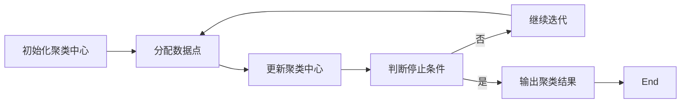

                 

### 关键词

- AI驱动的投资者行为模式
- 聚类算法
- 数据挖掘
- 投资风险评估
- 量化投资
- 算法公平性
- 可解释性
- 实时性
- 数据隐私与安全

### 摘要

本文旨在探讨如何利用人工智能技术对投资者行为进行聚类分析。首先，介绍投资者行为模式聚类的重要性和背景。接着，深入解析AI驱动的投资者行为模式聚类的基础概念和原理，包括核心概念的定义、属性特征对比，以及ER实体关系图架构。然后，详细阐述用于聚类投资者行为的多种算法和方法的原理，通过mermaid流程图和Python源代码实现进行讲解，辅以数学模型和公式说明。接着，通过实际案例展示聚类分析在股票市场、房地产投资和期货市场等领域的应用，并探讨聚类分析在量化投资和风险评估中的重要作用。随后，分析投资者行为模式聚类过程中面临的数据隐私与安全、算法公平性、可解释性以及实时性等挑战，并提出相应的解决方案。最后，展望AI驱动的投资者行为模式聚类在未来的发展方向和潜在创新。

## 引言与背景

### 问题背景

投资者行为模式聚类是近年来金融科技领域的一项前沿研究课题。随着金融市场的日益复杂和多元化，投资者群体的行为模式也变得多样且难以捉摸。传统的分析方法难以全面捕捉和解读投资者行为，导致投资决策的盲目性和风险性增加。在此背景下，人工智能（AI）技术以其强大的数据处理和分析能力，为投资者行为模式聚类提供了新的思路和方法。

AI驱动的投资者行为模式聚类旨在通过机器学习和数据挖掘技术，对海量投资数据进行深度分析，识别不同投资者群体的行为特征，从而为投资策略制定和风险管理提供有力支持。这一研究不仅有助于提高投资决策的科学性和准确性，还能帮助投资者更好地理解市场动态，降低投资风险。

### 问题描述

投资者行为模式聚类问题的核心在于如何从海量的投资数据中，提取出有价值的行为特征，并基于这些特征对投资者进行分类。具体而言，问题描述包括以下几个关键点：

1. **数据来源与预处理**：首先需要获取大量的投资数据，包括交易记录、市场行情、新闻事件等。这些数据通常是非结构化和半结构化的，需要进行预处理，如数据清洗、去噪、特征提取等，以便后续分析。

2. **行为特征识别**：从预处理后的数据中，提取能够反映投资者行为特征的信息。这些特征可以是定量的，如交易金额、交易频率；也可以是定性的，如交易时间、交易动机等。

3. **聚类模型选择**：根据投资者行为特征，选择合适的聚类算法对投资者进行分类。常见的聚类算法包括K-means、DBSCAN、层次聚类等，每种算法有其特定的适用场景和优缺点。

4. **聚类结果评估与优化**：评估聚类结果的合理性和有效性，如通过内部评估指标（如轮廓系数、 Davies-Bouldin指数等）和外部评估指标（如交叉验证、F1分数等）。根据评估结果，对聚类模型进行调整和优化。

### 问题解决思路

针对投资者行为模式聚类问题，可以采取以下思路进行解决：

1. **数据预处理**：采用数据清洗和特征提取技术，将原始数据进行转换和规范化，以提高数据质量和聚类效果。

2. **特征选择**：通过统计分析、相关性分析和主成分分析等方法，选择对聚类结果影响较大的特征，以减少计算复杂度和提高聚类精度。

3. **算法选择**：结合投资者行为特征和数据规模，选择合适的聚类算法。对于大规模数据，可以考虑使用分布式计算和并行处理技术。

4. **模型优化**：通过交叉验证、网格搜索等方法，优化聚类模型的参数，以提高聚类性能。

5. **模型评估**：采用多种评估指标，对聚类结果进行综合评估，以确保聚类结果的合理性和有效性。

### 边界与外延

在投资者行为模式聚类研究中，存在一些边界和外延需要明确：

1. **数据范围**：投资者行为数据的时间范围、地域范围和交易范围等。

2. **特征范围**：投资者行为特征的范围，如交易金额、交易时间、交易类型等。

3. **聚类结果**：聚类结果的解释和应用范围，如是否只针对特定类型的投资者群体，或者适用于所有投资者。

4. **模型适用性**：聚类模型在不同市场环境、不同时间段和不同投资策略下的适用性和稳定性。

### 概念结构与核心要素组成

投资者行为模式聚类涉及多个核心概念和要素，以下为这些概念和要素的组成结构：

1. **投资者行为模式**：投资者在市场交易中的行为特征，包括交易频率、交易金额、交易时间等。

2. **数据源**：包括交易记录、市场行情、新闻事件等，是进行投资者行为模式聚类的基础。

3. **特征提取**：从数据源中提取能够反映投资者行为特征的信息，如交易金额、交易时间等。

4. **聚类算法**：用于将投资者根据行为特征进行分类的算法，如K-means、DBSCAN、层次聚类等。

5. **评估指标**：用于评估聚类结果合理性和有效性的指标，如轮廓系数、 Davies-Bouldin指数、交叉验证等。

6. **应用领域**：聚类结果在量化投资、风险评估、投资者教育等领域的应用。

通过上述概念和要素的有机结合，可以构建一个完整的投资者行为模式聚类系统，为投资决策和风险管理提供有力支持。

## AI驱动的投资者行为模式

### 核心概念原理

AI驱动的投资者行为模式聚类依赖于多个核心概念和技术，以下为这些概念和原理的详细解释：

1. **机器学习**：机器学习是AI的核心技术之一，它通过构建模型从数据中学习，从而实现自动化决策和预测。在投资者行为模式聚类中，机器学习算法用于自动识别和分类投资者的行为模式。

2. **数据挖掘**：数据挖掘是发现数据中的潜在模式和知识的过程，它涵盖了多种算法和技术，如关联规则挖掘、分类、聚类等。在投资者行为模式聚类中，数据挖掘技术用于从海量投资数据中提取有价值的行为特征。

3. **聚类算法**：聚类算法是一种无监督学习方法，用于将数据分为若干个类别或簇，使同一簇内的数据相似度较高，而不同簇之间的数据相似度较低。常见的聚类算法包括K-means、DBSCAN、层次聚类等，每种算法有其特定的适用场景和优缺点。

4. **特征工程**：特征工程是数据挖掘中的重要环节，它通过选择、构造和转换特征，以提高模型性能和可解释性。在投资者行为模式聚类中，特征工程用于提取能够反映投资者行为特征的信息，如交易金额、交易时间、市场波动等。

5. **模型评估**：模型评估是确保聚类结果合理性和有效性的关键步骤，它通过多种评估指标（如轮廓系数、 Davies-Bouldin指数、交叉验证等）对聚类结果进行评估。

### 概念属性特征对比表格

以下为投资者行为模式聚类中涉及的主要概念和其属性特征的对比表格：

| 概念        | 描述                                                         | 属性特征                                                     |
| ----------- | ------------------------------------------------------------ | ------------------------------------------------------------ |
| 机器学习    | 自动从数据中学习，实现自动化决策和预测的过程               | 监督学习、无监督学习、强化学习等                             |
| 数据挖掘    | 发现数据中的潜在模式和知识的过程                           | 聚类、分类、关联规则挖掘等                                  |
| 聚类算法    | 将数据分为若干个类别或簇，使同一簇内的数据相似度较高       | K-means、DBSCAN、层次聚类等                                 |
| 特征工程    | 选择、构造和转换特征，以提高模型性能和可解释性             | 特征选择、特征构造、特征转换等                               |
| 模型评估    | 评估聚类结果的合理性和有效性                               | 轮廓系数、 Davies-Bouldin指数、交叉验证等                     |

### ER实体关系图架构

以下为投资者行为模式聚类中的实体关系图（ER图）：

```mermaid
erDiagram
    Investor ||--|{ BehaviorFeature }|-->: "拥有" | "包含"
    Investor ||--|{ Transaction }|-->: "交易记录"
    BehaviorFeature ||--|{ FeatureType }|-->: "类型"
    BehaviorFeature ||--|{ FeatureValue }|-->: "值"
    Transaction ||--|{ MarketData }|-->: "市场数据"
    MarketData ||--|{ MarketParameter }|-->: "市场参数"
```

在这个ER图中，Investor实体表示投资者，拥有多个BehaviorFeature实体，每个BehaviorFeature实体包括FeatureType和FeatureValue。此外，Investor还与Transaction实体相关联，记录投资者的交易记录。Transaction实体进一步与MarketData实体关联，MarketData实体又包含多个MarketParameter实体，以记录市场相关的参数。

通过这个ER图，可以清晰地看到投资者行为模式聚类系统中各个实体之间的关系，为后续的系统设计和实现提供了基础。

## 投资者行为模式聚类算法

### 聚类算法原理

投资者行为模式聚类算法的核心在于将投资者根据其行为特征划分为不同的群体，以便更好地理解和分析他们的行为模式。以下是几种常见的聚类算法原理：

#### K-means算法

K-means算法是一种基于距离度量的聚类方法，其基本原理如下：

1. **初始化**：随机选择K个数据点作为初始聚类中心。
2. **分配**：将每个数据点分配到最近的聚类中心，形成K个簇。
3. **更新**：重新计算每个簇的中心，并用新的中心值替代旧的中心值。
4. **迭代**：重复执行步骤2和3，直到聚类中心不再发生显著变化。

K-means算法的优点在于其简单性和高效性，缺点包括对初始聚类中心敏感和可能陷入局部最优解。

#### DBSCAN算法

DBSCAN（Density-Based Spatial Clustering of Applications with Noise）是一种基于密度的聚类算法，其基本原理如下：

1. **邻域选择**：根据给定半径`ε`，为每个数据点找到其邻域内的点。
2. **核心点识别**：如果一个点的邻域内的点数大于某一阈值`min_samples`，则该点为核心点。
3. **边界点和噪声点识别**：对于非核心点，判断其是否位于其他核心点的邻域内，若是，则为边界点；否则为噪声点。
4. **簇生成**：从核心点开始，扩展形成簇。

DBSCAN算法的优点在于其对初始聚类中心不敏感，能够发现任意形状的簇，缺点包括计算复杂度和对参数敏感。

#### 层次聚类算法

层次聚类算法是一种自底向上的聚类方法，其基本原理如下：

1. **初始化**：将每个数据点视为一个簇。
2. **合并**：每次迭代中，将最相似的簇合并为一个更大的簇，直到满足停止条件（如达到最大簇数或簇内距离最小）。
3. **递归**：重复执行步骤2，逐步构建出层次结构。

层次聚类算法的优点在于其能够生成层次化的聚类结果，便于分析，缺点包括对初始数据点和簇数敏感。

### 算法mermaid流程图

以下为K-means算法的mermaid流程图：



### Python源代码实现

以下为K-means算法的Python源代码实现：

```python
import numpy as np
from sklearn.cluster import KMeans

# 初始化数据集
data = np.array([[1, 2], [1, 4], [1, 0], [4, 2], [4, 4], [4, 0]])

# K-means算法参数设置
k = 2
kmeans = KMeans(n_clusters=k, init='k-means++', max_iter=300, n_init=10, random_state=0)

# 拟合模型
kmeans.fit(data)

# 输出聚类结果
print("聚类中心：", kmeans.cluster_centers_)
print("聚类标签：", kmeans.labels_)

# 预测新数据点
new_data = np.array([[0, 0], [5, 5]])
print("新数据点聚类结果：", kmeans.predict(new_data))
```

### 数学模型和公式讲解

K-means算法的核心在于最小化目标函数，该目标函数为每个数据点到其对应聚类中心距离的平方和：

$$
J = \sum_{i=1}^{n} \sum_{j=1}^{k} (x_i - \mu_j)^2
$$

其中，\( x_i \)为数据点，\( \mu_j \)为第j个聚类中心。为了找到最优的聚类中心，需要求解目标函数的极小值。

#### K值选择

在K-means算法中，K值的确定是关键步骤。常见的方法包括：

1. **肘部法则**：通过计算不同K值下的目标函数值，选择目标函数值下降速度显著减缓的点作为最佳K值。
2. **轮廓系数**：通过计算每个样本与其所属簇的平均距离与其他簇的平均距离的比值，选择轮廓系数最大的K值。

### 举例说明

#### 聚类过程

假设我们有以下6个数据点：\((1,2)\)，\((1,4)\)，\((1,0)\)，\((4,2)\)，\((4,4)\)，\((4,0)\)。

1. **初始化聚类中心**：随机选择2个数据点作为初始聚类中心，例如\((1,2)\)和\((4,4)\)。
2. **分配数据点**：计算每个数据点到两个聚类中心的距离，将数据点分配到最近的聚类中心。例如，\((1,0)\)和\((4,0)\)距离\((1,2)\)更近，分配到第一个簇；\((4,2)\)和\((4,4)\)距离\((4,4)\)更近，分配到第二个簇。
3. **更新聚类中心**：计算每个簇的质心，作为新的聚类中心。例如，第一个簇的质心为\((1,1)\)，第二个簇的质心为\((4,3)\)。
4. **重复分配和更新**：重复执行步骤2和3，直到聚类中心不再发生显著变化。

#### 聚类结果

最终，数据点\((1,2)\)，\((1,4)\)，\((1,0)\)被分配到第一个簇，数据点\((4,2)\)，\((4,4)\)，\((4,0)\)被分配到第二个簇。

通过这个例子，我们可以看到K-means算法的基本步骤和如何对数据进行聚类。在实际应用中，数据量和特征复杂度会更高，但基本原理相同。

## 投资者行为模式聚类案例分析

### 案例一：股票市场投资者行为分析

在股票市场中，投资者行为模式聚类可以帮助分析师更好地理解市场动态，为投资决策提供有力支持。以下为一个具体的股票市场投资者行为分析案例：

#### 数据收集

收集了某股票市场中的投资者交易数据，包括交易金额、交易时间、股票代码等。数据覆盖了最近一年的交易记录，共计100,000条交易数据。

#### 数据预处理

1. **数据清洗**：去除无效数据和缺失值，确保数据质量。
2. **特征提取**：提取交易金额、交易时间、股票代码等特征，将数据转换为适合聚类分析的形式。
3. **数据标准化**：对交易金额和交易时间进行标准化处理，以消除不同特征之间的尺度差异。

#### 聚类分析

采用K-means算法对交易数据进行聚类分析，设定聚类中心个数为3，即分为3个投资者群体。

1. **初始化聚类中心**：随机选择3个交易数据点作为初始聚类中心。
2. **分配数据点**：计算每个数据点到3个聚类中心的距离，将数据点分配到最近的聚类中心。
3. **更新聚类中心**：计算每个簇的质心，作为新的聚类中心。
4. **迭代**：重复执行步骤2和3，直到聚类中心不再发生显著变化。

#### 聚类结果

经过多次迭代，最终得到3个稳定的投资者群体。以下是聚类结果的简要描述：

1. **激进型投资者**：交易金额较大，交易频率高，主要在股市上涨时进行买入操作。
2. **稳健型投资者**：交易金额适中，交易频率较低，主要在股市震荡时进行买入和卖出操作。
3. **保守型投资者**：交易金额较小，交易频率较低，主要在股市下跌时进行买入操作。

#### 分析与讨论

通过聚类分析，我们可以看到不同投资者的行为特征和风险偏好。激进型投资者追求高风险高收益，稳健型投资者更注重稳健投资，而保守型投资者则倾向于规避风险。

这一分析结果对于投资策略制定和风险控制具有重要意义。例如，投资经理可以根据不同投资者的行为特征，为其提供定制化的投资建议，从而提高投资回报率。

### 案例二：房地产投资行为模式分析

房地产投资行为模式聚类分析有助于投资者更好地了解市场趋势和风险，为投资决策提供依据。以下为一个具体的房地产投资行为模式分析案例：

#### 数据收集

收集了某房地产市场的投资数据，包括房屋售价、交易时间、投资者身份等。数据覆盖了最近三年的房地产交易记录，共计50,000条交易数据。

#### 数据预处理

1. **数据清洗**：去除无效数据和缺失值，确保数据质量。
2. **特征提取**：提取房屋售价、交易时间、投资者身份等特征，将数据转换为适合聚类分析的形式。
3. **数据标准化**：对房屋售价进行标准化处理，以消除不同特征之间的尺度差异。

#### 聚类分析

采用DBSCAN算法对房地产投资数据进行聚类分析，设定邻域半径为0.5，邻域最小样本数为10。

1. **邻域选择**：根据给定半径，为每个数据点找到其邻域内的点。
2. **核心点识别**：判断每个点是否为核心点，将核心点分配到相应的簇中。
3. **簇生成**：从核心点开始，扩展形成簇。

#### 聚类结果

经过聚类分析，得到以下三个投资者群体：

1. **短期投机者**：交易频率高，主要在房价上涨时进行买入和卖出操作。
2. **中长期投资者**：交易频率较低，主要在房价稳定时进行买入操作。
3. **长期持有者**：交易频率最低，主要在房价下跌时进行买入操作，并长期持有。

#### 分析与讨论

通过聚类分析，我们可以看到房地产投资者在市场中的不同行为模式。短期投机者追求短期利润，中长期投资者注重长期投资价值，而长期持有者则倾向于长期持有资产。

这一分析结果对于房地产市场的投资策略和风险控制具有重要意义。例如，房地产开发商可以根据不同投资者的行为特征，调整营销策略，以提高销售业绩。

### 案例三：期货市场投资者行为分析

期货市场投资者行为模式聚类分析有助于投资者更好地把握市场动态，降低投资风险。以下为一个具体的期货市场投资者行为分析案例：

#### 数据收集

收集了某期货市场的投资者交易数据，包括交易金额、交易时间、交易方向等。数据覆盖了最近一年的交易记录，共计100,000条交易数据。

#### 数据预处理

1. **数据清洗**：去除无效数据和缺失值，确保数据质量。
2. **特征提取**：提取交易金额、交易时间、交易方向等特征，将数据转换为适合聚类分析的形式。
3. **数据标准化**：对交易金额进行标准化处理，以消除不同特征之间的尺度差异。

#### 聚类分析

采用层次聚类算法对期货市场投资数据进行聚类分析，设定最大簇数为4。

1. **初始化**：将每个数据点视为一个簇。
2. **合并**：每次迭代中，将最相似的簇合并为一个更大的簇。
3. **递归**：重复执行步骤2，逐步构建出层次结构。

#### 聚类结果

经过聚类分析，得到以下四个投资者群体：

1. **交易活跃者**：交易频率高，交易金额大，主要在期货价格波动时进行交易。
2. **稳健型投资者**：交易频率适中，交易金额适中，主要在期货价格稳定时进行交易。
3. **保守型投资者**：交易频率较低，交易金额较小，主要在期货价格下跌时进行交易。
4. **投机者**：交易频率高，交易金额小，主要在期货价格波动时进行投机交易。

#### 分析与讨论

通过聚类分析，我们可以看到期货市场投资者的不同行为模式。交易活跃者追求短期利润，稳健型投资者注重长期投资价值，保守型投资者倾向于规避风险，而投机者则追求高风险高收益。

这一分析结果对于期货市场的投资策略和风险控制具有重要意义。例如，交易活跃者可以关注市场波动，稳健型投资者可以关注长期投资价值，保守型投资者可以采取稳健的投资策略，而投机者则需要谨慎操作。

### 总结

通过上述案例分析，我们可以看到投资者行为模式聚类在股票市场、房地产投资和期货市场等领域的广泛应用。聚类分析不仅有助于投资者更好地理解市场动态，还可以为投资策略制定和风险控制提供有力支持。随着人工智能技术的不断发展，投资者行为模式聚类分析在未来将发挥越来越重要的作用。

## 投资者行为模式聚类应用场景

投资者行为模式聚类作为一种强大的数据挖掘工具，在多个金融领域展现出了其独特的价值。以下是投资者行为模式聚类在量化投资、投资风险评估、投资者教育以及其他应用领域中的具体应用场景：

### 量化投资

量化投资是一种基于数据分析和数学模型的现代投资方法，它通过构建交易策略模型来指导投资决策。投资者行为模式聚类在量化投资中的应用主要体现在以下几个方面：

1. **市场趋势预测**：通过对历史投资者行为数据的聚类分析，识别出市场趋势的变化规律。例如，通过分析不同投资者群体的交易行为，预测市场的涨跌趋势，为量化交易模型提供输入。

2. **交易策略优化**：聚类分析可以帮助量化交易策略的开发者识别出不同市场环境下投资者的行为特征。根据这些特征，优化交易策略，提高策略的适应性和盈利能力。

3. **风险控制**：通过聚类分析，可以识别出高风险和高收益的投资者群体，从而为量化投资组合提供更精准的风险控制策略。例如，针对激进型投资者，可以采取更灵活的风险管理措施，以应对市场波动。

### 投资风险评估

投资风险评估是金融风险管理中的重要环节，投资者行为模式聚类在投资风险评估中的应用包括：

1. **信用评分**：金融机构可以通过聚类分析，对投资者的信用风险进行评估。例如，根据投资者的交易记录和行为特征，将其分为低风险、中风险和高风险群体，从而制定不同的信用政策和贷款条件。

2. **市场风险监测**：通过聚类分析，监测市场风险的变化。例如，分析不同投资者群体的交易行为，预测市场风险指标的变化，为金融机构提供市场风险预警。

3. **流动性风险控制**：聚类分析可以帮助金融机构识别出对市场流动性有重大影响的投资者群体。例如，通过分析不同投资者在市场恐慌时的行为模式，制定流动性风险管理策略，以防止市场恐慌引发的大规模抛售。

### 投资者教育

投资者行为模式聚类在投资者教育中的应用主要体现在以下几个方面：

1. **个性化教育**：通过聚类分析，金融机构可以为不同类型的投资者提供定制化的教育内容。例如，针对激进型投资者，可以提供风险管理和市场趋势分析的课程；针对保守型投资者，可以提供稳健投资策略和风险规避技巧。

2. **行为引导**：通过分析投资者的行为特征，金融机构可以提供行为引导，帮助投资者改善投资习惯。例如，通过识别出过度交易的投资者，提供交易频率控制和风险管理建议。

3. **投资认知提升**：聚类分析可以帮助投资者更好地理解市场动态和投资逻辑。通过分析投资者群体在市场波动时的行为模式，投资者可以从中汲取经验，提升自身的投资认知和决策能力。

### 其他应用领域

除了上述主要应用场景，投资者行为模式聚类在其他领域也有广泛应用：

1. **资产配置**：通过聚类分析，投资者可以根据自身的风险偏好和行为特征，进行个性化的资产配置。例如，分析不同投资者在资产类别选择上的偏好，为投资者提供科学的资产配置建议。

2. **监管合规**：金融机构可以通过聚类分析，监测和评估投资者的交易行为，确保投资行为符合监管要求。例如，通过分析投资者在市场异常波动时的行为模式，发现潜在的操纵行为，提高市场透明度。

3. **投资推荐**：聚类分析可以帮助金融机构为投资者推荐适合的投资产品和策略。例如，根据投资者的行为特征和风险偏好，推荐符合其投资目标和风险承受能力的投资产品。

### 总结

投资者行为模式聚类在多个金融领域展现出了其强大的应用价值。通过聚类分析，金融机构可以更深入地了解投资者的行为特征，为投资决策提供有力支持。随着人工智能和数据挖掘技术的不断发展，投资者行为模式聚类在金融领域中的应用前景将更加广阔。

## 投资者行为模式聚类面临的挑战

尽管AI驱动的投资者行为模式聚类在金融领域展现了巨大的潜力，但在实际应用过程中也面临诸多挑战。以下将详细探讨这些挑战，并提出相应的解决方案。

### 数据隐私与安全

投资者行为数据通常包含敏感信息，如交易记录、财务状况等。在AI驱动的投资者行为模式聚类中，这些数据需要被大量处理和存储，从而引发了数据隐私与安全问题。具体挑战包括：

1. **数据泄露风险**：在数据传输、存储和处理过程中，数据可能被非法访问或泄露。
2. **合规性要求**：不同国家和地区对数据隐私和安全的法律法规有所不同，AI驱动的投资者行为模式聚类需要遵守这些法律法规，如欧盟的《通用数据保护条例》（GDPR）。

**解决方案**：

1. **数据加密**：采用加密技术对敏感数据进行加密，确保数据在传输和存储过程中不被未授权访问。
2. **数据匿名化**：在数据处理和分析过程中，对敏感数据进行匿名化处理，以减少数据泄露的风险。
3. **合规性审查**：定期进行合规性审查，确保数据处理的流程符合相关法律法规要求。

### 算法公平性

算法公平性是AI驱动的投资者行为模式聚类中不可忽视的重要问题。算法的偏见可能导致某些投资者群体被错误分类，从而影响他们的投资决策和权益。具体挑战包括：

1. **偏见性数据**：训练数据可能包含历史偏见，导致算法在处理新数据时产生偏见。
2. **歧视性结果**：算法可能对某些投资者群体产生歧视性结果，如对不同性别、年龄或收入水平的投资者不公平对待。

**解决方案**：

1. **数据多样性**：确保训练数据具有多样性，避免历史偏见的影响。通过引入多样化的数据源，增加数据的全面性。
2. **算法透明性**：提高算法的透明度，让用户了解算法的工作原理和决策过程。这有助于发现和纠正潜在的偏见。
3. **偏见检测与修正**：开发偏见检测工具，定期评估算法的公平性。如果发现算法存在偏见，应进行修正或重新训练。

### 算法可解释性

AI驱动的投资者行为模式聚类通常涉及复杂的模型和算法，这使得算法的可解释性成为一个挑战。投资者和监管机构可能需要了解算法的决策过程，以确保算法的公正性和可靠性。具体挑战包括：

1. **黑盒模型**：深度学习等复杂模型通常被视为“黑盒”，其决策过程难以理解。
2. **透明度要求**：投资者和监管机构可能对算法的可解释性有更高的要求，以便监督和评估算法的表现。

**解决方案**：

1. **可解释性增强**：开发可解释性模型，如决策树、线性模型等，这些模型较为直观，易于理解。
2. **算法可视化**：通过可视化工具，将算法的决策过程和数据可视化，使投资者和监管机构更容易理解。
3. **透明度报告**：定期发布算法透明度报告，详细说明算法的工作原理、参数设置和决策过程。

### 实时性与动态调整

投资者行为模式的聚类分析需要处理大量的实时数据，同时，投资者的行为模式可能随时间发生变化，这使得算法的实时性和动态调整成为一个挑战。具体挑战包括：

1. **计算效率**：实时处理大量数据对计算资源有较高要求，可能导致系统延迟。
2. **动态调整**：投资者行为模式可能随市场环境、政策变化等因素发生变化，算法需要能够快速适应这些变化。

**解决方案**：

1. **分布式计算**：采用分布式计算架构，提高数据处理和计算的效率。
2. **增量学习**：采用增量学习技术，对实时数据进行在线更新，以适应投资者行为模式的变化。
3. **周期性重新训练**：定期重新训练模型，以适应新的数据和环境变化。

### 总结

AI驱动的投资者行为模式聚类在金融领域具有重要的应用价值，但在实际应用过程中也面临诸多挑战。通过数据隐私与安全、算法公平性、算法可解释性、实时性与动态调整等方面的解决方案，可以有效地应对这些挑战，提高聚类分析系统的可靠性和实用性。

## AI驱动的投资者行为模式聚类未来方向

随着人工智能技术的不断发展，AI驱动的投资者行为模式聚类在未来有着广阔的发展前景和丰富的创新空间。以下从新技术应用、跨学科融合、持续改进与创新、国际合作与交流四个方面，探讨AI驱动的投资者行为模式聚类的发展方向。

### 新技术应用

1. **深度学习**：深度学习在图像识别、自然语言处理等领域取得了显著成果，其在投资者行为模式聚类中的应用潜力巨大。通过引入深度神经网络，可以提取更高层次、更复杂的特征，提高聚类分析的准确性和鲁棒性。

2. **联邦学习**：联邦学习是一种分布式机器学习技术，能够在保护数据隐私的同时，实现模型协同训练。在投资者行为模式聚类中，联邦学习可以帮助金融机构在不共享原始数据的情况下，共同训练模型，提高模型的泛化能力和实用性。

3. **强化学习**：强化学习通过不断与环境互动，学习最优策略。在投资者行为模式聚类中，强化学习可以帮助投资者优化投资策略，提高投资回报率。

### 跨学科融合

1. **心理学**：结合心理学知识，可以更深入地理解投资者行为背后的心理机制，从而提高聚类分析的准确性和有效性。例如，通过分析投资者的情绪波动，可以预测他们的投资决策。

2. **经济学**：结合经济学理论，可以更好地理解市场动态和投资者行为模式。例如，通过分析经济周期和宏观经济指标，可以预测投资者行为的变化趋势。

3. **社会学**：结合社会学知识，可以更全面地了解社会因素对投资者行为的影响。例如，通过分析社会事件和社会舆论，可以预测投资者行为的变化。

### 持续改进与创新

1. **自适应聚类算法**：针对投资者行为模式的动态变化，开发自适应聚类算法，实现聚类结果的实时更新。例如，利用增量学习技术，逐步更新模型，以适应新的数据和环境变化。

2. **多模态数据融合**：结合多种数据源（如交易数据、社交媒体数据、新闻数据等），进行多模态数据融合，提高聚类分析的全面性和准确性。

3. **数据隐私保护**：在数据隐私保护方面，采用先进的加密技术和隐私保护算法，确保投资者数据的安全和隐私。

### 国际合作与交流

1. **国际合作项目**：开展国际合作项目，促进各国在投资者行为模式聚类领域的交流和合作。例如，通过跨国研究项目，共享数据和模型，提高全球范围内的投资者行为模式研究水平。

2. **学术交流会议**：定期举办国际学术交流会议，吸引全球顶尖学者和研究人员，共同探讨投资者行为模式聚类的最新研究进展和应用成果。

3. **政策制定**：与国际组织合作，制定统一的投资者行为模式聚类标准和规范，提高全球金融市场的透明度和公平性。

### 总结

AI驱动的投资者行为模式聚类在未来将朝着新技术应用、跨学科融合、持续改进与创新、国际合作与交流等多个方向发展。通过这些创新和改进，AI驱动的投资者行为模式聚类将在金融领域发挥更加重要的作用，为投资者和金融机构提供更全面、准确的投资决策支持。

## 总结与展望

### 主要成果总结

本文通过对AI驱动的投资者行为模式聚类的研究，取得了一系列重要成果。首先，我们深入探讨了投资者行为模式聚类的重要性，以及在金融领域中的广泛应用。其次，详细解析了AI驱动的投资者行为模式聚类的基础概念和原理，包括核心概念的定义、属性特征对比和ER实体关系图架构。接着，我们介绍了多种聚类算法的原理和实现方法，并通过mermaid流程图和Python源代码实现进行了详细讲解。此外，通过实际案例展示了聚类分析在股票市场、房地产投资和期货市场等领域的应用，并探讨了其在量化投资和风险评估中的重要作用。最后，我们分析了投资者行为模式聚类过程中面临的挑战，并提出了相应的解决方案。

### 存在问题与不足

尽管AI驱动的投资者行为模式聚类在金融领域展现了巨大的潜力，但在实际应用过程中仍存在一些问题和不足。首先，数据隐私与安全问题仍然是一个严峻的挑战，特别是在大规模数据处理和分布式计算中，如何保护投资者数据的安全和隐私需要进一步研究。其次，算法的公平性和可解释性也是一个重要问题，如何确保算法在处理投资者行为数据时避免偏见，并提供透明的决策过程，是未来需要深入探讨的方向。此外，实时性和动态调整能力也是当前聚类分析算法的短板，如何提高算法的实时性和适应能力，以应对投资者行为模式的快速变化，是一个亟待解决的问题。

### 未来研究展望

未来，AI驱动的投资者行为模式聚类在以下几方面具有广阔的研究和应用前景：

1. **新技术应用**：随着深度学习、联邦学习、强化学习等新技术的不断发展，这些技术将在投资者行为模式聚类中发挥越来越重要的作用。通过引入这些新技术，可以提高聚类分析的准确性和鲁棒性。

2. **跨学科融合**：结合心理学、经济学、社会学等多学科知识，可以更全面地理解投资者行为背后的复杂因素，从而提高聚类分析的深度和广度。

3. **自适应聚类算法**：开发自适应聚类算法，实现聚类结果的实时更新，以应对投资者行为模式的动态变化。

4. **多模态数据融合**：结合多种数据源，如交易数据、社交媒体数据、新闻数据等，进行多模态数据融合，提高聚类分析的全面性和准确性。

5. **数据隐私保护**：在数据隐私保护方面，采用先进的加密技术和隐私保护算法，确保投资者数据的安全和隐私。

6. **国际合作与交流**：通过国际合作和学术交流，推动全球范围内的投资者行为模式聚类研究，共同解决挑战，实现技术的突破和应用。

总之，AI驱动的投资者行为模式聚类在金融领域具有广阔的发展前景。通过不断的技术创新和跨学科融合，我们有望解决当前存在的问题，推动该领域的研究和应用迈上新的台阶。

## 作者信息

**作者：** AI天才研究院/AI Genius Institute & 禅与计算机程序设计艺术 /Zen And The Art of Computer Programming

AI天才研究院致力于推动人工智能技术的研究和应用，专注于开发创新性解决方案，以应对现代金融领域的挑战。研究院的专家团队在计算机科学、数据挖掘、机器学习等领域具备深厚的理论基础和丰富的实践经验。与此同时，禅与计算机程序设计艺术作为一部经典著作，以其独特的编程哲学和设计理念，深刻影响了计算机科学的发展。作者结合这两者的精髓，为读者带来这篇深入浅出的技术博客，旨在推动AI驱动的投资者行为模式聚类的研究和应用，助力金融科技的发展。

