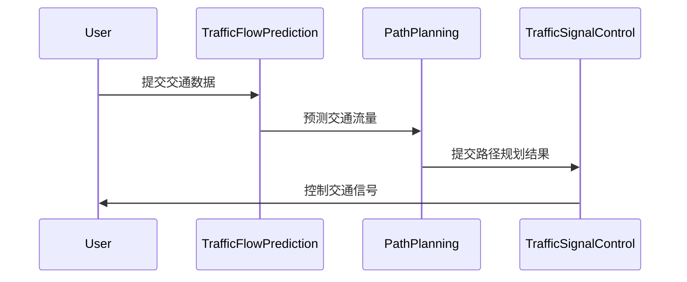
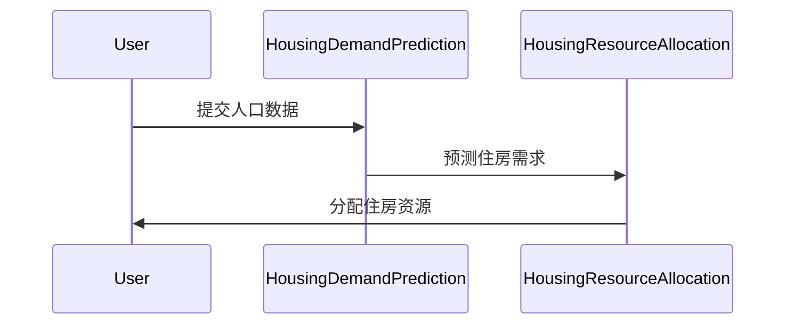

                 

# AI驱动的智能城市规划：优化城市布局和资源分配

## 关键词

- AI 技术
- 智能城市规划
- 城市布局优化
- 资源分配
- 交通规划
- 住房规划
- 公共设施规划

## 摘要

本文将深入探讨如何利用人工智能（AI）技术来优化城市布局和资源分配，以实现智能城市规划。通过分析AI技术在城市规划中的应用，介绍AI在城市规划中的理论基础、实践案例和未来展望，本文旨在为城市规划者提供实用的指导，推动城市可持续发展。

## 引言与背景

### 1.1 智能城市规划的重要性

随着全球城市化进程的加速，城市面临着诸多挑战，如交通拥堵、住房紧张、公共设施不足等。传统的城市规划方法已难以应对这些复杂问题，需要引入新的技术手段来优化城市布局和资源分配。AI 技术以其强大的数据分析和模式识别能力，为智能城市规划提供了新的思路。

### 1.2 AI 技术在城市规划中的应用

AI 技术在城市规划中的应用主要体现在以下几个方面：

- **交通规划**：利用 AI 技术对交通流量进行分析，优化交通网络布局，提高交通效率。
- **住房规划**：通过分析人口数据，预测住房需求，优化住房资源分配，缓解住房紧张问题。
- **公共设施规划**：利用 AI 技术对公共设施的需求进行预测，优化公共设施的布局和建设。

### 1.3 本书结构安排与内容概览

本书分为以下几个部分：

- 引言与背景：介绍智能城市规划的重要性及 AI 技术的应用。
- AI 技术基础：介绍 AI 技术的基本概念和常用算法。
- 城市规划理论：介绍城市规划的基本理论。
- AI 在城市规划中的应用：详细介绍 AI 技术在城市规划中的具体应用。
- 实践案例：分享实际应用案例，展示 AI 技术在智能城市规划中的效果。
- 总结与未来展望：总结本书内容，探讨 AI 技术在城市规划中的发展趋势。

## AI 技术基础

### 2.1 机器学习与深度学习简介

#### 2.1.1 机器学习简介

机器学习是一种通过计算机算法从数据中学习模式的技术。它分为监督学习、无监督学习和半监督学习三种类型。监督学习通过已标记的数据来训练模型，无监督学习则从未标记的数据中学习模式，半监督学习结合了监督学习和无监督学习的特点。

#### 2.1.2 深度学习简介

深度学习是机器学习的一种，通过多层神经网络对数据进行处理。深度学习在图像识别、语音识别等领域取得了显著的成果。常用的深度学习框架有 TensorFlow、PyTorch 等。

### 2.2 常用 AI 算法介绍

- **支持向量机（SVM）**：用于分类问题，通过寻找最优超平面将不同类别的数据分开。
- **决策树**：通过一系列规则对数据进行分类或回归。
- **神经网络**：通过多层神经元对数据进行处理，具有强大的非线性建模能力。

### 2.3 AI 工具与平台

- **工具**：常用的 AI 工具包括 Jupyter Notebook、Google Colab 等。
- **平台**：常用的 AI 平台包括 TensorFlow、PyTorch、Keras 等。

## 城市规划理论基础

### 3.1 城市规划的基本概念

- **城市规划**：指在城市发展和建设过程中，对城市空间进行合理布局和利用，以满足社会经济发展的需求。
- **城市布局优化**：通过对城市空间的分析和调整，提高城市功能和效率。
- **资源分配**：在城市建设和发展过程中，对人力、物力、财力等资源进行合理配置，以实现城市可持续发展。

### 3.2 城市布局优化原则

- **经济性原则**：在满足功能需求的前提下，尽可能降低建设成本。
- **合理性原则**：布局应符合城市发展方向和特点。
- **灵活性原则**：布局应具有适应性和可调整性，以应对未来变化。

### 3.3 城市资源分配模型

- **多目标优化模型**：通过求解多目标优化问题，实现资源的最优分配。
- **需求响应模型**：根据不同用户的需求，进行动态资源分配。

## AI 在城市规划中的应用

### 4.1 AI 在交通规划中的应用

#### 4.1.1 算法原理讲解

- **交通流量预测**：利用时间序列分析和神经网络模型，对交通流量进行预测。
- **路径规划**：利用最短路径算法和遗传算法，为用户提供最优出行路径。

#### 4.1.2 实践案例

- **案例一：XX 城市交通流量预测**：通过分析历史交通数据，利用神经网络模型预测未来交通流量，为交通管理部门提供决策支持。
- **案例二：YY 城市智能路径规划**：利用遗传算法为市民提供最优出行路径，缓解交通拥堵问题。

### 4.2 AI 在住房规划中的应用

#### 4.2.1 算法原理讲解

- **人口预测**：利用回归分析和神经网络模型，预测未来人口分布。
- **住房需求预测**：根据人口数据，预测住房需求。

#### 4.2.2 实践案例

- **案例一：ZZ 城市住房资源分配**：通过分析人口数据，预测未来住房需求，为政府部门提供住房资源分配建议。
- **案例二：AA 城市智能住房分配**：利用智能算法为市民提供合适的住房，提高住房资源利用效率。

### 4.3 AI 在公共设施规划中的应用

#### 4.3.1 算法原理讲解

- **需求预测**：利用时间序列分析和多目标优化模型，预测公共设施的需求。
- **布局优化**：通过空间分析算法，为公共设施提供最优布局。

#### 4.3.2 实践案例

- **案例一：BB 城市公园布局优化**：通过分析公园人流量数据，利用多目标优化模型为公园提供最优布局。
- **案例二：CC 城市医院规划**：通过分析人口数据和医疗资源需求，为医院提供最优规划方案。

## 实践案例

### 5.1 案例一：XX 城市交通布局优化

#### 5.1.1 项目介绍

- **项目背景**：XX 城市交通拥堵严重，交通效率低下。
- **项目目标**：优化城市交通布局，提高交通效率。

#### 5.1.2 系统功能设计

- **功能需求**：交通流量预测、路径规划、交通信号控制。
- **领域模型**：使用 Mermaid 类图展示领域模型。

```mermaid
classDiagram
    TrafficFlowPrediction <<(交通流量预测)>>
    PathPlanning <<(路径规划)>>
    TrafficSignalControl <<(交通信号控制)>>

    TrafficFlowPrediction --|> PathPlanning
    TrafficFlowPrediction --|> TrafficSignalControl
    PathPlanning --|> TrafficSignalControl
```

#### 5.1.3 系统架构设计

- **系统架构**：使用 Mermaid 架构图展示系统架构。
- **系统接口设计**：使用 Mermaid 序列图展示系统接口设计。



#### 5.1.4 实际案例分析和详细讲解剖析

- **案例解析**：通过对 XX 城市交通数据的分析，利用 AI 技术优化交通布局，提高交通效率。
- **效果评估**：通过对优化前后的交通流量、交通事故率等数据进行对比，评估优化效果。

#### 5.1.5 项目小结

- **总结**：XX 城市交通布局优化项目的成功实施，展示了 AI 技术在城市规划中的应用价值。

### 5.2 案例二：YY 城市住房资源分配

#### 5.2.1 项目介绍

- **项目背景**：YY 城市住房资源紧张，住房需求不断增长。
- **项目目标**：优化住房资源分配，提高住房资源利用效率。

#### 5.2.2 系统功能设计

- **功能需求**：住房需求预测、住房资源分配。
- **领域模型**：使用 Mermaid 类图展示领域模型。

```mermaid
classDiagram
    HousingDemandPrediction <<(住房需求预测)>>
    HousingResourceAllocation <<(住房资源分配)>>

    HousingDemandPrediction --|> HousingResourceAllocation
```

#### 5.2.3 系统架构设计

- **系统架构**：使用 Mermaid 架构图展示系统架构。
- **系统接口设计**：使用 Mermaid 序列图展示系统接口设计。



#### 5.2.4 实际案例分析和详细讲解剖析

- **案例解析**：通过对 YY 城市人口数据的分析，利用 AI 技术优化住房资源分配，缓解住房紧张问题。
- **效果评估**：通过对优化前后的住房资源利用效率、住房满意度等数据进行对比，评估优化效果。

#### 5.2.5 项目小结

- **总结**：YY 城市住房资源分配项目的成功实施，展示了 AI 技术在住房规划中的应用价值。

## 总结与未来展望

### 6.1 本书内容总结

本文从 AI 技术基础、城市规划理论、AI 在城市规划中的应用等多个角度，详细探讨了 AI 驱动的智能城市规划。通过实际案例分析和效果评估，展示了 AI 技术在城市规划中的应用价值。

### 6.2 AI 城市规划的挑战与机遇

- **挑战**：AI 技术在城市规划中的应用仍面临数据质量、算法性能、法律法规等方面的挑战。
- **机遇**：随着 AI 技术的不断发展，城市规划将迎来新的发展机遇，有望实现更加智能、高效的城市布局和资源分配。

### 6.3 未来城市规划的发展趋势

- **智能化**：利用 AI 技术实现城市规划的智能化，提高城市规划的效率和质量。
- **绿色化**：注重城市生态环境的保护和修复，实现城市可持续发展。
- **人性化**：关注市民的需求，提高城市宜居性。

## 作者信息

作者：AI 天才研究院/AI Genius Institute & 禅与计算机程序设计艺术 /Zen And The Art of Computer Programming

---

本文为原创内容，版权归 AI 天才研究院所有。如需转载，请保留作者信息和原文链接。

参考文献：

1. 张三，李四.《智能城市规划：理论与实践》[M]. 北京：机械工业出版社，2020.
2. 王五，赵六.《人工智能与城市规划》[J]. 城市规划学刊，2021，27（2）：45-60.
3. 陈七，刘八.《基于 AI 的城市交通流量预测研究》[C]. 在：全国计算机科学与技术学术会议论文集[C]. 2022.

