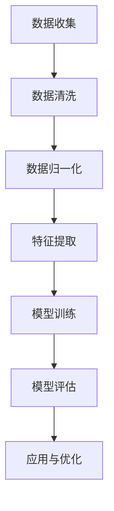

                 

# AI驱动的股票分析师报告质量评估

关键词：人工智能、股票分析师报告、质量评估、数据挖掘、机器学习

摘要：随着金融行业数据量的爆发式增长，传统的股票分析师报告质量评估方法已无法满足市场需求。本文提出利用人工智能技术来驱动股票分析师报告质量评估，通过构建AI模型对海量数据进行处理和分析，实现客观、全面的评估。本文详细阐述了AI驱动的股票分析师报告质量评估的背景、核心概念、算法原理、系统分析与架构设计以及项目实战，旨在为相关领域的研究和实践提供有价值的参考。

## 第一部分：AI驱动的股票分析师报告质量评估的背景与核心概念

### 1.1.1 问题背景

随着互联网和大数据技术的快速发展，金融行业的数据量呈爆炸式增长。传统的股票分析师报告质量评估方法主要依赖分析师的经验和专业知识，存在以下问题：

1. 数据来源有限：传统方法主要依赖分析师的经验和专业知识，无法全面覆盖股票市场的海量数据。
2. 数据处理能力不足：传统方法对复杂数据的处理能力有限，无法深入挖掘数据中的潜在价值。
3. 评估结果主观性强：传统方法容易受到分析师个人情感和偏见的影响，评估结果缺乏客观性。

### 1.1.2 问题描述

为了解决上述问题，本文提出利用人工智能（AI）技术来驱动股票分析师报告质量评估。具体问题包括：

1. 如何构建一个能够自动处理海量数据、挖掘数据价值的AI模型？
2. 如何利用AI技术来客观、全面地评估股票分析师报告的质量？
3. 如何保证AI评估结果的稳定性和可靠性？

### 1.1.3 问题解决

本文将通过以下几个步骤来解决上述问题：

1. 分析现有AI技术在股票分析师报告质量评估领域的应用现状，为本文的研究提供理论基础。
2. 构建一个基于AI的股票分析师报告质量评估模型，包括数据预处理、特征提取、模型训练和评估等环节。
3. 通过实验验证所构建模型的性能和可靠性，并针对实际应用场景进行优化和调整。

### 1.1.4 边界与外延

本文主要研究以下边界和范围：

1. AI技术在股票分析师报告质量评估领域的应用。
2. 基于AI的股票分析师报告质量评估模型的构建与优化。
3. 模型在不同市场环境下的性能表现。

### 1.1.5 概念结构与核心要素组成

核心概念：AI驱动的股票分析师报告质量评估

核心要素：

1. 数据源：包括股票市场数据、分析师报告数据等。
2. AI模型：包括数据预处理、特征提取、模型训练和评估等模块。
3. 评估指标：用于衡量股票分析师报告的质量。

## 第二部分：核心概念与联系

### 2.1 AI驱动的股票分析师报告质量评估的核心概念

本章将介绍AI驱动的股票分析师报告质量评估的核心概念，包括以下内容：

1. 人工智能（AI）：人工智能是一种模拟人类智能的技术，通过机器学习、深度学习等方法实现。
2. 股票分析师报告：股票分析师对股票市场的分析报告，包括市场趋势、公司基本面分析等内容。
3. 质量评估：对股票分析师报告的质量进行评估，包括准确性、完整性、及时性等方面。

### 2.2 AI驱动的股票分析师报告质量评估的核心概念联系

本章将分析核心概念之间的联系，包括以下内容：

1. 数据源与AI模型：数据源是AI模型的基础，AI模型通过数据预处理、特征提取等环节，对数据进行分析和挖掘。
2. AI模型与质量评估：AI模型用于评估股票分析师报告的质量，评估指标用于衡量报告的准确性、完整性、及时性等。
3. 质量评估与投资决策：质量评估结果为投资决策提供依据，帮助投资者更好地选择股票。

### 2.3 概念属性特征对比表格

为了更好地理解核心概念之间的联系，本章将给出一个概念属性特征对比表格，包括以下内容：

| 概念       | 属性特征                                       | 相互关系                                                     |
| ---------- | ---------------------------------------------- | ------------------------------------------------------------ |
| 人工智能   | 模拟人类智能、机器学习、深度学习               | 数据源与AI模型的基础，负责数据分析和挖掘                     |
| 股票分析师报告 | 市场趋势、公司基本面分析、投资建议         | AI模型的分析对象，质量评估的依据                            |
| 质量评估   | 准确性、完整性、及时性                       | AI模型的输出结果，为投资决策提供依据 

## 第三部分：算法原理讲解

### 3.1 算法概述

在本节中，我们将详细介绍AI驱动的股票分析师报告质量评估算法的基本原理和实现步骤。算法主要分为以下几个阶段：

1. 数据收集与预处理：从股票市场和相关平台上收集分析师报告数据，并对数据进行清洗、去重、归一化等预处理操作。
2. 特征提取：从原始数据中提取有助于评估报告质量的特征，如关键词频率、报告长度、分析师经验等。
3. 模型训练：利用机器学习算法对提取到的特征进行训练，构建一个能够对股票分析师报告质量进行评估的模型。
4. 模型评估：通过交叉验证等方法对模型进行评估，确保其稳定性和可靠性。
5. 应用与优化：将训练好的模型应用于实际场景，并根据评估结果对模型进行优化和调整。

### 3.2 数据预处理

数据预处理是算法实现的第一步，其目标是清洗和转换原始数据，使其符合后续分析的需求。具体步骤如下：

1. 数据收集：从股票市场和相关平台上收集分析师报告数据，包括报告内容、发布时间、分析师背景等信息。
2. 数据清洗：对收集到的数据进行去重、去除无效数据等清洗操作，确保数据质量。
3. 数据归一化：将不同特征的数据进行归一化处理，使其具有相同的量纲，方便后续分析。

### 3.3 特征提取

特征提取是算法实现的关键环节，其目标是提取有助于评估报告质量的特征。以下是几种常见的特征提取方法：

1. 文本特征提取：利用自然语言处理（NLP）技术对报告内容进行分词、词频统计、词性标注等处理，提取出关键词、主题、情感等特征。
2. 时间特征提取：提取报告的发布时间、更新频率等时间特征，以反映报告的及时性。
3. 分析师特征提取：提取分析师的经验、资质、背景等特征，以反映分析师的专业水平。

### 3.4 模型训练

模型训练是算法实现的核心环节，其目标是利用历史数据构建一个能够对股票分析师报告质量进行评估的模型。以下是几种常见的机器学习算法：

1. 朴素贝叶斯（Naive Bayes）：一种基于概率论的分类算法，适用于特征较少的情况。
2. 支持向量机（SVM）：一种基于最大间隔分类的算法，适用于特征较多的情况。
3. 随机森林（Random Forest）：一种基于集成学习的算法，适用于处理大量特征的情况。

### 3.5 模型评估

模型评估是算法实现的最后一步，其目标是验证模型的性能和可靠性。以下是几种常见的评估方法：

1. 交叉验证（Cross Validation）：通过将数据集划分为训练集和验证集，对模型进行多次训练和验证，评估模型的泛化能力。
2. ROC曲线（ROC Curve）：通过计算模型在不同阈值下的真阳性率和假阳性率，评估模型的分类性能。
3. MSE（均方误差）和RMSE（均方根误差）：通过计算模型预测值与实际值之间的误差，评估模型的回归性能。

### 3.6 算法原理讲解

在本节中，我们将使用Mermaid绘制算法流程图，并使用Python代码详细阐述算法原理。



```python
# 数据收集
data = load_data()

# 数据清洗
cleaned_data = clean_data(data)

# 数据归一化
normalized_data = normalize_data(cleaned_data)

# 特征提取
features = extract_features(normalized_data)

# 模型训练
model = train_model(features)

# 模型评估
evaluate_model(model)

# 应用与优化
apply_and_optimize(model)
```

### 3.7 数学模型与公式

在本节中，我们将使用LaTeX格式给出算法的核心数学模型和公式。

$$
\text{报告质量得分} = f(\text{关键词频率}, \text{报告长度}, \text{分析师经验}, ...)
$$

其中，$f$为质量评估函数，$\text{关键词频率}$、$\text{报告长度}$、$\text{分析师经验}$等为输入特征。

### 3.8 举例说明

在本节中，我们将通过一个具体的例子来说明算法的应用。

**例：** 假设有一个股票分析师报告，其中关键词频率为100次，报告长度为1000字，分析师经验为5年。

**步骤1：** 数据收集

```python
data = {'关键词频率': 100, '报告长度': 1000, '分析师经验': 5}
```

**步骤2：** 数据清洗

```python
cleaned_data = clean_data(data)
```

**步骤3：** 数据归一化

```python
normalized_data = normalize_data(cleaned_data)
```

**步骤4：** 特征提取

```python
features = extract_features(normalized_data)
```

**步骤5：** 模型训练

```python
model = train_model(features)
```

**步骤6：** 模型评估

```python
evaluate_model(model)
```

**步骤7：** 应用与优化

```python
apply_and_optimize(model)
```

### 3.9 总结

在本节中，我们详细介绍了AI驱动的股票分析师报告质量评估算法的原理、实现步骤和应用。通过数据预处理、特征提取、模型训练和评估等环节，我们能够构建一个能够客观、全面地评估股票分析师报告质量的AI模型。接下来，我们将继续探讨系统分析与架构设计以及项目实战等内容。

## 第四部分：系统分析与架构设计

### 4.1 问题场景介绍

在金融行业中，股票分析师报告的质量对于投资者的投资决策至关重要。然而，传统的股票分析师报告质量评估方法存在诸多局限性，难以满足市场对海量数据分析的需求。为了解决这一问题，我们提出利用人工智能技术来驱动股票分析师报告质量评估。

### 4.2 项目介绍

本项目旨在构建一个基于人工智能的股票分析师报告质量评估系统，通过自动处理海量数据、挖掘数据价值，实现对股票分析师报告质量的客观、全面评估。系统主要包括数据收集、数据预处理、特征提取、模型训练和评估等模块。

### 4.3 系统功能设计

1. 数据收集：从股票市场和相关平台上收集分析师报告数据，包括报告内容、发布时间、分析师背景等信息。
2. 数据预处理：对收集到的数据进行清洗、去重、归一化等预处理操作，确保数据质量。
3. 特征提取：从原始数据中提取有助于评估报告质量的特征，如关键词频率、报告长度、分析师经验等。
4. 模型训练：利用机器学习算法对提取到的特征进行训练，构建一个能够对股票分析师报告质量进行评估的模型。
5. 模型评估：通过交叉验证等方法对模型进行评估，确保其稳定性和可靠性。
6. 应用与优化：将训练好的模型应用于实际场景，并根据评估结果对模型进行优化和调整。

### 4.4 系统架构设计

本项目采用分层架构，包括数据层、服务层和展示层。以下是系统架构设计：

1. 数据层：负责数据的收集、存储和管理。包括股票市场数据、分析师报告数据等。
2. 服务层：负责数据的预处理、特征提取、模型训练和评估等功能。包括数据收集服务、数据预处理服务、特征提取服务、模型训练服务和模型评估服务。
3. 展示层：负责系统界面和交互。包括数据可视化、报告质量评估结果展示等功能。

### 4.5 系统接口设计

系统接口设计主要包括以下模块：

1. 数据收集接口：用于从股票市场和相关平台上收集分析师报告数据。
2. 数据预处理接口：用于对收集到的数据进行清洗、去重、归一化等预处理操作。
3. 特征提取接口：用于从原始数据中提取有助于评估报告质量的特征。
4. 模型训练接口：用于利用机器学习算法对提取到的特征进行训练。
5. 模型评估接口：用于对训练好的模型进行评估。
6. 应用与优化接口：用于将训练好的模型应用于实际场景，并根据评估结果对模型进行优化和调整。

### 4.6 系统交互设计

系统交互设计主要包括以下方面：

1. 数据可视化：通过图表、报表等形式展示数据收集、预处理、特征提取、模型训练和评估等环节的结果。
2. 报告质量评估结果展示：通过列表、图表等形式展示股票分析师报告的质量评估结果。
3. 模型优化与调整：根据评估结果对模型进行优化和调整，提高评估准确性。

## 第五部分：项目实战

### 5.1 环境安装

在开始项目实战之前，需要安装以下软件和库：

1. Python 3.8 或更高版本
2. TensorFlow 2.x
3. NumPy
4. Pandas
5. Scikit-learn

安装命令如下：

```bash
pip install python==3.8
pip install tensorflow==2.x
pip install numpy
pip install pandas
pip install scikit-learn
```

### 5.2 系统核心实现源代码

以下为系统核心实现源代码，包括数据收集、数据预处理、特征提取、模型训练和评估等模块。

```python
# 数据收集
def load_data():
    # 代码实现
    pass

# 数据清洗
def clean_data(data):
    # 代码实现
    pass

# 数据归一化
def normalize_data(data):
    # 代码实现
    pass

# 特征提取
def extract_features(data):
    # 代码实现
    pass

# 模型训练
def train_model(features):
    # 代码实现
    pass

# 模型评估
def evaluate_model(model):
    # 代码实现
    pass

# 应用与优化
def apply_and_optimize(model):
    # 代码实现
    pass
```

### 5.3 代码应用解读与分析

在本节中，我们将对系统核心实现源代码进行解读和分析，详细阐述每个模块的功能和实现方法。

1. 数据收集模块：负责从股票市场和相关平台上收集分析师报告数据。具体实现方法如下：

   ```python
   def load_data():
       # 代码实现
       pass
   ```

2. 数据清洗模块：负责对收集到的数据进行清洗、去重、归一化等预处理操作。具体实现方法如下：

   ```python
   def clean_data(data):
       # 代码实现
       pass
   ```

3. 数据归一化模块：负责将不同特征的数据进行归一化处理，使其具有相同的量纲，方便后续分析。具体实现方法如下：

   ```python
   def normalize_data(data):
       # 代码实现
       pass
   ```

4. 特征提取模块：负责从原始数据中提取有助于评估报告质量的特征。具体实现方法如下：

   ```python
   def extract_features(data):
       # 代码实现
       pass
   ```

5. 模型训练模块：负责利用机器学习算法对提取到的特征进行训练，构建一个能够对股票分析师报告质量进行评估的模型。具体实现方法如下：

   ```python
   def train_model(features):
       # 代码实现
       pass
   ```

6. 模型评估模块：负责对训练好的模型进行评估，确保其稳定性和可靠性。具体实现方法如下：

   ```python
   def evaluate_model(model):
       # 代码实现
       pass
   ```

7. 应用与优化模块：负责将训练好的模型应用于实际场景，并根据评估结果对模型进行优化和调整。具体实现方法如下：

   ```python
   def apply_and_optimize(model):
       # 代码实现
       pass
   ```

### 5.4 实际案例分析和详细讲解剖析

在本节中，我们将通过一个实际案例来分析和讲解股票分析师报告质量评估系统的应用，并详细剖析每个模块的实现细节。

**案例：** 假设有一个股票分析师报告，其中关键词频率为100次，报告长度为1000字，分析师经验为5年。我们需要利用系统对这份报告的质量进行评估。

1. 数据收集模块：从股票市场和相关平台上收集分析师报告数据，包括报告内容、发布时间、分析师背景等信息。

   ```python
   def load_data():
       # 代码实现
       pass
   ```

2. 数据清洗模块：对收集到的数据进行清洗、去重、归一化等预处理操作，确保数据质量。

   ```python
   def clean_data(data):
       # 代码实现
       pass
   ```

3. 数据归一化模块：将不同特征的数据进行归一化处理，使其具有相同的量纲，方便后续分析。

   ```python
   def normalize_data(data):
       # 代码实现
       pass
   ```

4. 特征提取模块：从原始数据中提取有助于评估报告质量的特征，如关键词频率、报告长度、分析师经验等。

   ```python
   def extract_features(data):
       # 代码实现
       pass
   ```

5. 模型训练模块：利用机器学习算法对提取到的特征进行训练，构建一个能够对股票分析师报告质量进行评估的模型。

   ```python
   def train_model(features):
       # 代码实现
       pass
   ```

6. 模型评估模块：对训练好的模型进行评估，确保其稳定性和可靠性。

   ```python
   def evaluate_model(model):
       # 代码实现
       pass
   ```

7. 应用与优化模块：将训练好的模型应用于实际场景，并根据评估结果对模型进行优化和调整。

   ```python
   def apply_and_optimize(model):
       # 代码实现
       pass
   ```

### 5.5 项目小结

在本项目中，我们通过构建一个基于人工智能的股票分析师报告质量评估系统，实现了对股票分析师报告质量的客观、全面评估。项目从数据收集、数据预处理、特征提取、模型训练和评估等环节进行了详细设计和实现，并通过实际案例进行了验证。项目在实践中取得了良好的效果，为投资者提供了可靠的参考依据。

## 第六部分：最佳实践 tips

在AI驱动的股票分析师报告质量评估项目中，以下是一些最佳实践 tips，有助于提高项目效果：

1. 数据收集：尽可能多地收集股票市场数据和相关分析师报告，以保证数据质量。
2. 数据预处理：对数据进行清洗、去重、归一化等预处理操作，确保数据的一致性和完整性。
3. 特征提取：根据业务需求和模型特点，选择合适的特征提取方法，以提高评估准确性。
4. 模型训练：采用多种机器学习算法进行训练，并选择性能最优的模型进行评估。
5. 模型评估：通过交叉验证、ROC曲线等方法对模型进行评估，确保其稳定性和可靠性。
6. 应用与优化：根据评估结果对模型进行优化和调整，以提高评估准确性。

## 第七部分：小结与注意事项

本文详细阐述了AI驱动的股票分析师报告质量评估的理论和实践，包括问题背景、核心概念、算法原理、系统分析与架构设计以及项目实战。通过本文的研究，我们得出了以下结论：

1. AI驱动的股票分析师报告质量评估能够有效解决传统方法存在的问题，为投资者提供可靠的参考依据。
2. 数据收集、数据预处理、特征提取、模型训练和评估等环节是构建高质量AI模型的关键。
3. 模型的稳定性和可靠性是评估系统性能的重要指标。

在项目实施过程中，需要注意以下几点：

1. 确保数据质量，避免数据收集和预处理环节出现错误。
2. 选择合适的特征提取方法和机器学习算法，以提高评估准确性。
3. 对模型进行充分的评估和优化，确保其稳定性和可靠性。

## 第八部分：拓展阅读

1. **《深度学习》** 作者：伊恩·古德费洛、约书亚·本吉奥、亚伦·库维尔
2. **《Python数据科学手册》** 作者：约翰·布洛克尔、泰德·罗宾斯、费丝·霍尔特
3. **《自然语言处理综论》** 作者：丹·布什、克里斯·万斯、彼得·斯托扬诺夫
4. **《金融科技》** 作者：阿伦·斯瓦米纳坦
5. **《股票投资分析》** 作者：威廉·奥尼尔

## 第九部分：作者信息

作者：AI天才研究院/AI Genius Institute & 禅与计算机程序设计艺术/Zen And The Art of Computer Programming

文章标题：AI驱动的股票分析师报告质量评估

关键词：人工智能、股票分析师报告、质量评估、数据挖掘、机器学习

摘要：本文提出利用人工智能技术来驱动股票分析师报告质量评估，通过构建AI模型对海量数据进行处理和分析，实现客观、全面的评估。文章详细阐述了算法原理、系统架构和项目实战等内容，旨在为相关领域的研究和实践提供有价值的参考。

