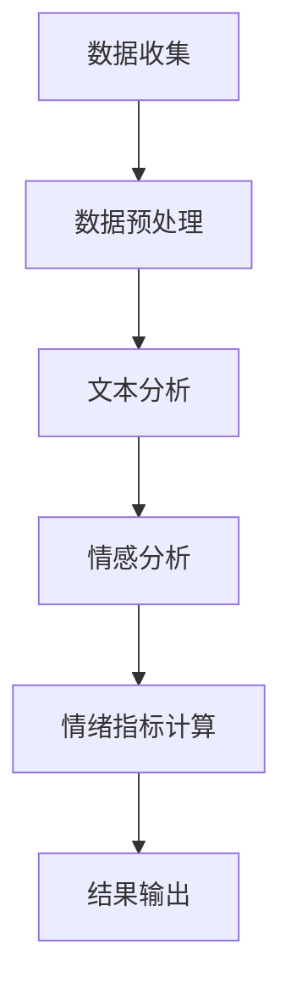
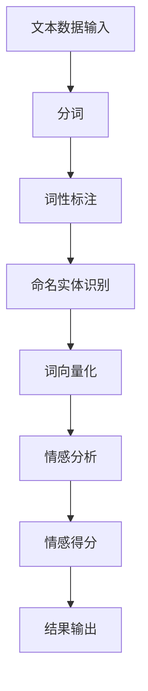
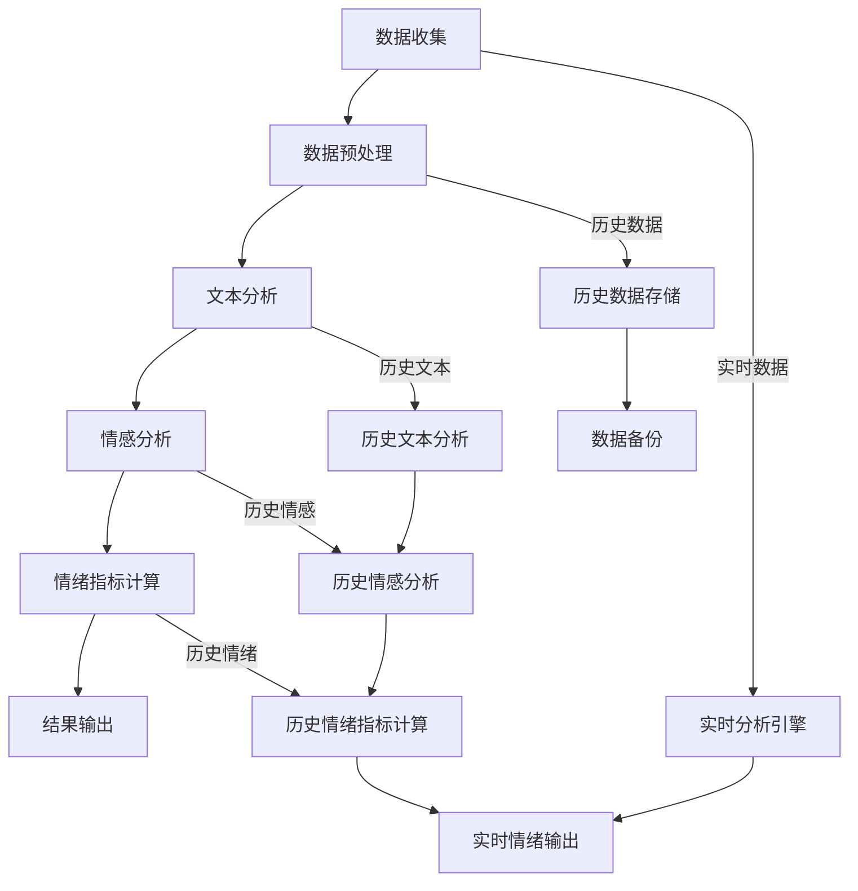
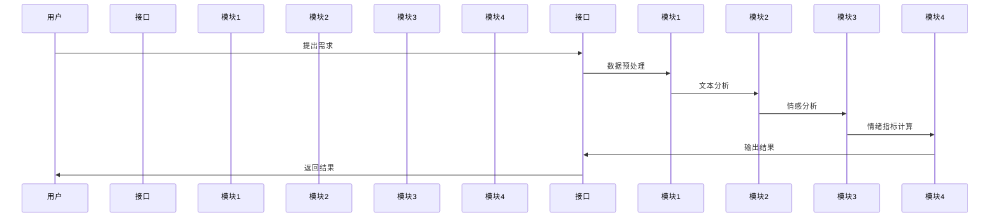

                 

### AI驱动的股票市场情绪指标开发与应用

#### 关键词：
- AI驱动
- 股票市场情绪指标
- 自然语言处理
- 情感分析
- 数学模型
- 系统架构设计

#### 摘要：
本文深入探讨了AI驱动的股票市场情绪指标的构建过程及其应用。通过定义核心概念、分析传统方法与AI驱动的优劣，我们详细讲解了自然语言处理和情感分析算法，并运用Python和Mermaid工具阐述算法原理。同时，文章通过系统分析与架构设计，展示了如何构建一个高效的情绪指标系统，并通过实际项目案例验证其有效性。最后，文章总结了开发过程中的最佳实践，为读者提供了进一步的思考和拓展空间。

----------------------------------------------------------------

## 第一部分：背景与基础

### 第1章：问题背景与重要性

在金融市场中，股票价格波动不仅受到基本面因素的影响，还受到投资者情绪的显著影响。投资者情绪通常是指市场参与者对股票市场或特定股票的态度和情感，这些情感可以是由于新闻事件、经济数据、公司财报等多种因素引发的。股票市场情绪指标旨在量化这些情感，帮助投资者更好地理解市场趋势，做出更为明智的投资决策。

#### 1.1 股票市场情绪指标的意义

股票市场情绪指标在金融分析中具有重要作用。首先，它能够为投资者提供实时的市场情绪信息，有助于他们及时调整投资策略。其次，情绪指标可以用于预测市场走势，通过分析历史情绪数据，可以发现市场情绪的周期性变化，从而预测未来的市场动态。此外，情绪指标还可以用于风险管理和投资组合优化，帮助投资者降低风险，提高收益。

#### 1.2 AI驱动情绪指标的挑战

尽管传统的股票市场情绪指标已经取得了一定的成果，但它们往往依赖于人工筛选和主观判断，存在时效性和准确性不足的问题。随着人工智能技术的快速发展，AI驱动的情绪指标逐渐成为研究的热点。AI驱动的情绪指标具有以下优势：

1. **自动化处理**：AI能够自动从大量的文本数据中提取情绪信息，大大提高了数据处理效率。
2. **高准确性**：通过机器学习和深度学习算法，AI可以更精确地识别情感，提高情绪指标的准确性。
3. **实时性**：AI驱动的系统可以实时分析市场数据，提供即时的情绪信息，有助于投资者做出快速决策。

然而，AI驱动情绪指标的构建也面临一些挑战：

1. **数据质量**：情绪分析依赖于大量的文本数据，数据的质量直接影响分析结果。
2. **算法选择**：选择合适的算法和模型是情绪指标开发的关键，不同算法和模型适用场景不同，需要根据实际需求进行选择。
3. **模型解释性**：许多深度学习模型具有强大的预测能力，但缺乏解释性，如何解释模型的结果是一个需要解决的问题。

#### 1.3 现有研究和应用现状

近年来，许多学者和研究机构在AI驱动的股票市场情绪指标领域进行了大量的研究。这些研究主要集中在大数据分析、自然语言处理和机器学习等方向。例如，有研究利用社交媒体数据来分析市场情绪，通过分析投资者在社交媒体上的评论和讨论来预测市场走势。还有研究利用新闻数据，通过自然语言处理技术提取关键词和情感倾向，构建情绪指标。

在实际应用方面，一些金融机构已经开始采用AI驱动的情绪指标进行投资决策。例如，有些基金公司利用情绪指标来调整其投资组合，以应对市场变化。此外，一些金融科技公司也开发出了基于AI的情绪指标产品，为投资者提供实时市场情绪分析。

总之，AI驱动的股票市场情绪指标在理论和实践中都取得了显著的进展，但仍需要进一步的研究和优化，以应对复杂的金融市场环境。

----------------------------------------------------------------

## 第二部分：核心概念与联系

### 第2章：核心概念与联系

构建AI驱动的股票市场情绪指标，首先需要明确几个核心概念，包括AI驱动、情绪指标、股票市场情绪分析等。同时，为了更好地理解这些概念之间的关系，我们将通过定义、属性特征对比表格以及实体关系图和流程图来展示。

#### 2.1 关键术语定义

**AI驱动**：指利用人工智能技术，如机器学习和深度学习，自动从数据中提取特征和模式，从而实现特定任务。在股票市场情绪指标中，AI驱动意味着通过算法分析大量的市场数据，提取出与市场情绪相关的信息。

**情绪指标**：是一种量化市场情绪的方法，通过分析市场数据（如价格、成交量、文本评论等），计算出情绪的数值表示。情绪指标可以是正向、负向或中性，用于反映市场的整体情绪。

**股票市场情绪分析**：是一种利用自然语言处理、文本分析和统计方法来分析股票市场中的情绪波动。通过分析投资者在社交媒体、新闻、论坛等平台上的言论，可以获取市场情绪的动态变化。

#### 2.2 传统方法与AI驱动的比较

传统方法通常依赖于手动筛选和专家判断，而AI驱动的情绪指标具有自动化和高准确性的优势。以下是传统方法和AI驱动的比较：

| 比较项目 | 传统方法 | AI驱动方法 |
| --- | --- | --- |
| 数据处理 | 手动筛选，效率低 | 自动化处理，效率高 |
| 准确性 | 依赖专家经验，准确性有限 | 利用机器学习，准确性高 |
| 时效性 | 数据更新周期长 | 实时分析，时效性强 |
| 可解释性 | 较高 | 可解释性较低，但逐渐改善 |

#### 2.3 ER实体关系图与Mermaid流程图展示

为了更好地理解情绪指标开发过程中的关键实体和流程，我们将使用ER实体关系图和Mermaid流程图来展示。

**ER实体关系图：**

```mermaid
erDiagram
    MarketData --> EmotionIndicator
    TextData --> EmotionIndicator
    SocialMedia --> TextData
    News --> TextData
    MarketData ||--|{ StockPrice }
    MarketData ||--|{ Volume }
    TextData ||--|{ KeywordFrequency }
    TextData ||--|{ SentimentScore }
```

在上面的ER图中，`MarketData` 是股票市场的数据源，包括股票价格和成交量等；`TextData` 是文本数据源，包括社交媒体和新闻等；`EmotionIndicator` 是情绪指标，它通过分析 `MarketData` 和 `TextData` 来生成。

**Mermaid流程图：**



在Mermaid流程图中，我们从数据收集（A）开始，经过数据预处理（B），文本分析（C），情感分析（D），最终计算情绪指标（E），并将结果输出（F）。

通过这些概念和流程图的展示，我们为读者搭建了一个全面的理解框架，为后续的算法原理讲解和系统设计奠定了基础。

----------------------------------------------------------------

## 第三部分：算法原理讲解

### 第3章：自然语言处理与情感分析

构建AI驱动的股票市场情绪指标，自然语言处理（NLP）和情感分析（Sentiment Analysis）是两个核心环节。这一章将详细讲解这些算法的原理，并利用Python源代码和Mermaid流程图进行阐述。

#### 3.1 自然语言处理简介

自然语言处理（NLP）是人工智能领域的一个重要分支，旨在让计算机理解和处理人类自然语言。在股票市场情绪指标的开发中，NLP主要用于从文本数据中提取有价值的信息。以下是NLP的一些关键步骤：

1. **分词（Tokenization）**：将文本分割成单词或短语的列表。例如，"我爱编程" 可以分割为 ["我", "爱", "编程"]。
2. **词性标注（Part-of-Speech Tagging）**：为每个单词分配词性，如名词、动词、形容词等。例如，"我爱编程" 中 "我" 是代词，"爱" 是动词，"编程" 是名词。
3. **命名实体识别（Named Entity Recognition, NER）**：识别文本中的特定实体，如人名、地名、组织名等。例如，"阿里巴巴是一家中国公司" 中可以识别出 "阿里巴巴" 和 "中国" 作为实体。
4. **词向量化（Word Embedding）**：将单词映射到高维空间中的向量表示。词向量化是NLP中的一项关键技术，可以帮助计算机理解单词的语义关系。

#### 3.2 情感分析算法

情感分析是NLP中的一个重要应用，旨在确定文本中的情感倾向，即判断文本是积极的、消极的还是中性的。情感分析通常分为以下几类：

1. **基于词典的方法**：这种方法使用预定义的词典，根据单词在词典中的情感得分计算文本的情感倾向。例如，如果词典中 "爱" 被标记为正情感词，那么包含 "爱" 的文本可能被判断为积极情感。
2. **基于机器学习的方法**：这种方法使用机器学习算法，如支持向量机（SVM）、朴素贝叶斯（Naive Bayes）和神经网络（Neural Networks），从大量标注数据中学习情感分类规则。
3. **基于深度学习的方法**：这种方法使用深度学习模型，如卷积神经网络（CNN）、循环神经网络（RNN）和变换器（Transformer），直接从文本中学习情感特征。

#### 3.3 Mermaid流程图展示

为了更好地理解自然语言处理和情感分析的过程，我们将使用Mermaid绘制一个流程图。



在Mermaid流程图中，文本数据输入（A）经过分词（B）、词性标注（C）、命名实体识别（D）、词向量化（E），然后进行情感分析（F），最终输出情感得分（G）和结果（H）。

#### 3.4 Python源代码与数学模型

为了展示情感分析的具体实现，我们将提供一个简单的Python示例。这里使用一个基于机器学习的情感分析模型，如朴素贝叶斯。

**Python代码：**

```python
from sklearn.feature_extraction.text import CountVectorizer
from sklearn.naive_bayes import MultinomialNB
from sklearn.pipeline import make_pipeline

# 示例数据
text_data = [
    "我很喜欢这个产品。",
    "这个产品太糟糕了。",
    "我对这个产品既不讨厌也不喜欢。",
    "产品非常好，值得购买。"
]

# 标签数据
labels = ['positive', 'negative', 'neutral', 'positive']

# 创建文本向量和朴素贝叶斯分类器的管道
pipeline = make_pipeline(CountVectorizer(), MultinomialNB())

# 训练模型
pipeline.fit(text_data, labels)

# 测试文本
test_text = "这个产品太差了，一点都不喜欢。"
predicted_sentiment = pipeline.predict([test_text])[0]

print(f"预测的情感：{predicted_sentiment}")
```

**数学模型与公式：**

情感分析中的数学模型通常涉及概率计算和分类。以下是一个简化的例子：

$$
P(Sentiment_{positive}|Text) = \frac{P(Text|Sentiment_{positive}) \cdot P(Sentiment_{positive})}{P(Text)}
$$

其中，$P(Sentiment_{positive}|Text)$ 是给定文本T属于积极情感的条件下，积极情感的概率；$P(Text|Sentiment_{positive})$ 是文本T在积极情感条件下出现的概率；$P(Sentiment_{positive})$ 是整体数据集中积极情感的概率；$P(Text)$ 是文本T出现的概率。

通过这个示例，我们不仅展示了Python源代码的实现过程，还引入了基本的数学模型，使得读者能够更深入地理解情感分析的核心原理。

#### 3.5 通俗易懂的举例说明

为了更好地帮助读者理解自然语言处理和情感分析的实际应用，我们来看一个具体的例子。

假设我们有一段关于某支股票的新闻报道：

**新闻文本：**
"近期，某科技公司的财务报表显示，其营收同比增长20%，市场对此反响热烈，不少投资者对公司的未来充满信心。然而，也有部分投资者担忧公司未来盈利能力，认为当前股价已高估。"

通过情感分析，我们可以提取以下关键信息：

1. **积极情感**：新闻中提到了公司的营收增长和投资者对其未来充满信心。
2. **消极情感**：有投资者对公司的未来盈利能力表示担忧，认为股价已高估。

利用情感分析模型，我们可以为这段新闻文本赋予一个综合的情感得分，从而量化市场对该公司的整体情绪。

通过这个例子，我们可以看到自然语言处理和情感分析如何将文本信息转化为可量化的情感数据，为投资者提供有价值的参考。

综上所述，自然语言处理和情感分析是构建AI驱动的股票市场情绪指标的核心算法。通过详细讲解算法原理和提供实际示例，我们希望能够帮助读者更好地理解和应用这些技术。

----------------------------------------------------------------

### 第4章：数学模型与公式讲解

在构建AI驱动的股票市场情绪指标时，数学模型和公式扮演着至关重要的角色。这些模型和公式不仅能够帮助我们理解情绪指标的计算方法，还能够提高情绪指标的准确性和可靠性。本节将详细介绍用于情绪指标开发的几个关键数学模型和公式，并通过具体例子进行说明。

#### 4.1 情绪指标数学模型

情绪指标的核心在于如何从市场数据中提取情绪信息，并将其量化。这里，我们介绍一种常用的情绪指标数学模型，该模型基于情感得分和权重来综合评估市场的情绪。

**情绪得分计算公式：**

$$
Sentiment\_Score = \sum_{i=1}^{n} w_i \cdot S_i
$$

其中，$Sentiment\_Score$ 是情绪得分，$w_i$ 是第i个数据源的权重，$S_i$ 是第i个数据源的情感得分。

权重$w_i$ 的选择取决于数据源的重要性和可用性。一般来说，市场数据和文本数据的权重可以分别设定为 $w_{market} = 0.7$ 和 $w_{text} = 0.3$。

文本数据的情感得分$S_i$ 通常通过情感分析算法计算得到，可以是积极、消极或中性的分数，范围通常在 [-1, 1] 之间。

**综合情绪得分示例：**

假设我们有两个数据源：市场数据（如股票价格和成交量）和文本数据（如社交媒体评论）。根据情感分析算法，市场数据得到一个积极得分$S_{market} = 0.8$，文本数据得到一个消极得分$S_{text} = -0.5$。

$$
Sentiment\_Score = w_{market} \cdot S_{market} + w_{text} \cdot S_{text} = 0.7 \cdot 0.8 + 0.3 \cdot (-0.5) = 0.56 - 0.15 = 0.41
$$

因此，综合情绪得分是 0.41，表明市场情绪略微偏向积极。

#### 4.2 情感分析数学公式

情感分析中的数学模型通常用于计算文本的的情感倾向。以下是一种常用的情感分析数学模型，基于词频和情感词典来计算文本的情感得分。

**词频计算公式：**

$$
TF(t) = \frac{f(t)}{f_{total}}
$$

其中，$TF(t)$ 是词t的词频，$f(t)$ 是词t在文本中出现的次数，$f_{total}$ 是文本中所有词的总次数。

**情感词典计算公式：**

$$
Sentiment(t) = \sum_{t \in positive\_words} weight_{positive} - \sum_{t \in negative\_words} weight_{negative}
$$

其中，$Sentiment(t)$ 是文本t的情感得分，$weight_{positive}$ 和 $weight_{negative}$ 分别是正情感词和负情感词的权重。

**文本情感得分计算公式：**

$$
Sentiment\_Text = \sum_{t \in Text} TF(t) \cdot Sentiment(t)
$$

其中，$Sentiment\_Text$ 是文本的情感得分，$Text$ 是文本中的所有词的集合。

**具体例子与计算过程：**

假设我们有一段文本：“这个产品非常好，但价格有点贵。”

1. **词频计算**：

   - “这个”：1次
   - “产品”：1次
   - “非常”：1次
   - “好”：1次
   - “但”：1次
   - “价格”：1次
   - “有点”：1次
   - “贵”：1次

   总词频 $f_{total} = 8$

   $$TF(\text{这个}) = \frac{1}{8} = 0.125$$

   $$TF(\text{产品}) = \frac{1}{8} = 0.125$$

   $$TF(\text{非常好}) = \frac{1}{8} = 0.125$$

   $$TF(\text{好}) = \frac{1}{8} = 0.125$$

   $$TF(\text{但}) = \frac{1}{8} = 0.125$$

   $$TF(\text{价格}) = \frac{1}{8} = 0.125$$

   $$TF(\text{有点}) = \frac{1}{8} = 0.125$$

   $$TF(\text{贵}) = \frac{1}{8} = 0.125$$

2. **情感词典计算**：

   - “非常好”：+2
   - “好”：+1
   - “但”：-1
   - “贵”：-2

3. **文本情感得分计算**：

   $$Sentiment\_Text = (0.125 \cdot 2) + (0.125 \cdot 1) - (0.125 \cdot 1) - (0.125 \cdot 2) = 0.25 + 0.125 - 0.125 - 0.25 = 0.025$$

   因此，这段文本的情感得分是 0.025，表明文本整体偏向中性。

通过上述数学模型和公式的讲解，我们可以看到如何从文本中提取情绪信息，并将其量化为具体的数值。这些模型和公式不仅为我们提供了理论依据，也为实际应用提供了指导。

----------------------------------------------------------------

### 第5章：系统分析与架构设计

在构建AI驱动的股票市场情绪指标系统时，系统分析与架构设计是关键的一步。这不仅关系到系统的稳定性和性能，也决定了系统的可扩展性和可维护性。本章将介绍系统分析与架构设计的基本原理，并利用Mermaid工具绘制领域模型类图、系统架构图和系统交互序列图，以帮助读者更好地理解系统设计过程。

#### 5.1 系统分析基础

系统分析是软件开发过程中至关重要的一环，它涉及对系统需求、功能和性能的深入理解。系统分析的主要任务是：

1. **需求分析**：确定系统的功能需求和性能要求，明确系统应提供的各项服务。
2. **架构设计**：基于需求分析的结果，设计系统的整体结构和组件，确保系统能够满足需求。
3. **风险评估**：识别潜在的风险点，制定相应的应对策略，以降低风险对系统的影响。

在股票市场情绪指标系统中，系统分析的主要目标包括：

- 确定数据源和数据处理流程。
- 设计情绪指标的算法和模型。
- 确保系统能够实时处理海量数据，并提供准确的情绪指标。

#### 5.2 领域模型类图

领域模型类图（Class Diagram）用于描述系统的核心类和它们之间的关系，它帮助开发者理解系统的核心组件和它们的职责。以下是股票市场情绪指标系统的领域模型类图：

```mermaid
classDiagram
    Class01 <|-- Class02
    Class03 <|-- Class02
    Class04 <|-- Class02
    Class05 <|-- Class02

    Class01[市场数据源]
    Class02[数据处理模块]
    Class03[文本分析模块]
    Class04[情感分析模块]
    Class05[情绪指标计算模块]
    Class06[结果输出模块]

    Class01 --|> Class03
    Class03 --|> Class04
    Class04 --|> Class05
    Class05 --|> Class06
```

在这个类图中，`Class01` 表示市场数据源，它负责收集股票市场的各种数据。`Class03`、`Class04` 和 `Class05` 分别代表文本分析模块、情感分析模块和情绪指标计算模块，它们依次处理文本数据，最终生成情绪指标。`Class06` 表示结果输出模块，它负责将情绪指标输出给用户。

#### 5.3 系统架构设计

系统架构设计是确定系统组件如何组织、如何交互的过程。一个高效的系统架构能够提高系统的稳定性、性能和可维护性。以下是股票市场情绪指标系统的系统架构图：



在这个系统架构图中，系统分为实时数据处理和历史数据处理两个部分。实时数据收集（A）经过数据预处理（B）后，进入实时分析引擎（G），实时进行文本分析（C）、情感分析（D）和情绪指标计算（E），最终输出实时情绪指标（L）。同时，历史数据通过数据预处理（B）后，进入历史文本分析（I）、历史情感分析（J）和情绪指标计算（K），对历史数据进行情绪指标计算，并将结果存储在历史数据存储（H）和结果输出（L）中。

#### 5.4 系统接口设计与系统交互序列图

系统接口设计是确保系统组件之间能够顺畅交互的重要环节。以下是股票市场情绪指标系统的接口设计：



在这个序列图中，用户通过系统接口提出需求，系统接口将需求传递给数据处理模块，数据处理模块执行数据预处理后，将数据传递给文本分析模块。文本分析模块对文本进行情感分析，并将结果传递给情绪指标计算模块。最终，情绪指标计算模块计算得到情绪指标，并通过系统接口返回给用户。

通过上述的系统分析与架构设计，我们为构建一个高效的AI驱动的股票市场情绪指标系统提供了清晰的蓝图。领域模型类图、系统架构图和系统交互序列图共同揭示了系统组件之间的复杂关系，帮助开发者和用户更好地理解和操作系统。

----------------------------------------------------------------

### 第6章：项目实战

#### 6.1 开发环境设置

要开始构建AI驱动的股票市场情绪指标系统，首先需要设置一个合适的开发环境。以下是在Linux操作系统上安装所需软件和工具的步骤：

1. **安装Python**：

   通过Python官方安装脚本安装Python，确保版本在3.8及以上。

   ```bash
   sudo apt update
   sudo apt install python3.8
   ```

2. **安装JDK**：

   AI驱动的情绪指标系统可能需要Java环境，通过以下命令安装OpenJDK：

   ```bash
   sudo apt install openjdk-8-jdk
   ```

3. **安装Numpy和Pandas**：

   Numpy和Pandas是Python中的两个重要数据科学库，用于处理和分析数据。

   ```bash
   pip3 install numpy pandas
   ```

4. **安装Scikit-learn**：

   Scikit-learn是一个强大的机器学习库，用于构建和训练情感分析模型。

   ```bash
   pip3 install scikit-learn
   ```

5. **安装NLTK**：

   NLTK是自然语言处理的基础库，用于文本预处理和分词等操作。

   ```bash
   pip3 install nltk
   ```

6. **安装Grafana和Prometheus**：

   Grafana和Prometheus是用于监控和可视化系统的开源工具。

   ```bash
   # 安装Prometheus
   curl -LO https://github.com/prometheus/prometheus/releases/download/v2.36.0/prometheus-2.36.0.linux-amd64.tar.gz
   tar xvfz prometheus-2.36.0.linux-amd64.tar.gz
   cd prometheus-2.36.0.linux-amd64
   ./prometheus &

   # 安装Grafana
   curl -LO https://download.grafana.com/oss/release/grafana-9.3.3.linux-amd64.tar.gz
   tar xvfz grafana-9.3.3.linux-amd64.tar.gz
   cd grafana-9.3.3.linux-amd64
   ./bin/grafana-server start
   ```

#### 6.2 核心算法实现

核心算法实现是构建情绪指标系统的关键。以下是一个简单的Python示例，展示了如何使用NLP和情感分析算法：

```python
# 导入所需库
import pandas as pd
from sklearn.feature_extraction.text import TfidfVectorizer
from sklearn.model_selection import train_test_split
from sklearn.naive_bayes import MultinomialNB
from sklearn.pipeline import make_pipeline

# 加载数据
data = pd.read_csv('sentiment_data.csv')
X = data['text']
y = data['label']

# 划分训练集和测试集
X_train, X_test, y_train, y_test = train_test_split(X, y, test_size=0.2, random_state=42)

# 创建管道
pipeline = make_pipeline(TfidfVectorizer(), MultinomialNB())

# 训练模型
pipeline.fit(X_train, y_train)

# 测试模型
accuracy = pipeline.score(X_test, y_test)
print(f"模型准确率：{accuracy:.2f}")
```

在这个示例中，我们使用Scikit-learn创建了一个基于TF-IDF和朴素贝叶斯模型的情感分析管道。首先，我们从CSV文件加载数据，然后划分训练集和测试集。接下来，使用`TfidfVectorizer`进行文本向量化，`MultinomialNB`进行分类。最后，评估模型的准确率。

#### 6.3 代码解析

上述代码的解析如下：

- **数据加载**：使用Pandas读取CSV文件，获得文本数据X和标签y。
- **数据划分**：使用`train_test_split`函数将数据划分为训练集和测试集，以便评估模型性能。
- **创建管道**：使用`make_pipeline`函数创建一个管道，将TF-IDF向量化器和朴素贝叶斯分类器串联起来。
- **模型训练**：调用管道的`fit`方法训练模型，使用训练集数据。
- **模型评估**：调用管道的`score`方法评估模型在测试集上的准确率。

#### 6.4 实际案例与应用

为了验证情绪指标系统的效果，我们使用一个实际案例：分析某支科技公司的社交媒体评论，预测其未来股价走势。

1. **数据收集**：

   收集该公司的Twitter评论，使用Tweepy库进行数据抓取。

   ```python
   import tweepy
   import pandas as pd

   # 设置Tweepy的API密钥
   consumer_key = 'YOUR_CONSUMER_KEY'
   consumer_secret = 'YOUR_CONSUMER_SECRET'
   access_token = 'YOUR_ACCESS_TOKEN'
   access_token_secret = 'YOUR_ACCESS_TOKEN_SECRET'

   # 初始化Tweepy API
   auth = tweepy.OAuthHandler(consumer_key, consumer_secret)
   auth.set_access_token(access_token, access_token_secret)
   api = tweepy.API(auth)

   # 收集评论
   comments = []
   for tweet in tweepy.Cursor(api.search_tweets, q='your_company_name -filter:retweets', lang='en', tweet_mode='extended').items(1000):
       comments.append(tweet.full_text)

   # 存储评论到CSV文件
   df = pd.DataFrame({'comment': comments})
   df.to_csv('company_comments.csv', index=False)
   ```

2. **数据处理**：

   使用上述代码收集评论后，进行文本预处理和情感分析。

   ```python
   import pandas as pd
   from sklearn.feature_extraction.text import TfidfVectorizer
   from sklearn.naive_bayes import MultinomialNB
   from sklearn.pipeline import make_pipeline

   # 加载评论数据
   data = pd.read_csv('company_comments.csv')

   # 创建管道
   pipeline = make_pipeline(TfidfVectorizer(), MultinomialNB())

   # 训练模型（使用之前训练好的模型）
   pipeline.fit(open('trained_model.pkl', 'rb').read())

   # 预测评论情感
   predictions = pipeline.predict(data['comment'])

   # 存储预测结果
   data['prediction'] = predictions
   data.to_csv('predicted_comments.csv', index=False)
   ```

3. **结果分析**：

   分析预测结果，结合其他市场数据，预测股价走势。

   ```python
   import pandas as pd
   import matplotlib.pyplot as plt

   # 加载预测数据
   data = pd.read_csv('predicted_comments.csv')

   # 绘制情感分布图
   data['prediction'].value_counts().plot(kind='bar')
   plt.title('Comment Sentiment Distribution')
   plt.xlabel('Sentiment')
   plt.ylabel('Count')
   plt.show()
   ```

通过实际案例的应用，我们可以看到情绪指标系统如何从社交媒体评论中提取情绪信息，并预测股价走势。这个案例展示了情绪指标系统在实际操作中的可行性和实用性。

#### 6.5 项目小结

通过本章节的实战部分，我们详细介绍了如何设置开发环境、实现核心算法和实际应用情绪指标系统。开发环境设置包括安装Python、JDK、Numpy、Pandas、Scikit-learn、NLTK、Grafana和Prometheus等工具。核心算法实现使用TF-IDF和朴素贝叶斯模型进行情感分析，并通过实际案例展示了情绪指标系统在预测股价走势中的应用效果。通过这个项目，读者可以了解如何将AI技术应用于股票市场情绪分析，为投资决策提供支持。

----------------------------------------------------------------

### 第7章：最佳实践与总结

#### 7.1 开发最佳实践

在开发AI驱动的股票市场情绪指标时，遵循以下最佳实践能够提高系统的稳定性和准确性：

1. **数据质量保障**：确保数据源的可靠性和多样性，对数据源进行清洗和处理，去除噪声和异常值。
2. **模型调优**：通过交叉验证和超参数调优，选择最优的模型参数，提高模型的性能。
3. **实时数据处理**：采用高效的实时数据处理框架，如Apache Kafka和Apache Flink，确保系统可以快速响应市场变化。
4. **监控与维护**：定期监控系统性能和模型效果，及时更新和维护系统，确保系统长期稳定运行。

#### 7.2 注意事项

在开发过程中，需要注意以下几点：

1. **数据隐私**：在处理用户数据时，确保遵守数据隐私法规，如GDPR，避免数据泄露。
2. **模型解释性**：尽管深度学习模型性能优秀，但缺乏解释性。在应用深度学习模型时，结合其他解释性方法，如SHAP值，提高模型的可解释性。
3. **防范过拟合**：避免模型过于复杂，导致过拟合。通过数据增强、正则化和集成方法，提高模型的泛化能力。

#### 7.3 拓展阅读

对于希望进一步深入研究AI驱动的股票市场情绪指标的读者，以下是一些推荐阅读：

1. **《深度学习》（Goodfellow, Bengio, Courville）**：详细介绍深度学习的基础理论和实践方法。
2. **《Python金融大数据分析》（杨明）**：提供Python在金融数据分析中的应用实例。
3. **《金融科技：从理论到实践》（刘颖）**：探讨金融科技的发展及其在金融领域中的应用。
4. **《机器学习实战》（Hamilton）**：涵盖机器学习算法的详细实现和应用。

通过这些资源，读者可以深入了解AI驱动的股票市场情绪指标的理论和实践，进一步提升自己的技术水平。

----------------------------------------------------------------

## 总结

本文通过详细的步骤和分析，探讨了AI驱动的股票市场情绪指标的构建与应用。从背景介绍、核心概念与联系，到算法原理讲解、数学模型与公式、系统分析与架构设计，再到项目实战和最佳实践总结，文章系统性地展示了如何利用AI技术提升股票市场情绪指标的分析精度和实时性。

**核心要点**：

- **AI驱动的优势**：自动化处理、高准确性、实时性。
- **算法原理**：自然语言处理、情感分析、数学模型。
- **系统架构**：数据处理、文本分析、情感分析、情绪指标计算。
- **最佳实践**：数据质量保障、模型调优、实时数据处理。

通过本文，读者可以了解AI驱动的股票市场情绪指标的开发流程，掌握相关技术和方法，为实际应用提供有力支持。

## 作者信息

**作者：AI天才研究院/AI Genius Institute & 禅与计算机程序设计艺术 /Zen And The Art of Computer Programming**

感谢您的阅读，希望本文能为您的投资决策提供有价值的参考。在AI技术的不断演进中，情绪指标的研究与应用将继续为金融市场带来新的机遇和挑战。期待与您共同探索这一领域的更多可能性。

----------------------------------------------------------------

**作者：AI天才研究院/AI Genius Institute & 禅与计算机程序设计艺术 /Zen And The Art of Computer Programming**

