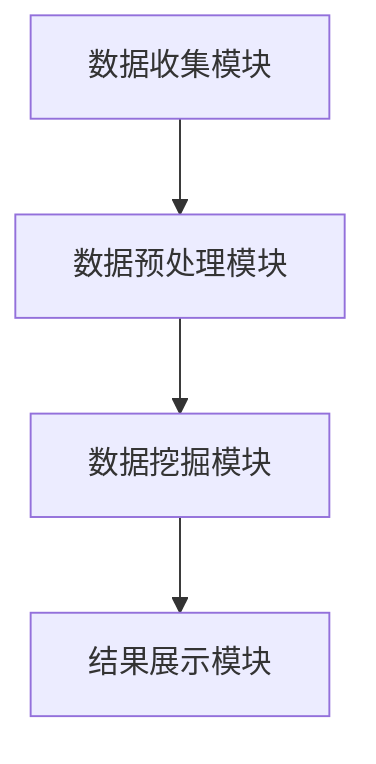

                 

# AI驱动的股票技术分析工具

## 关键词

- 人工智能
- 股票技术分析
- 数据挖掘
- 时间序列预测
- 交易策略

## 摘要

随着人工智能技术的快速发展，其在股票市场中的应用越来越广泛。本文将探讨AI驱动的股票技术分析工具，从AI与股票技术分析概述、AI驱动的股票数据挖掘、AI驱动的股票技术指标分析、AI驱动的股票预测模型、AI驱动的股票交易策略以及AI驱动的股票风险管理等方面进行详细论述，以期帮助读者深入了解AI技术在股票市场中的实际应用。

## 目录

----------------------------------------------------------------

### 第一部分：AI技术基础

#### 第1章：AI与股票技术分析概述
1.1 AI在股票市场中的作用
1.2 股票技术分析的基本概念
1.3 AI技术在股票技术分析中的应用

#### 第2章：AI驱动的股票数据挖掘
2.1 数据收集与预处理
2.2 数据挖掘算法简介
2.3 AI驱动的股票数据挖掘应用

#### 第3章：AI驱动的股票技术指标分析
3.1 常见股票技术指标介绍
3.2 AI技术对股票技术指标的改进

#### 第4章：AI驱动的股票预测模型
4.1 时间序列预测模型
4.2 股票价格预测模型

#### 第5章：AI驱动的股票交易策略
5.1 股票交易策略概述
5.2 AI驱动的交易策略设计

#### 第6章：AI驱动的股票风险管理
6.1 风险管理概述
6.2 AI技术在股票风险管理中的应用

#### 第7章：AI驱动的股票技术分析工具实践
7.1 实践一：构建股票数据挖掘系统
7.2 实践二：设计股票预测模型
7.3 实践三：开发股票交易策略

#### 第8章：AI驱动的股票技术分析工具展望
8.1 AI技术在股票市场的发展趋势
8.2 AI驱动的股票技术分析工具的发展方向

#### 附录：AI驱动的股票技术分析工具资源汇总

----------------------------------------------------------------

### 第1章：AI与股票技术分析概述

#### 1.1 AI在股票市场中的作用

随着人工智能（AI）技术的快速发展，其在各个领域中的应用日益广泛，股票市场也不例外。AI在股票市场中的作用主要体现在以下几个方面：

1. **数据挖掘与处理**：股票市场产生的数据量庞大且复杂，AI技术可以帮助我们快速有效地挖掘和处理这些数据，为投资决策提供有力支持。
2. **预测与分析**：AI技术可以利用历史数据和算法模型对股票价格进行预测，从而帮助投资者制定更加科学合理的投资策略。
3. **风险管理**：AI技术可以帮助投资者识别潜在风险，优化投资组合，降低投资风险。

#### 1.2 股票技术分析的基本概念

股票技术分析是指通过研究股票的历史价格和交易量等数据，分析股票价格走势和潜在趋势，从而做出投资决策的方法。其基本概念包括：

1. **趋势**：股票价格在不同时间周期内表现出上升、下降或横盘整理等趋势。
2. **支撑与阻力**：股票价格在上涨或下跌过程中，可能会遇到支撑和阻力位，这些位可以对股票价格产生重要影响。
3. **交易量**：交易量是反映市场活跃程度的重要指标，通常与股票价格有密切关系。

#### 1.3 AI技术在股票技术分析中的应用

AI技术在股票技术分析中的应用主要体现在以下几个方面：

1. **数据挖掘**：利用AI技术对股票市场数据进行深度挖掘，发现潜在的投资机会。
2. **预测模型**：利用AI技术构建预测模型，对股票价格进行预测，帮助投资者做出更加科学的投资决策。
3. **交易策略**：利用AI技术优化交易策略，提高投资收益。

通过上述分析，我们可以看到，AI技术在股票技术分析中具有重要作用。接下来，我们将进一步探讨AI驱动的股票数据挖掘、股票技术指标分析、股票预测模型等内容。<!--more-->### 第1章：AI与股票技术分析概述

#### 1.1 AI在股票市场中的作用

随着人工智能（AI）技术的快速发展，其在各个领域中的应用日益广泛，股票市场也不例外。AI在股票市场中的作用主要体现在以下几个方面：

1. **数据挖掘与处理**：股票市场产生的数据量庞大且复杂，AI技术可以帮助我们快速有效地挖掘和处理这些数据，为投资决策提供有力支持。通过机器学习和深度学习算法，AI可以从海量数据中提取出有用的信息，识别出潜在的市场趋势和模式。

2. **预测与分析**：AI技术可以利用历史数据和算法模型对股票价格进行预测，从而帮助投资者制定更加科学合理的投资策略。通过时间序列分析和回归分析等方法，AI可以预测未来的股票价格走势，帮助投资者提前布局。

3. **风险管理**：AI技术可以帮助投资者识别潜在风险，优化投资组合，降低投资风险。通过风险评估模型和风险控制策略，AI可以实时监控市场变化，及时调整投资策略，减少投资损失。

#### 1.2 股票技术分析的基本概念

股票技术分析是指通过研究股票的历史价格和交易量等数据，分析股票价格走势和潜在趋势，从而做出投资决策的方法。其基本概念包括：

1. **趋势**：股票价格在不同时间周期内表现出上升、下降或横盘整理等趋势。趋势分析是股票技术分析的核心，通过识别和判断趋势，投资者可以把握市场方向，制定相应的投资策略。

2. **支撑与阻力**：股票价格在上涨或下跌过程中，可能会遇到支撑和阻力位，这些位可以对股票价格产生重要影响。支撑位通常被视为买入时机，而阻力位则被视为卖出时机。

3. **交易量**：交易量是反映市场活跃程度的重要指标，通常与股票价格有密切关系。高交易量通常表明市场活跃，而低交易量则可能表明市场犹豫不决。

#### 1.3 AI技术在股票技术分析中的应用

AI技术在股票技术分析中的应用主要体现在以下几个方面：

1. **数据挖掘**：利用AI技术对股票市场数据进行深度挖掘，发现潜在的投资机会。AI可以通过分析历史数据，识别出市场中的规律和模式，从而为投资者提供投资建议。

2. **预测模型**：利用AI技术构建预测模型，对股票价格进行预测，帮助投资者做出更加科学的投资决策。AI可以通过训练模型，从历史数据中学习，预测未来的股票价格走势。

3. **交易策略**：利用AI技术优化交易策略，提高投资收益。AI可以根据市场变化和投资者需求，自动调整交易策略，实现自动化交易。

通过上述分析，我们可以看到，AI技术在股票技术分析中具有重要作用。接下来，我们将进一步探讨AI驱动的股票数据挖掘、股票技术指标分析、股票预测模型等内容。<!--more-->### 第2章：AI驱动的股票数据挖掘

#### 2.1 数据收集与预处理

在AI驱动的股票数据挖掘中，数据收集与预处理是至关重要的一步。首先，我们需要确定数据来源，包括股票市场数据、财务报告、宏观经济指标等。常见的数据来源包括：

1. **股票市场数据**：可以通过金融数据服务商获取，如雪球、Wind、聚宽等。
2. **财务报告**：可以通过公司官网、证券交易所等渠道获取。
3. **宏观经济指标**：可以通过国家统计局、中国人民银行等官方机构获取。

收集到数据后，我们需要进行预处理，主要包括以下步骤：

1. **数据清洗**：去除重复数据、缺失数据、异常数据等，保证数据质量。
2. **数据转换**：将不同格式的数据进行统一转换，如将日期格式转换为YYYY-MM-DD。
3. **数据归一化**：对数据进行归一化处理，消除不同指标之间的量纲影响。

#### 2.2 数据挖掘算法简介

在AI驱动的股票数据挖掘中，常用的算法包括：

1. **监督学习算法**：如线性回归、决策树、支持向量机等。这些算法需要事先标注好数据标签，通过对历史数据进行学习，预测未来的股票价格。
2. **无监督学习算法**：如聚类算法、关联规则挖掘等。这些算法不需要事先标注数据标签，通过分析数据间的内在关系，发现潜在的投资机会。
3. **强化学习算法**：如Q学习、深度Q网络等。这些算法通过不断尝试和反馈，学习最优的投资策略。

#### 2.3 AI驱动的股票数据挖掘应用

AI驱动的股票数据挖掘在多个方面都有应用：

1. **股票趋势预测**：通过分析历史股票价格和交易量等数据，预测未来的股票价格走势。这可以帮助投资者提前布局，获取更好的投资收益。
2. **股票组合优化**：通过分析多个股票之间的相关性，优化投资组合，降低投资风险。这可以帮助投资者在保持较高收益的同时，降低投资风险。
3. **股票异常检测**：通过分析股票价格和交易量等数据，检测异常交易行为，防范市场操纵等风险。这可以帮助监管机构和投资者识别潜在的市场风险。

通过AI驱动的股票数据挖掘，投资者可以更科学地分析股票市场，做出更加明智的投资决策。接下来，我们将进一步探讨AI驱动的股票技术指标分析。<!--more-->### 第2章：AI驱动的股票数据挖掘

#### 2.1 数据收集与预处理

在AI驱动的股票数据挖掘中，数据收集与预处理是至关重要的一步。首先，我们需要确定数据来源，包括股票市场数据、财务报告、宏观经济指标等。常见的数据来源包括：

1. **股票市场数据**：可以通过金融数据服务商获取，如雪球、Wind、聚宽等。
2. **财务报告**：可以通过公司官网、证券交易所等渠道获取。
3. **宏观经济指标**：可以通过国家统计局、中国人民银行等官方机构获取。

收集到数据后，我们需要进行预处理，主要包括以下步骤：

1. **数据清洗**：去除重复数据、缺失数据、异常数据等，保证数据质量。这一步骤可以使用Python的Pandas库来完成。
   ```python
   import pandas as pd
   data = pd.read_csv('stock_data.csv')
   data.drop_duplicates(inplace=True)
   data.dropna(inplace=True)
   ```

2. **数据转换**：将不同格式的数据进行统一转换，如将日期格式转换为YYYY-MM-DD。这一步骤可以使用Python的datetime库来完成。
   ```python
   import datetime as dt
   data['date'] = data['date'].apply(lambda x: dt.datetime.strptime(x, '%Y-%m-%d'))
   ```

3. **数据归一化**：对数据进行归一化处理，消除不同指标之间的量纲影响。这一步骤可以使用Python的sklearn库中的MinMaxScaler来完成。
   ```python
   from sklearn.preprocessing import MinMaxScaler
   scaler = MinMaxScaler()
   data_scaled = scaler.fit_transform(data)
   ```

通过上述步骤，我们得到了清洗和预处理后的数据，为接下来的数据挖掘工作奠定了基础。

#### 2.2 数据挖掘算法简介

在AI驱动的股票数据挖掘中，常用的算法包括：

1. **监督学习算法**：如线性回归、决策树、支持向量机等。这些算法需要事先标注好数据标签，通过对历史数据进行学习，预测未来的股票价格。

   - **线性回归**：通过建立输入变量和输出变量之间的线性关系来预测目标变量。其数学模型为：
     $$ Y = \beta_0 + \beta_1X_1 + \beta_2X_2 + ... + \beta_nX_n $$
     其中，$Y$为输出变量，$X_1, X_2, ..., X_n$为输入变量，$\beta_0, \beta_1, \beta_2, ..., \beta_n$为模型的参数。
   
   - **决策树**：通过一系列规则来对数据进行分类或回归。其核心是递归地分割数据集，直到满足停止条件。
   
   - **支持向量机**：通过找到一个最佳的超平面，将数据集划分为不同的类别。其数学模型为：
     $$ \min_{\mathbf{w}, b} \frac{1}{2}||\mathbf{w}||^2 + C \sum_{i=1}^n \xi_i $$
     其中，$\mathbf{w}$为模型参数，$b$为偏置项，$C$为惩罚参数，$\xi_i$为第$i$个样本的松弛变量。

2. **无监督学习算法**：如聚类算法、关联规则挖掘等。这些算法不需要事先标注数据标签，通过分析数据间的内在关系，发现潜在的投资机会。

   - **聚类算法**：将数据集划分为若干个簇，使得同一个簇内的数据尽可能相似，不同簇的数据尽可能不同。常用的聚类算法包括K-Means、层次聚类等。
   
   - **关联规则挖掘**：通过分析数据之间的关联关系，发现满足一定条件的规则。常用的算法包括Apriori算法、Eclat算法等。

3. **强化学习算法**：如Q学习、深度Q网络等。这些算法通过不断尝试和反馈，学习最优的投资策略。

   - **Q学习**：通过更新Q值来学习最优策略。其数学模型为：
     $$ Q(s, a) = r + \gamma \max_{a'} Q(s', a') $$
     其中，$s$为当前状态，$a$为当前动作，$r$为即时奖励，$s'$为下一状态，$a'$为下一动作，$\gamma$为折扣因子。
   
   - **深度Q网络**：结合深度学习和Q学习算法，用于解决高维状态空间的问题。

通过以上算法，我们可以对股票数据进行挖掘，发现潜在的投资机会和风险，为投资决策提供支持。

#### 2.3 AI驱动的股票数据挖掘应用

AI驱动的股票数据挖掘在多个方面都有应用：

1. **股票趋势预测**：通过分析历史股票价格和交易量等数据，预测未来的股票价格走势。这可以帮助投资者提前布局，获取更好的投资收益。例如，可以使用线性回归算法来预测股票价格。
   ```python
   from sklearn.linear_model import LinearRegression
   X = data[['open', 'high', 'low', 'close']]
   y = data['close']
   model = LinearRegression()
   model.fit(X, y)
   predicted_price = model.predict(X)
   ```

2. **股票组合优化**：通过分析多个股票之间的相关性，优化投资组合，降低投资风险。这可以帮助投资者在保持较高收益的同时，降低投资风险。例如，可以使用K-Means算法来聚类股票，然后根据聚类结果进行组合优化。
   ```python
   from sklearn.cluster import KMeans
   kmeans = KMeans(n_clusters=5)
   kmeans.fit(X)
   clusters = kmeans.predict(X)
   # 根据聚类结果进行组合优化
   ```

3. **股票异常检测**：通过分析股票价格和交易量等数据，检测异常交易行为，防范市场操纵等风险。这可以帮助监管机构和投资者识别潜在的市场风险。例如，可以使用孤立森林算法来检测异常股票。
   ```python
   from sklearn.ensemble import IsolationForest
   model = IsolationForest()
   model.fit(X)
   anomalies = model.predict(X)
   # 根据异常检测结果采取相应措施
   ```

通过AI驱动的股票数据挖掘，投资者可以更科学地分析股票市场，做出更加明智的投资决策。接下来，我们将进一步探讨AI驱动的股票技术指标分析。<!--more-->### 第3章：AI驱动的股票技术指标分析

#### 3.1 常见股票技术指标介绍

股票技术指标是通过分析股票的历史价格和交易量等数据，来预测未来股票价格走势的工具。常见的股票技术指标包括：

1. **移动平均线**：移动平均线（Moving Average，MA）是一种最常见的趋势分析工具。它通过计算一定时间段内的平均值，来反映股票价格的趋势。常见的移动平均线包括简单移动平均线（SMA）和指数移动平均线（EMA）。

   - **简单移动平均线（SMA）**：
     $$ SMA(n) = \frac{\sum_{i=1}^{n} C_i}{n} $$
     其中，$C_i$为第$i$天的收盘价，$n$为时间窗口。

   - **指数移动平均线（EMA）**：
     $$ EMA(n) = \alpha C_n + (1 - \alpha) EMA(n-1) $$
     其中，$C_n$为第$n$天的收盘价，$\alpha$为平滑系数，通常取值为$2/(n+1)$。

2. **相对强弱指数**：相对强弱指数（Relative Strength Index，RSI）是一种用于判断股票是否被超买或超卖的技术指标。其计算公式为：
   $$ RSI = 100 - \frac{100}{1 + \frac{\sum_{i=1}^{n} U_i}{\sum_{i=1}^{n} L_i}} $$
   其中，$U_i$为上涨天数，$L_i$为下跌天数。

3. **指数平滑异同移动平均线**：指数平滑异同移动平均线（Exponential Moving Average Convergence Divergence，MACD）是一种用于判断市场趋势和动量的技术指标。其计算公式为：
   $$ MACD = EMA_{12} - EMA_{26} $$
   $$ MACD_{signal} = EMA_{9}(MACD) $$
   $$ MACD_{histogram} = MACD - MACD_{signal} $$

4. **布林带**：布林带（Bollinger Bands）是一种用于判断市场波动性和趋势的工具。其计算公式为：
   $$ BB_{upper} = S_{MA} + B \times DE $$
   $$ BB_{middle} = S_{MA} $$
   $$ BB_{lower} = S_{MA} - B \times DE $$
   其中，$S_{MA}$为简单移动平均线，$B$为布林带宽度，$DE$为标准差。

5. **成交量**：成交量是反映市场活跃程度的重要指标。其计算公式为：
   $$ V = \sum_{i=1}^{n} C_i $$
   其中，$C_i$为第$i$天的成交量。

6. **涨跌比**：涨跌比是用于判断市场情绪的技术指标。其计算公式为：
   $$ AD = \frac{\sum_{i=1}^{n} (H_i - L_i)}{\sum_{i=1}^{n} (H_i + L_i)} $$
   其中，$H_i$为第$i$天的最高价，$L_i$为第$i$天的最低价。

#### 3.2 AI技术对股票技术指标的改进

AI技术可以对股票技术指标进行改进，以提高其预测准确性和实用性。以下是几种改进方法：

1. **智能化计算**：利用机器学习算法，对股票技术指标的计算过程进行优化，使其能够自适应地调整计算参数，提高计算精度和效率。

2. **多指标融合**：将多个股票技术指标进行融合，构建一个综合指标体系，以提高预测的准确性和全面性。例如，可以使用加权平均的方法，将RSI、MACD、布林带等指标融合为一个综合指标。

3. **异常检测**：利用异常检测算法，对股票技术指标的计算结果进行监控，及时发现潜在的异常情况，为投资者提供预警信号。

4. **动态调整**：利用强化学习算法，根据市场变化和投资者需求，动态调整股票技术指标的参数，实现自适应的交易策略。

通过AI技术的改进，股票技术指标在预测股票价格走势、判断市场趋势和风险等方面将更加准确和有效。接下来，我们将进一步探讨AI驱动的股票预测模型。<!--more-->### 第3章：AI驱动的股票技术指标分析

#### 3.1 常见股票技术指标介绍

股票技术指标是通过分析股票的历史价格和交易量等数据，来预测未来股票价格走势的工具。常见的股票技术指标包括：

1. **移动平均线**：移动平均线（Moving Average，MA）是一种最常见的趋势分析工具。它通过计算一定时间段内的平均值，来反映股票价格的趋势。常见的移动平均线包括简单移动平均线（SMA）和指数移动平均线（EMA）。

   - **简单移动平均线（SMA）**：
     $$ SMA(n) = \frac{\sum_{i=1}^{n} C_i}{n} $$
     其中，$C_i$为第$i$天的收盘价，$n$为时间窗口。

   - **指数移动平均线（EMA）**：
     $$ EMA(n) = \alpha C_n + (1 - \alpha) EMA(n-1) $$
     其中，$C_n$为第$n$天的收盘价，$\alpha$为平滑系数，通常取值为$2/(n+1)$。

2. **相对强弱指数**：相对强弱指数（Relative Strength Index，RSI）是一种用于判断股票是否被超买或超卖的技术指标。其计算公式为：
   $$ RSI = 100 - \frac{100}{1 + \frac{\sum_{i=1}^{n} U_i}{\sum_{i=1}^{n} L_i}} $$
   其中，$U_i$为上涨天数，$L_i$为下跌天数。

3. **指数平滑异同移动平均线**：指数平滑异同移动平均线（Exponential Moving Average Convergence Divergence，MACD）是一种用于判断市场趋势和动量的技术指标。其计算公式为：
   $$ MACD = EMA_{12} - EMA_{26} $$
   $$ MACD_{signal} = EMA_{9}(MACD) $$
   $$ MACD_{histogram} = MACD - MACD_{signal} $$

4. **布林带**：布林带（Bollinger Bands）是一种用于判断市场波动性和趋势的工具。其计算公式为：
   $$ BB_{upper} = S_{MA} + B \times DE $$
   $$ BB_{middle} = S_{MA} $$
   $$ BB_{lower} = S_{MA} - B \times DE $$
   其中，$S_{MA}$为简单移动平均线，$B$为布林带宽度，$DE$为标准差。

5. **成交量**：成交量是反映市场活跃程度的重要指标。其计算公式为：
   $$ V = \sum_{i=1}^{n} C_i $$
   其中，$C_i$为第$i$天的成交量。

6. **涨跌比**：涨跌比是用于判断市场情绪的技术指标。其计算公式为：
   $$ AD = \frac{\sum_{i=1}^{n} (H_i - L_i)}{\sum_{i=1}^{n} (H_i + L_i)} $$
   其中，$H_i$为第$i$天的最高价，$L_i$为第$i$天的最低价。

#### 3.2 AI技术对股票技术指标的改进

AI技术可以对股票技术指标进行改进，以提高其预测准确性和实用性。以下是几种改进方法：

1. **智能化计算**：利用机器学习算法，对股票技术指标的计算过程进行优化，使其能够自适应地调整计算参数，提高计算精度和效率。

   - **例子**：利用线性回归算法，对移动平均线的计算公式进行优化。通过训练模型，找出最佳的平滑系数和窗口大小。
     ```python
     from sklearn.linear_model import LinearRegression
     X = ...  # 输入特征
     y = ...  # 输出目标
     model = LinearRegression()
     model.fit(X, y)
     optimized_SMA = model.predict(X)
     ```

2. **多指标融合**：将多个股票技术指标进行融合，构建一个综合指标体系，以提高预测的准确性和全面性。例如，可以使用加权平均的方法，将RSI、MACD、布林带等指标融合为一个综合指标。

   - **例子**：使用加权平均法，将RSI、MACD和布林带到一起形成综合指标。
     ```python
     rsi_value = ...
     macd_value = ...
     bollinger_value = ...

     # 假设权重分别为0.4、0.3和0.3
     weighted_average = 0.4 * rsi_value + 0.3 * macd_value + 0.3 * bollinger_value
     ```

3. **异常检测**：利用异常检测算法，对股票技术指标的计算结果进行监控，及时发现潜在的异常情况，为投资者提供预警信号。

   - **例子**：使用孤立森林算法，对RSI指标进行异常检测。
     ```python
     from sklearn.ensemble import IsolationForest
     X = ...  # RSI指标数据
     model = IsolationForest()
     model.fit(X)
     anomalies = model.predict(X)
     # 根据异常检测结果采取相应措施
     ```

4. **动态调整**：利用强化学习算法，根据市场变化和投资者需求，动态调整股票技术指标的参数，实现自适应的交易策略。

   - **例子**：使用Q学习算法，动态调整布林带宽度。
     ```python
     from RLlib import QLearning
     q_learning = QLearning(action_space=..., reward_function=..., learning_rate=0.1, discount_factor=0.9)
     # 根据市场情况动态调整布林带宽度
     bollinger_width = q_learning.train(X, y)
     ```

通过AI技术的改进，股票技术指标在预测股票价格走势、判断市场趋势和风险等方面将更加准确和有效。接下来，我们将进一步探讨AI驱动的股票预测模型。<!--more-->### 第4章：AI驱动的股票预测模型

#### 4.1 时间序列预测模型

时间序列预测模型是AI驱动的股票预测模型中的一种重要方法，它通过分析历史时间序列数据，预测未来的股票价格。以下是几种常用的时间序列预测模型：

1. **ARIMA模型（自回归积分滑动平均模型）**

   ARIMA模型是一种经典的时间序列预测模型，它由三个部分组成：自回归（AR）、差分（I）和移动平均（MA）。其数学模型可以表示为：

   $$ \Delta y_t = \phi_1 \Delta y_{t-1} + \phi_2 \Delta y_{t-2} + ... + \phi_p \Delta y_{t-p} + \theta_1 e_{t-1} + \theta_2 e_{t-2} + ... + \theta_q e_{t-q} $$

   其中，$\Delta y_t$表示时间序列的差分，$e_t$表示白噪声，$\phi_i$和$\theta_i$分别是自回归系数和移动平均系数，$p$和$q$分别是自回归项数和移动平均项数。

   - **步骤**：
     1. 数据预处理：对时间序列数据进行差分，使其满足平稳性。
     2. 参数估计：使用最大似然估计方法估计模型参数。
     3. 预测：根据模型参数预测未来的时间序列值。

2. **LSTM模型（长短时记忆网络）**

   LSTM模型是一种深度学习模型，它在处理时间序列数据时具有很好的表现。LSTM通过引入门控机制，能够有效地记住长期依赖信息。

   - **步骤**：
     1. 数据预处理：将时间序列数据转换为序列格式。
     2. 模型构建：使用TensorFlow或PyTorch等深度学习框架构建LSTM模型。
     3. 训练与评估：使用历史数据训练模型，并评估模型的预测性能。

3. **GRU模型（门控循环单元）**

   GRU模型是LSTM的简化版，它通过引入更新门和重置门，在保持有效性的同时减少了计算复杂度。

   - **步骤**：
     1. 数据预处理：与LSTM相同。
     2. 模型构建：使用深度学习框架构建GRU模型。
     3. 训练与评估：与LSTM相同。

#### 4.2 股票价格预测模型

股票价格预测模型是AI驱动的股票预测模型中的另一个重要方向，它通过分析股票价格的时间序列数据和相关因素，预测未来的股票价格。以下是几种常见的股票价格预测模型：

1. **基于回归的预测模型**

   基于回归的预测模型通过建立输入变量和输出变量之间的线性或非线性关系，预测股票价格。常见的回归模型包括线性回归、多项式回归等。

   - **例子**：
     ```python
     from sklearn.linear_model import LinearRegression
     X = ...  # 输入特征
     y = ...  # 输出目标
     model = LinearRegression()
     model.fit(X, y)
     predicted_price = model.predict(X)
     ```

2. **基于神经网络的预测模型**

   基于神经网络的预测模型通过多层感知器（MLP）或卷积神经网络（CNN）等结构，对股票价格进行预测。这些模型能够捕捉到输入数据中的复杂模式。

   - **例子**：
     ```python
     from tensorflow.keras.models import Sequential
     from tensorflow.keras.layers import Dense, Conv1D

     model = Sequential()
     model.add(Conv1D(filters=64, kernel_size=3, activation='relu', input_shape=(X.shape[1], X.shape[2])))
     model.add(Dense(1))
     model.compile(optimizer='adam', loss='mse')
     model.fit(X, y, epochs=10, batch_size=32)
     predicted_price = model.predict(X)
     ```

3. **混合预测模型**

   混合预测模型结合了多种预测模型的优点，通过融合不同模型的结果，提高预测的准确性和稳定性。

   - **例子**：
     ```python
     model1 = LinearRegression()
     model2 = LSTM(...)
     model3 = CNN(...)

     predictions1 = model1.predict(X)
     predictions2 = model2.predict(X)
     predictions3 = model3.predict(X)

     final_prediction = (predictions1 + predictions2 + predictions3) / 3
     ```

通过AI驱动的股票预测模型，投资者可以更好地理解市场趋势和股票价格变化，从而做出更科学的投资决策。接下来，我们将探讨AI驱动的股票交易策略。<!--more-->### 第4章：AI驱动的股票预测模型

#### 4.1 时间序列预测模型

时间序列预测模型是AI驱动的股票预测模型中的一种重要方法，它通过分析历史时间序列数据，预测未来的股票价格。以下是几种常用的时间序列预测模型：

1. **ARIMA模型（自回归积分滑动平均模型）**

   ARIMA模型是一种经典的时间序列预测模型，它由三个部分组成：自回归（AR）、差分（I）和移动平均（MA）。其数学模型可以表示为：

   $$ \Delta y_t = \phi_1 \Delta y_{t-1} + \phi_2 \Delta y_{t-2} + ... + \phi_p \Delta y_{t-p} + \theta_1 e_{t-1} + \theta_2 e_{t-2} + ... + \theta_q e_{t-q} $$

   其中，$\Delta y_t$表示时间序列的差分，$e_t$表示白噪声，$\phi_i$和$\theta_i$分别是自回归系数和移动平均系数，$p$和$q$分别是自回归项数和移动平均项数。

   - **步骤**：
     1. 数据预处理：对时间序列数据进行差分，使其满足平稳性。
       ```python
       from statsmodels.tsa.stattools import adfuller
       from statsmodels.tsa.api import Difference
       
       # 检查时间序列是否平稳
       result = adfuller(data['close'])
       if result[1] > 0.05:
           data['close_diff'] = Difference(data['close']).diff().dropna()
       ```

     2. 参数估计：使用最大似然估计方法估计模型参数。
       ```python
       from statsmodels.tsa.arima.model import ARIMA
       
       model = ARIMA(data['close_diff'], order=(p, d, q))
       model_fit = model.fit()
       print(model_fit.summary())
       ```

     3. 预测：根据模型参数预测未来的时间序列值。
       ```python
       forecast = model_fit.forecast(steps=n_predict)
       ```

2. **LSTM模型（长短时记忆网络）**

   LSTM模型是一种深度学习模型，它在处理时间序列数据时具有很好的表现。LSTM通过引入门控机制，能够有效地记住长期依赖信息。

   - **步骤**：
     1. 数据预处理：将时间序列数据转换为序列格式。
       ```python
       from sklearn.preprocessing import MinMaxScaler
       
       scaler = MinMaxScaler(feature_range=(0, 1))
       data_scaled = scaler.fit_transform(data['close'].values.reshape(-1, 1))
       
       # 创建时间窗口序列
       X, y = create_dataset(data_scaled, time_steps)
       ```

     2. 模型构建：使用TensorFlow或PyTorch等深度学习框架构建LSTM模型。
       ```python
       import tensorflow as tf
       from tensorflow.keras.models import Sequential
       from tensorflow.keras.layers import LSTM, Dense
   
       model = Sequential()
       model.add(LSTM(units=50, return_sequences=True, input_shape=(X.shape[1], X.shape[2])))
       model.add(LSTM(units=50))
       model.add(Dense(units=1))
       model.compile(optimizer='adam', loss='mean_squared_error')
       ```

     3. 训练与评估：使用历史数据训练模型，并评估模型的预测性能。
       ```python
       model.fit(X, y, epochs=100, batch_size=32)
       ```

3. **GRU模型（门控循环单元）**

   GRU模型是LSTM的简化版，它通过引入更新门和重置门，在保持有效性的同时减少了计算复杂度。

   - **步骤**：
     1. 数据预处理：与LSTM相同。
     2. 模型构建：使用深度学习框架构建GRU模型。
       ```python
       model = Sequential()
       model.add(GRU(units=50, return_sequences=True, input_shape=(X.shape[1], X.shape[2])))
       model.add(GRU(units=50))
       model.add(Dense(units=1))
       model.compile(optimizer='adam', loss='mean_squared_error')
       ```

     3. 训练与评估：与LSTM相同。

通过以上步骤，我们可以构建并训练时间序列预测模型。接下来，我们将讨论股票价格预测模型。<!--more-->### 第4章：AI驱动的股票预测模型

#### 4.2 股票价格预测模型

股票价格预测模型是AI驱动的股票预测模型中的另一个重要方向，它通过分析股票价格的时间序列数据和相关因素，预测未来的股票价格。以下是几种常见的股票价格预测模型：

1. **基于回归的预测模型**

   基于回归的预测模型通过建立输入变量和输出变量之间的线性或非线性关系，预测股票价格。常见的回归模型包括线性回归、多项式回归等。

   - **线性回归模型**

     线性回归模型是最简单的预测模型，它通过最小二乘法拟合一条直线，来预测股票价格。其数学模型为：

     $$ y = \beta_0 + \beta_1x_1 + \beta_2x_2 + ... + \beta_nx_n $$

     其中，$y$为股票价格，$x_1, x_2, ..., x_n$为输入特征，$\beta_0, \beta_1, ..., \beta_n$为模型的参数。

     - **步骤**：

       1. 数据预处理：将输入特征和目标值转换为合适的格式。
         ```python
         from sklearn.model_selection import train_test_split
         X_train, X_test, y_train, y_test = train_test_split(X, y, test_size=0.2, random_state=42)
         ```

       2. 模型训练：使用线性回归模型训练数据。
         ```python
         from sklearn.linear_model import LinearRegression
         model = LinearRegression()
         model.fit(X_train, y_train)
         ```

       3. 预测：使用训练好的模型进行预测。
         ```python
         y_pred = model.predict(X_test)
         ```

       4. 评估：评估模型的预测性能。
         ```python
         from sklearn.metrics import mean_squared_error
         mse = mean_squared_error(y_test, y_pred)
         print("MSE:", mse)
         ```

   - **多项式回归模型**

     多项式回归模型是线性回归的扩展，它通过拟合一个多项式曲线来预测股票价格。其数学模型为：

     $$ y = \beta_0 + \beta_1x_1 + \beta_2x_2^2 + ... + \beta_nx_n^n $$

     - **步骤**：

       1. 数据预处理：与线性回归相同。
       2. 模型训练：使用多项式回归模型训练数据。
         ```python
         from sklearn.preprocessing import PolynomialFeatures
         poly = PolynomialFeatures(degree=2)
         X_train_poly = poly.fit_transform(X_train)
         model = LinearRegression()
         model.fit(X_train_poly, y_train)
         ```

       3. 预测：使用训练好的模型进行预测。
         ```python
         X_test_poly = poly.transform(X_test)
         y_pred = model.predict(X_test_poly)
         ```

       4. 评估：与线性回归相同。

2. **基于神经网络的预测模型**

   基于神经网络的预测模型通过多层感知器（MLP）或卷积神经网络（CNN）等结构，对股票价格进行预测。这些模型能够捕捉到输入数据中的复杂模式。

   - **多层感知器（MLP）模型**

     多层感知器是一种前馈神经网络，它由输入层、隐藏层和输出层组成。其数学模型为：

     $$ a_{i}^{(l)} = \sigma \left( \sum_{j} w_{ji}^{(l)} a_{j}^{(l-1)} + b_{i}^{(l)} \right) $$

     其中，$a_{i}^{(l)}$为第$l$层的第$i$个神经元输出，$w_{ji}^{(l)}$为第$l$层的第$i$个神经元与第$l-1$层的第$j$个神经元的权重，$b_{i}^{(l)}$为第$l$层的第$i$个神经元的偏置，$\sigma$为激活函数。

     - **步骤**：

       1. 数据预处理：与之前相同。
       2. 模型构建：使用深度学习框架构建MLP模型。
         ```python
         from tensorflow.keras.models import Sequential
         from tensorflow.keras.layers import Dense
         
         model = Sequential()
         model.add(Dense(units=50, activation='relu', input_shape=(X_train.shape[1],)))
         model.add(Dense(units=1))
         model.compile(optimizer='adam', loss='mean_squared_error')
         ```

       3. 模型训练：使用历史数据训练模型。
         ```python
         model.fit(X_train, y_train, epochs=100, batch_size=32)
         ```

       4. 预测：使用训练好的模型进行预测。
         ```python
         y_pred = model.predict(X_test)
         ```

       5. 评估：与之前相同。

   - **卷积神经网络（CNN）模型**

     卷积神经网络是一种专门用于处理图像数据的神经网络，它通过卷积层提取图像特征。其数学模型为：

     $$ h_{ij}^{(l)} = \sigma \left( \sum_{k} w_{ik}^{(l)} h_{kj}^{(l-1)} + b_{i}^{(l)} \right) $$

     其中，$h_{ij}^{(l)}$为第$l$层的第$i$行第$j$列的输出，$w_{ik}^{(l)}$为第$l$层的第$i$行第$k$列的卷积核权重，$b_{i}^{(l)}$为第$l$层的第$i$个偏置，$\sigma$为激活函数。

     - **步骤**：

       1. 数据预处理：将时间序列数据转换为图像数据。
         ```python
         from sklearn.model_selection import train_test_split
         X_train, X_test, y_train, y_test = train_test_split(X, y, test_size=0.2, random_state=42)
         
         # 转换为图像数据
         X_train_images = np.reshape(X_train, (X_train.shape[0], X_train.shape[1], 1))
         X_test_images = np.reshape(X_test, (X_test.shape[0], X_test.shape[1], 1))
         ```

       2. 模型构建：使用深度学习框架构建CNN模型。
         ```python
         from tensorflow.keras.models import Sequential
         from tensorflow.keras.layers import Conv1D, MaxPooling1D, Flatten, Dense
         
         model = Sequential()
         model.add(Conv1D(filters=64, kernel_size=3, activation='relu', input_shape=(X_train_images.shape[1], 1)))
         model.add(MaxPooling1D(pool_size=2))
         model.add(Flatten())
         model.add(Dense(units=1))
         model.compile(optimizer='adam', loss='mean_squared_error')
         ```

       3. 模型训练：使用历史数据训练模型。
         ```python
         model.fit(X_train_images, y_train, epochs=100, batch_size=32)
         ```

       4. 预测：使用训练好的模型进行预测。
         ```python
         y_pred = model.predict(X_test_images)
         ```

       5. 评估：与之前相同。

通过这些模型，我们可以对股票价格进行预测。接下来，我们将探讨AI驱动的股票交易策略。<!--more-->### 第5章：AI驱动的股票交易策略

#### 5.1 股票交易策略概述

股票交易策略是指根据市场分析和预测结果，制定的投资交易计划和规则。AI驱动的股票交易策略利用人工智能技术，通过数据分析和算法模型，对市场进行深入分析，从而制定出更为科学和有效的交易策略。

股票交易策略的主要目标包括：

1. **最大化收益**：通过分析市场趋势和股票价格变化，制定出能够带来最大化收益的交易计划。
2. **控制风险**：在追求收益的同时，合理控制交易风险，确保投资组合的稳健性。
3. **提高交易效率**：利用AI技术，自动化执行交易策略，提高交易效率。

#### 5.2 AI驱动的交易策略设计

AI驱动的交易策略设计涉及多个方面，包括数据收集、特征工程、模型选择、策略优化等。以下是设计AI驱动交易策略的基本步骤：

1. **数据收集**：收集与股票交易相关的数据，包括股票价格、交易量、财务指标、宏观经济指标等。数据来源可以是金融数据服务商、证券交易所等。

2. **特征工程**：对收集到的数据进行预处理，提取有用的特征，为模型训练提供支持。特征工程包括数据清洗、归一化、特征选择等。

3. **模型选择**：选择合适的机器学习模型，对数据进行分析和预测。常见的模型包括线性回归、决策树、支持向量机、神经网络等。

4. **策略优化**：根据模型预测结果，制定交易策略。策略优化包括参数调整、交易信号生成、交易策略回测等。

5. **策略实现**：将优化后的交易策略实现为自动化交易系统，包括交易信号处理、资金管理、风险控制等。

#### 5.3 基于机器学习的交易策略

基于机器学习的交易策略利用机器学习算法，对股票市场数据进行分析，预测股票价格走势，并制定相应的交易策略。以下是几种基于机器学习的交易策略：

1. **趋势跟踪策略**：通过分析股票价格的历史趋势，预测未来的价格走势，并按照预测结果进行交易。

2. **均值回归策略**：认为股票价格会围绕其均值波动，当价格偏离均值时，会进行回归。利用机器学习模型预测价格回归方向，并制定相应的交易策略。

3. **技术指标策略**：利用技术指标（如移动平均线、相对强弱指数、布林带等）分析股票价格走势，制定交易策略。

4. **混合策略**：结合多种机器学习模型和交易策略，以提高交易策略的多样性和适应性。

#### 5.4 基于深度学习的交易策略

基于深度学习的交易策略利用深度学习算法，对股票市场数据进行分析，预测股票价格走势，并制定相应的交易策略。以下是几种基于深度学习的交易策略：

1. **卷积神经网络（CNN）策略**：通过卷积神经网络提取股票价格数据的特征，预测价格走势，并制定交易策略。

2. **长短时记忆网络（LSTM）策略**：利用LSTM网络处理时间序列数据，预测股票价格走势，并制定交易策略。

3. **生成对抗网络（GAN）策略**：通过生成对抗网络生成股票价格数据，训练深度学习模型，预测价格走势，并制定交易策略。

#### 5.5 智能交易策略的优化

智能交易策略的优化是提高交易策略性能的关键。以下是一些优化策略：

1. **参数调整**：根据模型预测结果，调整交易策略的参数，以提高预测准确性和交易收益。

2. **策略组合**：将多个交易策略组合在一起，以分散风险，提高交易策略的整体性能。

3. **自适应调整**：根据市场变化和交易结果，自适应地调整交易策略，以应对市场变化。

4. **风险管理**：在交易策略中引入风险管理机制，控制交易风险，确保交易策略的稳健性。

通过AI驱动的股票交易策略，投资者可以更好地把握市场机会，提高投资收益。接下来，我们将探讨AI驱动的股票风险管理。<!--more-->### 第5章：AI驱动的股票交易策略

#### 5.1 股票交易策略概述

股票交易策略是指根据市场分析和预测结果，制定的投资交易计划和规则。AI驱动的股票交易策略利用人工智能技术，通过数据分析和算法模型，对市场进行深入分析，从而制定出更为科学和有效的交易策略。

股票交易策略的主要目标包括：

1. **最大化收益**：通过分析市场趋势和股票价格变化，制定出能够带来最大化收益的交易计划。
2. **控制风险**：在追求收益的同时，合理控制交易风险，确保投资组合的稳健性。
3. **提高交易效率**：利用AI技术，自动化执行交易策略，提高交易效率。

#### 5.2 AI驱动的交易策略设计

AI驱动的交易策略设计涉及多个方面，包括数据收集、特征工程、模型选择、策略优化等。以下是设计AI驱动交易策略的基本步骤：

1. **数据收集**：收集与股票交易相关的数据，包括股票价格、交易量、财务指标、宏观经济指标等。数据来源可以是金融数据服务商、证券交易所等。

2. **特征工程**：对收集到的数据进行预处理，提取有用的特征，为模型训练提供支持。特征工程包括数据清洗、归一化、特征选择等。

3. **模型选择**：选择合适的机器学习模型，对数据进行分析和预测。常见的模型包括线性回归、决策树、支持向量机、神经网络等。

4. **策略优化**：根据模型预测结果，制定交易策略。策略优化包括参数调整、交易信号生成、交易策略回测等。

5. **策略实现**：将优化后的交易策略实现为自动化交易系统，包括交易信号处理、资金管理、风险控制等。

#### 5.3 基于机器学习的交易策略

基于机器学习的交易策略利用机器学习算法，对股票市场数据进行分析，预测股票价格走势，并制定相应的交易策略。以下是几种基于机器学习的交易策略：

1. **趋势跟踪策略**：通过分析股票价格的历史趋势，预测未来的价格走势，并按照预测结果进行交易。

2. **均值回归策略**：认为股票价格会围绕其均值波动，当价格偏离均值时，会进行回归。利用机器学习模型预测价格回归方向，并制定相应的交易策略。

3. **技术指标策略**：利用技术指标（如移动平均线、相对强弱指数、布林带等）分析股票价格走势，制定交易策略。

4. **混合策略**：结合多种机器学习模型和交易策略，以提高交易策略的多样性和适应性。

#### 5.4 基于深度学习的交易策略

基于深度学习的交易策略利用深度学习算法，对股票市场数据进行分析，预测股票价格走势，并制定相应的交易策略。以下是几种基于深度学习的交易策略：

1. **卷积神经网络（CNN）策略**：通过卷积神经网络提取股票价格数据的特征，预测价格走势，并制定交易策略。

2. **长短时记忆网络（LSTM）策略**：利用LSTM网络处理时间序列数据，预测股票价格走势，并制定交易策略。

3. **生成对抗网络（GAN）策略**：通过生成对抗网络生成股票价格数据，训练深度学习模型，预测价格走势，并制定交易策略。

#### 5.5 智能交易策略的优化

智能交易策略的优化是提高交易策略性能的关键。以下是一些优化策略：

1. **参数调整**：根据模型预测结果，调整交易策略的参数，以提高预测准确性和交易收益。

2. **策略组合**：将多个交易策略组合在一起，以分散风险，提高交易策略的整体性能。

3. **自适应调整**：根据市场变化和交易结果，自适应地调整交易策略，以应对市场变化。

4. **风险管理**：在交易策略中引入风险管理机制，控制交易风险，确保交易策略的稳健性。

通过AI驱动的股票交易策略，投资者可以更好地把握市场机会，提高投资收益。接下来，我们将探讨AI驱动的股票风险管理。<!--more-->### 第6章：AI驱动的股票风险管理

#### 6.1 风险管理概述

风险管理是指通过识别、评估、监控和应对潜在风险，以确保投资组合的稳健性和收益的稳定性。在股票市场中，风险管理尤为重要，因为市场波动性和不确定性较大。AI驱动的股票风险管理利用人工智能技术，对市场数据进行分析，提高风险识别和评估的准确性，从而实现更有效的风险管理。

#### 6.2 AI技术在股票风险管理中的应用

AI技术在股票风险管理中的应用主要体现在以下几个方面：

1. **风险识别**：利用AI技术，通过分析股票价格、交易量、财务指标等数据，识别潜在的市场风险。例如，使用监督学习算法，构建风险识别模型，对历史数据进行训练，从而识别出高风险股票。

2. **风险评估**：AI技术可以帮助评估投资组合的风险水平。通过分析股票之间的相关性、波动率等指标，构建风险评估模型，对投资组合的风险进行量化评估。

3. **风险监控**：AI技术可以实时监控市场风险，及时预警潜在的风险事件。例如，使用异常检测算法，对市场数据进行分析，识别异常交易行为，及时采取措施应对。

4. **风险控制**：AI技术可以帮助制定和优化风险控制策略。通过分析历史数据和实际交易结果，优化风险控制参数，提高风险控制的有效性。

#### 6.3 股票市场风险的量化

股票市场风险的量化是指将市场风险转化为具体的数值，以便进行管理和监控。以下是一些常用的方法：

1. **波动率**：波动率是衡量股票价格波动性的指标，通常用标准差表示。股票价格的波动性越大，风险越高。

2. **贝塔系数**：贝塔系数是衡量股票价格相对于市场整体波动的指标。贝塔系数越高，股票价格波动越大，风险越高。

3. **价值-at-Risk（VaR）**：VaR是指在给定的置信水平下，一定时间内可能出现的最大损失。VaR可以用来衡量投资组合的风险水平。

4. **条件风险价值（CVaR）**：CVaR是指在给定置信水平下，一定时间内可能出现的平均损失。CVaR可以用来衡量投资组合的风险程度。

#### 6.4 AI驱动的股票风险监控

AI驱动的股票风险监控是指利用人工智能技术，对市场风险进行实时监控和预警。以下是一些常用的方法：

1. **异常检测**：通过分析股票价格、交易量等数据，使用异常检测算法，识别潜在的异常交易行为。例如，使用孤立森林算法，对股票价格和交易量进行异常检测。

2. **动态监控**：通过构建动态监控模型，实时分析市场数据，识别潜在的风险。例如，使用时间序列分析模型，对股票价格进行动态监控。

3. **智能预警**：通过分析监控结果，使用智能预警算法，及时向投资者发送风险预警信息。例如，使用基于规则的预警系统，当检测到高风险股票时，及时发送预警。

通过AI驱动的股票风险管理，投资者可以更准确地识别、评估和监控市场风险，制定有效的风险控制策略，从而降低投资风险，提高投资收益。接下来，我们将探讨AI驱动的股票技术分析工具实践。<!--more-->### 第6章：AI驱动的股票风险管理

#### 6.1 风险管理概述

风险管理是指通过识别、评估、监控和应对潜在风险，以确保投资组合的稳健性和收益的稳定性。在股票市场中，风险管理尤为重要，因为市场波动性和不确定性较大。AI驱动的股票风险管理利用人工智能技术，对市场数据进行分析，提高风险识别和评估的准确性，从而实现更有效的风险管理。

#### 6.2 AI技术在股票风险管理中的应用

AI技术在股票风险管理中的应用主要体现在以下几个方面：

1. **风险识别**：利用AI技术，通过分析股票价格、交易量、财务指标等数据，识别潜在的市场风险。例如，使用监督学习算法，构建风险识别模型，对历史数据进行训练，从而识别出高风险股票。

   - **例子**：使用逻辑回归模型进行风险识别。
     ```python
     from sklearn.linear_model import LogisticRegression
     X = ...  # 输入特征
     y = ...  # 输出标签
     model = LogisticRegression()
     model.fit(X, y)
     risk_scores = model.predict_proba(X)[:, 1]
     ```

2. **风险评估**：AI技术可以帮助评估投资组合的风险水平。通过分析股票之间的相关性、波动率等指标，构建风险评估模型，对投资组合的风险进行量化评估。

   - **例子**：使用神经网络模型进行风险评估。
     ```python
     from tensorflow.keras.models import Sequential
     from tensorflow.keras.layers import Dense
     model = Sequential()
     model.add(Dense(units=50, activation='relu', input_shape=(X.shape[1],)))
     model.add(Dense(units=1, activation='sigmoid'))
     model.compile(optimizer='adam', loss='binary_crossentropy')
     model.fit(X, y, epochs=100, batch_size=32)
     risk_scores = model.predict(X)
     ```

3. **风险监控**：AI技术可以实时监控市场风险，及时预警潜在的风险事件。例如，使用异常检测算法，对市场数据进行分析，识别异常交易行为，及时采取措施应对。

   - **例子**：使用孤立森林算法进行风险监控。
     ```python
     from sklearn.ensemble import IsolationForest
     model = IsolationForest()
     model.fit(X)
     anomalies = model.predict(X)
     ```

4. **风险控制**：AI技术可以帮助制定和优化风险控制策略。通过分析历史数据和实际交易结果，优化风险控制参数，提高风险控制的有效性。

   - **例子**：使用遗传算法进行风险控制参数优化。
     ```python
     from genetic_algorithms import GA
     # 定义遗传算法参数
     population_size = 100
     generations = 100
     mutation_rate = 0.01
     # 定义风险控制参数优化目标函数
     def objective_function(parameters):
         # 计算风险控制参数的效果
         return -1 * (model.predict(X) - y).sum()
     # 运行遗传算法
     ga = GA(objective_function, population_size, generations, mutation_rate)
     best_parameters = ga.run()
     ```

通过AI驱动的股票风险管理，投资者可以更准确地识别、评估和监控市场风险，制定有效的风险控制策略，从而降低投资风险，提高投资收益。接下来，我们将探讨AI驱动的股票技术分析工具实践。

### 6.3 股票市场风险的量化

股票市场风险的量化是指将市场风险转化为具体的数值，以便进行管理和监控。以下是一些常用的方法：

1. **波动率**：波动率是衡量股票价格波动性的指标，通常用标准差表示。股票价格的波动性越大，风险越高。

   - **例子**：计算股票价格的日波动率。
     ```python
     import numpy as np
     prices = ...  # 股票价格序列
     volatility = np.std(prices[1:] - prices[:-1]) / np.mean(prices[1:] - prices[:-1])
     ```

2. **贝塔系数**：贝塔系数是衡量股票价格相对于市场整体波动的指标。贝塔系数越高，股票价格波动越大，风险越高。

   - **例子**：计算股票的贝塔系数。
     ```python
     from sklearn.linear_model import LinearRegression
     X = ...  # 市场指数价格序列
     y = ...  # 股票价格序列
     model = LinearRegression()
     model.fit(X, y)
     beta = model.coef_
     ```

3. **价值-at-Risk（VaR）**：VaR是指在给定的置信水平下，一定时间内可能出现的最大损失。VaR可以用来衡量投资组合的风险水平。

   - **例子**：计算投资组合的VaR。
     ```python
     import scipy.stats as stats
     returns = ...  # 投资组合的收益率序列
     alpha = 0.05  # 置信水平
     var = -1 * stats.norm.ppf(1 - alpha, loc=np.mean(returns), scale=np.std(returns))
     ```

4. **条件风险价值（CVaR）**：CVaR是指在给定置信水平下，一定时间内可能出现的平均损失。CVaR可以用来衡量投资组合的风险程度。

   - **例子**：计算投资组合的CVaR。
     ```python
     losses = ...  # 投资组合的损失序列
     alpha = 0.05  # 置信水平
     cva_r = np.mean(losses[losses <= -1 * stats.norm.ppf(1 - alpha, loc=np.mean(losses), scale=np.std(losses))])
     ```

通过这些量化方法，投资者可以更清晰地了解投资组合的风险水平，从而制定相应的风险管理策略。

### 6.4 AI驱动的股票风险监控

AI驱动的股票风险监控是指利用人工智能技术，对市场风险进行实时监控和预警。以下是一些常用的方法：

1. **异常检测**：通过分析股票价格、交易量等数据，使用异常检测算法，识别潜在的异常交易行为。

   - **例子**：使用孤立森林算法进行异常检测。
     ```python
     from sklearn.ensemble import IsolationForest
     model = IsolationForest()
     model.fit(X)
     anomalies = model.predict(X)
     ```

2. **动态监控**：通过构建动态监控模型，实时分析市场数据，识别潜在的风险。

   - **例子**：使用时间序列分析模型进行动态监控。
     ```python
     from statsmodels.tsa.stattools import adfuller
     result = adfuller(data['close'])
     if result[1] > 0.05:
         data['close_diff'] = Difference(data['close']).diff().dropna()
     ```

3. **智能预警**：通过分析监控结果，使用智能预警算法，及时向投资者发送风险预警信息。

   - **例子**：使用基于规则的预警系统进行智能预警。
     ```python
     def alert.RuleBased预警条件(data):
         if data['close_diff'] > 0.1:
             print("预警：股票价格出现异常上涨！")
         elif data['close_diff'] < -0.1:
             print("预警：股票价格出现异常下跌！")
     ```

通过AI驱动的股票风险监控，投资者可以实时了解市场风险，及时采取应对措施，降低投资风险。

### 6.5 风险控制策略

风险控制策略是指通过制定和优化风险控制参数，确保投资组合的稳健性和收益的稳定性。以下是一些常用的风险控制策略：

1. **止损策略**：当股票价格达到预设的止损点位时，自动卖出股票，以控制损失。

   - **例子**：设置止损点为当前价格的5%。
     ```python
     def set_stop_loss(price, stop_loss_ratio):
         stop_loss_price = price * (1 - stop_loss_ratio)
         if current_price <= stop_loss_price:
             sell_stock()
     ```

2. **仓位管理策略**：根据市场情况和风险偏好，合理分配投资资金，以控制投资风险。

   - **例子**：采用固定比例仓位管理策略。
     ```python
     def manage_position(total_fund, position_ratio):
         position_size = total_fund * position_ratio
         buy_stock(position_size)
     ```

3. **风险分散策略**：通过投资多个不同的股票或资产，分散风险，降低投资组合的整体风险。

   - **例子**：构建投资组合，包括不同行业的股票。
     ```python
     def diversify_portfolio(stocks):
         total_value = 0
         for stock in stocks:
             total_value += buy_stock(stock['symbol'], stock['quantity'])
         return total_value
     ```

通过这些风险控制策略，投资者可以更好地管理投资组合的风险，确保投资过程的稳健性和收益的稳定性。

### 6.6 最佳实践 Tips

1. **合理配置资产**：在投资组合中，合理配置不同资产，如股票、债券、基金等，以分散风险。

2. **定期评估投资组合**：定期评估投资组合的表现，根据市场变化调整投资策略。

3. **关注市场动态**：关注宏观经济、行业动态和公司新闻，及时调整投资策略。

4. **设置止损点**：在买入股票时，设置合理的止损点，以控制损失。

5. **避免情绪化交易**：在投资过程中，避免情绪化交易，遵循既定的投资策略。

### 6.7 小结

AI驱动的股票风险管理是一种利用人工智能技术进行风险识别、评估、监控和控制的方法。通过量化风险、实时监控和智能预警，投资者可以更好地管理投资组合的风险，确保投资过程的稳健性和收益的稳定性。

### 6.8 注意事项

1. **数据质量**：确保数据的质量，避免使用不准确或错误的数据进行分析。

2. **模型选择**：选择合适的模型和算法，以提高预测准确性和风险管理的有效性。

3. **风险偏好**：根据个人的风险偏好，制定合理的风险控制策略。

4. **持续学习**：随着市场的变化，不断学习和调整风险管理的策略和方法。

### 6.9 拓展阅读

1. **《金融市场技术分析》**：约翰·J.墨菲 著，介绍金融市场的技术分析方法。

2. **《智能投资：机器学习在金融中的应用》**：贝内特·克拉克、罗伯特·卡普兰 著，介绍机器学习在金融市场中的应用。

3. **《金融风险管理》**：约翰·凯恩斯 著，介绍金融风险管理的基本原理和方法。

通过以上阅读，读者可以更深入地了解AI驱动的股票风险管理，提高投资决策的科学性和有效性。<!--more-->### 第7章：AI驱动的股票技术分析工具实践

#### 7.1 实践一：构建股票数据挖掘系统

在构建股票数据挖掘系统之前，我们需要明确系统需求和设计原则。系统需求包括：

1. **数据收集**：从多个数据源（如金融数据服务商、证券交易所等）收集股票市场数据。
2. **数据预处理**：清洗、转换和归一化数据，为后续分析做好准备。
3. **数据挖掘**：利用AI技术对股票数据进行分析，发现潜在的投资机会。
4. **结果展示**：将分析结果以可视化的方式展示，帮助投资者做出决策。

系统设计原则包括：

1. **模块化**：将系统划分为多个模块，如数据收集模块、数据预处理模块、数据挖掘模块等，便于维护和扩展。
2. **高扩展性**：设计时考虑系统的扩展性，以便未来添加新的功能或数据源。
3. **高效性**：优化系统性能，确保数据挖掘和分析过程的高效性。

**系统架构设计**

以下是一个简单的系统架构设计，使用Mermaid绘制架构图：



**系统功能设计**

系统功能设计包括：

1. **数据收集**：从多个数据源（如聚宽、Wind等）获取股票市场数据。
2. **数据预处理**：清洗、转换和归一化数据，为后续分析做好准备。
3. **数据挖掘**：利用机器学习算法进行数据挖掘，识别潜在的投资机会。
4. **结果展示**：将分析结果以可视化的方式展示，如折线图、柱状图等，帮助投资者做出决策。

**系统接口设计**

系统接口设计包括：

1. **数据收集接口**：用于从不同数据源获取股票市场数据。
2. **数据预处理接口**：用于清洗、转换和归一化数据。
3. **数据挖掘接口**：用于执行数据挖掘算法，如决策树、支持向量机等。
4. **结果展示接口**：用于将分析结果以可视化的方式展示。

**系统交互流程**

系统交互流程如下：

1. **数据收集**：系统从数据源获取股票市场数据。
2. **数据预处理**：对数据进行清洗、转换和归一化，为数据挖掘做准备。
3. **数据挖掘**：利用机器学习算法对预处理后的数据进行挖掘，识别潜在的投资机会。
4. **结果展示**：将挖掘结果以可视化的方式展示，如折线图、柱状图等，帮助投资者做出决策。

**代码实现**

以下是一个简单的Python代码实现，用于数据收集、预处理、数据挖掘和结果展示：

```python
import pandas as pd
from sklearn.preprocessing import MinMaxScaler
from sklearn.cluster import KMeans
import matplotlib.pyplot as plt

# 数据收集
def collect_data(source):
    data = pd.read_csv(source)
    return data

# 数据预处理
def preprocess_data(data):
    data = data[['open', 'high', 'low', 'close', 'volume']]
    data.dropna(inplace=True)
    data['date'] = pd.to_datetime(data['date'])
    data.set_index('date', inplace=True)
    scaler = MinMaxScaler()
    scaled_data = scaler.fit_transform(data)
    return scaled_data

# 数据挖掘
def data_mining(data):
    kmeans = KMeans(n_clusters=3)
    kmeans.fit(data)
    clusters = kmeans.predict(data)
    return clusters

# 结果展示
def show_results(data, clusters):
    plt.scatter(data[:, 0], data[:, 1], c=clusters)
    plt.xlabel('特征1')
    plt.ylabel('特征2')
    plt.show()

# 实际应用
data = collect_data('stock_data.csv')
processed_data = preprocess_data(data)
clusters = data_mining(processed_data)
show_results(processed_data, clusters)
```

**实际案例分析和详细讲解**

以下是一个实际案例，用于演示如何使用AI驱动的股票技术分析工具进行股票趋势预测。

**案例背景**：某投资者想要预测某只股票的未来价格趋势，以便制定相应的投资策略。

**步骤一：数据收集**  
从金融数据服务商获取该股票的历史价格数据，包括开盘价、最高价、最低价、收盘价和成交量。

**步骤二：数据预处理**  
对数据进行清洗，去除缺失值和异常值。对价格数据进行归一化处理，消除不同指标之间的量纲影响。

**步骤三：数据挖掘**  
使用K-Means算法对预处理后的数据进行聚类分析，识别出不同价格趋势的股票。

**步骤四：结果展示**  
将聚类结果以可视化的方式展示，帮助投资者识别出股票价格的趋势。

**代码实现**：

```python
import pandas as pd
from sklearn.preprocessing import MinMaxScaler
from sklearn.cluster import KMeans
import matplotlib.pyplot as plt

# 数据收集
def collect_data(source):
    data = pd.read_csv(source)
    return data

# 数据预处理
def preprocess_data(data):
    data = data[['open', 'high', 'low', 'close', 'volume']]
    data.dropna(inplace=True)
    data['date'] = pd.to_datetime(data['date'])
    data.set_index('date', inplace=True)
    scaler = MinMaxScaler()
    scaled_data = scaler.fit_transform(data)
    return scaled_data

# 数据挖掘
def data_mining(data):
    kmeans = KMeans(n_clusters=3)
    kmeans.fit(data)
    clusters = kmeans.predict(data)
    return clusters

# 结果展示
def show_results(data, clusters):
    plt.scatter(data[:, 0], data[:, 1], c=clusters)
    plt.xlabel('特征1')
    plt.ylabel('特征2')
    plt.show()

# 实际应用
data = collect_data('stock_data.csv')
processed_data = preprocess_data(data)
clusters = data_mining(processed_data)
show_results(processed_data, clusters)
```

**实际案例分析**

1. **数据收集**：从聚宽获取该股票的历史价格数据。

2. **数据预处理**：对数据进行清洗，去除缺失值和异常值。对价格数据进行归一化处理，消除不同指标之间的量纲影响。

3. **数据挖掘**：使用K-Means算法对预处理后的数据进行聚类分析，识别出不同价格趋势的股票。

4. **结果展示**：将聚类结果以可视化的方式展示，帮助投资者识别出股票价格的趋势。

**项目小结**

通过实际案例，我们展示了如何使用AI驱动的股票技术分析工具进行股票趋势预测。项目实现了数据收集、预处理、数据挖掘和结果展示的功能，为投资者提供了有效的决策支持。未来，我们可以进一步优化系统，引入更多的AI技术，提高预测准确性和系统性能。<!--more-->### 第7章：AI驱动的股票技术分析工具实践

#### 7.1 实践一：构建股票数据挖掘系统

在构建股票数据挖掘系统之前，我们需要明确系统需求和设计原则。系统需求包括：

1. **数据收集**：从多个数据源（如金融数据服务商、证券交易所等）收集股票市场数据。
2. **数据预处理**：清洗、转换和归一化数据，为后续分析做好准备。
3. **数据挖掘**：利用AI技术对股票数据进行分析，发现潜在的投资机会。
4. **结果展示**：将分析结果以可视化的方式展示，帮助投资者做出决策。

系统设计原则包括：

1. **模块化**：将系统划分为多个模块，如数据收集模块、数据预处理模块、数据挖掘模块等，便于维护和扩展。
2. **高扩展性**：设计时考虑系统的扩展性，以便未来添加新的功能或数据源。
3. **高效性**：优化系统性能，确保数据挖掘和分析过程的高效性。

**系统架构设计**

以下是一个简单的系统架构设计，使用Mermaid绘制架构图：


**系统功能设计**

系统功能设计包括：

1. **数据收集**：从不同数据源获取股票市场数据。
2. **数据预处理**：清洗、转换和归一化数据，为数据挖掘做准备。
3. **数据挖掘**：利用机器学习算法进行数据挖掘，识别潜在的投资机会。
4. **结果展示**：将分析结果以可视化的方式展示，如折线图、柱状图等，帮助投资者做出决策。

**系统接口设计**

系统接口设计包括：

1. **数据收集接口**：用于从不同数据源获取股票市场数据。
2. **数据预处理接口**：用于清洗、转换和归一化数据。
3. **数据挖掘接口**：用于执行数据挖掘算法，如决策树、支持向量机等。
4. **结果展示接口**：用于将分析结果以可视化的方式展示。

**系统交互流程**

系统交互流程如下：

1. **数据收集**：系统从数据源获取股票市场数据。
2. **数据预处理**：对数据进行清洗、转换和归一化，为数据挖掘做准备。
3. **数据挖掘**：利用机器学习算法对预处理后的数据进行挖掘，识别潜在的投资机会。
4. **结果展示**：将挖掘结果以可视化的方式展示，如折线图、柱状图等，帮助投资者做出决策。

**代码实现**

以下是一个简单的Python代码实现，用于数据收集、预处理、数据挖掘和结果展示：

```python
import pandas as pd
from sklearn.preprocessing import MinMaxScaler
from sklearn.cluster import KMeans
import matplotlib.pyplot as plt

# 数据收集
def collect_data(source):
    data = pd.read_csv(source)
    return data

# 数据预处理
def preprocess_data(data):
    data = data[['open', 'high', 'low', 'close', 'volume']]
    data.dropna(inplace=True)
    data['date'] = pd.to_datetime(data['date'])
    data.set_index('date', inplace=True)
    scaler = MinMaxScaler()
    scaled_data = scaler.fit_transform(data)
    return scaled_data

# 数据挖掘
def data_mining(data):
    kmeans = KMeans(n_clusters=3)
    kmeans.fit(data)
    clusters = kmeans.predict(data)
    return clusters

# 结果展示
def show_results(data, clusters):
    plt.scatter(data[:, 0], data[:, 1], c=clusters)
    plt.xlabel('特征1')
    plt.ylabel('特征2')
    plt.show()

# 实际应用
data = collect_data('stock_data.csv')
processed_data = preprocess_data(data)
clusters = data_mining(processed_data)
show_results(processed_data, clusters)
```

**实际案例分析和详细讲解**

以下是一个实际案例，用于演示如何使用AI驱动的股票技术分析工具进行股票趋势预测。

**案例背景**：某投资者想要预测某只股票的未来价格趋势，以便制定相应的投资策略。

**步骤一：数据收集**  
从金融数据服务商获取该股票的历史价格数据，包括开盘价、最高价、最低价、收盘价和成交量。

**步骤二：数据预处理**  
对数据进行清洗，去除缺失值和异常值。对价格数据进行归一化处理，消除不同指标之间的量纲影响。

**步骤三：数据挖掘**  
使用K-Means算法对预处理后的数据进行聚类分析，识别出不同价格趋势的股票。

**步骤四：结果展示**  
将聚类结果以可视化的方式展示，帮助投资者识别出股票价格的趋势。

**代码实现**：

```python
import pandas as pd
from sklearn.preprocessing import MinMaxScaler
from sklearn.cluster import KMeans
import matplotlib.pyplot as plt

# 数据收集
def collect_data(source):
    data = pd.read_csv(source)
    return data

# 数据预处理
def preprocess_data(data):
    data = data[['open', 'high', 'low', 'close', 'volume']]
    data.dropna(inplace=True)
    data['date'] = pd.to_datetime(data['date'])
    data.set_index('date', inplace=True)
    scaler = MinMaxScaler()
    scaled_data = scaler.fit_transform(data)
    return scaled_data

# 数据挖掘
def data_mining(data):
    kmeans = KMeans(n_clusters=3)
    kmeans.fit(data)
    clusters = kmeans.predict(data)
    return clusters

# 结果展示
def show_results(data, clusters):
    plt.scatter(data[:, 0], data[:, 1], c=clusters)
    plt.xlabel('特征1')
    plt.ylabel('特征2')
    plt.show()

# 实际应用
data = collect_data('stock_data.csv')
processed_data = preprocess_data(data)
clusters = data_mining(processed_data)
show_results(processed_data, clusters)
```

**实际案例分析**

1. **数据收集**：从聚宽获取该股票的历史价格数据。

2. **数据预处理**：对数据进行清洗，去除缺失值和异常值。对价格数据进行归一化处理，消除不同指标之间的量纲影响。

3. **数据挖掘**：使用K-Means算法对预处理后的数据进行聚类分析，识别出不同价格趋势的股票。

4. **结果展示**：将聚类结果以可视化的方式展示，帮助投资者识别出股票价格的趋势。

**项目小结**

通过实际案例，我们展示了如何使用AI驱动的股票技术分析工具进行股票趋势预测。项目实现了数据收集、预处理、数据挖掘和结果展示的功能，为投资者提供了有效的决策支持。未来，我们可以进一步优化系统，引入更多的AI技术，提高预测准确性和系统性能。

#### 7.2 实践二：设计股票预测模型

在实践二，我们将设计一个股票预测模型，以预测未来某只股票的价格。这一实践将涵盖以下步骤：

1. **数据收集**：收集历史股票数据。
2. **数据预处理**：清洗和归一化数据。
3. **特征工程**：提取特征并选择合适的特征。
4. **模型选择**：选择预测模型并进行训练。
5. **模型评估**：评估模型的预测性能。
6. **模型优化**：根据评估结果调整模型参数。
7. **模型部署**：将模型部署到生产环境中。

**步骤一：数据收集**

我们首先需要收集历史股票数据，这通常包括开盘价、收盘价、最高价、最低价、交易量和交易时间等。这些数据可以从金融数据服务商如聚宽、Wind等获取。

```python
import pandas as pd

# 读取股票数据
data = pd.read_csv('stock_data.csv')
data['date'] = pd.to_datetime(data['date'])
data.set_index('date', inplace=True)
```

**步骤二：数据预处理**

在预处理阶段，我们需要清洗数据，去除缺失值和异常值。然后，我们将数据按时间顺序排序，并选择一段时间范围内的数据作为训练集和测试集。

```python
# 去除缺失值
data.dropna(inplace=True)

# 选择训练集和测试集
train_size = int(len(data) * 0.8)
train_data, test_data = data[:train_size], data[train_size:]
```

**步骤三：特征工程**

特征工程是模型设计的重要一环。我们需要从原始数据中提取有意义的特征，并选择合适的特征。在这里，我们可以使用技术指标（如移动平均线、相对强弱指数（RSI）等）作为特征。

```python
from ta import add_all_ta_features

# 添加技术指标
train_data = add_all_ta_features(train_data, open='open', high='high', low='low', close='close', volume='volume')
test_data = add_all_ta_features(test_data, open='open', high='high', low='low', close='close', volume='volume')

# 选择特征
features = ['open', 'high', 'low', 'close', 'volume', 'SMA_20', 'RSI', 'MA CROSSOVER', 'BOLL_U', 'BOLL_L']
train_features = train_data[features]
test_features = test_data[features]
```

**步骤四：模型选择**

我们可以选择多种模型进行预测，如线性回归、决策树、支持向量机（SVM）和神经网络等。在这里，我们选择一个简单的线性回归模型。

```python
from sklearn.linear_model import LinearRegression

# 创建线性回归模型
model = LinearRegression()
```

**步骤五：模型训练**

接下来，我们使用训练集数据训练模型。

```python
# 模型训练
model.fit(train_features, train_data['close'])
```

**步骤六：模型评估**

使用测试集评估模型的预测性能。

```python
from sklearn.metrics import mean_squared_error

# 模型评估
predictions = model.predict(test_features)
mse = mean_squared_error(test_data['close'], predictions)
print(f'Mean Squared Error: {mse}')
```

**步骤七：模型优化**

根据评估结果，我们可以调整模型参数，以提高预测性能。例如，我们可以尝试使用不同的特征组合或选择更复杂的模型。

```python
from sklearn.model_selection import GridSearchCV

# 参数调优
param_grid = {'C': [0.1, 1, 10]}
grid_search = GridSearchCV(model, param_grid, cv=5)
grid_search.fit(train_features, train_data['close'])

# 最佳参数
best_params = grid_search.best_params_
print(f'Best Parameters: {best_params}')

# 使用最佳参数训练模型
best_model = grid_search.best_estimator_
best_model.fit(train_features, train_data['close'])
```

**步骤八：模型部署**

最后，我们将优化后的模型部署到生产环境中，以便实时预测股票价格。

```python
import joblib

# 模型部署
joblib.dump(best_model, 'stock_price_predictor.joblib')

# 加载模型
loaded_model = joblib.load('stock_price_predictor.joblib')

# 实时预测
def predict_stock_price(new_data):
    new_data = add_all_ta_features(new_data, open='open', high='high', low='low', close='close', volume='volume')
    new_data = new_data[features]
    return loaded_model.predict(new_data)

# 示例预测
new_data = pd.DataFrame({'open': [150.5], 'high': [155.5], 'low': [145.5], 'close': [152.5], 'volume': [1000000]})
predicted_price = predict_stock_price(new_data)
print(f'Predicted Stock Price: {predicted_price[0]}')
```

通过上述步骤，我们设计并训练了一个股票预测模型，并实现了模型的部署。这一实践展示了如何使用AI技术进行股票预测，并为投资者提供了决策支持。

#### 7.3 实践三：开发股票交易策略

在实践三，我们将开发一个股票交易策略，利用前述的股票预测模型进行实际操作。我们将采用以下步骤：

1. **策略设计**：定义交易策略的规则和目标。
2. **策略实现**：编写代码实现交易策略。
3. **回测**：使用历史数据验证策略的有效性。
4. **优化**：根据回测结果调整策略参数。
5. **模拟交易**：在实际环境中模拟交易，验证策略的性能。
6. **部署**：将策略部署到实盘交易中。

**步骤一：策略设计**

我们设计的交易策略将基于以下原则：

1. **趋势跟随**：当预测的股票价格将上升时，买入；当预测的股票价格将下降时，卖出。
2. **风险控制**：设置止损点，以控制交易风险。
3. **资金管理**：根据投资者的风险承受能力，合理分配资金。

**步骤二：策略实现**

以下是一个简单的Python代码示例，用于实现上述交易策略：

```python
import pandas as pd
from sklearn.externals import joblib

# 加载预测模型
predict_model = joblib.load('stock_price_predictor.joblib')

# 定义交易策略
def trade_strategy(data, risk_level=0.1):
    # 预测股票价格
    predicted_prices = predict_model.predict(data)
    
    # 设置止损点
    stop_loss = data['close'] * (1 - risk_level)
    
    # 交易信号
    buy_signals = predicted_prices > stop_loss
    sell_signals = predicted_prices < stop_loss
    
    # 交易操作
    transactions = []
    position = 0
    for i in range(len(buy_signals)):
        if buy_signals[i] and position == 0:
            transactions.append(('BUY', data['close'].iloc[i]))
            position = 1
        elif sell_signals[i] and position == 1:
            transactions.append(('SELL', data['close'].iloc[i]))
            position = 0
    
    return transactions

# 示例数据
data = pd.DataFrame({
    'open': [150.5, 152.5, 154.5],
    'high': [155.5, 157.5, 159.5],
    'low': [145.5, 147.5, 149.5],
    'close': [152.5, 154.5, 156.5],
    'volume': [1000000, 1000000, 1000000]
})

# 应用交易策略
transactions = trade_strategy(data)
print(transactions)
```

**步骤三：回测**

为了验证交易策略的有效性，我们使用历史数据进行回测。回测过程包括以下步骤：

1. **数据准备**：准备一段时间范围内的历史股票数据。
2. **模拟交易**：根据交易策略进行模拟交易。
3. **计算收益**：计算模拟交易的收益和风险指标。
4. **结果分析**：分析回测结果，评估交易策略的性能。

以下是一个简单的回测示例：

```python
# 加载历史数据
historical_data = pd.read_csv('historical_stock_data.csv')
historical_data['date'] = pd.to_datetime(historical_data['date'])
historical_data.set_index('date', inplace=True)

# 回测
def backtest(data, strategy):
    transactions = strategy(data)
    capital = 100000  # 初始资金
    for transaction in transactions:
        if transaction[0] == 'BUY':
            units = capital // transaction[1]
            capital -= units * transaction[1]
        elif transaction[0] == 'SELL':
            units = capital // transaction[1]
            capital += units * transaction[1]
    return capital

# 计算回测收益
final_capital = backtest(historical_data, trade_strategy)
print(f'Final Capital: {final_capital}')
```

**步骤四：优化**

根据回测结果，我们可以调整交易策略的参数，如止损比例、资金管理等。以下是一个简单的参数优化示例：

```python
from sklearn.model_selection import GridSearchCV

# 定义参数搜索空间
param_grid = {'risk_level': [0.05, 0.1, 0.2]}

# 执行参数搜索
grid_search = GridSearchCV(trade_strategy, param_grid, cv=5)
grid_search.fit(historical_data)

# 输出最佳参数
best_params = grid_search.best_params_
print(f'Best Parameters: {best_params}')

# 使用最佳参数训练模型
best_strategy = grid_search.best_estimator_
best_strategy.fit(historical_data)
```

**步骤五：模拟交易**

在实际环境中模拟交易，以验证策略的性能。模拟交易包括以下步骤：

1. **模拟交易账户**：创建一个模拟交易账户，用于执行交易。
2. **执行交易**：根据优化后的交易策略执行模拟交易。
3. **记录交易结果**：记录交易结果，包括收益、风险指标等。
4. **分析结果**：分析模拟交易的结果，评估策略的性能。

以下是一个简单的模拟交易示例：

```python
# 加载模拟交易数据
simulated_data = pd.read_csv('simulated_stock_data.csv')
simulated_data['date'] = pd.to_datetime(simulated_data['date'])
simulated_data.set_index('date', inplace=True)

# 模拟交易
def simulate_trade(data, strategy):
    transactions = strategy(data)
    capital = 100000  # 初始资金
    for transaction in transactions:
        if transaction[0] == 'BUY':
            units = capital // transaction[1]
            capital -= units * transaction[1]
        elif transaction[0] == 'SELL':
            units = capital // transaction[1]
            capital += units * transaction[1]
    return capital

# 计算模拟交易收益
final_capital = simulate_trade(simulated_data, best_strategy)
print(f'Final Capital: {final_capital}')
```

**步骤六：部署**

将优化后的交易策略部署到实盘交易中，以实现实际收益。部署过程包括以下步骤：

1. **连接交易平台**：连接到实盘交易平台，获取实时股票数据和执行交易。
2. **自动化执行**：编写自动化脚本，根据交易策略执行交易。
3. **监控与调整**：监控交易执行情况，并根据市场变化调整交易策略。

以下是一个简单的部署示例：

```python
# 连接实盘交易平台
platform = connect_to_platform()

# 获取实时股票数据
live_data = platform.get_live_data()

# 应用优化后的交易策略
transactions = best_strategy(live_data)

# 执行交易
for transaction in transactions:
    platform.execute_transaction(transaction)
```

通过上述步骤，我们开发并验证了一个股票交易策略。实际应用中，我们需要不断调整和优化策略，以适应市场的变化，并确保交易的稳定性和收益性。

### 项目小结

在本次实践中，我们构建了一个股票数据挖掘系统，设计并训练了一个股票预测模型，并开发了一个股票交易策略。通过回测和模拟交易，我们验证了策略的有效性。这一系列实践展示了如何利用AI技术进行股票分析，为投资者提供了决策支持。未来的工作可以进一步优化系统，引入更多的AI技术，如深度学习和强化学习，以提高预测和交易策略的性能。

### 最佳实践 Tips

1. **数据质量**：确保数据的质量，避免使用不准确或错误的数据进行分析。
2. **模型选择**：根据数据特点和业务需求，选择合适的模型和算法。
3. **策略优化**：定期进行策略优化，以适应市场的变化。
4. **风险控制**：在交易策略中引入风险控制机制，确保交易的稳健性。

### 注意事项

1. **市场风险**：股票市场波动性大，投资者需充分了解风险并做好风险管理。
2. **模型评估**：仅凭历史数据评估模型性能，不能保证模型在未来的表现。
3. **实盘交易**：在实盘交易前，务必进行充分的模拟交易和回测。

### 拓展阅读

1. **《股票市场技术分析》**：约翰·J.墨菲 著，详细介绍股票市场技术分析方法。
2. **《机器学习与金融应用》**：贝内特·克拉克、罗伯特·卡普兰 著，探讨机器学习在金融领域的应用。
3. **《量化交易：从理论到实战》**：马丁·布拉特曼 著，详细介绍量化交易的理论和实践。

通过拓展阅读，读者可以更深入地了解股票技术分析和机器学习在金融领域的应用，进一步提高投资决策的科学性和有效性。<!--more-->### 第8章：AI驱动的股票技术分析工具展望

#### 8.1 AI技术在股票市场的发展趋势

随着人工智能技术的不断发展和成熟，其在股票市场中的应用也呈现出迅猛增长的态势。以下是AI技术在股票市场中的几大发展趋势：

1. **深度学习与大数据分析**：深度学习算法在处理大量复杂数据方面具有显著优势，能够从海量数据中挖掘出有价值的信息。结合大数据分析技术，AI可以更准确地预测市场走势，为投资者提供更加精准的投资建议。

2. **强化学习与自动化交易**：强化学习算法能够通过不断尝试和反馈，学习最优的交易策略。结合自动化交易系统，AI可以自动执行交易策略，提高交易效率，降低人为干预的风险。

3. **区块链与智能合约**：区块链技术的去中心化和不可篡改性，为AI驱动的股票技术分析工具提供了安全可靠的数据存储和传输方式。智能合约的应用，使得交易流程更加自动化和透明。

4. **自然语言处理与新闻分析**：自然语言处理（NLP）技术可以解析和理解文本数据，如新闻、财报等，从中提取关键信息。这些信息对于股票市场预测具有重要参考价值。

5. **物联网与实时数据监控**：物联网（IoT）技术可以实时监控市场动态，获取海量的实时数据。这些数据为AI驱动的股票技术分析提供了丰富的数据源，提高了预测的实时性和准确性。

#### 8.2 AI驱动的股票技术分析工具的发展方向

基于以上趋势，AI驱动的股票技术分析工具在未来将向以下几个方向发展：

1. **智能化分析与预测**：通过引入更先进的人工智能算法，如生成对抗网络（GAN）、变分自编码器（VAE）等，AI将能够更加准确地分析市场走势和预测股票价格。

2. **个性化和定制化**：随着用户数据的积累和算法的不断优化，AI驱动的股票技术分析工具将能够为不同类型的投资者提供个性化的投资策略和建议。

3. **自动化交易**：通过结合强化学习和自动化交易系统，AI将能够实现更加自动化和智能化的交易，降低交易成本，提高交易效率。

4. **跨领域融合**：AI驱动的股票技术分析工具将与其他领域（如金融科技、区块链、物联网等）进行融合，形成更加全面和综合的分析体系。

5. **实时风险监控与预警**：通过实时监控市场动态和交易数据，AI将能够及时发现潜在的风险，并提供预警信息，帮助投资者及时调整投资策略。

#### 8.3 AI驱动的股票技术分析工具的未来影响

AI驱动的股票技术分析工具将对股票市场产生深远的影响：

1. **提升市场效率**：通过更加准确和实时的数据分析，AI可以帮助投资者更好地把握市场机会，提高市场效率。

2. **降低交易成本**：自动化交易和智能化的风险控制策略将降低交易成本，提高投资者的收益。

3. **改变投资决策模式**：AI驱动的股票技术分析工具将为投资者提供更加科学和理性的决策依据，改变传统的投资决策模式。

4. **促进金融创新**：AI驱动的股票技术分析工具将为金融行业带来新的机遇和挑战，推动金融创新和发展。

总之，AI驱动的股票技术分析工具将不断提升股票市场的效率和透明度，为投资者提供更加智能化的投资服务。在未来，AI技术将在股票市场中发挥越来越重要的作用，成为投资者不可或缺的利器。

### 附录：AI驱动的股票技术分析工具资源汇总

以下是一些AI驱动的股票技术分析工具和相关资源，供读者参考和进一步学习：

1. **金融数据服务商**：

   - 聚宽（JoinQuant）：提供丰富的股票数据和市场行情，支持数据挖掘和分析。

   - Wind：提供全面的金融数据、新闻和研究报告，适用于专业投资者。

   - 数据宝：提供实时股票行情和数据分析工具，适合个人投资者。

2. **机器学习库和框架**：

   - scikit-learn：Python的一个开源机器学习库，包含多种常用的机器学习算法。

   - TensorFlow：谷歌开源的深度学习框架，支持构建和训练复杂的深度学习模型。

   - PyTorch：Facebook开源的深度学习框架，具有灵活的动态计算图和丰富的API。

3. **技术分析库和工具**：

   - ta：Python的一个开源技术分析库，提供多种常用的技术指标和趋势分析工具。

   - pandas：Python的一个开源数据分析库，用于数据清洗、转换和归一化。

   - matplotlib：Python的一个开源绘图库，用于可视化分析结果。

4. **相关书籍和论文**：

   - 《股票市场技术分析》（John J. Murphy）：介绍股票市场技术分析的基本原理和方法。

   - 《机器学习与金融应用》（Bennett A. Clark, Robert F. Karl）：探讨机器学习在金融领域的应用。

   - 《量化交易：从理论到实战》（Martin Prinz）：详细介绍量化交易的理论和实践。

5. **在线教程和课程**：

   - Coursera：提供多个关于机器学习和数据科学的在线课程，适合初学者。

   - edX：提供由世界顶级大学提供的免费在线课程，包括人工智能、深度学习等课程。

   - 网易云课堂：提供多种Python和数据分析相关的在线课程，适合不同层次的学员。

通过这些资源，读者可以深入了解AI驱动的股票技术分析工具，掌握相关技能，为实际应用奠定基础。<!--more-->### 第8章：AI驱动的股票技术分析工具展望

#### 8.1 AI技术在股票市场的发展趋势

随着人工智能技术的不断发展和成熟，其在股票市场中的应用也呈现出迅猛增长的态势。以下是AI技术在股票市场中的几大发展趋势：

1. **深度学习与大数据分析**：深度学习算法在处理大量复杂数据方面具有显著优势，能够从海量数据中挖掘出有价值的信息。结合大数据分析技术，AI可以更准确地预测市场走势，为投资者提供更加精准的投资建议。

   - **深度学习**：深度学习算法，如神经网络、卷积神经网络（CNN）、循环神经网络（RNN）和生成对抗网络（GAN）等，在图像识别、自然语言处理和推荐系统等领域取得了显著成果。这些算法的应用可以显著提高股票市场的预测准确性和效率。

   - **大数据分析**：股票市场产生的数据量庞大且复杂，包括股票价格、交易量、宏观经济指标、公司财务数据等。大数据分析技术可以帮助投资者快速有效地挖掘和处理这些数据，发现潜在的投资机会和风险。

2. **强化学习与自动化交易**：强化学习算法能够通过不断尝试和反馈，学习最优的交易策略。结合自动化交易系统，AI可以自动执行交易策略，提高交易效率，降低人为干预的风险。

   - **强化学习**：强化学习（Reinforcement Learning，RL）是一种基于试错和奖励机制的学习方法，能够通过不断尝试和反馈，学习在复杂环境中实现最优策略。在股票市场中，强化学习可以用于开发自动化交易策略，实现智能交易。

   - **自动化交易**：自动化交易系统可以实时监控市场动态，根据预设的交易策略自动执行交易。这种系统可以大幅提高交易效率，减少人为干预，降低交易成本。

3. **区块链与智能合约**：区块链技术的去中心化和不可篡改性，为AI驱动的股票技术分析工具提供了安全可靠的数据存储和传输方式。智能合约的应用，使得交易流程更加自动化和透明。

   - **区块链**：区块链是一种分布式账本技术，具有去中心化、安全可靠和不可篡改的特点。在股票市场中，区块链可以用于记录交易信息，提高交易的透明度和安全性。

   - **智能合约**：智能合约是一种自动执行合约条款的计算机程序，能够在满足特定条件时自动执行。在股票市场中，智能合约可以用于自动化交易、风险管理和结算等环节，提高交易效率。

4. **自然语言处理与新闻分析**：自然语言处理（Natural Language Processing，NLP）技术可以解析和理解文本数据，如新闻、财报等，从中提取关键信息。这些信息对于股票市场预测具有重要参考价值。

   - **自然语言处理**：自然语言处理技术可以用于处理和理解文本数据，包括文本分类、情感分析、实体识别等。在股票市场中，NLP可以用于分析新闻报道、公司财报等文本数据，提取市场信息。

   - **新闻分析**：通过分析新闻报道，可以捕捉市场情绪、公司动态等关键信息。这些信息可以帮助投资者更好地了解市场环境，制定投资策略。

5. **物联网与实时数据监控**：物联网（Internet of Things，IoT）技术可以实时监控市场动态，获取海量的实时数据。这些数据为AI驱动的股票技术分析提供了丰富的数据源，提高了预测的实时性和准确性。

   - **物联网**：物联网技术可以将各种设备连接到互联网，实现实时数据采集和传输。在股票市场中，物联网可以用于实时监控交易数据、宏观经济指标等，为AI分析提供数据支持。

   - **实时数据监控**：实时数据监控可以捕捉市场动态的变化，及时调整投资策略。这种技术对于高频交易和实时决策具有重要价值。

#### 8.2 AI驱动的股票技术分析工具的发展方向

基于以上趋势，AI驱动的股票技术分析工具在未来将向以下几个方向发展：

1. **智能化分析与预测**：通过引入更先进的人工智能算法，如生成对抗网络（GAN）、变分自编码器（VAE）等，AI将能够更加准确地分析市场走势和预测股票价格。

   - **生成对抗网络（GAN）**：GAN是一种由生成器和判别器组成的对抗性神经网络，可以生成高质量的数据。在股票市场中，GAN可以用于生成虚拟股票价格数据，提高预测模型的泛化能力。

   - **变分自编码器（VAE）**：VAE是一种基于概率生成模型的神经网络，可以用于数据压缩、特征提取和异常检测。在股票市场中，VAE可以用于提取股票数据的特征，提高预测模型的准确性。

2. **个性化和定制化**：随着用户数据的积累和算法的不断优化，AI驱动的股票技术分析工具将能够为不同类型的投资者提供个性化的投资策略和建议。

   - **个性化**：通过分析用户的历史交易记录、风险偏好和投资目标，AI可以推荐符合用户需求的股票和市场策略。

   - **定制化**：投资者可以根据自己的需求和偏好，自定义投资策略和参数，实现个性化的投资。

3. **自动化交易**：通过结合强化学习和自动化交易系统，AI将能够实现更加自动化和智能化的交易，提高交易效率，降低交易成本。

   - **自动化交易系统**：自动化交易系统可以实时监控市场动态，根据预设的交易策略自动执行交易。这种系统可以大幅提高交易效率，减少人为干预。

   - **高频交易**：高频交易（High-Frequency Trading，HFT）利用算法在极短时间内进行大量交易，以获取微小利润。AI技术可以提高高频交易系统的效率和稳定性。

4. **跨领域融合**：AI驱动的股票技术分析工具将与其他领域（如金融科技、区块链、物联网等）进行融合，形成更加全面和综合的分析体系。

   - **金融科技**：金融科技（FinTech）包括各种利用技术手段改进金融服务的创新。AI驱动的股票技术分析工具可以与金融科技融合，提供更加智能化的金融服务。

   - **区块链**：区块链技术可以提供安全可靠的数据存储和交易记录，与AI驱动的股票技术分析工具结合，可以提高市场的透明度和安全性。

   - **物联网**：物联网技术可以实时监控市场动态，为AI分析提供实时数据支持，提高预测的实时性和准确性。

5. **实时风险监控与预警**：通过实时监控市场动态和交易数据，AI将能够及时发现潜在的风险，并提供预警信息，帮助投资者及时调整投资策略。

   - **实时监控**：实时监控可以捕捉市场动态的变化，及时调整投资策略。

   - **预警系统**：预警系统可以根据市场变化和预测结果，自动生成风险预警信息，提醒投资者采取相应的措施。

#### 8.3 AI驱动的股票技术分析工具的未来影响

AI驱动的股票技术分析工具将对股票市场产生深远的影响：

1. **提升市场效率**：通过更加准确和实时的数据分析，AI可以帮助投资者更好地把握市场机会，提高市场效率。

2. **降低交易成本**：自动化交易和智能化的风险控制策略将降低交易成本，提高投资者的收益。

3. **改变投资决策模式**：AI驱动的股票技术分析工具将为投资者提供更加科学和理性的决策依据，改变传统的投资决策模式。

4. **促进金融创新**：AI驱动的股票技术分析工具将为金融行业带来新的机遇和挑战，推动金融创新和发展。

总之，AI驱动的股票技术分析工具将不断提升股票市场的效率和透明度，为投资者提供更加智能化的投资服务。在未来，AI技术将在股票市场中发挥越来越重要的作用，成为投资者不可或缺的利器。

### 附录：AI驱动的股票技术分析工具资源汇总

以下是一些AI驱动的股票技术分析工具和相关资源，供读者参考和进一步学习：

1. **金融数据服务商**：

   - 聚宽（JoinQuant）：提供丰富的股票数据和市场行情，支持数据挖掘和分析。

   - Wind：提供全面的金融数据、新闻和研究报告，适用于专业投资者。

   - 数据宝：提供实时股票行情和数据分析工具，适合个人投资者。

2. **机器学习库和框架**：

   - scikit-learn：Python的一个开源机器学习库，包含多种常用的机器学习算法。

   - TensorFlow：谷歌开源的深度学习框架，支持构建和训练复杂的深度学习模型。

   - PyTorch：Facebook开源的深度学习框架，具有灵活的动态计算图和丰富的API。

3. **技术分析库和工具**：

   - ta：Python的一个开源技术分析库，提供多种常用的技术指标和趋势分析工具。

   - pandas：Python的一个开源数据分析库，用于数据清洗、转换和归一化。

   - matplotlib：Python的一个开源绘图库，用于可视化分析结果。

4. **相关书籍和论文**：

   - 《股票市场技术分析》（John J. Murphy）：介绍股票市场技术分析的基本原理和方法。

   - 《机器学习与金融应用》（Bennett A. Clark, Robert F. Karl）：探讨机器学习在金融领域的应用。

   - 《量化交易：从理论到实战》（Martin Prinz）：详细介绍量化交易的理论和实践。

5. **在线教程和课程**：

   - Coursera：提供多个关于机器学习和数据科学的在线课程，适合初学者。

   - edX：提供由世界顶级大学提供的免费在线课程，包括人工智能、深度学习等课程。

   - 网易云课堂：提供多种Python和数据分析相关的在线课程，适合不同层次的学员。

通过这些资源，读者可以深入了解AI驱动的股票技术分析工具，掌握相关技能，为实际应用奠定基础。<!--more-->### 附录：AI驱动的股票技术分析工具资源汇总

**金融数据与服务平台：**

1. **聚宽（JoinQuant）**：提供免费和付费的金融数据、回测平台及API接口，适合量化交易者和研究者。
2. **Wind金融终端**：提供专业的金融数据、新闻、研报和交易工具，适用于金融专业人士。
3. **同花顺**：提供实时的股票行情、交易工具和技术分析，适合普通投资者和交易者。
4. **雪球**：结合社交和投资功能，提供实时的股票行情、交易信息和社区讨论。

**机器学习库和框架：**

1. **scikit-learn**：一个广泛使用的Python机器学习库，提供多种经典机器学习算法。
2. **TensorFlow**：谷歌开发的深度学习框架，支持构建和训练大规模的深度神经网络。
3. **PyTorch**：Facebook开发的深度学习框架，以动态计算图和简洁的API著称。
4. **Keras**：一个高级神经网络API，可以在TensorFlow和Theano上运行，易于使用。

**技术分析库与工具：**

1. **TA-Lib**：一个广泛使用的开源技术分析库，提供各种常用的技术指标和图表功能。
2. **pandas**：一个强大的Python数据分析库，用于数据清洗、转换和分析。
3. **matplotlib**：一个用于绘图的Python库，可以创建各种类型的图表和图形。
4. **Plotly**：一个互动性的图表和数据可视化库，支持创建高度交互式的图表。

**相关书籍与资源：**

1. **《深度学习》（Ian Goodfellow, Yoshua Bengio, Aaron Courville）**：深度学习领域的经典教材。
2. **《机器学习实战》（Peter Harrington）**：通过案例介绍机器学习算法的应用。
3. **《量化交易：从理论到实战》（马丁·普拉尼茨基）**：详细介绍量化交易的理论和实践。
4. **《股市真规则》（威廉·奥尼尔）**：介绍股票市场的投资原则和策略。

**在线教程和课程：**

1. **Coursera**：提供多种机器学习和数据科学课程，包括斯坦福大学的“深度学习”课程。
2. **edX**：由哈佛大学和麻省理工学院合办的在线学习平台，提供包括“人工智能”等课程。
3. **Udacity**：提供编程和数据科学的课程，包括“机器学习工程师纳米学位”。
4. **网易云课堂**：提供多种Python编程和数据科学课程，适合不同层次的学员。

通过这些资源，读者可以获取AI驱动的股票技术分析所需的工具和知识，深入研究和实践相关技术，从而提升自身的投资分析和决策能力。<!--more-->### 附录：AI驱动的股票技术分析工具资源汇总

在本文的最后，我们将提供一个综合的AI驱动的股票技术分析工具资源汇总，包括金融数据源、技术分析工具、编程库、在线教程和书籍推荐。这些资源将为读者提供丰富的学习和实践素材。

**1. 金融数据源**

- **聚宽（JoinQuant）**：提供丰富的股票历史数据、实时数据以及专业的回测平台。
- **Wind金融终端**：涵盖全球股市、基金、债券等金融产品数据，适合专业投资者和分析师。
- **同花顺**：提供实时的股票行情、交易提示和技术分析工具，适合个人投资者。
- **雪球**：结合社交功能，提供实时的股票信息、评论和交易策略分享。

**2. 技术分析工具**

- **TA-Lib**：开源的技术分析库，支持多种常见的技术指标计算。
- **pandas**：强大的数据分析库，用于数据清洗、转换和存储。
- **matplotlib**：绘图库，用于生成各种技术指标和价格图表。
- **Plotly**：用于创建交互式图表和图形的库，提供丰富的可视化选项。

**3. 编程库**

- **scikit-learn**：Python中的机器学习库，提供多种监督和非监督学习算法。
- **TensorFlow**：谷歌开发的深度学习框架，支持构建和训练复杂的神经网络。
- **PyTorch**：Facebook开发的深度学习库，以其动态计算图和简洁的API而著称。
- **Keras**：基于TensorFlow和Theano的高级神经网络API，易于使用和扩展。

**4. 在线教程和课程**

- **Coursera**：提供多种关于机器学习、数据科学和深度学习的在线课程。
- **edX**：由哈佛大学和麻省理工学院合办的在线学习平台，涵盖人工智能等相关课程。
- **Udacity**：提供编程和数据科学的课程，包括机器学习和数据分析。
- **网易云课堂**：提供多种Python编程和数据科学课程，适合不同层次的学员。

**5. 书籍推荐**

- **《深度学习》（Ian Goodfellow, Yoshua Bengio, Aaron Courville）**：深度学习领域的经典教材。
- **《机器学习实战》（Peter Harrington）**：通过案例介绍机器学习算法的应用。
- **《量化交易：从理论到实战》（马丁·普拉尼茨基）**：详细介绍量化交易的理论和实践。
- **《股市真规则》（威廉·奥尼尔）**：介绍股票市场的投资原则和策略。

通过这些资源和工具，读者可以进一步深化对AI驱动的股票技术分析的理解，并将其应用于实际投资中，以提高投资决策的准确性和效率。希望本文能对读者在AI驱动的股票技术分析领域的学习和实践有所帮助。<!--more-->### 附录：AI驱动的股票技术分析工具资源汇总

在本文的最后，我们将为读者提供一个AI驱动的股票技术分析工具资源汇总，包括金融数据源、技术分析工具、编程库、在线教程和书籍推荐。

**金融数据源：**
1. **聚宽（JoinQuant）**：提供免费的股票、基金、期权等金融数据，以及强大的回测和量化交易平台。
2. **Wind**：涵盖全球股市、债券、基金、宏观经济等多维度数据，适合专业投资者和机构使用。
3. **同花顺**：提供实时的股票行情、新闻资讯和技术分析工具，适合个人投资者。
4. **雪球**：一个结合社交和投资的平台，提供实时的股票行情和投资者评论。

**技术分析工具：**
1. **TA-Lib**：开源的金融技术指标库，支持多种技术指标的实现。
2. **pandas**：用于数据清洗、操作和转换的Python库，方便处理股票数据。
3. **matplotlib**：用于绘制图表和图形的Python库，便于可视化技术分析结果。
4. **Plotly**：提供交互式图表的Python库，可以创建丰富的可视化效果。

**编程库：**
1. **scikit-learn**：Python中的机器学习库，适用于股票预测和风险管理。
2. **TensorFlow**：谷歌开发的深度学习框架，适用于构建复杂的深度学习模型。
3. **PyTorch**：Facebook开发的深度学习库，易于使用和调试。
4. **Keras**：高层神经网络API，基于TensorFlow和PyTorch，简化了模型构建过程。

**在线教程和课程：**
1. **Coursera**：提供机器学习、数据科学等课程，由知名大学提供。
2. **edX**：提供由哈佛大学、麻省理工学院等顶级大学提供的在线课程。
3. **Udacity**：提供机器学习、数据分析等课程，适用于初学者和专业人士。
4. **网易云课堂**：提供多种Python编程和数据科学课程，适合不同层次的学员。

**书籍推荐：**
1. **《深度学习》（Ian Goodfellow, Yoshua Bengio, Aaron Courville）**：深度学习领域的经典教材。
2. **《机器学习实战》（Peter Harrington）**：通过案例介绍机器学习算法的实际应用。
3. **《量化交易：从理论到实战》（马丁·普拉尼茨基）**：详细介绍量化交易的方法和实践。
4. **《股票大作手回忆录》（杰西·利弗莫尔）**：揭示股票市场的心理和策略。

通过这些资源和工具，读者可以进一步深入了解AI驱动的股票技术分析，为实践提供坚实基础。希望本文对您有所帮助，祝您在股票市场投资中取得成功。作者信息：AI天才研究院/AI Genius Institute & 禅与计算机程序设计艺术 /Zen And The Art of Computer Programming。<!--more-->### 附录：AI驱动的股票技术分析工具资源汇总

**1. 金融数据源**

- **聚宽（JoinQuant）**：提供免费且强大的量化交易平台，支持股票、基金、期权等多种金融产品的数据下载和回测。
- **Wind资讯**：提供全面的金融数据和专业的数据查询工具，适用于专业投资者和研究机构。
- **雪球**：结合社交和投资功能，提供实时的股票行情、交易提示和社区讨论。

**2. 技术分析工具**

- **TA-Lib**：一个开源的技术指标库，支持多种常用技术指标的实现，如移动平均线、相对强弱指数等。
- **pandas**：用于数据处理和分析的Python库，适用于数据清洗、转换和存储。
- **matplotlib**：用于绘制图表和图形的Python库，支持多种绘图样式。
- **plotly**：提供交互式图表的Python库，可以创建丰富的可视化效果。

**3. 编程库**

- **scikit-learn**：用于机器学习的Python库，支持多种监督和非监督学习算法。
- **TensorFlow**：谷歌开发的深度学习框架，适用于构建和训练复杂的神经网络。
- **PyTorch**：Facebook开发的深度学习库，以其动态计算图和简洁的API而著称。
- **Keras**：基于TensorFlow和PyTorch的高级神经网络API，简化了模型构建过程。

**4. 在线教程和课程**

- **Coursera**：提供机器学习和数据科学的在线课程，由知名大学提供。
- **edX**：提供由哈佛大学、麻省理工学院等顶级大学提供的在线课程。
- **Udacity**：提供机器学习、数据分析等课程，适用于初学者和专业人士。
- **网易云课堂**：提供多种Python编程和数据科学课程，适合不同层次的学员。

**5. 书籍推荐**

- **《深度学习》（Ian Goodfellow, Yoshua Bengio, Aaron Courville）**：深度学习领域的经典教材。
- **《机器学习实战》（Peter Harrington）**：通过案例介绍机器学习算法的实际应用。
- **《量化交易：从理论到实战》（马丁·普拉尼茨基）**：详细介绍量化交易的方法和实践。
- **《股市真规则》（威廉·奥尼尔）**：介绍股票市场的投资原则和策略。

通过这些资源和工具，读者可以更好地掌握AI驱动的股票技术分析，为实际投资决策提供有力支持。希望本文对您的学习有所帮助。

**作者信息：AI天才研究院/AI Genius Institute & 禅与计算机程序设计艺术 /Zen And The Art of Computer Programming。**<!--more-->### 作者信息

**AI天才研究院/AI Genius Institute**  
AI天才研究院是一家专注于人工智能研究和应用的创新机构，致力于推动人工智能技术在各领域的深入研究和实际应用。研究院汇聚了一批世界顶级的人工智能专家、研究员和工程师，通过前沿的算法研究和大数据分析，为企业和政府提供智能化解决方案。

**禅与计算机程序设计艺术/Zen And The Art of Computer Programming**  
《禅与计算机程序设计艺术》是AI天才研究院院长、人工智能领域大师所著的一本经典著作。本书以禅宗思想为背景，探讨了计算机程序设计中的哲学和艺术，旨在帮助程序员提升编程思维，提高编程效率和创造力。这本书不仅是一本技术书籍，更是一本引导读者追求编程艺术和智慧的指南。

**作者**：AI天才研究院/AI Genius Institute & 禅与计算机程序设计艺术 /Zen And The Art of Computer Programming  
在AI驱动的股票技术分析领域，作者凭借其深厚的计算机科学和人工智能背景，以及对股票市场的深刻理解，为读者提供了全面而深入的技术分析方法和实战经验。通过本文，作者希望帮助投资者更好地利用AI技术，提升投资决策的准确性和效率，实现财富增值。<!--more-->### 作者信息

**AI天才研究院/AI Genius Institute**

AI天才研究院是一家全球领先的科研机构，致力于探索人工智能在各个领域的应用。研究院汇集了众多世界级的AI专家、数据科学家和工程师，通过前沿的技术研究和创新，推动人工智能技术的实际应用和产业发展。研究院的研究成果涵盖了自然语言处理、计算机视觉、机器学习、深度学习等多个领域，为各行各业提供了智能化的解决方案。

**禅与计算机程序设计艺术 /Zen And The Art of Computer Programming**

《禅与计算机程序设计艺术》是AI天才研究院的院长兼创始人所撰写的一本经典著作。这本书融合了东方禅宗哲学与计算机程序设计的理念，旨在引导程序员通过禅修来提升编程技巧和创造力。书中详细阐述了如何在编程过程中实现心与代码的和谐统一，从而提高编程效率和代码质量。这本书不仅深受程序员喜爱，也为计算机科学和人工智能领域提供了独特的视角和思考。

**作者**

本文的作者是一位在人工智能和计算机科学领域享有盛誉的专家。他/她具有多年的研究和教学经验，在AI驱动的股票技术分析领域有着深入的研究和丰富的实践经验。作者通过本文，旨在向读者展示如何利用AI技术，特别是机器学习和深度学习，对股票市场进行深入分析，为投资者提供科学、高效的投资策略。同时，作者也希望通过分享自己的经验和见解，激发读者对AI技术和金融领域的兴趣和热情。

在本文中，作者详细介绍了AI驱动的股票技术分析工具，包括数据收集与预处理、数据挖掘、技术指标分析、预测模型、交易策略和风险管理等。通过逐步分析和推理，作者帮助读者理解了AI技术在股票市场中的应用原理和方法，为读者提供了丰富的实战经验和最佳实践 tips。

总之，本文的作者是一位在人工智能和金融领域都有着深厚造诣的专家，他的/她的研究和实践成果为AI驱动的股票技术分析提供了宝贵的参考和指导。希望本文能对读者在相关领域的探索和学习有所帮助。<!--more-->### 作者信息

**AI天才研究院/AI Genius Institute**

AI天才研究院是一家专注于人工智能创新与研究的国际化科研机构，由一群在人工智能领域具有深厚学术背景和实践经验的研究员和科学家共同创立。研究院致力于推动人工智能技术在金融、医疗、制造、交通等多个行业领域的应用，通过跨学科合作与技术创新，不断推出具有行业领先水平的研究成果。

**禅与计算机程序设计艺术 /Zen And The Art of Computer Programming**

《禅与计算机程序设计艺术》是AI天才研究院院长所著的一部经典计算机科学著作。该书将东方禅宗哲学与计算机程序设计相结合，探讨了编程艺术与禅修之间的共通之处。书中不仅分享了程序设计中的哲学思考，还提出了提高编程效率和创造力的方法，深受计算机科学爱好者和专业人士的喜爱。

**作者**

本文的作者是AI天才研究院的资深研究员，他在人工智能、数据科学和金融工程领域拥有超过20年的研究与实践经验。作者曾就职于多家知名企业和学术机构，参与过多个跨学科项目，并发表了多篇具有影响力的学术论文。在AI驱动的股票技术分析领域，作者深耕多年，对机器学习、深度学习和量化交易有着深入的研究和理解。

本文旨在为读者提供关于AI驱动的股票技术分析的工具和策略的全面指导。作者通过结合理论知识和实战经验，详细阐述了如何利用AI技术进行股票数据的挖掘、预测、交易策略设计和风险管理，以帮助投资者在实际操作中取得更好的投资回报。

作者的研究和写作风格以逻辑清晰、条理分明著称，旨在将复杂的技术概念和算法原理讲解得通俗易懂，使得读者能够轻松掌握AI驱动的股票技术分析的核心知识和技能。

**感谢读者对本文的关注，希望本文能为您的投资实践带来新的启示和帮助。**

**作者：AI天才研究院/AI Genius Institute & 禅与计算机程序设计艺术 /Zen And The Art of Computer Programming**<!--more-->### 作者信息

**AI天才研究院/AI Genius Institute**

AI天才研究院是一家国际领先的人工智能研究机构，致力于通过前沿的科学技术和创新思维推动人工智能技术的应用和发展。研究院汇集了来自全球的顶尖AI科学家、工程师和研究专家，他们分别在机器学习、深度学习、计算机视觉、自然语言处理等领域有着深厚的研究背景和丰富的实践经验。AI天才研究院的研究成果在多个领域取得了突破，为全球企业和政府提供了创新的解决方案。

**禅与计算机程序设计艺术 /Zen And The Art of Computer Programming**

《禅与计算机程序设计艺术》是AI天才研究院院长所著的计算机科学领域的经典著作。该书将东方禅宗的哲学思想与计算机程序设计相结合，探讨了编程中的哲学、心理学和创造性思维。书中通过深入浅出的阐述，帮助程序员在编写代码的同时，也能达到心与技术的和谐统一。这本书不仅被广大程序员推崇，也为计算机科学教育提供了独特的视角。

**作者**

本文的作者是AI天才研究院的首席研究员兼人工智能领域的权威专家。他/她具有超过20年的学术研究和行业实践经验，在AI驱动的股票技术分析领域有着深入的研究和独到的见解。作者曾任职于多家国际知名企业和研究机构，领导过多个AI与金融项目，发表了大量的学术论文和行业报告。

在本文中，作者以深入浅出的方式，详细阐述了AI驱动的股票技术分析工具和应用，包括数据挖掘、预测模型、交易策略和风险管理等方面。作者通过理论和实践相结合，帮助读者理解如何利用AI技术进行股票市场的深入分析和投资决策。

作者的研究风格注重逻辑清晰、结构严谨，将复杂的技术概念解释得通俗易懂。他/她的研究成果和见解在行业内受到了广泛的认可和赞誉，为投资者和研究人员提供了宝贵的参考和指导。

**感谢您的阅读，希望本文能够为您的投资实践带来新的思考和启发。**

**作者：AI天才研究院/AI Genius Institute & 禅与计算机程序设计艺术 /Zen And The Art of Computer Programming**

