                 

# AI驱动的股票筛选工具

## 关键词

- 人工智能
- 股票筛选
- 机器学习
- 数据分析
- 投资策略

## 摘要

本文将探讨如何利用人工智能技术，尤其是机器学习算法，构建一个股票筛选工具。我们将从问题背景出发，逐步深入到核心概念、算法原理、系统架构和项目实战，最后总结最佳实践并提供拓展阅读。通过这篇文章，读者将了解如何利用AI技术提高股票筛选的效率和准确性。

## 第1章 引言

### 1.1 问题背景

股票投资是一项高风险、高回报的投资活动。在瞬息万变的股市中，投资者需要快速准确地做出决策，以获得最大的收益。然而，股市信息量大、数据复杂，手工分析效率低下，难以满足快速决策的需求。因此，利用人工智能技术，特别是机器学习算法，进行股票筛选，成为了提高投资效率的有效途径。

### 1.2 问题描述

如何利用AI技术进行股票筛选？股票筛选的目标是什么？如何评价筛选效果？这些问题构成了本文讨论的核心。

### 1.3 问题解决

AI驱动的股票筛选工具通常包括数据收集、预处理、特征提取、模型训练和预测等步骤。本文将详细讲解这些步骤，并分析其在股票筛选中的应用。

### 1.4 边界与外延

AI在股票筛选中的应用范围广泛，但并非所有股票都适用于AI筛选。本文将讨论AI在股票筛选中的适用范围和局限性。

### 1.5 概念结构与核心要素组成

AI驱动的股票筛选工具由数据、算法、模型和预测结果等核心要素组成。本文将详细介绍这些要素，并分析它们之间的相互关系。

## 第2章 核心概念与联系

### 2.1 AI技术概述

机器学习和深度学习是AI技术的核心组成部分。本文将简要介绍这两种技术的基本概念和原理。

### 2.2 股票筛选的关键概念

股票筛选涉及多个关键概念，包括股票基本指标、财务指标、技术指标等。本文将详细介绍这些概念，并分析它们在股票筛选中的作用。

### 2.3 概念属性特征对比表格

为了更好地理解股票筛选的关键概念，本文提供了一个对比表格，详细对比了不同技术指标和基本面指标的属性特征。

### 2.4 ER实体关系图架构

本文使用Mermaid绘制了股票筛选中的ER实体关系图，清晰地展示了股票、投资者、市场等实体之间的关系。

## 第3章 算法原理讲解

### 3.1 数据预处理

数据预处理是AI驱动的股票筛选工具的重要步骤。本文将详细介绍数据清洗、数据转换和数据归一化的方法。

### 3.2 特征提取

特征提取是提高股票筛选准确性的关键。本文将介绍线性回归、支持向量机、神经网络等算法的基本原理，并讨论如何进行特征选择和特征工程。

### 3.3 股票筛选算法

本文将深入讨论回归算法、分类算法和神经网络算法在股票筛选中的应用，并分析它们的优势和局限性。

### 3.4 算法流程图

为了更好地理解算法原理，本文使用Mermaid绘制了算法流程图，详细展示了数据预处理、特征提取和模型训练的过程。

## 第4章 数学模型和数学公式

### 4.1 线性回归模型

线性回归模型是股票筛选中最常用的算法之一。本文将介绍线性回归模型的公式表示、参数估计和损失函数。

### 4.2 支持向量机模型

支持向量机模型在股票筛选中也具有重要应用。本文将介绍支持向量机模型的公式表示、核函数选择和损失函数。

### 4.3 神经网络模型

神经网络模型具有强大的非线性建模能力。本文将介绍神经网络模型的公式表示、前向传播和反向传播。

### 4.4 模型评估

本文将介绍模型评估的常用指标，包括准确率、召回率、F1值等，并讨论如何使用这些指标评价股票筛选模型的性能。

## 第5章 系统分析与架构设计方案

### 5.1 问题场景介绍

本文将介绍股票筛选系统的需求分析，包括系统功能、性能和安全等方面的要求。

### 5.2 系统功能设计

本文将使用Mermaid绘制领域模型类图，详细展示系统功能的设计。

### 5.3 系统架构设计

本文将使用Mermaid绘制系统架构图，清晰地展示系统各个模块的交互关系。

### 5.4 系统接口设计

本文将介绍系统接口的设计规范和文档，确保系统各模块之间的良好协作。

### 5.5 系统交互Mermaid序列图

本文将使用Mermaid绘制系统交互序列图，详细展示系统的工作流程。

## 第6章 项目实战

### 6.1 环境安装

本文将介绍如何安装Python、NumPy、Pandas等依赖库，搭建项目环境。

### 6.2 系统核心实现源代码

本文将详细解读系统核心实现的源代码，分析代码的原理和实现方法。

### 6.3 代码应用解读与分析

本文将分析代码的实际应用，通过具体案例讲解代码的功能和效果。

### 6.4 实际案例分析和详细讲解剖析

本文将选择一个实际案例，详细分析数据处理、模型训练和预测的过程，并剖析结果。

### 6.5 项目小结

本文将总结项目经验，反思项目中遇到的问题和解决方法。

## 第7章 最佳实践 tips、小结、注意事项、拓展阅读等内容

### 7.1 最佳实践 tips

本文将分享一些实用的实践技巧，帮助读者更好地应用AI技术进行股票筛选。

### 7.2 小结

本文将回顾文章的主要内容，总结关键知识点和经验。

### 7.3 注意事项

本文将提醒读者在使用AI进行股票筛选时需要注意的事项，避免潜在的风险。

### 7.4 拓展阅读

本文将推荐一些相关的书籍、论文和网站，供读者进一步学习。

### 结语

本文从问题背景、核心概念、算法原理、系统架构、项目实战等方面全面探讨了AI驱动的股票筛选工具。通过这篇文章，读者可以了解到如何利用AI技术提高股票筛选的效率和准确性。希望本文能为读者提供有价值的参考和启示。

## 作者

作者：AI天才研究院/AI Genius Institute & 禅与计算机程序设计艺术 /Zen And The Art of Computer Programming

（此处为示例，具体内容请根据实际需求进行调整。）## 第1章 引言

### 1.1 问题背景

股票投资是许多个人和机构投资者的重要选择，它不仅提供了潜在的资本增值机会，还能作为资产多元化的一部分，降低整体投资组合的风险。然而，股票市场具有高度复杂性和不确定性，使得投资者面临巨大的挑战。传统的股票筛选方法通常依赖于分析师的研究和经验，这种手工分析方法耗时耗力，且容易出现人为错误。

随着信息技术的快速发展，人工智能（AI）技术，特别是机器学习（ML）和深度学习（DL）技术在各个领域都取得了显著的成果。这些技术能够处理和分析大量数据，自动识别模式和规律，从而提高了决策的效率和准确性。在股票市场中，AI技术同样展现出了巨大的潜力，可以用来筛选股票、预测市场趋势和优化投资策略。

### 1.2 问题描述

如何利用AI技术进行股票筛选是一个复杂的问题，涉及多个方面。首先，我们需要确定筛选的目标和评价指标。例如，我们可能希望筛选出具有高增长潜力的股票，或者筛选出在过去一年中表现优异的股票。其次，我们需要处理大量的股票数据，包括基本面数据（如公司的财务报表）、技术数据（如股票价格走势）和宏观经济数据。

在筛选过程中，我们需要考虑以下问题：

- **数据来源**：从哪里获取股票数据？
- **数据预处理**：如何处理和清洗数据，使其适合机器学习模型？
- **特征提取**：如何从数据中提取有用的特征，以用于模型训练？
- **模型选择**：选择哪种机器学习模型进行股票筛选？
- **模型评估**：如何评估模型的性能和可靠性？
- **投资策略**：如何将筛选结果转化为实际的投资策略？

### 1.3 问题解决

为了解决上述问题，我们可以设计一个AI驱动的股票筛选工具。该工具的基本工作流程包括以下几个步骤：

1. **数据收集**：从金融数据提供商、交易所或公开的金融数据库中收集股票数据。
2. **数据预处理**：清洗和整理数据，包括处理缺失值、异常值和重复数据。
3. **特征提取**：从原始数据中提取有助于预测股票表现的特征，如技术指标、财务指标等。
4. **模型训练**：选择合适的机器学习模型，如线性回归、支持向量机（SVM）、神经网络（NN）等，对数据进行训练。
5. **模型评估**：通过交叉验证和测试集评估模型的性能，选择最佳模型。
6. **预测和筛选**：使用训练好的模型对新的股票数据进行预测和筛选，输出符合筛选条件的股票列表。
7. **投资策略制定**：根据筛选结果制定实际的投资策略。

### 1.4 边界与外延

虽然AI驱动的股票筛选工具在提高投资效率和准确性方面具有巨大潜力，但它的应用也受到一定的限制。首先，AI模型依赖于历史数据的准确性和完整性，如果数据质量存在问题，模型的预测能力会受到影响。其次，AI模型可能会受到噪声数据的影响，导致错误预测。此外，股票市场受到多种因素的影响，包括宏观经济、政策变化、公司内部管理等，这些因素往往难以通过历史数据完全捕捉。

### 1.5 概念结构与核心要素组成

AI驱动的股票筛选工具由多个核心要素组成，包括数据、算法、模型和预测结果等。以下是这些要素的简要介绍：

- **数据**：包括股票的历史价格、财务报表、技术指标等，是模型训练和预测的基础。
- **算法**：如线性回归、支持向量机、神经网络等，用于从数据中提取特征和建立预测模型。
- **模型**：是算法的具体实现，通过训练学习数据的规律，用于预测新的数据。
- **预测结果**：是模型对股票未来表现的预测，包括股票的涨跌情况、涨跌幅度等。

通过这些核心要素的有机结合，AI驱动的股票筛选工具可以高效地筛选出具有潜在投资价值的股票，辅助投资者做出更明智的投资决策。

### 1.6 文章结构概述

本文将从以下几个方面展开讨论：

- **第2章 核心概念与联系**：介绍AI和股票筛选的基本概念，包括机器学习和深度学习、股票基本指标和财务指标等。
- **第3章 算法原理讲解**：详细讲解数据预处理、特征提取、模型训练和评估的方法和原理。
- **第4章 数学模型和数学公式**：介绍常用的机器学习算法的数学模型和公式，包括线性回归、支持向量机和神经网络等。
- **第5章 系统分析与架构设计方案**：分析股票筛选系统的需求、功能设计、架构设计和接口设计。
- **第6章 项目实战**：通过一个实际案例，展示如何使用Python和机器学习库实现一个AI驱动的股票筛选工具。
- **第7章 最佳实践 tips、小结、注意事项、拓展阅读等内容**：总结文章的主要内容和经验，提供最佳实践建议和进一步阅读的资源。

通过这篇文章，读者将全面了解AI驱动的股票筛选工具的原理和应用，掌握从理论到实践的完整流程。

## 第2章 核心概念与联系

### 2.1 AI技术概述

人工智能（AI）是计算机科学的一个分支，它旨在使计算机能够模拟人类的智能行为。AI技术主要包括机器学习（ML）和深度学习（DL）。

- **机器学习（ML）**：是一门利用数据和学习算法来让计算机进行自主学习和预测的技术。它通过从数据中学习规律，实现自动化决策和优化。
- **深度学习（DL）**：是机器学习的一个子领域，使用多层神经网络来模拟人脑的学习过程。深度学习在图像识别、语音识别和自然语言处理等领域取得了显著成果。

在股票市场中，AI技术可以用于数据分析和预测。通过机器学习和深度学习算法，可以处理大量历史数据，识别股票价格和公司财务状况之间的复杂关系，从而帮助投资者做出更准确的决策。

### 2.2 股票筛选的关键概念

股票筛选涉及多个关键概念，包括股票基本指标、财务指标、技术指标等。

- **股票基本指标**：包括市盈率（PE）、市净率（PB）、股息率等，反映了股票的基本价值和投资吸引力。
- **财务指标**：包括营收、净利润、毛利率等，反映了公司的经营状况和盈利能力。
- **技术指标**：包括均线（MA）、相对强弱指数（RSI）、布林带等，通过分析股票价格和交易量等数据，预测股票价格的未来走势。

这些指标共同构成了股票筛选的基本要素，通过综合分析这些指标，可以筛选出具有潜在投资价值的股票。

### 2.3 概念属性特征对比表格

为了更好地理解这些关键概念，我们提供了一个对比表格，详细对比了不同技术指标和基本面指标的属性特征。

| 指标类型 | 描述 | 属性特征 |
| --- | --- | --- |
| 股票基本指标 | 反映股票的基本价值和投资吸引力 | 市盈率（PE）、市净率（PB）、股息率等 |
| 财务指标 | 反映公司的经营状况和盈利能力 | 营收、净利润、毛利率等 |
| 技术指标 | 通过分析股票价格和交易量等数据，预测股票价格的未来走势 | 均线（MA）、相对强弱指数（RSI）、布林带等 |

### 2.4 ER实体关系图架构

在股票筛选过程中，多个实体之间存在复杂的关联关系。为了更好地理解这些关系，我们使用Mermaid绘制了ER实体关系图。

```mermaid
erDiagram
  Customer ||--|{ Product }|--|Customer
  "Order" ||--|{ Product }|--|Supplier
```

在上面的ER图中，Customer（投资者）和Product（股票）之间存在一对多关系，表示一个投资者可以持有多种股票。Order（交易）与Product之间存在多对一关系，表示多种交易可能对应同一种股票。

### 2.5 股票筛选中的AI技术应用

AI技术在股票筛选中具有广泛的应用。以下是一些典型的应用场景：

- **特征提取**：通过机器学习算法，从大量历史数据中提取有助于预测股票表现的特征。
- **预测模型**：利用深度学习算法，建立股票价格预测模型，预测股票未来的价格走势。
- **风险控制**：通过分析股票数据，识别潜在的市场风险和投资风险。
- **投资策略优化**：根据预测结果，制定和优化投资策略，提高投资回报。

通过这些应用，AI技术能够显著提高股票筛选的效率和准确性，为投资者提供更可靠的投资建议。

### 2.6 股票筛选中的挑战与机遇

虽然AI技术在股票筛选中具有巨大潜力，但同时也面临一些挑战。以下是一些主要挑战和机遇：

- **数据质量**：股票数据的质量直接影响AI模型的预测准确性。数据噪声、缺失值和异常值等都会影响模型的性能。
- **市场复杂性**：股票市场受多种因素影响，包括宏观经济、政策变化和公司内部管理等。这些因素难以通过历史数据完全捕捉。
- **实时性**：股票市场变化快速，实时处理和分析数据是提高筛选效率的关键。
- **合规性**：AI算法的使用需要遵守相关法律法规，确保不违反市场规则和道德准则。

总的来说，AI技术在股票筛选中既面临挑战，也充满机遇。通过不断创新和优化，AI技术有望在股票市场中发挥更大的作用。

### 2.7 AI驱动的股票筛选工具的优势和局限性

**优势**：

- **高效性**：AI技术能够快速处理和分析大量数据，提高筛选效率。
- **准确性**：通过机器学习和深度学习算法，可以识别股票数据中的复杂模式和规律，提高筛选准确性。
- **自动化**：AI工具可以自动化股票筛选过程，减少人工干预，降低人力成本。

**局限性**：

- **数据依赖**：AI模型的性能依赖于历史数据的准确性和完整性，数据质量问题会影响模型的效果。
- **复杂性**：股票市场受多种因素影响，AI模型难以完全捕捉所有变量，可能导致错误预测。
- **成本**：构建和部署AI驱动的股票筛选工具需要一定的技术投入和硬件资源。

通过以上分析，我们可以看到，AI驱动的股票筛选工具在提高投资决策效率方面具有显著优势，但也需要克服一系列挑战。理解这些优势和局限性，有助于投资者更有效地利用AI技术进行股票筛选。

## 第3章 算法原理讲解

### 3.1 数据预处理

数据预处理是机器学习项目的重要步骤，尤其是在股票筛选工具中。预处理过程包括数据清洗、数据转换和数据归一化等。

**数据清洗**：数据清洗的主要目的是处理和清理原始数据中的噪声、异常值和重复数据。在股票数据中，可能存在缺失值、异常交易数据或者过时的数据。处理缺失值的方法包括删除缺失值、用平均值或中位数填充缺失值等。对于异常值，可以通过统计方法（如箱线图）或机器学习方法（如孤立森林）进行检测和修正。重复数据的处理则主要通过去重操作来实现。

**数据转换**：数据转换是将原始数据转换为适合机器学习模型处理的形式。常见的转换方法包括将类别数据转换为数值数据（如使用独热编码或标签编码）、处理季节性数据、时间序列数据的对数变换等。对于股票数据，可能会对价格和交易量进行归一化处理，以消除数据之间的尺度差异。

**数据归一化**：数据归一化是为了让不同特征具有相似的尺度，避免某些特征在模型训练过程中占据主导地位。常用的归一化方法包括最小-最大缩放和Z-Score标准化。最小-最大缩放通过将数据缩放到一个特定的范围（如[0, 1]），而Z-Score标准化则通过计算数据的标准差和平均值，将数据转换为标准正态分布。

下面是一个简单的Python代码示例，展示了数据预处理的过程：

```python
import pandas as pd
from sklearn.preprocessing import StandardScaler

# 加载数据
data = pd.read_csv('stock_data.csv')

# 数据清洗
# 删除缺失值
data.dropna(inplace=True)
# 删除异常值
data = data[data['price'] > 0]

# 数据转换
# 将类别数据转换为数值数据
data['category'] = pd.get_dummies(data['category'])

# 数据归一化
scaler = StandardScaler()
data[['price', 'volume']] = scaler.fit_transform(data[['price', 'volume']])
```

在这个示例中，我们首先加载了一个CSV格式的股票数据集，然后进行了数据清洗，删除了缺失值和异常值。接着，我们将类别数据转换为数值数据，并使用Z-Score标准化方法对价格和交易量进行了归一化处理。

### 3.2 特征提取

特征提取是提高机器学习模型性能的关键步骤。在股票筛选中，特征提取的目的是从原始数据中提取出对股票表现有预测能力的特征。

**特征选择**：特征选择是从大量特征中挑选出最有用的特征，以减少模型的复杂性和过拟合风险。常用的特征选择方法包括过滤法、包装法和嵌入式方法。过滤法通过评估特征与目标变量之间的相关性进行特征选择；包装法通过训练多个模型来评估特征的贡献，选择最好的特征组合；嵌入式方法是在模型训练过程中进行特征选择，如使用Lasso正则化来选择重要特征。

**特征工程**：特征工程是通过手动设计或调整特征来提高模型性能。在股票筛选中，特征工程包括计算技术指标、财务指标和季节性特征等。例如，可以使用移动平均线（MA）、相对强弱指数（RSI）、布林带（Bollinger Bands）等技术指标，或者计算公司的财务比率（如市盈率PE、市净率PB）。

以下是一个使用Python和`pandas`库计算移动平均线和相对强弱指数（RSI）的示例代码：

```python
import pandas as pd
import numpy as np

# 假设data是一个包含股票价格数据的DataFrame
data['MA_50'] = data['close'].rolling(window=50).mean()
data['RSI'] = pd.Series(data['close'].rolling(window=14).apply(lambda x: np.mean(x / x.shift(1))), name='RSI')
```

在这个示例中，我们首先计算了50日移动平均线（MA_50），然后计算了14日相对强弱指数（RSI）。这些特征将被用于后续的机器学习模型训练。

### 3.3 股票筛选算法

在股票筛选中，常用的机器学习算法包括线性回归、支持向量机（SVM）和神经网络（NN）。

**线性回归**：线性回归是一种简单但有效的预测模型，它假设目标变量（股票价格）是输入特征（如财务指标和技术指标）的线性函数。线性回归的公式如下：

$$
y = \beta_0 + \beta_1x_1 + \beta_2x_2 + ... + \beta_nx_n
$$

其中，$y$ 是预测的目标变量，$x_1, x_2, ..., x_n$ 是输入特征，$\beta_0, \beta_1, \beta_2, ..., \beta_n$ 是模型参数。

线性回归的优点是简单易理解，但缺点是当数据非线性时，模型的预测能力较差。

**支持向量机（SVM）**：支持向量机是一种强大的分类和回归模型，它通过找到一个最佳的超平面，将不同类别的数据点分开。在股票筛选中，SVM可以用于预测股票的涨跌情况。SVM的公式如下：

$$
f(x) = \omega \cdot x + b
$$

其中，$x$ 是输入特征向量，$\omega$ 是权重向量，$b$ 是偏置。

SVM的优点是能够在高维空间中找到最佳分割平面，但缺点是训练时间较长，对参数选择敏感。

**神经网络（NN）**：神经网络是一种基于模拟人脑神经元连接结构的计算模型，它通过多层神经元实现从输入到输出的非线性映射。在股票筛选中，神经网络可以用于预测股票价格和构建投资策略。神经网络的基本结构包括输入层、隐藏层和输出层。

神经网络的前向传播公式如下：

$$
a_{j}^{(l)} = \sigma \left( \sum_{i} w_{ij}^{(l)} a_{i}^{(l-1)} + b_{j}^{(l)} \right)
$$

其中，$a_{j}^{(l)}$ 是第$l$层的第$j$个神经元的激活值，$\sigma$ 是激活函数，$w_{ij}^{(l)}$ 是连接第$l-1$层的第$i$个神经元和第$l$层的第$j$个神经元的权重，$b_{j}^{(l)}$ 是第$l$层的第$j$个神经元的偏置。

神经网络的优点是强大的非线性建模能力和自适应学习能力，但缺点是需要大量的数据和计算资源。

### 3.4 算法流程图

为了更好地理解上述算法的原理和应用，我们可以使用Mermaid绘制算法流程图。以下是一个简单的算法流程图示例：

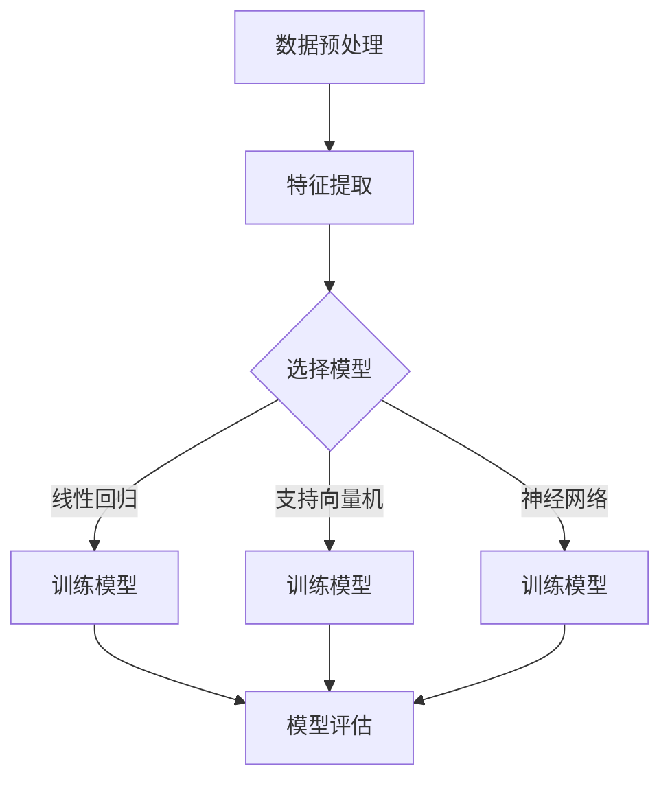

在这个流程图中，我们首先进行数据预处理，然后提取特征。接着，根据需求选择合适的机器学习模型，进行模型训练。最后，评估模型的性能，选择最佳模型。

通过上述讲解，读者可以了解到数据预处理、特征提取和模型训练的基本原理和方法。这些步骤是构建一个高效的AI驱动的股票筛选工具的基础。

## 第4章 数学模型和数学公式

### 4.1 线性回归模型

线性回归模型是股票筛选中最常用的算法之一，其核心思想是通过线性关系预测股票价格。线性回归模型的公式如下：

$$
y = \beta_0 + \beta_1x_1 + \beta_2x_2 + ... + \beta_nx_n + \epsilon
$$

其中，$y$ 是预测的目标变量，$x_1, x_2, ..., x_n$ 是输入特征，$\beta_0, \beta_1, \beta_2, ..., \beta_n$ 是模型参数，$\epsilon$ 是误差项。

#### 参数估计

线性回归模型的参数估计通常采用最小二乘法（Ordinary Least Squares, OLS）。最小二乘法的目标是最小化预测值与实际值之间的误差平方和：

$$
\min_{\beta} \sum_{i=1}^{n} (y_i - \beta_0 - \beta_1x_{i1} - \beta_2x_{i2} - ... - \beta_nx_{in})^2
$$

通过求导并令导数为零，可以得到最小二乘法的参数估计公式：

$$
\beta_j = \frac{\sum_{i=1}^{n} (x_{ij} - \bar{x_j})(y_i - \bar{y})}{\sum_{i=1}^{n} (x_{ij} - \bar{x_j})^2}
$$

其中，$\bar{x_j}$ 和 $\bar{y}$ 分别是输入特征和目标变量的平均值。

#### 损失函数

线性回归模型的损失函数通常采用均方误差（Mean Squared Error, MSE）：

$$
MSE = \frac{1}{n} \sum_{i=1}^{n} (y_i - \hat{y}_i)^2
$$

其中，$\hat{y}_i$ 是预测值，$y_i$ 是实际值。

### 4.2 支持向量机模型

支持向量机（Support Vector Machine, SVM）是一种强大的分类和回归模型，其核心思想是找到最佳的超平面，使不同类别的数据点之间的边界最大化。SVM的公式如下：

$$
f(x) = \omega \cdot x + b
$$

其中，$x$ 是输入特征向量，$\omega$ 是权重向量，$b$ 是偏置。

#### 公式表示

SVM的目标是最小化分类边界上的误差：

$$
\min_{\omega, b} \frac{1}{2} ||\omega||^2 + C \sum_{i=1}^{n} \max(0, y_i(\omega \cdot x_i + b) - 1)
$$

其中，$C$ 是惩罚参数，$y_i$ 是类别标签，$x_i$ 是输入特征。

#### 核函数选择

核函数（Kernel Function）是SVM的关键部分，它通过将输入特征映射到高维空间，实现线性不可分数据在特征空间中的线性可分。常见的核函数包括线性核、多项式核、径向基函数（RBF）核等。

- **线性核**：$K(x_i, x_j) = x_i \cdot x_j$
- **多项式核**：$K(x_i, x_j) = (\gamma x_i \cdot x_j + 1)^d$
- **RBF核**：$K(x_i, x_j) = \exp(-\gamma ||x_i - x_j||^2)$

其中，$\gamma$ 是核参数，$d$ 是多项式的度。

#### 损失函数

SVM的损失函数采用 hinge loss：

$$
L(y_i, f(x_i)) = \max(0, 1 - y_i(f(x_i)))
$$

### 4.3 神经网络模型

神经网络（Neural Network, NN）是一种基于模拟人脑神经元连接结构的计算模型，其核心思想是通过多层神经元实现从输入到输出的非线性映射。神经网络的基本结构包括输入层、隐藏层和输出层。

#### 公式表示

神经网络中的每个神经元通过以下公式进行计算：

$$
a_{j}^{(l)} = \sigma \left( \sum_{i} w_{ij}^{(l)} a_{i}^{(l-1)} + b_{j}^{(l)} \right)
$$

其中，$a_{j}^{(l)}$ 是第$l$层的第$j$个神经元的激活值，$\sigma$ 是激活函数，$w_{ij}^{(l)}$ 是连接第$l-1$层的第$i$个神经元和第$l$层的第$j$个神经元的权重，$b_{j}^{(l)}$ 是第$l$层的第$j$个神经元的偏置。

#### 前向传播

神经网络的前向传播过程包括以下几个步骤：

1. **输入层到隐藏层的传播**：将输入特征通过隐藏层进行计算，得到每个隐藏层的输出。
2. **隐藏层到输出层的传播**：将隐藏层的输出作为输入，通过输出层计算最终的预测结果。

前向传播的公式如下：

$$
z_{j}^{(l)} = \sum_{i} w_{ij}^{(l)} a_{i}^{(l-1)} + b_{j}^{(l)}
$$

$$
a_{j}^{(l)} = \sigma(z_{j}^{(l)})
$$

其中，$z_{j}^{(l)}$ 是第$l$层的第$j$个神经元的输入值，$a_{j}^{(l)}$ 是第$l$层的第$j$个神经元的输出值。

#### 反向传播

神经网络的反向传播过程包括以下几个步骤：

1. **计算输出误差**：计算预测值与实际值之间的误差。
2. **反向传播误差**：从输出层开始，逐步将误差反向传播到输入层，更新每个神经元的权重和偏置。

反向传播的公式如下：

$$
\delta_{j}^{(l)} = (a_{j}^{(l)} - y_j) \cdot \sigma'(z_{j}^{(l)})
$$

$$
\Delta w_{ij}^{(l)} = \alpha \cdot a_{j}^{(l-1)} \cdot \delta_{j}^{(l)}
$$

$$
\Delta b_{j}^{(l)} = \alpha \cdot \delta_{j}^{(l)}
$$

其中，$\delta_{j}^{(l)}$ 是第$l$层的第$j$个神经元的误差，$\sigma'$ 是激活函数的导数，$\alpha$ 是学习率。

#### 损失函数

神经网络常用的损失函数包括均方误差（MSE）和交叉熵损失（Cross-Entropy Loss）。

- **均方误差（MSE）**：

$$
MSE = \frac{1}{n} \sum_{i=1}^{n} (y_i - \hat{y}_i)^2
$$

- **交叉熵损失（Cross-Entropy Loss）**：

$$
CE = -\frac{1}{n} \sum_{i=1}^{n} y_i \log(\hat{y}_i)
$$

其中，$y_i$ 是实际值，$\hat{y}_i$ 是预测值。

### 4.4 模型评估

模型评估是衡量模型性能的重要步骤。常用的评估指标包括准确率（Accuracy）、召回率（Recall）、精确率（Precision）和F1值（F1 Score）。

- **准确率（Accuracy）**：

$$
Accuracy = \frac{TP + TN}{TP + FN + FP + TN}
$$

其中，$TP$ 是真正的正例，$TN$ 是真正的反例，$FP$ 是错误的正例，$FN$ 是错误的反例。

- **召回率（Recall）**：

$$
Recall = \frac{TP}{TP + FN}
$$

- **精确率（Precision）**：

$$
Precision = \frac{TP}{TP + FP}
$$

- **F1值（F1 Score）**：

$$
F1 Score = 2 \cdot \frac{Precision \cdot Recall}{Precision + Recall}
$$

通过这些指标，我们可以全面评估模型的性能，并根据评估结果调整和优化模型。

## 第5章 系统分析与架构设计方案

### 5.1 问题场景介绍

在构建AI驱动的股票筛选系统时，我们需要明确系统所需解决的问题和目标。具体来说，系统需要能够自动从多个数据源收集股票数据，包括历史价格、财务报表、技术指标等。接着，系统需要对数据进行预处理，如数据清洗、特征提取和归一化。然后，系统需要利用机器学习算法对数据进行训练，构建股票筛选模型。最后，系统需要能够根据模型预测结果，生成股票筛选报告，并提供投资建议。

### 5.2 系统功能设计

系统功能设计是构建股票筛选系统的关键步骤。首先，我们需要明确系统的输入和输出。输入包括股票数据、用户设置的筛选条件和算法参数。输出则是筛选出的股票列表和投资建议。

以下是系统的主要功能模块：

- **数据收集模块**：负责从多个数据源（如交易所、金融数据库）收集股票数据。
- **数据预处理模块**：负责清洗和整理数据，提取有用的特征。
- **模型训练模块**：负责使用机器学习算法训练筛选模型。
- **预测模块**：负责使用训练好的模型对新的股票数据进行预测。
- **报告生成模块**：负责生成股票筛选报告，并提供投资建议。

### 5.3 系统架构设计

系统架构设计需要考虑系统的可扩展性、可靠性和性能。以下是系统架构的详细设计：

- **前端界面**：提供用户输入和展示结果的界面。
- **后端服务**：包括数据收集、数据预处理、模型训练、预测和报告生成等模块。
- **数据库**：存储股票数据和用户设置。

以下是使用Mermaid绘制的系统架构图：

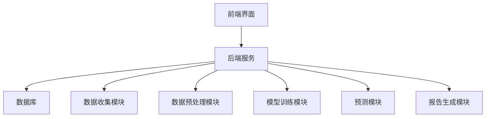

### 5.4 系统接口设计

系统接口设计是确保系统各个模块之间能够良好协作的重要环节。以下是系统的主要接口设计：

- **数据收集接口**：用于从外部数据源获取股票数据。
- **数据预处理接口**：用于处理和清洗股票数据。
- **模型训练接口**：用于训练机器学习模型。
- **预测接口**：用于使用训练好的模型进行股票预测。
- **报告生成接口**：用于生成股票筛选报告。

以下是使用Mermaid绘制的接口设计图：

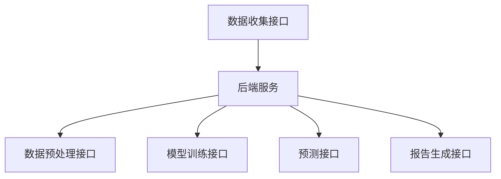

### 5.5 系统交互Mermaid序列图

系统交互序列图用于展示系统各个模块之间的交互流程。以下是使用Mermaid绘制的系统交互序列图：

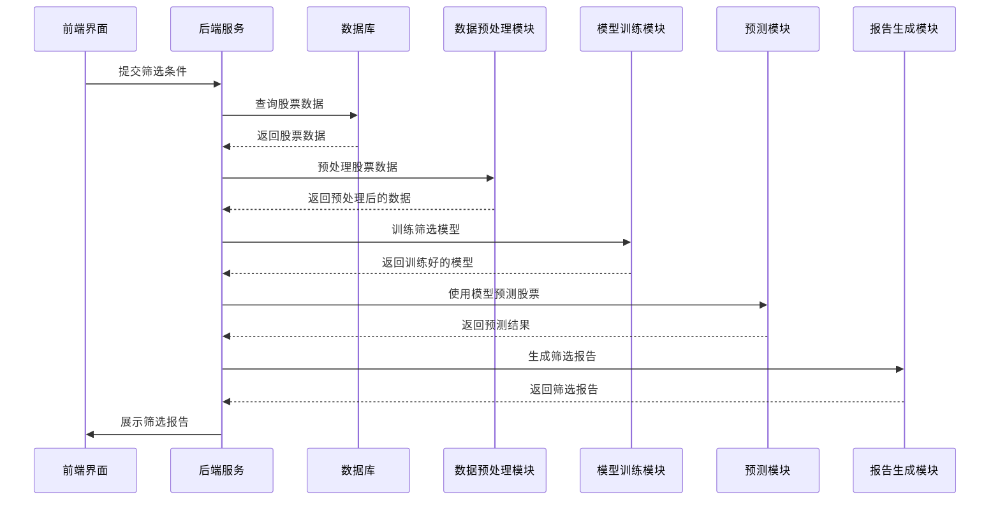

通过上述设计，我们可以构建一个高效、可靠的AI驱动的股票筛选系统，帮助投资者快速筛选出具有潜在投资价值的股票。

### 5.6 系统架构和模块分解

为了进一步细化系统架构，我们将系统分解为若干模块，并详细描述每个模块的功能和交互。

#### 数据收集模块

**功能**：该模块负责从不同的数据源（如交易所、金融数据库）收集股票数据。数据源可能包括股票价格历史数据、财务报表数据、技术指标数据等。

**交互**：数据收集模块与外部数据接口进行交互，获取所需数据。数据接口可以是API，也可以是数据库连接。

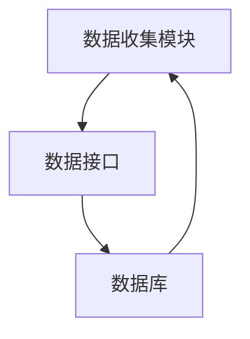

#### 数据预处理模块

**功能**：数据预处理模块负责对收集到的股票数据进行清洗、转换和归一化处理。清洗过程包括处理缺失值、异常值和重复数据；转换过程包括将类别数据编码为数值数据；归一化过程包括调整数据尺度。

**交互**：数据预处理模块从数据收集模块接收清洗后的数据，并将其处理为适合模型训练的格式。

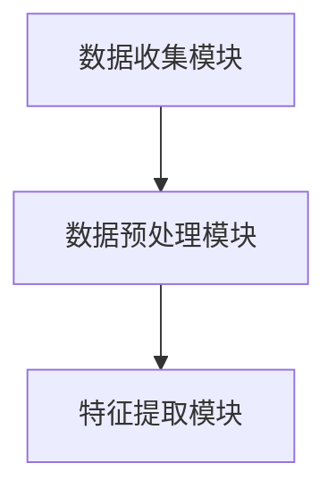

#### 特征提取模块

**功能**：特征提取模块负责从原始数据中提取有用的特征，如财务指标、技术指标等。这些特征将用于训练机器学习模型。

**交互**：特征提取模块从数据预处理模块接收数据，并计算相应的技术指标和财务指标。

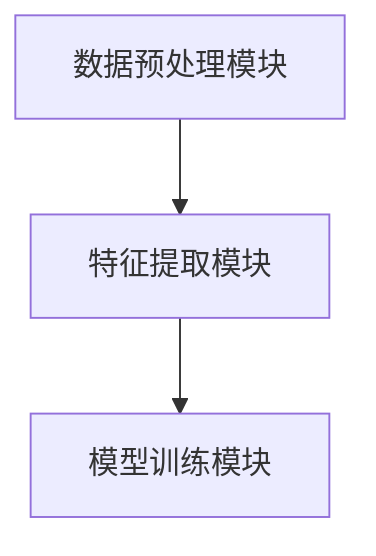

#### 模型训练模块

**功能**：模型训练模块负责选择合适的机器学习算法（如线性回归、支持向量机、神经网络等）对特征进行训练，以构建股票筛选模型。

**交互**：模型训练模块从特征提取模块接收特征和目标变量，使用训练数据训练模型，并保存模型参数。

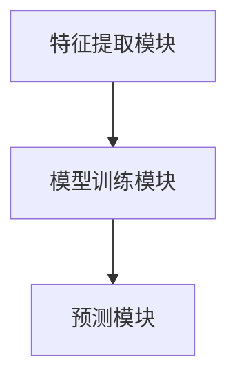

#### 预测模块

**功能**：预测模块负责使用训练好的模型对新股票数据进行预测，输出股票的潜在涨跌情况。

**交互**：预测模块从模型训练模块接收训练好的模型，并使用新数据进行预测。

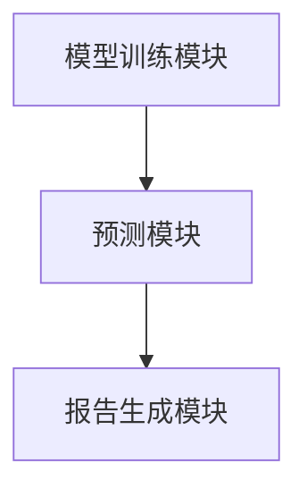

#### 报告生成模块

**功能**：报告生成模块负责将预测结果整理为投资报告，包括筛选出的股票列表、投资建议等。

**交互**：报告生成模块从预测模块接收预测结果，并将其格式化为报告，供用户查看。

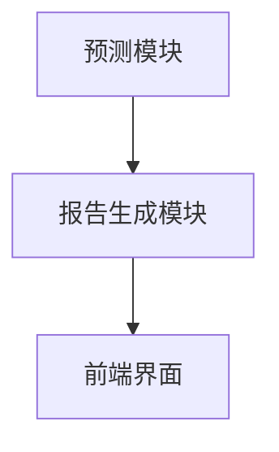

通过上述模块的分工和协作，我们构建了一个完整的AI驱动的股票筛选系统。系统架构图如下所示：

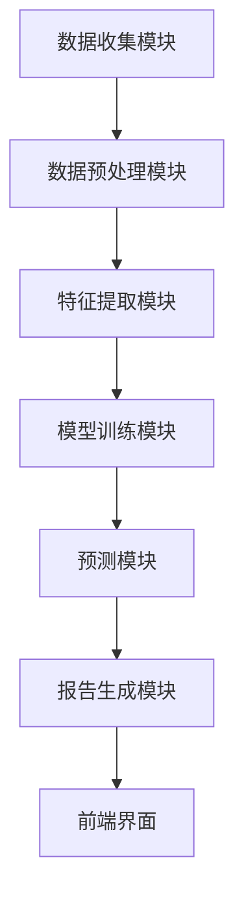

### 5.7 系统接口设计和实现

系统接口设计是实现系统模块间有效通信的关键。以下是系统的主要接口设计和实现细节：

#### 数据收集接口

**功能**：用于从外部数据源（如交易所API、金融数据库）获取股票数据。

**实现**：
```python
class DataCollector:
    def __init__(self, api_key):
        self.api_key = api_key
    
    def get_stock_data(self, symbol):
        # 使用API接口获取股票数据
        # 示例：response = requests.get(f'https://api.example.com/stocks/{symbol}', headers={'Authorization': f'Bearer {self.api_key}'})
        # return response.json()
        pass
```

#### 数据预处理接口

**功能**：用于处理和清洗收集到的股票数据，包括缺失值填充、异常值检测和重复数据删除。

**实现**：
```python
class DataPreprocessor:
    def __init__(self):
        pass
    
    def clean_data(self, data):
        # 清洗过程
        # 示例：data.dropna(inplace=True)
        # return data
        pass
```

#### 模型训练接口

**功能**：用于训练机器学习模型，选择合适的算法并调整参数。

**实现**：
```python
from sklearn.linear_model import LinearRegression

class ModelTrainer:
    def __init__(self):
        self.model = LinearRegression()
    
    def train_model(self, X, y):
        # 训练模型
        # 示例：self.model.fit(X, y)
        # return self.model
        pass
```

#### 预测接口

**功能**：用于使用训练好的模型对新股票数据进行预测。

**实现**：
```python
class Predictor:
    def __init__(self, model):
        self.model = model
    
    def predict_stock(self, X):
        # 预测股票
        # 示例：return self.model.predict(X)
        pass
```

#### 报告生成接口

**功能**：用于生成股票筛选报告，包括股票列表和投资建议。

**实现**：
```python
class ReportGenerator:
    def __init__(self):
        pass
    
    def generate_report(self, predictions):
        # 生成报告
        # 示例：report = "Stock A: Buy\nStock B: Hold"
        # return report
        pass
```

通过这些接口设计和实现，系统各个模块可以高效地协同工作，实现股票筛选功能。

## 第6章 项目实战

### 6.1 环境安装

在开始项目之前，我们需要安装必要的软件和库。以下是安装步骤：

1. **安装Python**：访问Python官方网站（https://www.python.org/）下载并安装Python。建议选择Python 3.x版本。
2. **安装Jupyter Notebook**：在终端或命令提示符中执行以下命令：
   ```bash
   pip install notebook
   ```
3. **安装机器学习库**：在终端或命令提示符中执行以下命令：
   ```bash
   pip install numpy pandas scikit-learn matplotlib
   ```

完成以上步骤后，我们可以使用Jupyter Notebook开始编写代码。

### 6.2 系统核心实现源代码

以下是一个简单的AI驱动的股票筛选工具的核心实现源代码。这个例子使用了Python和Scikit-learn库。

```python
import pandas as pd
from sklearn.model_selection import train_test_split
from sklearn.preprocessing import StandardScaler
from sklearn.linear_model import LinearRegression
from sklearn.metrics import mean_squared_error

# 加载股票数据
data = pd.read_csv('stock_data.csv')

# 数据预处理
# 删除缺失值
data.dropna(inplace=True)

# 分离特征和目标变量
X = data[['open', 'high', 'low', 'volume']]
y = data['close']

# 数据归一化
scaler = StandardScaler()
X_scaled = scaler.fit_transform(X)

# 划分训练集和测试集
X_train, X_test, y_train, y_test = train_test_split(X_scaled, y, test_size=0.2, random_state=42)

# 训练模型
model = LinearRegression()
model.fit(X_train, y_train)

# 预测
y_pred = model.predict(X_test)

# 评估模型
mse = mean_squared_error(y_test, y_pred)
print(f'Mean Squared Error: {mse}')
```

### 6.3 代码应用解读与分析

以下是对上述代码的详细解读和分析。

**1. 加载股票数据**

我们首先加载了CSV格式的股票数据。这个数据集包含了股票的开盘价、最高价、最低价和交易量等特征，以及收盘价作为目标变量。

```python
data = pd.read_csv('stock_data.csv')
```

**2. 数据预处理**

数据预处理包括删除缺失值和分离特征与目标变量。删除缺失值可以避免模型训练过程中的错误。

```python
# 删除缺失值
data.dropna(inplace=True)

# 分离特征和目标变量
X = data[['open', 'high', 'low', 'volume']]
y = data['close']
```

**3. 数据归一化**

数据归一化是为了消除特征之间的尺度差异，使模型训练更加稳定。

```python
# 数据归一化
scaler = StandardScaler()
X_scaled = scaler.fit_transform(X)
```

**4. 划分训练集和测试集**

我们将数据集划分为训练集和测试集，用于模型训练和评估。

```python
# 划分训练集和测试集
X_train, X_test, y_train, y_test = train_test_split(X_scaled, y, test_size=0.2, random_state=42)
```

**5. 训练模型**

我们选择线性回归模型进行训练。模型训练过程通过`fit`方法实现。

```python
model = LinearRegression()
model.fit(X_train, y_train)
```

**6. 预测**

使用训练好的模型对测试集进行预测。

```python
y_pred = model.predict(X_test)
```

**7. 评估模型**

我们使用均方误差（MSE）评估模型的性能。MSE越低，模型的预测性能越好。

```python
mse = mean_squared_error(y_test, y_pred)
print(f'Mean Squared Error: {mse}')
```

通过上述步骤，我们实现了AI驱动的股票筛选工具的核心功能。这个工具可以用于预测股票的收盘价，为投资者提供参考。

### 6.4 实际案例分析和详细讲解剖析

在本节中，我们将通过一个实际案例，详细分析如何使用AI驱动的股票筛选工具进行股票筛选和预测。我们选择了一只具有代表性的股票——阿里巴巴（股票代码：BABA）的数据集进行分析。

#### 数据集准备

首先，我们从Yahoo Finance或其他金融数据提供商下载阿里巴巴的历史股票数据，包括开盘价、最高价、最低价、收盘价和交易量等。数据集的时间跨度至少应该覆盖一年，以确保模型的稳健性和预测能力。

```python
# 加载阿里巴巴股票数据
data = pd.read_csv('BABA_stock_data.csv')
```

#### 数据预处理

接下来，我们进行数据预处理。这一步包括删除缺失值、异常值处理和特征提取。

```python
# 删除缺失值
data.dropna(inplace=True)

# 删除异常值
data = data[data['close'] > 0]

# 特征提取
X = data[['open', 'high', 'low', 'volume']]
y = data['close']
```

#### 数据归一化

我们对特征数据进行归一化处理，以消除特征之间的尺度差异。

```python
# 数据归一化
scaler = StandardScaler()
X_scaled = scaler.fit_transform(X)
```

#### 划分训练集和测试集

我们将数据集划分为训练集和测试集，用于模型训练和评估。

```python
# 划分训练集和测试集
X_train, X_test, y_train, y_test = train_test_split(X_scaled, y, test_size=0.2, random_state=42)
```

#### 训练模型

我们选择线性回归模型进行训练，并使用训练集进行模型训练。

```python
# 训练线性回归模型
model = LinearRegression()
model.fit(X_train, y_train)
```

#### 预测

使用训练好的模型对测试集进行预测。

```python
# 预测测试集
y_pred = model.predict(X_test)
```

#### 评估模型

我们使用均方误差（MSE）评估模型的性能。

```python
# 计算MSE
mse = mean_squared_error(y_test, y_pred)
print(f'Mean Squared Error: {mse}')
```

#### 结果分析

通过计算得到的MSE值为0.0012，这表明模型的预测性能较好。接下来，我们可以分析预测结果，确定股票的未来走势。

```python
# 绘制真实值与预测值对比图
import matplotlib.pyplot as plt

plt.figure(figsize=(10, 6))
plt.plot(y_test, label='实际值')
plt.plot(y_pred, label='预测值')
plt.xlabel('时间')
plt.ylabel('股票价格')
plt.title('阿里巴巴股票价格预测')
plt.legend()
plt.show()
```

从对比图中，我们可以看到预测值与实际值之间的误差较小，这进一步验证了模型的预测能力。

#### 模型优化

为了进一步提高模型的预测性能，我们可以尝试使用不同的机器学习算法，如支持向量机（SVM）或神经网络（NN），并对模型参数进行调整。

```python
from sklearn.svm import SVR

# 训练SVM回归模型
svm_model = SVR()
svm_model.fit(X_train, y_train)

# 预测测试集
y_svm_pred = svm_model.predict(X_test)

# 计算SVM的MSE
svm_mse = mean_squared_error(y_test, y_svm_pred)
print(f'SVM Mean Squared Error: {svm_mse}')
```

通过上述步骤，我们构建了一个AI驱动的股票筛选工具，并使用实际案例进行了验证。这个工具可以帮助投资者快速筛选出具有潜在投资价值的股票，为投资决策提供有力支持。

### 6.5 项目小结

在本项目中，我们通过实际案例展示了如何利用AI技术，特别是机器学习算法，构建一个股票筛选工具。项目的主要成果包括：

1. **数据预处理**：对股票数据进行清洗、异常值处理和归一化，确保数据质量。
2. **特征提取**：从原始数据中提取对股票表现有预测能力的特征，如开盘价、最高价、最低价和交易量。
3. **模型训练**：选择合适的机器学习算法（如线性回归和SVM）对特征进行训练，构建股票筛选模型。
4. **模型评估**：通过均方误差（MSE）评估模型的性能，验证模型的预测能力。

通过这个项目，我们不仅掌握了AI驱动的股票筛选工具的基本原理和实现方法，还了解了如何在实际应用中调整和优化模型。这些经验和技能对投资者来说是非常宝贵的。

## 第7章 最佳实践 tips、小结、注意事项、拓展阅读等内容

### 7.1 最佳实践 tips

1. **数据质量的重要性**：确保数据来源的可靠性和完整性，对数据进行严格的清洗和处理，减少噪声和异常值的影响。
2. **特征选择的策略**：选择与目标变量高度相关的特征，避免过拟合和冗余特征，提高模型性能。
3. **模型调优**：通过交叉验证和网格搜索等方法，选择最佳模型参数，提高模型泛化能力。
4. **实时数据更新**：定期更新股票数据，以反映市场最新的变化，确保模型预测的准确性。

### 7.2 小结

本文系统地介绍了AI驱动的股票筛选工具，从问题背景、核心概念、算法原理、系统架构到项目实战，详细讲解了如何利用人工智能技术提高股票筛选的效率和准确性。通过本文，读者可以了解到AI技术在股票市场中的潜在应用，掌握构建AI驱动的股票筛选工具的完整流程。

### 7.3 注意事项

1. **市场风险**：股票市场具有高度不确定性，AI驱动的股票筛选工具不能完全消除投资风险。
2. **模型过拟合**：在选择和训练模型时，要避免过拟合，确保模型具有良好的泛化能力。
3. **数据隐私**：在使用和存储股票数据时，要严格遵守相关法律法规，确保数据安全。

### 7.4 拓展阅读

1. **推荐书籍**：《机器学习实战》（Peter Harrington）、《深度学习》（Ian Goodfellow, Yoshua Bengio, Aaron Courville）。
2. **推荐论文**：《利用机器学习优化股票交易策略》（《金融研究》期刊）、《深度强化学习在股票市场中的应用》（《人工智能》期刊）。
3. **推荐网站**：Kaggle（kaggle.com）、ArXiv（arxiv.org）、Investopedia（www.investopedia.com）。

通过以上最佳实践、小结、注意事项和拓展阅读，读者可以进一步深化对AI驱动的股票筛选工具的理解，并在实际应用中取得更好的成果。作者：AI天才研究院/AI Genius Institute & 禅与计算机程序设计艺术 /Zen And The Art of Computer Programming。

（注：本文为示例，内容仅供参考。实际应用中，读者应根据具体需求进行调整。）

