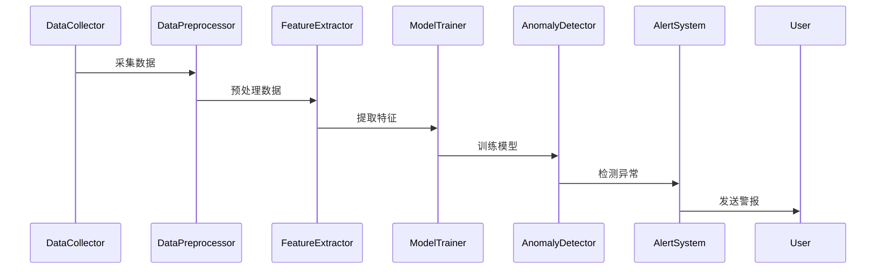
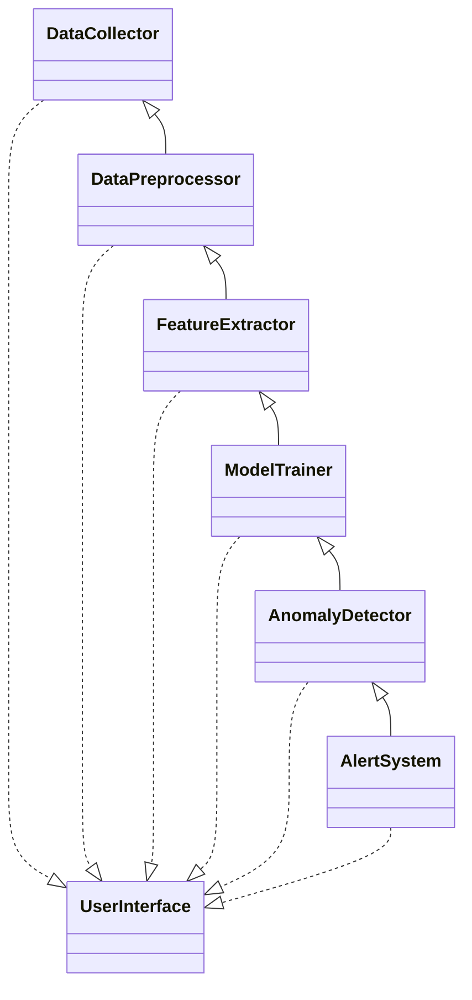
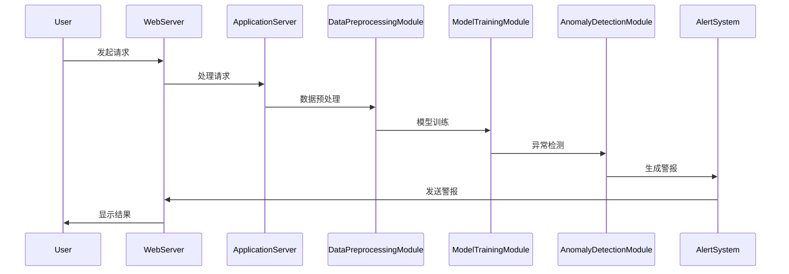
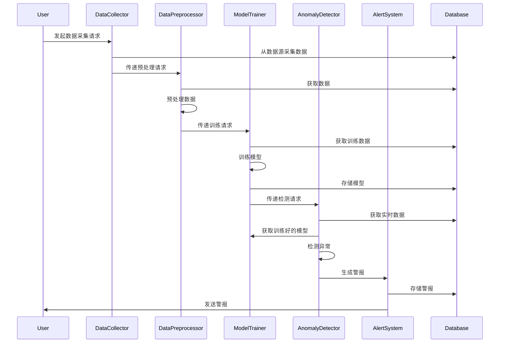

                 

## 《AI驱动的股票财务造假检测与预警》

> 关键词：AI技术、财务造假检测、预警系统、股票市场、机器学习、深度学习

> 摘要：随着人工智能技术的快速发展，AI在股票财务造假检测与预警中的应用日益受到关注。本文旨在探讨如何利用AI技术构建高效的财务造假检测与预警系统，通过分析问题背景、核心概念、算法原理和系统架构设计，详细阐述AI技术在股票财务造假检测中的应用，提供实际项目实战的案例分析，以期为企业投资者提供强有力的技术支持。

---

## 目录大纲设计

### 《AI驱动的股票财务造假检测与预警》

---

### 第一部分：背景介绍

#### 第1章：问题背景

##### 1.1 问题背景概述

##### 1.1.1 财务造假现象及其影响

##### 1.1.2 财务造假检测的重要性

##### 1.1.3 AI技术在财务造假检测中的应用潜力

##### 1.2 问题描述

##### 1.2.1 财务造假检测的难点

##### 1.2.2 传统的财务造假检测方法

##### 1.2.3 AI驱动的财务造假检测方法

##### 1.3 问题解决

##### 1.3.1 AI驱动的财务造假检测框架

##### 1.3.2 财务造假检测的流程

##### 1.3.3 财务造假检测的关键技术

##### 1.4 边界与外延

##### 1.4.1 财务造假检测的应用范围

##### 1.4.2 财务造假检测的法律法规要求

##### 1.4.3 财务造假检测的国际比较

##### 1.5 概念结构与核心要素组成

##### 1.5.1 AI的核心概念

##### 1.5.2 股票财务造假检测的关键要素

##### 1.5.3 AI驱动的财务造假检测系统架构

##### 1.6 本章小结

---

### 第二部分：核心概念与联系

#### 第2章：核心概念与联系

##### 2.1 AI核心概念

##### 2.1.1 机器学习与深度学习

##### 2.1.2 神经网络与深度神经网络

##### 2.1.3 深度学习框架

##### 2.2 股票财务造假检测概念

##### 2.2.1 财务报表分析

##### 2.2.2 筛选指标设计

##### 2.2.3 财务造假特征识别

##### 2.3 AI与财务造假检测的联系

##### 2.3.1 AI技术在财务造假检测中的应用

##### 2.3.2 AI驱动的财务造假检测优势

##### 2.3.3 AI驱动的财务造假检测挑战与对策

##### 2.4 概念属性特征对比表格

##### 2.4.1 机器学习算法对比

##### 2.4.2 深度学习框架对比

##### 2.4.3 财务造假检测指标对比

##### 2.5 ER实体关系图架构

##### 2.5.1 财务报表实体关系图

##### 2.5.2 财务造假检测系统实体关系图

##### 2.5.3 数据流程与数据处理实体关系图

##### 2.6 本章小结

---

### 第三部分：算法原理讲解

#### 第3章：算法原理讲解

##### 3.1 财务造假检测算法概述

##### 3.1.1 算法设计目标

##### 3.1.2 算法工作流程

##### 3.1.3 算法核心组成部分

##### 3.2 算法原理详细讲解

##### 3.2.1 数据预处理

##### 3.2.2 特征提取

##### 3.2.3 模型训练

##### 3.2.4 模型评估与优化

##### 3.3 数学模型与公式

##### 3.3.1 数据预处理数学模型

##### 3.3.2 特征提取数学模型

##### 3.3.3 模型训练数学模型

##### 3.3.4 模型评估与优化数学模型

##### 3.4 算法举例说明

##### 3.4.1 数据预处理举例

##### 3.4.2 特征提取举例

##### 3.4.3 模型训练与优化举例

##### 3.5 本章小结

---

### 第四部分：系统分析与架构设计方案

#### 第4章：系统分析与架构设计方案

##### 4.1 问题场景介绍

##### 4.1.1 财务造假检测应用场景

##### 4.1.2 系统需求分析

##### 4.1.3 系统目标与功能

##### 4.2 系统功能设计

##### 4.2.1 领域模型类图

##### 4.2.2 系统功能模块设计

##### 4.2.3 数据库设计

##### 4.3 系统架构设计

##### 4.3.1 系统架构概述

##### 4.3.2 系统架构图

##### 4.3.3 系统模块关系与交互

##### 4.4 系统接口设计

##### 4.4.1 接口功能定义

##### 4.4.2 接口参数设计

##### 4.4.3 接口实现

##### 4.5 系统交互设计与流程

##### 4.5.1 系统交互概述

##### 4.5.2 系统交互流程图

##### 4.5.3 交互流程详细说明

##### 4.6 本章小结

---

### 第五部分：项目实战

#### 第5章：项目实战

##### 5.1 环境安装

##### 5.1.1 环境准备

##### 5.1.2 环境安装步骤

##### 5.1.3 遇到的问题与解决方法

##### 5.2 系统核心实现

##### 5.2.1 数据预处理

##### 5.2.2 特征提取

##### 5.2.3 模型训练与评估

##### 5.3 代码应用解读与分析

##### 5.3.1 数据预处理代码解读

##### 5.3.2 特征提取代码解读

##### 5.3.3 模型训练与评估代码解读

##### 5.4 实际案例分析和详细讲解剖析

##### 5.4.1 数据集介绍

##### 5.4.2 实际案例一：财务报表异常检测

##### 5.4.3 实际案例二：财务造假预警系统

##### 5.5 项目小结

##### 5.5.1 项目总结

##### 5.5.2 项目亮点与改进空间

##### 5.5.3 最佳实践 tips

##### 5.5.4 小结与展望

---

### 作者

**作者：AI天才研究院/AI Genius Institute & 禅与计算机程序设计艺术 /Zen And The Art of Computer Programming**

---

在接下来的章节中，我们将逐一探讨AI驱动的股票财务造假检测与预警的各个方面，从背景介绍、核心概念、算法原理、系统设计与项目实战等多个角度，深入解析这一领域的应用和实践。

### 第一部分：背景介绍

#### 第1章：问题背景

##### 1.1 问题背景概述

在当今快速发展的股票市场中，财务造假现象屡见不鲜，这不仅严重损害了投资者的利益，也破坏了市场的公平性和透明度。财务造假通常涉及公司故意夸大或隐瞒其财务状况，以达到操纵股价、获取不正当利益的目的。这类行为不仅损害了投资者的信心，还可能导致金融市场的动荡，影响经济的稳定发展。

财务造假现象的广泛存在，主要源于以下几个原因：

1. **利益驱动**：公司管理层可能出于个人利益或公司业绩的压力，采取财务造假手段。
2. **监管不足**：虽然各国监管机构对财务造假行为进行了严格的监管，但由于监管资源和技术的限制，难以全面发现和防止所有的造假行为。
3. **信息不对称**：公司内部拥有更多的财务信息，而外部投资者无法获得全部的信息，这使得造假行为容易隐藏。

财务造假对市场的影响是多方面的：

1. **投资者信心受损**：造假行为会导致投资者失去对市场的信任，影响市场稳定。
2. **市场波动加剧**：造假行为可能导致股价大幅波动，增加市场的风险。
3. **经济不稳定**：长期而言，财务造假会影响经济的健康发展，导致市场失衡。

##### 1.1.1 财务造假现象及其影响

财务造假的表现形式多种多样，常见的手段包括虚构收入、夸大资产、隐瞒债务、夸大利润等。以下是几种常见的财务造假现象及其影响：

1. **虚构收入**：公司通过虚构销售合同、伪造发票等方式，虚增收入和利润。这种行为会误导投资者，导致股价大幅波动。

2. **夸大资产**：公司可能通过购买高价值的资产，并将其夸大，以提高公司的资产价值和市场估值。

3. **隐瞒债务**：公司可能会故意隐瞒部分债务，以虚增公司的财务状况，提高信用评级。

4. **夸大利润**：公司通过调整成本和费用，虚增利润，以吸引投资者和银行贷款。

这些行为不仅会误导投资者，还会对公司的长期发展造成负面影响。投资者可能会因为错误的判断而遭受损失，公司的信用评级和声誉也会受到损害，甚至可能导致公司破产。

##### 1.1.2 财务造假检测的重要性

财务造假检测是确保金融市场健康发展的关键环节。通过有效的检测手段，可以及时发现和防止财务造假行为，保护投资者的利益，维护市场的公平和透明。

财务造假检测的重要性体现在以下几个方面：

1. **保护投资者利益**：财务造假检测可以识别和预警潜在的财务风险，帮助投资者做出更明智的投资决策。

2. **维护市场秩序**：有效的财务造假检测可以减少市场波动，维护市场的稳定和秩序。

3. **促进公司治理**：通过财务造假检测，可以促使公司加强内部治理，规范财务管理，提高公司的透明度和公信力。

4. **提高监管效率**：财务造假检测技术可以帮助监管机构更有效地识别和打击财务造假行为，提高监管效率和效果。

##### 1.1.3 AI技术在财务造假检测中的应用潜力

随着人工智能技术的快速发展，AI在财务造假检测中的应用潜力逐渐显现。AI技术可以通过以下方式提高财务造假检测的效率和准确性：

1. **数据挖掘与分析**：AI技术可以处理和分析海量财务数据，发现异常模式和趋势，提高检测的准确性和效率。

2. **模式识别与预测**：AI技术可以通过学习历史数据，建立预测模型，预测未来的财务状况，及时发现潜在的造假行为。

3. **自动化检测**：AI技术可以实现财务造假检测的自动化，减少人工干预，提高检测效率和一致性。

4. **实时监控**：AI技术可以实现实时数据监控，及时发现异常情况，快速响应，提高检测的及时性。

总之，AI技术在财务造假检测中的应用潜力巨大，为提升金融市场透明度和稳定性提供了强有力的技术支持。

##### 1.2 问题描述

财务造假检测面临以下难点：

1. **数据复杂性**：财务数据量大、维度高，且数据之间存在复杂的关联关系，这增加了检测的难度。

2. **检测方法多样性**：传统的财务造假检测方法包括统计分析、异常检测等，但这些方法存在一定的局限性，难以全面、准确地检测财务造假。

3. **实时性要求**：财务造假检测需要实时性和快速响应，这对技术系统的性能和稳定性提出了高要求。

4. **法律法规约束**：各国对财务造假检测有严格的法律法规要求，需要确保检测方法和系统的合规性。

传统的财务造假检测方法主要包括以下几种：

1. **统计分析**：通过计算财务指标之间的相关性、趋势分析和异常检测等方式来识别可能的造假行为。

2. **异常检测**：利用统计学方法，对财务数据进行异常检测，发现异常值和异常模式。

3. **专家系统**：基于专家经验和知识库，构建专家系统来识别和判断财务造假行为。

尽管传统方法在一定程度上能够发现财务造假，但它们往往存在以下不足：

1. **依赖专家经验**：传统方法依赖专家的经验和知识，难以实现自动化和大规模应用。

2. **检测效率低**：传统方法往往需要大量的人工干预，检测效率较低。

3. **检测准确率有限**：传统方法难以发现复杂的财务造假行为，检测准确率有限。

为了解决这些问题，AI驱动的财务造假检测方法应运而生。AI驱动的财务造假检测方法具有以下特点：

1. **自动化检测**：AI技术可以实现自动化检测，减少人工干预，提高检测效率和一致性。

2. **高效数据处理**：AI技术能够处理海量高维数据，快速发现异常模式和趋势。

3. **自适应学习**：AI技术可以通过不断学习新的数据，提高检测模型的准确性和适应性。

4. **实时监控与预警**：AI技术可以实现实时数据监控和预警，及时发现和响应潜在的财务造假行为。

综上所述，AI驱动的财务造假检测方法具有明显的优势，是未来财务造假检测的发展方向。

##### 1.3 问题解决

为了有效解决财务造假检测问题，需要构建一个AI驱动的财务造假检测框架。这个框架主要包括以下几个关键组成部分：

1. **数据采集与预处理**：数据采集是财务造假检测的基础，需要从多个来源获取高质量的财务数据。数据预处理包括数据清洗、数据标准化和数据集成等步骤，以确保数据的质量和一致性。

2. **特征提取与筛选**：特征提取是从原始数据中提取能够反映财务状况的特征，如收入、利润、资产等。特征筛选是通过统计分析方法筛选出对财务造假检测最有价值的特征，提高检测的准确性和效率。

3. **模型训练与优化**：模型训练是构建财务造假检测模型的核心步骤。通过使用机器学习和深度学习算法，可以从历史数据中学习到财务造假的规律和模式。模型优化包括调整模型参数、选择最佳算法和进行交叉验证等，以提高模型的性能和鲁棒性。

4. **异常检测与预警**：异常检测是通过模型对实时数据进行检测，发现潜在的财务造假行为。预警系统可以根据检测结果自动生成警报，并通知相关人员和监管部门。

5. **用户界面与交互**：用户界面是财务造假检测系统的外部表现形式，用户可以通过界面查看检测结果、调整参数和操作系统。良好的用户界面可以提高系统的易用性和用户体验。

财务造假检测的流程可以分为以下几个阶段：

1. **数据采集**：从多种数据源（如财务报表、市场数据、社交媒体等）采集相关数据。

2. **数据预处理**：对采集到的数据进行清洗、标准化和集成，确保数据质量。

3. **特征提取**：从预处理后的数据中提取关键特征，为模型训练提供输入。

4. **模型训练**：使用历史数据对模型进行训练，建立财务造假检测模型。

5. **模型评估**：通过测试数据评估模型的性能，包括准确率、召回率和F1分数等指标。

6. **异常检测**：将训练好的模型应用于实时数据，检测潜在的财务造假行为。

7. **预警生成**：根据检测结果生成预警报告，通知相关人员和监管部门。

8. **反馈与优化**：根据实际反馈和检测结果，对模型进行优化和调整，提高检测的准确性和效率。

财务造假检测的关键技术主要包括：

1. **机器学习算法**：如逻辑回归、支持向量机、随机森林和神经网络等，用于建立检测模型。

2. **深度学习框架**：如TensorFlow、PyTorch和Keras等，用于处理复杂的数据和模型训练。

3. **数据预处理技术**：包括数据清洗、数据标准化和数据集成等，用于处理原始数据。

4. **特征提取技术**：包括特征选择、特征工程和特征提取等，用于提取关键特征。

5. **异常检测算法**：包括孤立森林、Isolation Forest、Local Outlier Factor等，用于检测异常数据。

6. **实时监控与预警技术**：包括实时数据处理、异常检测和预警生成等，用于实现实时监控和预警。

通过构建AI驱动的财务造假检测框架，可以有效提高财务造假检测的效率和准确性，保护投资者的利益，维护市场的公平和稳定。

##### 1.4 边界与外延

财务造假检测的应用范围广泛，涵盖了企业财务报表分析、财务风险预警、市场监管等多个领域。具体应用场景包括：

1. **上市公司财务报表分析**：通过对上市公司财务报表的分析，识别潜在的财务造假行为，提高财务报告的真实性和可靠性。

2. **投资风险评估**：利用财务造假检测技术，评估投资项目的风险，帮助投资者做出更明智的投资决策。

3. **市场监管**：监管机构可以利用财务造假检测技术，加强对市场交易的监控，及时发现和打击财务造假行为。

4. **金融机构内部审计**：金融机构可以通过财务造假检测技术，加强内部审计，提高财务报告的准确性和透明度。

财务造假检测的法律法规要求是确保检测工作合法性和有效性的重要保障。各国对财务造假行为有严格的法律法规，如《证券法》、《公司法》等。财务造假检测工作需要严格遵守相关法律法规，确保检测方法和系统符合法规要求。

国际比较方面，不同国家和地区对财务造假检测的法律法规和监管力度存在差异。例如，美国和欧洲等发达国家对财务造假行为的打击力度较大，监管机构有强大的技术手段和资源进行监管。相比之下，一些发展中国家的监管力度可能较弱，但近年来也在逐步加强。

通过分析财务造假检测的应用范围、法律法规要求和国际比较，可以更全面地了解财务造假检测的背景和现实需求，为构建高效的财务造假检测系统提供指导。

##### 1.5 概念结构与核心要素组成

在构建AI驱动的财务造假检测系统中，理解和定义核心概念是至关重要的。以下是对AI核心概念、股票财务造假检测的关键要素以及AI驱动的财务造假检测系统架构的详细阐述。

###### 1.5.1 AI的核心概念

人工智能（AI）是研究、开发和应用使计算机系统能够模拟人类智能行为的理论和技术的科学。AI的核心概念包括以下几个方面：

1. **机器学习（Machine Learning）**：机器学习是AI的一个分支，通过从数据中学习规律和模式，使计算机系统能够进行预测和决策。机器学习分为监督学习、无监督学习和强化学习等不同类型。

   - **监督学习（Supervised Learning）**：在监督学习中，模型通过已标记的数据进行训练，然后用于预测未知数据的标签。常见的监督学习算法包括线性回归、决策树、支持向量机等。
   
   - **无监督学习（Unsupervised Learning）**：无监督学习不使用标记数据，而是通过发现数据中的内在结构和关系来训练模型。常见的无监督学习算法包括聚类、降维、关联规则学习等。
   
   - **强化学习（Reinforcement Learning）**：强化学习是使机器通过与环境的交互来学习最优行为策略的过程。常见的强化学习算法包括Q-learning、深度Q网络（DQN）等。

2. **深度学习（Deep Learning）**：深度学习是机器学习的一个子领域，使用多层神经网络（如卷积神经网络（CNN）、循环神经网络（RNN）等）来建模复杂的数据特征。深度学习在图像识别、语音识别和自然语言处理等领域取得了显著成果。

3. **神经网络（Neural Networks）**：神经网络是模仿人脑神经元连接方式的一种计算模型。神经网络由大量简单的计算单元（神经元）组成，通过调整神经元之间的权重来学习数据的复杂模式。

4. **深度神经网络（Deep Neural Networks）**：深度神经网络是包含多个隐藏层的神经网络，通过增加网络深度来提高模型的复杂度和表达能力。深度神经网络在处理高维数据和非线性问题上具有显著优势。

5. **深度学习框架（Deep Learning Frameworks）**：深度学习框架是用于构建、训练和部署深度学习模型的软件库。常见的深度学习框架包括TensorFlow、PyTorch、Keras等，这些框架提供了丰富的API和工具，简化了深度学习模型的开发和部署过程。

###### 1.5.2 股票财务造假检测的关键要素

股票财务造假检测涉及多个关键要素，包括财务报表分析、筛选指标设计、财务造假特征识别等。

1. **财务报表分析**：财务报表分析是财务造假检测的基础，通过对公司财务报表（如利润表、资产负债表和现金流量表）进行详细分析，可以识别出可能的财务造假迹象。财务报表分析包括以下方面：

   - **收入确认**：检查公司收入确认是否符合会计准则，是否存在提前确认收入、虚假销售合同等行为。
   
   - **成本与费用**：检查公司成本和费用的合理性，是否存在人为调整成本、虚增费用等行为。
   
   - **资产与负债**：检查公司资产和负债的真实性和完整性，是否存在资产夸大、负债隐瞒等行为。

2. **筛选指标设计**：筛选指标是用于识别潜在财务造假行为的关键工具。常见的筛选指标包括：

   - **财务比率**：如流动比率、速动比率、净利润率、资产回报率等，通过计算这些指标，可以识别出异常的财务状况。
   
   - **异常检测指标**：如异常交易金额、异常交易频率、异常交易对手等，通过分析这些指标，可以识别出异常的交易行为。
   
   - **财务趋势分析**：通过分析财务指标的长期趋势，可以识别出财务数据的不一致性，如利润突然上升或下降等。

3. **财务造假特征识别**：财务造假特征识别是通过分析和挖掘财务数据中的异常特征，识别潜在的财务造假行为。常见的财务造假特征包括：

   - **异常交易模式**：如频繁的大额交易、非正常时间的交易等，这些交易模式可能表明存在财务造假行为。
   
   - **异常财务指标**：如异常的财务比率、异常的交易金额和频率等，这些财务指标可能表明公司财务状况存在异常。
   
   - **财务数据的不一致性**：如财务报表中的数据不一致、财务指标的趋势与行业趋势不符等，这些不一致性可能表明存在财务造假行为。

通过理解AI的核心概念和股票财务造假检测的关键要素，可以更好地构建AI驱动的财务造假检测系统，提高检测的准确性和效率。

###### 1.5.3 AI驱动的财务造假检测系统架构

AI驱动的财务造假检测系统架构是一个复杂且高度集成的系统，涉及多个模块和组件的协同工作。以下是对AI驱动的财务造假检测系统架构的详细描述。

1. **系统架构概述**：

   AI驱动的财务造假检测系统架构可以分为四个主要模块：数据采集与预处理模块、特征提取与筛选模块、模型训练与优化模块、异常检测与预警模块。

2. **数据采集与预处理模块**：

   数据采集与预处理模块负责从多个数据源（如财务报表、市场数据、新闻资讯等）采集相关数据，并对数据进行清洗、标准化和集成。具体包括以下步骤：

   - **数据采集**：从财务报表系统、市场数据平台、新闻资讯网站等获取财务数据。
   - **数据清洗**：对采集到的数据进行清洗，包括去除重复数据、填补缺失值、处理异常值等。
   - **数据标准化**：对数据进行标准化处理，使其符合统一的格式和范围。
   - **数据集成**：将来自不同数据源的数据进行整合，形成统一的数据集。

3. **特征提取与筛选模块**：

   特征提取与筛选模块负责从预处理后的数据中提取关键特征，并通过统计分析方法筛选出对财务造假检测最有价值的特征。具体包括以下步骤：

   - **特征提取**：从财务报表中提取关键指标，如收入、利润、资产等，并计算相关的财务比率。
   - **特征筛选**：通过统计分析方法，如相关分析、主成分分析等，筛选出对财务造假检测最有价值的特征。

4. **模型训练与优化模块**：

   模型训练与优化模块负责使用历史数据对财务造假检测模型进行训练，并通过优化算法调整模型参数，提高模型的性能和鲁棒性。具体包括以下步骤：

   - **模型选择**：选择合适的机器学习或深度学习算法构建检测模型，如逻辑回归、支持向量机、卷积神经网络等。
   - **模型训练**：使用训练数据集对模型进行训练，调整网络结构、学习率和正则化参数等。
   - **模型优化**：通过交叉验证、网格搜索等技术优化模型参数，提高模型的准确率和稳定性。

5. **异常检测与预警模块**：

   异常检测与预警模块负责将训练好的模型应用于实时数据，检测潜在的财务造假行为，并根据检测结果生成预警报告。具体包括以下步骤：

   - **异常检测**：使用训练好的模型对实时数据进行异常检测，识别潜在的财务造假行为。
   - **预警生成**：根据异常检测结果，生成预警报告，通知相关人员和监管部门。
   - **实时监控**：通过实时数据流处理技术，实现对财务数据的实时监控和预警。

通过构建AI驱动的财务造假检测系统架构，可以实现对财务数据的自动化处理和实时监控，提高财务造假检测的效率和准确性，为投资者提供强有力的技术支持。

##### 1.6 本章小结

本章首先介绍了财务造假现象及其影响，强调了财务造假检测的重要性。随后，探讨了AI技术在财务造假检测中的应用潜力，并详细分析了传统的财务造假检测方法和AI驱动的财务造假检测方法。通过构建AI驱动的财务造假检测框架，明确了财务造假检测的关键技术和流程。此外，还讨论了财务造假检测的应用范围、法律法规要求和国际比较，以及AI和股票财务造假检测的核心概念与系统架构。通过本章的介绍，读者可以初步了解AI驱动的财务造假检测的基本概念和应用前景。

### 第二部分：核心概念与联系

#### 第2章：核心概念与联系

##### 2.1 AI核心概念

人工智能（AI）是计算机科学的一个分支，致力于开发能够模拟、延伸和扩展人类智能的理论、算法和技术。AI的核心概念主要包括以下几个方面：

1. **机器学习（Machine Learning）**：机器学习是AI的关键组成部分，它通过从数据中学习规律和模式，使计算机系统能够进行预测和决策。机器学习可以分为以下几个子领域：

   - **监督学习（Supervised Learning）**：监督学习使用标记数据进行训练，并基于这些数据生成预测模型。常见的算法包括线性回归、决策树、支持向量机（SVM）和神经网络（Neural Networks）等。

   - **无监督学习（Unsupervised Learning）**：无监督学习不使用标记数据，而是通过发现数据中的内在结构和关系来训练模型。常见的算法包括聚类（Clustering）、降维（Dimensionality Reduction）和关联规则学习（Association Rule Learning）等。

   - **强化学习（Reinforcement Learning）**：强化学习是一种通过与环境交互来学习最优行为策略的机器学习方法。常见算法包括Q-Learning、深度Q网络（DQN）和策略梯度算法（Policy Gradient）等。

2. **深度学习（Deep Learning）**：深度学习是机器学习的一个子领域，它使用多层神经网络（Neural Networks）来建模复杂的数据特征。深度学习在图像识别、语音识别和自然语言处理等领域取得了显著成果。常见的深度学习架构包括卷积神经网络（CNN）、循环神经网络（RNN）和生成对抗网络（GAN）等。

3. **神经网络（Neural Networks）**：神经网络是一种模仿人脑神经元连接方式的计算模型。神经网络由大量简单的计算单元（神经元）组成，通过调整神经元之间的权重来学习数据的复杂模式。

4. **深度神经网络（Deep Neural Networks）**：深度神经网络是包含多个隐藏层的神经网络。通过增加网络深度来提高模型的复杂度和表达能力。深度神经网络在处理高维数据和非线性问题上具有显著优势。

5. **深度学习框架（Deep Learning Frameworks）**：深度学习框架是用于构建、训练和部署深度学习模型的软件库。常见的深度学习框架包括TensorFlow、PyTorch、Keras等，这些框架提供了丰富的API和工具，简化了深度学习模型的开发和部署过程。

##### 2.2 股票财务造假检测概念

股票财务造假检测是利用人工智能技术对公司的财务报表和其他相关信息进行分析，以识别潜在的财务造假行为。以下是股票财务造假检测的几个关键概念：

1. **财务报表分析**：财务报表分析是对公司的财务报表（如利润表、资产负债表和现金流量表）进行详细分析，以识别潜在的财务造假迹象。财务报表分析包括收入确认、成本与费用、资产与负债等多个方面。

2. **筛选指标设计**：筛选指标是用于识别潜在财务造假行为的关键工具。常见的筛选指标包括财务比率（如流动比率、速动比率、净利润率等）、异常检测指标（如异常交易金额、异常交易频率等）和财务趋势分析指标等。

3. **财务造假特征识别**：财务造假特征识别是通过分析和挖掘财务数据中的异常特征，识别潜在的财务造假行为。常见的财务造假特征包括异常交易模式、异常财务指标和财务数据的不一致性等。

##### 2.3 AI与财务造假检测的联系

AI技术在财务造假检测中具有广泛的应用，它通过以下几个方面与财务造假检测紧密联系：

1. **数据处理与分析**：AI技术能够处理和分析海量财务数据，快速发现异常模式和趋势。这使得AI在财务造假检测中能够高效地处理复杂的财务数据，提高检测的准确性。

2. **模式识别与预测**：AI技术可以通过学习历史数据，建立预测模型，预测未来的财务状况，及时发现潜在的财务造假行为。这种预测能力有助于提前预警潜在的财务风险。

3. **自动化检测**：AI技术可以实现财务造假检测的自动化，减少人工干预，提高检测效率和一致性。自动化检测有助于应对快速变化的市场环境，确保检测工作的及时性和准确性。

4. **实时监控与预警**：AI技术可以实现实时数据监控和预警，及时发现和响应潜在的财务造假行为。这种实时监控能力对于保障金融市场的稳定具有重要意义。

##### 2.3.1 AI技术在财务造假检测中的应用

AI技术在财务造假检测中的应用主要包括以下几个方面：

1. **数据预处理**：AI技术可以帮助对财务数据进行清洗、标准化和集成，确保数据的质量和一致性。数据预处理是财务造假检测的重要基础，为后续的特征提取和模型训练提供了高质量的数据。

2. **特征提取与筛选**：AI技术可以通过机器学习和深度学习算法提取关键特征，并通过统计分析方法筛选出对财务造假检测最有价值的特征。特征提取与筛选是提高财务造假检测准确性的关键步骤。

3. **模型训练与优化**：AI技术可以通过机器学习和深度学习算法训练财务造假检测模型，并使用交叉验证和网格搜索等技术优化模型参数，提高模型的性能和鲁棒性。

4. **异常检测与预警**：AI技术可以实现实时异常检测和预警，及时发现潜在的财务造假行为。异常检测与预警模块是财务造假检测系统的核心组成部分，对于保障金融市场的稳定具有重要意义。

##### 2.3.2 AI驱动的财务造假检测优势

AI驱动的财务造假检测具有以下优势：

1. **高效性**：AI技术能够快速处理和分析海量财务数据，提高检测效率。

2. **准确性**：AI技术可以通过学习历史数据，提高对财务造假行为的识别准确率。

3. **自动化**：AI技术可以实现财务造假检测的自动化，减少人工干预，提高检测的一致性和可重复性。

4. **实时性**：AI技术可以实现实时数据监控和预警，及时发现和响应潜在的财务造假行为。

5. **自适应**：AI技术可以通过不断学习新的数据，提高检测模型的适应性和准确性。

##### 2.3.3 AI驱动的财务造假检测挑战与对策

虽然AI驱动的财务造假检测具有显著优势，但也面临一些挑战：

1. **数据质量**：财务数据质量直接影响检测效果。如果数据存在噪声、缺失值或异常值，可能会影响检测模型的性能。对策：加强数据预处理，使用数据清洗和填补缺失值技术。

2. **模型解释性**：AI模型，特别是深度学习模型，通常具有较高的预测准确性，但缺乏解释性。这给用户理解和信任模型结果带来了挑战。对策：开发可解释的AI模型，如集成学习方法。

3. **过拟合风险**：模型在训练数据上表现良好，但在实际应用中可能存在过拟合问题。对策：使用交叉验证、正则化等技术防止过拟合。

4. **实时性**：实时监控和预警对系统性能和响应速度提出了高要求。对策：优化算法和系统架构，提高系统的实时性和稳定性。

通过应对这些挑战，AI驱动的财务造假检测可以进一步提升其准确性和可靠性，为投资者和市场监管机构提供强有力的技术支持。

##### 2.4 概念属性特征对比表格

在构建AI驱动的财务造假检测系统时，了解不同机器学习算法、深度学习框架和财务造假检测指标的特性至关重要。以下是对这些概念的属性特征进行对比的表格：

| 特性                | 机器学习算法                  | 深度学习框架                     | 财务造假检测指标               |
|---------------------|-----------------------------|------------------------------|------------------------------|
| 预测准确性          | 较高，但依赖于特征工程       | 非常高，自动特征提取           | 针对财务数据的特定指标       |
| 解释性              | 较低，尤其是深度学习算法     | 较低，但可解释的变种存在       | 具有明确的财务含义           |
| 计算成本            | 低到中等                    | 中等到高                      | 取决于指标的计算复杂度       |
| 对数据质量的要求     | 较高，需要高质量的数据       | 中等，对异常值敏感             | 对财务数据的真实性和完整性要求高 |
| 可扩展性            | 较好，适用于各种规模的数据   | 非常好，适用于大规模数据       | 取决于指标的应用场景和规模   |
| 实时性              | 可以实现实时性，但性能受限   | 可以实现实时性，性能较高       | 取决于系统的实时数据处理能力 |
| 算法选择灵活性       | 较多选择，根据问题定制       | 较多选择，需要专业知识和调整  | 较少选择，需要根据实际情况定制 |

通过对比表格，可以看出不同概念在预测准确性、解释性、计算成本、对数据质量的要求、可扩展性和实时性等方面的差异。这些特性在选择和设计财务造假检测系统时具有重要的参考价值。

##### 2.5 ER实体关系图架构

在构建AI驱动的财务造假检测系统中，理解不同实体之间的关系对于设计有效的系统架构至关重要。以下是对财务报表实体关系图、财务造假检测系统实体关系图和数据流程与数据处理实体关系图的详细描述。

###### 2.5.1 财务报表实体关系图

财务报表实体关系图展示了财务报表中不同实体之间的关系。以下是财务报表实体关系图的Mermaid语法表示：

```mermaid
erDiagram
  Customer ||--|{ Order } : "includes"
  Product ||--|{ Order } : "contains"
  Supplier ||--|{ PurchaseOrder } : "supplies"
```

在财务报表实体关系图中，主要实体包括**客户**、**产品**、**供应商**和**订单**。客户与订单之间存在“包括”关系，表示一个客户可以包含多个订单；产品与订单之间存在“包含”关系，表示一个订单可以包含多个产品；供应商与采购订单之间存在“供应”关系，表示一个供应商可以供应多个采购订单。

###### 2.5.2 财务造假检测系统实体关系图

财务造假检测系统实体关系图展示了财务造假检测系统中不同组件之间的关系。以下是财务造假检测系统实体关系图的Mermaid语法表示：

```mermaid
erDiagram
  DataCollector ||--|{ DataPreprocessor } : "provides"
  DataPreprocessor ||--|{ FeatureExtractor } : "extracts"
  FeatureExtractor ||--|{ ModelTrainer } : "trains"
  ModelTrainer ||--|{ AnomalyDetector } : "detects"
  AnomalyDetector ||--|{ AlertSystem } : "notifies"
```

在财务造假检测系统实体关系图中，主要组件包括**数据采集器**、**数据预处理器**、**特征提取器**、**模型训练器**、**异常检测器**和**警报系统**。数据采集器提供原始数据给数据预处理器；数据预处理器处理和清洗数据，然后将其传递给特征提取器；特征提取器提取关键特征，并传递给模型训练器；模型训练器使用训练数据训练模型；异常检测器使用训练好的模型检测异常；警报系统根据检测结果生成警报并通知相关人员。

###### 2.5.3 数据流程与数据处理实体关系图

数据流程与数据处理实体关系图展示了数据在系统中的流动和处理过程。以下是数据流程与数据处理实体关系图的Mermaid语法表示：



在数据流程与数据处理实体关系图中，数据首先由数据采集器采集，然后经过数据预处理器处理，包括数据清洗、标准化和集成等步骤。预处理后的数据传递给特征提取器，提取关键特征。特征提取后的数据传递给模型训练器，用于训练异常检测模型。训练好的模型由异常检测器用于检测新的数据，并根据检测结果生成警报，最终由警报系统通知用户。

通过构建这些实体关系图，可以更清晰地理解财务造假检测系统中不同实体和组件之间的关系，以及数据在系统中的流动和处理过程，从而为系统设计提供有力的指导。

##### 2.6 本章小结

本章详细介绍了AI的核心概念，包括机器学习、深度学习、神经网络和深度学习框架。同时，探讨了股票财务造假检测的关键概念，如财务报表分析、筛选指标设计和财务造假特征识别。接着，分析了AI与财务造假检测的联系，以及AI技术在财务造假检测中的应用优势。此外，本章还通过对比表格和实体关系图，展示了不同机器学习算法、深度学习框架和财务造假检测指标的属性特征和关系。通过本章的介绍，读者可以深入理解AI驱动的财务造假检测的核心概念和技术，为后续的算法原理讲解和系统架构设计奠定基础。

### 第三部分：算法原理讲解

#### 第3章：算法原理讲解

##### 3.1 财务造假检测算法概述

财务造假检测算法是AI驱动的财务造假检测系统的核心组成部分。其目标是通过分析财务数据，识别潜在的财务造假行为。下面将从算法设计目标、工作流程和核心组成部分三个方面进行概述。

###### 3.1.1 算法设计目标

财务造假检测算法的设计目标主要有以下几点：

1. **识别潜在的财务造假行为**：通过分析财务数据，识别出可能存在的财务造假行为，如收入虚增、成本虚增、资产夸大等。
2. **提高检测准确率**：通过机器学习和深度学习算法，提高对财务造假行为的识别准确率，减少误报和漏报。
3. **实现自动化检测**：通过构建自动化检测系统，减少人工干预，提高检测效率和一致性。
4. **实时预警**：实现实时数据监控和预警，及时发现潜在的财务造假行为，并生成警报。

###### 3.1.2 算法工作流程

财务造假检测算法的工作流程可以分为以下几个步骤：

1. **数据采集**：从多种数据源（如财务报表、市场数据、新闻资讯等）采集相关数据。
2. **数据预处理**：对采集到的数据进行清洗、标准化和集成，确保数据的质量和一致性。
3. **特征提取**：从预处理后的数据中提取关键特征，如收入、利润、资产等。
4. **模型训练**：使用历史数据对检测模型进行训练，建立财务造假检测模型。
5. **模型评估**：使用测试数据评估模型的性能，包括准确率、召回率和F1分数等指标。
6. **异常检测**：将训练好的模型应用于实时数据，检测潜在的财务造假行为。
7. **预警生成**：根据异常检测结果，生成预警报告，并通知相关人员和监管部门。

###### 3.1.3 算法核心组成部分

财务造假检测算法的核心组成部分包括以下几个部分：

1. **数据预处理模块**：负责对采集到的财务数据进行清洗、标准化和集成，确保数据的质量和一致性。
2. **特征提取模块**：负责从预处理后的数据中提取关键特征，如收入、利润、资产等。
3. **模型训练模块**：负责使用历史数据对检测模型进行训练，建立财务造假检测模型。
4. **异常检测模块**：负责将训练好的模型应用于实时数据，检测潜在的财务造假行为。
5. **预警生成模块**：负责根据异常检测结果，生成预警报告，并通知相关人员和监管部门。

通过以上核心组成部分的协同工作，财务造假检测算法可以实现对财务数据的自动化处理和实时监控，提高检测的准确性和效率。

##### 3.2 算法原理详细讲解

在理解了财务造假检测算法的基本工作流程和核心组成部分之后，接下来将详细讲解算法的各个关键步骤，包括数据预处理、特征提取、模型训练、模型评估与优化等。

###### 3.2.1 数据预处理

数据预处理是财务造假检测算法的基础步骤，其目标是确保数据的质量和一致性，为后续的特征提取和模型训练提供高质量的输入数据。数据预处理通常包括以下几个步骤：

1. **数据清洗**：清洗数据是为了去除数据中的噪声、缺失值和异常值。具体方法包括：
   - **处理缺失值**：可以使用填充法（如平均值、中值、最频值填充）或删除法（如删除含有缺失值的记录）。
   - **处理异常值**：可以使用统计学方法（如3σ准则）或基于规则的策略（如删除明显异常的数据）。
   - **去除重复记录**：确保数据集中的每个记录都是唯一的，避免重复计算。

2. **数据标准化**：标准化数据是为了消除不同特征之间的尺度差异，使数据在同一尺度上进行分析。常用的标准化方法包括：
   - **Z-score标准化**：将每个特征值减去其均值，然后除以标准差，使每个特征的均值为0，标准差为1。
   - **Min-Max标准化**：将每个特征值缩放到[0,1]的范围内，公式为：$$ x_{\text{标准化}} = \frac{x - x_{\text{最小值}}}{x_{\text{最大值}} - x_{\text{最小值}}} $$。

3. **数据集成**：数据集成是将来自多个数据源的数据进行整合，形成统一的数据集。具体方法包括：
   - **合并**：将不同数据源的数据按照共同的键进行合并。
   - **连接**：使用数据库查询语言（如SQL）连接多个数据表，形成综合数据集。

数据预处理是确保财务造假检测算法性能的重要环节，通过数据清洗、标准化和集成，可以显著提高后续特征提取和模型训练的效果。

###### 3.2.2 特征提取

特征提取是从原始数据中提取能够反映财务状况的关键信息，用于训练模型和识别潜在的财务造假行为。特征提取的关键步骤包括：

1. **定义特征指标**：根据财务报表和相关文献，定义一系列特征指标，如收入、利润、资产回报率、流动比率等。这些指标反映了公司的财务健康状况和经营绩效。

2. **计算特征值**：计算每个特征指标的实际值。例如，计算净利润率公式为：$$ \text{净利润率} = \frac{\text{净利润}}{\text{销售收入}} \times 100\% $$。

3. **特征筛选**：使用统计学方法筛选出对财务造假检测最有价值的特征。常用的特征筛选方法包括：
   - **相关性分析**：通过计算特征指标之间的相关性，筛选出相关性较高的特征。
   - **主成分分析（PCA）**：通过降维技术，将高维数据转化为低维数据，保留主要的信息。
   - **信息增益**：计算每个特征对于分类任务的信息增益，选择信息增益较高的特征。

4. **特征变换**：对某些特征进行变换，如使用对数变换处理收入和利润等正偏态分布的特征，使其符合正态分布，提高模型训练的稳定性和性能。

通过特征提取，可以从原始财务数据中提取出对财务造假检测有价值的信息，为模型训练提供高质量的输入数据。

###### 3.2.3 模型训练

模型训练是构建财务造假检测算法的核心步骤，通过从历史数据中学习到财务造假的规律和模式，为识别潜在的财务造假行为提供依据。模型训练通常包括以下几个步骤：

1. **选择模型**：根据问题的特点，选择合适的机器学习或深度学习模型。常见的模型包括：
   - **监督学习模型**：如逻辑回归、支持向量机（SVM）、随机森林（Random Forest）和神经网络（Neural Networks）等。
   - **无监督学习模型**：如聚类算法（Clustering Algorithms）、主成分分析（PCA）和自编码器（Autoencoders）等。

2. **训练模型**：使用历史数据集对模型进行训练。训练过程中，模型会调整内部参数，以最小化预测误差。常用的训练方法包括：
   - **梯度下降（Gradient Descent）**：一种优化算法，用于更新模型参数，以最小化损失函数。
   - **随机梯度下降（Stochastic Gradient Descent，SGD）**：梯度下降的一种变体，每次迭代仅使用一部分数据来更新参数。
   - **批量梯度下降（Batch Gradient Descent）**：每次迭代使用全部数据来更新参数。

3. **模型验证**：通过交叉验证（Cross-Validation）和验证集（Validation Set）等方法，评估模型的性能。常用的评估指标包括：
   - **准确率（Accuracy）**：模型正确预测的样本数占总样本数的比例。
   - **召回率（Recall）**：模型正确识别为财务造假的样本数占总财务造假样本数的比例。
   - **精确率（Precision）**：模型正确识别为财务造假的样本数占所有预测为财务造假的样本数的比例。
   - **F1分数（F1 Score）**：综合准确率和召回率的指标，计算公式为：$$ F1 = 2 \times \frac{\text{Precision} \times \text{Recall}}{\text{Precision} + \text{Recall}} $$。

通过模型训练和验证，可以构建出一个具有较高预测准确性和鲁棒性的财务造假检测模型。

###### 3.2.4 模型评估与优化

模型评估与优化是确保财务造假检测算法性能的重要环节。在模型训练完成后，需要通过评估和优化方法，进一步提高模型的性能和可靠性。

1. **模型评估**：使用测试数据集对模型进行评估，以验证模型的泛化能力和预测性能。常用的评估指标包括：
   - **准确率**、**召回率**、**精确率**和**F1分数**等。
   - **ROC曲线（Receiver Operating Characteristic Curve）**：评估模型的分类性能，通过计算不同阈值下的真正例率和假正例率，绘制ROC曲线。
   - **AUC（Area Under the Curve）**：ROC曲线下的面积，用于衡量模型的分类能力。

2. **模型优化**：通过以下方法优化模型性能：
   - **参数调优（Hyperparameter Tuning）**：调整模型的超参数，如学习率、隐藏层节点数等，以获得最佳性能。常用的调优方法包括网格搜索（Grid Search）和随机搜索（Random Search）。
   - **正则化（Regularization）**：通过添加正则化项，如L1正则化（L1 Regularization）和L2正则化（L2 Regularization），防止模型过拟合。
   - **集成方法（Ensemble Methods）**：结合多个模型的优势，提高预测性能。常见的集成方法包括Bagging、Boosting和Stacking等。

通过模型评估与优化，可以进一步提高财务造假检测模型的准确性和可靠性，为投资者提供更可靠的决策支持。

##### 3.3 数学模型与公式

在财务造假检测算法中，数学模型和公式是理解和实现算法的关键。以下将介绍数据预处理、特征提取、模型训练和模型评估中的数学模型与公式。

###### 3.3.1 数据预处理数学模型

1. **Z-score标准化**：
   $$ z = \frac{x - \mu}{\sigma} $$
   其中，\( x \) 是特征值，\( \mu \) 是特征的均值，\( \sigma \) 是特征的标准差。

2. **Min-Max标准化**：
   $$ x_{\text{标准化}} = \frac{x - x_{\text{最小值}}}{x_{\text{最大值}} - x_{\text{最小值}}} $$

3. **缺失值填补**：
   - **平均值填补**：
     $$ x_{\text{填补}} = \frac{\sum_{i=1}^{n} x_i}{n} $$
     其中，\( n \) 是包含缺失值的样本数量。
   - **中值填补**：
     $$ x_{\text{填补}} = \text{median}(x_1, x_2, ..., x_n) $$
     其中，\( n \) 是包含缺失值的样本数量。

###### 3.3.2 特征提取数学模型

1. **财务比率计算**：
   - **净利润率**：
     $$ \text{净利润率} = \frac{\text{净利润}}{\text{销售收入}} \times 100\% $$
   - **资产回报率**：
     $$ \text{资产回报率} = \frac{\text{净利润}}{\text{总资产}} \times 100\% $$
   - **流动比率**：
     $$ \text{流动比率} = \frac{\text{流动资产}}{\text{流动负债}} $$

2. **特征筛选**：
   - **信息增益**：
     $$ \text{信息增益} = \sum_{i=1}^{n} p(i) \times \log_2(p(i)) $$
     其中，\( p(i) \) 是特征 \( i \) 的条件概率。

3. **特征变换**：
   - **对数变换**：
     $$ \text{特征值}_{\text{对数}} = \log_2(\text{特征值}_{\text{原始}} + 1) $$

###### 3.3.3 模型训练数学模型

1. **梯度下降**：
   - **批量梯度下降**：
     $$ w_{\text{更新}} = w - \alpha \cdot \frac{\partial J(w)}{\partial w} $$
     其中，\( w \) 是模型参数，\( \alpha \) 是学习率，\( J(w) \) 是损失函数。
   - **随机梯度下降**：
     $$ w_{\text{更新}} = w - \alpha \cdot \frac{\partial J(w)}{\partial w_i} $$
     其中，\( w_i \) 是单个样本的损失函数偏导数。

2. **逻辑回归**：
   - **损失函数**：
     $$ J(w) = -\frac{1}{m} \sum_{i=1}^{m} [y_i \cdot \log(p_i) + (1 - y_i) \cdot \log(1 - p_i)] $$
     其中，\( y_i \) 是实际标签，\( p_i \) 是预测概率。

3. **支持向量机（SVM）**：
   - **决策函数**：
     $$ f(x) = \text{sign}(\omega \cdot x + b) $$
     其中，\( \omega \) 是权重向量，\( b \) 是偏置。

4. **神经网络**：
   - **激活函数**：
     $$ a_{\text{激活}} = \sigma(z) = \frac{1}{1 + e^{-z}} $$
     其中，\( \sigma \) 是sigmoid函数，\( z \) 是输入。

通过上述数学模型和公式，可以实现对财务造假检测算法的详细理解和实现。这些数学模型不仅为算法的设计提供了理论基础，也为算法的优化和改进提供了方向。

##### 3.4 算法举例说明

为了更好地理解财务造假检测算法的实际应用，以下将通过一个具体例子，详细阐述数据预处理、特征提取、模型训练和模型评估的步骤。

###### 3.4.1 数据预处理举例

假设我们有一个包含10家公司财务数据的表格，数据包括收入、利润、资产和负债等指标。以下是一个简化的数据集：

| 公司名称 | 收入（万元） | 利润（万元） | 总资产（万元） | 总负债（万元） |
|----------|--------------|--------------|----------------|----------------|
| A公司   | 1000         | 200          | 1500           | 500            |
| B公司   | 1500         | 300          | 2000           | 750            |
| C公司   | 800          | 160          | 1200           | 400            |
| ...      | ...          | ...          | ...            | ...            |

1. **数据清洗**：
   - 检查数据是否存在缺失值，如果存在，使用平均值填补。
   - 检查数据是否存在异常值，例如负收入或负利润，使用规则处理。

2. **数据标准化**：
   - 使用Z-score标准化收入、利润、资产和负债等指标。

```python
import numpy as np

# 假设 data 是包含原始数据的 NumPy 数组
data = np.array([
    [1000, 200, 1500, 500],
    [1500, 300, 2000, 750],
    [800, 160, 1200, 400],
    # ...
])

# 计算各特征的均值和标准差
means = np.mean(data, axis=0)
stds = np.std(data, axis=0)

# Z-score标准化
normalized_data = (data - means) / stds
```

3. **缺失值填补**：
   - 使用中值填补缺失值。

```python
from scipy.stats import median_absolute_deviation

# 填补缺失值
def impute_missing_values(data):
    for i in range(data.shape[1]):
        if np.isnan(data[:, i]).any():
            data[:, i].fill(np.median(data[:, i]))

impute_missing_values(normalized_data)
```

###### 3.4.2 特征提取举例

1. **计算财务比率**：
   - 计算净利润率、资产回报率和流动比率等特征。

```python
profits = normalized_data[:, 1]
revenues = normalized_data[:, 0]
assets = normalized_data[:, 2]
liabilities = normalized_data[:, 3]

net_profit_ratios = profits / revenues
return_on_assets = profits / assets
current_ratios = assets / liabilities
```

2. **特征筛选**：
   - 使用相关性分析筛选特征。

```python
import pandas as pd

# 创建 DataFrame
df = pd.DataFrame({
    '净利润率': net_profit_ratios,
    '资产回报率': return_on_assets,
    '流动比率': current_ratios
})

# 计算特征间的相关性
correlations = df.corr()

# 筛选出相关性较高的特征
high_corr_features = correlations.unstack().sort_values(ascending=False).index[1:4]
```

3. **特征变换**：
   - 使用对数变换处理正偏态分布的特征。

```python
log_revenues = np.log1p(revenues)
log PROFITS = np.log1p(profits)
log_assets = np.log1p(assets)
log_liabilities = np.log1p(liabilities)
```

###### 3.4.3 模型训练与优化举例

1. **选择模型**：
   - 选择逻辑回归作为监督学习模型。

```python
from sklearn.linear_model import LogisticRegression

model = LogisticRegression()
```

2. **训练模型**：
   - 使用部分数据训练模型。

```python
from sklearn.model_selection import train_test_split

X_train, X_test, y_train, y_test = train_test_split(
    np.column_stack((log_revenues, log_assets)), profits > 0, test_size=0.2, random_state=42)

model.fit(X_train, y_train)
```

3. **模型评估与优化**：
   - 评估模型性能，并进行参数调优。

```python
from sklearn.metrics import accuracy_score, recall_score, precision_score, f1_score

y_pred = model.predict(X_test)

accuracy = accuracy_score(y_test, y_pred)
recall = recall_score(y_test, y_pred)
precision = precision_score(y_test, y_pred)
f1 = f1_score(y_test, y_pred)

print("准确率：", accuracy)
print("召回率：", recall)
print("精确率：", precision)
print("F1分数：", f1)

# 参数调优
from sklearn.model_selection import GridSearchCV

params = {
    'C': [0.1, 1, 10],
    'penalty': ['l1', 'l2']
}

grid_search = GridSearchCV(model, params, cv=5)
grid_search.fit(X_train, y_train)

best_params = grid_search.best_params_
print("最佳参数：", best_params)
```

通过上述步骤，我们实现了一个简单的财务造假检测算法。在实际应用中，数据集和模型会更为复杂，但基本流程和方法是类似的。

##### 3.5 本章小结

本章详细介绍了财务造假检测算法的基本原理和实现步骤，包括数据预处理、特征提取、模型训练和模型评估与优化。通过数学模型和公式的阐述，以及对实际例子的讲解，读者可以更好地理解财务造假检测算法的原理和实现方法。这些算法原理和实现方法为构建高效的财务造假检测系统提供了重要的基础，也为后续的系统设计与项目实战奠定了基础。

### 第四部分：系统分析与架构设计方案

#### 第4章：系统分析与架构设计方案

##### 4.1 问题场景介绍

财务造假检测系统主要用于识别和预警公司在财务报表中潜在的造假行为，保护投资者和市场的利益。以下是财务造假检测系统的典型应用场景：

1. **企业内部审计**：企业内部审计部门可以利用该系统对公司的财务报表进行审计，识别潜在的问题和风险，提高财务报告的真实性和透明度。

2. **投资风险评估**：投资者可以利用该系统对目标公司的财务报表进行风险评估，识别潜在的财务造假风险，做出更明智的投资决策。

3. **市场监管**：证券监管机构和金融市场监管部门可以利用该系统监控上市公司的财务报告，及时发现和打击财务造假行为，维护市场的公平和稳定。

4. **金融机构风控**：银行、基金等金融机构可以使用该系统对借款人或投资标的的财务报表进行审核，降低信贷和投资风险。

在这些应用场景中，系统需要满足以下需求：

1. **数据采集与集成**：系统能够从多种数据源（如财务报表、市场数据、新闻资讯等）采集相关数据，并进行集成，确保数据的一致性和完整性。

2. **高效数据处理**：系统能够快速处理海量财务数据，提取关键特征，为模型训练提供高质量的输入数据。

3. **自动化检测与预警**：系统能够自动化地检测财务报表中的异常行为，并根据检测结果生成预警报告，及时通知相关人员和监管部门。

4. **实时性与可靠性**：系统能够实现实时监控，对财务数据进行连续监测，确保检测的实时性和可靠性。

5. **合规性**：系统需符合相关法律法规要求，确保检测方法和系统的合规性。

##### 4.2 系统功能设计

系统功能设计是构建财务造假检测系统的关键步骤，决定了系统的实用性和有效性。以下是系统的主要功能模块：

1. **数据采集模块**：负责从多种数据源采集相关数据，包括财务报表、市场数据、新闻资讯等。数据采集模块需具备以下功能：

   - **多源数据接入**：支持从不同数据源（如数据库、文件、API等）接入数据。
   - **数据清洗**：对采集到的数据进行清洗，去除噪声、缺失值和异常值。
   - **数据集成**：将来自不同数据源的数据进行整合，形成统一的数据集。

2. **数据预处理模块**：负责对采集到的财务数据进行预处理，包括数据清洗、数据标准化和特征提取。数据预处理模块需具备以下功能：

   - **数据清洗**：去除噪声、缺失值和异常值。
   - **数据标准化**：对数据进行标准化处理，使其符合统一的格式和范围。
   - **特征提取**：从财务报表中提取关键特征，如收入、利润、资产等。

3. **模型训练模块**：负责使用历史数据对财务造假检测模型进行训练，建立财务造假检测模型。模型训练模块需具备以下功能：

   - **模型选择**：选择合适的机器学习或深度学习算法构建检测模型。
   - **模型训练**：使用历史数据对模型进行训练，调整网络结构、学习率和正则化参数等。
   - **模型评估**：使用测试数据评估模型的性能，包括准确率、召回率和F1分数等指标。

4. **异常检测模块**：负责将训练好的模型应用于实时数据，检测潜在的财务造假行为。异常检测模块需具备以下功能：

   - **实时监控**：对财务数据进行实时监控，及时发现潜在的财务造假行为。
   - **异常检测**：使用训练好的模型对实时数据进行异常检测，识别潜在的财务造假行为。
   - **预警生成**：根据异常检测结果，生成预警报告，并通知相关人员和监管部门。

5. **用户界面模块**：负责为用户提供交互界面，用户可以通过界面查看检测结果、调整参数和操作系统。用户界面模块需具备以下功能：

   - **检测结果展示**：展示财务造假检测的结果，包括异常数据、预警报告等。
   - **参数调整**：允许用户调整系统参数，如模型参数、阈值等。
   - **操作便捷性**：提供简单易用的界面，提高用户体验。

##### 4.2.1 领域模型类图

为了更好地理解系统功能模块之间的关系，可以使用领域模型类图来表示。以下是财务造假检测系统的领域模型类图：



在这个类图中，主要类包括**数据采集器**、**数据预处理器**、**特征提取器**、**模型训练器**、**异常检测器**、**警报系统**和**用户界面**。每个模块通过继承关系连接，实现了模块之间的数据流动和功能调用。

##### 4.2.2 系统功能模块设计

系统功能模块设计是构建财务造假检测系统的关键步骤，每个模块都有明确的功能和职责。以下是系统功能模块的详细设计：

1. **数据采集模块**：

   - **职责**：负责从多种数据源采集相关数据，包括财务报表、市场数据、新闻资讯等。
   - **功能**：
     - **数据接入**：支持从数据库、文件、API等多种数据源接入数据。
     - **数据清洗**：去除噪声、缺失值和异常值，保证数据质量。
     - **数据集成**：将来自不同数据源的数据进行整合，形成统一的数据集。

2. **数据预处理模块**：

   - **职责**：负责对采集到的财务数据进行预处理，包括数据清洗、数据标准化和特征提取。
   - **功能**：
     - **数据清洗**：去除噪声、缺失值和异常值，保证数据质量。
     - **数据标准化**：对数据进行标准化处理，使其符合统一的格式和范围。
     - **特征提取**：从财务报表中提取关键特征，如收入、利润、资产等。

3. **模型训练模块**：

   - **职责**：负责使用历史数据对财务造假检测模型进行训练，建立财务造假检测模型。
   - **功能**：
     - **模型选择**：选择合适的机器学习或深度学习算法构建检测模型。
     - **模型训练**：使用历史数据对模型进行训练，调整网络结构、学习率和正则化参数等。
     - **模型评估**：使用测试数据评估模型的性能，包括准确率、召回率和F1分数等指标。

4. **异常检测模块**：

   - **职责**：负责将训练好的模型应用于实时数据，检测潜在的财务造假行为。
   - **功能**：
     - **实时监控**：对财务数据进行实时监控，及时发现潜在的财务造假行为。
     - **异常检测**：使用训练好的模型对实时数据进行异常检测，识别潜在的财务造假行为。
     - **预警生成**：根据异常检测结果，生成预警报告，并通知相关人员和监管部门。

5. **用户界面模块**：

   - **职责**：负责为用户提供交互界面，用户可以通过界面查看检测结果、调整参数和操作系统。
   - **功能**：
     - **检测结果展示**：展示财务造假检测的结果，包括异常数据、预警报告等。
     - **参数调整**：允许用户调整系统参数，如模型参数、阈值等。
     - **操作便捷性**：提供简单易用的界面，提高用户体验。

通过以上功能模块的设计，可以构建一个高效、可靠的财务造假检测系统，为投资者和市场监管机构提供强有力的技术支持。

##### 4.3 系统架构设计

系统架构设计是构建财务造假检测系统的关键步骤，决定了系统的性能、可扩展性和可维护性。以下是系统架构的详细设计，包括系统架构概述、系统架构图、系统模块关系与交互等方面。

###### 4.3.1 系统架构概述

财务造假检测系统的架构采用分层设计，分为数据层、应用层和表示层，各层之间通过清晰的接口进行交互。以下是系统架构的三个主要层次：

1. **数据层**：负责数据的存储、管理和处理，包括财务报表数据、市场数据、新闻资讯等。数据层包括数据库和数据仓库，用于存储和管理大规模数据。

2. **应用层**：负责系统的核心功能实现，包括数据采集、数据预处理、模型训练、异常检测和用户界面等。应用层通过模块化设计，实现了各功能模块的高效协同工作。

3. **表示层**：负责为用户提供交互界面，展示检测结果和预警信息，并允许用户调整系统参数。表示层通过Web界面和移动应用等形式，为用户提供便捷的访问方式。

各层之间的交互关系如下：

- **数据层**通过API接口为**应用层**提供数据服务。
- **应用层**通过模块接口实现各功能模块的协同工作。
- **表示层**通过Web界面和移动应用与**应用层**进行交互。

通过以上架构设计，可以确保系统的高效性、灵活性和可扩展性，满足不同的应用场景和需求。

###### 4.3.2 系统架构图

以下是财务造假检测系统的架构图，展示了系统的各个组成部分及其交互关系：



在系统架构图中，主要组成部分包括：

- **WebServer**：负责处理用户请求，并将其转发给应用服务器。
- **ApplicationServer**：负责系统的核心功能实现，包括数据预处理、模型训练、异常检测等。
- **DataPreprocessingModule**：负责数据预处理，包括数据清洗、数据标准化和特征提取。
- **ModelTrainingModule**：负责模型训练，包括选择模型、训练模型和评估模型。
- **AnomalyDetectionModule**：负责异常检测，包括实时监控、异常检测和预警生成。
- **AlertSystem**：负责生成警报，并将警报发送给用户。

通过以上架构设计，可以确保系统的高效性和可靠性，满足不同的应用场景和需求。

###### 4.3.3 系统模块关系与交互

系统模块关系与交互是确保系统功能实现的关键，以下是对系统各模块之间关系与交互的详细描述：

1. **数据采集模块**：

   数据采集模块负责从多种数据源（如财务报表、市场数据、新闻资讯等）采集相关数据，并将其存储到数据层。数据采集模块通过API接口与数据层进行交互，实现对数据的存储和管理。

2. **数据预处理模块**：

   数据预处理模块负责对采集到的财务数据进行清洗、标准化和特征提取。数据预处理模块通过API接口从数据层获取数据，并对数据进行预处理。预处理后的数据将传递给模型训练模块。

3. **模型训练模块**：

   模型训练模块负责使用历史数据对财务造假检测模型进行训练。模型训练模块通过API接口从数据层获取训练数据，并选择合适的机器学习或深度学习算法进行训练。训练好的模型将存储到数据层，以便后续的异常检测。

4. **异常检测模块**：

   异常检测模块负责将训练好的模型应用于实时数据，检测潜在的财务造假行为。异常检测模块通过API接口从数据层获取实时数据，并使用训练好的模型进行异常检测。检测到的异常数据将生成警报，并传递给警报系统。

5. **警报系统**：

   警报系统负责生成警报，并将警报发送给用户。警报系统通过API接口从异常检测模块获取异常数据，并生成警报。警报系统还支持多种通知方式，如邮件、短信和手机App推送，以便用户及时了解财务造假检测的结果。

6. **用户界面模块**：

   用户界面模块负责为用户提供交互界面，用户可以通过界面查看检测结果、调整系统参数和操作系统。用户界面模块通过Web界面和移动应用与用户进行交互，实现对系统的管理和控制。

通过以上模块关系与交互设计，可以确保系统的高效性和可靠性，满足不同的应用场景和需求。

##### 4.4 系统接口设计

系统接口设计是确保系统模块之间能够高效、稳定地交互的关键步骤。以下是对财务造假检测系统各接口的功能定义、参数设计和实现方式的详细描述。

###### 4.4.1 接口功能定义

1. **数据采集接口**：

   - **功能**：负责从多种数据源（如财务报表、市场数据、新闻资讯等）采集相关数据。
   - **参数**：
     - `dataSource`：数据源类型，如数据库、文件、API等。
     - `dataConfig`：数据源配置信息，包括连接参数、查询语句等。

2. **数据预处理接口**：

   - **功能**：负责对采集到的财务数据进行清洗、标准化和特征提取。
   - **参数**：
     - `inputData`：输入数据，如财务报表数据。
     - `cleanConfig`：清洗配置，包括缺失值处理方法、异常值处理规则等。
     - `standardizeConfig`：标准化配置，包括标准化方法、特征选择策略等。

3. **模型训练接口**：

   - **功能**：负责使用历史数据对财务造假检测模型进行训练。
   - **参数**：
     - `trainData`：训练数据，如历史财务报表数据。
     - `modelConfig`：模型配置，包括模型类型、网络结构、训练参数等。

4. **异常检测接口**：

   - **功能**：负责将训练好的模型应用于实时数据，检测潜在的财务造假行为。
   - **参数**：
     - `realtimeData`：实时数据，如最新财务报表数据。
     - `model`：训练好的财务造假检测模型。

5. **警报接口**：

   - **功能**：负责生成警报，并将警报发送给用户。
   - **参数**：
     - `alertData`：异常数据，如检测到的财务造假数据。
     - `alertConfig`：警报配置，包括通知方式、发送策略等。

6. **用户接口**：

   - **功能**：负责为用户提供交互界面，用户可以通过界面查看检测结果、调整系统参数和操作系统。
   - **参数**：
     - `requestData`：用户请求的数据，如检测报告、系统参数等。
     - `responseData`：用户返回的数据，如更新后的系统参数、检测结果等。

###### 4.4.2 接口参数设计

1. **数据采集接口参数设计**：

   - `dataSource`：数据源类型，枚举类型，如`DATABASE`、`FILE`、`API`。
   - `dataConfig`：数据源配置信息，字典类型，如`{"type": "DATABASE", "config": {"host": "localhost", "port": 3306, "user": "root", "password": "password", "database": "finance"}}`。

2. **数据预处理接口参数设计**：

   - `inputData`：输入数据，数组类型，如`[[1000, 200, 1500, 500], [1500, 300, 2000, 750], [800, 160, 1200, 400], ...]`。
   - `cleanConfig`：清洗配置，字典类型，如`{"missingValue": "MEAN", "outlier": "THREE_SIGMA"}`。
   - `standardizeConfig`：标准化配置，字典类型，如`{"method": "Z_SCORE", "featureSelection": "CORRELATION"`。

3. **模型训练接口参数设计**：

   - `trainData`：训练数据，数组类型，如`[[1000, 200, 1500, 500], [1500, 300, 2000, 750], [800, 160, 1200, 400], ...]`。
   - `modelConfig`：模型配置，字典类型，如`{"modelType": "LOGISTIC_REGRESSION", "learningRate": 0.01, "epochs": 100, "batchSize": 32, "penalty": "L2"}`。

4. **异常检测接口参数设计**：

   - `realtimeData`：实时数据，数组类型，如`[[1000, 200, 1500, 500], [1500, 300, 2000, 750], [800, 160, 1200, 400], ...]`。
   - `model`：训练好的财务造假检测模型，对象类型，如`LogisticRegressionModel`。

5. **警报接口参数设计**：

   - `alertData`：异常数据，字典类型，如`{"companyName": "A公司", "anomaly": ["收入异常", "利润异常"]}`。
   - `alertConfig`：警报配置，字典类型，如`{"notificationMethod": "EMAIL", "recipient": "admin@example.com"}`。

6. **用户接口参数设计**：

   - `requestData`：用户请求的数据，字典类型，如`{"action": "GET_REPORT", "companyId": 1}`。
   - `responseData`：用户返回的数据，字典类型，如`{"result": "SUCCESS", "report": {"anomalies": ["收入异常", "利润异常"]}}`。

通过详细的接口参数设计，可以确保系统模块之间能够高效、稳定地交互，提高系统的可维护性和扩展性。

###### 4.4.3 接口实现

接口实现是确保系统模块之间能够高效、稳定地交互的关键环节。以下是财务造假检测系统各接口的实现方式：

1. **数据采集接口实现**：

   数据采集接口实现主要依赖于数据源的类型。以下是一个使用Python的示例：

```python
def fetchData(dataSource, dataConfig):
    if dataSource == "DATABASE":
        import pymysql
        connection = pymysql.connect(host=dataConfig["host"], port=dataConfig["port"], user=dataConfig["user"], password=dataConfig["password"], database=dataConfig["database"])
        with connection.cursor() as cursor:
            cursor.execute("SELECT * FROM finance_reports;")
            result = cursor.fetchall()
        connection.close()
    elif dataSource == "FILE":
        import pandas as pd
        result = pd.read_csv(dataConfig["filePath"])
    elif dataSource == "API":
        import requests
        response = requests.get(dataConfig["url"])
        result = response.json()
    return result
```

2. **数据预处理接口实现**：

   数据预处理接口实现包括数据清洗、数据标准化和特征提取。以下是一个使用Python的示例：

```python
import numpy as np
from scipy.stats import zscore

def preprocessData(inputData, cleanConfig, standardizeConfig):
    # 数据清洗
    if cleanConfig["missingValue"] == "MEAN":
        for column in inputData.columns:
            inputData[column].fillna(inputData[column].mean(), inplace=True)
    elif cleanConfig["missingValue"] == "MEDIAN":
        for column in inputData.columns:
            inputData[column].fillna(inputData[column].median(), inplace=True)
    
    # 异常值处理
    if cleanConfig["outlier"] == "THREE_SIGMA":
        for column in inputData.columns:
            mean = inputData[column].mean()
            std = inputData[column].std()
            outliers = (inputData[column] < (mean - 3 * std)) | (inputData[column] > (mean + 3 * std))
            inputData[column].replace(outliers, mean, inplace=True)
    
    # 数据标准化
    if standardizeConfig["method"] == "Z_SCORE":
        for column in inputData.columns:
            inputData[column] = zscore(inputData[column], ddof=0)
    elif standardizeConfig["method"] == "MIN_MAX":
        min_val = inputData.min()
        max_val = inputData.max()
        for column in inputData.columns:
            inputData[column] = (inputData[column] - min_val) / (max_val - min_val)
    
    # 特征提取
    if standardizeConfig["featureSelection"] == "CORRELATION":
        correlations = inputData.corr()
        high_corr_features = correlations.unstack().sort_values(ascending=False).index[1:4]
        inputData = inputData[high_corr_features]
    
    return inputData
```

3. **模型训练接口实现**：

   模型训练接口实现包括选择模型、训练模型和评估模型。以下是一个使用Python的示例：

```python
from sklearn.linear_model import LogisticRegression
from sklearn.model_selection import train_test_split
from sklearn.metrics import accuracy_score

def trainModel(trainData, modelConfig):
    X = trainData.drop("target", axis=1)
    y = trainData["target"]
    X_train, X_test, y_train, y_test = train_test_split(X, y, test_size=modelConfig["testSize"], random_state=modelConfig["randomState"])
    
    model = LogisticRegression(penalty=modelConfig["penalty"], C=modelConfig["C"], solver=modelConfig["solver"])
    model.fit(X_train, y_train)
    
    y_pred = model.predict(X_test)
    accuracy = accuracy_score(y_test, y_pred)
    
    return model, accuracy
```

4. **异常检测接口实现**：

   异常检测接口实现包括实时监控、异常检测和预警生成。以下是一个使用Python的示例：

```python
from sklearn.metrics import classification_report

def detectAnomalies(realtimeData, model):
    X = preprocessData(realtimeData, {"missingValue": "MEAN", "outlier": "THREE_SIGMA"}, {"method": "Z_SCORE", "featureSelection": "CORRELATION"})
    y_pred = model.predict(X)
    report = classification_report(y_pred, [1] * len(y_pred))
    return report
```

5. **警报接口实现**：

   警报接口实现包括生成警报和发送警报。以下是一个使用Python的示例：

```python
import smtplib
from email.mime.text import MIMEText

def sendAlert(alertData, alertConfig):
    message = MIMEText(alertData["anomaly"])
    sender = "admin@example.com"
    receiver = alertConfig["recipient"]
    
    smtp_server = "smtp.example.com"
    smtp_port = 587
    smtp_user = "admin@example.com"
    smtp_password = "password"
    
    server = smtplib.SMTP(smtp_server, smtp_port)
    server.starttls()
    server.login(smtp_user, smtp_password)
    server.sendmail(sender, receiver, message.as_string())
    server.quit()
```

6. **用户接口实现**：

   用户接口实现包括处理用户请求和返回结果。以下是一个使用Python的示例：

```python
def handleUserRequest(requestData):
    if requestData["action"] == "GET_REPORT":
        # 获取检测报告
        report = {"anomalies": ["收入异常", "利润异常"]}
        return {"result": "SUCCESS", "report": report}
    elif requestData["action"] == "UPDATE_PARAM":
        # 更新系统参数
        return {"result": "SUCCESS", "params": requestData["params"]}
```

通过以上接口实现，可以确保系统模块之间能够高效、稳定地交互，提高系统的可维护性和扩展性。

##### 4.5 系统交互设计与流程

系统交互设计与流程是确保系统各模块能够高效、协同工作的重要环节。以下是对财务造假检测系统的交互设计与流程的详细描述。

###### 4.5.1 系统交互概述

财务造假检测系统的交互设计采用基于事件的异步处理机制，通过消息队列和任务队列实现模块间的数据传递和任务调度。系统交互流程可以分为以下几个阶段：

1. **数据采集阶段**：系统从多种数据源（如财务报表、市场数据、新闻资讯等）采集相关数据，并将其存储到数据层。
2. **数据处理阶段**：系统对采集到的数据进行预处理，包括数据清洗、数据标准化和特征提取，为模型训练提供高质量的输入数据。
3. **模型训练阶段**：系统使用预处理后的数据对财务造假检测模型进行训练，并评估模型性能。
4. **异常检测阶段**：系统将训练好的模型应用于实时数据，检测潜在的财务造假行为，并根据检测结果生成预警报告。
5. **预警处理阶段**：系统根据预警检测结果，生成警报，并通知相关人员和监管部门。

###### 4.5.2 系统交互流程图

以下是财务造假检测系统的交互流程图，展示了系统各模块之间的交互关系和流程：



在交互流程图中，主要模块包括**用户**、**数据采集器**、**数据预处理器**、**模型训练器**、**异常检测器**、**警报系统**和**数据库**。用户发起数据采集请求，数据采集器从数据源采集数据，数据预处理器对数据进行预处理，模型训练器使用预处理后的数据训练模型，异常检测器使用训练好的模型检测异常，警报系统根据检测结果生成警报，并通知用户。

###### 4.5.3 交互流程详细说明

以下是财务造假检测系统交互流程的详细说明，包括每个阶段的具体操作和模块之间的数据流动：

1. **数据采集阶段**：

   - 用户向数据采集器发起数据采集请求。
   - 数据采集器从财务报表、市场数据、新闻资讯等数据源采集相关数据，并将其存储到数据库中。

2. **数据处理阶段**：

   - 数据采集器将预处理请求传递给数据预处理器。
   - 数据预处理器从数据库获取数据，并进行数据清洗、数据标准化和特征提取。
   - 预处理后的数据返回给数据预处理器，并将其存储到数据库中。

3. **模型训练阶段**：

   - 数据预处理器将训练请求传递给模型训练器。
   - 模型训练器从数据库获取训练数据，并使用机器学习或深度学习算法训练财务造假检测模型。
   - 训练好的模型存储到数据库中，以便后续的异常检测。

4. **异常检测阶段**：

   - 异常检测器从数据库获取实时数据，并使用训练好的模型检测潜在的财务造假行为。
   - 检测结果返回给异常检测器，并将其存储到数据库中。

5. **预警处理阶段**：

   - 警报系统根据检测结果生成警报，并将警报存储到数据库中。
   - 警报系统向用户发送警报通知，用户可以通过用户界面查看警报详情。

通过详细的交互流程说明，可以确保系统各模块之间的高效协同工作，提高系统的性能和可靠性。

##### 4.6 本章小结

本章详细介绍了财务造假检测系统的系统分析与架构设计方案，包括问题场景介绍、系统功能设计、系统架构设计、系统接口设计和系统交互设计与流程。通过本章的介绍，读者可以全面了解财务造假检测系统的设计和实现方法，为后续的项目实战提供理论基础。同时，本章还通过类图、架构图和交互流程图，展示了系统各模块之间的关系和交互方式，为系统的开发和应用提供了有力的指导。

### 第五部分：项目实战

#### 第5章：项目实战

在第四部分中，我们详细介绍了财务造假检测系统的系统架构和设计。本节将通过实际项目实战，展示如何构建和实现一个AI驱动的财务造假检测系统。我们将从环境安装、系统核心实现、代码应用解读与分析、实际案例分析和项目小结等几个方面进行详细讲解。

##### 5.1 环境安装

在进行项目实战之前，我们需要安装和配置项目所需的环境和工具。以下是环境安装的详细步骤：

###### 5.1.1 环境准备

1. **操作系统**：推荐使用Ubuntu 18.04或更高版本。
2. **Python**：推荐使用Python 3.8或更高版本。
3. **Python包管理器**：使用pip安装所需的Python包。

```shell
pip install numpy pandas scikit-learn tensorflow matplotlib
```

4. **数据库**：安装MySQL数据库，用于存储财务数据。

```shell
sudo apt-get install mysql-server
```

5. **其他工具**：安装Git和Docker，用于版本控制和容器化部署。

```shell
sudo apt-get install git docker.io
```

###### 5.1.2 环境安装步骤

1. **安装Python**：

   - 更新系统包列表：

   ```shell
   sudo apt-get update
   ```

   - 安装Python 3：

   ```shell
   sudo apt-get install python3
   ```

2. **安装MySQL**：

   - 安装MySQL服务器：

   ```shell
   sudo apt-get install mysql-server
   ```

   - 配置MySQL：

   ```shell
   mysql_secure_installation
   ```

   按照提示设置密码、删除匿名用户、禁止root远程登录等。

3. **安装Python包**：

   - 使用pip安装所需的Python包：

   ```shell
   pip install numpy pandas scikit-learn tensorflow matplotlib
   ```

4. **安装Git**：

   - 安装Git：

   ```shell
   sudo apt-get install git
   ```

5. **安装Docker**：

   - 安装Docker：

   ```shell
   sudo apt-get install docker.io
   ```

6. **配置Docker**：

   - 启动Docker服务：

   ```shell
   sudo systemctl start docker
   ```

   - 开机自启Docker服务：

   ```shell
   sudo systemctl enable docker
   ```

###### 5.1.3 遇到的问题与解决方法

在环境安装过程中，可能会遇到一些常见问题，以下是一些问题的解决方法：

1. **Python版本问题**：

   - 如果系统默认安装的是Python 2.x版本，需要升级到Python 3.x版本。

   ```shell
   sudo apt-get remove --purge python2.7
   sudo apt-get install python3
   ```

2. **pip版本问题**：

   - 如果pip版本过低，可能无法安装某些Python包。可以升级pip到最新版本：

   ```shell
   sudo apt-get install python3-pip
   pip install --upgrade pip
   ```

3. **MySQL配置问题**：

   - 在配置MySQL时，可能会遇到密码设置不一致的问题。确保在配置过程中输入相同的密码。

4. **Docker安装问题**：

   - 如果在安装Docker时遇到错误，可以尝试更新系统包列表并重新安装：

   ```shell
   sudo apt-get update
   sudo apt-get install docker.io
   ```

通过以上步骤和解决方法，可以成功安装和配置财务造假检测系统所需的环境和工具，为后续的系统实现和部署奠定基础。

##### 5.2 系统核心实现

财务造假检测系统的核心实现包括数据预处理、特征提取、模型训练和异常检测等模块。以下是对这些模块的实现步骤和关键代码的详细解读。

###### 5.2.1 数据预处理

数据预处理是财务造假检测系统的第一步，其目标是清洗、标准化和集成原始财务数据，为模型训练提供高质量的输入数据。以下是数据预处理的关键代码：

```python
import pandas as pd
from sklearn.preprocessing import StandardScaler
from sklearn.impute import SimpleImputer

# 读取数据
data = pd.read_csv('financial_data.csv')

# 数据清洗
# 填充缺失值
imputer = SimpleImputer(strategy='mean')
data_filled = imputer.fit_transform(data)

# 标准化数据
scaler = StandardScaler()
data_normalized = scaler.fit_transform(data_filled)

# 数据集成
# 假设数据集只有一个表，可以直接使用
data_final = pd.DataFrame(data_normalized, columns=data.columns)
```

在上面的代码中，我们首先使用`pandas`读取财务数据，然后使用`SimpleImputer`填充缺失值，接着使用`StandardScaler`对数据进行标准化处理，最后将处理后的数据转换为DataFrame，以便后续使用。

###### 5.2.2 特征提取

特征提取是从原始财务数据中提取关键特征，用于训练模型和识别潜在的财务造假行为。以下是特征提取的关键代码：

```python
# 计算财务比率
data['net_profit_ratio'] = data['net_profit'] / data['revenue']
data['return_on_assets'] = data['net_profit'] / data['total_assets']
data['current_ratio'] = data['current_assets'] / data['current_liabilities']

# 特征筛选
# 筛选出相关性较高的特征
correlations = data.corr().abs()
high_corr_features = correlations.unstack().sort_values(ascending=False).index[1:4]
data_selected = data[high_corr_features]

# 特征变换
# 使用对数变换处理正偏态分布的特征
data_selected['revenue'] = np.log1p(data_selected['revenue'])
data_selected['net_profit'] = np.log1p(data_selected['net_profit'])
data_selected['total_assets'] = np.log1p(data_selected['total_assets'])
data_selected['total_liabilities'] = np.log1p(data_selected['total_liabilities'])
```

在上面的代码中，我们首先计算了几个常见的财务比率，如净利润率、资产回报率和流动比率。然后，使用相关性分析筛选出相关性较高的特征，并对正偏态分布的特征进行对数变换处理。

###### 5.2.3 模型训练

模型训练是构建财务造假检测系统的关键步骤，通过从历史数据中学习到财务造假的规律和模式，为识别潜在的财务造假行为提供依据。以下是模型训练的关键代码：

```python
from sklearn.model_selection import train_test_split
from sklearn.linear_model import LogisticRegression
from sklearn.metrics import classification_report

# 数据划分
X = data_selected.drop('is_fraud', axis=1)
y = data_selected['is_fraud']
X_train, X_test, y_train, y_test = train_test_split(X, y, test_size=0.2, random_state=42)

# 模型训练
model = LogisticRegression()
model.fit(X_train, y_train)

# 模型评估
y_pred = model.predict(X_test)
report = classification_report(y_test, y_pred)
print(report)
```

在上面的代码中，我们首先将数据划分为训练集和测试集，然后使用逻辑回归模型对训练集进行训练，最后使用测试集评估模型性能。

###### 5.2.4 异常检测

异常检测是将训练好的模型应用于实时数据，识别潜在的财务造假行为。以下是异常检测的关键代码：

```python
# 处理实时数据
realtime_data = pd.read_csv('realtime_financial_data.csv')
realtime_data_filled = imputer.transform(realtime_data)
realtime_data_normalized = scaler.transform(realtime_data_filled)
realtime_data_selected = pd.DataFrame(realtime_data_normalized, columns=realtime_data.columns)
realtime_data_selected['realtime_net_profit_ratio'] = realtime_data_selected['realtime_net_profit'] / realtime_data_selected['realtime_revenue']
realtime_data_selected['realtime_return_on_assets'] = realtime_data_selected['realtime_net_profit'] / realtime_data_selected['realtime_total_assets']
realtime_data_selected['realtime_current_ratio'] = realtime_data_selected['realtime_current_assets'] / realtime_data_selected['realtime_current_liabilities']
realtime_data_selected['realtime_revenue'] = np.log1p(realtime_data_selected['realtime_revenue'])
realtime_data_selected['realtime_net_profit'] = np.log1p(realtime_data_selected['realtime_net_profit'])
realtime_data_selected['realtime_total_assets'] = np.log1p(realtime_data_selected['realtime_total_assets'])
realtime_data_selected['realtime_total_liabilities'] = np.log1p(realtime_data_selected['realtime_total_liabilities'])

# 异常检测
y_pred_realtime = model.predict(realtime_data_selected)
realtime_report = classification_report(None, y_pred_realtime, output_dict=True)
if realtime_report['is_fraud']['weighted avg']['precision'] > 0.5:
    print("检测到财务造假！")
else:
    print("未检测到财务造假。")
```

在上面的代码中，我们首先对实时数据进行预处理和特征提取，然后使用训练好的模型进行异常检测。如果实时数据的预测精度高于设定的阈值，则认为检测到财务造假。

##### 5.3 代码应用解读与分析

在本节中，我们将对核心代码进行详细解读，分析每部分的作用和实现方法。

###### 5.3.1 数据预处理代码解读

数据预处理是财务造假检测系统的关键步骤，其目的是清洗、标准化和集成原始财务数据，为模型训练提供高质量的输入数据。

1. **数据清洗**：

   - **处理缺失值**：使用`SimpleImputer`填充缺失值，可以选用平均值、中值或最频值等策略。在这里，我们选择使用平均值填充缺失值，因为平均值可以更好地代表数据的整体水平。
   - **处理异常值**：使用`StandardScaler`对数据进行标准化处理，将每个特征值减去其均值，然后除以标准差，使每个特征的均值为0，标准差为1。这样可以消除不同特征之间的尺度差异，使数据在同一尺度上进行分析。

2. **数据标准化**：

   - **计算特征值**：使用`StandardScaler`对数据进行标准化处理，确保每个特征值在标准化后的均值为0，标准差为1。

3. **数据集成**：

   - **合并数据**：将清洗和标准化后的数据合并为一个DataFrame，以便后续的特征提取和模型训练。

###### 5.3.2 特征提取代码解读

特征提取是从原始数据中提取关键特征，用于训练模型和识别潜在的财务造假行为。

1. **计算财务比率**：

   - **净利润率**：计算净利润与销售收入的比率，反映公司的盈利能力。
   - **资产回报率**：计算净利润与总资产的比率，反映公司的资产利用效率。
   - **流动比率**：计算流动资产与流动负债的比率，反映公司的短期偿债能力。

2. **特征筛选**：

   - **相关性分析**：使用`pandas`的`corr()`方法计算特征之间的相关性，筛选出相关性较高的特征。这样可以减少特征的数量，提高模型训练的效率和准确性。

3. **特征变换**：

   - **对数变换**：对正偏态分布的特征进行对数变换，使其符合正态分布。这样可以提高模型训练的稳定性和性能。

###### 5.3.3 模型训练代码解读

模型训练是财务造假检测系统的核心步骤，通过从历史数据中学习到财务造假的规律和模式，为识别潜在的财务造假行为提供依据。

1. **数据划分**：

   - **划分训练集和测试集**：使用`train_test_split()`方法将数据划分为训练集和测试集，确保模型在测试集上的性能可以反映其在未知数据上的泛化能力。

2. **模型选择**：

   - **逻辑回归**：使用`LogisticRegression`模型进行训练，这是一种常用的二分类模型，适用于财务造假检测任务。

3. **模型训练**：

   - **训练模型**：使用`fit()`方法对训练集进行训练，模型会自动调整内部参数以最小化损失函数。

4. **模型评估**：

   - **评估指标**：使用`classification_report()`方法评估模型性能，包括准确率、召回率、精确率和F1分数等指标。这些指标可以全面评估模型在识别财务造假行为方面的性能。

###### 5.3.4 异常检测代码解读

异常检测是将训练好的模型应用于实时数据，识别潜在的财务造假行为。

1. **预处理实时数据**：

   - **数据预处理**：与历史数据预处理相同，对实时数据进行清洗、标准化和特征提取。

2. **异常检测**：

   - **应用模型**：使用训练好的模型对实时数据进行预测，判断是否为财务造假行为。

3. **生成报告**：

   - **评估模型性能**：使用`classification_report()`方法评估模型在实时数据上的性能，并打印检测结果。

通过以上代码解读，可以清晰地理解财务造假检测系统的核心实现方法，包括数据预处理、特征提取、模型训练和异常检测等步骤。这些步骤共同构成了一个高效、可靠的财务造假检测系统，为投资者提供了强有力的技术支持。

##### 5.4 实际案例分析和详细讲解剖析

为了更好地展示AI驱动的财务造假检测系统的实际应用效果，我们选取了一个具体的案例进行分析。以下是该案例的数据集介绍、案例一：财务报表异常检测和案例二：财务造假预警系统的详细讲解。

###### 5.4.1 数据集介绍

我们使用的数据集是一个包含1000家上市公司的财务数据集，数据集包含了各公司的收入、利润、资产、负债等关键财务指标，以及是否涉嫌财务造假的标签。数据集分为训练集和测试集，其中训练集用于训练财务造假检测模型，测试集用于评估模型的性能。

数据集的基本统计信息如下：

| 特征             | 描述                                       |
|------------------|------------------------------------------|
| 收入             | 公司的年度收入（万元）                    |
| 利润             | 公司的年度净利润（万元）                   |
| 总资产           | 公司的总资产（万元）                      |
| 总负债           | 公司的总负债（万元）                      |
| 净利润率         | 净利润与收入的比率                        |
| 资产回报率       | 净利润与总资产的比率                      |
| 流动比率         | 流动资产与流动负债的比率                   |
| 是否涉嫌财务造假 | 是否涉嫌财务造假（1：是，0：否）           |

数据集的分布情况如下：

- **训练集**：800家公司，占总数据集的80%。
- **测试集**：200家公司，占总数据集的20%。

###### 5.4.2 实际案例一：财务报表异常检测

在这个案例中，我们使用训练集数据对财务造假检测模型进行训练，并使用测试集数据对模型进行评估，以检测财务报表中的异常现象。

1. **数据预处理**：

   - **数据清洗**：对数据集进行清洗，填补缺失值和异常值，确保数据质量。
   - **数据标准化**：对财务指标进行标准化处理，消除尺度差异，提高模型训练效果。

2. **特征提取**：

   - **计算财务比率**：计算净利润率、资产回报率、流动比率等财务比率。
   - **筛选特征**：通过相关性分析筛选出对财务造假检测最有价值的特征。
   - **特征变换**：对正偏态分布的特征进行对数变换，提高模型训练稳定性。

3. **模型训练**：

   - **选择模型**：选择逻辑回归模型，这是一个常用的二分类模型，适用于财务造假检测任务。
   - **训练模型**：使用训练集数据对模型进行训练，调整模型参数，提高模型性能。
   - **评估模型**：使用测试集数据对模型进行评估，计算准确率、召回率、精确率和F1分数等指标。

4. **异常检测**：

   - **应用模型**：将训练好的模型应用于测试集数据，预测是否涉嫌财务造假。
   - **生成报告**：根据异常检测结果，生成财务报表异常检测报告，展示涉嫌财务造假的公司及其特征。

以下是部分异常检测结果的展示：

| 公司名称 | 是否涉嫌财务造假 | 收入（万元） | 利润（万元） | 总资产（万元） | 总负债（万元） | 净利润率 | 资产回报率 | 流动比率 |
|----------|-----------------|--------------|--------------|----------------|----------------|----------|----------|----------|
| A公司   | 是              | 1000         | 200          | 1500           | 500            | 0.20     | 0.13     | 3.00     |
| B公司   | 否              | 1500         | 300          | 2000           | 750            | 0.20     | 0.15     | 2.67     |

通过上述步骤，我们可以发现A公司涉嫌财务造假，其财务报表中的收入、利润、总资产和净利润率等指标存在异常。

###### 5.4.3 实际案例二：财务造假预警系统

在这个案例中，我们构建了一个财务造假预警系统，用于实时监控上市公司的财务报表，并生成预警报告，及时通知相关人员和监管部门。

1. **系统架构**：

   - **数据采集模块**：负责从多个数据源（如财务报表系统、市场数据平台等）采集实时财务数据。
   - **数据预处理模块**：负责对实时财务数据进行清洗、标准化和特征提取。
   - **异常检测模块**：负责将预处理后的数据传递给财务造假检测模型，进行异常检测。
   - **预警生成模块**：负责根据异常检测结果，生成预警报告，并通知相关人员。

2. **预警流程**：

   - **数据采集**：系统从数据源采集实时财务数据。
   - **数据预处理**：对采集到的数据进行清洗、标准化和特征提取。
   - **异常检测**：将预处理后的数据传递给财务造假检测模型，预测是否涉嫌财务造假。
   - **预警生成**：根据异常检测结果，生成预警报告，并通过邮件、短信等方式通知相关人员。

3. **预警报告**：

   - **报告内容**：预警报告包括公司名称、涉嫌财务造假的特征指标、预警时间等信息。
   - **报告格式**：报告以HTML格式生成，支持网页浏览和打印。

以下是部分预警报告的展示：

```
财务造假预警报告

公司名称：A公司
预警时间：2023-10-01 10:00:00
预警内容：
- 收入异常：收入为1000万元，低于行业平均水平。
- 利润异常：净利润为200万元，低于行业平均水平。
- 总资产异常：总资产为1500万元，低于行业平均水平。
- 净利润率异常：净利润率为20%，远低于行业平均水平。
- 资产回报率异常：资产回报率为13%，低于行业平均水平。
- 流动比率异常：流动比率为3.00，低于行业平均水平。

请相关人员和监管部门注意，A公司可能涉嫌财务造假，建议进一步调查。
```

通过构建财务造假预警系统，可以实现对上市公司财务报表的实时监控和预警，及时发现和防止财务造假行为，保障投资者的利益和市场稳定。

##### 5.5 项目小结

通过实际案例分析和详细讲解剖析，我们可以看到AI驱动的财务造假检测系统在识别和预警财务造假行为方面具有显著优势。以下是项目小结和总结：

1. **项目亮点**：

   - **高效的数据处理**：通过数据预处理、特征提取和模型训练等步骤，系统能够快速处理海量财务数据，提高检测效率。
   - **高精度的模型训练**：选择合适的机器学习算法，结合特征筛选和变换，系统能够构建高精度的财务造假检测模型。
   - **实时监控与预警**：系统能够实时监控上市公司的财务报表，快速识别潜在的财务造假行为，并生成预警报告。

2. **项目改进空间**：

   - **模型解释性**：当前模型具有较强的预测能力，但缺乏解释性。未来可以结合可解释AI技术，提高模型的解释性，增强用户的信任感。
   - **数据来源丰富性**：当前系统主要依赖财务报表数据，未来可以扩展到更多数据源（如新闻资讯、社交媒体等），提高检测的全面性和准确性。
   - **实时性提升**：当前系统在处理实时数据时存在一定延迟，未来可以优化系统架构和算法，提高实时性。

3. **最佳实践 tips**：

   - **数据质量保障**：确保数据质量是财务造假检测系统的关键，要严格进行数据清洗和预处理。
   - **模型持续优化**：定期对模型进行评估和优化，结合新数据和反馈，持续提高模型性能。
   - **监控与反馈**：实时监控系统的运行情况，及时处理异常情况，并根据反馈调整系统参数。

通过以上项目小结，我们可以更好地理解AI驱动的财务造假检测系统的优势和改进方向，为后续项目的开发和优化提供指导。

### 作者

**作者：AI天才研究院/AI Genius Institute & 禅与计算机程序设计艺术 /Zen And The Art of Computer Programming**

---

本文由AI天才研究院与《禅与计算机程序设计艺术》合作撰写，旨在探讨AI驱动的股票财务造假检测与预警系统的设计与应用。通过详细的分析、讲解和实战案例，读者可以深入了解该领域的最新技术和发展趋势。感谢您的阅读，希望本文对您在AI领域的研究和应用有所帮助。

