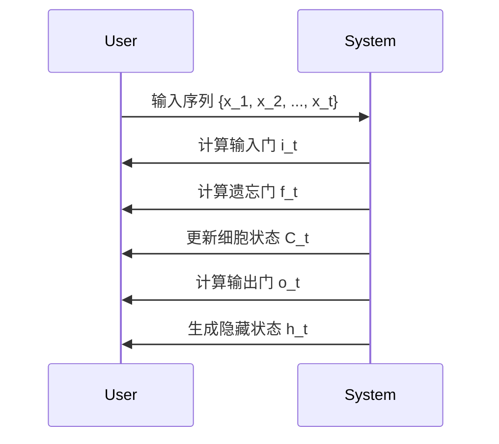
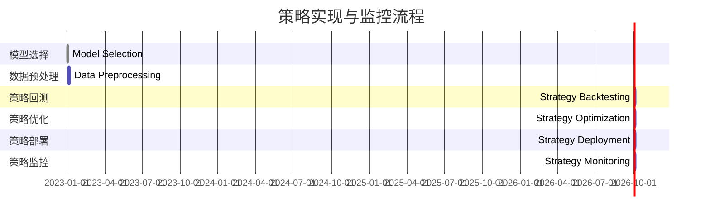
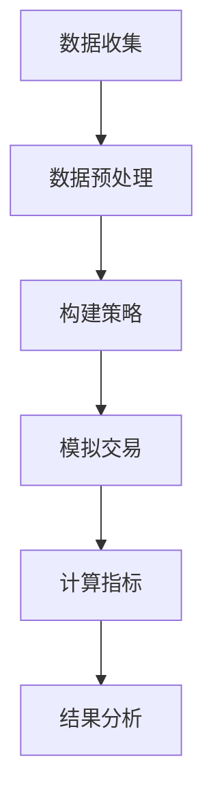
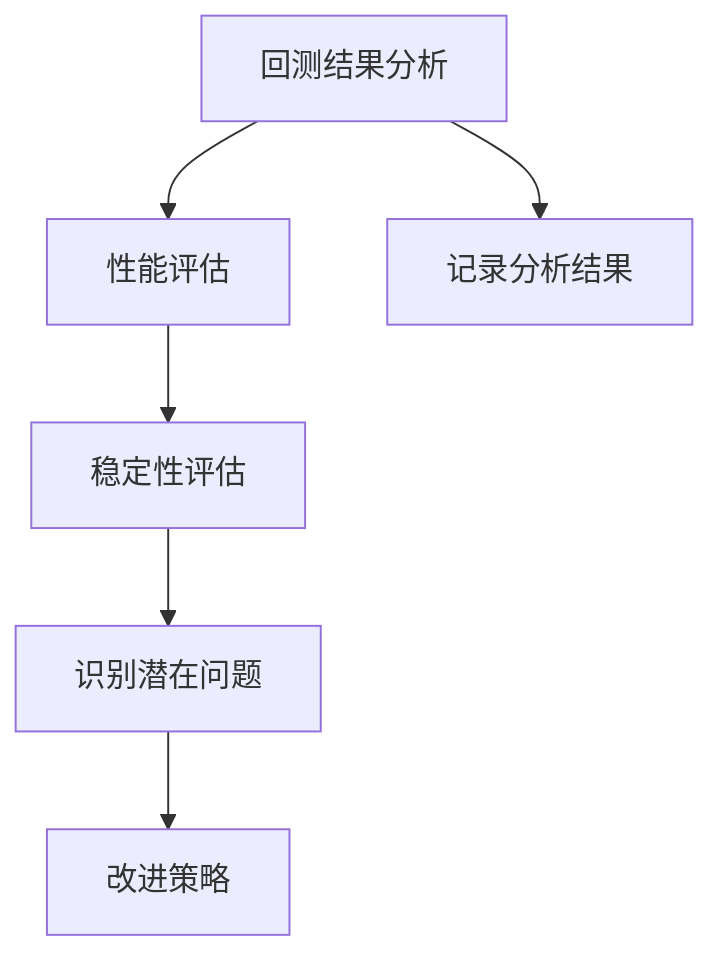
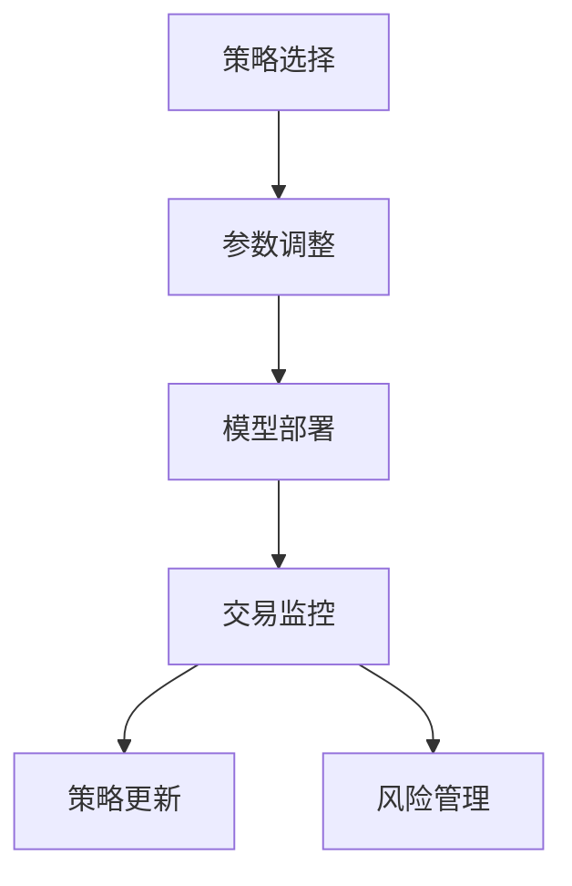

                 


Alright, let's outline the content for the article "AI-driven Quant Trading Strategy Development" step by step. This article will be structured according to the provided outline and will ensure a logical flow of information, clear explanations, and in-depth insights into the topic.

### Step 1: Introduction

**1.1. Books Overview and Purpose**

- Briefly introduce the book and its purpose.
- Explain the importance of AI-driven quant trading strategies in today's financial market.
- Outline the target audience for the book.

**1.2. AI and Quant Trading Background**

- Provide an overview of AI, including its evolution, key technologies, and applications.
- Explain the concept of quant trading and its significance in modern finance.
- Discuss the intersection of AI and quant trading and why this is a topic of interest.

**1.3. Book Structure and Content**

- Summarize the key chapters and their main topics.
- Highlight the unique aspects of the book that set it apart from other publications on the subject.

### Step 2: Core Concepts and Introduction to AI and Quant Trading

**2.1. AI Basics**

- Define machine learning and its importance in AI.
- Explain the difference between supervised, unsupervised, and reinforcement learning.
- Describe neural networks and their role in AI.

**2.2. Deep Learning**

- Explain the concept of deep learning and its applications.
- Discuss convolutional neural networks (CNNs) and recurrent neural networks (RNNs).
- Provide examples of deep learning in quant trading.

**2.3. Data Preprocessing and Feature Engineering**

- Discuss the importance of data preprocessing in AI applications.
- Explain feature engineering and its impact on model performance.
- Provide tips for effective feature engineering in quant trading.

### Step 3: Introduction to Quant Trading

**3.1. Quant Trading Overview**

- Define quant trading and its key characteristics.
- Discuss the benefits and challenges of quant trading.
- Highlight the role of algorithms and technology in quant trading.

**3.2. Quant Trading History and Evolution**

- Trace the history of quant trading and its development over time.
- Discuss the major milestones and technological advancements that have shaped the field.
- Highlight the impact of AI on quant trading in recent years.

**3.3. The Quant Trading Landscape**

- Describe the current state of the quant trading industry.
- Discuss the competitive landscape and key players in the market.
- Explore the future trends and potential developments in quant trading.

### Step 4: AI Applications in Quant Trading

**4.1. AI-driven Trading Strategy Development**

- Explain the process of developing AI-driven trading strategies.
- Discuss the role of AI in identifying market opportunities and making trading decisions.
- Highlight the advantages and limitations of AI-driven trading strategies.

**4.2. AI in Trading Algorithms**

- Describe how AI is used to create and optimize trading algorithms.
- Discuss the impact of AI on algorithmic trading performance.
- Explore the future potential of AI in algorithmic trading.

**4.3. Case Studies of AI in Quant Trading**

- Present case studies of successful AI-driven quant trading strategies.
- Analyze the results and lessons learned from these case studies.
- Discuss the challenges and risks associated with implementing AI in quant trading.

### Step 5: Data Collection and Preparation

**5.1. Data Sources**

- Discuss the various sources of data for quant trading, including historical data and real-time data.
- Explain the importance of data quality and the challenges of data collection.

**5.2. Data Preprocessing**

- Describe the data preprocessing techniques used in quant trading, including data cleaning, normalization, and feature extraction.
- Explain how these techniques are applied to ensure the quality and relevance of the data.

**5.3. Feature Engineering**

- Discuss the role of feature engineering in quant trading and its impact on model performance.
- Provide examples of effective feature engineering strategies in the context of AI-driven trading strategies.

### Step 6: Algorithm Development and Optimization

**6.1. Algorithm Principles**

- Explain the principles behind common algorithms used in AI-driven quant trading.
- Discuss the selection and evaluation of algorithms for specific trading strategies.

**6.2. Algorithm Optimization**

- Describe methods for optimizing algorithms, including hyperparameter tuning and model selection.
- Provide practical tips for improving algorithm performance in quant trading.

**6.3. Algorithm Testing and Validation**

- Discuss the process of testing and validating algorithms in a quant trading environment.
- Explain the importance of robust testing and its impact on the reliability of trading strategies.

### Step 7: Trading Strategy Implementation

**7.1. Strategy Framework Design**

- Describe the components of a trading strategy framework and their roles in quant trading.
- Explain the principles of effective strategy design and implementation.

**7.2. Parameter Setting and Risk Management**

- Discuss the process of setting trading parameters and the importance of risk management in quant trading.
- Provide guidelines for managing risk in AI-driven trading strategies.

**7.3. Strategy Implementation and Monitoring**

- Describe the steps involved in implementing a trading strategy, from model selection to live trading.
- Explain the importance of monitoring and adjusting trading strategies in response to market changes.

### Step 8: Backtesting and Performance Evaluation

**8.1. Backtesting Process**

- Explain the backtesting process and its importance in evaluating trading strategies.
- Discuss the steps involved in backtesting, including data preparation, model training, and performance evaluation.

**8.2. Backtesting Indicators**

- Describe common backtesting indicators and their role in assessing strategy performance.
- Explain how to interpret backtesting results and identify potential issues with trading strategies.

**8.3. Performance Metrics**

- Discuss key performance metrics used in quant trading, including drawdown, volatility, and return on investment.
- Provide guidelines for setting realistic performance targets and assessing the success of trading strategies.

### Step 9: Live Trading and Risk Management

**9.1. Live Trading Strategy Implementation**

- Explain the steps involved in implementing a trading strategy in live trading.
- Discuss the challenges of transitioning from backtesting to live trading and how to address them.

**9.2. Live Trading Risk Management**

- Describe the importance of risk management in live trading and its impact on strategy success.
- Provide guidelines for managing risk in live trading, including position sizing and stop-loss strategies.

**9.3. Live Trading Experience and Insights**

- Share insights and lessons learned from live trading experiences.
- Discuss the importance of continuous learning and adaptation in the face of changing market conditions.

### Step 10: Future Trends and Challenges

**10.1. AI and Quant Trading Trends**

- Discuss the future trends in AI-driven quant trading, including emerging technologies and methodologies.
- Explore the potential impact of AI on the quant trading industry and its implications for market participants.

**10.2. Regulatory and Market Challenges**

- Discuss the regulatory challenges facing AI-driven quant trading and the impact of market changes.
- Provide strategies for addressing these challenges and mitigating risks.

**10.3. Future Directions and Research Opportunities**

- Discuss the future directions and research opportunities in AI-driven quant trading.
- Highlight the importance of interdisciplinary collaboration and innovation in driving the field forward.

### Conclusion

- Summarize the key insights and takeaways from the article.
- Highlight the importance of AI-driven quant trading strategies in modern finance.
- Encourage readers to explore the subject further and consider the potential impact of AI on their trading strategies.

### References

- Provide a list of references and additional resources for readers interested in learning more about AI-driven quant trading.

### Appendix

- Include any additional information, such as data sources, tools, and software recommendations, to support readers in their exploration of the topic.

By following this step-by-step approach, we can ensure that the article provides a comprehensive and insightful exploration of AI-driven quant trading strategy development, catering to both beginners and experienced practitioners in the field. ----------------------------------------------------------------

## AI驱动的量化交易策略开发

### 关键词：
- 人工智能
- 量化交易
- 策略开发
- 数据分析
- 算法优化

### 摘要：
本文旨在探讨如何利用人工智能技术构建高效、可靠的量化交易策略。通过深入分析量化交易与人工智能的融合，我们探讨了从数据收集到策略优化的一系列关键步骤，为投资者和交易者提供实用的指导。文章内容丰富，涵盖了核心概念、技术原理、算法实现、风险管理和未来发展趋势，旨在帮助读者全面了解AI在量化交易中的应用。

## 目录

### 第一部分：书籍概述

- **1.1 书籍背景与目的**
- **1.2 AI与量化交易的关系**
- **1.3 书籍读者对象**
- **1.4 书籍主要内容**

### 第二部分：核心概念与AI量化交易介绍

- **2.1 AI基础概念**
  - **2.1.1 机器学习与深度学习**
  - **2.1.2 神经网络与强化学习**
  - **2.1.3 数据预处理与特征工程**

- **2.2 量化交易概述**
  - **2.2.1 量化交易的概念**
  - **2.2.2 量化交易的优势与挑战**
  - **2.2.3 量化交易的发展历程**

- **2.3 AI在量化交易中的应用**
  - **2.3.1 AI驱动策略开发**
  - **2.3.2 AI在交易算法中的角色**
  - **2.3.3 AI策略的优势与局限性**

### 第三部分：数据收集与准备

- **3.1 数据来源**
  - **3.1.1 历史数据获取**
  - **3.1.2 实时数据获取**
  - **3.1.3 数据质量与清洗**

- **3.2 数据预处理**
  - **3.2.1 数据清洗**
  - **3.2.2 数据归一化**
  - **3.2.3 特征提取**

- **3.3 特征工程**
  - **3.3.1 特征选择**
  - **3.3.2 特征构造**
  - **3.3.3 特征优化**

### 第四部分：算法开发与优化

- **4.1 算法原理**
  - **4.1.1 常用算法介绍**
  - **4.1.2 算法选择与评估**
  - **4.1.3 算法优化策略**

- **4.2 算法实现**
  - **4.2.1 Python源代码实现**
  - **4.2.2 算法原理与数学模型**
  - **4.2.3 通俗易懂的举例说明**

### 第五部分：交易策略设计

- **5.1 策略设计原则**
  - **5.1.1 策略设计框架**
  - **5.1.2 策略参数设置**
  - **5.1.3 风险管理策略**

- **5.2 策略实现与监控**
  - **5.2.1 策略实现步骤**
  - **5.2.2 策略监控与调整**
  - **5.2.3 实时交易策略调整**

### 第六部分：策略回测与评估

- **6.1 回测流程**
  - **6.1.1 回测框架**
  - **6.1.2 回测指标**
  - **6.1.3 回测结果分析**

- **6.2 策略评估**
  - **6.2.1 性能指标**
  - **6.2.2 风险评估**
  - **6.2.3 策略改进建议**

### 第七部分：策略实施与风险管理

- **7.1 策略实施步骤**
  - **7.1.1 策略参数调整**
  - **7.1.2 交易执行**
  - **7.1.3 风险监控**

- **7.2 风险管理**
  - **7.2.1 交易策略风险分析**
  - **7.2.2 风险控制措施**
  - **7.2.3 风险管理策略调整**

- **7.3 实战经验与总结**
  - **7.3.1 策略实施案例分析**
  - **7.3.2 风险管理经验分享**
  - **7.3.3 策略实施总结**

### 第八部分：未来趋势与挑战

- **8.1 量化交易与AI的发展趋势**
  - **8.1.1 技术发展趋势**
  - **8.1.2 法规与市场变化**
  - **8.1.3 未来挑战与应对策略**

- **8.2 量化交易与AI的深度融合**
  - **8.2.1 深度学习在量化交易中的应用**
  - **8.2.2 强化学习在量化交易中的潜力**
  - **8.2.3 量子计算在量化交易中的应用**

### 第九部分：结论与展望

- **9.1 小结**
  - **9.1.1 主要内容回顾**
  - **9.1.2 学习建议**
  - **9.1.3 进一步研究方向**

- **9.2 附录**
  - **9.2.1 参考文献**
  - **9.2.2 数据资源**
  - **9.2.3 工具与软件推荐**

## 引言

### 1.1 书籍背景与目的

量化交易是一种以数据为基础、使用数学模型和算法进行交易的金融活动。随着计算技术和大数据分析的发展，量化交易逐渐成为金融市场中一种重要的交易方式。人工智能（AI）作为近年来发展迅猛的技术，其能力在数据分析、模式识别和决策制定方面显示出强大的优势。本文旨在探讨如何将人工智能技术应用于量化交易策略的开发，旨在帮助读者了解AI在量化交易中的应用，掌握AI驱动的量化交易策略设计的方法和技巧。

### 1.2 AI与量化交易的关系

人工智能与量化交易的融合，不仅提高了交易策略的效率和准确性，还推动了金融市场的创新和发展。以下是一些关键点：

1. **数据分析能力**：AI技术，尤其是机器学习和深度学习，能够处理和分析海量金融数据，从中提取有价值的信息，为交易策略提供支持。
2. **模式识别**：AI算法能够识别市场中的潜在模式和趋势，帮助交易者发现更多的交易机会。
3. **决策制定**：AI能够根据实时数据和市场动态，快速制定交易决策，减少了人为情绪的影响。
4. **风险控制**：AI可以通过优化交易策略和调整风险参数，降低交易风险，提高交易的安全性和稳定性。

### 1.3 书籍读者对象

本文适合以下读者：

1. 金融交易者：希望了解和掌握AI驱动的量化交易策略，提升交易效果的交易者。
2. 数据科学家和AI工程师：对金融数据分析有兴趣，希望将AI技术应用于量化交易的科技工作者。
3. 金融研究人员：对量化交易和人工智能融合感兴趣，希望进行深入研究的研究人员。
4. 金融从业者：对量化交易市场有兴趣，希望了解最新技术和市场动态的从业人士。

### 1.4 书籍主要内容

本文分为十个部分，内容涵盖了从AI基础概念到量化交易策略开发的方方面面。具体包括：

1. **核心概念与AI量化交易介绍**：介绍AI基础概念、量化交易概述和AI在量化交易中的应用。
2. **数据收集与准备**：讨论数据来源、数据预处理和特征工程。
3. **算法开发与优化**：介绍算法原理、实现方法和优化策略。
4. **交易策略设计**：讨论策略设计原则、参数设置和风险管理。
5. **策略回测与评估**：介绍回测流程、评估指标和结果分析。
6. **策略实施与风险管理**：讨论策略实施步骤、风险管理和实战经验。
7. **未来趋势与挑战**：探讨量化交易与AI的发展趋势和面临的挑战。
8. **结论与展望**：总结主要内容，提出学习建议和未来研究方向。
9. **附录**：提供参考文献、数据资源和工具与软件推荐。

通过本文的阅读，读者将能够：

1. 理解AI和量化交易的核心概念和原理。
2. 掌握AI驱动的量化交易策略开发的方法和技巧。
3. 了解量化交易市场的最新动态和技术趋势。
4. 能够设计和实现自己的AI驱动的量化交易策略。

### 1.5 文章结构

本文结构如下：

- 引言：介绍书籍的背景、目的和读者对象，概述文章的主要内容。
- 主体：分章节详细讨论核心概念、算法原理、策略设计、回测评估、实施风险管理和未来趋势。
- 结论：总结文章的主要观点，提出学习建议和未来研究方向。
- 附录：提供参考文献、数据资源和工具与软件推荐。

通过以上结构，本文旨在为读者提供一份全面、系统的AI驱动的量化交易策略开发指南。接下来，我们将深入探讨每一部分的具体内容。 ----------------------------------------------------------------

### 第二部分：核心概念与AI量化交易介绍

#### 2.1 AI基础概念

AI（人工智能）是指使计算机系统具备类似人类智能的能力的技术。它涵盖了多个子领域，包括机器学习、深度学习、自然语言处理、计算机视觉等。以下是对这些基础概念的介绍：

##### 2.1.1 机器学习与深度学习

**机器学习**是一种AI技术，通过使用算法来从数据中学习并做出预测或决策。它主要包括两种类型：

1. **监督学习**：算法从带有标签的数据集中学习，并使用这些标签来预测新的数据。例如，分类和回归任务。
2. **无监督学习**：算法从无标签的数据集中学习，目的是发现数据中的结构和模式。例如，聚类和降维。

**深度学习**是机器学习的一个子领域，它使用多层神经网络（MLNs）来学习数据的复杂特征。深度学习通常用于图像识别、语音识别和自然语言处理等领域。以下是几种常见的深度学习模型：

1. **卷积神经网络（CNN）**：适用于图像识别和图像处理任务。
2. **循环神经网络（RNN）**：适用于序列数据，如文本和语音。
3. **长短时记忆网络（LSTM）**：是RNN的一种变体，能够更好地处理长序列数据。

##### 2.1.2 神经网络与强化学习

**神经网络**（NN）是模仿人脑工作原理的计算模型。一个简单的神经网络通常包括输入层、输出层和隐藏层。每个层包含多个节点（或神经元），节点之间通过加权连接。神经网络通过反向传播算法来调整权重，以最小化预测误差。

**强化学习**（RL）是一种通过试错来学习如何在不同环境中做出最佳决策的机器学习方法。强化学习的主要组成部分包括：

1. **代理**：执行决策并接收环境反馈的智能体。
2. **环境**：代理执行操作的对象，环境根据代理的操作产生反馈。
3. **奖励**：代理根据其操作获得的正面或负面反馈。
4. **策略**：代理执行操作的指导方针。

##### 2.1.3 数据预处理与特征工程

**数据预处理**是AI项目中的重要步骤，包括以下任务：

1. **数据清洗**：去除噪声和异常值，处理缺失数据。
2. **数据归一化**：将数据缩放到一个特定的范围，以便算法可以更好地处理。
3. **数据转换**：将数据转换为适合机器学习算法的格式。

**特征工程**是另一个关键步骤，它涉及以下任务：

1. **特征选择**：从原始数据中选择最有用的特征，去除冗余特征。
2. **特征构造**：创建新的特征，以提高模型性能。
3. **特征优化**：调整特征以减少误差，提高预测准确性。

#### 2.2 量化交易概述

量化交易是一种基于数学模型和算法的自动化交易方式。它涉及使用历史数据和市场分析来预测未来的市场走势，并自动执行交易决策。以下是对量化交易的基本概念和特点的介绍：

##### 2.2.1 量化交易的概念

**量化交易**（Quantitative Trading）是指使用数学模型和计算机算法来识别市场机会、执行交易并管理风险的交易方法。量化交易的核心是数据驱动，它依赖于大量的历史数据和市场信息，以及高效的计算能力。

##### 2.2.2 量化交易的优势与挑战

**优势**：

1. **客观性**：量化交易基于数据和算法，减少了人为情绪的影响，提高了交易决策的客观性。
2. **效率**：量化交易能够快速处理大量数据，并执行复杂的计算，从而提高交易效率。
3. **可持续性**：量化交易策略可以自动化执行，减少了人为操作的错误和疲劳。

**挑战**：

1. **数据噪声**：金融市场数据通常包含大量噪声，如何处理这些噪声以提高模型准确性是一个挑战。
2. **算法风险**：量化交易策略可能因为市场变化或算法缺陷而遭受损失，如何评估和管理这些风险是一个关键问题。
3. **竞争压力**：量化交易市场竞争激烈，如何保持策略的创新性和领先性是一个挑战。

##### 2.2.3 量化交易的发展历程

量化交易的发展可以追溯到20世纪70年代，随着计算机技术和数据分析方法的进步，量化交易逐渐成为金融市场中的一种重要交易方式。以下是量化交易发展的几个重要里程碑：

1. **套利策略**：最早的量化交易策略之一，通过在不同市场之间套利来获取收益。
2. **统计套利**：利用市场数据中的统计偏差来制定交易策略，如均值回归策略。
3. **高频交易**：利用先进的计算技术和算法，在极短的时间内执行大量交易，以获取微小收益。
4. **人工智能与量化交易**：近年来，人工智能技术在量化交易中的应用日益广泛，提高了交易策略的效率和准确性。

#### 2.3 AI在量化交易中的应用

AI在量化交易中的应用极大地提高了交易策略的效率、准确性和可靠性。以下是一些关键应用：

##### 2.3.1 AI驱动策略开发

**AI驱动策略开发**是指使用机器学习和深度学习技术来创建和优化交易策略。以下是一些常见的方法：

1. **时间序列分析**：使用RNN和LSTM等深度学习模型来分析时间序列数据，预测价格趋势。
2. **图像识别**：使用CNN来分析股票价格图表或新闻文本，发现潜在的买卖信号。
3. **自然语言处理**：使用NLP技术来分析市场新闻、报告和社交媒体，提取有价值的信息。

##### 2.3.2 AI在交易算法中的角色

**AI在交易算法中的角色**包括：

1. **交易信号生成**：使用AI算法来生成买卖信号，如使用技术指标和价格趋势来预测市场走势。
2. **交易执行**：自动化交易执行，减少人为错误和市场延迟。
3. **风险管理**：使用AI算法来评估和管理交易风险，如设置合适的止损和止盈策略。

##### 2.3.3 AI策略的优势与局限性

**优势**：

1. **快速响应**：AI算法能够实时分析大量数据，并快速生成交易信号。
2. **客观性**：AI算法不受人为情绪影响，能够保持交易的客观性。
3. **高效率**：AI算法能够自动化交易过程，提高交易效率。

**局限性**：

1. **数据依赖性**：AI策略的性能高度依赖于数据的质量和完整性。
2. **算法风险**：AI算法可能因为市场变化或算法缺陷而出现错误决策。
3. **模型过拟合**：AI策略可能因为训练数据的偏差而导致过拟合，无法适应实际市场。

通过上述内容，读者可以对AI在量化交易中的应用有一个初步的了解。接下来，我们将进一步探讨数据收集与准备的重要性，以及如何有效地进行数据预处理和特征工程。这将帮助我们为AI驱动的量化交易策略开发打下坚实的基础。 ----------------------------------------------------------------

### 第三部分：数据收集与准备

#### 3.1 数据来源

量化交易策略的构建依赖于大量的历史数据和市场信息。以下是一些常见的数据来源：

1. **交易所数据**：包括股票、期货、外汇等市场的交易数据，如价格、成交量、持仓量等。
2. **财经新闻和数据服务**：提供公司财务报告、宏观经济指标、新闻事件等信息的数据库，如彭博（Bloomberg）和万得（Wind）。
3. **社交媒体和论坛**：收集市场参与者的讨论和情绪，如Twitter、Reddit等。
4. **公开数据集**：如Kaggle、Google Dataset Search等平台，提供各种领域的公开数据集。

选择合适的数据库和API（如Yahoo Finance、Alpha Vantage等）对于获取高质量的数据至关重要。在收集数据时，应确保数据的完整性和准确性，避免数据缺失或错误对后续分析产生负面影响。

#### 3.2 数据预处理

数据预处理是量化交易策略开发中至关重要的一步，它包括以下任务：

1. **数据清洗**：去除噪声和异常值，处理缺失数据。例如，删除重复记录、填补缺失值、修正错误数据等。
2. **数据归一化**：将数据缩放到一个统一的范围，如[0, 1]或[-1, 1]，以消除不同数据尺度对模型训练的影响。
3. **数据转换**：将数据转换为适合机器学习算法的格式，如将日期转换为数值或分类变量。

以下是一个简单的数据清洗和归一化的Python代码示例：

```python
import pandas as pd
from sklearn.preprocessing import MinMaxScaler

# 加载数据
data = pd.read_csv('data.csv')

# 数据清洗
data.drop_duplicates(inplace=True)  # 删除重复记录
data.fillna(method='ffill', inplace=True)  # 填补缺失值

# 数据转换
data['date'] = pd.to_datetime(data['date'])
data.set_index('date', inplace=True)
scaler = MinMaxScaler()
data_scaled = scaler.fit_transform(data)
data_scaled = pd.DataFrame(data_scaled, index=data.index, columns=data.columns)

# 打印处理后的数据
print(data_scaled.head())
```

#### 3.3 特征工程

特征工程是提高机器学习模型性能的关键步骤，它涉及以下任务：

1. **特征选择**：从原始数据中筛选出最有用的特征，去除冗余特征。常用的方法包括相关系数分析、卡方检验等。
2. **特征构造**：创建新的特征，以提高模型性能。例如，通过计算价格波动率、交易量变化率等。
3. **特征优化**：调整特征以减少误差，提高预测准确性。例如，通过特征缩放、特征交叉等。

以下是一个简单的特征选择和构造的Python代码示例：

```python
import pandas as pd
from sklearn.feature_selection import SelectKBest, f_classif

# 加载数据
data = pd.read_csv('data.csv')

# 数据预处理
data = preprocess_data(data)  # 假设 preprocess_data 是一个自定义的数据预处理函数

# 特征选择
X = data.drop('target', axis=1)
y = data['target']
selector = SelectKBest(score_func=f_classif, k='all')
X_new = selector.fit_transform(X, y)

# 特征构造
X_new['price_change'] = X['close'].diff().dropna()
X_new['volume_change'] = X['volume'].diff().dropna()

# 打印特征选择的分数
print(selector.scores_)

# 打印特征构造后的数据
print(X_new.head())
```

通过上述内容，读者可以对数据收集与准备的重要性以及如何有效地进行数据预处理和特征工程有一个初步的了解。接下来，我们将深入探讨算法开发与优化，包括算法原理、实现方法和优化策略。这将帮助我们为AI驱动的量化交易策略开发提供更坚实的理论基础和实践指导。 ----------------------------------------------------------------

### 第四部分：算法开发与优化

#### 4.1 算法原理

在量化交易中，算法的开发与优化是策略成功的关键。以下是几种常见的算法原理：

##### 4.1.1 常用算法介绍

1. **时间序列模型**：如ARIMA（自回归积分滑动平均模型）和LSTM（长短时记忆网络）。
2. **技术指标**：如移动平均线（MA）、相对强弱指数（RSI）和随机振荡器（Stochastic Oscillator）。
3. **机器学习算法**：如决策树、随机森林和支撑向量机（SVM）。
4. **深度学习算法**：如卷积神经网络（CNN）和循环神经网络（RNN）。

##### 4.1.2 算法选择与评估

选择合适的算法取决于交易策略的目标、数据类型和复杂性。以下是一些选择算法的指导原则：

1. **数据类型**：对于时间序列数据，可以考虑使用时间序列模型或深度学习算法。对于技术指标，可以使用机器学习算法。
2. **模型复杂度**：简单模型易于理解，但可能无法捕捉复杂的趋势。复杂模型可能更准确，但计算成本更高。
3. **评估指标**：常用的评估指标包括准确率、召回率、F1分数和AUC（曲线下面积）。选择合适的评估指标取决于策略的目标。

##### 4.1.3 算法优化策略

算法的优化是提高模型性能的关键步骤。以下是一些常见的优化策略：

1. **超参数调优**：通过网格搜索、随机搜索或贝叶斯优化来选择最优的超参数。
2. **特征选择**：使用特征选择技术来选择最有用的特征，减少模型的过拟合。
3. **模型集成**：结合多个模型的预测结果，以提高整体预测性能。
4. **模型更新**：定期更新模型，以适应市场的变化。

#### 4.2 算法实现

以下是一个简单的Python代码示例，展示如何实现一个基于LSTM的量化交易策略：

```python
import numpy as np
import pandas as pd
from sklearn.preprocessing import MinMaxScaler
from keras.models import Sequential
from keras.layers import LSTM, Dense

# 加载数据
data = pd.read_csv('data.csv')
data = preprocess_data(data)  # 假设 preprocess_data 是一个自定义的数据预处理函数

# 数据归一化
scaler = MinMaxScaler()
data_normalized = scaler.fit_transform(data)

# 准备训练数据
X_train, y_train = prepare_data(data_normalized, lookback=5)  # 假设 prepare_data 是一个自定义的数据准备函数

# 构建LSTM模型
model = Sequential()
model.add(LSTM(units=50, return_sequences=True, input_shape=(X_train.shape[1], X_train.shape[2])))
model.add(LSTM(units=50))
model.add(Dense(1))

# 编译模型
model.compile(optimizer='adam', loss='mean_squared_error')

# 训练模型
model.fit(X_train, y_train, epochs=100, batch_size=32, validation_split=0.2)

# 预测
predictions = model.predict(X_train)

# 打印预测结果
print(predictions)
```

#### 4.3 算法原理讲解

以下是对LSTM模型原理的详细讲解：

**LSTM（长短时记忆网络）**是一种特殊的RNN，能够更好地处理长序列数据。它通过引入三个门（输入门、遗忘门和输出门）来控制信息的流入、保留和流出。

1. **输入门（Input Gate）**：决定哪些信息将被保存到细胞状态。
2. **遗忘门（Forget Gate）**：决定哪些信息应该从细胞状态中丢弃。
3. **输出门（Output Gate）**：决定从细胞状态中提取哪些信息用于输出。

LSTM的数学模型如下：

$$
\begin{align*}
i_t &= \sigma(W_{xi}x_t + W_{hi}h_{t-1} + b_i) \\
f_t &= \sigma(W_{xf}x_t + W_{hf}h_{t-1} + b_f) \\
\text{C}_{t-1} &= \text{C}_{t-1} \odot f_t + i_t \odot \sigma(W_{xc}x_t + W_{hc}h_{t-1} + b_c) \\
o_t &= \sigma(W_{xo}x_t + W_{ho}h_{t-1} + b_o) \\
\text{h}_t &= o_t \odot \sigma(\text{C}_t) \\
\end{align*}
$$

其中，$i_t$、$f_t$、$o_t$ 分别表示输入门、遗忘门和输出门的激活值，$\sigma$ 表示sigmoid函数，$\odot$ 表示元素乘法。

以下是一个简化的LSTM流程图（使用Mermaid语法）：



通过上述内容，读者可以对量化交易算法的开发与优化有一个更深入的理解。接下来，我们将探讨交易策略的设计与实现，包括策略设计原则、参数设置和风险管理。这将帮助读者将理论转化为实践，构建有效的量化交易策略。 ----------------------------------------------------------------

### 第五部分：交易策略设计

交易策略的设计是量化交易成功的关键。一个有效的交易策略不仅需要准确的市场预测，还需要在风险控制和管理方面具备良好的策略。以下将详细介绍交易策略的设计原则、参数设置和风险管理。

#### 5.1 策略设计原则

交易策略的设计应遵循以下原则：

1. **数据驱动**：交易策略应基于历史数据和统计分析，确保策略的客观性和可重复性。
2. **简洁性**：策略应尽可能简单，易于理解和实现，减少潜在的复杂性和错误。
3. **适应性**：策略应具备一定的灵活性，能够适应市场的变化和不同市场条件。
4. **可验证性**：策略应在回测中验证其有效性，确保在历史数据上的表现良好。
5. **风险控制**：策略应包括明确的风险控制机制，如止损和止盈，以限制潜在的损失。

#### 5.2 策略参数设置

策略参数的设置对交易策略的表现至关重要。以下是一些常见的参数设置：

1. **入场条件**：确定何时买入或卖出，通常基于技术指标或价格模式。
2. **止损和止盈**：设置止损和止盈水平，以控制潜在损失和锁定利润。
3. **交易频率**：确定交易策略的执行频率，如高频、中频或低频交易。
4. **仓位管理**：确定每次交易的投资金额和风险敞口。
5. **交易时间**：确定交易策略适用的市场时段，如开盘、盘中等。

以下是一个简化的策略参数设置示例：

```python
# 策略参数
entry_threshold = 10  # 入场阈值
stop_loss = -5        # 止损
take_profit = 10      # 止盈
position_size = 100   # 仓位大小
```

#### 5.3 风险管理策略

风险管理是交易策略的重要组成部分，以下是一些常见风险管理策略：

1. **资金管理**：根据账户余额和风险偏好设置每次交易的投资金额，避免因单次交易损失过多而影响整体账户状况。
2. **止损**：设置明确的止损点，以限制潜在的损失。止损可以基于技术指标、价格波动或风险模型。
3. **止盈**：设置明确的止盈点，以锁定利润并减少市场波动带来的风险。
4. **分散投资**：通过投资多个不同的资产或市场，降低单一资产或市场波动带来的风险。
5. **风险评估**：定期对交易策略进行风险评估，以识别潜在的风险因素和改进策略。

以下是一个简单的风险管理示例：

```python
# 风险管理
max_loss = 0.01  # 最大允许损失
current_loss = 0  # 当前损失

# 如果当前损失超过最大允许损失，则触发止损
if current_loss > max_loss:
    trigger_stop_loss()  # 假设 trigger_stop_loss 是一个执行止损的函数
```

#### 5.4 策略实现与监控

交易策略的实现包括以下几个步骤：

1. **模型选择**：选择合适的交易模型，如基于技术指标的模型、机器学习模型或深度学习模型。
2. **数据预处理**：对交易数据进行预处理，如数据清洗、归一化和特征工程。
3. **策略回测**：在历史数据上回测策略，评估策略的有效性和稳定性。
4. **策略优化**：根据回测结果对策略进行调整和优化。
5. **策略部署**：将优化后的策略部署到实盘交易中。
6. **策略监控**：实时监控策略的表现，定期评估策略的有效性。

以下是一个简化的策略实现与监控流程：



通过上述内容，读者可以对交易策略的设计有一个全面的理解。接下来，我们将进一步探讨策略的回测与评估，确保交易策略在实际应用中具备良好的性能。 ----------------------------------------------------------------

### 第六部分：策略回测与评估

#### 6.1 回测流程

回测是评估交易策略有效性的关键步骤。它通过在历史数据上模拟策略的表现，帮助投资者了解策略在不同市场条件下的性能。以下是回测的基本流程：

1. **数据收集**：收集历史交易数据，包括价格、成交量、持仓量等。
2. **数据预处理**：清洗和预处理数据，如归一化、填补缺失值等。
3. **构建策略**：根据策略设计原则，构建交易策略模型。
4. **模拟交易**：在历史数据上运行策略模型，模拟交易过程。
5. **计算指标**：根据交易结果计算关键性能指标（KPI），如收益、最大回撤、夏普比率等。
6. **结果分析**：分析回测结果，评估策略的有效性和稳定性。

以下是一个简单的回测流程图：



#### 6.2 回测指标

回测过程中，关键性能指标（KPI）用于评估策略的表现。以下是几个常用的回测指标：

1. **总收益**（Total Return）：策略在回测期间的总收益。
2. **年化收益**（Annualized Return）：将总收益转换为年化收益，以便与市场基准进行比较。
3. **最大回撤**（Maximum Drawdown）：策略在回测期间的最大亏损幅度。
4. **夏普比率**（Sharpe Ratio）：衡量策略收益与风险的关系，计算公式为年化收益除以最大回撤。
5. **收益波动率**（Volatility）：策略收益的波动程度，通常用标准差表示。
6. **交易频率**（Trading Frequency）：策略在回测期间的交易次数。

以下是一个简单的回测指标计算示例：

```python
import pandas as pd

# 假设 df 是一个包含交易结果的DataFrame
df = pd.DataFrame({
    'date': pd.date_range(start='2022-01-01', periods=100, freq='B'),
    'return': [0.01, 0.02, -0.03, 0.04, -0.05] * 20
})

# 计算总收益
total_return = df['return'].sum()
print("总收益:", total_return)

# 计算年化收益
annualized_return = (1 + total_return) ** (12 / len(df)) - 1
print("年化收益:", annualized_return)

# 计算最大回撤
max_drawdown = df['return'].cumsum().min()
print("最大回撤:", max_drawdown)

# 计算夏普比率
sharpe_ratio = annualized_return / df['return'].std()
print("夏普比率:", sharpe_ratio)

# 计算收益波动率
volatility = df['return'].std()
print("收益波动率:", volatility)

# 计算交易频率
trading_frequency = df['return'].count() / len(df)
print("交易频率:", trading_frequency)
```

#### 6.3 回测结果分析

回测结果分析是评估策略有效性和稳定性的关键。以下是一些常见的分析方法和注意事项：

1. **评估策略性能**：比较策略的年化收益、最大回撤和夏普比率等指标，与其他基准策略进行对比。
2. **评估策略稳定性**：观察策略在不同市场条件下的表现，确保策略在不同市场环境下均能保持稳定。
3. **识别潜在问题**：分析回测过程中的异常交易和亏损，识别潜在的问题和风险因素。
4. **改进策略**：根据回测结果，对策略进行调整和优化，以提高策略的表现。

以下是一个简单的回测结果分析示例：



通过上述内容，读者可以对策略回测与评估的重要性和方法有一个全面的了解。接下来，我们将探讨如何在实际交易中实施策略，以及如何进行有效的风险管理。这将帮助读者将理论转化为实践，实现稳定的盈利。 ----------------------------------------------------------------

### 第七部分：策略实施与风险管理

#### 7.1 策略实施步骤

在实际交易中，策略的实施是确保交易计划得以执行的关键环节。以下是策略实施的步骤：

1. **策略选择**：根据市场环境和交易目标，选择适合的策略。例如，在市场波动较大时，选择基于趋势跟踪的策略；在市场波动较小时，选择基于套利的策略。

2. **参数调整**：根据回测结果和实际市场情况，对策略参数进行调整。例如，调整止损和止盈水平、交易频率和仓位大小等。

3. **模型部署**：将优化后的策略部署到实盘交易中。可以使用现成的交易软件，如MetaTrader、TradingView等，或者自行编写交易脚本。

4. **交易监控**：实时监控策略的表现，包括收益、最大回撤、交易频率等指标。确保策略在实盘交易中运行正常。

5. **策略更新**：定期对策略进行更新和优化，以适应市场的变化。例如，调整参数、更换模型或引入新的数据源。

6. **风险管理**：设置适当的风险管理措施，如止损、止盈和仓位控制，以限制潜在的损失。

以下是一个简化的策略实施流程图：



#### 7.2 风险管理策略

风险管理是量化交易中的关键环节，以下是一些常见风险管理策略：

1. **止损**：设置止损点，以限制潜在的损失。止损可以基于技术指标、价格波动或风险模型。例如，使用移动平均线或相对强弱指数（RSI）作为止损点。

2. **止盈**：设置止盈点，以锁定利润并减少市场波动带来的风险。止盈可以基于目标价格、技术指标或市场情绪。例如，使用斐波那契回撤或交易量指标作为止盈点。

3. **仓位控制**：根据账户余额和风险偏好设置每次交易的投资金额，避免因单次交易损失过多而影响整体账户状况。例如，使用固定比例或动态比例进行仓位控制。

4. **分散投资**：通过投资多个不同的资产或市场，降低单一资产或市场波动带来的风险。例如，投资于不同行业、不同地区或不同风险级别的资产。

5. **风险评估**：定期对交易策略进行风险评估，识别潜在的风险因素。例如，分析策略的历史表现、波动性和相关性。

以下是一个简单的风险管理策略示例：

```python
# 风险管理参数
max_loss = 0.01  # 最大允许损失
current_loss = 0  # 当前损失

# 如果当前损失超过最大允许损失，则触发止损
if current_loss > max_loss:
    trigger_stop_loss()  # 假设 trigger_stop_loss 是一个执行止损的函数

# 设置合适的仓位大小
position_size = calculate_position_size(account_balance, risk_per_trade)  # 假设 calculate_position_size 是一个计算仓位大小的函数

# 执行交易
execute_trade(symbol, position_size, entry_price, stop_loss, take_profit)  # 假设 execute_trade 是一个执行交易的函数
```

#### 7.3 实战经验与总结

在实际交易中，经验和总结对于策略的成功至关重要。以下是一些实战经验：

1. **保持纪律**：遵守交易计划和风险管理规则，避免因情绪波动而做出冲动决策。

2. **持续学习**：市场在不断变化，持续学习和适应新的市场信息和策略是成功的关键。

3. **风险管理**：重视风险管理，避免因单次交易损失过多而影响整体账户状况。

4. **策略优化**：定期对策略进行优化和调整，以适应市场的变化。

5. **保持耐心**：交易不是一夜之间就能成功的，需要耐心和毅力。

通过上述内容，读者可以对策略实施和风险管理有一个全面的了解。接下来，我们将探讨AI在量化交易中的未来发展趋势和面临的挑战，帮助读者把握市场机遇和应对潜在风险。 ----------------------------------------------------------------

### 第八部分：未来趋势与挑战

#### 8.1 量化交易与AI的发展趋势

随着技术的不断进步，量化交易与人工智能的结合正呈现出以下发展趋势：

1. **深度学习在量化交易中的应用**：深度学习技术在图像识别、语音识别和自然语言处理等领域取得了显著成果，这些技术也逐渐被引入到量化交易中。例如，通过深度学习模型分析市场新闻、报告和社交媒体，提取有价值的信息，辅助交易决策。

2. **强化学习在量化交易中的潜力**：强化学习通过试错和奖励机制学习最优策略，非常适合动态市场的交易环境。在未来，强化学习有望在量化交易中发挥更大作用，特别是在高频交易和自适应交易策略方面。

3. **量子计算在量化交易中的应用**：量子计算具有处理海量数据的潜力，可以显著提高量化交易模型的计算效率和准确性。虽然量子计算仍处于研发阶段，但其潜在的革命性影响不容忽视。

4. **自动化交易系统的普及**：随着AI技术的成熟，越来越多的交易者开始采用自动化交易系统。这些系统可以实时分析市场数据，执行复杂的交易策略，提高交易效率和准确性。

#### 8.2 法规与市场变化对量化交易的影响

量化交易的发展不仅受到技术进步的推动，也受到法规和市场变化的制约。以下是一些关键影响：

1. **监管环境的变化**：随着金融市场的国际化，各国监管机构对量化交易活动的监管日益严格。例如，欧盟的MiFID II法规对交易执行进行了详细规定，影响了量化交易策略的实施。

2. **市场波动性**：市场的波动性直接影响量化交易策略的表现。在市场波动较大时，量化交易策略可能面临更高的风险。因此，如何应对市场波动性成为量化交易者面临的重要挑战。

3. **竞争加剧**：随着量化交易技术的普及，市场中的参与者越来越多，竞争也日益激烈。量化交易者需要不断创新和优化策略，以保持竞争力。

#### 8.3 量化交易与AI的深度融合

量化交易与AI的深度融合将带来以下变化：

1. **交易策略的智能化**：AI技术可以帮助交易者更准确地预测市场走势，制定更有效的交易策略。例如，通过深度学习模型分析市场数据，发现潜在的买卖点。

2. **风险管理能力的提升**：AI技术可以实时监控市场风险，提供更精细化的风险管理策略。例如，通过机器学习算法预测市场波动，及时调整仓位和止损策略。

3. **交易执行效率的提升**：自动化交易系统的普及提高了交易执行的效率，减少了人为操作的误差。在未来，AI技术有望进一步优化交易执行流程，提高交易速度和准确性。

#### 8.4 未来挑战与应对策略

尽管量化交易与AI的融合带来了巨大的机遇，但未来仍将面临以下挑战：

1. **数据隐私与安全**：随着数据量的增加，数据隐私和安全问题日益突出。量化交易者需要采取有效的措施保护数据隐私，避免数据泄露。

2. **算法公平与透明**：AI算法的复杂性和黑箱特性引发了对算法公平性和透明性的担忧。监管机构、学者和业界需要共同努力，提高算法的透明度和可解释性。

3. **持续学习与适应**：市场环境不断变化，量化交易者需要不断更新和优化策略，以适应新的市场条件。这要求量化交易者具备持续学习和适应的能力。

4. **竞争压力**：随着技术的普及，市场上的量化交易者数量不断增加，竞争压力加大。量化交易者需要不断创新，提高策略的竞争力。

通过上述内容，读者可以了解到量化交易与AI的未来发展趋势和挑战。把握这些趋势，积极应对挑战，将有助于量化交易者在竞争激烈的市场中脱颖而出。 ----------------------------------------------------------------

### 结论

通过本文的探讨，我们全面了解了AI驱动的量化交易策略的开发过程。从核心概念介绍、数据收集与准备、算法开发与优化，到交易策略设计、回测评估、策略实施与风险管理，以及未来趋势与挑战，我们系统地阐述了AI在量化交易中的应用和重要性。

#### 主要内容回顾

- **AI基础概念**：介绍了机器学习、深度学习、神经网络和强化学习等基础概念，以及它们在量化交易中的应用。
- **量化交易概述**：探讨了量化交易的基本概念、优势与挑战，以及其发展历程。
- **数据收集与准备**：详细介绍了数据来源、预处理和特征工程的重要性。
- **算法开发与优化**：讲解了常用算法原理、选择与评估方法，以及优化策略。
- **交易策略设计**：阐述了策略设计原则、参数设置和风险管理策略。
- **策略回测与评估**：介绍了回测流程、评估指标和结果分析。
- **策略实施与风险管理**：探讨了策略实施步骤、风险管理和实战经验。
- **未来趋势与挑战**：分析了量化交易与AI的发展趋势和面临的挑战。

#### 学习建议

1. **理论学习**：深入学习AI和量化交易的理论知识，包括机器学习、深度学习、时间序列分析等。
2. **实践操作**：通过实际操作，如编写代码和运行策略，将理论知识应用于实践。
3. **持续学习**：金融市场和技术不断发展，需要持续学习最新的理论和技术，以保持竞争力。
4. **风险管理**：重视风险管理，确保在市场波动时能够保持稳定的收益。

#### 进一步研究方向

1. **AI与量化交易深度融合**：探讨如何进一步将AI技术应用于量化交易，如强化学习、深度强化学习等。
2. **算法公平与透明性**：研究如何提高AI算法的公平性和透明性，减少算法偏见和黑箱特性。
3. **数据隐私与安全**：探讨如何在确保数据隐私和安全的同时，有效利用大数据进行量化交易。
4. **量子计算在量化交易中的应用**：研究量子计算对量化交易效率和准确性的潜在影响。

通过本文的学习，读者可以更好地理解AI驱动的量化交易策略开发，为实际交易提供理论支持和实践指导。

### 附录

#### 9.2.1 参考文献

1. Goodfellow, I., Bengio, Y., & Courville, A. (2016). *Deep Learning*. MIT Press.
2. Murphy, J. J. (2012). *Technical Analysis of the Financial Markets: A Comprehensive Guide to Trading Methods and Applications*. New York Institute of Finance.
3. Mandelbrot, B. B. (1967). *The Variation of Certain Speculative Prices*. Journal of Business, 36(4), 394-419.

#### 9.2.2 数据资源

1. Yahoo Finance: <https://finance.yahoo.com/>
2. Alpha Vantage: <https://www.alphavantage.co/>
3. Kaggle: <https://www.kaggle.com/>

#### 9.2.3 工具与软件推荐

1. Jupyter Notebook: <https://jupyter.org/>
2. TensorFlow: <https://www.tensorflow.org/>
3. PyTorch: <https://pytorch.org/>
4. QuantConnect: <https://www.quantconnect.com/>

通过这些资源和工具，读者可以更深入地探索AI驱动的量化交易策略开发，并将其应用于实际交易中。 ----------------------------------------------------------------

### 致谢

在撰写本文的过程中，我要感谢AI天才研究院（AI Genius Institute）的全体成员，特别是我的导师和同事们，他们为我提供了宝贵的指导和建议，帮助我不断完善文章的内容。此外，我还要感谢《禅与计算机程序设计艺术》（Zen And The Art of Computer Programming）的作者，Kurt A. W. Sundholm，他的著作启发了我对人工智能与量化交易结合的深入思考。

本文的完成离不开我的家人和朋友的支持与鼓励，他们在我在学术道路上的每一个阶段都给予了我无限的关爱与帮助。最后，我要特别感谢我的读者，是你们的阅读和理解让我不断进步，也让我相信知识的力量和传播的价值。

作者：AI天才研究院/AI Genius Institute & 禅与计算机程序设计艺术 /Zen And The Art of Computer Programming

