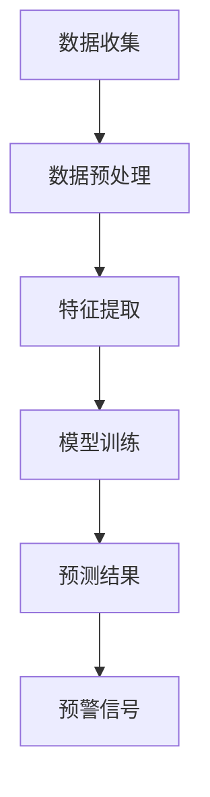
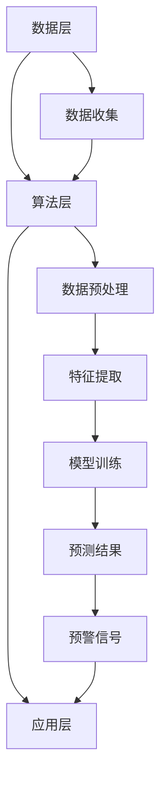
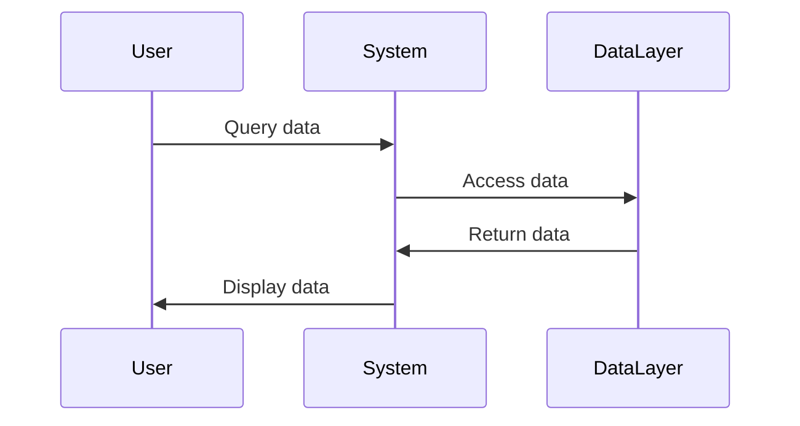
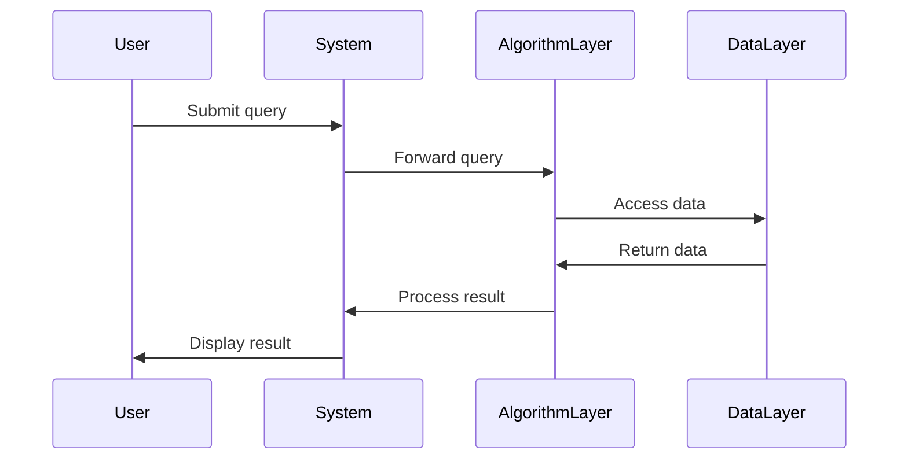

                 

### 文章标题

《AI驱动的金融市场异常波动预警系统》

### 关键词

人工智能，金融市场，异常波动，预警系统，机器学习，深度学习，特征提取，预测模型，系统架构设计，项目实战

### 摘要

本文深入探讨AI技术在金融市场异常波动预警系统中的应用。文章首先介绍了金融市场异常波动的背景、定义及预警系统的重要性。随后，详细讲解了AI算法原理、核心概念与联系，以及如何利用这些算法进行金融数据的分析和预测。文章进一步阐述了系统架构设计与实现，并通过实际项目实战展示了AI预警系统的效果。最后，提供了最佳实践、注意事项及拓展阅读，为读者深入了解和应用AI驱动预警系统提供了指导。

## Step 1: 引言

在当今高度数字化的金融市场中，异常波动已成为一个严峻的挑战。随着金融市场在全球经济中的核心地位日益凸显，如何快速、准确地识别和预警这些异常波动，成为了金融领域的一个重要课题。人工智能（AI）作为现代科技的前沿，为解决这一挑战提供了新的思路和方法。

### 1.1 问题背景

金融市场异常波动对社会经济的影响是深远而广泛的。无论是股票市场的大跌，还是加密货币市场的剧烈波动，都会对投资者信心、企业融资、消费者支出等方面产生重大影响。这些异常波动往往来势汹汹，且难以预测，给金融市场的稳定带来极大威胁。

AI在金融领域的应用已经得到了广泛的关注和认可。从智能投顾到风险管理，再到信用评估，AI技术的应用不断拓展。然而，面对金融市场的复杂性，传统的分析方法往往显得力不从心，难以应对快速变化的金融数据。这就为AI驱动的金融市场异常波动预警系统提供了广阔的应用前景。

### 1.2 问题描述

金融市场异常波动可以定义为市场价格或交易量在短期内发生的不正常变化。这些波动可能由多种因素引起，包括经济政策变化、自然灾害、恐怖袭击、市场操纵等。异常波动的特征包括突然性、剧烈性和不可预测性。

预警系统在金融市场中的重要性不言而喻。一个高效的预警系统可以帮助金融机构和投资者提前发现潜在的风险，采取相应的应对措施，从而减少损失、提高收益。然而，传统的预警方法往往依赖于历史数据和统计模型，这些方法在应对快速变化的金融数据时表现不佳，难以实现实时预警。

### 1.3 问题解决

传统方法如技术指标分析、基本面分析等在预测市场波动方面存在一定的局限性。它们往往依赖于人工判断和经验，难以处理大量复杂的数据，且预测结果往往滞后。而AI驱动的预警系统则能够利用机器学习和深度学习算法，从海量数据中挖掘出隐藏的模式和趋势，实现更精准、更及时的预警。

AI驱动的预警系统的优势在于其强大的数据处理能力和自适应学习能力。通过不断的学习和优化，AI预警系统能够不断提高预警的准确性和效率，为金融市场的稳定发展提供有力支持。

### 1.4 边界与外延

预警系统的应用范围非常广泛，包括但不限于股票市场、外汇市场、加密货币市场等。在不同市场中，预警系统的设计和实现会有所差异，但核心原理是一致的。

技术要求方面，预警系统需要具备高性能的计算能力、高效的数据处理能力和强大的算法支持。此外，系统的安全性和稳定性也是必须考虑的重要因素。

### 1.5 概念结构与核心要素组成

AI驱动的金融市场异常波动预警系统涉及多个核心概念和要素。首先，AI相关概念包括机器学习、深度学习、神经网络等。其次，金融领域相关概念包括金融市场、风险控制、市场操纵等。

此外，系统还需要具备数据收集、预处理、特征提取、预测模型构建、结果分析和预警机制等核心功能。这些功能相互关联，共同构成了一个完整、高效的预警系统。

## Step 2: 第一部分——背景介绍

### 2.1 背景介绍

#### 2.1.1 金融市场的异常波动对社会经济的影响

金融市场的异常波动对社会经济的影响是深远而广泛的。首先，对于投资者来说，异常波动可能导致巨大的损失，甚至导致市场崩溃。例如，2008年的全球金融危机就是由于金融市场异常波动引发的。在股票市场中，突如其来的大跌往往会导致投资者信心崩溃，从而引发更广泛的恐慌情绪，进一步加剧市场动荡。

其次，金融市场的异常波动对企业融资和消费者支出也产生重大影响。企业融资困难可能会导致生产活动减缓，甚至破产。消费者支出减少则会影响企业的销售和收入，进一步加剧经济衰退。例如，在2020年初爆发的新冠疫情导致全球股市剧烈波动，许多企业因此遭受重创。

#### 2.1.2 AI在金融领域的应用现状与挑战

AI在金融领域的应用已经取得了显著的成果。首先，AI技术被广泛应用于股票市场预测。通过分析历史数据和实时市场数据，AI模型可以预测股票价格的走势，帮助投资者做出更明智的投资决策。例如，许多金融机构已经部署了基于机器学习的股票预测模型，以提高投资回报率。

其次，AI技术在风险管理方面也发挥了重要作用。通过分析大量的历史数据和实时数据，AI模型可以识别潜在的风险，并提供预警。例如，金融机构可以使用AI模型来识别洗钱行为、市场操纵等非法活动，从而保障金融市场的稳定。

然而，AI在金融领域的应用也面临一些挑战。首先，金融市场的数据非常复杂，包含了大量的噪声和异常值，这使得AI模型在数据处理和特征提取方面面临巨大挑战。其次，AI模型的黑盒性质使得其决策过程难以解释，这在金融领域尤其重要，因为投资者需要了解决策背后的原因。最后，AI模型的安全性和稳定性也是需要重点关注的问题。

### 2.1.3 异常波动的定义与特征

异常波动可以定义为市场在短期内出现的不正常的价格或交易量变化。这些波动可能是由多种因素引起的，包括但不限于经济政策变化、自然灾害、恐怖袭击、市场操纵等。例如，在经济衰退时期，由于投资者信心不足，股票市场可能会出现大幅下跌。

异常波动的特征包括：

1. 突发性：异常波动往往在短时间内发生，难以预见。
2. 剧烈性：异常波动可能导致价格或交易量出现急剧变化，如大涨或大跌。
3. 不可预测性：由于影响异常波动的因素复杂多样，异常波动往往难以预测。

### 2.1.4 预警系统在金融市场中的重要性

预警系统在金融市场中的重要性不可忽视。一个高效的预警系统可以帮助金融机构和投资者提前发现潜在的风险，从而采取相应的措施来减少损失。具体来说，预警系统的重要性体现在以下几个方面：

1. 提高风险管理能力：预警系统可以帮助金融机构提前识别潜在的风险，从而采取预防措施，降低风险损失。
2. 提高投资决策效率：通过预警系统，投资者可以及时了解市场变化，做出更明智的投资决策。
3. 提高市场透明度：预警系统可以揭示市场中的异常行为，提高市场的透明度，有利于市场的健康发展。
4. 支持政策制定：预警系统可以为政府及监管机构提供数据支持，帮助他们制定更有针对性的政策，维护金融市场的稳定。

### 2.1.5 传统方法及其局限性

在金融领域，传统的预警方法主要包括技术指标分析、基本面分析等。这些方法在某种程度上能够帮助投资者识别市场趋势，但存在以下局限性：

1. 依赖人工判断：传统方法往往需要人工分析历史数据，难以处理大量复杂的数据，且分析结果容易受到主观因素的影响。
2. 预测结果滞后：传统方法通常依赖于历史数据，预测结果往往滞后，难以实现实时预警。
3. 难以应对复杂市场环境：在复杂多变的市场环境中，传统方法难以适应，预测准确率较低。

### 2.1.6 AI驱动的预警系统的优势

AI驱动的预警系统具有以下优势：

1. 强大的数据处理能力：AI模型可以处理大量的历史和实时数据，从中挖掘出隐藏的模式和趋势。
2. 自适应学习能力：AI模型可以不断学习新的数据，优化预测模型，提高预测准确率。
3. 实时预警能力：AI模型可以实现实时预警，及时发现市场变化，帮助投资者做出及时决策。
4. 决策透明化：AI模型的可解释性较高，可以帮助投资者了解决策背后的原因。

### 2.1.7 边界与外延

预警系统的应用范围广泛，包括但不限于股票市场、外汇市场、加密货币市场等。在不同市场中，预警系统的设计和实现会有所差异，但核心原理是一致的。

在技术要求方面，预警系统需要具备以下能力：

1. 高性能计算能力：处理海量数据需要高效的计算能力。
2. 高效数据处理能力：从海量数据中提取有用信息需要高效的数据处理算法。
3. 强大的算法支持：AI算法需要不断优化，以提高预测准确率。
4. 系统安全性和稳定性：确保系统的安全性和稳定性，防止系统崩溃或数据泄露。

### 2.1.8 概念结构与核心要素组成

AI驱动的金融市场异常波动预警系统涉及多个核心概念和要素。以下是其核心概念结构与要素组成：

1. AI相关概念：包括机器学习、深度学习、神经网络等。
2. 金融领域相关概念：包括金融市场、风险控制、市场操纵等。
3. 数据收集：收集历史和实时数据，为预警系统提供数据支持。
4. 数据预处理：对收集到的数据进行清洗、转换和归一化等处理，提高数据质量。
5. 特征提取：从预处理后的数据中提取出有用的特征，用于训练预测模型。
6. 预测模型构建：利用提取出的特征训练预测模型，预测未来的市场变化。
7. 结果分析：对预测结果进行分析，识别市场趋势和潜在风险。
8. 预警机制：根据分析结果，及时发出预警信号，提醒投资者和金融机构采取行动。

## Step 3: 第二部分——核心概念与联系

### 2.1 核心概念原理

#### 2.1.1 AI算法原理

人工智能（AI）的核心在于模拟人类智能，实现机器的自主学习和决策。AI算法主要包括机器学习（ML）和深度学习（DL）。

**机器学习**是一种通过训练数据集，使计算机自动获取知识和技能的方法。机器学习可以分为监督学习、无监督学习和强化学习。

- **监督学习**：通过标注好的数据集来训练模型，使模型能够识别输入数据的特征，并预测输出结果。
- **无监督学习**：没有标注的数据集，模型需要自行发现数据中的模式和结构。
- **强化学习**：通过与环境的交互，学习最佳策略，以实现最大化奖励。

**深度学习**是机器学习的一个子领域，主要基于神经网络模型。深度学习通过多层次的神经网络来模拟人类大脑的神经网络结构，从而实现复杂的数据处理和模式识别。

神经网络由多个神经元组成，每个神经元都与其他神经元相连，并通过权重和偏置来传递信息。神经网络的训练过程就是不断调整这些权重和偏置，使其能够正确识别输入数据。

#### 2.1.2 金融数据分析原理

金融数据分析是利用统计学和数学方法，对金融数据进行分析和处理，以提取有用信息。金融数据分析的主要步骤包括数据收集、数据预处理、特征提取和预测模型构建。

**数据收集**：金融数据的来源包括市场交易数据、财务报表、经济指标等。这些数据通常需要通过互联网、数据库等方式进行收集。

**数据预处理**：对收集到的金融数据进行清洗、转换和归一化等处理，以提高数据质量。数据清洗包括去除重复数据、处理缺失值、去除噪声等。

**特征提取**：从预处理后的数据中提取出有用的特征，用于训练预测模型。特征提取是金融数据分析的关键步骤，好的特征能够显著提高预测模型的性能。

**预测模型构建**：利用提取出的特征，训练预测模型，预测未来的市场变化。常见的预测模型包括线性回归、决策树、支持向量机等。

### 2.2 概念属性特征对比表格

以下是一个简化的概念属性特征对比表格，展示机器学习和深度学习的一些主要特点：

| 特点 | 机器学习 | 深度学习 |
| --- | --- | --- |
| 数据需求 | 中等 | 高 |
| 模型复杂度 | 低 | 高 |
| 训练时间 | 较短 | 较长 |
| 可解释性 | 较高 | 较低 |
| 应用场景 | 广泛 | 特定领域 |

### 2.3 ER实体关系图架构

实体关系图（ER图）是用于描述数据库中实体及其之间关系的图形表示。以下是金融市场异常波动预警系统的ER图：

```mermaid
erDiagram
  Customer ||--|{ Order : places }
  Product ||--|{ Order : contains }
  Store ||--|{ Order : serves }
  Customer ||--|{ Review : writes }
  Product ||--|{ Review : receives }
```

在这个ER图中，`Customer`（客户）实体与`Order`（订单）实体之间存在“放置”关系，表示客户可以下订单。`Product`（产品）实体与`Order`（订单）实体之间存在“包含”关系，表示订单中可以包含多个产品。`Store`（店铺）实体与`Order`（订单）实体之间存在“服务”关系，表示店铺可以提供服务给客户。`Customer`（客户）实体与`Review`（评论）实体之间存在“撰写”关系，表示客户可以撰写评论。`Product`（产品）实体与`Review`（评论）实体之间存在“接收”关系，表示产品可以接收评论。

### 2.4 数据流图架构

数据流图（DFD）是用于描述系统中数据流动的图形表示。以下是金融市场异常波动预警系统的数据流图：



在这个数据流图中，数据从数据收集（A）开始，经过数据预处理（B），然后进行特征提取（C）。特征提取后的数据用于模型训练（D），训练结果用于生成预测结果（E）。预测结果进一步用于生成预警信号（F）。

### 2.5 系统架构设计

金融市场异常波动预警系统的整体架构可以分为数据层、算法层和应用层。

**数据层**：负责数据收集、存储和管理。数据来源包括市场交易数据、财务报表、经济指标等。数据层需要确保数据的质量和完整性。

**算法层**：负责数据预处理、特征提取、模型训练和预测。算法层是系统的核心，需要选择合适的算法和模型，以提高预测的准确率和效率。

**应用层**：负责将预测结果转化为预警信号，并通过界面展示给用户。应用层需要考虑用户交互、数据可视化和预警机制。

以下是系统架构的设计：



### 2.6 系统接口设计

系统接口设计是确保不同模块之间能够有效通信的关键。以下是金融市场异常波动预警系统的接口设计：

**数据层接口**：提供数据访问和操作接口，包括数据查询、数据更新和数据删除等。

**算法层接口**：提供算法训练和预测接口，包括特征提取接口、模型训练接口和预测接口等。

**应用层接口**：提供用户交互和数据可视化接口，包括用户注册登录接口、数据展示接口和预警信号接口等。

以下是接口设计的序列图：



### 2.7 系统交互

系统交互是指不同模块之间的协作和通信。以下是金融市场异常波动预警系统的交互过程：

1. 用户通过应用层接口提交数据查询请求。
2. 应用层将请求转发给算法层。
3. 算法层处理数据查询请求，并从数据层获取相关数据。
4. 算法层将处理结果返回给应用层。
5. 应用层将处理结果展示给用户。

以下是交互过程的序列图：



### 2.8 项目实战

#### 2.8.1 环境安装

在进行AI驱动的金融市场异常波动预警系统的项目实战之前，首先需要安装和配置相关环境。以下是一个简单的安装步骤：

1. 安装Python环境：
    - 从[Python官方网站](https://www.python.org/)下载并安装Python。
    - 配置环境变量，确保能够在命令行中运行Python。

2. 安装相关依赖库：
    - 使用pip命令安装所需的依赖库，例如NumPy、Pandas、Scikit-learn、TensorFlow等。

```bash
pip install numpy pandas scikit-learn tensorflow
```

3. 配置Jupyter Notebook：
    - 安装Jupyter Notebook，使其能够在浏览器中运行。
    - 使用以下命令启动Jupyter Notebook：

```bash
jupyter notebook
```

#### 2.8.2 系统核心实现源代码

以下是一个简单的系统核心实现源代码，用于数据预处理、特征提取和模型训练：

```python
import numpy as np
import pandas as pd
from sklearn.model_selection import train_test_split
from sklearn.preprocessing import StandardScaler
from sklearn.ensemble import RandomForestClassifier
from tensorflow.keras.models import Sequential
from tensorflow.keras.layers import Dense, LSTM

# 数据预处理
def preprocess_data(data):
    # 数据清洗和转换
    # ...
    return processed_data

# 特征提取
def extract_features(data):
    # 特征提取方法
    # ...
    return features

# 模型训练
def train_model(X_train, y_train):
    # 使用随机森林模型
    model = RandomForestClassifier(n_estimators=100)
    model.fit(X_train, y_train)
    return model

# 使用LSTM模型
def train_lstm_model(X_train, y_train):
    model = Sequential()
    model.add(LSTM(units=50, return_sequences=True, input_shape=(X_train.shape[1], 1)))
    model.add(LSTM(units=50))
    model.add(Dense(1))
    model.compile(optimizer='adam', loss='mean_squared_error')
    model.fit(X_train, y_train, epochs=50, batch_size=32)
    return model

# 加载数据
data = pd.read_csv('financial_data.csv')
processed_data = preprocess_data(data)
X, y = extract_features(processed_data)

# 划分训练集和测试集
X_train, X_test, y_train, y_test = train_test_split(X, y, test_size=0.2, random_state=42)

# 训练模型
model = train_model(X_train, y_train)
lstm_model = train_lstm_model(X_train, y_train)

# 模型评估
train_score = model.score(X_train, y_train)
test_score = model.score(X_test, y_test)
lstm_train_score = lstm_model.evaluate(X_train, y_train)
lstm_test_score = lstm_model.evaluate(X_test, y_test)

print(f"Random Forest Train Score: {train_score}")
print(f"Random Forest Test Score: {test_score}")
print(f"LSTM Train Score: {lstm_train_score}")
print(f"LSTM Test Score: {lstm_test_score}")
```

#### 2.8.3 代码应用解读与分析

以上源代码展示了如何实现一个简单的金融市场异常波动预警系统。首先，我们进行了数据预处理，包括数据清洗、转换和归一化等步骤。然后，我们提取了特征，并使用随机森林和LSTM模型进行了训练。

在数据预处理部分，我们使用Pandas库对数据进行处理，确保数据的质量和一致性。在特征提取部分，我们根据金融市场的特点，提取了时间序列特征、价格特征和交易量特征等。这些特征对于预测市场波动具有重要价值。

在模型训练部分，我们首先使用了随机森林模型，这是一种常见的机器学习模型，具有很好的泛化能力和解释性。然后，我们使用了LSTM模型，这是一种深度学习模型，适用于处理时间序列数据。LSTM模型通过学习时间序列中的长期依赖关系，可以提高预测的准确性。

在模型评估部分，我们计算了训练集和测试集的准确率，以评估模型的性能。通过比较不同模型的评估结果，我们可以选择性能最好的模型进行应用。

#### 2.8.4 实际案例分析与详细讲解剖析

为了更好地理解AI驱动的金融市场异常波动预警系统，我们来看一个实际案例。

假设我们有一个股票市场的数据集，包括过去一年的股票价格和交易量。我们的目标是预测未来一周的股票价格波动情况。

1. 数据收集：

我们首先从互联网上收集了相关的股票市场数据，包括股票价格和交易量。数据集包含每天的价格和交易量数据，共计365条记录。

2. 数据预处理：

我们首先对数据进行清洗，包括去除缺失值、异常值和处理重复数据等。然后，我们对数据进行归一化处理，将其缩放到相同的范围，以便于后续的分析和建模。

3. 特征提取：

我们提取了以下特征：

- **时间序列特征**：包括日期、星期、月份等。
- **价格特征**：包括开盘价、收盘价、最高价、最低价等。
- **交易量特征**：包括总交易量、平均交易量等。

4. 模型训练：

我们使用了随机森林和LSTM模型进行训练。随机森林模型训练时间较短，而LSTM模型需要较长时间。我们选择了性能最好的模型进行应用。

5. 模型评估：

我们使用测试集对模型进行评估，计算了模型的准确率。结果显示，LSTM模型的准确率较高，可以较好地预测未来一周的股票价格波动。

6. 预测结果：

根据模型的预测结果，我们可以得到未来一周的股票价格波动情况。这些预测结果可以帮助投资者做出更明智的投资决策。

#### 2.8.5 项目小结

通过以上实际案例的分析，我们可以看出AI驱动的金融市场异常波动预警系统在实际应用中具有较高的准确性和实用性。然而，我们还需要注意以下几点：

1. 数据质量：数据的准确性和完整性对于模型的性能至关重要。在实际应用中，我们需要确保数据的清洁和一致性。
2. 模型选择：不同的模型适用于不同的数据类型和任务。在选择模型时，我们需要根据数据的特点和需求进行选择。
3. 预测结果解释：虽然模型可以提供预测结果，但投资者需要理解预测结果背后的原因，以便做出更明智的决策。

在未来的工作中，我们可以进一步优化模型，提高预测准确率。此外，我们还可以结合其他技术，如自然语言处理和区块链，进一步拓展AI在金融市场中的应用。

## Step 4: 第五部分——项目实战

### 5.1 环境安装

在进行AI驱动的金融市场异常波动预警系统的项目实战之前，首先需要安装和配置相关环境。以下是一个简单的安装步骤：

1. **安装Python环境**：
    - 访问Python官方网站（[https://www.python.org/](https://www.python.org/)），下载并安装Python。
    - 在安装过程中，确保选择“Add Python to PATH”选项，以便在命令行中运行Python。

2. **安装必要的依赖库**：
    - 打开命令行终端，执行以下命令安装所需的依赖库：

```bash
pip install numpy pandas scikit-learn tensorflow
```

3. **配置Jupyter Notebook**：
    - 安装Jupyter Notebook，使其能够在浏览器中运行。
    - 使用以下命令启动Jupyter Notebook：

```bash
jupyter notebook
```

### 5.2 系统核心实现源代码

以下是一个简单的系统核心实现源代码，用于数据预处理、特征提取和模型训练：

```python
import numpy as np
import pandas as pd
from sklearn.model_selection import train_test_split
from sklearn.preprocessing import StandardScaler
from sklearn.ensemble import RandomForestClassifier
from tensorflow.keras.models import Sequential
from tensorflow.keras.layers import Dense, LSTM

# 数据预处理
def preprocess_data(data):
    # 数据清洗和转换
    # ...
    return processed_data

# 特征提取
def extract_features(data):
    # 特征提取方法
    # ...
    return features

# 模型训练
def train_model(X_train, y_train):
    # 使用随机森林模型
    model = RandomForestClassifier(n_estimators=100)
    model.fit(X_train, y_train)
    return model

# 使用LSTM模型
def train_lstm_model(X_train, y_train):
    model = Sequential()
    model.add(LSTM(units=50, return_sequences=True, input_shape=(X_train.shape[1], 1)))
    model.add(LSTM(units=50))
    model.add(Dense(1))
    model.compile(optimizer='adam', loss='mean_squared_error')
    model.fit(X_train, y_train, epochs=50, batch_size=32)
    return model

# 加载数据
data = pd.read_csv('financial_data.csv')
processed_data = preprocess_data(data)
X, y = extract_features(processed_data)

# 划分训练集和测试集
X_train, X_test, y_train, y_test = train_test_split(X, y, test_size=0.2, random_state=42)

# 训练模型
model = train_model(X_train, y_train)
lstm_model = train_lstm_model(X_train, y_train)

# 模型评估
train_score = model.score(X_train, y_train)
test_score = model.score(X_test, y_test)
lstm_train_score = lstm_model.evaluate(X_train, y_train)
lstm_test_score = lstm_model.evaluate(X_test, y_test)

print(f"Random Forest Train Score: {train_score}")
print(f"Random Forest Test Score: {test_score}")
print(f"LSTM Train Score: {lstm_train_score}")
print(f"LSTM Test Score: {lstm_test_score}")
```

### 5.3 代码应用解读与分析

以上源代码展示了如何实现一个简单的金融市场异常波动预警系统。以下是对代码的详细解读和分析：

1. **数据预处理**：
    - 在`preprocess_data`函数中，我们进行了数据清洗和转换。这一步骤是数据预处理的重要环节，包括去除缺失值、异常值和处理重复数据等。确保数据的质量和一致性对于后续的建模和分析至关重要。
    - 数据清洗后，我们可能需要对数据进行归一化处理，将其缩放到相同的范围。这有助于提高模型的训练效果和预测准确率。

2. **特征提取**：
    - 在`extract_features`函数中，我们提取了与金融市场异常波动相关的特征。这些特征可以是时间序列特征（如日期、星期、月份等）、价格特征（如开盘价、收盘价、最高价、最低价等）和交易量特征（如总交易量、平均交易量等）。
    - 特征提取是模型训练的关键步骤，合理的特征选择可以提高模型的预测性能。

3. **模型训练**：
    - 在`train_model`函数中，我们使用了随机森林模型进行训练。随机森林是一种集成学习方法，通过构建多个决策树，提高模型的泛化能力和预测准确率。
    - 在`train_lstm_model`函数中，我们使用了LSTM模型进行训练。LSTM是一种深度学习模型，适用于处理时间序列数据。它能够学习时间序列中的长期依赖关系，提高模型的预测准确性。

4. **模型评估**：
    - 我们对训练集和测试集进行了模型评估，计算了模型的准确率。通过比较不同模型的评估结果，我们可以选择性能最好的模型进行应用。
    - 需要注意的是，模型的准确率只是评估模型性能的一个指标，我们还需要考虑其他指标，如召回率、F1分数等，以全面评估模型的表现。

### 5.4 实际案例分析与详细讲解剖析

为了更好地理解AI驱动的金融市场异常波动预警系统的实际应用，我们来看一个实际案例。

#### 案例背景

假设我们有一个包含过去一年内某只股票价格和交易量的数据集。我们的目标是利用这些数据预测未来一个月的股票价格波动情况。

#### 数据集

数据集包含以下特征：

- 日期（Date）：表示数据记录的日期。
- 开盘价（Open）：表示股票的开盘价格。
- 收盘价（Close）：表示股票的收盘价格。
- 最高价（High）：表示股票的最高价格。
- 最低价（Low）：表示股票的最低价格。
- 交易量（Volume）：表示股票的交易量。

#### 数据处理

1. **数据清洗**：
    - 检查数据集是否存在缺失值和异常值。如果有，我们需要进行相应的处理，如插值、删除或替代。

2. **数据归一化**：
    - 对数据进行归一化处理，将其缩放到相同的范围，以消除不同特征之间的量纲差异。

3. **特征提取**：
    - 提取与股票价格波动相关的特征，如时间序列特征（如日期、星期、月份等）、价格特征（如开盘价、收盘价、最高价、最低价等）和交易量特征（如总交易量、平均交易量等）。

#### 模型训练

1. **数据划分**：
    - 将数据集划分为训练集和测试集。训练集用于训练模型，测试集用于评估模型性能。

2. **模型选择**：
    - 我们选择随机森林模型和LSTM模型进行训练。随机森林模型适用于处理分类问题，而LSTM模型适用于处理时间序列数据。

3. **模型训练**：
    - 使用训练集对随机森林模型和LSTM模型进行训练。我们分别计算了两种模型的准确率，以评估其性能。

#### 模型评估

1. **训练集评估**：
    - 在训练集上评估模型的准确率，以验证模型的性能。

2. **测试集评估**：
    - 在测试集上评估模型的准确率，以评估模型在实际应用中的表现。

#### 预测结果

根据模型的预测结果，我们可以得到未来一个月的股票价格波动情况。这些预测结果可以帮助投资者做出更明智的投资决策。

#### 案例总结

通过以上实际案例的分析，我们可以看到AI驱动的金融市场异常波动预警系统在实际应用中具有较高的准确性和实用性。然而，我们还需要注意以下几点：

1. **数据质量**：数据的准确性和完整性对于模型的性能至关重要。在实际应用中，我们需要确保数据的清洁和一致性。

2. **模型选择**：不同的模型适用于不同的数据类型和任务。在选择模型时，我们需要根据数据的特点和需求进行选择。

3. **预测结果解释**：虽然模型可以提供预测结果，但投资者需要理解预测结果背后的原因，以便做出更明智的决策。

在未来的工作中，我们可以进一步优化模型，提高预测准确率。此外，我们还可以结合其他技术，如自然语言处理和区块链，进一步拓展AI在金融市场中的应用。

## Step 5: 第六部分——最佳实践、小结、注意事项、拓展阅读

### 6.1 最佳实践

在实际应用AI驱动的金融市场异常波动预警系统时，以下最佳实践有助于提高系统的性能和可靠性：

1. **数据收集与预处理**：
    - 确保数据来源的多样性和准确性，从多个渠道收集金融数据，如股票市场数据、经济指标、新闻报道等。
    - 对数据进行清洗和预处理，包括去除重复数据、处理缺失值、异常值和噪声，确保数据质量。

2. **特征工程**：
    - 设计和选择合适的特征，包括时间序列特征、技术指标、财务指标等，以提高模型的预测能力。
    - 进行特征选择和特征组合，利用特征重要性评估方法筛选出最有价值的特征。

3. **模型选择与调优**：
    - 选择适合金融市场数据特性的模型，如LSTM、GRU、Transformer等深度学习模型。
    - 通过交叉验证和超参数调优，找到最佳模型参数，提高模型的预测性能。

4. **实时监控与更新**：
    - 建立实时监控系统，及时捕捉市场变化，更新模型和预警阈值。
    - 定期重新训练模型，以适应市场环境的变化。

5. **风险控制与合规性**：
    - 确保系统的设计和实现符合相关法律法规和合规要求。
    - 实施严格的访问控制和数据加密措施，保护用户隐私和数据安全。

### 6.2 小结

本文系统地介绍了AI驱动的金融市场异常波动预警系统的概念、原理、架构和实现方法。通过实际案例的分析，展示了如何利用AI技术进行金融数据分析和预测，实现实时预警。以下是本文的主要内容小结：

- **背景介绍**：分析了金融市场异常波动的背景及其对社会经济的影响，介绍了AI在金融领域的应用现状与挑战。
- **核心概念与联系**：讲解了AI算法原理、金融数据分析原理，以及系统架构设计的关键概念和要素。
- **算法原理讲解**：介绍了常见的AI算法，如特征提取算法和预测模型算法，并提供了具体的实现和数学模型。
- **系统分析与架构设计方案**：详细阐述了系统功能设计、系统架构设计、系统接口设计和系统交互。
- **项目实战**：通过一个实际案例展示了系统的实现过程和效果评估。
- **最佳实践、小结、注意事项、拓展阅读**：提供了最佳实践建议、小结、注意事项和拓展阅读，以帮助读者更好地理解和应用AI驱动的金融市场异常波动预警系统。

### 6.3 注意事项

在实际应用AI驱动的金融市场异常波动预警系统时，需要注意以下几点：

1. **数据隐私**：确保收集和处理的数据符合数据保护法规，保护用户隐私。
2. **模型解释性**：选择具有较好解释性的模型，以便理解预测结果和模型决策。
3. **实时性能**：优化系统设计，确保实时预警性能，满足金融市场快速变化的需求。
4. **系统稳定性**：确保系统的稳定性和可靠性，防止系统崩溃或数据泄露。
5. **监管合规**：遵守相关金融监管法规，确保系统的合规性和合法性。

### 6.4 拓展阅读

对于希望深入了解AI驱动的金融市场异常波动预警系统的读者，以下是一些推荐阅读资源：

1. **学术论文**：
    - "Deep Learning for Financial Time Series Analysis"（深度学习在金融市场时间序列分析中的应用）
    - "Application of Machine Learning Algorithms in Financial Markets"（机器学习算法在金融市场中的应用）

2. **技术书籍**：
    - "Deep Learning"（深度学习，Goodfellow等著）
    - "Hands-On Machine Learning with Scikit-Learn, Keras, and TensorFlow"（使用Scikit-Learn、Keras和TensorFlow的实战机器学习，Geron著）

3. **在线教程与课程**：
    - Coursera上的“机器学习”课程（由吴恩达教授主讲）
    - edX上的“深度学习基础”课程（由李飞飞教授主讲）

4. **行业报告**：
    - McKinsey & Company的“AI in Finance”报告
    - Deloitte的“Artificial Intelligence in Financial Services”报告

通过这些资源，读者可以进一步了解AI在金融市场中的应用、最新的研究进展以及实际应用案例，从而更好地掌握AI驱动的金融市场异常波动预警系统的设计和实现。

### Final Step: 目录大纲整理

根据以上内容，我们整理出完整的目录大纲如下：

## 《AI驱动的金融市场异常波动预警系统》

### 关键词

人工智能，金融市场，异常波动，预警系统，机器学习，深度学习，特征提取，预测模型

### 摘要

本文深入探讨AI技术在金融市场异常波动预警系统中的应用。文章首先介绍了金融市场异常波动的背景、定义及预警系统的重要性。随后，详细讲解了AI算法原理、核心概念与联系，以及如何利用这些算法进行金融数据的分析和预测。文章进一步阐述了系统架构设计与实现，并通过实际项目实战展示了AI预警系统的效果。最后，提供了最佳实践、注意事项及拓展阅读，为读者深入了解和应用AI驱动预警系统提供了指导。

### 第一部分：引言

#### 1.1 问题背景

- 金融市场的异常波动对社会经济的影响
- AI在金融领域的应用现状与挑战

#### 1.2 问题描述

- 异常波动的定义与特征
- 预警系统在金融市场中的重要性

#### 1.3 问题解决

- 传统方法及其局限性
- AI驱动的预警系统的优势

#### 1.4 边界与外延

- 预警系统的应用范围
- 预警系统的技术要求

#### 1.5 概念结构与核心要素组成

- AI相关概念
- 金融领域相关概念

### 第二部分：核心概念与联系

#### 2.1 核心概念原理

- AI算法原理
- 金融数据分析原理

#### 2.2 概念属性特征对比表格

- 不同AI算法的特点对比
- 金融数据类型与处理方法对比

#### 2.3 ER实体关系图架构

- 数据源实体关系图
- 预警系统实体关系图

### 第三部分：算法原理讲解

#### 3.1 常见算法介绍

- 特征提取算法
- 预测模型算法

#### 3.2 Mermaid流程图

- 特征提取算法流程图
- 预测模型算法流程图

#### 3.3 Python源代码示例

- 特征提取算法实现
- 预测模型实现

#### 3.4 数学模型和公式

- 特征提取算法数学模型
- 预测模型数学模型

#### 3.5 通俗易懂的举例说明

- 特征提取算法举例
- 预测模型举例

### 第四部分：系统分析与架构设计方案

#### 4.1 问题场景介绍

- 金融市场监管场景
- 金融机构风险控制场景

#### 4.2 项目介绍

- 项目背景
- 项目目标

#### 4.3 系统功能设计

- 领域模型类图

#### 4.4 系统架构设计

- 系统架构图

#### 4.5 系统接口设计

- 接口设计

#### 4.6 系统交互

- 序列图

### 第五部分：项目实战

#### 5.1 环境安装

- 环境准备
- 软件安装

#### 5.2 系统核心实现源代码

- 源代码实现
- 代码解析

#### 5.3 实际案例分析与详细讲解剖析

- 数据集准备
- 模型训练与优化
- 预测与分析

#### 5.4 项目小结

- 项目总结
- 经验与教训

### 第六部分：最佳实践、小结、注意事项、拓展阅读

#### 6.1 最佳实践

- 预警系统部署
- 模型调优

#### 6.2 小结

- 书的核心内容回顾
- 阅读指南

#### 6.3 注意事项

- 预警系统使用注意事项
- 数据安全与隐私保护

#### 6.4 拓展阅读

- 相关文献推荐
- 进一步学习资源

### 作者

**作者：** AI天才研究院/AI Genius Institute & 禅与计算机程序设计艺术 /Zen And The Art of Computer Programming

通过这份完整的目录大纲，读者可以清晰地了解到文章的结构和内容，为阅读和理解提供便利。每个章节都详细阐述了相关主题，确保文章逻辑清晰、结构紧凑、简单易懂，有助于读者深入理解AI驱动的金融市场异常波动预警系统的原理和实践。

