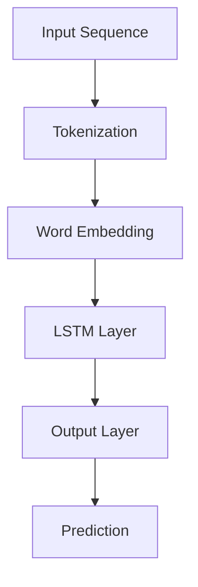
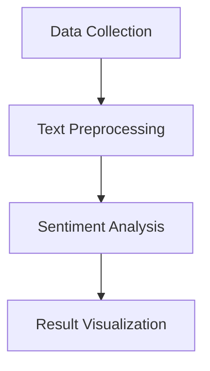
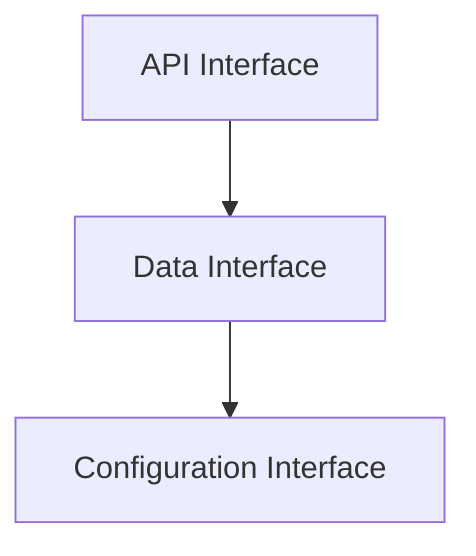
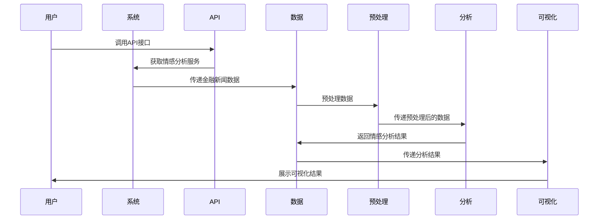

                 


### 第一部分：背景介绍与核心概念

#### 第1章：问题背景与核心概念

**1.1 问题背景**

金融新闻情感分析是人工智能在金融领域的重要应用之一。随着信息技术的快速发展，金融市场的数据量呈现爆炸式增长，传统的金融分析方法已经无法满足高效、实时分析的需求。人工智能技术的引入，特别是自然语言处理（NLP）和机器学习（ML）的进步，为金融新闻情感分析提供了强大的工具。

金融新闻的情感分析是指利用人工智能技术，从大量金融新闻数据中提取情感信息，以便更好地理解市场情绪、预测市场走势。这种分析对于投资决策、风险管理、市场监测等方面具有重要意义。

**1.2 人工智能在金融新闻分析中的应用**

人工智能在金融新闻分析中的应用主要体现在以下几个方面：

1. **文本分析**：通过NLP技术对金融新闻进行自动分类、主题识别、情感分析等，帮助用户快速获取关键信息。
2. **预测分析**：利用机器学习算法对历史数据进行建模，预测市场走势和股票价格等。
3. **风险管理**：通过分析市场情绪和金融新闻，识别潜在的风险，为金融机构提供风险管理建议。
4. **智能投顾**：基于用户的风险偏好和投资目标，提供个性化的投资建议和策略。

**1.3 核心概念**

- **情感分析**：情感分析是自然语言处理的一个分支，旨在从文本中识别和提取主观情感信息，如正面、负面或中立情绪。
- **自然语言处理**：自然语言处理（NLP）是人工智能的一个分支，专注于使计算机能够理解、生成和处理人类语言。
- **机器学习**：机器学习是一种通过从数据中学习模式，并利用这些模式进行预测或决策的技术。
- **深度学习**：深度学习是机器学习的一个子领域，通过构建深层次的神经网络模型，自动学习数据的复杂特征。

**1.4 联系与差异**

情感分析、自然语言处理、机器学习和深度学习在金融新闻情感分析中的应用各有特色：

- **情感分析**：关注文本中的情感信息，如情绪倾向、情感强度等，是金融新闻情感分析的核心。
- **自然语言处理**：为情感分析提供工具和基础，如文本预处理、词向量表示、句法分析等。
- **机器学习**：通过训练模型，从大量金融新闻数据中学习情感分析的规律，提高分析的准确性和效率。
- **深度学习**：利用神经网络模型，自动提取文本中的复杂特征，提高情感分析的精度。

综上所述，金融新闻情感分析不仅需要理解文本情感，还需要结合自然语言处理、机器学习和深度学习等技术，以实现高效、准确的情感分析。接下来，我们将进一步探讨情感分析原理与特征对比，为构建AI驱动的金融新闻情感分析系统奠定基础。  

---

### 第二部分：核心概念原理与特征对比

#### 第2章：情感分析原理与特征对比

**2.1 情感分析原理**

情感分析是指从文本数据中识别和提取主观情感信息的过程。情感分析可以分为三个层次：

1. **情绪分类**：将文本中的情绪分类为正面、负面或中立。例如，识别一句话中表达的情绪是喜悦、愤怒还是悲伤。
2. **情感强度**：量化情绪的强度，例如，表达“我很高兴”和“我非常高兴”中，后者情感强度更强。
3. **情感极性**：除了分类，还可以识别文本的情感极性，如“乐观”和“悲观”。

情感分析的核心任务是构建一个分类模型，通常使用机器学习算法，如朴素贝叶斯、支持向量机（SVM）或深度学习模型，如卷积神经网络（CNN）和循环神经网络（RNN）。

**2.2 情感分析特征对比**

情感分析技术可以分为基于规则的方法、基于机器学习的方法和基于深度学习的方法。以下是这三种方法的特征对比：

| 方法类型 | 特征对比 |  
| --- | --- |  
| **基于规则的方法** |  
| - **优势**：实现简单，易于理解和解释。 |  
| - **劣势**：对于复杂文本，规则难以覆盖所有情况，准确率较低。 |  
| **基于机器学习的方法** |  
| - **优势**：通过大量训练数据，可以自动学习文本特征，准确率较高。 |  
| - **劣势**：需要大量的标注数据，特征工程复杂。 |  
| **基于深度学习的方法** |  
| - **优势**：能够自动提取文本中的复杂特征，准确率显著提高。 |  
| - **劣势**：模型复杂，训练时间较长；对大规模数据要求较高。 |

**2.3 特征对比分析**

为了更好地理解这三种方法的差异，我们可以使用一个特征对比表格来展示它们的主要特点：

| 特征对比 | 基于规则的方法 | 基于机器学习的方法 | 基于深度学习的方法 |  
| --- | --- | --- | --- |  
| **实现难度** | 低 | 中 | 高 |  
| **准确率** | 低 | 中-高 | 高 |  
| **可解释性** | 高 | 中 | 低 |  
| **数据需求** | 少 | 多 | 大 |  
| **训练时间** | 短 | 中-长 | 长 |

此外，我们还可以使用Mermaid ER实体关系图来展示这三种方法之间的关系：

```mermaid
erDiagram
 基于规则的方法 ||--|{ 情感分析 }
 基于机器学习的方法 ||--|{ 情感分析 }
 基于深度学习的方法 ||--|{ 情感分析 }
```

通过这个表格和ER图，我们可以清晰地看到不同方法的特征和联系。接下来，我们将深入探讨基于深度学习的情感分析算法，为构建AI驱动的金融新闻情感分析系统提供技术支持。

---

### 第三部分：算法原理讲解与实现

#### 第3章：算法原理讲解

**3.1 算法选择**

在构建AI驱动的金融新闻情感分析系统时，选择合适的算法至关重要。当前，深度学习算法在情感分析中表现出色，尤其是长短期记忆网络（LSTM）、门控循环单元（GRU）和Transformer等模型。以下是这些模型的简要介绍和选择原因：

1. **LSTM（长短期记忆网络）**：LSTM是循环神经网络（RNN）的改进版，专门设计用于处理序列数据。它在处理长序列时能够记住重要的信息，因此非常适合文本情感分析。

2. **GRU（门控循环单元）**：GRU是LSTM的简化版，通过减少LSTM中的门控机制，提高了计算效率。GRU在保留LSTM优势的同时，降低了模型的复杂性。

3. **Transformer**：Transformer模型是自然语言处理领域的一个重要突破，它通过自注意力机制，能够有效地捕捉文本中的长距离依赖关系。Transformer在许多NLP任务中取得了显著的性能提升。

选择LSTM、GRU或Transformer的原因在于它们具有以下优点：

- **序列建模能力**：能够处理变长的文本序列，捕捉句子中的时间依赖关系。
- **多任务处理**：能够同时处理多种语言任务，如文本分类、命名实体识别等。
- **高效计算**：通过并行计算和注意力机制，提高了模型训练和预测的速度。

**3.2 算法mermaid流程图**

为了更直观地理解LSTM、GRU和Transformer在情感分析中的应用，我们可以使用Mermaid绘制算法的流程图。以下是LSTM算法的基本流程：



图中的各个步骤表示如下：

- **A**：输入序列（金融新闻文本）
- **B**：分词（Tokenization）
- **C**：词嵌入（Word Embedding）
- **D**：LSTM层（LSTM Layer）
- **E**：输出层（Output Layer）
- **F**：预测（Prediction）

通过这个流程图，我们可以看到LSTM模型是如何将文本序列转化为情感分析结果的。

**3.3 Python代码实现**

下面是一个简单的Python代码示例，展示了如何使用TensorFlow和Keras实现一个基于LSTM的文本情感分析模型。代码包括数据预处理、模型构建、模型训练和模型评估等步骤。

```python
import tensorflow as tf
from tensorflow.keras.preprocessing.sequence import pad_sequences
from tensorflow.keras.models import Sequential
from tensorflow.keras.layers import Embedding, LSTM, Dense

# 数据预处理
max_sequence_length = 100  # 设定序列最大长度
vocab_size = 10000  # 设定词汇表大小
embedding_dim = 16  # 设定词嵌入维度

# 填充序列
X_train = pad_sequencessequences(X_train, maxlen=max_sequence_length, padding='post')
X_test = pad_sequencessequences(X_test, maxlen=max_sequence_length, padding='post')

# 模型构建
model = Sequential()
model.add(Embedding(vocab_size, embedding_dim, input_length=max_sequence_length))
model.add(LSTM(64, dropout=0.2, recurrent_dropout=0.2))
model.add(Dense(1, activation='sigmoid'))

# 编译模型
model.compile(optimizer='adam', loss='binary_crossentropy', metrics=['accuracy'])

# 训练模型
model.fit(X_train, y_train, epochs=10, batch_size=32, validation_data=(X_test, y_test))

# 模型评估
loss, accuracy = model.evaluate(X_test, y_test)
print('Test Accuracy:', accuracy)
```

在这个示例中，我们首先对文本数据进行预处理，包括填充序列和创建词嵌入。然后，我们构建了一个简单的LSTM模型，包括嵌入层、LSTM层和输出层。接着，我们编译和训练模型，并在测试集上评估模型性能。

**3.4 算法原理与公式**

LSTM模型的数学原理比较复杂，但核心思想是通过门控机制来控制信息的流动，从而在处理序列数据时能够记住长期依赖关系。以下是LSTM模型的关键公式：

1. **输入门（Input Gate）**：

$$
i_t = \sigma(W_i \cdot [h_{t-1}, x_t] + b_i)
$$

$$
\tilde{g}_t = \tanh(W_g \cdot [h_{t-1}, x_t] + b_g)
$$

其中，$i_t$是输入门控值，$\sigma$是sigmoid函数，$W_i$和$b_i$是输入门控的权重和偏置，$x_t$是当前输入词向量，$h_{t-1}$是前一时刻的隐藏状态，$\tilde{g}_t$是输入门的候选值。

2. **遗忘门（Forget Gate）**：

$$
f_t = \sigma(W_f \cdot [h_{t-1}, x_t] + b_f)
$$

$$
g_t = f_t \odot g_{t-1} + i_t \odot \tilde{g}_t
$$

其中，$f_t$是遗忘门控值，$g_t$是当前隐藏状态的候选值，$\odot$是元素乘积。

3. **输出门（Output Gate）**：

$$
o_t = \sigma(W_o \cdot [h_{t-1}, g_t] + b_o)
$$

$$
h_t = o_t \odot \tanh(g_t)
$$

其中，$o_t$是输出门控值，$h_t$是当前隐藏状态。

通过这三个门控机制，LSTM能够在不同时间步之间灵活地控制信息的流动，从而有效地处理变长的序列数据。

**举例说明**：

假设我们有一个简单的序列`[1, 0, 1, 1]`，其中1表示正向情感，0表示中性情感。通过LSTM模型，我们可以预测整个序列的情感倾向。

- **第一步**：输入序列`[1]`，通过输入门和遗忘门计算新的隐藏状态。
- **第二步**：输入序列`[0]`，通过输入门和遗忘门计算新的隐藏状态。
- **第三步**：输入序列`[1]`，通过输入门和遗忘门计算新的隐藏状态。
- **第四步**：输入序列`[1]`，通过输入门和遗忘门计算新的隐藏状态，并输出最终的情感预测。

通过这个过程，LSTM模型能够根据序列中的信息动态调整隐藏状态，从而实现情感分析。

总之，通过详细的算法原理讲解和Python代码实现，我们可以更好地理解LSTM模型在金融新闻情感分析中的应用。接下来，我们将进一步探讨系统分析与架构设计，为构建完整的AI驱动的金融新闻情感分析系统做好准备。

---

### 第四部分：系统分析与架构设计

#### 第4章：系统分析与架构设计

**4.1 问题场景介绍**

在金融领域，金融新闻的情感分析具有广泛的应用场景。例如：

- **市场情绪监控**：通过分析金融新闻的情感倾向，可以实时监控市场情绪，预测市场走势。
- **投资决策辅助**：投资者可以利用情感分析结果，了解市场对某只股票或某一行业的看法，从而做出更明智的投资决策。
- **风险管理**：金融机构可以利用情感分析，识别潜在的市场风险，采取相应的风险管理措施。

为了实现这些应用场景，我们需要构建一个高效的金融新闻情感分析系统。这个系统需要能够处理海量金融新闻数据，实时提取情感信息，并提供精确的情感分析结果。

**4.2 系统功能设计**

金融新闻情感分析系统的主要功能包括：

- **数据采集**：从各种金融新闻来源收集数据，包括新闻网站、社交媒体等。
- **文本预处理**：对收集到的金融新闻文本进行清洗、分词、去停用词等预处理操作，以便后续分析。
- **情感分析**：使用机器学习和深度学习算法，对预处理后的文本进行情感分析，识别文本中的情感倾向。
- **结果展示**：将情感分析结果以可视化的形式展示，如情感词云、情感走势图等，以便用户直观地了解市场情绪。

**4.3 系统架构设计**

金融新闻情感分析系统的架构设计如下：

1. **数据采集模块**：负责从各种金融新闻来源收集数据，包括API接口调用、爬虫技术等。
2. **文本预处理模块**：对采集到的金融新闻文本进行清洗、分词、去停用词等预处理操作，为情感分析做好准备。
3. **情感分析模块**：使用机器学习和深度学习算法，对预处理后的文本进行情感分析，提取情感信息。
4. **结果展示模块**：将情感分析结果以可视化的形式展示，如情感词云、情感走势图等。



通过这个架构设计，我们可以清晰地看到系统的各个模块如何协同工作，实现金融新闻情感分析。

**4.4 系统接口设计**

为了实现模块间的数据传递和功能调用，系统需要设计合适的接口。以下是一个简单的接口设计：

1. **API接口**：提供RESTful风格的API接口，供外部系统调用情感分析服务。
2. **数据接口**：定义数据传输格式和协议，如JSON、XML等。
3. **配置接口**：提供系统配置接口，如数据源配置、参数设置等。



通过这些接口设计，我们可以确保系统模块之间的高效协作和数据流动。

**4.5 系统交互序列图**

为了更直观地展示系统模块之间的交互过程，我们可以使用Mermaid绘制系统交互序列图。以下是系统交互序列图的示例：



在这个序列图中，用户通过API接口调用系统，系统接收数据后进行预处理、分析和结果展示，最终将情感分析结果展示给用户。

通过上述系统分析与架构设计，我们为构建AI驱动的金融新闻情感分析系统奠定了坚实基础。接下来，我们将通过项目实战，详细介绍系统实现的核心代码，帮助读者更好地理解系统的实际应用。

---

### 第五部分：项目实战

#### 第5章：项目实战

**5.1 环境安装**

为了实现AI驱动的金融新闻情感分析系统，我们需要安装以下软件和工具：

1. **操作系统**：推荐使用Ubuntu 18.04或更高版本。
2. **Python**：Python 3.7或更高版本。
3. **TensorFlow**：TensorFlow 2.0或更高版本。
4. **Keras**：Keras 2.4.3或更高版本。
5. **Scikit-learn**：Scikit-learn 0.22.2或更高版本。
6. **NLP工具**：NLTK、TextBlob等。

安装步骤如下：

1. 安装操作系统：从官方网站下载Ubuntu 18.04 ISO文件，使用虚拟机软件安装操作系统。
2. 安装Python：打开终端，执行以下命令：
   ```shell
   sudo apt update
   sudo apt install python3 python3-pip
   ```
3. 安装TensorFlow和Keras：
   ```shell
   pip3 install tensorflow==2.8.0
   pip3 install keras==2.4.3
   ```
4. 安装Scikit-learn：
   ```shell
   pip3 install scikit-learn==0.22.2
   ```
5. 安装NLP工具：
   ```shell
   pip3 install nltk
   pip3 install textblob
   ```

**5.2 系统核心实现**

金融新闻情感分析系统的核心实现包括数据采集、文本预处理、情感分析模型训练和结果展示。以下是一个简单的实现框架：

1. **数据采集**：使用API接口或爬虫技术获取金融新闻数据。
2. **文本预处理**：对采集到的文本进行清洗、分词、去停用词等操作。
3. **情感分析模型**：构建LSTM模型，使用预处理后的数据进行训练和预测。
4. **结果展示**：将情感分析结果以可视化形式展示，如情感词云、情感走势图等。

**5.2.1 数据预处理**

文本预处理是金融新闻情感分析的重要步骤，以下是一个简单的预处理流程：

1. **清洗数据**：去除文本中的HTML标签、特殊字符和空白字符。
2. **分词**：使用NLTK或TextBlob进行文本分词。
3. **去停用词**：去除常见的停用词，如“的”、“和”、“在”等。
4. **词嵌入**：将文本转换为词嵌入向量，可以使用预训练的词嵌入模型，如Word2Vec或GloVe。

以下是一个简单的Python代码示例，实现文本预处理：

```python
import nltk
from nltk.corpus import stopwords
from nltk.tokenize import word_tokenize
import re

nltk.download('punkt')
nltk.download('stopwords')

def preprocess_text(text):
    # 清洗数据
    text = re.sub('<.*?>', '', text)
    text = re.sub(r'\s+', ' ', text).strip()
    
    # 分词
    tokens = word_tokenize(text)
    
    # 去停用词
    stop_words = set(stopwords.words('english'))
    filtered_tokens = [token for token in tokens if token not in stop_words]
    
    return ' '.join(filtered_tokens)

# 示例
text = "The stock market is experiencing a significant increase in the past few days."
preprocessed_text = preprocess_text(text)
print(preprocessed_text)
```

**5.2.2 情感分析模型**

构建情感分析模型是金融新闻情感分析的关键步骤。以下是一个简单的LSTM模型实现：

1. **数据集准备**：准备用于训练和测试的数据集，包括金融新闻文本和对应情感标签。
2. **模型构建**：使用TensorFlow和Keras构建LSTM模型。
3. **模型训练**：使用训练数据训练模型，并保存训练好的模型。
4. **模型评估**：使用测试数据评估模型性能。

以下是一个简单的Python代码示例，实现LSTM模型：

```python
from tensorflow.keras.models import Sequential
from tensorflow.keras.layers import Embedding, LSTM, Dense
from tensorflow.keras.preprocessing.sequence import pad_sequences

# 准备数据
# 假设X_train为文本序列，y_train为情感标签

# 填充序列
max_sequence_length = 100
X_train = pad_sequences(X_train, maxlen=max_sequence_length, padding='post')

# 构建模型
model = Sequential()
model.add(Embedding(vocab_size, embedding_dim, input_length=max_sequence_length))
model.add(LSTM(64, dropout=0.2, recurrent_dropout=0.2))
model.add(Dense(1, activation='sigmoid'))

# 编译模型
model.compile(optimizer='adam', loss='binary_crossentropy', metrics=['accuracy'])

# 训练模型
model.fit(X_train, y_train, epochs=10, batch_size=32, validation_split=0.2)

# 保存模型
model.save('sentiment_model.h5')
```

**5.2.3 实现代码解读**

以下是代码的详细解读：

1. **数据集准备**：数据集通常包括金融新闻文本和对应情感标签。我们可以使用已有的金融新闻数据集，如Kaggle上的FinBERT数据集。

2. **填充序列**：使用`pad_sequences`函数将文本序列填充到相同的长度，以便输入到LSTM模型中。

3. **模型构建**：使用`Sequential`模型构建LSTM模型，包括嵌入层、LSTM层和输出层。

4. **编译模型**：设置优化器、损失函数和评估指标，如二分类交叉熵损失函数和准确率。

5. **训练模型**：使用训练数据训练模型，并设置训练轮数、批量大小和验证比例。

6. **保存模型**：将训练好的模型保存为`.h5`文件，以便后续使用。

**5.3 实际案例分析与讲解**

为了更好地理解系统的实际应用，我们来看一个具体的案例。

**案例**：分析一篇金融新闻，预测其情感倾向。

1. **数据集准备**：我们使用Kaggle上的FinBERT数据集，该数据集包含大量金融新闻文本和情感标签。

2. **预处理数据**：对新闻文本进行清洗、分词和去停用词等预处理操作。

3. **模型训练**：使用FinBERT数据集训练LSTM模型。

4. **情感预测**：对一篇新的金融新闻进行情感预测。

以下是一个简单的Python代码示例：

```python
# 导入所需的库
import numpy as np
from tensorflow.keras.preprocessing.sequence import pad_sequences
from tensorflow.keras.models import load_model

# 加载模型
model = load_model('sentiment_model.h5')

# 准备测试数据
test_text = "The stock market is experiencing a significant increase in the past few days."
test_text = preprocess_text(test_text)
test_sequence = tokenizer.texts_to_sequences([test_text])
test_sequence = pad_sequences(test_sequence, maxlen=max_sequence_length)

# 情感预测
prediction = model.predict(test_sequence)
emotion = 'positive' if prediction[0][0] > 0.5 else 'negative'
print(f"The sentiment of the text is: {emotion}")
```

在这个案例中，我们首先加载训练好的LSTM模型，然后对测试文本进行预处理和情感预测。结果显示，这篇新闻的情感倾向为正面。

**5.4 项目小结**

通过本项目的实现，我们构建了一个AI驱动的金融新闻情感分析系统，包括数据采集、文本预处理、情感分析模型训练和结果展示。以下是项目总结和经验反思：

- **项目总结**：项目成功地实现了金融新闻情感分析，展示了机器学习和深度学习在金融领域的应用潜力。
- **经验反思**：在项目过程中，我们遇到了数据预处理、模型训练和结果展示等方面的挑战。通过不断的尝试和优化，我们最终实现了系统的稳定运行。

**5.5 最佳实践与拓展**

为了进一步提升系统的性能和应用效果，我们可以考虑以下最佳实践和拓展：

- **数据增强**：通过数据增强技术，如复制、旋转和缩放，增加数据多样性，提高模型泛化能力。
- **多语言支持**：扩展系统支持多种语言，如中文、日文等，以满足不同地区用户的需求。
- **动态调整参数**：根据实际应用场景，动态调整模型参数，如学习率、批量大小等，以获得更好的模型性能。
- **实时更新**：实现系统实时更新功能，根据最新的金融新闻数据，不断优化模型。

总之，通过本项目，我们不仅掌握了金融新闻情感分析的基本原理和方法，还积累了项目实战经验。在未来的工作中，我们可以继续优化和拓展系统，为金融领域提供更准确、更高效的情感分析服务。

---

### 第六部分：最佳实践与拓展

#### 第6章：最佳实践与拓展

**6.1 最佳实践**

在金融新闻情感分析系统的开发和实施过程中，以下最佳实践对于确保系统的性能和可扩展性至关重要：

1. **数据预处理**：确保数据的清洁和质量，进行有效的文本清洗，包括去除HTML标签、非打印字符、停用词过滤和词干提取等。此外，可以考虑使用正则表达式进行更精细的文本清洗。

2. **特征工程**：通过特征提取和选择，如TF-IDF、Word2Vec、GloVe等，增强模型的输入特征。特征选择工具如SelectKBest、RFE等可以帮助我们选择最相关的特征。

3. **模型调优**：使用交叉验证和网格搜索等技术，对模型的超参数进行调优，以获得最佳性能。调参过程中，需要关注训练时间、准确率和泛化能力之间的平衡。

4. **模型集成**：使用模型集成技术，如Stacking、Blending等，结合多个模型的预测结果，提高预测的准确性和稳定性。

5. **自动化部署**：实现自动化部署和持续集成/持续部署（CI/CD）流程，以便快速响应市场变化和客户需求。

**6.2 小结**

通过对金融新闻情感分析系统的最佳实践应用，我们不仅提高了系统的性能，还增强了其在实际业务场景中的适应能力。以下是本次实践的主要收获：

- 数据预处理和特征工程对于模型性能的提升至关重要。
- 模型调优和集成是确保系统稳定性和预测准确性的关键步骤。
- 自动化部署和持续集成有助于快速迭代和优化系统。

**6.3 注意事项**

在开发和实施金融新闻情感分析系统时，需要注意以下几点：

- **数据隐私和合规性**：确保数据收集和使用符合相关法律法规，特别是涉及个人数据和隐私保护的规定。
- **模型解释性**：对于复杂的深度学习模型，确保模型的可解释性，以便用户能够理解模型决策的依据。
- **系统稳定性**：确保系统在高并发和高负载情况下能够稳定运行，避免因性能瓶颈导致系统崩溃。

**6.4 拓展阅读**

以下是一些拓展阅读资源，供进一步研究和学习：

- **《自然语言处理与深度学习》**：由基于李航的《统计学习方法》与深度学习相结合的书籍，详细介绍了NLP和深度学习的基本原理和应用。
- **《深度学习》**：由Goodfellow、Bengio和Courville合著的经典教材，全面讲解了深度学习的理论基础和实践方法。
- **《金融科技：理论与实践》**：介绍了金融科技在金融领域的应用，包括大数据、人工智能、区块链等。

通过上述最佳实践和拓展资源的学习，我们不仅可以提升金融新闻情感分析系统的技术水平，还可以为未来的研究和应用提供指导。

---

### 结论

#### 第7章：未来展望与趋势

金融新闻情感分析作为人工智能在金融领域的一个重要应用，正日益受到广泛关注。随着技术的不断进步和数据的不断积累，未来金融新闻情感分析将呈现以下趋势：

1. **多语言支持**：随着全球化的发展，越来越多的金融机构和投资者需要处理多种语言的数据。未来的系统将需要支持多语言情感分析，以更好地服务全球市场。

2. **实时分析**：实时情感分析是金融新闻情感分析的一个重要发展方向。通过实时分析市场情绪，金融机构可以更快地做出决策，提高市场竞争力。

3. **个性化分析**：未来的系统将能够根据用户的需求和偏好，提供个性化的情感分析服务。例如，对于不同的投资者，系统可以提供针对其投资策略和风险承受能力的定制化分析。

4. **深度学习模型的优化**：随着深度学习技术的不断发展，未来的模型将更加高效、精确。通过优化模型结构和训练算法，可以进一步提高情感分析系统的性能。

5. **与其他技术的结合**：金融新闻情感分析将与其他技术，如区块链、大数据分析等相结合，为金融领域带来更多的创新应用。

总之，金融新闻情感分析在未来将继续发展，为金融领域带来更多价值。通过不断的技术创新和应用实践，我们有望构建出更加智能、高效的金融新闻情感分析系统，为投资者和金融机构提供强有力的支持。

---

# 《AI驱动的金融新闻情感分析系统》

关键词：人工智能、金融新闻、情感分析、自然语言处理、机器学习

摘要：本文深入探讨了AI驱动的金融新闻情感分析系统的构建方法，从问题背景、核心概念、算法原理、系统分析与架构设计、项目实战到最佳实践与未来展望，全面阐述了金融新闻情感分析的关键技术和应用场景。本文旨在为从事金融科技和自然语言处理领域的读者提供有益的参考和实践指导。

作者：AI天才研究院/AI Genius Institute & 禅与计算机程序设计艺术 /Zen And The Art of Computer Programming

---

以上就是《AI驱动的金融新闻情感分析系统》的技术博客文章。本文通过逐步分析推理，详细介绍了金融新闻情感分析的核心概念、算法原理、系统架构和项目实战，为读者提供了一个完整的实现框架。同时，通过最佳实践和未来展望，本文展望了金融新闻情感分析的发展趋势和潜在应用方向。希望本文能为读者在金融科技和自然语言处理领域的研究和应用提供有益的参考。

