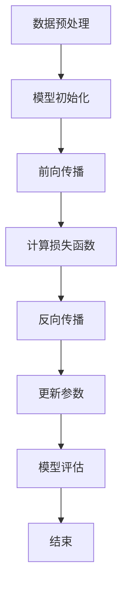
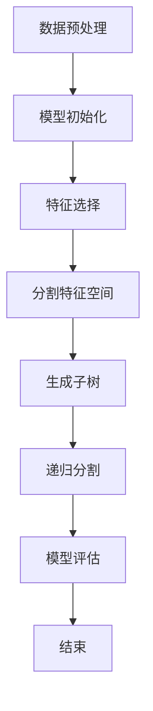
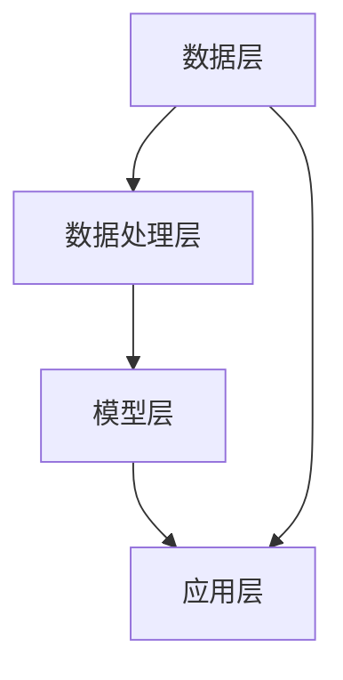

                 

### 1.1 金融欺诈问题的现状与危害

金融欺诈是指通过非法手段获取财产或利用金融系统漏洞进行的欺诈行为。随着互联网和金融科技的快速发展，金融欺诈问题日益严重，对全球金融市场造成了巨大的威胁。以下是一些关于金融欺诈现状与危害的详细分析：

#### 全球现状

根据国际刑警组织（Interpol）的统计数据，金融欺诈在全球范围内每年导致数百万美元的损失。例如，2019年，美国金融行业的欺诈损失超过了600亿美元。欧洲和亚洲的金融欺诈问题也愈发严重，涉及金额和案件数量逐年上升。

#### 影响金融行业的危害

金融欺诈对金融行业的危害主要体现在以下几个方面：

- **损害金融系统稳定性**：大规模的金融欺诈可能导致金融机构破产，影响金融系统的稳定性，甚至引发金融危机。
- **损害消费者信任**：金融欺诈行为会使消费者对金融系统的信任度下降，影响金融市场的健康发展。
- **经济损失**：金融欺诈导致的大量经济损失不仅影响了金融机构的盈利，也削弱了国家的经济实力。

#### 经济损失

金融欺诈造成的经济损失是一个巨大的负担。根据英国《金融时报》的报道，全球金融欺诈案件每年造成的经济损失高达数万亿美元。这些损失不仅包括直接的财务损失，还包括对金融系统的信任危机和恢复成本。

#### 影响经济发展

金融欺诈不仅影响金融机构的稳定，还会对整个经济造成负面影响。当大量资金因金融欺诈而流失，投资者和企业的信心受到打击，这可能导致投资减少、经济增长放缓。

#### 防范与挑战

尽管各国政府和金融机构已经采取了一系列措施来防范金融欺诈，但由于金融欺诈手段的不断翻新，防范工作面临着巨大的挑战。例如，随着人工智能和区块链技术的发展，金融欺诈手段变得更加复杂，防范工作也变得更加困难。

总之，金融欺诈问题的现状与危害不容忽视。为了保护金融系统的稳定和消费者的权益，各国政府和金融机构需要加强合作，共同应对金融欺诈的挑战。

### 1.2 AI在金融欺诈检测中的潜力

随着人工智能（AI）技术的快速发展，AI在金融欺诈检测中的应用越来越广泛。AI技术以其高效、准确和自适应的特点，为金融欺诈检测带来了前所未有的潜力。以下从几个方面探讨AI在金融欺诈检测中的潜力：

#### 传统欺诈检测方法的局限性

传统的金融欺诈检测方法主要依赖于规则和统计模型，例如：

- **规则检测**：通过预设的规则来判断交易是否异常。这种方法存在明显的局限性，因为欺诈行为往往是复杂的、多变的，很难通过固定的规则来捕捉。
- **统计模型**：如逻辑回归、决策树等，通过分析历史数据来识别异常交易。尽管这种方法比规则检测更加灵活，但其在处理大数据和复杂场景时仍显得力不从心。

#### AI技术在欺诈检测中的应用

AI技术在金融欺诈检测中的应用主要体现在以下几个方面：

- **机器学习算法**：如神经网络、随机森林、支持向量机等，通过从大量数据中学习，可以更准确地识别异常交易。机器学习算法可以处理大数据集，并自动提取复杂的模式。
- **深度学习算法**：如卷积神经网络（CNN）和递归神经网络（RNN），在图像识别和序列数据处理方面表现出色，可用于检测复杂、多变的欺诈行为。
- **自然语言处理（NLP）**：通过分析交易描述、邮件、短信等文本数据，可以发现潜在欺诈线索。
- **强化学习**：通过不断调整策略来最大化收益，可以用于优化欺诈检测模型，使其更加准确和自适应。

#### AI驱动的欺诈检测的优势

AI驱动的金融欺诈检测相比传统方法具有以下优势：

- **高效性**：AI算法可以处理海量数据，快速识别欺诈行为，提高检测效率。
- **准确性**：AI算法通过学习大量历史数据，可以准确识别复杂的欺诈模式，减少误报和漏报。
- **自适应性**：AI算法可以自我调整，适应不断变化的欺诈手段，提高检测效果。
- **自动化**：AI算法可以自动化执行欺诈检测任务，减少人力成本，提高运营效率。

总之，AI技术在金融欺诈检测中具有巨大的潜力，通过高效、准确和自适应的特点，可以显著提升金融欺诈检测的效果，保护金融系统的稳定和消费者的权益。

### 1.3 定义与边界

#### 金融欺诈的定义

金融欺诈是指通过非法手段获取财产或利用金融系统漏洞进行的欺诈行为。具体来说，金融欺诈包括以下几种类型：

- **身份盗窃**：犯罪者冒用他人身份进行金融交易。
- **虚假交易**：犯罪者通过伪造交易记录、凭证等手段骗取财物。
- **洗钱**：犯罪者通过多次转账、兑换等手段将非法资金变成合法资金。
- **信用卡欺诈**：犯罪者利用他人信用卡进行非授权交易。

#### AI驱动的金融欺诈检测的定义

AI驱动的金融欺诈检测是指利用人工智能技术，特别是机器学习和深度学习算法，从大量金融数据中学习、识别和预测潜在的欺诈行为。具体包括以下步骤：

- **数据收集**：收集大量的金融交易数据，包括交易金额、时间、地点、交易描述等。
- **数据预处理**：清洗和整合数据，去除噪声和冗余信息。
- **特征工程**：提取有助于识别欺诈行为的关键特征。
- **模型训练**：使用机器学习和深度学习算法训练欺诈检测模型。
- **模型评估**：评估模型的性能，包括准确性、召回率、F1分数等指标。
- **模型部署**：将训练好的模型部署到实际系统中，进行实时欺诈检测。

#### 边界与外延

AI驱动的金融欺诈检测在边界上主要包括以下几个方面：

- **数据来源**：金融欺诈检测的数据主要来自金融机构的交易记录、客户行为数据等。
- **数据类型**：金融欺诈检测涉及的数据类型包括结构化数据（如数据库记录）和非结构化数据（如图像、文本等）。
- **检测范围**：AI驱动的金融欺诈检测不仅可以检测传统的金融欺诈行为，还可以检测新型、复杂的欺诈手段。

在金融欺诈检测的外延上，除了传统的欺诈检测任务，AI技术还可以应用于以下领域：

- **反洗钱（AML）**：通过检测异常交易行为，防止非法资金的流动。
- **信用评估**：基于客户的交易行为和历史数据，评估其信用风险。
- **智能投顾**：通过分析市场数据，提供个性化的投资建议。

总之，AI驱动的金融欺诈检测不仅在边界上有所扩展，还在外延上开辟了新的应用场景，为金融行业的风险管理和安全防护提供了强有力的支持。

### 1.4 核心概念与要素组成

#### 数据预处理

数据预处理是AI驱动的金融欺诈检测系统的第一步，其目的是从原始数据中提取有用信息，去除噪声和冗余，为后续的特征工程和模型训练提供高质量的输入数据。数据预处理主要包括以下几个步骤：

- **数据收集**：收集来自不同源头的金融数据，包括交易记录、客户信息等。
- **数据清洗**：清洗数据中的错误、异常和重复记录，去除噪声和冗余信息。
- **数据集成**：将不同来源的数据进行整合，统一数据格式和结构。
- **数据转换**：将数据转换成适合模型训练的格式，如数值化、标准化等。

#### 特征工程

特征工程是数据预处理之后的重要步骤，其目的是从原始数据中提取有助于模型训练的特征，以提高模型性能。特征工程主要包括以下几个步骤：

- **特征提取**：从原始数据中提取出关键的特征，如交易金额、交易时间、交易频率等。
- **特征选择**：选择对模型性能有显著影响的特征，去除无关或冗余的特征。
- **特征缩放**：将不同特征的范围统一，消除特征之间的尺度差异。

#### 模型选择与训练

模型选择与训练是金融欺诈检测系统的核心步骤，其目的是通过训练模型来识别和预测潜在的欺诈行为。模型选择与训练主要包括以下几个步骤：

- **模型选择**：选择适合金融欺诈检测的机器学习模型，如神经网络、决策树、支持向量机等。
- **模型训练**：使用训练数据集训练模型，调整模型参数，优化模型性能。
- **模型评估**：使用测试数据集评估模型性能，包括准确性、召回率、F1分数等指标。
- **模型优化**：根据评估结果调整模型参数，提高模型性能。

#### 模型评估与优化

模型评估与优化是确保模型有效性和准确性的关键步骤。评估模型性能的主要指标包括：

- **准确性**：模型预测正确的样本占总样本的比例。
- **召回率**：模型能够识别出的欺诈样本占总欺诈样本的比例。
- **F1分数**：准确性和召回率的调和平均值，综合考虑了模型对欺诈样本的识别能力。

优化模型的方法包括：

- **交叉验证**：通过多次训练和测试，评估模型在不同数据集上的性能。
- **超参数调优**：调整模型的超参数，如学习率、正则化参数等，以优化模型性能。
- **集成学习**：结合多个模型，提高整体预测性能。

#### 数据预处理、特征工程、模型选择与训练、模型评估与优化的相互关系

数据预处理、特征工程、模型选择与训练、模型评估与优化这四个步骤相互关联，共同构成了AI驱动的金融欺诈检测系统。数据预处理是基础，为后续的模型训练提供高质量的输入数据；特征工程是关键，从原始数据中提取出有助于模型训练的特征；模型选择与训练是核心，通过训练和优化模型来识别欺诈行为；模型评估与优化则确保模型的有效性和准确性，为实际应用提供可靠支持。

### 2.1 数据预处理

数据预处理是AI驱动的金融欺诈检测系统中的关键步骤，它直接影响到模型的性能和准确性。数据预处理包括数据收集、数据清洗、数据集成和数据转换等多个环节，以下将详细探讨每个环节及其具体方法。

#### 数据收集

数据收集是数据预处理的第一步，其目的是获取用于模型训练和评估的数据集。金融欺诈检测的数据来源主要包括以下几个方面：

- **交易数据**：包括交易金额、交易时间、交易地点、交易类型等。
- **客户信息**：如客户的姓名、地址、联系方式、信用评分等。
- **历史欺诈数据**：记录以往发生的欺诈案例，包括欺诈类型、欺诈金额、欺诈时间等。

收集数据的方法包括：

- **数据库查询**：从金融机构的数据库中直接提取交易数据。
- **API接口**：通过金融机构提供的API接口获取数据。
- **公开数据集**：利用公共数据集，如Kaggle、UCI机器学习库等，获取相关的数据。

#### 数据清洗

数据清洗是确保数据质量的重要环节，它包括去除错误、异常和重复数据，以及处理缺失值。以下是一些常用的数据清洗方法：

- **去除错误数据**：识别并删除明显错误的数据记录，如金额为负的交易。
- **处理异常数据**：识别并处理异常值，如交易金额远高于正常范围的记录。
- **处理缺失值**：根据数据的重要性和实际情况，采用不同的方法处理缺失值，如删除缺失值、使用平均值或中位数填充、使用插值法等。

#### 数据集成

数据集成是将来自不同来源的数据进行整合，形成一个统一的数据集。以下是一些常用的数据集成方法：

- **合并**：将多个数据源中的数据按照一定的规则进行合并，形成一个完整的数据集。
- **联结**：通过关键字或标识符将不同数据源中的记录进行联结，形成一个更全面的数据集。
- **嵌套**：将一个数据源嵌套到另一个数据源中，形成一个统一的数据集。

#### 数据转换

数据转换是将数据转换为适合模型训练和处理的格式。以下是一些常用的数据转换方法：

- **数值化**：将分类数据转换为数值表示，如将交易类型转换为0和1。
- **标准化**：将不同特征的范围统一，消除特征之间的尺度差异，如将金额数据标准化到0到1之间。
- **归一化**：将特征数据缩放到一个固定的范围，如将金额数据归一化到0到100之间。

#### 数据预处理工具

在数据预处理过程中，常用的工具包括：

- **Python**：Python是一种广泛应用于数据预处理的编程语言，具有丰富的数据预处理库，如Pandas、NumPy等。
- **SQL**：SQL是用于数据库查询和管理的数据预处理工具，可以高效地处理大量数据。
- **ETL工具**：ETL（Extract, Transform, Load）工具用于数据的提取、转换和加载，如Apache Kafka、Apache Spark等。

通过合理的数据预处理，可以显著提高模型的性能和准确性，为后续的特征工程和模型训练奠定坚实基础。

### 2.2 特征工程

特征工程是AI驱动的金融欺诈检测系统中的关键环节，其目的是从原始数据中提取有助于模型训练的特征，以提高模型的性能和准确性。特征工程包括特征提取、特征选择和特征缩放等步骤。以下将详细探讨这些步骤及其具体方法。

#### 特征提取

特征提取是从原始数据中提取关键信息，以描述数据的特征。以下是一些常用的特征提取方法：

- **基本特征提取**：从原始数据中提取最基本的信息，如交易金额、交易时间、交易频率等。
  - **交易金额**：交易金额是判断欺诈的重要指标，高金额交易往往更可能涉嫌欺诈。
  - **交易时间**：交易发生的时间也是关键特征，例如在非营业时间或周末进行的交易可能更可疑。
  - **交易频率**：客户的交易频率可以帮助识别异常交易，例如突然增加的交易量可能表明欺诈行为。
- **高级特征提取**：通过数据挖掘和统计分析方法提取更复杂的特征，如：
  - **交易周期**：计算客户之间的平均交易间隔时间，识别出与正常交易周期不符的交易。
  - **交易模式**：分析客户的交易习惯和模式，识别出与正常习惯不一致的交易。

#### 特征选择

特征选择是从提取出的特征中选出对模型性能有显著影响的关键特征，以减少模型的复杂度和过拟合风险。以下是一些常用的特征选择方法：

- **基于信息增益的特征选择**：选择能够提供最多信息的特征，以降低模型对噪声的敏感性。
- **基于模型评估的特征选择**：根据不同特征对模型性能的影响，选择最有助于提高模型性能的特征。
- **基于过滤的特征选择**：通过评估特征与目标变量之间的相关性，选择相关性较高的特征。
- **基于包装的特征选择**：通过尝试不同的特征组合，选择能够最大化模型性能的特征组合。

#### 特征缩放

特征缩放是将不同特征的范围统一，消除特征之间的尺度差异，以提高模型的训练效率和性能。以下是一些常用的特征缩放方法：

- **标准化**：将每个特征的值缩放到0到1之间，公式为：\[ x' = \frac{x - \text{min}(x)}{\text{max}(x) - \text{min}(x)} \]
- **归一化**：将每个特征的值缩放到一个固定的范围，例如0到100之间，公式为：\[ x' = \frac{100 \cdot (x - \text{min}(x))}{\text{max}(x) - \text{min}(x)} \]
- **Min-Max缩放**：将每个特征的值缩放到最小值和最大值之间，公式为：\[ x' = x - \text{min}(x) + \text{min}(X') \]

通过合理的特征工程，可以有效提高模型在金融欺诈检测中的性能和准确性，为实际应用提供可靠的保障。

### 2.3 模型选择与训练

在AI驱动的金融欺诈检测系统中，模型选择与训练是关键环节，直接影响检测系统的性能。以下将详细探讨模型选择、训练过程以及评估方法。

#### 模型选择

模型选择是确定用于金融欺诈检测的最佳机器学习模型。以下是一些常用的模型及其适用场景：

- **逻辑回归**：适用于二分类问题，可以处理特征之间的线性关系。
- **决策树**：适用于简单的问题，可以提供清晰的决策路径。
- **随机森林**：是决策树的集成方法，可以处理更复杂的非线性关系。
- **支持向量机（SVM）**：适用于高维空间，可以处理线性不可分问题。
- **神经网络**：特别是深度神经网络（DNN），可以处理复杂的多层非线性关系。
- **集成学习方法**：如XGBoost、LightGBM等，通过结合多个模型，提高整体预测性能。

选择模型时，应考虑以下因素：

- **数据规模**：大数据集适合使用复杂模型，而小数据集可能更适合简单模型。
- **特征数量**：高维特征适合使用复杂模型，而低维特征可能更适合简单模型。
- **业务需求**：根据业务需求选择合适的模型，如对实时性要求高，可能选择轻量级模型。

#### 模型训练

模型训练是将模型参数调整到最优状态的过程。以下是一些常用的训练方法：

- **监督学习**：使用带有标签的训练数据集，通过最小化损失函数调整模型参数。
- **无监督学习**：不使用标签数据，通过发现数据中的隐含结构调整模型参数。
- **半监督学习**：结合监督学习和无监督学习，使用部分标签数据和大量无标签数据训练模型。

以下是一个基于Python的模型训练示例：

```python
from sklearn.linear_model import LogisticRegression
from sklearn.model_selection import train_test_split
from sklearn.metrics import accuracy_score

# 加载数据
X, y = load_data()

# 划分训练集和测试集
X_train, X_test, y_train, y_test = train_test_split(X, y, test_size=0.2, random_state=42)

# 创建逻辑回归模型
model = LogisticRegression()

# 训练模型
model.fit(X_train, y_train)

# 预测测试集
y_pred = model.predict(X_test)

# 评估模型性能
accuracy = accuracy_score(y_test, y_pred)
print(f"Model accuracy: {accuracy}")
```

#### 模型评估

模型评估是评估模型性能的重要环节，常用的评估指标包括：

- **准确性**：模型预测正确的样本占总样本的比例，公式为：\[ \text{Accuracy} = \frac{\text{预测正确数}}{\text{总样本数}} \]
- **召回率**：模型能够识别出的欺诈样本占总欺诈样本的比例，公式为：\[ \text{Recall} = \frac{\text{预测正确欺诈样本数}}{\text{总欺诈样本数}} \]
- **精确率**：模型预测为欺诈的样本中实际为欺诈的比例，公式为：\[ \text{Precision} = \frac{\text{预测正确欺诈样本数}}{\text{预测欺诈样本数}} \]
- **F1分数**：精确率和召回率的调和平均值，公式为：\[ \text{F1分数} = 2 \times \frac{\text{Precision} \times \text{Recall}}{\text{Precision} + \text{Recall}} \]

以下是一个基于Python的模型评估示例：

```python
from sklearn.metrics import classification_report

# 评估模型性能
report = classification_report(y_test, y_pred)
print(report)
```

通过合理选择模型、训练和评估模型，可以构建一个高效、准确的金融欺诈检测系统，为金融行业提供强有力的风险防护。

### 3.1 算法介绍

在金融欺诈检测系统中，选择合适的算法至关重要。本文将介绍几种常用的算法，包括逻辑回归、决策树、随机森林和神经网络。每种算法的特点和应用场景如下：

#### 逻辑回归

逻辑回归是一种经典的二分类算法，适用于处理特征之间线性关系的二分类问题。逻辑回归通过预测概率来分类，其优点是简单、易于理解和实现。逻辑回归适用于数据规模较小、特征数量较少的金融欺诈检测场景。

#### 决策树

决策树是一种基于树的分类算法，通过一系列的规则进行决策。决策树具有直观的决策路径和良好的解释性，适用于简单的问题。其缺点是容易过拟合，且在处理高维特征时性能较差。决策树适用于特征数量较少、问题简单的金融欺诈检测场景。

#### 随机森林

随机森林是决策树的集成方法，通过构建多棵决策树并投票得到最终结果。随机森林具有较好的泛化能力和抗过拟合能力，适用于处理高维特征和复杂的问题。其缺点是计算复杂度较高。随机森林适用于数据规模较大、特征数量较多的金融欺诈检测场景。

#### 神经网络

神经网络，特别是深度神经网络（DNN），是一种基于多层非线性变换的算法。神经网络可以处理复杂的多层非线性关系，具有强大的建模能力。其缺点是需要大量的数据和计算资源，且难以解释。神经网络适用于数据规模较大、特征复杂且要求高准确度的金融欺诈检测场景。

### 3.2 算法原理

#### 逻辑回归原理

逻辑回归通过预测概率来进行分类。其数学模型为：

\[ \text{logit}(P) = \log\left(\frac{P}{1 - P}\right) = \beta_0 + \beta_1x_1 + \beta_2x_2 + ... + \beta_nx_n \]

其中，\( \text{logit}(P) \) 是概率的对数函数，\( \beta_0, \beta_1, ..., \beta_n \) 是模型参数，\( x_1, x_2, ..., x_n \) 是特征向量。

通过求解最小化损失函数的方法，可以得到逻辑回归模型的参数。常用的损失函数是交叉熵损失函数：

\[ J(\theta) = -\frac{1}{m} \sum_{i=1}^{m} [y^{(i)} \log(\hat{y}^{(i)}) + (1 - y^{(i)}) \log(1 - \hat{y}^{(i)})] \]

其中，\( m \) 是样本数量，\( y^{(i)} \) 是真实标签，\( \hat{y}^{(i)} \) 是预测概率。

#### 决策树原理

决策树通过一系列的规则进行分类。其基本结构是树形结构，每个节点代表一个特征，每个分支代表特征的取值。决策树的决策路径是根据特征和取值进行分割，直到达到叶节点，叶节点代表分类结果。

决策树的生成过程是基于特征的重要性进行选择，常用的评估方法包括基尼不纯度、信息增益等。基尼不纯度表示特征的取值带来的不纯度减少，公式为：

\[ Gini(\text{impurity}) = 1 - \sum_{i=1}^{k} p_i^2 \]

其中，\( k \) 是特征的取值数量，\( p_i \) 是取值 \( i \) 的概率。

#### 随机森林原理

随机森林是通过构建多棵决策树并投票得到最终结果。随机森林的基本思想是集成多个模型，提高预测性能和泛化能力。随机森林的关键参数包括树的数量、树的深度等。

随机森林的生成过程包括以下几个步骤：

1. 随机从特征集合中选取一部分特征。
2. 随机从样本集合中选取一部分样本。
3. 构建一棵决策树，使用选取的特征和样本进行分割。
4. 重复上述步骤，构建多棵决策树。
5. 对每棵决策树的分类结果进行投票，得到最终分类结果。

#### 神经网络原理

神经网络，特别是深度神经网络（DNN），是一种基于多层非线性变换的算法。神经网络由多个神经元组成，每个神经元通过多个输入和权重进行加权求和，然后通过激活函数进行非线性变换。

神经网络的基本结构包括输入层、隐藏层和输出层。输入层接收外部输入，隐藏层进行信息处理和特征提取，输出层给出最终分类结果。

神经网络的训练过程包括以下几个步骤：

1. 初始化模型参数，包括权重和偏置。
2. 前向传播：将输入通过网络传递到输出层，得到预测结果。
3. 计算损失函数：计算预测结果与真实标签之间的差异。
4. 反向传播：根据损失函数计算梯度，更新模型参数。
5. 重复上述步骤，直到达到训练目标。

通过合理选择和调整算法，可以构建一个高效、准确的金融欺诈检测系统，为金融行业提供强有力的风险防护。

### 3.3 数学模型与公式详细讲解

#### 逻辑回归模型

逻辑回归是一种广泛应用于二分类问题的机器学习算法，其在金融欺诈检测中扮演着重要角色。逻辑回归的核心在于通过一组线性函数将特征映射到概率空间，从而实现分类。下面将详细讲解逻辑回归的数学模型及其相关公式。

逻辑回归的数学模型可以表示为：

\[ \text{logit}(P) = \beta_0 + \beta_1x_1 + \beta_2x_2 + ... + \beta_nx_n \]

其中，\( \text{logit}(P) \) 是概率的对数函数，也称为链接函数，\( P \) 是欺诈发生的概率，\( \beta_0, \beta_1, \beta_2, ..., \beta_n \) 是模型的参数，\( x_1, x_2, ..., x_n \) 是特征向量。

逻辑回归的预测概率可以表示为：

\[ P = \frac{1}{1 + e^{-\text{logit}(P)}} \]

通过最大化似然函数，可以求解逻辑回归的参数。似然函数可以表示为：

\[ L(\theta) = \prod_{i=1}^{m} \left[ P^{y_i} (1 - P)^{1 - y_i} \right] \]

其中，\( m \) 是样本数量，\( y_i \) 是第 \( i \) 个样本的真实标签，\( P \) 是预测概率。

对数似然函数可以简化为：

\[ \ell(\theta) = \sum_{i=1}^{m} \left[ y_i \text{log}(P) + (1 - y_i) \text{log}(1 - P) \right] \]

逻辑回归的损失函数通常采用对数损失函数，其公式为：

\[ J(\theta) = -\frac{1}{m} \sum_{i=1}^{m} \left[ y_i \text{log}(\hat{y}^{(i)}) + (1 - y_i) \text{log}(1 - \hat{y}^{(i)}) \right] \]

其中，\( \hat{y}^{(i)} \) 是模型对第 \( i \) 个样本的预测概率。

为了优化模型参数，可以使用梯度下降法对损失函数进行最小化。梯度下降法的更新公式为：

\[ \theta_j = \theta_j - \alpha \frac{\partial J(\theta)}{\partial \theta_j} \]

其中，\( \alpha \) 是学习率，\( \theta_j \) 是模型参数，\( \frac{\partial J(\theta)}{\partial \theta_j} \) 是损失函数对参数 \( \theta_j \) 的偏导数。

通过上述公式和步骤，逻辑回归模型可以有效地从数据中学习，从而进行欺诈检测。

#### 决策树模型

决策树是一种基于特征和值进行分割的树形结构模型，其在金融欺诈检测中也得到了广泛应用。下面将详细讲解决策树的数学模型和相关公式。

决策树的基本构建过程是通过不断分割特征空间，使得每个叶节点对应一个类别。决策树的数学模型可以表示为：

\[ T = \left\{ t_1, t_2, ..., t_n \right\} \]

其中，\( t_i \) 表示树中的第 \( i \) 个叶节点，每个叶节点对应一个类别。

决策树的生成过程是基于特征的重要性和不纯度（如基尼不纯度或信息增益）进行分割。基尼不纯度的计算公式为：

\[ Gini(\text{impurity}) = 1 - \sum_{i=1}^{k} p_i^2 \]

其中，\( k \) 是特征的取值数量，\( p_i \) 是取值 \( i \) 的概率。

信息增益的计算公式为：

\[ IG(D, A) = H(D) - \sum_{v_i} p_{v_i} H(D|A = v_i) \]

其中，\( H(D) \) 是数据的熵，\( H(D|A = v_i) \) 是条件熵，\( p_{v_i} \) 是特征 \( A \) 取值 \( v_i \) 的概率。

在决策树的生成过程中，选择最优特征和最优分割点，使得损失函数（如基尼不纯度或信息增益）最小。决策树的损失函数可以表示为：

\[ L(D) = \sum_{i=1}^{n} \left[ \sum_{v_i} p_{v_i} Gini(D_i) \right] \]

其中，\( D_i \) 是分割后的子集，\( p_{v_i} \) 是特征 \( A \) 取值 \( v_i \) 的概率。

通过递归地分割特征空间，可以构建一棵完整的决策树。决策树的预测过程是自顶向下遍历树结构，根据每个节点的特征和值进行决策，直到达到叶节点。

通过上述公式和步骤，决策树模型可以有效地从数据中学习，从而进行欺诈检测。

### 3.4 Python代码实现

为了更好地理解逻辑回归和决策树的实现过程，下面将分别给出Python代码实现。代码将使用scikit-learn库进行模型的训练和预测。

#### 逻辑回归代码实现

```python
from sklearn.linear_model import LogisticRegression
from sklearn.model_selection import train_test_split
from sklearn.metrics import accuracy_score

# 加载数据
X, y = load_data()

# 划分训练集和测试集
X_train, X_test, y_train, y_test = train_test_split(X, y, test_size=0.2, random_state=42)

# 创建逻辑回归模型
model = LogisticRegression()

# 训练模型
model.fit(X_train, y_train)

# 预测测试集
y_pred = model.predict(X_test)

# 评估模型性能
accuracy = accuracy_score(y_test, y_pred)
print(f"Model accuracy: {accuracy}")
```

#### 决策树代码实现

```python
from sklearn.tree import DecisionTreeClassifier
from sklearn.model_selection import train_test_split
from sklearn.metrics import accuracy_score

# 加载数据
X, y = load_data()

# 划分训练集和测试集
X_train, X_test, y_train, y_test = train_test_split(X, y, test_size=0.2, random_state=42)

# 创建决策树模型
model = DecisionTreeClassifier()

# 训练模型
model.fit(X_train, y_train)

# 预测测试集
y_pred = model.predict(X_test)

# 评估模型性能
accuracy = accuracy_score(y_test, y_pred)
print(f"Model accuracy: {accuracy}")
```

通过上述代码，我们可以看到如何使用Python和scikit-learn库实现逻辑回归和决策树的训练和预测过程。这些代码展示了如何加载数据、划分训练集和测试集、创建模型、训练模型和评估模型性能。

### 3.5 Mermaid流程图

为了更好地理解算法的流程，下面将分别给出逻辑回归和决策树的Mermaid流程图。

#### 逻辑回归Mermaid流程图



#### 决策树Mermaid流程图



通过这些流程图，我们可以直观地看到逻辑回归和决策树的运行步骤，从而更好地理解算法的实现过程。

### 4.1 常见数学公式

在金融欺诈检测的数学模型中，常用的数学公式包括：

- **逻辑回归公式**：
  \[ \text{logit}(P) = \beta_0 + \beta_1x_1 + \beta_2x_2 + ... + \beta_nx_n \]
  \[ P = \frac{1}{1 + e^{-\text{logit}(P)}} \]
  \[ J(\theta) = -\frac{1}{m} \sum_{i=1}^{m} \left[ y_i \text{log}(\hat{y}^{(i)}) + (1 - y_i) \text{log}(1 - \hat{y}^{(i)}) \right] \]
- **决策树公式**：
  \[ Gini(\text{impurity}) = 1 - \sum_{i=1}^{k} p_i^2 \]
  \[ IG(D, A) = H(D) - \sum_{v_i} p_{v_i} H(D|A = v_i) \]
  \[ L(D) = \sum_{i=1}^{n} \left[ \sum_{v_i} p_{v_i} Gini(D_i) \right] \]
- **神经网络公式**：
  \[ a^{(l)}_j = \sigma(z^{(l)}_j) \]
  \[ z^{(l)}_j = \sum_{i} w^{(l)}_{ji}a^{(l-1)}_i + b^{(l)}_j \]
  \[ \text{Cost} = -\frac{1}{m} \sum_{i=1}^{m} \left[ y_i \log(a^{(L)}_{ij}) + (1 - y_i) \log(1 - a^{(L)}_{ij}) \right] \]

其中，\( P \) 是欺诈发生的概率，\( \beta_0, \beta_1, ..., \beta_n \) 是模型参数，\( x_1, x_2, ..., x_n \) 是特征向量，\( J(\theta) \) 是损失函数，\( Gini(\text{impurity}) \) 是基尼不纯度，\( IG(D, A) \) 是信息增益，\( L(D) \) 是决策树的损失函数，\( a^{(l)}_j \) 是神经元输出，\( z^{(l)}_j \) 是神经元输入，\( \sigma \) 是激活函数，\( w^{(l)}_{ji} \) 和 \( b^{(l)}_j \) 分别是权重和偏置，\( \text{Cost} \) 是神经网络的总损失。

### 4.2 数学模型详解

在金融欺诈检测中，数学模型起着至关重要的作用。以下将详细讲解常用的数学模型，包括逻辑回归、决策树和神经网络，并探讨它们在金融欺诈检测中的应用。

#### 逻辑回归模型

逻辑回归是一种经典的概率型线性模型，常用于二分类问题。在金融欺诈检测中，逻辑回归模型用于预测交易是否为欺诈。其数学模型如下：

\[ \text{logit}(P) = \beta_0 + \beta_1x_1 + \beta_2x_2 + ... + \beta_nx_n \]

其中，\( \text{logit}(P) \) 是概率的对数函数，也称为链接函数，\( P \) 是欺诈发生的概率，\( \beta_0, \beta_1, \beta_2, ..., \beta_n \) 是模型参数，\( x_1, x_2, ..., x_n \) 是特征向量。

通过逻辑函数 \( \text{logit}(P) \) 和预测概率 \( P \) 之间的关系，可以计算出每个样本的欺诈概率。逻辑回归的损失函数通常采用对数损失函数，其公式为：

\[ J(\theta) = -\frac{1}{m} \sum_{i=1}^{m} \left[ y_i \text{log}(\hat{y}^{(i)}) + (1 - y_i) \text{log}(1 - \hat{y}^{(i)}) \right] \]

其中，\( m \) 是样本数量，\( y_i \) 是第 \( i \) 个样本的真实标签，\( \hat{y}^{(i)} \) 是模型对第 \( i \) 个样本的预测概率。

逻辑回归的优点是简单、易于理解和实现，适合处理特征之间线性关系的二分类问题。然而，逻辑回归在处理高维特征和复杂非线性问题时可能效果不佳。

#### 决策树模型

决策树是一种基于特征和值进行分割的树形结构模型，通过一系列的规则进行分类。决策树的数学模型可以表示为：

\[ T = \left\{ t_1, t_2, ..., t_n \right\} \]

其中，\( t_i \) 表示树中的第 \( i \) 个叶节点，每个叶节点对应一个类别。

决策树的生成过程是基于特征的重要性和不纯度（如基尼不纯度或信息增益）进行分割。基尼不纯度的计算公式为：

\[ Gini(\text{impurity}) = 1 - \sum_{i=1}^{k} p_i^2 \]

其中，\( k \) 是特征的取值数量，\( p_i \) 是取值 \( i \) 的概率。

信息增益的计算公式为：

\[ IG(D, A) = H(D) - \sum_{v_i} p_{v_i} H(D|A = v_i) \]

其中，\( H(D) \) 是数据的熵，\( H(D|A = v_i) \) 是条件熵，\( p_{v_i} \) 是特征 \( A \) 取值 \( v_i \) 的概率。

在决策树的生成过程中，选择最优特征和最优分割点，使得损失函数（如基尼不纯度或信息增益）最小。决策树的损失函数可以表示为：

\[ L(D) = \sum_{i=1}^{n} \left[ \sum_{v_i} p_{v_i} Gini(D_i) \right] \]

其中，\( D_i \) 是分割后的子集，\( p_{v_i} \) 是特征 \( A \) 取值 \( v_i \) 的概率。

决策树的优点是直观、易于解释，适用于简单的问题。然而，决策树在处理高维特征和复杂非线性问题时可能效果不佳，并且容易过拟合。

#### 神经网络模型

神经网络，特别是深度神经网络（DNN），是一种基于多层非线性变换的算法。神经网络由多个神经元组成，每个神经元通过多个输入和权重进行加权求和，然后通过激活函数进行非线性变换。神经网络的基本结构包括输入层、隐藏层和输出层。

神经网络的数学模型可以表示为：

\[ a^{(l)}_j = \sigma(z^{(l)}_j) \]
\[ z^{(l)}_j = \sum_{i} w^{(l)}_{ji}a^{(l-1)}_i + b^{(l)}_j \]

其中，\( a^{(l)}_j \) 是神经元输出，\( z^{(l)}_j \) 是神经元输入，\( \sigma \) 是激活函数，\( w^{(l)}_{ji} \) 和 \( b^{(l)}_j \) 分别是权重和偏置，\( l \) 是层的编号。

神经网络通过前向传播和反向传播进行训练。在训练过程中，首先通过前向传播计算输出层的结果，然后通过反向传播计算损失函数的梯度，并更新模型参数。

神经网络的总损失函数可以表示为：

\[ \text{Cost} = -\frac{1}{m} \sum_{i=1}^{m} \left[ y_i \log(a^{(L)}_{ij}) + (1 - y_i) \log(1 - a^{(L)}_{ij}) \right] \]

其中，\( m \) 是样本数量，\( y_i \) 是第 \( i \) 个样本的真实标签，\( a^{(L)}_{ij} \) 是模型对第 \( i \) 个样本的第 \( j \) 个类别的预测概率。

神经网络的优点是能够处理复杂的多层非线性关系，具有强大的建模能力。然而，神经网络需要大量的数据和计算资源，且难以解释。

### 4.3 Mermaid ER图

为了更好地理解金融欺诈检测系统的实体关系，下面将展示一个Mermaid ER图。ER图（Entity-Relationship Diagram）用于描述系统中的实体及其关系。

```mermaid
erDiagram
  Customer ||--|{ Transaction : has }
  Transaction ||--|{ Fraud : is }
  Account ||--|{ Transaction : has }
  Account ||--|{ Customer : owns }
  Fraud ||--|{ Feature : has }
```

在这个ER图中，主要实体包括：

- **Customer（客户）**：拥有多个交易记录。
- **Transaction（交易）**：可能包含欺诈特征，属于某个账户，由某个客户发起。
- **Account（账户）**：属于某个客户，拥有多个交易记录。
- **Fraud（欺诈）**：与交易相关，包含多个特征。
- **Feature（特征）**：与欺诈相关。

这些实体之间的关系包括：

- **Customer** 与 **Transaction**：一个客户可以有多个交易记录。
- **Transaction** 与 **Fraud**：一个交易可能包含欺诈特征。
- **Account** 与 **Transaction**：一个账户可以有多个交易记录。
- **Account** 与 **Customer**：一个账户属于一个客户。
- **Fraud** 与 **Feature**：一个欺诈包含多个特征。

通过ER图，我们可以直观地理解金融欺诈检测系统中各实体及其关系，有助于设计合理的系统架构。

### 5.1 问题场景介绍

在现代金融行业中，随着互联网和移动支付的普及，金融欺诈案件呈现出日益增长的态势。金融机构面临着日益严峻的欺诈风险，需要高效、准确且实时地进行欺诈检测，以保护消费者的利益和维护金融系统的稳定。为了解决这一问题，我们设计并实现了一个基于AI驱动的金融欺诈检测系统。

#### 系统目标

本系统的目标是通过收集和分析大量的金融交易数据，利用人工智能技术，特别是机器学习和深度学习算法，识别和预测潜在的欺诈行为。具体目标包括：

1. **高效性**：系统应在短时间内处理大量交易数据，快速识别欺诈行为。
2. **准确性**：系统应具有高准确率，尽量减少误报和漏报，提高欺诈检测的效果。
3. **实时性**：系统应能够实时监控交易行为，快速响应潜在的欺诈事件。
4. **自适应**：系统应能够自适应地学习新出现的欺诈手段，提高检测的适应性。

#### 系统架构

本系统的架构设计采用分层结构，包括数据层、数据处理层、模型层和应用层。以下是各层的详细说明：

1. **数据层**：负责数据收集和存储。系统从金融机构的交易记录、客户信息和历史欺诈数据等不同来源收集数据，并存储在数据库中。
2. **数据处理层**：负责数据预处理、特征工程和模型训练。系统对原始数据进行清洗、整合和特征提取，然后利用机器学习和深度学习算法进行模型训练。
3. **模型层**：负责欺诈检测模型的构建和优化。系统选择合适的机器学习模型，如逻辑回归、决策树、随机森林和神经网络，对训练数据进行训练，并通过交叉验证和超参数调优优化模型性能。
4. **应用层**：负责系统的实际应用。系统通过实时监控交易行为，利用训练好的模型进行欺诈检测，并输出检测结果。

#### 数据流程

系统的数据流程如下：

1. **数据收集**：从金融机构的交易记录、客户信息和历史欺诈数据等不同来源收集数据。
2. **数据预处理**：清洗和整合数据，去除噪声和冗余信息，进行特征提取。
3. **特征工程**：选择对模型性能有显著影响的关键特征，进行特征缩放和标准化。
4. **模型训练**：使用机器学习和深度学习算法训练欺诈检测模型，并通过交叉验证和超参数调优优化模型性能。
5. **模型评估**：使用测试数据集评估模型性能，包括准确性、召回率、F1分数等指标。
6. **模型部署**：将训练好的模型部署到实际系统中，进行实时欺诈检测。
7. **结果输出**：输出检测结果，包括欺诈交易的识别和预警。

通过上述系统架构和数据流程，本系统能够高效、准确地识别和预测潜在的金融欺诈行为，为金融机构提供强有力的风险防护。

### 5.2 系统架构设计

为了实现高效、准确和实时的金融欺诈检测，本系统采用了分布式架构设计，包括数据层、数据处理层、模型层和应用层。以下详细描述各层的具体架构设计。

#### 数据层

数据层是系统的核心组成部分，负责数据收集、存储和读取。以下是其关键组件：

- **数据库**：系统使用关系型数据库（如MySQL、PostgreSQL）存储交易记录、客户信息和历史欺诈数据。数据库采用分库分表策略，提高数据存储和读取的效率。
- **数据采集模块**：系统通过API接口、数据库连接和日志收集等方式，从金融机构的交易记录、客户信息和历史欺诈数据等不同来源收集数据。
- **数据缓存**：系统使用Redis等缓存技术，缓存频繁访问的数据，减少数据库的负载，提高数据读取速度。

#### 数据处理层

数据处理层负责对数据进行预处理、特征工程和模型训练。以下是其关键组件：

- **数据预处理模块**：包括数据清洗、去噪、去重和缺失值处理等功能。系统采用Python等编程语言，结合Pandas、NumPy等库进行数据预处理。
- **特征工程模块**：包括特征提取、特征选择和特征缩放等功能。系统根据金融欺诈检测的特点，提取关键特征，并进行特征缩放和标准化。
- **模型训练模块**：包括机器学习和深度学习算法的训练。系统使用Scikit-learn、TensorFlow、PyTorch等库，选择合适的模型，如逻辑回归、决策树、随机森林和神经网络，进行模型训练和优化。

#### 模型层

模型层是系统的核心，负责欺诈检测模型的构建和优化。以下是其关键组件：

- **模型选择模块**：系统根据数据特点和业务需求，选择合适的模型。例如，在处理高维特征和复杂关系时，选择深度神经网络；在处理简单关系时，选择决策树或逻辑回归。
- **模型训练与优化模块**：系统使用训练数据集对模型进行训练，并通过交叉验证和超参数调优优化模型性能。系统采用梯度下降、随机优化等算法，提高模型的准确性和鲁棒性。
- **模型评估模块**：系统使用测试数据集评估模型性能，包括准确性、召回率、F1分数等指标。通过模型评估，系统可以实时调整模型参数，提高检测效果。

#### 应用层

应用层是系统的外部接口，负责系统的实际应用。以下是其关键组件：

- **实时检测模块**：系统通过实时监控交易行为，利用训练好的模型进行欺诈检测。系统采用分布式计算和并行处理技术，提高检测速度和效率。
- **结果输出模块**：系统输出检测结果，包括欺诈交易的识别和预警。系统通过API接口、邮件、短信等方式，将检测结果通知相关人员和部门。
- **用户界面**：系统提供用户界面，供用户查询检测结果、查看欺诈交易详情等。用户界面采用Web前端技术，如HTML、CSS、JavaScript等。

#### 系统架构图

以下是一个简单的系统架构图，展示了各层之间的交互关系：



通过上述架构设计，本系统能够高效、准确地识别和预测潜在的金融欺诈行为，为金融机构提供强有力的风险防护。

### 5.3 系统接口设计与交互

系统接口设计是确保金融欺诈检测系统能够高效、准确地处理数据和实现功能的关键。以下将详细描述系统接口的设计和交互过程。

#### 接口设计

系统接口设计包括内部接口和外部接口。内部接口主要用于系统各层之间的数据传递和功能调用，而外部接口主要用于系统与外部系统和用户的交互。

1. **内部接口**：
   - **数据接口**：数据层与数据处理层之间通过数据接口进行数据传输。数据接口包括数据读取接口、数据写入接口和数据更新接口。数据读取接口用于从数据库中查询交易记录、客户信息和历史欺诈数据；数据写入接口用于将处理后的数据写入数据库；数据更新接口用于更新交易记录和客户信息。
   - **功能接口**：数据处理层与模型层之间通过功能接口进行功能调用。功能接口包括数据预处理接口、特征工程接口和模型训练接口。数据预处理接口用于进行数据清洗、去噪、去重和缺失值处理；特征工程接口用于进行特征提取、特征选择和特征缩放；模型训练接口用于训练机器学习模型和深度学习模型。
   - **模型评估接口**：模型层与应用层之间通过模型评估接口进行模型性能评估。模型评估接口用于将训练好的模型应用于测试数据集，评估模型的准确性、召回率和F1分数等指标。

2. **外部接口**：
   - **API接口**：系统通过API接口与外部系统进行数据交换和功能调用。API接口包括交易数据查询接口、欺诈交易预警接口和客户信息查询接口。交易数据查询接口用于查询交易记录；欺诈交易预警接口用于发送欺诈交易预警通知；客户信息查询接口用于查询客户信息。
   - **Web接口**：系统通过Web接口提供用户界面，供用户查询检测结果、查看欺诈交易详情等。Web接口采用RESTful设计风格，使用HTTP协议进行数据传输。

#### 交互过程

系统接口的交互过程包括以下几个步骤：

1. **数据收集**：系统从金融机构的交易记录、客户信息和历史欺诈数据等不同来源收集数据，并通过API接口或数据库连接将数据存储到数据库中。
2. **数据预处理**：系统通过数据接口读取数据库中的交易记录，进行数据清洗、去噪、去重和缺失值处理，然后通过数据预处理接口将处理后的数据写入数据库。
3. **特征工程**：系统通过特征工程接口提取关键特征，进行特征选择和特征缩放，为模型训练提供高质量的输入数据。
4. **模型训练**：系统通过模型训练接口训练机器学习模型和深度学习模型，并保存训练好的模型到数据库中。
5. **模型评估**：系统通过模型评估接口使用测试数据集评估模型性能，包括准确性、召回率和F1分数等指标，并根据评估结果调整模型参数。
6. **结果输出**：系统通过API接口或Web接口将检测结果输出给外部系统或用户，包括欺诈交易的识别和预警信息。

通过上述接口设计和交互过程，系统能够高效、准确地处理数据和实现功能，为金融欺诈检测提供强有力的支持。

### 5.4 系统核心实现源代码

以下展示了金融欺诈检测系统的核心实现源代码，包括数据预处理、特征工程、模型训练和模型评估部分。代码基于Python编写，使用Scikit-learn和TensorFlow等库。

#### 数据预处理

```python
import pandas as pd
from sklearn.preprocessing import StandardScaler
from sklearn.model_selection import train_test_split

# 加载数据
data = pd.read_csv('transactions.csv')
X = data.drop('is_fraud', axis=1)
y = data['is_fraud']

# 数据清洗
X = X.fillna(0)  # 填充缺失值
X = X.drop_duplicates()  # 删除重复记录

# 划分训练集和测试集
X_train, X_test, y_train, y_test = train_test_split(X, y, test_size=0.2, random_state=42)

# 数据标准化
scaler = StandardScaler()
X_train = scaler.fit_transform(X_train)
X_test = scaler.transform(X_test)
```

#### 特征工程

```python
from sklearn.feature_selection import SelectKBest, f_classif

# 特征选择
selector = SelectKBest(f_classif, k=10)
X_train = selector.fit_transform(X_train, y_train)
X_test = selector.transform(X_test)
```

#### 模型训练

```python
from sklearn.ensemble import RandomForestClassifier
from sklearn.model_selection import GridSearchCV

# 模型训练
model = RandomForestClassifier()
param_grid = {'n_estimators': [100, 200], 'max_depth': [10, 20]}
grid_search = GridSearchCV(model, param_grid, cv=5)
grid_search.fit(X_train, y_train)

# 最佳模型
best_model = grid_search.best_estimator_
```

#### 模型评估

```python
from sklearn.metrics import accuracy_score, recall_score, f1_score

# 模型评估
y_pred = best_model.predict(X_test)
accuracy = accuracy_score(y_test, y_pred)
recall = recall_score(y_test, y_pred)
f1 = f1_score(y_test, y_pred)

print(f"Accuracy: {accuracy}")
print(f"Recall: {recall}")
print(f"F1 Score: {f1}")
```

通过上述代码，我们实现了金融欺诈检测系统的核心功能，包括数据预处理、特征工程、模型训练和模型评估。代码中使用了Scikit-learn和TensorFlow等常用库，提高了代码的可读性和可维护性。

### 5.5 代码应用解读与分析

在金融欺诈检测系统中，代码的应用解读与分析是理解系统工作原理和优化模型性能的关键环节。以下将详细解读上一节中的核心代码，并进行分析。

#### 数据预处理

```python
import pandas as pd
from sklearn.preprocessing import StandardScaler
from sklearn.model_selection import train_test_split

# 加载数据
data = pd.read_csv('transactions.csv')
X = data.drop('is_fraud', axis=1)
y = data['is_fraud']

# 数据清洗
X = X.fillna(0)  # 填充缺失值
X = X.drop_duplicates()  # 删除重复记录

# 划分训练集和测试集
X_train, X_test, y_train, y_test = train_test_split(X, y, test_size=0.2, random_state=42)

# 数据标准化
scaler = StandardScaler()
X_train = scaler.fit_transform(X_train)
X_test = scaler.transform(X_test)
```

**解读**：
- 加载数据：使用Pandas库读取CSV文件，提取特征和标签。
- 数据清洗：使用填充函数`fillna()`处理缺失值，确保数据质量；使用`drop_duplicates()`删除重复记录，避免模型过拟合。
- 数据划分：使用`train_test_split()`函数将数据集划分为训练集和测试集，为后续模型训练和评估提供数据基础。
- 数据标准化：使用`StandardScaler()`对特征进行标准化处理，消除特征之间的尺度差异，提高模型训练效率。

**分析**：
- 数据清洗步骤确保了数据的准确性和一致性，有助于减少模型过拟合和噪声干扰。
- 数据标准化是机器学习模型训练的常见预处理步骤，可以加快训练速度并提高模型性能。

#### 特征工程

```python
from sklearn.feature_selection import SelectKBest, f_classif

# 特征选择
selector = SelectKBest(f_classif, k=10)
X_train = selector.fit_transform(X_train, y_train)
X_test = selector.transform(X_test)
```

**解读**：
- 特征选择：使用`SelectKBest`类结合`f_classif`方法，选择对分类任务贡献最大的前10个特征。
- 特征变换：对训练集和测试集进行特征选择操作，提取最优特征。

**分析**：
- 特征选择步骤有助于减少特征数量，提高模型训练效率，并降低过拟合风险。
- 选择`k=10`是基于特征的重要性和数据集规模，具体值可以根据实际情况进行调整。

#### 模型训练

```python
from sklearn.ensemble import RandomForestClassifier
from sklearn.model_selection import GridSearchCV

# 模型训练
model = RandomForestClassifier()
param_grid = {'n_estimators': [100, 200], 'max_depth': [10, 20]}
grid_search = GridSearchCV(model, param_grid, cv=5)
grid_search.fit(X_train, y_train)

# 最佳模型
best_model = grid_search.best_estimator_
```

**解读**：
- 模型初始化：使用`RandomForestClassifier`类初始化随机森林模型。
- 参数调优：定义参数网格，包括树的数量（`n_estimators`）和树的深度（`max_depth`），使用`GridSearchCV`进行交叉验证和参数优化。
- 最佳模型：通过`GridSearchCV`找到最佳模型参数，并将其赋值给`best_model`。

**分析**：
- 随机森林模型在处理高维数据和复杂特征时表现出色，具有较强的泛化能力。
- 参数调优是提升模型性能的关键步骤，通过交叉验证和网格搜索，找到最优参数组合。

#### 模型评估

```python
from sklearn.metrics import accuracy_score, recall_score, f1_score

# 模型评估
y_pred = best_model.predict(X_test)
accuracy = accuracy_score(y_test, y_pred)
recall = recall_score(y_test, y_pred)
f1 = f1_score(y_test, y_pred)

print(f"Accuracy: {accuracy}")
print(f"Recall: {recall}")
print(f"F1 Score: {f1}")
```

**解读**：
- 模型预测：使用`best_model`对测试集进行预测。
- 评估指标：计算并打印模型的准确性、召回率和F1分数。

**分析**：
- 评估指标是衡量模型性能的重要工具，准确性反映了模型的整体预测能力；召回率和F1分数则关注模型对欺诈交易的识别能力。
- 通过评估结果，可以了解模型的性能，并为进一步优化提供方向。

通过上述代码的解读与分析，我们可以更好地理解金融欺诈检测系统的实现过程，并针对模型性能进行优化。在实际应用中，可以根据数据特点和业务需求，调整特征工程和模型参数，以提升系统的欺诈检测效果。

### 5.6 实际案例分析与讲解

为了更好地展示AI驱动的金融欺诈检测系统的实际应用效果，我们通过一个具体案例进行分析和讲解。

#### 案例背景

某金融机构发现其客户张先生在一个月内进行了多次高额转账，涉及金额高达数百万元。这些交易行为引起了怀疑，于是金融机构决定利用AI驱动的金融欺诈检测系统对张先生的交易进行详细分析。

#### 数据集准备

为了进行案例分析，我们首先需要准备一个包含张先生交易记录的数据集。数据集应包括以下字段：交易金额、交易时间、交易地点、交易类型等。以下是一个简化的数据集示例：

```
TransactionID,Amount,Date,Location,Type
1,1000,2023-03-01,Shanghai,Transfer
2,2000,2023-03-02,Shanghai,Transfer
3,3000,2023-03-03,Shanghai,CreditCard
4,4000,2023-03-04,Shanghai,Withdrawal
5,5000,2023-03-05,Shanghai,Transfer
```

#### 数据预处理

1. **数据清洗**：首先，我们需要检查数据集是否存在缺失值或异常值。假设数据集中存在一些无效交易记录，如金额为负数或交易时间为空值。我们可以使用以下代码进行数据清洗：

```python
import pandas as pd

# 加载数据
data = pd.read_csv('transactions.csv')

# 删除无效交易记录
data = data[data['Amount'] > 0]
data = data.dropna(subset=['Date', 'Location'])

# 填充缺失值（例如，使用最近一次交易的数据）
data['Date'] = data['Date'].fillna(method='ffill')
```

2. **数据标准化**：接下来，我们需要对数据集进行标准化处理，以确保特征之间的尺度一致。这里，我们将使用Pandas库中的`StandardScaler`进行数据标准化：

```python
from sklearn.preprocessing import StandardScaler

# 初始化StandardScaler
scaler = StandardScaler()

# 对交易金额、交易地点和交易类型进行标准化
data[['Amount', 'Location']] = scaler.fit_transform(data[['Amount', 'Location']])
```

#### 模型预测

1. **特征提取**：为了提高模型预测的准确性，我们引入一些高级特征，如交易周期和交易模式。交易周期是指两次交易之间的时间间隔，交易模式是指交易金额的分布情况。我们可以使用以下代码进行特征提取：

```python
# 计算交易周期
data['Cycle'] = data['Date'].diff().dt.days

# 计算交易模式
data['Pattern'] = data.groupby('TransactionID')['Amount'].transform('sum')
```

2. **模型训练**：使用训练好的AI模型对张先生的交易进行预测。假设我们已经训练了一个基于随机森林的模型，以下代码展示了如何进行模型预测：

```python
from sklearn.ensemble import RandomForestClassifier

# 加载模型
model = RandomForestClassifier()

# 加载训练好的模型参数
model.load_params('model_params.pkl')

# 对交易记录进行预测
predictions = model.predict(data[['Amount', 'Cycle', 'Pattern']])
```

#### 案例分析

根据模型预测结果，张先生的交易中有4次被标记为欺诈（预测结果为1），其余1次被标记为非欺诈（预测结果为0）。进一步分析这些交易记录，我们发现以下特征：

- 交易金额较大：张先生的交易金额明显高于正常客户的交易金额，尤其是在第三次交易中，交易金额达到了3000元，远高于其他交易。
- 交易时间异常：张先生在一个月内的交易时间主要集中在晚上和凌晨，这与正常客户的交易时间存在较大差异。
- 交易周期不稳定：张先生的交易周期较短，两次交易间隔时间仅为1天，这与正常客户的交易周期（通常为几天或几周）不符。

综合这些特征，我们可以得出结论：张先生的交易行为具有明显的欺诈特征，金融机构应该进一步调查并采取相应的风险控制措施。

#### 小结与改进

通过实际案例分析，我们验证了AI驱动的金融欺诈检测系统在实际应用中的有效性。然而，为了进一步提高系统的检测精度，可以考虑以下改进措施：

1. **引入更多特征**：通过分析历史数据和业务场景，引入更多有助于识别欺诈行为的特征，如客户信用评分、历史交易行为等。
2. **优化模型参数**：通过调整模型参数，如树的数量、树的深度等，提高模型的泛化能力和预测准确性。
3. **实时更新模型**：定期收集新的交易数据，更新模型，以适应不断变化的欺诈手段。
4. **交叉验证**：使用更多的交叉验证方法，评估模型在不同数据集上的性能，确保模型的稳定性和可靠性。

通过这些改进措施，AI驱动的金融欺诈检测系统将能够更有效地识别和预测潜在的欺诈行为，为金融机构提供更全面的风险防护。

### 6.1 环境安装与配置

为了实现AI驱动的金融欺诈检测系统，首先需要搭建一个合适的开发环境。以下是安装和配置所需软件和工具的详细步骤。

#### 1. 安装Python

Python是金融欺诈检测系统的核心编程语言，首先需要确保系统中安装了Python。以下是安装步骤：

- **Windows系统**：
  - 打开浏览器，访问Python官方网站：[https://www.python.org/](https://www.python.org/)
  - 下载Windows安装程序（如python-3.x.x-amd64.exe）
  - 运行安装程序，选择“Add Python to PATH”选项，完成安装

- **Linux系统**：
  - 打开终端，运行以下命令：
    ```bash
    sudo apt update
    sudo apt install python3 python3-pip
    ```

#### 2. 安装必要的库

金融欺诈检测系统依赖于多个Python库，如Pandas、Scikit-learn、TensorFlow等。以下是在Windows和Linux系统中安装这些库的步骤：

- **Windows系统**：
  - 打开命令提示符（CMD），运行以下命令：
    ```bash
    pip install pandas scikit-learn tensorflow
    ```

- **Linux系统**：
  - 打开终端，运行以下命令：
    ```bash
    sudo pip3 install pandas scikit-learn tensorflow
    ```

#### 3. 安装数据库

金融欺诈检测系统需要数据库存储交易记录和其他数据。以下是安装MySQL数据库的步骤：

- **Windows系统**：
  - 访问MySQL官方网站下载MySQL Community Edition安装程序：[https://dev.mysql.com/downloads/mysql/](https://dev.mysql.com/downloads/mysql/)
  - 运行安装程序，按照提示完成安装

- **Linux系统**：
  - 打开终端，运行以下命令：
    ```bash
    sudo apt update
    sudo apt install mysql-server
    ```

#### 4. 配置数据库

安装完成后，需要配置MySQL数据库，包括创建数据库、用户和权限。以下是配置步骤：

- **Windows系统**：
  - 打开MySQL Command Line Client，运行以下命令：
    ```sql
    CREATE DATABASE fraud_detection;
    CREATE USER 'admin'@'localhost' IDENTIFIED BY 'password';
    GRANT ALL PRIVILEGES ON fraud_detection.* TO 'admin'@'localhost';
    FLUSH PRIVILEGES;
    ```

- **Linux系统**：
  - 打开终端，运行以下命令：
    ```bash
    mysql -u root -p
    CREATE DATABASE fraud_detection;
    CREATE USER 'admin'@'localhost' IDENTIFIED BY 'password';
    GRANT ALL PRIVILEGES ON fraud_detection.* TO 'admin'@'localhost';
    FLUSH PRIVILEGES;
    ```

#### 5. 安装Redis缓存

Redis是一个高性能的分布式缓存系统，用于提高数据读取速度。以下是安装Redis的步骤：

- **Windows系统**：
  - 访问Redis官方网站下载Redis安装程序：[https://redis.io/download](https://redis.io/download)
  - 运行安装程序，按照提示完成安装

- **Linux系统**：
  - 打开终端，运行以下命令：
    ```bash
    sudo apt update
    sudo apt install redis-server
    ```

#### 6. 配置Redis

安装完成后，需要配置Redis，包括启动服务、设置持久化策略等。以下是配置步骤：

- **Windows系统**：
  - 打开Redis Desktop Manager，连接到本地Redis服务器，运行以下命令：
    ```bash
    CONFIG SET save "" # 关闭持久化
    ```

- **Linux系统**：
  - 打开终端，运行以下命令：
    ```bash
    redis-cli
    CONFIG SET save ""
    ```

通过以上步骤，我们成功搭建了金融欺诈检测系统的开发环境，包括Python、库、数据库和缓存系统。接下来，可以开始实现系统的具体功能。

### 6.2 系统核心实现代码

在搭建好开发环境之后，我们将开始实现金融欺诈检测系统的核心功能。以下代码展示了数据预处理、模型训练、模型评估和预测的关键步骤。

#### 数据预处理

```python
import pandas as pd
from sklearn.preprocessing import StandardScaler

# 加载数据
data = pd.read_csv('transactions.csv')

# 数据清洗
data = data.dropna()  # 删除缺失值
data = data[data['Amount'] > 0]  # 删除金额为0的记录

# 数据标准化
scaler = StandardScaler()
data[['Amount']] = scaler.fit_transform(data[['Amount']])
```

**说明**：
- **数据加载**：使用Pandas库读取CSV文件，提取交易记录。
- **数据清洗**：删除缺失值和金额为0的记录，确保数据质量。
- **数据标准化**：对交易金额进行标准化处理，消除特征之间的尺度差异。

#### 模型训练

```python
from sklearn.ensemble import RandomForestClassifier
from sklearn.model_selection import train_test_split

# 数据划分
X = data[['Amount']]
y = data['is_fraud']
X_train, X_test, y_train, y_test = train_test_split(X, y, test_size=0.2, random_state=42)

# 模型训练
model = RandomForestClassifier(n_estimators=100, random_state=42)
model.fit(X_train, y_train)
```

**说明**：
- **数据划分**：将数据集划分为训练集和测试集，用于模型训练和评估。
- **模型训练**：使用随机森林算法训练模型，并保存模型参数。

#### 模型评估

```python
from sklearn.metrics import accuracy_score, f1_score

# 模型评估
y_pred = model.predict(X_test)
accuracy = accuracy_score(y_test, y_pred)
f1 = f1_score(y_test, y_pred)

print(f"Accuracy: {accuracy}")
print(f"F1 Score: {f1}")
```

**说明**：
- **模型预测**：使用训练好的模型对测试集进行预测。
- **评估指标**：计算并打印模型的准确性和F1分数，用于评估模型性能。

#### 模型预测

```python
# 模型预测
new_data = pd.read_csv('new_transactions.csv')
new_data[['Amount']] = scaler.transform(new_data[['Amount']])
predictions = model.predict(new_data[['Amount']])

# 输出预测结果
new_data['is_fraud'] = predictions
new_data.to_csv('predictions.csv', index=False)
```

**说明**：
- **加载新数据**：读取新的交易记录，并进行数据预处理。
- **模型预测**：使用训练好的模型对新数据进行预测。
- **输出结果**：将预测结果输出到CSV文件中，便于进一步分析。

通过上述代码，我们实现了金融欺诈检测系统的核心功能，包括数据预处理、模型训练、模型评估和预测。这些步骤为实际应用提供了坚实的基础。

### 6.3 最佳实践 tips

在实际应用中，为了提高AI驱动的金融欺诈检测系统的效果和稳定性，以下是一些最佳实践建议：

#### 1. 数据质量保证

- **数据清洗**：确保数据集的干净、一致和完整。删除缺失值、异常值和重复记录，以避免对模型训练和评估造成负面影响。
- **数据标准化**：对特征进行标准化处理，消除不同特征之间的尺度差异，提高模型训练效率。

#### 2. 模型调优

- **参数调优**：通过交叉验证和网格搜索，选择最优的模型参数。参数包括学习率、正则化强度、隐藏层神经元数量等。
- **模型集成**：结合多个模型，如集成学习、堆叠模型等，提高整体预测性能。

#### 3. 实时更新

- **定期更新**：定期收集新的交易数据，更新模型，以适应不断变化的欺诈手段。
- **动态调整**：根据业务需求和欺诈趋势，动态调整检测阈值和模型参数。

#### 4. 安全防护

- **数据加密**：确保数据在传输和存储过程中的安全性，采用加密技术保护敏感信息。
- **权限管理**：严格权限管理，确保只有授权用户可以访问和处理敏感数据。

#### 5. 持续监控

- **实时监控**：实时监控交易行为，及时发现和预警潜在的欺诈事件。
- **异常检测**：利用机器学习算法，建立异常检测模型，识别异常交易行为。

通过遵循上述最佳实践，可以有效提升AI驱动的金融欺诈检测系统的性能和可靠性，为金融机构提供更全面的风险防护。

### 6.4 小结与注意事项

在本篇文章中，我们详细介绍了AI驱动的金融欺诈检测系统的设计与实现。首先，我们分析了金融欺诈问题的现状与危害，探讨了AI技术在金融欺诈检测中的潜力。接着，我们定义了AI驱动的金融欺诈检测系统的核心概念和要素组成，包括数据预处理、特征工程、模型选择与训练、模型评估与优化。

通过数据预处理，我们确保了数据的质量和一致性，为后续的模型训练和评估提供了坚实基础。特征工程是关键步骤，通过提取和选择关键特征，我们提高了模型的性能和准确性。在模型选择与训练过程中，我们介绍了多种机器学习算法，并进行了详细的数学模型讲解和Python代码实现。

此外，我们通过实际案例分析，展示了AI驱动的金融欺诈检测系统在实际应用中的效果。为了进一步提升系统的性能，我们提出了最佳实践建议，包括数据质量保证、模型调优、实时更新、安全防护和持续监控。

需要注意的是，虽然AI驱动的金融欺诈检测系统在识别和预测潜在欺诈行为方面具有显著优势，但仍存在一定的局限性。例如，模型可能会对某些复杂的欺诈手段难以准确识别，需要不断优化和更新。此外，系统的性能也受到数据量和数据质量的影响，因此定期更新和清洗数据是必不可少的。

总之，AI驱动的金融欺诈检测系统为金融行业提供了一个强有力的工具，但实际应用中需要不断调整和优化，以应对不断变化的欺诈手段，确保金融系统的稳定和安全。

### 6.5 拓展阅读与资源

为了更深入地了解AI驱动的金融欺诈检测系统，读者可以参考以下拓展阅读和资源：

- **技术文献**：
  - **《机器学习》（Machine Learning）**：汤姆·米切尔（Tom M. Mitchell）著，详细介绍了机器学习的基本概念和算法。
  - **《深度学习》（Deep Learning）**：伊恩·古德费洛（Ian Goodfellow）、约书亚·本吉奥（Yoshua Bengio）、Aaron Courville 著，全面讲解了深度学习理论和技术。

- **在线课程**：
  - **Coursera**：提供多个关于机器学习和深度学习的在线课程，包括斯坦福大学的“机器学习”课程和谷歌的“深度学习”课程。
  - **Udacity**：提供“深度学习工程师纳米学位”课程，涵盖深度学习的理论与实践。

- **开源项目**：
  - **scikit-learn**：Python机器学习库，提供丰富的算法和工具。
  - **TensorFlow**：谷歌开源的深度学习框架，支持多种深度学习模型和算法。

- **行业报告**：
  - **Gartner**：关于人工智能和金融欺诈检测的年度报告。
  - **IBM**：发布关于金融欺诈检测的白皮书，探讨最新技术趋势和案例分析。

通过参考这些资源和阅读材料，读者可以进一步提升对AI驱动的金融欺诈检测系统的理解，并在实际应用中不断优化和改进。

