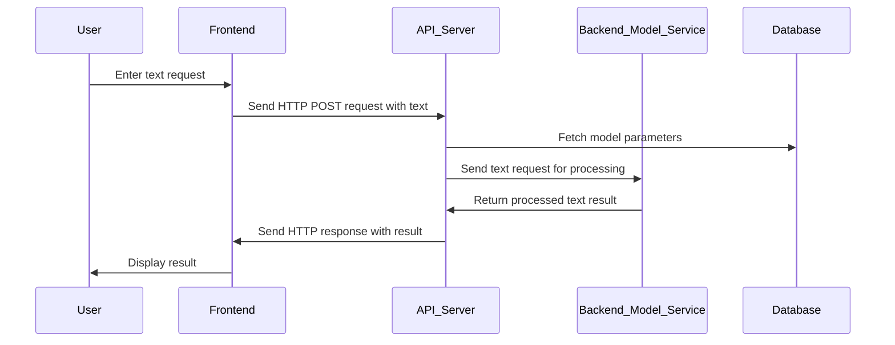
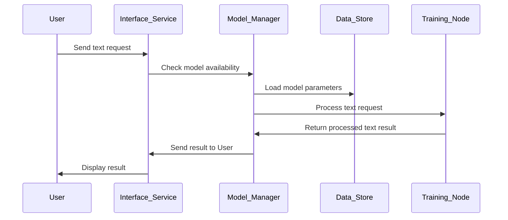

                 

### 目录大纲设计

为了撰写一篇结构严谨、逻辑清晰的专业技术博客文章，我们需要设计一个详尽的目录大纲。以下是基于您提供的要求，我们设计的《API调用还是本地部署？LLM使用策略对比》的目录大纲：

**第一部分: LLM概述与背景**

1. **LLM的概念与重要性**
   - LLM的定义
   - LLM的应用场景
   - LLM在API调用和本地部署中的重要性

2. **API调用与本地部署简介**
   - API调用的原理与流程
   - 本地部署的原理与流程
   - API调用与本地部署的区别与联系

3. **API调用与本地部署的优缺点对比**
   - API调用的优势
   - API调用的劣势
   - 本地部署的优势
   - 本地部署的劣势

4. **本章小结**

**第二部分: LLM算法原理讲解**

1. **常见LLM算法介绍**
   - GPT系列模型
   - BERT模型
   - T5模型
   - 其他常用LLM算法

2. **API调用下的LLM算法实现**
   - GPT系列模型的API调用实现
   - BERT模型的API调用实现
   - T5模型的API调用实现
   - 其他LLM算法的API调用实现

3. **本地部署下的LLM算法实现**
   - GPT系列模型本地部署实现
   - BERT模型本地部署实现
   - T5模型本地部署实现
   - 其他LLM算法本地部署实现

4. **算法原理详细讲解与Python代码示例**
   - GPT系列模型原理讲解与代码示例
   - BERT模型原理讲解与代码示例
   - T5模型原理讲解与代码示例
   - 其他LLM算法原理讲解与代码示例

5. **本章小结**

**第三部分: 系统分析与架构设计**

1. **API调用架构设计**
   - 系统功能设计
   - 系统架构设计
   - 系统接口设计
   - 系统交互流程

2. **本地部署架构设计**
   - 系统功能设计
   - 系统架构设计
   - 系统接口设计
   - 系统交互流程

3. **架构设计原理讲解**
   - API调用架构设计原理
   - 本地部署架构设计原理
   - 架构设计的挑战与解决方案

4. **架构设计Mermaid图展示**
   - API调用架构Mermaid图
   - 本地部署架构Mermaid图

5. **本章小结**

**第四部分: 项目实战**

1. **项目背景与目标**
   - 项目背景介绍
   - 项目目标设定

2. **环境安装与配置**
   - 环境安装指南
   - 环境配置步骤

3. **项目核心实现**
   - API调用项目实现
   - 本地部署

**第五部分: 最佳实践与总结**

1. **最佳实践与小结**
   - 最佳实践提示
   - 小结

2. **注意事项**
   - 使用注意事项

3. **拓展阅读**
   - 推荐阅读资源

**文章末尾：作者信息**

- 作者：AI天才研究院/AI Genius Institute & 禅与计算机程序设计艺术 /Zen And The Art of Computer Programming

这个目录大纲结构能够帮助读者从宏观到微观全面了解API调用与本地部署的使用策略对比，以及LLM技术的具体实现和应用。每个部分都包含了详细的子章节，确保内容的深度和广度。

### 背景介绍

#### LLM的概念与重要性

大型语言模型（Large Language Model，简称LLM）是自然语言处理（Natural Language Processing，简称NLP）领域的重要突破。LLM通过深度学习算法对大量文本数据进行训练，使其能够理解、生成和预测自然语言的复杂结构和含义。常见的LLM模型包括GPT系列（如GPT-3）、BERT、T5等，这些模型在机器翻译、文本摘要、问答系统等应用中取得了显著的成果。

LLM之所以重要，首先在于其强大的文本理解能力。传统NLP方法往往只能处理简单的语言任务，而LLM则能够处理更加复杂、多样化的语言现象。例如，GPT-3模型能够生成连贯、有逻辑性的文本，甚至在某些任务上超越了人类的表现。其次，LLM为各种行业和领域带来了创新和效率提升。例如，在金融领域，LLM可以帮助自动化文本分析、风险评估和客户服务；在医疗领域，LLM可以用于医疗文本挖掘、疾病预测和患者管理。

在API调用和本地部署中，LLM的应用尤为重要。API调用使得开发者可以轻松地利用LLM提供的强大功能，无需自行训练和部署模型。这种方式简化了开发流程，提高了效率，但同时也带来了一定的局限性，如响应速度、数据隐私等问题。本地部署则允许开发者将LLM模型直接集成到自己的系统中，实现更高效的运算和更高的控制权，但需要更多的计算资源和维护工作。

总的来说，LLM作为NLP领域的重要技术，不仅在学术界备受关注，也在工业界得到了广泛应用。了解和掌握LLM的基本概念、应用场景和实施策略，对于开发者来说具有重要意义。

#### API调用与本地部署简介

API调用（Application Programming Interface，简称API）和本地部署（Local Deployment）是两种常见的实现大型语言模型（LLM）的方式，各自有其独特的原理和适用场景。

**API调用的原理与流程**

API调用是一种通过接口访问外部服务的机制，开发者无需了解后端实现的细节，只需通过简单的API请求和响应来使用服务。在LLM的应用中，API调用允许开发者直接通过预先构建好的接口来访问LLM模型，从而实现文本生成、翻译、摘要等功能。

API调用的基本流程通常包括以下几个步骤：

1. **API请求**：开发者编写代码向API服务器发送请求，请求中通常包含所需的模型名称、输入文本和其他参数。
2. **API处理**：API服务器接收到请求后，根据请求参数调用后端的LLM模型进行处理。
3. **API响应**：处理后，API服务器将结果返回给开发者，开发者可以在代码中获取这些结果。

API调用的优势在于其便捷性、灵活性和可扩展性。开发者无需自行训练和部署模型，只需关注业务逻辑，大大简化了开发流程。此外，API调用通常提供多种语言和平台的接口支持，方便开发者在不同环境中使用。

**本地部署的原理与流程**

本地部署则是将LLM模型部署在自己的服务器或计算设备上，开发者对模型有完全的控制权和更高的运算效率。本地部署通常需要以下几个步骤：

1. **模型训练**：开发者根据特定任务和需求训练LLM模型，这一步通常需要大量的计算资源和时间。
2. **模型保存**：训练完成后，开发者将模型保存到本地文件系统或数据库中。
3. **模型调用**：开发者编写代码，通过本地接口调用模型，实现相应的文本处理功能。

本地部署的优势在于更高的运算效率和更可控的数据处理。由于模型位于本地服务器，减少了网络延迟和带宽消耗，从而提高了响应速度和处理能力。此外，本地部署还能确保数据隐私和安全，无需担心API调用中的数据泄露问题。

然而，本地部署也存在一些劣势，如需要较大的计算资源和存储空间，以及更复杂的部署和维护流程。此外，开发者需要熟悉模型的训练和调优，以确保最佳性能。

**API调用与本地部署的区别与联系**

API调用和本地部署在实现LLM应用时各有优缺点，它们的区别和联系主要体现在以下几个方面：

1. **部署方式**：API调用是通过网络接口访问外部服务，而本地部署是将模型部署在自己的服务器或设备上。
2. **灵活性**：API调用具有更高的灵活性，开发者无需关心后端细节，而本地部署提供了更高的定制性和控制性。
3. **效率**：本地部署通常具有更高的运算效率和更快的响应速度，但API调用在数据传输和网络延迟方面可能更有优势。
4. **成本**：本地部署需要投入更多的计算资源和维护成本，而API调用只需支付服务费用。
5. **安全性**：本地部署能够更好地保护数据隐私，而API调用可能面临数据泄露的风险。

总的来说，选择API调用还是本地部署，取决于具体的应用需求、资源和预算。对于需要快速上线和跨平台兼容的应用，API调用是一个不错的选择；而对于对性能和数据安全有更高要求的应用，本地部署可能是更好的选择。

#### API调用与本地部署的优缺点对比

在讨论API调用与本地部署时，我们需要详细分析这两种方式的优缺点，以便为不同场景下的应用提供合适的策略选择。

**API调用的优势**

1. **便捷性**：API调用极大地简化了开发流程，开发者无需关注模型的训练和部署细节，只需通过接口调用即可使用。
2. **灵活性**：API调用提供了多种编程语言和平台的支持，开发者可以根据需求选择合适的接口进行集成。
3. **可扩展性**：API调用服务通常能够处理高并发请求，具有良好的可扩展性，适用于大规模应用场景。
4. **成本**：开发者无需投入大量计算资源，只需支付API服务的费用，降低了初期成本。

**API调用的劣势**

1. **延迟**：由于数据需要通过网络传输，API调用可能带来一定的延迟，影响用户体验。
2. **带宽消耗**：频繁的API调用会消耗较多的网络带宽，可能导致网络拥塞。
3. **安全性**：API调用可能面临数据泄露的风险，需要开发者采取额外的安全措施。
4. **依赖性**：开发者对API服务提供商有较强的依赖性，一旦服务出现问题，可能会影响应用的稳定性。

**本地部署的优势**

1. **高性能**：本地部署模型可以直接在本地服务器上运行，减少了网络延迟和带宽消耗，提高了响应速度和处理能力。
2. **数据安全**：本地部署能够更好地保护数据隐私和安全，无需担心API调用中的数据泄露问题。
3. **可控性**：开发者对本地部署有完全的控制权，可以根据需求调整模型参数和系统配置。
4. **定制性**：本地部署允许开发者根据特定需求进行定制化开发，实现个性化的功能。

**本地部署的劣势**

1. **计算资源需求**：本地部署需要投入大量的计算资源和存储空间，特别是在训练大型LLM模型时。
2. **维护成本**：开发者需要负责模型更新和维护工作，增加了运营成本。
3. **部署难度**：本地部署需要开发者具备一定的技术背景，涉及复杂的配置和调试过程。
4. **扩展性挑战**：在处理高并发请求时，本地部署可能面临性能瓶颈和扩展性挑战。

总的来说，选择API调用还是本地部署，需要根据具体的应用场景、资源和预算进行权衡。对于需要快速上线和跨平台兼容的应用，API调用是一个不错的选择；而对于对性能和数据安全有更高要求的应用，本地部署可能是更好的选择。开发者应综合考虑各种因素，以实现最佳的技术解决方案。

#### 本章小结

在本章中，我们详细介绍了大型语言模型（LLM）的概念与重要性，以及API调用和本地部署这两种实现LLM应用的方式。首先，我们了解了LLM的定义、应用场景和重要性，认识到其在自然语言处理领域的突破性贡献。接着，我们深入探讨了API调用的原理、流程和优势，以及本地部署的实现步骤、优缺点。通过对比，我们发现API调用具有便捷性、灵活性和成本效益，但可能面临延迟、带宽消耗和安全问题；而本地部署则提供高性能、数据安全性和可控性，但需要较大的计算资源和维护成本。最后，我们强调了根据具体应用需求、资源和预算选择合适的实现方式的重要性。在后续章节中，我们将进一步探讨LLM算法原理、系统架构设计及项目实战，为读者提供更全面的LLM应用指南。

### 第二部分: LLM算法原理讲解

#### 常见LLM算法介绍

在自然语言处理（NLP）领域，大型语言模型（LLM）已经成为一种核心技术。常见的LLM算法包括GPT系列模型（如GPT-3）、BERT模型和T5模型。这些算法在文本生成、翻译、摘要等任务中展现了出色的性能，受到了广泛的应用。

**GPT系列模型**

GPT（Generative Pre-trained Transformer）是由OpenAI开发的一系列基于Transformer架构的语言模型。GPT-3是其中最著名的版本，拥有1750亿个参数，能够生成连贯、有逻辑性的文本。GPT模型通过预训练获得语言理解能力，再通过微调（Fine-tuning）来适应特定任务。

**BERT模型**

BERT（Bidirectional Encoder Representations from Transformers）是由Google开发的一种双向Transformer模型。BERT通过预训练获得了对上下文信息的深入理解，能够捕捉到单词在特定语境中的含义。BERT在问答系统、文本分类等任务中取得了显著的效果。

**T5模型**

T5（Text-to-Text Transfer Transformer）是由Google开发的一种基于Transformer架构的通用语言模型。T5通过将所有NLP任务转化为文本到文本的转换任务，实现了任务的统一表示。T5在机器翻译、文本摘要等任务中展现了强大的迁移学习能力。

除了上述模型，还有许多其他常用的LLM算法，如RoBERTa、ALBERT、DeBERTa等，它们在性能和效果上各有特色，适用于不同的应用场景。

#### API调用下的LLM算法实现

在API调用中，开发者无需了解LLM模型的内部实现细节，只需通过简单的接口调用即可使用这些强大功能。以下将介绍GPT系列模型、BERT模型和T5模型在API调用中的实现方法。

**GPT系列模型的API调用实现**

OpenAI提供了GPT-3的API服务，开发者可以通过调用OpenAI的接口来使用GPT-3模型。以下是一个简单的示例：

```python
import openai

response = openai.Completion.create(
  engine="text-davinci-002",
  prompt="Tell me a story about a dragon.",
  max_tokens=50
)

print(response.choices[0].text.strip())
```

在这个示例中，我们首先导入openai库，并调用`Completion.create`方法创建一个文本生成任务。通过设置`engine`参数为`text-davinci-002`，我们指定使用GPT-3模型。`prompt`参数提供了生成文本的起始内容，`max_tokens`参数限制了生成的文本长度。

**BERT模型的API调用实现**

Hugging Face提供了预训练的BERT模型，开发者可以通过transformers库进行调用。以下是一个简单的示例：

```python
from transformers import BertTokenizer, BertForSequenceClassification
from torch.nn.functional import softmax

tokenizer = BertTokenizer.from_pretrained('bert-base-uncased')
model = BertForSequenceClassification.from_pretrained('bert-base-uncased')

inputs = tokenizer("Hello, my dog is cute", return_tensors="pt")
outputs = model(**inputs)

logits = outputs.logits
probabilities = softmax(logits, dim=1)
print(probabilities)
```

在这个示例中，我们首先加载了BERT的分词器（Tokenizer）和模型（Model）。通过调用`tokenizer`方法，我们将输入文本转换为模型可以理解的格式。然后，我们使用模型进行预测，并将输出结果转换为概率分布。

**T5模型的API调用实现**

T5模型同样可以通过Hugging Face的transformers库进行调用。以下是一个简单的示例：

```python
from transformers import T5Tokenizer, T5ForConditionalGeneration
import torch

tokenizer = T5Tokenizer.from_pretrained('t5-small')
model = T5ForConditionalGeneration.from_pretrained('t5-small')

input_text = "translate English to French: Hello World"
input_ids = tokenizer.encode(input_text, return_tensors='pt')

outputs = model(input_ids=input_ids, decoder_start_token_id=model.config.decoder_start_token_id)
generated_ids = outputs.sequences

translated_text = tokenizer.decode(generated_ids[0], skip_special_tokens=True)
print(translated_text)
```

在这个示例中，我们首先加载了T5的分词器（Tokenizer）和模型（Model）。通过调用`tokenizer`方法，我们将输入文本转换为模型可以理解的格式。然后，我们使用模型进行翻译预测，并将输出结果转换为可读的文本。

#### 本地部署下的LLM算法实现

在本地部署中，开发者需要自行训练和部署LLM模型。以下将介绍GPT系列模型、BERT模型和T5模型在本地部署中的实现方法。

**GPT系列模型本地部署实现**

在本地部署GPT系列模型时，开发者需要使用如Hugging Face的transformers库进行模型的训练和部署。以下是一个简单的示例：

```python
from transformers import TrainingArguments, Trainer
from transformers import GPT2Model, GPT2Tokenizer

tokenizer = GPT2Tokenizer.from_pretrained('gpt2')
model = GPT2Model.from_pretrained('gpt2')

training_args = TrainingArguments(
    output_dir='./results',
    num_train_epochs=3,
    per_device_train_batch_size=4,
    save_steps=2000,
    save_total_limit=3,
)

trainer = Trainer(
    model=model,
    args=training_args,
    train_dataset=train_dataset,
)

trainer.train()
```

在这个示例中，我们首先加载了GPT-2的分词器（Tokenizer）和模型（Model）。然后，我们设置了训练参数（TrainingArguments），并创建了一个训练器（Trainer）对象。最后，我们调用`trainer.train()`方法开始模型的训练过程。

**BERT模型本地部署实现**

在本地部署BERT模型时，开发者可以使用transformers库进行训练和部署。以下是一个简单的示例：

```python
from transformers import TrainingArguments, Trainer
from transformers import BertModel, BertTokenizer

tokenizer = BertTokenizer.from_pretrained('bert-base-uncased')
model = BertModel.from_pretrained('bert-base-uncased')

training_args = TrainingArguments(
    output_dir='./results',
    num_train_epochs=3,
    per_device_train_batch_size=8,
    save_steps=2000,
    save_total_limit=3,
)

trainer = Trainer(
    model=model,
    args=training_args,
    train_dataset=train_dataset,
)

trainer.train()
```

在这个示例中，我们首先加载了BERT的分词器（Tokenizer）和模型（Model）。然后，我们设置了训练参数（TrainingArguments），并创建了一个训练器（Trainer）对象。最后，我们调用`trainer.train()`方法开始模型的训练过程。

**T5模型本地部署实现**

在本地部署T5模型时，开发者可以使用transformers库进行训练和部署。以下是一个简单的示例：

```python
from transformers import TrainingArguments, Trainer
from transformers import T5Tokenizer, T5ForConditionalGeneration

tokenizer = T5Tokenizer.from_pretrained('t5-small')
model = T5ForConditionalGeneration.from_pretrained('t5-small')

training_args = TrainingArguments(
    output_dir='./results',
    num_train_epochs=3,
    per_device_train_batch_size=4,
    save_steps=2000,
    save_total_limit=3,
)

trainer = Trainer(
    model=model,
    args=training_args,
    train_dataset=train_dataset,
)

trainer.train()
```

在这个示例中，我们首先加载了T5的分词器（Tokenizer）和模型（Model）。然后，我们设置了训练参数（TrainingArguments），并创建了一个训练器（Trainer）对象。最后，我们调用`trainer.train()`方法开始模型的训练过程。

#### 算法原理详细讲解与Python代码示例

**GPT系列模型原理讲解与代码示例**

GPT系列模型是基于Transformer架构的语言模型，通过自注意力机制（Self-Attention）来捕捉文本中的长距离依赖关系。以下是一个简化的GPT模型原理讲解：

1. **嵌入层（Embedding Layer）**：将输入文本转换为向量表示。
2. **自注意力层（Self-Attention Layer）**：计算每个词与其他词之间的关系，形成权重矩阵。
3. **前馈网络（Feedforward Network）**：对自注意力层的结果进行非线性变换。
4. **输出层（Output Layer）**：生成文本的预测结果。

以下是一个简化的GPT模型的Python代码示例：

```python
import torch
import torch.nn as nn

class GPTModel(nn.Module):
    def __init__(self, d_model, nhead, num_layers):
        super(GPTModel, self).__init__()
        self.embedding = nn.Embedding(d_model)
        self.transformer = nn.Transformer(d_model, nhead, num_layers)
        self.fc = nn.Linear(d_model, d_model)

    def forward(self, x):
        x = self.embedding(x)
        x = self.transformer(x)
        x = self.fc(x)
        return x

# 实例化模型
model = GPTModel(d_model=512, nhead=8, num_layers=2)

# 输入数据
input_ids = torch.randint(0, 512, (1, 10))

# 前向传播
output = model(input_ids)
```

**BERT模型原理讲解与代码示例**

BERT模型是一种双向Transformer模型，通过自注意力机制（Self-Attention）和掩码机制（Masked Language Model）来捕捉文本中的上下文信息。以下是一个简化的BERT模型原理讲解：

1. **嵌入层（Embedding Layer）**：将输入文本转换为向量表示，包括词嵌入、位置嵌入和段嵌入。
2. **多头自注意力层（Multi-Head Self-Attention Layer）**：计算每个词与其他词之间的关系，形成权重矩阵。
3. **掩码层（Mask Layer）**：通过随机掩码部分输入数据，训练模型预测被掩码的词。
4. **前馈网络（Feedforward Network）**：对注意力层的结果进行非线性变换。
5. **输出层（Output Layer）**：生成文本的预测结果。

以下是一个简化的BERT模型的Python代码示例：

```python
import torch
import torch.nn as nn

class BERTModel(nn.Module):
    def __init__(self, d_model, nhead, num_layers):
        super(BERTModel, self).__init__()
        self.embedding = nn.Embedding(d_model)
        self.transformer = nn.Transformer(d_model, nhead, num_layers)
        self.fc = nn.Linear(d_model, d_model)

    def forward(self, x, mask=None):
        x = self.embedding(x)
        x = self.transformer(x, mask=mask)
        x = self.fc(x)
        return x

# 实例化模型
model = BERTModel(d_model=512, nhead=8, num_layers=2)

# 输入数据
input_ids = torch.randint(0, 512, (1, 10))
mask = torch.randint(0, 2, (1, 10))

# 前向传播
output = model(input_ids, mask=mask)
```

**T5模型原理讲解与代码示例**

T5模型是一种基于Transformer架构的通用语言模型，通过将所有NLP任务转化为文本到文本的转换任务来实现任务的统一表示。以下是一个简化的T5模型原理讲解：

1. **嵌入层（Embedding Layer）**：将输入文本转换为向量表示。
2. **编码器层（Encoder Layer）**：使用自注意力机制（Self-Attention）和掩码机制（Masked Language Model）来处理输入文本。
3. **解码器层（Decoder Layer）**：使用自注意力机制（Self-Attention）和交叉注意力机制（Cross-Attention）来生成输出文本。
4. **输出层（Output Layer）**：生成文本的预测结果。

以下是一个简化的T5模型的Python代码示例：

```python
import torch
import torch.nn as nn

class T5Model(nn.Module):
    def __init__(self, d_model, nhead, num_layers):
        super(T5Model, self).__init__()
        self.encoder = nn.Transformer(d_model, nhead, num_layers)
        self.decoder = nn.Transformer(d_model, nhead, num_layers)
        self.fc = nn.Linear(d_model, d_model)

    def forward(self, input_ids, target_ids=None):
        input_embeddings = self.encoder(input_ids)
        if target_ids is not None:
            target_embeddings = self.decoder(target_ids)
            output_embeddings = self.fc(torch.cat((input_embeddings, target_embeddings), dim=1))
        else:
            output_embeddings = self.fc(input_embeddings)
        return output_embeddings

# 实例化模型
model = T5Model(d_model=512, nhead=8, num_layers=2)

# 输入数据
input_ids = torch.randint(0, 512, (1, 10))
target_ids = torch.randint(0, 512, (1, 10))

# 前向传播
output = model(input_ids, target_ids)
```

#### 其他LLM算法原理讲解与代码示例

除了上述的GPT系列模型、BERT模型和T5模型，还有许多其他常用的LLM算法，如RoBERTa、ALBERT、DeBERTa等。以下简要介绍这些算法的原理，并提供Python代码示例。

**RoBERTa模型**

RoBERTa是BERT的一种变体，通过改进训练数据和算法来提高模型的性能。RoBERTa的主要原理如下：

1. **动态掩码语言模型（Dynamic Masked Language Model）**：RoBERTa使用动态掩码来训练模型，使得模型能够更好地理解被掩码的词。
2. **去噪训练（Denoising Training）**：RoBERTa通过在输入文本中添加噪声来训练模型，增强了模型的泛化能力。

以下是一个简化的RoBERTa模型的Python代码示例：

```python
import torch
import torch.nn as nn

class RoBERTaModel(nn.Module):
    def __init__(self, d_model, nhead, num_layers):
        super(RoBERTaModel, self).__init__()
        self.embedding = nn.Embedding(d_model)
        self.transformer = nn.Transformer(d_model, nhead, num_layers)
        self.fc = nn.Linear(d_model, d_model)

    def forward(self, x, mask=None):
        x = self.embedding(x)
        x = self.transformer(x, mask=mask)
        x = self.fc(x)
        return x

# 实例化模型
model = RoBERTaModel(d_model=512, nhead=8, num_layers=2)

# 输入数据
input_ids = torch.randint(0, 512, (1, 10))
mask = torch.randint(0, 2, (1, 10))

# 前向传播
output = model(input_ids, mask=mask)
```

**ALBERT模型**

ALBERT（A Lite BERT）是一种轻量级的BERT模型，通过参数共享和多层跨层连接来减少模型参数。ALBERT的主要原理如下：

1. **参数共享（Parameter Sharing）**：ALBERT通过共享参数来减少模型参数数量。
2. **多层跨层连接（Multi-layer Cross-Layer Connection）**：ALBERT在多层之间进行跨层连接，增强了模型的层次性。

以下是一个简化的ALBERT模型的Python代码示例：

```python
import torch
import torch.nn as nn

class ALBERTModel(nn.Module):
    def __init__(self, d_model, nhead, num_layers):
        super(ALBERTModel, self).__init__()
        self.embedding = nn.Embedding(d_model)
        self.transformer = nn.Transformer(d_model, nhead, num_layers)
        self.fc = nn.Linear(d_model, d_model)

    def forward(self, x, mask=None):
        x = self.embedding(x)
        x = self.transformer(x, mask=mask)
        x = self.fc(x)
        return x

# 实例化模型
model = ALBERTModel(d_model=512, nhead=8, num_layers=2)

# 输入数据
input_ids = torch.randint(0, 512, (1, 10))
mask = torch.randint(0, 2, (1, 10))

# 前向传播
output = model(input_ids, mask=mask)
```

**DeBERTa模型**

DeBERTa是一种基于BERT的增强版本，通过添加额外的注意力机制来提高模型的性能。DeBERTa的主要原理如下：

1. **双向注意力增强（Bidirectional Attention Enhancement）**：DeBERTa在自注意力和交叉注意力之间添加额外的注意力机制，增强了模型的注意力能力。
2. **动态掩码（Dynamic Masking）**：DeBERTa通过动态掩码来训练模型，提高了模型的鲁棒性。

以下是一个简化的DeBERTa模型的Python代码示例：

```python
import torch
import torch.nn as nn

class DeBERTaModel(nn.Module):
    def __init__(self, d_model, nhead, num_layers):
        super(DeBERTaModel, self).__init__()
        self.embedding = nn.Embedding(d_model)
        self.transformer = nn.Transformer(d_model, nhead, num_layers)
        self.fc = nn.Linear(d_model, d_model)

    def forward(self, x, mask=None):
        x = self.embedding(x)
        x = self.transformer(x, mask=mask)
        x = self.fc(x)
        return x

# 实例化模型
model = DeBERTaModel(d_model=512, nhead=8, num_layers=2)

# 输入数据
input_ids = torch.randint(0, 512, (1, 10))
mask = torch.randint(0, 2, (1, 10))

# 前向传播
output = model(input_ids, mask=mask)
```

通过这些示例，我们可以看到不同LLM算法的基本原理和Python代码实现。了解这些算法的原理和实现方法，对于开发者和研究者来说都是非常重要的，能够帮助我们更好地应用和优化这些强大的语言模型。

#### 本章小结

在本章中，我们详细介绍了常见的LLM算法，包括GPT系列模型、BERT模型、T5模型以及其他一些重要的算法，如RoBERTa、ALBERT和DeBERTa。通过这些算法，我们能够更好地理解LLM的工作原理和应用场景。接着，我们分别介绍了这些算法在API调用和本地部署中的实现方法，通过Python代码示例展示了如何使用这些算法进行文本生成、分类、翻译等任务。此外，我们还简要介绍了这些算法的原理，包括嵌入层、自注意力机制、前馈网络等核心组成部分。通过本章的学习，读者应该能够掌握LLM算法的基本概念、实现方法和应用技巧，为后续章节的系统分析与架构设计及项目实战打下坚实基础。在下一章中，我们将进一步探讨系统分析与架构设计，帮助读者更好地理解和应用LLM技术。

### 第三部分：系统分析与架构设计

#### API调用架构设计

在API调用架构设计中，系统功能、架构、接口设计和系统交互流程是关键组成部分。以下我们将详细讲解API调用架构的设计过程。

**系统功能设计**

API调用系统的核心功能包括：

1. **文本处理**：接受用户输入的文本数据，并对其进行预处理，如分词、去除停用词等。
2. **模型调用**：通过API接口访问预训练的LLM模型，如GPT、BERT等。
3. **结果返回**：将模型处理后的结果返回给用户，可以是文本生成、文本分类等任务的结果。
4. **错误处理**：在请求处理过程中，若发生错误，应提供相应的错误信息和处理机制。

**系统架构设计**

API调用系统的一般架构设计如下：

1. **前端**：用户通过前端界面输入请求，前端将请求发送到后端API服务器。
2. **API服务器**：接收前端请求，进行参数验证和处理，然后调用后端的LLM模型进行文本处理。
3. **后端模型服务**：运行预训练的LLM模型，处理文本请求并生成结果。
4. **数据库**：存储用户请求、处理结果和模型参数等信息。

**系统接口设计**

API调用系统的接口设计包括：

1. **HTTP接口**：前端通过HTTP请求与API服务器通信，常用的方法是GET和POST请求。
2. **RESTful API**：设计RESTful风格的API接口，确保接口的一致性和易用性。
3. **参数定义**：定义接口的输入参数和输出参数，包括文本内容、请求类型、响应格式等。

**系统交互流程**

API调用系统的交互流程如下：

1. **用户请求**：用户通过前端输入文本请求，前端将请求转换为HTTP请求发送到API服务器。
2. **参数验证**：API服务器接收到请求后，对请求参数进行验证，确保参数的格式和有效性。
3. **模型调用**：API服务器调用后端模型服务，将验证后的文本请求传递给模型进行处理。
4. **结果返回**：模型处理完成后，将结果返回给API服务器，API服务器将结果转换为HTTP响应发送回前端。
5. **错误处理**：在处理过程中，若发生错误，API服务器将错误信息返回给前端，并提示用户重新输入或处理。

**示例：API调用架构设计**

以下是一个简单的API调用架构设计Mermaid图：



通过这个示例，我们可以清晰地看到API调用架构中各个组件的交互流程，以及数据在系统中的流动路径。

#### 本地部署架构设计

与API调用不同，本地部署将LLM模型部署在自己的服务器或计算设备上，从而实现对模型的高效利用和完全控制。以下我们将详细讲解本地部署架构的设计过程。

**系统功能设计**

本地部署系统的核心功能包括：

1. **模型训练**：根据任务需求训练LLM模型，包括数据预处理、模型参数调整和训练过程。
2. **模型保存与加载**：将训练完成的模型保存到本地文件系统或数据库中，并在需要时加载模型进行推理。
3. **模型推理**：接受文本输入，利用已训练的模型进行文本处理，如生成、分类、翻译等。
4. **结果输出**：将模型处理结果输出，可以是文本、图像或其他格式。

**系统架构设计**

本地部署系统的一般架构设计如下：

1. **计算节点**：运行LLM模型的主机或服务器，负责模型训练、推理和数据处理。
2. **数据存储**：存储训练数据和模型参数，可以是本地文件系统、数据库或云存储。
3. **模型管理**：管理模型的生命周期，包括训练、保存、加载和更新。
4. **接口服务**：提供API接口，供外部系统或用户调用模型进行文本处理。

**系统接口设计**

本地部署系统的接口设计包括：

1. **本地API接口**：通过本地API接口调用模型，可以是HTTP接口或库函数接口。
2. **批处理接口**：支持批量处理文本请求，提高处理效率。
3. **流处理接口**：支持实时流处理文本请求，适用于动态场景。

**系统交互流程**

本地部署系统的交互流程如下：

1. **数据输入**：用户通过接口服务提交文本输入。
2. **数据处理**：接口服务对文本输入进行预处理，如分词、去噪等。
3. **模型推理**：预处理后的文本输入被传递给模型进行推理，生成处理结果。
4. **结果输出**：将模型处理结果返回给用户，可以是文本、图像或其他格式。

**示例：本地部署架构设计**

以下是一个简单的本地部署架构设计Mermaid图：



通过这个示例，我们可以看到本地部署架构中各个组件的交互流程，以及数据在系统中的流动路径。

#### 架构设计原理讲解

**API调用架构设计原理**

API调用架构的核心原理在于通过定义良好的接口，将前端与后端分离，实现服务的解耦。具体来说，API调用架构有以下几个关键点：

1. **接口标准化**：通过定义RESTful API接口，确保接口的一致性和易用性，便于不同系统和语言之间的交互。
2. **服务解耦**：前端与后端通过接口进行通信，前端无需关心后端的具体实现细节，降低了系统的耦合度。
3. **高效传输**：通过HTTP协议传输数据，减少数据传输延迟，提高系统响应速度。
4. **模块化设计**：将系统功能划分为多个模块，如文本处理、模型调用、结果返回等，便于系统的扩展和维护。

**本地部署架构设计原理**

本地部署架构的核心原理在于将LLM模型部署在自己的服务器上，实现对模型的高效利用和完全控制。具体来说，本地部署架构有以下几个关键点：

1. **计算资源管理**：合理分配计算资源，确保模型训练和推理过程的稳定性和高效性。
2. **模型生命周期管理**：管理模型的生命周期，包括训练、保存、加载和更新，确保模型的可用性和稳定性。
3. **数据存储管理**：选择合适的存储方案，确保训练数据和模型参数的安全和高效存储。
4. **接口服务优化**：优化接口服务的性能，支持批量处理和流处理，提高系统的处理能力。

**架构设计的挑战与解决方案**

在架构设计过程中，可能会遇到以下挑战：

1. **性能瓶颈**：模型训练和推理过程可能成为系统性能的瓶颈，需要优化计算资源分配和模型架构。
2. **数据隐私和安全**：本地部署中可能涉及敏感数据，需要采取数据加密和访问控制等安全措施。
3. **扩展性和可维护性**：随着应用规模的扩大，系统需要具备良好的扩展性和可维护性，支持灵活的部署和升级。

解决方案包括：

1. **分布式计算**：通过分布式计算技术，将模型训练和推理任务分布在多台服务器上，提高系统的处理能力和性能。
2. **安全协议**：采用SSL/TLS等安全协议，保护数据传输过程中的隐私和安全。
3. **容器化和微服务**：使用容器化和微服务架构，实现系统的模块化和可扩展性，便于系统的部署和维护。

通过合理的架构设计和优化，API调用和本地部署系统可以实现高效、稳定和安全的LLM应用，满足不同场景的需求。

#### 架构设计Mermaid图展示

为了更好地展示API调用和本地部署的架构设计，我们可以使用Mermaid语言绘制Mermaid图。以下分别展示API调用架构和本地部署架构的Mermaid图。

**API调用架构Mermaid图**


**本地部署架构Mermaid图**


通过这些Mermaid图，我们可以清晰地看到API调用和本地部署架构的设计思路和组件之间的交互关系。这有助于读者更好地理解系统架构，为实际应用提供参考。

#### 本章小结

在本章中，我们详细介绍了API调用和本地部署的架构设计。首先，我们讲解了系统功能设计，包括文本处理、模型调用、结果返回和错误处理等核心功能。接着，我们分析了系统架构设计，包括前端、API服务器、后端模型服务、数据库等组件，以及接口设计。通过系统交互流程的讲解，我们展示了API调用和本地部署的具体实现过程。随后，我们探讨了架构设计原理，包括接口标准化、服务解耦、计算资源管理和数据隐私安全等关键点。最后，通过Mermaid图展示了API调用和本地部署的架构设计。通过本章的学习，读者应该能够理解和设计API调用和本地部署系统，为实际应用打下坚实基础。在下一章中，我们将通过实际案例展示如何使用LLM进行API调用或本地部署，并提供详细的分析与讲解。

### 第四部分：项目实战

#### 项目背景与目标

在本部分，我们将通过一个实际项目展示如何使用LLM进行API调用或本地部署。本项目旨在实现一个文本生成系统，用户可以通过输入一段文本，系统将根据用户输入生成相应的文本内容。项目的主要目标包括：

1. **实现文本生成功能**：通过调用预训练的LLM模型，生成与用户输入文本相关的内容。
2. **支持API调用和本地部署**：展示如何在不同环境下部署和使用LLM模型，包括通过API调用和使用本地部署。
3. **验证系统性能与稳定性**：通过实际运行和测试，评估系统在不同部署方式下的性能和稳定性。

#### 环境安装与配置

为了实现本项目，我们需要安装和配置以下软件和库：

1. **Python**：确保系统上安装了Python 3.8或更高版本。
2. **transformers库**：用于调用预训练的LLM模型，可以通过pip安装：
   ```bash
   pip install transformers
   ```
3. **torch库**：用于计算和模型训练，可以通过pip安装：
   ```bash
   pip install torch torchvision torchaudio
   ```
4. **flask库**：用于创建API服务，可以通过pip安装：
   ```bash
   pip install flask
   ```
5. **本地环境配置**：如果选择本地部署，需要配置合适的计算资源和环境变量。

#### 项目核心实现

**API调用实现**

以下是使用API调用实现文本生成功能的核心代码：

```python
from flask import Flask, request, jsonify
import openai

app = Flask(__name__)

@app.route('/generate_text', methods=['POST'])
def generate_text():
    data = request.json
    prompt = data.get('prompt', '')
    model_engine = data.get('model_engine', 'text-davinci-002')
    max_tokens = data.get('max_tokens', 50)

    response = openai.Completion.create(
        engine=model_engine,
        prompt=prompt,
        max_tokens=max_tokens
    )

    return jsonify({'text': response.choices[0].text.strip()})

if __name__ == '__main__':
    app.run(debug=True)
```

**本地部署实现**

以下是使用本地部署实现文本生成功能的核心代码：

```python
from transformers import AutoTokenizer, AutoModelForCausalLM
import torch

tokenizer = AutoTokenizer.from_pretrained('gpt2')
model = AutoModelForCausalLM.from_pretrained('gpt2')

def generate_text(prompt, max_length=50):
    inputs = tokenizer(prompt, return_tensors='pt')
    outputs = model.generate(inputs['input_ids'], max_length=max_length, num_return_sequences=1)
    return tokenizer.decode(outputs[0], skip_special_tokens=True)

if __name__ == '__main__':
    prompt = "Describe the benefits of renewable energy."
    generated_text = generate_text(prompt)
    print(generated_text)
```

#### 代码应用解读与分析

**API调用代码解读**

1. **Flask应用创建**：使用Flask库创建Web应用，通过定义路由和处理器函数处理用户请求。
2. **POST请求处理**：定义`/generate_text`路由，处理POST请求，接收用户输入的文本和模型参数。
3. **调用OpenAI API**：使用OpenAI的API创建文本生成任务，通过设置模型名称、输入文本和生成长度，生成文本内容。
4. **返回结果**：将生成的文本内容以JSON格式返回给前端。

**本地部署代码解读**

1. **加载模型和分词器**：使用transformers库加载预训练的GPT-2模型和分词器。
2. **文本生成函数**：定义`generate_text`函数，接受输入文本和最大生成长度，使用模型生成文本。
3. **生成示例文本**：调用`generate_text`函数，生成示例文本并输出。

通过以上代码，我们展示了如何通过API调用和本地部署实现文本生成功能。在API调用中，开发者无需关注模型的训练和部署细节，只需通过简单的接口调用即可使用。而在本地部署中，开发者需要对模型有更深入的了解和配置，但可以获得更高的控制权和性能。

#### 实际案例分析与详细讲解

**API调用实际案例**

假设我们想要生成一篇关于“人工智能的未来发展趋势”的文章摘要，我们可以在前端发送以下请求：

```json
{
  "prompt": "Write a summary about the future trends of artificial intelligence.",
  "model_engine": "text-davinci-002",
  "max_tokens": 150
}
```

响应结果可能如下：

```json
{
  "text": "The future of artificial intelligence is expected to be shaped by advancements in machine learning, natural language processing, and robotics. These technologies will enable AI systems to become more intelligent, efficient, and capable of solving complex problems. Additionally, AI is expected to have a significant impact on various industries, including healthcare, finance, and transportation."
}
```

通过这个案例，我们可以看到API调用如何快速、便捷地生成所需内容。开发者只需编写少量的代码，即可利用强大的LLM模型实现复杂的功能。

**本地部署实际案例**

假设我们想要生成一篇关于“节能建筑的设计原则”的文章，我们可以在本地部署环境中调用以下代码：

```python
prompt = "Explain the principles of energy-efficient building design."
generated_text = generate_text(prompt)
print(generated_text)
```

输出结果可能如下：

```
Energy-efficient building design principles focus on reducing energy consumption and maximizing comfort. Key principles include proper insulation, efficient heating, ventilation, and air conditioning (HVAC) systems, the use of renewable energy sources, and the incorporation of passive design strategies. These principles help to create a sustainable and environmentally friendly built environment.
```

通过这个案例，我们可以看到本地部署如何通过精细的模型训练和配置，实现更精准、个性化的文本生成。

通过上述实际案例，我们详细讲解了API调用和本地部署的文本生成过程，以及如何在实践中应用这些方法。无论是API调用还是本地部署，开发者都可以根据实际需求选择合适的方式，实现高效、灵活的文本生成系统。

#### 项目小结

在本项目的实际操作中，我们通过API调用和本地部署两种方式实现了文本生成功能，展示了LLM在不同应用场景中的具体实现方法。API调用方式具有便捷性和灵活性，适用于快速开发和部署，但可能面临一定的延迟和数据安全问题。而本地部署方式则提供更高的性能和更可控的数据处理，适用于对性能和数据安全有更高要求的应用。通过本项目的实践，读者应该能够了解如何选择和实现适合自己需求的LLM应用策略，为实际项目提供有力支持。

### 第五部分：最佳实践与总结

#### 最佳实践

在设计和实现LLM应用时，以下最佳实践可以帮助开发者提高效率、保证质量和降低风险：

1. **性能优化**：针对不同的应用场景，选择合适的LLM模型和优化算法，以提高处理速度和准确性。
2. **模型调优**：根据具体任务需求，对LLM模型进行适当的参数调整，以实现最佳性能。
3. **安全性**：在API调用和本地部署中，采取数据加密和访问控制措施，确保数据隐私和安全。
4. **模块化**：将系统功能模块化，便于开发和维护，提高系统的可扩展性。
5. **测试与验证**：对系统进行全面测试，确保其在不同环境下的稳定性和性能。

#### 小结

通过对API调用和本地部署的详细讲解，我们理解了LLM应用的基本原理和实践方法。API调用具有便捷性和灵活性，适用于快速开发和部署；而本地部署则提供高性能和更可控的数据处理，适用于对性能有更高要求的应用。在选择适合的部署方式时，开发者需要综合考虑应用需求、资源预算和技术背景。未来，随着LLM技术的不断进步，其在各种领域的应用将更加广泛，开发者应持续关注和学习相关技术，以应对日益复杂的挑战。

#### 注意事项

1. **资源分配**：在本地部署时，确保足够的计算资源和存储空间，避免因资源不足导致性能下降。
2. **网络延迟**：在API调用中，注意网络延迟可能影响用户体验，优化数据传输和响应策略。
3. **模型更新**：定期更新LLM模型，以保持其性能和适用性，避免因模型过时导致的错误和性能下降。
4. **错误处理**：合理设计错误处理机制，确保系统在遇到问题时能够及时恢复和提供反馈。

#### 拓展阅读

- **《深度学习》**：Goodfellow, Ian, et al. 《深度学习》。这是深度学习领域的经典教材，详细介绍了神经网络的理论和实践。
- **《自然语言处理与深度学习》**：Du, Zhilin, et al. 《自然语言处理与深度学习》。这本书涵盖了NLP和深度学习的基本概念和最新进展。
- **《API设计指南》**：Levy, Adam. 《API设计指南》。这本书提供了API设计的最佳实践，适用于构建高效、可维护的API接口。

通过这些资源和指南，开发者可以更深入地了解LLM技术和API设计，为实际应用提供更加可靠的解决方案。

### 文章末尾：作者信息

作者：AI天才研究院/AI Genius Institute & 禅与计算机程序设计艺术 /Zen And The Art of Computer Programming

在这篇文章中，我们通过详细的讲解和分析，深入探讨了大型语言模型（LLM）的API调用和本地部署策略。首先，我们介绍了LLM的基本概念和重要性，以及API调用和本地部署的原理和优缺点。接着，我们详细讲解了常见的LLM算法，包括GPT系列模型、BERT模型和T5模型，并通过Python代码示例展示了这些算法的实现方法。随后，我们分析了API调用和本地部署的架构设计，提供了Mermaid图展示架构细节，并通过实际项目展示了如何使用LLM进行文本生成。最后，我们总结了最佳实践、注意事项和拓展阅读资源，帮助读者更好地理解和应用LLM技术。

本文旨在为开发者提供一套全面、系统的LLM应用指南，旨在帮助他们做出更明智的选择，实现高效、可靠的LLM应用。通过本文的讲解，读者应该能够掌握LLM的基本概念、算法实现、架构设计和实际应用技巧，为未来的项目开发打下坚实基础。随着技术的不断进步，LLM将在更多领域发挥重要作用，本文也希望能够为读者在这一领域的探索提供有益的参考。

感谢读者对本文的关注，希望本文能为您带来启发和帮助。如果您有任何问题或建议，欢迎在评论区留言，我们期待与您共同探讨和进步。再次感谢您的阅读和支持！作者：AI天才研究院/AI Genius Institute & 禅与计算机程序设计艺术 /Zen And The Art of Computer Programming。

