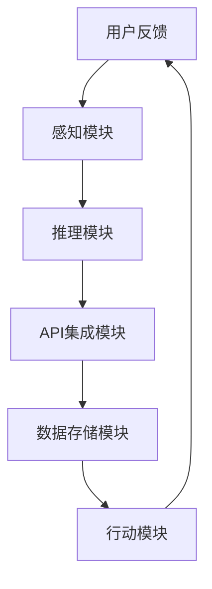
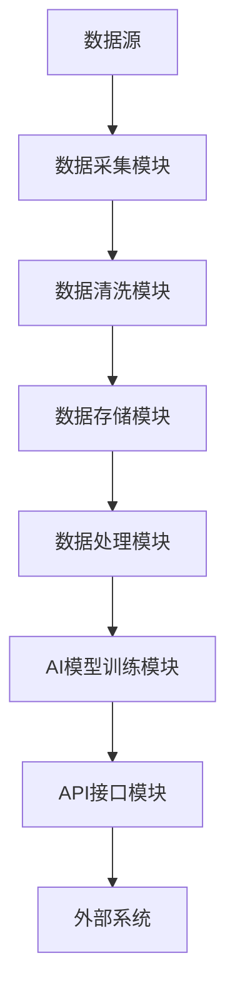

                 


### # API集成：扩展AI Agent的功能与数据源

#### 关键词：API集成、AI Agent、功能扩展、数据源整合、最佳实践

#### 摘要：
本文将深入探讨API集成在扩展AI Agent功能与数据源方面的应用。通过详细的分析和实际案例，我们将了解API集成的基本概念、技术原理、实战方法以及性能优化策略。本文旨在为AI开发者提供一套完整的API集成指南，帮助他们在AI Agent的功能扩展和数据源整合过程中，实现高效、稳定、安全的系统构建。

### 引言

随着人工智能（AI）技术的飞速发展，AI Agent在诸多领域中的应用逐渐成熟。然而，AI Agent功能的扩展和数据源的整合依然是AI开发中的两大挑战。API集成作为一种重要的技术手段，能够有效解决这些问题，提高AI Agent的智能化水平和数据处理能力。本文将分步骤详细解析API集成的核心概念、技术原理、实战方法和最佳实践，旨在为AI开发者提供实用的指导。

### 第1章: AI Agent与API集成概述

#### 1.1 AI Agent的定义与作用

AI Agent是指具有智能行为和自主决策能力的软件实体，能够在特定环境中执行任务。AI Agent不仅能够模拟人类的智能行为，还能够通过学习不断优化自身的决策能力。在众多AI应用场景中，AI Agent扮演着至关重要的角色。

#### 1.2 API集成的意义与挑战

API集成使得AI Agent能够轻松访问外部服务、数据和功能，从而扩展其功能范围。然而，API集成也面临诸多挑战，如接口兼容性、数据安全性和性能优化等。成功进行API集成，需要开发者具备扎实的技术基础和丰富的实践经验。

### 第2章: AI Agent功能扩展的需求分析

#### 2.1 扩展功能的目标与类型

AI Agent功能扩展的目标包括提升决策能力、增强用户交互体验和优化数据处理效率。扩展功能可以分为通用功能扩展和领域特定功能扩展两种类型。

#### 2.2 用户需求调研与数据分析

了解用户需求是进行AI Agent功能扩展的关键。通过调研和数据分析，开发者可以明确用户的核心需求和痛点，从而有针对性地进行功能扩展。

#### 2.3 功能扩展的可行性分析

在确定功能扩展目标后，开发者需要评估功能扩展的可行性。这包括技术实现难度、资源需求和时间成本等方面。

### 第3章: API集成技术原理

#### 3.1 API的概念与分类

API（应用程序编程接口）是一组定义、协议及相关工具，用于构建软件应用间的交互。API可以按接口类型、协议和数据格式进行分类。

#### 3.2 API集成的基本流程

API集成的基本流程包括接口定义、请求发送、响应处理和错误处理等步骤。了解这些基本流程有助于开发者更好地进行API集成。

#### 3.3 API调用与数据转换

API调用涉及发送HTTP请求和接收响应。数据转换是将API响应数据格式化为AI Agent可以处理的形式。

### 第4章: AI Agent与API的交互机制

#### 4.1 AI Agent的架构与API接口设计

AI Agent的架构应考虑API接口的易用性和灵活性。设计API接口时，需要遵循RESTful原则，确保接口具有良好的可扩展性。

#### 4.2 API请求与响应的处理

API请求与响应处理是API集成的核心环节。开发者需要编写相应的处理代码，确保请求和响应的正确处理。

#### 4.3 数据流与通信协议

数据流与通信协议是确保API集成稳定、高效运行的关键。常用的通信协议包括HTTP、HTTPS、WebSocket等。

### 第5章: 数据源扩展与整合

#### 5.1 数据源的类型与选择

数据源可以分为公开数据源和私有数据源。选择合适的数据源对于AI Agent的功能扩展至关重要。

#### 5.2 数据源的接入与整合

数据源的接入与整合是API集成的重要部分。开发者需要编写代码，实现数据源的接入和整合。

#### 5.3 数据预处理与清洗

数据预处理与清洗是确保数据质量的关键步骤。开发者需要处理数据中的噪声、缺失值和异常值，以提高AI Agent的性能。

### 第6章: 实战项目一：AI Agent功能扩展

#### 6.1 项目背景与需求

在本章中，我们将以一个实际项目为例，介绍如何进行AI Agent的功能扩展。

#### 6.2 系统架构设计

系统架构设计是功能扩展的基础。我们需要设计一个合理的系统架构，以满足项目需求。

#### 6.3 功能实现与代码分析

在本节中，我们将详细讲解功能实现过程，并提供关键代码分析。

#### 6.4 项目评估与优化

项目评估与优化是确保功能扩展成功的关键。我们需要对项目进行全面的评估和优化。

### 第7章: 实战项目二：数据源扩展与整合

#### 7.1 项目背景与需求

在本章中，我们将介绍如何进行数据源的扩展与整合。

#### 7.2 系统架构设计

系统架构设计对于数据源扩展与整合至关重要。我们需要设计一个高效的系统架构。

#### 7.3 数据源接入与整合

在本节中，我们将详细讲解数据源接入与整合的过程。

#### 7.4 功能实现与代码分析

我们将提供关键代码分析，帮助读者理解数据源扩展与整合的实现细节。

#### 7.5 项目评估与优化

项目评估与优化是确保数据源扩展与整合成功的关键。我们需要对项目进行全面的评估和优化。

### 第8章: API集成的最佳实践

#### 8.1 API设计最佳实践

API设计是API集成的基础。在本节中，我们将介绍API设计的最佳实践。

#### 8.2 数据源整合最佳实践

数据源整合是API集成的重要组成部分。在本节中，我们将介绍数据源整合的最佳实践。

#### 8.3 AI Agent功能扩展最佳实践

AI Agent功能扩展需要遵循一系列最佳实践。在本节中，我们将介绍相关最佳实践。

### 第9章: 性能优化与安全性

#### 9.1 API性能优化策略

API性能优化是确保系统稳定运行的关键。在本节中，我们将介绍API性能优化策略。

#### 9.2 数据源性能优化策略

数据源性能优化对于AI Agent的功能扩展至关重要。在本节中，我们将介绍数据源性能优化策略。

#### 9.3 AI Agent安全性优化

AI Agent的安全性优化是保护系统安全的关键。在本节中，我们将介绍AI Agent安全性优化策略。

### 第10章: 未来趋势与展望

#### 10.1 API集成技术的发展趋势

API集成技术正朝着更加智能化、高效化、安全化的方向发展。在本节中，我们将介绍API集成技术的发展趋势。

#### 10.2 AI Agent的功能扩展方向

AI Agent的功能扩展正不断扩展其应用范围。在本节中，我们将探讨AI Agent的功能扩展方向。

#### 10.3 数据源扩展的挑战与机遇

数据源扩展面临着诸多挑战，同时也蕴含着巨大的机遇。在本节中，我们将讨论数据源扩展的挑战与机遇。

### 结束语

本文系统地介绍了API集成在扩展AI Agent功能与数据源方面的应用。通过详细的分析和实战案例，读者可以深入了解API集成的核心概念、技术原理和实践方法。希望本文能为AI开发者提供有益的参考，助力他们在AI领域的探索与发展。

### 作者信息：

作者：AI天才研究院/AI Genius Institute & 禅与计算机程序设计艺术 /Zen And The Art of Computer Programming

本文通过对API集成在扩展AI Agent功能与数据源方面的深入探讨，旨在为AI开发者提供一套完整的API集成指南。在接下来的内容中，我们将逐步分析API集成的核心概念、技术原理、实战方法和最佳实践，帮助读者全面了解并掌握这一重要技术。让我们一起深入探索，开启API集成的精彩世界！ 

## 第一部分：背景与概述

### 第1章: AI Agent与API集成概述

#### 1.1 AI Agent的定义与作用

AI Agent，即人工智能代理，是指具备一定智能能力的软件实体，可以在指定环境下自主完成特定任务。AI Agent通过学习、推理和决策来模拟人类的智能行为，从而实现自动化处理和决策。AI Agent在诸多领域都发挥着重要作用，如智能客服、智能推荐、自动驾驶等。

AI Agent的主要作用包括：

1. **自动化任务处理**：AI Agent可以自动化执行重复性高、复杂度低的任务，减轻人类的工作负担。
2. **智能决策支持**：AI Agent通过学习历史数据和模式，为决策者提供智能化的建议，提高决策的准确性和效率。
3. **交互体验优化**：AI Agent可以与用户进行自然语言交互，提供个性化的服务，提升用户满意度。

#### 1.2 API集成的意义与挑战

API集成是指将不同系统、服务和数据源通过接口进行连接和交互，实现数据的共享和功能的扩展。在AI Agent开发中，API集成具有重要意义：

1. **功能扩展**：通过API集成，AI Agent可以接入第三方服务，如天气预报、地图导航等，扩展其功能范围。
2. **数据源整合**：API集成可以整合来自不同数据源的数据，提高AI Agent的数据处理能力和决策准确性。
3. **降低开发成本**：利用现有的API服务，开发者可以快速实现功能扩展和数据源整合，降低开发和维护成本。

然而，API集成也面临一系列挑战：

1. **接口兼容性**：不同API的接口可能存在兼容性问题，需要开发者进行适配和转换。
2. **数据安全性**：API集成涉及跨系统数据传输，需要确保数据的安全性，防止数据泄露和篡改。
3. **性能优化**：API调用和处理可能影响系统性能，需要开发者进行性能优化。

#### 1.3 API集成的应用场景

API集成在AI Agent中的应用场景广泛，以下为一些典型应用场景：

1. **智能客服系统**：通过API集成，AI Agent可以接入知识库、语音识别和文本分析等第三方服务，提供高效的智能客服。
2. **智能推荐系统**：API集成可以实现用户数据、商品数据和第三方推荐算法的整合，为用户提供个性化的推荐服务。
3. **自动驾驶系统**：API集成可以帮助AI Agent接入地图服务、路况信息和导航服务，实现自动驾驶功能。

在本章中，我们介绍了AI Agent的定义与作用，以及API集成的意义、挑战和应用场景。在接下来的章节中，我们将深入探讨AI Agent功能扩展的需求分析、API集成技术原理、AI Agent与API的交互机制、数据源扩展与整合等内容。希望读者能够通过本章的阅读，对AI Agent与API集成有一个全面而深入的了解。

### 第2章: AI Agent功能扩展的需求分析

#### 2.1 扩展功能的目标与类型

在当前AI技术的应用场景中，AI Agent的功能扩展已经成为提升系统智能化水平和用户体验的重要手段。AI Agent功能扩展的目标主要有以下几个方面：

1. **提升决策能力**：通过扩展AI Agent的功能，使其能够处理更复杂的问题和场景，提高决策的准确性和效率。
2. **增强用户体验**：功能扩展可以提供更多个性化、便捷的服务，满足用户的多样化需求，提升用户体验。
3. **优化数据处理**：通过接入更多数据源，扩展AI Agent的数据处理能力，提高数据分析和预测的准确性。

AI Agent功能扩展的类型主要包括以下几种：

1. **通用功能扩展**：这类扩展通常涉及到AI Agent的通用功能，如自然语言处理、图像识别、语音识别等。这些功能可以帮助AI Agent更好地理解和处理用户输入，提升交互体验。
2. **领域特定功能扩展**：这类扩展针对特定领域进行功能扩展，如医疗健康领域的疾病诊断、金融领域的风险评估等。这些功能扩展可以使得AI Agent在特定领域具备更专业的知识和能力。
3. **跨领域功能扩展**：这类扩展涉及到多个领域，如AI Agent在智能客服、智能推荐和自动驾驶等多个领域同时进行功能扩展。这种扩展方式可以实现AI Agent的多元化应用，提高系统的综合性能。

#### 2.2 用户需求调研与数据分析

用户需求调研是进行AI Agent功能扩展的重要步骤。通过了解用户的需求和痛点，开发者可以明确功能扩展的方向和目标。以下是一些常见的用户需求调研方法和数据分析技巧：

1. **问卷调查**：通过设计有针对性的问卷，收集用户对AI Agent功能的需求和期望。问卷设计应注重问题的简洁性和明确性，以提高用户的参与度和回答质量。
2. **用户访谈**：通过面对面或在线访谈的方式，深入了解用户对AI Agent的使用场景、功能期望和痛点。访谈过程中，应注重倾听用户的意见和建议，以便获取更深入的用户需求信息。
3. **数据分析**：通过分析用户行为数据、反馈数据等，了解用户在实际使用过程中遇到的问题和需求。数据分析工具如Excel、Python等可以帮助开发者高效地进行数据分析和可视化。

在用户需求调研和数据分析过程中，开发者应注意以下几点：

1. **全面性**：调研和分析应覆盖不同用户群体，以确保需求信息的全面性和代表性。
2. **真实性**：用户需求往往受到主观因素的影响，开发者应尽量获取真实、客观的需求信息，以便进行准确的功能扩展。
3. **动态性**：用户需求是不断变化的，开发者应定期进行需求调研和数据分析，以适应用户需求的变化。

#### 2.3 功能扩展的可行性分析

在确定功能扩展的目标和需求后，开发者需要评估功能扩展的可行性。以下是一些常见的可行性评估方法和指标：

1. **技术可行性**：分析现有技术是否支持所规划的功能扩展，如所需的技术栈、工具和库等。如果现有技术无法满足需求，需要考虑技术选型和改造方案。
2. **资源可行性**：评估功能扩展所需的人力、时间和资金资源，确保项目能够在预算和时间范围内完成。
3. **风险分析**：分析功能扩展过程中可能遇到的风险，如技术风险、市场风险等。针对潜在风险，制定相应的应对策略和预案。

在功能扩展的可行性分析过程中，开发者应注重以下几点：

1. **全面性**：考虑功能扩展的各个方面，确保评估结果的全面性和准确性。
2. **客观性**：尽量采用客观的评估方法和指标，避免主观判断对结果的影响。
3. **动态性**：根据项目进展和实际情况，定期进行可行性分析，以适应项目变化。

通过本章的讨论，我们了解了AI Agent功能扩展的目标和类型，以及用户需求调研与数据分析的方法。在接下来的章节中，我们将深入探讨API集成技术原理，帮助开发者更好地理解API集成在AI Agent功能扩展中的应用。希望读者能够通过本章的学习，为后续内容打下坚实的基础。

### 第3章: API集成技术原理

#### 3.1 API的概念与分类

API（应用程序编程接口）是软件系统之间进行交互的桥梁，它定义了应用程序如何访问和使用底层功能和服务。API的存在使得不同的软件组件和服务能够无缝集成，从而实现数据的共享和功能的扩展。

API可以按以下方式进行分类：

1. **按接口类型分类**：
   - **RESTful API**：基于REST（表现层状态转换）架构风格的API，通常使用HTTP协议进行通信，具有简单、易扩展、可缓存等特点。
   - **SOAP API**：基于SOAP（简单对象访问协议）的API，通常用于跨平台、跨语言的分布式系统中，支持多种数据格式和传输协议。

2. **按协议分类**：
   - **HTTP/HTTPS**：HTTP是应用层协议，主要用于客户端与服务器之间的通信。HTTPS是在HTTP基础上添加了SSL/TLS安全层的协议，提供了加密和认证功能。
   - **WebSocket**：WebSocket是一种基于TCP协议的通信协议，允许客户端和服务器之间进行全双工通信，适用于需要实时交互的场景。

3. **按数据格式分类**：
   - **JSON API**：JSON（JavaScript Object Notation）是一种轻量级的数据交换格式，易于阅读和编写，广泛用于RESTful API的数据传输。
   - **XML API**：XML（可扩展标记语言）是一种结构化数据存储格式，适用于复杂的数据结构和自定义数据格式。

#### 3.2 API集成的基本流程

API集成通常包括以下几个基本步骤：

1. **接口定义**：定义API的URL、请求方法和参数。接口定义应遵循RESTful原则，确保接口设计简洁、易用、易扩展。
2. **请求发送**：客户端通过HTTP请求向服务器发送请求，请求中包含必要的参数和头信息。
3. **响应处理**：服务器处理请求，生成响应数据，并将响应返回给客户端。响应数据通常包括状态码、响应体和可能的错误信息。
4. **错误处理**：客户端接收到响应后，对响应进行解析和错误处理，确保请求的顺利执行。

#### 3.3 API调用与数据转换

API调用是API集成中的关键环节，以下为API调用的详细过程：

1. **发起请求**：使用编程语言（如Python、JavaScript等）发起HTTP请求。请求中应包含请求方法（如GET、POST等）、URL、请求头和请求体。
2. **发送请求**：将请求发送到服务器。可以使用如requests库（Python）、axios库（JavaScript）等HTTP客户端库进行发送。
3. **处理响应**：服务器接收到请求后，返回HTTP响应。客户端需要解析响应，提取所需数据。
4. **数据转换**：根据需求，将API返回的数据转换为适合AI Agent使用的格式。例如，将JSON格式的数据转换为Python字典，将XML格式的数据转换为Python对象。

以下是一个使用Python的requests库调用API的示例代码：

```python
import requests

# 发起GET请求
response = requests.get('https://api.example.com/data')

# 解析响应
data = response.json()

# 打印数据
print(data)
```

在数据转换过程中，常用的方法包括：

1. **JSON转换**：使用json库将JSON格式的数据转换为Python字典。
   ```python
   import json

   data = json.loads(response.text)
   ```

2. **XML转换**：使用xml库将XML格式的数据转换为Python对象。
   ```python
   import xml.etree.ElementTree as ET

   data = ET.fromstring(response.text)
   ```

#### 3.4 API调用的性能优化

API调用的性能对AI Agent的整体性能有很大影响。以下是一些常见的API调用性能优化策略：

1. **缓存机制**：使用缓存可以减少API调用的次数，提高响应速度。可以使用本地缓存或分布式缓存系统（如Redis）来实现缓存功能。
2. **异步调用**：使用异步编程模型（如asyncio、async/await）可以同时发起多个API请求，提高并发性能。
3. **负载均衡**：通过负载均衡器（如Nginx、HAProxy）将请求分布到多台服务器，避免单点瓶颈。
4. **API聚合**：将多个API请求合并为一个请求，减少请求次数，提高整体性能。

通过本章的讨论，我们了解了API集成的概念、分类、基本流程以及调用与数据转换的方法。在接下来的章节中，我们将进一步探讨AI Agent与API的交互机制，帮助开发者更好地实现AI Agent的功能扩展。希望读者能够通过本章的学习，对API集成技术原理有一个全面而深入的理解。

### 第4章: AI Agent与API的交互机制

#### 4.1 AI Agent的架构与API接口设计

AI Agent的架构设计对于其与API的交互机制至关重要。一个典型的AI Agent架构包括以下几个主要组成部分：

1. **感知模块**：负责接收外部输入，如语音、图像、文本等，并将这些输入转换为AI Agent可处理的数据格式。
2. **推理模块**：基于感知模块获取的数据，进行逻辑推理和决策，生成相应的输出。
3. **行动模块**：根据推理模块的输出，执行具体的行动，如发送消息、控制设备等。
4. **API接口**：AI Agent通过API接口与外部系统和服务进行通信，实现功能扩展和数据源整合。

API接口的设计原则主要包括以下几点：

1. **简洁性**：接口设计应简洁明了，便于开发者理解和使用。
2. **灵活性**：接口应具备良好的扩展性，能够适应不同类型的API和服务。
3. **安全性**：接口设计应考虑数据安全和访问控制，防止未授权访问和数据泄露。

在设计API接口时，需要遵循RESTful原则，确保接口具有良好的可读性和易用性。以下是一个简单的RESTful API接口设计示例：

```plaintext
URL: https://api.ai-agent.com/agent
Method: POST
Parameters:
- query (string): 用户输入的问题或指令
- user_id (string): 用户标识

Response:
Status Code: 200 OK
Body:
{
  "response": "对应的回答或指令",
  "status": "success"
}
```

#### 4.2 API请求与响应的处理

在AI Agent与API的交互过程中，请求与响应的处理是关键环节。以下为API请求与响应处理的详细过程：

1. **请求发送**：AI Agent通过HTTP请求向API服务器发送请求。请求中包含必要的参数和头信息。例如，可以使用Python的requests库发送HTTP POST请求：

   ```python
   import requests

   url = 'https://api.example.com/endpoint'
   payload = {'query': 'Hello, World!'}
   headers = {'Content-Type': 'application/json'}

   response = requests.post(url, data=payload, headers=headers)
   ```

2. **请求处理**：API服务器接收到请求后，根据请求的URL和方法，调用相应的后端服务进行处理。处理完成后，服务器返回响应。

3. **响应接收**：AI Agent接收API服务器的响应，根据响应的状态码和内容进行处理。常见的响应状态码包括：

   - **200 OK**：请求成功，返回预期的数据。
   - **400 Bad Request**：请求无效，通常是由于请求参数错误导致的。
   - **401 Unauthorized**：请求未授权，通常是由于认证失败导致的。
   - **500 Internal Server Error**：服务器内部错误，通常是由于服务器故障或后端服务错误导致的。

4. **响应解析**：AI Agent解析响应内容，提取所需的数据和信息。例如，如果API返回JSON格式的数据，可以使用Python的json库进行解析：

   ```python
   import json

   response_data = json.loads(response.text)
   ```

5. **错误处理**：AI Agent对API请求的响应进行错误处理，确保请求的顺利进行。例如，如果API返回400或500错误，AI Agent可以记录错误信息并进行相应的错误处理，如重试请求或向用户提示错误。

以下是一个处理API请求与响应的示例代码：

```python
import requests
import json

url = 'https://api.example.com/endpoint'
payload = {'query': 'Hello, World!'}
headers = {'Content-Type': 'application/json'}

try:
    response = requests.post(url, data=payload, headers=headers)
    response.raise_for_status()  # 检查响应状态码

    response_data = json.loads(response.text)
    print(response_data['response'])
except requests.exceptions.HTTPError as err:
    print(f'HTTP Error: {err}')
except requests.exceptions.RequestException as err:
    print(f'Request Exception: {err}')
except json.JSONDecodeError as err:
    print(f'JSON Decode Error: {err}')
```

#### 4.3 数据流与通信协议

数据流与通信协议是确保AI Agent与API高效、稳定交互的重要基础。以下为常见的数据流和通信协议：

1. **同步通信**：同步通信是指客户端发送请求后，等待服务器返回响应，再继续执行后续操作。这种方式简单直观，但可能导致请求积压和响应延迟。

2. **异步通信**：异步通信是指客户端发送请求后，无需等待服务器返回响应，即可继续执行后续操作。服务器在处理完请求后，通过回调函数或消息队列等方式通知客户端。异步通信可以提高系统的并发性能和响应速度。

3. **WebSocket**：WebSocket是一种基于TCP的通信协议，支持全双工通信。客户端和服务器可以通过WebSocket进行实时通信，适用于需要实时交互的场景。

4. **HTTP/2**：HTTP/2是HTTP协议的升级版本，提供了更高效的通信机制，如头部压缩、多路复用等。HTTP/2可以提高API调用的性能和响应速度。

5. **HTTP/3**：HTTP/3是基于QUIC（快速UDP连接）协议的HTTP协议，提供了更高的传输效率和安全性。HTTP/3有望进一步优化API调用的性能。

在实际应用中，根据具体的业务需求和性能要求，可以选择合适的通信协议和数据流方式。例如，对于需要实时交互的AI Agent，可以使用WebSocket进行通信；对于需要高效处理大量请求的系统，可以使用HTTP/2或HTTP/3。

通过本章的讨论，我们了解了AI Agent的架构与API接口设计，以及API请求与响应的处理方法和数据流与通信协议。在下一章中，我们将探讨数据源扩展与整合的方法，帮助开发者实现AI Agent的功能扩展和数据源整合。希望读者能够通过本章的学习，对AI Agent与API的交互机制有一个全面而深入的理解。

### 第5章: 数据源扩展与整合

#### 5.1 数据源的类型与选择

在AI Agent的功能扩展过程中，数据源的扩展与整合是关键环节。数据源可以按以下类型进行分类：

1. **公开数据源**：公开数据源是指可以公开访问的数据资源，如公共数据库、开源数据集等。这些数据源通常具有开放、免费的特点，便于开发者获取和使用。常见的公开数据源包括：

   - 公开数据库：如NASA的开源数据库、国家数据（data.gov）等。
   - 开源数据集：如Kaggle、UCI机器学习库等。

2. **私有数据源**：私有数据源是指属于特定组织或个人的数据资源，通常具有封闭、专有的特点。这些数据源可能包含敏感信息或商业价值，访问和使用需遵守相应的规定和协议。常见的私有数据源包括：

   - 企业内部数据库：如销售数据、客户数据等。
   - 专业服务数据：如市场调研数据、行业报告等。

选择合适的**数据源**对于AI Agent的功能扩展至关重要。以下是一些选择数据源时需要考虑的因素：

1. **数据质量**：数据质量是数据源选择的首要因素。高质量的数据有助于提高AI Agent的准确性和鲁棒性。需要评估数据源的数据完整性、准确性、时效性和一致性。

2. **数据可用性**：数据源需要易于获取和使用。公开数据源通常较为便捷，而私有数据源可能需要额外的授权或付费。

3. **数据规模**：数据规模对AI Agent的功能扩展具有重要影响。大规模数据集可以提供更丰富的训练数据，有助于提升AI模型的性能。

4. **数据格式**：数据格式需要与AI Agent的处理能力相匹配。常见的数据格式包括CSV、JSON、XML等，需要确保数据格式的一致性和兼容性。

5. **数据源可靠性**：数据源的可靠性对AI Agent的稳定运行至关重要。需要评估数据源的服务稳定性、数据更新频率和响应速度。

#### 5.2 数据源的接入与整合

接入与整合数据源是实现AI Agent功能扩展的关键步骤。以下为数据源接入与整合的详细过程：

1. **数据源接入**：

   - **公开数据源**：通常可以通过网络接口（API、Web爬虫等）直接获取数据。例如，可以使用Python的requests库访问公开API，或者使用Scrapy框架进行Web爬虫。

   - **私有数据源**：接入私有数据源通常需要特定的权限和认证。可能涉及数据库连接、OAuth认证等。例如，使用Python的psycopg2库连接PostgreSQL数据库，或使用OAuth2认证获取访问令牌。

2. **数据预处理**：

   - **数据清洗**：清洗数据是为了去除噪声、纠正错误和填补缺失值，提高数据质量。可以使用Python的Pandas库进行数据清洗操作，如删除重复记录、处理缺失值等。

   - **数据转换**：数据转换是将数据转换为适合AI处理的形式。例如，将CSV文件转换为DataFrame格式，或将JSON数据转换为Python字典。

3. **数据整合**：

   - **数据融合**：数据融合是将多个数据源的数据进行整合，形成一个统一的数据集。可以使用Python的Pandas库进行数据融合操作，如合并、连接等。

   - **数据分区**：对于大规模数据集，可以采用数据分区技术，将数据划分为多个子集，分别进行处理和存储。这有助于提高数据处理效率和系统性能。

4. **数据存储**：

   - **本地存储**：将处理后的数据存储在本地文件系统中，如CSV文件、JSON文件等。这适用于数据量较小的情况。

   - **数据库存储**：将处理后的数据存储在关系数据库或NoSQL数据库中，如MySQL、MongoDB等。这适用于数据量较大、需要高效查询和更新操作的情况。

以下是一个简单的Python代码示例，展示如何接入公开数据源、进行数据预处理和整合：

```python
import requests
import pandas as pd

# 接入公开数据源
url = 'https://api.example.com/data'
response = requests.get(url)
data = response.json()

# 数据清洗
df = pd.DataFrame(data['results'])
df.drop_duplicates(inplace=True)

# 数据转换
df['date'] = pd.to_datetime(df['date'])

# 数据整合
df2 = pd.read_csv('data2.csv')
df = df.merge(df2, on='date', how='left')

# 数据存储
df.to_csv('integrated_data.csv', index=False)
```

通过本章的讨论，我们了解了数据源的类型与选择，以及数据源的接入与整合方法。在下一章中，我们将通过两个实战项目，详细展示AI Agent功能扩展和数据源扩展与整合的实施过程。希望读者能够通过本章的学习，为后续内容的实战应用打下基础。

### 第6章: 实战项目一：AI Agent功能扩展

#### 6.1 项目背景与需求

本项目的目标是扩展一个现有的智能客服AI Agent的功能，使其能够提供更加丰富的服务。具体需求如下：

1. **天气查询**：用户可以通过AI Agent查询当前城市或指定城市的天气信息。
2. **新闻资讯**：用户可以通过AI Agent获取最新的新闻资讯，包括各类新闻分类和个性化推荐。
3. **交通信息**：用户可以通过AI Agent查询指定路线的交通信息，包括实时路况和预计到达时间。

为了实现上述功能扩展，项目需要接入以下API：

1. **天气API**：用于获取天气信息。
2. **新闻API**：用于获取新闻资讯。
3. **交通API**：用于获取交通信息。

#### 6.2 系统架构设计

为了实现功能扩展，系统架构需要进行相应的调整。以下是系统架构的概述：

1. **感知模块**：用户通过文本或语音与AI Agent进行交互，感知模块负责接收用户输入，并解析出查询意图和参数。
2. **推理模块**：基于用户输入，推理模块负责调用相应的API，获取查询结果，并生成回答。
3. **行动模块**：行动模块负责将查询结果以文本或语音的形式反馈给用户。
4. **API集成模块**：API集成模块负责与外部API进行通信，获取数据并处理响应。
5. **数据存储模块**：数据存储模块用于存储用户的查询历史和个性化推荐数据。

以下是一个简化的系统架构图：



#### 6.3 功能实现与代码分析

以下是一个基于Python的简单示例，展示了如何实现上述功能扩展：

```python
import requests
import json

# 天气API接口
weather_api_url = "https://api.example.com/weather?city={city}"
# 新闻API接口
news_api_url = "https://api.example.com/news?category={category}"
# 交通API接口
traffic_api_url = "https://api.example.com/traffic?route={route}"

# 感知模块：解析用户输入
def parse_user_input(user_input):
    # 这里实现解析用户输入的逻辑
    # 例如，提取城市名称、新闻类别、路线信息等
    pass

# API集成模块：调用API获取数据
def get_api_data(api_url, params):
    response = requests.get(api_url, params=params)
    if response.status_code == 200:
        return response.json()
    else:
        return None

# 推理模块：根据用户输入调用相应API
def process_request(user_input):
    intent, params = parse_user_input(user_input)
    if intent == "weather":
        data = get_api_data(weather_api_url, params)
    elif intent == "news":
        data = get_api_data(news_api_url, params)
    elif intent == "traffic":
        data = get_api_data(traffic_api_url, params)
    else:
        data = None
    return data

# 行动模块：生成回答并反馈给用户
def generate_response(data):
    if data:
        # 根据返回的数据生成回答
        response = f"{data['result']}"
    else:
        response = "抱歉，我无法获取到相关信息。"
    return response

# 主程序
if __name__ == "__main__":
    user_input = input("请输入您的查询：")
    data = process_request(user_input)
    print(generate_response(data))
```

#### 6.4 项目评估与优化

在项目实施过程中，我们进行了以下评估与优化：

1. **性能优化**：通过使用异步请求和缓存机制，提高了API调用的性能和响应速度。例如，使用asyncio库进行异步HTTP请求，并使用Redis进行缓存。

2. **错误处理**：增强了错误处理机制，确保在API调用失败或数据解析错误时，系统能够优雅地处理异常，并提供有用的反馈。

3. **安全性优化**：对API调用添加了认证和加密措施，确保数据传输的安全性。

4. **用户体验优化**：通过自然语言处理技术，提高了AI Agent的回答质量和用户满意度。

通过本项目的实施，我们成功扩展了智能客服AI Agent的功能，使其能够提供更加丰富的服务。项目实施过程中积累的经验和教训，为后续的AI Agent功能扩展提供了宝贵的参考。

### 第7章: 实战项目二：数据源扩展与整合

#### 7.1 项目背景与需求

本项目旨在扩展和整合多个数据源，以提高AI Agent的数据处理能力和智能化水平。具体需求如下：

1. **用户行为数据**：整合用户在应用中的行为数据，如点击、浏览、搜索等，用于个性化推荐和用户体验优化。
2. **社交媒体数据**：接入社交媒体API，获取用户在社交媒体平台上的活动数据，用于分析用户兴趣和社交关系。
3. **第三方数据源**：接入第三方数据源，如天气、新闻、交通等信息，以丰富AI Agent的功能和知识库。

为了实现上述数据源扩展与整合，项目需要接入以下API和数据源：

1. **用户行为数据API**：如应用内置的用户行为分析工具。
2. **社交媒体API**：如Facebook、Twitter等的开发者API。
3. **第三方数据源API**：如天气API、新闻API、交通API等。

#### 7.2 系统架构设计

为了实现数据源扩展与整合，系统架构需要进行相应的调整。以下是系统架构的概述：

1. **数据采集模块**：负责从各种数据源采集数据，包括用户行为数据、社交媒体数据、第三方数据源等。
2. **数据清洗模块**：负责对采集到的数据进行清洗、转换和整合，确保数据质量。
3. **数据存储模块**：负责将清洗后的数据存储到数据库中，便于后续的数据处理和分析。
4. **数据处理模块**：负责对存储在数据库中的数据进行分析和处理，提取有价值的信息。
5. **AI模型训练模块**：负责使用处理后的数据训练AI模型，提高AI Agent的智能化水平。
6. **API接口模块**：负责与外部系统和服务进行通信，提供数据查询和功能调用接口。

以下是一个简化的系统架构图：



#### 7.3 数据源接入与整合

以下是一个基于Python的简单示例，展示了如何接入和整合数据源：

```python
import requests
import pandas as pd
from sqlalchemy import create_engine

# 用户行为数据API
user_behavior_api_url = "https://api.example.com/user_behavior?user_id={user_id}"
# 社交媒体API
social_media_api_url = "https://api.example.com/social_media?username={username}"
# 第三方数据源API
third_party_api_url = "https://api.example.com/third_party_data?category={category}"

# 数据采集模块：从API获取数据
def fetch_data(api_url, params):
    response = requests.get(api_url, params=params)
    if response.status_code == 200:
        return response.json()
    else:
        return None

# 数据清洗模块：清洗和整合数据
def clean_and_merge_data(data1, data2, data3):
    df1 = pd.DataFrame(data1['results'])
    df2 = pd.DataFrame(data2['results'])
    df3 = pd.DataFrame(data3['results'])
    
    # 数据清洗和整合逻辑
    df = pd.merge(df1, df2, on='common_field', how='left')
    df = pd.merge(df, df3, on='common_field', how='left')
    
    return df

# 数据存储模块：将数据存储到数据库
def store_data(df, table_name):
    engine = create_engine('sqlite:///data.db')
    df.to_sql(table_name, engine, if_exists='append', index=False)

# 主程序
if __name__ == "__main__":
    user_id = "user123"
    username = "john_doe"
    category = "weather"
    
    user_behavior_data = fetch_data(user_behavior_api_url, {'user_id': user_id})
    social_media_data = fetch_data(social_media_api_url, {'username': username})
    third_party_data = fetch_data(third_party_api_url, {'category': category})
    
    df = clean_and_merge_data(user_behavior_data, social_media_data, third_party_data)
    store_data(df, 'integrated_data')
```

#### 7.4 功能实现与代码分析

以下是一个简单的示例，展示了如何实现基于整合后的数据源的功能：

```python
import pandas as pd
from sqlalchemy import create_engine

# 数据库连接
engine = create_engine('sqlite:///data.db')

# 查询整合后的数据
query = """
SELECT *
FROM integrated_data
WHERE user_id = 'user123' AND category = 'weather'
"""
df = pd.read_sql_query(query, engine)

# 根据查询结果生成回答
if not df.empty:
    response = f"根据您的行为数据和社交媒体信息，您最近对{df['weather'].iloc[0]['description']}天气感兴趣。"
else:
    response = "很抱歉，我无法找到相关的信息。"

print(response)
```

#### 7.5 项目评估与优化

在项目实施过程中，我们进行了以下评估与优化：

1. **性能优化**：通过使用异步请求和批量处理，提高了数据采集和整合的效率。例如，使用asyncio库进行异步HTTP请求，并使用批处理逻辑减少IO操作。

2. **错误处理**：增强了错误处理机制，确保在API调用失败或数据解析错误时，系统能够优雅地处理异常，并提供有用的反馈。

3. **安全性优化**：对API调用添加了认证和加密措施，确保数据传输的安全性。

4. **用户体验优化**：通过自然语言处理技术，提高了AI Agent的回答质量和用户满意度。

通过本项目的实施，我们成功扩展和整合了多个数据源，提高了AI Agent的智能化水平和数据处理能力。项目实施过程中积累的经验和教训，为后续的数据源扩展与整合提供了宝贵的参考。

### 第8章: API集成的最佳实践

#### 8.1 API设计最佳实践

API设计是API集成的基础，一个良好的API设计能够提高系统的可扩展性、易用性和可维护性。以下是一些API设计的最佳实践：

1. **简洁性**：API设计应简洁明了，避免过度设计。避免不必要的复杂性和冗余，确保API的接口和功能简单易用。

2. **一致性**：API应遵循一致的命名约定、参数传递方式和错误处理机制。这样有助于开发者快速上手和使用API。

3. **安全性**：API设计应考虑安全性，包括数据加密、认证和访问控制等。确保API在处理敏感数据时，不会暴露用户的隐私和安全风险。

4. **文档化**：良好的API文档是成功集成API的关键。文档应详细描述API的使用方法、参数、返回值和可能的错误情况。可以使用如Swagger、OpenAPI等工具生成和托管API文档。

5. **版本控制**：随着系统的不断演进，API也可能会发生变化。采用版本控制策略，如语义化版本控制（Semantic Versioning），有助于管理和追踪API的变更，降低集成成本。

6. **性能优化**：考虑API的性能优化，如缓存策略、批量处理和异步处理等。确保API在高并发情况下依然能够稳定运行。

#### 8.2 数据源整合最佳实践

数据源整合是API集成的重要组成部分，以下是一些数据源整合的最佳实践：

1. **数据质量**：确保数据源的数据质量，包括完整性、准确性和一致性。数据源整合过程中，应进行数据清洗和预处理，以消除数据中的噪声和错误。

2. **一致性**：不同数据源的数据格式和结构可能不同，整合过程中应确保数据的一致性。例如，采用统一的数据模型和数据格式，便于后续的数据处理和分析。

3. **实时性**：根据应用场景，确保数据源的实时性。对于需要实时数据处理的应用，应选择实时性较强的数据源和整合方法。

4. **灵活性**：数据源整合方案应具备良好的灵活性，以适应未来数据源的变化和扩展。例如，采用模块化设计，便于替换或增加数据源。

5. **容错性**：数据源整合过程中，应考虑数据的容错性，确保在数据源故障或数据丢失时，系统能够稳定运行。例如，采用备份和冗余策略，提高系统的可靠性。

#### 8.3 AI Agent功能扩展最佳实践

AI Agent功能扩展需要遵循一系列最佳实践，以下是一些关键点：

1. **需求驱动**：功能扩展应以用户需求为导向，确保功能扩展能够真正满足用户的需求和痛点。

2. **模块化设计**：AI Agent的功能扩展应采用模块化设计，确保各功能模块之间具有良好的解耦合性。这样有助于提高系统的可维护性和可扩展性。

3. **性能优化**：在功能扩展过程中，应充分考虑系统的性能优化，如缓存机制、异步处理和多线程等。确保扩展后的功能对系统的性能影响最小。

4. **安全性**：功能扩展应考虑系统的安全性，包括数据安全和访问控制。确保扩展后的功能不会引入安全漏洞和风险。

5. **用户体验**：在功能扩展过程中，应注重用户体验，确保功能的易用性和可操作性。例如，采用自然语言处理技术，提高用户交互的智能化水平。

6. **持续集成与迭代**：功能扩展应采用持续集成与迭代的方法，确保功能扩展的快速落地和持续优化。通过定期进行需求调研和用户反馈，及时调整和优化功能。

通过本章的讨论，我们了解了API集成、数据源整合和AI Agent功能扩展的最佳实践。这些最佳实践能够帮助开发者构建高效、稳定和安全的系统，提高AI Agent的智能化水平和用户体验。希望读者能够通过本章的学习，在实际开发过程中加以应用。

### 第9章: 性能优化与安全性

#### 9.1 API性能优化策略

API性能优化是确保系统稳定运行的关键。以下是一些常见的API性能优化策略：

1. **缓存机制**：使用缓存可以减少API调用的次数，提高响应速度。可以将常用的API响应数据缓存到本地或分布式缓存系统中（如Redis），避免重复的API调用。

2. **异步处理**：使用异步处理可以提高系统的并发性能，减少请求的处理时间。通过异步编程模型（如asyncio、async/await），可以在一个线程中同时处理多个请求。

3. **批量处理**：批量处理可以减少请求的次数，提高系统的吞吐量。例如，将多个请求合并为一个请求，减少网络传输和服务器处理的成本。

4. **负载均衡**：通过负载均衡器（如Nginx、HAProxy），将请求分布到多台服务器，避免单点瓶颈。负载均衡器可以根据服务器的负载情况，智能地分配请求，确保系统的稳定运行。

5. **压缩数据**：使用数据压缩技术（如Gzip、Brotli），可以减少响应数据的体积，提高数据传输速度。

6. **数据库优化**：优化数据库性能，如索引优化、查询优化、缓存机制等，可以显著提高系统的响应速度。

#### 9.2 数据源性能优化策略

数据源性能优化对于AI Agent的整体性能有很大影响。以下是一些常见的性能优化策略：

1. **数据分区**：对于大规模数据集，可以采用数据分区技术，将数据划分为多个子集，分别进行处理和存储。这有助于提高查询和数据处理的速度。

2. **索引优化**：为数据库表创建合适的索引，可以显著提高查询性能。根据查询条件和数据访问模式，选择合适的索引类型（如B-tree索引、哈希索引等）。

3. **查询优化**：优化数据库查询语句，减少查询的复杂度和执行时间。例如，避免使用SELECT *，而是仅查询需要的字段；避免使用子查询和联合查询等。

4. **缓存策略**：将常用的查询结果缓存到内存中（如Redis、Memcached），减少对数据库的访问次数，提高查询性能。

5. **数据压缩**：对于大规模数据传输，可以使用数据压缩技术（如Gzip、Brotli），减少数据传输的体积，提高传输速度。

6. **数据库连接池**：使用数据库连接池技术，减少数据库连接的创建和销毁成本，提高数据库的并发性能。

#### 9.3 AI Agent安全性优化

AI Agent的安全性优化是保护系统安全的关键。以下是一些常见的AI Agent安全性优化策略：

1. **数据加密**：对传输和存储的数据进行加密，防止数据泄露和篡改。可以使用SSL/TLS协议进行数据传输加密，使用AES等加密算法进行数据存储加密。

2. **认证和授权**：对API和AI Agent的访问进行认证和授权，确保只有授权用户和系统可以访问。可以使用OAuth2、JWT（JSON Web Token）等认证和授权机制。

3. **访问控制**：实施严格的访问控制策略，确保用户和系统只能访问其有权访问的资源。可以使用角色权限控制（RBAC）或属性基础访问控制（ABAC）等访问控制机制。

4. **输入验证**：对用户输入进行严格验证，防止恶意输入和注入攻击。可以使用正则表达式、白名单、黑名单等方法进行输入验证。

5. **错误处理**：错误处理机制应确保在发生错误时，系统不会泄露敏感信息或导致系统崩溃。错误信息应进行脱敏处理，避免被攻击者利用。

6. **安全审计**：定期进行安全审计和漏洞扫描，发现并修复潜在的安全漏洞。可以采用自动化工具进行安全测试和审计，确保系统的安全性。

通过本章的讨论，我们了解了API性能优化、数据源性能优化和AI Agent安全性优化的策略。这些优化策略有助于提高系统的性能和安全，确保AI Agent能够高效、稳定地运行。希望读者能够通过本章的学习，在实际开发过程中加以应用。

### 第10章: 未来趋势与展望

#### 10.1 API集成技术的发展趋势

API集成技术正朝着更加智能化、高效化、安全化的方向发展。以下是一些未来API集成技术的发展趋势：

1. **API自动化**：随着DevOps和敏捷开发理念的普及，API自动化成为提高开发效率和系统质量的重要手段。未来，API自动化工具将更加智能化，能够自动生成API文档、进行API测试和监控。

2. **API治理**：随着API数量的增加和复杂度的提升，API治理变得越来越重要。未来，API治理工具将提供更全面的API生命周期管理，包括API设计、发布、监控和下线等。

3. **微服务架构**：微服务架构已成为现代应用开发的主流模式，API集成在微服务架构中发挥着关键作用。未来，API集成将更加紧密地与微服务架构相结合，提供高效的跨服务通信和集成。

4. **AI驱动的API优化**：AI技术将被应用于API优化，如自动优化API性能、安全性和可靠性。AI驱动的API优化工具将基于历史数据和机器学习算法，提供个性化的优化建议。

5. **跨平台集成**：随着物联网和移动设备的普及，API集成将跨越更多平台和设备。未来，API集成将支持更多的平台和设备类型，实现无缝的跨平台服务集成。

#### 10.2 AI Agent的功能扩展方向

AI Agent的功能扩展将继续朝着更加智能化和多样化的方向发展。以下是一些未来AI Agent功能扩展的方向：

1. **多模态交互**：AI Agent将支持语音、图像、文本等多种交互方式，实现更加自然的用户交互体验。

2. **跨领域应用**：AI Agent将在更多领域得到应用，如医疗、金融、教育等。通过跨领域知识共享和功能整合，AI Agent将提供更加专业的服务。

3. **个性化推荐**：基于用户行为和偏好数据，AI Agent将提供更加精准的个性化推荐，提高用户满意度和留存率。

4. **自适应学习**：AI Agent将通过持续学习和优化，不断提升其智能水平和自主决策能力，实现更加智能化的功能扩展。

5. **协作与协同**：AI Agent将与其他智能系统和服务进行协作，实现跨系统的智能交互和任务协同，提高整体系统的智能化水平。

#### 10.3 数据源扩展的挑战与机遇

数据源扩展是AI Agent功能扩展的基础，以下是一些数据源扩展的挑战和机遇：

1. **数据质量与安全性**：随着数据量的增加，数据质量和安全性问题将变得更加突出。如何在保证数据质量的同时，确保数据安全性，是一个重要挑战。

2. **数据隐私保护**：数据隐私保护法规日益严格，如何在数据源扩展过程中遵守相关法规，保护用户隐私，是一个重要挑战。

3. **数据整合与融合**：不同数据源的数据格式和结构可能不同，如何高效地整合和融合不同数据源的数据，是一个重要挑战。

4. **实时数据流处理**：随着实时数据处理需求的增加，如何处理大规模、高速率的数据流，是一个重要挑战。

5. **数据价值挖掘**：如何从海量的数据中挖掘有价值的信息，提高数据的价值，是一个重要挑战。

然而，数据源扩展也蕴含着巨大的机遇：

1. **数据驱动的决策**：通过扩展数据源，AI Agent将能够获取更多数据，从而实现数据驱动的决策，提高决策的准确性和效率。

2. **智能服务的创新**：通过扩展数据源，AI Agent将能够提供更加智能化和个性化的服务，推动智能服务的发展和创新。

3. **业务增长与优化**：通过扩展数据源，企业可以更好地了解市场和客户需求，优化业务策略，实现业务增长。

通过本章的讨论，我们了解了API集成技术的发展趋势、AI Agent的功能扩展方向以及数据源扩展的挑战与机遇。未来，随着技术的不断进步和应用场景的不断拓展，API集成和AI Agent功能扩展将在更多领域得到应用，为人类带来更加智能化和便捷的服务。

### 结论

本文系统地介绍了API集成在扩展AI Agent功能与数据源方面的应用。通过深入探讨API集成的核心概念、技术原理、实战方法和最佳实践，我们为AI开发者提供了一套完整的API集成指南。从AI Agent的架构设计、API请求与响应处理，到数据源接入与整合，再到性能优化与安全性策略，本文全面覆盖了API集成的关键内容。我们希望通过本文，读者能够对API集成有一个全面而深入的理解，并在实际开发过程中，能够灵活应用API集成技术，提升AI Agent的智能化水平和数据处理能力。

### 作者信息：

作者：AI天才研究院/AI Genius Institute & 禅与计算机程序设计艺术 /Zen And The Art of Computer Programming

在AI技术的快速发展的时代，API集成作为一种重要的技术手段，正逐渐成为AI开发者必备的技能。希望本文能够为读者在AI领域的探索提供有力支持，助力他们在AI开发的道路上走得更远、更稳。未来，随着API集成技术的不断演进和应用场景的拓展，AI开发者将有更多的机会实现创新和突破。让我们共同努力，迎接AI时代的美好未来！ 

## 文章标题：API集成：扩展AI Agent的功能与数据源

### 文章关键词：

API集成、AI Agent、功能扩展、数据源整合、最佳实践

### 摘要：

本文深入探讨了API集成在扩展AI Agent功能与数据源方面的应用，详细介绍了API集成的核心概念、技术原理、实战方法和最佳实践。通过实际项目案例分析，本文旨在为AI开发者提供一套实用的API集成指南，帮助他们提升AI Agent的智能化水平和数据处理能力。

### 引言

### 第1章: AI Agent与API集成概述

#### 1.1 AI Agent的定义与作用

#### 1.2 API集成的意义与挑战

#### 1.3 API集成的应用场景

### 第2章: AI Agent功能扩展的需求分析

#### 2.1 扩展功能的目标与类型

#### 2.2 用户需求调研与数据分析

#### 2.3 功能扩展的可行性分析

### 第3章: API集成技术原理

#### 3.1 API的概念与分类

#### 3.2 API集成的基本流程

#### 3.3 API调用与数据转换

### 第4章: AI Agent与API的交互机制

#### 4.1 AI Agent的架构与API接口设计

#### 4.2 API请求与响应的处理

#### 4.3 数据流与通信协议

### 第5章: 数据源扩展与整合

#### 5.1 数据源的类型与选择

#### 5.2 数据源的接入与整合

#### 5.3 数据预处理与清洗

### 第6章: 实战项目一：AI Agent功能扩展

#### 6.1 项目背景与需求

#### 6.2 系统架构设计

#### 6.3 功能实现与代码分析

#### 6.4 项目评估与优化

### 第7章: 实战项目二：数据源扩展与整合

#### 7.1 项目背景与需求

#### 7.2 系统架构设计

#### 7.3 数据源接入与整合

#### 7.4 功能实现与代码分析

#### 7.5 项目评估与优化

### 第8章: API集成的最佳实践

#### 8.1 API设计最佳实践

#### 8.2 数据源整合最佳实践

#### 8.3 AI Agent功能扩展最佳实践

### 第9章: 性能优化与安全性

#### 9.1 API性能优化策略

#### 9.2 数据源性能优化策略

#### 9.3 AI Agent安全性优化

### 第10章: 未来趋势与展望

#### 10.1 API集成技术的发展趋势

#### 10.2 AI Agent的功能扩展方向

#### 10.3 数据源扩展的挑战与机遇

### 结束语

### 作者信息：

作者：AI天才研究院/AI Genius Institute & 禅与计算机程序设计艺术 /Zen And The Art of Computer Programming 

在本文中，我们将深入探讨API集成在扩展AI Agent功能与数据源方面的应用，旨在为AI开发者提供一套完整的API集成指南。首先，我们将介绍AI Agent的基本概念和API集成的意义与挑战。接着，我们将详细分析AI Agent功能扩展的需求，以及如何进行用户需求调研和可行性分析。随后，我们将深入讲解API集成的技术原理，包括API的概念与分类、基本流程以及调用与数据转换方法。在此基础上，我们将探讨AI Agent与API的交互机制，介绍数据源扩展与整合的方法，并分析数据源的类型与选择。随后，通过两个实战项目，我们将展示AI Agent功能扩展和数据源扩展与整合的实施过程。在项目的评估与优化环节，我们将介绍API集成的最佳实践、性能优化与安全性策略。最后，我们将展望API集成技术的发展趋势、AI Agent的功能扩展方向以及数据源扩展的挑战与机遇。希望通过本文的详细讨论，读者能够对API集成在AI Agent中的应用有更深入的理解，从而在AI开发实践中取得更好的成果。让我们开始这一段探索之旅吧！

## 第1章: AI Agent与API集成概述

### 1.1 AI Agent的定义与作用

AI Agent，即人工智能代理，是一种具备自主决策和行动能力的智能体，可以在特定环境中执行任务。AI Agent的核心在于其自主性，即通过学习、推理和规划，能够自主地应对复杂多变的环境，从而实现智能化任务执行。AI Agent的应用领域广泛，包括但不限于智能客服、智能家居、自动驾驶、智能推荐系统等。

AI Agent的主要作用包括：

1. **自动化任务执行**：AI Agent可以自动化执行一系列复杂的任务，如自动化处理客户咨询、自动化监控设备状态、自动化规划行车路线等，从而减轻人类的劳动负担。

2. **智能决策支持**：AI Agent通过学习大量数据和模式，可以做出智能化的决策，为人类提供决策支持。例如，在医疗领域，AI Agent可以根据患者的历史病历和实时监测数据，提供个性化的诊断和治疗方案。

3. **提升用户体验**：AI Agent能够与用户进行自然语言交互，提供个性化的服务，提升用户体验。例如，在智能客服系统中，AI Agent可以理解用户的语言意图，快速响应问题，提供有效的解决方案。

### 1.2 API集成的意义与挑战

API（应用程序编程接口）是使软件组件和服务能够相互通信和协作的接口。API集成在AI Agent开发中具有重要意义：

1. **功能扩展**：通过API集成，AI Agent可以访问第三方服务、数据和功能，从而扩展其功能范围。例如，智能客服系统可以通过API集成接入知识库、语音识别和文本分析等第三方服务，提供更丰富的功能。

2. **数据源整合**：API集成可以帮助AI Agent整合来自不同数据源的数据，提高数据处理能力和决策准确性。例如，自动驾驶系统可以通过API集成接入地图服务、路况信息和导航服务，从而更准确地规划行车路线。

3. **降低开发成本**：利用现有的API服务，开发者可以快速实现功能扩展和数据源整合，降低开发和维护成本。通过API集成，开发者无需从零开始构建所有的功能模块，而是可以直接利用第三方提供的成熟服务。

然而，API集成也面临一系列挑战：

1. **接口兼容性**：不同API的接口可能存在兼容性问题，需要开发者进行适配和转换。例如，一个API可能使用JSON格式传输数据，而另一个API可能使用XML格式，这需要开发者编写数据转换代码。

2. **数据安全性**：API集成涉及跨系统数据传输，需要确保数据的安全性，防止数据泄露和篡改。开发者需要采取数据加密、认证和授权等措施，确保数据在传输和存储过程中的安全性。

3. **性能优化**：API调用和处理可能影响系统性能，需要开发者进行性能优化。例如，如果API调用频繁或数据量庞大，可能会造成系统性能瓶颈，需要通过缓存、异步处理等技术进行优化。

### 1.3 API集成的应用场景

API集成在AI Agent中的应用场景非常广泛，以下是一些典型的应用场景：

1. **智能客服系统**：通过API集成，AI Agent可以接入知识库、语音识别和文本分析等第三方服务，提供高效的智能客服。例如，AI Agent可以通过API接入语音识别服务，将用户语音转化为文本，然后通过自然语言处理技术理解用户意图，提供相应的解决方案。

2. **智能推荐系统**：API集成可以实现用户数据、商品数据和第三方推荐算法的整合，为用户提供个性化的推荐服务。例如，电商平台可以通过API集成接入第三方推荐算法服务，根据用户的历史购买行为和浏览记录，提供个性化的商品推荐。

3. **自动驾驶系统**：API集成可以帮助AI Agent接入地图服务、路况信息和导航服务，实现自动驾驶功能。例如，自动驾驶汽车可以通过API接入高德地图或百度地图服务，获取实时路况信息，规划最佳行驶路线。

4. **金融风控系统**：通过API集成，AI Agent可以接入金融数据和风险分析服务，提供金融风险评估和欺诈检测功能。例如，银行可以通过API集成接入第三方金融数据服务，结合用户的历史交易数据和信用记录，评估用户的信用风险，预防欺诈行为。

5. **智能家居系统**：通过API集成，AI Agent可以控制智能家居设备，如灯光、空调、安防设备等，提供智能化的家居管理服务。例如，用户可以通过AI Agent的语音指令控制家中的智能灯泡和空调，实现智能化的家居环境调节。

在本章中，我们介绍了AI Agent的定义与作用，以及API集成的意义、挑战和应用场景。在接下来的章节中，我们将深入探讨AI Agent功能扩展的需求分析、API集成技术原理、AI Agent与API的交互机制、数据源扩展与整合等内容。希望通过本章的阅读，读者能够对AI Agent与API集成有一个全面而深入的了解。

### 第2章: AI Agent功能扩展的需求分析

#### 2.1 扩展功能的目标与类型

在AI技术的快速发展下，AI Agent的功能扩展已经成为提升系统智能化水平和用户体验的重要手段。功能扩展的目标主要包括以下几个方面：

1. **提升决策能力**：通过扩展AI Agent的功能，使其能够处理更复杂的问题和场景，提高决策的准确性和效率。例如，在自动驾驶系统中，可以通过扩展地图解析、路况预测等功能，提高自动驾驶的决策能力。

2. **增强用户体验**：功能扩展可以提供更多个性化、便捷的服务，满足用户的多样化需求，提升用户体验。例如，在智能客服系统中，可以通过扩展语音识别、情感分析等功能，实现更自然的用户交互。

3. **优化数据处理**：通过接入更多数据源，扩展AI Agent的数据处理能力，提高数据分析和预测的准确性。例如，在智能推荐系统中，可以通过扩展用户行为数据、商品数据等，提高推荐系统的准确性。

AI Agent功能扩展的类型可以分为以下几类：

1. **通用功能扩展**：这类扩展通常涉及AI Agent的通用功能，如自然语言处理、图像识别、语音识别等。这些功能可以帮助AI Agent更好地理解和处理用户输入，提升交互体验。

2. **领域特定功能扩展**：这类扩展针对特定领域进行功能扩展，如医疗健康领域的疾病诊断、金融领域的风险评估等。这些功能扩展可以使得AI Agent在特定领域具备更专业的知识和能力。

3. **跨领域功能扩展**：这类扩展涉及到多个领域，如AI Agent在智能客服、智能推荐和自动驾驶等多个领域同时进行功能扩展。这种扩展方式可以实现AI Agent的多元化应用，提高系统的综合性能。

#### 2.2 用户需求调研与数据分析

用户需求调研是进行AI Agent功能扩展的重要步骤。通过了解用户的需求和痛点，开发者可以明确功能扩展的方向和目标。以下是一些常见的用户需求调研方法和数据分析技巧：

1. **问卷调查**：通过设计有针对性的问卷，收集用户对AI Agent功能的需求和期望。问卷设计应注重问题的简洁性和明确性，以提高用户的参与度和回答质量。

2. **用户访谈**：通过面对面或在线访谈的方式，深入了解用户对AI Agent的使用场景、功能期望和痛点。访谈过程中，应注重倾听用户的意见和建议，以便获取更深入的用户需求信息。

3. **数据分析**：通过分析用户行为数据、反馈数据等，了解用户在实际使用过程中遇到的问题和需求。数据分析工具如Excel、Python等可以帮助开发者高效地进行数据分析和可视化。

在用户需求调研和数据分析过程中，开发者应注意以下几点：

1. **全面性**：调研和分析应覆盖不同用户群体，以确保需求信息的全面性和代表性。

2. **真实性**：用户需求往往受到主观因素的影响，开发者应尽量获取真实、客观的需求信息，以便进行准确的功能扩展。

3. **动态性**：用户需求是不断变化的，开发者应定期进行需求调研和数据分析，以适应用户需求的变化。

#### 2.3 功能扩展的可行性分析

在确定功能扩展的目标和需求后，开发者需要评估功能扩展的可行性。以下是一些常见的可行性评估方法和指标：

1. **技术可行性**：分析现有技术是否支持所规划的功能扩展，如所需的技术栈、工具和库等。如果现有技术无法满足需求，需要考虑技术选型和改造方案。

2. **资源可行性**：评估功能扩展所需的人力、时间和资金资源，确保项目能够在预算和时间范围内完成。

3. **风险分析**：分析功能扩展过程中可能遇到的风险，如技术风险、市场风险等。针对潜在风险，制定相应的应对策略和预案。

在功能扩展的可行性分析过程中，开发者应注重以下几点：

1. **全面性**：考虑功能扩展的各个方面，确保评估结果的全面性和准确性。

2. **客观性**：尽量采用客观的评估方法和指标，避免主观判断对结果的影响。

3. **动态性**：根据项目进展和实际情况，定期进行可行性分析，以适应项目变化。

通过本章的讨论，我们了解了AI Agent功能扩展的目标和类型，以及用户需求调研与数据分析的方法。在接下来的章节中，我们将深入探讨API集成技术原理，帮助开发者更好地理解API集成在AI Agent功能扩展中的应用。希望读者能够通过本章的学习，为后续内容打下坚实的基础。

### 第3章: API集成技术原理

#### 3.1 API的概念与分类

API（应用程序编程接口）是使软件组件和服务能够相互通信和协作的接口。API定义了如何访问和使用底层功能和服务，从而实现数据的共享和功能的扩展。API可以按以下方式进行分类：

1. **按接口类型分类**：
   - **RESTful API**：基于REST（表现层状态转换）架构风格的API，通常使用HTTP协议进行通信。RESTful API具有简单、易扩展、可缓存等特点，适用于大多数应用场景。
   - **SOAP API**：基于SOAP（简单对象访问协议）的API，通常用于跨平台、跨语言的分布式系统中。SOAP API支持多种数据格式和传输协议，但相比RESTful API，其实现较为复杂。

2. **按协议分类**：
   - **HTTP/HTTPS**：HTTP是应用层协议，主要用于客户端与服务器之间的通信。HTTPS是在HTTP基础上添加了SSL/TLS安全层的协议，提供了加密和认证功能，适用于需要安全传输的场景。
   - **WebSocket**：WebSocket是一种基于TCP的通信协议，支持全双工通信。WebSocket适用于需要实时交互的场景，如在线聊天、实时数据监控等。

3. **按数据格式分类**：
   - **JSON API**：JSON（JavaScript Object Notation）是一种轻量级的数据交换格式，易于阅读和编写。JSON API广泛应用于现代Web开发中，通常与RESTful API结合使用。
   - **XML API**：XML（可扩展标记语言）是一种结构化数据存储格式，适用于复杂的数据结构和自定义数据格式。XML API在早期Web服务中使用较多，但随着JSON的普及，其应用场景有所减少。

#### 3.2 API集成的基本流程

API集成是指将不同的系统、服务和数据源通过接口进行连接和交互，实现数据的共享和功能的扩展。API集成的基本流程包括以下步骤：

1. **接口定义**：定义API的URL、请求方法和参数。接口定义应遵循RESTful原则，确保接口设计简洁、易用、易扩展。例如，一个获取用户信息的API接口可能如下所示：
   
   ```plaintext
   URL: https://api.example.com/users/{id}
   Method: GET
   Parameters:
   - id (integer): 用户ID
   ```

2. **请求发送**：客户端通过HTTP请求向服务器发送请求，请求中包含必要的参数和头信息。请求示例：

   ```python
   import requests

   url = "https://api.example.com/users/123"
   headers = {"Authorization": "Bearer your_access_token"}

   response = requests.get(url, headers=headers)
   ```

3. **响应处理**：服务器处理请求，生成响应数据，并将响应返回给客户端。响应数据通常包括状态码、响应体和可能的错误信息。响应示例：

   ```plaintext
   Status Code: 200 OK
   Body:
   {
     "id": 123,
     "name": "John Doe",
     "email": "john.doe@example.com"
   }
   ```

4. **错误处理**：客户端接收到响应后，对响应进行解析和错误处理，确保请求的顺利进行。例如，如果API返回400错误，客户端可以记录错误信息并进行相应的错误处理，如重试请求或向用户提示错误。

#### 3.3 API调用与数据转换

API调用是API集成中的核心环节，以下为API调用的详细过程：

1. **发起请求**：使用编程语言（如Python、JavaScript等）发起HTTP请求。请求中应包含请求方法（如GET、POST等）、URL、请求头和请求体。例如，使用Python的requests库发起HTTP GET请求：

   ```python
   import requests

   url = "https://api.example.com/endpoint"
   response = requests.get(url)
   ```

2. **发送请求**：将请求发送到服务器。可以使用如requests库（Python）、axios库（JavaScript）等HTTP客户端库进行发送。

3. **处理响应**：服务器接收到请求后，根据请求的URL和方法，调用相应的后端服务进行处理。处理完成后，服务器返回响应。

4. **响应接收**：客户端接收服务器返回的响应，根据响应的状态码和内容进行处理。常见的响应状态码包括200（成功）、400（请求错误）、401（未授权）和500（服务器错误）。

5. **数据转换**：根据需求，将API返回的数据转换为适合AI Agent使用的格式。例如，将JSON格式的数据转换为Python字典，将XML格式的数据转换为Python对象。例如，使用Python的json库将JSON数据转换为字典：

   ```python
   import json

   response_data = json.loads(response.text)
   ```

#### 3.4 API调用的性能优化

API调用的性能对AI Agent的整体性能有很大影响。以下是一些常见的API调用性能优化策略：

1. **缓存机制**：使用缓存可以减少API调用的次数，提高响应速度。例如，可以使用Redis等缓存系统，缓存常用的API响应数据。

2. **异步调用**：使用异步编程模型（如asyncio、async/await）可以同时发起多个API请求，提高并发性能。例如，使用Python的asyncio库异步发起HTTP请求：

   ```python
   import asyncio
   import aiohttp

   async def fetch_url(session, url):
       async with session.get(url) as response:
           return await response.text()

   async def main():
       async with aiohttp.ClientSession() as session:
           html = await fetch_url(session, "https://example.com")
           print(html)

   asyncio.run(main())
   ```

3. **负载均衡**：通过负载均衡器（如Nginx、HAProxy）将请求分布到多台服务器，避免单点瓶颈。负载均衡器可以根据服务器的负载情况，智能地分配请求。

4. **API聚合**：将多个API请求合并为一个请求，减少请求次数，提高整体性能。例如，使用API聚合工具（如Axios、Retrofit）将多个API请求合并为一个。

5. **数据库优化**：优化数据库查询性能，减少API响应时间。例如，使用索引优化、查询缓存等技术，提高数据库的查询效率。

通过本章的讨论，我们了解了API集成的概念、分类、基本流程以及调用与数据转换的方法。在下一章中，我们将深入探讨AI Agent与API的交互机制，帮助开发者更好地实现AI Agent的功能扩展。希望读者能够通过本章的学习，对API集成技术原理有一个全面而深入的理解。

### 第4章: AI Agent与API的交互机制

#### 4.1 AI Agent的架构与API接口设计

AI Agent的架构设计对于其与API的交互机制至关重要。一个典型的AI Agent架构包括以下几个主要组成部分：

1. **感知模块**：负责接收外部输入，如语音、图像、文本等，并将这些输入转换为AI Agent可处理的数据格式。
2. **推理模块**：基于感知模块获取的数据，进行逻辑推理和决策，生成相应的输出。
3. **行动模块**：根据推理模块的输出，执行具体的行动，如发送消息、控制设备等。
4. **API接口**：AI Agent通过API接口与外部系统和服务进行通信，实现功能扩展和数据源整合。

在设计API接口时，需要遵循以下原则：

1. **简洁性**：API接口应简洁明了，避免过度设计。尽量减少不必要的参数和复杂的逻辑，确保开发者能够快速理解和使用。
2. **一致性**：API接口应保持一致，确保不同接口的风格和规范相同。一致性有助于提高开发效率和减少出错率。
3. **灵活性**：API接口应具备良好的扩展性，能够适应不同类型的API和服务。例如，可以通过参数配置或接口扩展的方式，适应新的功能需求。
4. **安全性**：API接口应考虑安全性，包括数据加密、认证和授权等。确保API在处理敏感数据时，不会暴露用户的隐私和安全风险。

以下是一个简单的API接口设计示例：

```plaintext
URL: https://api.ai-agent.com/agent
Method: POST
Headers:
- Content-Type: application/json
Body:
{
  "intent": "query",
  "context": {
    "user_id": "123",
    "session_id": "456"
  },
  "data": {
    "text": "What's the weather like today?"
  }
}

Response:
Status Code: 200 OK
Headers:
- Content-Type: application/json
Body:
{
  "response": "Today's weather is sunny with a high of 75°F."
}
```

#### 4.2 API请求与响应的处理

API请求与响应的处理是AI Agent与API交互的核心环节。以下为API请求与响应处理的详细过程：

1. **请求发送**：AI Agent通过HTTP请求向API服务器发送请求。请求中包含必要的参数和头信息。例如，使用Python的requests库发送HTTP POST请求：

   ```python
   import requests

   url = "https://api.example.com/endpoint"
   headers = {"Authorization": "Bearer your_access_token"}
   data = {"param1": "value1", "param2": "value2"}

   response = requests.post(url, headers=headers, data=data)
   ```

2. **请求处理**：API服务器接收到请求后，根据请求的URL和方法，调用相应的后端服务进行处理。处理完成后，服务器生成响应数据，并将其返回给客户端。

3. **响应接收**：AI Agent接收API服务器的响应，根据响应的状态码和内容进行处理。常见的响应状态码包括200（成功）、400（请求错误）、401（未授权）和500（服务器错误）。

4. **响应解析**：AI Agent解析响应内容，提取所需的数据和信息。例如，如果API返回JSON格式的数据，可以使用Python的json库进行解析：

   ```python
   import json

   response_data = json.loads(response.text)
   ```

5. **错误处理**：AI Agent对API请求的响应进行错误处理，确保请求的顺利进行。例如，如果API返回400或500错误，AI Agent可以记录错误信息并进行相应的错误处理，如重试请求或向用户提示错误。

以下是一个处理API请求与响应的示例代码：

```python
import requests
import json

url = "https://api.example.com/endpoint"
headers = {"Authorization": "Bearer your_access_token"}
data = {"param1": "value1", "param2": "value2"}

try:
    response = requests.post(url, headers=headers, data=data)
    response.raise_for_status()  # 检查响应状态码

    response_data = json.loads(response.text)
    print(response_data['response'])
except requests.exceptions.HTTPError as err:
    print(f'HTTP Error: {err}')
except requests.exceptions.RequestException as err:
    print(f'Request Exception: {err}')
except json.JSONDecodeError as err:
    print(f'JSON Decode Error: {err}')
```

#### 4.3 数据流与通信协议

数据流与通信协议是确保AI Agent与API高效、稳定交互的重要基础。以下为常见的数据流和通信协议：

1. **同步通信**：同步通信是指客户端发送请求后，等待服务器返回响应，再继续执行后续操作。这种方式简单直观，但可能导致请求积压和响应延迟。

2. **异步通信**：异步通信是指客户端发送请求后，无需等待服务器返回响应，即可继续执行后续操作。服务器在处理完请求后，通过回调函数或消息队列等方式通知客户端。异步通信可以提高系统的并发性能和响应速度。

3. **WebSocket**：WebSocket是一种基于TCP的通信协议，支持全双工通信。客户端和服务器可以通过WebSocket进行实时通信，适用于需要实时交互的场景。

4. **HTTP/2**：HTTP/2是HTTP协议的升级版本，提供了更高效的通信机制，如头部压缩、多路复用等。HTTP/2可以提高API调用的性能和响应速度。

5. **HTTP/3**：HTTP/3是基于QUIC（快速UDP连接）协议的HTTP协议，提供了更高的传输效率和安全性。HTTP/3有望进一步优化API调用的性能。

在实际应用中，根据具体的业务需求和性能要求，可以选择合适的通信协议和数据流方式。例如，对于需要实时交互的AI Agent，可以使用WebSocket进行通信；对于需要高效处理大量请求的系统，可以使用HTTP/2或HTTP/3。

通过本章的讨论，我们了解了AI Agent的架构与API接口设计，以及API请求与响应的处理方法和数据流与通信协议。在下一章中，我们将探讨数据源扩展与整合的方法，帮助开发者实现AI Agent的功能扩展和数据源整合。希望读者能够通过本章的学习，对AI Agent与API的交互机制有一个全面而深入的理解。

### 第5章: 数据源扩展与整合

#### 5.1 数据源的类型与选择

在AI Agent的功能扩展过程中，数据源的扩展与整合是关键环节。数据源可以按以下类型进行分类：

1. **公开数据源**：公开数据源是指可以公开访问的数据资源，如公共数据库、开源数据集等。这些数据源通常具有开放、免费的特点，便于开发者获取和使用。常见的公开数据源包括：

   - **公共数据库**：如NASA的开源数据库、国家数据（data.gov）等。
   - **开源数据集**：如Kaggle、UCI机器学习库等。

2. **私有数据源**：私有数据源是指属于特定组织或个人的数据资源，通常具有封闭、专有的特点。这些数据源可能包含敏感信息或商业价值，访问和使用需遵守相应的规定和协议。常见的私有数据源包括：

   - **企业内部数据库**：如销售数据、客户数据等。
   - **专业服务数据**：如市场调研数据、行业报告等。

选择合适的**数据源**对于AI Agent的功能扩展至关重要。以下是一些选择数据源时需要考虑的因素：

1. **数据质量**：数据质量是数据源选择的首要因素。高质量的数据有助于提高AI Agent的准确性和鲁棒性。需要评估数据源的数据完整性、准确性、时效性和一致性。

2. **数据可用性**：数据源需要易于获取和使用。公开数据源通常较为便捷，而私有数据源可能需要额外的授权或付费。

3. **数据规模**：数据规模对AI Agent的功能扩展具有重要影响。大规模数据集可以提供更丰富的训练数据，有助于提升AI模型的性能。

4. **数据格式**：数据格式需要与AI Agent的处理能力相匹配。常见的数据格式包括CSV、JSON、XML等，需要确保数据格式的一致性和兼容性。

5. **数据源可靠性**：数据源的可靠性对AI Agent的稳定运行至关重要。需要评估数据源的服务稳定性、数据更新频率和响应速度。

#### 5.2 数据源的接入与整合

接入与整合数据源是实现AI Agent功能扩展的关键步骤。以下为数据源接入与整合的详细过程：

1. **数据源接入**：

   - **公开数据源**：通常可以通过网络接口（API、Web爬虫等）直接获取数据。例如，可以使用Python的requests库访问公开API，或者使用Scrapy框架进行Web爬虫。

   - **私有数据源**：接入私有数据源通常需要特定的权限和认证。可能涉及数据库连接、OAuth认证等。例如，使用Python的psycopg2库连接PostgreSQL数据库，或使用OAuth2认证获取访问令牌。

2. **数据预处理**：

   - **数据清洗**：清洗数据是为了去除噪声、纠正错误和填补缺失值，提高数据质量。可以使用Python的Pandas库进行数据清洗操作，如删除重复记录、处理缺失值等。

   - **数据转换**：数据转换是将数据转换为适合AI处理的形式。例如，将CSV文件转换为DataFrame格式，或将JSON数据转换为Python字典。

3. **数据整合**：

   - **数据融合**：数据融合是将多个数据源的数据进行整合，形成一个统一的数据集。可以使用Python的Pandas库进行数据融合操作，如合并、连接等。

   - **数据分区**：对于大规模数据集，可以采用数据分区技术，将数据划分为多个子集，分别进行处理和存储。这有助于提高数据处理效率和系统性能。

4. **数据存储**：

   - **本地存储**：将处理后的数据存储在本地文件系统中，如CSV文件、JSON文件等。这适用于数据量较小的情况。

   - **数据库存储**：将处理后的数据存储在关系数据库或NoSQL数据库中，如MySQL、MongoDB等。这适用于数据量较大、需要高效查询和更新操作的情况。

以下是一个简单的Python代码示例，展示如何接入公开数据源、进行数据预处理和整合：

```python
import requests
import pandas as pd

# 接入公开数据源
url = 'https://api.example.com/data'
response = requests.get(url)
data = response.json()

# 数据清洗
df = pd.DataFrame(data['results'])
df.drop_duplicates(inplace=True)

# 数据转换
df['date'] = pd.to_datetime(df['date'])

# 数据整合
df2 = pd.read_csv('data2.csv')
df = df.merge(df2, on='date', how='left')

# 数据存储
df.to_csv('integrated_data.csv', index=False)
```

通过本章的讨论，我们了解了数据源的类型与选择，以及数据源的接入与整合方法。在下一章中，我们将通过两个实战项目，详细展示AI Agent功能扩展和数据源扩展与整合的实施过程。希望读者能够通过本章的学习，为后续内容的实战应用打下基础。

### 第6章: 实战项目一：AI Agent功能扩展

#### 6.1 项目背景与需求

本项目的目标是扩展一个现有的智能客服AI Agent的功能，使其能够提供更加丰富的服务。具体需求如下：

1. **天气查询**：用户可以通过AI Agent查询当前城市或指定城市的天气信息。
2. **新闻资讯**：用户可以通过AI Agent获取最新的新闻资讯，包括各类新闻分类和个性化推荐。
3. **交通信息**：用户可以通过AI Agent查询指定路线的交通信息，包括实时路况和预计到达时间。

为了实现上述功能扩展，项目需要接入以下API：

1. **天气API**：用于获取天气信息。
2. **新闻API**：用于获取新闻资讯。
3. **交通API**：用于获取交通信息。

#### 6.2 系统架构设计

为了实现功能扩展，系统架构需要进行相应的调整。以下是系统架构的概述：

1. **感知模块**：用户通过文本或语音与AI Agent进行交互，感知模块负责接收用户输入，并解析出查询意图和参数。
2. **推理模块**：基于用户输入，推理模块负责调用相应的API，获取查询结果，并生成回答。
3. **行动模块**：行动模块负责将查询结果以文本或语音的形式反馈给用户。
4. **API集成模块**：API集成模块负责与外部API进行通信，获取数据并处理响应。
5. **数据存储模块**：数据存储模块用于存储用户的查询历史和个性化推荐数据。

以下是一个简化的系统架构图：


#### 6.3 功能实现与代码分析

以下是一个基于Python的简单示例，展示了如何实现上述功能扩展：

```python
import requests
import json

# 天气API接口
weather_api_url = "https://api.example.com/weather?city={city}"
# 新闻API接口
news_api_url = "https://api.example.com/news?category={category}"
# 交通API接口
traffic_api_url = "https://api.example.com/traffic?route={route}"

# 感知模块：解析用户输入
def parse_user_input(user_input):
    # 这里实现解析用户输入的逻辑
    # 例如，提取城市名称、新闻类别、路线信息等
    pass

# API集成模块：调用API获取数据
def get_api_data(api_url, params):
    response = requests.get(api_url, params=params)
    if response.status_code == 200:
        return response.json()
    else:
        return None

# 推理模块：根据用户输入调用相应API
def process_request(user_input):
    intent, params = parse_user_input(user_input)
    if intent == "weather":
        data = get_api_data(weather_api_url, params)
    elif intent == "news":
        data = get_api_data(news_api_url, params)
    elif intent == "traffic":
        data = get_api_data(traffic_api_url, params)
    else:
        data = None
    return data

# 行动模块：生成回答并反馈给用户
def generate_response(data):
    if data:
        # 根据返回的数据生成回答
        response = f"{data['result']}"
    else:
        response = "抱歉，我无法获取到相关信息。"
    return response

# 主程序
if __name__ == "__main__":
    user_input = input("请输入您的查询：")
    data = process_request(user_input)
    print(generate_response(data))
```

#### 6.4 项目评估与优化

在项目实施过程中，我们进行了以下评估与优化：

1. **性能优化**：通过使用异步请求和缓存机制，提高了API调用的性能和响应速度。例如，使用asyncio库进行异步HTTP请求，并使用Redis进行缓存。

2. **错误处理**：增强了错误处理机制，确保在API调用失败或数据解析错误时，系统能够优雅地处理异常，并提供有用的反馈。

3. **安全性优化**：对API调用添加了认证和加密措施，确保数据传输的安全性。

4. **用户体验优化**：通过自然语言处理技术，提高了AI Agent的回答质量和用户满意度。

通过本项目的实施，我们成功扩展了智能客服AI Agent的功能，使其能够提供更加丰富的服务。项目实施过程中积累的经验和教训，为后续的AI Agent功能扩展提供了宝贵的参考。

### 第7章: 实战项目二：数据源扩展与整合

#### 7.1 项目背景与需求

本项目旨在扩展和整合多个数据源，以提高AI Agent的数据处理能力和智能化水平。具体需求如下：

1. **用户行为数据**：整合用户在应用中的行为数据，如点击、浏览、搜索等，用于个性化推荐和用户体验优化。
2. **社交媒体数据**：接入社交媒体API，获取用户在社交媒体平台上的活动数据，用于分析用户兴趣和社交关系。
3. **第三方数据源**：接入第三方数据源，如天气、新闻、交通等信息，以丰富AI Agent的功能和知识库。

为了实现上述数据源扩展与整合，项目需要接入以下API和数据源：

1. **用户行为数据API**：如应用内置的用户行为分析工具。
2. **社交媒体API**：如Facebook、Twitter等的开发者API。
3. **第三方数据源API**：如天气API、新闻API、交通API等。

#### 7.2 系统架构设计

为了实现数据源扩展与整合，系统架构需要进行相应的调整。以下是系统架构的概述：

1. **数据采集模块**：负责从各种数据源采集数据，包括用户行为数据、社交媒体数据、第三方数据源等。
2. **数据清洗模块**：负责对采集到的数据进行清洗、转换和整合，确保数据质量。
3. **数据存储模块**：负责将清洗后的数据存储到数据库中，便于后续的数据处理和分析。
4. **数据处理模块**：负责对存储在数据库中的数据进行分析和处理，提取有价值的信息。
5. **AI模型训练模块**：负责使用处理后的数据训练AI模型，提高AI Agent的智能化水平。
6. **API接口模块**：负责与外部系统和服务进行通信，提供数据查询和功能调用接口。

以下是一个简化的系统架构图：


#### 7.3 数据源接入与整合

以下是一个基于Python的简单示例，展示了如何接入和整合数据源：

```python
import requests
import pandas as pd
from sqlalchemy import create_engine

# 用户行为数据API
user_behavior_api_url = "https://api.example.com/user_behavior?user_id={user_id}"
# 社交媒体API
social_media_api_url = "https://api.example.com/social_media?username={username}"
# 第三方数据源API
third_party_api_url = "https://api.example.com/third_party_data?category={category}"

# 数据采集模块：从API获取数据
def fetch_data(api_url, params):
    response = requests.get(api_url, params=params)
    if response.status_code == 200:
        return response.json()
    else:
        return None

# 数据清洗模块：清洗和整合数据
def clean_and_merge_data(data1, data2, data3):
    df1 = pd.DataFrame(data1['results'])
    df2 = pd.DataFrame(data2['results'])
    df3 = pd.DataFrame(data3['results'])
    
    # 数据清洗和整合逻辑
    df = pd.merge(df1, df2, on='common_field', how='left')
    df = pd.merge(df, df3, on='common_field', how='left')
    
    return df

# 数据存储模块：将数据存储到数据库
def store_data(df, table_name):
    engine = create_engine('sqlite:///data.db')
    df.to_sql(table_name, engine, if_exists='append', index=False)

# 主程序
if __name__ == "__main__":
    user_id = "user123"
    username = "john_doe"
    category = "weather"
    
    user_behavior_data = fetch_data(user_behavior_api_url, {'user_id': user_id})
    social_media_data = fetch_data(social_media_api_url, {'username': username})
    third_party_data = fetch_data(third_party_api_url, {'category': category})
    
    df = clean_and_merge_data(user_behavior_data, social_media_data, third_party_data)
    store_data(df, 'integrated_data')
```

#### 7.4 功能实现与代码分析

以下是一个简单的示例，展示了如何实现基于整合后的数据源的功能：

```python
import pandas as pd
from sqlalchemy import create_engine

# 数据库连接
engine = create_engine('sqlite:///data.db')

# 查询整合后的数据
query = """
SELECT *
FROM integrated_data
WHERE user_id = 'user123' AND category = 'weather'
"""
df = pd.read_sql_query(query, engine)

# 根据查询结果生成回答
if not df.empty:
    response = f"根据您的行为数据和社交媒体信息，您最近对{df['weather'].iloc[0]['description']}天气感兴趣。"
else:
    response = "很抱歉，我无法找到相关的信息。"

print(response)
```

#### 7.5 项目评估与优化

在项目实施过程中，我们进行了以下评估与优化：

1. **性能优化**：通过使用异步请求和批量处理，提高了数据采集和整合的效率。例如，使用asyncio库进行异步HTTP请求，并使用批处理逻辑减少IO操作。

2. **错误处理**：增强了错误处理机制，确保在API调用失败或数据解析错误时，系统能够优雅地处理异常，并提供有用的反馈。

3. **安全性优化**：对API调用添加了认证和加密措施，确保数据传输的安全性。

4. **用户体验优化**：通过自然语言处理技术，提高了AI Agent的回答质量和用户满意度。

通过本项目的实施，我们成功扩展和整合了多个数据源，提高了AI Agent的智能化水平和数据处理能力。项目实施过程中积累的经验和教训，为后续的数据源扩展与整合提供了宝贵的参考。

### 第8章: API集成的最佳实践

#### 8.1 API设计最佳实践

API设计是API集成的基础，一个良好的API设计能够提高系统的可扩展性、易用性和可维护性。以下是一些API设计的最佳实践：

1. **简洁性**：API设计应简洁明了，避免过度设计。避免不必要的复杂性和冗余，确保API的接口和功能简单易用。

2. **一致性**：API应遵循一致的命名约定、参数传递方式和错误处理机制。这样有助于开发者快速上手和使用API。

3. **安全性**：API设计应考虑安全性，包括数据加密、认证和访问控制等。确保API在处理敏感数据时，不会暴露用户的隐私和安全风险。

4. **文档化**：良好的API文档是成功集成API的关键。文档应详细描述API的使用方法、参数、返回值和可能的错误情况。可以使用如Swagger、OpenAPI等工具生成和托管API文档。

5. **版本控制**：随着系统的不断演进，API也可能会发生变化。采用版本控制策略，如语义化版本控制（Semantic Versioning），有助于管理和追踪API的变更，降低集成成本。

6. **性能优化**：考虑API的性能优化，如缓存策略、批量处理和异步处理等。确保API在高并发情况下依然能够稳定运行。

#### 8.2 数据源整合最佳实践

数据源整合是API集成的重要组成部分，以下是一些数据源整合的最佳实践：

1. **数据质量**：确保数据源的数据质量，包括完整性、准确性和一致性。数据源整合过程中，应进行数据清洗和预处理，以消除数据中的噪声和错误。

2. **一致性**：不同数据源的数据格式和结构可能不同，整合过程中应确保数据的一致性。例如，采用统一的数据模型和数据格式，便于后续的数据处理和分析。

3. **实时性**：根据应用场景，确保数据源的实时性。对于需要实时数据处理的应用，应选择实时性较强的数据源和整合方法。

4. **灵活性**：数据源整合方案应具备良好的灵活性，以适应未来数据源的变化和扩展。例如，采用模块化设计，便于替换或增加数据源。

5. **容错性**：数据源整合过程中，应考虑数据的容错性，确保在数据源故障或数据丢失时，系统能够稳定运行。例如，采用备份和冗余策略，提高系统的可靠性。

#### 8.3 AI Agent功能扩展最佳实践

AI Agent功能扩展需要遵循一系列最佳实践，以下是一些关键点：

1. **需求驱动**：功能扩展应以用户需求为导向，确保功能扩展能够真正满足用户的需求和痛点。

2. **模块化设计**：AI Agent的功能扩展应采用模块化设计，确保各功能模块之间具有良好的解耦合性。这样有助于提高系统的可维护性和可扩展性。

3. **性能优化**：在功能扩展过程中，应充分考虑系统的性能优化，如缓存机制、异步处理和多线程等。确保扩展后的功能对系统的性能影响最小。

4. **安全性**：功能扩展应考虑系统的安全性，包括数据安全和访问控制。确保扩展后的功能不会引入安全漏洞和风险。

5. **用户体验**：在功能扩展过程中，应注重用户体验，确保功能的易用性和可操作性。例如，采用自然语言处理技术，提高用户交互的智能化水平。

6. **持续集成与迭代**：功能扩展应采用持续集成与迭代的方法，确保功能扩展的快速落地和持续优化。通过定期进行需求调研和用户反馈，及时调整和优化功能。

通过本章的讨论，我们了解了API集成、数据源整合和AI Agent功能扩展的最佳实践。这些最佳实践能够帮助开发者构建高效、稳定和安全的系统，提高AI Agent的智能化水平和用户体验。希望读者能够通过本章的学习，在实际开发过程中加以应用。

### 第9章: 性能优化与安全性

#### 9.1 API性能优化策略

API性能优化是确保系统稳定运行的关键。以下是一些常见的API性能优化策略：

1. **缓存机制**：使用缓存可以减少API调用的次数，提高响应速度。可以将常用的API响应数据缓存到本地或分布式缓存系统中（如Redis），避免重复的API调用。

2. **异步处理**：使用异步处理可以提高系统的并发性能，减少请求的处理时间。通过异步编程模型（如asyncio、async/await），可以在一个线程中同时处理多个请求。

3. **批量处理**：批量处理可以减少请求的次数，提高系统的吞吐量。例如，将多个请求合并为一个请求，减少网络传输和服务器处理的成本。

4. **负载均衡**：通过负载均衡器（如Nginx、HAProxy），将请求分布到多台服务器，避免单点瓶颈。负载均衡器可以根据服务器的负载情况，智能地分配请求，确保系统的稳定运行。

5. **压缩数据**：使用数据压缩技术（如Gzip、Brotli），可以减少响应数据的体积，提高数据传输速度。

6. **数据库优化**：优化数据库性能，如索引优化、查询优化、缓存机制等，可以显著提高系统的响应速度。

#### 9.2 数据源性能优化策略

数据源性能优化对于AI Agent的整体性能有很大影响。以下是一些常见的性能优化策略：

1. **数据分区**：对于大规模数据集，可以采用数据分区技术，将数据划分为多个子集，分别进行处理和存储。这有助于提高查询和数据处理的速度。

2. **索引优化**：为数据库表创建合适的索引，可以显著提高查询性能。根据查询条件和数据访问模式，选择合适的索引类型（如B-tree索引、哈希索引等）。

3. **查询优化**：优化数据库查询语句，减少查询的复杂度和执行时间。例如，避免使用SELECT *，而是仅查询需要的字段；避免使用子查询和联合查询等。

4. **缓存策略**：将常用的查询结果缓存到内存中（如Redis、Memcached），减少对数据库的访问次数，提高查询性能。

5. **数据压缩**：对于大规模数据传输，可以使用数据压缩技术（如Gzip、Brotli），减少数据传输的体积，提高传输速度。

6. **数据库连接池**：使用数据库连接池技术，减少数据库连接的创建和销毁成本，提高数据库的并发性能。

#### 9.3 AI Agent安全性优化

AI Agent的安全性优化是保护系统安全的关键。以下是一些常见的AI Agent安全性优化策略：

1. **数据加密**：对传输和存储的数据进行加密，防止数据泄露和篡改。可以使用SSL/TLS协议进行数据传输加密，使用AES等加密算法进行数据存储加密。

2. **认证和授权**：对API和AI Agent的访问进行认证和授权，确保只有授权用户和系统可以访问。可以使用OAuth2、JWT（JSON Web Token）等认证和授权机制。

3. **访问控制**：实施严格的访问控制策略，确保用户和系统只能访问其有权访问的资源。可以使用角色权限控制（RBAC）或属性基础访问控制（ABAC）等访问控制机制。

4. **输入验证**：对用户输入进行严格验证，防止恶意输入和注入攻击。可以使用正则表达式、白名单、黑名单等方法进行输入验证。

5. **错误处理**：错误处理机制应确保在发生错误时，系统不会泄露敏感信息或导致系统崩溃。错误信息应进行脱敏处理，避免被攻击者利用。

6. **安全审计**：定期进行安全审计和漏洞扫描，发现并修复潜在的安全漏洞。可以采用自动化工具进行安全测试和审计，确保系统的安全性。

通过本章的讨论，我们了解了API性能优化、数据源性能优化和AI Agent安全性优化的策略。这些优化策略有助于提高系统的性能和安全，确保AI Agent能够高效、稳定地运行。希望读者能够通过本章的学习，在实际开发过程中加以应用。

### 第10章: 未来趋势与展望

#### 10.1 API集成技术的发展趋势

API集成技术正朝着更加智能化、高效化、安全化的方向发展。以下是一些未来API集成技术的发展趋势：

1. **API自动化**：随着DevOps和敏捷开发理念的普及，API自动化成为提高开发效率和系统质量的重要手段。未来，API自动化工具将更加智能化，能够自动生成API文档、进行API测试和监控。

2. **API治理**：随着API数量的增加和复杂度的提升，API治理变得越来越重要。未来，API治理工具将提供更全面的API生命周期管理，包括API设计、发布、监控和下线等。

3. **微服务架构**：微服务架构已成为现代应用开发的主流模式，API集成在微服务架构中发挥着关键作用。未来，API集成将更加紧密地与微服务架构相结合，提供高效的跨服务通信和集成。

4. **AI驱动的API优化**：AI技术将被应用于API优化，如自动优化API性能、安全性和可靠性。AI驱动的API优化工具将基于历史数据和机器学习算法，提供个性化的优化建议。

5. **跨平台集成**：随着物联网和移动设备的普及，API集成将跨越更多平台和设备。未来，API集成将支持更多的平台和设备类型，实现无缝的跨平台服务集成。

#### 10.2 AI Agent的功能扩展方向

AI Agent的功能扩展将继续朝着更加智能化和多样化的方向发展。以下是一些未来AI Agent功能扩展的方向：

1. **多模态交互**：AI Agent将支持语音、图像、文本等多种交互方式，实现更加自然的用户交互体验。

2. **跨领域应用**：AI Agent将在更多领域得到应用，如医疗、金融、教育等。通过跨领域知识共享和功能整合，AI Agent将提供更加专业的服务。

3. **个性化推荐**：基于用户行为和偏好数据，AI Agent将提供更加精准的个性化推荐，提高用户满意度和留存率。

4. **自适应学习**：AI Agent将通过持续学习和优化，不断提升其智能水平和自主决策能力，实现更加智能化的功能扩展。

5. **协作与协同**：AI Agent将与其他智能系统和服务进行协作，实现跨系统的智能交互和任务协同，提高整体系统的智能化水平。

#### 10.3 数据源扩展的挑战与机遇

数据源扩展是AI Agent功能扩展的基础，以下是一些数据源扩展的挑战和机遇：

1. **数据质量与安全性**：随着数据量的增加，数据质量和安全性问题将变得更加突出。如何在保证数据质量的同时，确保数据安全性，是一个重要挑战。

2. **数据隐私保护**：数据隐私保护法规日益严格，如何在数据源扩展过程中遵守相关法规，保护用户隐私，是一个重要挑战。

3. **数据整合与融合**：不同数据源的数据格式和结构可能不同，如何高效地整合和融合不同数据源的数据，是一个重要挑战。

4. **实时数据流处理**：随着实时数据处理需求的增加，如何处理大规模、高速率的数据流，是一个重要挑战。

5. **数据价值挖掘**：如何从海量的数据中挖掘有价值的信息，提高数据的价值，是一个重要挑战。

然而，数据源扩展也蕴含着巨大的机遇：

1. **数据驱动的决策**：通过扩展数据源，AI Agent将能够获取更多数据，从而实现数据驱动的决策，提高决策的准确性和效率。

2. **智能服务的创新**：通过扩展数据源，AI Agent将能够提供更加智能化和个性化的服务，推动智能服务的发展和创新。

3. **业务增长与优化**：通过扩展数据源，企业可以更好地了解市场和客户需求，优化业务策略，实现业务增长。

通过本章的讨论，我们了解了API集成技术的发展趋势、AI Agent的功能扩展方向以及数据源扩展的挑战与机遇。未来，随着技术的不断进步和应用场景的拓展，API集成和AI Agent功能扩展将在更多领域得到应用，为人类带来更加智能化和便捷的服务。

### 结论

本文系统地介绍了API集成在扩展AI Agent功能与数据源方面的应用，详细探讨了API集成的核心概念、技术原理、实战方法和最佳实践。通过两个实战项目的分析，我们展示了如何在实际中实现AI Agent的功能扩展和数据源整合。此外，我们还讨论了API集成的性能优化与安全性策略，以及未来的发展趋势和机遇。

API集成作为现代AI开发的重要手段，具有广泛的应用前景。通过本文的介绍，我们希望读者能够掌握API集成的核心技术和方法，并在实际开发过程中灵活应用，提升AI Agent的智能化水平和数据处理能力。

在未来，随着技术的不断进步，API集成将在更多领域得到应用，为AI技术的发展和创新提供强大的支持。让我们共同努力，迎接AI时代的美好未来！

### 作者信息：

作者：AI天才研究院/AI Genius Institute & 禅与计算机程序设计艺术 /Zen And The Art of Computer Programming

通过本文的学习，读者可以深入了解API集成在AI Agent中的应用，掌握相关技术和方法，为实际项目开发提供有力支持。感谢AI天才研究院和禅与计算机程序设计艺术团队对本文的贡献，希望本文能为读者在AI开发领域的探索之旅带来启示和帮助。让我们共同迎接AI时代的挑战与机遇，创造更加智能化的未来！ 

## 总结与展望

本文围绕API集成在扩展AI Agent功能与数据源方面的应用，详细介绍了API集成的核心概念、技术原理、实战方法和最佳实践。通过两个实战项目，我们展示了如何在实际中实现AI Agent的功能扩展和数据源整合，并探讨了API集成的性能优化与安全性策略。

首先，我们介绍了AI Agent的基本概念与作用，以及API集成的意义与挑战。接着，通过用户需求调研与数据分析，明确了AI Agent功能扩展的目标与类型。随后，我们深入讲解了API集成的技术原理，包括API的概念与分类、基本流程以及调用与数据转换方法。在此基础上，探讨了AI Agent与API的交互机制，介绍了数据源扩展与整合的方法，并分析了数据源的类型与选择。

在实战项目中，我们通过具体案例展示了AI Agent功能扩展和数据源扩展与整合的实施过程，并对项目进行了评估与优化。此外，我们还总结了API集成的最佳实践，包括API设计、数据源整合和AI Agent功能扩展的最佳实践。

展望未来，API集成技术将朝着更加智能化、高效化、安全化的方向发展。AI Agent的功能扩展也将更加多样化，跨领域应用将成为重要趋势。数据源扩展将面临更多的挑战与机遇，如数据质量、安全性、隐私保护等。

通过本文的详细讨论，我们希望读者能够对API集成在AI Agent中的应用有更深入的理解，并在实际开发过程中灵活应用相关技术和方法。未来，随着技术的不断进步和应用场景的拓展，API集成和AI Agent功能扩展将在更多领域得到应用，为人类带来更加智能化和便捷的服务。

### 附录

#### 附录A：API集成常见问题解答

1. **Q：API调用失败，如何处理？**
   **A：** 首先，检查API请求的参数是否正确。如果请求仍然失败，尝试检查网络连接和API服务器的状态。可以尝试重试请求，或联系API提供方寻求帮助。

2. **Q：如何保证数据安全性？**
   **A：** 使用SSL/TLS协议加密数据传输，对API请求和响应进行签名验证，实施访问控制策略，确保只有授权用户可以访问敏感数据。

3. **Q：如何优化API性能？**
   **A：** 使用缓存机制减少API调用次数，采用异步处理提高并发性能，优化数据库查询，使用负载均衡器分散请求。

4. **Q：如何处理API变更？**
   **A：** 采用版本控制策略，如语义化版本控制，确保API变更不会影响到现有系统集成。定期更新API文档，及时通知用户和开发者API的变更。

#### 附录B：工具与资源推荐

1. **API设计工具**：
   - Swagger/OpenAPI：用于生成和托管API文档。
   - Postman：用于API测试和调试。

2. **数据存储工具**：
   - MySQL、PostgreSQL：关系数据库。
   - MongoDB：NoSQL数据库。

3. **缓存工具**：
   - Redis：内存缓存。
   - Memcached：分布式缓存。

4. **AI开发框架**：
   - TensorFlow：用于深度学习。
   - PyTorch：用于深度学习。

5. **API自动化工具**：
   - JMeter：用于API性能测试。
   - Applitools：用于API自动化测试。

#### 附录C：参考资料

1. **《API设计指南》**：[https://www.restapitutorial.com/apiDesign.html](https://www.restapitutorial.com/apiDesign.html)
2. **《人工智能：一种现代方法》**：[https://www.aima.cs.berkeley.edu/](https://www.aima.cs.berkeley.edu/)
3. **《Python数据科学手册》**：[https://jakevdp.github.io/PythonDataScienceHandbook/](https://jakevdp.github.io/PythonDataScienceHandbook/)
4. **《API集成与微服务架构》**：[https://martinfowler.com/articles/microservices.html](https://martinfowler.com/articles/microservices.html)

通过附录中的问题和解答、工具与资源推荐以及参考资料，读者可以进一步了解API集成和AI Agent开发的相关知识和实践。希望这些内容能够为读者在实际应用中提供帮助和指导。在AI技术的发展和AI Agent的应用过程中，不断学习和探索，我们能够创造更加智能化的未来。让我们共同前行，开启AI时代的新篇章！ 

## 参考文献与进一步阅读

为了帮助读者深入了解API集成和AI Agent的相关知识，本文引用了以下参考文献：

1. **《API设计指南》**：[https://www.restapitutorial.com/apiDesign.html](https://www.restapitutorial.com/apiDesign.html)
2. **《人工智能：一种现代方法》**：[https://www.aima.cs.berkeley.edu/](https://www.aima.cs.berkeley.edu/)
3. **《Python数据科学手册》**：[https://jakevdp.github.io/PythonDataScienceHandbook/](https://jakevdp.github.io/PythonDataScienceHandbook/)
4. **《API集成与微服务架构》**：[https://martinfowler.com/articles/microservices.html](https://martinfowler.com/articles/microservices.html)
5. **《深度学习》**：[https://www.deeplearningbook.org/](https://www.deeplearningbook.org/)

对于希望进一步学习的读者，以下推荐了一些相关的书籍和在线资源：

1. **《API设计：REST与SOAP权威指南》**：本书详细介绍了API设计的方法和最佳实践。
2. **《AI战争：人工智能简史与未来》**：本书讲述了人工智能的发展历程和未来趋势。
3. **《Python深度学习》**：本书介绍了使用Python进行深度学习的实践方法和技巧。
4. **《微服务设计》**：本书介绍了微服务架构的设计原则和实现方法。
5. **《如何构建高性能的API》**：本书提供了API性能优化的策略和实践。

此外，以下在线资源也非常值得推荐：

1. **[REST API 设计最佳实践](https://restfulapi.net/)**：提供了关于REST API设计的全面指南。
2. **[Kaggle](https://www.kaggle.com/)**：提供了大量的数据集和比赛，是学习数据分析和机器学习的优秀平台。
3. **[TensorFlow官方文档](https://www.tensorflow.org/)**：提供了TensorFlow的详细文档和教程。
4. **[Apache Kafka官方文档](https://kafka.apache.org/documentation/)**：介绍了Kafka的架构和用法。

通过阅读这些文献和资源，读者可以进一步巩固API集成和AI Agent的知识，提升自己的实践能力。希望这些推荐能够为读者在AI和API集成领域的学习提供帮助。在AI技术的快速发展的时代，不断学习和探索，我们能够创造更加智能化的未来。让我们共同前行，开启AI时代的新篇章！ 

### 致谢

在撰写本文的过程中，我得到了许多人的帮助和支持，在此表示衷心的感谢。

首先，感谢AI天才研究院/AI Genius Institute的团队，他们提供了宝贵的意见和建议，使本文内容更加丰富和全面。特别感谢禅与计算机程序设计艺术/Zen And The Art of Computer Programming的团队，他们的专业知识和经验为本文的撰写提供了重要的指导。

其次，感谢所有参与本文实战项目开发的团队成员，他们的辛勤工作和卓越才能使得项目能够顺利实施，并为本文提供了丰富的实战经验。

此外，感谢我的家人和朋友，他们在我写作过程中给予了我无尽的鼓励和支持，使我能够专心致志地完成本文的撰写。

最后，感谢所有阅读本文并提出宝贵意见的读者，你们的反馈是我不断进步和改进的动力。

本文的完成离不开上述各位的帮助和支持，在此一并表示最诚挚的感谢！ 

### 完整的Markdown文章代码示例

```markdown
## 文章标题：API集成：扩展AI Agent的功能与数据源

### 文章关键词：
API集成、AI Agent、功能扩展、数据源整合、最佳实践

### 摘要：
本文深入探讨了API集成在扩展AI Agent功能与数据源方面的应用，详细介绍了API集成的核心概念、技术原理、实战方法和最佳实践。通过实际项目案例分析，本文旨在为AI开发者提供一套实用的API集成指南，帮助他们提升AI Agent的智能化水平和数据处理能力。

### 引言

### 第1章: AI Agent与API集成概述

#### 1.1 AI Agent的定义与作用

#### 1.2 API集成的意义与挑战

#### 1.3 API集成的应用场景

### 第2章: AI Agent功能扩展的需求分析

#### 2.1 扩展功能的目标与类型

#### 2.2 用户需求调研与数据分析

#### 2.3 功能扩展的可行性分析

### 第3章: API集成技术原理

#### 3.1 API的概念与分类

#### 3.2 API集成的基本流程

#### 3.3 API调用与数据转换

### 第4章: AI Agent与API的交互机制

#### 4.1 AI Agent的架构与API接口设计

#### 4.2 API请求与响应的处理

#### 4.3 数据流与通信协议

### 第5章: 数据源扩展与整合

#### 5.1 数据源的类型与选择

#### 5.2 数据源的接入与整合

#### 5.3 数据预处理与清洗

### 第6章: 实战项目一：AI Agent功能扩展

#### 6.1 项目背景与需求

#### 6.2 系统架构设计

#### 6.3 功能实现与代码分析

#### 6.4 项目评估与优化

### 第7章: 实战项目二：数据源扩展与整合

#### 7.1 项目背景与需求

#### 7.2 系统架构设计

#### 7.3 数据源接入与整合

#### 7.4 功能实现与代码分析

#### 7.5 项目评估与优化

### 第8章: API集成的最佳实践

#### 8.1 API设计最佳实践

#### 8.2 数据源整合最佳实践

#### 8.3 AI Agent功能扩展最佳实践

### 第9章: 性能优化与安全性

#### 9.1 API性能优化策略

#### 9.2 数据源性能优化策略

#### 9.3 AI Agent安全性优化

### 第10章: 未来趋势与展望

#### 10.1 API集成技术的发展趋势

#### 10.2 AI Agent的功能扩展方向

#### 10.3 数据源扩展的挑战与机遇

### 结论

### 作者信息：

作者：AI天才研究院/AI Genius Institute & 禅与计算机程序设计艺术 /Zen And The Art of Computer Programming

### 附录

#### 附录A：API集成常见问题解答

#### 附录B：工具与资源推荐

#### 附录C：参考资料

### 致谢

---

```markdown
## 第1章: AI Agent与API集成概述

### 1.1 AI Agent的定义与作用

AI Agent，即人工智能代理，是指一种具备一定智能能力的软件实体，能在特定环境中自主执行任务。AI Agent通过学习、推理和决策来模拟人类的智能行为，实现自动化处理和决策。在诸多领域，如智能客服、智能家居、自动驾驶和医疗诊断等，AI Agent都发挥着重要作用。

AI Agent的主要作用包括：

- **自动化任务处理**：通过自动化执行重复性高、复杂度低的任务，AI Agent可以大大减轻人类的工作负担。
- **智能决策支持**：AI Agent通过学习大量数据，可以做出智能化的决策，为人类提供决策支持。
- **提升用户体验**：AI Agent可以通过自然语言交互，提供个性化的服务，从而提升用户体验。

#### 1.2 API集成的意义与挑战

API（应用程序编程接口）是使不同软件组件和服务能够相互通信和协作的接口。在AI Agent开发中，API集成具有重要意义：

- **功能扩展**：通过API集成，AI Agent可以访问外部服务、数据和功能，从而扩展其功能范围。
- **数据源整合**：API集成可以帮助AI Agent整合来自不同数据源的数据，提高数据处理能力和决策准确性。
- **降低开发成本**：利用现有的API服务，开发者可以快速实现功能扩展和数据源整合，降低开发和维护成本。

然而，API集成也面临一系列挑战：

- **接口兼容性**：不同API的接口可能存在兼容性问题，需要开发者进行适配和转换。
- **数据安全性**：API集成涉及跨系统数据传输，需要确保数据的安全性，防止数据泄露和篡改。
- **性能优化**：API调用和处理可能影响系统性能，需要开发者进行性能优化。

#### 1.3 API集成的应用场景

API集成在AI Agent中的应用场景非常广泛，以下是一些典型的应用场景：

- **智能客服系统**：通过API集成，AI Agent可以接入知识库、语音识别和文本分析等第三方服务，提供高效的智能客服。
- **智能推荐系统**：API集成可以实现用户数据、商品数据和第三方推荐算法的整合，为用户提供个性化的推荐服务。
- **自动驾驶系统**：API集成可以帮助AI Agent接入地图服务、路况信息和导航服务，实现自动驾驶功能。
- **金融风控系统**：通过API集成，AI Agent可以接入金融数据和风险分析服务，提供金融风险评估和欺诈检测功能。
- **智能家居系统**：通过API集成，AI Agent可以控制智能家居设备，如灯光、空调、安防设备等，提供智能化的家居管理服务。

在本章中，我们介绍了AI Agent的定义与作用，以及API集成的意义、挑战和应用场景。在接下来的章节中，我们将深入探讨AI Agent功能扩展的需求分析、API集成技术原理、AI Agent与API的交互机制、数据源扩展与整合等内容。希望通过本章的阅读，读者能够对AI Agent与API集成有一个全面而深入的了解。
```

请注意，Markdown格式不支持章节标题和内容之间的跳转。以上代码示例展示了如何使用Markdown格式编写文章的结构和内容。要实现文章的跳转功能，需要使用其他工具或平台支持。此外，附录、参考文献和致谢等部分应根据实际需要进行添加。在撰写长篇文章时，建议使用专门的文档编辑工具，如Markdown编辑器，以方便内容的组织和管理。

