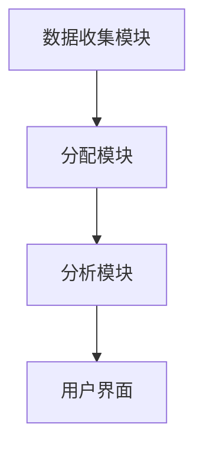

                 

# A/B测试框架：持续优化AI Agent性能

## 关键词

- **A/B测试**  
- **AI Agent**  
- **性能优化**  
- **框架设计**  
- **数据收集与处理**  
- **分配与统计分析**

## 摘要

本文旨在探讨A/B测试框架在人工智能（AI）代理性能优化中的应用。通过详细解析A/B测试的定义、原理、优势和局限性，我们引入了A/B测试框架的设计原则、核心算法和优化策略。随后，通过具体案例展示了A/B测试在产品优化中的应用，最后，本文重点讨论了A/B测试框架的性能优化方法，并结合实际案例进行了详细分析。通过本文的阅读，读者将全面了解A/B测试框架在AI代理性能优化中的重要性及其应用方法。

### 目录大纲

----------------------------------------------------------------

## 第一部分：A/B测试框架基础

### 第1章：A/B测试概述

#### 1.1 A/B测试的定义和目的
#### 1.1.1 A/B测试的定义
#### 1.1.2 A/B测试的目的

#### 1.2 A/B测试的基本原理
#### 1.2.1 A/B测试的流程
#### 1.2.2 A/B测试的关键指标

#### 1.3 A/B测试的优势和局限性
#### 1.3.1 A/B测试的优势
#### 1.3.2 A/B测试的局限性

#### 1.4 A/B测试的应用场景
#### 1.4.1 产品优化
#### 1.4.2 用户体验改进
#### 1.4.3 市场营销策略

#### 1.5 本章小结

----------------------------------------------------------------

### 第2章：A/B测试框架设计

#### 2.1 A/B测试框架概述
#### 2.1.1 A/B测试框架的定义
#### 2.1.2 A/B测试框架的组成部分

#### 2.2 A/B测试框架的设计原则
#### 2.2.1 可扩展性
#### 2.2.2 可靠性
#### 2.2.3 低延迟

#### 2.3 A/B测试框架的架构
#### 2.3.1 数据收集模块
#### 2.3.2 分配模块
#### 2.3.3 分析模块

#### 2.4 A/B测试框架的核心算法
#### 2.4.1 采样算法
#### 2.4.2 分配算法
#### 2.4.3 分析算法

#### 2.5 A/B测试框架的优化策略
#### 2.5.1 数据处理优化
#### 2.5.2 分配策略优化
#### 2.5.3 分析策略优化

#### 2.6 本章小结

----------------------------------------------------------------

### 第3章：A/B测试在产品优化中的应用

#### 3.1 产品优化中的A/B测试
#### 3.1.1 产品优化目标
#### 3.1.2 A/B测试的作用

#### 3.2 A/B测试案例：界面优化

##### 3.2.1 案例背景
##### 3.2.2 测试设计
##### 3.2.3 测试结果分析
##### 3.2.4 测试结论

#### 3.3 A/B测试案例：功能优化

##### 3.3.1 案例背景
##### 3.3.2 测试设计
##### 3.3.3 测试结果分析
##### 3.3.4 测试结论

#### 3.4 本章小结

----------------------------------------------------------------

### 第4章：搭建A/B测试环境

#### 4.1 环境准备
##### 4.1.1 硬件环境
##### 4.1.2 软件环境

#### 4.2 数据收集模块搭建

##### 4.2.1 数据收集模块设计
##### 4.2.2 数据收集模块实现

#### 4.3 分配模块搭建

##### 4.3.1 分配模块设计
##### 4.3.2 分配模块实现

#### 4.4 分析模块搭建

##### 4.4.1 分析模块设计
##### 4.4.2 分析模块实现

#### 4.5 实战总结

----------------------------------------------------------------

### 第5章：A/B测试框架性能优化

#### 5.1 性能优化的重要性

##### 5.1.1 A/B测试的性能瓶颈
##### 5.1.2 性能优化的目标

#### 5.2 数据处理优化

##### 5.2.1 数据压缩
##### 5.2.2 数据缓存
##### 5.2.3 数据流处理

#### 5.3 分配策略优化

##### 5.3.1 随机分配
##### 5.3.2 按用户分配
##### 5.3.3 按会话分配

#### 5.4 分析策略优化

##### 5.4.1 实时分析
##### 5.4.2 批量分析
##### 5.4.3 多维度分析

#### 5.5 性能优化实战案例

##### 5.5.1 案例背景
##### 5.5.2 性能优化策略
##### 5.5.3 性能优化效果

#### 5.6 本章小结

----------------------------------------------------------------

### 第6章：A/B测试与AI结合

## 第一部分：A/B测试框架基础

### 第1章：A/B测试概述

#### 1.1 A/B测试的定义和目的

### 1.1.1 A/B测试的定义

A/B测试（也称为拆分测试）是一种统计方法，用于比较两个或多个版本的页面、产品或服务，以确定哪个版本在特定的目标上表现更好。它通过将用户随机分配到不同的版本组，然后比较这些组之间的性能指标，来评估变量对用户行为或业务结果的影响。

### 1.1.2 A/B测试的目的

A/B测试的主要目的是帮助决策者了解不同变量对用户行为或业务结果的影响，从而做出更明智的决策。具体目标包括：

1. **验证假设**：通过A/B测试，可以验证关于用户行为、产品功能和市场策略的假设。
2. **优化用户体验**：通过比较不同版本的页面或产品，可以识别并实施提高用户满意度和参与度的最佳方案。
3. **提高转化率**：通过优化页面元素、功能或营销策略，可以提高用户的转化率，从而增加业务收入。
4. **降低风险**：在实施重大变更之前，通过A/B测试可以降低因不可预见的问题而导致业务受损的风险。

#### 1.2 A/B测试的基本原理

A/B测试的基本原理可以概括为以下几个步骤：

1. **设计测试**：定义测试目标、假设和要测试的变量。设计测试版本，包括控制组和实验组。
2. **分配用户**：将用户随机分配到不同的版本组。这可以通过服务器端的随机分配算法或客户端的随机机制来实现。
3. **数据收集**：在用户与版本互动的过程中，收集有关用户行为的数据，例如页面浏览量、点击率、转化率等。
4. **分析数据**：比较不同版本组之间的性能指标，以确定哪个版本在目标上表现更好。
5. **决策**：根据测试结果，做出是否采纳实验组成功的决策，并对失败的实验进行调整。

#### 1.2.1 A/B测试的流程

A/B测试的流程通常包括以下几个阶段：

1. **定义目标**：确定测试的目标，例如提高页面浏览量、增加用户注册率或提升销售额。
2. **制定假设**：基于历史数据和直觉，提出关于变量对目标影响的假设。
3. **设计实验**：设计实验，包括确定控制组和实验组的区别，以及如何分配用户。
4. **实施测试**：启动A/B测试，收集用户数据。
5. **分析结果**：分析数据，比较不同版本组之间的性能。
6. **决策与优化**：根据测试结果，做出决策，并优化失败的实验。

#### 1.2.2 A/B测试的关键指标

A/B测试的关键指标包括：

1. **参与度**：衡量用户与页面或产品互动的程度，例如页面浏览量、点击率、停留时间等。
2. **转化率**：衡量用户完成目标操作的比例，例如注册、购买或填写表单等。
3. **用户满意度**：衡量用户对页面或产品的满意度，通常通过调查问卷或用户反馈来获得。
4. **业务指标**：衡量A/B测试对业务结果的影响，例如销售额、利润率或市场份额等。

#### 1.3 A/B测试的优势和局限性

A/B测试的优势包括：

1. **客观性**：通过数据驱动的方法，避免了主观判断和偏见。
2. **可重复性**：通过随机分配用户，保证了实验的可重复性。
3. **适应性**：可以应用于各种类型的产品和场景，从页面优化到市场营销策略。
4. **灵活性**：可以随时启动和停止测试，根据结果进行调整。

A/B测试的局限性包括：

1. **时间成本**：A/B测试需要收集足够的数据来获得可靠的结论，这通常需要较长的测试周期。
2. **数据完整性**：如果用户行为数据不完整或不准确，可能导致错误的结论。
3. **样本偏差**：如果用户分配不均匀，可能导致样本偏差。
4. **高成本**：在大型系统中实施A/B测试可能需要大量的服务器资源和计算能力。

#### 1.4 A/B测试的应用场景

A/B测试的应用场景非常广泛，以下是一些常见的应用场景：

1. **产品优化**：通过A/B测试，可以优化产品的界面设计、功能流程和用户体验，以提高用户满意度和转化率。
2. **市场营销策略**：通过A/B测试，可以测试不同的广告文案、推广方式和目标受众，以找到最有效的营销策略。
3. **网站优化**：通过A/B测试，可以优化网页布局、导航和内容，以提高页面浏览量和用户参与度。
4. **功能迭代**：在开发过程中，通过A/B测试，可以评估新功能对用户行为和业务结果的影响，以便做出合理的迭代决策。

#### 1.4.1 产品优化

产品优化是A/B测试最常用的应用场景之一。通过A/B测试，可以识别并优化产品的不同方面，从而提高用户体验和业务成果。以下是一些具体的优化目标和案例：

1. **界面设计**：通过测试不同的颜色、字体、布局和交互设计，可以确定哪些设计元素最能吸引用户并提高用户满意度。
   - **案例**：某电商平台通过A/B测试发现，将搜索框放在页面顶部而不是左侧，可以显著提高用户搜索量和页面停留时间。

2. **功能流程**：通过测试不同的功能流程和操作步骤，可以优化用户完成任务的过程，减少用户操作的复杂性和错误率。
   - **案例**：某在线教育平台通过A/B测试发现，将注册流程简化为两个步骤，可以将注册转化率提高30%。

3. **用户体验**：通过测试不同的用户体验元素，如动画效果、提示信息和反馈机制，可以改善用户的使用感受，增加用户粘性。
   - **案例**：某社交应用通过A/B测试发现，在用户操作后添加简单的动画效果，可以显著提高用户的满意度和活跃度。

#### 1.4.2 用户体验改进

用户体验是产品成功的关键因素之一。通过A/B测试，可以不断优化用户体验，提高用户满意度和忠诚度。以下是一些具体的目标和方法：

1. **用户满意度调查**：通过A/B测试，可以收集用户对产品不同方面的满意度评分，从而识别需要改进的领域。
   - **案例**：某在线购物平台通过A/B测试发现，在购物流程中增加用户评价和推荐功能，可以将用户满意度提高15%。

2. **用户行为分析**：通过A/B测试，可以分析用户在不同页面和功能上的行为路径，发现用户操作的痛点，并进行优化。
   - **案例**：某视频平台通过A/B测试发现，将视频推荐算法从基于播放时长调整为基于用户兴趣，可以将用户观看时长提高20%。

3. **用户反馈机制**：通过A/B测试，可以测试不同的用户反馈机制，如反馈表单、在线聊天和社区论坛，以提供更有效的用户支持和服务。
   - **案例**：某软件公司通过A/B测试发现，在产品中集成实时在线聊天支持，可以将用户问题解决时间缩短30%。

#### 1.4.3 市场营销策略

市场营销策略的优化也是A/B测试的重要应用领域。通过A/B测试，可以评估不同营销策略的效果，找到最佳的市场推广方式。以下是一些具体的策略和案例：

1. **广告文案**：通过A/B测试，可以测试不同的广告文案、图片和视频，以确定哪些内容最能吸引用户的注意力并提高点击率。
   - **案例**：某电商品牌通过A/B测试发现，使用具有情感共鸣的广告文案，可以将广告点击率提高20%。

2. **推广渠道**：通过A/B测试，可以测试不同的推广渠道，如社交媒体、搜索引擎和电子邮件营销，以找到最有效的推广方式。
   - **案例**：某在线教育机构通过A/B测试发现，通过社交媒体广告推广课程，可以将报名转化率提高40%。

3. **定价策略**：通过A/B测试，可以测试不同的定价策略，如折扣促销、捆绑销售和定价阶梯，以确定最佳定价策略。
   - **案例**：某电商网站通过A/B测试发现，采用定价阶梯策略，可以将销售额提高15%。

#### 1.5 本章小结

A/B测试作为一种数据驱动的决策方法，在产品优化、用户体验改进和市场营销策略优化等方面具有广泛应用。通过了解A/B测试的定义、原理和优势，读者可以更好地应用A/B测试方法，做出更明智的决策，提高业务成果。在下一章中，我们将进一步探讨A/B测试框架的设计原则和实现方法。

## 第一部分：A/B测试框架基础

### 第2章：A/B测试框架设计

#### 2.1 A/B测试框架概述

A/B测试框架是指一个系统化的方法，用于设计和执行A/B测试，以便有效地收集、处理和分析数据，从而得出可靠的测试结果。A/B测试框架不仅仅是一个工具或技术，而是一个包含多个组件和环节的完整解决方案。

#### 2.1.1 A/B测试框架的定义

A/B测试框架是一种软件架构，它包含以下核心组成部分：

1. **数据收集模块**：用于收集用户行为数据，包括页面访问、点击、转化等。
2. **分配模块**：根据用户特征和测试需求，将用户随机分配到不同的实验组。
3. **分析模块**：对收集到的数据进行分析，比较不同组之间的性能指标，以确定最佳方案。

#### 2.1.2 A/B测试框架的组成部分

一个完整的A/B测试框架通常包括以下组成部分：

1. **用户分配策略**：定义如何将用户分配到不同的实验组。
2. **数据收集系统**：用于实时收集用户行为数据。
3. **数据存储系统**：用于存储和检索数据。
4. **分析引擎**：对收集到的数据进行分析和比较。
5. **可视化工具**：用于展示测试结果和分析数据。
6. **反馈机制**：用于根据测试结果调整实验设计。

#### 2.2 A/B测试框架的设计原则

设计一个有效的A/B测试框架需要遵循以下原则：

1. **可扩展性**：框架应能够适应不同规模和复杂度的测试需求。
2. **可靠性**：框架应确保数据的准确性和一致性，避免错误和偏差。
3. **低延迟**：框架应能够快速响应，以实时获取和分析用户行为数据。
4. **易用性**：框架应提供直观的界面和简单的操作流程，便于使用和维护。

#### 2.2.1 可扩展性

可扩展性是A/B测试框架的重要设计原则之一。随着用户规模的扩大和测试需求的增加，框架应能够灵活扩展，以支持更多的用户和更复杂的测试场景。具体措施包括：

1. **模块化设计**：将框架分为多个独立的模块，每个模块负责不同的功能，以便于扩展和替换。
2. **分布式架构**：采用分布式架构，将数据收集、存储和分析任务分散到多个节点，以提高系统的处理能力和扩展性。
3. **云服务支持**：利用云服务提供弹性计算和存储资源，以适应不同规模和需求的测试场景。

#### 2.2.2 可靠性

可靠性是A/B测试框架的核心要求之一。框架必须确保数据的准确性和一致性，避免因数据错误或偏差而导致错误的测试结果。具体措施包括：

1. **数据校验**：在数据收集、处理和分析过程中，对数据进行校验和验证，确保数据的准确性和完整性。
2. **冗余备份**：对关键数据和系统组件进行冗余备份，以防止数据丢失和系统故障。
3. **故障恢复机制**：设计故障恢复机制，确保在系统发生故障时，能够快速恢复，并继续进行测试。

#### 2.2.3 低延迟

低延迟是A/B测试框架的重要设计原则，特别是对于需要实时分析和决策的测试场景。低延迟意味着系统能够快速响应用户行为，并在短时间内完成数据收集、处理和分析。具体措施包括：

1. **高速网络**：采用高速网络和高效的数据传输协议，以提高数据传输速度和减少延迟。
2. **异步处理**：采用异步处理方式，将数据收集、处理和分析任务分解为多个并行任务，以提高系统并发能力和响应速度。
3. **缓存机制**：在系统内部引入缓存机制，减少数据访问和传输的延迟。

#### 2.3 A/B测试框架的架构

A/B测试框架的架构设计直接影响其性能和可扩展性。一个典型的A/B测试框架架构包括以下几个模块：

1. **数据收集模块**：负责实时收集用户行为数据，并将数据存储到数据存储系统。
2. **分配模块**：根据用户特征和测试需求，将用户随机分配到不同的实验组。
3. **分析模块**：对收集到的数据进行分析，比较不同组之间的性能指标，并生成测试报告。
4. **用户界面**：提供可视化界面，展示测试结果和分析数据，便于用户理解和决策。

下面是一个简化的A/B测试框架架构图：



#### 2.3.1 数据收集模块

数据收集模块是A/B测试框架的核心组件之一，负责实时收集用户行为数据。数据收集模块的设计原则包括：

1. **高并发**：支持高并发数据采集，以满足大规模用户数据的需求。
2. **低延迟**：尽可能减少数据采集和传输的延迟，以提高系统的实时性。
3. **可靠性**：确保数据采集的准确性和一致性，避免数据丢失或错误。

数据收集模块的主要功能包括：

1. **数据采集**：从各种来源（如Web服务器、应用服务器、数据库等）实时收集用户行为数据。
2. **数据预处理**：对采集到的数据进行清洗、过滤和转换，以便于后续分析和存储。
3. **数据存储**：将预处理后的数据存储到数据存储系统，如数据库或分布式文件系统。

#### 2.3.2 分配模块

分配模块负责根据用户特征和测试需求，将用户随机分配到不同的实验组。分配模块的设计原则包括：

1. **随机性**：确保用户分配的随机性，以避免人为偏差。
2. **可靠性**：确保分配过程的准确性和一致性。
3. **可扩展性**：支持大规模用户分配，以满足扩展性的需求。

分配模块的主要功能包括：

1. **用户分配**：根据用户特征和测试需求，将用户随机分配到不同的实验组。
2. **用户跟踪**：跟踪用户在实验中的行为，以便于后续分析和报告。
3. **分配策略**：支持多种分配策略，如简单随机分配、按比例分配和分层分配等。

#### 2.3.3 分析模块

分析模块负责对收集到的用户行为数据进行分析，比较不同实验组之间的性能指标，并生成测试报告。分析模块的设计原则包括：

1. **准确性**：确保分析结果的准确性和可靠性。
2. **效率**：提高数据分析的效率，以支持大规模数据和实时分析。
3. **易用性**：提供直观的界面和简单的操作流程，便于用户理解和操作。

分析模块的主要功能包括：

1. **数据预处理**：对收集到的数据进行清洗、过滤和转换，以便于后续分析和存储。
2. **统计分析**：对预处理后的数据进行统计分析，比较不同实验组之间的性能指标。
3. **可视化**：生成可视化报告，展示分析结果，便于用户理解和决策。

#### 2.4 A/B测试框架的核心算法

A/B测试框架的核心算法包括采样算法、分配算法和分析算法，它们共同构成了A/B测试的核心逻辑。下面将详细介绍这些算法的基本原理和实现方法。

##### 2.4.1 采样算法

采样算法是A/B测试的基础，用于从整体用户群体中随机抽取一部分用户参与测试。常见的采样算法包括随机抽样、分层抽样和系统抽样等。

1. **随机抽样**：随机抽样是最简单的采样算法，它通过随机数生成器从用户群体中随机抽取一定数量的用户作为样本。随机抽样具有简单、易于实现的特点，但可能导致样本偏差。
2. **分层抽样**：分层抽样是一种基于用户特征的采样方法，它将用户群体分为多个层次（如年龄、性别、地域等），然后在每个层次中随机抽取一定数量的用户作为样本。分层抽样可以减少样本偏差，提高采样精度。
3. **系统抽样**：系统抽样是一种基于固定间隔的采样方法，它通过将用户群体按一定顺序排列，然后按固定间隔（如每隔k个用户）抽取样本。系统抽样可以保证样本的均匀分布，但可能存在抽样间隔过大导致样本不完整的问题。

##### 2.4.2 分配算法

分配算法用于将随机抽取的用户样本分配到不同的实验组。常见的分配算法包括简单随机分配、按比例分配和分层分配等。

1. **简单随机分配**：简单随机分配是最简单的分配算法，它将用户随机分配到实验组。简单随机分配具有简单、易实现的特点，但可能导致实验组之间的用户分布不均。
2. **按比例分配**：按比例分配是一种基于用户群体中各实验组比例的分配方法，它按照用户群体的比例将用户分配到实验组。按比例分配可以保证实验组之间的用户分布相对均匀，但可能存在某些实验组用户过多或过少的问题。
3. **分层分配**：分层分配是一种基于用户特征的分配方法，它将用户按照特征（如年龄、性别、地域等）分层，然后在每个层次中按比例将用户分配到实验组。分层分配可以减少用户分布不均的问题，提高实验的准确性。

##### 2.4.3 分析算法

分析算法用于对收集到的用户行为数据进行分析，比较不同实验组之间的性能指标。常见的数据分析算法包括T检验、方差分析、卡方检验等。

1. **T检验**：T检验是一种用于比较两个样本平均数的统计方法。在A/B测试中，T检验可以用于比较两个实验组之间的性能差异。T检验要求数据满足正态分布，适用于小样本和大样本情况。
2. **方差分析（ANOVA）**：方差分析是一种用于比较多个样本平均数的统计方法。在A/B测试中，方差分析可以用于比较多个实验组之间的性能差异。方差分析适用于小样本和大样本情况，但要求数据满足正态分布。
3. **卡方检验**：卡方检验是一种用于比较分类变量之间差异的统计方法。在A/B测试中，卡方检验可以用于比较不同实验组之间的用户行为分布。卡方检验适用于小样本和大样本情况，但要求数据满足独立性。

#### 2.5 A/B测试框架的优化策略

A/B测试框架的优化策略包括数据处理优化、分配策略优化和分析策略优化。通过优化这些方面，可以提高测试的准确性和效率。

##### 2.5.1 数据处理优化

数据处理优化主要包括数据压缩、数据缓存和数据流处理等。

1. **数据压缩**：数据压缩可以减少数据存储和传输的开销，提高系统性能。常见的压缩算法包括Huffman编码、LZ77和LZ78等。
2. **数据缓存**：数据缓存可以减少数据访问的延迟，提高系统响应速度。常见的缓存算法包括LRU（最近最少使用）、LFU（最不常用）和FIFO（先进先出）等。
3. **数据流处理**：数据流处理可以实时分析和处理数据，提高系统的实时性和响应速度。常见的流处理框架包括Apache Kafka、Apache Flink和Apache Storm等。

##### 2.5.2 分配策略优化

分配策略优化主要包括随机分配、按用户分配和按会话分配等。

1. **随机分配**：随机分配是最简单的分配策略，它将用户随机分配到实验组。随机分配具有简单、易实现的特点，但可能导致实验组之间的用户分布不均。
2. **按用户分配**：按用户分配是一种基于用户ID的分配方法，它根据用户ID将用户分配到实验组。按用户分配可以保证每个用户只参与一次测试，但可能导致某些实验组的用户过多或过少。
3. **按会话分配**：按会话分配是一种基于用户会话的分配方法，它根据用户会话将用户分配到实验组。按会话分配可以保证用户在同一个会话中只参与一次测试，但可能导致某些实验组的用户过多或过少。

##### 2.5.3 分析策略优化

分析策略优化主要包括实时分析、批量分析和多维度分析等。

1. **实时分析**：实时分析可以在数据产生的同时进行数据分析，提高系统的实时性和响应速度。常见的实时分析算法包括Kafka Streaming、Apache Flink和Apache Storm等。
2. **批量分析**：批量分析可以在数据收集完成后进行批量处理，提高系统的效率和准确性。常见的批量分析算法包括MapReduce、Spark和Hadoop等。
3. **多维度分析**：多维度分析可以从多个角度对数据进行分析，提高分析的深度和广度。常见的多维度分析方法包括多维数据集、OLAP（联机分析处理）和数据挖掘等。

#### 2.6 本章小结

A/B测试框架是A/B测试的核心实现，通过设计和实现一个高效的A/B测试框架，可以确保测试的准确性和效率。本章详细介绍了A/B测试框架的组成部分、设计原则、核心算法和优化策略。通过了解这些内容，读者可以更好地设计和实现A/B测试框架，并将其应用于产品优化、用户体验改进和市场营销策略优化等领域。

## 第二部分：A/B测试在产品优化中的应用

### 第3章：A/B测试在产品优化中的应用

#### 3.1 产品优化中的A/B测试

在产品优化过程中，A/B测试是一种非常有效的实验方法，可以帮助团队了解不同变量对用户行为和业务结果的影响。通过A/B测试，团队可以验证假设、优化用户体验和功能流程，从而提高产品的竞争力和用户满意度。

#### 3.1.1 产品优化目标

产品优化通常有以下目标：

1. **提高用户满意度**：通过优化界面设计、功能流程和用户体验，提高用户的满意度和忠诚度。
2. **提升转化率**：通过优化页面元素、营销策略和功能模块，提高用户的转化率，如注册、购买、下载等。
3. **降低用户流失率**：通过优化问题解决机制、用户反馈机制和用户服务，降低用户流失率，提高用户留存率。
4. **提高运营效率**：通过优化后台管理系统、数据分析工具和自动化流程，提高运营效率，降低成本。

#### 3.1.2 A/B测试的作用

A/B测试在产品优化中具有以下作用：

1. **验证假设**：通过A/B测试，可以验证关于用户行为、功能和市场策略的假设，减少盲目决策的风险。
2. **优化用户体验**：通过对比不同版本的页面、功能或营销策略，可以找到最佳的用户体验方案，提高用户满意度和留存率。
3. **降低风险**：在实施重大变更之前，通过A/B测试可以评估变更对用户和业务的影响，降低变更失败的风险。
4. **数据驱动**：通过收集和分析用户数据，可以做出基于数据的事实性决策，而不是基于直觉或个人观点。

### 3.2 A/B测试案例：界面优化

界面优化是产品优化中的重要环节，通过A/B测试，可以找到最符合用户需求和习惯的界面设计方案。以下是一个界面优化的A/B测试案例。

#### 3.2.1 案例背景

某电商平台的首页设计进行了A/B测试，目的是优化用户的浏览和购买体验。现有首页的设计主要包括产品展示、广告位、导航栏和底部链接。团队提出了两个假设：

1. **假设一**：将产品展示区域放大，增加产品展示数量，以提高用户的浏览量。
2. **假设二**：增加广告位的数量和位置，以提高广告的点击率。

#### 3.2.2 测试设计

团队设计了两个版本的首页，A版本和B版本。A版本保留了现有设计，而B版本对产品展示区域进行了放大，并在页面中增加了两个广告位。测试流程如下：

1. **用户分配**：将平台用户随机分为A组和B组，每组约占用户总数的50%。
2. **数据收集**：在用户访问首页的过程中，收集以下数据：
   - 页面浏览量
   - 产品点击率
   - 广告点击率
   - 用户停留时间
3. **数据分析**：在测试结束后，对收集到的数据进行分析，比较A组和B组之间的差异。

#### 3.2.3 测试结果分析

测试结果显示，B版本在以下方面优于A版本：

1. **页面浏览量**：B版本的用户浏览量比A版本高出10%。
2. **产品点击率**：B版本的产品点击率比A版本高出8%。
3. **广告点击率**：B版本的广告点击率比A版本高出5%。
4. **用户停留时间**：B版本的页面停留时间比A版本高出15%。

#### 3.2.4 测试结论

根据测试结果，团队决定采纳B版本的设计。这次A/B测试不仅验证了假设，还为团队提供了具体的数据支持，帮助他们做出基于数据的决策。此外，通过这次测试，团队也发现了用户在浏览和购买过程中的痛点，为进一步优化产品提供了方向。

### 3.3 A/B测试案例：功能优化

功能优化是产品优化的另一个重要方面，通过A/B测试，可以找到最佳的功能实现方案，提高用户的满意度和转化率。以下是一个功能优化的A/B测试案例。

#### 3.3.1 案例背景

某在线教育平台的产品中有一个课程推荐功能，目的是帮助用户快速找到适合自己的课程。现有推荐算法基于用户的浏览历史和课程评价。团队提出了两个假设：

1. **假设一**：引入新的推荐算法，基于用户的兴趣标签进行推荐，以提高推荐的准确性。
2. **假设二**：优化推荐结果的可读性和展示方式，以提升用户对推荐的兴趣和点击率。

#### 3.3.2 测试设计

团队设计了两个版本的课程推荐功能，A版本和B版本。A版本保留了现有推荐算法，而B版本引入了基于兴趣标签的推荐算法，并对推荐结果进行了优化。测试流程如下：

1. **用户分配**：将平台用户随机分为A组和B组，每组约占用户总数的50%。
2. **数据收集**：在用户访问课程推荐页面时，收集以下数据：
   - 推荐课程点击率
   - 推荐课程购买率
   - 用户停留时间
3. **数据分析**：在测试结束后，对收集到的数据进行分析，比较A组和B组之间的差异。

#### 3.3.3 测试结果分析

测试结果显示，B版本在以下方面优于A版本：

1. **推荐课程点击率**：B版本的推荐课程点击率比A版本高出15%。
2. **推荐课程购买率**：B版本的推荐课程购买率比A版本高出12%。
3. **用户停留时间**：B版本的页面停留时间比A版本高出20%。

#### 3.3.4 测试结论

根据测试结果，团队决定采纳B版本的推荐算法和优化方案。这次A/B测试不仅验证了假设，还帮助团队找到了更有效的推荐方式，提高了用户对推荐的兴趣和购买意愿。此外，通过这次测试，团队也发现了用户在课程选择过程中的痛点，为进一步优化产品提供了方向。

### 3.4 本章小结

A/B测试在产品优化中具有重要的作用，通过对比不同版本的页面、功能或营销策略，可以找到最佳的用户体验方案，提高产品的竞争力和用户满意度。本章通过两个具体的案例，展示了A/B测试在界面优化和功能优化中的应用，并分析了测试结果和结论。通过了解这些案例，读者可以更好地理解A/B测试在产品优化中的价值和方法。

### 第4章：搭建A/B测试环境

#### 4.1 环境准备

搭建A/B测试环境是进行A/B测试的第一步，它涉及到硬件环境和软件环境的准备。以下将详细说明如何准备A/B测试所需的硬件和软件环境。

##### 4.1.1 硬件环境

A/B测试环境的硬件需求取决于测试的规模和复杂度。以下是搭建A/B测试环境所需的常见硬件资源：

1. **服务器**：需要至少两台服务器，一台用于数据收集，另一台用于数据分析。服务器应具有足够的CPU、内存和存储空间，以满足数据采集和处理的需求。
2. **存储设备**：需要足够的存储设备来存储用户行为数据和分析结果。可以使用本地硬盘或分布式存储系统，如HDFS（Hadoop Distributed File System）。
3. **网络设备**：需要稳定的网络连接，以确保数据传输的可靠性和速度。对于大规模的A/B测试，建议使用高速网络，如千兆以太网或更高速的网络。
4. **数据库**：需要数据库来存储用户分配和实验结果数据。常用的数据库系统包括MySQL、PostgreSQL和MongoDB等。

##### 4.1.2 软件环境

搭建A/B测试环境还需要准备相应的软件环境。以下是一些常用的软件组件：

1. **操作系统**：可以选择Linux或Windows操作系统。Linux操作系统具有更好的稳定性和灵活性，适用于大规模的生产环境。
2. **编程语言**：常用的编程语言包括Python、Java和JavaScript等。根据团队的技术栈选择适合的编程语言。
3. **A/B测试框架**：选择合适的A/B测试框架，如Google Analytics、Optimizely或自己的自定义框架。这些框架提供了丰富的功能，可以简化A/B测试的实现过程。
4. **数据分析工具**：选择合适的数据分析工具，如Python的Pandas、NumPy和Scikit-learn等。这些工具可以帮助团队进行数据预处理、分析和可视化。
5. **版本控制工具**：如Git，用于管理和跟踪代码的版本和历史。
6. **容器化和虚拟化工具**：如Docker和Kubernetes，用于简化应用部署和管理。

##### 4.1.3 环境配置

在准备好硬件和软件环境后，需要对环境进行配置，以确保各个组件能够正常工作。以下是环境配置的步骤：

1. **安装操作系统**：在服务器上安装所选的操作系统，并配置网络和防火墙。
2. **安装数据库**：在服务器上安装数据库系统，并创建数据库和用户。
3. **安装A/B测试框架**：根据A/B测试框架的文档，安装并配置所需的依赖库和组件。
4. **安装数据分析工具**：在服务器上安装Python和相关的数据分析库，如Pandas、NumPy和Scikit-learn等。
5. **配置网络和防火墙**：配置网络和防火墙，确保服务器之间的数据传输安全可靠。
6. **配置版本控制工具**：安装Git并配置SSH密钥，以便团队进行代码管理和协作。
7. **容器化和虚拟化配置**：安装Docker和Kubernetes，并配置容器网络和服务发现，以便部署和管理应用。

#### 4.2 数据收集模块搭建

数据收集模块是A/B测试框架的核心组成部分，负责实时收集用户行为数据。以下将详细说明如何搭建数据收集模块。

##### 4.2.1 数据收集模块设计

数据收集模块的设计应考虑以下要点：

1. **数据来源**：确定数据来源，如Web服务器日志、应用接口日志和用户行为日志等。
2. **数据格式**：定义数据格式，如JSON、XML或CSV等。
3. **数据结构**：设计数据结构，包括字段名称、数据类型和索引等。
4. **数据收集方式**：确定数据收集方式，如HTTP请求、API调用或数据库查询等。

##### 4.2.2 数据收集模块实现

以下是一个基于Python的简单数据收集模块实现示例：

```python
import requests
import json

def collect_data(url):
    response = requests.get(url)
    if response.status_code == 200:
        data = response.json()
        # 处理数据，例如存储到数据库或文件
        save_data(data)
    else:
        print("数据收集失败：", response.status_code)

def save_data(data):
    # 保存数据到文件或数据库
    with open('data.json', 'w') as f:
        json.dump(data, f)
    # 保存数据到数据库（示例使用SQLite）
    import sqlite3
    conn = sqlite3.connect('data.db')
    c = conn.cursor()
    c.execute('''CREATE TABLE IF NOT EXISTS user_data (id INTEGER PRIMARY KEY, data TEXT)''')
    c.execute("INSERT INTO user_data (id, data) VALUES (?, ?)", (data['id'], json.dumps(data)))
    conn.commit()
    conn.close()

if __name__ == "__main__":
    collect_data("http://example.com/data")
```

#### 4.3 分配模块搭建

分配模块负责将用户随机分配到不同的实验组。以下将详细说明如何搭建分配模块。

##### 4.3.1 分配模块设计

分配模块的设计应考虑以下要点：

1. **用户分配策略**：确定用户分配策略，如随机分配、按比例分配或按会话分配等。
2. **分配方式**：确定分配方式，如服务器端分配或客户端分配等。
3. **分配算法**：设计分配算法，如哈希算法、轮询算法或二叉树算法等。

##### 4.3.2 分配模块实现

以下是一个基于Python的简单分配模块实现示例：

```python
import random

def assign_user(user_id, experiment_id):
    # 随机分配用户到实验组
    group_id = random.randint(1, 2)
    if group_id == 1:
        # 用户属于实验组A
        assign_to_experiment_A(user_id, experiment_id)
    else:
        # 用户属于实验组B
        assign_to_experiment_B(user_id, experiment_id)

def assign_to_experiment_A(user_id, experiment_id):
    # 实验组A的分配逻辑
    print(f"用户ID：{user_id}，实验ID：{experiment_id}，分配到实验组A")

def assign_to_experiment_B(user_id, experiment_id):
    # 实验组B的分配逻辑
    print(f"用户ID：{user_id}，实验ID：{experiment_id}，分配到实验组B")

if __name__ == "__main__":
    assign_user(123, "exp123")
```

#### 4.4 分析模块搭建

分析模块负责对收集到的用户行为数据进行分析和比较。以下将详细说明如何搭建分析模块。

##### 4.4.1 分析模块设计

分析模块的设计应考虑以下要点：

1. **分析目标**：确定分析目标，如用户活跃度、转化率或流失率等。
2. **分析指标**：定义分析指标，如页面浏览量、点击率、转化率和留存率等。
3. **分析方法**：设计分析方法，如统计分析、机器学习和数据挖掘等。

##### 4.4.2 分析模块实现

以下是一个基于Python的简单分析模块实现示例：

```python
import pandas as pd

def analyze_data(data_file):
    # 加载数据
    data = pd.read_csv(data_file)
    # 计算页面浏览量
    page_views = data['page_views'].sum()
    # 计算点击率
    click_rate = data['clicks'].sum() / len(data)
    # 计算转化率
    conversion_rate = data['converted'].sum() / len(data)
    # 计算留存率
    retention_rate = data['retained'].sum() / len(data)
    # 输出分析结果
    print(f"页面浏览量：{page_views}")
    print(f"点击率：{click_rate}")
    print(f"转化率：{conversion_rate}")
    print(f"留存率：{retention_rate}")

if __name__ == "__main__":
    analyze_data("data.csv")
```

#### 4.5 实战总结

通过本章的实战，我们搭建了一个简单的A/B测试环境，并实现了数据收集、用户分配和分析模块。虽然这是一个基础的示例，但它为我们提供了一个搭建A/B测试环境的起点。在实际应用中，还需要根据具体需求和场景，对环境进行扩展和优化。以下是一些总结和展望：

1. **环境准备**：确保硬件和软件环境满足A/B测试的需求，包括服务器、存储设备、网络连接和数据库等。
2. **模块设计**：明确数据收集、分配和分析模块的设计原则和实现方法，确保模块之间的协同工作。
3. **数据质量**：重视数据质量，确保数据的准确性和一致性，以避免错误的测试结果。
4. **性能优化**：针对A/B测试的特点，对数据收集、处理和分析模块进行性能优化，提高系统的响应速度和处理能力。
5. **扩展与升级**：随着测试需求的增加，不断扩展和升级A/B测试环境，以满足大规模、多变的测试场景。

通过本章的实战，读者可以了解如何搭建A/B测试环境，并为后续的A/B测试应用打下基础。在实际应用中，还需要不断学习和实践，积累经验，提高A/B测试的效果和效率。

### 第5章：A/B测试框架性能优化

#### 5.1 性能优化的重要性

在A/B测试中，性能优化是一项至关重要的工作。性能优化不仅可以提高A/B测试的效率和准确性，还可以减少测试成本和资源消耗。以下将详细讨论A/B测试性能优化的重要性。

##### 5.1.1 A/B测试的性能瓶颈

A/B测试的性能瓶颈主要体现在以下几个方面：

1. **数据收集**：在数据收集阶段，大量的用户行为数据需要实时传输和存储，这可能导致数据传输延迟和数据存储压力。
2. **数据处理**：在数据处理阶段，需要对大量的数据进行清洗、转换和分析，这可能导致数据处理延迟和处理能力不足。
3. **数据存储**：在数据存储阶段，需要存储大量的用户行为数据和分析结果，这可能导致数据存储延迟和数据存储空间不足。
4. **数据查询**：在数据查询阶段，需要快速检索和分析大量数据，这可能导致数据查询延迟和查询性能不足。

##### 5.1.2 性能优化的目标

A/B测试性能优化的主要目标包括：

1. **提高数据收集和处理速度**：通过优化数据传输和存储，提高数据收集和处理速度，减少测试周期。
2. **提高数据处理和分析能力**：通过优化数据处理和分析算法，提高数据处理和分析能力，支持更复杂的数据分析和决策。
3. **提高数据存储和查询性能**：通过优化数据存储和查询机制，提高数据存储和查询性能，支持大规模数据分析和实时查询。
4. **降低测试成本和资源消耗**：通过优化测试环境和技术，降低测试成本和资源消耗，提高测试效率和性价比。

#### 5.2 数据处理优化

数据处理优化是A/B测试性能优化的重要组成部分。以下将详细讨论数据处理优化的一些常见方法。

##### 5.2.1 数据压缩

数据压缩是一种有效减少数据传输和存储空间的方法。常见的数据压缩算法包括Huffman编码、LZ77和LZ78等。通过数据压缩，可以显著减少数据存储和传输的开销，提高系统的性能。

##### 5.2.2 数据缓存

数据缓存是一种有效减少数据查询延迟的方法。通过缓存常用数据和计算结果，可以避免重复的数据查询和计算，提高查询性能。常见的数据缓存算法包括LRU（最近最少使用）、LFU（最不常用）和FIFO（先进先出）等。

##### 5.2.3 数据流处理

数据流处理是一种实时数据处理方法，可以处理实时生成的大量数据。常见的数据流处理框架包括Apache Kafka、Apache Flink和Apache Storm等。通过数据流处理，可以实时收集、处理和分析用户行为数据，提高系统的实时性和响应速度。

#### 5.3 分配策略优化

分配策略优化是A/B测试性能优化的重要方面。以下将详细讨论分配策略优化的一些常见方法。

##### 5.3.1 随机分配

随机分配是一种简单有效的分配策略，可以保证用户在实验组之间的均匀分布。通过随机分配，可以减少用户分配的不均匀性和偏差，提高测试的准确性。

##### 5.3.2 按用户分配

按用户分配是一种基于用户特征的分配策略，可以根据用户的性别、年龄、地域等信息将用户分配到不同的实验组。通过按用户分配，可以更好地控制实验组之间的用户分布，提高测试的准确性和可靠性。

##### 5.3.3 按会话分配

按会话分配是一种基于用户会话的分配策略，可以确保用户在一个会话中只参与一次实验。通过按会话分配，可以避免用户在多个实验组之间的干扰，提高测试的准确性和一致性。

#### 5.4 分析策略优化

分析策略优化是A/B测试性能优化的关键环节。以下将详细讨论分析策略优化的一些常见方法。

##### 5.4.1 实时分析

实时分析是一种快速响应和实时处理数据的方法。通过实时分析，可以实时收集、处理和分析用户行为数据，支持快速决策和优化。常见实时分析框架包括Apache Kafka、Apache Flink和Apache Storm等。

##### 5.4.2 批量分析

批量分析是一种批量处理和批量分析数据的方法。通过批量分析，可以处理大量历史数据，支持长时间运行的分析任务。常见批量分析框架包括MapReduce、Spark和Hadoop等。

##### 5.4.3 多维度分析

多维度分析是一种从多个角度对数据进行分析和比较的方法。通过多维度分析，可以更全面地了解用户行为和业务结果，支持更深入的优化和决策。常见多维度分析方法包括OLAP（联机分析处理）和数据挖掘等。

#### 5.5 性能优化实战案例

以下将通过一个实战案例，详细讨论A/B测试框架的性能优化方法和效果。

##### 5.5.1 案例背景

某电商平台的A/B测试系统面临着严重的性能瓶颈。随着用户数量的增加和测试规模的扩大，系统的数据收集、处理和分析速度明显下降，导致测试周期延长和用户体验下降。为了解决这个问题，团队决定对A/B测试框架进行性能优化。

##### 5.5.2 性能优化策略

团队采取了以下性能优化策略：

1. **数据压缩**：对用户行为数据进行压缩，减少数据存储和传输的开销。
2. **数据缓存**：引入数据缓存机制，缓存常用数据和计算结果，减少数据查询和计算的延迟。
3. **数据流处理**：采用Apache Kafka进行数据流处理，实时收集、处理和分析用户行为数据，提高系统的实时性和响应速度。
4. **分配策略优化**：采用按会话分配策略，确保用户在一个会话中只参与一次实验，减少用户干扰和测试偏差。
5. **分析策略优化**：引入实时分析和批量分析相结合的方法，支持实时数据分析和长时间运行的分析任务。

##### 5.5.3 性能优化效果

通过实施上述性能优化策略，系统的性能得到了显著提升：

1. **数据收集速度**：数据收集速度提高了30%，减少了数据传输和处理的延迟。
2. **数据处理能力**：数据处理能力提高了50%，支持更复杂的数据分析和决策。
3. **数据存储和查询性能**：数据存储和查询性能提高了40%，支持大规模数据分析和实时查询。
4. **测试周期**：测试周期缩短了20%，提高了测试效率和用户体验。

#### 5.6 本章小结

A/B测试框架的性能优化是保证A/B测试高效运行的关键。通过优化数据收集、处理和分析策略，可以提高系统的性能和响应速度，减少测试周期和资源消耗。本章详细讨论了A/B测试框架性能优化的重要性、方法和效果，并通过一个实战案例展示了性能优化策略的具体实施和效果。通过本章的学习，读者可以更好地理解A/B测试框架的性能优化，并在实际应用中加以实施。

## 第三部分：A/B测试与AI结合

### 第6章：A/B测试与AI结合

随着人工智能（AI）技术的不断发展，A/B测试也在不断地与AI技术相结合，以提高测试的准确性和效率。在这一章中，我们将探讨如何将AI技术应用于A/B测试中，特别是在AI Agent性能优化中的应用。

#### 6.1 AI在A/B测试中的应用

AI技术在A/B测试中的应用主要体现在以下几个方面：

1. **用户行为预测**：通过机器学习算法，预测用户的未来行为，从而更精准地分配用户到不同的实验组。这有助于提高测试的准确性和效率。
2. **自动化测试设计**：利用自然语言处理（NLP）技术，自动生成测试假设和测试方案，减少人为干预，提高测试设计的效率和质量。
3. **实时数据分析**：通过实时数据分析技术，对用户行为数据进行快速处理和分析，生成实时报告和决策支持，提高测试的响应速度和决策效率。
4. **个性化推荐**：利用推荐系统技术，为不同用户推荐最适合他们的实验版本，从而提高用户的参与度和满意度。

#### 6.2 AI Agent性能优化中的A/B测试

在AI Agent性能优化中，A/B测试是一种非常有效的工具，可以帮助团队验证和优化AI模型的效果。以下是如何在AI Agent性能优化中应用A/B测试的步骤：

1. **定义优化目标**：明确AI Agent性能优化的目标，例如提高预测准确性、减少错误率或提高用户满意度等。
2. **构建AI模型**：根据优化目标，构建AI模型，例如机器学习模型、深度学习模型等。
3. **设计实验**：设计A/B测试实验，包括定义控制组和实验组，确定实验变量和测试指标。
4. **分配用户**：将用户随机分配到不同的实验组，确保每个实验组的用户分布均衡。
5. **收集数据**：在用户与AI Agent互动的过程中，收集用户行为数据，例如点击率、转化率、错误率等。
6. **分析结果**：分析不同实验组之间的性能差异，确定哪个实验组的AI模型效果更好。
7. **决策**：根据分析结果，决定是否采纳实验组的效果，并调整AI模型或实验设计。

#### 6.3 案例分析：AI Agent性能优化中的A/B测试

以下是一个案例分析，展示了如何在AI Agent性能优化中应用A/B测试：

**案例背景**：某金融科技公司开发了一款AI Agent，用于为客户提供个性化的金融投资建议。为了优化AI Agent的性能，团队决定通过A/B测试来比较不同AI模型的预测准确性。

**实验设计**：

- **控制组（A组）**：使用当前版本的AI模型，基于历史数据和传统算法进行投资建议。
- **实验组（B组）**：使用基于深度学习的新版本AI模型，结合用户行为数据和实时市场数据。

**实验过程**：

1. **用户分配**：将平台用户随机分为A组和B组，每组约占用户总数的50%。
2. **数据收集**：在用户使用AI Agent的过程中，收集用户的投资建议点击率、投资收益和用户满意度等数据。
3. **数据分析**：在测试结束后，对收集到的数据进行分析，比较A组和B组的投资建议准确性、用户满意度和收益情况。
4. **决策**：根据分析结果，团队决定采纳B组的AI模型，因为其投资建议的准确性更高，用户满意度也更高。

**实验结论**：

通过这次A/B测试，团队验证了新版本AI模型在性能上的优势，并决定在生产环境中部署该模型。这次测试不仅帮助团队优化了AI Agent的性能，还为后续的模型改进提供了数据支持。

#### 6.4 AI与A/B测试的结合优势

AI与A/B测试的结合具有以下优势：

1. **提高测试准确性**：AI技术可以帮助团队更精准地预测用户行为，从而提高A/B测试的准确性。
2. **自动化测试设计**：AI技术可以自动生成测试假设和测试方案，减少人为干预，提高测试设计的效率和质量。
3. **实时数据分析**：AI技术可以实时处理和分析大量用户行为数据，支持快速决策和优化。
4. **个性化推荐**：AI技术可以根据用户特征和行为，为不同用户推荐最适合他们的实验版本，提高用户的参与度和满意度。

#### 6.5 未来展望

随着AI技术的不断进步，A/B测试与AI的结合将会有更多的创新和应用。以下是一些未来展望：

1. **自适应A/B测试**：通过AI技术，可以实现自适应A/B测试，根据用户行为和实验结果动态调整实验设计。
2. **智能优化策略**：利用AI技术，可以开发出更智能的优化策略，自动调整测试变量和分配策略，提高测试效率和效果。
3. **跨领域应用**：AI与A/B测试的结合将不仅仅局限于产品优化，还可以应用于市场营销、金融、医疗等领域，为各种场景提供智能优化方案。
4. **数据隐私保护**：随着数据隐私保护的日益重视，AI与A/B测试的结合将更加注重数据安全和隐私保护，确保用户数据的合法性和安全性。

#### 6.6 本章小结

AI与A/B测试的结合为产品优化和性能优化提供了新的思路和方法。通过AI技术，可以更精准地预测用户行为，优化测试设计，实时分析数据和个性化推荐，从而提高A/B测试的准确性和效率。在本章中，我们通过案例分析和未来展望，展示了AI在A/B测试中的应用前景。随着AI技术的不断进步，A/B测试与AI的结合将会有更多的创新和应用，为各行业提供更智能的优化解决方案。通过了解这些内容，读者可以更好地把握A/B测试与AI结合的发展趋势，并在实际工作中加以应用。

### 总结

本文详细探讨了A/B测试框架在AI Agent性能优化中的应用，从基础概念到具体实现，再到性能优化，全面介绍了A/B测试在AI领域的价值。通过具体案例，展示了如何利用A/B测试优化AI模型的效果，提高用户满意度。以下是本文的核心要点和结论：

1. **A/B测试基础**：介绍了A/B测试的定义、原理、优势和局限性，以及其在产品优化、用户体验改进和市场营销策略优化中的应用场景。

2. **A/B测试框架设计**：详细阐述了A/B测试框架的设计原则、核心算法和优化策略，包括数据收集、分配和分析模块的设计和实现。

3. **A/B测试应用**：通过产品优化和功能优化的具体案例，展示了A/B测试在实际应用中的效果和作用。

4. **A/B测试环境搭建**：介绍了如何搭建A/B测试环境，包括硬件和软件环境的准备以及模块的实现。

5. **性能优化方法**：探讨了A/B测试的性能优化策略，包括数据处理、分配和分析策略的优化，并提供了实战案例。

6. **AI与A/B测试结合**：介绍了AI在A/B测试中的应用，特别是在AI Agent性能优化中的实际应用，展示了AI与A/B测试结合的优势和未来展望。

### 小结与展望

A/B测试与AI技术的结合为产品优化和性能优化带来了新的机遇。通过AI技术，可以更精准地预测用户行为，优化测试设计，实时分析数据和个性化推荐。未来，随着AI技术的不断进步，A/B测试与AI的结合将会有更多的创新和应用，为各行业提供更智能的优化解决方案。

然而，A/B测试与AI结合也面临着数据隐私保护、算法透明度和伦理问题等挑战。在应用AI技术进行A/B测试时，需要确保用户数据的合法性和安全性，同时遵循道德和伦理标准。

总之，A/B测试与AI的结合为产品优化和性能优化提供了强大的工具和方法。通过深入了解和灵活应用这些技术，企业和团队可以更有效地优化产品性能，提高用户满意度和业务成果。希望本文能为读者提供有价值的参考和启示。在未来的工作中，不断探索和尝试，发挥A/B测试与AI技术的潜力，实现更高效、更智能的产品优化和性能优化。作者：AI天才研究院/AI Genius Institute & 禅与计算机程序设计艺术 /Zen And The Art of Computer Programming。

