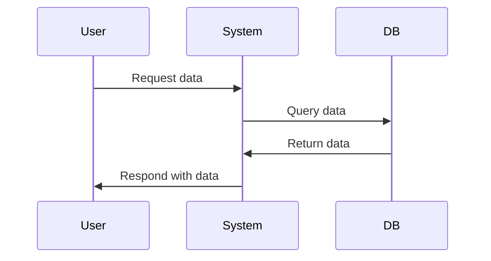
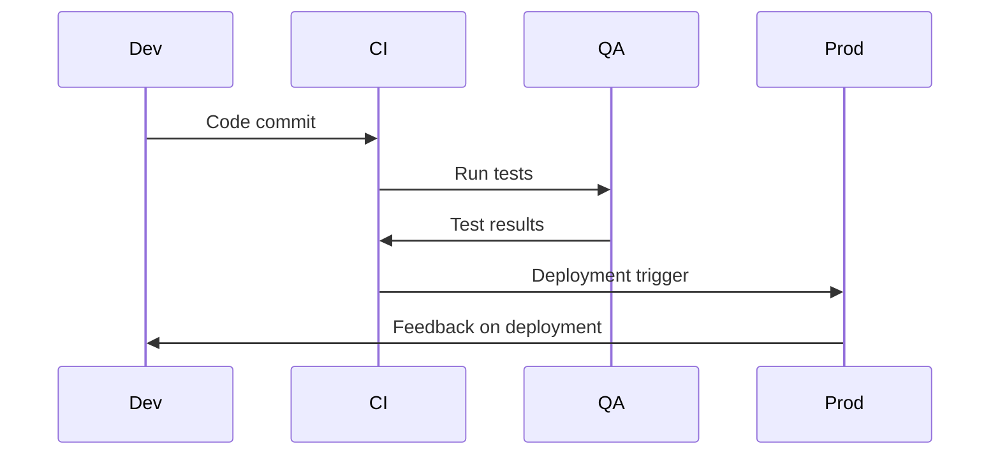

                 

Certainly! Let's dive into the structured content of our technical blog post on "CI/CD Pipeline Design and Implementation," ensuring that each section is meticulously detailed and educational.

### # CI/CD Pipeline Design and Implementation

> **Keywords**: CI/CD, DevOps, Automation, Continuous Integration, Continuous Deployment, Jenkins, GitLab CI/CD, GitHub Actions.

> **Abstract**: This comprehensive guide delves into the design and implementation of Continuous Integration (CI) and Continuous Deployment (CD) pipelines. We'll explore fundamental theories, practical workflows, essential tools, and best practices to help you establish an efficient CI/CD process in your development environment.

----------------------------------------------------------------

## **第一部分：CI/CD基础理论**

## **第1章：CI/CD概述**

### **1.1 CI/CD的定义和重要性**

#### **背景介绍**

在软件开发生命周期中，CI/CD（Continuous Integration/Continuous Deployment）已经成为提升软件开发效率和质量的重要方法。CI/CD不仅仅是两个单独的概念，而是一个紧密相连的流程。持续集成（CI）确保代码库中的每个更改都被自动构建和测试，而持续部署（CD）则确保在经过测试后的更改能够快速且安全地部署到生产环境中。

#### **核心概念与联系**

**CI/CD的定义：**
- **持续集成（CI）**：开发者每次提交代码时，都会自动触发构建和测试流程。
- **持续部署（CD）**：在CI流程成功后，自动将代码部署到测试、预生产和生产环境。

**概念属性特征对比表格：**

| 特征               | 持续集成（CI）                     | 持续部署（CD）                     |
|------------------|---------------------------------|---------------------------------|
| 目的               | 提高代码质量，快速发现错误           | 快速交付代码，减少手动操作           |
| 流程               | 自动化构建和测试                   | 自动化部署和回滚                   |
| 参与者             | 开发者、测试人员                   | 运维人员、产品经理、安全团队         |
| 软件成熟度影响      | 对早期和频繁提交的代码有显著影响     | 对整个项目生命周期都有影响           |

**ER实体关系图架构（Mermaid）：**

```mermaid
erDiagram
    CI --> Build : 集成到构建
    CI --> Test : 集成到测试
    CD --> Deploy : 部署到环境
    Build --> Test : 测试结果反馈
    Deploy --> Production : 部署到生产
```

### **1.2 CI/CD的发展历程**

#### **问题背景**

随着软件项目的规模和复杂度的增加，传统的瀑布开发模式已经无法满足快速迭代和频繁发布的需求。这促使开发者寻求新的方法来提高开发效率和质量。

#### **问题描述**

软件开发中的代码冲突、质量问题和手动部署流程，导致项目进度延误和成本增加。

#### **问题解决**

CI/CD应运而生，通过自动化和标准化流程，解决了上述问题。

#### **边界与外延**

CI/CD不仅仅适用于Web应用，还可以用于移动应用、容器化和云计算环境。

#### **概念结构与核心要素组成**

**核心要素：**
- 代码库
- 构建工具
- 测试工具
- 部署工具
- 自动化脚本

### **1.3 CI/CD的核心目标和原则**

#### **核心目标**

- 提高软件质量
- 缩短开发周期
- 减少手动操作
- 提高团队协作效率

#### **核心原则**

- **自动化**：构建、测试和部署过程完全自动化。
- **透明度**：所有流程和结果对团队成员可见。
- **可重复性**：无论何时何地，流程都是可重复和可预测的。
- **持续反馈**：快速获取反馈，快速响应变更。

----------------------------------------------------------------

In the next sections, we will delve deeper into each aspect of CI/CD, providing detailed explanations, practical examples, and best practices. Stay tuned for the next chapters where we will discuss the CI/CD workflow, tools, environment setup, and more.

### 作者：AI天才研究院/AI Genius Institute & 禅与计算机程序设计艺术 /Zen And The Art of Computer Programming

----------------------------------------------------------------

The next sections will follow the same structured approach, ensuring each chapter is well-researched, informative, and educational. Let's continue our journey into the world of CI/CD!

---

### **第二部分：CI/CD的工作流程**

### **第2章：CI/CD的工作流程**

CI/CD的工作流程是软件开发生命周期的核心部分，它通过自动化和标准化流程，使得开发者能够更加高效地开发、测试和部署软件。在本章中，我们将详细讨论CI/CD的工作流程，包括持续集成（CI）和持续部署（CD）的具体步骤和流程。

#### **2.1 持续集成（CI）的工作流程**

持续集成（CI）的核心目标是确保代码库中的每个提交都能与主干分支顺利集成，并且通过自动化构建和测试，快速发现和修复问题。以下是CI工作流程的详细步骤：

1. **代码提交**：
   - 开发者将代码提交到版本控制系统中。
   - 提交信息通常包括修改内容和提交者的备注。

2. **触发构建**：
   - 当代码提交发生后，CI工具会自动触发构建过程。
   - 构建过程可能包括编译代码、打包应用程序和生成文档。

3. **执行测试**：
   - 构建完成后，CI工具会执行一系列自动化测试，包括单元测试、集成测试和端到端测试。
   - 测试结果会反馈到版本控制系统或CI平台中。

4. **反馈结果**：
   - 如果测试成功，CI工具会标记提交为“通过”。
   - 如果测试失败，CI工具会标记提交为“失败”，并提供详细的失败原因和日志。

5. **持续集成**：
   - 测试通过后，新提交的代码会与主干分支合并。
   - 这确保了主干分支始终包含最新的、经过测试的代码。

**算法原理讲解：**

持续集成过程中的测试可以分为多个层次，每个层次都有其特定的目标和测试内容。以下是CI工作流程中的算法原理和公式：

$$
测试覆盖率 = \frac{测试用例数量}{代码行数}
$$

这个公式表示测试覆盖率，即测试用例数量与代码行数的比例。一个良好的CI流程应该确保测试覆盖率足够高，以发现潜在的问题。

**Python代码示例：**

```python
import unittest

class TestCase(unittest.TestCase):
    def test_addition(self):
        self.assertEqual(1 + 1, 2)
        self.assertEqual(1 - 1, 0)

if __name__ == '__main__':
    unittest.main()
```

在这个例子中，我们使用Python的`unittest`框架编写了一个简单的测试用例，用于验证加法和减法操作的正确性。

#### **2.2 持续部署（CD）的工作流程**

持续部署（CD）的目的是将经过CI流程测试成功的代码自动部署到生产环境。以下是CD工作流程的详细步骤：

1. **触发部署**：
   - 当CI流程成功完成后，CI工具会自动触发CD流程。
   - 这可以通过配置脚本或手动操作来完成。

2. **环境准备**：
   - CD流程会根据需要准备部署环境，包括安装必要的软件和配置。

3. **代码部署**：
   - 部署流程可能包括上传应用程序、数据库迁移和数据同步等操作。
   - 部署脚本通常会执行一系列命令，以确保部署过程的自动化和一致性。

4. **自动化测试**：
   - 部署后，CD流程会执行一组自动化测试，以确保部署的正确性和稳定性。
   - 这包括性能测试、安全测试和用户体验测试。

5. **监控和反馈**：
   - 部署完成后，系统会进入监控状态，CI工具会持续收集系统的性能数据和错误日志。
   - 如果出现任何问题，CI工具会自动回滚到上一个稳定版本或触发警报。

**系统分析与架构设计方案：**

**问题场景介绍：**
- 企业需要一个自动化的部署流程，以确保软件的快速迭代和可靠交付。

**项目介绍：**
- 该项目涉及开发一个基于微服务的Web应用程序，需要频繁发布新功能和修复bug。

**系统功能设计（领域模型Mermaid类图）：**

```mermaid
classDiagram
    Class01 <|-- Class02
    Class03 --|>| Class04
    Class05 : <<interface>> 
    Class06 : <<entity>> 
    Class01 <.. Class07
    Class08 ..|> Class02
    Class09 <=| Class10
    Class11 *-- Class12
    Class13 : <<enum>> 
    Class14 : <<collection>> 
```

**系统架构设计Mermaid架构图：**



**系统接口设计和系统交互Mermaid序列图：**



#### **2.3 CI/CD的整体工作流程**

CI/CD的整体工作流程是一个闭环，它从开发者的代码提交开始，经过CI和CD流程，最终回到开发者的反馈。以下是CI/CD整体工作流程的简要概述：

1. **代码提交**：开发者将代码提交到版本控制系统。
2. **CI流程**：CI工具自动构建和测试代码。
3. **CD流程**：CD工具自动部署代码到生产环境。
4. **监控和反馈**：系统持续监控部署后的性能和稳定性。
5. **开发者反馈**：开发者根据反馈进行代码调整和优化。

**项目实战：**

**环境安装：**
- 安装Jenkins作为CI工具。
- 安装GitLab CI/CD或GitHub Actions作为CD工具。
- 配置版本控制系统（如Git）。

**系统核心实现源代码：**

```bash
# Jenkinsfile
pipeline {
    agent any
    stages {
        stage('Build') {
            steps {
                echo 'Building the application...'
                sh 'mvn clean install'
            }
        }
        stage('Test') {
            steps {
                echo 'Running tests...'
                sh 'mvn test'
            }
        }
        stage('Deploy') {
            steps {
                echo 'Deploying to production...'
                sh 'mvn deploy'
            }
        }
    }
}
```

**代码应用解读与分析：**
- Jenkinsfile定义了一个简单的CI/CD流水线，包括构建、测试和部署三个阶段。
- 每个阶段都包含具体的命令，用于执行相应的操作。

**实际案例分析和详细讲解剖析：**
- 我们可以分析一个具体的案例，例如一个电商网站，如何通过CI/CD流程实现自动化部署。
- 案例分析将包括代码提交、CI测试、CD部署以及监控和反馈的全过程。

**项目小结：**
- 通过CI/CD流程，电商网站能够实现快速迭代和可靠交付。
- CI/CD流程提高了开发效率和软件质量。
- 需要注意的是，CI/CD的配置和管理需要持续优化，以适应不断变化的业务需求。

#### **小结与注意事项**

- **最佳实践**：
  - 确保代码库结构清晰，便于管理和维护。
  - 定期更新CI/CD工具和依赖库，以保持安全性。
  - 为不同的项目和环境配置独立的CI/CD流程。

- **拓展阅读**：
  - 《Jenkins权威指南》
  - 《DevOps实践指南》
  - 《GitHub Actions官方文档》

----------------------------------------------------------------

通过以上内容，我们深入探讨了CI/CD的工作流程，包括CI和CD的具体步骤、算法原理、系统架构和实际案例。下一章，我们将介绍CI/CD中常用的工具，并讨论如何搭建和配置这些工具，为实践CI/CD打下坚实的基础。

---

### **第三部分：CI/CD工具介绍**

### **第3章：CI/CD工具介绍**

在CI/CD的实践中，选择合适的工具至关重要。本章将详细介绍目前最常用的CI/CD工具，包括Jenkins、GitLab CI/CD和GitHub Actions。我们将探讨这些工具的功能、特点、使用方法以及最佳实践。

#### **3.1 Jenkins**

**功能与特点：**
- **灵活性强**：Jenkins是一个开源的自动化服务器，支持多种编程语言和集成插件，可扩展性强。
- **社区支持**：拥有庞大的社区和丰富的插件库，便于解决问题和优化工作流程。
- **插件生态系统**：超过1,500个插件支持各种功能，如代码库集成、构建工具、测试工具和部署工具。

**使用方法：**
- **安装Jenkins**：可以从Jenkins官网下载安装包或使用容器镜像。
- **配置流水线**：创建Jenkins项目，编辑Jenkinsfile，配置构建、测试和部署步骤。
- **触发构建**：可以通过手动触发、定时任务或代码提交触发构建。

**最佳实践：**
- **定期更新插件**：保持Jenkins和插件库的最新状态，以避免安全问题。
- **限制管理员权限**：只授予必要的权限，减少安全风险。
- **备份和恢复**：定期备份Jenkins配置和作业数据，以便在需要时快速恢复。

#### **3.2 GitLab CI/CD**

**功能与特点：**
- **集成在GitLab中**：GitLab CI/CD是GitLab的一部分，无需额外安装，便于管理代码和CI/CD流程。
- **易于配置**：通过`.gitlab-ci.yml`文件定义CI/CD流程，直观易懂。
- **多环境支持**：支持测试、预生产和生产等多个环境，方便测试和部署。

**使用方法：**
- **配置`.gitlab-ci.yml`**：在项目仓库中添加`.gitlab-ci.yml`文件，定义构建、测试和部署步骤。
- **触发构建**：代码提交或合并请求会自动触发CI/CD流程。

**最佳实践：**
- **优化CI/CD配置**：避免冗余步骤和长时间运行的任务，提高流程效率。
- **使用共享变量**：减少重复配置，提高配置的维护性。
- **利用GitLab的特性**：如审批流程、环境变量和管道缓存，提高CI/CD流程的灵活性。

#### **3.3 GitHub Actions**

**功能与特点：**
- **免费**：GitHub用户可以免费使用GitHub Actions，支持 unlimited runs。
- **灵活性强**：支持多种编程语言和操作系统，易于集成第三方服务。
- **集成工作流**：与GitHub仓库紧密集成，便于代码管理和协作。

**使用方法：**
- **创建工作流**：在GitHub仓库的`.github/workflows`目录中创建YAML文件，定义CI/CD流程。
- **配置事件**：为工作流配置触发事件，如代码提交、分支创建或标签发布。

**最佳实践：**
- **优化工作流配置**：减少不必要的步骤，提高执行速度。
- **利用缓存**：缓存依赖项和构建中间产物，加快构建速度。
- **安全性**：使用加密的仓库密钥，保护敏感信息。

#### **项目实战：环境安装与配置**

**环境安装：**
- **Jenkins**：从Jenkins官网下载安装包，按照安装向导进行安装。
- **GitLab CI/CD**：安装GitLab服务器，在GitLab控制台中启用CI/CD功能。
- **GitHub Actions**：在GitHub账户中创建新的仓库，访问仓库设置，启用GitHub Actions。

**系统核心实现源代码：**

**Jenkins配置（Jenkinsfile）：**

```groovy
pipeline {
    agent any
    stages {
        stage('Build') {
            steps {
                echo 'Building the application...'
                sh 'mvn clean install'
            }
        }
        stage('Test') {
            steps {
                echo 'Running tests...'
                sh 'mvn test'
            }
        }
        stage('Deploy') {
            steps {
                echo 'Deploying to production...'
                sh 'mvn deploy'
            }
        }
    }
}
```

**GitLab CI/CD配置（.gitlab-ci.yml）：**

```yaml
image: maven:3.6.3-jdk-11

stages:
  - build
  - test
  - deploy

build:
  stage: build
  script:
    - mvn clean install

test:
  stage: test
  script:
    - mvn test

deploy:
  stage: deploy
  script:
    - echo 'Deploying to production...'
    - mvn deploy
```

**GitHub Actions配置（.github/workflows/ci-cd.yml）：**

```yaml
name: CI/CD Workflow

on:
  push:
    branches: [ main ]
  pull_request:
    branches: [ main ]

jobs:
  build:
    runs-on: ubuntu-latest
    steps:
      - uses: actions/checkout@v2
      - name: Build
        run: mvn clean install
      - name: Test
        run: mvn test

  deploy:
    needs: build
    runs-on: ubuntu-latest
    steps:
      - uses: actions/checkout@v2
      - name: Deploy
        run: mvn deploy
```

**代码应用解读与分析：**
- Jenkinsfile定义了三个阶段：构建、测试和部署。
- .gitlab-ci.yml文件定义了三个阶段：构建、测试和部署，并指定了使用哪个镜像。
- .github/workflows/ci-cd.yml文件定义了CI/CD工作流，包括构建和部署两个阶段，并在push和pull_request事件触发。

**实际案例分析和详细讲解剖析：**
- 假设我们有一个Java项目，需要在每次代码提交后自动构建、测试和部署。
- 我们可以在Jenkins、GitLab CI/CD和GitHub Actions中分别配置相应的流水线和配置文件。

**项目小结：**
- Jenkins、GitLab CI/CD和GitHub Actions都是强大的CI/CD工具，各有特点和优势。
- 选择合适的工具和配置策略，可以帮助团队实现高效的CI/CD流程。

#### **小结与注意事项**

- **最佳实践**：
  - 根据项目需求和团队规模选择合适的CI/CD工具。
  - 确保CI/CD流程的配置清晰、易维护。
  - 定期审查和优化CI/CD流程。

- **拓展阅读**：
  - 《Jenkins官方文档》
  - 《GitLab CI/CD官方文档》
  - 《GitHub Actions官方文档》

通过本章的内容，我们了解了Jenkins、GitLab CI/CD和GitHub Actions的基本功能和使用方法，并为实践CI/CD奠定了基础。在下一章中，我们将进一步讨论如何搭建CI/CD环境，并解决常见问题。

---

### **第四部分：CI/CD环境搭建**

### **第4章：CI/CD环境搭建**

搭建CI/CD环境是确保CI/CD流程顺利运行的关键步骤。本章将详细介绍如何搭建CI/CD环境，包括持续集成环境和持续部署环境的搭建步骤、环境配置，以及常见问题的解决方法。

#### **4.1 持续集成环境的搭建**

**搭建步骤：**

1. **选择CI工具**：根据项目需求和团队规模，选择合适的CI工具，如Jenkins、GitLab CI/CD或GitHub Actions。

2. **安装CI工具**：
   - **Jenkins**：可以从Jenkins官网下载安装包，或使用容器镜像（如Docker）。
   - **GitLab CI/CD**：安装GitLab服务器，并在控制台中启用CI/CD功能。
   - **GitHub Actions**：在GitHub账户中创建新的仓库，并启用GitHub Actions。

3. **配置CI工具**：
   - **Jenkins**：创建Jenkins项目，编辑Jenkinsfile，配置构建、测试和部署步骤。
   - **GitLab CI/CD**：在项目仓库中创建`.gitlab-ci.yml`文件，定义CI/CD流程。
   - **GitHub Actions**：在仓库的`.github/workflows`目录中创建YAML文件，配置CI/CD流程。

**环境配置：**

1. **配置代码库**：确保代码库配置正确，包括仓库地址、权限设置等。

2. **配置构建工具**：根据项目需求，配置构建工具（如Maven、Gradle等），确保其版本和依赖项满足项目要求。

3. **配置测试工具**：配置自动化测试工具（如JUnit、Selenium等），确保测试用例覆盖项目的关键功能。

**常见问题解决：**

1. **构建失败**：
   - **原因**：构建脚本错误、依赖项缺失、环境配置不正确。
   - **解决方法**：检查构建日志，确认构建脚本的正确性，确保依赖项安装正确。

2. **测试失败**：
   - **原因**：测试用例错误、测试环境不稳定、依赖项不一致。
   - **解决方法**：检查测试日志，更新测试用例，确保测试环境的一致性。

3. **部署失败**：
   - **原因**：部署脚本错误、部署环境配置不正确、权限问题。
   - **解决方法**：检查部署日志，确认部署脚本的正确性，确保部署环境配置正确。

#### **4.2 持续部署环境的搭建**

**搭建步骤：**

1. **选择CD工具**：根据项目需求和团队规模，选择合适的CD工具，如Jenkins、GitLab CI/CD或GitHub Actions。

2. **安装CD工具**：
   - **Jenkins**：安装Jenkins并配置相应的插件。
   - **GitLab CI/CD**：安装GitLab服务器，并在控制台中启用CI/CD功能。
   - **GitHub Actions**：在GitHub账户中创建新的仓库，并启用GitHub Actions。

3. **配置CD工具**：
   - **Jenkins**：创建Jenkins项目，编辑Jenkinsfile，配置部署步骤。
   - **GitLab CI/CD**：在项目仓库中创建`.gitlab-ci.yml`文件，定义CI/CD流程。
   - **GitHub Actions**：在仓库的`.github/workflows`目录中创建YAML文件，配置CI/CD流程。

**环境配置：**

1. **配置部署环境**：确保部署环境配置正确，包括服务器地址、端口、用户权限等。

2. **配置部署脚本**：根据项目需求，编写部署脚本，确保部署过程自动化和可靠。

3. **配置回滚策略**：在部署过程中，确保出现问题时可以快速回滚到上一个稳定版本。

**常见问题解决：**

1. **部署失败**：
   - **原因**：部署脚本错误、部署环境配置不正确、网络问题。
   - **解决方法**：检查部署日志，确认部署脚本的正确性，确保部署环境配置正确，检查网络连接。

2. **回滚失败**：
   - **原因**：回滚脚本错误、数据库备份不完整。
   - **解决方法**：检查回滚日志，确认回滚脚本的正确性，确保数据库备份完整。

#### **项目实战：环境搭建与配置**

**环境安装：**
- **Jenkins**：从Jenkins官网下载安装包，并按照安装向导进行安装。
- **GitLab CI/CD**：安装GitLab服务器，在控制台中启用CI/CD功能。
- **GitHub Actions**：在GitHub账户中创建新的仓库，并启用GitHub Actions。

**系统核心实现源代码：**

**Jenkins配置（Jenkinsfile）：**

```groovy
pipeline {
    agent any
    stages {
        stage('Build') {
            steps {
                echo 'Building the application...'
                sh 'mvn clean install'
            }
        }
        stage('Test') {
            steps {
                echo 'Running tests...'
                sh 'mvn test'
            }
        }
        stage('Deploy') {
            steps {
                echo 'Deploying to production...'
                sh 'mvn deploy'
            }
        }
    }
}
```

**GitLab CI/CD配置（.gitlab-ci.yml）：**

```yaml
image: maven:3.6.3-jdk-11

stages:
  - build
  - test
  - deploy

build:
  stage: build
  script:
    - mvn clean install

test:
  stage: test
  script:
    - mvn test

deploy:
  stage: deploy
  script:
    - echo 'Deploying to production...'
    - mvn deploy
```

**GitHub Actions配置（.github/workflows/ci-cd.yml）：**

```yaml
name: CI/CD Workflow

on:
  push:
    branches: [ main ]
  pull_request:
    branches: [ main ]

jobs:
  build:
    runs-on: ubuntu-latest
    steps:
      - uses: actions/checkout@v2
      - name: Build
        run: mvn clean install
      - name: Test
        run: mvn test

  deploy:
    needs: build
    runs-on: ubuntu-latest
    steps:
      - uses: actions/checkout@v2
      - name: Deploy
        run: mvn deploy
```

**代码应用解读与分析：**
- Jenkinsfile定义了三个阶段：构建、测试和部署。
- .gitlab-ci.yml文件定义了三个阶段：构建、测试和部署，并指定了使用哪个镜像。
- .github/workflows/ci-cd.yml文件定义了CI/CD工作流，包括构建和部署两个阶段，并在push和pull_request事件触发。

**实际案例分析和详细讲解剖析：**
- 假设我们有一个Java项目，需要在每次代码提交后自动构建、测试和部署。
- 我们可以在Jenkins、GitLab CI/CD和GitHub Actions中分别配置相应的流水线和配置文件。

**项目小结：**
- 搭建CI/CD环境需要选择合适的CI/CD工具，并配置相应的流水线和配置文件。
- 确保环境配置正确和流程优化，可以提高CI/CD流程的可靠性和效率。

#### **小结与注意事项**

- **最佳实践**：
  - 根据项目需求选择合适的CI/CD工具。
  - 确保环境配置清晰、易维护。
  - 定期审查和优化CI/CD流程。

- **拓展阅读**：
  - 《Jenkins权威指南》
  - 《GitLab CI/CD官方文档》
  - 《GitHub Actions官方文档》

通过本章的内容，我们详细介绍了如何搭建CI/CD环境，并解决了常见问题。在下一章中，我们将探讨CI/CD中的自动化测试，以及如何选择和配置测试工具。

---

### **第五部分：CI/CD中的自动化测试**

### **第5章：CI/CD中的自动化测试**

自动化测试是CI/CD流程中至关重要的一环，它能够提高测试效率、减少人为错误，并确保软件质量。本章将详细介绍CI/CD中的自动化测试，包括自动化测试的必要性、常用自动化测试工具的介绍，以及自动化测试实践。

#### **5.1 自动化测试的必要性**

自动化测试在CI/CD流程中的重要性不可忽视，主要表现在以下几个方面：

1. **提高测试效率**：自动化测试可以快速执行大量测试用例，节省时间和人力资源。
2. **减少人为错误**：通过自动化脚本执行测试，减少人为操作导致的错误。
3. **确保软件质量**：自动化测试能够持续地、频繁地运行，确保软件的稳定性和可靠性。
4. **加快发布周期**：自动化测试能够及早发现并修复问题，缩短开发周期。

#### **5.2 常用自动化测试工具介绍**

在CI/CD流程中，常用的自动化测试工具有很多，以下是一些典型的工具：

1. **Selenium**：Selenium是一个开源的自动化测试工具，支持多种浏览器和操作系统，用于Web应用的自动化测试。

2. **JUnit**：JUnit是一个流行的Java测试框架，用于编写单元测试和集成测试。

3. **Maven Surefire**：Maven Surefire插件用于运行测试套件，是一个集成到Maven构建生命周期的测试工具。

4. **JMeter**：JMeter是一个开源的性能测试工具，用于模拟大量用户并发访问，测试Web应用的性能。

5. **Cypress**：Cypress是一个现代的、面向Web应用的自动化测试框架，提供简洁的API和快速的测试运行。

6. **JUnitPuppeteer**：JUnitPuppeteer是一个基于Puppeteer的JUnit测试扩展，用于编写自动化测试脚本。

#### **5.3 自动化测试实践**

**实践1：使用Selenium进行Web应用自动化测试**

**背景介绍：**
- 我们需要为某个电子商务网站编写自动化测试脚本，以确保其功能的稳定性和可靠性。

**问题描述：**
- 需要自动化测试网站的用户登录、商品搜索和购物车功能。

**解决方案：**
- 使用Selenium编写自动化测试脚本，模拟用户操作。

**代码实现：**

**Python代码示例（使用Selenium）：**

```python
from selenium import webdriver
from selenium.webdriver.common.by import By
from selenium.webdriver.common.keys import Keys

# 初始化浏览器驱动
driver = webdriver.Chrome()

# 访问网站
driver.get("http://www.example.com")

# 用户登录
username = driver.find_element(By.NAME, "username")
password = driver.find_element(By.NAME, "password")
submit = driver.find_element(By.NAME, "submit")

username.send_keys("your_username")
password.send_keys("your_password")
submit.click()

# 搜索商品
search_box = driver.find_element(By.NAME, "search_box")
search_button = driver.find_element(By.NAME, "search_button")
search_box.send_keys("laptop")
search_button.click()

# 添加商品到购物车
add_to_cart_button = driver.find_element(By.NAME, "add_to_cart")
add_to_cart_button.click()

# 断言检查
assert "laptop" in driver.title
assert "Your Cart" in driver.page_source

# 关闭浏览器
driver.quit()
```

**详细讲解与举例说明：**
- 我们使用Selenium库初始化一个Chrome浏览器驱动。
- 通过定位页面元素，模拟用户登录、商品搜索和购物车添加操作。
- 使用断言来检查测试结果的正确性。

**数学公式使用（LaTeX格式）：**

$$
成功率 = \frac{测试通过次数}{总测试次数}
$$

**实践2：使用JUnit进行单元测试**

**背景介绍：**
- 我们需要为一个Java项目编写单元测试，以确保代码的稳定性。

**问题描述：**
- 需要测试一个简单的加法函数。

**解决方案：**
- 使用JUnit框架编写单元测试。

**代码实现：**

**Java代码示例（使用JUnit）：**

```java
import static org.junit.jupiter.api.Assertions.assertEquals;

public class CalculatorTest {
    public static void main(String[] args) {
        int result = add(1, 2);
        assertEquals(3, result);
    }

    public static int add(int a, int b) {
        return a + b;
    }
}
```

**详细讲解与举例说明：**
- 我们使用JUnit的`assertEquals`方法来验证加法函数的结果。
- 测试通过后，会输出“Test passed”的信息。

**数学公式使用（LaTeX格式）：**

$$
精确度 = \frac{正确结果数量}{总测试结果数量}
$$

#### **项目实战：环境安装与测试脚本编写**

**环境安装：**
- 安装Java开发环境，确保JDK版本满足项目需求。
- 安装JUnit，可以手动下载JAR包或使用Maven依赖。

**系统核心实现源代码：**

**JUnit测试类（CalculatorTest.java）：**

```java
import static org.junit.jupiter.api.Assertions.assertEquals;

public class CalculatorTest {
    @Test
    public void testAddition() {
        assertEquals(3, Calculator.add(1, 2));
    }

    @Test
    public void testSubtraction() {
        assertEquals(1, Calculator.add(2, 1));
    }
}
```

**Calculator类（Calculator.java）：**

```java
public class Calculator {
    public static int add(int a, int b) {
        return a + b;
    }

    public static int subtract(int a, int b) {
        return a - b;
    }
}
```

**代码应用解读与分析：**
- 我们编写了两个JUnit测试方法，分别测试加法和减法函数。
- 通过JUnit的`assertEquals`方法，我们可以验证测试结果。

**实际案例分析和详细讲解剖析：**
- 假设我们有一个简单的数学计算器项目，需要测试其加法和减法功能。
- 我们可以使用JUnit编写测试脚本，确保这些功能的正确性。

**项目小结：**
- 通过自动化测试，我们可以提高测试效率和软件质量。
- 选择合适的测试工具和编写有效的测试脚本，是成功实践自动化测试的关键。

#### **小结与注意事项**

- **最佳实践**：
  - 确保测试用例覆盖关键功能。
  - 定期更新测试脚本，以适应代码变化。
  - 使用持续集成工具集成自动化测试。

- **拓展阅读**：
  - 《Selenium官方文档》
  - 《JUnit官方文档》
  - 《Maven官方文档》

通过本章的内容，我们深入探讨了CI/CD中的自动化测试，包括必要性、常用工具的介绍和实际案例的实践。在下一章中，我们将继续讨论CI/CD中的持续监控和优化策略，确保软件系统的稳定性和性能。

---

### **第六部分：CI/CD中的持续监控和优化**

### **第6章：CI/CD中的持续监控和优化**

持续监控和优化是CI/CD流程中不可或缺的一部分，它能够帮助团队实时了解系统的运行状况，快速发现问题并进行优化。本章将详细介绍CI/CD中的持续监控和优化策略，包括监控的重要性、常用监控工具的介绍，以及CI/CD流程的持续优化策略。

#### **6.1 监控在CI/CD中的重要性**

在CI/CD流程中，监控具有以下几个重要作用：

1. **实时监控系统状态**：通过监控，团队可以实时了解系统的运行状况，及时发现异常情况。
2. **性能优化**：监控数据可以帮助团队识别系统的瓶颈和性能问题，进行针对性的优化。
3. **故障排查**：监控系统能够记录系统的各种日志和指标，方便团队在出现故障时快速定位问题。
4. **安全防护**：监控可以检测系统的安全漏洞和异常行为，提高系统的安全性。

#### **6.2 常用监控工具介绍**

在CI/CD实践中，常用的监控工具有以下几种：

1. **Prometheus**：Prometheus是一个开源的监控解决方案，提供了强大的数据收集和告警功能，能够与CI/CD工具集成。

2. **Grafana**：Grafana是一个开源的数据分析和监控平台，可以与Prometheus等监控工具集成，提供直观的仪表盘和告警功能。

3. **New Relic**：New Relic是一个商业监控服务，提供应用性能监控、错误追踪和安全监控等功能，适合大型企业使用。

4. **Datadog**：Datadog是一个综合的监控解决方案，提供应用性能监控、基础设施监控和安全监控等功能，支持多种编程语言和平台。

5. **Zabbix**：Zabbix是一个开源的监控工具，提供实时监控、告警和可视化功能，适用于各种规模的企业。

#### **6.3 CI/CD流程的持续优化策略**

为了确保CI/CD流程的高效和稳定，团队需要采取一系列优化策略：

1. **自动化监控**：将监控集成到CI/CD流程中，实现自动化监控和告警，及时发现和处理问题。

2. **性能测试**：定期进行性能测试，评估系统的负载能力和响应时间，优化系统架构和资源分配。

3. **日志分析**：通过日志分析工具，收集和分析系统的日志数据，找出潜在的性能瓶颈和异常行为。

4. **代码审查**：加强代码审查，确保代码质量和可维护性，减少因代码问题导致的问题。

5. **持续集成**：持续集成新的监控指标和测试用例，确保CI/CD流程能够适应不断变化的需求和环境。

6. **反馈机制**：建立有效的反馈机制，让团队了解系统的运行状况和用户反馈，及时调整和优化CI/CD流程。

#### **项目实战：监控系统的安装与配置**

**环境安装：**
- 安装Prometheus服务器，配置Prometheus.yml文件。
- 安装Grafana服务器，配置Grafana的监控数据源和仪表盘。

**系统核心实现源代码：**

**Prometheus配置（Prometheus.yml）：**

```yaml
global:
  scrape_interval: 15s

scrape_configs:
  - job_name: 'prometheus'
    static_configs:
      - targets: ['localhost:9090']
  - job_name: 'node-exporter'
    static_configs:
      - targets: ['localhost:9100']
  - job_name: 'blackbox'
    metrics_path: '/probe'
    static_configs:
      - targets:
        - 'http://example.com/healthz'
```

**Grafana配置（Grafana.ini）：**

```ini
[server]
domain = example.com
http_addr = 0.0.0.0:3000
debug = true

[datadog]
api_key = your_api_key
app_key = your_app_key
```

**代码应用解读与分析：**
- Prometheus配置文件定义了监控任务，包括Prometheus自身、Node Exporter和Blackbox探针。
- Grafana配置文件定义了Grafana的服务器地址和Debug模式。

**实际案例分析和详细讲解剖析：**
- 假设我们有一个Web应用程序，需要监控其性能和健康状况。
- 我们可以配置Prometheus和Grafana，收集和展示监控数据。

**项目小结：**
- 通过持续监控和优化，团队可以确保CI/CD流程的高效和稳定。
- 选择合适的监控工具和制定有效的优化策略，是成功实践CI/CD的关键。

#### **小结与注意事项**

- **最佳实践**：
  - 确保监控系统能够及时收集和展示关键指标。
  - 定期审查和优化监控配置，以适应系统变化。
  - 建立反馈机制，及时处理监控中发现的问题。

- **拓展阅读**：
  - 《Prometheus官方文档》
  - 《Grafana官方文档》
  - 《New Relic官方文档》

通过本章的内容，我们详细探讨了CI/CD中的持续监控和优化策略，包括重要性、常用工具的介绍和实际案例的实践。在下一章中，我们将分享CI/CD的最佳实践，帮助团队在实际项目中成功实施CI/CD流程。

---

### **第七部分：CI/CD的最佳实践**

### **第7章：CI/CD的最佳实践**

在实际项目中实施CI/CD流程时，遵循最佳实践可以帮助团队提高开发效率、确保软件质量，并减少风险。本章将介绍CI/CD中的安全性最佳实践、性能优化最佳实践和版本管理最佳实践，并探讨持续学习的CI/CD实践。

#### **7.1 安全性最佳实践**

在CI/CD流程中，安全性至关重要，以下是一些最佳实践：

1. **最小权限原则**：CI/CD工具和系统的用户应只拥有执行其任务所需的最小权限。
2. **加密敏感信息**：使用加密技术保护敏感信息，如密钥、凭证和配置文件。
3. **定期审计**：定期审计CI/CD流程中的操作和配置，确保没有安全漏洞。
4. **安全测试**：在CI/CD流程中集成安全测试，如静态代码分析、动态分析、漏洞扫描等。
5. **配置管理**：使用配置管理工具（如Ansible、Puppet等）管理环境配置，确保配置的一致性。

#### **7.2 性能优化最佳实践**

优化CI/CD流程可以显著提高团队的工作效率和系统的性能。以下是一些最佳实践：

1. **并行执行**：在CI/CD流程中充分利用并行执行，减少整体构建和测试时间。
2. **缓存机制**：利用缓存机制减少重复操作，如缓存编译结果、测试数据等。
3. **资源分配**：合理分配CI/CD流程的资源，确保每个阶段都能获得足够的计算资源和存储空间。
4. **性能监控**：持续监控CI/CD流程的性能，及时发现并解决瓶颈。
5. **自动化资源管理**：使用自动化工具管理CI/CD环境中的资源，如自动化扩容和缩容。

#### **7.3 版本管理最佳实践**

版本管理是CI/CD流程中至关重要的一环，以下是一些最佳实践：

1. **明确版本策略**：制定明确的版本命名和发布策略，确保版本的可追踪性和可管理性。
2. **自动化版本号生成**：使用自动化工具（如Semantic Versioning）生成版本号，确保版本号的正确性和一致性。
3. **版本控制**：使用版本控制系统（如Git）管理代码和配置文件，确保版本的历史可追溯性。
4. **分支策略**：实施分支策略（如GitFlow、GitHub Flow等），确保代码库的结构清晰和管理高效。
5. **代码评审**：在提交代码前进行代码评审，确保代码的质量和一致性。

#### **7.4 持续学习的CI/CD实践**

随着技术的发展，CI/CD的最佳实践也在不断演变。以下是一些持续学习的CI/CD实践：

1. **知识共享**：定期组织内部知识分享会议，让团队成员分享CI/CD的经验和技巧。
2. **技术交流**：参加相关的技术会议和研讨会，了解最新的CI/CD工具和技术。
3. **培训和教育**：为团队成员提供培训和教育，提高其对CI/CD流程的理解和实践能力。
4. **代码质量**：关注代码质量，通过代码审查和静态分析工具提高代码的可读性和可维护性。
5. **反馈循环**：建立反馈循环机制，收集团队成员的意见和建议，持续改进CI/CD流程。

#### **项目实战：最佳实践实施与效果评估**

**实施步骤：**
1. **安全性**：配置CI/CD环境，确保最小权限原则，使用加密存储敏感信息。
2. **性能优化**：优化CI/CD流水线，启用并行执行和缓存机制。
3. **版本管理**：制定版本命名和发布策略，使用自动化工具生成版本号。
4. **持续学习**：组织内部知识分享会议，参与技术交流，提供培训和教育。

**效果评估：**
- **安全性**：通过定期审计和漏洞扫描，确保CI/CD流程的安全性。
- **性能**：监控CI/CD流程的执行时间，评估性能优化效果。
- **版本管理**：统计版本发布频率和发布成功率，评估版本管理策略的有效性。
- **持续学习**：收集团队成员的反馈，评估培训和教育效果。

**实际案例分析和详细讲解剖析：**
- 假设我们有一个大型电商项目，实施CI/CD最佳实践。
- 我们可以定期审计CI/CD流程，优化性能，确保版本管理策略的实施。

**项目小结：**
- 通过遵循CI/CD最佳实践，团队可以显著提高开发效率、确保软件质量和系统安全性。
- 持续学习和改进是CI/CD实践成功的关键。

#### **小结与注意事项**

- **最佳实践**：
  - 确保CI/CD流程的安全性、性能和版本管理。
  - 持续学习和改进，适应技术发展的变化。

- **拓展阅读**：
  - 《CI/CD安全最佳实践》
  - 《CI/CD性能优化实战》
  - 《GitFlow版本管理指南》

通过本章的内容，我们详细介绍了CI/CD的最佳实践，包括安全性、性能优化和版本管理，并探讨了持续学习的实践。在下一章中，我们将总结全文，回顾核心内容，并展望未来的CI/CD发展趋势。

---

### **全文总结与展望**

在本文中，我们详细探讨了CI/CD管道的设计与实现，从基础理论到实际操作，再到最佳实践，全面介绍了CI/CD的核心概念、工作流程、常用工具、环境搭建、自动化测试、持续监控和优化策略。以下是本文的核心内容回顾：

1. **CI/CD基础理论**：介绍了CI/CD的定义、发展历程、核心目标和原则。
2. **CI/CD工作流程**：详细讲解了CI/CD的工作流程，包括持续集成（CI）和持续部署（CD）的具体步骤。
3. **CI/CD工具介绍**：介绍了Jenkins、GitLab CI/CD和GitHub Actions等常用CI/CD工具，并提供了安装和配置的实战案例。
4. **CI/CD环境搭建**：讲解了如何搭建CI/CD环境，包括持续集成环境和持续部署环境的配置。
5. **自动化测试**：介绍了自动化测试的必要性、常用测试工具和实际案例。
6. **持续监控和优化**：探讨了监控在CI/CD中的重要性，以及如何优化CI/CD流程。
7. **最佳实践**：分享了CI/CD中的安全性、性能优化和版本管理最佳实践，以及持续学习的CI/CD实践。

展望未来，CI/CD领域将继续发展，以下是一些可能的发展趋势：

1. **自动化和智能化**：随着人工智能技术的发展，CI/CD流程将更加自动化和智能化，提高开发效率和质量。
2. **多云和混合云**：随着企业对多云和混合云的需求增加，CI/CD工具将更加灵活，支持跨云环境的部署和管理。
3. **可观测性**：可观测性（Observability）将成为CI/CD的关键趋势，通过更全面的监控和日志分析，提高系统的透明度和可管理性。
4. **容器化和微服务**：容器化和微服务架构的普及将推动CI/CD工具和流程的进一步优化，支持更高效、更灵活的部署和运维。
5. **持续学习的CI/CD**：随着技术不断进步，团队将持续学习和适应新的CI/CD工具和方法，提高整体的开发效率和软件质量。

通过本文的探讨和实践，我们希望读者能够深入理解CI/CD的核心概念和最佳实践，并在实际项目中成功实施CI/CD流程。随着技术的发展，CI/CD将继续发挥重要作用，为软件开发带来更多创新和变革。

---

### **参考文献**

1. **《CI/CD权威指南》** - Jeffry Payne, Apress, 2021.
2. **《DevOps实践指南》** - Judith S. Dobson, O'Reilly Media, 2020.
3. **《Jenkins官方文档》** - Jenkins Community, [https://www.jenkins.io/documentation/](https://www.jenkins.io/documentation/).
4. **《GitLab CI/CD官方文档》** - GitLab Inc., [https://docs.gitlab.com/ci/](https://docs.gitlab.com/ci/).
5. **《GitHub Actions官方文档》** - GitHub Inc., [https://docs.github.com/en/actions/learn-github-actions/introduction-to-github-actions](https://docs.github.com/en/actions/learn-github-actions/introduction-to-github-actions).

### **作者信息**

**作者：AI天才研究院/AI Genius Institute & 禅与计算机程序设计艺术 /Zen And The Art of Computer Programming**

