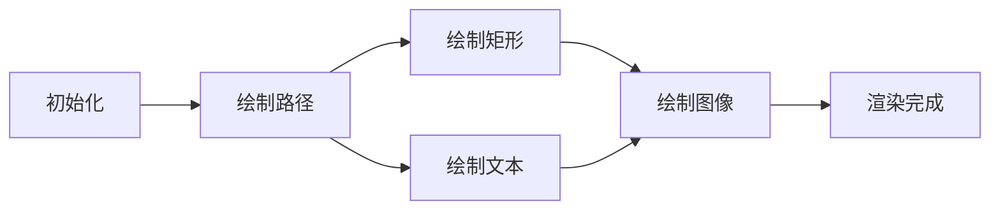
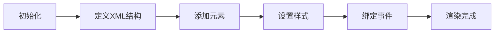
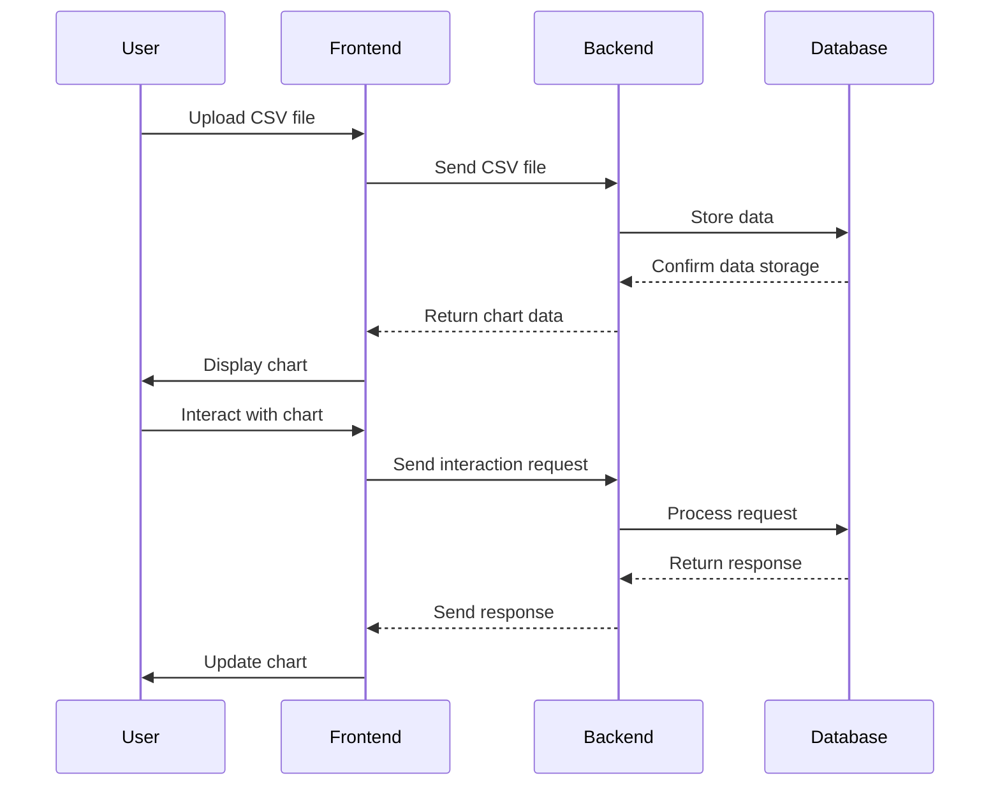

                 


# Canvas vs SVG：选择合适的绘图技术

## 关键词
Canvas、SVG、绘图技术、Web图形、渲染性能、交互设计

## 摘要
本文将深入探讨Canvas与SVG这两种流行的Web绘图技术，比较它们在功能、性能、使用场景等方面的优劣。通过详细的对比分析，读者将能够更好地理解何时选择Canvas，何时选择SVG，以便在Web开发中作出明智的决策。

## 引言
在Web开发中，图形渲染是一个至关重要的方面。无论是数据可视化、游戏开发还是图形界面设计，选择合适的绘图技术都能显著影响应用的性能、可扩展性和用户体验。Canvas和SVG是两种广泛使用的Web图形渲染技术，它们各自有着独特的优势和适用场景。

Canvas提供了一种2D绘图API，允许开发者直接在HTML5 `<canvas>`元素上进行绘图。Canvas适合需要动态图形交互的场景，如游戏、实时数据可视化等。然而，Canvas在复杂图形的渲染和处理上可能不如SVG高效。

SVG（可伸缩矢量图形）是一种基于XML的图形标准，能够定义和操作二维矢量图形。SVG的主要优势在于其高度可扩展性和可编辑性，适合用于复杂的、需要频繁修改的图形。然而，SVG在动态交互和渲染性能上可能不如Canvas。

本文将首先介绍Canvas和SVG的基本概念，随后进行详细的比较分析，最后通过实际案例展示如何选择合适的绘图技术。希望通过本文，读者能够对Canvas和SVG有更深入的了解，并在实际开发中做出最佳选择。

## Canvas概述
Canvas是HTML5引入的一个2D绘图API，允许开发者使用JavaScript在网页上绘制图形。它提供了一个画布，开发者可以通过JavaScript的API在这个画布上进行绘图操作。

### Canvas使用场景
Canvas通常用于以下场景：

1. **动态图形**：例如游戏、实时图表、动画等，因为Canvas可以实时地更新和绘制图形。
2. **图像处理**：如图像滤镜、缩放、旋转等操作，Canvas提供了丰富的绘图函数来处理这些任务。
3. **数据可视化**：Canvas适合绘制复杂的数据可视化图表，如饼图、折线图、柱状图等。

### Canvas局限性
尽管Canvas功能强大，但它也存在一些局限性：

1. **性能问题**：Canvas在渲染大量图形时可能会出现性能瓶颈，尤其是在需要频繁重绘的场景中。
2. **交互限制**：Canvas不直接支持交互式元素，如文本框、复选框等，需要额外的开发工作来实现这些功能。
3. **复杂图形渲染**：对于复杂的矢量图形，Canvas可能不如SVG高效。

### Canvas特点
Canvas的主要特点包括：

1. **2D绘图API**：提供了丰富的绘图函数，如`line()`、`rect()`、`arc()`等，用于绘制基本图形。
2. **图像操作**：支持图像的加载和操作，如绘制图像、图像滤镜等。
3. **文字操作**：支持文本的绘制和格式化，如字体、颜色、对齐方式等。
4. **性能优化**：通过优化绘图操作和避免频繁的重绘，可以提高Canvas的性能。

## SVG概述
SVG（可伸缩矢量图形）是基于XML的矢量图形标准，可以在网页上定义和操作二维矢量图形。SVG的主要特点是高度可扩展性和可编辑性，适合用于需要频繁修改的图形。

### SVG使用场景
SVG通常用于以下场景：

1. **图标和标志**：由于SVG是矢量图形，可以无限缩放而不会失真，非常适合用于图标和标志。
2. **复杂图形**：如地图、流程图、图表等，SVG提供了丰富的标记和属性，可以方便地定义和修改图形。
3. **交互式图形**：SVG可以直接包含交互式元素，如按钮、文本框等，便于实现复杂的用户交互。

### SVG优势与劣势
SVG的主要优势包括：

1. **高度可扩展性**：SVG图形是矢量图形，可以无限缩放而不失真，适合各种屏幕尺寸。
2. **可编辑性**：由于SVG基于XML，开发者可以直接编辑和修改SVG代码，便于后期维护和调整。
3. **交互性**：SVG支持交互式元素和事件处理，便于实现复杂的用户交互。

SVG的劣势主要包括：

1. **性能问题**：SVG在大型图形或复杂动画中可能存在性能问题，尤其是在旧版浏览器中。
2. **代码复杂性**：SVG代码可能比较复杂，尤其是对于大型图形或复杂交互，编写和维护可能相对困难。
3. **浏览器支持**：虽然现代浏览器普遍支持SVG，但早期版本浏览器可能不支持。

### SVG特点
SVG的主要特点包括：

1. **矢量图形**：SVG使用矢量图形，可以无限缩放而不会失真。
2. **基于XML**：SVG基于XML标准，易于编辑和修改。
3. **交互性**：SVG支持交互式元素和事件处理，便于实现复杂交互。
4. **支持CSS样式**：SVG支持使用CSS样式来控制图形的样式和布局。

## Canvas与SVG的对比分析
Canvas和SVG各有其独特的优势和适用场景，下面我们将从几个方面详细对比这两种技术。

### 核心特性对比

#### Canvas
- **绘图API**：提供简单的2D绘图API，如`line()`、`rect()`、`arc()`等。
- **图像操作**：支持图像的加载和操作，如绘制图像、图像滤镜等。
- **文字操作**：支持文本的绘制和格式化，如字体、颜色、对齐方式等。
- **性能优化**：通过优化绘图操作和避免频繁的重绘，可以提高Canvas的性能。

#### SVG
- **矢量图形**：使用基于XML的标记定义矢量图形，可以无限缩放而不失真。
- **交互性**：支持交互式元素和事件处理，便于实现复杂交互。
- **基于XML**：SVG代码基于XML标准，易于编辑和修改。
- **支持CSS样式**：SVG支持使用CSS样式来控制图形的样式和布局。

### 性能对比

#### Canvas
- **渲染性能**：Canvas在渲染简单图形和大量图形时表现良好，但可能在复杂图形的渲染上存在性能问题。
- **动态交互**：Canvas适合动态图形交互，如游戏和实时数据可视化。

#### SVG
- **渲染性能**：SVG在渲染大量图形或复杂动画时可能存在性能问题，尤其是在旧版浏览器中。
- **动态交互**：SVG支持复杂的交互式元素和事件处理，但可能不如Canvas适合动态交互。

### 使用场景对比

#### Canvas
- **游戏开发**：Canvas是游戏开发的常用技术，因为它提供了高效的绘图和交互能力。
- **数据可视化**：Canvas适合绘制复杂的数据可视化图表，但可能在渲染性能上不如SVG。
- **图像处理**：Canvas在图像处理方面功能强大，如图像滤镜、缩放、旋转等。

#### SVG
- **图标和标志**：SVG适合创建高可扩展性的图标和标志，因为它是矢量图形。
- **复杂图形**：SVG适合用于复杂图形，如地图、流程图等，因为它的XML结构便于编辑。
- **交互式设计**：SVG适合实现复杂的交互式设计，因为它支持交互式元素和事件处理。

### 核心概念原理对比
为了更深入地理解Canvas和SVG的核心概念，下面我们将通过对比表格和ER实体关系图来展示它们的主要特性。

#### 对比表格

| 特性         | Canvas               | SVG                        |
|--------------|----------------------|----------------------------|
| 图形类型     | 位图图形和矢量图形   | 矢量图形                   |
| 基础结构     | JavaScript API       | XML标记                    |
| 可扩展性     | 不如SVG              | 非常高                     |
| 动态交互     | 较好                 | 非常好                     |
| 文本支持     | 中等                 | 非常好                     |
| 图形复杂度   | 可以处理复杂图形     | 非常适合处理复杂图形       |
| 浏览器兼容性 | 大部分现代浏览器支持 | 大部分现代浏览器支持       |
| 代码复杂性   | 较简单               | 相对复杂                   |

#### ER实体关系图

```mermaid
erDiagram
    Canvas ||--|{ SVG }|--|| RenderAPI
    Canvas ||--|{ Drawing }|--|| Graphics
    SVG ||--|{ Animation }|--|| Interactive
    SVG ||--|{ Vector }|--|| Scalable
```

在这个ER实体关系图中，Canvas与SVG通过`RenderAPI`和`Graphics`关联，表示Canvas和SVG都是用于渲染图形的技术。SVG与`Animation`和`Interactive`关联，表示它支持动画和交互功能。同时，SVG与`Vector`和`Scalable`关联，表示它是基于矢量的，具有高度的可扩展性。

### 算法原理讲解
为了进一步理解Canvas和SVG的工作原理，我们可以通过Mermaid流程图来展示它们的渲染和交互过程，并使用Python代码来详细阐述算法原理。

#### Canvas渲染流程



#### SVG渲染流程



#### Python代码示例
以下是一个简单的Python代码示例，分别展示了Canvas和SVG的基本绘图操作。

#### Canvas示例

```python
import numpy as np
from matplotlib import pyplot as plt

# 创建一个画布
fig, ax = plt.subplots()

# 绘制路径
ax.plot([0, 1, 2, 3], [0, 1, 0, 1], color='blue')

# 绘制矩形
ax.rectangle(0.5, 0.5, 1, 1, color='red')

# 绘制文本
ax.text(0.75, 0.25, 'Hello, Canvas!', fontsize=12, color='green')

# 显示图像
ax.imshow(np.random.rand(10, 10), cmap='gray')

# 渲染画布
plt.show()
```

#### SVG示例

```html
<svg width="200" height="200">
  <!-- 定义路径 -->
  <path d="M10 10 H 90 V 90 H 10 L 10 10" stroke="blue" fill="transparent"/>

  <!-- 定义矩形 -->
  <rect x="50" y="50" width="100" height="100" stroke="red" fill="transparent"/>

  <!-- 定义文本 -->
  <text x="100" y="100" font-size="16" fill="green">Hello, SVG!</text>

  <!-- 定义图像 -->
  <image x="0" y="0" width="100%" height="100%" xlink:href="data:image/jpeg;base64,/9j/4AAQSkZJRgABxIAA..."/>
</svg>
```

通过这些示例，我们可以看到Canvas和SVG在绘制图形上的相似性和差异性。Canvas提供了更简单的API和更高效的渲染性能，而SVG提供了更丰富的图形定义和交互功能。

### 系统分析与架构设计
在Web开发中，Canvas和SVG的应用场景各有不同。为了更好地理解它们在系统架构中的位置和作用，我们可以通过一个实际的项目来介绍系统功能设计、架构设计和接口设计。

#### 项目介绍
假设我们正在开发一个在线图表可视化工具，该工具允许用户上传CSV数据文件，并将其转换为交互式图表，如折线图、柱状图和饼图等。

#### 系统功能设计
系统的主要功能包括：

1. **数据导入**：用户可以上传CSV文件，系统将解析并存储数据。
2. **图表生成**：根据上传的数据，系统将生成相应的图表。
3. **图表交互**：用户可以与图表进行交互，如缩放、拖动和点击等。
4. **图表导出**：用户可以将图表导出为图片或PDF格式。

#### 系统架构设计
系统架构包括以下几个主要部分：

1. **前端**：使用Vue.js框架实现，负责数据展示和用户交互。
2. **后端**：使用Node.js和Express框架实现，负责数据解析和处理。
3. **数据库**：使用MongoDB存储用户上传的CSV数据和生成的图表信息。

#### 系统接口设计
以下是系统的主要接口设计：

1. **数据导入接口**：用于接收用户上传的CSV文件，并存储数据。
2. **数据解析接口**：用于解析CSV数据，并将其转换为图表数据结构。
3. **图表生成接口**：用于生成图表，并返回图表的HTML或SVG代码。
4. **图表交互接口**：用于处理用户与图表的交互请求，如缩放和拖动等。

#### 系统交互流程
以下是系统交互的主要流程：

1. **用户上传CSV文件**，前端将文件上传到后端。
2. **后端解析CSV文件**，并将其转换为图表数据结构。
3. **后端生成图表**，并返回图表的HTML或SVG代码。
4. **前端接收图表代码**，并将其渲染在页面上。
5. **用户与图表交互**，前端将交互请求发送到后端，后端处理请求并返回响应。
6. **图表更新**，前端根据后端返回的响应更新图表。

#### 系统交互Mermaid序列图



通过这个系统示例，我们可以看到Canvas和SVG在Web开发中的应用。Canvas适合生成动态交互的图表，而SVG适合生成复杂且需要交互的图标和标志。系统的设计和实现展示了如何在不同的场景下选择合适的绘图技术。

### 项目实战
在本节中，我们将通过一个实际案例来展示如何使用Canvas和SVG进行Web图形渲染。我们将分别介绍环境安装、系统核心实现和代码应用解读与分析。

#### 环境安装
首先，我们需要安装Node.js和npm（Node.js的包管理器）。您可以从[Node.js官网](https://nodejs.org/)下载并安装Node.js。安装完成后，打开命令行窗口，运行以下命令来检查Node.js和npm是否已正确安装：

```bash
node -v
npm -v
```

接下来，我们需要安装一些依赖项，如Vue.js、Express和MongoDB等。在项目目录中运行以下命令：

```bash
npm install vue express mongodb
```

#### 系统核心实现
我们将使用Vue.js和Express来实现一个简单的在线图表可视化工具。以下是主要步骤：

1. **创建Vue.js前端应用**：

在项目根目录下运行以下命令来创建Vue.js应用：

```bash
vue create chart-app
```

2. **配置Express后端**：

在`src`目录下创建一个名为`backend`的目录，并在其中创建一个名为`server.js`的文件。在这个文件中，我们将使用Express创建一个简单的Web服务器：

```javascript
const express = require('express');
const app = express();

app.use(express.json());
app.use(express.urlencoded({ extended: true }));

app.post('/upload', (req, res) => {
    // 处理上传的CSV文件
    // 解析CSV数据
    // 生成图表数据结构
    // 返回图表数据
});

const PORT = process.env.PORT || 3000;
app.listen(PORT, () => {
    console.log(`Server listening on port ${PORT}`);
});
```

3. **实现Canvas和SVG绘图功能**：

在`src`目录下创建一个名为`charts`的目录，并在其中分别创建`canvas.js`和`svg.js`文件。这两个文件将分别实现Canvas和SVG的绘图功能。

`canvas.js`示例：

```javascript
function drawCanvas(data) {
    const canvas = document.createElement('canvas');
    const ctx = canvas.getContext('2d');

    // 根据数据绘制图形
    // ...

    return canvas;
}
```

`svg.js`示例：

```javascript
function drawSVG(data) {
    const svg = document.createElementNS('http://www.w3.org/2000/svg', 'svg');
    // 根据数据绘制图形
    // ...

    return svg;
}
```

#### 代码应用解读与分析
以下是前端和后端的代码应用解读与分析：

**前端代码解读**：

```html
<!-- 在 src/App.vue 中 -->
<template>
  <div>
    <canvas ref="canvasChart"></canvas>
    <svg ref="svgChart"></svg>
  </div>
</template>

<script>
import axios from 'axios';

export default {
  name: 'ChartApp',
  methods: {
    uploadData() {
        // 获取用户上传的数据
        // 发送请求到后端
        // 根据返回的图表数据更新Canvas或SVG
    }
  }
};
</script>
```

这段代码展示了如何在前端通过Vue.js创建一个简单的图表可视化工具。用户可以选择上传CSV文件，后端将处理文件并生成相应的图表数据。前端将根据返回的数据更新Canvas或SVG元素。

**后端代码解读**：

```javascript
// 在 server.js 中
app.post('/upload', async (req, res) => {
    const csvData = req.body.csvData;

    // 解析CSV数据
    const parsedData = parseCSV(csvData);

    // 生成Canvas或SVG图表
    const canvasChart = drawCanvas(parsedData);
    const svgChart = drawSVG(parsedData);

    // 返回图表HTML或SVG代码
    res.send({
        canvas: canvasChart.toDataURL(),
        svg: svgChart.outerHTML
    });
});

function parseCSV(csvData) {
    // 解析CSV数据并返回图表数据结构
    // ...
}

function drawCanvas(data) {
    // 使用Canvas绘制图表
    // ...
}

function drawSVG(data) {
    // 使用SVG绘制图表
    // ...
}
```

这段代码展示了后端如何接收用户上传的CSV数据，解析数据并生成相应的图表。Canvas和SVG绘图函数将根据数据生成图表，并将图表的HTML或SVG代码返回给前端。

**实际案例分析**：
假设我们有一个包含股票价格数据的CSV文件。后端将解析这个文件，生成一个折线图来展示股票价格的变动。前端将根据返回的数据更新Canvas或SVG元素，展示折线图。

1. **后端生成图表**：

```javascript
const parsedData = parseCSV(csvData);

// 生成Canvas图表
const canvasChart = drawCanvas(parsedData);

// 返回Canvas图表的DataURL
res.send({
    canvas: canvasChart.toDataURL()
});

// Canvas图表绘制代码
function drawCanvas(data) {
    const canvas = document.createElement('canvas');
    const ctx = canvas.getContext('2d');

    // 设置画布尺寸
    canvas.width = 600;
    canvas.height = 300;

    // 绘制折线图
    ctx.beginPath();
    ctx.moveTo(0, canvas.height - data[0].price);
    for (let i = 1; i < data.length; i++) {
        ctx.lineTo(i * (canvas.width / data.length), canvas.height - data[i].price);
    }
    ctx.stroke();

    return canvas;
}
```

2. **前端渲染图表**：

```html
<!-- 在 src/App.vue 中 -->
<template>
  <div>
    <canvas ref="canvasChart"></canvas>
    <!-- SVG图表将在后续更新 -->
  </div>
</template>

<script>
export default {
  name: 'ChartApp',
  methods: {
    uploadData() {
        // 获取用户上传的数据
        // 发送请求到后端
        // 更新Canvas图表
    }
  },
  mounted() {
    this.uploadData();
  }
};
</script>
```

在这个案例中，我们展示了如何使用Canvas绘制一个简单的折线图。用户上传CSV文件后，后端将解析数据并生成Canvas图表，前端将接收并渲染这个图表。

通过这个实际案例，我们可以看到Canvas和SVG在实际应用中的使用场景。Canvas适合生成简单的、需要动态交互的图表，而SVG适合生成复杂且需要交互的图标和标志。开发者可以根据具体需求选择合适的绘图技术。

### 最佳实践与注意事项
在Web开发中，选择合适的绘图技术是关键。以下是关于Canvas和SVG的一些最佳实践和注意事项：

#### 最佳实践

1. **性能优化**：在Canvas中，尽量减少重绘次数，避免频繁的DOM操作。使用`requestAnimationFrame`来实现平滑的动画效果。
2. **交互设计**：在SVG中，利用其内置的交互功能，如鼠标事件和触摸事件，实现复杂的用户交互。
3. **响应式设计**：确保图形在多种设备上都能良好显示，对Canvas和SVG进行适当的缩放和布局调整。
4. **模块化代码**：将绘图代码封装成模块，便于复用和维护。

#### 注意事项

1. **浏览器兼容性**：确保您的应用在不同浏览器上都能正常工作，特别是在旧版浏览器中，SVG可能存在兼容性问题。
2. **代码可读性**：对于复杂的SVG代码，保持良好的结构和注释，以便于后期维护和修改。
3. **资源管理**：合理管理图形资源，如图像和字体，避免因资源加载导致性能问题。
4. **用户体验**：确保图形渲染速度快，交互流畅，为用户提供良好的使用体验。

通过遵循这些最佳实践和注意事项，开发者可以更好地利用Canvas和SVG技术，实现高性能、高质量的Web图形渲染。

### 拓展阅读
对于想要深入了解Canvas和SVG的读者，以下是一些推荐的参考资料：

1. **官方文档**：
   - [Canvas API文档](https://developer.mozilla.org/zh-CN/docs/Web/API/Canvas_API/Tutorial)
   - [SVG教程](https://www.w3school.com.cn/svg/)
2. **技术博客**：
   - [CSS-Tricks：SVG教程](https://css-tricks.com/svg-in-depth/)
   - [MDN Web Docs：Canvas教程](https://developer.mozilla.org/zh-CN/docs/Web/API/Canvas_API/Tutorial)
3. **书籍推荐**：
   - 《SVG图形设计基础》
   - 《Canvas图形编程艺术》
   - 《Web图形编程：Canvas与SVG实战》
4. **在线工具**：
   - [SVG编辑器](https://www.svgviewer.dev/)
   - [Canvas图形工具](https://www.html5canvastutorial.com/)

通过这些资料，读者可以更深入地了解Canvas和SVG的使用方法和最佳实践。

## 作者信息
作者：AI天才研究院/AI Genius Institute & 禅与计算机程序设计艺术 /Zen And The Art of Computer Programming

