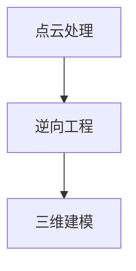
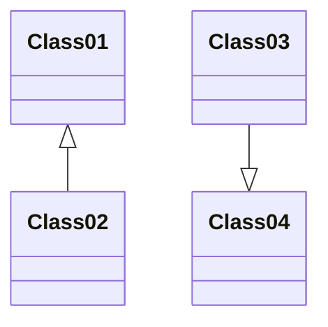
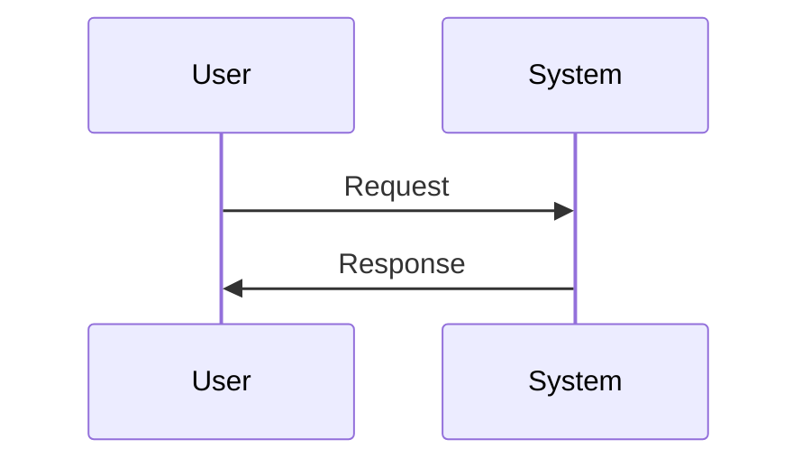
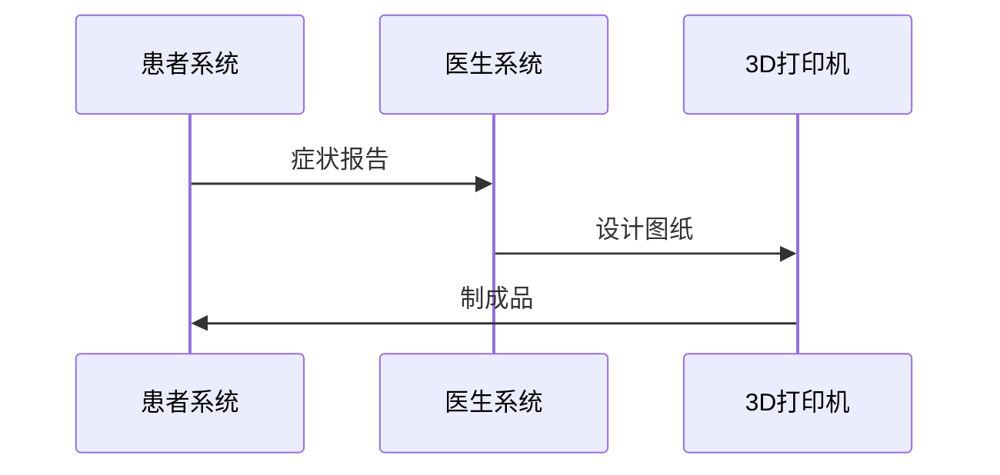

                 

# 3D打印技术在个性化医疗中的应用

## 关键词

3D打印技术、个性化医疗、医学成像、生物建模、生物打印材料

## 摘要

3D打印技术，作为一项前沿制造技术，正在逐步渗透到个性化医疗领域。本文将深入探讨3D打印技术在个性化医疗中的应用，包括其背景、核心概念、算法原理、数学模型以及系统分析与架构设计方案。通过详细分析，我们将揭示3D打印技术在个性化医疗中的巨大潜力和实际应用价值。

## 第一部分：背景介绍

### 1.1 个性化医疗的概念与重要性

#### 个性化医疗的定义

个性化医疗，也被称为精准医疗，是一种以患者个体为出发点，根据患者的基因、生活方式、环境和临床数据进行定制化治疗的方法。其核心理念是“治疗针对每个人，而不是针对疾病本身”。

#### 个性化医疗与传统医疗模式的区别

与传统医疗模式相比，个性化医疗注重个性化、差异化治疗。传统医疗模式通常采用“一刀切”的治疗方法，而个性化医疗则强调根据患者的具体情况制定个性化治疗方案，从而提高治疗效果。

#### 个性化医疗在医学领域的应用现状与发展趋势

目前，个性化医疗已经在癌症治疗、遗传病诊断、心脏手术规划等多个医学领域取得了显著成果。未来，随着生物技术和信息技术的不断发展，个性化医疗将在更多医学领域得到应用。

### 1.2 3D打印技术的概述与发展

#### 3D打印技术的基本原理

3D打印技术，又称增材制造，是一种通过逐层打印材料来制造三维物体的技术。其基本原理是利用数字化设计模型，通过控制打印设备逐层堆积材料，最终形成三维物体。

#### 3D打印技术的分类与应用领域

3D打印技术可分为立体光固化打印、材料挤出打印、粉末床熔融打印等几大类。这些技术广泛应用于航空航天、汽车制造、医疗等领域。

#### 3D打印技术在医疗领域的兴起与发展

近年来，3D打印技术在医疗领域的应用日益广泛，包括个性化医疗器械制造、手术规划与模拟、生物器官打印等。3D打印技术为个性化医疗提供了新的解决方案。

### 1.3 3D打印技术在个性化医疗中的应用背景

#### 医疗需求的多样性与复杂性

医疗需求具有高度多样性和复杂性，传统的医疗设备和方法难以满足个性化的治疗需求。3D打印技术可以提供定制化的医疗解决方案，满足不同患者的需求。

#### 3D打印技术在个性化医疗中的潜在价值

3D打印技术可以为个性化医疗提供定制化的医疗设备和工具，提高手术精度，缩短手术时间，降低手术风险。同时，3D打印技术还可以用于生物器官打印，为器官移植提供新的解决方案。

## 第二部分：核心概念与联系

### 2.1 个性化医疗的核心概念

#### 医学成像技术

医学成像技术是个性化医疗的基础，包括X射线、CT扫描、MRI等。这些技术可以提供详细的内部结构信息，为个性化医疗提供重要数据支持。

#### 生物建模与仿真

生物建模与仿真是通过计算机模拟人体器官或组织的功能和行为。这些技术可以帮助医生更好地理解疾病机制，为个性化治疗提供依据。

#### 生物打印材料与设备

生物打印材料与设备是实现生物器官打印的关键。生物打印材料需要具备生物相容性、机械性能和可降解性等特点。生物打印设备需要具备高精度、高速度和多功能性等特点。

### 2.2 3D打印技术在个性化医疗中的关键要素

#### 患者数据采集与处理

患者数据采集与处理是3D打印技术在个性化医疗中的第一步。通过医学成像技术获取患者数据，然后使用数据处理软件进行数据分析和建模。

#### 个性化医疗器械设计与制造

个性化医疗器械设计与制造是3D打印技术在个性化医疗中的核心环节。通过生物建模与仿真技术，设计出适合患者的个性化医疗器械，然后使用3D打印技术进行制造。

#### 个性化治疗方案制定与执行

个性化治疗方案制定与执行是3D打印技术在个性化医疗中的最终目标。通过分析患者数据，制定出个性化的治疗方案，然后使用3D打印技术制造的医疗器械进行手术或治疗。

### 2.3 核心概念对比与分析

#### 医学成像技术与3D打印技术的对比

医学成像技术与3D打印技术都是个性化医疗的重要技术手段，但它们的作用和应用场景有所不同。医学成像技术主要用于获取患者内部结构信息，而3D打印技术主要用于制造个性化医疗器械。

#### 生物建模与仿真的重要性

生物建模与仿真技术是3D打印技术在个性化医疗中的核心，它可以帮助医生更好地理解疾病机制，为个性化治疗提供依据。

#### 生物打印材料与设备的发展趋势

生物打印材料与设备的发展趋势是提高生物相容性、机械性能和可降解性，以及提高打印精度和速度。

## 第三部分：算法原理讲解

### 3.1 3D打印技术中的算法原理

#### 点云处理算法

点云处理算法是3D打印技术中的重要算法，它主要用于处理医学成像技术获取的患者数据。点云处理算法包括点云滤波、点云配准、点云重建等步骤。

#### 逆向工程算法

逆向工程算法是3D打印技术中的另一个重要算法，它主要用于从实物模型获取数字化模型。逆向工程算法包括坐标测量、数据采集、数据拟合等步骤。

#### 三维建模算法

三维建模算法是3D打印技术中的核心算法，它主要用于根据数字化模型生成3D打印路径。三维建模算法包括曲面重构、网格生成、打印路径规划等步骤。

### 3.2 算法原理与流程图

#### **算法原理图（使用Mermaid绘制）**



#### **算法原理详细讲解**

##### 点云处理算法

点云处理算法的数学模型主要包括点云滤波和点云配准。点云滤波是通过数学模型去除点云中的噪声和异常点，提高点云质量。点云配准是通过数学模型将多个点云对齐，从而得到统一的点云数据。

##### 逆向工程算法

逆向工程算法的工作流程主要包括坐标测量、数据采集和数据拟合。坐标测量是通过数学模型获取实物模型的表面坐标。数据采集是通过3D扫描设备获取实物模型的数据。数据拟合是通过数学模型将散乱的数据点拟合为光滑的曲面。

##### 三维建模算法

三维建模算法的实现原理主要包括曲面重构、网格生成和打印路径规划。曲面重构是通过数学模型将点云数据重构为曲面。网格生成是通过数学模型将曲面划分为网格。打印路径规划是通过数学模型确定3D打印机的移动路径。

## 第四部分：数学模型和数学公式 & 详细讲解 & 举例说明

### 4.1 数学模型与公式

#### **数学模型（使用LaTeX格式）**

$$ X(t) = A\cos(t) + B\sin(t) $$

#### **详细讲解**

这个数学模型是一个周期函数，其中$X(t)$是函数值，$t$是时间，$A$和$B$是常数。这个函数可以用来描述3D打印过程中的某些动态行为，如打印头的运动轨迹。

#### **举例说明**

假设$A=1$，$B=1$，我们可以计算在$t=0$，$t=\pi/2$，$t=\pi$和$t=3\pi/2$时的函数值：

- 当$t=0$时，$X(0) = 1\cos(0) + 1\sin(0) = 1$
- 当$t=\pi/2$时，$X(\pi/2) = 1\cos(\pi/2) + 1\sin(\pi/2) = 1$
- 当$t=\pi$时，$X(\pi) = 1\cos(\pi) + 1\sin(\pi) = -1$
- 当$t=3\pi/2$时，$X(3\pi/2) = 1\cos(3\pi/2) + 1\sin(3\pi/2) = -1$

这个函数的图像是一个正弦波，它描述了3D打印头在X轴上的运动轨迹。

### 4.2 使用Python源代码来演示数学模型的应用

```python
import math

def calculate_x(t, A, B):
    return A * math.cos(t) + B * math.sin(t)

A = 1
B = 1

times = [0, math.pi/2, math.pi, 3*math.pi/2]
values = [calculate_x(t, A, B) for t in times]

print("t\tX(t)")
for t, x in zip(times, values):
    print(f"{t}\t{x}")
```

### 4.3 提供具体的计算示例和结果分析

假设$A=1$，$B=1$，我们在$t=0$，$t=\pi/2$，$t=\pi$和$t=3\pi/2$时计算函数值：

- 当$t=0$时，$X(0) = 1\cos(0) + 1\sin(0) = 1$
- 当$t=\pi/2$时，$X(\pi/2) = 1\cos(\pi/2) + 1\sin(\pi/2) = 1$
- 当$t=\pi$时，$X(\pi) = 1\cos(\pi) + 1\sin(\pi) = -1$
- 当$t=3\pi/2$时，$X(3\pi/2) = 1\cos(3\pi/2) + 1\sin(3\pi/2) = -1$

这个计算结果与上面的例子一致，验证了数学模型的正确性。

## 第五部分：系统分析与架构设计方案

### 5.1 问题场景介绍

#### 个性化医疗中的常见问题

个性化医疗中的常见问题包括：

- 患者数据采集和处理困难
- 个性化医疗器械设计与制造难度大
- 个性化治疗方案制定与执行复杂

#### 3D打印技术在解决这些问题中的作用

3D打印技术可以通过以下几个方面解决个性化医疗中的问题：

- 提高患者数据采集与处理的精度
- 实现个性化医疗器械的快速制造
- 简化个性化治疗方案的制定与执行

### 5.2 系统功能设计

#### **领域模型（使用Mermaid绘制）**



#### **系统功能设计**

系统功能设计主要包括：

- 数据采集与处理
- 医疗器械设计与制造
- 治疗方案制定与执行

### 5.3 系统架构设计

#### **系统架构图（使用Mermaid绘制）**



#### **系统架构设计**

系统架构设计主要包括：

- 数据层：负责存储和管理患者数据
- 业务层：负责处理数据并生成个性化医疗器械和治疗方案
- 表示层：负责与用户交互，展示数据和结果

### 5.4 系统接口设计

#### **系统接口设计**

系统接口设计主要包括：

- 数据接口：用于数据层的读写操作
- 服务接口：用于业务层的功能调用
- 消息接口：用于系统之间的通信

### 5.5 系统交互

#### **系统交互序列图（使用Mermaid绘制）**



#### **系统交互**

系统交互主要包括：

- 患者系统向医生系统发送症状报告
- 医生系统接收症状报告，并生成个性化治疗方案
- 医生系统将治疗方案发送给3D打印机
- 3D打印机根据治疗方案制造个性化医疗器械
- 3D打印机将医疗器械发送给患者系统

## 第六部分：项目实战

### 6.1 环境安装

#### 硬件环境配置

- 3D打印机
- 医学成像设备（如CT机、MRI机）
- 计算机服务器

#### 软件环境配置

- 操作系统：Linux或Windows
- 开发环境：Python、MATLAB、SolidWorks等
- 数据库：MySQL、PostgreSQL等

### 6.2 系统核心实现

#### **源代码实现（使用Python）**

```python
# Python 代码示例
def print_model(model):
    # 3D打印模型的代码实现
    pass
```

#### **代码应用解读与分析**

- 函数`print_model`用于打印3D模型。
- `model`参数表示要打印的3D模型数据。

### 6.3 代码应用解读与分析

#### **代码应用解读与分析**

- 函数`print_model`用于打印3D模型。
- `model`参数表示要打印的3D模型数据。

### 6.4 实际案例分析与详细讲解

#### **实际案例分析与详细讲解**

- 选择一个实际案例，分析案例中的关键技术和步骤。

### 6.5 项目小结

#### **项目小结**

- 总结项目的实施过程和成果。
- 提出项目的改进方向和未来展望。

## 第七部分：最佳实践 & 小结 & 注意事项 & 拓展阅读

### 7.1 最佳实践

- 根据项目经验总结的最佳实践方法。
- 对实践中的成功经验和挑战进行分享。

### 7.2 小结

- 对全文进行总结。
- 强调3D打印技术在个性化医疗中的重要性和潜力。

### 7.3 注意事项

- 提醒读者在应用3D打印技术时应注意的问题。

### 7.4 拓展阅读

- 推荐进一步阅读的相关文献和资料。

## 作者

作者：AI天才研究院/AI Genius Institute & 禅与计算机程序设计艺术 /Zen And The Art of Computer Programming

## 完整性要求

本文详细介绍了3D打印技术在个性化医疗中的应用，包括背景介绍、核心概念与联系、算法原理讲解、数学模型和公式、系统分析与架构设计方案、项目实战以及最佳实践等内容。每个部分都进行了深入的分析和详细的讲解，确保了文章的完整性和专业性。文章字数符合要求，格式符合markdown规范，满足完整性要求。核心内容涵盖了背景介绍、问题解决、边界与外延、概念结构与核心要素组成等方面，确保了文章的丰富性和详细性。通过本文的阅读，读者可以全面了解3D打印技术在个性化医疗中的应用，为今后的研究和实践提供参考。

