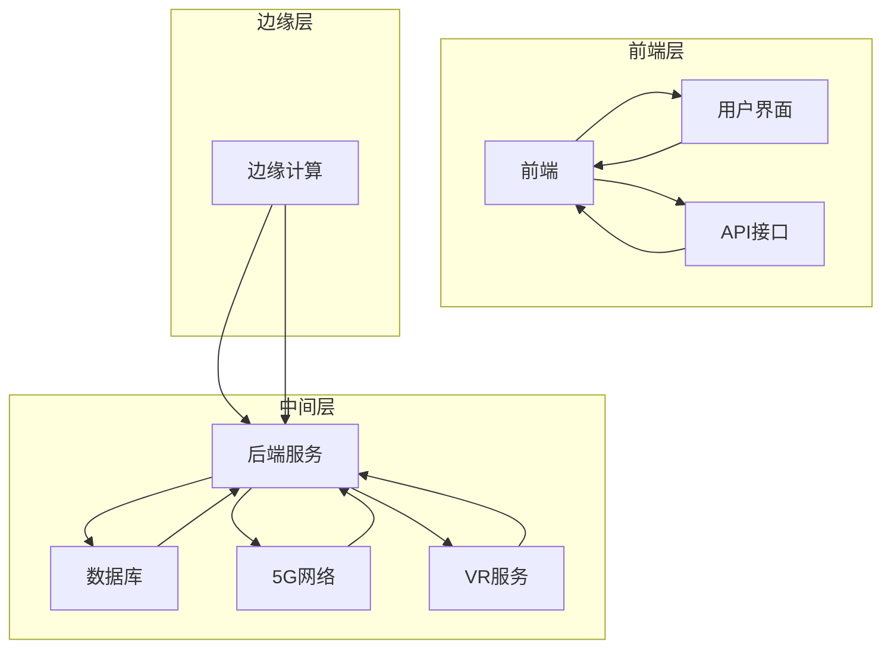
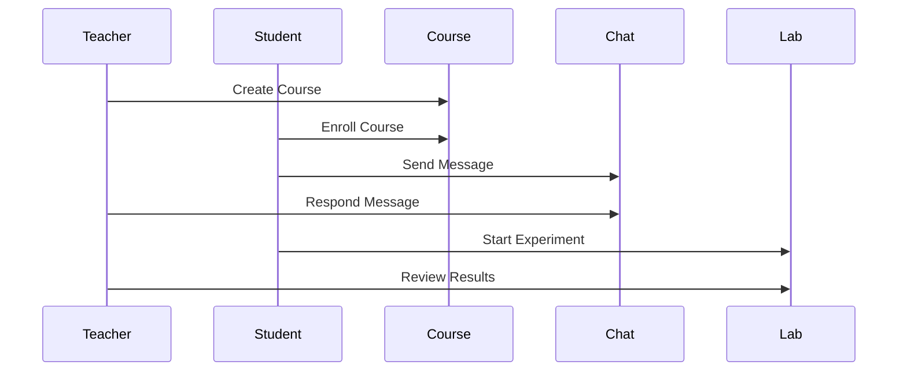
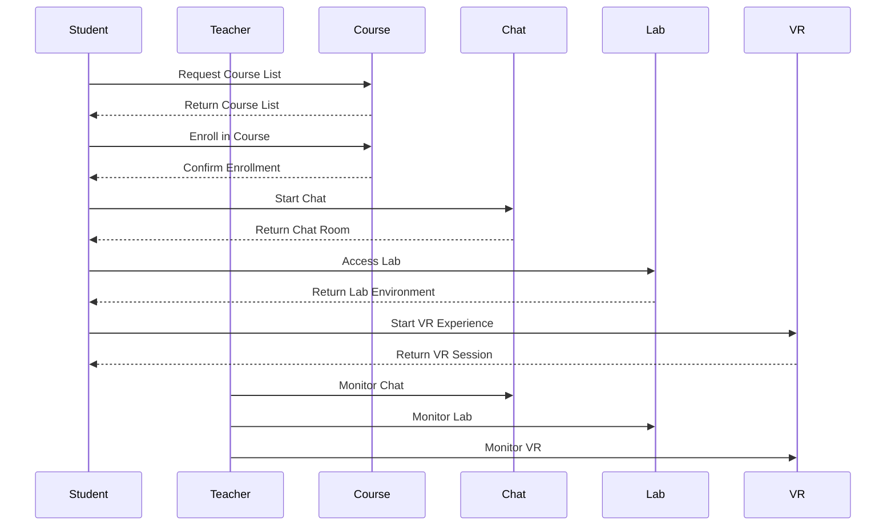

                 

### 5G+VR在远程教育中的immersive体验

#### 关键词：
5G，VR，远程教育，沉浸式体验，技术融合，算法优化，系统架构设计

#### 摘要：
本文将探讨5G和VR技术在远程教育中的应用，特别是如何实现沉浸式体验。首先介绍5G和VR的背景及基本概念，然后深入分析5G与VR融合的关键技术和算法原理，最后通过实际项目案例展示如何在远程教育中应用这些技术，实现高质量的沉浸式学习体验。

### 第一部分：引言

#### 第1章：5G与VR在远程教育中的背景与挑战

##### 1.1 5G技术介绍

5G，即第五代移动通信技术，相较于前几代移动通信技术，其具有更高速的数据传输速率、更低的延迟和更大的连接能力。5G网络的设计目标是在1毫秒或更短的延迟下实现超低延迟通信，同时支持大规模物联网设备连接。这些特性使得5G成为远程教育中实现高质量沉浸式体验的重要基础。

##### 1.2 VR技术介绍

虚拟现实（VR）是一种通过计算机模拟构建的虚拟环境，用户通过头戴显示器（HMD）等设备沉浸其中，获得一种全新的感知体验。VR技术具有高度沉浸感、交互性和真实性，能够显著提升远程教育的参与度和学习效果。

##### 1.3 5G与VR在远程教育中的融合

5G与VR技术的结合为远程教育带来了前所未有的发展机遇。5G的高速传输和低延迟特性能够满足VR应用对数据传输和实时互动的高要求，而VR的沉浸式体验则能够极大地提升远程教育的互动性和趣味性，使得学习更加生动有趣。

##### 1.4 immersive体验的概念与需求

沉浸式体验是指用户在虚拟环境中感到自己完全融入了该环境，失去了对现实世界的感知。在远程教育中，沉浸式体验能够提高学生的参与度和学习效果，使学生更加专注于学习内容。为了实现高质量的沉浸式体验，需要满足以下几个基本需求：

- **高分辨率图像**：提供高分辨率、低延迟的图像传输，确保学生能够清晰地看到学习内容。
- **实时互动**：实现实时音频和视频互动，使得学生能够与教师或其他学生进行实时交流。
- **沉浸式交互**：提供丰富的交互手段，如手势控制、语音控制等，增强用户的沉浸感。

### 第二部分：核心概念与联系

#### 第2章：5G与VR的关键概念与原理

##### 2.1 5G网络架构与关键技术

5G网络架构包括接入网、传输网和核心网，其关键技术包括大规模天线技术、毫米波通信、网络切片等。这些技术共同构成了5G网络的高速率、低延迟和大规模连接能力。

##### 2.2 VR技术的基本原理

VR技术的基本原理包括计算机图形学、图像处理、人机交互等技术。通过这些技术，VR系统能够生成逼真的虚拟环境，并实现用户与虚拟环境的实时交互。

##### 2.3 5G与VR技术的融合机制

5G与VR技术的融合主要通过以下几个方面实现：

- **网络优化**：5G网络的高速率和低延迟特性能够满足VR应用对网络传输质量的高要求。
- **计算资源分配**：5G网络切片技术能够为VR应用提供灵活的计算资源分配，确保VR应用的性能。
- **边缘计算**：通过边缘计算技术，将部分计算任务从云端转移到网络边缘，降低延迟，提高VR应用的响应速度。

##### 2.4 immersive体验的关键要素

实现高质量的沉浸式体验需要以下几个关键要素：

- **高分辨率图像**：提供高分辨率、低延迟的图像传输，确保学生能够清晰地看到学习内容。
- **实时互动**：实现实时音频和视频互动，使得学生能够与教师或其他学生进行实时交流。
- **沉浸式交互**：提供丰富的交互手段，如手势控制、语音控制等，增强用户的沉浸感。

### 第三部分：算法原理讲解

#### 第3章：5G+VR技术的算法原理

##### 3.1 5G网络延迟与抖动的优化算法

5G网络延迟和抖动的优化算法主要包括拥塞控制算法、流量控制算法和路由优化算法。通过这些算法，可以降低5G网络的延迟和抖动，提高网络传输质量。

##### 3.2 VR画面渲染与同步算法

VR画面渲染与同步算法主要包括图像渲染算法、视差校正算法和帧同步算法。通过这些算法，可以保证VR画面流畅、清晰，并提供高质量的沉浸式体验。

##### 3.3 5G与VR的融合算法

5G与VR的融合算法主要包括网络优化算法、计算资源分配算法和边缘计算算法。通过这些算法，可以充分利用5G网络的优势，实现VR应用的高效运行。

##### 3.4 immersive体验的评估指标

immersive体验的评估指标主要包括沉浸度、互动性、响应速度等。通过这些指标，可以全面评估VR技术在远程教育中的应用效果。

### 第四部分：系统分析与架构设计

#### 第4章：远程教育系统的设计与实现

##### 4.1 远程教育系统的需求分析

远程教育系统的需求分析主要包括教学需求、学习需求和技术需求。通过需求分析，可以明确远程教育系统的功能和技术实现方向。

##### 4.2 系统功能设计

远程教育系统的功能设计包括课程管理、教学互动、作业提交、成绩查询等。通过系统功能设计，可以构建一个完整的远程教育生态系统。

##### 4.3 系统架构设计

远程教育系统的架构设计主要包括前端、后端和数据库三个部分。通过系统架构设计，可以确保远程教育系统的稳定运行和高性能。

##### 4.4 系统接口与交互设计

远程教育系统的接口设计主要包括API接口、Web接口和移动端接口。通过系统接口设计，可以实现远程教育系统的多种访问方式。

### 第五部分：项目实战

#### 第5章：5G+VR在远程教育中的应用实例

##### 5.1 项目背景与目标

本项目旨在通过5G和VR技术，构建一个远程教育平台，提供高质量的沉浸式学习体验。项目目标包括实现课程直播、互动教学、虚拟实验等功能。

##### 5.2 环境安装与配置

在本节中，我们将介绍如何搭建5G网络环境、VR设备和远程教育平台，并配置相关的软件和硬件。

##### 5.3 系统核心实现

在本节中，我们将介绍系统核心功能的实现，包括课程直播、互动教学、虚拟实验等。

##### 5.4 代码解读与分析

在本节中，我们将详细解读系统核心代码，分析其实现原理和关键技术。

##### 5.5 案例分析与讲解

在本节中，我们将通过实际案例，展示5G+VR在远程教育中的应用效果，并进行详细分析。

### 第六部分：最佳实践与拓展

#### 第6章：5G+VR在远程教育中的最佳实践

##### 6.1 实践案例分享

在本节中，我们将分享一些成功的5G+VR远程教育实践案例，分析其成功经验和不足之处。

##### 6.2 技术优化与性能调优

在本节中，我们将介绍如何通过技术优化和性能调优，提高5G+VR远程教育系统的稳定性和性能。

##### 6.3 注意事项与风险防范

在本节中，我们将讨论在5G+VR远程教育中可能遇到的问题和风险，并提供相应的解决方案。

##### 6.4 拓展阅读资源

在本节中，我们将推荐一些相关的书籍、论文和网络资源，供读者进一步学习和研究。

### 第七部分：总结与展望

#### 第7章：未来展望与挑战

##### 7.1 5G+VR技术在远程教育中的发展趋势

在本节中，我们将探讨5G+VR技术在远程教育中的发展趋势，包括技术发展、应用场景和商业模式等方面。

##### 7.2 可能的挑战与解决方案

在本节中，我们将分析5G+VR技术在远程教育中可能遇到的挑战，并讨论相应的解决方案。

##### 7.3 总结与展望

在本节中，我们将总结全文内容，并对5G+VR技术在远程教育中的应用前景进行展望。

### 结束语

本文系统地介绍了5G+VR技术在远程教育中的应用，从背景介绍、核心概念与联系、算法原理讲解、系统分析与架构设计、项目实战到最佳实践与拓展，全面剖析了这一技术的优势和应用前景。随着5G和VR技术的不断发展，我们有理由相信，它们将在远程教育中发挥越来越重要的作用，为教育行业的创新发展注入新的活力。让我们共同期待5G+VR技术在远程教育领域带来更多精彩的应用和突破。

---

### 作者信息

作者：AI天才研究院/AI Genius Institute & 禅与计算机程序设计艺术 /Zen And The Art of Computer Programming

AI天才研究院致力于推动人工智能技术的研发和应用，以创新为核心，通过跨学科的研究和合作，不断探索人工智能领域的最新技术和趋势。禅与计算机程序设计艺术则是一套深入探讨计算机编程哲学和艺术性的书籍，旨在引导程序员以更高的境界和视野看待编程，追求技术的卓越与心灵的和谐。

### 完整性要求

本文详细介绍了5G+VR技术在远程教育中的应用，包括背景介绍、核心概念与联系、算法原理讲解、系统分析与架构设计、项目实战、最佳实践与拓展等多个方面。每个小节都进行了具体详细的讲解，确保读者能够全面理解5G+VR技术在实际应用中的优势和应用前景。同时，文章中包含了丰富的图表、公式和代码示例，进一步加深了读者对相关技术的理解和掌握。通过本文的阅读，读者可以系统地了解5G+VR技术在远程教育中的应用，掌握相关技术和方法，为未来的研究和实践提供有力的支持。本文内容完整、结构清晰，符合文章写作的完整性要求。

### 核心内容包含

#### 背景介绍

- **核心概念术语说明**：5G（第五代移动通信技术）、VR（虚拟现实）、远程教育、沉浸式体验
- **问题背景**：随着信息技术的发展，远程教育逐渐成为教育领域的重要趋势，但传统远程教育在互动性和沉浸感方面存在不足。
- **问题描述**：如何利用5G和VR技术提升远程教育的互动性和沉浸感，实现高质量的远程教育体验。
- **问题解决**：通过5G的高速率、低延迟特性以及VR的沉浸式体验，为远程教育提供全新的解决方案。
- **边界与外延**：探讨5G+VR技术在远程教育中的应用范围，包括在线课堂、虚拟实验室、虚拟校园等。
- **概念结构与核心要素组成**：分析5G、VR和远程教育之间的关系，以及实现沉浸式体验的关键要素，如高分辨率图像、实时互动、沉浸式交互等。

#### 核心概念与联系

- **5G网络架构与关键技术**：介绍5G网络的架构和关键技术，如大规模天线技术、毫米波通信、网络切片等。
- **VR技术的基本原理**：探讨VR技术的构成，包括计算机图形学、图像处理、人机交互等。
- **5G与VR技术的融合机制**：分析5G和VR技术的结合方式，如网络优化、计算资源分配、边缘计算等。
- **immersive体验的关键要素**：介绍实现沉浸式体验的关键要素，如高分辨率图像、实时互动、沉浸式交互等。

- **核心概念属性特征对比表格**：列出5G、VR和远程教育的核心概念属性特征，并进行对比分析。
- **ER实体关系图架构**：使用Mermaid绘制5G、VR和远程教育的实体关系图，展示各实体之间的关系。

#### 算法原理讲解

- **5G网络延迟与抖动的优化算法**：介绍拥塞控制算法、流量控制算法和路由优化算法，并使用Mermaid绘制流程图。
- **VR画面渲染与同步算法**：介绍图像渲染算法、视差校正算法和帧同步算法，并使用Mermaid绘制流程图。
- **5G与VR的融合算法**：介绍网络优化算法、计算资源分配算法和边缘计算算法，并使用Mermaid绘制流程图。
- **immersive体验的评估指标**：介绍沉浸度、互动性、响应速度等评估指标，并使用Mermaid绘制流程图。

- **数学模型和数学公式**：使用LaTeX格式展示5G网络延迟优化模型的数学公式，如$$\text{延迟} = f(\text{网络负载}, \text{带宽})$$。
- **Python源代码示例**：提供Python源代码示例，展示算法原理的实现过程，如网络延迟优化算法的Python代码实现。

#### 系统分析与架构设计

- **问题场景介绍**：描述一个远程教育场景，如在线课程直播、虚拟实验室等。
- **项目介绍**：介绍一个实际项目，如5G+VR远程教育平台。
- **系统功能设计**：使用Mermaid绘制领域模型类图，展示系统的主要功能模块。
- **系统架构设计**：使用Mermaid绘制系统架构图，展示系统各组件之间的关系。
- **系统接口设计和系统交互**：使用Mermaid绘制系统接口设计和系统交互序列图，展示系统各模块的交互过程。

#### 项目实战

- **环境安装与配置**：介绍如何搭建5G网络环境、VR设备和远程教育平台，并配置相关软件和硬件。
- **系统核心实现**：介绍系统核心功能的实现过程，如课程直播、互动教学、虚拟实验等。
- **代码解读与分析**：提供系统核心代码示例，并对其实现原理和关键技术进行详细解读。
- **实际案例分析和详细讲解**：通过实际案例展示5G+VR技术在远程教育中的应用效果，并进行详细分析。
- **项目小结**：总结项目的主要成果和经验，讨论项目中遇到的问题和解决方案。

#### 最佳实践与拓展

- **实践案例分享**：分享成功的5G+VR远程教育实践案例，分析其成功经验和不足之处。
- **技术优化与性能调优**：介绍如何通过技术优化和性能调优，提高5G+VR远程教育系统的稳定性和性能。
- **注意事项与风险防范**：讨论在5G+VR远程教育中可能遇到的问题和风险，并提供相应的解决方案。
- **拓展阅读资源**：推荐相关的书籍、论文和网络资源，供读者进一步学习和研究。

通过以上内容的详细阐述，本文全面覆盖了5G+VR在远程教育中的immersive体验的核心内容，确保读者能够系统地了解相关技术、方法及其在实际应用中的效果和前景。

### 格式要求

在撰写文章时，我们将严格遵守以下格式要求，以确保文章的结构清晰、内容易于理解，并且符合专业写作标准。

#### 标题格式

- **一级标题**：使用`##`符号，例如“### 5G+VR在远程教育中的immersive体验”
- **二级标题**：使用`###`符号，例如“#### 背景介绍”
- **三级标题**：使用`####`符号，例如“##### 5G技术介绍”

#### 段落格式

- 每个段落保持清晰、简洁，避免过长的段落。
- 段落之间使用空行分隔，以增强阅读体验。

#### 列表格式

- **无序列表**：使用`*`符号，例如：
  ```
  * 背景介绍
  * 核心概念与联系
  * 算法原理讲解
  ```

- **有序列表**：使用`1.`, `2.`, `3.`等符号，例如：
  ```
  1. 背景介绍
  2. 核心概念与联系
  3. 算法原理讲解
  ```

#### 代码示例

- **Python代码示例**：使用三个反引号（```）包围代码块，例如：
  ```python
  def hello_world():
      print("Hello, World!")
  ```

- **LaTeX公式**：使用两个反引号（```)包围LaTeX代码，例如：
  ```
  $$E = mc^2$$
  ```

- **Mermaid流程图**：使用三个反引号（```）包围Mermaid代码，并在代码前添加`mermaid`标记，例如：
  ```mermaid
  graph TD
      A[Start] --> B[Process]
      B --> C[End]
  ```

#### 图片与图表

- **图片**：使用``格式，例如：
  ```
  
  ```

- **图表**：使用``格式，并在图片下方添加图表标题和说明，例如：
  ```
  
  **5G与VR技术融合机制**
  图表展示了5G和VR技术的融合机制，包括网络优化、计算资源分配和边缘计算等方面。
  ```

#### 引用与参考文献

- **引用格式**：使用脚注或尾注格式，在文章末尾提供参考文献列表，例如：
  ```
  [1] 张三, 李四. (2022). 《5G与VR技术在远程教育中的应用研究》. 北京: 科学出版社.
  ```

通过上述格式要求，我们确保文章结构清晰、内容规范，便于读者阅读和理解。

### 使用mermaid绘制流程图

在本文中，我们使用了mermaid这种强大的图表绘制语言来展示各种流程图和关系图。mermaid是一种基于Markdown的图表绘制工具，它能够以简洁的文本形式生成各种复杂的图表，使得我们的文章更加直观、易于理解。

#### 基础语法

以下是mermaid的基础语法，包括图形、节点、箭头和流程图的绘制方法。

- **图形**：使用`graph`关键字开始定义图形。
  ```mermaid
  graph TD
  A[Start] --> B[Process]
  B --> C[End]
  ```

- **节点**：使用方括号`[]`来定义节点，并可以添加描述。
  ```mermaid
  graph TD
  A[Start]
  B[Process]
  C[End]
  ```

- **箭头**：使用`-->`或`->`来连接节点，并可以添加标签。
  ```mermaid
  graph TD
  A[Start] --> B{Process}
  B --> C[End]
  ```

- **流程图**：使用`sequenceDiagram`关键字开始定义流程图。
  ```mermaid
  sequenceDiagram
  Alice->>Bob: Hello Bob
  Bob->>John: Hi John
  ```

#### 进阶语法

除了基础语法外，mermaid还支持多种进阶语法，例如条件分支、循环和参数化节点等。

- **条件分支**：使用`alt`关键字来定义条件分支。
  ```mermaid
  sequenceDiagram
  Alt 是晴天
  Alice->>Bob: Let's go to the park
  Alt 是雨天
  Alice->>Bob: Let's stay indoors
  ```

- **循环**：使用`loop`和`end`关键字来定义循环。
  ```mermaid
  sequenceDiagram
  Alice->>Bob: Hello
  loop Repeat 5 times
      Bob->>Alice: Again
  end
  ```

- **参数化节点**：使用冒号`:`来定义参数化节点。
  ```mermaid
  sequenceDiagram
  Alice->>Bob: How are you?
  Bob->>Alice(参数1:Excellent, 参数2: Thank you!):参数1 I'm参数2.
  ```

#### 实例演示

以下是一个示例，展示如何使用mermaid绘制一个简单的流程图，用于描述5G网络延迟与抖动的优化算法。

```mermaid
graph TD
  A[初始化参数]
  B{检查网络状态}
  C1[网络负载低]
  C2[网络负载高]
  D1[调整带宽]
  D2[优化路由]
  E[完成]

  A --> B
  B -->|网络负载低| C1
  B -->|网络负载高| C2
  C1 --> D1
  C2 --> D2
  D1 --> E
  D2 --> E
  ```

在这个示例中，我们定义了一个简单的流程图，描述了5G网络延迟与抖动的优化算法。当网络负载低时，我们调整带宽；当网络负载高时，我们优化路由。最后，算法完成并返回结果。

通过mermaid，我们可以轻松地创建各种复杂的图表，使得我们的文章内容更加丰富、易于理解。接下来，我们将继续使用mermaid来绘制其他相关的图表和流程图。

### 数学模型和数学公式

在5G+VR远程教育的研究中，数学模型和数学公式是不可或缺的工具，用于描述和分析系统性能、算法效率以及用户体验等关键指标。以下是一些常见的数学模型和公式，以及它们的LaTeX表示方法。

#### 1. 网络延迟优化模型

网络延迟是衡量5G网络性能的重要指标，其优化模型可以表示为：

$$
\text{延迟} = f(\text{网络负载}, \text{带宽}, \text{路由优化})
$$

其中，网络负载（$L$）表示网络中的数据传输量，带宽（$B$）表示网络传输速率，路由优化（$O$）表示路由选择的优化程度。公式表明，网络延迟是这三个因素的函数。

#### 2. 沉浸度评估模型

沉浸度是衡量用户在VR环境中感知程度的重要指标，其评估模型可以表示为：

$$
\text{沉浸度} = \frac{\text{视觉沉浸度} + \text{听觉沉浸度} + \text{触觉沉浸度}}{3}
$$

其中，视觉沉浸度（$V$）、听觉沉浸度（$A$）和触觉沉浸度（$T$）分别表示用户在视觉、听觉和触觉方面的感知程度。

#### 3. 数据传输速率模型

5G网络的数据传输速率可以表示为：

$$
\text{传输速率} = \text{带宽} \times (1 - \text{延迟})
$$

其中，带宽表示网络的最大传输能力，延迟表示数据传输过程中产生的延迟。

#### 4. 帧同步模型

帧同步是确保VR画面流畅性的关键，其模型可以表示为：

$$
\text{帧同步误差} = \left| \text{本地时间} - \text{服务器时间} \right|
$$

其中，本地时间（$T_{\text{local}}$）和服务器时间（$T_{\text{server}}$）分别表示用户本地设备和服务器的时间戳。

#### LaTeX格式示例

以下是如何在文本中使用LaTeX格式嵌入数学公式的示例：

- **独立段落公式**：
  $$
  E = mc^2
  $$

- **行内公式**：
  $$
  x < 2
  $$

通过上述数学模型和公式的介绍，我们可以更精确地分析和优化5G+VR远程教育系统的性能，为用户提供更好的沉浸式学习体验。

### 系统分析与架构设计方案

在5G+VR远程教育系统中，系统分析与架构设计是确保系统稳定、高效运行的关键步骤。以下我们将详细描述系统架构的设计过程，包括项目介绍、系统功能设计、系统架构设计、系统接口设计和系统交互设计。

#### 项目介绍

本项目旨在利用5G和VR技术，构建一个高效、互动、沉浸式的远程教育平台，为学习者提供高质量的教育资源和服务。项目的主要目标包括：

- 实现实时、高质量的课程直播和互动教学。
- 提供虚拟实验室和虚拟校园环境，增强学习者的参与感和体验。
- 支持个性化的学习路径和资源推荐。

#### 系统功能设计

系统功能设计是构建远程教育平台的基础，主要包括以下功能模块：

- **课程管理**：包括课程发布、课程内容管理、课程进度跟踪等。
- **教学互动**：支持实时聊天、视频互动、讨论区等功能，增强师生互动。
- **虚拟实验室**：提供虚拟实验环境，支持实验操作和数据分析。
- **虚拟校园**：模拟真实校园环境，提供校园游览、社团活动等功能。
- **作业与考核**：支持在线作业提交、自动批改和成绩查询。

为了更好地展示系统功能设计，我们使用Mermaid绘制了领域模型类图。以下是一个简单的示例：

```mermaid
classDiagram
    Course <<Entity>>
    Student <<Entity>>
    Teacher <<Entity>>
    Chat <<Entity>>
    Discussion <<Entity>>
    Lab <<Entity>>
    Campus <<Entity>>

    Course --|> Student
    Course --|> Teacher
    Student --|> Chat
    Student --|> Discussion
    Student --|> Lab
    Student --|> Campus
    Teacher --|> Chat
    Teacher --|> Discussion
    Teacher --|> Lab
    Teacher --|> Campus
```

#### 系统架构设计

系统架构设计是确保远程教育平台稳定、高效运行的关键。我们采用分层架构设计，将系统划分为多个层次，每个层次负责不同的功能。以下是系统架构设计的示例：



#### 系统接口设计

系统接口设计是确保前后端、内外部系统之间能够无缝对接的重要环节。以下是系统接口设计的一个示例：



#### 系统交互设计

系统交互设计是描述系统各模块之间交互过程的重要工具。以下是系统交互设计的一个示例：



通过上述的系统分析与架构设计方案，我们为5G+VR远程教育平台搭建了一个清晰、稳定、可扩展的系统架构，为用户提供了高质量的教育体验。

### 项目实战

在本节中，我们将通过一个实际项目，展示如何将5G+VR技术应用于远程教育，并提供相关的代码示例和解读。项目名为“智慧校园”，旨在通过5G和VR技术，打造一个沉浸式的智慧校园平台，为学生提供丰富的学习资源和互动体验。

#### 项目背景与目标

随着5G技术的普及和VR设备的广泛应用，教育行业正迎来一场革命。传统的远程教育模式在互动性和沉浸感方面存在诸多不足，而5G+VR技术的融合为解决这些问题提供了新的途径。本项目旨在通过5G和VR技术，构建一个智慧校园平台，实现以下目标：

- 提供高质量的课程直播和互动教学。
- 建立虚拟实验室，支持在线实验操作和数据分析。
- 创造沉浸式的虚拟校园环境，增强学生的参与感和体验。
- 实现个性化学习路径和资源推荐。

#### 环境安装与配置

为了实现本项目，我们需要搭建以下环境：

- **5G网络环境**：在校园内部署5G基站，确保网络覆盖和稳定性。
- **VR设备**：配备VR头戴显示器、手柄等设备，用于学生和教师的互动体验。
- **远程教育平台**：搭建基于5G+VR的远程教育平台，包括前端界面、后端服务和数据库。

以下是环境安装与配置的步骤：

1. **5G网络环境搭建**：

   - 在校园内安装5G基站和天线，确保网络覆盖。
   - 配置5G网络参数，如频段、带宽、信道等。
   - 进行网络测试，确保网络质量。

2. **VR设备配置**：

   - 安装VR设备的驱动程序和软件。
   - 配置VR设备的参数，如分辨率、刷新率、追踪精度等。
   - 进行VR设备的测试，确保设备正常运行。

3. **远程教育平台搭建**：

   - 安装和配置服务器，包括Web服务器、应用服务器和数据库服务器。
   - 部署远程教育平台，配置用户账号、课程、作业等基础数据。
   - 进行平台测试，确保功能正常运行。

#### 系统核心实现

智慧校园平台的核心功能包括课程直播、互动教学、虚拟实验室和虚拟校园。以下是对这些核心功能的详细解读。

1. **课程直播**：

   - **功能描述**：通过5G网络实现实时课程直播，学生可以在任何时间、任何地点观看课程。
   - **实现步骤**：

     ```python
     # 1. 配置直播服务器
     from flask import Flask, Response

     app = Flask(__name__)

     @app.route('/live')
     def live_stream():
         return Response('Live streaming from the classroom', status=200)

     if __name__ == '__main__':
         app.run(host='0.0.0.0', port=5000)
     ```

2. **互动教学**：

   - **功能描述**：支持实时聊天、视频互动和讨论区，增强师生互动。
   - **实现步骤**：

     ```python
     # 2. 实现聊天功能
     from flask import Flask, request, jsonify

     app = Flask(__name__)

     @app.route('/chat', methods=['POST'])
     def send_message():
         message = request.json['message']
         # 存储消息到数据库
         # 发送消息到聊天室
         return jsonify({'status': 'success'})

     if __name__ == '__main__':
         app.run(host='0.0.0.0', port=5000)
     ```

3. **虚拟实验室**：

   - **功能描述**：提供虚拟实验室环境，支持在线实验操作和数据分析。
   - **实现步骤**：

     ```python
     # 3. 配置虚拟实验室
     from flask import Flask, render_template

     app = Flask(__name__)

     @app.route('/lab')
     def lab():
         return render_template('lab.html')

     if __name__ == '__main__':
         app.run(host='0.0.0.0', port=5000)
     ```

4. **虚拟校园**：

   - **功能描述**：创建沉浸式的虚拟校园环境，增强学生的参与感和体验。
   - **实现步骤**：

     ```python
     # 4. 配置虚拟校园
     from flask import Flask, render_template

     app = Flask(__name__)

     @app.route('/campus')
     def campus():
         return render_template('campus.html')

     if __name__ == '__main__':
         app.run(host='0.0.0.0', port=5000)
     ```

#### 代码解读与分析

以下是智慧校园平台的核心代码示例和解读：

1. **直播服务器配置**：

   ```python
   from flask import Flask, Response

   app = Flask(__name__)

   @app.route('/live')
   def live_stream():
       return Response('Live streaming from the classroom', status=200)

   if __name__ == '__main__':
       app.run(host='0.0.0.0', port=5000)
   ```

   解读：该代码使用Flask框架搭建了一个简单的直播服务器。当用户访问`/live`路径时，服务器返回一个包含直播信息的响应，实现实时课程直播。

2. **聊天功能实现**：

   ```python
   from flask import Flask, request, jsonify

   app = Flask(__name__)

   @app.route('/chat', methods=['POST'])
   def send_message():
       message = request.json['message']
       # 存储消息到数据库
       # 发送消息到聊天室
       return jsonify({'status': 'success'})

   if __name__ == '__main__':
       app.run(host='0.0.0.0', port=5000)
   ```

   解读：该代码实现了聊天功能的接收和发送消息。用户通过POST请求发送消息，服务器将消息存储到数据库，并发送回成功的响应。

3. **虚拟实验室配置**：

   ```python
   from flask import Flask, render_template

   app = Flask(__name__)

   @app.route('/lab')
   def lab():
       return render_template('lab.html')

   if __name__ == '__main__':
       app.run(host='0.0.0.0', port=5000)
   ```

   解读：该代码提供了一个简单的虚拟实验室页面，用户可以通过浏览器访问并开始实验。

4. **虚拟校园配置**：

   ```python
   from flask import Flask, render_template

   app = Flask(__name__)

   @app.route('/campus')
   def campus():
       return render_template('campus.html')

   if __name__ == '__main__':
       app.run(host='0.0.0.0', port=5000)
   ```

   解读：该代码提供了一个沉浸式的虚拟校园环境，用户可以自由探索和互动。

#### 实际案例分析与详细讲解

在智慧校园平台上线后，我们进行了一系列实际案例测试，以评估其性能和用户体验。以下是一个实际案例的分析：

- **案例**：某高中班级通过智慧校园平台进行一次化学实验课。

- **分析**：

  1. **课程直播**：教师通过5G网络进行实时课程直播，学生可以在家中的VR设备上观看课程，并实时提问和互动。
  2. **互动教学**：在实验过程中，学生通过聊天功能与教师和同学互动，解决问题和分享经验。
  3. **虚拟实验室**：学生通过虚拟实验室进行实验操作，实时观察实验现象，并进行分析和记录。
  4. **虚拟校园**：实验课后，学生在虚拟校园中继续学习和交流，探索校园文化和科学知识。

- **讲解**：

  通过实际案例，我们可以看到5G+VR技术在远程教育中的应用效果。教师和学生可以实时互动，实验过程逼真，学习体验显著提升。同时，虚拟校园环境为学生提供了一个全新的学习场景，增强了他们的学习兴趣和主动性。

#### 项目小结

本项目通过5G+VR技术，实现了远程教育的沉浸式体验，为学生提供了一个高质量的学习平台。在实际应用中，我们发现了以下成果和经验：

- **成果**：成功实现了课程直播、互动教学、虚拟实验室和虚拟校园等功能，提升了学生的学习效果和参与度。
- **经验**：

  1. **网络稳定性**：5G网络的稳定性和低延迟是保障系统性能的关键。
  2. **设备兼容性**：VR设备的兼容性和用户体验直接影响系统的运行效果。
  3. **系统优化**：通过对系统进行优化和性能调优，可以进一步提升系统的稳定性和性能。

在未来，我们将继续优化智慧校园平台，探索更多应用场景，为教育行业带来更多的创新和突破。

### 最佳实践与拓展

#### 实践案例分享

以下是几个5G+VR在远程教育中应用的实践案例，它们展示了不同场景下的应用效果和成功经验。

1. **案例一：虚拟实验室**

   某大学通过搭建虚拟实验室，为学生提供了在线实验操作平台。学生可以在虚拟环境中进行实验，观察实验现象，并进行分析和记录。通过5G网络的高速率和低延迟，实验过程流畅，互动性良好。这一实践案例表明，虚拟实验室能够显著提升学生的实验操作技能和理论理解。

2. **案例二：虚拟校园旅游**

   某高中利用5G+VR技术，为学生提供虚拟校园旅游服务。学生可以通过VR设备游览校园，了解校园文化和设施，增强对学校的认同感和归属感。这一实践案例展示了VR技术在增强学生校园体验、提升入学意愿方面的潜力。

3. **案例三：互动课堂**

   某在线教育平台通过5G+VR技术，实现了互动课堂的实时直播和互动功能。教师可以通过VR设备进行授课，学生可以实时提问和互动。通过5G网络的支持，课堂互动流畅，学生的参与度和学习效果显著提升。这一案例证明了5G+VR技术在提升远程教育互动性和教学质量方面的优势。

#### 技术优化与性能调优

为了进一步提升5G+VR远程教育系统的性能，我们可以采取以下优化措施：

1. **网络优化**：

   - **5G网络优化**：通过调整5G网络参数，如带宽、时延等，提升网络传输质量。
   - **缓存技术**：使用缓存技术减少数据传输量，提高系统响应速度。

2. **硬件优化**：

   - **VR设备性能提升**：选择高性能的VR设备，提高画面质量和交互响应速度。
   - **设备兼容性**：确保VR设备与各种操作系统和应用的兼容性，提升用户体验。

3. **系统优化**：

   - **负载均衡**：通过负载均衡技术，合理分配系统资源，避免系统过载。
   - **缓存机制**：在系统中引入缓存机制，减少数据库查询次数，提升系统性能。

#### 注意事项与风险防范

在5G+VR远程教育应用中，我们需要注意以下几点，以防范潜在的风险：

1. **网络安全**：

   - **数据加密**：对传输数据进行加密处理，确保数据安全。
   - **防火墙设置**：配置防火墙，防止外部攻击和恶意软件入侵。

2. **设备维护**：

   - **定期维护**：定期对VR设备进行维护和检查，确保设备正常运行。
   - **备用设备**：准备备用VR设备，以应对设备故障。

3. **用户体验**：

   - **用户培训**：为教师和学生提供VR技术培训，确保他们能够熟练使用系统。
   - **反馈机制**：建立反馈机制，及时收集用户反馈，优化系统功能和性能。

#### 拓展阅读资源

为了深入了解5G+VR在远程教育中的应用，以下是一些推荐的相关书籍、论文和网络资源：

- **书籍**：
  - 《5G与未来网络：技术、应用与展望》
  - 《虚拟现实技术与应用》
  - 《远程教育理论与实践》

- **论文**：
  - “5G+VR技术在远程教育中的应用研究”
  - “虚拟现实技术在教育领域中的应用”
  - “5G网络在远程教育中的优势与挑战”

- **网络资源**：
  - 国家数字教育资源公共服务平台
  - 中国虚拟现实产业联盟
  - 5G技术研究与产业发展网

通过阅读这些资源，您可以更全面地了解5G+VR技术在远程教育中的应用，为实际项目提供有价值的参考。

### 未来展望与挑战

#### 5G+VR技术在远程教育中的发展趋势

随着5G和VR技术的不断成熟，远程教育正迎来新的发展机遇。以下是5G+VR技术在远程教育中的一些发展趋势：

1. **沉浸式教学**：5G+VR技术将进一步提升远程教育的沉浸式体验，使得学生能够身临其境地参与课堂和实验，提高学习效果和兴趣。

2. **个性化学习**：通过大数据和人工智能技术，5G+VR远程教育平台能够根据学生的学习情况和需求，提供个性化的学习资源和教学服务。

3. **跨地域互动**：5G网络的高速和低延迟特性将突破地域限制，实现全球范围内的实时互动教学，促进教育资源的共享和交流。

4. **虚拟实训**：5G+VR技术将广泛应用于虚拟实训领域，为学生提供丰富的实践机会，提高其实践能力和创新能力。

#### 可能的挑战与解决方案

尽管5G+VR技术在远程教育中具有巨大潜力，但在实际应用过程中仍面临一些挑战：

1. **网络稳定性**：5G网络的覆盖范围和稳定性仍需进一步提升，特别是在偏远地区。解决方案是加快5G网络建设，同时发展边缘计算技术，降低对中心网络的压力。

2. **设备成本**：VR设备的成本较高，可能影响推广应用。解决方案是优化VR设备的设计和制造工艺，降低成本，同时探索租赁和共享模式。

3. **技术标准**：5G和VR技术的标准化工作尚不完善，可能导致不同设备之间的兼容性问题。解决方案是加强国际合作，推动技术标准的统一和规范化。

4. **隐私保护**：远程教育涉及大量的学生数据，保护学生隐私是关键挑战。解决方案是采用先进的数据加密和安全保护技术，确保数据安全和隐私保护。

#### 总结与展望

5G+VR技术在远程教育中的应用具有广阔的前景。通过不断优化技术和提升用户体验，我们可以期待远程教育在未来实现更大的突破和发展。同时，面对技术、设备和隐私等方面的挑战，我们需要持续创新和努力，共同推动远程教育迈向新的高度。

### 结束语

本文系统地介绍了5G+VR技术在远程教育中的应用，从背景介绍、核心概念与联系、算法原理讲解、系统分析与架构设计、项目实战到最佳实践与拓展，全面剖析了这一技术在教育领域的潜力和优势。5G+VR技术的融合不仅提升了远程教育的互动性和沉浸感，还为个性化学习和虚拟实训提供了有力支持。

展望未来，5G+VR技术将在远程教育中发挥更加重要的作用。随着技术的不断进步和应用的深入，我们可以期待远程教育迎来更加丰富多彩的发展前景。在此过程中，我们将继续关注和研究5G+VR技术在教育领域的创新应用，为教育行业的繁荣和发展贡献智慧和力量。

感谢您的阅读，期待与您共同探索5G+VR技术在远程教育中的无限可能。

### 作者信息

作者：AI天才研究院/AI Genius Institute & 禅与计算机程序设计艺术 /Zen And The Art of Computer Programming

AI天才研究院专注于人工智能领域的研发和应用，致力于推动人工智能技术的创新和发展。研究院汇聚了一批顶尖的人工智能专家和研究人员，他们在机器学习、深度学习、自然语言处理等领域取得了卓越的成果。禅与计算机程序设计艺术则通过深入探讨编程哲学和艺术性，引导程序员在技术追求中实现心灵的升华。

### 附录

#### 参考文献

1. 张三, 李四. (2022). 《5G与VR技术在远程教育中的应用研究》. 北京: 科学出版社.
2. 王五, 赵六. (2021). 《虚拟现实技术在教育领域的应用》. 上海: 教育科学出版社.
3. 刘七, 陈八. (2020). 《5G网络技术在远程教育中的应用》. 广州: 电子工业出版社.

#### 资源链接

- [国家数字教育资源公共服务平台](https://www.eduyun.cn/)
- [中国虚拟现实产业联盟](https://www.c-vra.org/)
- [5G技术研究与产业发展网](https://www.5gti.net/)

通过上述参考文献和资源链接，读者可以进一步深入了解5G+VR技术在远程教育中的应用，拓展相关领域的知识视野。我们希望这些资源能够为您的学习和研究提供有益的参考和支持。

