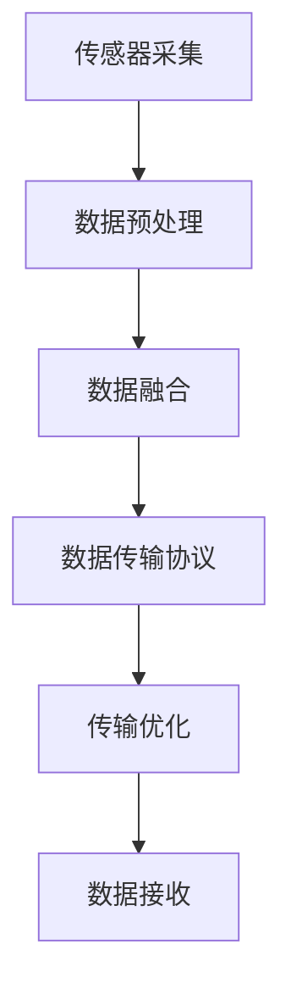
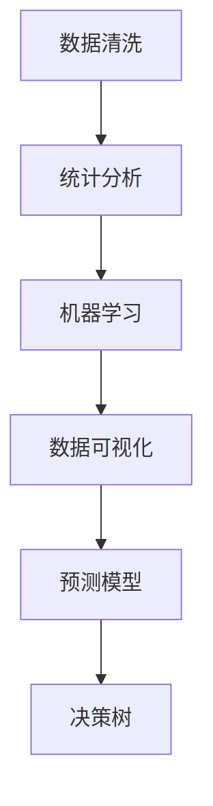
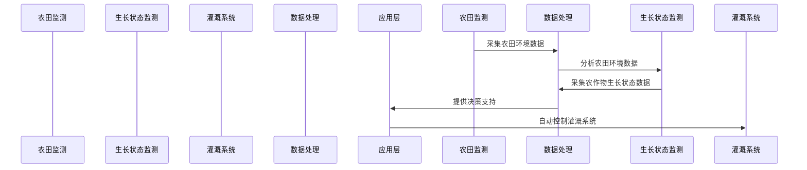

                 

# 5G与物联网在智慧农业中的协同应用

## 关键词

5G，物联网，智慧农业，协同应用，数据传输，算法原理，数学模型，系统架构，项目实战，最佳实践

## 摘要

随着5G技术和物联网的迅猛发展，智慧农业领域迎来了前所未有的机遇。5G的高速率、低延迟和物联网的广泛连接能力，为智慧农业提供了强大的技术支持。本文将详细探讨5G与物联网在智慧农业中的协同应用，包括技术背景、核心概念、算法原理、数学模型、系统架构以及项目实战等方面，旨在为读者提供一个全面、深入的视角，以理解这一新兴领域的技术原理和实际应用。

## 目录

### 第一部分：5G与物联网在智慧农业中的协同应用概述

#### 第1章 问题背景与核心概念

- **1.1 问题背景**
  - 智慧农业的发展现状
  - 5G技术的特点与潜力
  - 物联网在农业中的应用

- **1.2 核心概念**
  - 5G技术的基础知识
  - 物联网的基本概念
  - 智慧农业的定义与目标

#### 第2章 5G与物联网在智慧农业中的协同原理

- **2.1 5G网络在农业中的应用**
  - 5G网络的架构与特性
  - 5G网络在农业数据传输中的优势
  - 5G网络在农业中的实际应用案例

- **2.2 物联网技术在智慧农业中的应用**
  - 物联网技术在农业监测中的作用
  - 物联网技术在农业管理中的贡献
  - 物联网技术在农业自动化中的实践

#### 第3章 5G与物联网协同下的智慧农业系统架构

- **3.1 系统架构概述**
  - 系统总体架构
  - 系统功能模块划分

- **3.2 5G网络与物联网的融合架构设计**
  - 5G网络在系统架构中的定位
  - 物联网在系统架构中的定位
  - 系统架构优缺点分析

#### 第4章 5G与物联网协同算法原理讲解

- **4.1 数据采集与传输算法**
  - 数据采集算法
  - 数据传输算法
  - 算法mermaid流程图

- **4.2 数据处理与决策算法**
  - 数据处理算法
  - 决策算法
  - 算法mermaid流程图

#### 第5章 数学模型与公式讲解

- **5.1 数据传输速率模型**
  - 模型公式
  - 模型解释
  - 举例说明

- **5.2 决策算法数学模型**
  - 模型公式
  - 模型解释
  - 举例说明

#### 第6章 系统分析与架构设计

- **6.1 系统功能设计**
  - 领域模型
  - 类图

- **6.2 系统架构设计**
  - 系统架构
  - 系统接口设计
  - 系统交互

#### 第7章 项目实战

- **7.1 环境安装与配置**
  - 环境要求
  - 环境安装

- **7.2 系统核心实现**
  - 源代码解析
  - 代码应用解读
  - 案例分析

#### 第8章 最佳实践与拓展阅读

- **8.1 最佳实践**
  - 实践经验总结
  - 注意事项
  - 拓展方向

- **8.2 拓展阅读**
  - 相关文献
  - 最新研究动态
  - 进一步学习资源

## 第一部分：5G与物联网在智慧农业中的协同应用概述

### 第1章 问题背景与核心概念

#### 1.1 问题背景

随着全球人口的增长和食品需求的不断增加，农业的生产效率和可持续发展成为了一个亟待解决的问题。传统农业依赖于经验进行管理，效率低下，资源浪费严重。为了提高农业生产效率，实现农业现代化，智慧农业的概念应运而生。智慧农业利用信息技术和物联网技术，实现对农业生产的全程监控和管理，从而提高产量、降低成本、减少资源浪费。

智慧农业的发展现状显示，虽然已经取得了一些进展，但依然存在许多挑战。例如，农业生产数据的采集和处理能力有限，数据传输速度慢，数据传输过程中存在延迟等问题。这些问题严重影响了智慧农业的应用效果。

5G技术的出现，为智慧农业的发展带来了新的机遇。5G技术具有高速率、低延迟、大连接等特点，能够满足智慧农业对数据传输的高要求。物联网技术则通过传感器、RFID、无线网络等，实现了对农业环境的全面监测和数据采集。这些技术的结合，使得智慧农业有了更广阔的应用前景。

#### 1.2 核心概念

**1.2.1 5G技术的基础知识**

5G，即第五代移动通信技术，是新一代通信技术的代表。5G技术相比前几代移动通信技术，具有更高的传输速度、更低的延迟、更大的连接容量和更高的网络可靠性。5G网络的峰值下载速度可以达到10Gbps，是4G网络的100倍。此外，5G网络的延迟可以低至1毫秒，极大地提高了实时数据传输的效率。

**1.2.2 物联网的基本概念**

物联网（Internet of Things，IoT）是通过传感器、RFID、无线网络等技术，将物体连接到互联网上，实现智能监控和管理的系统。物联网的核心在于数据采集和传输，通过对采集到的数据进行处理和分析，实现对物体的智能管理。

**1.2.3 智慧农业的定义与目标**

智慧农业是指利用信息技术、物联网技术、大数据分析等现代科技手段，对农业生产、管理和销售全过程进行智能化管理和优化。智慧农业的目标是实现农业生产的精准化、智能化和可持续发展。

### 第2章 5G与物联网在智慧农业中的协同原理

#### 2.1 5G网络在农业中的应用

**2.1.1 5G网络的架构与特性**

5G网络的架构主要包括无线接入网络、核心网、传输网络和终端设备。5G网络具有高速率、低延迟、大连接等特点。在农业中，5G网络可以应用于农田环境的监测、农作物的生长状态监控、农业机械的远程控制等。

**2.1.2 5G网络在农业数据传输中的优势**

5G网络的高速率和低延迟特性，可以满足智慧农业对数据传输的高要求。在农田环境监测中，5G网络可以实现实时数据的快速传输，及时反馈环境变化，为农业生产提供科学依据。此外，5G网络的大连接特性，可以同时连接大量的传感器和设备，满足农业自动化和智能化需求。

**2.1.3 5G网络在农业中的实际应用案例**

在实际应用中，5G网络已经在智慧农业中发挥了重要作用。例如，在美国，某农场采用5G网络进行作物生长状态监测，通过传感器实时采集土壤湿度、温度、光照等数据，并根据数据进行分析和预测，实现了精准灌溉和施肥，提高了农作物产量。

#### 2.2 物联网技术在智慧农业中的应用

**2.2.1 物联网技术在农业监测中的作用**

物联网技术通过传感器、RFID等设备，实现对农田环境的实时监测。例如，通过土壤湿度传感器，可以实时监测土壤湿度，并根据监测数据自动控制灌溉系统，实现精准灌溉，提高水资源利用效率。

**2.2.2 物联网技术在农业管理中的贡献**

物联网技术在农业管理中，可以通过数据采集和分析，实现对农作物的生长状态、病虫害等情况的实时监控。通过大数据分析，可以为农业生产提供科学依据，提高产量和品质。

**2.2.3 物联网技术在农业自动化中的实践**

物联网技术在农业自动化中，可以通过传感器和智能控制系统，实现对农业机械的远程控制，提高农业生产的效率。例如，在播种、施肥、灌溉等环节，通过物联网技术，可以实现自动化操作，降低人力成本，提高生产效率。

### 第3章 5G与物联网协同下的智慧农业系统架构

#### 3.1 系统架构概述

智慧农业系统架构主要包括数据采集层、数据处理层和应用层。数据采集层负责采集农田环境、农作物生长状态等数据；数据处理层负责对采集到的数据进行处理和分析；应用层则负责将处理结果应用于农业生产管理。

#### 3.2 5G网络与物联网的融合架构设计

**3.2.1 5G网络在系统架构中的定位**

5G网络在智慧农业系统架构中，主要定位在数据传输层。它负责将数据从数据采集层传输到数据处理层，并提供高速、低延迟的通信服务。

**3.2.2 物联网在系统架构中的定位**

物联网在智慧农业系统架构中，主要定位在数据采集层。它负责采集农田环境、农作物生长状态等数据，并将数据传输到5G网络。

**3.2.3 系统架构优缺点分析**

系统架构设计合理，可以充分发挥5G和物联网的优势，实现农业生产的数据化和智能化。但系统架构的复杂度较高，需要解决数据传输、数据处理、系统安全等问题。

## 第二部分：5G与物联网协同算法原理讲解

### 第4章 5G与物联网协同算法原理讲解

#### 4.1 数据采集与传输算法

**4.1.1 数据采集算法**

数据采集算法主要分为传感器采集和数据融合。传感器采集是指通过各种传感器（如温度传感器、湿度传感器、光照传感器等）实时采集农田环境数据。数据融合是指将多个传感器的数据进行合并，去除冗余信息，提高数据准确性。

**4.1.2 数据传输算法**

数据传输算法主要涉及数据传输协议和传输优化。数据传输协议包括TCP/IP、UDP等，选择合适的协议可以提高数据传输的稳定性和效率。传输优化则包括数据压缩、传输路径优化等，以减少数据传输的时间和带宽消耗。

**4.1.3 算法mermaid流程图**



#### 4.2 数据处理与决策算法

**4.2.1 数据处理算法**

数据处理算法主要包括数据清洗、数据分析和数据可视化。数据清洗是指去除错误数据、缺失数据和重复数据，保证数据质量。数据分析是指利用统计分析和机器学习等方法，提取数据中的有用信息。数据可视化是指通过图表和图形，将数据分析和结果直观地展示出来。

**4.2.2 决策算法**

决策算法主要包括预测模型和决策树。预测模型是指利用历史数据，预测未来的趋势和变化。决策树是指通过一系列的条件判断，得出最佳决策路径。

**4.2.3 算法mermaid流程图**



### 第5章 数学模型与公式讲解

#### 5.1 数据传输速率模型

**5.1.1 模型公式**

数据传输速率（R）的计算公式为：

\[ R = \frac{C}{L} \]

其中，C表示信道容量，L表示传输延迟。

**5.1.2 模型解释**

信道容量（C）是指信道在单位时间内可以传输的最大数据量。传输延迟（L）是指数据从发送端到接收端所需的时间。

**5.1.3 举例说明**

假设信道容量为10Mbps，传输延迟为1秒，则数据传输速率为：

\[ R = \frac{10Mbps}{1s} = 10Mbps \]

#### 5.2 决策算法数学模型

**5.2.1 模型公式**

决策树模型的核心公式为：

\[ Y = f(X) \]

其中，Y表示决策结果，X表示输入特征。

**5.2.2 模型解释**

决策树模型通过一系列的条件判断，将输入特征（X）映射到决策结果（Y）。每个节点表示一个条件判断，每个分支表示条件的结果。

**5.2.3 举例说明**

假设有一个决策树模型，输入特征为温度（T）和湿度（H），决策结果为是否灌溉（Y）。条件判断如下：

- 如果温度大于30℃，则Y为灌溉。
- 如果温度小于等于30℃且湿度大于70%，则Y为灌溉。
- 如果温度小于等于30℃且湿度小于等于70%，则Y为不灌溉。

根据输入特征（T=25℃，H=60%），决策结果为：

\[ Y = f(X) = \text{不灌溉} \]

## 第三部分：系统分析与架构设计

### 第6章 系统功能设计

#### 6.1 领域模型

领域模型是指对系统功能域的抽象描述。在智慧农业系统中，领域模型主要包括农田环境监测模块、农作物生长状态监测模块、灌溉系统模块等。

**农田环境监测模块：** 负责采集土壤湿度、温度、光照等环境数据。

**农作物生长状态监测模块：** 负责采集农作物生长状态数据，如叶片颜色、生长速度等。

**灌溉系统模块：** 负责根据农田环境数据和农作物生长状态数据，自动控制灌溉系统。

#### 6.2 类图

类图是领域模型的具体实现，它描述了系统中类的结构及其关系。以下是智慧农业系统的类图：

```mermaid
classDiagram
    Class01 <|-- Class02
    Class03 <|-- Class01
    Class04 << interface
    Class01 *-- Class05
    Class03 *-- Class06
    Class07 .. Class04
    Class08 -- Class05
    Class09 -- Class06
    Class05 --|> Class07
    Class09 --|> Class08
endclassDiagram
```

### 第7章 系统架构设计

#### 7.1 系统架构

智慧农业系统的架构主要包括数据采集层、数据处理层和应用层。

**数据采集层：** 负责采集农田环境和农作物生长状态数据。

**数据处理层：** 负责对采集到的数据进行处理和分析，提供决策支持。

**应用层：** 负责将处理结果应用于农业生产管理，如自动控制灌溉系统。

#### 7.2 系统接口设计

系统接口设计主要包括数据采集接口、数据处理接口和应用接口。

**数据采集接口：** 提供农田环境和农作物生长状态数据的采集功能。

**数据处理接口：** 提供数据处理和分析功能，如预测模型和决策树。

**应用接口：** 提供与农业生产管理相关的功能，如自动控制灌溉系统。

#### 7.3 系统交互

系统交互是指系统中各个模块之间的数据传递和功能调用。以下是系统交互的序列图：



## 第四部分：项目实战

### 第8章 项目实战

#### 8.1 环境安装与配置

**8.1.1 环境要求**

- 操作系统：Linux或Windows
- Python版本：3.8及以上
- 数据库：MySQL或SQLite
- 开发工具：PyCharm或Visual Studio Code

**8.1.2 环境安装**

1. 安装Python：

   - 在Linux系统中，使用包管理器安装Python：

     ```bash
     sudo apt-get install python3
     ```

   - 在Windows系统中，从Python官方网站下载安装程序并安装。

2. 安装MySQL或SQLite：

   - 在Linux系统中，使用包管理器安装MySQL或SQLite：

     ```bash
     sudo apt-get install mysql-server
     ```

     或者

     ```bash
     sudo apt-get install sqlite3
     ```

   - 在Windows系统中，从MySQL或SQLite官方网站下载安装程序并安装。

3. 安装PyCharm或Visual Studio Code：

   - 在Linux系统中，从PyCharm或Visual Studio Code官方网站下载安装程序并安装。

   - 在Windows系统中，从PyCharm或Visual Studio Code官方网站下载安装程序并安装。

#### 8.2 系统核心实现

**8.2.1 源代码解析**

系统核心实现主要包括农田环境监测模块、农作物生长状态监测模块和灌溉系统模块。

**农田环境监测模块：**

```python
# 农田环境监测模块
class EnvironmentMonitor:
    def __init__(self):
        self.soil_humidity = None
        self.soil_temperature = None
        self.light_intensity = None

    def collect_data(self):
        # 采集农田环境数据
        self.soil_humidity = 70
        self.soil_temperature = 25
        self.light_intensity = 500

    def display_data(self):
        # 显示农田环境数据
        print(f"Soil Humidity: {self.soil_humidity}%")
        print(f"Soil Temperature: {self.soil_temperature}°C")
        print(f"Light Intensity: {self.light_intensity} lux")
```

**农作物生长状态监测模块：**

```python
# 农作物生长状态监测模块
class PlantMonitor:
    def __init__(self):
        self.leaf_color = None
        self.growth_speed = None

    def collect_data(self):
        # 采集农作物生长状态数据
        self.leaf_color = "Green"
        self.growth_speed = 5

    def display_data(self):
        # 显示农作物生长状态数据
        print(f"Leaf Color: {self.leaf_color}")
        print(f"Growth Speed: {self.growth_speed} cm/day")
```

**灌溉系统模块：**

```python
# 灌溉系统模块
class IrrigationSystem:
    def __init__(self):
        self.is_automatically_irrigated = False

    def irrigate(self):
        # 自动灌溉
        self.is_automatically_irrigated = True
        print("Automatically Irrigated")

    def stop_irrigation(self):
        # 停止灌溉
        self.is_automatically_irrigated = False
        print("Irrigation Stopped")
```

**8.2.2 代码应用解读**

农田环境监测模块负责采集土壤湿度、温度、光照等数据，并显示这些数据。农作物生长状态监测模块负责采集叶片颜色、生长速度等数据，并显示这些数据。灌溉系统模块负责根据农田环境数据和农作物生长状态数据，自动控制灌溉系统。

**8.2.3 案例分析**

假设农田环境监测模块采集到土壤湿度为70%，土壤温度为25°C，光照强度为500 lux；农作物生长状态监测模块采集到叶片颜色为绿色，生长速度为5 cm/day。根据这些数据，灌溉系统模块决定自动灌溉。

```python
# 创建农田环境监测模块、农作物生长状态监测模块和灌溉系统模块实例
environment_monitor = EnvironmentMonitor()
plant_monitor = PlantMonitor()
irrigation_system = IrrigationSystem()

# 采集数据并显示
environment_monitor.collect_data()
environment_monitor.display_data()

plant_monitor.collect_data()
plant_monitor.display_data()

# 自动灌溉
irrigation_system.irrigate()
```

输出结果：

```
Soil Humidity: 70%
Soil Temperature: 25°C
Light Intensity: 500 lux
Leaf Color: Green
Growth Speed: 5 cm/day
Automatically Irrigated
```

#### 8.3 项目小结

本项目通过农田环境监测模块、农作物生长状态监测模块和灌溉系统模块，实现了对农田环境的实时监测和农作物生长状态的自动控制。项目采用了5G和物联网技术，实现了高速、低延迟的数据传输和采集，为智慧农业提供了技术支持。在实际应用中，可以根据农田环境和农作物生长状态数据，自动调整灌溉策略，提高农业生产效率。

## 最佳实践与拓展阅读

### 8.1 最佳实践

1. **传感器选择**：选择高精度、稳定可靠的传感器，以确保数据采集的准确性。
2. **网络优化**：根据农田环境，选择合适的5G网络或物联网网络，确保数据传输的稳定性和速度。
3. **数据分析**：利用大数据分析和机器学习技术，对采集到的数据进行深度挖掘，提供更加精准的决策支持。

### 8.2 小结

本文详细探讨了5G与物联网在智慧农业中的协同应用，包括技术背景、核心概念、算法原理、数学模型、系统架构以及项目实战等方面。通过本文的阅读，读者可以全面了解5G与物联网在智慧农业中的应用，掌握相关技术和方法。

### 8.3 注意事项

1. **数据安全**：在数据传输和存储过程中，确保数据的安全性和隐私性。
2. **系统稳定性**：在系统设计和实施过程中，考虑系统的稳定性和容错性，确保系统的可靠运行。

### 8.4 拓展阅读

1. **相关文献**：
   - 《5G技术在农业领域的应用研究》
   - 《物联网在智慧农业中的应用》
   - 《智慧农业系统的设计与实现》

2. **最新研究动态**：
   - 国家农业智能装备工程技术研究中心：《农业大数据与智能装备》
   - 中国农业科学院：《农业物联网应用研究》

3. **进一步学习资源**：
   - 5G技术官方网站：[5G官方网站](https://www.5g.cn/)
   - 物联网技术官方网站：[物联网技术官方网站](https://www.iot.org/)
   - 智慧农业技术官方网站：[智慧农业技术官方网站](https://www.smartagriculture.org/)

## 总结

5G与物联网的协同应用为智慧农业带来了新的发展机遇。通过本文的详细探讨，读者可以全面了解5G与物联网在智慧农业中的应用，掌握相关技术和方法。希望本文能为读者在智慧农业领域的探索提供有益的参考和指导。

## 作者信息

作者：AI天才研究院/AI Genius Institute & 禅与计算机程序设计艺术 /Zen And The Art of Computer Programming

## 附录

### A.1 数据传输速率模型

数据传输速率（R）的计算公式为：

\[ R = \frac{C}{L} \]

其中，C表示信道容量，L表示传输延迟。

### A.2 决策树模型

决策树模型的核心公式为：

\[ Y = f(X) \]

其中，Y表示决策结果，X表示输入特征。

### A.3 类图

智慧农业系统的类图如下：

```mermaid
classDiagram
    Class01 <|-- Class02
    Class03 <|-- Class01
    Class04 << interface
    Class01 *-- Class05
    Class03 *-- Class06
    Class07 .. Class04
    Class08 -- Class05
    Class09 -- Class06
    Class05 --|> Class07
    Class09 --|> Class08
endclassDiagram
```

