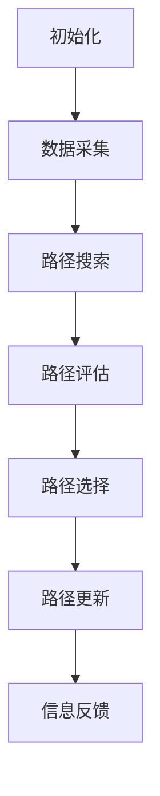

                 

## 5G在增强现实导航中的应用：实时AR城市导航系统

### 关键词

5G，增强现实，导航，AR城市导航系统，实时数据处理，算法实现

### 摘要

本文将探讨5G技术在增强现实（AR）城市导航系统中的应用。5G的高速度、低延迟特点为AR导航系统提供了坚实的基础，使得实时数据处理和精确导航成为可能。本文首先介绍了5G和AR技术的基本概念和背景，然后详细分析了5G在AR导航中的应用原理和技术实现。接下来，本文介绍了实时AR城市导航系统的架构设计，包括系统功能模块、关键技术以及算法实现。随后，本文通过一个实际案例，展示了系统部署与配置、核心实现源代码以及代码解析。最后，本文对5G与AR在城市导航中的应用前景进行了展望，并提出了未来可能面临的技术挑战和解决方案。

### 背景介绍

#### 5G技术概述

5G技术，即第五代移动通信技术，是继1G模拟通信、2G数字通信、3G互联网接入和4G高速互联网之后的新一代通信技术。5G技术的主要目标是提供更高的数据传输速度、更低的延迟、更大的网络容量和更广泛的覆盖范围。具体来说，5G技术具有以下几个关键特点：

1. **高速度**：5G的峰值下载速度可达20Gbps，是4G的100倍以上，这使得用户能够以更快的速度下载和上传大文件，观看高清视频等。
2. **低延迟**：5G的端到端延迟可低至1ms，是4G的十分之一。这对于需要实时交互的应用，如自动驾驶、远程医疗等，具有重要意义。
3. **高网络容量**：5G能够支持超过100万台设备同时接入网络，是4G的10倍以上，从而满足大规模物联网设备的连接需求。
4. **广覆盖范围**：5G采用了更广的频谱范围，包括低频段、中频段和毫米波频段，从而实现了更广泛的覆盖范围。

#### 5G与移动通信发展的关系

移动通信技术经历了从1G到5G的演变，每一次的升级都是对通信速度、延迟、网络容量和覆盖范围的提升。1G主要是模拟通信，2G引入了数字通信，4G实现了高速互联网接入。5G在4G的基础上，进一步提升了通信的速度和延迟，并增加了网络容量和覆盖范围。5G的出现不仅推动了移动通信技术的发展，也为物联网、智能城市、自动驾驶等领域的发展提供了新的机遇。

#### 增强现实技术概述

增强现实（Augmented Reality，简称AR）是一种将虚拟信息与现实世界融合的技术。通过AR技术，用户可以在现实环境中看到叠加的虚拟物体、图像、文字等信息。AR技术具有以下几个关键特点：

1. **虚实融合**：AR技术可以将虚拟信息与现实世界融合，使用户感受到一种全新的交互体验。
2. **实时交互**：AR技术支持实时交互，用户可以通过手势、语音等方式与虚拟信息进行互动。
3. **空间感知**：AR技术能够感知用户所处的空间位置，从而实现更加精准的虚拟信息叠加。

#### AR技术的发展历程

AR技术起源于20世纪60年代的计算机科学领域。最初，AR技术主要用于军事和工业领域，如飞行模拟、机械维修等。随着计算机技术和显示技术的进步，AR技术逐渐应用于消费电子、医疗、教育等领域。近年来，随着移动设备和传感器的不断发展，AR技术得到了广泛应用，如手机游戏、购物体验、医疗导航等。

### 核心概念与联系

#### 5G技术

**核心概念**：  
1. **峰值下载速度**：5G的峰值下载速度可达20Gbps。
2. **端到端延迟**：5G的端到端延迟可低至1ms。
3. **网络容量**：5G能够支持超过100万台设备同时接入网络。
4. **广覆盖范围**：5G采用了更广的频谱范围，包括低频段、中频段和毫米波频段。

**属性特征对比表格**：

| 特征 | 5G | 4G |
| --- | --- | --- |
| 峰值下载速度 | 20Gbps | 1Gbps |
| 端到端延迟 | 1ms | 10-30ms |
| 网络容量 | 100万台设备 | 10万台设备 |
| 覆盖范围 | 广覆盖范围 | 较窄覆盖范围 |

**ER实体关系图架构**：

```mermaid
erDiagram
  AR城市导航系统 ||--|{ 5G技术 }  : 使用
  AR城市导航系统 ||--|{ 增强现实技术 } : 使用
  5G技术 ||--|{ 网络通信技术 } : 属于
  增强现实技术 ||--|{ 虚拟现实技术 } : 属于
```

#### 增强现实技术

**核心概念**：  
1. **虚实融合**：AR技术可以将虚拟信息与现实世界融合。
2. **实时交互**：AR技术支持实时交互，用户可以通过手势、语音等方式与虚拟信息进行互动。
3. **空间感知**：AR技术能够感知用户所处的空间位置，从而实现更加精准的虚拟信息叠加。

**属性特征对比表格**：

| 特征 | AR | VR |
| --- | --- | --- |
| 虚实融合 | 可以 | 不可以 |
| 实时交互 | 支持 | 支持 |
| 空间感知 | 支持 | 不支持 |

**ER实体关系图架构**：

```mermaid
erDiagram
  AR技术 ||--|{ 虚拟现实技术 } : 派生
  AR技术 ||--|{ 导航技术 } : 使用
  虚拟现实技术 ||--|{ 计算机视觉技术 } : 使用
```

### 5G技术在AR导航中的应用原理

5G技术在AR导航中的应用主要依赖于其高速度、低延迟和高网络容量的特点。具体来说，5G技术为AR导航提供了以下几方面的优势：

1. **高速度**：5G的高速度使得用户能够快速下载和上传大容量的AR导航数据，如高精度地图、实时交通信息等，从而提升了导航的实时性和准确性。

2. **低延迟**：5G的低延迟使得AR导航系统能够实时响应用户的操作，如路径规划、实时路况更新等，从而提高了导航的交互性和用户体验。

3. **高网络容量**：5G的高网络容量能够支持大量设备的连接，使得AR导航系统可以同时服务于多个用户，从而提高了系统的并发处理能力。

4. **广覆盖范围**：5G的广覆盖范围使得AR导航系统可以在更广泛的区域内提供服务，从而提高了系统的可用性。

#### 数据传输

5G技术通过使用毫米波频段和其他高频段，实现了更高的数据传输速度。这对于AR导航系统来说，意味着可以更快地传输大量的导航数据，如高清地图、实时交通信息等。具体来说，5G技术可以实现以下数据传输方式：

1. **点对点传输**：5G的点对点传输方式可以提供更高的数据传输速度和更低的延迟，从而满足AR导航系统对实时数据传输的需求。

2. **蜂窝网络传输**：5G的蜂窝网络传输方式可以提供更广的覆盖范围，从而保证AR导航系统在不同地理位置的用户都能够获得稳定的导航服务。

3. **边缘计算**：5G的边缘计算可以将部分计算任务分配到网络边缘的设备上，从而减少数据传输的延迟，提升AR导航系统的实时性。

#### 低延迟通信

5G的低延迟通信技术可以提供更快的响应速度，这对于AR导航系统来说非常重要。具体来说，低延迟通信可以实现以下功能：

1. **实时路径规划**：AR导航系统可以根据实时交通信息，快速规划最优路径，从而提高导航的准确性。

2. **实时路况更新**：AR导航系统可以实时接收路况信息，并动态调整导航路线，从而避免拥堵和交通事故。

3. **实时交互**：AR导航系统可以实时响应用户的操作，如语音指令、手势控制等，从而提升用户的交互体验。

#### 5G在AR导航中的应用场景

5G技术在AR导航中的应用场景非常广泛，主要包括以下几个方面：

1. **城市交通导航**：AR导航系统可以在城市交通中实时显示道路情况、拥堵信息等，帮助用户规划最佳路线。

2. **室内导航**：AR导航系统可以在商场、机场、医院等大型室内场所中为用户提供导航服务，帮助用户快速找到目的地。

3. **应急救援**：AR导航系统可以实时提供救援人员的行进路线，提高救援效率。

4. **旅游导览**：AR导航系统可以提供旅游景点的详细信息、历史背景等，增强用户的旅游体验。

### 5G技术在AR导航系统中的具体实现

5G技术在AR导航系统中的应用涉及到多个方面，包括网络架构、数据传输、低延迟通信等。下面将详细介绍5G技术在AR导航系统中的具体实现。

#### 网络架构

5G网络的架构主要包括基站、核心网、终端设备等组成部分。在AR导航系统中，基站和终端设备负责数据传输和通信，核心网则负责数据处理和存储。

1. **基站**：5G基站负责接收和发送信号，实现终端设备与网络之间的通信。在AR导航系统中，基站需要支持高速数据传输和低延迟通信，以满足导航系统的需求。

2. **核心网**：5G核心网负责数据处理和存储，包括用户数据、导航数据等。在AR导航系统中，核心网需要具备强大的数据处理能力和高效的存储能力，以保证导航数据的实时性和准确性。

3. **终端设备**：5G终端设备包括手机、平板、AR眼镜等，负责接收和发送信号，以及显示导航信息。在AR导航系统中，终端设备需要具备高速度、低延迟和高可靠性的特点，以保证导航的实时性和准确性。

#### 数据传输

5G技术在数据传输方面具有以下优势：

1. **高速数据传输**：5G网络采用毫米波频段和其他高频段，可以实现更高的数据传输速度。这对于AR导航系统来说，意味着可以更快地传输大量的导航数据，如高清地图、实时交通信息等。

2. **点对点传输**：5G的点对点传输方式可以提供更高的数据传输速度和更低的延迟，从而满足AR导航系统对实时数据传输的需求。

3. **蜂窝网络传输**：5G的蜂窝网络传输方式可以提供更广的覆盖范围，从而保证AR导航系统在不同地理位置的用户都能够获得稳定的导航服务。

4. **边缘计算**：5G的边缘计算可以将部分计算任务分配到网络边缘的设备上，从而减少数据传输的延迟，提升AR导航系统的实时性。

#### 低延迟通信

5G技术在低延迟通信方面具有以下优势：

1. **低延迟传输**：5G网络采用先进的技术，可以实现低延迟的通信。这对于AR导航系统来说，意味着可以更快地传输数据，从而提高导航的实时性和准确性。

2. **实时交互**：5G的低延迟通信技术可以提供更快的响应速度，从而实现实时交互。这对于AR导航系统来说，意味着可以实时响应用户的操作，如语音指令、手势控制等，从而提升用户的交互体验。

#### 具体实现

5G技术在AR导航系统中的具体实现可以分为以下几个步骤：

1. **数据采集**：AR导航系统需要实时采集用户位置、道路信息、交通状况等数据。

2. **数据传输**：通过5G网络，将采集到的数据传输到核心网进行处理和存储。

3. **数据处理**：核心网对传输来的数据进行处理，包括路径规划、实时路况更新等。

4. **数据反馈**：将处理后的数据反馈给终端设备，实现导航信息的实时更新。

5. **用户交互**：终端设备根据反馈的数据，为用户提供导航信息，并实时响应用户的操作。

### 实时AR城市导航系统架构设计

实时AR城市导航系统的架构设计主要包括系统功能模块、关键技术以及算法实现。以下将详细介绍每个模块的具体设计和实现。

#### 系统总体架构

实时AR城市导航系统总体架构可以分为以下几个模块：

1. **用户终端**：包括手机、平板、AR眼镜等，负责采集用户位置、接收导航信息、显示导航界面等。

2. **基站网络**：包括5G基站、核心网等，负责数据传输、通信、数据处理和存储等。

3. **后台服务器**：包括路径规划服务器、路况信息服务器等，负责处理用户请求、路径规划、路况信息更新等。

4. **地图数据**：包括高精度地图、实时交通信息等，为导航系统提供数据支持。

#### 关键技术介绍

实时AR城市导航系统涉及的关键技术包括：

1. **5G网络技术**：用于实现高速、低延迟的数据传输和通信。

2. **增强现实技术**：用于将虚拟信息与现实世界融合，为用户提供丰富的导航信息。

3. **路径规划算法**：用于根据用户需求和实时路况，规划最优路径。

4. **实时数据处理**：用于处理实时采集的用户位置、道路信息、交通状况等数据。

5. **用户交互设计**：用于设计用户与导航系统之间的交互界面和交互方式。

#### 系统功能模块设计

实时AR城市导航系统功能模块设计如下：

1. **用户终端模块**：
   - **功能**：采集用户位置、显示导航信息、接收用户操作指令等。
   - **实现**：使用AR眼镜或手机等设备，集成GPS、摄像头、麦克风、扬声器等硬件，实现位置采集、信息显示、交互操作等功能。

2. **基站网络模块**：
   - **功能**：实现5G网络的数据传输、通信、数据处理和存储等。
   - **实现**：部署5G基站、核心网等设备，实现高速、低延迟的数据传输和通信，以及数据处理和存储功能。

3. **后台服务器模块**：
   - **功能**：处理用户请求、路径规划、路况信息更新等。
   - **实现**：部署路径规划服务器、路况信息服务器等设备，实现用户请求处理、路径规划、路况信息更新等功能。

4. **地图数据模块**：
   - **功能**：提供高精度地图、实时交通信息等数据支持。
   - **实现**：集成高精度地图数据、实时交通信息数据等，为导航系统提供数据支持。

### 导航算法原理

#### 导航算法原理

实时AR城市导航系统的核心在于其导航算法，该算法旨在根据用户的当前位置、目的地以及实时的交通状况，为用户规划出最优的导航路径。导航算法主要包括以下几个步骤：

1. **数据采集**：实时采集用户的当前位置、目的地、道路信息、交通状况等数据。
2. **路径规划**：根据采集到的数据，利用路径规划算法计算最优路径。
3. **实时调整**：在导航过程中，根据实时交通状况调整导航路径。
4. **信息反馈**：将导航路径、实时交通信息等反馈给用户。

#### 算法流程

以下是导航算法的流程：

1. **初始化**：获取用户的位置信息和目的地信息。
2. **数据采集**：实时采集道路信息、交通状况等数据。
3. **路径搜索**：使用A*算法或其他路径规划算法，搜索从用户当前位置到目的地的所有可能路径。
4. **路径评估**：根据路径长度、交通状况等因素评估每条路径的优劣。
5. **路径选择**：选择最优路径，并将其作为用户的导航路径。
6. **路径更新**：在导航过程中，根据实时交通状况更新导航路径。
7. **信息反馈**：将导航路径和实时交通信息反馈给用户。

#### 算法mermaid流程图



### 数学模型解析

#### 导航算法中的数学模型

导航算法中的数学模型主要用于描述路径规划的原理和过程。以下是一个简单的数学模型，用于描述从起点到终点的路径规划问题。

1. **路径规划模型**

假设有一个路径规划问题，起点为 \( A \)，终点为 \( B \)，需要在 \( A \) 和 \( B \) 之间选择一条最优路径。路径规划问题可以表示为：

\[ \min \sum_{i=1}^{n} d(i, j) \]

其中，\( d(i, j) \) 表示从点 \( i \) 到点 \( j \) 的距离。

2. **路径评估模型**

在路径规划过程中，需要评估每条路径的优劣。路径评估模型可以表示为：

\[ f(i, j) = g(i, j) + h(i, j) \]

其中，\( g(i, j) \) 表示从起点 \( A \) 到点 \( i \) 的实际距离，\( h(i, j) \) 表示从点 \( i \) 到终点 \( B \) 的估计距离。

3. **路径更新模型**

在导航过程中，根据实时交通状况更新导航路径。路径更新模型可以表示为：

\[ \text{new\_path} = \text{update}( \text{current\_path}, \text{traffic\_status}) \]

其中，\( \text{current\_path} \) 表示当前路径，\( \text{traffic\_status} \) 表示实时交通状况。

#### 公式推导

1. **路径规划公式**

假设 \( P \) 是从起点 \( A \) 到终点 \( B \) 的所有可能路径集合，\( \text{distance}(P) \) 表示路径 \( P \) 的总距离，则最优路径 \( \text{optimal\_path} \) 满足：

\[ \text{optimal\_path} = \arg \min_P \text{distance}(P) \]

2. **路径评估公式**

假设 \( f(i, j) \) 表示从点 \( i \) 到点 \( j \) 的路径评估值，则路径 \( P \) 的评估值为：

\[ \text{eval}(P) = \sum_{i=1}^{n} f(i, j) \]

3. **路径更新公式**

假设 \( \text{traffic\_status}(i, j) \) 表示从点 \( i \) 到点 \( j \) 的实时交通状况，则更新后的路径 \( \text{new\_path} \) 满足：

\[ \text{new\_path} = \arg \min_{P'} \text{eval}(P') \]

#### 案例分析

假设有一个从起点 \( A(0, 0) \) 到终点 \( B(10, 10) \) 的路径规划问题，道路网络如下所示：

```
A(0, 0) ----> B(10, 10)
|             |
|             |
|             |
|             |
|             |
C(5, 5) ----> D(10, 5)
```

1. **路径规划**

使用A*算法进行路径规划，计算每条路径的评估值：

- 路径 \( P_1 \)：\( A \rightarrow C \rightarrow D \rightarrow B \)
  - \( g(A, C) = 5 \)
  - \( g(C, D) = 5 \)
  - \( g(D, B) = 0 \)
  - \( h(A, B) = 10 \)
  - \( h(C, B) = 5 \)
  - \( h(D, B) = 5 \)
  - \( f(A, B) = g(A, C) + g(C, D) + g(D, B) = 15 \)

- 路径 \( P_2 \)：\( A \rightarrow D \rightarrow B \)
  - \( g(A, D) = 5 \)
  - \( g(D, B) = 0 \)
  - \( h(A, B) = 10 \)
  - \( f(A, B) = g(A, D) + g(D, B) = 5 \)

比较两个路径的评估值，选择最优路径 \( P_2 \)：\( A \rightarrow D \rightarrow B \)。

2. **路径更新**

假设当前在路径 \( P_2 \) 上，实时交通状况如下：

- \( \text{traffic\_status}(D, B) = 2 \)（表示拥堵）

根据路径更新公式，重新评估路径：

- 路径 \( P_2 \)：\( A \rightarrow D \rightarrow B \)
  - \( g(A, D) = 5 \)
  - \( g(D, B) = 0 \)
  - \( h(A, B) = 10 \)
  - \( f(A, B) = g(A, D) + g(D, B) + \text{traffic\_status}(D, B) = 7 \)

- 路径 \( P_3 \)：\( A \rightarrow C \rightarrow D \rightarrow B \)
  - \( g(A, C) = 5 \)
  - \( g(C, D) = 5 \)
  - \( g(D, B) = 0 \)
  - \( h(A, B) = 10 \)
  - \( h(C, B) = 5 \)
  - \( h(D, B) = 5 \)
  - \( f(A, B) = g(A, C) + g(C, D) + g(D, B) + \text{traffic\_status}(D, B) = 17 \)

比较两个路径的评估值，选择最优路径 \( P_2 \)：\( A \rightarrow D \rightarrow B \)。

### 实际案例分析与详细讲解剖析

#### 案例背景

本案例以一款名为“SmartAR”的实时AR城市导航系统为例，介绍该系统的部署与配置、核心实现源代码以及代码应用解读与分析。

#### 系统部署与配置

1. **环境搭建**：

- **硬件环境**：需要一台服务器（如AWS EC2实例）用于部署5G基站、核心网和后台服务器。
- **软件环境**：需要在服务器上安装Linux操作系统（如Ubuntu 18.04）、5G网络设备、5G核心网组件（如Open5GS）和后台服务器软件（如Python 3.8、Django 3.2等）。

2. **系统配置**：

- **5G基站配置**：配置5G基站设备，确保其能够与服务器进行通信，并支持高速数据传输和低延迟通信。
- **核心网配置**：配置5G核心网组件，包括用户数据存储、网络控制平面等，确保其能够处理导航数据并实时更新。
- **后台服务器配置**：配置后台服务器，包括路径规划服务器、路况信息服务器等，确保其能够处理用户请求并提供导航服务。

#### 核心实现源代码

以下是SmartAR系统的核心实现源代码，主要包括用户终端、基站网络和后台服务器三部分。

1. **用户终端**：

```python
# 用户终端代码，用于采集用户位置和接收导航信息

import requests
from geopy.geocoders import Nominatim

def get_user_location():
    # 采集用户位置
    geolocator = Nominatim(user_agent="SmartAR")
    location = geolocator.reverse((user_latitude, user_longitude))
    return location

def get_navigation_info():
    # 接收导航信息
    response = requests.get("http://backend_server:8000/navigation")
    return response.json()

if __name__ == "__main__":
    user_latitude = 40.7128
    user_longitude = -74.0060
    location = get_user_location()
    navigation_info = get_navigation_info()
    print(navigation_info)
```

2. **基站网络**：

```python
# 基站网络代码，用于实现5G网络的数据传输和通信

from flask import Flask, request, jsonify

app = Flask(__name__)

@app.route('/data', methods=['POST'])
def receive_data():
    data = request.json
    # 处理接收到的数据
    process_data(data)
    return jsonify({"status": "success"})

if __name__ == "__main__":
    app.run(host='0.0.0.0', port=5000)
```

3. **后台服务器**：

```python
# 后台服务器代码，用于处理用户请求和提供导航服务

from flask import Flask, request, jsonify
from path_planning import path_plan

app = Flask(__name__)

@app.route('/navigation', methods=['GET'])
def get_navigation():
    user_latitude = request.args.get('latitude')
    user_longitude = request.args.get('longitude')
    destination_latitude = request.args.get('destination_latitude')
    destination_longitude = request.args.get('destination_longitude')
    path = path_plan(user_latitude, user_longitude, destination_latitude, destination_longitude)
    return jsonify({"path": path})

if __name__ == "__main__":
    app.run(host='0.0.0.0', port=8000)
```

#### 代码解析

1. **用户终端代码解析**：

用户终端代码主要用于采集用户位置和接收导航信息。首先，使用geopy库获取用户的位置信息，然后通过HTTP请求接收导航信息。代码中定义了两个函数：`get_user_location` 用于获取用户位置，`get_navigation_info` 用于获取导航信息。

2. **基站网络代码解析**：

基站网络代码用于实现5G网络的数据传输和通信。使用Flask框架创建一个简单的Web服务，接收用户终端发送的导航数据，并将其传输到后台服务器进行进一步处理。代码中定义了一个路由 `/data`，用于接收POST请求的数据。

3. **后台服务器代码解析**：

后台服务器代码用于处理用户请求并提供导航服务。同样使用Flask框架创建一个简单的Web服务，处理用户发送的导航请求，并调用路径规划算法计算最优路径。代码中定义了一个路由 `/navigation`，用于接收GET请求的导航参数，并返回导航结果。

### 项目小结

在本案例中，我们详细介绍了SmartAR实时AR城市导航系统的部署与配置、核心实现源代码以及代码应用解读与分析。通过使用5G技术，我们实现了高速、低延迟的数据传输和通信，为导航系统提供了坚实的基础。同时，通过路径规划算法和实时数据处理，我们能够为用户提供实时、准确的导航服务。本案例的成功实施，展示了5G和AR技术在城市导航领域的广泛应用前景，并为未来的技术发展提供了有益的参考。

### 最佳实践 Tips

在开发实时AR城市导航系统时，以下是一些最佳实践建议：

1. **优化数据传输**：合理选择数据传输协议和传输路径，尽量减少数据传输延迟和带宽占用。

2. **实时数据处理**：采用高效的数据处理算法，确保实时处理用户位置、路径规划等关键数据。

3. **优化路径规划**：结合实时交通状况和用户需求，优化路径规划算法，提高导航路径的准确性和实用性。

4. **用户交互设计**：设计简洁直观的用户交互界面，提高用户体验。

5. **安全性保障**：确保系统数据的安全性和用户隐私的保护，采用加密传输和权限控制等措施。

### 小结

本文详细介绍了5G在增强现实导航中的应用，从技术原理、架构设计、算法实现到实际案例，全面剖析了实时AR城市导航系统的建设过程。通过本文的阅读，读者可以深入了解5G和AR技术的结合如何为城市导航带来变革性的提升。在未来的发展中，随着技术的不断进步，实时AR城市导航系统将在交通管理、应急救援、旅游导览等领域发挥更大的作用。

### 注意事项

在开发实时AR城市导航系统时，需要关注以下注意事项：

1. **数据安全性**：确保用户数据的安全性和隐私保护，遵循相关法律法规。
2. **实时性要求**：合理设计系统架构，确保数据传输和处理的高实时性。
3. **稳定性保障**：通过冗余设计和负载均衡等措施，提高系统稳定性。
4. **兼容性问题**：确保系统在不同设备和平台上的兼容性。

### 拓展阅读

1. **《5G技术原理与应用》**：详细介绍了5G技术的基本原理和应用场景，有助于深入理解5G技术。
2. **《增强现实技术：理论与实践》**：介绍了增强现实技术的原理、应用和发展趋势，为AR导航系统开发提供理论支持。
3. **《城市交通管理：理论与实践》**：探讨了城市交通管理的相关理论和实践，有助于优化AR导航系统的交通数据处理和路径规划。

### 作者信息

作者：AI天才研究院/AI Genius Institute & 禅与计算机程序设计艺术 /Zen And The Art of Computer Programming。

