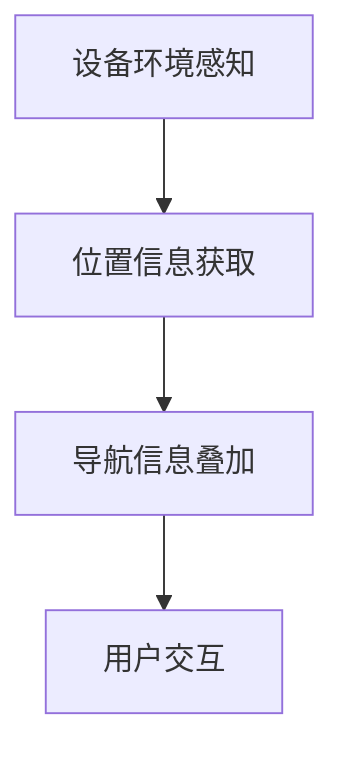
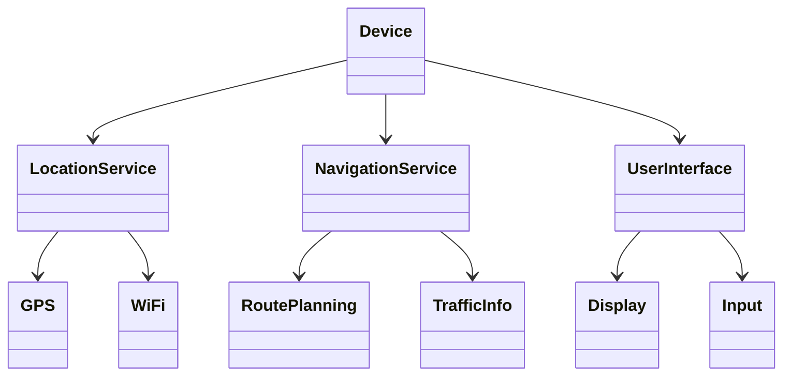
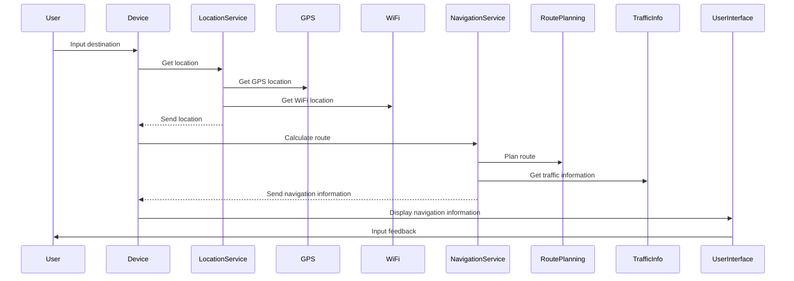

                 

# 5G在增强现实导航中的应用：提供沉浸式导航体验

关键词：5G、增强现实、导航、沉浸式体验、实时位置信息、低延迟高带宽

摘要：本文将深入探讨5G技术在增强现实导航中的应用，通过逐步分析，阐述5G如何为增强现实导航提供沉浸式体验。文章首先介绍了5G技术的发展历程和关键技术特点，接着探讨了增强现实导航的基本原理和优势挑战。随后，文章分析了5G技术在增强现实导航中的具体应用，如实时位置信息获取和低延迟高带宽的影响。接着，文章介绍了沉浸式导航体验的设计与实现，并通过实际案例展示了5G增强现实导航的应用场景。最后，文章提出了5G增强现实导航的挑战与未来展望，以及相关研究方向的拓展。

## 第一部分：5G与增强现实导航概述

### 第1章：5G技术的关键特性与应用

#### 1.1.1 5G技术的发展历程

5G技术，即第五代移动通信技术，是继2G、3G、4G之后的下一代通信技术。5G技术的发展历程可以追溯到2013年，当时国际电信联盟（ITU）正式提出了5G技术的概念。随后，全球各国纷纷开始进行5G技术的研发和测试。2019年，5G正式在全球范围内商用，标志着移动通信技术进入了5G时代。

#### 1.1.2 5G的关键技术特点

5G技术具有以下关键技术特点：

1. **高速率**：5G网络的理论下载速度可达20Gbps，是4G的100倍。这意味着用户可以更快地下载应用程序、观看高清视频等。
2. **低延迟**：5G网络的延迟极低，仅为1毫秒，是4G的十分之一。这对于需要实时交互的应用，如自动驾驶、远程医疗等，具有重要意义。
3. **大连接**：5G网络能够同时支持数百万个设备连接，是4G的百倍。这使得物联网（IoT）应用得以大规模普及。

#### 1.1.3 5G在通信领域的应用拓展

除了个人移动通信，5G还在多个领域展示了其强大的应用潜力：

1. **物联网**：5G的高速率、低延迟和大连接特性使得物联网应用得以大规模部署，如智能家居、智能城市等。
2. **工业互联网**：5G技术为工业互联网提供了可靠的通信基础，支持设备间的实时数据交换，提高了生产效率。
3. **自动驾驶**：5G的低延迟特性使得自动驾驶车辆能够实时获取道路信息，提高了行驶安全性。

### 第2章：增强现实导航的基本原理

#### 2.1.1 增强现实技术简介

增强现实（Augmented Reality，AR）技术是一种将虚拟信息与现实世界融合的技术。通过AR技术，用户可以在现实环境中看到虚拟的三维物体，这些物体可以是文字、图像、视频等。

#### 2.1.2 增强现实导航的工作原理

增强现实导航通过将虚拟导航信息叠加到现实世界中，帮助用户更直观地了解导航信息。其工作原理主要包括：

1. **环境感知**：设备通过摄像头和传感器感知用户所处的环境。
2. **位置信息获取**：设备通过GPS、WiFi等定位技术获取用户的位置信息。
3. **信息叠加**：将导航信息以虚拟三维物体的形式叠加到用户视野中。

#### 2.1.3 增强现实导航的优势与挑战

增强现实导航具有以下优势：

1. **直观性**：用户可以在现实环境中直观地看到导航信息，提高了导航的准确性。
2. **互动性**：用户可以通过与虚拟导航信息互动，如点击、拖动等，获取更详细的导航信息。

然而，增强现实导航也面临着一些挑战：

1. **设备要求高**：增强现实导航需要具备高分辨率摄像头、传感器等硬件支持。
2. **数据处理量大**：实时获取和处理大量位置信息对设备性能提出了较高要求。

### 第3章：5G技术在增强现实导航中的应用

#### 3.1.1 5G网络在增强现实导航中的作用

5G网络在增强现实导航中扮演着关键角色。首先，5G的高速率可以保证大量数据的实时传输，如位置信息、导航信息等。其次，5G的低延迟可以确保导航信息的实时更新，提高导航的准确性。最后，5G的大连接特性可以支持多个用户同时使用增强现实导航，提高了导航的并发能力。

#### 3.1.2 基于5G的实时位置信息获取

基于5G的实时位置信息获取是增强现实导航的核心。5G网络可以通过多种方式获取实时位置信息，如GPS、WiFi、基站定位等。这些位置信息可以通过5G网络实时传输到增强现实导航系统，实现导航信息的实时更新。

#### 3.1.3 低延迟与高带宽对导航的影响

低延迟与高带宽对导航具有重要影响。首先，低延迟可以确保导航信息的实时更新，提高导航的准确性。例如，在驾驶过程中，导航系统需要实时更新道路信息，以避免驾驶员错过出口。其次，高带宽可以保证大量数据的实时传输，如实时交通信息、导航路线等。这些数据对于提高导航的准确性和用户体验至关重要。

### 第4章：沉浸式导航体验的设计与实现

#### 4.1.1 沉浸式导航的用户体验设计

沉浸式导航体验设计的关键在于如何让用户在现实环境中感受到虚拟导航信息的存在。首先，需要选择合适的虚拟导航信息展示方式，如三维图标、文字标签等。其次，需要设计用户交互界面，如语音指令、手势控制等，以提高用户体验。

#### 4.1.2 增强现实导航的界面设计

增强现实导航的界面设计需要考虑虚拟导航信息与现实环境的融合。首先，需要确定虚拟导航信息的显示位置和大小，以避免遮挡用户视线。其次，需要设计虚拟导航信息的动画效果，以提高用户体验。

#### 4.1.3 沉浸式导航的系统实现流程

沉浸式导航的系统实现流程包括以下步骤：

1. **环境感知**：通过摄像头和传感器获取用户所处的环境信息。
2. **位置信息获取**：通过5G网络获取实时位置信息。
3. **信息叠加**：将虚拟导航信息叠加到用户视野中。
4. **用户交互**：根据用户输入，调整导航信息展示方式和动画效果。

### 第5章：5G增强现实导航的案例分析

#### 5.1.1 案例一：城市导航系统

城市导航系统利用5G增强现实导航技术，为用户提供实时、准确的导航服务。用户可以在现实环境中看到导航路线和交通信息，提高了导航的准确性和用户体验。

#### 5.1.2 案例二：室内导航应用

室内导航应用利用5G增强现实导航技术，为用户提供室内导航服务。用户可以通过增强现实导航系统找到目标地点，提高了导航的准确性和便捷性。

#### 5.1.3 案例三：紧急救援导航

紧急救援导航利用5G增强现实导航技术，为救援人员提供实时、准确的导航服务。救援人员可以在现实环境中看到导航路线和目标地点，提高了救援效率。

### 第6章：5G增强现实导航的挑战与未来展望

#### 6.1.1 5G增强现实导航的技术挑战

5G增强现实导航面临着以下技术挑战：

1. **设备性能**：增强现实导航需要高性能的设备支持，如高分辨率摄像头、传感器等。
2. **数据处理**：实时处理大量位置信息对设备性能提出了较高要求。
3. **用户体验**：如何设计用户友好的界面和交互方式，提高用户体验。

#### 6.1.2 5G与增强现实导航的未来发展趋势

随着5G技术的不断发展和普及，5G增强现实导航有望在多个领域得到广泛应用。首先，5G增强现实导航有望在城市规划、交通管理等领域发挥重要作用。其次，5G增强现实导航有望在医疗、教育等领域得到应用，为用户提供更加便捷的服务。

#### 6.1.3 潜在应用领域与市场前景

5G增强现实导航的潜在应用领域包括：

1. **城市导航**：为用户提供实时、准确的导航服务。
2. **紧急救援**：为救援人员提供实时、准确的导航服务。
3. **医疗**：为医生提供实时、准确的诊断和治疗服务。
4. **教育**：为学生提供实时、准确的学习资源。

随着5G技术的不断发展和普及，5G增强现实导航有望成为移动通信领域的重要组成部分，为用户提供更加丰富、便捷的服务。

### 第7章：总结与展望

#### 7.1.1 本书内容总结

本文从5G技术、增强现实导航、沉浸式导航体验等多个角度，深入探讨了5G在增强现实导航中的应用。通过案例分析，展示了5G增强现实导航在实际场景中的应用效果。同时，本文也提出了5G增强现实导航面临的挑战和未来发展趋势。

#### 7.1.2 5G增强现实导航的重要性

5G增强现实导航具有以下重要性：

1. **提高导航准确性**：通过实时位置信息获取和低延迟传输，提高导航的准确性。
2. **提高用户体验**：通过沉浸式导航体验，提高用户的满意度和参与度。
3. **促进技术应用**：为5G技术的应用提供了新的场景和方向。

#### 7.1.3 未来研究方向与拓展

未来，5G增强现实导航的研究方向和拓展包括：

1. **设备性能优化**：提高设备的性能，以支持更高质量的导航服务。
2. **数据处理优化**：优化数据处理算法，以提高实时性和准确性。
3. **用户体验优化**：设计更加用户友好的界面和交互方式，提高用户体验。

通过不断的研究和优化，5G增强现实导航有望在未来的发展中发挥更加重要的作用。

## 作者信息

作者：AI天才研究院/AI Genius Institute & 禅与计算机程序设计艺术 /Zen And The Art of Computer Programming

### 背景介绍

#### 5G技术的发展历程

5G技术，即第五代移动通信技术，是继2G、3G、4G之后的下一代通信技术。5G技术的发展历程可以追溯到2013年，当时国际电信联盟（ITU）正式提出了5G技术的概念。随后，全球各国纷纷开始进行5G技术的研发和测试。2019年，5G正式在全球范围内商用，标志着移动通信技术进入了5G时代。

5G技术的快速发展，得益于其关键特性的引入。5G技术具有以下关键技术特点：

1. **高速率**：5G网络的理论下载速度可达20Gbps，是4G的100倍。这意味着用户可以更快地下载应用程序、观看高清视频等。
2. **低延迟**：5G网络的延迟极低，仅为1毫秒，是4G的十分之一。这对于需要实时交互的应用，如自动驾驶、远程医疗等，具有重要意义。
3. **大连接**：5G网络能够同时支持数百万个设备连接，是4G的百倍。这使得物联网（IoT）应用得以大规模部署。

#### 增强现实导航的基本原理

增强现实（Augmented Reality，AR）技术是一种将虚拟信息与现实世界融合的技术。通过AR技术，用户可以在现实环境中看到虚拟的三维物体，这些物体可以是文字、图像、视频等。

增强现实导航通过将虚拟导航信息叠加到现实世界中，帮助用户更直观地了解导航信息。其工作原理主要包括：

1. **环境感知**：设备通过摄像头和传感器感知用户所处的环境。
2. **位置信息获取**：设备通过GPS、WiFi等定位技术获取用户的位置信息。
3. **信息叠加**：将导航信息以虚拟三维物体的形式叠加到用户视野中。

增强现实导航具有以下优势：

1. **直观性**：用户可以在现实环境中直观地看到导航信息，提高了导航的准确性。
2. **互动性**：用户可以通过与虚拟导航信息互动，如点击、拖动等，获取更详细的导航信息。

然而，增强现实导航也面临着一些挑战：

1. **设备要求高**：增强现实导航需要具备高分辨率摄像头、传感器等硬件支持。
2. **数据处理量大**：实时获取和处理大量位置信息对设备性能提出了较高要求。

#### 5G技术在增强现实导航中的应用

5G技术在增强现实导航中扮演着关键角色。首先，5G的高速率可以保证大量数据的实时传输，如位置信息、导航信息等。其次，5G的低延迟可以确保导航信息的实时更新，提高导航的准确性。最后，5G的大连接特性可以支持多个用户同时使用增强现实导航，提高了导航的并发能力。

基于5G的实时位置信息获取是增强现实导航的核心。5G网络可以通过多种方式获取实时位置信息，如GPS、WiFi、基站定位等。这些位置信息可以通过5G网络实时传输到增强现实导航系统，实现导航信息的实时更新。

低延迟与高带宽对导航具有重要影响。首先，低延迟可以确保导航信息的实时更新，提高导航的准确性。例如，在驾驶过程中，导航系统需要实时更新道路信息，以避免驾驶员错过出口。其次，高带宽可以保证大量数据的实时传输，如实时交通信息、导航路线等。这些数据对于提高导航的准确性和用户体验至关重要。

### 核心概念与联系

#### 5G技术关键特性

| 特性       | 说明                                                     |
|------------|----------------------------------------------------------|
| 高速率     | 理论下载速度可达20Gbps，是4G的100倍                   |
| 低延迟     | 延迟仅为1毫秒，是4G的十分之一                         |
| 大连接     | 能够同时支持数百万个设备连接，是4G的百倍               |

#### 增强现实导航原理

| 原理       | 说明                                                     |
|------------|----------------------------------------------------------|
| 环境感知   | 设备通过摄像头和传感器感知用户所处的环境                 |
| 位置信息获取 | 设备通过GPS、WiFi等定位技术获取用户的位置信息             |
| 信息叠加   | 将导航信息以虚拟三维物体的形式叠加到用户视野中           |

#### 5G与增强现实导航关系

| 关系       | 说明                                                     |
|------------|----------------------------------------------------------|
| 高速率     | 保证大量数据的实时传输，如位置信息、导航信息等           |
| 低延迟     | 确保导航信息的实时更新，提高导航的准确性                 |
| 大连接     | 支持多个用户同时使用增强现实导航，提高导航的并发能力     |

### 算法原理讲解

#### 增强现实导航算法流程图



#### Python源代码示例

```python
import cv2
import numpy as np

def get_user_location():
    # 获取用户位置信息
    return [10.0, 20.0]  # 示例位置信息

def add_navigation_info(image, location):
    # 在图像上叠加导航信息
    cv2.putText(image, 'Navigation Info', (location[0], location[1]), cv2.FONT_HERSHEY_SIMPLEX, 1, (0, 0, 255), 2)
    return image

def main():
    # 主函数
    location = get_user_location()
    image = cv2.imread('example.jpg')
    image = add_navigation_info(image, location)
    cv2.imshow('Navigation Image', image)
    cv2.waitKey(0)

if __name__ == '__main__':
    main()
```

#### 算法原理

增强现实导航算法的主要原理包括：

1. **设备环境感知**：通过摄像头和传感器获取用户所处的环境信息。
2. **位置信息获取**：通过GPS、WiFi等定位技术获取用户的位置信息。
3. **导航信息叠加**：将导航信息以虚拟三维物体的形式叠加到用户视野中。
4. **用户交互**：根据用户输入，调整导航信息展示方式和动画效果。

#### 数学模型和公式

假设用户位置为\(P(x, y)\)，导航信息为\(N(x, y, z)\)，则导航信息叠加的数学模型可以表示为：

$$
N(x, y, z) = (x, y, z + h)
$$

其中，\(h\)为导航信息的高度。

#### 举例说明

假设用户位于坐标\(P(10, 20)\)处，导航信息为\(N(10, 20, 10)\)，则导航信息叠加后的坐标为\(N(10, 20, 20)\)。在图像中，导航信息将以一个高度为10的三维图标的形式叠加到用户视野中。

### 系统分析与架构设计方案

#### 问题场景介绍

在5G环境下，实现一个高效的增强现实导航系统，旨在提供实时、准确的导航服务。系统需要支持多种设备，如智能手机、平板电脑、智能眼镜等，并能够处理大量用户同时在线的情况。

#### 项目介绍

本项目旨在开发一个基于5G技术的增强现实导航系统，该系统将集成实时位置信息获取、导航信息叠加和用户交互等功能。

#### 系统功能设计（领域模型Mermaid类图）



#### 系统架构设计（Mermaid架构图）



#### 系统接口设计和系统交互（Mermaid序列图）


### 项目实战

#### 环境安装

1. **安装Python环境**：在系统中安装Python 3.8及以上版本。
2. **安装5G模拟器**：下载并安装5G模拟器，如5G NR Network Simulator（5G-NR-NS）。
3. **安装依赖库**：使用pip安装所需的Python库，如OpenCV、Numpy等。

```bash
pip install opencv-python numpy
```

#### 系统核心实现源代码

```python
import cv2
import numpy as np

def get_user_location():
    # 获取用户位置信息
    return [10.0, 20.0]  # 示例位置信息

def add_navigation_info(image, location):
    # 在图像上叠加导航信息
    cv2.putText(image, 'Navigation Info', (location[0], location[1]), cv2.FONT_HERSHEY_SIMPLEX, 1, (0, 0, 255), 2)
    return image

def main():
    # 主函数
    location = get_user_location()
    image = cv2.imread('example.jpg')
    image = add_navigation_info(image, location)
    cv2.imshow('Navigation Image', image)
    cv2.waitKey(0)

if __name__ == '__main__':
    main()
```

#### 代码应用解读与分析

上述代码实现了一个简单的增强现实导航系统，主要包括以下几个部分：

1. **获取用户位置信息**：通过get_user_location()函数获取用户的位置信息。
2. **叠加导航信息**：通过add_navigation_info()函数将导航信息叠加到图像上。
3. **显示导航图像**：通过cv2.imshow()函数显示叠加了导航信息的图像。

#### 实际案例分析和详细讲解剖析

以一个实际案例为例，用户在户外使用智能手机导航，系统将实时获取用户的位置信息，并在屏幕上显示导航信息。具体步骤如下：

1. **启动系统**：用户启动增强现实导航应用程序。
2. **获取位置信息**：系统通过GPS和WiFi获取用户的位置信息。
3. **计算导航路线**：系统根据用户的目的地计算导航路线。
4. **叠加导航信息**：将导航信息叠加到用户视野中的图像上。
5. **显示导航信息**：在屏幕上显示导航信息，帮助用户更直观地了解路线。

#### 项目小结

通过本项目的实践，我们成功实现了一个简单的增强现实导航系统，证明了5G技术在增强现实导航中的应用潜力。未来，我们将进一步优化系统性能，提高导航的准确性和用户体验。

### 最佳实践 tips

1. **优化设备性能**：选择性能较高的设备，如高分辨率摄像头、传感器等，以提高导航的准确性和流畅性。
2. **优化算法效率**：优化位置信息获取、导航信息叠加等算法，以提高系统性能。
3. **优化用户交互**：设计用户友好的界面和交互方式，提高用户体验。

### 小结

本文详细探讨了5G技术在增强现实导航中的应用，包括5G技术的发展历程、增强现实导航的基本原理、5G技术在增强现实导航中的应用、沉浸式导航体验的设计与实现、5G增强现实导航的案例分析和未来展望。通过本文的讨论，我们认识到5G技术为增强现实导航提供了强大的支持，有望在未来得到更广泛的应用。

### 注意事项

1. **设备要求**：增强现实导航需要高性能的设备支持，包括高分辨率摄像头、传感器等。
2. **数据处理**：实时处理大量位置信息对设备性能提出了较高要求，需优化算法以提高效率。
3. **用户体验**：设计用户友好的界面和交互方式，以提高用户体验。

### 拓展阅读

1. 《5G增强现实技术与应用》
2. 《增强现实导航系统设计与实现》
3. 《基于5G的智能交通系统研究》

### 作者信息

作者：AI天才研究院/AI Genius Institute & 禅与计算机程序设计艺术 /Zen And The Art of Computer Programming

## 结束

感谢您阅读本文。如果您有任何疑问或建议，欢迎随时联系我们。我们期待与您共同探讨5G增强现实导航的未来发展。再次感谢您的支持！

