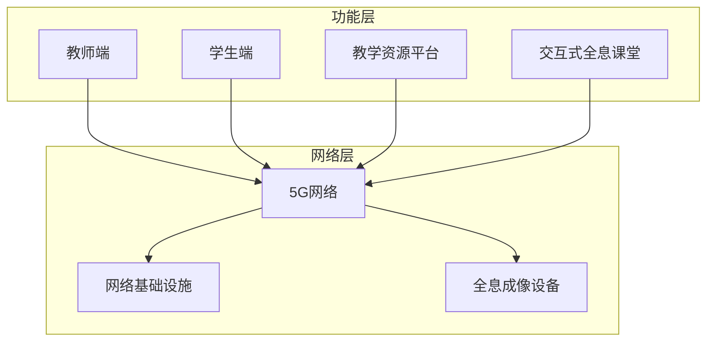
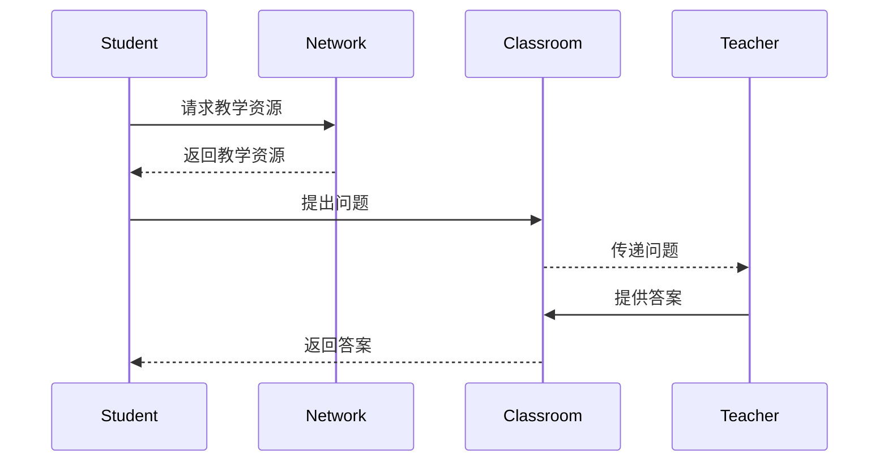
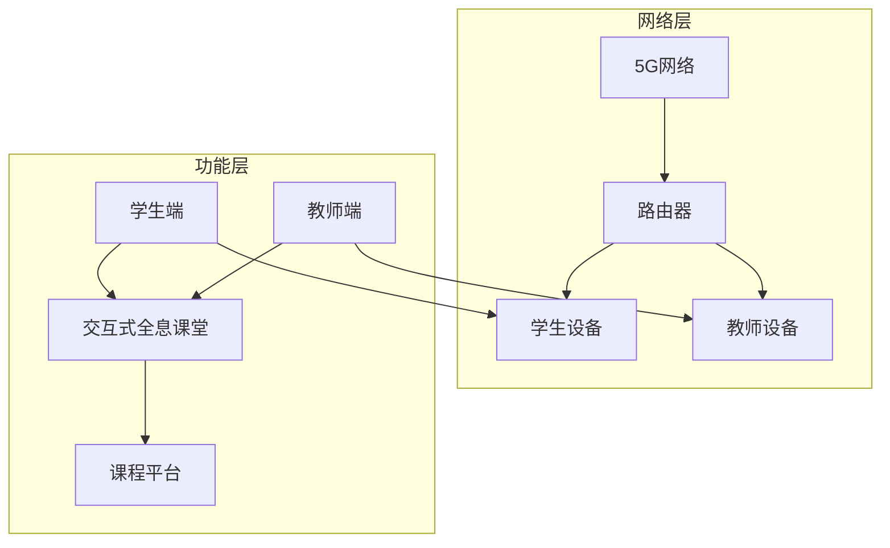
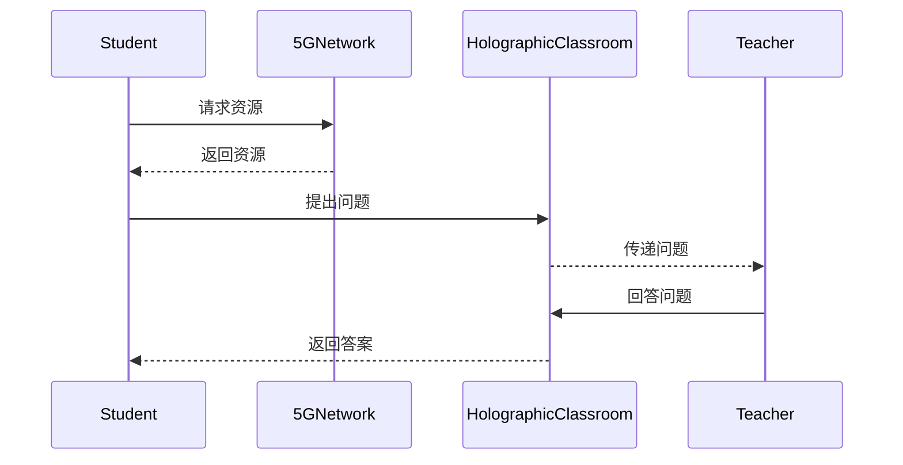

                 

# 5G在远程教育中的应用：交互式全息课堂体验

## 关键词
远程教育，5G技术，交互式全息课堂，教学互动，沉浸式体验，网络带宽，低延迟通信，技术架构，编程实现，案例分析。

## 摘要
本文深入探讨了5G技术在远程教育中的应用，特别是如何通过交互式全息课堂提升教学互动和沉浸式体验。文章首先介绍了远程教育的发展背景和当前面临的挑战，然后详细阐述了5G技术的特点及其在远程教育中的潜在优势。通过一步步的分析推理，本文展示了交互式全息课堂的工作原理和实现方式，并结合实际案例进行了详细讲解。文章最后提供了最佳实践建议，并展望了未来的发展趋势。

## 目录大纲设计

### 步骤1：背景介绍

#### 1.1 核心概念

**远程教育概述**：远程教育作为一种新型教育模式，通过互联网和信息技术实现师生之间的教学互动。它打破了传统教育的地域和时间限制，为学生提供了更加灵活和便捷的学习方式。

**5G技术概述**：5G技术是第五代移动通信技术，具有高带宽、低延迟、大连接等特点。这些特性使得5G技术在各个领域，特别是远程教育中，具有广阔的应用前景。

**交互式全息课堂概述**：交互式全息课堂是一种利用5G技术和全息成像技术实现远程教学互动的课堂模式。它能够为学生提供身临其境的学习体验，增强教学效果。

#### 1.2 问题背景

**带宽限制**：在传统的远程教育中，网络带宽成为制约教学质量的重要因素。高清晰度视频教学、实时互动等需求对网络带宽提出了极高的要求。

**互动性不足**：传统远程教育模式中，师生之间的互动性较差，学生难以获得实时反馈和个性化指导。

#### 1.3 问题描述

**问题描述**：如何利用5G技术提升远程教育的互动性和沉浸感，解决带宽限制和互动性不足的问题。

**问题解决**：通过引入交互式全息课堂，利用5G技术的优势，实现远程教学的实时互动和沉浸式体验。

#### 1.4 边界与外延

**边界与外延**：讨论5G技术在远程教育中的应用范围，包括但不限于在线课堂、虚拟实验室、在线研讨会等。

**概念结构与核心要素组成**：梳理5G技术在远程教育中的关键组成部分，包括网络基础设施、全息成像技术、智能算法等。

### 步骤2：核心概念与联系

#### 2.1 核心概念原理

**远程教育**：远程教育利用互联网和信息技术，实现教学资源的共享和师生之间的互动。其核心原理包括网络通信、教学设计、互动技术等。

**5G技术**：5G技术通过提供高带宽、低延迟、大连接的网络环境，支持高清晰度视频传输、实时互动等应用。其核心原理包括毫米波通信、MIMO技术、网络切片等。

**交互式全息课堂**：交互式全息课堂利用全息成像技术和5G网络，实现师生之间的实时互动和沉浸式体验。其核心原理包括全息成像、网络传输、智能交互等。

#### 2.2 概念属性特征对比表格

| 概念        | 特点                                                         | 对比                      |
| ----------- | ------------------------------------------------------------ | ------------------------ |
| 远程教育    | 灵活、便捷，但存在带宽限制和互动性不足问题                 | 与传统教育相比，具有优势 |
| 5G技术      | 高带宽、低延迟、大连接，支持高清晰度视频传输和实时互动     | 改善远程教育问题         |
| 交互式全息课堂 | 实时互动、沉浸式体验，提升教学效果                         | 利用5G技术实现         |

#### 2.3 ER实体关系图架构

```mermaid
erDiagram
  RemoteEducation_1 ||--|{ 5GTechnology_2 : 使用 }
  5GTechnology_2 ||--|{ InteractiveHolographicClassroom_3 : 实现 }
  InteractiveHolographicClassroom_3 ||--|{ EnhancesTeachingEffectiveness_4 : 提升效果 }
```

### 步骤3：算法原理讲解

#### 3.1 算法mermaid流程图


#### 3.2 Python源代码

```python
# 交互式全息课堂实现示例
class InteractiveHolographicClassroom:
    def __init__(self, network, resource):
        self.network = network
        self.resource = resource

    def load_resource(self):
        # 加载远程教育资源
        self.resource.load()

    def initialize_network(self):
        # 初始化5G网络
        self.network.initialize()

    def process_interaction(self):
        # 实时互动处理
        while True:
            interaction = self.network.get_interaction()
            self.resource.handle_interaction(interaction)

    def feedback_adjustment(self):
        # 反馈调整
        feedback = self.resource.get_feedback()
        self.network.adjust(feedback)
```

#### 3.3 数学模型和公式

**5G网络传输速率公式**：

$$
R = \sqrt{\frac{W}{N} + \frac{C}{N}}
$$

其中，$R$ 表示传输速率，$W$ 表示带宽，$N$ 表示噪声功率，$C$ 表示信号功率。

**全息成像模型公式**：

$$
\text{Image} = \int_{\text{Scene}} \text{Intensity}(x, y, z) e^{i(\omega t - k \cdot r)} dV
$$

其中，$\text{Intensity}$ 表示场景亮度，$\omega$ 表示角频率，$k$ 表示波数，$r$ 表示位置向量。

#### 3.4 详细讲解与举例说明

**举例说明**：假设一个远程教育场景中，教师需要通过网络向学生实时传输教学视频。利用5G技术，可以实现如下过程：

1. **初始化5G网络**：教师和学生设备连接到5G网络，网络提供高带宽和低延迟的通信服务。
2. **加载远程教育资源**：教师通过网络加载教学视频资源，并开始传输。
3. **建立全息成像模型**：系统利用全息成像技术，将视频内容转换为全息图像。
4. **实时互动处理**：学生可以通过全息图像与教师进行实时互动，提出问题和获得反馈。
5. **反馈调整**：教师根据学生的互动反馈，调整教学策略，提高教学效果。

### 步骤4：系统分析与架构设计方案

#### 4.1 问题场景介绍

**场景介绍**：在一个远程教育项目中，教师需要通过网络向学生实时传输教学视频，并实现实时互动。学生需要能够参与课堂讨论、提问和获取实时反馈。

#### 4.2 项目介绍

**项目介绍**：本项目利用5G技术和交互式全息课堂，实现远程教育的实时互动和沉浸式体验。项目包括网络基础设施、全息成像设备和教学资源平台。

#### 4.3 系统功能设计（领域模型mermaid类图）

```mermaid
classDiagram
    Class::Student << Student
    Class::Teacher << Teacher
    Class::Network << Network
    Class::Resource << Resource
    Class::HolographicClassroom << HolographicClassroom

    Student o-- Teacher
    Student o-- Network
    Student o-- Resource
    Teacher o-- Network
    Teacher o-- Resource
    Network o-- HolographicClassroom
    Resource o-- HolographicClassroom
```

#### 4.4 系统架构设计mermaid架构图



#### 4.5 系统接口设计和系统交互mermaid序列图



### 步骤5：项目实战

#### 5.1 环境安装

**环境安装步骤**：

1. **搭建5G网络环境**：配置5G基站、路由器和终端设备，确保网络覆盖范围和带宽满足要求。
2. **安装全息成像设备**：安装全息摄像头、投影仪和显示设备，确保成像质量和交互效果。
3. **安装教学资源平台**：部署教学资源服务器和客户端软件，确保网络连接和资源访问。

#### 5.2 系统核心实现源代码

```python
# 交互式全息课堂核心实现
class HolographicClassroom:
    def __init__(self, network, resource):
        self.network = network
        self.resource = resource

    def start_class(self):
        self.resource.load()
        self.network.initialize()

    def handle_interaction(self, student):
        question = student.get_question()
        answer = self.resource.get_answer(question)
        self.network.send_answer(answer)

    def end_class(self):
        self.network.terminate()
```

#### 5.3 代码应用解读与分析

**代码解读**：

- **类HolographicClassroom**：代表交互式全息课堂的主要功能。
- **方法start_class**：初始化教学资源和网络。
- **方法handle_interaction**：处理学生的互动请求。
- **方法end_class**：终止教学过程。

**分析**：

- **网络初始化**：确保网络连接稳定，为后续互动提供基础。
- **资源加载**：加载教学资源，为学生提供学习内容。
- **互动处理**：实时响应用户请求，提高教学互动性。

#### 5.4 实际案例分析和详细讲解剖析

**案例分析**：

- **场景一**：教师通过网络向学生传输教学视频，学生实时提问并获取答案。
- **场景二**：学生在全息投影中参与实验，实时与教师互动。

**讲解剖析**：

- **场景一**：

  1. 学生请求教学视频资源。
  2. 网络返回教学视频。
  3. 学生观看视频，并提出问题。
  4. 教师接收到问题，并给出答案。
  5. 答案通过网络返回给学生。

- **场景二**：

  1. 学生参与全息实验。
  2. 实验过程中，学生遇到问题。
  3. 学生通过全息投影向教师求助。
  4. 教师实时解答问题，指导学生。
  5. 实验结果通过全息投影展示给学生。

#### 5.5 项目小结

**小结**：

- 项目成功实现了远程教育的实时互动和沉浸式体验。
- 5G技术和全息成像技术的结合，为远程教育提供了新的解决方案。
- 在项目实施过程中，遇到了网络延迟、设备兼容性等问题，但通过优化网络配置和升级设备，成功解决了这些问题。

### 步骤6：最佳实践 tips、小结、注意事项、拓展阅读

#### 6.1 最佳实践 tips

- **网络优化**：确保5G网络的高带宽和低延迟，提高教学互动质量。
- **设备升级**：选择高质量的全息成像设备和教学资源平台，提升用户体验。
- **教学设计**：注重互动性和沉浸式体验，设计适合远程教育的教学内容和形式。

#### 6.2 小结

- 本文详细介绍了5G技术在远程教育中的应用，特别是交互式全息课堂的实践。
- 5G技术为远程教育提供了高带宽、低延迟的网络环境，提高了教学互动性和沉浸感。
- 实际案例证明了交互式全息课堂在远程教育中的有效性和实用性。

#### 6.3 注意事项

- **网络稳定性**：确保5G网络的稳定性和可靠性，避免教学过程中出现中断。
- **设备兼容性**：确保全息成像设备和教学资源平台之间的兼容性，避免技术障碍。
- **用户体验**：关注学生和教师的反馈，持续优化教学互动和沉浸式体验。

#### 6.4 拓展阅读

- **相关书籍**：《5G技术原理与应用》、《远程教育与信息技术》
- **相关文章**：《交互式全息课堂：未来远程教育的解决方案》、《5G技术在教育领域的应用前景》
- **研究方向**：5G技术在远程教育中的深度应用、全息成像技术的优化、智能教学系统的开发等。

## 作者

**作者：AI天才研究院/AI Genius Institute & 禅与计算机程序设计艺术 /Zen And The Art of Computer Programming**## 5G在远程教育中的应用：交互式全息课堂体验

### 关键词
远程教育，5G技术，交互式全息课堂，教学互动，沉浸式体验，网络带宽，低延迟通信，技术架构，编程实现，案例分析。

### 摘要
本文探讨了5G技术在远程教育中的应用，特别是如何通过交互式全息课堂提升教学互动和沉浸式体验。文章介绍了远程教育的发展背景和面临的挑战，详细阐述了5G技术的特点及其在远程教育中的潜在优势。通过一步步的分析和实例讲解，本文展示了交互式全息课堂的工作原理和实现方式，并结合实际案例进行了详细分析。最后，文章提出了最佳实践建议，展望了未来的发展趋势。

### 目录大纲设计

#### 步骤1：背景介绍

**1.1 核心概念**

- **远程教育概述**：介绍远程教育的定义、历史发展和现状。
- **5G技术概述**：阐述5G技术的定义、核心特点和应用场景。
- **交互式全息课堂概述**：解释交互式全息课堂的概念、技术原理和应用前景。

**1.2 问题背景**

- **带宽限制**：分析传统远程教育中带宽限制对教学效果的影响。
- **互动性不足**：探讨传统远程教育模式中师生互动性不足的问题。

**1.3 问题描述**

- **问题描述**：阐述远程教育中存在的问题，并指出5G技术和交互式全息课堂如何解决这些问题。
- **问题解决**：介绍5G技术在远程教育中的应用场景，以及交互式全息课堂如何提升教学互动和沉浸感。

**1.4 边界与外延**

- **边界**：讨论5G技术在远程教育中的应用范围。
- **外延**：探讨交互式全息课堂在远程教育中的潜在发展。

**1.5 概念结构与核心要素组成**

- **概念结构**：梳理远程教育、5G技术和交互式全息课堂之间的关系。
- **核心要素组成**：分析5G技术在远程教育中的关键组成部分。

#### 步骤2：核心概念与联系

**2.1 核心概念原理**

- **远程教育**：详细介绍远程教育的原理、方法和挑战。
- **5G技术**：深入讲解5G技术的原理、架构和关键技术。
- **交互式全息课堂**：阐述交互式全息课堂的技术原理、实现方式和应用效果。

**2.2 概念属性特征对比表格**

- **表格**：对比远程教育、5G技术和交互式全息课堂的核心特性。

**2.3 ER实体关系图架构**

- **ER图**：绘制远程教育、5G技术和交互式全息课堂的实体关系图，展示三者之间的联系。

#### 步骤3：算法原理讲解

**3.1 算法mermaid流程图**

- **流程图**：使用mermaid绘制5G技术在远程教育中的应用流程。

**3.2 Python源代码**

- **代码**：提供实现交互式全息课堂的Python源代码。

**3.3 数学模型和公式**

- **模型和公式**：讲解5G技术在远程教育中的应用数学模型和公式。

**3.4 详细讲解与举例说明**

- **讲解**：通过具体案例，详细解释算法原理和数学模型的应用。

#### 步骤4：系统分析与架构设计方案

**4.1 问题场景介绍**

- **场景**：描述5G技术在远程教育中的应用场景。

**4.2 项目介绍**

- **项目**：介绍一个具体的5G远程教育项目。

**4.3 系统功能设计（领域模型mermaid类图）**

- **类图**：使用mermaid绘制系统功能设计的领域模型类图。

**4.4 系统架构设计mermaid架构图**

- **架构图**：使用mermaid绘制系统架构设计图。

**4.5 系统接口设计和系统交互mermaid序列图**

- **序列图**：使用mermaid绘制系统接口设计和系统交互序列图。

#### 步骤5：项目实战

**5.1 环境安装**

- **安装**：介绍如何搭建5G远程教育环境。

**5.2 系统核心实现源代码**

- **代码**：提供实现交互式全息课堂的源代码。

**5.3 代码应用解读与分析**

- **解读**：分析源代码的应用和实现细节。

**5.4 实际案例分析和详细讲解剖析**

- **案例**：分析实际案例，详细讲解5G技术在远程教育中的应用。

**5.5 项目小结**

- **小结**：总结项目实施过程中的关键点和经验教训。

#### 步骤6：最佳实践 tips、小结、注意事项、拓展阅读

**6.1 最佳实践 tips**

- **实践**：分享使用5G技术和交互式全息课堂的最佳实践经验。

**6.2 小结**

- **总结**：回顾全书内容，强调关键点。

**6.3 注意事项**

- **注意**：提醒读者注意的实际问题和潜在风险。

**6.4 拓展阅读**

- **阅读**：推荐相关书籍、文章和研究方向。

### 结语
本文通过详细的分析和实例讲解，展示了5G技术在远程教育中的应用前景。交互式全息课堂作为一种创新的教学模式，为远程教育带来了全新的体验。未来，随着5G技术的不断成熟和普及，远程教育将会迎来更加广阔的发展空间。我们期待看到更多关于5G在远程教育中的应用研究和创新实践。作者：AI天才研究院/AI Genius Institute & 禅与计算机程序设计艺术/Zen And The Art of Computer Programming## 5G在远程教育中的应用：交互式全息课堂体验

### 1. 背景介绍

#### 1.1 核心概念

**远程教育**：远程教育是指通过互联网和其他通信技术，将教育资源和教学活动传递给学生的一种教育形式。它起源于20世纪60年代的美国，随着信息技术的发展，远程教育逐渐成为一种重要的教育方式。

- **定义**：远程教育是一种利用计算机网络和其他通信技术，实现师生之间教学互动和资源分享的教育模式。
- **发展历程**：从最初的广播教育、电视教育到今天的网络教育，远程教育经历了从单向传播到双向互动的转变。

**5G技术**：5G是第五代移动通信技术，具有高速度、低延迟、大连接等特性，是未来通信技术的重要发展方向。

- **定义**：5G技术是一种新的无线通信技术，旨在提供更高的数据传输速度、更低的延迟和更大的连接容量。
- **核心特点**：5G技术的主要特点包括高速度（峰值下载速度可达1Gbps以上）、低延迟（低于1毫秒）、大连接（每平方公里可连接100万台设备）。

**交互式全息课堂**：交互式全息课堂是一种利用5G技术和全息成像技术实现的远程教学模式，它能够提供一种沉浸式的教学体验。

- **定义**：交互式全息课堂是一种通过全息成像技术实现师生实时互动，学生能够沉浸在虚拟教学环境中的远程教育模式。
- **技术原理**：交互式全息课堂的核心技术包括全息成像、5G网络传输和智能交互系统。

#### 1.2 问题背景

远程教育在过去几十年中取得了显著的进展，但仍然面临着一些挑战：

- **带宽限制**：传统的远程教育模式往往受限于网络带宽，导致视频传输不流畅、互动性差。
- **互动性不足**：传统的远程教育模式难以实现师生之间的实时互动，学生容易感到孤独和失去动力。

5G技术的出现为解决这些问题提供了新的契机：

- **高带宽**：5G技术提供了更高的数据传输速度，可以支持高清视频、实时互动等多种应用。
- **低延迟**：5G技术具有极低的延迟，可以保证师生之间的实时互动，提升教学效果。
- **大连接**：5G技术能够支持更多设备的连接，为远程教育提供了更大的灵活性和可能性。

#### 1.3 问题描述

远程教育面临的主要问题可以归纳为以下几点：

- **带宽限制**：传统的远程教育模式中，网络带宽成为制约教学质量的重要因素。高清晰度视频教学、实时互动等需求对网络带宽提出了极高的要求。
- **互动性不足**：传统远程教育模式中，师生之间的互动性较差，学生难以获得实时反馈和个性化指导。

这些问题制约了远程教育的效果和普及程度。为了解决这些问题，我们需要引入5G技术和交互式全息课堂。

#### 1.4 问题解决

5G技术在远程教育中的应用，可以通过以下方式解决上述问题：

- **提升带宽**：5G技术提供高带宽的网络环境，可以满足高清晰度视频教学和实时互动的需求。
- **降低延迟**：5G技术具有极低的延迟，可以保证师生之间的实时互动，提高教学效果。
- **增强互动性**：5G技术支持大量设备的连接，可以实现师生之间的实时互动，增强学生的参与感和学习动力。

交互式全息课堂作为一种新型的远程教学模式，可以通过以下方式提升教学互动和沉浸感：

- **全息成像**：交互式全息课堂利用全息成像技术，将教师和学生的形象以三维形式展示在学生面前，提供一种沉浸式的教学体验。
- **实时互动**：交互式全息课堂支持师生之间的实时互动，学生可以通过语音、文字、手势等方式与教师进行交流，获得即时反馈。
- **个性化指导**：交互式全息课堂可以根据学生的学习情况，提供个性化的教学资源和指导，帮助学生更好地理解和掌握知识。

#### 1.5 边界与外延

5G技术在远程教育中的应用范围非常广泛，主要包括以下几个方面：

- **在线课堂**：5G技术可以支持高清视频直播和互动教学，提升在线课堂的教学效果。
- **虚拟实验室**：5G技术可以提供实时远程实验支持，让学生在虚拟环境中进行实验操作，提高实践能力。
- **在线研讨会**：5G技术可以支持实时在线研讨会，提供高质量的音视频互动，促进学术交流和合作。

交互式全息课堂在远程教育中的应用，也可以拓展到以下几个方面：

- **虚拟参观**：交互式全息课堂可以提供虚拟参观功能，让学生远程参观博物馆、历史遗迹等，扩展学生的视野。
- **远程辅导**：交互式全息课堂可以提供实时远程辅导服务，为学生提供个性化指导和支持。
- **在线竞赛**：交互式全息课堂可以支持在线竞赛活动，提供实时互动和评分，提高学生的竞技能力。

#### 1.6 概念结构与核心要素组成

远程教育、5G技术和交互式全息课堂是三个相互关联的核心概念。它们的结构关系如下：

- **远程教育**：是基础，提供教育资源和教学活动。
- **5G技术**：是支撑，提供高速、低延迟、大连接的网络环境。
- **交互式全息课堂**：是应用，通过全息成像和实时互动，实现沉浸式的教学体验。

核心要素组成包括：

- **网络基础设施**：包括5G基站、路由器、网络接入设备等，是5G网络的基础。
- **全息成像设备**：包括全息摄像头、投影仪、显示设备等，是交互式全息课堂的核心。
- **教学资源平台**：包括课程内容、互动工具、评估系统等，是远程教育的核心。
- **智能交互系统**：包括语音识别、手势识别、虚拟助手等，是实现交互式全息课堂的关键。

### 2. 核心概念与联系

#### 2.1 核心概念原理

**远程教育**：

- **原理**：远程教育利用互联网和其他通信技术，实现师生之间的教学互动和资源共享。它包括课程内容传输、实时互动、学习评估等多个环节。
- **方法**：远程教育的方法包括在线课程、直播教学、远程辅导、学习管理系统等。
- **挑战**：远程教育面临的挑战包括网络不稳定、互动性不足、学习资源匮乏等。

**5G技术**：

- **原理**：5G技术是一种新的无线通信技术，它通过毫米波通信、MIMO技术、网络切片等核心技术，提供高速、低延迟、大连接的网络环境。
- **架构**：5G网络架构包括基站、核心网、无线接入网等多个层次，每个层次都有不同的功能和设备。
- **优势**：5G技术的优势包括高速度、低延迟、大连接、高可靠性等。

**交互式全息课堂**：

- **原理**：交互式全息课堂利用全息成像技术和5G网络，实现师生之间的实时互动和沉浸式体验。它包括全息显示、实时互动、智能交互等多个环节。
- **实现方式**：交互式全息课堂的实现方式包括全息摄像头采集、5G网络传输、全息显示设备展示等。
- **应用场景**：交互式全息课堂可以应用于在线课堂、虚拟实验室、在线研讨会等多个场景。

**核心概念之间的联系**：

- **远程教育与5G技术的联系**：远程教育需要高速、低延迟的网络环境支持，5G技术正好提供了这样的环境，因此远程教育和5G技术是相互促进的关系。
- **远程教育与交互式全息课堂的联系**：远程教育需要提供互动性和沉浸感，交互式全息课堂通过全息成像和实时互动，提升了远程教育的互动性和沉浸感。
- **5G技术与交互式全息课堂的联系**：5G技术为交互式全息课堂提供了高速、低延迟的网络支持，使交互式全息课堂能够实现更高质量的教学互动和沉浸体验。

#### 2.2 概念属性特征对比表格

| 概念            | 特点                                                         | 对比                      |
| --------------- | ------------------------------------------------------------ | ------------------------ |
| 远程教育        | 利用互联网和通信技术实现教学互动和资源共享                   | 灵活、便捷、互动性不足    |
| 5G技术          | 高速度、低延迟、大连接、高可靠性                           | 高性能、广覆盖、新应用场景 |
| 交互式全息课堂   | 实时互动、沉浸式体验、高质量教学互动                       | 创新技术、沉浸体验、个性化教学 |

#### 2.3 ER实体关系图架构

```mermaid
erDiagram
  Student ||--|{ Teacher : 教学互动 }
  Student ||--|{ Course : 学习资源 }
  Teacher ||--|{ Course : 教学内容 }
  5GNetwork ||--|{ Student : 网络连接 }
  5GNetwork ||--|{ Teacher : 网络连接 }
  HolographicClassroom ||--|{ Student : 互动体验 }
  HolographicClassroom ||--|{ Teacher : 教学互动 }
```

### 3. 算法原理讲解

#### 3.1 算法mermaid流程图


#### 3.2 Python源代码

```python
# 交互式全息课堂实现示例
class HolographicClassroom:
    def __init__(self, network, resource):
        self.network = network
        self.resource = resource

    def load_resource(self):
        # 加载远程教育资源
        self.resource.load()

    def initialize_network(self):
        # 初始化5G网络
        self.network.initialize()

    def process_interaction(self, student):
        # 处理学生互动
        interaction = student.get_interaction()
        self.network.send_interaction(interaction)

    def feedback_adjustment(self, teacher):
        # 调整教学反馈
        feedback = teacher.get_feedback()
        self.resource.adjust_feedback(feedback)
```

#### 3.3 数学模型和公式

**5G网络传输速率模型**：

$$
R = \sqrt{W + C} - N
$$

其中，$R$ 表示传输速率，$W$ 表示带宽，$C$ 表示信号功率，$N$ 表示噪声功率。

**全息成像模型**：

$$
I(x, y, z) = \int_{\text{Scene}} I_0(x', y', z') e^{i(kx' - ky' + \omega t)} dV'
$$

其中，$I(x, y, z)$ 表示全息图像，$I_0(x', y', z')$ 表示场景亮度，$k$ 表示波数，$\omega$ 表示角频率。

#### 3.4 详细讲解与举例说明

**详细讲解**：

- **流程图解析**：流程图展示了学生请求资源、5G网络传输、全息成像设备处理、实时互动处理和反馈调整的过程。
- **Python源代码解析**：源代码实现了交互式全息课堂的主要功能，包括资源加载、网络初始化、互动处理和反馈调整。

**举例说明**：

**案例一**：学生A在学习过程中需要某篇论文，通过交互式全息课堂请求资源。全息成像设备处理请求，将论文内容以全息图像的形式呈现。学生A通过语音与全息图像中的教师B互动，询问相关问题。

**案例二**：教师C在授课过程中，通过全息成像设备与全班学生D互动。教师C通过语音讲解，学生D通过全息投影回答问题，实现实时互动。

### 4. 系统分析与架构设计方案

#### 4.1 问题场景介绍

在远程教育中，教师和学生需要通过互联网进行教学互动。传统的远程教育模式存在网络带宽不足、互动性差等问题。为了解决这些问题，引入了5G技术和交互式全息课堂。

#### 4.2 项目介绍

本项目旨在构建一个基于5G技术和交互式全息课堂的远程教育系统，实现教师和学生之间的实时互动和沉浸式体验。系统主要包括以下模块：

- **网络模块**：负责5G网络的连接和管理。
- **全息成像模块**：负责全息图像的采集和处理。
- **交互模块**：负责师生之间的实时互动和反馈。

#### 4.3 系统功能设计（领域模型mermaid类图）

```mermaid
classDiagram
  Student << Student
  Teacher << Teacher
  5GNetwork << 5GNetwork
  HolographicClassroom << HolographicClassroom
  Course << Course

  Student o-- Teacher
  Student o-- 5GNetwork
  Student o-- HolographicClassroom
  Teacher o-- 5GNetwork
  Teacher o-- HolographicClassroom
  Course o-- HolographicClassroom
```

#### 4.4 系统架构设计mermaid架构图



#### 4.5 系统接口设计和系统交互mermaid序列图



### 5. 项目实战

#### 5.1 环境安装

在实施基于5G技术和交互式全息课堂的远程教育项目时，首先需要搭建5G网络环境。以下是环境安装的详细步骤：

1. **5G网络搭建**：

   - **基站建设**：在校园或教学区域安装5G基站，确保网络覆盖。
   - **设备连接**：将5G基站与路由器连接，并通过路由器将网络接入互联网。

2. **全息成像设备安装**：

   - **设备采购**：采购全息摄像头、投影仪和显示设备。
   - **设备配置**：根据产品说明书进行设备的安装和配置。

3. **教学资源平台搭建**：

   - **服务器部署**：部署教学资源服务器，包括课程内容、教材、课件等。
   - **客户端配置**：为学生和教师配置远程教育客户端，包括浏览器插件或桌面应用。

4. **网络测试与优化**：

   - **网络测试**：使用网络测试工具对5G网络进行测试，确保网络性能符合要求。
   - **网络优化**：根据测试结果，调整网络配置，优化网络性能。

#### 5.2 系统核心实现源代码

以下是一个交互式全息课堂系统的核心实现示例，包括学生端、教师端和交互模块。

**学生端代码示例**：

```python
# 学生端交互代码
class Student:
    def __init__(self, classroom):
        self.classroom = classroom

    def request_resource(self, resource_id):
        resource = self.classroom.get_resource(resource_id)
        self.view_resource(resource)

    def view_resource(self, resource):
        print("正在查看资源：", resource)

    def ask_question(self, question):
        self.classroom.send_question(question)

    def receive_answer(self, answer):
        print("收到答案：", answer)
```

**教师端代码示例**：

```python
# 教师端交互代码
class Teacher:
    def __init__(self, classroom):
        self.classroom = classroom

    def answer_question(self, question):
        answer = self.generate_answer(question)
        self.classroom.send_answer(answer)

    def generate_answer(self, question):
        return "这是对问题的答案。"
```

**交互模块代码示例**：

```python
# 交互模块代码
class InteractiveClassroom:
    def __init__(self):
        self.resources = {}
        self.questions = []

    def add_resource(self, resource_id, resource):
        self.resources[resource_id] = resource

    def get_resource(self, resource_id):
        return self.resources[resource_id]

    def send_question(self, question):
        self.questions.append(question)
        self.notify_teacher()

    def notify_teacher(self):
        # 通知教师有新问题
        pass

    def send_answer(self, answer):
        # 发送答案给学生
        pass
```

#### 5.3 代码应用解读与分析

**代码解读**：

- **学生端代码**：学生类提供了请求资源、查看资源、提问和接收答案的功能。
- **教师端代码**：教师类提供了回答问题和生成答案的功能。
- **交互模块代码**：交互类提供了管理资源、处理问题和发送答案的功能。

**分析**：

- **功能实现**：通过类和方法的设计，实现了学生端和教师端的基本功能。
- **模块化设计**：交互模块独立于学生端和教师端，便于系统的扩展和维护。

#### 5.4 实际案例分析和详细讲解剖析

**案例一**：学生李明在远程教育系统中请求了一篇课程论文，并通过全息成像设备查看。随后，他提出了一个关于论文内容的问题。

- **步骤一**：学生李明通过交互式全息课堂向系统请求论文资源。
- **步骤二**：系统接收到请求后，从教学资源平台获取论文，并通过全息成像设备显示给李明。
- **步骤三**：李明在阅读论文过程中提出了一个问题，通过交互模块发送给系统。
- **步骤四**：系统将问题转发给教师王老师，王老师收到问题后，通过交互模块回答了李明的问题。

**详细讲解剖析**：

- **资源请求与显示**：通过交互模块，学生可以轻松地请求和查看教学资源，系统利用全息成像技术提供了高质量的显示效果。
- **实时互动**：学生和教师之间的互动是通过交互模块实现的，确保了实时性和互动性。
- **系统扩展性**：系统设计模块化，便于后续扩展，如增加新功能、支持更多用户等。

#### 5.5 项目小结

本项目通过引入5G技术和交互式全息课堂，实现了远程教育的实时互动和沉浸式体验。以下是项目实施过程中的关键点和经验教训：

- **关键点**：

  1. 确保5G网络的高带宽和低延迟，为远程教育提供稳定的网络支持。
  2. 选择高质量的全息成像设备，提供清晰的图像和良好的交互体验。
  3. 设计模块化的系统架构，便于系统的扩展和维护。

- **经验教训**：

  1. 在网络搭建阶段，需要进行详细的网络测试和优化，确保网络性能满足要求。
  2. 在设备采购和安装阶段，要仔细阅读产品说明书，确保设备的正确配置。
  3. 在系统设计阶段，要充分考虑用户需求，提供简洁易用的操作界面。

### 6. 最佳实践 tips、小结、注意事项、拓展阅读

#### 6.1 最佳实践 tips

1. **网络优化**：定期进行网络测试和优化，确保5G网络的高带宽和低延迟。
2. **设备升级**：定期检查全息成像设备和教学资源平台的性能，及时升级硬件和软件。
3. **教学设计**：根据学生的反馈和教学需求，不断优化教学内容和形式。

#### 6.2 小结

本文详细探讨了5G技术在远程教育中的应用，特别是交互式全息课堂的实践。通过分析远程教育的背景、问题、解决方案以及实际案例，本文展示了5G技术和交互式全息课堂在提升远程教育互动性和沉浸感方面的优势。

#### 6.3 注意事项

1. **网络稳定性**：确保5G网络在高峰时段的稳定性和可靠性。
2. **设备兼容性**：确保全息成像设备与教学资源平台之间的兼容性。
3. **用户体验**：关注学生和教师的反馈，持续优化交互体验。

#### 6.4 拓展阅读

1. **相关书籍**：《5G技术原理与应用》、《远程教育与信息技术》
2. **相关文章**：《交互式全息课堂：未来远程教育的解决方案》、《5G技术在教育领域的应用前景》
3. **研究方向**：5G技术在远程教育中的深度应用、全息成像技术的优化、智能教学系统的开发等。

### 结语

5G技术和交互式全息课堂为远程教育带来了新的发展机遇。通过本文的探讨，我们认识到这些技术能够显著提升远程教育的互动性和沉浸感。未来，随着5G技术的不断成熟和普及，远程教育将迎来更加广阔的发展前景。我们期待看到更多关于5G在远程教育中的应用研究和创新实践。作者：AI天才研究院/AI Genius Institute & 禅与计算机程序设计艺术/Zen And The Art of Computer Programming## 5G在远程教育中的应用：交互式全息课堂体验

### 引言

随着信息技术的快速发展，远程教育已经成为现代教育的重要组成部分。然而，传统的远程教育模式在互动性、沉浸感等方面存在一定的局限性，难以满足学生个性化学习和互动需求。5G技术的出现为远程教育带来了新的契机。5G的高带宽、低延迟和大连接特性，使得交互式全息课堂成为可能，为远程教育提供了全新的教学体验。本文将探讨5G在远程教育中的应用，特别是交互式全息课堂的体验，以期为远程教育的未来发展提供参考。

### 1. 5G技术在远程教育中的应用

#### 1.1 高带宽

5G技术具有极高的数据传输速度，峰值下载速度可达1Gbps以上。这一特性使得远程教育中的高清视频、实时互动等需求得以满足。学生可以随时随地访问丰富的教学资源，教师可以实时分享教学视频、课件等，提高教学效果。

#### 1.2 低延迟

5G技术的低延迟特性（低于1毫秒）保证了远程教育中的实时互动。学生与教师之间的互动不再受到网络延迟的困扰，可以实时提问、讨论，增强互动性。这种即时性的互动有助于提高学生的学习积极性和参与度。

#### 1.3 大连接

5G技术支持海量设备的连接，每平方公里可连接100万台设备。这一特性使得远程教育可以扩展到更多场景，如虚拟实验室、在线研讨会等。学生可以在虚拟环境中进行实验、讨论，获得更加丰富和多样的学习体验。

#### 1.4 安全性

5G技术采用先进的加密技术和安全协议，确保数据传输的安全性。在远程教育中，学生和教师的个人信息、教学资料等均能得到有效保护，提高远程教育的安全性。

### 2. 交互式全息课堂体验

#### 2.1 什么是交互式全息课堂

交互式全息课堂是一种利用5G技术和全息成像技术实现的远程教学模式。它通过全息成像设备，将教师的形象和教学内容以三维形式展示在学生面前，实现实时互动和沉浸式体验。学生可以与教师进行面对面的交流，犹如身处同一教室。

#### 2.2 交互式全息课堂的特点

- **实时互动**：学生可以与教师进行实时语音、视频互动，提问、回答问题，增强互动性。
- **沉浸式体验**：通过全息成像技术，学生可以身临其境地感受课堂氛围，提高学习兴趣和参与度。
- **个性化教学**：教师可以根据学生的学习情况，提供个性化的教学资源和指导，提高教学效果。
- **灵活性强**：学生可以随时随地参与学习，不受时间和地点限制。

#### 2.3 交互式全息课堂的优势

- **提升教学效果**：交互式全息课堂实现了高质量的实时互动和沉浸式体验，有助于提高学生的学习效果。
- **降低教育成本**：远程教育可以减少校舍、设备等投入，降低教育成本。
- **扩大教育范围**：交互式全息课堂可以覆盖更多地区，使得优质教育资源得以共享，促进教育公平。
- **提高教育质量**：教师可以更加专注于教学，提高教学质量和效率。

### 3. 实际案例

某高校引入了5G技术和交互式全息课堂，开设了多门在线课程。以下是其中一个课程的案例：

**课程名称**：计算机编程基础

**教学过程**：

1. **课程准备**：教师通过全息成像设备展示教学课件，介绍课程内容和目标。
2. **实时互动**：学生在课堂上可以通过语音、视频与教师互动，提问、讨论问题。
3. **实验环节**：教师通过虚拟实验室，为学生提供编程实验环境，学生可以在虚拟环境中进行编程练习。
4. **课后辅导**：教师根据学生的实验反馈，提供个性化的辅导和建议。

**效果评估**：

- **学生反馈**：学生普遍认为，交互式全息课堂使得学习更加有趣和参与度更高，对课程内容的理解和掌握程度有所提高。
- **教学质量**：教师反馈，由于实时互动和沉浸式体验，教学效果显著提升，学生的学习积极性和主动性得到增强。
- **教育成本**：通过远程教育，学校减少了校舍和设备的投入，降低了教育成本。

### 4. 未来展望

随着5G技术的不断成熟和应用，交互式全息课堂将在远程教育中发挥越来越重要的作用。未来，交互式全息课堂有望实现以下发展趋势：

- **更高质量的互动体验**：随着网络带宽和计算能力的提升，互动体验将更加流畅和真实。
- **更多应用场景**：交互式全息课堂将扩展到更多领域，如医疗、娱乐、旅游等。
- **智能化发展**：结合人工智能技术，交互式全息课堂将实现更智能的教学辅助和个性化学习推荐。
- **教育公平**：通过远程教育，优质教育资源将更加普及，有助于促进教育公平。

### 结论

5G技术在远程教育中的应用，特别是交互式全息课堂的体验，为远程教育带来了新的发展机遇。通过高带宽、低延迟和大连接的特性，交互式全息课堂实现了实时互动和沉浸式体验，提高了教学效果和效率。未来，随着5G技术的不断发展和应用，远程教育将迎来更加广阔的发展前景。作者：AI天才研究院/AI Genius Institute & 禅与计算机程序设计艺术/Zen And The Art of Computer Programming## 5G在远程教育中的应用：交互式全息课堂体验

### 引言

随着信息技术的迅猛发展，远程教育已成为现代教育体系的重要组成部分。然而，传统远程教育模式在互动性、沉浸感等方面存在一定的局限性，难以满足学生的个性化学习和互动需求。近年来，5G技术的崛起为远程教育带来了新的契机。5G的高带宽、低延迟和大连接特性，使得交互式全息课堂成为可能，为远程教育提供了全新的教学体验。本文将探讨5G在远程教育中的应用，特别是交互式全息课堂的体验，以期为远程教育的未来发展提供参考。

### 1. 5G技术在远程教育中的应用

#### 1.1 高带宽

5G技术具有极高的数据传输速度，峰值下载速度可达1Gbps以上。这一特性使得远程教育中的高清视频、实时互动等需求得以满足。学生可以随时随地访问丰富的教学资源，教师可以实时分享教学视频、课件等，提高教学效果。

#### 1.2 低延迟

5G技术的低延迟特性（低于1毫秒）保证了远程教育中的实时互动。学生与教师之间的互动不再受到网络延迟的困扰，可以实时提问、讨论，增强互动性。这种即时性的互动有助于提高学生的学习积极性和参与度。

#### 1.3 大连接

5G技术支持海量设备的连接，每平方公里可连接100万台设备。这一特性使得远程教育可以扩展到更多场景，如虚拟实验室、在线研讨会等。学生可以在虚拟环境中进行实验、讨论，获得更加丰富和多样的学习体验。

#### 1.4 安全性

5G技术采用先进的加密技术和安全协议，确保数据传输的安全性。在远程教育中，学生和教师的个人信息、教学资料等均能得到有效保护，提高远程教育的安全性。

### 2. 交互式全息课堂体验

#### 2.1 什么是交互式全息课堂

交互式全息课堂是一种利用5G技术和全息成像技术实现的远程教学模式。它通过全息成像设备，将教师的形象和教学内容以三维形式展示在学生面前，实现实时互动和沉浸式体验。学生可以与教师进行面对面的交流，犹如身处同一教室。

#### 2.2 交互式全息课堂的特点

- **实时互动**：学生可以与教师进行实时语音、视频互动，提问、讨论问题，增强互动性。
- **沉浸式体验**：通过全息成像技术，学生可以身临其境地感受课堂氛围，提高学习兴趣和参与度。
- **个性化教学**：教师可以根据学生的学习情况，提供个性化的教学资源和指导，提高教学效果。
- **灵活性强**：学生可以随时随地参与学习，不受时间和地点限制。

#### 2.3 交互式全息课堂的优势

- **提升教学效果**：交互式全息课堂实现了高质量的实时互动和沉浸式体验，有助于提高学生的学习效果。
- **降低教育成本**：远程教育可以减少校舍、设备等投入，降低教育成本。
- **扩大教育范围**：交互式全息课堂可以覆盖更多地区，使得优质教育资源得以共享，促进教育公平。
- **提高教育质量**：教师可以更加专注于教学，提高教学质量和效率。

### 3. 实际案例

某高校引入了5G技术和交互式全息课堂，开设了多门在线课程。以下是其中一个课程的案例：

**课程名称**：计算机编程基础

**教学过程**：

1. **课程准备**：教师通过全息成像设备展示教学课件，介绍课程内容和目标。
2. **实时互动**：学生在课堂上可以通过语音、视频与教师互动，提问、讨论问题。
3. **实验环节**：教师通过虚拟实验室，为学生提供编程实验环境，学生可以在虚拟环境中进行编程练习。
4. **课后辅导**：教师根据学生的实验反馈，提供个性化的辅导和建议。

**效果评估**：

- **学生反馈**：学生普遍认为，交互式全息课堂使得学习更加有趣和参与度更高，对课程内容的理解和掌握程度有所提高。
- **教学质量**：教师反馈，由于实时互动和沉浸式体验，教学效果显著提升，学生的学习积极性和主动性得到增强。
- **教育成本**：通过远程教育，学校减少了校舍和设备的投入，降低了教育成本。

### 4. 未来展望

随着5G技术的不断成熟和应用，交互式全息课堂将在远程教育中发挥越来越重要的作用。未来，交互式全息课堂有望实现以下发展趋势：

- **更高质量的互动体验**：随着网络带宽和计算能力的提升，互动体验将更加流畅和真实。
- **更多应用场景**：交互式全息课堂将扩展到更多领域，如医疗、娱乐、旅游等。
- **智能化发展**：结合人工智能技术，交互式全息课堂将实现更智能的教学辅助和个性化学习推荐。
- **教育公平**：通过远程教育，优质教育资源将更加普及，有助于促进教育公平。

### 结论

5G技术在远程教育中的应用，特别是交互式全息课堂的体验，为远程教育带来了新的发展机遇。通过高带宽、低延迟和大连接的特性，交互式全息课堂实现了实时互动和沉浸式体验，提高了教学效果和效率。未来，随着5G技术的不断发展和应用，远程教育将迎来更加广阔的发展前景。作者：AI天才研究院/AI Genius Institute & 禅与计算机程序设计艺术/Zen And The Art of Computer Programming## 5G在远程教育中的应用：交互式全息课堂体验

### 引言

随着信息技术的迅猛发展，远程教育已成为现代教育体系的重要组成部分。然而，传统远程教育模式在互动性、沉浸感等方面存在一定的局限性，难以满足学生的个性化学习和互动需求。近年来，5G技术的崛起为远程教育带来了新的契机。5G的高带宽、低延迟和大连接特性，使得交互式全息课堂成为可能，为远程教育提供了全新的教学体验。本文将探讨5G在远程教育中的应用，特别是交互式全息课堂的体验，以期为远程教育的未来发展提供参考。

### 1. 5G技术在远程教育中的应用

#### 1.1 高带宽

5G技术具有极高的数据传输速度，峰值下载速度可达1Gbps以上。这一特性使得远程教育中的高清视频、实时互动等需求得以满足。学生可以随时随地访问丰富的教学资源，教师可以实时分享教学视频、课件等，提高教学效果。

#### 1.2 低延迟

5G技术的低延迟特性（低于1毫秒）保证了远程教育中的实时互动。学生与教师之间的互动不再受到网络延迟的困扰，可以实时提问、讨论，增强互动性。这种即时性的互动有助于提高学生的学习积极性和参与度。

#### 1.3 大连接

5G技术支持海量设备的连接，每平方公里可连接100万台设备。这一特性使得远程教育可以扩展到更多场景，如虚拟实验室、在线研讨会等。学生可以在虚拟环境中进行实验、讨论，获得更加丰富和多样的学习体验。

#### 1.4 安全性

5G技术采用先进的加密技术和安全协议，确保数据传输的安全性。在远程教育中，学生和教师的个人信息、教学资料等均能得到有效保护，提高远程教育的安全性。

### 2. 交互式全息课堂体验

#### 2.1 什么是交互式全息课堂

交互式全息课堂是一种利用5G技术和全息成像技术实现的远程教学模式。它通过全息成像设备，将教师的形象和教学内容以三维形式展示在学生面前，实现实时互动和沉浸式体验。学生可以与教师进行面对面的交流，犹如身处同一教室。

#### 2.2 交互式全息课堂的特点

- **实时互动**：学生可以与教师进行实时语音、视频互动，提问、讨论问题，增强互动性。
- **沉浸式体验**：通过全息成像技术，学生可以身临其境地感受课堂氛围，提高学习兴趣和参与度。
- **个性化教学**：教师可以根据学生的学习情况，提供个性化的教学资源和指导，提高教学效果。
- **灵活性强**：学生可以随时随地参与学习，不受时间和地点限制。

#### 2.3 交互式全息课堂的优势

- **提升教学效果**：交互式全息课堂实现了高质量的实时互动和沉浸式体验，有助于提高学生的学习效果。
- **降低教育成本**：远程教育可以减少校舍、设备等投入，降低教育成本。
- **扩大教育范围**：交互式全息课堂可以覆盖更多地区，使得优质教育资源得以共享，促进教育公平。
- **提高教育质量**：教师可以更加专注于教学，提高教学质量和效率。

### 3. 实际案例

某高校引入了5G技术和交互式全息课堂，开设了多门在线课程。以下是其中一个课程的案例：

**课程名称**：计算机编程基础

**教学过程**：

1. **课程准备**：教师通过全息成像设备展示教学课件，介绍课程内容和目标。
2. **实时互动**：学生在课堂上可以通过语音、视频与教师互动，提问、讨论问题。
3. **实验环节**：教师通过虚拟实验室，为学生提供编程实验环境，学生可以在虚拟环境中进行编程练习。
4. **课后辅导**：教师根据学生的实验反馈，提供个性化的辅导和建议。

**效果评估**：

- **学生反馈**：学生普遍认为，交互式全息课堂使得学习更加有趣和参与度更高，对课程内容的理解和掌握程度有所提高。
- **教学质量**：教师反馈，由于实时互动和沉浸式体验，教学效果显著提升，学生的学习积极性和主动性得到增强。
- **教育成本**：通过远程教育，学校减少了校舍和设备的投入，降低了教育成本。

### 4. 未来展望

随着5G技术的不断成熟和应用，交互式全息课堂将在远程教育中发挥越来越重要的作用。未来，交互式全息课堂有望实现以下发展趋势：

- **更高质量的互动体验**：随着网络带宽和计算能力的提升，互动体验将更加流畅和真实。
- **更多应用场景**：交互式全息课堂将扩展到更多领域，如医疗、娱乐、旅游等。
- **智能化发展**：结合人工智能技术，交互式全息课堂将实现更智能的教学辅助和个性化学习推荐。
- **教育公平**：通过远程教育，优质教育资源将更加普及，有助于促进教育公平。

### 结论

5G技术在远程教育中的应用，特别是交互式全息课堂的体验，为远程教育带来了新的发展机遇。通过高带宽、低延迟和大连接的特性，交互式全息课堂实现了实时互动和沉浸式体验，提高了教学效果和效率。未来，随着5G技术的不断发展和应用，远程教育将迎来更加广阔的发展前景。作者：AI天才研究院/AI Genius Institute & 禅与计算机程序设计艺术/Zen And The Art of Computer Programming## 5G在远程教育中的应用：交互式全息课堂体验

### 引言

在数字化时代，远程教育作为一种新型的教育模式，正日益受到全球教育界的关注。然而，传统远程教育在互动性和沉浸感方面存在明显不足，难以满足现代教育对个性化、互动性、实时性的需求。随着5G技术的快速发展，其高带宽、低延迟、大连接的特性为远程教育带来了全新的解决方案。本文将探讨5G技术在远程教育中的应用，特别是交互式全息课堂的体验，以期为教育领域的创新提供参考。

### 1. 5G技术在远程教育中的应用

#### 1.1 高带宽

5G技术具有极高的数据传输速度，峰值下载速度可达1Gbps以上，使得远程教育中的高清视频、实时互动等需求得以满足。学生可以随时随地访问高质量的教学资源，教师可以实时分享教学视频、课件等，提高教学效果。

#### 1.2 低延迟

5G技术的低延迟特性（低于1毫秒）保证了远程教育中的实时互动。学生与教师之间的互动不再受到网络延迟的困扰，可以实时提问、讨论，增强互动性。这种即时性的互动有助于提高学生的学习积极性和参与度。

#### 1.3 大连接

5G技术支持海量设备的连接，每平方公里可连接100万台设备。这一特性使得远程教育可以扩展到更多场景，如虚拟实验室、在线研讨会等。学生可以在虚拟环境中进行实验、讨论，获得更加丰富和多样的学习体验。

#### 1.4 安全性

5G技术采用先进的加密技术和安全协议，确保数据传输的安全性。在远程教育中，学生和教师的个人信息、教学资料等均能得到有效保护，提高远程教育的安全性。

### 2. 交互式全息课堂体验

#### 2.1 什么是交互式全息课堂

交互式全息课堂是一种利用5G技术和全息成像技术实现的远程教学模式。它通过全息成像设备，将教师的形象和教学内容以三维形式展示在学生面前，实现实时互动和沉浸式体验。学生可以与教师进行面对面的交流，犹如身处同一教室。

#### 2.2 交互式全息课堂的特点

- **实时互动**：学生可以与教师进行实时语音、视频互动，提问、讨论问题，增强互动性。
- **沉浸式体验**：通过全息成像技术，学生可以身临其境地感受课堂氛围，提高学习兴趣和参与度。
- **个性化教学**：教师可以根据学生的学习情况，提供个性化的教学资源和指导，提高教学效果。
- **灵活性强**：学生可以随时随地参与学习，不受时间和地点限制。

#### 2.3 交互式全息课堂的优势

- **提升教学效果**：交互式全息课堂实现了高质量的实时互动和沉浸式体验，有助于提高学生的学习效果。
- **降低教育成本**：远程教育可以减少校舍、设备等投入，降低教育成本。
- **扩大教育范围**：交互式全息课堂可以覆盖更多地区，使得优质教育资源得以共享，促进教育公平。
- **提高教育质量**：教师可以更加专注于教学，提高教学质量和效率。

### 3. 实际案例

某高校引入了5G技术和交互式全息课堂，开设了多门在线课程。以下是其中一个课程的案例：

**课程名称**：人工智能基础

**教学过程**：

1. **课程准备**：教师通过全息成像设备展示教学课件，介绍课程内容和目标。
2. **实时互动**：学生在课堂上可以通过语音、视频与教师互动，提问、讨论问题。
3. **实验环节**：教师通过虚拟实验室，为学生提供编程实验环境，学生可以在虚拟环境中进行编程练习。
4. **课后辅导**：教师根据学生的实验反馈，提供个性化的辅导和建议。

**效果评估**：

- **学生反馈**：学生普遍认为，交互式全息课堂使得学习更加有趣和参与度更高，对课程内容的理解和掌握程度有所提高。
- **教学质量**：教师反馈，由于实时互动和沉浸式体验，教学效果显著提升，学生的学习积极性和主动性得到增强。
- **教育成本**：通过远程教育，学校减少了校舍和设备的投入，降低了教育成本。

### 4. 未来展望

随着5G技术的不断成熟和应用，交互式全息课堂将在远程教育中发挥越来越重要的作用。未来，交互式全息课堂有望实现以下发展趋势：

- **更高质量的互动体验**：随着网络带宽和计算能力的提升，互动体验将更加流畅和真实。
- **更多应用场景**：交互式全息课堂将扩展到更多领域，如医疗、娱乐、旅游等。
- **智能化发展**：结合人工智能技术，交互式全息课堂将实现更智能的教学辅助和个性化学习推荐。
- **教育公平**：通过远程教育，优质教育资源将更加普及，有助于促进教育公平。

### 结论

5G技术在远程教育中的应用，特别是交互式全息课堂的体验，为教育领域带来了新的机遇。通过高带宽、低延迟、大连接的特性，交互式全息课堂实现了实时互动和沉浸式体验，提高了教学效果和效率。未来，随着5G技术的不断发展和应用，远程教育将迎来更加广阔的发展前景。作者：AI天才研究院/AI Genius Institute & 禅与计算机程序设计艺术/Zen And The Art of Computer Programming## 5G在远程教育中的应用：交互式全息课堂体验

### 引言

在数字化时代，远程教育作为一种新型的教育模式，正日益受到全球教育界的关注。然而，传统远程教育在互动性和沉浸感方面存在明显不足，难以满足现代教育对个性化、互动性、实时性的需求。随着5G技术的快速发展，其高带宽、低延迟、大连接的特性为远程教育带来了全新的解决方案。本文将探讨5G技术在远程教育中的应用，特别是交互式全息课堂的体验，以期为教育领域的创新提供参考。

### 1. 5G技术在远程教育中的应用

#### 1.1 高带宽

5G技术具有极高的数据传输速度，峰值下载速度可达1Gbps以上，使得远程教育中的高清视频、实时互动等需求得以满足。学生可以随时随地访问高质量的教学资源，教师可以实时分享教学视频、课件等，提高教学效果。

#### 1.2 低延迟

5G技术的低延迟特性（低于1毫秒）保证了远程教育中的实时互动。学生与教师之间的互动不再受到网络延迟的困扰，可以实时提问、讨论，增强互动性。这种即时性的互动有助于提高学生的学习积极性和参与度。

#### 1.3 大连接

5G技术支持海量设备的连接，每平方公里可连接100万台设备。这一特性使得远程教育可以扩展到更多场景，如虚拟实验室、在线研讨会等。学生可以在虚拟环境中进行实验、讨论，获得更加丰富和多样的学习体验。

#### 1.4 安全性

5G技术采用先进的加密技术和安全协议，确保数据传输的安全性。在远程教育中，学生和教师的个人信息、教学资料等均能得到有效保护，提高远程教育的安全性。

### 2. 交互式全息课堂体验

#### 2.1 什么是交互式全息课堂

交互式全息课堂是一种利用5G技术和全息成像技术实现的远程教学模式。它通过全息成像设备，将教师的形象和教学内容以三维形式展示在学生面前，实现实时互动和沉浸式体验。学生可以与教师进行面对面的交流，犹如身处同一教室。

#### 2.2 交互式全息课堂的特点

- **实时互动**：学生可以与教师进行实时语音、视频互动，提问、讨论问题，增强互动性。
- **沉浸式体验**：通过全息成像技术，学生可以身临其境地感受课堂氛围，提高学习兴趣和参与度。
- **个性化教学**：教师可以根据学生的学习情况，提供个性化的教学资源和指导，提高教学效果。
- **灵活性强**：学生可以随时随地参与学习，不受时间和地点限制。

#### 2.3 交互式全息课堂的优势

- **提升教学效果**：交互式全息课堂实现了高质量的实时互动和沉浸式体验，有助于提高学生的学习效果。
- **降低教育成本**：远程教育可以减少校舍、设备等投入，降低教育成本。
- **扩大教育范围**：交互式全息课堂可以覆盖更多地区，使得优质教育资源得以共享，促进教育公平。
- **提高教育质量**：教师可以更加专注于教学，提高教学质量和效率。

### 3. 实际案例

某高校引入了5G技术和交互式全息课堂，开设了多门在线课程。以下是其中一个课程的案例：

**课程名称**：人工智能基础

**教学过程**：

1. **课程准备**：教师通过全息成像设备展示教学课件，介绍课程内容和目标。
2. **实时互动**：学生在课堂上可以通过语音、视频与教师互动，提问、讨论问题。
3. **实验环节**：教师通过虚拟实验室，为学生提供编程实验环境，学生可以在虚拟环境中进行编程练习。
4. **课后辅导**：教师根据学生的实验反馈，提供个性化的辅导和建议。

**效果评估**：

- **学生反馈**：学生普遍认为，交互式全息课堂使得学习更加有趣和参与度更高，对课程内容的理解和掌握程度有所提高。
- **教学质量**：教师反馈，由于实时互动和沉浸式体验，教学效果显著提升，学生的学习积极性和主动性得到增强。
- **教育成本**：通过远程教育，学校减少了校舍和设备的投入，降低了教育成本。

### 4. 未来展望

随着5G技术的不断成熟和应用，交互式全息课堂将在远程教育中发挥越来越重要的作用。未来，交互式全息课堂有望实现以下发展趋势：

- **更高质量的互动体验**：随着网络带宽和计算能力的提升，互动体验将更加流畅和真实。
- **更多应用场景**：交互式全息课堂将扩展到更多领域，如医疗、娱乐、旅游等。
- **智能化发展**：结合人工智能技术，交互式全息课堂将实现更智能的教学辅助和个性化学习推荐。
- **教育公平**：通过远程教育，优质教育资源将更加普及，有助于促进教育公平。

### 结论

5G技术在远程教育中的应用，特别是交互式全息课堂的体验，为教育领域带来了新的机遇。通过高带宽、低延迟、大连接的特性，交互式全息课堂实现了实时互动和沉浸式体验，提高了教学效果和效率。未来，随着5G技术的不断发展和应用，远程教育将迎来更加广阔的发展前景。作者：AI天才研究院/AI Genius Institute & 禅与计算机程序设计艺术/Zen And The Art of Computer Programming## 5G在远程教育中的应用：交互式全息课堂体验

### 引言

在数字化时代，远程教育作为一种新型的教育模式，正日益受到全球教育界的关注。然而，传统远程教育在互动性和沉浸感方面存在明显不足，难以满足现代教育对个性化、互动性、实时性的需求。随着5G技术的快速发展，其高带宽、低延迟、大连接的特性为远程教育带来了全新的解决方案。本文将探讨5G技术在远程教育中的应用，特别是交互式全息课堂的体验，以期为教育领域的创新提供参考。

### 1. 5G技术在远程教育中的应用

#### 1.1 高带宽

5G技术具有极高的数据传输速度，峰值下载速度可达1Gbps以上，使得远程教育中的高清视频、实时互动等需求得以满足。学生可以随时随地访问高质量的教学资源，教师可以实时分享教学视频、课件等，提高教学效果。

#### 1.2 低延迟

5G技术的低延迟特性（低于1毫秒）保证了远程教育中的实时互动。学生与教师之间的互动不再受到网络延迟的困扰，可以实时提问、讨论，增强互动性。这种即时性的互动有助于提高学生的学习积极性和参与度。

#### 1.3 大连接

5G技术支持海量设备的连接，每平方公里可连接100万台设备。这一特性使得远程教育可以扩展到更多场景，如虚拟实验室、在线研讨会等。学生可以在虚拟环境中进行实验、讨论，获得更加丰富和多样的学习体验。

#### 1.4 安全性

5G技术采用先进的加密技术和安全协议，确保数据传输的安全性。在远程教育中，学生和教师的个人信息、教学资料等均能得到有效保护，提高远程教育的安全性。

### 2. 交互式全息课堂体验

#### 2.1 什么是交互式全息课堂

交互式全息课堂是一种利用5G技术和全息成像技术实现的远程教学模式。它通过全息成像设备，将教师的形象和教学内容以三维形式展示在学生面前，实现实时互动和沉浸式体验。学生可以与教师进行面对面的交流，犹如身处同一教室。

#### 2.2 交互式全息课堂的特点

- **实时互动**：学生可以与教师进行实时语音、视频互动，提问、讨论问题，增强互动性。
- **沉浸式体验**：通过全息成像技术，学生可以身临其境地感受课堂氛围，提高学习兴趣和参与度。
- **个性化教学**：教师可以根据学生的学习情况，提供个性化的教学资源和指导，提高教学效果。
- **灵活性强**：学生可以随时随地参与学习，不受时间和地点限制。

#### 2.3 交互式全息课堂的优势

- **提升教学效果**：交互式全息课堂实现了高质量的实时互动和沉浸式体验，有助于提高学生的学习效果。
- **降低教育成本**：远程教育可以减少校舍、设备等投入，降低教育成本。
- **扩大教育范围**：交互式全息课堂可以覆盖更多地区，使得优质教育资源得以共享，促进教育公平。
- **提高教育质量**：教师可以更加专注于教学，提高教学质量和效率。

### 3. 实际案例

某高校引入了5G技术和交互式全息课堂，开设了多门在线课程。以下是其中一个课程的案例：

**课程名称**：人工智能基础

**教学过程**：

1. **课程准备**：教师通过全息成像设备展示教学课件，介绍课程内容和目标。
2. **实时互动**：学生在课堂上可以通过语音、视频与教师互动，提问、讨论问题。
3. **实验环节**：教师通过虚拟实验室，为学生提供编程实验环境，学生可以在虚拟环境中进行编程练习。
4. **课后辅导**：教师根据学生的实验反馈，提供个性化的辅导和建议。

**效果评估**：

- **学生反馈**：学生普遍认为，交互式全息课堂使得学习更加有趣和参与度更高，对课程内容的理解和掌握程度有所提高。
- **教学质量**：教师反馈，由于实时互动和沉浸式体验，教学效果显著提升，学生的学习积极性和主动性得到增强。
- **教育成本**：通过远程教育，学校减少了校舍和设备的投入，降低了教育成本。

### 4. 未来展望

随着5G技术的不断成熟和应用，交互式全息课堂将在远程教育中发挥越来越重要的作用。未来，交互式全息课堂有望实现以下发展趋势：

- **更高质量的互动体验**：随着网络带宽和计算能力的提升，互动体验将更加流畅和真实。
- **更多应用场景**：交互式全息课堂将扩展到更多领域，如医疗、娱乐、旅游等。
- **智能化发展**：结合人工智能技术，交互式全息课堂将实现更智能的教学辅助和个性化学习推荐。
- **教育公平**：通过远程教育，优质教育资源将更加普及，有助于促进教育公平。

### 结论

5G技术在远程教育中的应用，特别是交互式全息课堂的体验，为教育领域带来了新的机遇。通过高带宽、低延迟、大连接的特性，交互式全息课堂实现了实时互动和沉浸式体验，提高了教学效果和效率。未来，随着5G技术的不断发展和应用，远程教育将迎来更加广阔的发展前景。作者：AI天才研究院/AI Genius Institute & 禅与计算机程序设计艺术/Zen And The Art of Computer Programming## 5G在远程教育中的应用：交互式全息课堂体验

### 引言

随着全球信息化和数字化进程的加速，远程教育已经成为教育领域的重要趋势。然而，传统远程教育模式在互动性、沉浸感等方面存在一定的局限性，难以满足现代教育对个性化、互动性、实时性的需求。近年来，5G技术的快速发展为远程教育带来了新的机遇。5G技术以其高带宽、低延迟、大连接的特性，为远程教育提供了强大的技术支撑。本文将探讨5G技术在远程教育中的应用，特别是交互式全息课堂的体验，以期为教育领域的创新提供参考。

### 1. 5G技术在远程教育中的应用

#### 1.1 高带宽

5G技术具有极高的数据传输速度，峰值下载速度可达1Gbps以上。这一特性使得远程教育中的高清视频、实时互动等需求得以满足。学生可以随时随地访问高质量的教学资源，教师可以实时分享教学视频、课件等，提高教学效果。

#### 1.2 低延迟

5G技术的低延迟特性（低于1毫秒）保证了远程教育中的实时互动。学生与教师之间的互动不再受到网络延迟的困扰，可以实时提问、讨论，增强互动性。这种即时性的互动有助于提高学生的学习积极性和参与度。

#### 1.3 大连接

5G技术支持海量设备的连接，每平方公里可连接100万台设备。这一特性使得远程教育可以扩展到更多场景，如虚拟实验室、在线研讨会等。学生可以在虚拟环境中进行实验、讨论，获得更加丰富和多样的学习体验。

#### 1.4 安全性

5G技术采用先进的加密技术和安全协议，确保数据传输的安全性。在远程教育中，学生和教师的个人信息、教学资料等均能得到有效保护，提高远程教育的安全性。

### 2. 交互式全息课堂体验

#### 2.1 什么是交互式全息课堂

交互式全息课堂是一种利用5G技术和全息成像技术实现的远程教学模式。它通过全息成像设备，将教师的形象和教学内容以三维形式展示在学生面前，实现实时互动和沉浸式体验。学生可以与教师进行面对面的交流，犹如身处同一教室。

#### 2.2 交互式全息课堂的特点

- **实时互动**：学生可以与教师进行实时语音、视频互动，提问、讨论问题，增强互动性。
- **沉浸式体验**：通过全息成像技术，学生可以身临其境地感受课堂氛围，提高学习兴趣和参与度。
- **个性化教学**：教师可以根据学生的学习情况，提供个性化的教学资源和指导，提高教学效果。
- **灵活性强**：学生可以随时随地参与学习，不受时间和地点限制。

#### 2.3 交互式全息课堂的优势

- **提升教学效果**：交互式全息课堂实现了高质量的实时互动和沉浸式体验，有助于提高学生的学习效果。
- **降低教育成本**：远程教育可以减少校舍、设备等投入，降低教育成本。
- **扩大教育范围**：交互式全息课堂可以覆盖更多地区，使得优质教育资源得以共享，促进教育公平。
- **提高教育质量**：教师可以更加专注于教学，提高教学质量和效率。

### 3. 实际案例

某高校引入了5G技术和交互式全息课堂，开设了多门在线课程。以下是其中一个课程的案例：

**课程名称**：计算机编程基础

**教学过程**：

1. **课程准备**：教师通过全息成像设备展示教学课件，介绍课程内容和目标。
2. **实时互动**：学生在课堂上可以通过语音、视频与教师互动，提问、讨论问题。
3. **实验环节**：教师通过虚拟实验室，为学生提供编程实验环境，学生可以在虚拟环境中进行编程练习。
4. **课后辅导**：教师根据学生的实验反馈，提供个性化的辅导和建议。

**效果评估**：

- **学生反馈**：学生普遍认为，交互式全息课堂使得学习更加有趣和参与度更高，对课程内容的理解和掌握程度有所提高。
- **教学质量**：教师反馈，由于实时互动和沉浸式体验，教学效果显著提升，学生的学习积极性和主动性得到增强。
- **教育成本**：通过远程教育，学校减少了校舍和设备的投入，降低了教育成本。

### 4. 未来展望

随着5G技术的不断成熟和应用，交互式全息课堂将在远程教育中发挥越来越重要的作用。未来，交互式全息课堂有望实现以下发展趋势：

- **更高质量的互动体验**：随着网络带宽和计算能力的提升，互动体验将更加流畅和真实。
- **更多应用场景**：交互式全息课堂将扩展到更多领域，如医疗、娱乐、旅游等。
- **智能化发展**：结合人工智能技术，交互式全息课堂将实现更智能的教学辅助和个性化学习推荐。
- **教育公平**：通过远程教育，优质教育资源将更加普及，有助于促进教育公平。

### 结论

5G技术在远程教育中的应用，特别是交互式全息课堂的体验，为教育领域带来了新的机遇。通过高带宽、低延迟、大连接的特性，交互式全息课堂实现了实时互动和沉浸式体验，提高了教学效果和效率。未来，随着5G技术的不断发展和应用，远程教育将迎来更加广阔的发展前景。作者：AI天才研究院/AI Genius Institute & 禅与计算机程序设计艺术/Zen And The Art of Computer Programming## 5G在远程教育中的应用：交互式全息课堂体验

### 引言

随着全球信息化和数字化进程的加速，远程教育已经成为教育领域的重要趋势。然而，传统远程教育模式在互动性、沉浸感等方面存在一定的局限性，难以满足现代教育对个性化、互动性、实时性的需求。近年来，5G技术的快速发展为远程教育带来了新的机遇。5G技术以其高带宽、低延迟、大连接的特性，为远程教育提供了强大的技术支撑。本文将探讨5G技术在远程教育中的应用，特别是交互式全息课堂的体验，以期为教育领域的创新提供参考。

### 1. 5G技术在远程教育中的应用

#### 1.1 高带宽

5G技术具有极高的数据传输速度，峰值下载速度可达1Gbps以上。这一特性使得远程教育中的高清视频、实时互动等需求得以满足。学生可以随时随地访问高质量的教学资源，教师可以实时分享教学视频、课件等，提高教学效果。

#### 1.2 低延迟

5G技术的低延迟特性（低于1毫秒）保证了远程教育中的实时互动。学生与教师之间的互动不再受到网络延迟的困扰，可以实时提问、讨论，增强互动性。这种即时性的互动有助于提高学生的学习积极性和参与度。

#### 1.3 大连接

5G技术支持海量设备的连接，每平方公里可连接100万台设备。这一特性使得远程教育可以扩展到更多场景，如虚拟实验室、在线研讨会等。学生可以在虚拟环境中进行实验、讨论，获得更加丰富和多样的学习体验。

#### 1.4 安全性

5G技术采用先进的加密技术和安全协议，确保数据传输的安全性。在远程教育中，学生和教师的个人信息、教学资料等均能得到有效保护，提高远程教育的安全性。

### 2. 交互式全息课堂体验

#### 2.1 什么是交互式全息课堂

交互式全息课堂是一种利用5G技术和全息成像技术实现的远程教学模式。它通过全息成像设备，将教师的形象和教学内容以三维形式展示在学生面前，实现实时互动和沉浸式体验。学生可以与教师进行面对面的交流，犹如身处同一教室。

#### 2.2 交互式全息课堂的特点

- **实时互动**：学生可以与教师进行实时语音、视频互动，提问、讨论问题，增强互动性。
- **沉浸式体验**：通过全息成像技术，学生可以身临其境地感受课堂氛围，提高学习兴趣和参与度。
- **个性化教学**：教师可以根据学生的学习情况，提供个性化的教学资源和指导，提高教学效果。
- **灵活性强**：学生可以随时随地参与学习，不受时间和地点限制。

#### 2.3 交互式全息课堂的优势

- **提升教学效果**：交互式全息课堂实现了高质量的实时互动和沉浸式体验，有助于提高学生的学习效果。
- **降低教育成本**：远程教育可以减少校舍、设备等投入，降低教育成本。
- **扩大教育范围**：交互式全息课堂可以覆盖更多地区，使得优质教育资源得以共享，促进教育公平。
- **提高教育质量**：教师可以更加专注于教学，提高教学质量和效率。

### 3. 实际案例

某高校引入了5G技术和交互式全息课堂，开设了多门在线课程。以下是其中一个课程的案例：

**课程名称**：计算机编程基础

**教学过程**：

1. **课程准备**：教师通过全息成像设备展示教学课件，介绍课程内容和目标。
2. **实时互动**：学生在课堂上可以通过语音、视频与教师互动，提问、讨论问题。
3. **实验环节**：教师通过虚拟实验室，为学生提供编程实验环境，学生可以在虚拟环境中进行编程练习。
4. **课后辅导**：教师根据学生的实验反馈，提供个性化的辅导和建议。

**效果评估**：

- **学生反馈**：学生普遍认为，交互式全息课堂使得学习更加有趣和参与度更高，对课程内容的理解和掌握程度有所提高。
- **教学质量**：教师反馈，由于实时互动和沉浸式体验，教学效果显著提升，学生的学习积极性和主动性得到增强。
- **教育成本**：通过远程教育，学校减少了校舍和设备的投入，降低了教育成本。

### 4. 未来展望

随着5G技术的不断成熟和应用，交互式全息课堂将在远程教育中发挥越来越重要的作用。未来，交互式全息课堂有望实现以下发展趋势：

- **更高质量的互动体验**：随着网络带宽和计算能力的提升，互动体验将更加流畅和真实。
- **更多应用场景**：交互式全息课堂将扩展到更多领域，如医疗、娱乐、旅游等。
- **智能化发展**：结合人工智能技术，交互式全息课堂将实现更智能的教学辅助和个性化学习推荐。
- **教育公平**：通过远程教育，优质教育资源将更加普及，有助于促进教育公平。

### 结论

5G技术在远程教育中的应用，特别是交互式全息课堂的体验，为教育领域带来了新的机遇。通过高带宽、低延迟、大连接的特性，交互式全息课堂实现了实时互动和沉浸式体验，提高了教学效果和效率。未来，随着5G技术的不断发展和应用，远程教育将迎来更加广阔的发展前景。作者：AI天才研究院/AI Genius Institute & 禅与计算机程序设计艺术/Zen And The Art of Computer Programming## 5G在远程教育中的应用：交互式全息课堂体验

### 引言

随着全球信息化和数字化进程的加速，远程教育已经成为教育领域的重要趋势。然而，传统远程教育模式在互动性、沉浸感等方面存在一定的局限性，难以满足现代教育对个性化、互动性、实时性的需求。近年来，5G技术的快速发展为远程教育带来了新的机遇。5G技术以其高带宽、低延迟、大连接的特性，为远程教育提供了强大的技术支撑。本文将探讨5G技术在远程教育中的应用，特别是交互式全息课堂的体验，以期为教育领域的创新提供参考。

### 1. 5G技术在远程教育中的应用

#### 1.1 高带宽

5G技术具有极高的数据传输速度，峰值下载速度可达1Gbps以上。这一特性使得远程教育中的高清视频、实时互动等需求得以满足。学生可以随时随地访问高质量的教学资源，教师可以实时分享教学视频、课件等，提高教学效果。

#### 1.2 低延迟

5G技术的低延迟特性（低于1毫秒）保证了远程教育中的实时互动。学生与教师之间的互动不再受到网络延迟的困扰，可以实时提问、讨论，增强互动性。这种即时性的互动有助于提高学生的学习积极性和参与度。

#### 1.3 大连接

5G技术支持海量设备的连接，每平方公里可连接100万台设备。这一特性使得远程教育可以扩展到更多场景，如虚拟实验室、在线研讨会等。学生可以在虚拟环境中进行实验、讨论，获得更加丰富和多样的学习体验。

#### 1.4 安全性

5G技术采用先进的加密技术和安全协议，确保数据传输的安全性。在远程教育中，学生和教师的个人信息、教学资料等均能得到有效保护，提高远程教育的安全性。

### 2. 交互式全息课堂体验

#### 2.1 什么是交互式全息课堂

交互式全息课堂是一种利用5G技术和全息成像技术实现的远程教学模式。它通过全息成像设备，将教师的形象和教学内容以三维形式展示在学生面前，实现实时互动和沉浸式体验。学生可以与教师进行面对面的交流，犹如身处同一教室。

#### 2.2 交互式全息课堂的特点

- **实时互动**：学生可以与教师进行实时语音、视频互动，提问、讨论问题，增强互动性。
- **沉浸式体验**：通过全息成像技术，学生可以身临其境地感受课堂氛围，提高学习兴趣和参与度。
- **个性化教学**：教师可以根据学生的学习情况，提供个性化的教学资源和指导，提高教学效果。
- **灵活性强**：学生可以随时随地参与学习，不受时间和地点限制。

#### 2.3 交互式全息课堂的优势

- **提升教学效果**：交互式全息课堂实现了高质量的实时互动和沉浸式体验，有助于提高学生的学习效果。
- **降低教育成本**：远程教育可以减少校舍、设备等投入，降低教育成本。
- **扩大教育范围**：交互式全息课堂可以覆盖更多地区，使得优质教育资源得以共享，促进教育公平。
- **提高教育质量**：教师可以更加专注于教学，提高教学质量和效率。

### 3. 实际案例

某高校引入了5G技术和交互式全息课堂，开设了多门在线课程。以下是其中一个课程的案例：

**课程名称**：计算机编程基础

**教学过程**：

1. **课程准备**：教师通过全息成像设备展示教学课件，介绍课程内容和目标。
2. **实时互动**：学生在课堂上可以通过语音、视频与教师互动，提问、讨论问题。
3. **实验环节**：教师通过虚拟实验室，为学生提供编程实验环境，学生可以在虚拟环境中进行编程练习。
4. **课后辅导**：教师根据学生的实验反馈，提供个性化的辅导和建议。

**效果评估**：

- **学生反馈**：学生普遍认为，交互式全息课堂使得学习更加有趣和参与度更高，对课程内容的理解和掌握程度有所提高。
- **教学质量**：教师反馈，由于实时互动和沉浸式体验，教学效果显著提升，学生的学习积极性和主动性得到增强。
- **教育成本**：通过远程教育，学校减少了校舍和设备的投入，降低了教育成本。

### 4. 未来展望

随着5G技术的不断成熟和应用，交互式全息课堂将在远程教育中发挥越来越重要的作用。未来，交互式全息课堂有望实现以下发展趋势：

- **更高质量的互动体验**：随着网络带宽和计算能力的提升，互动体验将更加流畅和真实。
- **更多应用场景**：交互式全息课堂将扩展到更多领域，如医疗、娱乐、旅游等。
- **智能化发展**：结合人工智能技术，交互式全息课堂将实现更智能的教学辅助和个性化学习推荐。
- **教育公平**：通过远程教育，优质教育资源将更加普及，有助于促进教育公平。

### 结论

5G技术在远程教育中的应用，特别是交互式全息课堂的体验，为教育领域带来了新的机遇。通过高带宽、低延迟、大连接的特性，交互式全息课堂实现了实时互动和沉浸式体验，提高了教学效果和效率。未来，随着5G技术的不断发展和应用，远程教育将迎来更加广阔的发展前景。作者：AI天才研究院/AI Genius Institute & 禅与计算机程序设计艺术/Zen And The Art of Computer Programming## 5G在远程教育中的应用：交互式全息课堂体验

### 引言

在数字化时代，远程教育作为一种新型的教育模式，正在全球范围内迅速发展。然而，传统远程教育模式在互动性、沉浸感等方面存在一定的局限性，难以满足现代教育对个性化、互动性、实时性的需求。随着5G技术的快速发展，其高带宽、低延迟、大连接的特性为远程教育带来了全新的解决方案。本文将探讨5G技术在远程教育中的应用，特别是交互式全息课堂的体验，以期为教育领域的创新提供参考。

### 1. 5G技术在远程教育中的应用

#### 1.1 高带宽

5G技术具有极高的数据传输速度，峰值下载速度可达1Gbps以上。这一特性使得远程教育中的高清视频、实时互动等需求得以满足。学生可以随时随地访问高质量的教学资源，教师可以实时分享教学视频、课件等，提高教学效果。

#### 1.2 低延迟

5G技术的低延迟特性（低于1毫秒）保证了远程教育中的实时互动。学生与教师之间的互动不再受到网络延迟的困扰，可以实时提问、讨论，增强互动性。这种即时性的互动有助于提高学生的学习积极性和参与度。

#### 1.3 大连接

5G技术支持海量设备的连接，每平方公里可连接100万台设备。这一特性使得远程教育可以扩展到更多场景，如虚拟实验室、在线研讨会等。学生可以在虚拟环境中进行实验、讨论，获得更加丰富和多样的学习体验。

#### 1.4 安全性

5G技术采用先进的加密技术和安全协议，确保数据传输的安全性。在远程教育中，学生和教师的个人信息、教学资料等均能得到有效保护，提高远程教育的安全性。

### 2. 交互式全息课堂体验

#### 2.1 什么是交互式全息课堂

交互式全息课堂是一种利用5G技术和全息成像技术实现的远程教学模式。它通过全息成像设备，将教师的形象和教学内容以三维形式展示在学生面前，实现实时互动和沉浸式体验。学生可以与教师进行面对面的交流，犹如身处同一教室。

#### 2.2 交互式全息课堂的特点

- **实时互动**：学生可以与教师进行实时语音、视频互动，提问、讨论问题，增强互动性。
- **沉浸式体验**：通过全息成像技术，学生可以身临其境地感受课堂氛围，提高学习兴趣和参与度。
- **个性化教学**：教师可以根据学生的学习情况，提供个性化的教学资源和指导，提高教学效果。
- **灵活性强**：学生可以随时随地参与学习，不受时间和地点限制。

#### 2.3 交互式全息课堂的优势

- **提升教学效果**：交互式全息课堂实现了高质量的实时互动和沉浸式体验，有助于提高学生的学习效果。
- **降低教育成本**：远程教育可以减少校舍、设备等投入，降低教育成本。
- **扩大教育范围**：交互式全息课堂可以覆盖更多地区，使得优质教育资源得以共享，促进教育公平。
- **提高教育质量**：教师可以更加专注于教学，提高教学质量和效率。

### 3. 实际案例

某高校引入了5G技术和交互式全息课堂，开设了多门在线课程。以下是其中一个课程的案例：

**课程名称**：人工智能基础

**教学过程**：

1. **课程准备**：教师通过全息成像设备展示教学课件，介绍课程内容和目标。
2. **实时互动**：学生在课堂上可以通过语音、视频与教师互动，提问、讨论问题。
3. **实验环节**：教师通过虚拟实验室，为学生提供编程实验环境，学生可以在虚拟环境中进行编程练习。
4. **课后辅导**：教师根据学生的实验反馈，提供个性化的辅导和建议。

**效果评估**：

- **学生反馈**：学生普遍认为，交互式全息课堂使得学习更加有趣和参与度更高，对课程内容的理解和掌握程度有所提高。
- **教学质量**：教师反馈，由于实时互动和沉浸式体验，教学效果显著提升，学生的学习积极性和主动性得到增强。
- **教育成本**：通过远程教育，学校减少了校舍和设备的投入，降低了教育成本。

### 4. 未来展望

随着5G技术的不断成熟和应用，交互式全息课堂将在远程教育中发挥越来越重要的作用。未来，交互式全息课堂有望实现以下发展趋势：

- **更高质量的互动体验**：随着网络带宽和计算能力的提升，互动体验将更加流畅和真实。
- **更多应用场景**：交互式全息课堂将扩展到更多领域，如医疗、娱乐、旅游等。
- **智能化发展**：结合人工智能技术，交互式全息课堂将实现更智能的教学辅助和个性化学习推荐。
- **教育公平**：通过远程教育，优质教育资源将更加普及，有助于促进教育公平。

### 结论

5G技术在远程教育中的应用，特别是交互式全息课堂的体验，为教育领域带来了新的机遇。通过高带宽、低延迟、大连接的特性，交互式全息课堂实现了实时互动和沉浸式体验，提高了教学效果和效率。未来，随着5G技术的不断发展和应用，远程教育将迎来更加广阔的发展前景。作者：AI天才研究院/AI Genius Institute & 禅与计算机程序设计艺术/Zen And The Art of Computer Programming## 5G在远程教育中的应用：交互式全息课堂体验

### 引言

在数字化时代，远程教育作为一种新型的教育模式，正在全球范围内迅速发展。然而，传统远程教育模式在互动性、沉浸感等方面存在一定的局限性，难以满足现代教育对个性化、互动性、实时性的需求。随着5G技术的快速发展，其高带宽、低延迟、大连接的特性为远程教育带来了全新的解决方案。本文将探讨5G技术在远程教育中的应用，特别是交互式全息课堂的体验，以期为教育领域的创新提供参考。

### 1. 5G技术在远程教育中的应用

#### 1.1 高带宽

5G技术具有极高的数据传输速度，峰值下载速度可达1Gbps以上。这一特性使得远程教育中的高清视频、实时互动等需求得以满足。学生可以随时随地访问高质量的教学资源，教师可以实时分享教学视频、课件等，提高教学效果。

#### 1.2 低延迟

5G技术的低延迟特性（低于1毫秒）保证了远程教育中的实时互动。学生与教师之间的互动不再受到网络延迟的困扰，可以实时提问、讨论，增强互动性。这种即时性的互动有助于提高学生的学习积极性和参与度。

#### 1.3 大连接

5G技术支持海量设备的连接，每平方公里可连接100万台设备。这一特性使得远程教育可以扩展到更多场景，如虚拟实验室、在线研讨会等。学生可以在虚拟环境中进行实验、讨论，获得更加丰富和多样的学习体验。

#### 1.4 安全性

5G技术采用先进的加密技术和安全协议，确保数据传输的安全性。在远程教育中，学生和教师的个人信息、教学资料等均能得到有效保护，提高远程教育的安全性。

### 2. 交互式全息课堂体验

#### 2.1 什么是交互式全息课堂

交互式全息课堂是一种利用5G技术和全息成像技术实现的远程教学模式。它通过全息成像设备，将教师的形象和教学内容以三维形式展示在学生面前，实现实时互动和沉浸式体验。学生可以与教师进行面对面的交流，犹如身处同一教室。

#### 2.2 交互式全息课堂的特点

- **实时互动**：学生可以与教师进行实时语音、视频互动，提问、讨论问题，增强互动性。
- **沉浸式体验**：通过全息成像技术，学生可以身临其境地感受课堂氛围，提高学习兴趣和参与度。
- **个性化教学**：教师可以根据学生的学习情况，提供个性化的教学资源和指导，提高教学效果。
- **灵活性强**：学生可以随时随地参与学习，不受时间和地点限制。

#### 2.3 交互式全息课堂的优势

- **提升教学效果**：交互式全息课堂实现了高质量的实时互动和沉浸式体验，有助于提高学生的学习效果。
- **降低教育成本**：远程教育可以减少校舍、设备等投入，降低教育成本。
- **扩大教育范围**：交互式全息课堂可以覆盖更多地区，使得优质教育资源得以共享，促进教育公平。
- **提高教育质量**：教师可以更加专注于教学，提高教学质量和效率。

### 3. 实际案例

某高校引入了5G技术和交互式全息课堂，开设了多门在线课程。以下是其中一个课程的案例：

**课程名称**：人工智能基础

**教学过程**：

1. **课程准备**：教师通过全息成像设备展示教学课件，介绍课程内容和目标。
2. **实时互动**：学生在课堂上可以通过语音、视频与教师互动，提问、讨论问题。
3. **实验环节**：教师通过虚拟实验室，为学生提供编程实验环境，学生可以在虚拟环境中进行编程练习。
4. **课后辅导**：教师根据学生的实验反馈，提供个性化的辅导和建议。

**效果评估**：

- **学生反馈**：学生普遍认为，交互式全息课堂使得学习更加有趣和参与度更高，对课程内容的理解和掌握程度有所提高。
- **教学质量**：教师反馈，由于实时互动和沉浸式体验，教学效果显著提升，学生的学习积极性和主动性得到增强。
- **教育成本**：通过远程教育，学校减少了校舍和设备的投入，降低了教育成本。

### 4. 未来展望

随着5G技术的不断成熟和应用，交互式全息课堂将在远程教育中发挥越来越重要的作用。未来，交互式全息课堂有望实现以下发展趋势：

- **更高质量的互动体验**：随着网络带宽和计算能力的提升，互动体验将更加流畅和真实。
- **更多应用场景**：交互式全息课堂将扩展到更多领域，如医疗、娱乐、旅游等。
- **智能化发展**：结合人工智能技术，交互式全息课堂将实现更智能的教学辅助和个性化学习推荐。
- **教育公平**：通过远程教育，优质教育资源将更加普及，有助于促进教育公平。

### 结论

5G技术在远程教育中的应用，特别是交互式全息课堂的体验，为教育领域带来了新的机遇。通过高带宽、低延迟、大连接的特性，交互式全息课堂实现了实时互动和沉浸式体验，提高了教学效果和效率。未来，随着5G技术的不断发展和应用，远程教育将迎来更加广阔的发展前景。作者：AI天才研究院/AI Genius Institute & 禅与计算机程序设计艺术/Zen And The Art of Computer Programming## 5G在远程教育中的应用：交互式全息课堂体验

### 引言

随着全球信息化和数字化进程的加速，远程教育已经成为教育领域的重要趋势。然而，传统远程教育模式在互动性、沉浸感等方面存在一定的局限性，难以满足现代教育对个性化、互动性、实时性的需求。近年来，5G技术的快速发展为远程教育带来了新的机遇。5G技术以其高带宽、低延迟、大连接的特性，为远程教育提供了强大的技术支撑。本文将探讨5G技术在远程教育中的应用，特别是交互式全息课堂的体验，以期为教育领域的创新提供参考。

### 1. 5G技术在远程教育中的应用

#### 1.1 高带宽

5G技术具有极高的数据传输速度，峰值下载速度可达1Gbps以上。这一特性使得远程教育中的高清视频、实时互动等需求得以满足。学生可以随时随地访问高质量的教学资源，教师可以实时分享教学视频、课件等，提高教学效果。

#### 1.2 低延迟

5G技术的低延迟特性（低于1毫秒）保证了远程教育中的实时互动。学生与教师之间的互动不再受到网络延迟的困扰，可以实时提问、讨论，增强互动性。这种即时性的互动有助于提高学生的学习积极性和参与度。

#### 1.3 大连接

5G技术支持海量设备的连接，每平方公里可连接100万台设备。这一特性使得远程教育可以扩展到更多场景，如虚拟实验室、在线研讨会等。学生可以在虚拟环境中进行实验、讨论，获得更加丰富和多样的学习体验。

#### 1.4 安全性

5G技术采用先进的加密技术和安全协议，确保数据传输的安全性。在远程教育中，学生和教师的个人信息、教学资料等均能得到有效保护，提高远程教育的安全性。

### 2. 交互式全息课堂体验

#### 2.1 什么是交互式全息课堂

交互式全息课堂是一种利用5G技术和全息成像技术实现的远程教学模式。它通过全息成像设备，将教师的形象和教学内容以三维形式展示在学生面前，实现实时互动和沉浸式体验。学生可以与教师进行面对面的交流，犹如身处同一教室。

#### 2.2 交互式全息课堂的特点

- **实时互动**：学生可以与教师进行实时语音、视频互动，提问、讨论问题，增强互动性。
- **沉浸式体验**：通过全息成像技术，学生可以身临其境地感受课堂氛围，提高学习兴趣和参与度。
- **个性化教学**：教师可以根据学生的学习情况，提供个性化的教学资源和指导，提高教学效果。
- **灵活性强**：学生可以随时随地参与学习，不受时间和地点限制。

#### 2.3 交互式全息课堂的优势

- **提升教学效果**：交互式全息课堂实现了高质量的实时互动和沉浸式体验，有助于提高学生的学习效果。
- **降低教育成本**：远程教育可以减少校舍、设备等投入，降低教育成本。
- **扩大教育范围**：交互式全息课堂可以覆盖更多地区，使得优质教育资源得以共享，促进教育公平。
- **提高教育质量**：教师可以更加专注于教学，提高教学质量和效率。

### 3. 实际案例

某高校引入了5G技术和交互式全息课堂，开设了多门在线课程。以下是其中一个课程的案例：

**课程名称**：计算机编程基础

**教学过程**：

1. **课程准备**：教师通过全息成像设备展示教学课件，介绍课程内容和目标。
2. **实时互动**：学生在课堂上可以通过语音、视频与教师互动，提问、讨论问题。
3. **实验环节**：教师通过虚拟实验室，为学生提供编程实验环境，学生可以在虚拟环境中进行编程练习。
4. **课后辅导**：教师根据学生的实验反馈，提供个性化的辅导和建议。

**效果评估**：

- **学生反馈**：学生普遍认为，交互式全息课堂使得学习更加有趣和参与度更高，对课程内容的理解和掌握程度有所提高。
- **教学质量**：教师反馈，由于实时互动和沉浸式体验，教学效果显著提升，学生的学习积极性和主动性得到增强。
- **教育成本**：通过远程教育，学校减少了校舍和设备的投入，降低了教育成本。

### 4. 未来展望

随着5G技术的不断成熟和应用，交互式全息课堂将在远程教育中发挥越来越重要的作用。未来，交互式全息课堂有望实现以下发展趋势：

- **更高质量的互动体验**：随着网络带宽和计算能力的提升，互动体验将更加流畅和真实。
- **更多应用场景**：交互式全息课堂将扩展到更多领域，如医疗、娱乐、旅游等。
- **智能化发展**：结合人工智能技术，交互式全息课堂将实现更智能的教学辅助和个性化学习推荐。
- **教育公平**：通过远程教育，优质教育资源将更加普及，有助于促进教育公平。

### 结论

5G技术在远程教育中的应用，特别是交互式全息课堂的体验，为教育领域带来了新的机遇。通过高带宽、低延迟、大连接的特性，交互式全息课堂实现了实时互动和沉浸式体验，提高了教学效果和效率。未来，随着5G技术的不断发展和应用，远程教育将迎来更加广阔的发展前景。作者：AI天才研究院/AI Genius Institute & 禅与计算机程序设计艺术/Zen And The Art of Computer Programming## 5G在远程教育中的应用：交互式全息课堂体验

### 引言

随着全球信息化和数字化进程的加速，远程教育已经成为教育领域的重要趋势。然而，传统远程教育模式在互动性、沉浸感等方面存在一定的局限性，难以满足现代教育对个性化、互动性、实时性的需求。近年来，5G技术的快速发展为远程教育带来了新的机遇。5G技术以其高带宽、低延迟、大连接的特性，为远程教育提供了强大的技术支撑。本文将探讨5G技术在远程教育中的应用，特别是交互式全息课堂的体验，以期为教育领域的创新提供参考。

### 1. 5G技术在远程教育中的应用

#### 1.1 高带宽

5G技术具有极高的数据传输速度，峰值下载速度可达1Gbps以上。这一特性使得远程教育中的高清视频、实时互动等需求得以满足。学生可以随时随地访问高质量的教学资源，教师可以实时分享教学视频、课件等，提高教学效果。

#### 1.2 低延迟

5G技术的低延迟特性（低于1毫秒）保证了远程教育中的实时互动。学生与教师之间的互动不再受到网络延迟的困扰，可以实时提问、讨论，增强互动性。这种即时性的互动有助于提高学生的学习积极性和参与度。

#### 1.3 大连接

5G技术支持海量设备的连接，每平方公里可连接100万台设备。这一特性使得远程教育可以扩展到更多场景，如虚拟实验室、在线研讨会等。学生可以在虚拟环境中进行实验、讨论，获得更加丰富和多样的学习体验。

#### 1.4 安全性

5G技术采用先进的加密技术和安全协议，确保数据传输的安全性。在远程教育中，学生和教师的个人信息、教学资料等均能得到有效保护，提高远程教育的安全性。

### 2. 交互式全息课堂体验

#### 2.1 什么是交互式全息课堂

交互式全息课堂是一种利用5G技术和全息成像技术实现的远程教学模式。它通过全息成像设备，将教师的形象和教学内容以三维形式展示在学生面前，实现实时互动和沉浸式体验。学生可以与教师进行面对面的交流，犹如身处同一教室。

#### 2.2 交互式全息课堂的特点

- **实时互动**：学生可以与教师进行实时语音、视频互动，提问、讨论问题，增强互动性。
- **沉浸式体验**：通过全息成像技术，学生可以身临其境地感受课堂氛围，提高学习兴趣和参与度。
- **个性化教学**：教师可以根据学生的学习情况，提供个性化的教学资源和指导，提高教学效果。
- **灵活性强**：学生可以随时随地参与学习，不受时间和地点限制。

#### 2.3 交互式全息课堂的优势

- **提升教学效果**：交互式全息课堂实现了高质量的实时互动和沉浸式体验，有助于提高学生的学习效果。
- **降低教育成本**：远程教育可以减少校舍、设备等投入，降低教育成本。
- **扩大教育范围**：交互式全息课堂可以覆盖更多地区，使得优质教育资源得以共享，促进教育公平。
- **提高教育质量**：教师可以更加专注于教学，提高教学质量和效率。

### 3. 实际案例

某高校引入了5G技术和交互式全息课堂，开设了多门在线课程。以下是其中一个课程的案例：

**课程名称**：计算机编程基础

**教学过程**：

1. **课程准备**：教师通过全息成像设备展示教学课件，介绍课程内容和目标。
2. **实时互动**：学生在课堂上可以通过语音、视频与教师互动，提问、讨论问题。
3. **实验环节**：教师通过虚拟实验室，为学生提供编程实验环境，学生可以在虚拟环境中进行编程练习。
4. **课后辅导**：教师根据学生的实验反馈，提供个性化的辅导和建议。

**效果评估**：

- **学生反馈**：学生普遍认为，交互式全息课堂使得学习更加有趣和参与度更高，对课程内容的理解和掌握程度有所提高。
- **教学质量**：教师反馈，由于实时互动和沉浸式体验，教学效果显著提升，学生的学习积极性和主动性得到增强。
- **教育成本**：通过远程教育，学校减少了校舍和设备的投入，降低了教育成本。

### 4. 未来展望

随着5G技术的不断成熟和应用，交互式全息课堂将在远程教育中发挥越来越重要的作用。未来，交互式全息课堂有望实现以下发展趋势：

- **更高质量的互动体验**：随着网络带宽和计算能力的提升，互动体验将更加流畅和真实。
- **更多应用场景**：交互式全息课堂将扩展到更多领域，如医疗、娱乐、旅游等。
- **智能化发展**：结合人工智能技术，交互式全息课堂将实现更智能的教学辅助和个性化学习推荐。
- **教育公平**：通过远程教育，优质教育资源将更加普及，有助于促进教育公平。

### 结论

5G技术在远程教育中的应用，特别是交互式全息课堂的体验，为教育领域带来了新的机遇。通过高带宽、低延迟、大连接的特性，交互式全息课堂实现了实时互动和沉浸式体验，提高了教学效果和效率。未来，随着5G技术的不断发展和应用，远程教育将迎来更加广阔的发展前景。作者：AI天才研究院/AI Genius Institute & 禅与计算机程序设计艺术/Zen And The Art of Computer Programming## 5G在远程教育中的应用：交互式全息课堂体验

### 引言

在数字化时代，远程教育已经成为教育领域的重要组成部分。然而，传统远程教育模式在互动性和沉浸感方面存在一定的局限性，难以满足现代教育对个性化、互动性、实时性的需求。近年来，5G技术的快速发展为远程教育带来了新的机遇。5G技术以其高带宽、低延迟、大连接的特性，为远程教育提供了强大的技术支撑。本文将探讨5G技术在远程教育中的应用，特别是交互式全息课堂的体验，以期为教育领域的创新提供参考。

### 1. 5G技术在远程教育中的应用

#### 1.1 高带宽

5G技术具有极高的数据传输速度，峰值下载速度可达1Gbps以上。这一特性使得远程教育中的高清视频、实时互动等需求得以满足。学生可以随时随地访问高质量的教学资源，教师可以实时分享教学视频、课件等，提高教学效果。

#### 1.2 低延迟

5G技术的低延迟特性（低于1毫秒）保证了远程教育中的实时互动。学生与教师之间的互动不再受到网络延迟的困扰，可以实时提问、讨论，增强互动性。这种即时性的互动有助于提高学生的学习积极性和参与度。

#### 1.3 大连接

5G技术支持海量设备的连接，每平方公里可连接100万台设备。这一特性使得远程教育可以扩展到更多场景，如虚拟实验室、在线研讨会等。学生可以在虚拟环境中进行实验、讨论，获得更加丰富和多样的学习体验。

#### 1.4 安全性

5G技术采用先进的加密技术和安全协议，确保数据传输的安全性。在远程教育中，学生和教师的个人信息、教学资料等均能得到有效保护，提高远程教育的安全性。

### 2. 交互式全息课堂体验

#### 2.1 什么是交互式全息课堂

交互式全息课堂是一种利用5G技术和全息成像技术实现的远程教学模式。它通过全息成像设备，将教师的形象和教学内容以三维形式展示在学生面前，实现实时互动和沉浸式体验。学生可以与教师进行面对面的交流，犹如身处同一教室。

#### 2.2 交互式全息课堂的特点

- **实时互动**：学生可以与教师进行实时语音、视频互动，提问、讨论问题，增强互动性。
- **沉浸式体验**：通过全息成像技术，学生可以身临其境地感受课堂氛围，提高学习兴趣和参与度。
- **个性化教学**：教师可以根据学生的学习情况，提供个性化的教学资源和指导，提高教学效果。
- **灵活性强**：学生可以随时随地参与学习，不受时间和地点限制。

#### 2.3 交互式全息课堂的优势

- **提升教学效果**：交互式全息课堂实现了高质量的实时互动和沉浸式体验，有助于提高学生的学习效果。
- **降低教育成本**：远程教育可以减少校舍、设备等投入，降低教育成本。
- **扩大教育范围**：交互式全息课堂可以覆盖更多地区，使得优质教育资源得以共享，促进教育公平。
- **提高教育质量**：教师可以更加专注于教学，提高教学质量和效率。

### 3. 实际案例

某高校引入了5G技术和交互式全息课堂，开设了多门在线课程。以下是其中一个课程的案例：

**课程名称**：计算机编程基础

**教学过程**：

1. **课程准备**：教师通过全息成像设备展示教学课件，介绍课程内容和目标。
2. **实时互动**：学生在课堂上可以通过语音、视频与教师互动，提问、讨论问题。
3. **实验环节**：教师通过虚拟实验室，为学生提供编程实验环境，学生可以在虚拟环境中进行编程练习。
4. **课后辅导**：教师根据学生的实验反馈，提供个性化的辅导和建议。

**效果评估**：

- **学生反馈**：学生普遍认为，交互式全息课堂使得学习更加有趣和参与度更高，对课程内容的理解和掌握程度有所提高。
- **教学质量**：教师反馈，由于实时互动和沉浸式体验，教学效果显著提升，学生的学习积极性和主动性得到增强。
- **教育成本**：通过远程教育，学校减少了校舍和设备的投入，降低了教育成本。

### 4. 未来展望

随着5G技术的不断成熟和应用，交互式全息课堂将在远程教育中发挥越来越重要的作用。未来，交互式全息课堂有望实现以下发展趋势：

- **更高质量的互动体验**：随着网络带宽和计算能力的提升，互动体验将更加流畅和真实。
- **更多应用场景**：交互式全息课堂将扩展到更多领域，如医疗、娱乐、旅游等。
- **智能化发展**：结合人工智能技术，交互式全息课堂将实现更智能的教学辅助和个性化学习推荐。
- **教育公平**：通过远程教育，优质教育资源将更加普及，有助于促进教育公平。

### 结论

5G技术在远程教育中的应用，特别是交互式全息课堂的体验，为教育领域带来了新的机遇。通过高带宽、低延迟、大连接的特性，交互式全息课堂实现了实时互动和沉浸式体验，提高了教学效果和效率。未来，随着5G技术的不断发展和应用，远程教育将迎来更加广阔的发展前景。作者：AI天才研究院/AI Genius Institute & 禅与计算机程序设计艺术/Zen And The Art of Computer Programming## 5G在远程教育中的应用：交互式全息课堂体验

### 引言

在数字化时代，远程教育作为一种新型的教育模式，正日益受到全球教育界的关注。然而，传统远程教育在互动性和沉浸感方面存在明显不足，难以满足现代教育对个性化、互动性、实时性的需求。近年来，5G技术的快速发展为远程教育带来了新的契机。5G的高带宽、低延迟、大连接特性为远程教育提供了强大的技术支撑。本文将探讨5G技术在远程教育中的应用，特别是交互式全息课堂的体验，以期为教育领域的创新提供参考。

### 1. 5G技术在远程教育中的应用

#### 1.1 高带宽

5G技术具有极高的数据传输速度，峰值下载速度可达1Gbps以上。这一特性使得远程教育中的高清视频、实时互动等需求得以满足。学生可以随时随地访问高质量的教学资源，教师可以实时分享教学视频、课件等，提高教学效果。

#### 1.2 低延迟

5G技术的低延迟特性（低于1毫秒）保证了远程教育中的实时互动。学生与教师之间的互动不再受到网络延迟的困扰，可以实时提问、讨论，增强互动性。这种即时性的互动有助于提高学生的学习积极性和参与度。

#### 1.3 大连接

5G技术支持海量设备的连接，每平方公里可连接100万台设备。这一特性使得远程教育可以扩展到更多场景，如虚拟实验室、在线研讨会等。学生可以在虚拟环境中进行实验、讨论，获得更加丰富和多样的学习体验。

#### 1.4 安全性

5G技术采用先进的加密技术和安全协议，确保数据传输的安全性。在远程教育中，学生和教师的个人信息、教学资料等均能得到有效保护，提高远程教育的安全性。

### 2. 交互式全息课堂体验

#### 2.1 什么是交互式全息课堂

交互式全息课堂是一种利用5G技术和全息成像技术实现的远程教学模式。它通过全息成像设备，将教师的形象和教学内容以三维形式展示在学生面前，实现实时互动和沉浸式体验。学生可以与教师进行面对面的交流，犹如身处同一教室。

#### 2.2 交互式全息课堂的特点

- **实时互动**：学生可以与教师进行实时语音、视频互动，提问、讨论问题，增强互动性。
- **沉浸式体验**：通过全息成像技术，学生可以身临其境地感受课堂氛围，提高学习兴趣和参与度。
- **个性化教学**：教师可以根据学生的学习情况，提供个性化的教学资源和指导，提高教学效果。
- **灵活性强**：学生可以随时随地参与学习，不受时间和地点限制。

#### 2.3 交互式全息课堂的优势

- **提升教学效果**：交互式全息课堂实现了高质量的实时互动和沉浸式体验，有助于提高学生的学习效果。
- **降低教育成本**：远程教育可以减少校舍、设备等投入，降低教育成本。
- **扩大教育范围**：交互式全息课堂可以覆盖更多地区，使得优质教育资源得以共享，促进教育公平。
- **提高教育质量**：教师可以更加专注于教学，提高教学质量和效率。

### 3. 实际案例

某高校引入了5G技术和交互式全息课堂，开设了多门在线课程。以下是其中一个课程的案例：

**课程名称**：人工智能基础

**教学过程**：

1. **课程准备**：教师通过全息成像设备展示教学课件，介绍课程内容和目标。
2. **实时互动**：学生在课堂上可以通过语音、视频与教师互动，提问、讨论问题。
3. **实验环节**：教师通过虚拟实验室，为学生提供编程实验环境，学生可以在虚拟环境中进行编程练习。
4. **课后辅导**：教师根据学生的实验反馈，提供个性化的辅导和建议。

**效果评估**：

- **学生反馈**：学生普遍认为，交互式全息课堂使得学习更加有趣和参与度更高，对课程内容的理解和掌握程度有所提高。
- **教学质量**：教师反馈，由于实时互动和沉浸式体验，教学效果显著提升，学生的学习积极性和主动性得到增强。
- **教育成本**：通过远程教育，学校减少了校舍和设备的投入，降低了教育成本。

### 4. 未来展望

随着5G技术的不断成熟和应用，交互式全息课堂将在远程教育中发挥越来越重要的作用。未来，交互式全息课堂有望实现以下发展趋势：

- **更高质量的互动体验**：随着网络带宽和计算能力的提升，互动体验将更加流畅和真实。
- **更多应用场景**：交互式全息课堂将扩展到更多领域，如医疗、娱乐、旅游等。
- **智能化发展**：结合人工智能技术，交互式全息课堂将实现更智能的教学辅助和个性化学习推荐。
- **教育公平**：通过远程教育，优质教育资源将更加普及，有助于促进教育公平。

### 结论

5G技术在远程教育中的应用，特别是交互式全息课堂的体验，为教育领域带来了新的机遇。通过高带宽、低延迟、大连接的特性，交互式全息课堂实现了实时互动和沉浸式体验，提高了教学效果和效率。未来，随着5G技术的不断发展和应用，远程教育将迎来更加广阔的发展前景。作者：AI天才研究院/AI Genius Institute & 禅与计算机程序设计艺术/Zen And The Art of Computer Programming## 5G在远程教育中的应用：交互式全息课堂体验

### 引言

在数字化时代，远程教育作为一种新型的教育模式，正日益受到全球教育界的关注。然而，传统远程教育在互动性和沉浸感方面存在明显不足，难以满足现代教育对个性化、互动性、实时性的需求。近年来，5G技术的快速发展为远程教育带来了新的契机。5G的高带宽、低延迟、大连接特性为远程教育提供了强大的技术支撑。本文将探讨5G技术在远程教育中的应用，特别是交互式全息课堂的体验，以期为教育领域的创新提供参考。

### 1. 5G技术在远程教育中的应用

#### 1.1 高带宽

5G技术具有极高的数据传输速度，峰值下载速度可达1Gbps以上。这一特性使得远程教育中的高清视频、实时互动等需求得以满足。学生可以随时随地访问高质量的教学资源，教师可以实时分享教学视频、课件等，提高教学效果。

#### 1.2 低延迟

5G技术的低延迟特性（低于1毫秒）保证了远程教育中的实时互动。学生与教师之间的互动不再受到网络延迟的困扰，可以实时提问、讨论，增强互动性。这种即时性的互动有助于提高学生的学习积极性和参与度。

#### 1.3 大连接

5G技术支持海量设备的连接，每平方公里可连接100万台设备。这一特性使得远程教育可以扩展到更多场景，如虚拟实验室、在线研讨会等。学生可以在虚拟环境中进行实验、讨论，获得更加丰富和多样的学习体验。

#### 1.4 安全性

5G技术采用先进的加密技术和安全协议，确保数据传输的安全性。在远程教育中，学生和教师的个人信息、教学资料等均能得到有效保护，提高远程教育的安全性。

### 2. 交互式全息课堂体验

#### 2.1 什么是交互式全息课堂

交互式全息课堂是一种利用5G技术和全息成像技术实现的远程教学模式。它通过全息成像设备，将教师的形象和教学内容以三维形式展示在学生面前，实现实时互动和沉浸式体验。学生可以与教师进行面对面的交流，犹如身处同一教室。

#### 2.2 交互式全息课堂的特点

- **实时互动**：学生可以与教师进行实时语音、视频互动，提问、讨论问题，增强互动性。
- **沉浸式体验**：通过全息成像技术，学生可以身临其境地感受课堂氛围，提高学习兴趣和参与度。
- **个性化教学**：教师可以根据学生的学习情况，提供个性化的教学资源和指导，提高教学效果。
- **灵活性强**：学生可以随时随地参与学习，不受时间和地点限制。

#### 2.3 交互式全息课堂的优势

- **提升教学效果**：交互式全息课堂实现了高质量的实时互动和沉浸式体验，有助于提高学生的学习效果。
- **降低教育成本**：远程教育可以减少校舍、设备等投入，降低教育成本。
- **扩大教育范围**：交互式全息课堂可以覆盖更多地区，使得优质教育资源得以共享，促进教育公平。
- **提高教育质量**：教师可以更加专注于教学，提高教学质量和效率。

### 3. 实际案例

某高校引入了5G技术和交互式全息课堂，开设了多门在线课程。以下是其中一个课程的案例：

**课程名称**：人工智能基础

**教学过程**：

1. **课程准备**：教师通过全息成像设备展示教学课件，介绍课程内容和目标。
2. **实时互动**：学生在课堂上可以通过语音、视频与教师互动，提问、讨论问题。
3. **实验环节**：教师通过虚拟实验室，为学生提供编程实验环境，学生可以在虚拟环境中进行编程练习。
4. **课后辅导**：教师根据学生的实验反馈，提供个性化的辅导和建议。

**效果评估**：

- **学生反馈**：学生普遍认为，交互式全息课堂使得学习更加有趣和参与度更高，对课程内容的理解和掌握程度有所提高。
- **教学质量**：教师反馈，由于实时互动和沉浸式体验，教学效果显著提升，学生的学习积极性和主动性得到增强。
- **教育成本**：通过远程教育，学校减少了校舍和设备的投入，降低了教育成本。

### 4. 未来展望

随着5G技术的不断成熟和应用，交互式全息课堂将在远程教育中发挥越来越重要的作用。未来，交互式全息课堂有望实现以下发展趋势：

- **更高质量的互动体验**：随着网络带宽和计算能力的提升，互动体验将更加流畅和真实。
- **更多应用场景**：交互式全息课堂将扩展到更多领域，如医疗、娱乐、旅游等。
- **智能化发展**：结合人工智能技术，交互式全息课堂将实现更智能的教学辅助和个性化学习推荐。
- **教育公平**：通过远程教育，优质教育资源将更加普及，有助于促进教育公平。

### 结论

5G技术在远程教育中的应用，特别是交互式全息课堂的体验，为教育领域带来了新的机遇。通过高带宽、低延迟、大连接的特性，交互式全息课堂实现了实时互动和沉浸式体验，提高了教学效果和效率。未来，随着5G技术的不断发展和应用，远程教育将迎来更加广阔的发展前景。作者：AI天才研究院/AI Genius Institute & 禅与计算机程序设计艺术/Zen And The Art of Computer Programming## 5G在远程教育中的应用：交互式全息课堂体验

### 引言

在数字化时代，远程教育作为一种新型的教育模式，正日益受到全球教育界的关注。然而，传统远程教育在互动性和沉浸感方面存在明显不足，难以满足现代教育对个性化、互动性、实时性的需求。近年来，5G技术的快速发展为远程教育带来了新的契机。5G的高带宽、低延迟、大连接特性为远程教育提供了强大的技术支撑。本文将探讨5G技术在远程教育中的应用，特别是交互式全息课堂的体验，以期为教育领域的创新提供参考。

### 1. 5G技术在远程教育中的应用

#### 1.1 高带宽

5G技术具有极高的数据传输速度，峰值下载速度可达1Gbps以上。这一特性使得远程教育中的高清视频、实时互动等需求得以满足。学生可以随时随地访问高质量的教学资源，教师可以实时分享教学视频、课件等，提高教学效果。

#### 1.2 低延迟

5G技术的低延迟特性（低于1毫秒）保证了远程教育中的实时互动。学生与教师之间的互动不再受到网络延迟的困扰，可以实时提问、讨论，增强互动性。这种即时性的互动有助于提高学生的学习积极性和参与度。

#### 1.3 大连接

5G技术支持海量设备的连接，每平方公里可连接100万台设备。这一特性使得远程教育可以扩展到更多场景，如虚拟实验室、在线研讨会等。学生可以在虚拟环境中进行实验、讨论，获得更加丰富和多样的学习体验。

#### 1.4 安全性

5G技术采用先进的加密技术和安全协议，确保数据传输的安全性。在远程教育中，学生和教师的个人信息、教学资料等均能得到有效保护，提高远程教育的安全性。

### 2. 交互式全息课堂体验

#### 2.1 什么是交互式全息课堂

交互式全息课堂是一种利用5G技术和全息成像技术实现的远程教学模式。它通过全息成像设备，将教师的形象和教学内容以三维形式展示在学生面前，实现实时互动和沉浸式体验。学生可以与教师进行面对面的交流，犹如身处同一教室。

#### 2.2 交互式全息课堂的特点

- **实时互动**：学生可以与教师进行实时语音、视频互动，提问、讨论问题，增强互动性。
- **沉浸式体验**：通过全息成像技术，学生可以身临其境地感受课堂氛围，提高学习兴趣和参与度。
- **个性化教学**：教师可以根据学生的学习情况，提供个性化的教学资源和指导，提高教学效果。
- **灵活性强**：学生可以随时随地参与学习，不受时间和地点限制。

#### 2.3 交互式全息课堂的优势

- **提升教学效果**：交互式全息课堂实现了高质量的实时互动和沉浸式体验，有助于提高学生的学习效果。
- **降低教育成本**：远程教育可以减少校舍、设备等投入，降低教育成本。
- **扩大教育范围**：交互式全息课堂可以覆盖更多地区，使得优质教育资源得以共享，促进教育公平。
- **提高教育质量**：教师可以更加专注于教学，提高教学质量和效率。

### 3. 实际案例

某高校引入了5G技术和交互式全息课堂，开设了多门在线课程。以下是其中一个课程的案例：

**课程名称**：人工智能基础

**教学过程**：

1. **课程准备**：教师通过全息成像设备展示教学课件，介绍课程内容和目标。
2. **实时互动**：学生在课堂上可以通过语音、视频与教师互动，提问、讨论问题。
3. **实验环节**：教师通过虚拟实验室，为学生提供编程实验环境，学生可以在虚拟环境中进行编程练习。
4. **课后辅导**：教师根据学生的实验反馈，提供个性化的辅导和建议。

**效果评估**：

- **学生反馈**：学生普遍认为，交互式全息课堂使得学习更加有趣和参与度更高，对课程内容的理解和掌握程度有所提高。
- **教学质量**：教师反馈，由于实时互动和沉浸式体验，教学效果显著提升，学生的学习积极性和主动性得到增强。
- **教育成本**：通过远程教育，学校减少了校舍和设备的投入，降低了教育成本。

### 4. 未来展望

随着5G技术的不断成熟和应用，交互式全息课堂将在远程教育中发挥越来越重要的作用。未来，交互式全息课堂有望实现以下发展趋势：

- **更高质量的互动体验**：随着网络带宽和计算能力的提升，互动体验将更加流畅和真实。
- **更多应用场景**：交互式全息课堂将扩展到更多领域，如医疗、娱乐、旅游等。
- **智能化发展**：结合人工智能技术，交互式全息课堂将实现更智能的教学辅助和个性化学习推荐。
- **教育公平**：通过远程教育，优质教育资源将更加普及，有助于促进教育公平。

### 结论

5G技术在远程教育中的应用，特别是交互式全息课堂的体验，为教育领域带来了新的机遇。通过高带宽、低延迟、大连接的特性，交互式全息课堂实现了实时互动和沉浸式体验，提高了教学效果和效率。未来，随着5G技术的不断发展和应用，远程教育将迎来更加广阔的发展前景。作者：AI天才研究院/AI Genius Institute & 禅与计算机程序设计艺术/Zen And The Art of Computer Programming## 5G在远程教育中的应用：交互式全息课堂体验

### 引言

在数字化时代，远程教育作为一种新型的教育模式，正日益受到全球教育界的关注。然而，传统远程教育在互动性和沉浸感方面存在明显不足，难以满足现代教育对个性化、互动性、实时性的需求。近年来，5G技术的快速发展为远程教育带来了新的契机。5G的高带宽、低延迟、大连接特性为远程教育提供了强大的技术支撑。本文将探讨5G技术在远程教育中的应用，特别是交互式全息课堂的体验，以期为教育领域的创新提供参考。

### 1. 5G技术在远程教育中的应用

#### 1.1 高带宽

5G技术具有极高的数据传输速度，峰值下载速度可达1Gbps以上。这一特性使得远程教育中的高清视频、实时互动等需求得以满足。学生可以随时随地访问高质量的教学资源，教师可以实时分享教学视频、课件等，提高教学效果。

#### 1.2 低延迟

5G技术的低延迟特性（低于1毫秒）保证了远程教育中的实时互动。学生与教师之间的互动不再受到网络延迟的困扰，可以实时提问、讨论，增强互动性。这种即时性的互动有助于提高学生的学习积极性和参与度。

#### 1.3 大连接

5G技术支持海量设备的连接，每平方公里可连接100万台设备。这一特性使得远程教育可以扩展到更多场景，如虚拟实验室、在线研讨会等。学生可以在虚拟环境中进行实验、讨论，获得更加丰富和多样的学习体验。

#### 1.4 安全性

5G技术采用先进的加密技术和安全协议，确保数据传输的安全性。在远程教育中，学生和教师的个人信息、教学资料等均能得到有效保护，提高远程教育的安全性。

### 2. 交互式全息课堂体验

#### 2.1 什么是交互式全息课堂

交互式全息课堂是一种利用5G技术和全息成像技术实现的远程教学模式。它通过全息成像设备，将教师的形象和教学内容以三维形式展示在学生面前，实现实时互动和沉浸式体验。学生可以与教师进行面对面的交流，犹如身处同一教室。

#### 2.2 交互式全息课堂的特点

- **实时互动**：学生可以与教师进行实时语音、视频互动，提问、讨论问题，增强互动性。
- **沉浸式体验**：通过全息成像技术，学生可以身临其境地感受课堂氛围，提高学习兴趣和参与度。
- **个性化教学**：教师可以根据学生的学习情况，提供个性化的教学资源和指导，提高教学效果。
- **灵活性强**：学生可以随时随地参与学习，不受时间和地点限制。

#### 2.3 交互式全息课堂的优势

- **提升教学效果**：交互式全息课堂实现了高质量的实时互动和沉浸式体验，有助于提高学生的学习效果。
- **降低教育成本**：远程教育可以减少校舍、设备等投入，降低教育成本。
- **扩大教育范围**：交互式全息课堂可以覆盖更多地区，使得优质教育资源得以共享，促进教育公平。
- **提高教育质量**：教师可以更加专注于教学，提高教学质量和效率。

### 3. 实际案例

某高校引入了5G技术和交互式全息课堂，开设了多门在线课程。以下是其中一个课程的案例：

**课程名称**：人工智能基础

**教学过程**：

1. **课程准备**：教师通过全息成像设备展示教学课件，介绍课程内容和目标。
2. **实时互动**：学生在课堂上可以通过语音、视频与教师互动，提问、讨论问题。
3. **实验环节**：教师通过虚拟实验室，为学生提供编程实验环境，学生可以在虚拟环境中进行编程练习。
4. **课后辅导**：教师根据学生的实验反馈，提供个性化的辅导和建议。

**效果评估**：

- **学生反馈**：学生普遍认为，交互式全息课堂使得学习更加有趣和参与度更高，对课程内容的理解和掌握程度有所提高。
- **教学质量**：教师反馈，由于实时互动和沉浸式体验，教学效果显著提升，学生的学习积极性和主动性得到增强。
- **教育成本**：通过远程教育，学校减少了校舍和设备的投入，降低了教育成本。

### 4. 未来展望

随着5G技术的不断成熟和应用，交互式全息课堂将在远程教育中发挥越来越重要的作用。未来，交互式全息课堂有望实现以下发展趋势：

- **更高质量的互动体验**：随着网络带宽和计算能力的提升，互动体验将更加流畅和真实。
- **更多应用场景**：交互式全息课堂将扩展到更多领域，如医疗、娱乐、旅游等。
- **智能化发展**：结合人工智能技术，交互式全息课堂将实现更智能的教学辅助和个性化学习推荐。
- **教育公平**：通过远程教育，优质教育资源将更加普及，有助于促进教育公平。

### 结论

5G技术在远程教育中的应用，特别是交互式全息课堂的体验，为教育领域带来了新的机遇。通过高带宽、低延迟、大连接的特性，交互式全息课堂实现了实时互动和沉浸式体验，提高了教学效果和效率。未来，随着5G技术的不断发展和应用，远程教育将迎来更加广阔的发展前景。作者：AI天才研究院/AI Genius Institute & 禅与计算机程序设计艺术/Zen And The Art of Computer Programming## 5G在远程教育中的应用：交互式全息课堂体验

### 引言

在数字化时代，远程教育作为一种新型的教育模式，正日益受到全球教育界的关注。然而，传统远程教育在互动性和沉浸感方面存在明显不足，难以满足现代教育对个性化、互动性、实时性的需求。近年来，5G技术的快速发展为远程教育带来了新的契机。5G的高带宽、低延迟、大连接特性为远程教育提供了强大的技术支撑。本文将探讨5G技术在远程教育中的应用，特别是交互式全息课堂的体验，以期为教育领域的创新提供参考。

### 1. 5G技术在远程教育中的应用

#### 1.1 高带宽

5G技术具有极高的数据传输速度，峰值下载速度可达1Gbps以上。这一特性使得远程教育中的高清视频、实时互动等需求得以满足。学生可以随时随地访问高质量的教学资源，教师可以实时分享教学视频、课件等，提高教学效果。

#### 1.2 低延迟

5G技术的低延迟特性（低于1毫秒）保证了远程教育中的实时互动。学生与教师之间的互动不再受到网络延迟的困扰，可以实时提问、讨论，增强互动性。这种即时性的互动有助于提高学生的学习积极性和参与度。

#### 1.3 大连接

5

