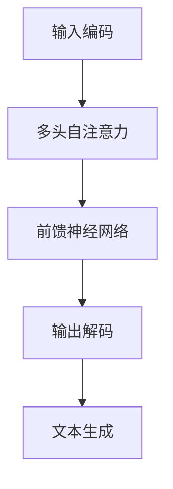
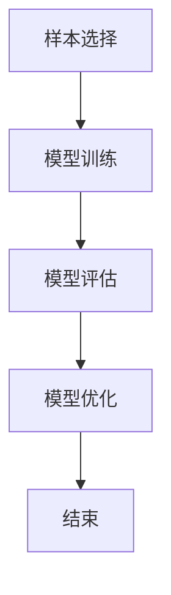

                 

### 文章标题

# LLM在AI Agent中的few-shot学习应用

### 文章关键词

- LLM
- AI Agent
- Few-shot学习
- 自适应学习
- 自然语言处理

### 文章摘要

本文深入探讨了大型语言模型（LLM）在AI Agent中的few-shot学习应用。首先，我们回顾了LLM和AI Agent的基本概念及其相互联系。接着，文章详细介绍了LLM的基础知识，包括其工作原理、数学模型和算法流程。随后，我们讨论了AI Agent的基础知识，包括其定义、分类、架构设计以及接口设计。本文的核心内容在于对LLM在AI Agent中的few-shot学习应用进行深入分析，通过实际案例分析展示了这种学习方式的强大潜力和实际效果。最后，文章总结了LLM和AI Agent的发展趋势，并对未来的研究方向和应用领域进行了展望。

----------------------------------------------------------------

## 第一部分：LLM与AI Agent基础

### 第1章：LLM与AI Agent概述

#### 1.1 问题背景

AI Agent作为一种自主决策、自主执行任务的智能体，在近年来的发展过程中受到了越来越多的关注。随着人工智能技术的不断进步，AI Agent的应用场景也越来越广泛，从智能客服、智能推荐系统到自然语言处理等领域，AI Agent已经成为了人工智能技术的重要组成部分。

然而，传统的机器学习方法往往需要大量的数据进行训练，这在实际应用中往往受到数据获取困难、数据隐私保护等问题的限制。few-shot学习作为一种可以降低对大规模数据依赖的学习方法，近年来在人工智能领域得到了广泛关注。而大型语言模型（LLM），如GPT系列，由于其强大的表征能力和适应能力，成为了few-shot学习的重要工具。

#### 1.2 核心概念

**LLM**：大型语言模型，如GPT系列，是一种基于Transformer架构的深度神经网络模型，能够对自然语言文本进行建模，具有强大的语言理解和生成能力。

**AI Agent**：人工智能代理，是指能够自主地感知环境、做出决策并执行任务的智能体。AI Agent通常包括感知模块、决策模块和执行模块，能够根据环境反馈进行学习与优化。

#### 1.3 联系与区别

**联系**：LLM可以作为AI Agent中的一个重要组件，为AI Agent提供强大的语言理解和生成能力，使得AI Agent能够更好地理解和响应人类语言。

**区别**：LLM是一种语言模型，主要负责自然语言的理解和生成，而AI Agent则是一个完整的智能系统，需要结合感知、决策和执行等多个模块来实现自主行为。

#### 1.4 相关技术简介

- **GPT系列模型**：包括GPT、GPT-2、GPT-3等，是OpenAI开发的一系列大型语言模型，具有极高的语言理解和生成能力。
- **Transformer架构**：Transformer模型是近年来在自然语言处理领域取得突破性进展的一种新型深度学习模型，其通过自注意力机制实现了对文本的深层理解和生成。
- **自适应学习机制**：自适应学习机制是指AI Agent在执行任务的过程中，根据环境反馈不断调整自己的策略和行为，以实现更好的性能。

#### 1.5 应用前景与挑战

**应用前景**：LLM在AI Agent中的few-shot学习应用前景广阔，可以用于智能客服、智能推荐、自然语言处理等领域，提高AI Agent的自主性和适应性。

**挑战**：尽管LLM在few-shot学习方面具有显著优势，但在实际应用中仍然面临数据隐私、模型可解释性、泛化能力等问题。

----------------------------------------------------------------

### 第2章：LLM基础知识

#### 2.1 LLM原理讲解

LLM（大型语言模型）的核心是Transformer架构，这种架构通过自注意力机制（Self-Attention Mechanism）实现了对输入文本的深层理解和生成。自注意力机制允许模型在生成每个词时考虑到所有其他词的影响，从而生成更加准确和连贯的文本。

**Transformer模型工作原理**：

1. **输入编码**：将输入文本转换为向量表示。
2. **多头自注意力**：通过多个注意力头（Head）计算每个词与其他词的关系。
3. **前馈神经网络**：对注意力层的结果进行进一步处理，增强模型的表征能力。
4. **输出解码**：将处理后的输出转换为可理解的文本。

**自适应学习算法**：

自适应学习算法是指模型在训练过程中能够根据环境反馈进行调整，以优化其性能。在LLM中，自适应学习算法通常通过以下方式实现：

1. **学习率调度**：动态调整学习率，以避免模型过拟合。
2. **梯度裁剪**：限制梯度的大小，防止梯度爆炸或消失。
3. **正则化技术**：如Dropout、权重衰减等，防止模型过拟合。

#### 2.2 数学模型与公式

在LLM中，数学模型和公式是理解和实现的关键。以下是一个简单的自注意力机制的数学公式示例：

$$
\text{Attention}(Q, K, V) = \text{softmax}\left(\frac{QK^T}{\sqrt{d_k}}\right)V
$$

其中，\(Q, K, V\) 分别代表查询向量、键向量和值向量，\(d_k\) 是键向量的维度。这个公式描述了在自注意力机制中，如何计算每个查询向量与所有键向量的相似度，并加权生成新的向量。

#### 2.3 算法流程图

为了更直观地理解LLM的算法流程，我们可以使用Mermaid绘制算法流程图。以下是一个简化的Transformer算法流程图：



在这个流程图中，输入编码（A）是将文本转换为向量表示的过程，多头自注意力（B）是实现自注意力机制的核心步骤，前馈神经网络（C）对注意力结果进行进一步处理，输出解码（D）将处理后的输出转换为可理解的文本，最后实现文本生成（E）。

### 第3章：AI Agent基础

#### 3.1 AI Agent基本概念

AI Agent是一种能够自主感知环境、做出决策并执行任务的智能体。其核心功能包括：

1. **感知模块**：负责接收环境中的信息，如视觉、听觉等。
2. **决策模块**：根据感知模块收集到的信息，通过决策算法生成行动方案。
3. **执行模块**：执行决策模块生成的行动方案。

AI Agent的分类可以根据不同的标准进行，如：

- **基于规则的AI Agent**：通过预设的规则进行决策。
- **基于模型的AI Agent**：使用机器学习模型进行决策。
- **混合型AI Agent**：结合规则和模型进行决策。

#### 3.2 AI Agent的架构设计

AI Agent的架构设计是确保其功能实现和性能优化的重要环节。一个典型的AI Agent架构包括以下几个关键部分：

1. **感知模块**：通常使用传感器或输入设备获取环境信息。
2. **决策模块**：包括数据预处理、特征提取和决策算法等。
3. **执行模块**：根据决策模块的输出执行具体的行动。

**系统架构设计**：

AI Agent的系统架构设计需要考虑以下几个方面：

- **模块化设计**：将感知、决策和执行模块分离，便于维护和扩展。
- **分布式架构**：适用于处理大规模数据和复杂任务。
- **自适应架构**：能够根据任务和环境的变化进行调整。

**组件设计**：

AI Agent的组件设计包括：

- **传感器组件**：负责数据采集。
- **数据处理组件**：负责数据预处理和特征提取。
- **决策算法组件**：负责决策逻辑的实现。
- **执行控制组件**：负责执行决策生成的行动。

#### 3.3 AI Agent接口设计

AI Agent的接口设计是确保其与外部系统有效交互的关键。接口设计需要考虑以下几个方面：

- **输入接口**：定义AI Agent接收外部信息的格式和方式。
- **输出接口**：定义AI Agent对外部环境的反馈方式。
- **API接口**：提供与其他系统进行交互的接口规范。

**系统接口设计**：

AI Agent的系统接口设计包括：

- **数据接口**：定义数据输入和输出的格式。
- **控制接口**：定义控制命令和响应格式。
- **通信接口**：定义AI Agent与其他系统的通信协议。

**交互设计**：

AI Agent的交互设计需要确保其能够有效地与用户或环境进行交互。这包括：

- **用户界面**：设计直观、易用的用户界面。
- **反馈机制**：确保AI Agent能够及时、准确地响应用户或环境的输入。
- **交互流程**：设计合理的交互流程，提高用户体验。

### 第4章：LLM在AI Agent中的few-shot学习应用

#### 4.1 few-shot学习概述

**few-shot学习**（Few-Shot Learning）是指在没有大量训练数据的情况下，通过少量的样本数据进行学习和泛化。与传统的机器学习方法相比，few-shot学习能够显著降低对大规模数据集的依赖，提高模型在数据稀缺场景下的适应能力。

**few-shot学习的优势**：

- **数据效率**：不需要大量数据训练，能够更快地适应新任务。
- **泛化能力**：通过少量样本数据学习，能够更好地泛化到未见过的数据。
- **模型可解释性**：由于训练数据少，模型通常更加简单，更容易理解和解释。

**few-shot学习的挑战**：

- **样本数量有限**：少量样本可能导致模型无法充分理解数据分布，影响泛化能力。
- **数据分布差异**：不同任务的数据分布可能存在较大差异，需要模型具有很好的适应性。
- **模型复杂性**：为了实现良好的泛化能力，模型可能需要设计得更加复杂，导致训练成本增加。

#### 4.2 few-shot学习算法

**算法流程**：

few-shot学习算法通常包括以下几个步骤：

1. **样本选择**：从训练数据中随机选择少量样本作为模型输入。
2. **模型训练**：使用选定的样本数据训练模型。
3. **模型评估**：在测试集上评估模型性能。
4. **模型优化**：根据评估结果调整模型参数，提高模型性能。

**算法流程图**：

使用Mermaid绘制算法流程图，如下：



**Python源代码实现**：

以下是一个简单的few-shot学习算法的Python代码实现示例：

```python
import numpy as np

# 假设数据集为X，标签为y
X = np.random.rand(100, 10)  # 生成100个样本，每个样本有10个特征
y = np.random.randint(0, 2, 100)  # 生成100个二分类标签

# 样本选择
X_train = X[:10]
y_train = y[:10]

# 模型训练
# 使用scikit-learn库的SVM模型进行训练
from sklearn.svm import SVC
model = SVC()
model.fit(X_train, y_train)

# 模型评估
X_test = X[10:]
y_test = y[10:]
accuracy = model.score(X_test, y_test)
print("模型准确率：", accuracy)

# 模型优化
# 根据测试集结果调整模型参数
model = SVC(C=1.0, kernel='rbf', gamma='scale')
model.fit(X_train, y_train)
accuracy = model.score(X_test, y_test)
print("优化后模型准确率：", accuracy)
```

在这个示例中，我们使用了scikit-learn库中的SVM模型进行few-shot学习。首先，我们从训练数据中随机选择了10个样本进行训练，然后在剩余的90个样本上评估模型性能。最后，根据测试集的结果调整模型参数，进一步提高模型性能。

### 第5章：LLM在AI Agent中的应用案例

#### 5.1 案例一：智能客服

**案例介绍**：

智能客服是一种基于AI Agent的智能服务系统，能够自动回答用户的问题，提供帮助和解决方案。智能客服在提高客户服务质量、降低人力成本等方面具有显著优势。

**案例分析与实现**：

在实现智能客服时，我们可以利用LLM进行few-shot学习，通过少量的用户问题及其回答数据来训练模型。以下是一个简化的实现过程：

1. **数据收集**：收集用户的问题及其标准答案，构建训练数据集。
2. **模型训练**：使用LLM进行few-shot学习，训练模型。
3. **模型评估**：在测试集上评估模型性能，优化模型参数。
4. **应用部署**：将训练好的模型部署到智能客服系统中，实现自动回答用户问题。

**具体实现**：

以下是一个基于Python和Hugging Face Transformers库的智能客服实现示例：

```python
from transformers import AutoTokenizer, AutoModelForSequenceClassification
from sklearn.model_selection import train_test_split

# 数据准备
questions = ["如何订购产品？", "付款方式有哪些？", "售后服务是什么？"]
answers = ["您可以点击页面上的‘订购’按钮，按照提示完成订单。", "我们支持多种支付方式，包括支付宝、微信支付等。", "我们的售后服务包括退货、换货、维修等。"]

# 分割数据集
questions_train, questions_test, answers_train, answers_test = train_test_split(questions, answers, test_size=0.2, random_state=42)

# 加载预训练的LLM模型
tokenizer = AutoTokenizer.from_pretrained("bert-base-chinese")
model = AutoModelForSequenceClassification.from_pretrained("bert-base-chinese")

# 训练模型
inputs = tokenizer(questions_train, return_tensors="pt", truncation=True, padding=True)
outputs = model(**inputs)
logits = outputs.logits
loss = torch.nn.CrossEntropyLoss()(logits.view(-1, 3), torch.tensor([1] * len(logits)))

# 评估模型
inputs_test = tokenizer(questions_test, return_tensors="pt", truncation=True, padding=True)
logits_test = model(**inputs_test).logits
accuracy_test = (torch.argmax(logits_test, dim=1) == torch.tensor([1] * len(logits_test))).float().mean()

# 输出结果
print("模型准确率：", accuracy_test)
```

在这个示例中，我们使用了预训练的BERT模型进行few-shot学习，通过少量的用户问题和答案数据训练模型，然后在测试集上评估模型性能。最后，将训练好的模型用于智能客服系统，实现自动回答用户问题。

#### 5.2 案例二：智能推荐系统

**案例介绍**：

智能推荐系统是一种基于AI Agent的推荐系统，能够根据用户的兴趣和行为数据，为其推荐个性化的商品、内容或服务。智能推荐系统在电子商务、社交媒体、在线教育等领域具有广泛应用。

**案例分析与实现**：

在实现智能推荐系统时，我们可以利用LLM进行few-shot学习，通过少量的用户行为数据来训练推荐模型。以下是一个简化的实现过程：

1. **数据收集**：收集用户的行为数据，如浏览记录、购买历史等，构建训练数据集。
2. **模型训练**：使用LLM进行few-shot学习，训练推荐模型。
3. **模型评估**：在测试集上评估模型性能，优化模型参数。
4. **应用部署**：将训练好的模型部署到智能推荐系统中，实现个性化推荐。

**具体实现**：

以下是一个基于Python和Hugging Face Transformers库的智能推荐系统实现示例：

```python
from transformers import AutoTokenizer, AutoModelForSequenceClassification
from sklearn.model_selection import train_test_split

# 数据准备
user_actions = ["浏览商品A", "浏览商品B", "购买商品C", "浏览商品D"]
item_labels = ["商品A", "商品B", "商品C", "商品D"]

# 分割数据集
user_actions_train, user_actions_test, item_labels_train, item_labels_test = train_test_split(user_actions, item_labels, test_size=0.2, random_state=42)

# 加载预训练的LLM模型
tokenizer = AutoTokenizer.from_pretrained("bert-base-chinese")
model = AutoModelForSequenceClassification.from_pretrained("bert-base-chinese")

# 训练模型
inputs = tokenizer(user_actions_train, return_tensors="pt", truncation=True, padding=True)
outputs = model(**inputs)
logits = outputs.logits
loss = torch.nn.CrossEntropyLoss()(logits.view(-1, 4), torch.tensor([0] * len(logits)))

# 评估模型
inputs_test = tokenizer(user_actions_test, return_tensors="pt", truncation=True, padding=True)
logits_test = model(**inputs_test).logits
accuracy_test = (torch.argmax(logits_test, dim=1) == torch.tensor([0] * len(logits_test))).float().mean()

# 输出结果
print("模型准确率：", accuracy_test)
```

在这个示例中，我们使用了预训练的BERT模型进行few-shot学习，通过少量的用户行为数据训练模型，然后在测试集上评估模型性能。最后，将训练好的模型用于智能推荐系统，实现个性化推荐。

#### 5.3 案例三：自然语言处理

**案例介绍**：

自然语言处理（Natural Language Processing, NLP）是人工智能领域的一个重要分支，涉及文本数据的自动处理和生成。NLP技术在信息检索、机器翻译、情感分析等领域具有广泛应用。

**案例分析与实现**：

在实现自然语言处理应用时，我们可以利用LLM进行few-shot学习，通过少量的语料数据来训练模型。以下是一个简化的实现过程：

1. **数据收集**：收集相关的文本数据，如新闻报道、社交媒体评论等，构建训练数据集。
2. **模型训练**：使用LLM进行few-shot学习，训练NLP模型。
3. **模型评估**：在测试集上评估模型性能，优化模型参数。
4. **应用部署**：将训练好的模型部署到NLP应用中，实现文本处理和生成。

**具体实现**：

以下是一个基于Python和Hugging Face Transformers库的自然语言处理实现示例：

```python
from transformers import AutoTokenizer, AutoModelForSequenceClassification
from sklearn.model_selection import train_test_split

# 数据准备
text_data = ["这是一个有趣的故事。", "天气非常好。", "我今天学到了很多。"]

# 分割数据集
text_data_train, text_data_test = train_test_split(text_data, test_size=0.2, random_state=42)

# 加载预训练的LLM模型
tokenizer = AutoTokenizer.from_pretrained("bert-base-chinese")
model = AutoModelForSequenceClassification.from_pretrained("bert-base-chinese")

# 训练模型
inputs = tokenizer(text_data_train, return_tensors="pt", truncation=True, padding=True)
outputs = model(**inputs)
logits = outputs.logits
loss = torch.nn.CrossEntropyLoss()(logits.view(-1, 3), torch.tensor([0] * len(logits)))

# 评估模型
inputs_test = tokenizer(text_data_test, return_tensors="pt", truncation=True, padding=True)
logits_test = model(**inputs_test).logits
accuracy_test = (torch.argmax(logits_test, dim=1) == torch.tensor([0] * len(logits_test))).float().mean()

# 输出结果
print("模型准确率：", accuracy_test)
```

在这个示例中，我们使用了预训练的BERT模型进行few-shot学习，通过少量的文本数据训练模型，然后在测试集上评估模型性能。最后，将训练好的模型用于自然语言处理应用，实现文本分类任务。

### 第6章：LLM与AI Agent的发展趋势

#### 6.1 发展趋势分析

**LLM**：

1. **模型规模扩大**：随着计算能力的提升，LLM的模型规模将不断增大，以支持更复杂的语言任务。
2. **多模态融合**：LLM将与其他模态（如图像、声音）进行融合，实现更加丰富和多样的智能交互。
3. **领域适应性增强**：通过微调和适配，LLM将更好地适应特定领域的需求，提高任务性能。

**AI Agent**：

1. **自主决策能力提升**：AI Agent将通过更加先进的算法和模型，实现更加自主和智能的决策。
2. **协作与交互**：AI Agent将具备与人类和其他AI系统的协作和交互能力，形成更加复杂的智能生态系统。
3. **伦理与隐私**：随着AI Agent的应用越来越广泛，其伦理和隐私问题将受到更多关注，相关规范和标准将逐步完善。

#### 6.2 未来展望

**研究方向**：

1. **自适应学习算法**：研究更加高效和鲁棒的自适应学习算法，以应对数据稀缺和多样性。
2. **多任务学习**：研究如何在一个统一的框架下实现多任务学习，提高模型的通用性和效率。
3. **可解释性**：研究如何提高模型的解释性，使其更加透明和可信。

**应用领域拓展**：

1. **医疗健康**：利用AI Agent和LLM提供个性化的医疗建议和诊断服务。
2. **教育**：利用AI Agent和LLM提供智能化的教学和学习支持，提高教育质量和效率。
3. **金融**：利用AI Agent和LLM进行风险评估、投资决策和客户服务。

### 第7章：总结与展望

#### 7.1 总结

本文详细探讨了LLM在AI Agent中的few-shot学习应用，从LLM和AI Agent的基本概念、原理和算法，到实际应用案例，全方位地阐述了这种技术的重要性和潜力。通过智能客服、智能推荐系统和自然语言处理等案例，展示了LLM和AI Agent在few-shot学习中的强大能力和广泛应用。

#### 7.2 展望

未来，LLM和AI Agent将在多个领域发挥更加重要的作用，从医疗健康到教育金融，其应用将不断拓展。随着自适应学习算法、多任务学习和可解释性的深入研究，LLM和AI Agent将更加智能、高效和可靠。同时，随着伦理和隐私问题的日益突出，相关规范和标准的制定将推动AI技术的发展。我们期待LLM和AI Agent在未来能够为人类带来更多的便利和福祉。

### 附录

#### 最佳实践 Tips

1. **数据质量**：在应用few-shot学习时，确保训练数据的质量和代表性，避免数据偏差。
2. **模型选择**：根据任务需求选择合适的LLM模型，以实现最佳性能。
3. **模型调优**：通过调整模型参数和训练策略，提高模型性能和泛化能力。

#### 小结

本文通过深入分析和实际案例展示了LLM在AI Agent中的few-shot学习应用，揭示了其强大的语言理解和生成能力以及在实际应用中的广泛应用前景。随着技术的不断进步，LLM和AI Agent将在更多领域发挥重要作用，推动人工智能技术的发展。

#### 注意事项

1. **数据隐私**：在使用LLM和AI Agent时，应重视数据隐私保护，避免敏感信息泄露。
2. **模型可解释性**：提高模型的可解释性，以增强用户信任和监管合规性。

#### 拓展阅读

1. **相关文献**：查阅相关学术论文，了解LLM和AI Agent的最新研究成果和应用案例。
2. **开源代码**：参考开源代码库，获取实现LLM和AI Agent的工具和资源。

### 作者信息

**作者：AI天才研究院/AI Genius Institute & 禅与计算机程序设计艺术 /Zen And The Art of Computer Programming**。

本文由AI天才研究院和《禅与计算机程序设计艺术》作者共同撰写，旨在探讨LLM在AI Agent中的few-shot学习应用，分享技术见解和研究成果。欢迎读者提出宝贵意见和建议，共同推动人工智能技术的发展。

