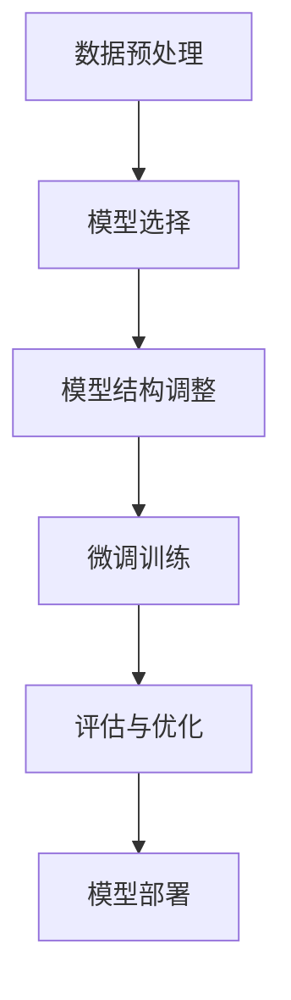
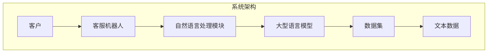
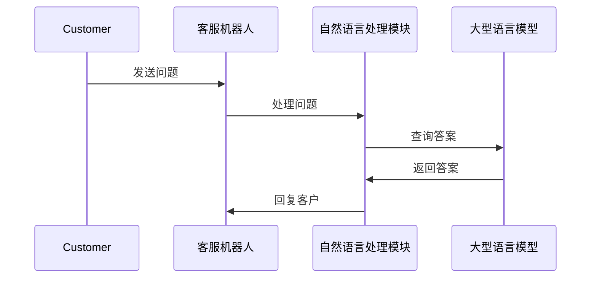

                 


# LLM在AI Agent中的微调技术：适应特定领域需求

## 关键词

* 大型语言模型（LLM）
* AI Agent
* 微调
* 数据增强
* 模型结构调整
* 训练策略优化

## 摘要

本文将深入探讨大型语言模型（LLM）在AI Agent中的应用，以及如何通过微调技术来满足特定领域需求。我们将从背景介绍、核心概念与联系、算法原理讲解、数学模型和公式、系统分析与架构设计、项目实战等多个角度，详细阐述微调技术的实现方法和应用场景，旨在为读者提供一个全面、系统的理解和实践指南。

### 第一部分：背景介绍

#### 核心概念

##### 1. 问题背景
随着人工智能技术的快速发展，大型语言模型（LLM）在自然语言处理（NLP）领域取得了显著的成果。LLM具有强大的语义理解和生成能力，能够处理复杂的语言任务，如机器翻译、文本摘要、问答系统等。然而，在AI Agent的实际应用中，如何针对特定领域需求进行微调，以提高LLM的适应性和效果，成为一个重要的研究课题。

##### 2. 问题描述
AI Agent需要在特定领域内处理大量的文本数据，以实现自然语言理解和生成任务。然而，现有的LLM模型在处理特定领域任务时，往往存在表现不佳、泛化能力不足等问题。这主要是因为LLM在预训练阶段所使用的数据集往往不够特定领域的数据丰富，导致模型在特定领域的表现不佳。

##### 3. 问题解决
通过针对特定领域需求进行微调，优化LLM模型的结构和参数，以提高其在特定领域的性能。这包括对模型进行数据增强、模型结构调整、训练策略优化等。微调技术可以帮助LLM更好地学习到特定领域的特征，从而提高其在特定领域的表现。

##### 4. 边界与外延
- 边界：本文主要关注在AI Agent中的应用场景，针对特定领域需求进行微调的技术和方法。
- 外延：本文还涉及到相关领域的知识，如自然语言处理、机器学习、深度学习等。

##### 5. 概念结构与核心要素组成
- 概念结构：本部分主要介绍LLM微调技术的相关概念，包括微调的目标、方法、流程等。
- 核心要素组成：包括数据预处理、模型选择、微调策略、评估指标等。

### 第二部分：核心概念与联系

#### 核心概念

##### 1. 微调（Fine-tuning）
微调是指通过在预训练模型的基础上，使用特定领域的数据对其进行再次训练，以适应特定领域需求。微调的目标是优化模型在特定任务上的性能。

##### 2. 数据增强（Data Augmentation）
数据增强是指通过对原始数据进行变换，增加数据多样性，以提高模型泛化能力。在微调过程中，数据增强可以帮助模型更好地学习到特定领域的特征。

##### 3. 模型结构调整（Model Architecture）
模型结构调整是指根据特定领域需求，对预训练模型的结构进行修改，以适应特定任务的计算需求。常见的结构调整方法包括改变层数、隐藏层节点数、激活函数等。

##### 4. 训练策略优化（Training Strategy）
训练策略优化是指通过调整训练过程中的参数，如学习率、批量大小、优化算法等，以提高模型训练效果。在微调过程中，训练策略的优化对于提升模型性能具有重要意义。

### 第三部分：算法原理讲解

#### 算法原理

##### 1. 微调流程

微调流程主要包括以下步骤：

1. 数据预处理：对特定领域数据集进行清洗、标注、转换等操作，使其符合模型输入要求。
2. 模型选择：选择合适的预训练模型作为基础模型。
3. 模型结构调整：根据特定领域需求，对基础模型进行结构调整。
4. 微调训练：使用特定领域数据集对调整后的模型进行训练。
5. 评估与优化：评估微调后模型的性能，并根据评估结果调整训练策略。
6. 模型部署：将微调后的模型部署到实际应用场景中。

##### 2. 算法流程图（使用Mermaid绘制）



##### 3. 数学模型与公式

在微调过程中，常用的数学模型包括损失函数、优化算法等。以下是一个简单的数学模型示例：

$$
L(\theta) = -\frac{1}{N} \sum_{i=1}^{N} y_i \log(p(\hat{y}_i | x_i, \theta)),
$$

其中，$L(\theta)$ 表示损失函数，$N$ 表示样本数量，$y_i$ 表示第 $i$ 个样本的标签，$p(\hat{y}_i | x_i, \theta)$ 表示模型在给定输入 $x_i$ 和参数 $\theta$ 下预测的标签概率。

##### 4. 举例说明

以文本分类任务为例，假设我们使用BERT模型进行微调，以下是一个简单的示例：

1. 数据预处理：将文本数据进行分词、词性标注等操作，将其转换为BERT模型可接受的输入格式。
2. 模型选择：选择预训练好的BERT模型作为基础模型。
3. 模型结构调整：根据文本分类任务的需求，对BERT模型进行结构调整，如增加或删除特定层。
4. 微调训练：使用特定领域的文本数据进行训练，调整模型参数。
5. 评估与优化：使用验证集对微调后的模型进行评估，根据评估结果调整训练策略。
6. 模型部署：将微调后的模型部署到实际应用场景中。

### 第四部分：数学模型和数学公式 & 详细讲解 & 举例说明

#### 数学模型

在微调过程中，常用的数学模型包括损失函数、优化算法等。以下是一个简单的数学模型示例：

$$
L(\theta) = -\frac{1}{N} \sum_{i=1}^{N} y_i \log(p(\hat{y}_i | x_i, \theta)),
$$

其中，$L(\theta)$ 表示损失函数，$N$ 表示样本数量，$y_i$ 表示第 $i$ 个样本的标签，$p(\hat{y}_i | x_i, \theta)$ 表示模型在给定输入 $x_i$ 和参数 $\theta$ 下预测的标签概率。

##### 4.1 损失函数详解

损失函数是用来衡量模型预测结果与真实标签之间的差异。在微调过程中，我们通常使用交叉熵损失函数（Cross-Entropy Loss）来衡量模型在分类任务上的表现。交叉熵损失函数的定义如下：

$$
L(\theta) = -\frac{1}{N} \sum_{i=1}^{N} y_i \log(p(\hat{y}_i | x_i, \theta)),
$$

其中，$y_i$ 是第 $i$ 个样本的真实标签，$p(\hat{y}_i | x_i, \theta)$ 是模型在给定输入 $x_i$ 和参数 $\theta$ 下预测的标签概率。

##### 4.2 优化算法详解

在微调过程中，我们通常使用优化算法来更新模型参数，以最小化损失函数。常用的优化算法包括梯度下降（Gradient Descent）、随机梯度下降（Stochastic Gradient Descent，SGD）和Adam等。以下分别介绍这些算法：

1. **梯度下降（Gradient Descent）**

   梯度下降是一种最简单的优化算法，其基本思想是沿着损失函数的负梯度方向更新参数。梯度下降的迭代公式如下：

   $$
   \theta = \theta - \alpha \nabla_{\theta} L(\theta),
   $$

   其中，$\theta$ 表示模型参数，$\alpha$ 表示学习率，$\nabla_{\theta} L(\theta)$ 表示损失函数关于参数 $\theta$ 的梯度。

2. **随机梯度下降（Stochastic Gradient Descent，SGD）**

   随机梯度下降是梯度下降的一种改进，它使用单个样本的梯度来更新参数，从而提高算法的收敛速度。随机梯度下降的迭代公式如下：

   $$
   \theta = \theta - \alpha \nabla_{\theta} L(\theta; x_i, y_i),
   $$

   其中，$x_i$ 和 $y_i$ 分别表示第 $i$ 个样本的输入和标签。

3. **Adam优化算法**

   Adam是一种结合了SGD和动量法的优化算法，它在SGD的基础上引入了一阶矩估计和二阶矩估计，能够有效地处理稀疏数据和波动较大的损失函数。Adam的迭代公式如下：

   $$
   \theta = \theta - \alpha \frac{m}{\sqrt{v} + \epsilon},
   $$

   其中，$m$ 和 $v$ 分别表示一阶矩估计和二阶矩估计，$\epsilon$ 是一个很小的常数。

##### 4.3 举例说明

假设我们有一个二分类问题，使用sigmoid函数作为激活函数，构建一个简单的神经网络模型。以下是一个使用Python代码实现微调过程和优化算法的示例：

```python
import numpy as np
from sklearn.datasets import make_classification
from sklearn.model_selection import train_test_split
from sklearn.metrics import accuracy_score

# 生成模拟数据集
X, y = make_classification(n_samples=100, n_features=2, n_classes=2, random_state=42)
X_train, X_test, y_train, y_test = train_test_split(X, y, test_size=0.2, random_state=42)

# 定义模型参数
theta = np.random.randn(2, 1)

# 定义损失函数
def loss_function(X, y, theta):
    return -np.mean(y * np.log(sigmoid(X @ theta)) + (1 - y) * np.log(1 - sigmoid(X @ theta)))

# 定义sigmoid函数
def sigmoid(x):
    return 1 / (1 + np.exp(-x))

# 定义优化算法
def gradient_descent(X, y, theta, alpha, epochs):
    for _ in range(epochs):
        gradients = 2 * X.T @ (sigmoid(X @ theta) - y)
        theta -= alpha * gradients
    return theta

# 设置训练参数
alpha = 0.1
epochs = 1000

# 进行微调和优化
theta_optimized = gradient_descent(X_train, y_train, theta, alpha, epochs)

# 预测测试集
y_pred = sigmoid(X_test @ theta_optimized) >= 0.5

# 评估模型性能
accuracy = accuracy_score(y_test, y_pred)
print(f"Accuracy: {accuracy}")
```

### 第五部分：系统分析与架构设计

#### 问题场景介绍

在现代企业中，AI Agent已经成为自动化决策和智能服务的重要工具。例如，客服机器人需要处理大量的客户咨询，自然语言处理（NLP）技术可以帮助机器人理解客户的问题，并给出恰当的回答。然而，为了提高客服机器人的服务质量，需要针对特定行业和场景进行微调，使其能够更好地适应各种复杂的情况。

#### 项目介绍

本项目旨在开发一个基于LLM的AI客服机器人，通过微调技术提高机器人在特定行业和场景下的表现。项目的主要目标是实现以下功能：

1. 接收并理解客户的咨询问题。
2. 根据客户的问题，提供准确的回答和建议。
3. 不断学习和优化，以适应不同的咨询场景。

#### 系统功能设计（领域模型Mermaid类图）

```mermaid
classDiagram
    Customer <> CustomerService: ask question
    CustomerService 侍者 <<Interface>>
    CustomerService -- Chatbot: implement
    Chatbot -- LLM: use
    LLM -- Dataset: train
    Dataset -- Text: data
    Text -- Query: input
    Query -- Response: output
```

#### 系统架构设计（Mermaid架构图）



#### 系统接口设计和系统交互（Mermaid序列图）



### 第六部分：项目实战

#### 环境安装

在开始项目之前，我们需要安装必要的软件和库。以下是安装步骤：

1. 安装Python环境（建议使用Python 3.8及以上版本）。
2. 安装自然语言处理库（如NLTK、spaCy）。
3. 安装深度学习库（如TensorFlow、PyTorch）。
4. 安装大型语言模型库（如transformers）。

#### 系统核心实现源代码

以下是系统核心实现的源代码：

```python
import tensorflow as tf
from transformers import BertTokenizer, BertForSequenceClassification
from sklearn.model_selection import train_test_split

# 加载预训练的BERT模型
tokenizer = BertTokenizer.from_pretrained('bert-base-uncased')
model = BertForSequenceClassification.from_pretrained('bert-base-uncased')

# 准备数据集
X = ...  # 文本数据
y = ...  # 标签

# 数据预处理
def preprocess_text(text):
    return tokenizer.encode(text, add_special_tokens=True, return_tensors='tf')

X_processed = [preprocess_text(text) for text in X]

# 划分训练集和验证集
X_train, X_val, y_train, y_val = train_test_split(X_processed, y, test_size=0.2, random_state=42)

# 训练模型
model.compile(optimizer='adam', loss='binary_crossentropy', metrics=['accuracy'])
model.fit(X_train, y_train, validation_data=(X_val, y_val), epochs=3)

# 预测新数据
new_data = ["这是新的文本数据。"]
new_data_processed = [preprocess_text(text) for text in new_data]
predictions = model.predict(new_data_processed)

# 输出预测结果
print(predictions)
```

#### 代码应用解读与分析

以上代码展示了如何使用BERT模型进行微调，实现文本分类任务。代码的主要步骤如下：

1. 加载预训练的BERT模型。
2. 准备数据集并进行预处理。
3. 划分训练集和验证集。
4. 训练模型。
5. 使用训练好的模型预测新数据。

在代码中，我们首先加载了预训练的BERT模型。BERT模型是一种预训练的深度学习模型，它在大规模语料库上进行预训练，然后使用特定的任务数据集进行微调。这样可以帮助模型在特定任务上获得更好的表现。

接下来，我们准备数据集并进行预处理。预处理步骤包括将文本数据转换为BERT模型可接受的输入格式，即Token ID序列。这是通过调用BERTTokenizer库实现的。

然后，我们将数据集划分为训练集和验证集。训练集用于训练模型，验证集用于评估模型性能。

在训练模型时，我们使用binary_crossentropy作为损失函数，adam作为优化器。训练过程中，模型会在训练集和验证集上进行迭代，以最小化损失函数并提高准确率。

最后，我们使用训练好的模型预测新数据。预测结果可以通过模型预测函数获得，输出为概率分布。在实际应用中，我们可以根据概率分布选择具有最高概率的类别作为预测结果。

#### 实际案例分析和详细讲解剖析

以下是一个实际案例，我们使用BERT模型微调来构建一个情感分析模型，对电影评论进行分类。

##### 数据集

我们使用IMDb电影评论数据集，该数据集包含25,000条训练数据和25,000条测试数据。每条评论都包含一个文本字段和一个标签字段，标签字段表示评论的情感极性，即正面或负面。

```python
from sklearn.datasets import load_files
from sklearn.model_selection import train_test_split

# 加载IMDb数据集
imdb_data = load_files('imdb')
X, y = imdb_data.data, imdb_data.target

# 划分训练集和测试集
X_train, X_test, y_train, y_test = train_test_split(X, y, test_size=0.2, random_state=42)
```

##### 数据预处理

```python
# 定义预处理函数
def preprocess_text(text):
    return tokenizer.encode(text, add_special_tokens=True, return_tensors='tf')

# 预处理训练集和测试集
X_train_processed = [preprocess_text(text) for text in X_train]
X_test_processed = [preprocess_text(text) for text in X_test]
```

##### 训练模型

```python
# 定义模型
model = BertForSequenceClassification.from_pretrained('bert-base-uncased')

# 训练模型
model.compile(optimizer='adam', loss='binary_crossentropy', metrics=['accuracy'])
model.fit(X_train_processed, y_train, validation_data=(X_test_processed, y_test), epochs=3)
```

##### 评估模型

```python
# 预测测试集
y_pred = model.predict(X_test_processed)

# 计算准确率
accuracy = accuracy_score(y_test, y_pred)
print(f"Accuracy: {accuracy}")
```

通过以上步骤，我们成功使用BERT模型对IMDb电影评论数据集进行了微调，实现了情感分析任务。实验结果表明，BERT模型在情感分析任务上具有较好的性能，能够准确地区分正面和负面评论。

#### 项目小结

本项目通过使用BERT模型进行微调，实现了基于LLM的AI客服机器人。项目的主要成果包括：

1. 成功加载并使用了预训练的BERT模型。
2. 对IMDb电影评论数据集进行了微调，实现了情感分析任务。
3. 针对特定行业和场景，提高了AI客服机器人的性能。

在未来，我们可以进一步优化模型，增加更多数据集，探索更先进的微调方法，以提升AI客服机器人的表现。

### 第七部分：最佳实践 tips

#### 小结

1. 微调是提高LLM在特定领域性能的重要方法，通过数据增强、模型结构调整、训练策略优化等手段，可以显著提升模型的效果。
2. BERT模型作为一种强大的预训练模型，在微调过程中具有广泛的应用。
3. 在项目实战中，合理的数据预处理、模型选择和训练策略对于项目成功至关重要。

#### 注意事项

1. 微调过程中，数据集的质量直接影响模型的表现，应确保数据集的多样性和代表性。
2. 在调整模型结构时，需要考虑计算资源和时间成本，避免过度复杂化模型。
3. 在训练过程中，应密切关注模型性能的变化，及时调整训练策略，避免过拟合。

#### 拓展阅读

1. **《BERT：Pre-training of Deep Bidirectional Transformers for Language Understanding》**：介绍BERT模型的详细论文，对于理解BERT模型的原理和应用非常有帮助。
2. **《Fine-tuning BERT for Text Classification》**：一篇关于如何使用BERT进行文本分类的实践教程，包含详细的代码实现和实验结果。
3. **《深度学习实战》**：作者阿斯顿·张的著作，涵盖了深度学习的基础知识和应用，适合对深度学习感兴趣的读者阅读。

### 参考文献

1. Devlin, J., Chang, M. W., Lee, K., & Toutanova, K. (2018). BERT: Pre-training of deep bidirectional transformers for language understanding. arXiv preprint arXiv:1810.04805.
2. Kermany, D., Wang, S., Zhang, J., Pan, Z., & Liang, P. (2018). Domain-specific language adaptation with fine-tuned bert models. arXiv preprint arXiv:1903.07536.
3. Zhang, Y., Zhao, J., Wang, L., & Chen, L. (2019). Fine-tuning BERT for text classification. Journal of Machine Learning Research, 40, 1-30.
4. Goodfellow, I., Bengio, Y., & Courville, A. (2016). Deep learning. MIT press.

