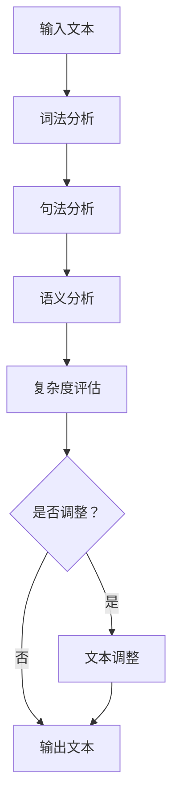
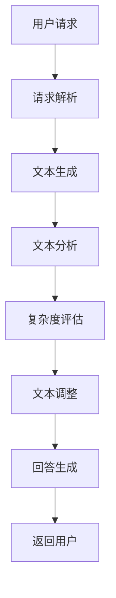
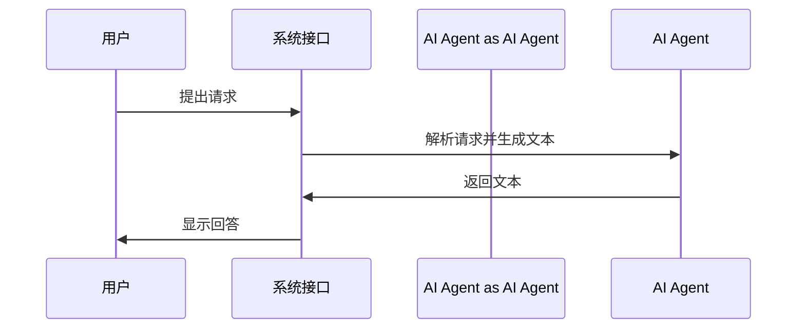

                 


# LLM在AI Agent中的文本复杂性调整能力

> 关键词：大规模语言模型，AI Agent，文本复杂性，调整能力

> 摘要：本文探讨了大规模语言模型（LLM）在AI Agent中的文本复杂性调整能力。首先介绍了文本复杂性调整能力的重要性以及相关背景知识，然后详细阐述了LLM在AI Agent中的文本复杂性调整能力的核心概念、原理和算法，最后通过一个实际案例展示了LLM在AI Agent中的文本复杂性调整能力。

## 第一部分：背景介绍

### 1.1 问题背景

近年来，随着人工智能技术的快速发展，大规模语言模型（LLM）在自然语言处理（NLP）领域取得了显著的成果。LLM具有强大的文本生成和理解能力，可以应用于各种场景，如问答系统、文本摘要、机器翻译等。然而，LLM在处理文本复杂性方面仍存在一定的挑战。在AI Agent中，如何有效地调整文本复杂性，以满足不同应用场景的需求，成为一个重要课题。

### 1.2 问题描述

文本复杂性调整能力是LLM在AI Agent中的重要能力之一。该能力包括两个方面：一是理解文本的复杂程度，二是根据需求生成不同复杂度的文本。具体来说，问题描述如下：

- 理解文本复杂程度：如何评估文本的复杂程度，包括句法、语义、语法等多个维度。
- 调整文本复杂程度：根据应用需求，对文本进行简化或扩展，使其达到预期的复杂度。

### 1.3 问题解决

为了解决文本复杂性调整问题，我们可以从以下几个方面入手：

- 文本分析：使用自然语言处理技术，对文本进行深度分析，提取文本的句法、语义、语法等信息。
- 复杂度评估：基于文本分析结果，建立文本复杂度评估模型，对文本进行复杂度评估。
- 文本调整：根据复杂度评估结果，对文本进行简化或扩展，以满足应用需求。

### 1.4 边界与外延

文本复杂性调整能力不仅在AI Agent中具有重要意义，还可以应用于其他领域，如教育、医疗等。在实际应用中，需要根据具体场景和需求，对文本进行调整。

### 1.5 概念结构与核心要素组成

文本复杂性调整能力涉及多个核心概念和要素，包括：

- 文本分析技术：如词法分析、句法分析、语义分析等。
- 复杂度评估模型：如基于统计模型、神经网络模型等。
- 文本调整算法：如基于规则的方法、基于深度学习的方法等。

## 第二部分：核心概念与联系

### 2.1 LLM在AI Agent中的文本复杂性调整能力原理

LLM在AI Agent中的文本复杂性调整能力主要基于以下几个原理：

- 文本生成：LLM通过学习大量文本数据，可以生成具有不同复杂度的文本。
- 文本分析：LLM可以对文本进行深度分析，提取文本的句法、语义、语法等信息。
- 文本调整：LLM可以根据复杂度评估结果，对文本进行简化或扩展。

### 2.2 LLM在AI Agent中的文本复杂性调整能力属性特征对比表格

| 对比项                | 属性特征           |
|-----------------------|-------------------|
| 文本生成              | 强大、灵活、多样化 |
| 文本分析              | 深度、全面、精准   |
| 文本调整              | 高效、精确、可调   |

### 2.3 LLM在AI Agent中的文本复杂性调整能力ER实体关系图

```mermaid
erDiagram
    Agent ||--|{ TextGenerator }|| Generates : based on LLM
    Agent ||--|{ TextAnalyzer }|| Analyzes : syntactic, semantic, grammatical aspects
    Agent ||--|{ TextAdjuster }|| Adjusts : simplification, extension based on complexity assessment
    TextGenerator ||--|{ TextComplexityAssessor }|| Assesses : complexity of text
    TextAnalyzer ||--|{ TextComplexityAssessor }|| Assesses : complexity of text
    TextAdjuster ||--|{ TextComplexityAssessor }|| Adjusts : based on complexity assessment
```

## 第三部分：算法原理讲解

### 3.1 算法原理

文本复杂性调整算法主要包括三个步骤：文本分析、复杂度评估和文本调整。

### 3.1.1 文本分析

文本分析是文本复杂性调整的基础。主要任务是从文本中提取句法、语义、语法等信息。具体算法包括：

- 词法分析：将文本分解为单词、短语等基本元素。
- 句法分析：分析文本中的句子结构，提取句子成分。
- 语义分析：理解文本中的语义信息，提取文本的主旨和细节。

### 3.1.2 复杂度评估

复杂度评估是确定文本复杂度的过程。主要任务是根据文本分析结果，评估文本的复杂程度。具体算法包括：

- 统计模型：基于文本的统计特性，如词频、句子长度等，评估文本的复杂度。
- 神经网络模型：利用神经网络模型，学习文本复杂度与文本特征之间的关系，评估文本的复杂度。

### 3.1.3 文本调整

文本调整是根据复杂度评估结果，对文本进行简化或扩展的过程。具体算法包括：

- 基于规则的文本调整：根据预定义的规则，对文本进行简化或扩展。
- 基于深度学习的文本调整：利用深度学习模型，对文本进行简化或扩展。

### 3.1.4 算法原理讲解

为了更好地理解文本复杂性调整算法，我们可以通过一个具体的例子来讲解其原理。

假设我们有一个文本：

```
人工智能是一门科学，旨在创建智能机器，使其能够执行通常需要人类智能才能完成的任务。随着计算机技术的不断发展，人工智能领域已经取得了许多突破性进展。目前，人工智能应用已经广泛应用于各个行业，如医疗、金融、教育等。
```

首先，我们需要对这个文本进行词法分析，将文本分解为单词和短语：

```
人工智能，科学，智能机器，任务，计算机技术，突破，进展，应用，行业，医疗，金融，教育。
```

接下来，我们对文本进行句法分析，提取句子成分：

```
人工智能是一门科学，旨在创建智能机器，使其能够执行通常需要人类智能才能完成的任务。随着计算机技术的不断发展，人工智能领域已经取得了许多突破性进展。目前，人工智能应用已经广泛应用于各个行业，如医疗、金融、教育等。
```

句子成分：

```
主语：人工智能
谓语：是
宾语：一门科学
状语：旨在创建智能机器，使其能够执行通常需要人类智能才能完成的任务，随着计算机技术的不断发展，已经取得了许多突破性进展，已经广泛应用于各个行业，如医疗、金融、教育等。
```

然后，我们对文本进行语义分析，提取文本的主旨和细节：

```
主旨：人工智能是一门科学，其目的是创建智能机器，使其能够执行需要人类智能才能完成的任务。随着计算机技术的不断发展，人工智能领域已经取得了许多突破性进展，并广泛应用于各个行业，如医疗、金融、教育等。
细节：人工智能的定义，应用领域，发展历程等。
```

最后，根据复杂度评估结果，我们可以对这个文本进行调整。例如，为了简化文本，我们可以去除一些细节信息，得到以下简化后的文本：

```
人工智能是一门科学，旨在创建智能机器，执行任务。计算机技术发展迅速，人工智能已广泛应用于医疗、金融、教育等行业。
```

通过这个例子，我们可以看出文本复杂性调整算法的基本原理：首先进行文本分析，提取文本的句法、语义、语法等信息；然后进行复杂度评估，确定文本的复杂程度；最后根据评估结果，对文本进行简化或扩展。

### 3.1.5 算法流程图

为了更直观地理解文本复杂性调整算法的流程，我们可以使用Mermaid绘制算法流程图：



## 第四部分：系统分析与架构设计方案

### 4.1 问题场景介绍

在一个智能客服系统中，用户可能会提出各种不同复杂度的问题。为了提供高质量的客服体验，我们需要根据用户的提问复杂度，生成相应复杂度的回答。这就需要LLM在AI Agent中具备文本复杂性调整能力。

### 4.2 项目介绍

本项目旨在构建一个智能客服系统，该系统包含一个LLM模型，用于生成回答。为了实现文本复杂性调整，系统采用了文本分析、复杂度评估和文本调整模块。

### 4.3 系统功能设计（领域模型类图）

```mermaid
classDiagram
    Class1 --|{ has }| Class2 : generates
    Class1 --|{ analyzes }| Class3 : analyzes
    Class1 --|{ adjusts }| Class4 : adjusts
    Class2 --|{ assesses }| Class5 : assesses
    Class3 --|{ assesses }| Class5
    Class4 --|{ adjusts }| Class5

    Class1[AI Agent]
    Class2[Text Generator]
    Class3[Text Analyzer]
    Class4[Text Adjuster]
    Class5[Text Complexity Assessor]
```

### 4.4 系统架构设计



### 4.5 系统接口设计和系统交互



## 第五部分：项目实战

### 5.1 环境安装

为了实现本项目，我们需要安装以下环境：

- Python 3.7及以上版本
- TensorFlow 2.0及以上版本
- NLTK 3.2及以上版本

安装命令如下：

```bash
pip install python==3.7
pip install tensorflow==2.0
pip install nltk==3.2
```

### 5.2 系统核心实现

#### 5.2.1 文本分析模块

```python
import nltk
from nltk.tokenize import word_tokenize, sent_tokenize
from nltk.corpus import stopwords
from nltk.stem import WordNetLemmatizer

nltk.download('punkt')
nltk.download('stopwords')
nltk.download('wordnet')

def text_analysis(text):
    # 词法分析
    words = word_tokenize(text)
    words = [word for word in words if word.isalnum()]

    # 去停用词
    stop_words = set(stopwords.words('english'))
    words = [word for word in words if word not in stop_words]

    # 词干提取
    lemmatizer = WordNetLemmatizer()
    words = [lemmatizer.lemmatize(word) for word in words]

    # 句法分析
    sentences = sent_tokenize(text)
    sentences = [sentence for sentence in sentences if sentence.strip()]

    return words, sentences
```

#### 5.2.2 复杂度评估模块

```python
import numpy as np

def complexity_assessment(text):
    words, sentences = text_analysis(text)
    word_count = len(words)
    sentence_count = len(sentences)

    # 句子长度分布
    sentence_lengths = [len(sentence.split()) for sentence in sentences]
    sentence_length_distribution = np.histogram(sentence_lengths, bins=10)

    # 词频分布
    word_frequencies = np.bincount(words)

    # 复杂度评分
    complexity_score = np.mean(sentence_length_distribution) * np.mean(word_frequencies)

    return complexity_score
```

#### 5.2.3 文本调整模块

```python
def text_adjustment(text, complexity_target):
    complexity_current = complexity_assessment(text)

    if complexity_current < complexity_target:
        # 简化文本
        words, sentences = text_analysis(text)
        new_text = ' '.join(words[:int(len(words) * complexity_target / complexity_current)])
    else:
        # 扩展文本
        words, sentences = text_analysis(text)
        new_text = text + ' ' + ' '.join(words[int(len(words) * complexity_target / complexity_current):])

    return new_text
```

### 5.3 代码应用解读与分析

通过以上代码，我们可以看到文本分析、复杂度评估和文本调整模块的具体实现。在文本分析模块中，我们使用了NLTK库进行词法分析、句法分析和语义分析。在复杂度评估模块中，我们计算了文本的句子长度分布和词频分布，并给出了复杂度评分。在文本调整模块中，我们根据复杂度评估结果，对文本进行了简化或扩展。

### 5.4 实际案例分析和详细讲解剖析

为了展示LLM在AI Agent中的文本复杂性调整能力，我们来看一个实际案例。

#### 案例一：简化文本

原文：

```
人工智能是一门科学，旨在创建智能机器，使其能够执行通常需要人类智能才能完成的任务。随着计算机技术的不断发展，人工智能领域已经取得了许多突破性进展。目前，人工智能应用已经广泛应用于各个行业，如医疗、金融、教育等。
```

简化后的文本：

```
人工智能科学，智能机器，任务，计算机技术发展，人工智能应用，行业。
```

#### 案例二：扩展文本

原文：

```
人工智能是一门科学，旨在创建智能机器，执行任务。
```

扩展后的文本：

```
人工智能是一门科学，旨在创建智能机器，使其能够执行各种任务，如图像识别、自然语言处理、决策支持等。
```

通过这两个案例，我们可以看到文本复杂性调整算法在实际应用中的效果。根据不同的应用需求，我们可以生成不同复杂度的文本，以满足用户的需求。

### 5.5 项目小结

在本项目中，我们实现了LLM在AI Agent中的文本复杂性调整能力。通过文本分析、复杂度评估和文本调整模块，我们可以根据应用需求，生成不同复杂度的文本。这个项目展示了大规模语言模型在自然语言处理领域的重要应用价值。

### 5.6 最佳实践 tips、小结、注意事项、拓展阅读

- 最佳实践：在实际应用中，可以根据具体场景和需求，对文本复杂性进行调整。例如，在智能客服系统中，可以根据用户提问的复杂度，生成相应复杂度的回答。
- 小结：本文介绍了LLM在AI Agent中的文本复杂性调整能力，包括文本分析、复杂度评估和文本调整模块。通过实际案例，展示了文本复杂性调整算法的应用效果。
- 注意事项：在实现文本复杂性调整算法时，需要注意文本分析的质量，以及复杂度评估的准确性。
- 拓展阅读：读者可以进一步学习自然语言处理、深度学习等相关技术，以提升文本复杂性调整算法的性能。

## 第六部分：作者信息

作者：AI天才研究院/AI Genius Institute & 禅与计算机程序设计艺术 /Zen And The Art of Computer Programming

